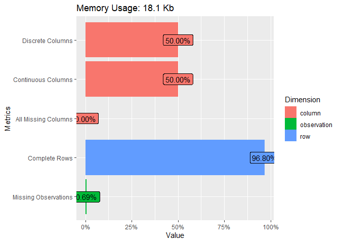
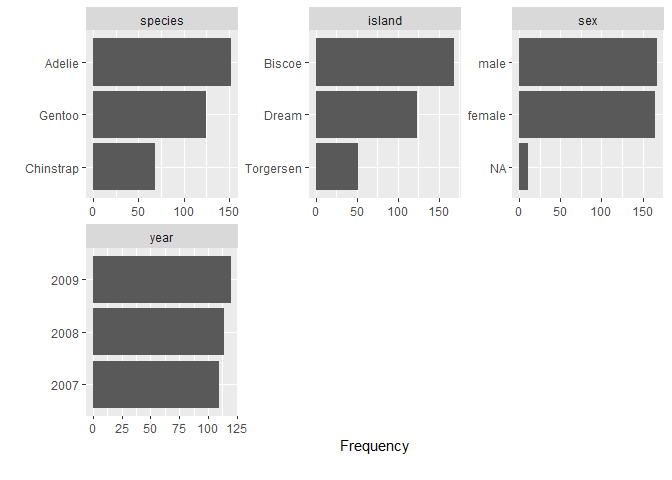
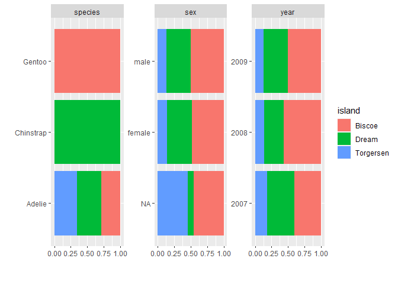
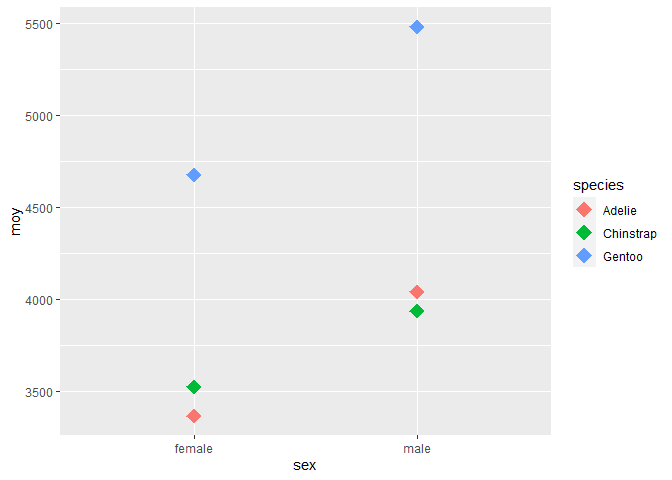

## Packages


```r
## data manipulation
suppressPackageStartupMessages(library(dplyr))
library(tidyr)
library(broom)

## dataset
library(palmerpenguins)
library(phyloseq)

## visualisation des donnees
suppressPackageStartupMessages(library(DataExplorer))
library(ggplot2)
```

<br>

**Raccourcis pour obtenir le pipe: `Ctrl + Alt + M`**

## Penguins dataset

**Chargement de l'objet penguins**


```r
data(penguins)
```

### Description de la table

 | Header           |Type     |   Description| 
 |:-----------------|:--------|:----------------| 
 |species		        |factor   |penguin species (Adélie, Chinstrap and Gentoo)|
 |island		        |factor   |island in Palmer Archipelago, Antarctica (Biscoe, Dream or Torgersen)|
 |bill_length_mm    |number   |bill length (millimeters)|
 |bill_depth_mm     |number   |bill depth (millimeters)|
 |flipper_length_mm |integer  |flipper length (millimeters)|
 |body_mass_g	      |integer  |body mass (grams)|
 |sex	 	            |factor   |penguin sex (female, male)|
 |year		          |integer  |the study year (2007, 2008, or 2009)|


### Objet de class tibble

C'est un data.frame au format tibble.  
L'affichage des colonnes s'adapte à la largeur de la fenêtre de sortie.  
Les dimensions de la table ainsi que le type de chaque colonne sont précisés.


```r
penguins
## # A tibble: 344 x 8
##    species island    bill_length_mm bill_depth_mm flipper_length_mm body_mass_g
##    <fct>   <fct>              <dbl>         <dbl>             <int>       <int>
##  1 Adelie  Torgersen           39.1          18.7               181        3750
##  2 Adelie  Torgersen           39.5          17.4               186        3800
##  3 Adelie  Torgersen           40.3          18                 195        3250
##  4 Adelie  Torgersen           NA            NA                  NA          NA
##  5 Adelie  Torgersen           36.7          19.3               193        3450
##  6 Adelie  Torgersen           39.3          20.6               190        3650
##  7 Adelie  Torgersen           38.9          17.8               181        3625
##  8 Adelie  Torgersen           39.2          19.6               195        4675
##  9 Adelie  Torgersen           34.1          18.1               193        3475
## 10 Adelie  Torgersen           42            20.2               190        4250
## # ... with 334 more rows, and 2 more variables: sex <fct>, year <int>
```

L'objet reste un data.frame mais avec les caractéristiques supplémentaires d'un objet de type tibble (tbl)  


```r
class(penguins)
## [1] "tbl_df"     "tbl"        "data.frame"
```

Conversion de la variable année en factor


```r
penguins$year <- factor(penguins$year)
```

### Exploration des données de la table


```r
DataExplorer::plot_intro(penguins)
```

<!-- -->

```r
DataExplorer::plot_bar(penguins)
```

<!-- -->

```r
DataExplorer::plot_bar(penguins, by = "island")
```

<!-- -->

## Fonction `filter()`

Sélection de lignes par des valeurs

**Sélectionne les lignes pour lesquelles le poids > 4000 g**


```r
penguins |> 
  filter(body_mass_g > 4000)
## # A tibble: 172 x 8
##    species island    bill_length_mm bill_depth_mm flipper_length_mm body_mass_g
##    <fct>   <fct>              <dbl>         <dbl>             <int>       <int>
##  1 Adelie  Torgersen           39.2          19.6               195        4675
##  2 Adelie  Torgersen           42            20.2               190        4250
##  3 Adelie  Torgersen           34.6          21.1               198        4400
##  4 Adelie  Torgersen           42.5          20.7               197        4500
##  5 Adelie  Torgersen           46            21.5               194        4200
##  6 Adelie  Dream               39.2          21.1               196        4150
##  7 Adelie  Dream               39.8          19.1               184        4650
##  8 Adelie  Dream               44.1          19.7               196        4400
##  9 Adelie  Dream               39.6          18.8               190        4600
## 10 Adelie  Dream               42.3          21.2               191        4150
## # ... with 162 more rows, and 2 more variables: sex <fct>, year <fct>
```

>**TIDYLOG**  

Le package `tidylog` permet d'afficher le résultat de chaque opération effectuée par la plupart des fonctions des package `dplyr` et `tidyr`.  
Peut éventuellement ralentir une opération.  


```r
suppressPackageStartupMessages(library(tidylog))
```

**Sélectionne les lignes correspondant aux males**


```r
penguins |> 
  filter(sex == "male")
## filter: removed 176 rows (51%), 168 rows remaining
## # A tibble: 168 x 8
##    species island    bill_length_mm bill_depth_mm flipper_length_mm body_mass_g
##    <fct>   <fct>              <dbl>         <dbl>             <int>       <int>
##  1 Adelie  Torgersen           39.1          18.7               181        3750
##  2 Adelie  Torgersen           39.3          20.6               190        3650
##  3 Adelie  Torgersen           39.2          19.6               195        4675
##  4 Adelie  Torgersen           38.6          21.2               191        3800
##  5 Adelie  Torgersen           34.6          21.1               198        4400
##  6 Adelie  Torgersen           42.5          20.7               197        4500
##  7 Adelie  Torgersen           46            21.5               194        4200
##  8 Adelie  Biscoe              37.7          18.7               180        3600
##  9 Adelie  Biscoe              38.2          18.1               185        3950
## 10 Adelie  Biscoe              38.8          17.2               180        3800
## # ... with 158 more rows, and 2 more variables: sex <fct>, year <fct>
```

**Sélectionne les lignes correspondant aux males pour un poids > 4000 gr**


```r
penguins |> 
  filter(sex == "male", body_mass_g > 4000)
## filter: removed 235 rows (68%), 109 rows remaining
## # A tibble: 109 x 8
##    species island    bill_length_mm bill_depth_mm flipper_length_mm body_mass_g
##    <fct>   <fct>              <dbl>         <dbl>             <int>       <int>
##  1 Adelie  Torgersen           39.2          19.6               195        4675
##  2 Adelie  Torgersen           34.6          21.1               198        4400
##  3 Adelie  Torgersen           42.5          20.7               197        4500
##  4 Adelie  Torgersen           46            21.5               194        4200
##  5 Adelie  Dream               39.2          21.1               196        4150
##  6 Adelie  Dream               39.8          19.1               184        4650
##  7 Adelie  Dream               44.1          19.7               196        4400
##  8 Adelie  Dream               39.6          18.8               190        4600
##  9 Adelie  Dream               42.3          21.2               191        4150
## 10 Adelie  Biscoe              40.1          18.9               188        4300
## # ... with 99 more rows, and 2 more variables: sex <fct>, year <fct>
penguins |> 
  filter(sex == "male" & body_mass_g > 4000)
## filter: removed 235 rows (68%), 109 rows remaining
## # A tibble: 109 x 8
##    species island    bill_length_mm bill_depth_mm flipper_length_mm body_mass_g
##    <fct>   <fct>              <dbl>         <dbl>             <int>       <int>
##  1 Adelie  Torgersen           39.2          19.6               195        4675
##  2 Adelie  Torgersen           34.6          21.1               198        4400
##  3 Adelie  Torgersen           42.5          20.7               197        4500
##  4 Adelie  Torgersen           46            21.5               194        4200
##  5 Adelie  Dream               39.2          21.1               196        4150
##  6 Adelie  Dream               39.8          19.1               184        4650
##  7 Adelie  Dream               44.1          19.7               196        4400
##  8 Adelie  Dream               39.6          18.8               190        4600
##  9 Adelie  Dream               42.3          21.2               191        4150
## 10 Adelie  Biscoe              40.1          18.9               188        4300
## # ... with 99 more rows, and 2 more variables: sex <fct>, year <fct>
```

**Sélectionne les poids compris entre 3500 et 4000 gr**


```r
penguins |> 
  filter(between(body_mass_g,  3500, 4500))
## filter: removed 188 rows (55%), 156 rows remaining
## # A tibble: 156 x 8
##    species island    bill_length_mm bill_depth_mm flipper_length_mm body_mass_g
##    <fct>   <fct>              <dbl>         <dbl>             <int>       <int>
##  1 Adelie  Torgersen           39.1          18.7               181        3750
##  2 Adelie  Torgersen           39.5          17.4               186        3800
##  3 Adelie  Torgersen           39.3          20.6               190        3650
##  4 Adelie  Torgersen           38.9          17.8               181        3625
##  5 Adelie  Torgersen           42            20.2               190        4250
##  6 Adelie  Torgersen           37.8          17.3               180        3700
##  7 Adelie  Torgersen           38.6          21.2               191        3800
##  8 Adelie  Torgersen           34.6          21.1               198        4400
##  9 Adelie  Torgersen           36.6          17.8               185        3700
## 10 Adelie  Torgersen           42.5          20.7               197        4500
## # ... with 146 more rows, and 2 more variables: sex <fct>, year <fct>
```

**Sélectionne les poids  < 3500 et > 4000 gr (utiliser ! devant between)**


```r
penguins |> 
  filter(!between(body_mass_g,  3500, 4500))
## filter: removed 158 rows (46%), 186 rows remaining
## # A tibble: 186 x 8
##    species island    bill_length_mm bill_depth_mm flipper_length_mm body_mass_g
##    <fct>   <fct>              <dbl>         <dbl>             <int>       <int>
##  1 Adelie  Torgersen           40.3          18                 195        3250
##  2 Adelie  Torgersen           36.7          19.3               193        3450
##  3 Adelie  Torgersen           39.2          19.6               195        4675
##  4 Adelie  Torgersen           34.1          18.1               193        3475
##  5 Adelie  Torgersen           37.8          17.1               186        3300
##  6 Adelie  Torgersen           41.1          17.6               182        3200
##  7 Adelie  Torgersen           38.7          19                 195        3450
##  8 Adelie  Torgersen           34.4          18.4               184        3325
##  9 Adelie  Biscoe              37.8          18.3               174        3400
## 10 Adelie  Biscoe              40.5          17.9               187        3200
## # ... with 176 more rows, and 2 more variables: sex <fct>, year <fct>
```

**Sélectionne les mesures faites dans les années 2007 et 2009**


```r
penguins |> 
  filter(year %in% c("2007", "2008"))
## filter: removed 120 rows (35%), 224 rows remaining
## # A tibble: 224 x 8
##    species island    bill_length_mm bill_depth_mm flipper_length_mm body_mass_g
##    <fct>   <fct>              <dbl>         <dbl>             <int>       <int>
##  1 Adelie  Torgersen           39.1          18.7               181        3750
##  2 Adelie  Torgersen           39.5          17.4               186        3800
##  3 Adelie  Torgersen           40.3          18                 195        3250
##  4 Adelie  Torgersen           NA            NA                  NA          NA
##  5 Adelie  Torgersen           36.7          19.3               193        3450
##  6 Adelie  Torgersen           39.3          20.6               190        3650
##  7 Adelie  Torgersen           38.9          17.8               181        3625
##  8 Adelie  Torgersen           39.2          19.6               195        4675
##  9 Adelie  Torgersen           34.1          18.1               193        3475
## 10 Adelie  Torgersen           42            20.2               190        4250
## # ... with 214 more rows, and 2 more variables: sex <fct>, year <fct>
```

**Sélectionne les poids > au poids moyen**


```r
penguins |> 
  filter(body_mass_g > mean(body_mass_g))
## filter: removed all rows (100%)
## # A tibble: 0 x 8
## # ... with 8 variables: species <fct>, island <fct>, bill_length_mm <dbl>,
## #   bill_depth_mm <dbl>, flipper_length_mm <int>, body_mass_g <int>, sex <fct>,
## #   year <fct>
```

<br>

> Pas de résultat
> ATTENTION: présence de NA's !


```r
penguins |> 
  filter(body_mass_g > mean(body_mass_g, na.rm = T))
## filter: removed 195 rows (57%), 149 rows remaining
## # A tibble: 149 x 8
##    species island    bill_length_mm bill_depth_mm flipper_length_mm body_mass_g
##    <fct>   <fct>              <dbl>         <dbl>             <int>       <int>
##  1 Adelie  Torgersen           39.2          19.6               195        4675
##  2 Adelie  Torgersen           42            20.2               190        4250
##  3 Adelie  Torgersen           34.6          21.1               198        4400
##  4 Adelie  Torgersen           42.5          20.7               197        4500
##  5 Adelie  Dream               39.8          19.1               184        4650
##  6 Adelie  Dream               44.1          19.7               196        4400
##  7 Adelie  Dream               39.6          18.8               190        4600
##  8 Adelie  Biscoe              40.1          18.9               188        4300
##  9 Adelie  Biscoe              41.3          21.1               195        4400
## 10 Adelie  Torgersen           41.8          19.4               198        4450
## # ... with 139 more rows, and 2 more variables: sex <fct>, year <fct>
```

<br>

> Pour la suite du script on supprime toutes les lignes avec au moins 1 NA


```r
penguins |> 
  na.omit() -> penguins
```


```r
penguins |> 
  filter(body_mass_g > mean(body_mass_g))
## filter: removed 188 rows (56%), 145 rows remaining
## # A tibble: 145 x 8
##    species island    bill_length_mm bill_depth_mm flipper_length_mm body_mass_g
##    <fct>   <fct>              <dbl>         <dbl>             <int>       <int>
##  1 Adelie  Torgersen           39.2          19.6               195        4675
##  2 Adelie  Torgersen           34.6          21.1               198        4400
##  3 Adelie  Torgersen           42.5          20.7               197        4500
##  4 Adelie  Dream               39.8          19.1               184        4650
##  5 Adelie  Dream               44.1          19.7               196        4400
##  6 Adelie  Dream               39.6          18.8               190        4600
##  7 Adelie  Biscoe              40.1          18.9               188        4300
##  8 Adelie  Biscoe              41.3          21.1               195        4400
##  9 Adelie  Torgersen           41.8          19.4               198        4450
## 10 Adelie  Torgersen           42.8          18.5               195        4250
## # ... with 135 more rows, and 2 more variables: sex <fct>, year <fct>
```

**Sélectionne les males de poids > au poids moyen (de tous les poips)**


```r
penguins |> 
  filter(body_mass_g > mean(body_mass_g)) |> 
  filter(sex == "male")
## filter: removed 188 rows (56%), 145 rows remaining
## filter: removed 53 rows (37%), 92 rows remaining
## # A tibble: 92 x 8
##    species island    bill_length_mm bill_depth_mm flipper_length_mm body_mass_g
##    <fct>   <fct>              <dbl>         <dbl>             <int>       <int>
##  1 Adelie  Torgersen           39.2          19.6               195        4675
##  2 Adelie  Torgersen           34.6          21.1               198        4400
##  3 Adelie  Torgersen           42.5          20.7               197        4500
##  4 Adelie  Dream               39.8          19.1               184        4650
##  5 Adelie  Dream               44.1          19.7               196        4400
##  6 Adelie  Dream               39.6          18.8               190        4600
##  7 Adelie  Biscoe              40.1          18.9               188        4300
##  8 Adelie  Biscoe              41.3          21.1               195        4400
##  9 Adelie  Torgersen           41.8          19.4               198        4450
## 10 Adelie  Torgersen           42.8          18.5               195        4250
## # ... with 82 more rows, and 2 more variables: sex <fct>, year <fct>
```

**Sélectionne les noms d'espèces avec la syllabe "de" dedans**  
(aucun intérêt, c'est pour l'exemple 🙂)


```r
penguins |> 
  filter(grepl("de", species))
## filter: removed 187 rows (56%), 146 rows remaining
## # A tibble: 146 x 8
##    species island    bill_length_mm bill_depth_mm flipper_length_mm body_mass_g
##    <fct>   <fct>              <dbl>         <dbl>             <int>       <int>
##  1 Adelie  Torgersen           39.1          18.7               181        3750
##  2 Adelie  Torgersen           39.5          17.4               186        3800
##  3 Adelie  Torgersen           40.3          18                 195        3250
##  4 Adelie  Torgersen           36.7          19.3               193        3450
##  5 Adelie  Torgersen           39.3          20.6               190        3650
##  6 Adelie  Torgersen           38.9          17.8               181        3625
##  7 Adelie  Torgersen           39.2          19.6               195        4675
##  8 Adelie  Torgersen           41.1          17.6               182        3200
##  9 Adelie  Torgersen           38.6          21.2               191        3800
## 10 Adelie  Torgersen           34.6          21.1               198        4400
## # ... with 136 more rows, and 2 more variables: sex <fct>, year <fct>
```

## Fonction `arrange()`

Appliquer un tri croissant sur une ou plusieurs colonnes

**Tri croissant par le poids**


```r
penguins |> 
  arrange(body_mass_g)
## # A tibble: 333 x 8
##    species   island    bill_length_mm bill_depth_mm flipper_length_~ body_mass_g
##    <fct>     <fct>              <dbl>         <dbl>            <int>       <int>
##  1 Chinstrap Dream               46.9          16.6              192        2700
##  2 Adelie    Biscoe              36.5          16.6              181        2850
##  3 Adelie    Biscoe              36.4          17.1              184        2850
##  4 Adelie    Biscoe              34.5          18.1              187        2900
##  5 Adelie    Dream               33.1          16.1              178        2900
##  6 Adelie    Torgersen           38.6          17                188        2900
##  7 Chinstrap Dream               43.2          16.6              187        2900
##  8 Adelie    Biscoe              37.9          18.6              193        2925
##  9 Adelie    Dream               37            16.9              185        3000
## 10 Adelie    Dream               37.3          16.8              192        3000
## # ... with 323 more rows, and 2 more variables: sex <fct>, year <fct>
```

**Tri décroissant par le poids**


```r
penguins |> 
  arrange(desc(body_mass_g))
## # A tibble: 333 x 8
##    species island bill_length_mm bill_depth_mm flipper_length_mm body_mass_g
##    <fct>   <fct>           <dbl>         <dbl>             <int>       <int>
##  1 Gentoo  Biscoe           49.2          15.2               221        6300
##  2 Gentoo  Biscoe           59.6          17                 230        6050
##  3 Gentoo  Biscoe           51.1          16.3               220        6000
##  4 Gentoo  Biscoe           48.8          16.2               222        6000
##  5 Gentoo  Biscoe           45.2          16.4               223        5950
##  6 Gentoo  Biscoe           49.8          15.9               229        5950
##  7 Gentoo  Biscoe           48.4          14.6               213        5850
##  8 Gentoo  Biscoe           49.3          15.7               217        5850
##  9 Gentoo  Biscoe           55.1          16                 230        5850
## 10 Gentoo  Biscoe           49.5          16.2               229        5800
## # ... with 323 more rows, and 2 more variables: sex <fct>, year <fct>
```

**Tri par espèce puis poids croissant (attention à l'ordre des variables)**


```r
penguins |> 
  arrange(species, body_mass_g)
## # A tibble: 333 x 8
##    species island    bill_length_mm bill_depth_mm flipper_length_mm body_mass_g
##    <fct>   <fct>              <dbl>         <dbl>             <int>       <int>
##  1 Adelie  Biscoe              36.5          16.6               181        2850
##  2 Adelie  Biscoe              36.4          17.1               184        2850
##  3 Adelie  Biscoe              34.5          18.1               187        2900
##  4 Adelie  Dream               33.1          16.1               178        2900
##  5 Adelie  Torgersen           38.6          17                 188        2900
##  6 Adelie  Biscoe              37.9          18.6               193        2925
##  7 Adelie  Dream               37            16.9               185        3000
##  8 Adelie  Dream               37.3          16.8               192        3000
##  9 Adelie  Torgersen           35.9          16.6               190        3050
## 10 Adelie  Torgersen           35.2          15.9               186        3050
## # ... with 323 more rows, and 2 more variables: sex <fct>, year <fct>
```

<br>

> Lors du tri les NA's sont rajoutés à la fin

## Fonction `select()`

Sélectionne des colonnes par leurs noms  

**Sélectionne la variable species**


```r
penguins |> 
  select(species)
## select: dropped 7 variables (island, bill_length_mm, bill_depth_mm, flipper_length_mm, body_mass_g, …)
## # A tibble: 333 x 1
##    species
##    <fct>  
##  1 Adelie 
##  2 Adelie 
##  3 Adelie 
##  4 Adelie 
##  5 Adelie 
##  6 Adelie 
##  7 Adelie 
##  8 Adelie 
##  9 Adelie 
## 10 Adelie 
## # ... with 323 more rows
```

> ATTENTION: le résultat est toujours un data.frame
> même s'il n'y a qu'une seule colonne


```r
penguins |> 
  select(species) |> 
  dim()
## select: dropped 7 variables (island, bill_length_mm, bill_depth_mm, flipper_length_mm, body_mass_g, …)
## [1] 333   1
```

**La fonction `pull()` permet d'extraire une colonne et de la convertir en vecteur**


```r
penguins |> 
  select(species) |> 
  pull()
```

```
## select: dropped 7 variables (island, bill_length_mm, bill_depth_mm, flipper_length_mm, body_mass_g, …)
```

```{.scroll-300}
##   [1] Adelie    Adelie    Adelie    Adelie    Adelie    Adelie    Adelie   
##   [8] Adelie    Adelie    Adelie    Adelie    Adelie    Adelie    Adelie   
##  [15] Adelie    Adelie    Adelie    Adelie    Adelie    Adelie    Adelie   
##  [22] Adelie    Adelie    Adelie    Adelie    Adelie    Adelie    Adelie   
##  [29] Adelie    Adelie    Adelie    Adelie    Adelie    Adelie    Adelie   
##  [36] Adelie    Adelie    Adelie    Adelie    Adelie    Adelie    Adelie   
##  [43] Adelie    Adelie    Adelie    Adelie    Adelie    Adelie    Adelie   
##  [50] Adelie    Adelie    Adelie    Adelie    Adelie    Adelie    Adelie   
##  [57] Adelie    Adelie    Adelie    Adelie    Adelie    Adelie    Adelie   
##  [64] Adelie    Adelie    Adelie    Adelie    Adelie    Adelie    Adelie   
##  [71] Adelie    Adelie    Adelie    Adelie    Adelie    Adelie    Adelie   
##  [78] Adelie    Adelie    Adelie    Adelie    Adelie    Adelie    Adelie   
##  [85] Adelie    Adelie    Adelie    Adelie    Adelie    Adelie    Adelie   
##  [92] Adelie    Adelie    Adelie    Adelie    Adelie    Adelie    Adelie   
##  [99] Adelie    Adelie    Adelie    Adelie    Adelie    Adelie    Adelie   
## [106] Adelie    Adelie    Adelie    Adelie    Adelie    Adelie    Adelie   
## [113] Adelie    Adelie    Adelie    Adelie    Adelie    Adelie    Adelie   
## [120] Adelie    Adelie    Adelie    Adelie    Adelie    Adelie    Adelie   
## [127] Adelie    Adelie    Adelie    Adelie    Adelie    Adelie    Adelie   
## [134] Adelie    Adelie    Adelie    Adelie    Adelie    Adelie    Adelie   
## [141] Adelie    Adelie    Adelie    Adelie    Adelie    Adelie    Gentoo   
## [148] Gentoo    Gentoo    Gentoo    Gentoo    Gentoo    Gentoo    Gentoo   
## [155] Gentoo    Gentoo    Gentoo    Gentoo    Gentoo    Gentoo    Gentoo   
## [162] Gentoo    Gentoo    Gentoo    Gentoo    Gentoo    Gentoo    Gentoo   
## [169] Gentoo    Gentoo    Gentoo    Gentoo    Gentoo    Gentoo    Gentoo   
## [176] Gentoo    Gentoo    Gentoo    Gentoo    Gentoo    Gentoo    Gentoo   
## [183] Gentoo    Gentoo    Gentoo    Gentoo    Gentoo    Gentoo    Gentoo   
## [190] Gentoo    Gentoo    Gentoo    Gentoo    Gentoo    Gentoo    Gentoo   
## [197] Gentoo    Gentoo    Gentoo    Gentoo    Gentoo    Gentoo    Gentoo   
## [204] Gentoo    Gentoo    Gentoo    Gentoo    Gentoo    Gentoo    Gentoo   
## [211] Gentoo    Gentoo    Gentoo    Gentoo    Gentoo    Gentoo    Gentoo   
## [218] Gentoo    Gentoo    Gentoo    Gentoo    Gentoo    Gentoo    Gentoo   
## [225] Gentoo    Gentoo    Gentoo    Gentoo    Gentoo    Gentoo    Gentoo   
## [232] Gentoo    Gentoo    Gentoo    Gentoo    Gentoo    Gentoo    Gentoo   
## [239] Gentoo    Gentoo    Gentoo    Gentoo    Gentoo    Gentoo    Gentoo   
## [246] Gentoo    Gentoo    Gentoo    Gentoo    Gentoo    Gentoo    Gentoo   
## [253] Gentoo    Gentoo    Gentoo    Gentoo    Gentoo    Gentoo    Gentoo   
## [260] Gentoo    Gentoo    Gentoo    Gentoo    Gentoo    Gentoo    Chinstrap
## [267] Chinstrap Chinstrap Chinstrap Chinstrap Chinstrap Chinstrap Chinstrap
## [274] Chinstrap Chinstrap Chinstrap Chinstrap Chinstrap Chinstrap Chinstrap
## [281] Chinstrap Chinstrap Chinstrap Chinstrap Chinstrap Chinstrap Chinstrap
## [288] Chinstrap Chinstrap Chinstrap Chinstrap Chinstrap Chinstrap Chinstrap
## [295] Chinstrap Chinstrap Chinstrap Chinstrap Chinstrap Chinstrap Chinstrap
## [302] Chinstrap Chinstrap Chinstrap Chinstrap Chinstrap Chinstrap Chinstrap
## [309] Chinstrap Chinstrap Chinstrap Chinstrap Chinstrap Chinstrap Chinstrap
## [316] Chinstrap Chinstrap Chinstrap Chinstrap Chinstrap Chinstrap Chinstrap
## [323] Chinstrap Chinstrap Chinstrap Chinstrap Chinstrap Chinstrap Chinstrap
## [330] Chinstrap Chinstrap Chinstrap Chinstrap
## Levels: Adelie Chinstrap Gentoo
```

**Sélectionne les variables species et body_mass_g**


```r
penguins |> 
  select(species, body_mass_g)
## select: dropped 6 variables (island, bill_length_mm, bill_depth_mm, flipper_length_mm, sex, …)
## # A tibble: 333 x 2
##    species body_mass_g
##    <fct>         <int>
##  1 Adelie         3750
##  2 Adelie         3800
##  3 Adelie         3250
##  4 Adelie         3450
##  5 Adelie         3650
##  6 Adelie         3625
##  7 Adelie         4675
##  8 Adelie         3200
##  9 Adelie         3800
## 10 Adelie         4400
## # ... with 323 more rows
```

**Sélection des 3 premières colonnes**


```r
penguins |> 
  select(1:3)
## select: dropped 5 variables (bill_depth_mm, flipper_length_mm, body_mass_g, sex, year)
## # A tibble: 333 x 3
##    species island    bill_length_mm
##    <fct>   <fct>              <dbl>
##  1 Adelie  Torgersen           39.1
##  2 Adelie  Torgersen           39.5
##  3 Adelie  Torgersen           40.3
##  4 Adelie  Torgersen           36.7
##  5 Adelie  Torgersen           39.3
##  6 Adelie  Torgersen           38.9
##  7 Adelie  Torgersen           39.2
##  8 Adelie  Torgersen           41.1
##  9 Adelie  Torgersen           38.6
## 10 Adelie  Torgersen           34.6
## # ... with 323 more rows
```

**Enlève la première colonne**


```r
penguins |> 
  select(-1)
## select: dropped one variable (species)
## # A tibble: 333 x 7
##    island  bill_length_mm bill_depth_mm flipper_length_~ body_mass_g sex   year 
##    <fct>            <dbl>         <dbl>            <int>       <int> <fct> <fct>
##  1 Torger~           39.1          18.7              181        3750 male  2007 
##  2 Torger~           39.5          17.4              186        3800 fema~ 2007 
##  3 Torger~           40.3          18                195        3250 fema~ 2007 
##  4 Torger~           36.7          19.3              193        3450 fema~ 2007 
##  5 Torger~           39.3          20.6              190        3650 male  2007 
##  6 Torger~           38.9          17.8              181        3625 fema~ 2007 
##  7 Torger~           39.2          19.6              195        4675 male  2007 
##  8 Torger~           41.1          17.6              182        3200 fema~ 2007 
##  9 Torger~           38.6          21.2              191        3800 male  2007 
## 10 Torger~           34.6          21.1              198        4400 male  2007 
## # ... with 323 more rows
```

**Enlève les variables "sex" et "island"**


```r
penguins |> 
  select(-sex, -island)
## select: dropped 2 variables (island, sex)
## # A tibble: 333 x 6
##    species bill_length_mm bill_depth_mm flipper_length_mm body_mass_g year 
##    <fct>            <dbl>         <dbl>             <int>       <int> <fct>
##  1 Adelie            39.1          18.7               181        3750 2007 
##  2 Adelie            39.5          17.4               186        3800 2007 
##  3 Adelie            40.3          18                 195        3250 2007 
##  4 Adelie            36.7          19.3               193        3450 2007 
##  5 Adelie            39.3          20.6               190        3650 2007 
##  6 Adelie            38.9          17.8               181        3625 2007 
##  7 Adelie            39.2          19.6               195        4675 2007 
##  8 Adelie            41.1          17.6               182        3200 2007 
##  9 Adelie            38.6          21.2               191        3800 2007 
## 10 Adelie            34.6          21.1               198        4400 2007 
## # ... with 323 more rows
```

**Sélectionne les colonnes de classe numeric**


```r
penguins |> 
  select(where(is.numeric))
## select: dropped 4 variables (species, island, sex, year)
## # A tibble: 333 x 4
##    bill_length_mm bill_depth_mm flipper_length_mm body_mass_g
##             <dbl>         <dbl>             <int>       <int>
##  1           39.1          18.7               181        3750
##  2           39.5          17.4               186        3800
##  3           40.3          18                 195        3250
##  4           36.7          19.3               193        3450
##  5           39.3          20.6               190        3650
##  6           38.9          17.8               181        3625
##  7           39.2          19.6               195        4675
##  8           41.1          17.6               182        3200
##  9           38.6          21.2               191        3800
## 10           34.6          21.1               198        4400
## # ... with 323 more rows
```

> La variable `year` est de type numeric, conversion en factor


```r
penguins$year <- factor(penguins$year)
```


**Sélectionne les colonnes de classe factor**


```r
penguins |> 
  select(where(is.factor))
## select: dropped 4 variables (bill_length_mm, bill_depth_mm, flipper_length_mm, body_mass_g)
## # A tibble: 333 x 4
##    species island    sex    year 
##    <fct>   <fct>     <fct>  <fct>
##  1 Adelie  Torgersen male   2007 
##  2 Adelie  Torgersen female 2007 
##  3 Adelie  Torgersen female 2007 
##  4 Adelie  Torgersen female 2007 
##  5 Adelie  Torgersen male   2007 
##  6 Adelie  Torgersen female 2007 
##  7 Adelie  Torgersen male   2007 
##  8 Adelie  Torgersen female 2007 
##  9 Adelie  Torgersen male   2007 
## 10 Adelie  Torgersen male   2007 
## # ... with 323 more rows
```

**Sélectionne les mesures de bec**


```r
penguins |> 
  select(starts_with("bill"))
## select: dropped 6 variables (species, island, flipper_length_mm, body_mass_g, sex, …)
## # A tibble: 333 x 2
##    bill_length_mm bill_depth_mm
##             <dbl>         <dbl>
##  1           39.1          18.7
##  2           39.5          17.4
##  3           40.3          18  
##  4           36.7          19.3
##  5           39.3          20.6
##  6           38.9          17.8
##  7           39.2          19.6
##  8           41.1          17.6
##  9           38.6          21.2
## 10           34.6          21.1
## # ... with 323 more rows
```

**Sélectionne les mesures en mm**


```r
penguins |> 
  select(ends_with("mm"))
## select: dropped 5 variables (species, island, body_mass_g, sex, year)
## # A tibble: 333 x 3
##    bill_length_mm bill_depth_mm flipper_length_mm
##             <dbl>         <dbl>             <int>
##  1           39.1          18.7               181
##  2           39.5          17.4               186
##  3           40.3          18                 195
##  4           36.7          19.3               193
##  5           39.3          20.6               190
##  6           38.9          17.8               181
##  7           39.2          19.6               195
##  8           41.1          17.6               182
##  9           38.6          21.2               191
## 10           34.6          21.1               198
## # ... with 323 more rows
```

**Sélectionne les mesures de longueurs**


```r
penguins |> 
  select(contains("length"))
## select: dropped 6 variables (species, island, bill_depth_mm, body_mass_g, sex, …)
## # A tibble: 333 x 2
##    bill_length_mm flipper_length_mm
##             <dbl>             <int>
##  1           39.1               181
##  2           39.5               186
##  3           40.3               195
##  4           36.7               193
##  5           39.3               190
##  6           38.9               181
##  7           39.2               195
##  8           41.1               182
##  9           38.6               191
## 10           34.6               198
## # ... with 323 more rows
```

## Fonction `summarise()` + `group_by()`

`Summarise`: Résume une ou plusieurs colonnes en une ou plusieurs valeurs en utilisant des fonctions  

`Group_by`: Permet d'appliquer une ou plusieurs fonctions à un data.frame fractionné en groupes  

**Calcule le poids moyen de tous les pingouins**  


```r
penguins |> 
  summarise(moy = mean(body_mass_g))
## summarise: now one row and one column, ungrouped
## # A tibble: 1 x 1
##     moy
##   <dbl>
## 1 4207.
```

> Par défaut les objets tibble sont affichés avec 3 chiffres significatifs


```r
tibble(x = c(1.2345, 12.345, 123.45, 1234.5, 12345))
## # A tibble: 5 x 1
##          x
##      <dbl>
## 1     1.23
## 2    12.3 
## 3   123.  
## 4  1234.  
## 5 12345
```

> Pour afficher plus de chiffres, notamment après la virgule il faut paramétrer l'option `pillar.sigfig`


```r
options(pillar.sigfig = 6)
tibble(x = c(1.2345, 12.34, 123.45, 1234.5, 12345))
## # A tibble: 5 x 1
##            x
##        <dbl>
## 1     1.2345
## 2    12.34  
## 3   123.45  
## 4  1234.5   
## 5 12345
```


```r
penguins |> 
  summarise(moy = mean(body_mass_g))
## summarise: now one row and one column, ungrouped
## # A tibble: 1 x 1
##       moy
##     <dbl>
## 1 4207.06
```

**Calcule le poids moyen au sein de chaque espèce**


```r
penguins |>
  group_by(species) |> 
  summarise(moy = mean(body_mass_g))
## group_by: one grouping variable (species)
## summarise: now 3 rows and 2 columns, ungrouped
## # A tibble: 3 x 2
##   species       moy
##   <fct>       <dbl>
## 1 Adelie    3706.16
## 2 Chinstrap 3733.09
## 3 Gentoo    5092.44
```

**Calcule le poids moyen au sein de chaque espèce et pas sexe**


```r
penguins |>
  group_by(species, sex) |> 
  summarise(moy = mean(body_mass_g))
## group_by: 2 grouping variables (species, sex)
## summarise: now 6 rows and 3 columns, one group variable remaining (species)
## # A tibble: 6 x 3
## # Groups:   species [3]
##   species   sex        moy
##   <fct>     <fct>    <dbl>
## 1 Adelie    female 3368.84
## 2 Adelie    male   4043.49
## 3 Chinstrap female 3527.21
## 4 Chinstrap male   3938.97
## 5 Gentoo    female 4679.74
## 6 Gentoo    male   5484.84
```

> La table résultat au format long est pratique pour enchainer sur un graphe
> En revanche pour présenter les résultats on privilégiera un format plus "large"  
> On utilise les fonctions `pivot_longeur` et `pivot_wider` pour passer d'une configuration à l'autre

**Crée une colonne par sexe**


```r
penguins |>
  group_by(species, sex) |> 
  summarise(moy = mean(body_mass_g)) |> 
  pivot_wider(names_from = sex,
              values_from = moy)
## group_by: 2 grouping variables (species, sex)
## summarise: now 6 rows and 3 columns, one group variable remaining (species)
## pivot_wider: reorganized (sex, moy) into (female, male) [was 6x3, now 3x3]
## # A tibble: 3 x 3
## # Groups:   species [3]
##   species    female    male
##   <fct>       <dbl>   <dbl>
## 1 Adelie    3368.84 4043.49
## 2 Chinstrap 3527.21 3938.97
## 3 Gentoo    4679.74 5484.84
```

**Calcule le poids moyen et l'écart-type au sein de chaque espèce et pas sexe**


```r
penguins |>
  group_by(species, sex) |> 
  summarise(moy = mean(body_mass_g),
            sd = sd(body_mass_g)) |> 
  pivot_wider(names_from = sex,
              values_from = c(moy, sd))
## group_by: 2 grouping variables (species, sex)
## summarise: now 6 rows and 4 columns, one group variable remaining (species)
## pivot_wider: reorganized (sex, moy, sd) into (moy_female, moy_male, sd_female, sd_male) [was 6x4, now 3x5]
## # A tibble: 3 x 5
## # Groups:   species [3]
##   species   moy_female moy_male sd_female sd_male
##   <fct>          <dbl>    <dbl>     <dbl>   <dbl>
## 1 Adelie       3368.84  4043.49   269.380 346.812
## 2 Chinstrap    3527.21  3938.97   285.334 362.138
## 3 Gentoo       4679.74  5484.84   281.578 313.159
```

> Par défaut l'intitulé de chaque colonne est constitué de la fonction puis du groupe  
> On peut personnaliser cette sortie avec le paramètre `names_glue`  
> Ce paramètre suit la synthaxe du package glue (https://github.com/tidyverse/glue)


```r
penguins |>
  group_by(species, sex) |> 
  summarise(moy = mean(body_mass_g),
            sd = sd(body_mass_g)) |> 
  pivot_wider(names_from = sex,
              values_from = c(moy, sd),
              names_glue = "{sex}_of_{.value}")
## group_by: 2 grouping variables (species, sex)
## summarise: now 6 rows and 4 columns, one group variable remaining (species)
## pivot_wider: reorganized (sex, moy, sd) into (female_of_moy, male_of_moy, female_of_sd, male_of_sd) [was 6x4, now 3x5]
## # A tibble: 3 x 5
## # Groups:   species [3]
##   species   female_of_moy male_of_moy female_of_sd male_of_sd
##   <fct>             <dbl>       <dbl>        <dbl>      <dbl>
## 1 Adelie          3368.84     4043.49      269.380    346.812
## 2 Chinstrap       3527.21     3938.97      285.334    362.138
## 3 Gentoo          4679.74     5484.84      281.578    313.159
```

**Plot des poids moyen par sexe et par espèces**


```r
penguins |> 
  group_by(species, sex) |> 
  summarise(moy = mean(body_mass_g)) |>
  ggplot(aes(x = sex,
             y = moy,
             colour = species)) +
  geom_point(shape = 18,
              size = 5)
## group_by: 2 grouping variables (species, sex)
## summarise: now 6 rows and 3 columns, one group variable remaining (species)
```

<!-- -->

> Pour rendre le script moins chargé on peut créer une fonction pour calculer plusieurs descripteurs

**Fonction pour le calcul de plusieurs descripteurs**


```r
fct_descr <- function(x)
{
  data.frame(min = min(x),
             moy = mean(x),
             sd = sd(x),
             max = max(x))
}
```

**Application de la fonction**


```r
penguins |> 
  group_by(species, sex) |> 
  summarise(fct_descr(body_mass_g))
## group_by: 2 grouping variables (species, sex)
## summarise: now 6 rows and 6 columns, one group variable remaining (species)
## # A tibble: 6 x 6
## # Groups:   species [3]
##   species   sex      min     moy      sd   max
##   <fct>     <fct>  <int>   <dbl>   <dbl> <int>
## 1 Adelie    female  2850 3368.84 269.380  3900
## 2 Adelie    male    3325 4043.49 346.812  4775
## 3 Chinstrap female  2700 3527.21 285.334  4150
## 4 Chinstrap male    3250 3938.97 362.138  4800
## 5 Gentoo    female  3950 4679.74 281.578  5200
## 6 Gentoo    male    4750 5484.84 313.159  6300
```

> On peut utiliser des fonctions plus complexes mais attention au format de sortie


```r
penguins |> 
  group_by(island) |> 
  summarise(lm(bill_length_mm ~ sex))
## group_by: one grouping variable (island)
## Error: Problem with `summarise()` input `..1`.
## i `..1 = lm(bill_length_mm ~ sex)`.
## x `..1` must be a vector, not a `lm` object.
## i The error occurred in group 1: island = Biscoe.
```

> Le format de sortie doit être un data.frame  
> On utilise la fonction `tidy()` du package broom pour récupérer un data.frame en sortie


```r
penguins |> 
  group_by(island) |> 
  summarise(broom::tidy(lm(bill_length_mm ~ sex)))
## group_by: one grouping variable (island)
## summarise: now 6 rows and 6 columns, one group variable remaining (island)
## # A tibble: 6 x 6
## # Groups:   island [3]
##   island    term        estimate std.error statistic      p.value
##   <fct>     <chr>          <dbl>     <dbl>     <dbl>        <dbl>
## 1 Biscoe    (Intercept) 43.3075   0.497135  87.1142  2.30996e-137
## 2 Biscoe    sexmale      3.81178  0.696673   5.47140 1.67825e-  7
## 3 Dream     (Intercept) 42.2967   0.723753  58.4408  1.54225e- 90
## 4 Dream     sexmale      3.81941  1.01941    3.74670 2.75920e-  4
## 5 Torgersen (Intercept) 37.5542   0.539003  69.6734  1.75359e- 47
## 6 Torgersen sexmale      3.03279  0.770506   3.93610 2.84405e-  4
```

**On enlève les intercept**


```r
penguins |> 
  group_by(island) |> 
  summarise(broom::tidy(lm(bill_length_mm ~ sex))) |> 
  filter(!grepl("Inter", term))
## group_by: one grouping variable (island)
## summarise: now 6 rows and 6 columns, one group variable remaining (island)
## filter (grouped): removed 3 rows (50%), 3 rows remaining
## # A tibble: 3 x 6
## # Groups:   island [3]
##   island    term    estimate std.error statistic    p.value
##   <fct>     <chr>      <dbl>     <dbl>     <dbl>      <dbl>
## 1 Biscoe    sexmale  3.81178  0.696673   5.47140 1.67825e-7
## 2 Dream     sexmale  3.81941  1.01941    3.74670 2.75920e-4
## 3 Torgersen sexmale  3.03279  0.770506   3.93610 2.84405e-4
```


## Fonction `ACROSS()`

Applique une même transformation à plusieurs colonnes à la fois, elle remplace les fonctions `summarise_at()`, `summarise_if()`, `summarise_all()`

**Calcule les effectifs, moyenne et écart-type de toutes les variables numériques par espèce**


```r
penguins |> 
  group_by(species) |> 
  summarise(across(where(is.numeric), list(length, mean, sd)))
## group_by: one grouping variable (species)
## summarise: now 3 rows and 13 columns, ungrouped
## # A tibble: 3 x 13
##   species   bill_length_mm_1 bill_length_mm_2 bill_length_mm_3 bill_depth_mm_1
##   <fct>                <int>            <dbl>            <dbl>           <int>
## 1 Adelie                 146          38.8240          2.66260             146
## 2 Chinstrap               68          48.8338          3.33926              68
## 3 Gentoo                 119          47.5681          3.10612             119
## # ... with 8 more variables: bill_depth_mm_2 <dbl>, bill_depth_mm_3 <dbl>,
## #   flipper_length_mm_1 <int>, flipper_length_mm_2 <dbl>,
## #   flipper_length_mm_3 <dbl>, body_mass_g_1 <int>, body_mass_g_2 <dbl>,
## #   body_mass_g_3 <dbl>
```

**Donner un nom aux fonctions pour les identifier dans le tableau résultat**


```r
penguins |> 
  group_by(species) |> 
  summarise(across(where(is.numeric), list(count = length, 
                                           moy = mean, 
                                           sd = sd)))
## group_by: one grouping variable (species)
## summarise: now 3 rows and 13 columns, ungrouped
## # A tibble: 3 x 13
##   species   bill_length_mm_c~ bill_length_mm_~ bill_length_mm_~ bill_depth_mm_c~
##   <fct>                 <int>            <dbl>            <dbl>            <int>
## 1 Adelie                  146          38.8240          2.66260              146
## 2 Chinstrap                68          48.8338          3.33926               68
## 3 Gentoo                  119          47.5681          3.10612              119
## # ... with 8 more variables: bill_depth_mm_moy <dbl>, bill_depth_mm_sd <dbl>,
## #   flipper_length_mm_count <int>, flipper_length_mm_moy <dbl>,
## #   flipper_length_mm_sd <dbl>, body_mass_g_count <int>, body_mass_g_moy <dbl>,
## #   body_mass_g_sd <dbl>
```

**Calcul de la SEM**

Fonction de calcul de la SEM


```r
sem <- function(x)
{
  sd(x)/sqrt(length(x))
}
```

**Calcul des descripteurs et de la SEM en regroupant par espèce et sexe**


```r
penguins |> 
  group_by(species, sex) |> 
  summarise(across(where(is.numeric), list(count = length,
                                           moy = mean,
                                           sd = sd,
                                           SEM = sem)))
## group_by: 2 grouping variables (species, sex)
## summarise: now 6 rows and 18 columns, one group variable remaining (species)
## # A tibble: 6 x 18
## # Groups:   species [3]
##   species   sex    bill_length_mm_count bill_length_mm_moy bill_length_mm_sd
##   <fct>     <fct>                 <int>              <dbl>             <dbl>
## 1 Adelie    female                   73            37.2575           2.02888
## 2 Adelie    male                     73            40.3904           2.27713
## 3 Chinstrap female                   34            46.5735           3.10867
## 4 Chinstrap male                     34            51.0941           1.56456
## 5 Gentoo    female                   58            45.5638           2.05125
## 6 Gentoo    male                     61            49.4738           2.72059
## # ... with 13 more variables: bill_length_mm_SEM <dbl>,
## #   bill_depth_mm_count <int>, bill_depth_mm_moy <dbl>, bill_depth_mm_sd <dbl>,
## #   bill_depth_mm_SEM <dbl>, flipper_length_mm_count <int>,
## #   flipper_length_mm_moy <dbl>, flipper_length_mm_sd <dbl>,
## #   flipper_length_mm_SEM <dbl>, body_mass_g_count <int>,
## #   body_mass_g_moy <dbl>, body_mass_g_sd <dbl>, body_mass_g_SEM <dbl>
```

## Application à un objet Phyloseq

**Récupération de l'objet**


```r
con <- url("https://forgemia.inra.fr/lcauquil/16s/-/raw/main/data/16S_phyloseq.rdata")
load(file = con)
```

**L'objet data est un objet de classe phyloseq**


```r
data
## phyloseq-class experiment-level object
## otu_table()   OTU Table:         [ 498 taxa and 64 samples ]
## sample_data() Sample Data:       [ 64 samples by 4 sample variables ]
## tax_table()   Taxonomy Table:    [ 498 taxa by 7 taxonomic ranks ]
## phy_tree()    Phylogenetic Tree: [ 498 tips and 497 internal nodes ]
```

**Transformation en data.frame avec la fonction `ps_melt()` du package phyloseq**


```r
df <- psmelt(data)
df
```

```{.scroll-300}
##               OTU     Sample Abundance        EnvType Description FoodType
## 7126    Cluster_2 MVT0.LOT10      6784 PoultrySausage       LOT10     Meat
## 6       Cluster_1 VHT0.LOT08      6740     GroundVeal        LOT8     Meat
## 14145   Cluster_3 SFT0.LOT01      6695   SmokedSalmon        LOT1  Seafood
## 13      Cluster_1 VHT0.LOT01      6607     GroundVeal        LOT1     Meat
## 60      Cluster_1 DLT0.LOT03      6389     DicedBacon        LOT3     Meat
## 54      Cluster_1 VHT0.LOT07      5983     GroundVeal        LOT7     Meat
## 14      Cluster_1 DLT0.LOT01      5958     DicedBacon        LOT1     Meat
## 14160   Cluster_3 SFT0.LOT07      5909   SmokedSalmon        LOT7  Seafood
## 29770   Cluster_7 FCT0.LOT03      5866      CodFillet        LOT3  Seafood
## 31171   Cluster_9 CDT0.LOT02      5795   CookedShrimp        LOT2  Seafood
## 30486   Cluster_8 CDT0.LOT07      5607   CookedShrimp        LOT7  Seafood
## 31194   Cluster_9 CDT0.LOT08      5512   CookedShrimp        LOT8  Seafood
## 24      Cluster_1 DLT0.LOT08      5240     DicedBacon        LOT8     Meat
## 29790   Cluster_7 FCT0.LOT07      4944      CodFillet        LOT7  Seafood
## 7118    Cluster_2 MVT0.LOT09      4756 PoultrySausage        LOT9     Meat
## 29792   Cluster_7 FCT0.LOT05      4470      CodFillet        LOT5  Seafood
## 14155   Cluster_3 SFT0.LOT06      4450   SmokedSalmon        LOT6  Seafood
## 57      Cluster_1 DLT0.LOT05      4312     DicedBacon        LOT5     Meat
## 52      Cluster_1 DLT0.LOT06      4095     DicedBacon        LOT6     Meat
## 14179   Cluster_3 SFT0.LOT08      3987   SmokedSalmon        LOT8  Seafood
## 7166    Cluster_2 SFT0.LOT05      3845   SmokedSalmon        LOT5  Seafood
## 55      Cluster_1 VHT0.LOT04      3796     GroundVeal        LOT4     Meat
## 30477   Cluster_8 CDT0.LOT10      3439   CookedShrimp       LOT10  Seafood
## 104    Cluster_10 MVT0.LOT03      3434 PoultrySausage        LOT3     Meat
## 7155    Cluster_2 MVT0.LOT01      3291 PoultrySausage        LOT1     Meat
## 28221   Cluster_5 FST0.LOT01      3265   SalmonFillet        LOT1  Seafood
## 7121    Cluster_2 MVT0.LOT03      3205 PoultrySausage        LOT3     Meat
## 47      Cluster_1 VHT0.LOT10      3169     GroundVeal       LOT10     Meat
## 28168   Cluster_5 FST0.LOT10      3127   SalmonFillet       LOT10  Seafood
## 22      Cluster_1 VHT0.LOT02      3098     GroundVeal        LOT2     Meat
## 108    Cluster_10 MVT0.LOT01      3081 PoultrySausage        LOT1     Meat
## 28165   Cluster_5 FST0.LOT08      3067   SalmonFillet        LOT8  Seafood
## 829    Cluster_11 VHT0.LOT02      3057     GroundVeal        LOT2     Meat
## 1495   Cluster_12 SFT0.LOT06      2876   SmokedSalmon        LOT6  Seafood
## 14204   Cluster_3 FST0.LOT06      2820   SalmonFillet        LOT6  Seafood
## 7140    Cluster_2 SFT0.LOT04      2792   SmokedSalmon        LOT4  Seafood
## 7138    Cluster_2 SFT0.LOT02      2769   SmokedSalmon        LOT2  Seafood
## 23      Cluster_1 BHT0.LOT10      2621     GroundBeef       LOT10     Meat
## 29012   Cluster_6 BHT0.LOT06      2597     GroundBeef        LOT6     Meat
## 12737  Cluster_28 BHT0.LOT04      2574     GroundBeef        LOT4     Meat
## 30491   Cluster_8 CDT0.LOT02      2532   CookedShrimp        LOT2  Seafood
## 9340   Cluster_23 CDT0.LOT10      2531   CookedShrimp       LOT10  Seafood
## 49      Cluster_1 FST0.LOT07      2474   SalmonFillet        LOT7  Seafood
## 29047   Cluster_6 BHT0.LOT01      2407     GroundBeef        LOT1     Meat
## 63      Cluster_1 DLT0.LOT10      2368     DicedBacon       LOT10     Meat
## 797    Cluster_11 BHT0.LOT07      2342     GroundBeef        LOT7     Meat
## 10043  Cluster_24 CDT0.LOT07      2340   CookedShrimp        LOT7  Seafood
## 64      Cluster_1 SFT0.LOT03      2330   SmokedSalmon        LOT3  Seafood
## 28191   Cluster_5 FST0.LOT07      2284   SalmonFillet        LOT7  Seafood
## 21234   Cluster_4 FST0.LOT06      2271   SalmonFillet        LOT6  Seafood
## 29054   Cluster_6 BHT0.LOT05      2231     GroundBeef        LOT5     Meat
## 29025   Cluster_6 BHT0.LOT07      2218     GroundBeef        LOT7     Meat
## 46      Cluster_1 VHT0.LOT06      2010     GroundVeal        LOT6     Meat
## 7900   Cluster_21 FCT0.LOT01      1995      CodFillet        LOT1  Seafood
## 29042   Cluster_6 BHT0.LOT08      1981     GroundBeef        LOT8     Meat
## 21226   Cluster_4 VHT0.LOT10      1943     GroundVeal       LOT10     Meat
## 30488   Cluster_8 CDT0.LOT09      1924   CookedShrimp        LOT9  Seafood
## 14162   Cluster_3 MVT0.LOT07      1881 PoultrySausage        LOT7     Meat
## 21235   Cluster_4 VHT0.LOT03      1872     GroundVeal        LOT3     Meat
## 21232   Cluster_4 BHT0.LOT01      1842     GroundBeef        LOT1     Meat
## 21203   Cluster_4 BHT0.LOT05      1798     GroundBeef        LOT5     Meat
## 19873  Cluster_38 CDT0.LOT04      1752   CookedShrimp        LOT4  Seafood
## 2186   Cluster_13 MVT0.LOT07      1714 PoultrySausage        LOT7     Meat
## 7137    Cluster_2 FST0.LOT02      1682   SalmonFillet        LOT2  Seafood
## 21187   Cluster_4 BHT0.LOT06      1623     GroundBeef        LOT6     Meat
## 7107    Cluster_2 FST0.LOT03      1598   SalmonFillet        LOT3  Seafood
## 14194   Cluster_3 SFT0.LOT03      1584   SmokedSalmon        LOT3  Seafood
## 21217   Cluster_4 FST0.LOT08      1547   SalmonFillet        LOT8  Seafood
## 7111    Cluster_2 FST0.LOT05      1495   SalmonFillet        LOT5  Seafood
## 7902   Cluster_21 FCT0.LOT08      1445      CodFillet        LOT8  Seafood
## 21253  Cluster_40 CDT0.LOT09      1423   CookedShrimp        LOT9  Seafood
## 11394  Cluster_26 FCT0.LOT01      1414      CodFillet        LOT1  Seafood
## 21189   Cluster_4 BHT0.LOT07      1374     GroundBeef        LOT7     Meat
## 28995   Cluster_6 BHT0.LOT04      1372     GroundBeef        LOT4     Meat
## 7120    Cluster_2 MVT0.LOT08      1361 PoultrySausage        LOT8     Meat
## 804    Cluster_11 BHT0.LOT01      1332     GroundBeef        LOT1     Meat
## 13478  Cluster_29 FCT0.LOT06      1318      CodFillet        LOT6  Seafood
## 21241   Cluster_4 SFT0.LOT04      1316   SmokedSalmon        LOT4  Seafood
## 21219   Cluster_4 BHT0.LOT10      1311     GroundBeef       LOT10     Meat
## 6444   Cluster_19 CDT0.LOT04      1308   CookedShrimp        LOT4  Seafood
## 28204   Cluster_5 FST0.LOT06      1305   SalmonFillet        LOT6  Seafood
## 8603   Cluster_22 MVT0.LOT05      1280 PoultrySausage        LOT5     Meat
## 18462  Cluster_36 BHT0.LOT03      1278     GroundBeef        LOT3     Meat
## 11444  Cluster_26 FCT0.LOT08      1263      CodFillet        LOT8  Seafood
## 5724   Cluster_18 DLT0.LOT07      1259     DicedBacon        LOT7     Meat
## 1526   Cluster_12 SFT0.LOT08      1251   SmokedSalmon        LOT8  Seafood
## 28175   Cluster_5 BHT0.LOT03      1251     GroundBeef        LOT3     Meat
## 2235   Cluster_13 SFT0.LOT03      1246   SmokedSalmon        LOT3  Seafood
## 10719  Cluster_25 DLT0.LOT04      1245     DicedBacon        LOT4     Meat
## 2932   Cluster_14 MVT0.LOT09      1242 PoultrySausage        LOT9     Meat
## 21239   Cluster_4 BHT0.LOT04      1240     GroundBeef        LOT4     Meat
## 21      Cluster_1 DLT0.LOT07      1239     DicedBacon        LOT7     Meat
## 17      Cluster_1 BHT0.LOT06      1232     GroundBeef        LOT6     Meat
## 21233   Cluster_4 VHT0.LOT04      1225     GroundVeal        LOT4     Meat
## 28362  Cluster_51 SFT0.LOT08      1205   SmokedSalmon        LOT8  Seafood
## 7134    Cluster_2 MVT0.LOT06      1202 PoultrySausage        LOT6     Meat
## 25489  Cluster_46 FCT0.LOT10      1179      CodFillet       LOT10  Seafood
## 21228   Cluster_4 VHT0.LOT02      1174     GroundVeal        LOT2     Meat
## 30492   Cluster_8 CDT0.LOT05      1149   CookedShrimp        LOT5  Seafood
## 7153    Cluster_2 SFT0.LOT03      1116   SmokedSalmon        LOT3  Seafood
## 37      Cluster_1 VHT0.LOT03      1104     GroundVeal        LOT3     Meat
## 7225   Cluster_20 DLT0.LOT04      1080     DicedBacon        LOT4     Meat
## 5036   Cluster_17 DLT0.LOT04      1067     DicedBacon        LOT4     Meat
## 6413   Cluster_19 BHT0.LOT03      1059     GroundBeef        LOT3     Meat
## 26897  Cluster_48 CDT0.LOT06      1036   CookedShrimp        LOT6  Seafood
## 35      Cluster_1 FST0.LOT01      1031   SalmonFillet        LOT1  Seafood
## 29      Cluster_1 FCT0.LOT08      1029      CodFillet        LOT8  Seafood
## 19185  Cluster_37 FCT0.LOT10      1008      CodFillet       LOT10  Seafood
## 21227   Cluster_4 FST0.LOT10      1002   SalmonFillet       LOT10  Seafood
## 10004  Cluster_24 CDT0.LOT09       980   CookedShrimp        LOT9  Seafood
## 8586   Cluster_22 FCT0.LOT01       963      CodFillet        LOT1  Seafood
## 21229   Cluster_4 BHT0.LOT08       954     GroundBeef        LOT8     Meat
## 14946  Cluster_31 FST0.LOT05       936   SalmonFillet        LOT5  Seafood
## 2       Cluster_1 BHT0.LOT05       911     GroundBeef        LOT5     Meat
## 119    Cluster_10 MVT0.LOT10       900 PoultrySausage       LOT10     Meat
## 29023   Cluster_6 VHT0.LOT03       896     GroundVeal        LOT3     Meat
## 62      Cluster_1 CDT0.LOT08       894   CookedShrimp        LOT8  Seafood
## 14263  Cluster_30 FST0.LOT05       872   SalmonFillet        LOT5  Seafood
## 5004   Cluster_17 MVT0.LOT06       870 PoultrySausage        LOT6     Meat
## 4329   Cluster_16 VHT0.LOT03       858     GroundVeal        LOT3     Meat
## 21207   Cluster_4 SFT0.LOT05       847   SmokedSalmon        LOT5  Seafood
## 28172   Cluster_5 MVT0.LOT06       846 PoultrySausage        LOT6     Meat
## 14237  Cluster_30 FST0.LOT03       844   SalmonFillet        LOT3  Seafood
## 58      Cluster_1 SFT0.LOT02       821   SmokedSalmon        LOT2  Seafood
## 780    Cluster_11 BHT0.LOT08       818     GroundBeef        LOT8     Meat
## 5013   Cluster_17 DLT0.LOT10       818     DicedBacon       LOT10     Meat
## 14203   Cluster_3 FCT0.LOT02       815      CodFillet        LOT2  Seafood
## 23385  Cluster_43 CDT0.LOT04       804   CookedShrimp        LOT4  Seafood
## 21200   Cluster_4 VHT0.LOT06       801     GroundVeal        LOT6     Meat
## 18      Cluster_1 FCT0.LOT01       799      CodFillet        LOT1  Seafood
## 28823  Cluster_57 VHT0.LOT04       795     GroundVeal        LOT4     Meat
## 41      Cluster_1 BHT0.LOT01       791     GroundBeef        LOT1     Meat
## 30538  Cluster_80 FCT0.LOT02       784      CodFillet        LOT2  Seafood
## 14923  Cluster_31 FST0.LOT03       781   SalmonFillet        LOT3  Seafood
## 4342   Cluster_16 VHT0.LOT06       768     GroundVeal        LOT6     Meat
## 1530   Cluster_12 MVT0.LOT07       746 PoultrySausage        LOT7     Meat
## 1505   Cluster_12 SFT0.LOT01       744   SmokedSalmon        LOT1  Seafood
## 16352  Cluster_33 FST0.LOT03       742   SalmonFillet        LOT3  Seafood
## 29030   Cluster_6 SFT0.LOT04       742   SmokedSalmon        LOT4  Seafood
## 4343   Cluster_16 BHT0.LOT10       740     GroundBeef       LOT10     Meat
## 7112    Cluster_2 SFT0.LOT07       738   SmokedSalmon        LOT7  Seafood
## 14234  Cluster_30 FST0.LOT02       737   SalmonFillet        LOT2  Seafood
## 31371  Cluster_92 SFT0.LOT06       734   SmokedSalmon        LOT6  Seafood
## 30      Cluster_1 FST0.LOT08       726   SalmonFillet        LOT8  Seafood
## 28161   Cluster_5 FST0.LOT03       723   SalmonFillet        LOT3  Seafood
## 29034   Cluster_6 VHT0.LOT06       709     GroundVeal        LOT6     Meat
## 22677  Cluster_42 FCT0.LOT06       706      CodFillet        LOT6  Seafood
## 28538  Cluster_53 BHT0.LOT03       705     GroundBeef        LOT3     Meat
## 24789  Cluster_45 BHT0.LOT03       704     GroundBeef        LOT3     Meat
## 5702   Cluster_18 DLT0.LOT10       702     DicedBacon       LOT10     Meat
## 7168    Cluster_2 MVT0.LOT05       700 PoultrySausage        LOT5     Meat
## 1519   Cluster_12 SFT0.LOT07       695   SmokedSalmon        LOT7  Seafood
## 21224   Cluster_4 SFT0.LOT02       692   SmokedSalmon        LOT2  Seafood
## 12119  Cluster_27 SFT0.LOT01       687   SmokedSalmon        LOT1  Seafood
## 2895   Cluster_14 MVT0.LOT06       677 PoultrySausage        LOT6     Meat
## 28203   Cluster_5 FST0.LOT05       676   SalmonFillet        LOT5  Seafood
## 16338  Cluster_33 FST0.LOT05       674   SalmonFillet        LOT5  Seafood
## 15      Cluster_1 SFT0.LOT05       668   SmokedSalmon        LOT5  Seafood
## 4349   Cluster_16 VHT0.LOT07       666     GroundVeal        LOT7     Meat
## 3594   Cluster_15 FST0.LOT02       659   SalmonFillet        LOT2  Seafood
## 29033   Cluster_6 BHT0.LOT10       659     GroundBeef       LOT10     Meat
## 30117  Cluster_74 DLT0.LOT04       655     DicedBacon        LOT4     Meat
## 28163   Cluster_5 FST0.LOT02       653   SalmonFillet        LOT2  Seafood
## 26      Cluster_1 BHT0.LOT07       652     GroundBeef        LOT7     Meat
## 30810  Cluster_84 SFT0.LOT08       641   SmokedSalmon        LOT8  Seafood
## 56      Cluster_1 DLT0.LOT04       636     DicedBacon        LOT4     Meat
## 28994   Cluster_6 VHT0.LOT02       633     GroundVeal        LOT2     Meat
## 6426   Cluster_19 CDT0.LOT08       617   CookedShrimp        LOT8  Seafood
## 13441  Cluster_29 BHT0.LOT06       613     GroundBeef        LOT6     Meat
## 5001   Cluster_17 FST0.LOT01       611   SalmonFillet        LOT1  Seafood
## 4292   Cluster_16 VHT0.LOT10       608     GroundVeal       LOT10     Meat
## 12100  Cluster_27 SFT0.LOT07       608   SmokedSalmon        LOT7  Seafood
## 29032   Cluster_6 BHT0.LOT03       603     GroundBeef        LOT3     Meat
## 39      Cluster_1 SFT0.LOT04       596   SmokedSalmon        LOT4  Seafood
## 8610   Cluster_22 FCT0.LOT08       589      CodFillet        LOT8  Seafood
## 7227   Cluster_20 CDT0.LOT05       585   CookedShrimp        LOT5  Seafood
## 3623   Cluster_15 FST0.LOT05       584   SalmonFillet        LOT5  Seafood
## 21962  Cluster_41 FCT0.LOT02       580      CodFillet        LOT2  Seafood
## 22006  Cluster_41 FCT0.LOT10       569      CodFillet       LOT10  Seafood
## 17742  Cluster_35 MVT0.LOT08       567 PoultrySausage        LOT8     Meat
## 21248   Cluster_4 FST0.LOT07       566   SalmonFillet        LOT7  Seafood
## 4305   Cluster_16 VHT0.LOT04       565     GroundVeal        LOT4     Meat
## 14937  Cluster_31 FST0.LOT02       563   SalmonFillet        LOT2  Seafood
## 12124  Cluster_27 SFT0.LOT08       559   SmokedSalmon        LOT8  Seafood
## 2200   Cluster_13 MVT0.LOT01       558 PoultrySausage        LOT1     Meat
## 16328  Cluster_33 FST0.LOT02       553   SalmonFillet        LOT2  Seafood
## 29074  Cluster_60 MVT0.LOT08       552 PoultrySausage        LOT8     Meat
## 3610   Cluster_15 SFT0.LOT05       545   SmokedSalmon        LOT5  Seafood
## 5697   Cluster_18 FST0.LOT01       543   SalmonFillet        LOT1  Seafood
## 23383  Cluster_43 CDT0.LOT09       541   CookedShrimp        LOT9  Seafood
## 21212   Cluster_4 VHT0.LOT08       539     GroundVeal        LOT8     Meat
## 12      Cluster_1 FCT0.LOT06       534      CodFillet        LOT6  Seafood
## 21230   Cluster_4 SFT0.LOT03       530   SmokedSalmon        LOT3  Seafood
## 29440  Cluster_64 CDT0.LOT05       523   CookedShrimp        LOT5  Seafood
## 3614   Cluster_15 MVT0.LOT07       521 PoultrySausage        LOT7     Meat
## 13465  Cluster_29 FCT0.LOT02       519      CodFillet        LOT2  Seafood
## 9302   Cluster_23 CDT0.LOT06       511   CookedShrimp        LOT6  Seafood
## 14189   Cluster_3 FCT0.LOT08       511      CodFillet        LOT8  Seafood
## 17759  Cluster_35 MVT0.LOT05       508 PoultrySausage        LOT5     Meat
## 15644  Cluster_32 DLT0.LOT10       502     DicedBacon       LOT10     Meat
## 10736  Cluster_25 FCT0.LOT06       492      CodFillet        LOT6  Seafood
## 29043   Cluster_6 SFT0.LOT02       491   SmokedSalmon        LOT2  Seafood
## 28476  Cluster_52 MVT0.LOT05       478 PoultrySausage        LOT5     Meat
## 21223   Cluster_4 VHT0.LOT01       477     GroundVeal        LOT1     Meat
## 1442  Cluster_119 FCT0.LOT10       469      CodFillet       LOT10  Seafood
## 20538  Cluster_39 FCT0.LOT07       465      CodFillet        LOT7  Seafood
## 30958  Cluster_86 VHT0.LOT06       456     GroundVeal        LOT6     Meat
## 29000   Cluster_6 SFT0.LOT05       452   SmokedSalmon        LOT5  Seafood
## 31853  Cluster_99 SFT0.LOT02       448   SmokedSalmon        LOT2  Seafood
## 7178   Cluster_20 FCT0.LOT06       445      CodFillet        LOT6  Seafood
## 40      Cluster_1 BHT0.LOT08       441     GroundBeef        LOT8     Meat
## 2201   Cluster_13 VHT0.LOT01       440     GroundVeal        LOT1     Meat
## 824    Cluster_11 FST0.LOT07       437   SalmonFillet        LOT7  Seafood
## 18453  Cluster_36 CDT0.LOT04       436   CookedShrimp        LOT4  Seafood
## 38      Cluster_1 BHT0.LOT04       433     GroundBeef        LOT4     Meat
## 21263  Cluster_40 CDT0.LOT04       433   CookedShrimp        LOT4  Seafood
## 14161   Cluster_3 FCT0.LOT10       432      CodFillet       LOT10  Seafood
## 27610  Cluster_49 CDT0.LOT04       431   CookedShrimp        LOT4  Seafood
## 28162   Cluster_5 DLT0.LOT07       430     DicedBacon        LOT7     Meat
## 14167   Cluster_3 FCT0.LOT05       427      CodFillet        LOT5  Seafood
## 28240  Cluster_50 FST0.LOT03       426   SalmonFillet        LOT3  Seafood
## 27591  Cluster_49 CDT0.LOT09       425   CookedShrimp        LOT9  Seafood
## 30987  Cluster_87 FCT0.LOT06       419      CodFillet        LOT6  Seafood
## 12106  Cluster_27 SFT0.LOT06       414   SmokedSalmon        LOT6  Seafood
## 28246  Cluster_50 FST0.LOT02       407   SalmonFillet        LOT2  Seafood
## 30595  Cluster_81 DLT0.LOT04       407     DicedBacon        LOT4     Meat
## 16      Cluster_1 BHT0.LOT03       402     GroundBeef        LOT3     Meat
## 22691  Cluster_42 FCT0.LOT02       402      CodFillet        LOT2  Seafood
## 29453  Cluster_65 DLT0.LOT07       402     DicedBacon        LOT7     Meat
## 2884   Cluster_14 BHT0.LOT06       398     GroundBeef        LOT6     Meat
## 28417  Cluster_52 FCT0.LOT01       396      CodFillet        LOT1  Seafood
## 28688  Cluster_55 DLT0.LOT10       396     DicedBacon       LOT10     Meat
## 21201   Cluster_4 FST0.LOT01       391   SalmonFillet        LOT1  Seafood
## 2191   Cluster_13 SFT0.LOT02       390   SmokedSalmon        LOT2  Seafood
## 2919   Cluster_14 BHT0.LOT07       390     GroundBeef        LOT7     Meat
## 10728  Cluster_25 CDT0.LOT05       389   CookedShrimp        LOT5  Seafood
## 26228  Cluster_47 FCT0.LOT02       388      CodFillet        LOT2  Seafood
## 99     Cluster_10 MVT0.LOT06       383 PoultrySausage        LOT6     Meat
## 19165  Cluster_37 FCT0.LOT02       383      CodFillet        LOT2  Seafood
## 29621  Cluster_67 CDT0.LOT05       383   CookedShrimp        LOT5  Seafood
## 2893   Cluster_14 BHT0.LOT10       378     GroundBeef       LOT10     Meat
## 28213   Cluster_5 MVT0.LOT05       378 PoultrySausage        LOT5     Meat
## 29181  Cluster_61 FCT0.LOT07       374      CodFillet        LOT7  Seafood
## 30500   Cluster_8 CDT0.LOT04       374   CookedShrimp        LOT4  Seafood
## 1476   Cluster_12 FST0.LOT06       373   SalmonFillet        LOT6  Seafood
## 29665  Cluster_68 FCT0.LOT10       373      CodFillet       LOT10  Seafood
## 2942   Cluster_14 BHT0.LOT05       372     GroundBeef        LOT5     Meat
## 8       Cluster_1 SFT0.LOT08       371   SmokedSalmon        LOT8  Seafood
## 30030  Cluster_73 FCT0.LOT06       370      CodFillet        LOT6  Seafood
## 9308   Cluster_23 CDT0.LOT09       365   CookedShrimp        LOT9  Seafood
## 1209  Cluster_115 VHT0.LOT06       364     GroundVeal        LOT6     Meat
## 29875  Cluster_70 MVT0.LOT05       357 PoultrySausage        LOT5     Meat
## 29008   Cluster_6 VHT0.LOT10       355     GroundVeal       LOT10     Meat
## 29279  Cluster_63 MVT0.LOT05       353 PoultrySausage        LOT5     Meat
## 29547  Cluster_66 DLT0.LOT08       353     DicedBacon        LOT8     Meat
## 31148  Cluster_89 CDT0.LOT04       353   CookedShrimp        LOT4  Seafood
## 7183   Cluster_20 DLT0.LOT06       345     DicedBacon        LOT6     Meat
## 30705  Cluster_82 CDT0.LOT05       345   CookedShrimp        LOT5  Seafood
## 7125    Cluster_2 BHT0.LOT01       342     GroundBeef        LOT1     Meat
## 29896  Cluster_71 VHT0.LOT10       342     GroundVeal       LOT10     Meat
## 5008   Cluster_17 DLT0.LOT07       340     DicedBacon        LOT7     Meat
## 3620   Cluster_15 SFT0.LOT02       336   SmokedSalmon        LOT2  Seafood
## 19141  Cluster_37 FCT0.LOT08       336      CodFillet        LOT8  Seafood
## 28253  Cluster_50 FST0.LOT05       336   SalmonFillet        LOT5  Seafood
## 21191   Cluster_4 VHT0.LOT07       335     GroundVeal        LOT7     Meat
## 29013   Cluster_6 VHT0.LOT08       334     GroundVeal        LOT8     Meat
## 3624   Cluster_15 SFT0.LOT04       333   SmokedSalmon        LOT4  Seafood
## 29040   Cluster_6 FST0.LOT07       329   SalmonFillet        LOT7  Seafood
## 1501   Cluster_12 FCT0.LOT02       328      CodFillet        LOT2  Seafood
## 17732  Cluster_35 MVT0.LOT06       328 PoultrySausage        LOT6     Meat
## 30153  Cluster_75 FST0.LOT10       328   SalmonFillet       LOT10  Seafood
## 28178   Cluster_5 BHT0.LOT05       327     GroundBeef        LOT5     Meat
## 31583  Cluster_95 CDT0.LOT09       323   CookedShrimp        LOT9  Seafood
## 29045   Cluster_6 SFT0.LOT03       322   SmokedSalmon        LOT3  Seafood
## 3423  Cluster_147 CDT0.LOT04       321   CookedShrimp        LOT4  Seafood
## 2352  Cluster_131 DLT0.LOT01       320     DicedBacon        LOT1     Meat
## 5720   Cluster_18 MVT0.LOT06       317 PoultrySausage        LOT6     Meat
## 6463   Cluster_19 DLT0.LOT04       317     DicedBacon        LOT4     Meat
## 28773  Cluster_56 BHT0.LOT08       313     GroundBeef        LOT8     Meat
## 2207   Cluster_13 BHT0.LOT08       311     GroundBeef        LOT8     Meat
## 125    Cluster_10 SFT0.LOT05       306   SmokedSalmon        LOT5  Seafood
## 545   Cluster_106 FCT0.LOT05       306      CodFillet        LOT5  Seafood
## 127    Cluster_10 SFT0.LOT04       305   SmokedSalmon        LOT4  Seafood
## 2894   Cluster_14 BHT0.LOT08       304     GroundBeef        LOT8     Meat
## 27      Cluster_1 CDT0.LOT06       302   CookedShrimp        LOT6  Seafood
## 79     Cluster_10 MVT0.LOT08       302 PoultrySausage        LOT8     Meat
## 3648   Cluster_15 SFT0.LOT03       302   SmokedSalmon        LOT3  Seafood
## 3626   Cluster_15 FST0.LOT03       297   SalmonFillet        LOT3  Seafood
## 21977  Cluster_41 FCT0.LOT06       295      CodFillet        LOT6  Seafood
## 28201   Cluster_5 BHT0.LOT08       293     GroundBeef        LOT8     Meat
## 25516  Cluster_46 FCT0.LOT02       292      CodFillet        LOT2  Seafood
## 1993  Cluster_127 FCT0.LOT01       291      CodFillet        LOT1  Seafood
## 6651  Cluster_192 BHT0.LOT03       289     GroundBeef        LOT3     Meat
## 14198   Cluster_3 FCT0.LOT03       289      CodFillet        LOT3  Seafood
## 1525   Cluster_12 FCT0.LOT10       288      CodFillet       LOT10  Seafood
## 2225   Cluster_13 SFT0.LOT04       288   SmokedSalmon        LOT4  Seafood
## 28173   Cluster_5 DLT0.LOT10       287     DicedBacon       LOT10     Meat
## 7115    Cluster_2 MVT0.LOT07       286 PoultrySausage        LOT7     Meat
## 2600  Cluster_135 FCT0.LOT05       284      CodFillet        LOT5  Seafood
## 15663  Cluster_32 MVT0.LOT10       283 PoultrySausage       LOT10     Meat
## 29844  Cluster_70 MVT0.LOT08       280 PoultrySausage        LOT8     Meat
## 6358  Cluster_189 VHT0.LOT06       278     GroundVeal        LOT6     Meat
## 7338  Cluster_201 DLT0.LOT03       278     DicedBacon        LOT3     Meat
## 29429  Cluster_64 CDT0.LOT06       276   CookedShrimp        LOT6  Seafood
## 94     Cluster_10 MVT0.LOT09       274 PoultrySausage        LOT9     Meat
## 1516   Cluster_12 SFT0.LOT03       273   SmokedSalmon        LOT3  Seafood
## 1522   Cluster_12 FCT0.LOT05       272      CodFillet        LOT5  Seafood
## 2177   Cluster_13 VHT0.LOT10       272     GroundVeal       LOT10     Meat
## 29099  Cluster_60 MVT0.LOT09       271 PoultrySausage        LOT9     Meat
## 29150  Cluster_61 FCT0.LOT05       271      CodFillet        LOT5  Seafood
## 2931   Cluster_14 SFT0.LOT05       269   SmokedSalmon        LOT5  Seafood
## 14925  Cluster_31 FST0.LOT10       269   SalmonFillet       LOT10  Seafood
## 29200  Cluster_62 FCT0.LOT02       268      CodFillet        LOT2  Seafood
## 628   Cluster_107 DLT0.LOT04       265     DicedBacon        LOT4     Meat
## 51      Cluster_1 CDT0.LOT05       263   CookedShrimp        LOT5  Seafood
## 3739  Cluster_151 VHT0.LOT06       263     GroundVeal        LOT6     Meat
## 17772  Cluster_35 SFT0.LOT02       263   SmokedSalmon        LOT2  Seafood
## 28187   Cluster_5 BHT0.LOT04       263     GroundBeef        LOT4     Meat
## 29667  Cluster_68 FCT0.LOT06       263      CodFillet        LOT6  Seafood
## 1751  Cluster_123 MVT0.LOT05       260 PoultrySausage        LOT5     Meat
## 26232  Cluster_47 FCT0.LOT10       259      CodFillet       LOT10  Seafood
## 30601  Cluster_81 DLT0.LOT01       258     DicedBacon        LOT1     Meat
## 28990  Cluster_59 FCT0.LOT06       255      CodFillet        LOT6  Seafood
## 1142  Cluster_114 FST0.LOT10       254   SalmonFillet       LOT10  Seafood
## 28659  Cluster_54 MVT0.LOT06       254 PoultrySausage        LOT6     Meat
## 128    Cluster_10 MVT0.LOT05       253 PoultrySausage        LOT5     Meat
## 28701  Cluster_55 BHT0.LOT03       253     GroundBeef        LOT3     Meat
## 31439  Cluster_93 FCT0.LOT07       253      CodFillet        LOT7  Seafood
## 2997  Cluster_140 VHT0.LOT06       250     GroundVeal        LOT6     Meat
## 20508  Cluster_39 FCT0.LOT05       250      CodFillet        LOT5  Seafood
## 29758  Cluster_69 DLT0.LOT05       248     DicedBacon        LOT5     Meat
## 29155  Cluster_61 FCT0.LOT03       246      CodFillet        LOT3  Seafood
## 2226   Cluster_13 MVT0.LOT08       245 PoultrySausage        LOT8     Meat
## 93     Cluster_10 SFT0.LOT02       242   SmokedSalmon        LOT2  Seafood
## 17078  Cluster_34 BHT0.LOT05       242     GroundBeef        LOT5     Meat
## 609   Cluster_107 DLT0.LOT01       238     DicedBacon        LOT1     Meat
## 17032  Cluster_34 MVT0.LOT08       238 PoultrySausage        LOT8     Meat
## 20531  Cluster_39 FCT0.LOT03       238      CodFillet        LOT3  Seafood
## 59      Cluster_1 FST0.LOT10       237   SalmonFillet       LOT10  Seafood
## 189   Cluster_100 FST0.LOT10       237   SalmonFillet       LOT10  Seafood
## 2194   Cluster_13 SFT0.LOT05       237   SmokedSalmon        LOT5  Seafood
## 8618   Cluster_22 DLT0.LOT07       237     DicedBacon        LOT7     Meat
## 831    Cluster_11 MVT0.LOT10       236 PoultrySausage       LOT10     Meat
## 17038  Cluster_34 VHT0.LOT03       235     GroundVeal        LOT3     Meat
## 30415  Cluster_79 MVT0.LOT08       233 PoultrySausage        LOT8     Meat
## 7226   Cluster_20 DLT0.LOT05       232     DicedBacon        LOT5     Meat
## 9225  Cluster_229 CDT0.LOT07       232   CookedShrimp        LOT7  Seafood
## 28636  Cluster_54 SFT0.LOT02       232   SmokedSalmon        LOT2  Seafood
## 29607  Cluster_67 CDT0.LOT06       232   CookedShrimp        LOT6  Seafood
## 30752  Cluster_83 BHT0.LOT08       232     GroundBeef        LOT8     Meat
## 31508  Cluster_94 FST0.LOT03       232   SalmonFillet        LOT3  Seafood
## 17076  Cluster_34 MVT0.LOT05       231 PoultrySausage        LOT5     Meat
## 2927   Cluster_14 BHT0.LOT03       230     GroundBeef        LOT3     Meat
## 6461   Cluster_19 DLT0.LOT05       230     DicedBacon        LOT5     Meat
## 14178   Cluster_3 SFT0.LOT05       230   SmokedSalmon        LOT5  Seafood
## 693   Cluster_108 FCT0.LOT08       229      CodFillet        LOT8  Seafood
## 24804  Cluster_45 BHT0.LOT08       228     GroundBeef        LOT8     Meat
## 7193   Cluster_20 CDT0.LOT10       226   CookedShrimp       LOT10  Seafood
## 29741  Cluster_69 DLT0.LOT06       225     DicedBacon        LOT6     Meat
## 29292  Cluster_63 MVT0.LOT08       224 PoultrySausage        LOT8     Meat
## 777    Cluster_11 DLT0.LOT10       222     DicedBacon       LOT10     Meat
## 794    Cluster_11 VHT0.LOT10       222     GroundVeal       LOT10     Meat
## 1876  Cluster_125 FST0.LOT10       222   SalmonFillet       LOT10  Seafood
## 28722  Cluster_55 DLT0.LOT07       222     DicedBacon        LOT7     Meat
## 2582  Cluster_135 FCT0.LOT10       221      CodFillet       LOT10  Seafood
## 1805  Cluster_124 FCT0.LOT08       220      CodFillet        LOT8  Seafood
## 24125  Cluster_44 DLT0.LOT07       218     DicedBacon        LOT7     Meat
## 30731  Cluster_83 DLT0.LOT08       218     DicedBacon        LOT8     Meat
## 7132    Cluster_2 BHT0.LOT05       217     GroundBeef        LOT5     Meat
## 9479  Cluster_232 CDT0.LOT09       217   CookedShrimp        LOT9  Seafood
## 21218   Cluster_4 BHT0.LOT03       217     GroundBeef        LOT3     Meat
## 2173  Cluster_129 BHT0.LOT10       216     GroundBeef       LOT10     Meat
## 28179   Cluster_5 MVT0.LOT03       216 PoultrySausage        LOT3     Meat
## 30151  Cluster_75 FST0.LOT08       216   SalmonFillet        LOT8  Seafood
## 15675  Cluster_32 SFT0.LOT05       215   SmokedSalmon        LOT5  Seafood
## 29055   Cluster_6 VHT0.LOT04       214     GroundVeal        LOT4     Meat
## 28177   Cluster_5 CDT0.LOT06       212   CookedShrimp        LOT6  Seafood
## 28829  Cluster_57 MVT0.LOT06       211 PoultrySausage        LOT6     Meat
## 28176   Cluster_5 MVT0.LOT07       210 PoultrySausage        LOT7     Meat
## 3634   Cluster_15 SFT0.LOT01       208   SmokedSalmon        LOT1  Seafood
## 12797  Cluster_28 BHT0.LOT01       208     GroundBeef        LOT1     Meat
## 29015   Cluster_6 VHT0.LOT01       208     GroundVeal        LOT1     Meat
## 2265  Cluster_130 FST0.LOT01       204   SalmonFillet        LOT1  Seafood
## 2917   Cluster_14 BHT0.LOT04       204     GroundBeef        LOT4     Meat
## 30703  Cluster_82 CDT0.LOT06       203   CookedShrimp        LOT6  Seafood
## 12141  Cluster_27 FST0.LOT06       202   SalmonFillet        LOT6  Seafood
## 2205   Cluster_13 MVT0.LOT10       201 PoultrySausage       LOT10     Meat
## 9004  Cluster_225 BHT0.LOT10       201     GroundBeef       LOT10     Meat
## 30119  Cluster_74 DLT0.LOT01       200     DicedBacon        LOT1     Meat
## 3275  Cluster_145 BHT0.LOT04       199     GroundBeef        LOT4     Meat
## 7160    Cluster_2 BHT0.LOT07       199     GroundBeef        LOT7     Meat
## 28783  Cluster_56 BHT0.LOT04       199     GroundBeef        LOT4     Meat
## 30888  Cluster_85 DLT0.LOT01       199     DicedBacon        LOT1     Meat
## 4570  Cluster_163 CDT0.LOT09       197   CookedShrimp        LOT9  Seafood
## 31660  Cluster_96 MVT0.LOT08       196 PoultrySausage        LOT8     Meat
## 2517  Cluster_134 CDT0.LOT09       195   CookedShrimp        LOT9  Seafood
## 3041  Cluster_141 MVT0.LOT07       195 PoultrySausage        LOT7     Meat
## 5075  Cluster_170 VHT0.LOT01       195     GroundVeal        LOT1     Meat
## 29811   Cluster_7 FCT0.LOT01       194      CodFillet        LOT1  Seafood
## 13504  Cluster_29 FCT0.LOT10       193      CodFillet       LOT10  Seafood
## 24081  Cluster_44 MVT0.LOT06       193 PoultrySausage        LOT6     Meat
## 854   Cluster_110 BHT0.LOT04       192     GroundBeef        LOT4     Meat
## 4298   Cluster_16 VHT0.LOT08       192     GroundVeal        LOT8     Meat
## 28199   Cluster_5 MVT0.LOT08       190 PoultrySausage        LOT8     Meat
## 813    Cluster_11 BHT0.LOT03       188     GroundBeef        LOT3     Meat
## 1       Cluster_1 FST0.LOT06       187   SalmonFillet        LOT6  Seafood
## 7065  Cluster_199 FCT0.LOT03       187      CodFillet        LOT3  Seafood
## 29712  Cluster_69 DLT0.LOT08       187     DicedBacon        LOT8     Meat
## 14151   Cluster_3 SFT0.LOT02       186   SmokedSalmon        LOT2  Seafood
## 2879  Cluster_139 DLT0.LOT05       184     DicedBacon        LOT5     Meat
## 14922  Cluster_31 FST0.LOT08       184   SalmonFillet        LOT8  Seafood
## 642   Cluster_108 FCT0.LOT01       181      CodFillet        LOT1  Seafood
## 31444  Cluster_93 FCT0.LOT05       181      CodFillet        LOT5  Seafood
## 1070  Cluster_113 FCT0.LOT06       180      CodFillet        LOT6  Seafood
## 5597  Cluster_178 CDT0.LOT05       180   CookedShrimp        LOT5  Seafood
## 28183   Cluster_5 BHT0.LOT06       180     GroundBeef        LOT6     Meat
## 28224   Cluster_5 CDT0.LOT05       179   CookedShrimp        LOT5  Seafood
## 14168   Cluster_3 FST0.LOT02       178   SalmonFillet        LOT2  Seafood
## 14180   Cluster_3 FST0.LOT03       178   SalmonFillet        LOT3  Seafood
## 30895  Cluster_85 DLT0.LOT05       178     DicedBacon        LOT5     Meat
## 1622  Cluster_121 MVT0.LOT08       177 PoultrySausage        LOT8     Meat
## 11628 Cluster_262 SFT0.LOT06       176   SmokedSalmon        LOT6  Seafood
## 2197   Cluster_13 BHT0.LOT05       175     GroundBeef        LOT5     Meat
## 12131  Cluster_27 SFT0.LOT03       174   SmokedSalmon        LOT3  Seafood
## 2401  Cluster_132 CDT0.LOT09       173   CookedShrimp        LOT9  Seafood
## 10693  Cluster_25 FCT0.LOT02       173      CodFillet        LOT2  Seafood
## 29296  Cluster_63 MVT0.LOT03       173 PoultrySausage        LOT3     Meat
## 5554  Cluster_177 FCT0.LOT02       172      CodFillet        LOT2  Seafood
## 10729  Cluster_25 DLT0.LOT06       172     DicedBacon        LOT6     Meat
## 23365  Cluster_43 CDT0.LOT10       172   CookedShrimp       LOT10  Seafood
## 28205   Cluster_5 SFT0.LOT02       172   SmokedSalmon        LOT2  Seafood
## 31094  Cluster_88 FCT0.LOT01       172      CodFillet        LOT1  Seafood
## 28998   Cluster_6 DLT0.LOT10       171     DicedBacon       LOT10     Meat
## 7272  Cluster_200 VHT0.LOT06       170     GroundVeal        LOT6     Meat
## 28992  Cluster_59 FCT0.LOT07       170      CodFillet        LOT7  Seafood
## 30860  Cluster_85 DLT0.LOT06       170     DicedBacon        LOT6     Meat
## 2916   Cluster_14 SFT0.LOT04       169   SmokedSalmon        LOT4  Seafood
## 7808  Cluster_208 CDT0.LOT06       169   CookedShrimp        LOT6  Seafood
## 15664  Cluster_32 SFT0.LOT02       169   SmokedSalmon        LOT2  Seafood
## 30278  Cluster_77 FST0.LOT08       169   SalmonFillet        LOT8  Seafood
## 31623  Cluster_96 MVT0.LOT06       169 PoultrySausage        LOT6     Meat
## 31504  Cluster_94 FST0.LOT02       168   SalmonFillet        LOT2  Seafood
## 407   Cluster_104 FST0.LOT03       167   SalmonFillet        LOT3  Seafood
## 5725   Cluster_18 VHT0.LOT03       167     GroundVeal        LOT3     Meat
## 17050  Cluster_34 SFT0.LOT04       167   SmokedSalmon        LOT4  Seafood
## 20505  Cluster_39 CDT0.LOT06       167   CookedShrimp        LOT6  Seafood
## 7130    Cluster_2 DLT0.LOT07       166     DicedBacon        LOT7     Meat
## 10221 Cluster_242 CDT0.LOT06       166   CookedShrimp        LOT6  Seafood
## 403   Cluster_104 FST0.LOT05       165   SalmonFillet        LOT5  Seafood
## 6462   Cluster_19 DLT0.LOT06       165     DicedBacon        LOT6     Meat
## 20504  Cluster_39 CDT0.LOT09       165   CookedShrimp        LOT9  Seafood
## 21243   Cluster_4 MVT0.LOT09       165 PoultrySausage        LOT9     Meat
## 2920   Cluster_14 BHT0.LOT01       164     GroundBeef        LOT1     Meat
## 14895 Cluster_309 CDT0.LOT05       164   CookedShrimp        LOT5  Seafood
## 26225  Cluster_47 DLT0.LOT08       164     DicedBacon        LOT8     Meat
## 27633  Cluster_49 FCT0.LOT08       164      CodFillet        LOT8  Seafood
## 387   Cluster_104 FST0.LOT02       163   SalmonFillet        LOT2  Seafood
## 2928   Cluster_14 SFT0.LOT02       163   SmokedSalmon        LOT2  Seafood
## 6410   Cluster_19 BHT0.LOT05       163     GroundBeef        LOT5     Meat
## 19195  Cluster_37 FCT0.LOT05       163      CodFillet        LOT5  Seafood
## 28784  Cluster_56 BHT0.LOT05       160     GroundBeef        LOT5     Meat
## 15620  Cluster_32 DLT0.LOT05       159     DicedBacon        LOT5     Meat
## 21209   Cluster_4 SFT0.LOT08       159   SmokedSalmon        LOT8  Seafood
## 29014   Cluster_6 FST0.LOT01       159   SalmonFillet        LOT1  Seafood
## 31187   Cluster_9 CDT0.LOT04       159   CookedShrimp        LOT4  Seafood
## 5032   Cluster_17 VHT0.LOT03       158     GroundVeal        LOT3     Meat
## 15632  Cluster_32 MVT0.LOT06       157 PoultrySausage        LOT6     Meat
## 3591   Cluster_15 DLT0.LOT04       156     DicedBacon        LOT4     Meat
## 8784  Cluster_222 MVT0.LOT08       156 PoultrySausage        LOT8     Meat
## 3480  Cluster_148 DLT0.LOT07       154     DicedBacon        LOT7     Meat
## 7231   Cluster_20 CDT0.LOT06       154   CookedShrimp        LOT6  Seafood
## 12144  Cluster_27 FCT0.LOT02       154      CodFillet        LOT2  Seafood
## 14208   Cluster_3 FST0.LOT05       154   SalmonFillet        LOT5  Seafood
## 24105  Cluster_44 FST0.LOT10       154   SalmonFillet       LOT10  Seafood
## 29499  Cluster_65 FST0.LOT10       154   SalmonFillet       LOT10  Seafood
## 30069  Cluster_73 CDT0.LOT08       154   CookedShrimp        LOT8  Seafood
## 31459  Cluster_93 FCT0.LOT03       154      CodFillet        LOT3  Seafood
## 3259  Cluster_144 FCT0.LOT10       153      CodFillet       LOT10  Seafood
## 10735  Cluster_25 CDT0.LOT06       153   CookedShrimp        LOT6  Seafood
## 17055  Cluster_34 BHT0.LOT01       153     GroundBeef        LOT1     Meat
## 3900  Cluster_153 MVT0.LOT06       152 PoultrySausage        LOT6     Meat
## 7196   Cluster_20 FCT0.LOT02       152      CodFillet        LOT2  Seafood
## 8028  Cluster_211 BHT0.LOT04       152     GroundBeef        LOT4     Meat
## 30164  Cluster_75 FST0.LOT06       152   SalmonFillet        LOT6  Seafood
## 31715  Cluster_97 FCT0.LOT06       152      CodFillet        LOT6  Seafood
## 17774  Cluster_35 MVT0.LOT09       151 PoultrySausage        LOT9     Meat
## 21999  Cluster_41 FCT0.LOT03       151      CodFillet        LOT3  Seafood
## 5712   Cluster_18 MVT0.LOT05       150 PoultrySausage        LOT5     Meat
## 2710  Cluster_137 FST0.LOT03       149   SalmonFillet        LOT3  Seafood
## 2839  Cluster_139 DLT0.LOT06       149     DicedBacon        LOT6     Meat
## 7       Cluster_1 MVT0.LOT07       148 PoultrySausage        LOT7     Meat
## 21215   Cluster_4 FST0.LOT02       148   SalmonFillet        LOT2  Seafood
## 22686  Cluster_42 FCT0.LOT10       148      CodFillet       LOT10  Seafood
## 28211   Cluster_5 DLT0.LOT05       148     DicedBacon        LOT5     Meat
## 30387  Cluster_78 DLT0.LOT08       147     DicedBacon        LOT8     Meat
## 28167   Cluster_5 BHT0.LOT01       146     GroundBeef        LOT1     Meat
## 29624  Cluster_67 FCT0.LOT10       146      CodFillet       LOT10  Seafood
## 29928  Cluster_71 VHT0.LOT03       146     GroundVeal        LOT3     Meat
## 3964  Cluster_154 FST0.LOT05       145   SalmonFillet        LOT5  Seafood
## 9999   Cluster_24 CDT0.LOT10       145   CookedShrimp       LOT10  Seafood
## 24090  Cluster_44 FST0.LOT01       145   SalmonFillet        LOT1  Seafood
## 26913  Cluster_48 CDT0.LOT09       145   CookedShrimp        LOT9  Seafood
## 251   Cluster_101 FST0.LOT10       144   SalmonFillet       LOT10  Seafood
## 6451   Cluster_19 DLT0.LOT03       144     DicedBacon        LOT3     Meat
## 3637   Cluster_15 MVT0.LOT08       143 PoultrySausage        LOT8     Meat
## 7213   Cluster_20 CDT0.LOT04       143   CookedShrimp        LOT4  Seafood
## 28458  Cluster_52 FCT0.LOT08       143      CodFillet        LOT8  Seafood
## 29219  Cluster_62 DLT0.LOT08       143     DicedBacon        LOT8     Meat
## 31518  Cluster_94 FST0.LOT05       143   SalmonFillet        LOT5  Seafood
## 489   Cluster_105 SFT0.LOT04       142   SmokedSalmon        LOT4  Seafood
## 6299  Cluster_188 DLT0.LOT08       142     DicedBacon        LOT8     Meat
## 21202   Cluster_4 SFT0.LOT07       142   SmokedSalmon        LOT7  Seafood
## 537   Cluster_106 FCT0.LOT02       141      CodFillet        LOT2  Seafood
## 4324   Cluster_16 BHT0.LOT05       141     GroundBeef        LOT5     Meat
## 4534  Cluster_162 VHT0.LOT06       141     GroundVeal        LOT6     Meat
## 12107  Cluster_27 FCT0.LOT10       141      CodFillet       LOT10  Seafood
## 15624  Cluster_32 MVT0.LOT08       141 PoultrySausage        LOT8     Meat
## 811    Cluster_11 BHT0.LOT05       140     GroundBeef        LOT5     Meat
## 1823  Cluster_124 CDT0.LOT09       140   CookedShrimp        LOT9  Seafood
## 12513 Cluster_276 VHT0.LOT06       140     GroundVeal        LOT6     Meat
## 29556  Cluster_66 VHT0.LOT07       140     GroundVeal        LOT7     Meat
## 844   Cluster_110 BHT0.LOT10       139     GroundBeef       LOT10     Meat
## 2628  Cluster_136 FCT0.LOT01       139      CodFillet        LOT1  Seafood
## 8488  Cluster_218 DLT0.LOT04       139     DicedBacon        LOT4     Meat
## 10690  Cluster_25 CDT0.LOT10       139   CookedShrimp       LOT10  Seafood
## 26233  Cluster_47 VHT0.LOT04       139     GroundVeal        LOT4     Meat
## 29772   Cluster_7 CDT0.LOT04       139   CookedShrimp        LOT4  Seafood
## 30456  Cluster_79 MVT0.LOT06       139 PoultrySausage        LOT6     Meat
## 2683  Cluster_136 CDT0.LOT06       138   CookedShrimp        LOT6  Seafood
## 4320   Cluster_16 VHT0.LOT01       138     GroundVeal        LOT1     Meat
## 7149    Cluster_2 DLT0.LOT05       138     DicedBacon        LOT5     Meat
## 44      Cluster_1 FST0.LOT05       137   SalmonFillet        LOT5  Seafood
## 1277  Cluster_116 CDT0.LOT05       137   CookedShrimp        LOT5  Seafood
## 29286  Cluster_63 MVT0.LOT07       137 PoultrySausage        LOT7     Meat
## 4111  Cluster_157 MVT0.LOT08       136 PoultrySausage        LOT8     Meat
## 7600  Cluster_205 SFT0.LOT02       136   SmokedSalmon        LOT2  Seafood
## 18486  Cluster_36 CDT0.LOT06       136   CookedShrimp        LOT6  Seafood
## 3581  Cluster_149 CDT0.LOT05       135   CookedShrimp        LOT5  Seafood
## 7113    Cluster_2 FCT0.LOT02       135      CodFillet        LOT2  Seafood
## 14462 Cluster_302 SFT0.LOT04       135   SmokedSalmon        LOT4  Seafood
## 21996  Cluster_41 FCT0.LOT08       135      CodFillet        LOT8  Seafood
## 3600   Cluster_15 DLT0.LOT03       134     DicedBacon        LOT3     Meat
## 5054   Cluster_17 VHT0.LOT06       134     GroundVeal        LOT6     Meat
## 8575  Cluster_219 CDT0.LOT04       134   CookedShrimp        LOT4  Seafood
## 19845  Cluster_38 VHT0.LOT10       133     GroundVeal       LOT10     Meat
## 6424   Cluster_19 CDT0.LOT06       132   CookedShrimp        LOT6  Seafood
## 29720  Cluster_69 DLT0.LOT01       132     DicedBacon        LOT1     Meat
## 18450  Cluster_36 CDT0.LOT08       131   CookedShrimp        LOT8  Seafood
## 4334   Cluster_16 VHT0.LOT02       130     GroundVeal        LOT2     Meat
## 29007   Cluster_6 FST0.LOT02       130   SalmonFillet        LOT2  Seafood
## 30757  Cluster_83 FCT0.LOT01       130      CodFillet        LOT1  Seafood
## 31073  Cluster_88 DLT0.LOT08       130     DicedBacon        LOT8     Meat
## 2179   Cluster_13 CDT0.LOT08       128   CookedShrimp        LOT8  Seafood
## 2202   Cluster_13 BHT0.LOT10       128     GroundBeef       LOT10     Meat
## 10359 Cluster_244 DLT0.LOT04       128     DicedBacon        LOT4     Meat
## 24810  Cluster_45 DLT0.LOT04       128     DicedBacon        LOT4     Meat
## 474   Cluster_105 BHT0.LOT08       127     GroundBeef        LOT8     Meat
## 819    Cluster_11 BHT0.LOT04       127     GroundBeef        LOT4     Meat
## 2133  Cluster_129 BHT0.LOT06       127     GroundBeef        LOT6     Meat
## 2180   Cluster_13 BHT0.LOT06       127     GroundBeef        LOT6     Meat
## 14182   Cluster_3 SFT0.LOT04       127   SmokedSalmon        LOT4  Seafood
## 930   Cluster_111 BHT0.LOT03       126     GroundBeef        LOT3     Meat
## 8737  Cluster_221 DLT0.LOT06       126     DicedBacon        LOT6     Meat
## 29227  Cluster_62 DLT0.LOT04       126     DicedBacon        LOT4     Meat
## 30512   Cluster_8 CDT0.LOT06       126   CookedShrimp        LOT6  Seafood
## 7197   Cluster_20 FST0.LOT10       125   SalmonFillet       LOT10  Seafood
## 10010  Cluster_24 CDT0.LOT05       125   CookedShrimp        LOT5  Seafood
## 15638  Cluster_32 DLT0.LOT07       125     DicedBacon        LOT7     Meat
## 1521   Cluster_12 FCT0.LOT08       124      CodFillet        LOT8  Seafood
## 9953  Cluster_239 CDT0.LOT06       124   CookedShrimp        LOT6  Seafood
## 4804  Cluster_167 MVT0.LOT05       123 PoultrySausage        LOT5     Meat
## 20517  Cluster_39 CDT0.LOT10       123   CookedShrimp       LOT10  Seafood
## 28466  Cluster_52 DLT0.LOT07       123     DicedBacon        LOT7     Meat
## 2187   Cluster_13 BHT0.LOT01       122     GroundBeef        LOT1     Meat
## 4092  Cluster_156 CDT0.LOT06       122   CookedShrimp        LOT6  Seafood
## 14930  Cluster_31 FST0.LOT06       122   SalmonFillet        LOT6  Seafood
## 18280 Cluster_357 BHT0.LOT01       122     GroundBeef        LOT1     Meat
## 28195   Cluster_5 MVT0.LOT09       122 PoultrySausage        LOT9     Meat
## 6115  Cluster_185 CDT0.LOT06       121   CookedShrimp        LOT6  Seafood
## 30475   Cluster_8 CDT0.LOT08       121   CookedShrimp        LOT8  Seafood
## 30983  Cluster_87 FCT0.LOT02       121      CodFillet        LOT2  Seafood
## 31326  Cluster_91 FST0.LOT08       121   SalmonFillet        LOT8  Seafood
## 3618   Cluster_15 SFT0.LOT07       120   SmokedSalmon        LOT7  Seafood
## 4995   Cluster_17 MVT0.LOT09       120 PoultrySausage        LOT9     Meat
## 8746  Cluster_221 DLT0.LOT05       120     DicedBacon        LOT5     Meat
## 1264  Cluster_116 FCT0.LOT10       119      CodFillet       LOT10  Seafood
## 2229   Cluster_13 VHT0.LOT06       119     GroundVeal        LOT6     Meat
## 7151    Cluster_2 VHT0.LOT03       119     GroundVeal        LOT3     Meat
## 11728 Cluster_264 VHT0.LOT06       119     GroundVeal        LOT6     Meat
## 28867  Cluster_58 FST0.LOT01       119   SalmonFillet        LOT1  Seafood
## 837   Cluster_110 BHT0.LOT06       118     GroundBeef        LOT6     Meat
## 13843 Cluster_295 FST0.LOT07       118   SalmonFillet        LOT7  Seafood
## 15662  Cluster_32 MVT0.LOT01       118 PoultrySausage        LOT1     Meat
## 17067  Cluster_34 BHT0.LOT04       118     GroundBeef        LOT4     Meat
## 24822  Cluster_45 BHT0.LOT10       118     GroundBeef       LOT10     Meat
## 28186   Cluster_5 BHT0.LOT07       118     GroundBeef        LOT7     Meat
## 5208  Cluster_172 FCT0.LOT02       117      CodFillet        LOT2  Seafood
## 11486 Cluster_260 BHT0.LOT08       117     GroundBeef        LOT8     Meat
## 22710  Cluster_42 DLT0.LOT04       117     DicedBacon        LOT4     Meat
## 24109  Cluster_44 DLT0.LOT10       117     DicedBacon       LOT10     Meat
## 30273  Cluster_77 MVT0.LOT06       117 PoultrySausage        LOT6     Meat
## 15676  Cluster_32 MVT0.LOT05       116 PoultrySausage        LOT5     Meat
## 29009   Cluster_6 FST0.LOT05       116   SalmonFillet        LOT5  Seafood
## 2460  Cluster_133 DLT0.LOT05       115     DicedBacon        LOT5     Meat
## 2472  Cluster_133 DLT0.LOT06       115     DicedBacon        LOT6     Meat
## 3539  Cluster_149 CDT0.LOT06       115   CookedShrimp        LOT6  Seafood
## 7165    Cluster_2 DLT0.LOT10       115     DicedBacon       LOT10     Meat
## 29244  Cluster_62 FCT0.LOT10       115      CodFillet       LOT10  Seafood
## 9       Cluster_1 FCT0.LOT02       114      CodFillet        LOT2  Seafood
## 2249  Cluster_130 DLT0.LOT07       114     DicedBacon        LOT7     Meat
## 7148    Cluster_2 BHT0.LOT08       114     GroundBeef        LOT8     Meat
## 7156    Cluster_2 FCT0.LOT06       114      CodFillet        LOT6  Seafood
## 29044   Cluster_6 VHT0.LOT07       114     GroundVeal        LOT7     Meat
## 30352  Cluster_78 FCT0.LOT06       113      CodFillet        LOT6  Seafood
## 30461  Cluster_79 MVT0.LOT05       113 PoultrySausage        LOT5     Meat
## 3208  Cluster_144 FCT0.LOT02       112      CodFillet        LOT2  Seafood
## 5730   Cluster_18 MVT0.LOT08       112 PoultrySausage        LOT8     Meat
## 7517  Cluster_204 FST0.LOT03       112   SalmonFillet        LOT3  Seafood
## 28893  Cluster_58 DLT0.LOT04       112     DicedBacon        LOT4     Meat
## 4466  Cluster_161 MVT0.LOT05       111 PoultrySausage        LOT5     Meat
## 10730  Cluster_25 DLT0.LOT05       111     DicedBacon        LOT5     Meat
## 15824 Cluster_322 FST0.LOT01       111   SalmonFillet        LOT1  Seafood
## 21213   Cluster_4 DLT0.LOT10       111     DicedBacon       LOT10     Meat
## 24114  Cluster_44 MVT0.LOT05       111 PoultrySausage        LOT5     Meat
## 5961  Cluster_183 FCT0.LOT02       110      CodFillet        LOT2  Seafood
## 7895   Cluster_21 FST0.LOT02       110   SalmonFillet        LOT2  Seafood
## 12247 Cluster_271 MVT0.LOT08       110 PoultrySausage        LOT8     Meat
## 5742   Cluster_18 DLT0.LOT04       109     DicedBacon        LOT4     Meat
## 6937  Cluster_197 FCT0.LOT01       109      CodFillet        LOT1  Seafood
## 7976  Cluster_210 CDT0.LOT05       109   CookedShrimp        LOT5  Seafood
## 30972  Cluster_86 VHT0.LOT03       109     GroundVeal        LOT3     Meat
## 373   Cluster_103 VHT0.LOT07       108     GroundVeal        LOT7     Meat
## 6592  Cluster_191 MVT0.LOT05       108 PoultrySausage        LOT5     Meat
## 19759 Cluster_378 SFT0.LOT08       108   SmokedSalmon        LOT8  Seafood
## 28612  Cluster_54 DLT0.LOT04       108     DicedBacon        LOT4     Meat
## 29846  Cluster_70 MVT0.LOT07       108 PoultrySausage        LOT7     Meat
## 81     Cluster_10 MVT0.LOT07       107 PoultrySausage        LOT7     Meat
## 1282  Cluster_117 FCT0.LOT08       107      CodFillet        LOT8  Seafood
## 3711  Cluster_150 FCT0.LOT06       107      CodFillet        LOT6  Seafood
## 3845  Cluster_153 MVT0.LOT08       107 PoultrySausage        LOT8     Meat
## 12796  Cluster_28 CDT0.LOT04       107   CookedShrimp        LOT4  Seafood
## 22720  Cluster_42 FCT0.LOT05       107      CodFillet        LOT5  Seafood
## 26195  Cluster_47 FCT0.LOT05       107      CodFillet        LOT5  Seafood
## 26923  Cluster_48 CDT0.LOT05       107   CookedShrimp        LOT5  Seafood
## 28976  Cluster_59 FCT0.LOT10       107      CodFillet       LOT10  Seafood
## 30147  Cluster_75 FST0.LOT07       107   SalmonFillet        LOT7  Seafood
## 1600  Cluster_120 CDT0.LOT09       106   CookedShrimp        LOT9  Seafood
## 3371  Cluster_146 FST0.LOT03       106   SalmonFillet        LOT3  Seafood
## 7129    Cluster_2 SFT0.LOT01       106   SmokedSalmon        LOT1  Seafood
## 7216   Cluster_20 DLT0.LOT10       106     DicedBacon       LOT10     Meat
## 7834  Cluster_209 DLT0.LOT05       106     DicedBacon        LOT5     Meat
## 17743  Cluster_35 MVT0.LOT07       106 PoultrySausage        LOT7     Meat
## 29031   Cluster_6 FST0.LOT03       106   SalmonFillet        LOT3  Seafood
## 31283  Cluster_90 VHT0.LOT07       106     GroundVeal        LOT7     Meat
## 815    Cluster_11 FST0.LOT08       105   SalmonFillet        LOT8  Seafood
## 6672  Cluster_193 BHT0.LOT05       105     GroundBeef        LOT5     Meat
## 12443 Cluster_275 CDT0.LOT05       105   CookedShrimp        LOT5  Seafood
## 12887 Cluster_281 CDT0.LOT05       105   CookedShrimp        LOT5  Seafood
## 15673  Cluster_32 SFT0.LOT04       105   SmokedSalmon        LOT4  Seafood
## 26236  Cluster_47 FCT0.LOT03       105      CodFillet        LOT3  Seafood
## 28212   Cluster_5 SFT0.LOT04       105   SmokedSalmon        LOT4  Seafood
## 28222   Cluster_5 DLT0.LOT04       105     DicedBacon        LOT4     Meat
## 28984  Cluster_59 VHT0.LOT03       105     GroundVeal        LOT3     Meat
## 5738   Cluster_18 BHT0.LOT05       104     GroundBeef        LOT5     Meat
## 11174 Cluster_256 VHT0.LOT06       104     GroundVeal        LOT6     Meat
## 29299  Cluster_63 MVT0.LOT01       104 PoultrySausage        LOT1     Meat
## 1368  Cluster_118 FST0.LOT10       103   SalmonFillet       LOT10  Seafood
## 3192  Cluster_143 BHT0.LOT08       103     GroundBeef        LOT8     Meat
## 3645   Cluster_15 DLT0.LOT08       103     DicedBacon        LOT8     Meat
## 6264  Cluster_187 MVT0.LOT08       103 PoultrySausage        LOT8     Meat
## 7660  Cluster_206 CDT0.LOT04       103   CookedShrimp        LOT4  Seafood
## 16339  Cluster_33 VHT0.LOT03       103     GroundVeal        LOT3     Meat
## 21194   Cluster_4 MVT0.LOT06       103 PoultrySausage        LOT6     Meat
## 3362  Cluster_146 FST0.LOT05       102   SalmonFillet        LOT5  Seafood
## 3810  Cluster_152 CDT0.LOT05       102   CookedShrimp        LOT5  Seafood
## 7146    Cluster_2 DLT0.LOT04       102     DicedBacon        LOT4     Meat
## 17066  Cluster_34 SFT0.LOT02       102   SmokedSalmon        LOT2  Seafood
## 24080  Cluster_44 FST0.LOT03       102   SalmonFillet        LOT3  Seafood
## 188   Cluster_100 FST0.LOT08       101   SalmonFillet        LOT8  Seafood
## 8114  Cluster_212 CDT0.LOT05       101   CookedShrimp        LOT5  Seafood
## 14314 Cluster_300 VHT0.LOT06       101     GroundVeal        LOT6     Meat
## 29504  Cluster_65 FST0.LOT07       101   SalmonFillet        LOT7  Seafood
## 184   Cluster_100 FST0.LOT07       100   SalmonFillet        LOT7  Seafood
## 7200   Cluster_20 FST0.LOT08       100   SalmonFillet        LOT8  Seafood
## 8648  Cluster_220 BHT0.LOT08       100     GroundBeef        LOT8     Meat
## 7164    Cluster_2 BHT0.LOT10        99     GroundBeef       LOT10     Meat
## 29468  Cluster_65 DLT0.LOT10        99     DicedBacon       LOT10     Meat
## 30312  Cluster_77 DLT0.LOT07        99     DicedBacon        LOT7     Meat
## 30371  Cluster_78 FCT0.LOT02        99      CodFillet        LOT2  Seafood
## 3       Cluster_1 FST0.LOT03        98   SalmonFillet        LOT3  Seafood
## 727   Cluster_109 MVT0.LOT08        98 PoultrySausage        LOT8     Meat
## 2697  Cluster_137 FST0.LOT05        98   SalmonFillet        LOT5  Seafood
## 2944   Cluster_14 SFT0.LOT03        98   SmokedSalmon        LOT3  Seafood
## 7143    Cluster_2 FCT0.LOT08        98      CodFillet        LOT8  Seafood
## 8258  Cluster_215 CDT0.LOT05        98   CookedShrimp        LOT5  Seafood
## 28870  Cluster_58 MVT0.LOT06        98 PoultrySausage        LOT6     Meat
## 2183   Cluster_13 VHT0.LOT02        97     GroundVeal        LOT2     Meat
## 3203  Cluster_144 FCT0.LOT03        97      CodFillet        LOT3  Seafood
## 9057  Cluster_226 DLT0.LOT08        97     DicedBacon        LOT8     Meat
## 10701  Cluster_25 DLT0.LOT01        97     DicedBacon        LOT1     Meat
## 28254  Cluster_50 MVT0.LOT08        97 PoultrySausage        LOT8     Meat
## 29829  Cluster_70 MVT0.LOT06        97 PoultrySausage        LOT6     Meat
## 34      Cluster_1 MVT0.LOT03        96 PoultrySausage        LOT3     Meat
## 818    Cluster_11 VHT0.LOT03        96     GroundVeal        LOT3     Meat
## 29445  Cluster_65 FST0.LOT01        96   SalmonFillet        LOT1  Seafood
## 2339  Cluster_131 DLT0.LOT08        95     DicedBacon        LOT8     Meat
## 8630   Cluster_22 FST0.LOT08        95   SalmonFillet        LOT8  Seafood
## 8681  Cluster_220 BHT0.LOT05        95     GroundBeef        LOT5     Meat
## 20529  Cluster_39 FCT0.LOT06        94      CodFillet        LOT6  Seafood
## 5502  Cluster_176 FCT0.LOT07        93      CodFillet        LOT7  Seafood
## 7128    Cluster_2 FCT0.LOT10        93      CodFillet       LOT10  Seafood
## 9634  Cluster_234 CDT0.LOT04        93   CookedShrimp        LOT4  Seafood
## 1275  Cluster_116 CDT0.LOT06        92   CookedShrimp        LOT6  Seafood
## 2204   Cluster_13 VHT0.LOT08        92     GroundVeal        LOT8     Meat
## 2218   Cluster_13 BHT0.LOT04        92     GroundBeef        LOT4     Meat
## 5757   Cluster_18 FST0.LOT10        92   SalmonFillet       LOT10  Seafood
## 26209  Cluster_47 CDT0.LOT06        92   CookedShrimp        LOT6  Seafood
## 31123  Cluster_89 DLT0.LOT03        92     DicedBacon        LOT3     Meat
## 1013  Cluster_112 DLT0.LOT04        91     DicedBacon        LOT4     Meat
## 1938  Cluster_126 BHT0.LOT01        91     GroundBeef        LOT1     Meat
## 3979  Cluster_155 FCT0.LOT06        91      CodFillet        LOT6  Seafood
## 4010  Cluster_155 FCT0.LOT02        91      CodFillet        LOT2  Seafood
## 5859  Cluster_181 FCT0.LOT07        91      CodFillet        LOT7  Seafood
## 6768  Cluster_194 DLT0.LOT08        91     DicedBacon        LOT8     Meat
## 7123    Cluster_2 SFT0.LOT08        91   SmokedSalmon        LOT8  Seafood
## 12744  Cluster_28 MVT0.LOT08        91 PoultrySausage        LOT8     Meat
## 29006   Cluster_6 FST0.LOT08        91   SalmonFillet        LOT8  Seafood
## 29890  Cluster_71 BHT0.LOT10        91     GroundBeef       LOT10     Meat
## 31788  Cluster_98 BHT0.LOT01        91     GroundBeef        LOT1     Meat
## 2882   Cluster_14 FST0.LOT03        90   SalmonFillet        LOT3  Seafood
## 2926   Cluster_14 MVT0.LOT05        90 PoultrySausage        LOT5     Meat
## 2969  Cluster_140 VHT0.LOT03        90     GroundVeal        LOT3     Meat
## 4978  Cluster_169 DLT0.LOT05        90     DicedBacon        LOT5     Meat
## 15647  Cluster_32 MVT0.LOT09        90 PoultrySausage        LOT9     Meat
## 256   Cluster_101 FST0.LOT08        89   SalmonFillet        LOT8  Seafood
## 343   Cluster_103 DLT0.LOT05        89     DicedBacon        LOT5     Meat
## 2911   Cluster_14 MVT0.LOT10        89 PoultrySausage       LOT10     Meat
## 8065  Cluster_212 CDT0.LOT06        89   CookedShrimp        LOT6  Seafood
## 14225  Cluster_30 FST0.LOT08        89   SalmonFillet        LOT8  Seafood
## 17035  Cluster_34 BHT0.LOT07        89     GroundBeef        LOT7     Meat
## 5251  Cluster_173 FST0.LOT01        88   SalmonFillet        LOT1  Seafood
## 17047  Cluster_34 BHT0.LOT08        88     GroundBeef        LOT8     Meat
## 28919  Cluster_58 VHT0.LOT03        88     GroundVeal        LOT3     Meat
## 30232  Cluster_76 SFT0.LOT04        88   SmokedSalmon        LOT4  Seafood
## 31256  Cluster_90 VHT0.LOT10        88     GroundVeal       LOT10     Meat
## 752   Cluster_109 VHT0.LOT06        87     GroundVeal        LOT6     Meat
## 4288  Cluster_159 VHT0.LOT10        87     GroundVeal       LOT10     Meat
## 4360  Cluster_160 MVT0.LOT03        87 PoultrySausage        LOT3     Meat
## 4708  Cluster_165 DLT0.LOT03        87     DicedBacon        LOT3     Meat
## 5142  Cluster_171 FCT0.LOT01        87      CodFillet        LOT1  Seafood
## 6517  Cluster_190 FST0.LOT08        87   SalmonFillet        LOT8  Seafood
## 13135 Cluster_285 DLT0.LOT06        87     DicedBacon        LOT6     Meat
## 17199 Cluster_341 FST0.LOT02        87   SalmonFillet        LOT2  Seafood
## 29226  Cluster_62 CDT0.LOT06        87   CookedShrimp        LOT6  Seafood
## 3966  Cluster_154 FST0.LOT02        86   SalmonFillet        LOT2  Seafood
## 4038  Cluster_156 CDT0.LOT09        86   CookedShrimp        LOT9  Seafood
## 7214   Cluster_20 DLT0.LOT01        86     DicedBacon        LOT1     Meat
## 10519 Cluster_247 MVT0.LOT08        86 PoultrySausage        LOT8     Meat
## 12110  Cluster_27 MVT0.LOT07        86 PoultrySausage        LOT7     Meat
## 28217   Cluster_5 BHT0.LOT10        86     GroundBeef       LOT10     Meat
## 30223  Cluster_76 MVT0.LOT05        86 PoultrySausage        LOT5     Meat
## 172   Cluster_100 FST0.LOT02        85   SalmonFillet        LOT2  Seafood
## 2188   Cluster_13 BHT0.LOT07        85     GroundBeef        LOT7     Meat
## 4679  Cluster_165 DLT0.LOT01        85     DicedBacon        LOT1     Meat
## 5731   Cluster_18 BHT0.LOT04        85     GroundBeef        LOT4     Meat
## 6419   Cluster_19 BHT0.LOT06        85     GroundBeef        LOT6     Meat
## 7135    Cluster_2 DLT0.LOT06        85     DicedBacon        LOT6     Meat
## 12160  Cluster_27 FCT0.LOT05        85      CodFillet        LOT5  Seafood
## 12316 Cluster_272 FCT0.LOT01        85      CodFillet        LOT1  Seafood
## 14733 Cluster_307 CDT0.LOT06        85   CookedShrimp        LOT6  Seafood
## 14917  Cluster_31 FST0.LOT07        85   SalmonFillet        LOT7  Seafood
## 27589  Cluster_49 CDT0.LOT10        85   CookedShrimp       LOT10  Seafood
## 28206   Cluster_5 SFT0.LOT05        85   SmokedSalmon        LOT5  Seafood
## 29117  Cluster_60 MVT0.LOT03        85 PoultrySausage        LOT3     Meat
## 4       Cluster_1 FCT0.LOT07        84      CodFillet        LOT7  Seafood
## 2217   Cluster_13 FST0.LOT05        84   SalmonFillet        LOT5  Seafood
## 3613   Cluster_15 DLT0.LOT01        84     DicedBacon        LOT1     Meat
## 21231   Cluster_4 CDT0.LOT05        84   CookedShrimp        LOT5  Seafood
## 28503  Cluster_53 FCT0.LOT06        84      CodFillet        LOT6  Seafood
## 28624  Cluster_54 FST0.LOT10        84   SalmonFillet       LOT10  Seafood
## 29046   Cluster_6 SFT0.LOT07        84   SmokedSalmon        LOT7  Seafood
## 6418   Cluster_19 DLT0.LOT07        83     DicedBacon        LOT7     Meat
## 8268  Cluster_215 CDT0.LOT06        83   CookedShrimp        LOT6  Seafood
## 17044  Cluster_34 SFT0.LOT03        83   SmokedSalmon        LOT3  Seafood
## 69     Cluster_10 FST0.LOT05        82   SalmonFillet        LOT5  Seafood
## 2695  Cluster_137 FST0.LOT02        82   SalmonFillet        LOT2  Seafood
## 3956  Cluster_154 FST0.LOT03        82   SalmonFillet        LOT3  Seafood
## 5162  Cluster_171 FCT0.LOT02        82      CodFillet        LOT2  Seafood
## 5239  Cluster_172 FCT0.LOT10        82      CodFillet       LOT10  Seafood
## 18490  Cluster_36 BHT0.LOT07        82     GroundBeef        LOT7     Meat
## 30708  Cluster_82 FCT0.LOT10        82      CodFillet       LOT10  Seafood
## 2178   Cluster_13 FST0.LOT02        81   SalmonFillet        LOT2  Seafood
## 7162    Cluster_2 BHT0.LOT06        81     GroundBeef        LOT6     Meat
## 9682  Cluster_235 BHT0.LOT08        81     GroundBeef        LOT8     Meat
## 11521 Cluster_261 DLT0.LOT07        81     DicedBacon        LOT7     Meat
## 28974  Cluster_59 FCT0.LOT05        81      CodFillet        LOT5  Seafood
## 4621  Cluster_164 MVT0.LOT06        80 PoultrySausage        LOT6     Meat
## 7894   Cluster_21 FST0.LOT05        80   SalmonFillet        LOT5  Seafood
## 7924   Cluster_21 FST0.LOT07        80   SalmonFillet        LOT7  Seafood
## 8142  Cluster_213 MVT0.LOT08        80 PoultrySausage        LOT8     Meat
## 11338 Cluster_259 MVT0.LOT08        80 PoultrySausage        LOT8     Meat
## 11994 Cluster_268 DLT0.LOT08        80     DicedBacon        LOT8     Meat
## 21236   Cluster_4 CDT0.LOT06        80   CookedShrimp        LOT6  Seafood
## 21742 Cluster_406 DLT0.LOT05        80     DicedBacon        LOT5     Meat
## 31138  Cluster_89 FCT0.LOT01        80      CodFillet        LOT1  Seafood
## 855   Cluster_110 BHT0.LOT08        79     GroundBeef        LOT8     Meat
## 1882  Cluster_125 FST0.LOT08        79   SalmonFillet        LOT8  Seafood
## 2904   Cluster_14 MVT0.LOT08        79 PoultrySausage        LOT8     Meat
## 3351  Cluster_146 FST0.LOT02        79   SalmonFillet        LOT2  Seafood
## 3592   Cluster_15 CDT0.LOT08        79   CookedShrimp        LOT8  Seafood
## 9584  Cluster_233 FCT0.LOT01        79      CodFillet        LOT1  Seafood
## 11320 Cluster_258 VHT0.LOT06        79     GroundVeal        LOT6     Meat
## 11447  Cluster_26 FCT0.LOT10        79      CodFillet       LOT10  Seafood
## 13470  Cluster_29 FCT0.LOT05        79      CodFillet        LOT5  Seafood
## 17352 Cluster_344 FCT0.LOT10        79      CodFillet       LOT10  Seafood
## 26922  Cluster_48 CDT0.LOT10        79   CookedShrimp       LOT10  Seafood
## 122    Cluster_10 SFT0.LOT03        78   SmokedSalmon        LOT3  Seafood
## 242   Cluster_101 CDT0.LOT05        78   CookedShrimp        LOT5  Seafood
## 5797  Cluster_180 VHT0.LOT03        78     GroundVeal        LOT3     Meat
## 7108    Cluster_2 VHT0.LOT01        78     GroundVeal        LOT1     Meat
## 10682 Cluster_249 CDT0.LOT05        78   CookedShrimp        LOT5  Seafood
## 11438  Cluster_26 FST0.LOT02        78   SalmonFillet        LOT2  Seafood
## 24108  Cluster_44 FST0.LOT06        78   SalmonFillet        LOT6  Seafood
## 29390  Cluster_64 CDT0.LOT10        78   CookedShrimp       LOT10  Seafood
## 29516  Cluster_66 DLT0.LOT05        78     DicedBacon        LOT5     Meat
## 29579  Cluster_67 FCT0.LOT02        78      CodFillet        LOT2  Seafood
## 31324  Cluster_91 FST0.LOT03        78   SalmonFillet        LOT3  Seafood
## 61      Cluster_1 CDT0.LOT04        77   CookedShrimp        LOT4  Seafood
## 68     Cluster_10 FST0.LOT03        77   SalmonFillet        LOT3  Seafood
## 3763  Cluster_151 VHT0.LOT03        77     GroundVeal        LOT3     Meat
## 9161  Cluster_228 FCT0.LOT01        77      CodFillet        LOT1  Seafood
## 10694  Cluster_25 DLT0.LOT10        77     DicedBacon       LOT10     Meat
## 14692 Cluster_306 FCT0.LOT06        77      CodFillet        LOT6  Seafood
## 28202   Cluster_5 CDT0.LOT10        77   CookedShrimp       LOT10  Seafood
## 29983  Cluster_72 SFT0.LOT04        77   SmokedSalmon        LOT4  Seafood
## 31584  Cluster_95 CDT0.LOT10        77   CookedShrimp       LOT10  Seafood
## 6015  Cluster_183 FCT0.LOT10        76      CodFillet       LOT10  Seafood
## 10161 Cluster_241 FST0.LOT10        76   SalmonFillet       LOT10  Seafood
## 13671 Cluster_292 FST0.LOT10        76   SalmonFillet       LOT10  Seafood
## 28953  Cluster_59 FCT0.LOT03        76      CodFillet        LOT3  Seafood
## 109    Cluster_10 BHT0.LOT10        75     GroundBeef       LOT10     Meat
## 781    Cluster_11 BHT0.LOT10        75     GroundBeef       LOT10     Meat
## 3605   Cluster_15 MVT0.LOT05        75 PoultrySausage        LOT5     Meat
## 5332  Cluster_174 CDT0.LOT10        75   CookedShrimp       LOT10  Seafood
## 6941  Cluster_197 VHT0.LOT04        75     GroundVeal        LOT4     Meat
## 14219  Cluster_30 VHT0.LOT03        75     GroundVeal        LOT3     Meat
## 19145  Cluster_37 VHT0.LOT04        75     GroundVeal        LOT4     Meat
## 22284 Cluster_414 DLT0.LOT10        75     DicedBacon       LOT10     Meat
## 24073  Cluster_44 MVT0.LOT03        75 PoultrySausage        LOT3     Meat
## 30872  Cluster_85 DLT0.LOT08        75     DicedBacon        LOT8     Meat
## 737   Cluster_109 MVT0.LOT05        74 PoultrySausage        LOT5     Meat
## 1479   Cluster_12 FCT0.LOT03        74      CodFillet        LOT3  Seafood
## 3686  Cluster_150 FCT0.LOT07        74      CodFillet        LOT7  Seafood
## 4421  Cluster_161 MVT0.LOT06        74 PoultrySausage        LOT6     Meat
## 4513  Cluster_162 VHT0.LOT03        74     GroundVeal        LOT3     Meat
## 7865  Cluster_209 DLT0.LOT06        74     DicedBacon        LOT6     Meat
## 8883  Cluster_223 DLT0.LOT07        74     DicedBacon        LOT7     Meat
## 11383 Cluster_259 MVT0.LOT05        74 PoultrySausage        LOT5     Meat
## 18096 Cluster_354 FCT0.LOT08        74      CodFillet        LOT8  Seafood
## 20525  Cluster_39 DLT0.LOT06        74     DicedBacon        LOT6     Meat
## 31225   Cluster_9 CDT0.LOT06        74   CookedShrimp        LOT6  Seafood
## 31669  Cluster_96 MVT0.LOT07        74 PoultrySausage        LOT7     Meat
## 1709  Cluster_122 BHT0.LOT01        73     GroundBeef        LOT1     Meat
## 4132  Cluster_157 MVT0.LOT09        73 PoultrySausage        LOT9     Meat
## 4916  Cluster_168 FCT0.LOT06        73      CodFillet        LOT6  Seafood
## 8031  Cluster_211 BHT0.LOT08        73     GroundBeef        LOT8     Meat
## 10241 Cluster_243 FST0.LOT02        73   SalmonFillet        LOT2  Seafood
## 13454  Cluster_29 BHT0.LOT07        73     GroundBeef        LOT7     Meat
## 16688 Cluster_334 VHT0.LOT06        73     GroundVeal        LOT6     Meat
## 18560 Cluster_360 CDT0.LOT05        73   CookedShrimp        LOT5  Seafood
## 20169 Cluster_384 DLT0.LOT03        73     DicedBacon        LOT3     Meat
## 24070  Cluster_44 MVT0.LOT07        73 PoultrySausage        LOT7     Meat
## 28641  Cluster_54 FST0.LOT07        73   SalmonFillet        LOT7  Seafood
## 28957  Cluster_59 VHT0.LOT06        73     GroundVeal        LOT6     Meat
## 31075  Cluster_88 DLT0.LOT06        73     DicedBacon        LOT6     Meat
## 758   Cluster_109 MVT0.LOT06        72 PoultrySausage        LOT6     Meat
## 898   Cluster_111 MVT0.LOT08        72 PoultrySausage        LOT8     Meat
## 1928  Cluster_126 FCT0.LOT10        72      CodFillet       LOT10  Seafood
## 2255  Cluster_130 FST0.LOT10        72   SalmonFillet       LOT10  Seafood
## 2939   Cluster_14 VHT0.LOT04        72     GroundVeal        LOT4     Meat
## 4287  Cluster_159 VHT0.LOT03        72     GroundVeal        LOT3     Meat
## 4640  Cluster_164 FCT0.LOT06        72      CodFillet        LOT6  Seafood
## 5009   Cluster_17 BHT0.LOT04        72     GroundBeef        LOT4     Meat
## 10703  Cluster_25 CDT0.LOT09        72   CookedShrimp        LOT9  Seafood
## 15659  Cluster_32 DLT0.LOT06        72     DicedBacon        LOT6     Meat
## 29814   Cluster_7 BHT0.LOT06        72     GroundBeef        LOT6     Meat
## 2238   Cluster_13 VHT0.LOT04        71     GroundVeal        LOT4     Meat
## 3597   Cluster_15 FCT0.LOT08        71      CodFillet        LOT8  Seafood
## 7133    Cluster_2 BHT0.LOT04        71     GroundBeef        LOT4     Meat
## 10172 Cluster_241 FST0.LOT06        71   SalmonFillet        LOT6  Seafood
## 10689  Cluster_25 CDT0.LOT08        71   CookedShrimp        LOT8  Seafood
## 13446  Cluster_29 BHT0.LOT05        71     GroundBeef        LOT5     Meat
## 15627  Cluster_32 FST0.LOT05        71   SalmonFillet        LOT5  Seafood
## 15702 Cluster_320 BHT0.LOT10        71     GroundBeef       LOT10     Meat
## 16331  Cluster_33 FST0.LOT08        71   SalmonFillet        LOT8  Seafood
## 17025  Cluster_34 MVT0.LOT07        71 PoultrySausage        LOT7     Meat
## 19239 Cluster_370 BHT0.LOT10        71     GroundBeef       LOT10     Meat
## 23389  Cluster_43 CDT0.LOT06        71   CookedShrimp        LOT6  Seafood
## 28171   Cluster_5 MVT0.LOT01        71 PoultrySausage        LOT1     Meat
## 29114  Cluster_60 MVT0.LOT01        71 PoultrySausage        LOT1     Meat
## 48      Cluster_1 MVT0.LOT01        70 PoultrySausage        LOT1     Meat
## 3621   Cluster_15 VHT0.LOT01        70     GroundVeal        LOT1     Meat
## 4323   Cluster_16 BHT0.LOT03        70     GroundBeef        LOT3     Meat
## 7110    Cluster_2 BHT0.LOT03        70     GroundBeef        LOT3     Meat
## 7911   Cluster_21 DLT0.LOT07        70     DicedBacon        LOT7     Meat
## 24124  Cluster_44 FST0.LOT08        70   SalmonFillet        LOT8  Seafood
## 28964  Cluster_59 FCT0.LOT08        70      CodFillet        LOT8  Seafood
## 30458  Cluster_79 MVT0.LOT03        70 PoultrySausage        LOT3     Meat
## 3054  Cluster_141 MVT0.LOT08        69 PoultrySausage        LOT8     Meat
## 3616   Cluster_15 MVT0.LOT01        69 PoultrySausage        LOT1     Meat
## 5745   Cluster_18 VHT0.LOT06        69     GroundVeal        LOT6     Meat
## 6507  Cluster_190 FST0.LOT10        69   SalmonFillet       LOT10  Seafood
## 7114    Cluster_2 FCT0.LOT07        69      CodFillet        LOT7  Seafood
## 9463  Cluster_231 DLT0.LOT04        69     DicedBacon        LOT4     Meat
## 11027 Cluster_254 MVT0.LOT06        69 PoultrySausage        LOT6     Meat
## 17051  Cluster_34 MVT0.LOT09        69 PoultrySausage        LOT9     Meat
## 19194  Cluster_37 FCT0.LOT01        69      CodFillet        LOT1  Seafood
## 21205   Cluster_4 MVT0.LOT07        69 PoultrySausage        LOT7     Meat
## 28181   Cluster_5 DLT0.LOT06        69     DicedBacon        LOT6     Meat
## 29775   Cluster_7 FST0.LOT01        69   SalmonFillet        LOT1  Seafood
## 4857  Cluster_167 MVT0.LOT01        68 PoultrySausage        LOT1     Meat
## 17036  Cluster_34 BHT0.LOT10        68     GroundBeef       LOT10     Meat
## 17058  Cluster_34 BHT0.LOT06        68     GroundBeef        LOT6     Meat
## 17083  Cluster_34 SFT0.LOT05        68   SmokedSalmon        LOT5  Seafood
## 19008 Cluster_367 FCT0.LOT10        68      CodFillet       LOT10  Seafood
## 29864  Cluster_70 MVT0.LOT01        68 PoultrySausage        LOT1     Meat
## 29895  Cluster_71 MVT0.LOT08        68 PoultrySausage        LOT8     Meat
## 30233  Cluster_76 MVT0.LOT08        68 PoultrySausage        LOT8     Meat
## 31294  Cluster_90 VHT0.LOT04        68     GroundVeal        LOT4     Meat
## 31740  Cluster_97 CDT0.LOT05        68   CookedShrimp        LOT5  Seafood
## 2237   Cluster_13 VHT0.LOT03        67     GroundVeal        LOT3     Meat
## 6226  Cluster_187 FST0.LOT01        67   SalmonFillet        LOT1  Seafood
## 8623   Cluster_22 FST0.LOT05        67   SalmonFillet        LOT5  Seafood
## 13275 Cluster_287 BHT0.LOT08        67     GroundBeef        LOT8     Meat
## 18143 Cluster_355 VHT0.LOT06        67     GroundVeal        LOT6     Meat
## 20434 Cluster_389 FCT0.LOT02        67      CodFillet        LOT2  Seafood
## 22718  Cluster_42 FCT0.LOT07        67      CodFillet        LOT7  Seafood
## 980   Cluster_112 BHT0.LOT07        66     GroundBeef        LOT7     Meat
## 992   Cluster_112 FCT0.LOT07        66      CodFillet        LOT7  Seafood
## 3184  Cluster_143 BHT0.LOT05        66     GroundBeef        LOT5     Meat
## 4809  Cluster_167 MVT0.LOT08        66 PoultrySausage        LOT8     Meat
## 7689  Cluster_207 FCT0.LOT08        66      CodFillet        LOT8  Seafood
## 13901 Cluster_296 BHT0.LOT03        66     GroundBeef        LOT3     Meat
## 15167 Cluster_312 MVT0.LOT05        66 PoultrySausage        LOT5     Meat
## 18452  Cluster_36 CDT0.LOT02        66   CookedShrimp        LOT2  Seafood
## 22248 Cluster_413 CDT0.LOT06        66   CookedShrimp        LOT6  Seafood
## 28610  Cluster_54 DLT0.LOT05        66     DicedBacon        LOT5     Meat
## 30051  Cluster_73 FCT0.LOT10        66      CodFillet       LOT10  Seafood
## 1384  Cluster_118 DLT0.LOT10        65     DicedBacon       LOT10     Meat
## 1432  Cluster_119 FCT0.LOT02        65      CodFillet        LOT2  Seafood
## 2219   Cluster_13 MVT0.LOT09        65 PoultrySausage        LOT9     Meat
## 8551  Cluster_219 CDT0.LOT05        65   CookedShrimp        LOT5  Seafood
## 9289   Cluster_23 CDT0.LOT07        65   CookedShrimp        LOT7  Seafood
## 11414  Cluster_26 FST0.LOT05        65   SalmonFillet        LOT5  Seafood
## 11662 Cluster_263 CDT0.LOT05        65   CookedShrimp        LOT5  Seafood
## 19390 Cluster_372 FST0.LOT01        65   SalmonFillet        LOT1  Seafood
## 19789 Cluster_379 FST0.LOT10        65   SalmonFillet       LOT10  Seafood
## 24939 Cluster_451 BHT0.LOT01        65     GroundBeef        LOT1     Meat
## 26931  Cluster_48 CDT0.LOT07        65   CookedShrimp        LOT7  Seafood
## 29550  Cluster_66 FCT0.LOT01        65      CodFillet        LOT1  Seafood
## 31245  Cluster_90 BHT0.LOT08        65     GroundBeef        LOT8     Meat
## 50      Cluster_1 CDT0.LOT02        64   CookedShrimp        LOT2  Seafood
## 3465  Cluster_148 FST0.LOT10        64   SalmonFillet       LOT10  Seafood
## 3878  Cluster_153 MVT0.LOT05        64 PoultrySausage        LOT5     Meat
## 4265  Cluster_159 VHT0.LOT07        64     GroundVeal        LOT7     Meat
## 6235  Cluster_187 DLT0.LOT07        64     DicedBacon        LOT7     Meat
## 7188   Cluster_20 CDT0.LOT08        64   CookedShrimp        LOT8  Seafood
## 9835  Cluster_237 BHT0.LOT06        64     GroundBeef        LOT6     Meat
## 14207   Cluster_3 FCT0.LOT01        64      CodFillet        LOT1  Seafood
## 14235  Cluster_30 FCT0.LOT07        64      CodFillet        LOT7  Seafood
## 15668  Cluster_32 SFT0.LOT03        64   SmokedSalmon        LOT3  Seafood
## 19904  Cluster_38 VHT0.LOT07        64     GroundVeal        LOT7     Meat
## 20033 Cluster_382 VHT0.LOT10        64     GroundVeal       LOT10     Meat
## 20703 Cluster_392 FST0.LOT07        64   SalmonFillet        LOT7  Seafood
## 21185   Cluster_4 FST0.LOT03        64   SalmonFillet        LOT3  Seafood
## 26183  Cluster_47 FCT0.LOT08        64      CodFillet        LOT8  Seafood
## 28188   Cluster_5 FCT0.LOT08        64      CodFillet        LOT8  Seafood
## 29059  Cluster_60 MVT0.LOT07        64 PoultrySausage        LOT7     Meat
## 31074  Cluster_88 DLT0.LOT01        64     DicedBacon        LOT1     Meat
## 5390  Cluster_175 MVT0.LOT08        63 PoultrySausage        LOT8     Meat
## 5695  Cluster_179 MVT0.LOT05        63 PoultrySausage        LOT5     Meat
## 5737   Cluster_18 DLT0.LOT05        63     DicedBacon        LOT5     Meat
## 5840  Cluster_181 FCT0.LOT05        63      CodFillet        LOT5  Seafood
## 24802  Cluster_45 BHT0.LOT06        63     GroundBeef        LOT6     Meat
## 29855  Cluster_70 MVT0.LOT09        63 PoultrySausage        LOT9     Meat
## 31758  Cluster_98 BHT0.LOT07        63     GroundBeef        LOT7     Meat
## 1215  Cluster_115 VHT0.LOT03        62     GroundVeal        LOT3     Meat
## 1397  Cluster_118 DLT0.LOT07        62     DicedBacon        LOT7     Meat
## 1950  Cluster_126 FCT0.LOT03        62      CodFillet        LOT3  Seafood
## 2061  Cluster_128 DLT0.LOT04        62     DicedBacon        LOT4     Meat
## 4545  Cluster_163 CDT0.LOT10        62   CookedShrimp       LOT10  Seafood
## 9323   Cluster_23 CDT0.LOT05        62   CookedShrimp        LOT5  Seafood
## 13588 Cluster_291 MVT0.LOT08        62 PoultrySausage        LOT8     Meat
## 15350 Cluster_315 CDT0.LOT04        62   CookedShrimp        LOT4  Seafood
## 29026   Cluster_6 CDT0.LOT08        62   CookedShrimp        LOT8  Seafood
## 65     Cluster_10 SFT0.LOT07        61   SmokedSalmon        LOT7  Seafood
## 299   Cluster_102 DLT0.LOT06        61     DicedBacon        LOT6     Meat
## 5006   Cluster_17 MVT0.LOT05        61 PoultrySausage        LOT5     Meat
## 7158    Cluster_2 VHT0.LOT08        61     GroundVeal        LOT8     Meat
## 7389  Cluster_202 FST0.LOT03        61   SalmonFillet        LOT3  Seafood
## 7979  Cluster_210 CDT0.LOT04        61   CookedShrimp        LOT4  Seafood
## 8933  Cluster_224 BHT0.LOT10        61     GroundBeef       LOT10     Meat
## 11789 Cluster_265 MVT0.LOT07        61 PoultrySausage        LOT7     Meat
## 14574 Cluster_304 FCT0.LOT08        61      CodFillet        LOT8  Seafood
## 19892  Cluster_38 VHT0.LOT06        61     GroundVeal        LOT6     Meat
## 21693 Cluster_405 CDT0.LOT05        61   CookedShrimp        LOT5  Seafood
## 28182   Cluster_5 FCT0.LOT07        61      CodFillet        LOT7  Seafood
## 31782  Cluster_98 BHT0.LOT05        61     GroundBeef        LOT5     Meat
## 112    Cluster_10 FST0.LOT02        60   SalmonFillet        LOT2  Seafood
## 1736  Cluster_123 MVT0.LOT07        60 PoultrySausage        LOT7     Meat
## 3622   Cluster_15 CDT0.LOT06        60   CookedShrimp        LOT6  Seafood
## 7023  Cluster_198 DLT0.LOT05        60     DicedBacon        LOT5     Meat
## 7223   Cluster_20 CDT0.LOT09        60   CookedShrimp        LOT9  Seafood
## 11337 Cluster_259 MVT0.LOT09        60 PoultrySausage        LOT9     Meat
## 11713 Cluster_264 VHT0.LOT03        60     GroundVeal        LOT3     Meat
## 15911 Cluster_323 DLT0.LOT04        60     DicedBacon        LOT4     Meat
## 16343  Cluster_33 SFT0.LOT05        60   SmokedSalmon        LOT5  Seafood
## 20533  Cluster_39 DLT0.LOT04        60     DicedBacon        LOT4     Meat
## 21371 Cluster_400 FCT0.LOT10        60      CodFillet       LOT10  Seafood
## 23820 Cluster_436 CDT0.LOT04        60   CookedShrimp        LOT4  Seafood
## 28481  Cluster_53 BHT0.LOT08        60     GroundBeef        LOT8     Meat
## 28913  Cluster_58 DLT0.LOT07        60     DicedBacon        LOT7     Meat
## 30438  Cluster_79 MVT0.LOT07        60 PoultrySausage        LOT7     Meat
## 31647  Cluster_96 MVT0.LOT09        60 PoultrySausage        LOT9     Meat
## 107    Cluster_10 BHT0.LOT05        59     GroundBeef        LOT5     Meat
## 973   Cluster_112 BHT0.LOT04        59     GroundBeef        LOT4     Meat
## 3611   Cluster_15 CDT0.LOT05        59   CookedShrimp        LOT5  Seafood
## 5421  Cluster_175 MVT0.LOT06        59 PoultrySausage        LOT6     Meat
## 5713   Cluster_18 FST0.LOT05        59   SalmonFillet        LOT5  Seafood
## 5774  Cluster_180 MVT0.LOT08        59 PoultrySausage        LOT8     Meat
## 7522  Cluster_204 FST0.LOT05        59   SalmonFillet        LOT5  Seafood
## 11859 Cluster_266 SFT0.LOT02        59   SmokedSalmon        LOT2  Seafood
## 16059 Cluster_325 FST0.LOT10        59   SalmonFillet       LOT10  Seafood
## 23360 Cluster_429 FCT0.LOT10        59      CodFillet       LOT10  Seafood
## 23364  Cluster_43 DLT0.LOT10        59     DicedBacon       LOT10     Meat
## 24119  Cluster_44 FST0.LOT07        59   SalmonFillet        LOT7  Seafood
## 30015  Cluster_72 SFT0.LOT03        59   SmokedSalmon        LOT3  Seafood
## 179   Cluster_100 FST0.LOT06        58   SalmonFillet        LOT6  Seafood
## 3075  Cluster_142 DLT0.LOT06        58     DicedBacon        LOT6     Meat
## 4548  Cluster_163 CDT0.LOT06        58   CookedShrimp        LOT6  Seafood
## 5719   Cluster_18 MVT0.LOT07        58 PoultrySausage        LOT7     Meat
## 5744   Cluster_18 MVT0.LOT03        58 PoultrySausage        LOT3     Meat
## 16149 Cluster_327 BHT0.LOT07        58     GroundBeef        LOT7     Meat
## 17775  Cluster_35 MVT0.LOT01        58 PoultrySausage        LOT1     Meat
## 23394  Cluster_43 CDT0.LOT05        58   CookedShrimp        LOT5  Seafood
## 28166   Cluster_5 FCT0.LOT05        58      CodFillet        LOT5  Seafood
## 29669  Cluster_68 FCT0.LOT05        58      CodFillet        LOT5  Seafood
## 31299  Cluster_91 SFT0.LOT05        58   SmokedSalmon        LOT5  Seafood
## 31776  Cluster_98 BHT0.LOT10        58     GroundBeef       LOT10     Meat
## 31858  Cluster_99 SFT0.LOT03        58   SmokedSalmon        LOT3  Seafood
## 10      Cluster_1 MVT0.LOT05        57 PoultrySausage        LOT5     Meat
## 33      Cluster_1 FST0.LOT02        57   SalmonFillet        LOT2  Seafood
## 2059  Cluster_128 DLT0.LOT06        57     DicedBacon        LOT6     Meat
## 2498  Cluster_134 DLT0.LOT07        57     DicedBacon        LOT7     Meat
## 3064  Cluster_141 SFT0.LOT04        57   SmokedSalmon        LOT4  Seafood
## 3158  Cluster_143 BHT0.LOT06        57     GroundBeef        LOT6     Meat
## 5686  Cluster_179 MVT0.LOT07        57 PoultrySausage        LOT7     Meat
## 5967  Cluster_183 FCT0.LOT06        57      CodFillet        LOT6  Seafood
## 6159  Cluster_186 DLT0.LOT08        57     DicedBacon        LOT8     Meat
## 7716  Cluster_207 FCT0.LOT01        57      CodFillet        LOT1  Seafood
## 8450  Cluster_218 CDT0.LOT06        57   CookedShrimp        LOT6  Seafood
## 13973 Cluster_297 FCT0.LOT01        57      CodFillet        LOT1  Seafood
## 14216  Cluster_30 FST0.LOT10        57   SalmonFillet       LOT10  Seafood
## 15595 Cluster_319 CDT0.LOT06        57   CookedShrimp        LOT6  Seafood
## 15679  Cluster_32 BHT0.LOT10        57     GroundBeef       LOT10     Meat
## 17747  Cluster_35 BHT0.LOT10        57     GroundBeef       LOT10     Meat
## 17795 Cluster_350 CDT0.LOT06        57   CookedShrimp        LOT6  Seafood
## 20771 Cluster_393 FST0.LOT02        57   SalmonFillet        LOT2  Seafood
## 28906  Cluster_58 DLT0.LOT10        57     DicedBacon       LOT10     Meat
## 30389  Cluster_78 DLT0.LOT01        57     DicedBacon        LOT1     Meat
## 1105  Cluster_114 FST0.LOT01        56   SalmonFillet        LOT1  Seafood
## 1399  Cluster_118 FST0.LOT01        56   SalmonFillet        LOT1  Seafood
## 3971  Cluster_155 FCT0.LOT10        56      CodFillet       LOT10  Seafood
## 4279  Cluster_159 VHT0.LOT06        56     GroundVeal        LOT6     Meat
## 7910   Cluster_21 FST0.LOT03        56   SalmonFillet        LOT3  Seafood
## 8412  Cluster_217 MVT0.LOT08        56 PoultrySausage        LOT8     Meat
## 11425  Cluster_26 FST0.LOT08        56   SalmonFillet        LOT8  Seafood
## 11429  Cluster_26 FCT0.LOT07        56      CodFillet        LOT7  Seafood
## 12967 Cluster_282 CDT0.LOT08        56   CookedShrimp        LOT8  Seafood
## 16349  Cluster_33 FST0.LOT10        56   SalmonFillet       LOT10  Seafood
## 29004   Cluster_6 FST0.LOT06        56   SalmonFillet        LOT6  Seafood
## 31254  Cluster_90 BHT0.LOT05        56     GroundBeef        LOT5     Meat
## 36      Cluster_1 MVT0.LOT06        55 PoultrySausage        LOT6     Meat
## 449   Cluster_105 BHT0.LOT04        55     GroundBeef        LOT4     Meat
## 1552  Cluster_120 FCT0.LOT06        55      CodFillet        LOT6  Seafood
## 2923   Cluster_14 MVT0.LOT03        55 PoultrySausage        LOT3     Meat
## 4143  Cluster_157 MVT0.LOT05        55 PoultrySausage        LOT5     Meat
## 4788  Cluster_166 BHT0.LOT06        55     GroundBeef        LOT6     Meat
## 4802  Cluster_167 MVT0.LOT07        55 PoultrySausage        LOT7     Meat
## 5287  Cluster_173 DLT0.LOT07        55     DicedBacon        LOT7     Meat
## 5649  Cluster_179 MVT0.LOT08        55 PoultrySausage        LOT8     Meat
## 5717   Cluster_18 BHT0.LOT08        55     GroundBeef        LOT8     Meat
## 6545  Cluster_191 MVT0.LOT08        55 PoultrySausage        LOT8     Meat
## 6670  Cluster_193 BHT0.LOT08        55     GroundBeef        LOT8     Meat
## 6757  Cluster_194 CDT0.LOT06        55   CookedShrimp        LOT6  Seafood
## 7919   Cluster_21 FST0.LOT08        55   SalmonFillet        LOT8  Seafood
## 8633   Cluster_22 FCT0.LOT06        55      CodFillet        LOT6  Seafood
## 21288  Cluster_40 CDT0.LOT05        55   CookedShrimp        LOT5  Seafood
## 31359  Cluster_91 FST0.LOT10        55   SalmonFillet       LOT10  Seafood
## 788    Cluster_11 BHT0.LOT06        54     GroundBeef        LOT6     Meat
## 905   Cluster_111 FST0.LOT01        54   SalmonFillet        LOT1  Seafood
## 2083  Cluster_128 FCT0.LOT07        54      CodFillet        LOT7  Seafood
## 2889   Cluster_14 VHT0.LOT10        54     GroundVeal       LOT10     Meat
## 3460  Cluster_148 DLT0.LOT10        54     DicedBacon       LOT10     Meat
## 5011   Cluster_17 MVT0.LOT08        54 PoultrySausage        LOT8     Meat
## 5699   Cluster_18 BHT0.LOT07        54     GroundBeef        LOT7     Meat
## 7199   Cluster_20 FST0.LOT07        54   SalmonFillet        LOT7  Seafood
## 7448  Cluster_203 DLT0.LOT07        54     DicedBacon        LOT7     Meat
## 10243 Cluster_243 FST0.LOT03        54   SalmonFillet        LOT3  Seafood
## 16934 Cluster_338 FCT0.LOT06        54      CodFillet        LOT6  Seafood
## 17697 Cluster_349 FST0.LOT02        54   SalmonFillet        LOT2  Seafood
## 19011 Cluster_368 DLT0.LOT10        54     DicedBacon       LOT10     Meat
## 19925 Cluster_380 VHT0.LOT06        54     GroundVeal        LOT6     Meat
## 24077  Cluster_44 MVT0.LOT08        54 PoultrySausage        LOT8     Meat
## 28223   Cluster_5 VHT0.LOT03        54     GroundVeal        LOT3     Meat
## 28780  Cluster_56 VHT0.LOT03        54     GroundVeal        LOT3     Meat
## 28871  Cluster_58 FST0.LOT02        54   SalmonFillet        LOT2  Seafood
## 29562  Cluster_66 DLT0.LOT06        54     DicedBacon        LOT6     Meat
## 29637  Cluster_68 FCT0.LOT02        54      CodFillet        LOT2  Seafood
## 29820   Cluster_7 BHT0.LOT01        54     GroundBeef        LOT1     Meat
## 31678  Cluster_96 MVT0.LOT01        54 PoultrySausage        LOT1     Meat
## 3643   Cluster_15 SFT0.LOT08        53   SmokedSalmon        LOT8  Seafood
## 5031   Cluster_17 MVT0.LOT03        53 PoultrySausage        LOT3     Meat
## 5476  Cluster_176 FCT0.LOT05        53      CodFillet        LOT5  Seafood
## 6497  Cluster_190 DLT0.LOT03        53     DicedBacon        LOT3     Meat
## 6842  Cluster_195 FCT0.LOT08        53      CodFillet        LOT8  Seafood
## 7150    Cluster_2 VHT0.LOT04        53     GroundVeal        LOT4     Meat
## 8230  Cluster_214 DLT0.LOT06        53     DicedBacon        LOT6     Meat
## 8638   Cluster_22 FST0.LOT02        53   SalmonFillet        LOT2  Seafood
## 9605  Cluster_234 CDT0.LOT09        53   CookedShrimp        LOT9  Seafood
## 11422  Cluster_26 FST0.LOT07        53   SalmonFillet        LOT7  Seafood
## 13496  Cluster_29 VHT0.LOT04        53     GroundVeal        LOT4     Meat
## 28408  Cluster_51 SFT0.LOT01        53   SmokedSalmon        LOT1  Seafood
## 31244  Cluster_90 BHT0.LOT10        53     GroundBeef       LOT10     Meat
## 31251  Cluster_90 VHT0.LOT03        53     GroundVeal        LOT3     Meat
## 31350  Cluster_91 SFT0.LOT02        53   SmokedSalmon        LOT2  Seafood
## 1295  Cluster_117 CDT0.LOT09        52   CookedShrimp        LOT9  Seafood
## 1673  Cluster_122 MVT0.LOT05        52 PoultrySausage        LOT5     Meat
## 2810  Cluster_138 VHT0.LOT03        52     GroundVeal        LOT3     Meat
## 5683  Cluster_179 MVT0.LOT01        52 PoultrySausage        LOT1     Meat
## 5710   Cluster_18 FST0.LOT03        52   SalmonFillet        LOT3  Seafood
## 7116    Cluster_2 FST0.LOT07        52   SalmonFillet        LOT7  Seafood
## 7393  Cluster_202 FST0.LOT05        52   SalmonFillet        LOT5  Seafood
## 9325   Cluster_23 CDT0.LOT08        52   CookedShrimp        LOT8  Seafood
## 14032 Cluster_298 FST0.LOT03        52   SalmonFillet        LOT3  Seafood
## 14240  Cluster_30 FST0.LOT06        52   SalmonFillet        LOT6  Seafood
## 21252  Cluster_40 CDT0.LOT10        52   CookedShrimp       LOT10  Seafood
## 28940  Cluster_59 FCT0.LOT02        52      CodFillet        LOT2  Seafood
## 29594  Cluster_67 FCT0.LOT06        52      CodFillet        LOT6  Seafood
## 30397  Cluster_78 DLT0.LOT03        52     DicedBacon        LOT3     Meat
## 30727  Cluster_83 MVT0.LOT07        52 PoultrySausage        LOT7     Meat
## 31098  Cluster_88 FCT0.LOT06        52      CodFillet        LOT6  Seafood
## 31714  Cluster_97 CDT0.LOT04        52   CookedShrimp        LOT4  Seafood
## 42      Cluster_1 FCT0.LOT05        51      CodFillet        LOT5  Seafood
## 234   Cluster_101 FST0.LOT07        51   SalmonFillet        LOT7  Seafood
## 355   Cluster_103 FST0.LOT02        51   SalmonFillet        LOT2  Seafood
## 1626  Cluster_121 VHT0.LOT10        51     GroundVeal       LOT10     Meat
## 2040  Cluster_127 FCT0.LOT08        51      CodFillet        LOT8  Seafood
## 3636   Cluster_15 FCT0.LOT02        51      CodFillet        LOT2  Seafood
## 3646   Cluster_15 VHT0.LOT06        51     GroundVeal        LOT6     Meat
## 3814  Cluster_152 FST0.LOT05        51   SalmonFillet        LOT5  Seafood
## 4096  Cluster_156 DLT0.LOT03        51     DicedBacon        LOT3     Meat
## 4915  Cluster_168 FCT0.LOT07        51      CodFillet        LOT7  Seafood
## 8247  Cluster_214 DLT0.LOT05        51     DicedBacon        LOT5     Meat
## 8605   Cluster_22 FST0.LOT03        51   SalmonFillet        LOT3  Seafood
## 10360 Cluster_244 DLT0.LOT05        51     DicedBacon        LOT5     Meat
## 10831 Cluster_251 FST0.LOT08        51   SalmonFillet        LOT8  Seafood
## 12045 Cluster_269 SFT0.LOT08        51   SmokedSalmon        LOT8  Seafood
## 13502  Cluster_29 DLT0.LOT07        51     DicedBacon        LOT7     Meat
## 14996 Cluster_310 FCT0.LOT02        51      CodFillet        LOT2  Seafood
## 17536 Cluster_346 FST0.LOT10        51   SalmonFillet       LOT10  Seafood
## 17855 Cluster_350 CDT0.LOT05        51   CookedShrimp        LOT5  Seafood
## 19196  Cluster_37 CDT0.LOT05        51   CookedShrimp        LOT5  Seafood
## 19884  Cluster_38 BHT0.LOT10        51     GroundBeef       LOT10     Meat
## 21053 Cluster_397 FST0.LOT01        51   SalmonFillet        LOT1  Seafood
## 21186   Cluster_4 CDT0.LOT10        51   CookedShrimp       LOT10  Seafood
## 29764   Cluster_7 BHT0.LOT04        51     GroundBeef        LOT4     Meat
## 29988  Cluster_72 SFT0.LOT05        51   SmokedSalmon        LOT5  Seafood
## 30007  Cluster_72 DLT0.LOT03        51     DicedBacon        LOT3     Meat
## 1358  Cluster_118 FST0.LOT08        50   SalmonFillet        LOT8  Seafood
## 2938   Cluster_14 VHT0.LOT03        50     GroundVeal        LOT3     Meat
## 8178  Cluster_213 MVT0.LOT06        50 PoultrySausage        LOT6     Meat
## 8637   Cluster_22 FCT0.LOT10        50      CodFillet       LOT10  Seafood
## 12143  Cluster_27 FCT0.LOT08        50      CodFillet        LOT8  Seafood
## 12685 Cluster_279 BHT0.LOT05        50     GroundBeef        LOT5     Meat
## 13893 Cluster_296 BHT0.LOT06        50     GroundBeef        LOT6     Meat
## 15093 Cluster_311 DLT0.LOT07        50     DicedBacon        LOT7     Meat
## 15585 Cluster_319 CDT0.LOT10        50   CookedShrimp       LOT10  Seafood
## 15667  Cluster_32 DLT0.LOT08        50     DicedBacon        LOT8     Meat
## 17056  Cluster_34 MVT0.LOT01        50 PoultrySausage        LOT1     Meat
## 18649 Cluster_362 FCT0.LOT02        50      CodFillet        LOT2  Seafood
## 24122  Cluster_44 FST0.LOT05        50   SalmonFillet        LOT5  Seafood
## 27116 Cluster_482 CDT0.LOT04        50   CookedShrimp        LOT4  Seafood
## 29801   Cluster_7 BHT0.LOT08        50     GroundBeef        LOT8     Meat
## 30014  Cluster_72 CDT0.LOT06        50   CookedShrimp        LOT6  Seafood
## 30386  Cluster_78 DLT0.LOT10        50     DicedBacon       LOT10     Meat
## 261   Cluster_102 MVT0.LOT06        49 PoultrySausage        LOT6     Meat
## 3063  Cluster_141 SFT0.LOT05        49   SmokedSalmon        LOT5  Seafood
## 5029   Cluster_17 FST0.LOT03        49   SalmonFillet        LOT3  Seafood
## 5357  Cluster_174 CDT0.LOT09        49   CookedShrimp        LOT9  Seafood
## 5488  Cluster_176 DLT0.LOT03        49     DicedBacon        LOT3     Meat
## 5828  Cluster_181 FST0.LOT05        49   SalmonFillet        LOT5  Seafood
## 6432   Cluster_19 VHT0.LOT03        49     GroundVeal        LOT3     Meat
## 6538  Cluster_191 MVT0.LOT07        49 PoultrySausage        LOT7     Meat
## 12412 Cluster_273 CDT0.LOT06        49   CookedShrimp        LOT6  Seafood
## 14220  Cluster_30 FST0.LOT07        49   SalmonFillet        LOT7  Seafood
## 14222  Cluster_30 SFT0.LOT05        49   SmokedSalmon        LOT5  Seafood
## 15666  Cluster_32 FST0.LOT02        49   SalmonFillet        LOT2  Seafood
## 16330  Cluster_33 FST0.LOT06        49   SalmonFillet        LOT6  Seafood
## 23026 Cluster_424 CDT0.LOT06        49   CookedShrimp        LOT6  Seafood
## 28192   Cluster_5 DLT0.LOT01        49     DicedBacon        LOT1     Meat
## 29304  Cluster_63 MVT0.LOT09        49 PoultrySausage        LOT9     Meat
## 29517  Cluster_66 MVT0.LOT07        49 PoultrySausage        LOT7     Meat
## 30351  Cluster_78 DLT0.LOT07        49     DicedBacon        LOT7     Meat
## 1042  Cluster_113 CDT0.LOT10        48   CookedShrimp       LOT10  Seafood
## 1080  Cluster_113 CDT0.LOT05        48   CookedShrimp        LOT5  Seafood
## 1365  Cluster_118 FST0.LOT07        48   SalmonFillet        LOT7  Seafood
## 1960  Cluster_126 FCT0.LOT06        48      CodFillet        LOT6  Seafood
## 2658  Cluster_136 FCT0.LOT08        48      CodFillet        LOT8  Seafood
## 2896   Cluster_14 MVT0.LOT07        48 PoultrySausage        LOT7     Meat
## 5467  Cluster_176 FCT0.LOT03        48      CodFillet        LOT3  Seafood
## 5735   Cluster_18 FST0.LOT06        48   SalmonFillet        LOT6  Seafood
## 5743   Cluster_18 CDT0.LOT05        48   CookedShrimp        LOT5  Seafood
## 5749   Cluster_18 BHT0.LOT03        48     GroundBeef        LOT3     Meat
## 7495  Cluster_204 FST0.LOT02        48   SalmonFillet        LOT2  Seafood
## 13670 Cluster_292 FST0.LOT07        48   SalmonFillet        LOT7  Seafood
## 16962 Cluster_339 DLT0.LOT03        48     DicedBacon        LOT3     Meat
## 26107 Cluster_468 CDT0.LOT04        48   CookedShrimp        LOT4  Seafood
## 29005   Cluster_6 SFT0.LOT08        48   SmokedSalmon        LOT8  Seafood
## 29104  Cluster_60 MVT0.LOT05        48 PoultrySausage        LOT5     Meat
## 29546  Cluster_66 MVT0.LOT05        48 PoultrySausage        LOT5     Meat
## 29730  Cluster_69 DLT0.LOT07        48     DicedBacon        LOT7     Meat
## 29984  Cluster_72 FST0.LOT05        48   SalmonFillet        LOT5  Seafood
## 30310  Cluster_77 FST0.LOT01        48   SalmonFillet        LOT1  Seafood
## 30424  Cluster_79 MVT0.LOT09        48 PoultrySausage        LOT9     Meat
## 31091  Cluster_88 FCT0.LOT07        48      CodFillet        LOT7  Seafood
## 593   Cluster_107 DLT0.LOT08        47     DicedBacon        LOT8     Meat
## 856   Cluster_110 BHT0.LOT05        47     GroundBeef        LOT5     Meat
## 1474   Cluster_12 SFT0.LOT05        47   SmokedSalmon        LOT5  Seafood
## 2260  Cluster_130 FST0.LOT07        47   SalmonFillet        LOT7  Seafood
## 2405  Cluster_132 FST0.LOT01        47   SalmonFillet        LOT1  Seafood
## 2891   Cluster_14 FST0.LOT05        47   SalmonFillet        LOT5  Seafood
## 4946  Cluster_169 DLT0.LOT06        47     DicedBacon        LOT6     Meat
## 5426  Cluster_175 MVT0.LOT05        47 PoultrySausage        LOT5     Meat
## 5666  Cluster_179 MVT0.LOT09        47 PoultrySausage        LOT9     Meat
## 6506  Cluster_190 DLT0.LOT04        47     DicedBacon        LOT4     Meat
## 9900  Cluster_238 BHT0.LOT05        47     GroundBeef        LOT5     Meat
## 11449  Cluster_26 DLT0.LOT06        47     DicedBacon        LOT6     Meat
## 12827 Cluster_280 FCT0.LOT01        47      CodFillet        LOT1  Seafood
## 14106 Cluster_299 FCT0.LOT07        47      CodFillet        LOT7  Seafood
## 14374 Cluster_301 FST0.LOT10        47   SalmonFillet       LOT10  Seafood
## 16018 Cluster_325 FST0.LOT07        47   SalmonFillet        LOT7  Seafood
## 16477 Cluster_331 VHT0.LOT03        47     GroundVeal        LOT3     Meat
## 17455 Cluster_345 FCT0.LOT03        47      CodFillet        LOT3  Seafood
## 17781  Cluster_35 MVT0.LOT10        47 PoultrySausage       LOT10     Meat
## 17866 Cluster_351 SFT0.LOT02        47   SmokedSalmon        LOT2  Seafood
## 18045 Cluster_353 FCT0.LOT06        47      CodFillet        LOT6  Seafood
## 24082  Cluster_44 DLT0.LOT05        47     DicedBacon        LOT5     Meat
## 24811  Cluster_45 BHT0.LOT07        47     GroundBeef        LOT7     Meat
## 29906  Cluster_71 MVT0.LOT09        47 PoultrySausage        LOT9     Meat
## 31708  Cluster_97 FCT0.LOT02        47      CodFillet        LOT2  Seafood
## 1540  Cluster_120 CDT0.LOT05        46   CookedShrimp        LOT5  Seafood
## 1874  Cluster_125 FST0.LOT07        46   SalmonFillet        LOT7  Seafood
## 2129  Cluster_129 BHT0.LOT03        46     GroundBeef        LOT3     Meat
## 2444  Cluster_133 MVT0.LOT03        46 PoultrySausage        LOT3     Meat
## 5041   Cluster_17 BHT0.LOT05        46     GroundBeef        LOT5     Meat
## 5874  Cluster_181 FST0.LOT01        46   SalmonFillet        LOT1  Seafood
## 6168  Cluster_186 CDT0.LOT04        46   CookedShrimp        LOT4  Seafood
## 7161    Cluster_2 VHT0.LOT07        46     GroundVeal        LOT7     Meat
## 8354  Cluster_216 FCT0.LOT06        46      CodFillet        LOT6  Seafood
## 12050 Cluster_269 SFT0.LOT01        46   SmokedSalmon        LOT1  Seafood
## 12461 Cluster_275 CDT0.LOT06        46   CookedShrimp        LOT6  Seafood
## 12759  Cluster_28 MVT0.LOT03        46 PoultrySausage        LOT3     Meat
## 13296 Cluster_287 BHT0.LOT03        46     GroundBeef        LOT3     Meat
## 14233  Cluster_30 FST0.LOT01        46   SalmonFillet        LOT1  Seafood
## 15478 Cluster_317 DLT0.LOT03        46     DicedBacon        LOT3     Meat
## 15618  Cluster_32 FST0.LOT03        46   SalmonFillet        LOT3  Seafood
## 18961 Cluster_367 FCT0.LOT08        46      CodFillet        LOT8  Seafood
## 20515  Cluster_39 FCT0.LOT08        46      CodFillet        LOT8  Seafood
## 22716  Cluster_42 CDT0.LOT05        46   CookedShrimp        LOT5  Seafood
## 25102 Cluster_454 FCT0.LOT05        46      CodFillet        LOT5  Seafood
## 27614  Cluster_49 FCT0.LOT06        46      CodFillet        LOT6  Seafood
## 28782  Cluster_56 BHT0.LOT10        46     GroundBeef       LOT10     Meat
## 29808   Cluster_7 FST0.LOT07        46   SalmonFillet        LOT7  Seafood
## 29964  Cluster_72 MVT0.LOT05        46 PoultrySausage        LOT5     Meat
## 31638  Cluster_96 MVT0.LOT03        46 PoultrySausage        LOT3     Meat
## 31693  Cluster_97 DLT0.LOT06        46     DicedBacon        LOT6     Meat
## 31767  Cluster_98 BHT0.LOT04        46     GroundBeef        LOT4     Meat
## 11      Cluster_1 MVT0.LOT08        45 PoultrySausage        LOT8     Meat
## 1900  Cluster_125 FST0.LOT06        45   SalmonFillet        LOT6  Seafood
## 2407  Cluster_132 CDT0.LOT04        45   CookedShrimp        LOT4  Seafood
## 2900   Cluster_14 FST0.LOT02        45   SalmonFillet        LOT2  Seafood
## 3082  Cluster_142 MVT0.LOT06        45 PoultrySausage        LOT6     Meat
## 3782  Cluster_152 CDT0.LOT06        45   CookedShrimp        LOT6  Seafood
## 5338  Cluster_174 FCT0.LOT06        45      CodFillet        LOT6  Seafood
## 5756   Cluster_18 FST0.LOT08        45   SalmonFillet        LOT8  Seafood
## 7147    Cluster_2 VHT0.LOT10        45     GroundVeal       LOT10     Meat
## 8287  Cluster_215 FCT0.LOT10        45      CodFillet       LOT10  Seafood
## 10868 Cluster_251 FST0.LOT10        45   SalmonFillet       LOT10  Seafood
## 15617  Cluster_32 SFT0.LOT07        45   SmokedSalmon        LOT7  Seafood
## 17384 Cluster_344 FCT0.LOT03        45      CodFillet        LOT3  Seafood
## 21997  Cluster_41 FCT0.LOT07        45      CodFillet        LOT7  Seafood
## 23201 Cluster_427 FCT0.LOT01        45      CodFillet        LOT1  Seafood
## 28883  Cluster_58 FST0.LOT08        45   SalmonFillet        LOT8  Seafood
## 28904  Cluster_58 MVT0.LOT08        45 PoultrySausage        LOT8     Meat
## 30022  Cluster_73 FCT0.LOT02        45      CodFillet        LOT2  Seafood
## 31046  Cluster_88 DLT0.LOT07        45     DicedBacon        LOT7     Meat
## 663   Cluster_108 FCT0.LOT10        44      CodFillet       LOT10  Seafood
## 832    Cluster_11 SFT0.LOT04        44   SmokedSalmon        LOT4  Seafood
## 965   Cluster_112 FCT0.LOT05        44      CodFillet        LOT5  Seafood
## 2064  Cluster_128 FCT0.LOT01        44      CodFillet        LOT1  Seafood
## 3602   Cluster_15 DLT0.LOT06        44     DicedBacon        LOT6     Meat
## 5564  Cluster_177 FCT0.LOT06        44      CodFillet        LOT6  Seafood
## 5752   Cluster_18 FST0.LOT07        44   SalmonFillet        LOT7  Seafood
## 8612   Cluster_22 FCT0.LOT07        44      CodFillet        LOT7  Seafood
## 8922  Cluster_224 MVT0.LOT06        44 PoultrySausage        LOT6     Meat
## 10946 Cluster_253 FST0.LOT08        44   SalmonFillet        LOT8  Seafood
## 11257 Cluster_257 DLT0.LOT04        44     DicedBacon        LOT4     Meat
## 11448  Cluster_26 DLT0.LOT07        44     DicedBacon        LOT7     Meat
## 12159  Cluster_27 FCT0.LOT03        44      CodFillet        LOT3  Seafood
## 13097 Cluster_284 CDT0.LOT05        44   CookedShrimp        LOT5  Seafood
## 15629  Cluster_32 MVT0.LOT07        44 PoultrySausage        LOT7     Meat
## 16430 Cluster_330 CDT0.LOT06        44   CookedShrimp        LOT6  Seafood
## 18929 Cluster_366 VHT0.LOT06        44     GroundVeal        LOT6     Meat
## 26562 Cluster_475 DLT0.LOT07        44     DicedBacon        LOT7     Meat
## 28715  Cluster_55 BHT0.LOT04        44     GroundBeef        LOT4     Meat
## 28916  Cluster_58 MVT0.LOT09        44 PoultrySausage        LOT9     Meat
## 31585  Cluster_95 FCT0.LOT08        44      CodFillet        LOT8  Seafood
## 381   Cluster_103 FST0.LOT08        43   SalmonFillet        LOT8  Seafood
## 508   Cluster_105 SFT0.LOT03        43   SmokedSalmon        LOT3  Seafood
## 1200  Cluster_115 VHT0.LOT04        43     GroundVeal        LOT4     Meat
## 2075  Cluster_128 FCT0.LOT02        43      CodFillet        LOT2  Seafood
## 3198  Cluster_143 BHT0.LOT10        43     GroundBeef       LOT10     Meat
## 4091  Cluster_156 CDT0.LOT10        43   CookedShrimp       LOT10  Seafood
## 4362  Cluster_160 MVT0.LOT08        43 PoultrySausage        LOT8     Meat
## 5140  Cluster_171 FCT0.LOT06        43      CodFillet        LOT6  Seafood
## 5706   Cluster_18 FST0.LOT02        43   SalmonFillet        LOT2  Seafood
## 6033  Cluster_184 FCT0.LOT07        43      CodFillet        LOT7  Seafood
## 6199  Cluster_186 CDT0.LOT06        43   CookedShrimp        LOT6  Seafood
## 6836  Cluster_195 CDT0.LOT05        43   CookedShrimp        LOT5  Seafood
## 6970  Cluster_197 FCT0.LOT08        43      CodFillet        LOT8  Seafood
## 7425  Cluster_203 MVT0.LOT08        43 PoultrySausage        LOT8     Meat
## 7813  Cluster_209 DLT0.LOT08        43     DicedBacon        LOT8     Meat
## 7903   Cluster_21 FCT0.LOT06        43      CodFillet        LOT6  Seafood
## 9626  Cluster_234 CDT0.LOT06        43   CookedShrimp        LOT6  Seafood
## 10173 Cluster_241 FST0.LOT08        43   SalmonFillet        LOT8  Seafood
## 10406 Cluster_245 FST0.LOT07        43   SalmonFillet        LOT7  Seafood
## 10896 Cluster_252 MVT0.LOT06        43 PoultrySausage        LOT6     Meat
## 12907 Cluster_281 DLT0.LOT06        43     DicedBacon        LOT6     Meat
## 19115 Cluster_369 DLT0.LOT04        43     DicedBacon        LOT4     Meat
## 21220   Cluster_4 FST0.LOT05        43   SalmonFillet        LOT5  Seafood
## 22455 Cluster_416 CDT0.LOT05        43   CookedShrimp        LOT5  Seafood
## 28185   Cluster_5 FCT0.LOT06        43      CodFillet        LOT6  Seafood
## 29052   Cluster_6 SFT0.LOT01        43   SmokedSalmon        LOT1  Seafood
## 29240  Cluster_62 VHT0.LOT04        43     GroundVeal        LOT4     Meat
## 31265  Cluster_90 VHT0.LOT06        43     GroundVeal        LOT6     Meat
## 31615  Cluster_95 CDT0.LOT04        43   CookedShrimp        LOT4  Seafood
## 31746  Cluster_98 BHT0.LOT06        43     GroundBeef        LOT6     Meat
## 31838  Cluster_99 SFT0.LOT05        43   SmokedSalmon        LOT5  Seafood
## 45      Cluster_1 SFT0.LOT01        42   SmokedSalmon        LOT1  Seafood
## 1654  Cluster_121 MVT0.LOT06        42 PoultrySausage        LOT6     Meat
## 2151  Cluster_129 BHT0.LOT08        42     GroundBeef        LOT8     Meat
## 2223   Cluster_13 CDT0.LOT06        42   CookedShrimp        LOT6  Seafood
## 2888   Cluster_14 SFT0.LOT07        42   SmokedSalmon        LOT7  Seafood
## 3710  Cluster_150 VHT0.LOT03        42     GroundVeal        LOT3     Meat
## 3891  Cluster_153 MVT0.LOT03        42 PoultrySausage        LOT3     Meat
## 4361  Cluster_160 MVT0.LOT09        42 PoultrySausage        LOT9     Meat
## 8845  Cluster_223 FCT0.LOT06        42      CodFillet        LOT6  Seafood
## 11679 Cluster_263 CDT0.LOT06        42   CookedShrimp        LOT6  Seafood
## 12554 Cluster_277 DLT0.LOT07        42     DicedBacon        LOT7     Meat
## 13317 Cluster_288 CDT0.LOT05        42   CookedShrimp        LOT5  Seafood
## 17144 Cluster_340 BHT0.LOT03        42     GroundBeef        LOT3     Meat
## 22685  Cluster_42 DLT0.LOT06        42     DicedBacon        LOT6     Meat
## 27620  Cluster_49 CDT0.LOT06        42   CookedShrimp        LOT6  Seafood
## 28189   Cluster_5 DLT0.LOT08        42     DicedBacon        LOT8     Meat
## 29411  Cluster_64 CDT0.LOT07        42   CookedShrimp        LOT7  Seafood
## 30896  Cluster_85 VHT0.LOT07        42     GroundVeal        LOT7     Meat
## 31090  Cluster_88 FCT0.LOT08        42      CodFillet        LOT8  Seafood
## 882   Cluster_110 BHT0.LOT03        41     GroundBeef        LOT3     Meat
## 1692  Cluster_122 BHT0.LOT07        41     GroundBeef        LOT7     Meat
## 2535  Cluster_134 FCT0.LOT08        41      CodFillet        LOT8  Seafood
## 4632  Cluster_164 DLT0.LOT06        41     DicedBacon        LOT6     Meat
## 5046   Cluster_17 FST0.LOT05        41   SalmonFillet        LOT5  Seafood
## 7139    Cluster_2 CDT0.LOT06        41   CookedShrimp        LOT6  Seafood
## 7892   Cluster_21 FCT0.LOT07        41      CodFillet        LOT7  Seafood
## 8151  Cluster_213 MVT0.LOT07        41 PoultrySausage        LOT7     Meat
## 10247 Cluster_243 FST0.LOT05        41   SalmonFillet        LOT5  Seafood
## 11246 Cluster_257 MVT0.LOT06        41 PoultrySausage        LOT6     Meat
## 14190   Cluster_3 FST0.LOT10        41   SalmonFillet       LOT10  Seafood
## 15935 Cluster_323 BHT0.LOT04        41     GroundBeef        LOT4     Meat
## 16431 Cluster_330 CDT0.LOT04        41   CookedShrimp        LOT4  Seafood
## 20486  Cluster_39 DLT0.LOT07        41     DicedBacon        LOT7     Meat
## 20537  Cluster_39 CDT0.LOT04        41   CookedShrimp        LOT4  Seafood
## 21900 Cluster_409 DLT0.LOT07        41     DicedBacon        LOT7     Meat
## 22821 Cluster_421 FST0.LOT02        41   SalmonFillet        LOT2  Seafood
## 23457 Cluster_430 DLT0.LOT04        41     DicedBacon        LOT4     Meat
## 24791  Cluster_45 BHT0.LOT04        41     GroundBeef        LOT4     Meat
## 28663  Cluster_54 MVT0.LOT08        41 PoultrySausage        LOT8     Meat
## 28885  Cluster_58 FST0.LOT10        41   SalmonFillet       LOT10  Seafood
## 30317  Cluster_77 MVT0.LOT03        41 PoultrySausage        LOT3     Meat
## 198   Cluster_101 CDT0.LOT06        40   CookedShrimp        LOT6  Seafood
## 267   Cluster_102 MVT0.LOT05        40 PoultrySausage        LOT5     Meat
## 1936  Cluster_126 BHT0.LOT03        40     GroundBeef        LOT3     Meat
## 4187  Cluster_158 BHT0.LOT08        40     GroundBeef        LOT8     Meat
## 4443  Cluster_161 MVT0.LOT08        40 PoultrySausage        LOT8     Meat
## 4975  Cluster_169 DLT0.LOT07        40     DicedBacon        LOT7     Meat
## 5304  Cluster_173 DLT0.LOT05        40     DicedBacon        LOT5     Meat
## 7210   Cluster_20 DLT0.LOT08        40     DicedBacon        LOT8     Meat
## 7641  Cluster_206 MVT0.LOT08        40 PoultrySausage        LOT8     Meat
## 8175  Cluster_213 MVT0.LOT03        40 PoultrySausage        LOT3     Meat
## 9537  Cluster_233 DLT0.LOT08        40     DicedBacon        LOT8     Meat
## 10041  Cluster_24 CDT0.LOT06        40   CookedShrimp        LOT6  Seafood
## 12985 Cluster_282 DLT0.LOT01        40     DicedBacon        LOT1     Meat
## 13036 Cluster_283 FST0.LOT03        40   SalmonFillet        LOT3  Seafood
## 13328 Cluster_288 MVT0.LOT06        40 PoultrySausage        LOT6     Meat
## 14250  Cluster_30 FCT0.LOT06        40      CodFillet        LOT6  Seafood
## 14486 Cluster_303 FCT0.LOT07        40      CodFillet        LOT7  Seafood
## 14656 Cluster_305 FCT0.LOT07        40      CodFillet        LOT7  Seafood
## 15794 Cluster_321 DLT0.LOT04        40     DicedBacon        LOT4     Meat
## 16333  Cluster_33 FST0.LOT07        40   SalmonFillet        LOT7  Seafood
## 16341  Cluster_33 FCT0.LOT07        40      CodFillet        LOT7  Seafood
## 16693 Cluster_334 VHT0.LOT03        40     GroundVeal        LOT3     Meat
## 17062  Cluster_34 MVT0.LOT03        40 PoultrySausage        LOT3     Meat
## 18491  Cluster_36 BHT0.LOT01        40     GroundBeef        LOT1     Meat
## 20536  Cluster_39 DLT0.LOT05        40     DicedBacon        LOT5     Meat
## 25061 Cluster_453 CDT0.LOT05        40   CookedShrimp        LOT5  Seafood
## 30281  Cluster_77 FST0.LOT10        40   SalmonFillet       LOT10  Seafood
## 30664  Cluster_82 FCT0.LOT02        40      CodFillet        LOT2  Seafood
## 708   Cluster_109 VHT0.LOT10        39     GroundVeal       LOT10     Meat
## 1238  Cluster_116 FCT0.LOT08        39      CodFillet        LOT8  Seafood
## 2240   Cluster_13 SFT0.LOT08        39   SmokedSalmon        LOT8  Seafood
## 3638   Cluster_15 FST0.LOT08        39   SalmonFillet        LOT8  Seafood
## 3695  Cluster_150 FCT0.LOT10        39      CodFillet       LOT10  Seafood
## 3935  Cluster_154 FST0.LOT10        39   SalmonFillet       LOT10  Seafood
## 4025  Cluster_155 CDT0.LOT06        39   CookedShrimp        LOT6  Seafood
## 7030  Cluster_198 SFT0.LOT04        39   SmokedSalmon        LOT4  Seafood
## 7429  Cluster_203 MVT0.LOT07        39 PoultrySausage        LOT7     Meat
## 8184  Cluster_213 MVT0.LOT05        39 PoultrySausage        LOT5     Meat
## 8382  Cluster_216 VHT0.LOT03        39     GroundVeal        LOT3     Meat
## 9435  Cluster_231 MVT0.LOT01        39 PoultrySausage        LOT1     Meat
## 9784  Cluster_236 DLT0.LOT07        39     DicedBacon        LOT7     Meat
## 10721  Cluster_25 FST0.LOT08        39   SalmonFillet        LOT8  Seafood
## 12349 Cluster_272 CDT0.LOT04        39   CookedShrimp        LOT4  Seafood
## 13368 Cluster_288 CDT0.LOT06        39   CookedShrimp        LOT6  Seafood
## 15483 Cluster_317 DLT0.LOT06        39     DicedBacon        LOT6     Meat
## 15771 Cluster_321 BHT0.LOT08        39     GroundBeef        LOT8     Meat
## 16496 Cluster_331 VHT0.LOT06        39     GroundVeal        LOT6     Meat
## 21170 Cluster_399 SFT0.LOT03        39   SmokedSalmon        LOT3  Seafood
## 25443 Cluster_459 CDT0.LOT09        39   CookedShrimp        LOT9  Seafood
## 26246 Cluster_470 CDT0.LOT05        39   CookedShrimp        LOT5  Seafood
## 28767  Cluster_56 BHT0.LOT03        39     GroundBeef        LOT3     Meat
## 28866  Cluster_58 MVT0.LOT05        39 PoultrySausage        LOT5     Meat
## 29191  Cluster_62 FCT0.LOT05        39      CodFillet        LOT5  Seafood
## 29966  Cluster_72 DLT0.LOT10        39     DicedBacon       LOT10     Meat
## 671   Cluster_108 DLT0.LOT10        38     DicedBacon       LOT10     Meat
## 1281  Cluster_117 FCT0.LOT05        38      CodFillet        LOT5  Seafood
## 3089  Cluster_142 FST0.LOT02        38   SalmonFillet        LOT2  Seafood
## 3111  Cluster_142 DLT0.LOT05        38     DicedBacon        LOT5     Meat
## 3639   Cluster_15 VHT0.LOT03        38     GroundVeal        LOT3     Meat
## 4620  Cluster_164 DLT0.LOT05        38     DicedBacon        LOT5     Meat
## 4666  Cluster_164 MVT0.LOT05        38 PoultrySausage        LOT5     Meat
## 4969  Cluster_169 FCT0.LOT01        38      CodFillet        LOT1  Seafood
## 5167  Cluster_171 FCT0.LOT10        38      CodFillet       LOT10  Seafood
## 5215  Cluster_172 FCT0.LOT05        38      CodFillet        LOT5  Seafood
## 7004  Cluster_198 SFT0.LOT02        38   SmokedSalmon        LOT2  Seafood
## 7141    Cluster_2 FST0.LOT01        38   SalmonFillet        LOT1  Seafood
## 8195  Cluster_214 FST0.LOT03        38   SalmonFillet        LOT3  Seafood
## 8585   Cluster_22 MVT0.LOT07        38 PoultrySausage        LOT7     Meat
## 9366  Cluster_230 DLT0.LOT07        38     DicedBacon        LOT7     Meat
## 9497  Cluster_232 CDT0.LOT10        38   CookedShrimp       LOT10  Seafood
## 14531 Cluster_304 FCT0.LOT01        38      CodFillet        LOT1  Seafood
## 15670  Cluster_32 MVT0.LOT03        38 PoultrySausage        LOT3     Meat
## 16127 Cluster_326 FCT0.LOT10        38      CodFillet       LOT10  Seafood
## 17088  Cluster_34 MVT0.LOT06        38 PoultrySausage        LOT6     Meat
## 24821  Cluster_45 DLT0.LOT05        38     DicedBacon        LOT5     Meat
## 30255  Cluster_76 FST0.LOT10        38   SalmonFillet       LOT10  Seafood
## 30283  Cluster_77 DLT0.LOT10        38     DicedBacon       LOT10     Meat
## 31340  Cluster_91 CDT0.LOT06        38   CookedShrimp        LOT6  Seafood
## 31791  Cluster_98 VHT0.LOT10        38     GroundVeal       LOT10     Meat
## 301   Cluster_102 FCT0.LOT06        37      CodFillet        LOT6  Seafood
## 512   Cluster_105 DLT0.LOT05        37     DicedBacon        LOT5     Meat
## 999   Cluster_112 FCT0.LOT03        37      CodFillet        LOT3  Seafood
## 1343  Cluster_117 VHT0.LOT04        37     GroundVeal        LOT4     Meat
## 1877  Cluster_125 MVT0.LOT08        37 PoultrySausage        LOT8     Meat
## 2228   Cluster_13 FST0.LOT07        37   SalmonFillet        LOT7  Seafood
## 2251  Cluster_130 DLT0.LOT10        37     DicedBacon       LOT10     Meat
## 3266  Cluster_145 FCT0.LOT02        37      CodFillet        LOT2  Seafood
## 3632   Cluster_15 FCT0.LOT01        37      CodFillet        LOT1  Seafood
## 3666  Cluster_150 FCT0.LOT02        37      CodFillet        LOT2  Seafood
## 4865  Cluster_168 FCT0.LOT02        37      CodFillet        LOT2  Seafood
## 5366  Cluster_174 CDT0.LOT06        37   CookedShrimp        LOT6  Seafood
## 5892  Cluster_182 DLT0.LOT07        37     DicedBacon        LOT7     Meat
## 5916  Cluster_182 SFT0.LOT04        37   SmokedSalmon        LOT4  Seafood
## 7805  Cluster_208 CDT0.LOT05        37   CookedShrimp        LOT5  Seafood
## 7929   Cluster_21 DLT0.LOT06        37     DicedBacon        LOT6     Meat
## 10535 Cluster_247 BHT0.LOT04        37     GroundBeef        LOT4     Meat
## 10727  Cluster_25 DLT0.LOT03        37     DicedBacon        LOT3     Meat
## 15192 Cluster_313 MVT0.LOT08        37 PoultrySausage        LOT8     Meat
## 17090 Cluster_340 BHT0.LOT10        37     GroundBeef       LOT10     Meat
## 19617 Cluster_376 FCT0.LOT06        37      CodFillet        LOT6  Seafood
## 24035 Cluster_439 CDT0.LOT06        37   CookedShrimp        LOT6  Seafood
## 28209   Cluster_5 FCT0.LOT10        37      CodFillet       LOT10  Seafood
## 28482  Cluster_53 BHT0.LOT10        37     GroundBeef       LOT10     Meat
## 29782   Cluster_7 CDT0.LOT08        37   CookedShrimp        LOT8  Seafood
## 30974  Cluster_86 VHT0.LOT04        37     GroundVeal        LOT4     Meat
## 31032  Cluster_87 FCT0.LOT10        37      CodFillet       LOT10  Seafood
## 1243  Cluster_116 FCT0.LOT02        36      CodFillet        LOT2  Seafood
## 1342  Cluster_117 CDT0.LOT04        36   CookedShrimp        LOT4  Seafood
## 1701  Cluster_122 BHT0.LOT06        36     GroundBeef        LOT6     Meat
## 1932  Cluster_126 VHT0.LOT03        36     GroundVeal        LOT3     Meat
## 2965  Cluster_140 VHT0.LOT10        36     GroundVeal       LOT10     Meat
## 3478  Cluster_148 VHT0.LOT01        36     GroundVeal        LOT1     Meat
## 4179  Cluster_158 BHT0.LOT06        36     GroundBeef        LOT6     Meat
## 4336   Cluster_16 BHT0.LOT06        36     GroundBeef        LOT6     Meat
## 5261  Cluster_173 DLT0.LOT10        36     DicedBacon       LOT10     Meat
## 5569  Cluster_178 CDT0.LOT10        36   CookedShrimp       LOT10  Seafood
## 6405   Cluster_19 BHT0.LOT04        36     GroundBeef        LOT4     Meat
## 11439  Cluster_26 FST0.LOT03        36   SalmonFillet        LOT3  Seafood
## 12743  Cluster_28 MVT0.LOT07        36 PoultrySausage        LOT7     Meat
## 15379 Cluster_316 MVT0.LOT05        36 PoultrySausage        LOT5     Meat
## 17252 Cluster_342 CDT0.LOT05        36   CookedShrimp        LOT5  Seafood
## 17719 Cluster_349 FST0.LOT10        36   SalmonFillet       LOT10  Seafood
## 21363 Cluster_400 FCT0.LOT02        36      CodFillet        LOT2  Seafood
## 23908 Cluster_437 DLT0.LOT04        36     DicedBacon        LOT4     Meat
## 24091  Cluster_44 MVT0.LOT01        36 PoultrySausage        LOT1     Meat
## 27602  Cluster_49 FCT0.LOT07        36      CodFillet        LOT7  Seafood
## 27611  Cluster_49 CDT0.LOT05        36   CookedShrimp        LOT5  Seafood
## 28492  Cluster_53 BHT0.LOT06        36     GroundBeef        LOT6     Meat
## 28611  Cluster_54 FST0.LOT03        36   SalmonFillet        LOT3  Seafood
## 28682  Cluster_55 MVT0.LOT05        36 PoultrySausage        LOT5     Meat
## 29065  Cluster_60 MVT0.LOT10        36 PoultrySausage       LOT10     Meat
## 29210  Cluster_62 FCT0.LOT03        36      CodFillet        LOT3  Seafood
## 30347  Cluster_78 FCT0.LOT01        36      CodFillet        LOT1  Seafood
## 30780  Cluster_83 DLT0.LOT06        36     DicedBacon        LOT6     Meat
## 507   Cluster_105 BHT0.LOT01        35     GroundBeef        LOT1     Meat
## 910   Cluster_111 MVT0.LOT05        35 PoultrySausage        LOT5     Meat
## 2213   Cluster_13 CDT0.LOT05        35   CookedShrimp        LOT5  Seafood
## 2214   Cluster_13 SFT0.LOT01        35   SmokedSalmon        LOT1  Seafood
## 3114  Cluster_142 FST0.LOT10        35   SalmonFillet       LOT10  Seafood
## 4402  Cluster_160 FCT0.LOT06        35      CodFillet        LOT6  Seafood
## 4468  Cluster_161 MVT0.LOT07        35 PoultrySausage        LOT7     Meat
## 5018   Cluster_17 MVT0.LOT07        35 PoultrySausage        LOT7     Meat
## 5947  Cluster_182 CDT0.LOT05        35   CookedShrimp        LOT5  Seafood
## 6428   Cluster_19 DLT0.LOT10        35     DicedBacon       LOT10     Meat
## 7187   Cluster_20 MVT0.LOT08        35 PoultrySausage        LOT8     Meat
## 10057 Cluster_240 MVT0.LOT08        35 PoultrySausage        LOT8     Meat
## 11070 Cluster_254 SFT0.LOT02        35   SmokedSalmon        LOT2  Seafood
## 12785  Cluster_28 BHT0.LOT08        35     GroundBeef        LOT8     Meat
## 14036 Cluster_298 FST0.LOT05        35   SalmonFillet        LOT5  Seafood
## 14199   Cluster_3 FST0.LOT07        35   SalmonFillet        LOT7  Seafood
## 14246  Cluster_30 FCT0.LOT08        35      CodFillet        LOT8  Seafood
## 18473  Cluster_36 BHT0.LOT06        35     GroundBeef        LOT6     Meat
## 21630 Cluster_404 VHT0.LOT06        35     GroundVeal        LOT6     Meat
## 28645  Cluster_54 FST0.LOT02        35   SalmonFillet        LOT2  Seafood
## 28708  Cluster_55 BHT0.LOT06        35     GroundBeef        LOT6     Meat
## 29029   Cluster_6 MVT0.LOT08        35 PoultrySausage        LOT8     Meat
## 29049   Cluster_6 FST0.LOT10        35   SalmonFillet       LOT10  Seafood
## 29962  Cluster_72 FST0.LOT02        35   SalmonFillet        LOT2  Seafood
## 31732  Cluster_97 CDT0.LOT06        35   CookedShrimp        LOT6  Seafood
## 31781  Cluster_98 SFT0.LOT04        35   SmokedSalmon        LOT4  Seafood
## 20      Cluster_1 SFT0.LOT07        34   SmokedSalmon        LOT7  Seafood
## 1983  Cluster_126 VHT0.LOT02        34     GroundVeal        LOT2     Meat
## 2428  Cluster_132 CDT0.LOT10        34   CookedShrimp       LOT10  Seafood
## 2827  Cluster_139 DLT0.LOT03        34     DicedBacon        LOT3     Meat
## 3575  Cluster_149 CDT0.LOT04        34   CookedShrimp        LOT4  Seafood
## 3615   Cluster_15 DLT0.LOT07        34     DicedBacon        LOT7     Meat
## 4483  Cluster_162 MVT0.LOT08        34 PoultrySausage        LOT8     Meat
## 4796  Cluster_166 MVT0.LOT05        34 PoultrySausage        LOT5     Meat
## 4914  Cluster_168 FCT0.LOT10        34      CodFillet       LOT10  Seafood
## 5407  Cluster_175 MVT0.LOT10        34 PoultrySausage       LOT10     Meat
## 5622  Cluster_178 DLT0.LOT07        34     DicedBacon        LOT7     Meat
## 5708   Cluster_18 BHT0.LOT10        34     GroundBeef       LOT10     Meat
## 6249  Cluster_187 DLT0.LOT10        34     DicedBacon       LOT10     Meat
## 6440   Cluster_19 VHT0.LOT04        34     GroundVeal        LOT4     Meat
## 6847  Cluster_195 DLT0.LOT07        34     DicedBacon        LOT7     Meat
## 7185   Cluster_20 DLT0.LOT07        34     DicedBacon        LOT7     Meat
## 7403  Cluster_202 FST0.LOT02        34   SalmonFillet        LOT2  Seafood
## 8960  Cluster_224 MVT0.LOT05        34 PoultrySausage        LOT5     Meat
## 9075  Cluster_226 FCT0.LOT01        34      CodFillet        LOT1  Seafood
## 10619 Cluster_248 MVT0.LOT05        34 PoultrySausage        LOT5     Meat
## 10891 Cluster_252 MVT0.LOT05        34 PoultrySausage        LOT5     Meat
## 11465 Cluster_260 BHT0.LOT05        34     GroundBeef        LOT5     Meat
## 12256 Cluster_271 MVT0.LOT07        34 PoultrySausage        LOT7     Meat
## 15998 Cluster_324 CDT0.LOT05        34   CookedShrimp        LOT5  Seafood
## 16095 Cluster_326 FCT0.LOT05        34      CodFillet        LOT5  Seafood
## 18427 Cluster_359 FCT0.LOT08        34      CodFillet        LOT8  Seafood
## 19864  Cluster_38 VHT0.LOT04        34     GroundVeal        LOT4     Meat
## 26207  Cluster_47 FCT0.LOT06        34      CodFillet        LOT6  Seafood
## 27590  Cluster_49 FST0.LOT02        34   SalmonFillet        LOT2  Seafood
## 28207   Cluster_5 SFT0.LOT03        34   SmokedSalmon        LOT3  Seafood
## 28409  Cluster_51 FCT0.LOT02        34      CodFillet        LOT2  Seafood
## 28521  Cluster_53 BHT0.LOT05        34     GroundBeef        LOT5     Meat
## 28817  Cluster_57 CDT0.LOT05        34   CookedShrimp        LOT5  Seafood
## 29002   Cluster_6 MVT0.LOT05        34 PoultrySausage        LOT5     Meat
## 29053   Cluster_6 MVT0.LOT01        34 PoultrySausage        LOT1     Meat
## 29193  Cluster_62 FCT0.LOT08        34      CodFillet        LOT8  Seafood
## 29931  Cluster_71 MVT0.LOT03        34 PoultrySausage        LOT3     Meat
## 30049  Cluster_73 DLT0.LOT03        34     DicedBacon        LOT3     Meat
## 30217  Cluster_76 CDT0.LOT06        34   CookedShrimp        LOT6  Seafood
## 30295  Cluster_77 FST0.LOT02        34   SalmonFillet        LOT2  Seafood
## 31601  Cluster_95 DLT0.LOT06        34     DicedBacon        LOT6     Meat
## 262   Cluster_102 MVT0.LOT03        33 PoultrySausage        LOT3     Meat
## 286   Cluster_102 DLT0.LOT10        33     DicedBacon       LOT10     Meat
## 562   Cluster_106 SFT0.LOT04        33   SmokedSalmon        LOT4  Seafood
## 755   Cluster_109 VHT0.LOT04        33     GroundVeal        LOT4     Meat
## 958   Cluster_111 BHT0.LOT08        33     GroundBeef        LOT8     Meat
## 1723  Cluster_122 BHT0.LOT05        33     GroundBeef        LOT5     Meat
## 1816  Cluster_124 SFT0.LOT04        33   SmokedSalmon        LOT4  Seafood
## 2196   Cluster_13 MVT0.LOT06        33 PoultrySausage        LOT6     Meat
## 2508  Cluster_134 FCT0.LOT01        33      CodFillet        LOT1  Seafood
## 3043  Cluster_141 MVT0.LOT06        33 PoultrySausage        LOT6     Meat
## 3235  Cluster_144 FCT0.LOT01        33      CodFillet        LOT1  Seafood
## 4399  Cluster_160 MVT0.LOT06        33 PoultrySausage        LOT6     Meat
## 5329  Cluster_174 CDT0.LOT04        33   CookedShrimp        LOT4  Seafood
## 7024  Cluster_198 DLT0.LOT06        33     DicedBacon        LOT6     Meat
## 8362  Cluster_216 FCT0.LOT07        33      CodFillet        LOT7  Seafood
## 9592  Cluster_233 FCT0.LOT08        33      CodFillet        LOT8  Seafood
## 9816  Cluster_237 BHT0.LOT08        33     GroundBeef        LOT8     Meat
## 10830 Cluster_251 FST0.LOT01        33   SalmonFillet        LOT1  Seafood
## 11016 Cluster_254 CDT0.LOT08        33   CookedShrimp        LOT8  Seafood
## 11104 Cluster_255 MVT0.LOT06        33 PoultrySausage        LOT6     Meat
## 12000 Cluster_268 FCT0.LOT01        33      CodFillet        LOT1  Seafood
## 13462  Cluster_29 BHT0.LOT08        33     GroundBeef        LOT8     Meat
## 14123 Cluster_299 FCT0.LOT10        33      CodFillet       LOT10  Seafood
## 15958 Cluster_324 FST0.LOT01        33   SalmonFillet        LOT1  Seafood
## 16759 Cluster_335 FST0.LOT03        33   SalmonFillet        LOT3  Seafood
## 16841 Cluster_337 MVT0.LOT06        33 PoultrySausage        LOT6     Meat
## 17576 Cluster_347 VHT0.LOT03        33     GroundVeal        LOT3     Meat
## 17785  Cluster_35 CDT0.LOT07        33   CookedShrimp        LOT7  Seafood
## 18831 Cluster_365 DLT0.LOT10        33     DicedBacon       LOT10     Meat
## 19453 Cluster_373 DLT0.LOT07        33     DicedBacon        LOT7     Meat
## 19895  Cluster_38 VHT0.LOT03        33     GroundVeal        LOT3     Meat
## 20317 Cluster_386 MVT0.LOT08        33 PoultrySausage        LOT8     Meat
## 28529  Cluster_53 CDT0.LOT06        33   CookedShrimp        LOT6  Seafood
## 28629  Cluster_54 FST0.LOT08        33   SalmonFillet        LOT8  Seafood
## 28876  Cluster_58 FST0.LOT05        33   SalmonFillet        LOT5  Seafood
## 29377  Cluster_64 CDT0.LOT09        33   CookedShrimp        LOT9  Seafood
## 29818   Cluster_7 BHT0.LOT03        33     GroundBeef        LOT3     Meat
## 53      Cluster_1 FCT0.LOT10        32      CodFillet       LOT10  Seafood
## 369   Cluster_103 FST0.LOT03        32   SalmonFillet        LOT3  Seafood
## 666   Cluster_108 FCT0.LOT07        32      CodFillet        LOT7  Seafood
## 1034  Cluster_113 DLT0.LOT10        32     DicedBacon       LOT10     Meat
## 1316  Cluster_117 FCT0.LOT10        32      CodFillet       LOT10  Seafood
## 2374  Cluster_132 CDT0.LOT05        32   CookedShrimp        LOT5  Seafood
## 4108  Cluster_157 MVT0.LOT01        32 PoultrySausage        LOT1     Meat
## 5705   Cluster_18 SFT0.LOT04        32   SmokedSalmon        LOT4  Seafood
## 6714  Cluster_193 BHT0.LOT03        32     GroundBeef        LOT3     Meat
## 7082  Cluster_199 FCT0.LOT10        32      CodFillet       LOT10  Seafood
## 7144    Cluster_2 FCT0.LOT03        32      CodFillet        LOT3  Seafood
## 8375  Cluster_216 VHT0.LOT06        32     GroundVeal        LOT6     Meat
## 9116  Cluster_227 MVT0.LOT08        32 PoultrySausage        LOT8     Meat
## 9889  Cluster_238 BHT0.LOT04        32     GroundBeef        LOT4     Meat
## 9916  Cluster_238 BHT0.LOT01        32     GroundBeef        LOT1     Meat
## 10118 Cluster_241 FST0.LOT01        32   SalmonFillet        LOT1  Seafood
## 10777 Cluster_250 FCT0.LOT02        32      CodFillet        LOT2  Seafood
## 12714 Cluster_279 BHT0.LOT08        32     GroundBeef        LOT8     Meat
## 13629 Cluster_291 SFT0.LOT02        32   SmokedSalmon        LOT2  Seafood
## 18809 Cluster_364 FCT0.LOT10        32      CodFillet       LOT10  Seafood
## 19147  Cluster_37 FCT0.LOT07        32      CodFillet        LOT7  Seafood
## 20494  Cluster_39 CDT0.LOT05        32   CookedShrimp        LOT5  Seafood
## 21129 Cluster_399 SFT0.LOT06        32   SmokedSalmon        LOT6  Seafood
## 22672  Cluster_42 FCT0.LOT03        32      CodFillet        LOT3  Seafood
## 22778 Cluster_420 FCT0.LOT02        32      CodFillet        LOT2  Seafood
## 23799 Cluster_435 FST0.LOT01        32   SalmonFillet        LOT1  Seafood
## 24094  Cluster_44 FST0.LOT02        32   SalmonFillet        LOT2  Seafood
## 27193 Cluster_483 SFT0.LOT06        32   SmokedSalmon        LOT6  Seafood
## 28533  Cluster_53 DLT0.LOT06        32     DicedBacon        LOT6     Meat
## 28738  Cluster_56 VHT0.LOT07        32     GroundVeal        LOT7     Meat
## 30350  Cluster_78 FCT0.LOT07        32      CodFillet        LOT7  Seafood
## 31656  Cluster_96 MVT0.LOT10        32 PoultrySausage       LOT10     Meat
## 825    Cluster_11 FST0.LOT10        31   SalmonFillet       LOT10  Seafood
## 1140  Cluster_114 FST0.LOT07        31   SalmonFillet        LOT7  Seafood
## 1145  Cluster_114 FST0.LOT08        31   SalmonFillet        LOT8  Seafood
## 1329  Cluster_117 CDT0.LOT06        31   CookedShrimp        LOT6  Seafood
## 1639  Cluster_121 VHT0.LOT04        31     GroundVeal        LOT4     Meat
## 1991  Cluster_127 MVT0.LOT01        31 PoultrySausage        LOT1     Meat
## 2087  Cluster_128 FST0.LOT08        31   SalmonFillet        LOT8  Seafood
## 2809  Cluster_138 VHT0.LOT07        31     GroundVeal        LOT7     Meat
## 2930   Cluster_14 VHT0.LOT07        31     GroundVeal        LOT7     Meat
## 3118  Cluster_142 MVT0.LOT07        31 PoultrySausage        LOT7     Meat
## 3274  Cluster_145 BHT0.LOT01        31     GroundBeef        LOT1     Meat
## 4730  Cluster_165 FCT0.LOT01        31      CodFillet        LOT1  Seafood
## 5037   Cluster_17 FST0.LOT07        31   SalmonFillet        LOT7  Seafood
## 5038   Cluster_17 FST0.LOT02        31   SalmonFillet        LOT2  Seafood
## 5268  Cluster_173 DLT0.LOT06        31     DicedBacon        LOT6     Meat
## 5420  Cluster_175 MVT0.LOT01        31 PoultrySausage        LOT1     Meat
## 6439   Cluster_19 DLT0.LOT01        31     DicedBacon        LOT1     Meat
## 6512  Cluster_190 FST0.LOT07        31   SalmonFillet        LOT7  Seafood
## 6558  Cluster_191 DLT0.LOT06        31     DicedBacon        LOT6     Meat
## 6878  Cluster_196 FST0.LOT02        31   SalmonFillet        LOT2  Seafood
## 7217   Cluster_20 DLT0.LOT03        31     DicedBacon        LOT3     Meat
## 8083  Cluster_212 CDT0.LOT09        31   CookedShrimp        LOT9  Seafood
## 9151  Cluster_227 FST0.LOT05        31   SalmonFillet        LOT5  Seafood
## 9303   Cluster_23 CDT0.LOT02        31   CookedShrimp        LOT2  Seafood
## 10714  Cluster_25 FCT0.LOT05        31      CodFillet        LOT5  Seafood
## 11099 Cluster_255 DLT0.LOT10        31     DicedBacon       LOT10     Meat
## 11564 Cluster_261 CDT0.LOT04        31   CookedShrimp        LOT4  Seafood
## 11936 Cluster_267 FST0.LOT03        31   SalmonFillet        LOT3  Seafood
## 12182 Cluster_270 MVT0.LOT08        31 PoultrySausage        LOT8     Meat
## 12589 Cluster_277 SFT0.LOT02        31   SmokedSalmon        LOT2  Seafood
## 12650 Cluster_278 DLT0.LOT07        31     DicedBacon        LOT7     Meat
## 13888 Cluster_295 FST0.LOT10        31   SalmonFillet       LOT10  Seafood
## 14740 Cluster_307 CDT0.LOT05        31   CookedShrimp        LOT5  Seafood
## 15524 Cluster_318 FST0.LOT01        31   SalmonFillet        LOT1  Seafood
## 17435 Cluster_345 FCT0.LOT06        31      CodFillet        LOT6  Seafood
## 20861 Cluster_394 FCT0.LOT03        31      CodFillet        LOT3  Seafood
## 21238   Cluster_4 SFT0.LOT01        31   SmokedSalmon        LOT1  Seafood
## 23240 Cluster_428 CDT0.LOT06        31   CookedShrimp        LOT6  Seafood
## 23726 Cluster_434 CDT0.LOT10        31   CookedShrimp       LOT10  Seafood
## 24024 Cluster_439 CDT0.LOT09        31   CookedShrimp        LOT9  Seafood
## 25307 Cluster_457 VHT0.LOT06        31     GroundVeal        LOT6     Meat
## 28772  Cluster_56 FST0.LOT07        31   SalmonFillet        LOT7  Seafood
## 29753  Cluster_69 DLT0.LOT10        31     DicedBacon       LOT10     Meat
## 29941  Cluster_71 MVT0.LOT05        31 PoultrySausage        LOT5     Meat
## 29956  Cluster_72 CDT0.LOT08        31   CookedShrimp        LOT8  Seafood
## 29974  Cluster_72 MVT0.LOT03        31 PoultrySausage        LOT3     Meat
## 30260  Cluster_76 FST0.LOT08        31   SalmonFillet        LOT8  Seafood
## 30929  Cluster_86 VHT0.LOT10        31     GroundVeal       LOT10     Meat
## 32      Cluster_1 CDT0.LOT10        30   CookedShrimp       LOT10  Seafood
## 472   Cluster_105 SFT0.LOT05        30   SmokedSalmon        LOT5  Seafood
## 533   Cluster_106 FCT0.LOT10        30      CodFillet       LOT10  Seafood
## 778    Cluster_11 MVT0.LOT08        30 PoultrySausage        LOT8     Meat
## 816    Cluster_11 SFT0.LOT05        30   SmokedSalmon        LOT5  Seafood
## 1480   Cluster_12 FST0.LOT05        30   SalmonFillet        LOT5  Seafood
## 1515   Cluster_12 FST0.LOT07        30   SalmonFillet        LOT7  Seafood
## 2796  Cluster_138 VHT0.LOT06        30     GroundVeal        LOT6     Meat
## 2925   Cluster_14 MVT0.LOT01        30 PoultrySausage        LOT1     Meat
## 3604   Cluster_15 FCT0.LOT06        30      CodFillet        LOT6  Seafood
## 5044   Cluster_17 DLT0.LOT06        30     DicedBacon        LOT6     Meat
## 5736   Cluster_18 VHT0.LOT04        30     GroundVeal        LOT4     Meat
## 5864  Cluster_181 FCT0.LOT03        30      CodFillet        LOT3  Seafood
## 6149  Cluster_186 CDT0.LOT09        30   CookedShrimp        LOT9  Seafood
## 6320  Cluster_188 DLT0.LOT05        30     DicedBacon        LOT5     Meat
## 6709  Cluster_193 BHT0.LOT04        30     GroundBeef        LOT4     Meat
## 6912  Cluster_196 FCT0.LOT06        30      CodFillet        LOT6  Seafood
## 7031  Cluster_198 SFT0.LOT03        30   SmokedSalmon        LOT3  Seafood
## 7152    Cluster_2 VHT0.LOT06        30     GroundVeal        LOT6     Meat
## 7460  Cluster_203 MVT0.LOT05        30 PoultrySausage        LOT5     Meat
## 7707  Cluster_207 DLT0.LOT06        30     DicedBacon        LOT6     Meat
## 9860  Cluster_238 BHT0.LOT08        30     GroundBeef        LOT8     Meat
## 10064 Cluster_240 BHT0.LOT08        30     GroundBeef        LOT8     Meat
## 10576 Cluster_248 MVT0.LOT08        30 PoultrySausage        LOT8     Meat
## 11230 Cluster_257 MVT0.LOT09        30 PoultrySausage        LOT9     Meat
## 11427  Cluster_26 FCT0.LOT02        30      CodFillet        LOT2  Seafood
## 12740  Cluster_28 BHT0.LOT05        30     GroundBeef        LOT5     Meat
## 13744 Cluster_293 FST0.LOT07        30   SalmonFillet        LOT7  Seafood
## 14983 Cluster_310 FCT0.LOT06        30      CodFillet        LOT6  Seafood
## 15602 Cluster_319 CDT0.LOT05        30   CookedShrimp        LOT5  Seafood
## 17540 Cluster_347 VHT0.LOT07        30     GroundVeal        LOT7     Meat
## 19131 Cluster_369 MVT0.LOT08        30 PoultrySausage        LOT8     Meat
## 19171  Cluster_37 FCT0.LOT06        30      CodFillet        LOT6  Seafood
## 21482 Cluster_402 CDT0.LOT06        30   CookedShrimp        LOT6  Seafood
## 22184 Cluster_412 BHT0.LOT08        30     GroundBeef        LOT8     Meat
## 23412  Cluster_43 FCT0.LOT06        30      CodFillet        LOT6  Seafood
## 23660 Cluster_433 VHT0.LOT06        30     GroundVeal        LOT6     Meat
## 27597  Cluster_49 CDT0.LOT08        30   CookedShrimp        LOT8  Seafood
## 28668  Cluster_54 MVT0.LOT05        30 PoultrySausage        LOT5     Meat
## 30010  Cluster_72 SFT0.LOT02        30   SmokedSalmon        LOT2  Seafood
## 30066  Cluster_73 DLT0.LOT01        30     DicedBacon        LOT1     Meat
## 31801  Cluster_98 VHT0.LOT02        30     GroundVeal        LOT2     Meat
## 31818  Cluster_99 SFT0.LOT04        30   SmokedSalmon        LOT4  Seafood
## 354   Cluster_103 FST0.LOT10        29   SalmonFillet       LOT10  Seafood
## 374   Cluster_103 FST0.LOT07        29   SalmonFillet        LOT7  Seafood
## 1049  Cluster_113 SFT0.LOT05        29   SmokedSalmon        LOT5  Seafood
## 1302  Cluster_117 DLT0.LOT07        29     DicedBacon        LOT7     Meat
## 1630  Cluster_121 VHT0.LOT03        29     GroundVeal        LOT3     Meat
## 1686  Cluster_122 BHT0.LOT10        29     GroundBeef       LOT10     Meat
## 2089  Cluster_128 FCT0.LOT08        29      CodFillet        LOT8  Seafood
## 2283  Cluster_130 BHT0.LOT05        29     GroundBeef        LOT5     Meat
## 2526  Cluster_134 CDT0.LOT10        29   CookedShrimp       LOT10  Seafood
## 3454  Cluster_147 CDT0.LOT07        29   CookedShrimp        LOT7  Seafood
## 3609   Cluster_15 DLT0.LOT05        29     DicedBacon        LOT5     Meat
## 5561  Cluster_177 FCT0.LOT10        29      CodFillet       LOT10  Seafood
## 6660  Cluster_193 BHT0.LOT06        29     GroundBeef        LOT6     Meat
## 6694  Cluster_193 BHT0.LOT01        29     GroundBeef        LOT1     Meat
## 7176   Cluster_20 FST0.LOT06        29   SalmonFillet        LOT6  Seafood
## 7208   Cluster_20 FCT0.LOT10        29      CodFillet       LOT10  Seafood
## 8431  Cluster_217 DLT0.LOT05        29     DicedBacon        LOT5     Meat
## 10181 Cluster_242 CDT0.LOT04        29   CookedShrimp        LOT4  Seafood
## 10974 Cluster_253 CDT0.LOT05        29   CookedShrimp        LOT5  Seafood
## 11837 Cluster_265 MVT0.LOT05        29 PoultrySausage        LOT5     Meat
## 12120  Cluster_27 SFT0.LOT05        29   SmokedSalmon        LOT5  Seafood
## 13468  Cluster_29 DLT0.LOT03        29     DicedBacon        LOT3     Meat
## 13482  Cluster_29 FCT0.LOT08        29      CodFillet        LOT8  Seafood
## 13773 Cluster_294 MVT0.LOT06        29 PoultrySausage        LOT6     Meat
## 14052 Cluster_298 FST0.LOT02        29   SalmonFillet        LOT2  Seafood
## 14158   Cluster_3 BHT0.LOT08        29     GroundBeef        LOT8     Meat
## 15645  Cluster_32 BHT0.LOT01        29     GroundBeef        LOT1     Meat
## 16329  Cluster_33 VHT0.LOT10        29     GroundVeal       LOT10     Meat
## 17190 Cluster_341 FST0.LOT05        29   SalmonFillet        LOT5  Seafood
## 17740  Cluster_35 BHT0.LOT07        29     GroundBeef        LOT7     Meat
## 17763  Cluster_35 MVT0.LOT03        29 PoultrySausage        LOT3     Meat
## 21072 Cluster_398 CDT0.LOT08        29   CookedShrimp        LOT8  Seafood
## 25378 Cluster_458 BHT0.LOT10        29     GroundBeef       LOT10     Meat
## 25952 Cluster_466 CDT0.LOT05        29   CookedShrimp        LOT5  Seafood
## 28368  Cluster_51 FCT0.LOT10        29      CodFillet       LOT10  Seafood
## 29923  Cluster_71 MVT0.LOT01        29 PoultrySausage        LOT1     Meat
## 29960  Cluster_72 DLT0.LOT05        29     DicedBacon        LOT5     Meat
## 30280  Cluster_77 FST0.LOT07        29   SalmonFillet        LOT7  Seafood
## 30296  Cluster_77 MVT0.LOT08        29 PoultrySausage        LOT8     Meat
## 31141  Cluster_89 VHT0.LOT04        29     GroundVeal        LOT4     Meat
## 31306  Cluster_91 FST0.LOT01        29   SalmonFillet        LOT1  Seafood
## 31808  Cluster_98 SFT0.LOT05        29   SmokedSalmon        LOT5  Seafood
## 274   Cluster_102 BHT0.LOT01        28     GroundBeef        LOT1     Meat
## 328   Cluster_103 MVT0.LOT05        28 PoultrySausage        LOT5     Meat
## 487   Cluster_105 VHT0.LOT03        28     GroundVeal        LOT3     Meat
## 798    Cluster_11 FST0.LOT06        28   SalmonFillet        LOT6  Seafood
## 1051  Cluster_113 FCT0.LOT02        28      CodFillet        LOT2  Seafood
## 1482   Cluster_12 FST0.LOT02        28   SalmonFillet        LOT2  Seafood
## 1537  Cluster_120 FCT0.LOT10        28      CodFillet       LOT10  Seafood
## 1598  Cluster_120 CDT0.LOT06        28   CookedShrimp        LOT6  Seafood
## 1643  Cluster_121 MVT0.LOT05        28 PoultrySausage        LOT5     Meat
## 2189   Cluster_13 FST0.LOT01        28   SalmonFillet        LOT1  Seafood
## 2215   Cluster_13 BHT0.LOT03        28     GroundBeef        LOT3     Meat
## 2638  Cluster_136 FCT0.LOT07        28      CodFillet        LOT7  Seafood
## 2945  Cluster_140 VHT0.LOT08        28     GroundVeal        LOT8     Meat
## 4947  Cluster_169 FCT0.LOT08        28      CodFillet        LOT8  Seafood
## 5000   Cluster_17 VHT0.LOT07        28     GroundVeal        LOT7     Meat
## 5172  Cluster_171 FCT0.LOT08        28      CodFillet        LOT8  Seafood
## 5205  Cluster_172 FCT0.LOT03        28      CodFillet        LOT3  Seafood
## 5750   Cluster_18 BHT0.LOT01        28     GroundBeef        LOT1     Meat
## 6408   Cluster_19 MVT0.LOT08        28 PoultrySausage        LOT8     Meat
## 6577  Cluster_191 DLT0.LOT07        28     DicedBacon        LOT7     Meat
## 7103  Cluster_199 FCT0.LOT05        28      CodFillet        LOT5  Seafood
## 7270  Cluster_200 VHT0.LOT07        28     GroundVeal        LOT7     Meat
## 9089  Cluster_227 BHT0.LOT04        28     GroundBeef        LOT4     Meat
## 9118  Cluster_227 FST0.LOT03        28   SalmonFillet        LOT3  Seafood
## 9405  Cluster_230 DLT0.LOT06        28     DicedBacon        LOT6     Meat
## 9414  Cluster_231 MVT0.LOT06        28 PoultrySausage        LOT6     Meat
## 9764  Cluster_236 DLT0.LOT05        28     DicedBacon        LOT5     Meat
## 10356 Cluster_244 DLT0.LOT06        28     DicedBacon        LOT6     Meat
## 11411  Cluster_26 FCT0.LOT06        28      CodFillet        LOT6  Seafood
## 11801 Cluster_265 MVT0.LOT08        28 PoultrySausage        LOT8     Meat
## 11948 Cluster_267 FST0.LOT05        28   SalmonFillet        LOT5  Seafood
## 12207 Cluster_270 MVT0.LOT06        28 PoultrySausage        LOT6     Meat
## 12368 Cluster_273 SFT0.LOT04        28   SmokedSalmon        LOT4  Seafood
## 13185 Cluster_286 CDT0.LOT05        28   CookedShrimp        LOT5  Seafood
## 13405 Cluster_289 DLT0.LOT07        28     DicedBacon        LOT7     Meat
## 13911 Cluster_296 CDT0.LOT05        28   CookedShrimp        LOT5  Seafood
## 14621 Cluster_305 FCT0.LOT01        28      CodFillet        LOT1  Seafood
## 14835 Cluster_308 BHT0.LOT10        28     GroundBeef       LOT10     Meat
## 15347 Cluster_315 CDT0.LOT06        28   CookedShrimp        LOT6  Seafood
## 15493 Cluster_318 FST0.LOT08        28   SalmonFillet        LOT8  Seafood
## 16268 Cluster_329 CDT0.LOT05        28   CookedShrimp        LOT5  Seafood
## 17264 Cluster_342 CDT0.LOT06        28   CookedShrimp        LOT6  Seafood
## 20514  Cluster_39 FCT0.LOT01        28      CodFillet        LOT1  Seafood
## 20599 Cluster_390 VHT0.LOT06        28     GroundVeal        LOT6     Meat
## 20618 Cluster_391 FCT0.LOT06        28      CodFillet        LOT6  Seafood
## 24380 Cluster_443 BHT0.LOT03        28     GroundBeef        LOT3     Meat
## 28666  Cluster_54 FST0.LOT01        28   SalmonFillet        LOT1  Seafood
## 28946  Cluster_59 VHT0.LOT08        28     GroundVeal        LOT8     Meat
## 29884  Cluster_70 MVT0.LOT10        28 PoultrySausage       LOT10     Meat
## 29951  Cluster_71 MVT0.LOT06        28 PoultrySausage        LOT6     Meat
## 30061  Cluster_73 FCT0.LOT05        28      CodFillet        LOT5  Seafood
## 30112  Cluster_74 DLT0.LOT03        28     DicedBacon        LOT3     Meat
## 30241  Cluster_76 MVT0.LOT09        28 PoultrySausage        LOT9     Meat
## 30270  Cluster_76 MVT0.LOT01        28 PoultrySausage        LOT1     Meat
## 30625  Cluster_81 DLT0.LOT06        28     DicedBacon        LOT6     Meat
## 31233  Cluster_90 BHT0.LOT06        28     GroundBeef        LOT6     Meat
## 31343  Cluster_91 SFT0.LOT04        28   SmokedSalmon        LOT4  Seafood
## 248   Cluster_101 CDT0.LOT04        27   CookedShrimp        LOT4  Seafood
## 342   Cluster_103 FST0.LOT05        27   SalmonFillet        LOT5  Seafood
## 372   Cluster_103 MVT0.LOT06        27 PoultrySausage        LOT6     Meat
## 899   Cluster_111 MVT0.LOT07        27 PoultrySausage        LOT7     Meat
## 1053  Cluster_113 DLT0.LOT06        27     DicedBacon        LOT6     Meat
## 2022  Cluster_127 FCT0.LOT07        27      CodFillet        LOT7  Seafood
## 3702  Cluster_150 FCT0.LOT05        27      CodFillet        LOT5  Seafood
## 4157  Cluster_157 MVT0.LOT06        27 PoultrySausage        LOT6     Meat
## 4175  Cluster_158 BHT0.LOT10        27     GroundBeef       LOT10     Meat
## 4762  Cluster_166 BHT0.LOT08        27     GroundBeef        LOT8     Meat
## 5216  Cluster_172 FCT0.LOT08        27      CodFillet        LOT8  Seafood
## 5758   Cluster_18 DLT0.LOT06        27     DicedBacon        LOT6     Meat
## 6330  Cluster_188 FCT0.LOT02        27      CodFillet        LOT2  Seafood
## 6416   Cluster_19 BHT0.LOT07        27     GroundBeef        LOT7     Meat
## 6767  Cluster_194 FCT0.LOT10        27      CodFillet       LOT10  Seafood
## 7247  Cluster_200 VHT0.LOT03        27     GroundVeal        LOT3     Meat
## 8423  Cluster_217 BHT0.LOT06        27     GroundBeef        LOT6     Meat
## 8590   Cluster_22 CDT0.LOT06        27   CookedShrimp        LOT6  Seafood
## 8622   Cluster_22 FST0.LOT10        27   SalmonFillet       LOT10  Seafood
## 9031  Cluster_226 MVT0.LOT07        27 PoultrySausage        LOT7     Meat
## 10601 Cluster_248 MVT0.LOT03        27 PoultrySausage        LOT3     Meat
## 11891 Cluster_266 SFT0.LOT04        27   SmokedSalmon        LOT4  Seafood
## 12135  Cluster_27 FST0.LOT02        27   SalmonFillet        LOT2  Seafood
## 12268 Cluster_271 MVT0.LOT03        27 PoultrySausage        LOT3     Meat
## 12276 Cluster_271 MVT0.LOT05        27 PoultrySausage        LOT5     Meat
## 13455  Cluster_29 BHT0.LOT10        27     GroundBeef       LOT10     Meat
## 14193   Cluster_3 FCT0.LOT06        27      CodFillet        LOT6  Seafood
## 16217 Cluster_328 MVT0.LOT06        27 PoultrySausage        LOT6     Meat
## 17729  Cluster_35 BHT0.LOT06        27     GroundBeef        LOT6     Meat
## 18350 Cluster_358 BHT0.LOT05        27     GroundBeef        LOT5     Meat
## 22518 Cluster_417 DLT0.LOT08        27     DicedBacon        LOT8     Meat
## 25217 Cluster_456 DLT0.LOT07        27     DicedBacon        LOT7     Meat
## 28541  Cluster_53 BHT0.LOT04        27     GroundBeef        LOT4     Meat
## 28617  Cluster_54 FST0.LOT05        27   SalmonFillet        LOT5  Seafood
## 28792  Cluster_56 FST0.LOT03        27   SalmonFillet        LOT3  Seafood
## 28963  Cluster_59 VHT0.LOT07        27     GroundVeal        LOT7     Meat
## 29035   Cluster_6 CDT0.LOT05        27   CookedShrimp        LOT5  Seafood
## 29222  Cluster_62 DLT0.LOT03        27     DicedBacon        LOT3     Meat
## 29306  Cluster_63 MVT0.LOT10        27 PoultrySausage       LOT10     Meat
## 29963  Cluster_72 MVT0.LOT07        27 PoultrySausage        LOT7     Meat
## 30298  Cluster_77 MVT0.LOT07        27 PoultrySausage        LOT7     Meat
## 30384  Cluster_78 FCT0.LOT10        27      CodFillet       LOT10  Seafood
## 31734  Cluster_97 FCT0.LOT10        27      CodFillet       LOT10  Seafood
## 750   Cluster_109 VHT0.LOT03        26     GroundVeal        LOT3     Meat
## 827    Cluster_11 SFT0.LOT03        26   SmokedSalmon        LOT3  Seafood
## 920   Cluster_111 FST0.LOT07        26   SalmonFillet        LOT7  Seafood
## 1511   Cluster_12 SFT0.LOT02        26   SmokedSalmon        LOT2  Seafood
## 1737  Cluster_123 MVT0.LOT08        26 PoultrySausage        LOT8     Meat
## 1945  Cluster_126 DLT0.LOT08        26     DicedBacon        LOT8     Meat
## 2035  Cluster_127 CDT0.LOT06        26   CookedShrimp        LOT6  Seafood
## 2372  Cluster_132 FCT0.LOT06        26      CodFillet        LOT6  Seafood
## 2487  Cluster_133 CDT0.LOT04        26   CookedShrimp        LOT4  Seafood
## 2653  Cluster_136 SFT0.LOT07        26   SmokedSalmon        LOT7  Seafood
## 2803  Cluster_138 VHT0.LOT04        26     GroundVeal        LOT4     Meat
## 3647   Cluster_15 MVT0.LOT03        26 PoultrySausage        LOT3     Meat
## 4177  Cluster_158 VHT0.LOT02        26     GroundVeal        LOT2     Meat
## 4237  Cluster_159 BHT0.LOT10        26     GroundBeef       LOT10     Meat
## 4300   Cluster_16 DLT0.LOT07        26     DicedBacon        LOT7     Meat
## 4341   Cluster_16 BHT0.LOT08        26     GroundBeef        LOT8     Meat
## 4352   Cluster_16 CDT0.LOT05        26   CookedShrimp        LOT5  Seafood
## 6121  Cluster_185 FCT0.LOT10        26      CodFillet       LOT10  Seafood
## 6448   Cluster_19 BHT0.LOT08        26     GroundBeef        LOT8     Meat
## 6547  Cluster_191 DLT0.LOT05        26     DicedBacon        LOT5     Meat
## 6573  Cluster_191 MVT0.LOT01        26 PoultrySausage        LOT1     Meat
## 6841  Cluster_195 CDT0.LOT09        26   CookedShrimp        LOT9  Seafood
## 8333  Cluster_216 FCT0.LOT10        26      CodFillet       LOT10  Seafood
## 8489  Cluster_218 DLT0.LOT01        26     DicedBacon        LOT1     Meat
## 8863  Cluster_223 DLT0.LOT10        26     DicedBacon       LOT10     Meat
## 10501 Cluster_247 MVT0.LOT06        26 PoultrySausage        LOT6     Meat
## 10659 Cluster_249 FST0.LOT02        26   SalmonFillet        LOT2  Seafood
## 12778  Cluster_28 BHT0.LOT10        26     GroundBeef       LOT10     Meat
## 14137 Cluster_299 CDT0.LOT06        26   CookedShrimp        LOT6  Seafood
## 16156 Cluster_327 BHT0.LOT10        26     GroundBeef       LOT10     Meat
## 18658 Cluster_362 FCT0.LOT06        26      CodFillet        LOT6  Seafood
## 19182  Cluster_37 CDT0.LOT06        26   CookedShrimp        LOT6  Seafood
## 21638 Cluster_405 CDT0.LOT06        26   CookedShrimp        LOT6  Seafood
## 21700 Cluster_406 DLT0.LOT10        26     DicedBacon       LOT10     Meat
## 21995  Cluster_41 FCT0.LOT05        26      CodFillet        LOT5  Seafood
## 23402  Cluster_43 DLT0.LOT05        26     DicedBacon        LOT5     Meat
## 24171 Cluster_440 DLT0.LOT05        26     DicedBacon        LOT5     Meat
## 25583 Cluster_460 MVT0.LOT05        26 PoultrySausage        LOT5     Meat
## 25655 Cluster_461 SFT0.LOT02        26   SmokedSalmon        LOT2  Seafood
## 25884 Cluster_465 FST0.LOT10        26   SalmonFillet       LOT10  Seafood
## 28216   Cluster_5 DLT0.LOT03        26     DicedBacon        LOT3     Meat
## 28258  Cluster_50 SFT0.LOT02        26   SmokedSalmon        LOT2  Seafood
## 28781  Cluster_56 BHT0.LOT06        26     GroundBeef        LOT6     Meat
## 29447  Cluster_65 VHT0.LOT10        26     GroundVeal       LOT10     Meat
## 29533  Cluster_66 FST0.LOT02        26   SalmonFillet        LOT2  Seafood
## 29553  Cluster_66 FST0.LOT05        26   SalmonFillet        LOT5  Seafood
## 31445  Cluster_93 BHT0.LOT07        26     GroundBeef        LOT7     Meat
## 31777  Cluster_98 BHT0.LOT08        26     GroundBeef        LOT8     Meat
## 991   Cluster_112 MVT0.LOT08        25 PoultrySausage        LOT8     Meat
## 1065  Cluster_113 CDT0.LOT06        25   CookedShrimp        LOT6  Seafood
## 1532   Cluster_12 SFT0.LOT04        25   SmokedSalmon        LOT4  Seafood
## 1580  Cluster_120 DLT0.LOT07        25     DicedBacon        LOT7     Meat
## 1633  Cluster_121 VHT0.LOT07        25     GroundVeal        LOT7     Meat
## 2236   Cluster_13 DLT0.LOT06        25     DicedBacon        LOT6     Meat
## 2447  Cluster_133 CDT0.LOT06        25   CookedShrimp        LOT6  Seafood
## 3199  Cluster_143 BHT0.LOT03        25     GroundBeef        LOT3     Meat
## 3491  Cluster_148 VHT0.LOT03        25     GroundVeal        LOT3     Meat
## 3631   Cluster_15 DLT0.LOT10        25     DicedBacon       LOT10     Meat
## 4284  Cluster_159 VHT0.LOT04        25     GroundVeal        LOT4     Meat
## 5007   Cluster_17 DLT0.LOT08        25     DicedBacon        LOT8     Meat
## 5270  Cluster_173 DLT0.LOT08        25     DicedBacon        LOT8     Meat
## 5764  Cluster_180 VHT0.LOT08        25     GroundVeal        LOT8     Meat
## 6305  Cluster_188 FCT0.LOT01        25      CodFillet        LOT1  Seafood
## 6482  Cluster_190 FST0.LOT06        25   SalmonFillet        LOT6  Seafood
## 7154    Cluster_2 DLT0.LOT08        25     DicedBacon        LOT8     Meat
## 7182   Cluster_20 FCT0.LOT05        25      CodFillet        LOT5  Seafood
## 7743  Cluster_207 CDT0.LOT05        25   CookedShrimp        LOT5  Seafood
## 7850  Cluster_209 DLT0.LOT03        25     DicedBacon        LOT3     Meat
## 8444  Cluster_217 BHT0.LOT10        25     GroundBeef       LOT10     Meat
## 8511  Cluster_218 CDT0.LOT05        25   CookedShrimp        LOT5  Seafood
## 10437 Cluster_246 FST0.LOT02        25   SalmonFillet        LOT2  Seafood
## 11176 Cluster_256 VHT0.LOT03        25     GroundVeal        LOT3     Meat
## 11516 Cluster_260 BHT0.LOT04        25     GroundBeef        LOT4     Meat
## 11524 Cluster_261 CDT0.LOT08        25   CookedShrimp        LOT8  Seafood
## 12745  Cluster_28 BHT0.LOT07        25     GroundBeef        LOT7     Meat
## 13231 Cluster_286 BHT0.LOT06        25     GroundBeef        LOT6     Meat
## 13590 Cluster_291 CDT0.LOT06        25   CookedShrimp        LOT6  Seafood
## 13593 Cluster_291 SFT0.LOT04        25   SmokedSalmon        LOT4  Seafood
## 15281 Cluster_314 FST0.LOT10        25   SalmonFillet       LOT10  Seafood
## 15499 Cluster_318 FST0.LOT10        25   SalmonFillet       LOT10  Seafood
## 15502 Cluster_318 FST0.LOT06        25   SalmonFillet        LOT6  Seafood
## 15635  Cluster_32 BHT0.LOT04        25     GroundBeef        LOT4     Meat
## 15674  Cluster_32 BHT0.LOT07        25     GroundBeef        LOT7     Meat
## 17080  Cluster_34 VHT0.LOT04        25     GroundVeal        LOT4     Meat
## 17332 Cluster_343 FCT0.LOT07        25      CodFillet        LOT7  Seafood
## 18439  Cluster_36 VHT0.LOT02        25     GroundVeal        LOT2     Meat
## 19788 Cluster_379 FST0.LOT08        25   SalmonFillet        LOT8  Seafood
## 20519  Cluster_39 DLT0.LOT01        25     DicedBacon        LOT1     Meat
## 20815 Cluster_394 SFT0.LOT06        25   SmokedSalmon        LOT6  Seafood
## 21240   Cluster_4 MVT0.LOT05        25 PoultrySausage        LOT5     Meat
## 21988  Cluster_41 DLT0.LOT07        25     DicedBacon        LOT7     Meat
## 22535 Cluster_418 DLT0.LOT10        25     DicedBacon       LOT10     Meat
## 22541 Cluster_418 DLT0.LOT04        25     DicedBacon        LOT4     Meat
## 22706  Cluster_42 CDT0.LOT06        25   CookedShrimp        LOT6  Seafood
## 23705 Cluster_434 CDT0.LOT05        25   CookedShrimp        LOT5  Seafood
## 23723 Cluster_434 CDT0.LOT06        25   CookedShrimp        LOT6  Seafood
## 24130 Cluster_440 CDT0.LOT06        25   CookedShrimp        LOT6  Seafood
## 24770  Cluster_45 BHT0.LOT05        25     GroundBeef        LOT5     Meat
## 28501  Cluster_53 CDT0.LOT05        25   CookedShrimp        LOT5  Seafood
## 28790  Cluster_56 VHT0.LOT04        25     GroundVeal        LOT4     Meat
## 28927  Cluster_58 BHT0.LOT08        25     GroundBeef        LOT8     Meat
## 29564  Cluster_66 FCT0.LOT08        25      CodFillet        LOT8  Seafood
## 30212  Cluster_76 CDT0.LOT05        25   CookedShrimp        LOT5  Seafood
## 30218  Cluster_76 FST0.LOT01        25   SalmonFillet        LOT1  Seafood
## 30221  Cluster_76 MVT0.LOT06        25 PoultrySausage        LOT6     Meat
## 30262  Cluster_76 FST0.LOT07        25   SalmonFillet        LOT7  Seafood
## 30291  Cluster_77 FST0.LOT03        25   SalmonFillet        LOT3  Seafood
## 30318  Cluster_77 MVT0.LOT05        25 PoultrySausage        LOT5     Meat
## 30837  Cluster_84 SFT0.LOT06        25   SmokedSalmon        LOT6  Seafood
## 31769  Cluster_98 VHT0.LOT03        25     GroundVeal        LOT3     Meat
## 739   Cluster_109 VHT0.LOT07        24     GroundVeal        LOT7     Meat
## 812    Cluster_11 DLT0.LOT07        24     DicedBacon        LOT7     Meat
## 830    Cluster_11 SFT0.LOT02        24   SmokedSalmon        LOT2  Seafood
## 909   Cluster_111 DLT0.LOT10        24     DicedBacon       LOT10     Meat
## 960   Cluster_111 MVT0.LOT01        24 PoultrySausage        LOT1     Meat
## 1337  Cluster_117 VHT0.LOT07        24     GroundVeal        LOT7     Meat
## 1743  Cluster_123 FST0.LOT02        24   SalmonFillet        LOT2  Seafood
## 2050  Cluster_128 FST0.LOT03        24   SalmonFillet        LOT3  Seafood
## 2182   Cluster_13 DLT0.LOT04        24     DicedBacon        LOT4     Meat
## 2185   Cluster_13 DLT0.LOT05        24     DicedBacon        LOT5     Meat
## 2190   Cluster_13 SFT0.LOT07        24   SmokedSalmon        LOT7  Seafood
## 2466  Cluster_133 CDT0.LOT10        24   CookedShrimp       LOT10  Seafood
## 2786  Cluster_138 VHT0.LOT10        24     GroundVeal       LOT10     Meat
## 3548  Cluster_149 CDT0.LOT10        24   CookedShrimp       LOT10  Seafood
## 3673  Cluster_150 FCT0.LOT03        24      CodFillet        LOT3  Seafood
## 3775  Cluster_151 VHT0.LOT04        24     GroundVeal        LOT4     Meat
## 3846  Cluster_153 MVT0.LOT09        24 PoultrySausage        LOT9     Meat
## 4024  Cluster_155 CDT0.LOT05        24   CookedShrimp        LOT5  Seafood
## 4039  Cluster_156 CDT0.LOT04        24   CookedShrimp        LOT4  Seafood
## 4420  Cluster_161 MVT0.LOT10        24 PoultrySausage       LOT10     Meat
## 5016   Cluster_17 BHT0.LOT10        24     GroundBeef       LOT10     Meat
## 5374  Cluster_174 CDT0.LOT05        24   CookedShrimp        LOT5  Seafood
## 5718   Cluster_18 VHT0.LOT10        24     GroundVeal       LOT10     Meat
## 5726   Cluster_18 CDT0.LOT06        24   CookedShrimp        LOT6  Seafood
## 5746   Cluster_18 SFT0.LOT02        24   SmokedSalmon        LOT2  Seafood
## 5776  Cluster_180 MVT0.LOT05        24 PoultrySausage        LOT5     Meat
## 5889  Cluster_182 MVT0.LOT05        24 PoultrySausage        LOT5     Meat
## 6026  Cluster_184 FCT0.LOT05        24      CodFillet        LOT5  Seafood
## 6457   Cluster_19 FCT0.LOT06        24      CodFillet        LOT6  Seafood
## 7136    Cluster_2 CDT0.LOT05        24   CookedShrimp        LOT5  Seafood
## 7259  Cluster_200 VHT0.LOT04        24     GroundVeal        LOT4     Meat
## 8639   Cluster_22 DLT0.LOT06        24     DicedBacon        LOT6     Meat
## 8991  Cluster_225 DLT0.LOT10        24     DicedBacon       LOT10     Meat
## 9397  Cluster_230 VHT0.LOT04        24     GroundVeal        LOT4     Meat
## 9538  Cluster_233 MVT0.LOT07        24 PoultrySausage        LOT7     Meat
## 9710  Cluster_235 VHT0.LOT06        24     GroundVeal        LOT6     Meat
## 9824  Cluster_237 BHT0.LOT03        24     GroundBeef        LOT3     Meat
## 9952  Cluster_239 DLT0.LOT01        24     DicedBacon        LOT1     Meat
## 10444 Cluster_246 MVT0.LOT06        24 PoultrySausage        LOT6     Meat
## 10685 Cluster_249 CDT0.LOT06        24   CookedShrimp        LOT6  Seafood
## 10705  Cluster_25 DLT0.LOT08        24     DicedBacon        LOT8     Meat
## 11107 Cluster_255 MVT0.LOT08        24 PoultrySausage        LOT8     Meat
## 11194 Cluster_256 VHT0.LOT07        24     GroundVeal        LOT7     Meat
## 12458 Cluster_275 CDT0.LOT10        24   CookedShrimp       LOT10  Seafood
## 13040 Cluster_283 FST0.LOT05        24   SalmonFillet        LOT5  Seafood
## 14013 Cluster_297 FCT0.LOT08        24      CodFillet        LOT8  Seafood
## 15026 Cluster_310 FCT0.LOT10        24      CodFillet       LOT10  Seafood
## 15291 Cluster_314 DLT0.LOT06        24     DicedBacon        LOT6     Meat
## 15481 Cluster_317 DLT0.LOT05        24     DicedBacon        LOT5     Meat
## 16209 Cluster_328 MVT0.LOT01        24 PoultrySausage        LOT1     Meat
## 16382  Cluster_33 SFT0.LOT04        24   SmokedSalmon        LOT4  Seafood
## 16796 Cluster_336 DLT0.LOT07        24     DicedBacon        LOT7     Meat
## 17087  Cluster_34 SFT0.LOT07        24   SmokedSalmon        LOT7  Seafood
## 17769  Cluster_35 BHT0.LOT08        24     GroundBeef        LOT8     Meat
## 18162 Cluster_355 VHT0.LOT03        24     GroundVeal        LOT3     Meat
## 18444  Cluster_36 DLT0.LOT10        24     DicedBacon       LOT10     Meat
## 21084 Cluster_398 FCT0.LOT01        24      CodFillet        LOT1  Seafood
## 23546 Cluster_431 VHT0.LOT06        24     GroundVeal        LOT6     Meat
## 24400 Cluster_444 DLT0.LOT07        24     DicedBacon        LOT7     Meat
## 25498  Cluster_46 FCT0.LOT03        24      CodFillet        LOT3  Seafood
## 25810 Cluster_464 DLT0.LOT07        24     DicedBacon        LOT7     Meat
## 26631 Cluster_476 DLT0.LOT07        24     DicedBacon        LOT7     Meat
## 27628  Cluster_49 FCT0.LOT05        24      CodFillet        LOT5  Seafood
## 28231  Cluster_50 MVT0.LOT06        24 PoultrySausage        LOT6     Meat
## 29170  Cluster_61 CDT0.LOT05        24   CookedShrimp        LOT5  Seafood
## 29805   Cluster_7 BHT0.LOT10        24     GroundBeef       LOT10     Meat
## 30002  Cluster_72 FST0.LOT03        24   SalmonFillet        LOT3  Seafood
## 30253  Cluster_76 MVT0.LOT07        24 PoultrySausage        LOT7     Meat
## 30736  Cluster_83 DLT0.LOT05        24     DicedBacon        LOT5     Meat
## 31323  Cluster_91 FST0.LOT07        24   SalmonFillet        LOT7  Seafood
## 31347  Cluster_91 FST0.LOT06        24   SalmonFillet        LOT6  Seafood
## 31506  Cluster_94 FST0.LOT08        24   SalmonFillet        LOT8  Seafood
## 116    Cluster_10 VHT0.LOT03        23     GroundVeal        LOT3     Meat
## 126    Cluster_10 BHT0.LOT07        23     GroundBeef        LOT7     Meat
## 279   Cluster_102 BHT0.LOT03        23     GroundBeef        LOT3     Meat
## 806    Cluster_11 FST0.LOT01        23   SalmonFillet        LOT1  Seafood
## 1157  Cluster_115 VHT0.LOT10        23     GroundVeal       LOT10     Meat
## 1319  Cluster_117 FCT0.LOT06        23      CodFillet        LOT6  Seafood
## 2081  Cluster_128 CDT0.LOT06        23   CookedShrimp        LOT6  Seafood
## 2146  Cluster_129 BHT0.LOT07        23     GroundBeef        LOT7     Meat
## 2198   Cluster_13 DLT0.LOT01        23     DicedBacon        LOT1     Meat
## 2211   Cluster_13 FST0.LOT03        23   SalmonFillet        LOT3  Seafood
## 2801  Cluster_138 DLT0.LOT10        23     DicedBacon       LOT10     Meat
## 3607   Cluster_15 BHT0.LOT03        23     GroundBeef        LOT3     Meat
## 4770  Cluster_166 MVT0.LOT08        23 PoultrySausage        LOT8     Meat
## 4867  Cluster_168 FCT0.LOT08        23      CodFillet        LOT8  Seafood
## 5069  Cluster_170 FCT0.LOT01        23      CodFillet        LOT1  Seafood
## 5589  Cluster_178 CDT0.LOT09        23   CookedShrimp        LOT9  Seafood
## 5714   Cluster_18 SFT0.LOT05        23   SmokedSalmon        LOT5  Seafood
## 5722   Cluster_18 MVT0.LOT09        23 PoultrySausage        LOT9     Meat
## 6267  Cluster_187 DLT0.LOT08        23     DicedBacon        LOT8     Meat
## 7296  Cluster_200 VHT0.LOT10        23     GroundVeal       LOT10     Meat
## 8015  Cluster_211 MVT0.LOT08        23 PoultrySausage        LOT8     Meat
## 8232  Cluster_214 SFT0.LOT02        23   SmokedSalmon        LOT2  Seafood
## 8690  Cluster_220 BHT0.LOT04        23     GroundBeef        LOT4     Meat
## 8902  Cluster_224 BHT0.LOT06        23     GroundBeef        LOT6     Meat
## 9123  Cluster_227 MVT0.LOT06        23 PoultrySausage        LOT6     Meat
## 9906  Cluster_238 SFT0.LOT04        23   SmokedSalmon        LOT4  Seafood
## 10560 Cluster_247 MVT0.LOT05        23 PoultrySausage        LOT5     Meat
## 10752  Cluster_25 FCT0.LOT10        23      CodFillet       LOT10  Seafood
## 10782 Cluster_250 DLT0.LOT08        23     DicedBacon        LOT8     Meat
## 10966 Cluster_253 FST0.LOT10        23   SalmonFillet       LOT10  Seafood
## 11028 Cluster_254 MVT0.LOT08        23 PoultrySausage        LOT8     Meat
## 11800 Cluster_265 MVT0.LOT06        23 PoultrySausage        LOT6     Meat
## 11829 Cluster_265 SFT0.LOT04        23   SmokedSalmon        LOT4  Seafood
## 11934 Cluster_267 DLT0.LOT06        23     DicedBacon        LOT6     Meat
## 12633 Cluster_278 FST0.LOT01        23   SalmonFillet        LOT1  Seafood
## 12652 Cluster_278 FST0.LOT07        23   SalmonFillet        LOT7  Seafood
## 12727 Cluster_279 BHT0.LOT10        23     GroundBeef       LOT10     Meat
## 12971 Cluster_282 FCT0.LOT06        23      CodFillet        LOT6  Seafood
## 13494  Cluster_29 DLT0.LOT08        23     DicedBacon        LOT8     Meat
## 13738 Cluster_293 FST0.LOT10        23   SalmonFillet       LOT10  Seafood
## 14159   Cluster_3 BHT0.LOT04        23     GroundBeef        LOT4     Meat
## 14651 Cluster_305 FCT0.LOT06        23      CodFillet        LOT6  Seafood
## 14950  Cluster_31 FST0.LOT01        23   SalmonFillet        LOT1  Seafood
## 15517 Cluster_318 FST0.LOT07        23   SalmonFillet        LOT7  Seafood
## 16896 Cluster_337 VHT0.LOT06        23     GroundVeal        LOT6     Meat
## 17753  Cluster_35 BHT0.LOT03        23     GroundBeef        LOT3     Meat
## 18365 Cluster_358 FST0.LOT10        23   SalmonFillet       LOT10  Seafood
## 20415 Cluster_388 MVT0.LOT05        23 PoultrySausage        LOT5     Meat
## 20522  Cluster_39 FCT0.LOT02        23      CodFillet        LOT2  Seafood
## 20719 Cluster_392 FST0.LOT01        23   SalmonFillet        LOT1  Seafood
## 20876 Cluster_395 FCT0.LOT01        23      CodFillet        LOT1  Seafood
## 20946 Cluster_396 FST0.LOT01        23   SalmonFillet        LOT1  Seafood
## 21303  Cluster_40 VHT0.LOT03        23     GroundVeal        LOT3     Meat
## 21924 Cluster_409 FST0.LOT01        23   SalmonFillet        LOT1  Seafood
## 22338 Cluster_415 DLT0.LOT06        23     DicedBacon        LOT6     Meat
## 22502 Cluster_417 DLT0.LOT07        23     DicedBacon        LOT7     Meat
## 23078 Cluster_425 BHT0.LOT08        23     GroundBeef        LOT8     Meat
## 23231 Cluster_427 FCT0.LOT08        23      CodFillet        LOT8  Seafood
## 24216 Cluster_441 DLT0.LOT07        23     DicedBacon        LOT7     Meat
## 24422 Cluster_444 FST0.LOT01        23   SalmonFillet        LOT1  Seafood
## 28198   Cluster_5 FCT0.LOT02        23      CodFillet        LOT2  Seafood
## 28242  Cluster_50 MVT0.LOT05        23 PoultrySausage        LOT5     Meat
## 28267  Cluster_50 SFT0.LOT04        23   SmokedSalmon        LOT4  Seafood
## 28445  Cluster_52 FST0.LOT08        23   SalmonFillet        LOT8  Seafood
## 28938  Cluster_59 VHT0.LOT10        23     GroundVeal       LOT10     Meat
## 29021   Cluster_6 MVT0.LOT03        23 PoultrySausage        LOT3     Meat
## 29506  Cluster_66 FST0.LOT03        23   SalmonFillet        LOT3  Seafood
## 30065  Cluster_73 DLT0.LOT08        23     DicedBacon        LOT8     Meat
## 30097  Cluster_74 BHT0.LOT08        23     GroundBeef        LOT8     Meat
## 30183  Cluster_75 FCT0.LOT01        23      CodFillet        LOT1  Seafood
## 30445  Cluster_79 MVT0.LOT01        23 PoultrySausage        LOT1     Meat
## 28      Cluster_1 CDT0.LOT07        22   CookedShrimp        LOT7  Seafood
## 341   Cluster_103 MVT0.LOT08        22 PoultrySausage        LOT8     Meat
## 1362  Cluster_118 FST0.LOT06        22   SalmonFillet        LOT6  Seafood
## 1534   Cluster_12 BHT0.LOT08        22     GroundBeef        LOT8     Meat
## 2360  Cluster_131 DLT0.LOT06        22     DicedBacon        LOT6     Meat
## 2426  Cluster_132 FCT0.LOT01        22      CodFillet        LOT1  Seafood
## 2430  Cluster_132 DLT0.LOT03        22     DicedBacon        LOT3     Meat
## 2666  Cluster_136 CDT0.LOT02        22   CookedShrimp        LOT2  Seafood
## 2874  Cluster_139 DLT0.LOT08        22     DicedBacon        LOT8     Meat
## 3028  Cluster_141 SFT0.LOT02        22   SmokedSalmon        LOT2  Seafood
## 3462  Cluster_148 MVT0.LOT06        22 PoultrySausage        LOT6     Meat
## 3587   Cluster_15 MVT0.LOT06        22 PoultrySausage        LOT6     Meat
## 3837  Cluster_152 FST0.LOT03        22   SalmonFillet        LOT3  Seafood
## 3990  Cluster_155 CDT0.LOT10        22   CookedShrimp       LOT10  Seafood
## 4123  Cluster_157 MVT0.LOT03        22 PoultrySausage        LOT3     Meat
## 4183  Cluster_158 VHT0.LOT08        22     GroundVeal        LOT8     Meat
## 4210  Cluster_158 FST0.LOT07        22   SalmonFillet        LOT7  Seafood
## 4781  Cluster_166 DLT0.LOT07        22     DicedBacon        LOT7     Meat
## 5633  Cluster_179 MVT0.LOT06        22 PoultrySausage        LOT6     Meat
## 5751   Cluster_18 FCT0.LOT07        22      CodFillet        LOT7  Seafood
## 5802  Cluster_180 VHT0.LOT06        22     GroundVeal        LOT6     Meat
## 6046  Cluster_184 BHT0.LOT03        22     GroundBeef        LOT3     Meat
## 6771  Cluster_194 FCT0.LOT02        22      CodFillet        LOT2  Seafood
## 7704  Cluster_207 FCT0.LOT02        22      CodFillet        LOT2  Seafood
## 7757  Cluster_208 CDT0.LOT10        22   CookedShrimp       LOT10  Seafood
## 9152  Cluster_227 MVT0.LOT05        22 PoultrySausage        LOT5     Meat
## 9267  Cluster_229 CDT0.LOT04        22   CookedShrimp        LOT4  Seafood
## 9743  Cluster_236 FST0.LOT01        22   SalmonFillet        LOT1  Seafood
## 9881  Cluster_238 BHT0.LOT07        22     GroundBeef        LOT7     Meat
## 10059 Cluster_240 BHT0.LOT07        22     GroundBeef        LOT7     Meat
## 10871 Cluster_251 DLT0.LOT10        22     DicedBacon       LOT10     Meat
## 11938 Cluster_267 FST0.LOT02        22   SalmonFillet        LOT2  Seafood
## 11965 Cluster_267 FCT0.LOT07        22      CodFillet        LOT7  Seafood
## 12649 Cluster_278 FST0.LOT10        22   SalmonFillet       LOT10  Seafood
## 12894 Cluster_281 CDT0.LOT04        22   CookedShrimp        LOT4  Seafood
## 13035 Cluster_283 CDT0.LOT05        22   CookedShrimp        LOT5  Seafood
## 13469  Cluster_29 FCT0.LOT07        22      CodFillet        LOT7  Seafood
## 14176   Cluster_3 BHT0.LOT01        22     GroundBeef        LOT1     Meat
## 14187   Cluster_3 FST0.LOT01        22   SalmonFillet        LOT1  Seafood
## 14961  Cluster_31 SFT0.LOT02        22   SmokedSalmon        LOT2  Seafood
## 16286 Cluster_329 FST0.LOT05        22   SalmonFillet        LOT5  Seafood
## 16422 Cluster_330 DLT0.LOT03        22     DicedBacon        LOT3     Meat
## 17127 Cluster_340 DLT0.LOT07        22     DicedBacon        LOT7     Meat
## 17301 Cluster_343 FCT0.LOT06        22      CodFillet        LOT6  Seafood
## 17528 Cluster_346 FST0.LOT08        22   SalmonFillet        LOT8  Seafood
## 17971 Cluster_352 BHT0.LOT08        22     GroundBeef        LOT8     Meat
## 17978 Cluster_352 FST0.LOT03        22   SalmonFillet        LOT3  Seafood
## 19564 Cluster_375 VHT0.LOT04        22     GroundVeal        LOT4     Meat
## 19705 Cluster_377 FCT0.LOT05        22      CodFillet        LOT5  Seafood
## 23800 Cluster_435 FST0.LOT10        22   SalmonFillet       LOT10  Seafood
## 24554 Cluster_446 CDT0.LOT10        22   CookedShrimp       LOT10  Seafood
## 24613 Cluster_447 FCT0.LOT06        22      CodFillet        LOT6  Seafood
## 25107 Cluster_454 FCT0.LOT02        22      CodFillet        LOT2  Seafood
## 25833 Cluster_464 DLT0.LOT10        22     DicedBacon       LOT10     Meat
## 28652  Cluster_54 DLT0.LOT07        22     DicedBacon        LOT7     Meat
## 28678  Cluster_55 MVT0.LOT03        22 PoultrySausage        LOT3     Meat
## 28868  Cluster_58 FST0.LOT03        22   SalmonFillet        LOT3  Seafood
## 28924  Cluster_58 VHT0.LOT06        22     GroundVeal        LOT6     Meat
## 29048   Cluster_6 DLT0.LOT03        22     DicedBacon        LOT3     Meat
## 30234  Cluster_76 SFT0.LOT05        22   SmokedSalmon        LOT5  Seafood
## 31126  Cluster_89 CDT0.LOT09        22   CookedShrimp        LOT9  Seafood
## 31742  Cluster_97 FCT0.LOT05        22      CodFillet        LOT5  Seafood
## 404   Cluster_104 FST0.LOT08        21   SalmonFillet        LOT8  Seafood
## 500   Cluster_105 SFT0.LOT02        21   SmokedSalmon        LOT2  Seafood
## 801    Cluster_11 MVT0.LOT09        21 PoultrySausage        LOT9     Meat
## 1108  Cluster_114 FST0.LOT06        21   SalmonFillet        LOT6  Seafood
## 1288  Cluster_117 CDT0.LOT08        21   CookedShrimp        LOT8  Seafood
## 1725  Cluster_122 VHT0.LOT06        21     GroundVeal        LOT6     Meat
## 2099  Cluster_128 DLT0.LOT01        21     DicedBacon        LOT1     Meat
## 2220   Cluster_13 FCT0.LOT02        21      CodFillet        LOT2  Seafood
## 2224   Cluster_13 DLT0.LOT10        21     DicedBacon       LOT10     Meat
## 2812  Cluster_138 VHT0.LOT08        21     GroundVeal        LOT8     Meat
## 2936   Cluster_14 VHT0.LOT02        21     GroundVeal        LOT2     Meat
## 3328  Cluster_145 DLT0.LOT03        21     DicedBacon        LOT3     Meat
## 4371  Cluster_160 MVT0.LOT05        21 PoultrySausage        LOT5     Meat
## 4596  Cluster_163 CDT0.LOT05        21   CookedShrimp        LOT5  Seafood
## 4774  Cluster_166 MVT0.LOT03        21 PoultrySausage        LOT3     Meat
## 5017   Cluster_17 VHT0.LOT10        21     GroundVeal       LOT10     Meat
## 6079  Cluster_184 CDT0.LOT05        21   CookedShrimp        LOT5  Seafood
## 6723  Cluster_194 MVT0.LOT07        21 PoultrySausage        LOT7     Meat
## 7106    Cluster_2 FCT0.LOT05        21      CodFillet        LOT5  Seafood
## 7131    Cluster_2 FST0.LOT10        21   SalmonFillet       LOT10  Seafood
## 7586  Cluster_205 DLT0.LOT08        21     DicedBacon        LOT8     Meat
## 7948  Cluster_210 DLT0.LOT07        21     DicedBacon        LOT7     Meat
## 8398  Cluster_217 MVT0.LOT06        21 PoultrySausage        LOT6     Meat
## 9377  Cluster_230 VHT0.LOT06        21     GroundVeal        LOT6     Meat
## 9972  Cluster_239 FCT0.LOT07        21      CodFillet        LOT7  Seafood
## 10170 Cluster_241 FST0.LOT07        21   SalmonFillet        LOT7  Seafood
## 11272 Cluster_258 VHT0.LOT10        21     GroundVeal       LOT10     Meat
## 11616 Cluster_262 SFT0.LOT04        21   SmokedSalmon        LOT4  Seafood
## 13628 Cluster_291 SFT0.LOT03        21   SmokedSalmon        LOT3  Seafood
## 14521 Cluster_303 CDT0.LOT06        21   CookedShrimp        LOT6  Seafood
## 14697 Cluster_306 FCT0.LOT02        21      CodFillet        LOT2  Seafood
## 14786 Cluster_308 BHT0.LOT05        21     GroundBeef        LOT5     Meat
## 14804 Cluster_308 BHT0.LOT03        21     GroundBeef        LOT3     Meat
## 15625  Cluster_32 FCT0.LOT02        21      CodFillet        LOT2  Seafood
## 16587 Cluster_333 MVT0.LOT08        21 PoultrySausage        LOT8     Meat
## 17026  Cluster_34 VHT0.LOT10        21     GroundVeal       LOT10     Meat
## 17630 Cluster_348 FST0.LOT06        21   SalmonFillet        LOT6  Seafood
## 17653 Cluster_348 FST0.LOT10        21   SalmonFillet       LOT10  Seafood
## 18573 Cluster_361 FST0.LOT05        21   SalmonFillet        LOT5  Seafood
## 21204   Cluster_4 DLT0.LOT07        21     DicedBacon        LOT7     Meat
## 21244   Cluster_4 MVT0.LOT01        21 PoultrySausage        LOT1     Meat
## 21445 Cluster_402 FCT0.LOT02        21      CodFillet        LOT2  Seafood
## 21806 Cluster_407 CDT0.LOT04        21   CookedShrimp        LOT4  Seafood
## 21925 Cluster_409 DLT0.LOT10        21     DicedBacon       LOT10     Meat
## 22059 Cluster_410 DLT0.LOT04        21     DicedBacon        LOT4     Meat
## 22409 Cluster_416 CDT0.LOT06        21   CookedShrimp        LOT6  Seafood
## 22676  Cluster_42 CDT0.LOT10        21   CookedShrimp       LOT10  Seafood
## 23005 Cluster_424 CDT0.LOT10        21   CookedShrimp       LOT10  Seafood
## 25015 Cluster_452 SFT0.LOT04        21   SmokedSalmon        LOT4  Seafood
## 25460 Cluster_459 FCT0.LOT06        21      CodFillet        LOT6  Seafood
## 26141 Cluster_469 DLT0.LOT07        21     DicedBacon        LOT7     Meat
## 26845 Cluster_479 FST0.LOT10        21   SalmonFillet       LOT10  Seafood
## 27513 Cluster_488 SFT0.LOT04        21   SmokedSalmon        LOT4  Seafood
## 28498  Cluster_53 FCT0.LOT10        21      CodFillet       LOT10  Seafood
## 28662  Cluster_54 MVT0.LOT03        21 PoultrySausage        LOT3     Meat
## 28706  Cluster_55 MVT0.LOT08        21 PoultrySausage        LOT8     Meat
## 28711  Cluster_55 BHT0.LOT05        21     GroundBeef        LOT5     Meat
## 28744  Cluster_56 FST0.LOT05        21   SalmonFillet        LOT5  Seafood
## 28921  Cluster_58 BHT0.LOT05        21     GroundBeef        LOT5     Meat
## 29017   Cluster_6 FCT0.LOT02        21      CodFillet        LOT2  Seafood
## 29922  Cluster_71 FST0.LOT05        21   SalmonFillet        LOT5  Seafood
## 29959  Cluster_72 DLT0.LOT04        21     DicedBacon        LOT4     Meat
## 30817  Cluster_84 FCT0.LOT02        21      CodFillet        LOT2  Seafood
## 30984  Cluster_87 FCT0.LOT05        21      CodFillet        LOT5  Seafood
## 31288  Cluster_90 VHT0.LOT08        21     GroundVeal        LOT8     Meat
## 31589  Cluster_95 DLT0.LOT03        21     DicedBacon        LOT3     Meat
## 287   Cluster_102 DLT0.LOT07        20     DicedBacon        LOT7     Meat
## 316   Cluster_102 BHT0.LOT08        20     GroundBeef        LOT8     Meat
## 707   Cluster_109 MVT0.LOT07        20 PoultrySausage        LOT7     Meat
## 945   Cluster_111 BHT0.LOT10        20     GroundBeef       LOT10     Meat
## 1084  Cluster_113 FCT0.LOT05        20      CodFillet        LOT5  Seafood
## 1296  Cluster_117 FCT0.LOT01        20      CodFillet        LOT1  Seafood
## 1807  Cluster_124 CDT0.LOT08        20   CookedShrimp        LOT8  Seafood
## 2015  Cluster_127 MVT0.LOT05        20 PoultrySausage        LOT5     Meat
## 2468  Cluster_133 MVT0.LOT09        20 PoultrySausage        LOT9     Meat
## 2511  Cluster_134 BHT0.LOT03        20     GroundBeef        LOT3     Meat
## 2657  Cluster_136 FCT0.LOT10        20      CodFillet       LOT10  Seafood
## 2770  Cluster_138 BHT0.LOT08        20     GroundBeef        LOT8     Meat
## 2921   Cluster_14 DLT0.LOT10        20     DicedBacon       LOT10     Meat
## 3593   Cluster_15 FST0.LOT01        20   SalmonFillet        LOT1  Seafood
## 3627   Cluster_15 BHT0.LOT08        20     GroundBeef        LOT8     Meat
## 3698  Cluster_150 VHT0.LOT06        20     GroundVeal        LOT6     Meat
## 3822  Cluster_152 DLT0.LOT05        20     DicedBacon        LOT5     Meat
## 4201  Cluster_158 VHT0.LOT07        20     GroundVeal        LOT7     Meat
## 4289   Cluster_16 MVT0.LOT05        20 PoultrySausage        LOT5     Meat
## 4377  Cluster_160 DLT0.LOT05        20     DicedBacon        LOT5     Meat
## 4387  Cluster_160 DLT0.LOT06        20     DicedBacon        LOT6     Meat
## 4522  Cluster_162 VHT0.LOT04        20     GroundVeal        LOT4     Meat
## 4966  Cluster_169 FCT0.LOT07        20      CodFillet        LOT7  Seafood
## 5022   Cluster_17 BHT0.LOT08        20     GroundBeef        LOT8     Meat
## 5040   Cluster_17 CDT0.LOT05        20   CookedShrimp        LOT5  Seafood
## 5219  Cluster_172 FCT0.LOT06        20      CodFillet        LOT6  Seafood
## 5276  Cluster_173 DLT0.LOT01        20     DicedBacon        LOT1     Meat
## 5486  Cluster_176 DLT0.LOT05        20     DicedBacon        LOT5     Meat
## 5552  Cluster_177 FCT0.LOT05        20      CodFillet        LOT5  Seafood
## 5585  Cluster_178 CDT0.LOT04        20   CookedShrimp        LOT4  Seafood
## 5715   Cluster_18 BHT0.LOT06        20     GroundBeef        LOT6     Meat
## 5820  Cluster_180 MVT0.LOT03        20 PoultrySausage        LOT3     Meat
## 6118  Cluster_185 FCT0.LOT02        20      CodFillet        LOT2  Seafood
## 6287  Cluster_188 MVT0.LOT05        20 PoultrySausage        LOT5     Meat
## 6460   Cluster_19 VHT0.LOT07        20     GroundVeal        LOT7     Meat
## 7083  Cluster_199 FCT0.LOT06        20      CodFillet        LOT6  Seafood
## 7122    Cluster_2 FST0.LOT06        20   SalmonFillet        LOT6  Seafood
## 8625   Cluster_22 MVT0.LOT01        20 PoultrySausage        LOT1     Meat
## 9211  Cluster_228 DLT0.LOT06        20     DicedBacon        LOT6     Meat
## 9654  Cluster_234 FCT0.LOT10        20      CodFillet       LOT10  Seafood
## 9773  Cluster_236 MVT0.LOT06        20 PoultrySausage        LOT6     Meat
## 9818  Cluster_237 BHT0.LOT05        20     GroundBeef        LOT5     Meat
## 10083 Cluster_240 BHT0.LOT01        20     GroundBeef        LOT1     Meat
## 10525 Cluster_247 BHT0.LOT03        20     GroundBeef        LOT3     Meat
## 11048 Cluster_254 MVT0.LOT09        20 PoultrySausage        LOT9     Meat
## 11114 Cluster_255 MVT0.LOT03        20 PoultrySausage        LOT3     Meat
## 11132 Cluster_255 MVT0.LOT01        20 PoultrySausage        LOT1     Meat
## 11533 Cluster_261 CDT0.LOT09        20   CookedShrimp        LOT9  Seafood
## 12074 Cluster_269 FCT0.LOT08        20      CodFillet        LOT8  Seafood
## 13081 Cluster_284 DLT0.LOT07        20     DicedBacon        LOT7     Meat
## 13375 Cluster_288 MVT0.LOT08        20 PoultrySausage        LOT8     Meat
## 13978 Cluster_297 MVT0.LOT05        20 PoultrySausage        LOT5     Meat
## 14150   Cluster_3 BHT0.LOT07        20     GroundBeef        LOT7     Meat
## 14258  Cluster_30 FCT0.LOT05        20      CodFillet        LOT5  Seafood
## 15737 Cluster_320 DLT0.LOT04        20     DicedBacon        LOT4     Meat
## 15910 Cluster_323 DLT0.LOT01        20     DicedBacon        LOT1     Meat
## 16265 Cluster_329 FST0.LOT08        20   SalmonFillet        LOT8  Seafood
## 16661 Cluster_334 VHT0.LOT10        20     GroundVeal       LOT10     Meat
## 16938 Cluster_338 FCT0.LOT02        20      CodFillet        LOT2  Seafood
## 16948 Cluster_338 FCT0.LOT10        20      CodFillet       LOT10  Seafood
## 17063  Cluster_34 MVT0.LOT10        20 PoultrySausage       LOT10     Meat
## 17560 Cluster_347 VHT0.LOT06        20     GroundVeal        LOT6     Meat
## 18086 Cluster_354 FCT0.LOT02        20      CodFillet        LOT2  Seafood
## 18200 Cluster_356 FST0.LOT01        20   SalmonFillet        LOT1  Seafood
## 18520 Cluster_360 MVT0.LOT06        20 PoultrySausage        LOT6     Meat
## 20078 Cluster_382 BHT0.LOT10        20     GroundBeef       LOT10     Meat
## 20936 Cluster_396 DLT0.LOT07        20     DicedBacon        LOT7     Meat
## 21216   Cluster_4 MVT0.LOT10        20 PoultrySausage       LOT10     Meat
## 22920 Cluster_423 VHT0.LOT03        20     GroundVeal        LOT3     Meat
## 23976 Cluster_438 FST0.LOT03        20   SalmonFillet        LOT3  Seafood
## 26219  Cluster_47 DLT0.LOT04        20     DicedBacon        LOT4     Meat
## 26450 Cluster_473 CDT0.LOT05        20   CookedShrimp        LOT5  Seafood
## 26540 Cluster_474 CDT0.LOT05        20   CookedShrimp        LOT5  Seafood
## 29051   Cluster_6 DLT0.LOT07        20     DicedBacon        LOT7     Meat
## 29467  Cluster_65 VHT0.LOT04        20     GroundVeal        LOT4     Meat
## 29482  Cluster_65 DLT0.LOT05        20     DicedBacon        LOT5     Meat
## 29929  Cluster_71 VHT0.LOT04        20     GroundVeal        LOT4     Meat
## 30220  Cluster_76 MVT0.LOT03        20 PoultrySausage        LOT3     Meat
## 30339  Cluster_78 FCT0.LOT05        20      CodFillet        LOT5  Seafood
## 30633  Cluster_81 DLT0.LOT08        20     DicedBacon        LOT8     Meat
## 31562  Cluster_95 CDT0.LOT06        20   CookedShrimp        LOT6  Seafood
## 31735  Cluster_97 SFT0.LOT05        20   SmokedSalmon        LOT5  Seafood
## 31      Cluster_1 CDT0.LOT09        19   CookedShrimp        LOT9  Seafood
## 80     Cluster_10 BHT0.LOT01        19     GroundBeef        LOT1     Meat
## 115    Cluster_10 BHT0.LOT06        19     GroundBeef        LOT6     Meat
## 269   Cluster_102 MVT0.LOT07        19 PoultrySausage        LOT7     Meat
## 502   Cluster_105 DLT0.LOT04        19     DicedBacon        LOT4     Meat
## 521   Cluster_106 BHT0.LOT07        19     GroundBeef        LOT7     Meat
## 1550  Cluster_120 FCT0.LOT02        19      CodFillet        LOT2  Seafood
## 1707  Cluster_122 VHT0.LOT03        19     GroundVeal        LOT3     Meat
## 2084  Cluster_128 CDT0.LOT10        19   CookedShrimp       LOT10  Seafood
## 2549  Cluster_134 FCT0.LOT06        19      CodFillet        LOT6  Seafood
## 2793  Cluster_138 CDT0.LOT08        19   CookedShrimp        LOT8  Seafood
## 3195  Cluster_143 VHT0.LOT04        19     GroundVeal        LOT4     Meat
## 3617   Cluster_15 VHT0.LOT08        19     GroundVeal        LOT8     Meat
## 3619   Cluster_15 BHT0.LOT04        19     GroundBeef        LOT4     Meat
## 3630   Cluster_15 VHT0.LOT04        19     GroundVeal        LOT4     Meat
## 4216  Cluster_158 BHT0.LOT01        19     GroundBeef        LOT1     Meat
## 4280  Cluster_159 VHT0.LOT08        19     GroundVeal        LOT8     Meat
## 4319   Cluster_16 BHT0.LOT04        19     GroundBeef        LOT4     Meat
## 4895  Cluster_168 FCT0.LOT05        19      CodFillet        LOT5  Seafood
## 4923  Cluster_168 VHT0.LOT03        19     GroundVeal        LOT3     Meat
## 5048   Cluster_17 MVT0.LOT01        19 PoultrySausage        LOT1     Meat
## 5056   Cluster_17 FST0.LOT10        19   SalmonFillet       LOT10  Seafood
## 5848  Cluster_181 FST0.LOT10        19   SalmonFillet       LOT10  Seafood
## 6060  Cluster_184 DLT0.LOT05        19     DicedBacon        LOT5     Meat
## 6213  Cluster_187 DLT0.LOT04        19     DicedBacon        LOT4     Meat
## 6871  Cluster_196 FCT0.LOT07        19      CodFillet        LOT7  Seafood
## 7014  Cluster_198 SFT0.LOT05        19   SmokedSalmon        LOT5  Seafood
## 7018  Cluster_198 DLT0.LOT04        19     DicedBacon        LOT4     Meat
## 7221   Cluster_20 CDT0.LOT02        19   CookedShrimp        LOT2  Seafood
## 7723  Cluster_207 FCT0.LOT06        19      CodFillet        LOT6  Seafood
## 7754  Cluster_208 CDT0.LOT09        19   CookedShrimp        LOT9  Seafood
## 7842  Cluster_209 DLT0.LOT10        19     DicedBacon       LOT10     Meat
## 8438  Cluster_217 CDT0.LOT05        19   CookedShrimp        LOT5  Seafood
## 9362  Cluster_230 MVT0.LOT08        19 PoultrySausage        LOT8     Meat
## 9696  Cluster_235 VHT0.LOT03        19     GroundVeal        LOT3     Meat
## 10086 Cluster_240 DLT0.LOT10        19     DicedBacon       LOT10     Meat
## 10303 Cluster_243 FST0.LOT01        19   SalmonFillet        LOT1  Seafood
## 10396 Cluster_245 DLT0.LOT05        19     DicedBacon        LOT5     Meat
## 10450 Cluster_246 DLT0.LOT10        19     DicedBacon       LOT10     Meat
## 10902 Cluster_252 DLT0.LOT10        19     DicedBacon       LOT10     Meat
## 11408  Cluster_26 MVT0.LOT05        19 PoultrySausage        LOT5     Meat
## 11561 Cluster_261 FCT0.LOT03        19      CodFillet        LOT3  Seafood
## 12139  Cluster_27 SFT0.LOT04        19   SmokedSalmon        LOT4  Seafood
## 12784  Cluster_28 MVT0.LOT05        19 PoultrySausage        LOT5     Meat
## 13600 Cluster_291 SFT0.LOT05        19   SmokedSalmon        LOT5  Seafood
## 13811 Cluster_294 DLT0.LOT10        19     DicedBacon       LOT10     Meat
## 13999 Cluster_297 DLT0.LOT07        19     DicedBacon        LOT7     Meat
## 14128 Cluster_299 FCT0.LOT06        19      CodFillet        LOT6  Seafood
## 14186   Cluster_3 BHT0.LOT06        19     GroundBeef        LOT6     Meat
## 14380 Cluster_301 FST0.LOT01        19   SalmonFillet        LOT1  Seafood
## 15055 Cluster_311 BHT0.LOT04        19     GroundBeef        LOT4     Meat
## 16198 Cluster_328 MVT0.LOT08        19 PoultrySausage        LOT8     Meat
## 16366  Cluster_33 FCT0.LOT06        19      CodFillet        LOT6  Seafood
## 16557 Cluster_332 BHT0.LOT08        19     GroundBeef        LOT8     Meat
## 16564 Cluster_332 MVT0.LOT06        19 PoultrySausage        LOT6     Meat
## 16768 Cluster_335 FST0.LOT02        19   SalmonFillet        LOT2  Seafood
## 17324 Cluster_343 VHT0.LOT03        19     GroundVeal        LOT3     Meat
## 17712 Cluster_349 FST0.LOT07        19   SalmonFillet        LOT7  Seafood
## 18614 Cluster_361 FST0.LOT01        19   SalmonFillet        LOT1  Seafood
## 18691 Cluster_363 VHT0.LOT02        19     GroundVeal        LOT2     Meat
## 18793 Cluster_364 FCT0.LOT02        19      CodFillet        LOT2  Seafood
## 18799 Cluster_364 DLT0.LOT08        19     DicedBacon        LOT8     Meat
## 20158 Cluster_383 VHT0.LOT06        19     GroundVeal        LOT6     Meat
## 20617 Cluster_391 FCT0.LOT08        19      CodFillet        LOT8  Seafood
## 20953 Cluster_396 DLT0.LOT08        19     DicedBacon        LOT8     Meat
## 21237   Cluster_4 MVT0.LOT03        19 PoultrySausage        LOT3     Meat
## 21875 Cluster_408 VHT0.LOT08        19     GroundVeal        LOT8     Meat
## 21984  Cluster_41 MVT0.LOT08        19 PoultrySausage        LOT8     Meat
## 22400 Cluster_415 DLT0.LOT05        19     DicedBacon        LOT5     Meat
## 22772 Cluster_420 FCT0.LOT03        19      CodFillet        LOT3  Seafood
## 23050 Cluster_425 DLT0.LOT10        19     DicedBacon       LOT10     Meat
## 23415  Cluster_43 DLT0.LOT06        19     DicedBacon        LOT6     Meat
## 24321 Cluster_443 CDT0.LOT06        19   CookedShrimp        LOT6  Seafood
## 24527 Cluster_446 CDT0.LOT09        19   CookedShrimp        LOT9  Seafood
## 24868 Cluster_450 FST0.LOT01        19   SalmonFillet        LOT1  Seafood
## 24892 Cluster_450 DLT0.LOT07        19     DicedBacon        LOT7     Meat
## 25546 Cluster_460 MVT0.LOT07        19 PoultrySausage        LOT7     Meat
## 25865 Cluster_465 FST0.LOT06        19   SalmonFillet        LOT6  Seafood
## 26360 Cluster_471 FST0.LOT10        19   SalmonFillet       LOT10  Seafood
## 28763  Cluster_56 VHT0.LOT10        19     GroundVeal       LOT10     Meat
## 28886  Cluster_58 CDT0.LOT06        19   CookedShrimp        LOT6  Seafood
## 28895  Cluster_58 VHT0.LOT07        19     GroundVeal        LOT7     Meat
## 28908  Cluster_58 DLT0.LOT05        19     DicedBacon        LOT5     Meat
## 29095  Cluster_60 MVT0.LOT06        19 PoultrySausage        LOT6     Meat
## 29673  Cluster_68 FCT0.LOT03        19      CodFillet        LOT3  Seafood
## 29824   Cluster_7 MVT0.LOT08        19 PoultrySausage        LOT8     Meat
## 29972  Cluster_72 FCT0.LOT10        19      CodFillet       LOT10  Seafood
## 29996  Cluster_72 FCT0.LOT08        19      CodFillet        LOT8  Seafood
## 30379  Cluster_78 VHT0.LOT04        19     GroundVeal        LOT4     Meat
## 31142  Cluster_89 CDT0.LOT08        19   CookedShrimp        LOT8  Seafood
## 31309  Cluster_91 FST0.LOT02        19   SalmonFillet        LOT2  Seafood
## 31311  Cluster_91 BHT0.LOT10        19     GroundBeef       LOT10     Meat
## 31600  Cluster_95 CDT0.LOT05        19   CookedShrimp        LOT5  Seafood
## 239   Cluster_101 FST0.LOT06        18   SalmonFillet        LOT6  Seafood
## 306   Cluster_102 VHT0.LOT04        18     GroundVeal        LOT4     Meat
## 315   Cluster_102 SFT0.LOT03        18   SmokedSalmon        LOT3  Seafood
## 360   Cluster_103 DLT0.LOT04        18     DicedBacon        LOT4     Meat
## 481   Cluster_105 BHT0.LOT07        18     GroundBeef        LOT7     Meat
## 495   Cluster_105 SFT0.LOT01        18   SmokedSalmon        LOT1  Seafood
## 828    Cluster_11 VHT0.LOT07        18     GroundVeal        LOT7     Meat
## 1002  Cluster_112 BHT0.LOT06        18     GroundBeef        LOT6     Meat
## 1192  Cluster_115 VHT0.LOT07        18     GroundVeal        LOT7     Meat
## 1204  Cluster_115 VHT0.LOT02        18     GroundVeal        LOT2     Meat
## 1942  Cluster_126 DLT0.LOT10        18     DicedBacon       LOT10     Meat
## 3050  Cluster_141 MVT0.LOT03        18 PoultrySausage        LOT3     Meat
## 3588   Cluster_15 VHT0.LOT10        18     GroundVeal       LOT10     Meat
## 3844  Cluster_153 MVT0.LOT07        18 PoultrySausage        LOT7     Meat
## 4001  Cluster_155 FCT0.LOT03        18      CodFillet        LOT3  Seafood
## 4185  Cluster_158 BHT0.LOT03        18     GroundBeef        LOT3     Meat
## 4994   Cluster_17 BHT0.LOT07        18     GroundBeef        LOT7     Meat
## 5698   Cluster_18 VHT0.LOT07        18     GroundVeal        LOT7     Meat
## 6014  Cluster_183 DLT0.LOT03        18     DicedBacon        LOT3     Meat
## 6036  Cluster_184 FCT0.LOT03        18      CodFillet        LOT3  Seafood
## 6225  Cluster_187 DLT0.LOT06        18     DicedBacon        LOT6     Meat
## 6272  Cluster_187 DLT0.LOT05        18     DicedBacon        LOT5     Meat
## 6931  Cluster_197 FST0.LOT08        18   SalmonFillet        LOT8  Seafood
## 7986  Cluster_210 DLT0.LOT05        18     DicedBacon        LOT5     Meat
## 8051  Cluster_211 BHT0.LOT05        18     GroundBeef        LOT5     Meat
## 8355  Cluster_216 FCT0.LOT05        18      CodFillet        LOT5  Seafood
## 8878  Cluster_223 MVT0.LOT05        18 PoultrySausage        LOT5     Meat
## 9333   Cluster_23 FST0.LOT01        18   SalmonFillet        LOT1  Seafood
## 9386  Cluster_230 BHT0.LOT08        18     GroundBeef        LOT8     Meat
## 9667  Cluster_235 VHT0.LOT10        18     GroundVeal       LOT10     Meat
## 9690  Cluster_235 BHT0.LOT04        18     GroundBeef        LOT4     Meat
## 9701  Cluster_235 VHT0.LOT04        18     GroundVeal        LOT4     Meat
## 9781  Cluster_236 DLT0.LOT01        18     DicedBacon        LOT1     Meat
## 9902  Cluster_238 BHT0.LOT10        18     GroundBeef       LOT10     Meat
## 10087 Cluster_240 DLT0.LOT07        18     DicedBacon        LOT7     Meat
## 10931 Cluster_252 MVT0.LOT07        18 PoultrySausage        LOT7     Meat
## 10952 Cluster_253 FST0.LOT03        18   SalmonFillet        LOT3  Seafood
## 10997 Cluster_253 SFT0.LOT02        18   SmokedSalmon        LOT2  Seafood
## 11842 Cluster_266 SFT0.LOT03        18   SmokedSalmon        LOT3  Seafood
## 12123  Cluster_27 FST0.LOT03        18   SalmonFillet        LOT3  Seafood
## 12269 Cluster_271 MVT0.LOT09        18 PoultrySausage        LOT9     Meat
## 12941 Cluster_282 CDT0.LOT06        18   CookedShrimp        LOT6  Seafood
## 13410 Cluster_289 FCT0.LOT07        18      CodFillet        LOT7  Seafood
## 13461  Cluster_29 DLT0.LOT01        18     DicedBacon        LOT1     Meat
## 13526 Cluster_290 VHT0.LOT03        18     GroundVeal        LOT3     Meat
## 14156   Cluster_3 MVT0.LOT08        18 PoultrySausage        LOT8     Meat
## 14173   Cluster_3 BHT0.LOT05        18     GroundBeef        LOT5     Meat
## 14177   Cluster_3 FCT0.LOT07        18      CodFillet        LOT7  Seafood
## 14232  Cluster_30 SFT0.LOT02        18   SmokedSalmon        LOT2  Seafood
## 14264  Cluster_30 FCT0.LOT10        18      CodFillet       LOT10  Seafood
## 15112 Cluster_312 FST0.LOT02        18   SalmonFillet        LOT2  Seafood
## 16195 Cluster_328 CDT0.LOT09        18   CookedShrimp        LOT9  Seafood
## 16197 Cluster_328 CDT0.LOT04        18   CookedShrimp        LOT4  Seafood
## 16383  Cluster_33 FCT0.LOT10        18      CodFillet       LOT10  Seafood
## 16578 Cluster_333 CDT0.LOT09        18   CookedShrimp        LOT9  Seafood
## 16801 Cluster_336 CDT0.LOT05        18   CookedShrimp        LOT5  Seafood
## 17222 Cluster_342 CDT0.LOT10        18   CookedShrimp       LOT10  Seafood
## 17890 Cluster_351 SFT0.LOT05        18   SmokedSalmon        LOT5  Seafood
## 18562 Cluster_361 FST0.LOT07        18   SalmonFillet        LOT7  Seafood
## 18928 Cluster_366 VHT0.LOT01        18     GroundVeal        LOT1     Meat
## 19038 Cluster_368 CDT0.LOT04        18   CookedShrimp        LOT4  Seafood
## 19565 Cluster_375 VHT0.LOT06        18     GroundVeal        LOT6     Meat
## 19642 Cluster_376 DLT0.LOT03        18     DicedBacon        LOT3     Meat
## 20254 Cluster_385 FST0.LOT08        18   SalmonFillet        LOT8  Seafood
## 20436 Cluster_389 FCT0.LOT03        18      CodFillet        LOT3  Seafood
## 22970 Cluster_423 VHT0.LOT06        18     GroundVeal        LOT6     Meat
## 23272 Cluster_428 CDT0.LOT09        18   CookedShrimp        LOT9  Seafood
## 24747 Cluster_449 CDT0.LOT06        18   CookedShrimp        LOT6  Seafood
## 26192  Cluster_47 FCT0.LOT07        18      CodFillet        LOT7  Seafood
## 26265 Cluster_470 CDT0.LOT09        18   CookedShrimp        LOT9  Seafood
## 27061 Cluster_481 FCT0.LOT06        18      CodFillet        LOT6  Seafood
## 27643  Cluster_49 DLT0.LOT07        18     DicedBacon        LOT7     Meat
## 28288  Cluster_50 DLT0.LOT06        18     DicedBacon        LOT6     Meat
## 28422  Cluster_52 MVT0.LOT07        18 PoultrySausage        LOT7     Meat
## 28491  Cluster_53 MVT0.LOT08        18 PoultrySausage        LOT8     Meat
## 28522  Cluster_53 DLT0.LOT07        18     DicedBacon        LOT7     Meat
## 28620  Cluster_54 BHT0.LOT10        18     GroundBeef       LOT10     Meat
## 29242  Cluster_62 DLT0.LOT05        18     DicedBacon        LOT5     Meat
## 29473  Cluster_65 MVT0.LOT06        18 PoultrySausage        LOT6     Meat
## 29567  Cluster_66 DLT0.LOT07        18     DicedBacon        LOT7     Meat
## 29800   Cluster_7 MVT0.LOT10        18 PoultrySausage       LOT10     Meat
## 29804   Cluster_7 VHT0.LOT03        18     GroundVeal        LOT3     Meat
## 29926  Cluster_71 VHT0.LOT01        18     GroundVeal        LOT1     Meat
## 30005  Cluster_72 CDT0.LOT02        18   CookedShrimp        LOT2  Seafood
## 30230  Cluster_76 FST0.LOT03        18   SalmonFillet        LOT3  Seafood
## 30231  Cluster_76 FST0.LOT05        18   SalmonFillet        LOT5  Seafood
## 31313  Cluster_91 VHT0.LOT10        18     GroundVeal       LOT10     Meat
## 31351  Cluster_91 VHT0.LOT07        18     GroundVeal        LOT7     Meat
## 31496  Cluster_94 VHT0.LOT03        18     GroundVeal        LOT3     Meat
## 31810  Cluster_99 SFT0.LOT08        18   SmokedSalmon        LOT8  Seafood
## 348   Cluster_103 DLT0.LOT10        17     DicedBacon       LOT10     Meat
## 402   Cluster_104 VHT0.LOT03        17     GroundVeal        LOT3     Meat
## 1789  Cluster_123 FST0.LOT03        17   SalmonFillet        LOT3  Seafood
## 2111  Cluster_128 CDT0.LOT05        17   CookedShrimp        LOT5  Seafood
## 2128  Cluster_129 BHT0.LOT05        17     GroundBeef        LOT5     Meat
## 2370  Cluster_132 CDT0.LOT06        17   CookedShrimp        LOT6  Seafood
## 2922   Cluster_14 VHT0.LOT01        17     GroundVeal        LOT1     Meat
## 3197  Cluster_143 BHT0.LOT04        17     GroundBeef        LOT4     Meat
## 3598   Cluster_15 BHT0.LOT07        17     GroundBeef        LOT7     Meat
## 3603   Cluster_15 BHT0.LOT06        17     GroundBeef        LOT6     Meat
## 3653  Cluster_150 FCT0.LOT08        17      CodFillet        LOT8  Seafood
## 3696  Cluster_150 VHT0.LOT07        17     GroundVeal        LOT7     Meat
## 3885  Cluster_153 MVT0.LOT01        17 PoultrySausage        LOT1     Meat
## 4728  Cluster_165 DLT0.LOT06        17     DicedBacon        LOT6     Meat
## 4786  Cluster_166 BHT0.LOT03        17     GroundBeef        LOT3     Meat
## 4807  Cluster_167 MVT0.LOT03        17 PoultrySausage        LOT3     Meat
## 5014   Cluster_17 BHT0.LOT03        17     GroundBeef        LOT3     Meat
## 5019   Cluster_17 VHT0.LOT08        17     GroundVeal        LOT8     Meat
## 5021   Cluster_17 VHT0.LOT04        17     GroundVeal        LOT4     Meat
## 5034   Cluster_17 SFT0.LOT05        17   SmokedSalmon        LOT5  Seafood
## 5982  Cluster_183 FCT0.LOT03        17      CodFillet        LOT3  Seafood
## 6427   Cluster_19 VHT0.LOT06        17     GroundVeal        LOT6     Meat
## 6907  Cluster_196 FCT0.LOT05        17      CodFillet        LOT5  Seafood
## 7436  Cluster_203 MVT0.LOT09        17 PoultrySausage        LOT9     Meat
## 7473  Cluster_203 MVT0.LOT01        17 PoultrySausage        LOT1     Meat
## 7573  Cluster_205 CDT0.LOT08        17   CookedShrimp        LOT8  Seafood
## 7585  Cluster_205 CDT0.LOT07        17   CookedShrimp        LOT7  Seafood
## 8609   Cluster_22 FST0.LOT07        17   SalmonFillet        LOT7  Seafood
## 8634   Cluster_22 FCT0.LOT05        17      CodFillet        LOT5  Seafood
## 8880  Cluster_223 MVT0.LOT03        17 PoultrySausage        LOT3     Meat
## 8938  Cluster_224 MVT0.LOT01        17 PoultrySausage        LOT1     Meat
## 10066 Cluster_240 BHT0.LOT04        17     GroundBeef        LOT4     Meat
## 10370 Cluster_245 DLT0.LOT07        17     DicedBacon        LOT7     Meat
## 10496 Cluster_246 MVT0.LOT05        17 PoultrySausage        LOT5     Meat
## 10546 Cluster_247 MVT0.LOT01        17 PoultrySausage        LOT1     Meat
## 10847 Cluster_251 FST0.LOT06        17   SalmonFillet        LOT6  Seafood
## 10937 Cluster_252 FST0.LOT08        17   SalmonFillet        LOT8  Seafood
## 10998 Cluster_253 CDT0.LOT06        17   CookedShrimp        LOT6  Seafood
## 11284 Cluster_258 VHT0.LOT03        17     GroundVeal        LOT3     Meat
## 12122  Cluster_27 FST0.LOT05        17   SalmonFillet        LOT5  Seafood
## 12130  Cluster_27 SFT0.LOT02        17   SmokedSalmon        LOT2  Seafood
## 12645 Cluster_278 DLT0.LOT03        17     DicedBacon        LOT3     Meat
## 12782  Cluster_28 DLT0.LOT04        17     DicedBacon        LOT4     Meat
## 13471  Cluster_29 MVT0.LOT07        17 PoultrySausage        LOT7     Meat
## 13477  Cluster_29 MVT0.LOT08        17 PoultrySausage        LOT8     Meat
## 14184   Cluster_3 MVT0.LOT05        17 PoultrySausage        LOT5     Meat
## 14361 Cluster_301 FST0.LOT06        17   SalmonFillet        LOT6  Seafood
## 14465 Cluster_303 FCT0.LOT05        17      CodFillet        LOT5  Seafood
## 15358 Cluster_315 CDT0.LOT09        17   CookedShrimp        LOT9  Seafood
## 15919 Cluster_323 BHT0.LOT10        17     GroundBeef       LOT10     Meat
## 17758  Cluster_35 SFT0.LOT04        17   SmokedSalmon        LOT4  Seafood
## 18031 Cluster_353 FCT0.LOT07        17      CodFillet        LOT7  Seafood
## 18320 Cluster_358 MVT0.LOT06        17 PoultrySausage        LOT6     Meat
## 18401 Cluster_359 CDT0.LOT04        17   CookedShrimp        LOT4  Seafood
## 18772 Cluster_364 FCT0.LOT03        17      CodFillet        LOT3  Seafood
## 18825 Cluster_365 CDT0.LOT06        17   CookedShrimp        LOT6  Seafood
## 18851 Cluster_365 DLT0.LOT03        17     DicedBacon        LOT3     Meat
## 19977 Cluster_381 DLT0.LOT06        17     DicedBacon        LOT6     Meat
## 20275 Cluster_385 FST0.LOT10        17   SalmonFillet       LOT10  Seafood
## 21198   Cluster_4 CDT0.LOT04        17   CookedShrimp        LOT4  Seafood
## 21225   Cluster_4 CDT0.LOT07        17   CookedShrimp        LOT7  Seafood
## 21596 Cluster_404 VHT0.LOT03        17     GroundVeal        LOT3     Meat
## 21830 Cluster_408 CDT0.LOT06        17   CookedShrimp        LOT6  Seafood
## 22673  Cluster_42 DLT0.LOT10        17     DicedBacon       LOT10     Meat
## 23036 Cluster_424 CDT0.LOT05        17   CookedShrimp        LOT5  Seafood
## 23087 Cluster_425 DLT0.LOT07        17     DicedBacon        LOT7     Meat
## 23132 Cluster_426 CDT0.LOT09        17   CookedShrimp        LOT9  Seafood
## 23629 Cluster_433 VHT0.LOT10        17     GroundVeal       LOT10     Meat
## 24078  Cluster_44 MVT0.LOT09        17 PoultrySausage        LOT9     Meat
## 24107  Cluster_44 DLT0.LOT04        17     DicedBacon        LOT4     Meat
## 24267 Cluster_442 CDT0.LOT06        17   CookedShrimp        LOT6  Seafood
## 24540 Cluster_446 CDT0.LOT04        17   CookedShrimp        LOT4  Seafood
## 26516 Cluster_474 CDT0.LOT06        17   CookedShrimp        LOT6  Seafood
## 27595  Cluster_49 FST0.LOT05        17   SalmonFillet        LOT5  Seafood
## 28015 Cluster_496 FCT0.LOT01        17      CodFillet        LOT1  Seafood
## 28431  Cluster_52 MVT0.LOT03        17 PoultrySausage        LOT3     Meat
## 28454  Cluster_52 DLT0.LOT10        17     DicedBacon       LOT10     Meat
## 28673  Cluster_55 BHT0.LOT07        17     GroundBeef        LOT7     Meat
## 28757  Cluster_56 VHT0.LOT08        17     GroundVeal        LOT8     Meat
## 28869  Cluster_58 MVT0.LOT03        17 PoultrySausage        LOT3     Meat
## 29199  Cluster_62 MVT0.LOT07        17 PoultrySausage        LOT7     Meat
## 29491  Cluster_65 VHT0.LOT03        17     GroundVeal        LOT3     Meat
## 29889  Cluster_71 MVT0.LOT07        17 PoultrySausage        LOT7     Meat
## 29987  Cluster_72 VHT0.LOT03        17     GroundVeal        LOT3     Meat
## 30054  Cluster_73 FCT0.LOT07        17      CodFillet        LOT7  Seafood
## 30073  Cluster_73 DLT0.LOT06        17     DicedBacon        LOT6     Meat
## 30268  Cluster_76 VHT0.LOT03        17     GroundVeal        LOT3     Meat
## 30279  Cluster_77 BHT0.LOT08        17     GroundBeef        LOT8     Meat
## 30332  Cluster_77 BHT0.LOT06        17     GroundBeef        LOT6     Meat
## 30346  Cluster_78 DLT0.LOT06        17     DicedBacon        LOT6     Meat
## 30777  Cluster_83 FCT0.LOT08        17      CodFillet        LOT8  Seafood
## 31022  Cluster_87 DLT0.LOT04        17     DicedBacon        LOT4     Meat
## 31140  Cluster_89 VHT0.LOT03        17     GroundVeal        LOT3     Meat
## 31775  Cluster_98 VHT0.LOT01        17     GroundVeal        LOT1     Meat
## 100    Cluster_10 BHT0.LOT08        16     GroundBeef        LOT8     Meat
## 226   Cluster_101 CDT0.LOT09        16   CookedShrimp        LOT9  Seafood
## 265   Cluster_102 VHT0.LOT10        16     GroundVeal       LOT10     Meat
## 324   Cluster_103 MVT0.LOT07        16 PoultrySausage        LOT7     Meat
## 757   Cluster_109 MVT0.LOT01        16 PoultrySausage        LOT1     Meat
## 792    Cluster_11 SFT0.LOT08        16   SmokedSalmon        LOT8  Seafood
## 1305  Cluster_117 VHT0.LOT10        16     GroundVeal       LOT10     Meat
## 1361  Cluster_118 MVT0.LOT06        16 PoultrySausage        LOT6     Meat
## 1481   Cluster_12 FCT0.LOT01        16      CodFillet        LOT1  Seafood
## 1693  Cluster_122 VHT0.LOT02        16     GroundVeal        LOT2     Meat
## 1937  Cluster_126 FCT0.LOT02        16      CodFillet        LOT2  Seafood
## 2181   Cluster_13 CDT0.LOT04        16   CookedShrimp        LOT4  Seafood
## 2232   Cluster_13 VHT0.LOT07        16     GroundVeal        LOT7     Meat
## 2785  Cluster_138 DLT0.LOT06        16     DicedBacon        LOT6     Meat
## 2787  Cluster_138 SFT0.LOT02        16   SmokedSalmon        LOT2  Seafood
## 3117  Cluster_142 FST0.LOT07        16   SalmonFillet        LOT7  Seafood
## 3191  Cluster_143 VHT0.LOT10        16     GroundVeal       LOT10     Meat
## 3267  Cluster_145 FCT0.LOT01        16      CodFillet        LOT1  Seafood
## 3779  Cluster_152 DLT0.LOT07        16     DicedBacon        LOT7     Meat
## 3937  Cluster_154 FST0.LOT08        16   SalmonFillet        LOT8  Seafood
## 4196  Cluster_158 BHT0.LOT05        16     GroundBeef        LOT5     Meat
## 4430  Cluster_161 DLT0.LOT05        16     DicedBacon        LOT5     Meat
## 4493  Cluster_162 MVT0.LOT09        16 PoultrySausage        LOT9     Meat
## 4535  Cluster_162 MVT0.LOT06        16 PoultrySausage        LOT6     Meat
## 4742  Cluster_166 BHT0.LOT05        16     GroundBeef        LOT5     Meat
## 5023   Cluster_17 DLT0.LOT01        16     DicedBacon        LOT1     Meat
## 5050   Cluster_17 FST0.LOT08        16   SalmonFillet        LOT8  Seafood
## 6067  Cluster_184 BHT0.LOT10        16     GroundBeef       LOT10     Meat
## 6096  Cluster_185 DLT0.LOT05        16     DicedBacon        LOT5     Meat
## 6329  Cluster_188 DLT0.LOT06        16     DicedBacon        LOT6     Meat
## 6875  Cluster_196 FCT0.LOT03        16      CodFillet        LOT3  Seafood
## 6888  Cluster_196 FCT0.LOT10        16      CodFillet       LOT10  Seafood
## 7145    Cluster_2 VHT0.LOT02        16     GroundVeal        LOT2     Meat
## 7452  Cluster_203 CDT0.LOT05        16   CookedShrimp        LOT5  Seafood
## 7717  Cluster_207 FCT0.LOT07        16      CodFillet        LOT7  Seafood
## 7880   Cluster_21 BHT0.LOT05        16     GroundBeef        LOT5     Meat
## 7901   Cluster_21 FST0.LOT06        16   SalmonFillet        LOT6  Seafood
## 8228  Cluster_214 SFT0.LOT04        16   SmokedSalmon        LOT4  Seafood
## 8436  Cluster_217 DLT0.LOT06        16     DicedBacon        LOT6     Meat
## 8594   Cluster_22 SFT0.LOT04        16   SmokedSalmon        LOT4  Seafood
## 8613   Cluster_22 BHT0.LOT08        16     GroundBeef        LOT8     Meat
## 8811  Cluster_222 MVT0.LOT06        16 PoultrySausage        LOT6     Meat
## 9105  Cluster_227 SFT0.LOT02        16   SmokedSalmon        LOT2  Seafood
## 9209  Cluster_228 FCT0.LOT08        16      CodFillet        LOT8  Seafood
## 9736  Cluster_236 DLT0.LOT10        16     DicedBacon       LOT10     Meat
## 10270 Cluster_243 FST0.LOT08        16   SalmonFillet        LOT8  Seafood
## 10378 Cluster_245 FST0.LOT10        16   SalmonFillet       LOT10  Seafood
## 10386 Cluster_245 DLT0.LOT08        16     DicedBacon        LOT8     Meat
## 10400 Cluster_245 MVT0.LOT05        16 PoultrySausage        LOT5     Meat
## 10482 Cluster_246 FST0.LOT10        16   SalmonFillet       LOT10  Seafood
## 10564 Cluster_248 MVT0.LOT06        16 PoultrySausage        LOT6     Meat
## 10646 Cluster_249 CDT0.LOT04        16   CookedShrimp        LOT4  Seafood
## 10722  Cluster_25 FST0.LOT07        16   SalmonFillet        LOT7  Seafood
## 10744  Cluster_25 CDT0.LOT07        16   CookedShrimp        LOT7  Seafood
## 10764 Cluster_250 FCT0.LOT10        16      CodFillet       LOT10  Seafood
## 10803 Cluster_250 DLT0.LOT03        16     DicedBacon        LOT3     Meat
## 10969 Cluster_253 DLT0.LOT05        16     DicedBacon        LOT5     Meat
## 11126 Cluster_255 DLT0.LOT07        16     DicedBacon        LOT7     Meat
## 11212 Cluster_257 BHT0.LOT05        16     GroundBeef        LOT5     Meat
## 11295 Cluster_258 VHT0.LOT01        16     GroundVeal        LOT1     Meat
## 11377 Cluster_259 MVT0.LOT06        16 PoultrySausage        LOT6     Meat
## 11571 Cluster_261 CDT0.LOT05        16   CookedShrimp        LOT5  Seafood
## 11658 Cluster_263 CDT0.LOT09        16   CookedShrimp        LOT9  Seafood
## 11773 Cluster_264 VHT0.LOT10        16     GroundVeal       LOT10     Meat
## 12093 Cluster_269 FCT0.LOT03        16      CodFillet        LOT3  Seafood
## 12754  Cluster_28 BHT0.LOT03        16     GroundBeef        LOT3     Meat
## 12786  Cluster_28 MVT0.LOT06        16 PoultrySausage        LOT6     Meat
## 12835 Cluster_280 MVT0.LOT05        16 PoultrySausage        LOT5     Meat
## 13830 Cluster_295 FST0.LOT01        16   SalmonFillet        LOT1  Seafood
## 14272  Cluster_30 SFT0.LOT04        16   SmokedSalmon        LOT4  Seafood
## 14489 Cluster_303 FCT0.LOT03        16      CodFillet        LOT3  Seafood
## 15709 Cluster_320 BHT0.LOT04        16     GroundBeef        LOT4     Meat
## 16070 Cluster_326 DLT0.LOT10        16     DicedBacon       LOT10     Meat
## 16356  Cluster_33 SFT0.LOT02        16   SmokedSalmon        LOT2  Seafood
## 16783 Cluster_336 CDT0.LOT09        16   CookedShrimp        LOT9  Seafood
## 16850 Cluster_337 MVT0.LOT05        16 PoultrySausage        LOT5     Meat
## 17077  Cluster_34 DLT0.LOT10        16     DicedBacon       LOT10     Meat
## 17887 Cluster_351 SFT0.LOT04        16   SmokedSalmon        LOT4  Seafood
## 18214 Cluster_356 DLT0.LOT10        16     DicedBacon       LOT10     Meat
## 18238 Cluster_356 SFT0.LOT02        16   SmokedSalmon        LOT2  Seafood
## 18374 Cluster_359 MVT0.LOT05        16 PoultrySausage        LOT5     Meat
## 19562 Cluster_375 VHT0.LOT03        16     GroundVeal        LOT3     Meat
## 19708 Cluster_377 FCT0.LOT10        16      CodFillet       LOT10  Seafood
## 20132 Cluster_383 VHT0.LOT01        16     GroundVeal        LOT1     Meat
## 20351 Cluster_386 MVT0.LOT05        16 PoultrySausage        LOT5     Meat
## 20477 Cluster_389 FCT0.LOT10        16      CodFillet       LOT10  Seafood
## 21535 Cluster_403 FCT0.LOT06        16      CodFillet        LOT6  Seafood
## 21609 Cluster_404 VHT0.LOT04        16     GroundVeal        LOT4     Meat
## 21814 Cluster_407 CDT0.LOT05        16   CookedShrimp        LOT5  Seafood
## 22687  Cluster_42 DLT0.LOT08        16     DicedBacon        LOT8     Meat
## 23927 Cluster_437 FCT0.LOT02        16      CodFillet        LOT2  Seafood
## 24292 Cluster_442 CDT0.LOT05        16   CookedShrimp        LOT5  Seafood
## 24798  Cluster_45 DLT0.LOT06        16     DicedBacon        LOT6     Meat
## 25173 Cluster_455 BHT0.LOT07        16     GroundBeef        LOT7     Meat
## 25674 Cluster_462 DLT0.LOT03        16     DicedBacon        LOT3     Meat
## 26240  Cluster_47 CDT0.LOT05        16   CookedShrimp        LOT5  Seafood
## 26772 Cluster_478 CDT0.LOT05        16   CookedShrimp        LOT5  Seafood
## 28194   Cluster_5 SFT0.LOT08        16   SmokedSalmon        LOT8  Seafood
## 28319 Cluster_500 FCT0.LOT05        16      CodFillet        LOT5  Seafood
## 28439  Cluster_52 CDT0.LOT06        16   CookedShrimp        LOT6  Seafood
## 28505  Cluster_53 BHT0.LOT07        16     GroundBeef        LOT7     Meat
## 28640  Cluster_54 FST0.LOT06        16   SalmonFillet        LOT6  Seafood
## 28755  Cluster_56 BHT0.LOT01        16     GroundBeef        LOT1     Meat
## 29976  Cluster_72 MVT0.LOT08        16 PoultrySausage        LOT8     Meat
## 29995  Cluster_72 BHT0.LOT08        16     GroundBeef        LOT8     Meat
## 30004  Cluster_72 MVT0.LOT01        16 PoultrySausage        LOT1     Meat
## 30105  Cluster_74 BHT0.LOT07        16     GroundBeef        LOT7     Meat
## 30229  Cluster_76 BHT0.LOT08        16     GroundBeef        LOT8     Meat
## 30322  Cluster_77 SFT0.LOT04        16   SmokedSalmon        LOT4  Seafood
## 30819  Cluster_84 FST0.LOT06        16   SalmonFillet        LOT6  Seafood
## 31427  Cluster_93 CDT0.LOT09        16   CookedShrimp        LOT9  Seafood
## 31618  Cluster_96 MVT0.LOT05        16 PoultrySausage        LOT5     Meat
## 31723  Cluster_97 DLT0.LOT04        16     DicedBacon        LOT4     Meat
## 31736  Cluster_97 FCT0.LOT07        16      CodFillet        LOT7  Seafood
## 31803  Cluster_98 VHT0.LOT04        16     GroundVeal        LOT4     Meat
## 244   Cluster_101 DLT0.LOT05        15     DicedBacon        LOT5     Meat
## 247   Cluster_101 DLT0.LOT06        15     DicedBacon        LOT6     Meat
## 302   Cluster_102 VHT0.LOT07        15     GroundVeal        LOT7     Meat
## 511   Cluster_105 DLT0.LOT06        15     DicedBacon        LOT6     Meat
## 698   Cluster_108 DLT0.LOT07        15     DicedBacon        LOT7     Meat
## 912   Cluster_111 MVT0.LOT09        15 PoultrySausage        LOT9     Meat
## 951   Cluster_111 DLT0.LOT06        15     DicedBacon        LOT6     Meat
## 952   Cluster_111 BHT0.LOT06        15     GroundBeef        LOT6     Meat
## 1330  Cluster_117 FCT0.LOT07        15      CodFillet        LOT7  Seafood
## 1440  Cluster_119 FCT0.LOT03        15      CodFillet        LOT3  Seafood
## 1517   Cluster_12 FST0.LOT08        15   SalmonFillet        LOT8  Seafood
## 1684  Cluster_122 SFT0.LOT05        15   SmokedSalmon        LOT5  Seafood
## 2112  Cluster_128 SFT0.LOT04        15   SmokedSalmon        LOT4  Seafood
## 2210   Cluster_13 CDT0.LOT10        15   CookedShrimp       LOT10  Seafood
## 2397  Cluster_132 FCT0.LOT07        15      CodFillet        LOT7  Seafood
## 2435  Cluster_133 CDT0.LOT05        15   CookedShrimp        LOT5  Seafood
## 2445  Cluster_133 DLT0.LOT08        15     DicedBacon        LOT8     Meat
## 2474  Cluster_133 FCT0.LOT06        15      CodFillet        LOT6  Seafood
## 2816  Cluster_138 BHT0.LOT01        15     GroundBeef        LOT1     Meat
## 2910   Cluster_14 FST0.LOT07        15   SalmonFillet        LOT7  Seafood
## 2937   Cluster_14 VHT0.LOT08        15     GroundVeal        LOT8     Meat
## 3078  Cluster_142 CDT0.LOT05        15   CookedShrimp        LOT5  Seafood
## 3326  Cluster_145 FCT0.LOT10        15      CodFillet       LOT10  Seafood
## 3642   Cluster_15 FST0.LOT06        15   SalmonFillet        LOT6  Seafood
## 4193  Cluster_158 VHT0.LOT10        15     GroundVeal       LOT10     Meat
## 4720  Cluster_165 CDT0.LOT08        15   CookedShrimp        LOT8  Seafood
## 4739  Cluster_166 MVT0.LOT07        15 PoultrySausage        LOT7     Meat
## 4842  Cluster_167 MVT0.LOT06        15 PoultrySausage        LOT6     Meat
## 5900  Cluster_182 SFT0.LOT07        15   SmokedSalmon        LOT7  Seafood
## 5906  Cluster_182 CDT0.LOT06        15   CookedShrimp        LOT6  Seafood
## 6356  Cluster_189 VHT0.LOT08        15     GroundVeal        LOT8     Meat
## 6751  Cluster_194 FCT0.LOT03        15      CodFillet        LOT3  Seafood
## 6870  Cluster_196 MVT0.LOT05        15 PoultrySausage        LOT5     Meat
## 6891  Cluster_196 FST0.LOT03        15   SalmonFillet        LOT3  Seafood
## 7690  Cluster_207 DLT0.LOT07        15     DicedBacon        LOT7     Meat
## 8048  Cluster_211 BHT0.LOT03        15     GroundBeef        LOT3     Meat
## 8587   Cluster_22 MVT0.LOT03        15 PoultrySausage        LOT3     Meat
## 8596   Cluster_22 DLT0.LOT05        15     DicedBacon        LOT5     Meat
## 8615   Cluster_22 FST0.LOT06        15   SalmonFillet        LOT6  Seafood
## 8683  Cluster_220 BHT0.LOT01        15     GroundBeef        LOT1     Meat
## 8800  Cluster_222 VHT0.LOT06        15     GroundVeal        LOT6     Meat
## 9705  Cluster_235 VHT0.LOT07        15     GroundVeal        LOT7     Meat
## 10372 Cluster_245 DLT0.LOT06        15     DicedBacon        LOT6     Meat
## 10420 Cluster_245 FST0.LOT01        15   SalmonFillet        LOT1  Seafood
## 10710  Cluster_25 CDT0.LOT02        15   CookedShrimp        LOT2  Seafood
## 11060 Cluster_254 MVT0.LOT05        15 PoultrySausage        LOT5     Meat
## 11073 Cluster_255 MVT0.LOT09        15 PoultrySausage        LOT9     Meat
## 11778 Cluster_265 SFT0.LOT07        15   SmokedSalmon        LOT7  Seafood
## 11905 Cluster_267 DLT0.LOT07        15     DicedBacon        LOT7     Meat
## 12020 Cluster_268 FCT0.LOT02        15      CodFillet        LOT2  Seafood
## 12049 Cluster_269 FCT0.LOT10        15      CodFillet       LOT10  Seafood
## 12190 Cluster_270 MVT0.LOT03        15 PoultrySausage        LOT3     Meat
## 12201 Cluster_270 MVT0.LOT05        15 PoultrySausage        LOT5     Meat
## 12394 Cluster_273 SFT0.LOT05        15   SmokedSalmon        LOT5  Seafood
## 12403 Cluster_273 SFT0.LOT02        15   SmokedSalmon        LOT2  Seafood
## 12729 Cluster_279 DLT0.LOT03        15     DicedBacon        LOT3     Meat
## 13110 Cluster_284 FST0.LOT03        15   SalmonFillet        LOT3  Seafood
## 13287 Cluster_287 BHT0.LOT10        15     GroundBeef       LOT10     Meat
## 13456  Cluster_29 DLT0.LOT10        15     DicedBacon       LOT10     Meat
## 13463  Cluster_29 DLT0.LOT06        15     DicedBacon        LOT6     Meat
## 13524 Cluster_290 CDT0.LOT06        15   CookedShrimp        LOT6  Seafood
## 13655 Cluster_292 FST0.LOT08        15   SalmonFillet        LOT8  Seafood
## 13777 Cluster_294 FST0.LOT03        15   SalmonFillet        LOT3  Seafood
## 14088 Cluster_299 FCT0.LOT01        15      CodFillet        LOT1  Seafood
## 15229 Cluster_313 MVT0.LOT03        15 PoultrySausage        LOT3     Meat
## 15852 Cluster_322 MVT0.LOT06        15 PoultrySausage        LOT6     Meat
## 15997 Cluster_324 FST0.LOT10        15   SalmonFillet       LOT10  Seafood
## 16171 Cluster_327 DLT0.LOT04        15     DicedBacon        LOT4     Meat
## 16267 Cluster_329 FST0.LOT10        15   SalmonFillet       LOT10  Seafood
## 16348  Cluster_33 FST0.LOT01        15   SalmonFillet        LOT1  Seafood
## 16637 Cluster_333 MVT0.LOT05        15 PoultrySausage        LOT5     Meat
## 16764 Cluster_335 FST0.LOT05        15   SalmonFillet        LOT5  Seafood
## 16886 Cluster_337 VHT0.LOT03        15     GroundVeal        LOT3     Meat
## 16967 Cluster_339 DLT0.LOT05        15     DicedBacon        LOT5     Meat
## 16987 Cluster_339 MVT0.LOT05        15 PoultrySausage        LOT5     Meat
## 17463 Cluster_345 FCT0.LOT10        15      CodFillet       LOT10  Seafood
## 17516 Cluster_346 FST0.LOT06        15   SalmonFillet        LOT6  Seafood
## 17615 Cluster_348 FST0.LOT08        15   SalmonFillet        LOT8  Seafood
## 18000 Cluster_353 FST0.LOT02        15   SalmonFillet        LOT2  Seafood
## 18083 Cluster_354 FCT0.LOT10        15      CodFillet       LOT10  Seafood
## 18187 Cluster_356 SFT0.LOT04        15   SmokedSalmon        LOT4  Seafood
## 19582 Cluster_375 VHT0.LOT08        15     GroundVeal        LOT8     Meat
## 19909 Cluster_380 VHT0.LOT10        15     GroundVeal       LOT10     Meat
## 20139 Cluster_383 VHT0.LOT10        15     GroundVeal       LOT10     Meat
## 20380 Cluster_388 MVT0.LOT06        15 PoultrySausage        LOT6     Meat
## 20788 Cluster_393 BHT0.LOT04        15     GroundBeef        LOT4     Meat
## 21293  Cluster_40 CDT0.LOT06        15   CookedShrimp        LOT6  Seafood
## 21534 Cluster_403 FCT0.LOT08        15      CodFillet        LOT8  Seafood
## 22016  Cluster_41 CDT0.LOT06        15   CookedShrimp        LOT6  Seafood
## 22132 Cluster_411 FST0.LOT08        15   SalmonFillet        LOT8  Seafood
## 22255 Cluster_413 CDT0.LOT10        15   CookedShrimp       LOT10  Seafood
## 23150 Cluster_426 CDT0.LOT04        15   CookedShrimp        LOT4  Seafood
## 23192 Cluster_427 DLT0.LOT08        15     DicedBacon        LOT8     Meat
## 23393  Cluster_43 DLT0.LOT04        15     DicedBacon        LOT4     Meat
## 23572 Cluster_432 DLT0.LOT07        15     DicedBacon        LOT7     Meat
## 24113  Cluster_44 DLT0.LOT06        15     DicedBacon        LOT6     Meat
## 25775 Cluster_463 FCT0.LOT02        15      CodFillet        LOT2  Seafood
## 26198  Cluster_47 DLT0.LOT07        15     DicedBacon        LOT7     Meat
## 26948 Cluster_480 DLT0.LOT04        15     DicedBacon        LOT4     Meat
## 27277 Cluster_485 MVT0.LOT08        15 PoultrySausage        LOT8     Meat
## 27630  Cluster_49 FCT0.LOT10        15      CodFillet       LOT10  Seafood
## 28046 Cluster_497 CDT0.LOT06        15   CookedShrimp        LOT6  Seafood
## 28394  Cluster_51 FCT0.LOT03        15      CodFillet        LOT3  Seafood
## 28910  Cluster_58 FST0.LOT07        15   SalmonFillet        LOT7  Seafood
## 29208  Cluster_62 DLT0.LOT07        15     DicedBacon        LOT7     Meat
## 29209  Cluster_62 CDT0.LOT08        15   CookedShrimp        LOT8  Seafood
## 29216  Cluster_62 FCT0.LOT06        15      CodFillet        LOT6  Seafood
## 29952  Cluster_71 VHT0.LOT07        15     GroundVeal        LOT7     Meat
## 29957  Cluster_72 BHT0.LOT05        15     GroundBeef        LOT5     Meat
## 30080  Cluster_73 DLT0.LOT10        15     DicedBacon       LOT10     Meat
## 30215  Cluster_76 FST0.LOT02        15   SalmonFillet        LOT2  Seafood
## 30238  Cluster_76 DLT0.LOT10        15     DicedBacon       LOT10     Meat
## 30600  Cluster_81 DLT0.LOT05        15     DicedBacon        LOT5     Meat
## 30636  Cluster_81 DLT0.LOT07        15     DicedBacon        LOT7     Meat
## 30789  Cluster_84 FCT0.LOT10        15      CodFillet       LOT10  Seafood
## 30922  Cluster_86 VHT0.LOT07        15     GroundVeal        LOT7     Meat
## 31004  Cluster_87 FCT0.LOT07        15      CodFillet        LOT7  Seafood
## 31780  Cluster_98 SFT0.LOT02        15   SmokedSalmon        LOT2  Seafood
## 675   Cluster_108 DLT0.LOT06        14     DicedBacon        LOT6     Meat
## 773    Cluster_11 MVT0.LOT07        14 PoultrySausage        LOT7     Meat
## 971   Cluster_112 DLT0.LOT01        14     DicedBacon        LOT1     Meat
## 1546  Cluster_120 FCT0.LOT07        14      CodFillet        LOT7  Seafood
## 1636  Cluster_121 MVT0.LOT07        14 PoultrySausage        LOT7     Meat
## 1659  Cluster_121 VHT0.LOT06        14     GroundVeal        LOT6     Meat
## 1695  Cluster_122 BHT0.LOT08        14     GroundBeef        LOT8     Meat
## 1712  Cluster_122 SFT0.LOT02        14   SmokedSalmon        LOT2  Seafood
## 1721  Cluster_122 CDT0.LOT04        14   CookedShrimp        LOT4  Seafood
## 1934  Cluster_126 MVT0.LOT08        14 PoultrySausage        LOT8     Meat
## 1941  Cluster_126 CDT0.LOT09        14   CookedShrimp        LOT9  Seafood
## 1963  Cluster_126 FCT0.LOT05        14      CodFillet        LOT5  Seafood
## 2199   Cluster_13 FCT0.LOT08        14      CodFillet        LOT8  Seafood
## 2503  Cluster_134 CDT0.LOT06        14   CookedShrimp        LOT6  Seafood
## 2552  Cluster_134 DLT0.LOT06        14     DicedBacon        LOT6     Meat
## 3049  Cluster_141 MVT0.LOT09        14 PoultrySausage        LOT9     Meat
## 3256  Cluster_144 FCT0.LOT06        14      CodFillet        LOT6  Seafood
## 3466  Cluster_148 BHT0.LOT04        14     GroundBeef        LOT4     Meat
## 3533  Cluster_149 CDT0.LOT07        14   CookedShrimp        LOT7  Seafood
## 3538  Cluster_149 CDT0.LOT08        14   CookedShrimp        LOT8  Seafood
## 3608   Cluster_15 BHT0.LOT10        14     GroundBeef       LOT10     Meat
## 4044  Cluster_156 CDT0.LOT05        14   CookedShrimp        LOT5  Seafood
## 4101  Cluster_157 BHT0.LOT04        14     GroundBeef        LOT4     Meat
## 4167  Cluster_158 BHT0.LOT04        14     GroundBeef        LOT4     Meat
## 4353  Cluster_160 DLT0.LOT07        14     DicedBacon        LOT7     Meat
## 4414  Cluster_160 DLT0.LOT08        14     DicedBacon        LOT8     Meat
## 4416  Cluster_160 DLT0.LOT10        14     DicedBacon       LOT10     Meat
## 4714  Cluster_165 FST0.LOT08        14   SalmonFillet        LOT8  Seafood
## 4875  Cluster_168 FCT0.LOT03        14      CodFillet        LOT3  Seafood
## 4997   Cluster_17 FCT0.LOT10        14      CodFillet       LOT10  Seafood
## 5035   Cluster_17 SFT0.LOT04        14   SmokedSalmon        LOT4  Seafood
## 5043   Cluster_17 CDT0.LOT06        14   CookedShrimp        LOT6  Seafood
## 5386  Cluster_175 MVT0.LOT07        14 PoultrySausage        LOT7     Meat
## 5533  Cluster_177 FCT0.LOT07        14      CodFillet        LOT7  Seafood
## 5755   Cluster_18 MVT0.LOT01        14 PoultrySausage        LOT1     Meat
## 5763  Cluster_180 MVT0.LOT06        14 PoultrySausage        LOT6     Meat
## 5809  Cluster_180 VHT0.LOT07        14     GroundVeal        LOT7     Meat
## 6074  Cluster_184 DLT0.LOT04        14     DicedBacon        LOT4     Meat
## 6332  Cluster_188 MVT0.LOT07        14 PoultrySausage        LOT7     Meat
## 6442   Cluster_19 BHT0.LOT10        14     GroundBeef       LOT10     Meat
## 6500  Cluster_190 DLT0.LOT01        14     DicedBacon        LOT1     Meat
## 6867  Cluster_196 FST0.LOT05        14   SalmonFillet        LOT5  Seafood
## 7142    Cluster_2 FST0.LOT08        14   SalmonFillet        LOT8  Seafood
## 7163    Cluster_2 DLT0.LOT01        14     DicedBacon        LOT1     Meat
## 7598  Cluster_205 MVT0.LOT07        14 PoultrySausage        LOT7     Meat
## 8088  Cluster_212 CDT0.LOT10        14   CookedShrimp       LOT10  Seafood
## 8405  Cluster_217 DLT0.LOT10        14     DicedBacon       LOT10     Meat
## 8914  Cluster_224 MVT0.LOT07        14 PoultrySausage        LOT7     Meat
## 9147  Cluster_227 FST0.LOT02        14   SalmonFillet        LOT2  Seafood
## 9458  Cluster_231 DLT0.LOT08        14     DicedBacon        LOT8     Meat
## 9616  Cluster_234 CDT0.LOT08        14   CookedShrimp        LOT8  Seafood
## 9802  Cluster_237 MVT0.LOT07        14 PoultrySausage        LOT7     Meat
## 10480 Cluster_246 FST0.LOT05        14   SalmonFillet        LOT5  Seafood
## 10523 Cluster_247 MVT0.LOT09        14 PoultrySausage        LOT9     Meat
## 10563 Cluster_248 MVT0.LOT07        14 PoultrySausage        LOT7     Meat
## 10588 Cluster_248 MVT0.LOT01        14 PoultrySausage        LOT1     Meat
## 10780 Cluster_250 FCT0.LOT08        14      CodFillet        LOT8  Seafood
## 10797 Cluster_250 DLT0.LOT05        14     DicedBacon        LOT5     Meat
## 10798 Cluster_250 DLT0.LOT06        14     DicedBacon        LOT6     Meat
## 10886 Cluster_252 FST0.LOT01        14   SalmonFillet        LOT1  Seafood
## 11044 Cluster_254 CDT0.LOT07        14   CookedShrimp        LOT7  Seafood
## 11092 Cluster_255 MVT0.LOT05        14 PoultrySausage        LOT5     Meat
## 11093 Cluster_255 MVT0.LOT07        14 PoultrySausage        LOT7     Meat
## 11187 Cluster_256 VHT0.LOT10        14     GroundVeal       LOT10     Meat
## 11315 Cluster_258 VHT0.LOT04        14     GroundVeal        LOT4     Meat
## 11348 Cluster_259 MVT0.LOT07        14 PoultrySausage        LOT7     Meat
## 11426  Cluster_26 FST0.LOT10        14   SalmonFillet       LOT10  Seafood
## 11428  Cluster_26 MVT0.LOT08        14 PoultrySausage        LOT8     Meat
## 11454  Cluster_26 CDT0.LOT06        14   CookedShrimp        LOT6  Seafood
## 11896 Cluster_266 SFT0.LOT05        14   SmokedSalmon        LOT5  Seafood
## 11925 Cluster_267 DLT0.LOT10        14     DicedBacon       LOT10     Meat
## 12665 Cluster_278 DLT0.LOT05        14     DicedBacon        LOT5     Meat
## 13245 Cluster_286 FCT0.LOT10        14      CodFillet       LOT10  Seafood
## 13499  Cluster_29 BHT0.LOT03        14     GroundBeef        LOT3     Meat
## 13536 Cluster_290 FCT0.LOT10        14      CodFillet       LOT10  Seafood
## 13799 Cluster_294 MVT0.LOT09        14 PoultrySausage        LOT9     Meat
## 14242  Cluster_30 CDT0.LOT05        14   CookedShrimp        LOT5  Seafood
## 15289 Cluster_314 DLT0.LOT07        14     DicedBacon        LOT7     Meat
## 16287 Cluster_329 MVT0.LOT06        14 PoultrySausage        LOT6     Meat
## 16414 Cluster_330 MVT0.LOT08        14 PoultrySausage        LOT8     Meat
## 16537 Cluster_332 CDT0.LOT09        14   CookedShrimp        LOT9  Seafood
## 17297 Cluster_343 FCT0.LOT03        14      CodFillet        LOT3  Seafood
## 17499 Cluster_346 FST0.LOT02        14   SalmonFillet        LOT2  Seafood
## 17710 Cluster_349 FST0.LOT06        14   SalmonFillet        LOT6  Seafood
## 18587 Cluster_361 DLT0.LOT07        14     DicedBacon        LOT7     Meat
## 18791 Cluster_364 CDT0.LOT06        14   CookedShrimp        LOT6  Seafood
## 19037 Cluster_368 VHT0.LOT04        14     GroundVeal        LOT4     Meat
## 19287 Cluster_371 MVT0.LOT08        14 PoultrySausage        LOT8     Meat
## 19353 Cluster_372 DLT0.LOT10        14     DicedBacon       LOT10     Meat
## 19501 Cluster_374 FCT0.LOT06        14      CodFillet        LOT6  Seafood
## 19972 Cluster_381 DLT0.LOT07        14     DicedBacon        LOT7     Meat
## 19999 Cluster_381 MVT0.LOT06        14 PoultrySausage        LOT6     Meat
## 20527  Cluster_39 CDT0.LOT02        14   CookedShrimp        LOT2  Seafood
## 20630 Cluster_391 FCT0.LOT02        14      CodFillet        LOT2  Seafood
## 21214   Cluster_4 CDT0.LOT08        14   CookedShrimp        LOT8  Seafood
## 21294  Cluster_40 DLT0.LOT08        14     DicedBacon        LOT8     Meat
## 21503 Cluster_402 FCT0.LOT06        14      CodFillet        LOT6  Seafood
## 21868 Cluster_408 DLT0.LOT04        14     DicedBacon        LOT4     Meat
## 22270 Cluster_413 CDT0.LOT05        14   CookedShrimp        LOT5  Seafood
## 22341 Cluster_415 DLT0.LOT01        14     DicedBacon        LOT1     Meat
## 22574 Cluster_418 DLT0.LOT07        14     DicedBacon        LOT7     Meat
## 23404  Cluster_43 DLT0.LOT07        14     DicedBacon        LOT7     Meat
## 23454 Cluster_430 MVT0.LOT08        14 PoultrySausage        LOT8     Meat
## 24623 Cluster_447 FCT0.LOT05        14      CodFillet        LOT5  Seafood
## 24815  Cluster_45 DLT0.LOT01        14     DicedBacon        LOT1     Meat
## 25074 Cluster_453 CDT0.LOT04        14   CookedShrimp        LOT4  Seafood
## 25708 Cluster_462 BHT0.LOT04        14     GroundBeef        LOT4     Meat
## 25792 Cluster_463 FCT0.LOT01        14      CodFillet        LOT1  Seafood
## 25987 Cluster_467 FST0.LOT08        14   SalmonFillet        LOT8  Seafood
## 26707 Cluster_477 CDT0.LOT09        14   CookedShrimp        LOT9  Seafood
## 26929  Cluster_48 CDT0.LOT08        14   CookedShrimp        LOT8  Seafood
## 26966 Cluster_480 DLT0.LOT06        14     DicedBacon        LOT6     Meat
## 27682 Cluster_490 SFT0.LOT04        14   SmokedSalmon        LOT4  Seafood
## 28170   Cluster_5 SFT0.LOT07        14   SmokedSalmon        LOT7  Seafood
## 28272  Cluster_50 DLT0.LOT04        14     DicedBacon        LOT4     Meat
## 28415  Cluster_51 FST0.LOT06        14   SalmonFillet        LOT6  Seafood
## 28433  Cluster_52 FCT0.LOT07        14      CodFillet        LOT7  Seafood
## 28444  Cluster_52 MVT0.LOT01        14 PoultrySausage        LOT1     Meat
## 28467  Cluster_52 FST0.LOT03        14   SalmonFillet        LOT3  Seafood
## 28794  Cluster_56 VHT0.LOT06        14     GroundVeal        LOT6     Meat
## 28795  Cluster_56 BHT0.LOT07        14     GroundBeef        LOT7     Meat
## 28838  Cluster_57 CDT0.LOT06        14   CookedShrimp        LOT6  Seafood
## 29217  Cluster_62 DLT0.LOT01        14     DicedBacon        LOT1     Meat
## 29498  Cluster_65 BHT0.LOT10        14     GroundBeef       LOT10     Meat
## 29689  Cluster_68 FCT0.LOT08        14      CodFillet        LOT8  Seafood
## 29934  Cluster_71 VHT0.LOT06        14     GroundVeal        LOT6     Meat
## 29967  Cluster_72 DLT0.LOT01        14     DicedBacon        LOT1     Meat
## 30016  Cluster_72 CDT0.LOT04        14   CookedShrimp        LOT4  Seafood
## 30219  Cluster_76 DLT0.LOT07        14     DicedBacon        LOT7     Meat
## 30745  Cluster_83 FST0.LOT02        14   SalmonFillet        LOT2  Seafood
## 30865  Cluster_85 VHT0.LOT03        14     GroundVeal        LOT3     Meat
## 31029  Cluster_87 DLT0.LOT06        14     DicedBacon        LOT6     Meat
## 31544  Cluster_94 FST0.LOT07        14   SalmonFillet        LOT7  Seafood
## 31572  Cluster_95 MVT0.LOT05        14 PoultrySausage        LOT5     Meat
## 31738  Cluster_97 FST0.LOT08        14   SalmonFillet        LOT8  Seafood
## 31850  Cluster_99 SFT0.LOT07        14   SmokedSalmon        LOT7  Seafood
## 270   Cluster_102 VHT0.LOT08        13     GroundVeal        LOT8     Meat
## 276   Cluster_102 BHT0.LOT05        13     GroundBeef        LOT5     Meat
## 293   Cluster_102 MVT0.LOT08        13 PoultrySausage        LOT8     Meat
## 721   Cluster_109 MVT0.LOT03        13 PoultrySausage        LOT3     Meat
## 822    Cluster_11 VHT0.LOT06        13     GroundVeal        LOT6     Meat
## 902   Cluster_111 BHT0.LOT04        13     GroundBeef        LOT4     Meat
## 942   Cluster_111 BHT0.LOT01        13     GroundBeef        LOT1     Meat
## 1557  Cluster_120 FST0.LOT01        13   SalmonFillet        LOT1  Seafood
## 1566  Cluster_120 CDT0.LOT04        13   CookedShrimp        LOT4  Seafood
## 1579  Cluster_120 DLT0.LOT10        13     DicedBacon       LOT10     Meat
## 1597  Cluster_120 CDT0.LOT10        13   CookedShrimp       LOT10  Seafood
## 1715  Cluster_122 FST0.LOT07        13   SalmonFillet        LOT7  Seafood
## 2108  Cluster_128 DLT0.LOT03        13     DicedBacon        LOT3     Meat
## 2703  Cluster_137 FCT0.LOT07        13      CodFillet        LOT7  Seafood
## 2709  Cluster_137 CDT0.LOT06        13   CookedShrimp        LOT6  Seafood
## 2815  Cluster_138 DLT0.LOT05        13     DicedBacon        LOT5     Meat
## 2943   Cluster_14 CDT0.LOT06        13   CookedShrimp        LOT6  Seafood
## 3149  Cluster_143 VHT0.LOT02        13     GroundVeal        LOT2     Meat
## 3156  Cluster_143 BHT0.LOT07        13     GroundBeef        LOT7     Meat
## 3180  Cluster_143 VHT0.LOT07        13     GroundVeal        LOT7     Meat
## 3298  Cluster_145 FCT0.LOT08        13      CodFillet        LOT8  Seafood
## 3599   Cluster_15 CDT0.LOT07        13   CookedShrimp        LOT7  Seafood
## 3833  Cluster_152 BHT0.LOT08        13     GroundBeef        LOT8     Meat
## 4144  Cluster_157 DLT0.LOT10        13     DicedBacon       LOT10     Meat
## 4454  Cluster_161 DLT0.LOT01        13     DicedBacon        LOT1     Meat
## 4756  Cluster_166 DLT0.LOT10        13     DicedBacon       LOT10     Meat
## 5005   Cluster_17 FCT0.LOT02        13      CodFillet        LOT2  Seafood
## 5544  Cluster_177 DLT0.LOT08        13     DicedBacon        LOT8     Meat
## 5795  Cluster_180 VHT0.LOT10        13     GroundVeal       LOT10     Meat
## 6806  Cluster_195 VHT0.LOT04        13     GroundVeal        LOT4     Meat
## 6812  Cluster_195 FCT0.LOT05        13      CodFillet        LOT5  Seafood
## 6828  Cluster_195 FCT0.LOT01        13      CodFillet        LOT1  Seafood
## 6872  Cluster_196 FCT0.LOT02        13      CodFillet        LOT2  Seafood
## 6883  Cluster_196 MVT0.LOT06        13 PoultrySausage        LOT6     Meat
## 6976  Cluster_197 VHT0.LOT03        13     GroundVeal        LOT3     Meat
## 7428  Cluster_203 FCT0.LOT05        13      CodFillet        LOT5  Seafood
## 7502  Cluster_204 FST0.LOT08        13   SalmonFillet        LOT8  Seafood
## 7557  Cluster_205 VHT0.LOT04        13     GroundVeal        LOT4     Meat
## 7824  Cluster_209 DLT0.LOT04        13     DicedBacon        LOT4     Meat
## 8311  Cluster_215 FCT0.LOT03        13      CodFillet        LOT3  Seafood
## 8327  Cluster_216 FCT0.LOT03        13      CodFillet        LOT3  Seafood
## 9030  Cluster_226 DLT0.LOT05        13     DicedBacon        LOT5     Meat
## 9156  Cluster_228 FCT0.LOT02        13      CodFillet        LOT2  Seafood
## 9775  Cluster_236 DLT0.LOT06        13     DicedBacon        LOT6     Meat
## 10467 Cluster_246 DLT0.LOT07        13     DicedBacon        LOT7     Meat
## 10470 Cluster_246 MVT0.LOT03        13 PoultrySausage        LOT3     Meat
## 11171 Cluster_256 MVT0.LOT06        13 PoultrySausage        LOT6     Meat
## 11280 Cluster_258 MVT0.LOT08        13 PoultrySausage        LOT8     Meat
## 11400  Cluster_26 FST0.LOT06        13   SalmonFillet        LOT6  Seafood
## 11719 Cluster_264 VHT0.LOT04        13     GroundVeal        LOT4     Meat
## 11827 Cluster_265 MVT0.LOT03        13 PoultrySausage        LOT3     Meat
## 12076 Cluster_269 FCT0.LOT02        13      CodFillet        LOT2  Seafood
## 12204 Cluster_270 VHT0.LOT03        13     GroundVeal        LOT3     Meat
## 12372 Cluster_273 DLT0.LOT10        13     DicedBacon       LOT10     Meat
## 12407 Cluster_273 FCT0.LOT05        13      CodFillet        LOT5  Seafood
## 12577 Cluster_277 SFT0.LOT04        13   SmokedSalmon        LOT4  Seafood
## 12596 Cluster_277 FST0.LOT05        13   SalmonFillet        LOT5  Seafood
## 12610 Cluster_278 MVT0.LOT05        13 PoultrySausage        LOT5     Meat
## 13094 Cluster_284 MVT0.LOT08        13 PoultrySausage        LOT8     Meat
## 13194 Cluster_286 MVT0.LOT08        13 PoultrySausage        LOT8     Meat
## 13702 Cluster_293 FST0.LOT03        13   SalmonFillet        LOT3  Seafood
## 13765 Cluster_294 MVT0.LOT05        13 PoultrySausage        LOT5     Meat
## 14075 Cluster_298 FCT0.LOT07        13      CodFillet        LOT7  Seafood
## 14293 Cluster_300 VHT0.LOT03        13     GroundVeal        LOT3     Meat
## 14442 Cluster_302 SFT0.LOT03        13   SmokedSalmon        LOT3  Seafood
## 15050 Cluster_311 DLT0.LOT10        13     DicedBacon       LOT10     Meat
## 15101 Cluster_311 VHT0.LOT04        13     GroundVeal        LOT4     Meat
## 15126 Cluster_312 MVT0.LOT08        13 PoultrySausage        LOT8     Meat
## 15179 Cluster_313 MVT0.LOT07        13 PoultrySausage        LOT7     Meat
## 15198 Cluster_313 MVT0.LOT06        13 PoultrySausage        LOT6     Meat
## 15238 Cluster_314 VHT0.LOT01        13     GroundVeal        LOT1     Meat
## 15323 Cluster_315 CDT0.LOT10        13   CookedShrimp       LOT10  Seafood
## 15654  Cluster_32 BHT0.LOT05        13     GroundBeef        LOT5     Meat
## 15758 Cluster_321 BHT0.LOT03        13     GroundBeef        LOT3     Meat
## 16271 Cluster_329 FST0.LOT03        13   SalmonFillet        LOT3  Seafood
## 16542 Cluster_332 SFT0.LOT02        13   SmokedSalmon        LOT2  Seafood
## 16921 Cluster_338 BHT0.LOT08        13     GroundBeef        LOT8     Meat
## 16968 Cluster_339 MVT0.LOT06        13 PoultrySausage        LOT6     Meat
## 16969 Cluster_339 DLT0.LOT10        13     DicedBacon       LOT10     Meat
## 17722 Cluster_349 FST0.LOT08        13   SalmonFillet        LOT8  Seafood
## 17786  Cluster_35 BHT0.LOT05        13     GroundBeef        LOT5     Meat
## 17789  Cluster_35 SFT0.LOT03        13   SmokedSalmon        LOT3  Seafood
## 18466  Cluster_36 BHT0.LOT10        13     GroundBeef       LOT10     Meat
## 18495  Cluster_36 CDT0.LOT05        13   CookedShrimp        LOT5  Seafood
## 18639 Cluster_362 BHT0.LOT06        13     GroundBeef        LOT6     Meat
## 19301 Cluster_371 VHT0.LOT03        13     GroundVeal        LOT3     Meat
## 19321 Cluster_371 VHT0.LOT06        13     GroundVeal        LOT6     Meat
## 19480 Cluster_374 FCT0.LOT02        13      CodFillet        LOT2  Seafood
## 19620 Cluster_376 FCT0.LOT10        13      CodFillet       LOT10  Seafood
## 19944 Cluster_380 VHT0.LOT03        13     GroundVeal        LOT3     Meat
## 20302 Cluster_386 VHT0.LOT03        13     GroundVeal        LOT3     Meat
## 20482  Cluster_39 CDT0.LOT08        13   CookedShrimp        LOT8  Seafood
## 20558 Cluster_390 VHT0.LOT10        13     GroundVeal       LOT10     Meat
## 20890 Cluster_395 DLT0.LOT07        13     DicedBacon        LOT7     Meat
## 21969  Cluster_41 DLT0.LOT05        13     DicedBacon        LOT5     Meat
## 22033 Cluster_410 BHT0.LOT05        13     GroundBeef        LOT5     Meat
## 22080 Cluster_410 DLT0.LOT07        13     DicedBacon        LOT7     Meat
## 22164 Cluster_412 BHT0.LOT04        13     GroundBeef        LOT4     Meat
## 22743 Cluster_420 FCT0.LOT10        13      CodFillet       LOT10  Seafood
## 22891 Cluster_422 BHT0.LOT04        13     GroundBeef        LOT4     Meat
## 22954 Cluster_423 VHT0.LOT10        13     GroundVeal       LOT10     Meat
## 23159 Cluster_426 CDT0.LOT05        13   CookedShrimp        LOT5  Seafood
## 23396  Cluster_43 DLT0.LOT03        13     DicedBacon        LOT3     Meat
## 24112  Cluster_44 SFT0.LOT04        13   SmokedSalmon        LOT4  Seafood
## 24264 Cluster_442 CDT0.LOT07        13   CookedShrimp        LOT7  Seafood
## 24799  Cluster_45 DLT0.LOT07        13     DicedBacon        LOT7     Meat
## 25517  Cluster_46 FCT0.LOT07        13      CodFillet        LOT7  Seafood
## 25709 Cluster_462 MVT0.LOT06        13 PoultrySausage        LOT6     Meat
## 26011 Cluster_467 FST0.LOT05        13   SalmonFillet        LOT5  Seafood
## 26395 Cluster_472 BHT0.LOT03        13     GroundBeef        LOT3     Meat
## 27372 Cluster_486 DLT0.LOT07        13     DicedBacon        LOT7     Meat
## 27584 Cluster_489 CDT0.LOT04        13   CookedShrimp        LOT4  Seafood
## 27750 Cluster_491 SFT0.LOT04        13   SmokedSalmon        LOT4  Seafood
## 28190   Cluster_5 FCT0.LOT03        13      CodFillet        LOT3  Seafood
## 28214   Cluster_5 MVT0.LOT10        13 PoultrySausage       LOT10     Meat
## 28473  Cluster_52 FCT0.LOT06        13      CodFillet        LOT6  Seafood
## 28532  Cluster_53 MVT0.LOT05        13 PoultrySausage        LOT5     Meat
## 28539  Cluster_53 FCT0.LOT02        13      CodFillet        LOT2  Seafood
## 28618  Cluster_54 DLT0.LOT10        13     DicedBacon       LOT10     Meat
## 28677  Cluster_55 CDT0.LOT05        13   CookedShrimp        LOT5  Seafood
## 28690  Cluster_55 FCT0.LOT10        13      CodFillet       LOT10  Seafood
## 28735  Cluster_55 VHT0.LOT07        13     GroundVeal        LOT7     Meat
## 28898  Cluster_58 MVT0.LOT01        13 PoultrySausage        LOT1     Meat
## 29481  Cluster_65 FCT0.LOT10        13      CodFillet       LOT10  Seafood
## 29777   Cluster_7 FST0.LOT08        13   SalmonFillet        LOT8  Seafood
## 29858  Cluster_70 DLT0.LOT06        13     DicedBacon        LOT6     Meat
## 30032  Cluster_73 FCT0.LOT01        13      CodFillet        LOT1  Seafood
## 30050  Cluster_73 DLT0.LOT04        13     DicedBacon        LOT4     Meat
## 30985  Cluster_87 DLT0.LOT10        13     DicedBacon       LOT10     Meat
## 31093  Cluster_88 DLT0.LOT04        13     DicedBacon        LOT4     Meat
## 31277  Cluster_90 VHT0.LOT02        13     GroundVeal        LOT2     Meat
## 31302  Cluster_91 SFT0.LOT03        13   SmokedSalmon        LOT3  Seafood
## 31342  Cluster_91 FST0.LOT05        13   SalmonFillet        LOT5  Seafood
## 31605  Cluster_95 MVT0.LOT07        13 PoultrySausage        LOT7     Meat
## 31793  Cluster_98 BHT0.LOT03        13     GroundBeef        LOT3     Meat
## 19      Cluster_1 MVT0.LOT09        12 PoultrySausage        LOT9     Meat
## 382   Cluster_103 FCT0.LOT07        12      CodFillet        LOT7  Seafood
## 426   Cluster_104 SFT0.LOT05        12   SmokedSalmon        LOT5  Seafood
## 575   Cluster_106 BHT0.LOT01        12     GroundBeef        LOT1     Meat
## 612   Cluster_107 DLT0.LOT06        12     DicedBacon        LOT6     Meat
## 646   Cluster_108 DLT0.LOT04        12     DicedBacon        LOT4     Meat
## 731   Cluster_109 MVT0.LOT09        12 PoultrySausage        LOT9     Meat
## 820    Cluster_11 VHT0.LOT04        12     GroundVeal        LOT4     Meat
## 918   Cluster_111 FST0.LOT10        12   SalmonFillet       LOT10  Seafood
## 941   Cluster_111 FST0.LOT08        12   SalmonFillet        LOT8  Seafood
## 1096  Cluster_114 CDT0.LOT10        12   CookedShrimp       LOT10  Seafood
## 1109  Cluster_114 MVT0.LOT05        12 PoultrySausage        LOT5     Meat
## 1512   Cluster_12 FST0.LOT03        12   SalmonFillet        LOT3  Seafood
## 1560  Cluster_120 DLT0.LOT06        12     DicedBacon        LOT6     Meat
## 1699  Cluster_122 MVT0.LOT08        12 PoultrySausage        LOT8     Meat
## 2193   Cluster_13 DLT0.LOT03        12     DicedBacon        LOT3     Meat
## 2233   Cluster_13 FST0.LOT08        12   SalmonFillet        LOT8  Seafood
## 2452  Cluster_133 FST0.LOT03        12   SalmonFillet        LOT3  Seafood
## 2461  Cluster_133 DLT0.LOT07        12     DicedBacon        LOT7     Meat
## 2467  Cluster_133 MVT0.LOT05        12 PoultrySausage        LOT5     Meat
## 2480  Cluster_133 CDT0.LOT09        12   CookedShrimp        LOT9  Seafood
## 2500  Cluster_134 FST0.LOT01        12   SalmonFillet        LOT1  Seafood
## 2838  Cluster_139 FST0.LOT01        12   SalmonFillet        LOT1  Seafood
## 2971  Cluster_140 VHT0.LOT04        12     GroundVeal        LOT4     Meat
## 2981  Cluster_140 VHT0.LOT07        12     GroundVeal        LOT7     Meat
## 3027  Cluster_141 SFT0.LOT07        12   SmokedSalmon        LOT7  Seafood
## 3217  Cluster_144 SFT0.LOT02        12   SmokedSalmon        LOT2  Seafood
## 3327  Cluster_145 DLT0.LOT08        12     DicedBacon        LOT8     Meat
## 3744  Cluster_151 VHT0.LOT02        12     GroundVeal        LOT2     Meat
## 3788  Cluster_152 FCT0.LOT08        12      CodFillet        LOT8  Seafood
## 4110  Cluster_157 MVT0.LOT07        12 PoultrySausage        LOT7     Meat
## 4200  Cluster_158 DLT0.LOT03        12     DicedBacon        LOT3     Meat
## 4481  Cluster_162 VHT0.LOT10        12     GroundVeal       LOT10     Meat
## 4993   Cluster_17 SFT0.LOT02        12   SmokedSalmon        LOT2  Seafood
## 5045   Cluster_17 DLT0.LOT05        12     DicedBacon        LOT5     Meat
## 5275  Cluster_173 DLT0.LOT04        12     DicedBacon        LOT4     Meat
## 5289  Cluster_173 DLT0.LOT03        12     DicedBacon        LOT3     Meat
## 5716   Cluster_18 DLT0.LOT01        12     DicedBacon        LOT1     Meat
## 5893  Cluster_182 FST0.LOT05        12   SalmonFillet        LOT5  Seafood
## 5929  Cluster_182 MVT0.LOT06        12 PoultrySausage        LOT6     Meat
## 6433   Cluster_19 DLT0.LOT08        12     DicedBacon        LOT8     Meat
## 6551  Cluster_191 MVT0.LOT09        12 PoultrySausage        LOT9     Meat
## 6760  Cluster_194 FCT0.LOT06        12      CodFillet        LOT6  Seafood
## 6897  Cluster_196 FST0.LOT08        12   SalmonFillet        LOT8  Seafood
## 7027  Cluster_198 BHT0.LOT01        12     GroundBeef        LOT1     Meat
## 7394  Cluster_202 MVT0.LOT08        12 PoultrySausage        LOT8     Meat
## 7631  Cluster_206 MVT0.LOT07        12 PoultrySausage        LOT7     Meat
## 7882   Cluster_21 FST0.LOT01        12   SalmonFillet        LOT1  Seafood
## 7933   Cluster_21 FCT0.LOT05        12      CodFillet        LOT5  Seafood
## 7947  Cluster_210 DLT0.LOT06        12     DicedBacon        LOT6     Meat
## 8255  Cluster_214 SFT0.LOT05        12   SmokedSalmon        LOT5  Seafood
## 8629   Cluster_22 CDT0.LOT05        12   CookedShrimp        LOT5  Seafood
## 9061  Cluster_226 MVT0.LOT08        12 PoultrySausage        LOT8     Meat
## 9092  Cluster_227 MVT0.LOT03        12 PoultrySausage        LOT3     Meat
## 9188  Cluster_228 DLT0.LOT07        12     DicedBacon        LOT7     Meat
## 9396  Cluster_230 FCT0.LOT07        12      CodFillet        LOT7  Seafood
## 9417  Cluster_231 BHT0.LOT04        12     GroundBeef        LOT4     Meat
## 9419  Cluster_231 CDT0.LOT05        12   CookedShrimp        LOT5  Seafood
## 9725  Cluster_235 BHT0.LOT01        12     GroundBeef        LOT1     Meat
## 9726  Cluster_235 BHT0.LOT10        12     GroundBeef       LOT10     Meat
## 9949  Cluster_239 FCT0.LOT02        12      CodFillet        LOT2  Seafood
## 10338 Cluster_244 DLT0.LOT01        12     DicedBacon        LOT1     Meat
## 10429 Cluster_245 MVT0.LOT06        12 PoultrySausage        LOT6     Meat
## 10606 Cluster_248 DLT0.LOT07        12     DicedBacon        LOT7     Meat
## 10737  Cluster_25 DLT0.LOT07        12     DicedBacon        LOT7     Meat
## 10837 Cluster_251 FST0.LOT07        12   SalmonFillet        LOT7  Seafood
## 11025 Cluster_254 DLT0.LOT05        12     DicedBacon        LOT5     Meat
## 11256 Cluster_257 MVT0.LOT05        12 PoultrySausage        LOT5     Meat
## 11319 Cluster_258 BHT0.LOT10        12     GroundBeef       LOT10     Meat
## 11525 Cluster_261 CDT0.LOT06        12   CookedShrimp        LOT6  Seafood
## 11929 Cluster_267 DLT0.LOT08        12     DicedBacon        LOT8     Meat
## 12009 Cluster_268 DLT0.LOT05        12     DicedBacon        LOT5     Meat
## 12290 Cluster_272 BHT0.LOT08        12     GroundBeef        LOT8     Meat
## 12411 Cluster_273 FCT0.LOT02        12      CodFillet        LOT2  Seafood
## 12416 Cluster_273 FCT0.LOT10        12      CodFillet       LOT10  Seafood
## 12545 Cluster_277 DLT0.LOT06        12     DicedBacon        LOT6     Meat
## 12575 Cluster_277 FST0.LOT02        12   SalmonFillet        LOT2  Seafood
## 12758  Cluster_28 BHT0.LOT06        12     GroundBeef        LOT6     Meat
## 12805 Cluster_280 MVT0.LOT07        12 PoultrySausage        LOT7     Meat
## 12818 Cluster_280 DLT0.LOT07        12     DicedBacon        LOT7     Meat
## 12965 Cluster_282 FCT0.LOT01        12      CodFillet        LOT1  Seafood
## 13116 Cluster_284 SFT0.LOT07        12   SmokedSalmon        LOT7  Seafood
## 13168 Cluster_285 MVT0.LOT08        12 PoultrySausage        LOT8     Meat
## 13389 Cluster_289 FST0.LOT02        12   SalmonFillet        LOT2  Seafood
## 14718 Cluster_306 CDT0.LOT05        12   CookedShrimp        LOT5  Seafood
## 15025 Cluster_310 FST0.LOT03        12   SalmonFillet        LOT3  Seafood
## 15076 Cluster_311 MVT0.LOT06        12 PoultrySausage        LOT6     Meat
## 15996 Cluster_324 DLT0.LOT03        12     DicedBacon        LOT3     Meat
## 16014 Cluster_325 BHT0.LOT08        12     GroundBeef        LOT8     Meat
## 16110 Cluster_326 FCT0.LOT03        12      CodFillet        LOT3  Seafood
## 16322  Cluster_33 FCT0.LOT05        12      CodFillet        LOT5  Seafood
## 16376  Cluster_33 FCT0.LOT08        12      CodFillet        LOT8  Seafood
## 16475 Cluster_331 VHT0.LOT07        12     GroundVeal        LOT7     Meat
## 16629 Cluster_333 MVT0.LOT09        12 PoultrySausage        LOT9     Meat
## 16773 Cluster_336 FCT0.LOT08        12      CodFillet        LOT8  Seafood
## 17053  Cluster_34 SFT0.LOT01        12   SmokedSalmon        LOT1  Seafood
## 17081  Cluster_34 FST0.LOT06        12   SalmonFillet        LOT6  Seafood
## 17949 Cluster_352 FST0.LOT01        12   SalmonFillet        LOT1  Seafood
## 18180 Cluster_356 SFT0.LOT05        12   SmokedSalmon        LOT5  Seafood
## 18371 Cluster_359 CDT0.LOT08        12   CookedShrimp        LOT8  Seafood
## 18588 Cluster_361 VHT0.LOT03        12     GroundVeal        LOT3     Meat
## 18678 Cluster_362 FCT0.LOT10        12      CodFillet       LOT10  Seafood
## 18765 Cluster_364 FCT0.LOT05        12      CodFillet        LOT5  Seafood
## 19197  Cluster_37 FCT0.LOT03        12      CodFillet        LOT3  Seafood
## 19220 Cluster_370 MVT0.LOT03        12 PoultrySausage        LOT3     Meat
## 19449 Cluster_373 CDT0.LOT05        12   CookedShrimp        LOT5  Seafood
## 19484 Cluster_374 FCT0.LOT01        12      CodFillet        LOT1  Seafood
## 19553 Cluster_375 VHT0.LOT01        12     GroundVeal        LOT1     Meat
## 19598 Cluster_376 DLT0.LOT06        12     DicedBacon        LOT6     Meat
## 19894  Cluster_38 VHT0.LOT02        12     GroundVeal        LOT2     Meat
## 20133 Cluster_383 VHT0.LOT03        12     GroundVeal        LOT3     Meat
## 20273 Cluster_385 FCT0.LOT10        12      CodFillet       LOT10  Seafood
## 20353 Cluster_388 MVT0.LOT07        12 PoultrySausage        LOT7     Meat
## 20453 Cluster_389 FCT0.LOT06        12      CodFillet        LOT6  Seafood
## 20496  Cluster_39 BHT0.LOT03        12     GroundBeef        LOT3     Meat
## 21354 Cluster_400 FCT0.LOT08        12      CodFillet        LOT8  Seafood
## 21427 Cluster_401 FCT0.LOT05        12      CodFillet        LOT5  Seafood
## 21796 Cluster_407 CDT0.LOT09        12   CookedShrimp        LOT9  Seafood
## 21885 Cluster_408 VHT0.LOT03        12     GroundVeal        LOT3     Meat
## 21967  Cluster_41 DLT0.LOT03        12     DicedBacon        LOT3     Meat
## 21985  Cluster_41 FCT0.LOT01        12      CodFillet        LOT1  Seafood
## 22513 Cluster_417 DLT0.LOT01        12     DicedBacon        LOT1     Meat
## 22555 Cluster_418 DLT0.LOT05        12     DicedBacon        LOT5     Meat
## 22625 Cluster_419 DLT0.LOT07        12     DicedBacon        LOT7     Meat
## 22688  Cluster_42 FCT0.LOT08        12      CodFillet        LOT8  Seafood
## 22711  Cluster_42 DLT0.LOT07        12     DicedBacon        LOT7     Meat
## 23114 Cluster_426 DLT0.LOT10        12     DicedBacon       LOT10     Meat
## 23251 Cluster_428 CDT0.LOT10        12   CookedShrimp       LOT10  Seafood
## 23661 Cluster_433 VHT0.LOT03        12     GroundVeal        LOT3     Meat
## 24144 Cluster_440 CDT0.LOT05        12   CookedShrimp        LOT5  Seafood
## 24686 Cluster_448 CDT0.LOT06        12   CookedShrimp        LOT6  Seafood
## 24704 Cluster_448 BHT0.LOT03        12     GroundBeef        LOT3     Meat
## 25428 Cluster_459 CDT0.LOT06        12   CookedShrimp        LOT6  Seafood
## 26220  Cluster_47 DLT0.LOT03        12     DicedBacon        LOT3     Meat
## 27028 Cluster_481 DLT0.LOT06        12     DicedBacon        LOT6     Meat
## 27251 Cluster_484 MVT0.LOT03        12 PoultrySausage        LOT3     Meat
## 27962 Cluster_494 FST0.LOT02        12   SalmonFillet        LOT2  Seafood
## 28475  Cluster_52 DLT0.LOT06        12     DicedBacon        LOT6     Meat
## 28478  Cluster_52 FST0.LOT07        12   SalmonFillet        LOT7  Seafood
## 28695  Cluster_55 MVT0.LOT07        12 PoultrySausage        LOT7     Meat
## 28872  Cluster_58 SFT0.LOT02        12   SmokedSalmon        LOT2  Seafood
## 29037   Cluster_6 FCT0.LOT06        12      CodFillet        LOT6  Seafood
## 29038   Cluster_6 MVT0.LOT09        12 PoultrySausage        LOT9     Meat
## 29109  Cluster_60 DLT0.LOT07        12     DicedBacon        LOT7     Meat
## 29202  Cluster_62 DLT0.LOT06        12     DicedBacon        LOT6     Meat
## 29535  Cluster_66 FST0.LOT06        12   SalmonFillet        LOT6  Seafood
## 29537  Cluster_66 VHT0.LOT02        12     GroundVeal        LOT2     Meat
## 29538  Cluster_66 DLT0.LOT03        12     DicedBacon        LOT3     Meat
## 29901  Cluster_71 SFT0.LOT08        12   SmokedSalmon        LOT8  Seafood
## 30680  Cluster_82 FCT0.LOT06        12      CodFillet        LOT6  Seafood
## 31027  Cluster_87 DLT0.LOT07        12     DicedBacon        LOT7     Meat
## 31048  Cluster_88 CDT0.LOT06        12   CookedShrimp        LOT6  Seafood
## 31357  Cluster_91 CDT0.LOT05        12   CookedShrimp        LOT5  Seafood
## 31531  Cluster_94 SFT0.LOT05        12   SmokedSalmon        LOT5  Seafood
## 31690  Cluster_97 CDT0.LOT10        12   CookedShrimp       LOT10  Seafood
## 31774  Cluster_98 VHT0.LOT06        12     GroundVeal        LOT6     Meat
## 97     Cluster_10 FCT0.LOT07        11      CodFillet        LOT7  Seafood
## 117    Cluster_10 VHT0.LOT04        11     GroundVeal        LOT4     Meat
## 230   Cluster_101 MVT0.LOT05        11 PoultrySausage        LOT5     Meat
## 300   Cluster_102 SFT0.LOT02        11   SmokedSalmon        LOT2  Seafood
## 319   Cluster_102 VHT0.LOT03        11     GroundVeal        LOT3     Meat
## 456   Cluster_105 BHT0.LOT05        11     GroundBeef        LOT5     Meat
## 544   Cluster_106 BHT0.LOT05        11     GroundBeef        LOT5     Meat
## 709   Cluster_109 MVT0.LOT10        11 PoultrySausage       LOT10     Meat
## 1012  Cluster_112 MVT0.LOT03        11 PoultrySausage        LOT3     Meat
## 1017  Cluster_112 CDT0.LOT10        11   CookedShrimp       LOT10  Seafood
## 1107  Cluster_114 CDT0.LOT05        11   CookedShrimp        LOT5  Seafood
## 1527   Cluster_12 BHT0.LOT05        11     GroundBeef        LOT5     Meat
## 1563  Cluster_120 FCT0.LOT03        11      CodFillet        LOT3  Seafood
## 1567  Cluster_120 FST0.LOT03        11   SalmonFillet        LOT3  Seafood
## 1645  Cluster_121 BHT0.LOT10        11     GroundBeef       LOT10     Meat
## 1681  Cluster_122 VHT0.LOT01        11     GroundVeal        LOT1     Meat
## 1801  Cluster_124 FCT0.LOT01        11      CodFillet        LOT1  Seafood
## 1943  Cluster_126 MVT0.LOT03        11 PoultrySausage        LOT3     Meat
## 2239   Cluster_13 DLT0.LOT07        11     DicedBacon        LOT7     Meat
## 2394  Cluster_132 FCT0.LOT08        11      CodFillet        LOT8  Seafood
## 2499  Cluster_134 CDT0.LOT08        11   CookedShrimp        LOT8  Seafood
## 2668  Cluster_136 SFT0.LOT05        11   SmokedSalmon        LOT5  Seafood
## 2704  Cluster_137 VHT0.LOT03        11     GroundVeal        LOT3     Meat
## 2728  Cluster_137 FST0.LOT10        11   SalmonFillet       LOT10  Seafood
## 2776  Cluster_138 DLT0.LOT07        11     DicedBacon        LOT7     Meat
## 2802  Cluster_138 DLT0.LOT03        11     DicedBacon        LOT3     Meat
## 2908   Cluster_14 SFT0.LOT08        11   SmokedSalmon        LOT8  Seafood
## 3144  Cluster_143 DLT0.LOT10        11     DicedBacon       LOT10     Meat
## 3427  Cluster_147 CDT0.LOT08        11   CookedShrimp        LOT8  Seafood
## 3463  Cluster_148 FST0.LOT08        11   SalmonFillet        LOT8  Seafood
## 3640   Cluster_15 FST0.LOT07        11   SalmonFillet        LOT7  Seafood
## 3805  Cluster_152 DLT0.LOT06        11     DicedBacon        LOT6     Meat
## 3940  Cluster_154 FST0.LOT06        11   SalmonFillet        LOT6  Seafood
## 4176  Cluster_158 BHT0.LOT07        11     GroundBeef        LOT7     Meat
## 4182  Cluster_158 VHT0.LOT03        11     GroundVeal        LOT3     Meat
## 4480  Cluster_161 MVT0.LOT03        11 PoultrySausage        LOT3     Meat
## 4680  Cluster_165 FCT0.LOT10        11      CodFillet       LOT10  Seafood
## 4747  Cluster_166 MVT0.LOT06        11 PoultrySausage        LOT6     Meat
## 5155  Cluster_171 FCT0.LOT07        11      CodFillet        LOT7  Seafood
## 5163  Cluster_171 FCT0.LOT05        11      CodFillet        LOT5  Seafood
## 5351  Cluster_174 FCT0.LOT07        11      CodFillet        LOT7  Seafood
## 5412  Cluster_175 DLT0.LOT06        11     DicedBacon        LOT6     Meat
## 5417  Cluster_175 BHT0.LOT10        11     GroundBeef       LOT10     Meat
## 5819  Cluster_180 CDT0.LOT04        11   CookedShrimp        LOT4  Seafood
## 6027  Cluster_184 BHT0.LOT05        11     GroundBeef        LOT5     Meat
## 6088  Cluster_185 DLT0.LOT10        11     DicedBacon       LOT10     Meat
## 6129  Cluster_185 SFT0.LOT02        11   SmokedSalmon        LOT2  Seafood
## 6192  Cluster_186 CDT0.LOT05        11   CookedShrimp        LOT5  Seafood
## 6246  Cluster_187 MVT0.LOT01        11 PoultrySausage        LOT1     Meat
## 6402   Cluster_19 MVT0.LOT01        11 PoultrySausage        LOT1     Meat
## 6404   Cluster_19 VHT0.LOT10        11     GroundVeal       LOT10     Meat
## 6407   Cluster_19 VHT0.LOT08        11     GroundVeal        LOT8     Meat
## 6423   Cluster_19 VHT0.LOT02        11     GroundVeal        LOT2     Meat
## 6765  Cluster_194 VHT0.LOT04        11     GroundVeal        LOT4     Meat
## 6869  Cluster_196 FCT0.LOT08        11      CodFillet        LOT8  Seafood
## 7157    Cluster_2 SFT0.LOT06        11   SmokedSalmon        LOT6  Seafood
## 7443  Cluster_203 FST0.LOT03        11   SalmonFillet        LOT3  Seafood
## 7908   Cluster_21 FST0.LOT10        11   SalmonFillet       LOT10  Seafood
## 8136  Cluster_213 MVT0.LOT09        11 PoultrySausage        LOT9     Meat
## 8197  Cluster_214 FST0.LOT05        11   SalmonFillet        LOT5  Seafood
## 8252  Cluster_214 DLT0.LOT10        11     DicedBacon       LOT10     Meat
## 8323  Cluster_216 FCT0.LOT02        11      CodFillet        LOT2  Seafood
## 8328  Cluster_216 VHT0.LOT08        11     GroundVeal        LOT8     Meat
## 8487  Cluster_218 CDT0.LOT08        11   CookedShrimp        LOT8  Seafood
## 8583   Cluster_22 MVT0.LOT09        11 PoultrySausage        LOT9     Meat
## 8848  Cluster_223 DLT0.LOT06        11     DicedBacon        LOT6     Meat
## 8915  Cluster_224 DLT0.LOT07        11     DicedBacon        LOT7     Meat
## 8972  Cluster_225 MVT0.LOT08        11 PoultrySausage        LOT8     Meat
## 8988  Cluster_225 DLT0.LOT05        11     DicedBacon        LOT5     Meat
## 9182  Cluster_228 CDT0.LOT10        11   CookedShrimp       LOT10  Seafood
## 9462  Cluster_231 DLT0.LOT01        11     DicedBacon        LOT1     Meat
## 9678  Cluster_235 BHT0.LOT05        11     GroundBeef        LOT5     Meat
## 9694  Cluster_235 VHT0.LOT08        11     GroundVeal        LOT8     Meat
## 9798  Cluster_237 MVT0.LOT08        11 PoultrySausage        LOT8     Meat
## 9935  Cluster_239 CDT0.LOT10        11   CookedShrimp       LOT10  Seafood
## 10435 Cluster_246 DLT0.LOT05        11     DicedBacon        LOT5     Meat
## 10574 Cluster_248 BHT0.LOT05        11     GroundBeef        LOT5     Meat
## 10651 Cluster_249 FST0.LOT05        11   SalmonFillet        LOT5  Seafood
## 10707  Cluster_25 MVT0.LOT08        11 PoultrySausage        LOT8     Meat
## 10763 Cluster_250 FCT0.LOT01        11      CodFillet        LOT1  Seafood
## 10809 Cluster_250 DLT0.LOT04        11     DicedBacon        LOT4     Meat
## 10887 Cluster_252 BHT0.LOT08        11     GroundBeef        LOT8     Meat
## 10904 Cluster_252 MVT0.LOT03        11 PoultrySausage        LOT3     Meat
## 10936 Cluster_252 MVT0.LOT09        11 PoultrySausage        LOT9     Meat
## 10955 Cluster_253 DLT0.LOT10        11     DicedBacon       LOT10     Meat
## 11173 Cluster_256 VHT0.LOT04        11     GroundVeal        LOT4     Meat
## 11250 Cluster_257 DLT0.LOT03        11     DicedBacon        LOT3     Meat
## 11281 Cluster_258 VHT0.LOT08        11     GroundVeal        LOT8     Meat
## 11346 Cluster_259 MVT0.LOT01        11 PoultrySausage        LOT1     Meat
## 11409  Cluster_26 MVT0.LOT07        11 PoultrySausage        LOT7     Meat
## 11430  Cluster_26 FCT0.LOT03        11      CodFillet        LOT3  Seafood
## 11450  Cluster_26 BHT0.LOT06        11     GroundBeef        LOT6     Meat
## 11477 Cluster_260 BHT0.LOT06        11     GroundBeef        LOT6     Meat
## 12179 Cluster_270 VHT0.LOT10        11     GroundVeal       LOT10     Meat
## 12187 Cluster_270 MVT0.LOT09        11 PoultrySausage        LOT9     Meat
## 12194 Cluster_270 VHT0.LOT06        11     GroundVeal        LOT6     Meat
## 12553 Cluster_277 FST0.LOT01        11   SalmonFillet        LOT1  Seafood
## 12592 Cluster_277 FST0.LOT07        11   SalmonFillet        LOT7  Seafood
## 12690 Cluster_279 BHT0.LOT04        11     GroundBeef        LOT4     Meat
## 12752  Cluster_28 MVT0.LOT09        11 PoultrySausage        LOT9     Meat
## 12753  Cluster_28 MVT0.LOT01        11 PoultrySausage        LOT1     Meat
## 13075 Cluster_284 FST0.LOT05        11   SalmonFillet        LOT5  Seafood
## 13252 Cluster_287 BHT0.LOT05        11     GroundBeef        LOT5     Meat
## 13379 Cluster_289 FCT0.LOT01        11      CodFillet        LOT1  Seafood
## 13739 Cluster_293 SFT0.LOT02        11   SmokedSalmon        LOT2  Seafood
## 13787 Cluster_294 MVT0.LOT07        11 PoultrySausage        LOT7     Meat
## 14015 Cluster_297 CDT0.LOT06        11   CookedShrimp        LOT6  Seafood
## 14227  Cluster_30 VHT0.LOT10        11     GroundVeal       LOT10     Meat
## 14231  Cluster_30 CDT0.LOT06        11   CookedShrimp        LOT6  Seafood
## 14249  Cluster_30 FCT0.LOT03        11      CodFillet        LOT3  Seafood
## 14920  Cluster_31 SFT0.LOT07        11   SmokedSalmon        LOT7  Seafood
## 15190 Cluster_313 FST0.LOT10        11   SalmonFillet       LOT10  Seafood
## 15217 Cluster_313 MVT0.LOT05        11 PoultrySausage        LOT5     Meat
## 15368 Cluster_316 FCT0.LOT05        11      CodFillet        LOT5  Seafood
## 15671  Cluster_32 CDT0.LOT06        11   CookedShrimp        LOT6  Seafood
## 15672  Cluster_32 BHT0.LOT08        11     GroundBeef        LOT8     Meat
## 15708 Cluster_320 DLT0.LOT07        11     DicedBacon        LOT7     Meat
## 16218 Cluster_328 MVT0.LOT09        11 PoultrySausage        LOT9     Meat
## 16379  Cluster_33 FCT0.LOT03        11      CodFillet        LOT3  Seafood
## 16777 Cluster_336 FCT0.LOT01        11      CodFillet        LOT1  Seafood
## 17321 Cluster_343 FCT0.LOT10        11      CodFillet       LOT10  Seafood
## 17531 Cluster_346 FST0.LOT07        11   SalmonFillet        LOT7  Seafood
## 18026 Cluster_353 FST0.LOT05        11   SalmonFillet        LOT5  Seafood
## 18038 Cluster_353 FCT0.LOT10        11      CodFillet       LOT10  Seafood
## 18104 Cluster_354 CDT0.LOT06        11   CookedShrimp        LOT6  Seafood
## 18306 Cluster_358 FST0.LOT05        11   SalmonFillet        LOT5  Seafood
## 18465  Cluster_36 VHT0.LOT04        11     GroundVeal        LOT4     Meat
## 18482  Cluster_36 CDT0.LOT10        11   CookedShrimp       LOT10  Seafood
## 18519 Cluster_360 FST0.LOT02        11   SalmonFillet        LOT2  Seafood
## 18563 Cluster_361 FST0.LOT03        11   SalmonFillet        LOT3  Seafood
## 19491 Cluster_374 CDT0.LOT06        11   CookedShrimp        LOT6  Seafood
## 19516 Cluster_374 FCT0.LOT08        11      CodFillet        LOT8  Seafood
## 19570 Cluster_375 VHT0.LOT10        11     GroundVeal       LOT10     Meat
## 19777 Cluster_379 FST0.LOT07        11   SalmonFillet        LOT7  Seafood
## 20032 Cluster_381 FST0.LOT08        11   SalmonFillet        LOT8  Seafood
## 20125 Cluster_383 VHT0.LOT04        11     GroundVeal        LOT4     Meat
## 20324 Cluster_386 MVT0.LOT07        11 PoultrySausage        LOT7     Meat
## 20455 Cluster_389 FCT0.LOT07        11      CodFillet        LOT7  Seafood
## 20490  Cluster_39 BHT0.LOT07        11     GroundBeef        LOT7     Meat
## 20492  Cluster_39 BHT0.LOT04        11     GroundBeef        LOT4     Meat
## 20568 Cluster_390 VHT0.LOT01        11     GroundVeal        LOT1     Meat
## 20620 Cluster_391 FST0.LOT10        11   SalmonFillet       LOT10  Seafood
## 20700 Cluster_392 MVT0.LOT06        11 PoultrySausage        LOT6     Meat
## 20814 Cluster_394 SFT0.LOT08        11   SmokedSalmon        LOT8  Seafood
## 21097 Cluster_398 DLT0.LOT01        11     DicedBacon        LOT1     Meat
## 21197   Cluster_4 MVT0.LOT08        11 PoultrySausage        LOT8     Meat
## 21858 Cluster_408 DLT0.LOT06        11     DicedBacon        LOT6     Meat
## 21974  Cluster_41 MVT0.LOT09        11 PoultrySausage        LOT9     Meat
## 22125 Cluster_411 CDT0.LOT05        11   CookedShrimp        LOT5  Seafood
## 22856 Cluster_422 BHT0.LOT07        11     GroundBeef        LOT7     Meat
## 22880 Cluster_422 MVT0.LOT08        11 PoultrySausage        LOT8     Meat
## 23391  Cluster_43 CDT0.LOT07        11   CookedShrimp        LOT7  Seafood
## 23512 Cluster_431 MVT0.LOT05        11 PoultrySausage        LOT5     Meat
## 23541 Cluster_431 VHT0.LOT04        11     GroundVeal        LOT4     Meat
## 23623 Cluster_433 VHT0.LOT08        11     GroundVeal        LOT8     Meat
## 23751 Cluster_435 FST0.LOT07        11   SalmonFillet        LOT7  Seafood
## 23962 Cluster_438 FST0.LOT02        11   SalmonFillet        LOT2  Seafood
## 24227 Cluster_441 VHT0.LOT10        11     GroundVeal       LOT10     Meat
## 24632 Cluster_447 FCT0.LOT01        11      CodFillet        LOT1  Seafood
## 24836 Cluster_450 DLT0.LOT10        11     DicedBacon       LOT10     Meat
## 25185 Cluster_455 DLT0.LOT07        11     DicedBacon        LOT7     Meat
## 25196 Cluster_455 BHT0.LOT03        11     GroundBeef        LOT3     Meat
## 25247 Cluster_456 CDT0.LOT05        11   CookedShrimp        LOT5  Seafood
## 25535  Cluster_46 FCT0.LOT06        11      CodFillet        LOT6  Seafood
## 25767 Cluster_463 DLT0.LOT08        11     DicedBacon        LOT8     Meat
## 25994 Cluster_467 MVT0.LOT08        11 PoultrySausage        LOT8     Meat
## 26187  Cluster_47 DLT0.LOT06        11     DicedBacon        LOT6     Meat
## 26420 Cluster_472 DLT0.LOT04        11     DicedBacon        LOT4     Meat
## 26495 Cluster_473 DLT0.LOT04        11     DicedBacon        LOT4     Meat
## 27234 Cluster_484 MVT0.LOT05        11 PoultrySausage        LOT5     Meat
## 28235  Cluster_50 DLT0.LOT05        11     DicedBacon        LOT5     Meat
## 28340 Cluster_500 FCT0.LOT08        11      CodFillet        LOT8  Seafood
## 28459  Cluster_52 FCT0.LOT05        11      CodFillet        LOT5  Seafood
## 28508  Cluster_53 MVT0.LOT07        11 PoultrySausage        LOT7     Meat
## 28527  Cluster_53 DLT0.LOT01        11     DicedBacon        LOT1     Meat
## 28535  Cluster_53 FST0.LOT10        11   SalmonFillet       LOT10  Seafood
## 28613  Cluster_54 BHT0.LOT04        11     GroundBeef        LOT4     Meat
## 28671  Cluster_54 SFT0.LOT04        11   SmokedSalmon        LOT4  Seafood
## 28699  Cluster_55 BHT0.LOT08        11     GroundBeef        LOT8     Meat
## 28912  Cluster_58 VHT0.LOT04        11     GroundVeal        LOT4     Meat
## 29532  Cluster_66 FST0.LOT10        11   SalmonFillet       LOT10  Seafood
## 29658  Cluster_68 DLT0.LOT07        11     DicedBacon        LOT7     Meat
## 29807   Cluster_7 VHT0.LOT04        11     GroundVeal        LOT4     Meat
## 29849  Cluster_70 FST0.LOT02        11   SalmonFillet        LOT2  Seafood
## 30033  Cluster_73 DLT0.LOT07        11     DicedBacon        LOT7     Meat
## 30236  Cluster_76 DLT0.LOT04        11     DicedBacon        LOT4     Meat
## 30247  Cluster_76 BHT0.LOT03        11     GroundBeef        LOT3     Meat
## 30249  Cluster_76 SFT0.LOT02        11   SmokedSalmon        LOT2  Seafood
## 30343  Cluster_78 FST0.LOT08        11   SalmonFillet        LOT8  Seafood
## 30388  Cluster_78 DLT0.LOT05        11     DicedBacon        LOT5     Meat
## 30448  Cluster_79 MVT0.LOT10        11 PoultrySausage       LOT10     Meat
## 31155  Cluster_89 DLT0.LOT08        11     DicedBacon        LOT8     Meat
## 31280  Cluster_90 BHT0.LOT03        11     GroundBeef        LOT3     Meat
## 31300  Cluster_91 VHT0.LOT08        11     GroundVeal        LOT8     Meat
## 31429  Cluster_93 BHT0.LOT01        11     GroundBeef        LOT1     Meat
## 31739  Cluster_97 DLT0.LOT07        11     DicedBacon        LOT7     Meat
## 31748  Cluster_98 VHT0.LOT08        11     GroundVeal        LOT8     Meat
## 31759  Cluster_98 FST0.LOT08        11   SalmonFillet        LOT8  Seafood
## 31773  Cluster_98 FST0.LOT07        11   SalmonFillet        LOT7  Seafood
## 271   Cluster_102 BHT0.LOT06        10     GroundBeef        LOT6     Meat
## 289   Cluster_102 FCT0.LOT05        10      CodFillet        LOT5  Seafood
## 310   Cluster_102 VHT0.LOT01        10     GroundVeal        LOT1     Meat
## 358   Cluster_103 VHT0.LOT03        10     GroundVeal        LOT3     Meat
## 418   Cluster_104 SFT0.LOT04        10   SmokedSalmon        LOT4  Seafood
## 422   Cluster_104 FST0.LOT10        10   SalmonFillet       LOT10  Seafood
## 430   Cluster_104 FCT0.LOT07        10      CodFillet        LOT7  Seafood
## 439   Cluster_104 FST0.LOT07        10   SalmonFillet        LOT7  Seafood
## 565   Cluster_106 SFT0.LOT02        10   SmokedSalmon        LOT2  Seafood
## 601   Cluster_107 DLT0.LOT10        10     DicedBacon       LOT10     Meat
## 795    Cluster_11 VHT0.LOT01        10     GroundVeal        LOT1     Meat
## 821    Cluster_11 VHT0.LOT08        10     GroundVeal        LOT8     Meat
## 834   Cluster_110 BHT0.LOT07        10     GroundBeef        LOT7     Meat
## 997   Cluster_112 MVT0.LOT05        10 PoultrySausage        LOT5     Meat
## 1133  Cluster_114 FST0.LOT03        10   SalmonFillet        LOT3  Seafood
## 1227  Cluster_116 MVT0.LOT08        10 PoultrySausage        LOT8     Meat
## 1246  Cluster_116 FCT0.LOT01        10      CodFillet        LOT1  Seafood
## 1390  Cluster_118 SFT0.LOT02        10   SmokedSalmon        LOT2  Seafood
## 1666  Cluster_122 BHT0.LOT04        10     GroundBeef        LOT4     Meat
## 1756  Cluster_123 MVT0.LOT09        10 PoultrySausage        LOT9     Meat
## 1760  Cluster_123 FST0.LOT10        10   SalmonFillet       LOT10  Seafood
## 1809  Cluster_124 CDT0.LOT10        10   CookedShrimp       LOT10  Seafood
## 1863  Cluster_125 DLT0.LOT10        10     DicedBacon       LOT10     Meat
## 2070  Cluster_128 DLT0.LOT10        10     DicedBacon       LOT10     Meat
## 2163  Cluster_129 DLT0.LOT05        10     DicedBacon        LOT5     Meat
## 2234   Cluster_13 FCT0.LOT03        10      CodFillet        LOT3  Seafood
## 2485  Cluster_133 FST0.LOT05        10   SalmonFillet        LOT5  Seafood
## 2574  Cluster_135 BHT0.LOT01        10     GroundBeef        LOT1     Meat
## 2597  Cluster_135 FCT0.LOT06        10      CodFillet        LOT6  Seafood
## 2758  Cluster_138 VHT0.LOT01        10     GroundVeal        LOT1     Meat
## 2759  Cluster_138 MVT0.LOT08        10 PoultrySausage        LOT8     Meat
## 2765  Cluster_138 DLT0.LOT08        10     DicedBacon        LOT8     Meat
## 2780  Cluster_138 DLT0.LOT01        10     DicedBacon        LOT1     Meat
## 2902   Cluster_14 DLT0.LOT06        10     DicedBacon        LOT6     Meat
## 2929   Cluster_14 FST0.LOT01        10   SalmonFillet        LOT1  Seafood
## 3105  Cluster_142 DLT0.LOT07        10     DicedBacon        LOT7     Meat
## 3196  Cluster_143 VHT0.LOT03        10     GroundVeal        LOT3     Meat
## 3629   Cluster_15 VHT0.LOT07        10     GroundVeal        LOT7     Meat
## 3836  Cluster_152 FST0.LOT08        10   SalmonFillet        LOT8  Seafood
## 4033  Cluster_156 FCT0.LOT01        10      CodFillet        LOT1  Seafood
## 4169  Cluster_158 VHT0.LOT01        10     GroundVeal        LOT1     Meat
## 4368  Cluster_160 DLT0.LOT04        10     DicedBacon        LOT4     Meat
## 4711  Cluster_165 FCT0.LOT08        10      CodFillet        LOT8  Seafood
## 4984  Cluster_169 CDT0.LOT06        10   CookedShrimp        LOT6  Seafood
## 5082  Cluster_170 FST0.LOT02        10   SalmonFillet        LOT2  Seafood
## 5266  Cluster_173 MVT0.LOT05        10 PoultrySausage        LOT5     Meat
## 5299  Cluster_173 FST0.LOT05        10   SalmonFillet        LOT5  Seafood
## 5575  Cluster_178 DLT0.LOT10        10     DicedBacon       LOT10     Meat
## 5701   Cluster_18 VHT0.LOT08        10     GroundVeal        LOT8     Meat
## 5704   Cluster_18 DLT0.LOT08        10     DicedBacon        LOT8     Meat
## 5729   Cluster_18 FCT0.LOT05        10      CodFillet        LOT5  Seafood
## 5766  Cluster_180 MVT0.LOT07        10 PoultrySausage        LOT7     Meat
## 5895  Cluster_182 FST0.LOT08        10   SalmonFillet        LOT8  Seafood
## 5911  Cluster_182 DLT0.LOT10        10     DicedBacon       LOT10     Meat
## 5981  Cluster_183 FCT0.LOT07        10      CodFillet        LOT7  Seafood
## 6316  Cluster_188 VHT0.LOT07        10     GroundVeal        LOT7     Meat
## 6450   Cluster_19 FCT0.LOT03        10      CodFillet        LOT3  Seafood
## 6663  Cluster_193 BHT0.LOT10        10     GroundBeef       LOT10     Meat
## 7077  Cluster_199 FCT0.LOT02        10      CodFillet        LOT2  Seafood
## 7169   Cluster_20 MVT0.LOT06        10 PoultrySausage        LOT6     Meat
## 7326  Cluster_201 VHT0.LOT03        10     GroundVeal        LOT3     Meat
## 7371  Cluster_202 FCT0.LOT10        10      CodFillet       LOT10  Seafood
## 7591  Cluster_205 MVT0.LOT05        10 PoultrySausage        LOT5     Meat
## 7605  Cluster_205 VHT0.LOT07        10     GroundVeal        LOT7     Meat
## 7662  Cluster_206 DLT0.LOT10        10     DicedBacon       LOT10     Meat
## 8588   Cluster_22 DLT0.LOT10        10     DicedBacon       LOT10     Meat
## 8802  Cluster_222 MVT0.LOT01        10 PoultrySausage        LOT1     Meat
## 8919  Cluster_224 MVT0.LOT08        10 PoultrySausage        LOT8     Meat
## 8946  Cluster_224 MVT0.LOT03        10 PoultrySausage        LOT3     Meat
## 8954  Cluster_224 SFT0.LOT04        10   SmokedSalmon        LOT4  Seafood
## 9034  Cluster_226 DLT0.LOT06        10     DicedBacon        LOT6     Meat
## 9168  Cluster_228 FCT0.LOT06        10      CodFillet        LOT6  Seafood
## 9186  Cluster_228 FCT0.LOT07        10      CodFillet        LOT7  Seafood
## 9347  Cluster_230 VHT0.LOT10        10     GroundVeal       LOT10     Meat
## 9369  Cluster_230 DLT0.LOT05        10     DicedBacon        LOT5     Meat
## 9423  Cluster_231 MVT0.LOT05        10 PoultrySausage        LOT5     Meat
## 9432  Cluster_231 MVT0.LOT08        10 PoultrySausage        LOT8     Meat
## 9548  Cluster_233 MVT0.LOT03        10 PoultrySausage        LOT3     Meat
## 9564  Cluster_233 FST0.LOT05        10   SalmonFillet        LOT5  Seafood
## 9757  Cluster_236 DLT0.LOT04        10     DicedBacon        LOT4     Meat
## 9868  Cluster_238 BHT0.LOT06        10     GroundBeef        LOT6     Meat
## 9898  Cluster_238 SFT0.LOT03        10   SmokedSalmon        LOT3  Seafood
## 10414 Cluster_245 VHT0.LOT07        10     GroundVeal        LOT7     Meat
## 10596 Cluster_248 MVT0.LOT09        10 PoultrySausage        LOT9     Meat
## 10697  Cluster_25 FCT0.LOT03        10      CodFillet        LOT3  Seafood
## 10712  Cluster_25 MVT0.LOT07        10 PoultrySausage        LOT7     Meat
## 10811 Cluster_250 FCT0.LOT05        10      CodFillet        LOT5  Seafood
## 11198 Cluster_256 VHT0.LOT08        10     GroundVeal        LOT8     Meat
## 11445  Cluster_26 BHT0.LOT05        10     GroundBeef        LOT5     Meat
## 12056 Cluster_269 SFT0.LOT07        10   SmokedSalmon        LOT7  Seafood
## 12151  Cluster_27 BHT0.LOT01        10     GroundBeef        LOT1     Meat
## 12213 Cluster_270 VHT0.LOT04        10     GroundVeal        LOT4     Meat
## 12370 Cluster_273 SFT0.LOT03        10   SmokedSalmon        LOT3  Seafood
## 13010 Cluster_283 CDT0.LOT06        10   CookedShrimp        LOT6  Seafood
## 13107 Cluster_284 MVT0.LOT06        10 PoultrySausage        LOT6     Meat
## 13242 Cluster_286 BHT0.LOT08        10     GroundBeef        LOT8     Meat
## 13282 Cluster_287 VHT0.LOT03        10     GroundVeal        LOT3     Meat
## 13381 Cluster_289 FCT0.LOT02        10      CodFillet        LOT2  Seafood
## 13718 Cluster_293 BHT0.LOT08        10     GroundBeef        LOT8     Meat
## 13731 Cluster_293 FST0.LOT06        10   SalmonFillet        LOT6  Seafood
## 13737 Cluster_293 MVT0.LOT06        10 PoultrySausage        LOT6     Meat
## 14149   Cluster_3 VHT0.LOT01        10     GroundVeal        LOT1     Meat
## 14200   Cluster_3 FST0.LOT08        10   SalmonFillet        LOT8  Seafood
## 14295 Cluster_300 VHT0.LOT04        10     GroundVeal        LOT4     Meat
## 14302 Cluster_300 VHT0.LOT02        10     GroundVeal        LOT2     Meat
## 14528 Cluster_303 BHT0.LOT10        10     GroundBeef       LOT10     Meat
## 14598 Cluster_305 DLT0.LOT07        10     DicedBacon        LOT7     Meat
## 14971  Cluster_31 SFT0.LOT05        10   SmokedSalmon        LOT5  Seafood
## 14982 Cluster_310 FST0.LOT05        10   SalmonFillet        LOT5  Seafood
## 15004 Cluster_310 FCT0.LOT05        10      CodFillet        LOT5  Seafood
## 15046 Cluster_311 BHT0.LOT08        10     GroundBeef        LOT8     Meat
## 15203 Cluster_313 VHT0.LOT10        10     GroundVeal       LOT10     Meat
## 15234 Cluster_314 DLT0.LOT08        10     DicedBacon        LOT8     Meat
## 15235 Cluster_314 DLT0.LOT10        10     DicedBacon       LOT10     Meat
## 15324 Cluster_315 CDT0.LOT02        10   CookedShrimp        LOT2  Seafood
## 15408 Cluster_316 FCT0.LOT07        10      CodFillet        LOT7  Seafood
## 15421 Cluster_316 FCT0.LOT08        10      CodFillet        LOT8  Seafood
## 15803 Cluster_321 BHT0.LOT10        10     GroundBeef       LOT10     Meat
## 15937 Cluster_324 DLT0.LOT07        10     DicedBacon        LOT7     Meat
## 15946 Cluster_324 CDT0.LOT06        10   CookedShrimp        LOT6  Seafood
## 16048 Cluster_325 FST0.LOT03        10   SalmonFillet        LOT3  Seafood
## 16094 Cluster_326 FCT0.LOT02        10      CodFillet        LOT2  Seafood
## 16478 Cluster_331 VHT0.LOT10        10     GroundVeal       LOT10     Meat
## 16540 Cluster_332 FST0.LOT03        10   SalmonFillet        LOT3  Seafood
## 16911 Cluster_338 BHT0.LOT06        10     GroundBeef        LOT6     Meat
## 17112 Cluster_340 FST0.LOT07        10   SalmonFillet        LOT7  Seafood
## 17179 Cluster_341 FST0.LOT03        10   SalmonFillet        LOT3  Seafood
## 17601 Cluster_348 SFT0.LOT04        10   SmokedSalmon        LOT4  Seafood
## 17661 Cluster_348 FCT0.LOT06        10      CodFillet        LOT6  Seafood
## 17773  Cluster_35 SFT0.LOT05        10   SmokedSalmon        LOT5  Seafood
## 17920 Cluster_351 CDT0.LOT05        10   CookedShrimp        LOT5  Seafood
## 18376 Cluster_359 FCT0.LOT02        10      CodFillet        LOT2  Seafood
## 18410 Cluster_359 MVT0.LOT06        10 PoultrySausage        LOT6     Meat
## 18618 Cluster_361 DLT0.LOT10        10     DicedBacon       LOT10     Meat
## 18838 Cluster_365 VHT0.LOT04        10     GroundVeal        LOT4     Meat
## 19090 Cluster_369 DLT0.LOT01        10     DicedBacon        LOT1     Meat
## 19290 Cluster_371 MVT0.LOT05        10 PoultrySausage        LOT5     Meat
## 19463 Cluster_374 FST0.LOT03        10   SalmonFillet        LOT3  Seafood
## 19643 Cluster_376 CDT0.LOT05        10   CookedShrimp        LOT5  Seafood
## 19976 Cluster_381 CDT0.LOT10        10   CookedShrimp       LOT10  Seafood
## 20291 Cluster_386 VHT0.LOT10        10     GroundVeal       LOT10     Meat
## 21177 Cluster_399 SFT0.LOT04        10   SmokedSalmon        LOT4  Seafood
## 21249  Cluster_40 DLT0.LOT03        10     DicedBacon        LOT3     Meat
## 21260  Cluster_40 DLT0.LOT10        10     DicedBacon       LOT10     Meat
## 21415 Cluster_401 FCT0.LOT10        10      CodFillet       LOT10  Seafood
## 21473 Cluster_402 DLT0.LOT08        10     DicedBacon        LOT8     Meat
## 21993  Cluster_41 DLT0.LOT10        10     DicedBacon       LOT10     Meat
## 22182 Cluster_412 FST0.LOT10        10   SalmonFillet       LOT10  Seafood
## 22630 Cluster_419 FCT0.LOT05        10      CodFillet        LOT5  Seafood
## 22702  Cluster_42 DLT0.LOT03        10     DicedBacon        LOT3     Meat
## 22971 Cluster_423 VHT0.LOT07        10     GroundVeal        LOT7     Meat
## 23105 Cluster_426 CDT0.LOT06        10   CookedShrimp        LOT6  Seafood
## 23417  Cluster_43 VHT0.LOT03        10     GroundVeal        LOT3     Meat
## 23523 Cluster_431 VHT0.LOT07        10     GroundVeal        LOT7     Meat
## 23653 Cluster_433 VHT0.LOT01        10     GroundVeal        LOT1     Meat
## 23681 Cluster_434 CDT0.LOT09        10   CookedShrimp        LOT9  Seafood
## 23760 Cluster_435 DLT0.LOT07        10     DicedBacon        LOT7     Meat
## 24270 Cluster_442 CDT0.LOT09        10   CookedShrimp        LOT9  Seafood
## 25732 Cluster_463 MVT0.LOT07        10 PoultrySausage        LOT7     Meat
## 25880 Cluster_465 FST0.LOT07        10   SalmonFillet        LOT7  Seafood
## 26012 Cluster_467 FST0.LOT03        10   SalmonFillet        LOT3  Seafood
## 26178  Cluster_47 CDT0.LOT08        10   CookedShrimp        LOT8  Seafood
## 26193  Cluster_47 DLT0.LOT10        10     DicedBacon       LOT10     Meat
## 26212  Cluster_47 DLT0.LOT01        10     DicedBacon        LOT1     Meat
## 26302 Cluster_470 CDT0.LOT10        10   CookedShrimp       LOT10  Seafood
## 26464 Cluster_473 CDT0.LOT06        10   CookedShrimp        LOT6  Seafood
## 26534 Cluster_474 MVT0.LOT08        10 PoultrySausage        LOT8     Meat
## 27240 Cluster_484 MVT0.LOT07        10 PoultrySausage        LOT7     Meat
## 28274  Cluster_50 FCT0.LOT08        10      CodFillet        LOT8  Seafood
## 28468  Cluster_52 FST0.LOT05        10   SalmonFillet        LOT5  Seafood
## 28519  Cluster_53 MVT0.LOT09        10 PoultrySausage        LOT9     Meat
## 28623  Cluster_54 MVT0.LOT07        10 PoultrySausage        LOT7     Meat
## 28625  Cluster_54 BHT0.LOT08        10     GroundBeef        LOT8     Meat
## 28710  Cluster_55 BHT0.LOT10        10     GroundBeef       LOT10     Meat
## 28733  Cluster_55 VHT0.LOT03        10     GroundVeal        LOT3     Meat
## 28734  Cluster_55 MVT0.LOT01        10 PoultrySausage        LOT1     Meat
## 28881  Cluster_58 SFT0.LOT04        10   SmokedSalmon        LOT4  Seafood
## 28925  Cluster_58 BHT0.LOT04        10     GroundBeef        LOT4     Meat
## 29020   Cluster_6 FCT0.LOT08        10      CodFillet        LOT8  Seafood
## 29138  Cluster_61 BHT0.LOT06        10     GroundBeef        LOT6     Meat
## 29156  Cluster_61 MVT0.LOT06        10 PoultrySausage        LOT6     Meat
## 29169  Cluster_61 DLT0.LOT06        10     DicedBacon        LOT6     Meat
## 29575  Cluster_67 FCT0.LOT05        10      CodFillet        LOT5  Seafood
## 29589  Cluster_67 FCT0.LOT01        10      CodFillet        LOT1  Seafood
## 29643  Cluster_68 CDT0.LOT06        10   CookedShrimp        LOT6  Seafood
## 29664  Cluster_68 SFT0.LOT04        10   SmokedSalmon        LOT4  Seafood
## 29767   Cluster_7 FST0.LOT06        10   SalmonFillet        LOT6  Seafood
## 29774   Cluster_7 BHT0.LOT05        10     GroundBeef        LOT5     Meat
## 29781   Cluster_7 MVT0.LOT09        10 PoultrySausage        LOT9     Meat
## 30282  Cluster_77 DLT0.LOT05        10     DicedBacon        LOT5     Meat
## 30300  Cluster_77 FST0.LOT05        10   SalmonFillet        LOT5  Seafood
## 30348  Cluster_78 MVT0.LOT07        10 PoultrySausage        LOT7     Meat
## 30725  Cluster_83 DLT0.LOT10        10     DicedBacon       LOT10     Meat
## 30899  Cluster_85 BHT0.LOT06        10     GroundBeef        LOT6     Meat
## 31002  Cluster_87 DLT0.LOT08        10     DicedBacon        LOT8     Meat
## 31139  Cluster_89 DLT0.LOT01        10     DicedBacon        LOT1     Meat
## 31329  Cluster_91 FCT0.LOT10        10      CodFillet       LOT10  Seafood
## 31598  Cluster_95 FCT0.LOT06        10      CodFillet        LOT6  Seafood
## 31603  Cluster_95 VHT0.LOT06        10     GroundVeal        LOT6     Meat
## 31718  Cluster_97 MVT0.LOT05        10 PoultrySausage        LOT5     Meat
## 31745  Cluster_98 VHT0.LOT07        10     GroundVeal        LOT7     Meat
## 31760  Cluster_98 SFT0.LOT03        10   SmokedSalmon        LOT3  Seafood
## 31797  Cluster_98 DLT0.LOT10        10     DicedBacon       LOT10     Meat
## 72     Cluster_10 FCT0.LOT02         9      CodFillet        LOT2  Seafood
## 86     Cluster_10 DLT0.LOT07         9     DicedBacon        LOT7     Meat
## 123    Cluster_10 VHT0.LOT07         9     GroundVeal        LOT7     Meat
## 205   Cluster_101 FST0.LOT01         9   SalmonFillet        LOT1  Seafood
## 222   Cluster_101 CDT0.LOT08         9   CookedShrimp        LOT8  Seafood
## 277   Cluster_102 FST0.LOT08         9   SalmonFillet        LOT8  Seafood
## 308   Cluster_102 VHT0.LOT06         9     GroundVeal        LOT6     Meat
## 333   Cluster_103 FST0.LOT06         9   SalmonFillet        LOT6  Seafood
## 441   Cluster_104 FST0.LOT06         9   SalmonFillet        LOT6  Seafood
## 625   Cluster_107 DLT0.LOT05         9     DicedBacon        LOT5     Meat
## 723   Cluster_109 VHT0.LOT01         9     GroundVeal        LOT1     Meat
## 1071  Cluster_113 DLT0.LOT07         9     DicedBacon        LOT7     Meat
## 1074  Cluster_113 FST0.LOT05         9   SalmonFillet        LOT5  Seafood
## 1075  Cluster_113 FCT0.LOT07         9      CodFillet        LOT7  Seafood
## 1087  Cluster_113 DLT0.LOT03         9     DicedBacon        LOT3     Meat
## 1093  Cluster_114 DLT0.LOT07         9     DicedBacon        LOT7     Meat
## 1144  Cluster_114 FCT0.LOT06         9      CodFillet        LOT6  Seafood
## 1260  Cluster_116 FCT0.LOT03         9      CodFillet        LOT3  Seafood
## 1357  Cluster_118 FST0.LOT03         9   SalmonFillet        LOT3  Seafood
## 1387  Cluster_118 FCT0.LOT06         9      CodFillet        LOT6  Seafood
## 1406  Cluster_118 CDT0.LOT05         9   CookedShrimp        LOT5  Seafood
## 1611  Cluster_121 FST0.LOT10         9   SalmonFillet       LOT10  Seafood
## 1616  Cluster_121 MVT0.LOT03         9 PoultrySausage        LOT3     Meat
## 1648  Cluster_121 MVT0.LOT01         9 PoultrySausage        LOT1     Meat
## 1821  Cluster_124 FCT0.LOT05         9      CodFillet        LOT5  Seafood
## 2028  Cluster_127 FCT0.LOT10         9      CodFillet       LOT10  Seafood
## 2065  Cluster_128 SFT0.LOT02         9   SmokedSalmon        LOT2  Seafood
## 2142  Cluster_129 DLT0.LOT06         9     DicedBacon        LOT6     Meat
## 2209   Cluster_13 FCT0.LOT10         9      CodFillet       LOT10  Seafood
## 2354  Cluster_131 DLT0.LOT05         9     DicedBacon        LOT5     Meat
## 2464  Cluster_133 FST0.LOT02         9   SalmonFillet        LOT2  Seafood
## 2476  Cluster_133 MVT0.LOT08         9 PoultrySausage        LOT8     Meat
## 2794  Cluster_138 BHT0.LOT10         9     GroundBeef       LOT10     Meat
## 2824  Cluster_139 DLT0.LOT10         9     DicedBacon       LOT10     Meat
## 2914   Cluster_14 FST0.LOT06         9   SalmonFillet        LOT6  Seafood
## 3086  Cluster_142 DLT0.LOT10         9     DicedBacon       LOT10     Meat
## 3128  Cluster_142 VHT0.LOT03         9     GroundVeal        LOT3     Meat
## 3515  Cluster_148 VHT0.LOT06         9     GroundVeal        LOT6     Meat
## 3606   Cluster_15 CDT0.LOT04         9   CookedShrimp        LOT4  Seafood
## 3625   Cluster_15 BHT0.LOT05         9     GroundBeef        LOT5     Meat
## 3628   Cluster_15 FST0.LOT10         9   SalmonFillet       LOT10  Seafood
## 3635   Cluster_15 MVT0.LOT09         9 PoultrySausage        LOT9     Meat
## 3811  Cluster_152 FST0.LOT02         9   SalmonFillet        LOT2  Seafood
## 4191  Cluster_158 VHT0.LOT04         9     GroundVeal        LOT4     Meat
## 4218  Cluster_158 VHT0.LOT06         9     GroundVeal        LOT6     Meat
## 4224  Cluster_158 SFT0.LOT04         9   SmokedSalmon        LOT4  Seafood
## 4309   Cluster_16 CDT0.LOT06         9   CookedShrimp        LOT6  Seafood
## 4452  Cluster_161 MVT0.LOT01         9 PoultrySausage        LOT1     Meat
## 4486  Cluster_162 MVT0.LOT01         9 PoultrySausage        LOT1     Meat
## 4738  Cluster_166 FST0.LOT08         9   SalmonFillet        LOT8  Seafood
## 4748  Cluster_166 FCT0.LOT06         9      CodFillet        LOT6  Seafood
## 5051   Cluster_17 FCT0.LOT07         9      CodFillet        LOT7  Seafood
## 5053   Cluster_17 BHT0.LOT01         9     GroundBeef        LOT1     Meat
## 5078  Cluster_170 MVT0.LOT09         9 PoultrySausage        LOT9     Meat
## 5197  Cluster_172 FCT0.LOT07         9      CodFillet        LOT7  Seafood
## 5341  Cluster_174 SFT0.LOT04         9   SmokedSalmon        LOT4  Seafood
## 5411  Cluster_175 FST0.LOT03         9   SalmonFillet        LOT3  Seafood
## 5537  Cluster_177 FCT0.LOT03         9      CodFillet        LOT3  Seafood
## 5733   Cluster_18 FCT0.LOT10         9      CodFillet       LOT10  Seafood
## 5903  Cluster_182 FST0.LOT01         9   SalmonFillet        LOT1  Seafood
## 5904  Cluster_182 SFT0.LOT05         9   SmokedSalmon        LOT5  Seafood
## 5965  Cluster_183 FCT0.LOT01         9      CodFillet        LOT1  Seafood
## 6031  Cluster_184 FCT0.LOT06         9      CodFillet        LOT6  Seafood
## 6164  Cluster_186 FCT0.LOT01         9      CodFillet        LOT1  Seafood
## 6280  Cluster_188 FST0.LOT02         9   SalmonFillet        LOT2  Seafood
## 6731  Cluster_194 DLT0.LOT06         9     DicedBacon        LOT6     Meat
## 6752  Cluster_194 DLT0.LOT07         9     DicedBacon        LOT7     Meat
## 6758  Cluster_194 DLT0.LOT03         9     DicedBacon        LOT3     Meat
## 6804  Cluster_195 CDT0.LOT10         9   CookedShrimp       LOT10  Seafood
## 6861  Cluster_196 MVT0.LOT08         9 PoultrySausage        LOT8     Meat
## 7283  Cluster_200 VHT0.LOT08         9     GroundVeal        LOT8     Meat
## 7406  Cluster_202 MVT0.LOT05         9 PoultrySausage        LOT5     Meat
## 7421  Cluster_202 FST0.LOT08         9   SalmonFillet        LOT8  Seafood
## 7424  Cluster_202 FCT0.LOT07         9      CodFillet        LOT7  Seafood
## 7482  Cluster_203 MVT0.LOT03         9 PoultrySausage        LOT3     Meat
## 7555  Cluster_205 SFT0.LOT04         9   SmokedSalmon        LOT4  Seafood
## 7618  Cluster_206 MVT0.LOT09         9 PoultrySausage        LOT9     Meat
## 7625  Cluster_206 FCT0.LOT02         9      CodFillet        LOT2  Seafood
## 7916   Cluster_21 MVT0.LOT07         9 PoultrySausage        LOT7     Meat
## 7922   Cluster_21 FCT0.LOT10         9      CodFillet       LOT10  Seafood
## 7923   Cluster_21 CDT0.LOT06         9   CookedShrimp        LOT6  Seafood
## 8004  Cluster_211 MVT0.LOT07         9 PoultrySausage        LOT7     Meat
## 8058  Cluster_211 MVT0.LOT05         9 PoultrySausage        LOT5     Meat
## 8335  Cluster_216 VHT0.LOT10         9     GroundVeal       LOT10     Meat
## 8503  Cluster_218 MVT0.LOT05         9 PoultrySausage        LOT5     Meat
## 8725  Cluster_221 VHT0.LOT07         9     GroundVeal        LOT7     Meat
## 8995  Cluster_225 MVT0.LOT07         9 PoultrySausage        LOT7     Meat
## 9392  Cluster_230 MVT0.LOT03         9 PoultrySausage        LOT3     Meat
## 10258 Cluster_243 FST0.LOT07         9   SalmonFillet        LOT7  Seafood
## 10304 Cluster_243 FCT0.LOT07         9      CodFillet        LOT7  Seafood
## 10374 Cluster_245 DLT0.LOT03         9     DicedBacon        LOT3     Meat
## 10377 Cluster_245 VHT0.LOT03         9     GroundVeal        LOT3     Meat
## 10462 Cluster_246 MVT0.LOT08         9 PoultrySausage        LOT8     Meat
## 10815 Cluster_250 FCT0.LOT07         9      CodFillet        LOT7  Seafood
## 11003 Cluster_253 SFT0.LOT05         9   SmokedSalmon        LOT5  Seafood
## 11040 Cluster_254 CDT0.LOT04         9   CookedShrimp        LOT4  Seafood
## 11227 Cluster_257 MVT0.LOT03         9 PoultrySausage        LOT3     Meat
## 11406  Cluster_26 FCT0.LOT05         9      CodFillet        LOT5  Seafood
## 11424  Cluster_26 FST0.LOT01         9   SalmonFillet        LOT1  Seafood
## 11546 Cluster_261 MVT0.LOT05         9 PoultrySausage        LOT5     Meat
## 11820 Cluster_265 SFT0.LOT05         9   SmokedSalmon        LOT5  Seafood
## 12014 Cluster_268 FCT0.LOT08         9      CodFillet        LOT8  Seafood
## 12230 Cluster_271 MVT0.LOT06         9 PoultrySausage        LOT6     Meat
## 12663 Cluster_278 DLT0.LOT06         9     DicedBacon        LOT6     Meat
## 12675 Cluster_279 BHT0.LOT03         9     GroundBeef        LOT3     Meat
## 13019 Cluster_283 FST0.LOT02         9   SalmonFillet        LOT2  Seafood
## 13442  Cluster_29 CDT0.LOT08         9   CookedShrimp        LOT8  Seafood
## 13467  Cluster_29 DLT0.LOT05         9     DicedBacon        LOT5     Meat
## 13472  Cluster_29 FST0.LOT08         9   SalmonFillet        LOT8  Seafood
## 13474  Cluster_29 BHT0.LOT01         9     GroundBeef        LOT1     Meat
## 13564 Cluster_290 DLT0.LOT10         9     DicedBacon       LOT10     Meat
## 13984 Cluster_297 FCT0.LOT02         9      CodFillet        LOT2  Seafood
## 14071 Cluster_298 FST0.LOT08         9   SalmonFillet        LOT8  Seafood
## 14130 Cluster_299 FCT0.LOT08         9      CodFillet        LOT8  Seafood
## 14157   Cluster_3 MVT0.LOT06         9 PoultrySausage        LOT6     Meat
## 14326 Cluster_300 VHT0.LOT07         9     GroundVeal        LOT7     Meat
## 14327 Cluster_300 VHT0.LOT10         9     GroundVeal       LOT10     Meat
## 14505 Cluster_303 DLT0.LOT05         9     DicedBacon        LOT5     Meat
## 14550 Cluster_304 DLT0.LOT05         9     DicedBacon        LOT5     Meat
## 14551 Cluster_304 FCT0.LOT07         9      CodFillet        LOT7  Seafood
## 14808 Cluster_308 BHT0.LOT07         9     GroundBeef        LOT7     Meat
## 14811 Cluster_308 DLT0.LOT01         9     DicedBacon        LOT1     Meat
## 15059 Cluster_311 DLT0.LOT04         9     DicedBacon        LOT4     Meat
## 15211 Cluster_313 DLT0.LOT05         9     DicedBacon        LOT5     Meat
## 15372 Cluster_316 MVT0.LOT01         9 PoultrySausage        LOT1     Meat
## 15381 Cluster_316 FCT0.LOT06         9      CodFillet        LOT6  Seafood
## 15397 Cluster_316 FCT0.LOT10         9      CodFillet       LOT10  Seafood
## 15415 Cluster_316 MVT0.LOT08         9 PoultrySausage        LOT8     Meat
## 15773 Cluster_321 CDT0.LOT05         9   CookedShrimp        LOT5  Seafood
## 16025 Cluster_325 FST0.LOT08         9   SalmonFillet        LOT8  Seafood
## 16200 Cluster_328 MVT0.LOT07         9 PoultrySausage        LOT7     Meat
## 16232 Cluster_328 MVT0.LOT05         9 PoultrySausage        LOT5     Meat
## 16459 Cluster_331 VHT0.LOT01         9     GroundVeal        LOT1     Meat
## 16591 Cluster_333 FST0.LOT02         9   SalmonFillet        LOT2  Seafood
## 16608 Cluster_333 CDT0.LOT04         9   CookedShrimp        LOT4  Seafood
## 16872 Cluster_337 MVT0.LOT09         9 PoultrySausage        LOT9     Meat
## 17095 Cluster_340 VHT0.LOT03         9     GroundVeal        LOT3     Meat
## 17218 Cluster_342 CDT0.LOT09         9   CookedShrimp        LOT9  Seafood
## 17783  Cluster_35 DLT0.LOT10         9     DicedBacon       LOT10     Meat
## 17799 Cluster_350 CDT0.LOT08         9   CookedShrimp        LOT8  Seafood
## 17929 Cluster_352 SFT0.LOT07         9   SmokedSalmon        LOT7  Seafood
## 17994 Cluster_353 FST0.LOT03         9   SalmonFillet        LOT3  Seafood
## 18142 Cluster_355 VHT0.LOT07         9     GroundVeal        LOT7     Meat
## 18476  Cluster_36 DLT0.LOT01         9     DicedBacon        LOT1     Meat
## 18827 Cluster_365 DLT0.LOT08         9     DicedBacon        LOT8     Meat
## 19040 Cluster_368 DLT0.LOT03         9     DicedBacon        LOT3     Meat
## 19204 Cluster_370 MVT0.LOT08         9 PoultrySausage        LOT8     Meat
## 19382 Cluster_372 FST0.LOT05         9   SalmonFillet        LOT5  Seafood
## 19387 Cluster_372 DLT0.LOT05         9     DicedBacon        LOT5     Meat
## 19649 Cluster_377 SFT0.LOT03         9   SmokedSalmon        LOT3  Seafood
## 20101 Cluster_383 VHT0.LOT02         9     GroundVeal        LOT2     Meat
## 20379 Cluster_388 DLT0.LOT07         9     DicedBacon        LOT7     Meat
## 20481  Cluster_39 FCT0.LOT10         9      CodFillet       LOT10  Seafood
## 20511  Cluster_39 DLT0.LOT08         9     DicedBacon        LOT8     Meat
## 20584 Cluster_390 VHT0.LOT04         9     GroundVeal        LOT4     Meat
## 20826 Cluster_394 SFT0.LOT07         9   SmokedSalmon        LOT7  Seafood
## 20957 Cluster_396 FST0.LOT10         9   SalmonFillet       LOT10  Seafood
## 20976 Cluster_396 MVT0.LOT06         9 PoultrySausage        LOT6     Meat
## 21222   Cluster_4 DLT0.LOT05         9     DicedBacon        LOT5     Meat
## 21377 Cluster_401 DLT0.LOT10         9     DicedBacon       LOT10     Meat
## 21513 Cluster_403 FCT0.LOT10         9      CodFillet       LOT10  Seafood
## 21551 Cluster_403 FST0.LOT05         9   SalmonFillet        LOT5  Seafood
## 21952 Cluster_409 FST0.LOT10         9   SalmonFillet       LOT10  Seafood
## 21981  Cluster_41 CDT0.LOT10         9   CookedShrimp       LOT10  Seafood
## 22152 Cluster_412 FST0.LOT02         9   SalmonFillet        LOT2  Seafood
## 22356 Cluster_415 VHT0.LOT07         9     GroundVeal        LOT7     Meat
## 22520 Cluster_417 DLT0.LOT05         9     DicedBacon        LOT5     Meat
## 22613 Cluster_419 FST0.LOT01         9   SalmonFillet        LOT1  Seafood
## 22758 Cluster_420 FCT0.LOT01         9      CodFillet        LOT1  Seafood
## 22929 Cluster_423 VHT0.LOT04         9     GroundVeal        LOT4     Meat
## 23137 Cluster_426 CDT0.LOT10         9   CookedShrimp       LOT10  Seafood
## 23255 Cluster_428 FCT0.LOT06         9      CodFillet        LOT6  Seafood
## 23282 Cluster_428 CDT0.LOT02         9   CookedShrimp        LOT2  Seafood
## 23341 Cluster_429 FCT0.LOT05         9      CodFillet        LOT5  Seafood
## 23437 Cluster_430 BHT0.LOT07         9     GroundBeef        LOT7     Meat
## 23609 Cluster_432 FCT0.LOT06         9      CodFillet        LOT6  Seafood
## 23987 Cluster_438 MVT0.LOT09         9 PoultrySausage        LOT9     Meat
## 24058 Cluster_439 CDT0.LOT05         9   CookedShrimp        LOT5  Seafood
## 24210 Cluster_441 CDT0.LOT05         9   CookedShrimp        LOT5  Seafood
## 24396 Cluster_444 MVT0.LOT06         9 PoultrySausage        LOT6     Meat
## 24526 Cluster_446 CDT0.LOT06         9   CookedShrimp        LOT6  Seafood
## 24714 Cluster_449 CDT0.LOT04         9   CookedShrimp        LOT4  Seafood
## 25203 Cluster_455 BHT0.LOT08         9     GroundBeef        LOT8     Meat
## 25316 Cluster_457 BHT0.LOT08         9     GroundBeef        LOT8     Meat
## 25355 Cluster_458 VHT0.LOT01         9     GroundVeal        LOT1     Meat
## 25480  Cluster_46 BHT0.LOT04         9     GroundBeef        LOT4     Meat
## 25635 Cluster_461 CDT0.LOT05         9   CookedShrimp        LOT5  Seafood
## 26332 Cluster_471 FST0.LOT06         9   SalmonFillet        LOT6  Seafood
## 26443 Cluster_473 DLT0.LOT07         9     DicedBacon        LOT7     Meat
## 26557 Cluster_474 DLT0.LOT06         9     DicedBacon        LOT6     Meat
## 27289 Cluster_485 MVT0.LOT09         9 PoultrySausage        LOT9     Meat
## 27290 Cluster_485 MVT0.LOT07         9 PoultrySausage        LOT7     Meat
## 28193   Cluster_5 VHT0.LOT06         9     GroundVeal        LOT6     Meat
## 28219   Cluster_5 VHT0.LOT07         9     GroundVeal        LOT7     Meat
## 28266  Cluster_50 MVT0.LOT03         9 PoultrySausage        LOT3     Meat
## 28456  Cluster_52 SFT0.LOT04         9   SmokedSalmon        LOT4  Seafood
## 28480  Cluster_52 DLT0.LOT08         9     DicedBacon        LOT8     Meat
## 28526  Cluster_53 FST0.LOT07         9   SalmonFillet        LOT7  Seafood
## 28564 Cluster_530 VHT0.LOT10         9     GroundVeal       LOT10     Meat
## 28714  Cluster_55 FCT0.LOT05         9      CodFillet        LOT5  Seafood
## 28721  Cluster_55 FCT0.LOT08         9      CodFillet        LOT8  Seafood
## 28750  Cluster_56 VHT0.LOT02         9     GroundVeal        LOT2     Meat
## 28901  Cluster_58 FST0.LOT06         9   SalmonFillet        LOT6  Seafood
## 29018   Cluster_6 CDT0.LOT06         9   CookedShrimp        LOT6  Seafood
## 29036   Cluster_6 DLT0.LOT06         9     DicedBacon        LOT6     Meat
## 29128  Cluster_61 BHT0.LOT04         9     GroundBeef        LOT4     Meat
## 29192  Cluster_62 DLT0.LOT10         9     DicedBacon       LOT10     Meat
## 29257  Cluster_63 MVT0.LOT06         9 PoultrySausage        LOT6     Meat
## 29293  Cluster_63 DLT0.LOT08         9     DicedBacon        LOT8     Meat
## 29352 Cluster_635 SFT0.LOT06         9   SmokedSalmon        LOT6  Seafood
## 29548  Cluster_66 FST0.LOT08         9   SalmonFillet        LOT8  Seafood
## 29591  Cluster_67 FCT0.LOT07         9      CodFillet        LOT7  Seafood
## 29954  Cluster_72 DLT0.LOT08         9     DicedBacon        LOT8     Meat
## 29969  Cluster_72 DLT0.LOT07         9     DicedBacon        LOT7     Meat
## 29975  Cluster_72 VHT0.LOT08         9     GroundVeal        LOT8     Meat
## 29991  Cluster_72 BHT0.LOT07         9     GroundBeef        LOT7     Meat
## 30006  Cluster_72 VHT0.LOT06         9     GroundVeal        LOT6     Meat
## 30053  Cluster_73 CDT0.LOT02         9   CookedShrimp        LOT2  Seafood
## 30062  Cluster_73 FCT0.LOT08         9      CodFillet        LOT8  Seafood
## 30242  Cluster_76 VHT0.LOT07         9     GroundVeal        LOT7     Meat
## 30252  Cluster_76 BHT0.LOT04         9     GroundBeef        LOT4     Meat
## 30299  Cluster_77 MVT0.LOT09         9 PoultrySausage        LOT9     Meat
## 30363  Cluster_78 FST0.LOT10         9   SalmonFillet       LOT10  Seafood
## 30563  Cluster_80 FCT0.LOT05         9      CodFillet        LOT5  Seafood
## 30634  Cluster_81 DLT0.LOT03         9     DicedBacon        LOT3     Meat
## 30778  Cluster_83 FST0.LOT08         9   SalmonFillet        LOT8  Seafood
## 30873  Cluster_85 DLT0.LOT04         9     DicedBacon        LOT4     Meat
## 31035  Cluster_87 CDT0.LOT05         9   CookedShrimp        LOT5  Seafood
## 31130  Cluster_89 DLT0.LOT06         9     DicedBacon        LOT6     Meat
## 31162  Cluster_89 DLT0.LOT04         9     DicedBacon        LOT4     Meat
## 31349  Cluster_91 CDT0.LOT10         9   CookedShrimp       LOT10  Seafood
## 31757  Cluster_98 SFT0.LOT07         9   SmokedSalmon        LOT7  Seafood
## 101    Cluster_10 FST0.LOT01         8   SalmonFillet        LOT1  Seafood
## 106    Cluster_10 BHT0.LOT04         8     GroundBeef        LOT4     Meat
## 220   Cluster_101 CDT0.LOT10         8   CookedShrimp       LOT10  Seafood
## 253   Cluster_101 DLT0.LOT10         8     DicedBacon       LOT10     Meat
## 278   Cluster_102 DLT0.LOT04         8     DicedBacon        LOT4     Meat
## 454   Cluster_105 SFT0.LOT08         8   SmokedSalmon        LOT8  Seafood
## 536   Cluster_106 FCT0.LOT03         8      CodFillet        LOT3  Seafood
## 705   Cluster_109 VHT0.LOT08         8     GroundVeal        LOT8     Meat
## 713   Cluster_109 DLT0.LOT10         8     DicedBacon       LOT10     Meat
## 736   Cluster_109 VHT0.LOT02         8     GroundVeal        LOT2     Meat
## 963   Cluster_112 BHT0.LOT03         8     GroundBeef        LOT3     Meat
## 1006  Cluster_112 BHT0.LOT10         8     GroundBeef       LOT10     Meat
## 1014  Cluster_112 CDT0.LOT04         8   CookedShrimp        LOT4  Seafood
## 1113  Cluster_114 VHT0.LOT03         8     GroundVeal        LOT3     Meat
## 1152  Cluster_114 MVT0.LOT09         8 PoultrySausage        LOT9     Meat
## 1208  Cluster_115 BHT0.LOT10         8     GroundBeef       LOT10     Meat
## 1309  Cluster_117 FST0.LOT02         8   SalmonFillet        LOT2  Seafood
## 1311  Cluster_117 VHT0.LOT03         8     GroundVeal        LOT3     Meat
## 1606  Cluster_121 VHT0.LOT08         8     GroundVeal        LOT8     Meat
## 1672  Cluster_122 MVT0.LOT09         8 PoultrySausage        LOT9     Meat
## 1727  Cluster_122 SFT0.LOT03         8   SmokedSalmon        LOT3  Seafood
## 1730  Cluster_123 SFT0.LOT02         8   SmokedSalmon        LOT2  Seafood
## 1750  Cluster_123 FST0.LOT06         8   SalmonFillet        LOT6  Seafood
## 1761  Cluster_123 FST0.LOT05         8   SalmonFillet        LOT5  Seafood
## 1765  Cluster_123 MVT0.LOT01         8 PoultrySausage        LOT1     Meat
## 1777  Cluster_123 FST0.LOT08         8   SalmonFillet        LOT8  Seafood
## 1919  Cluster_125 MVT0.LOT05         8 PoultrySausage        LOT5     Meat
## 2017  Cluster_127 FCT0.LOT06         8      CodFillet        LOT6  Seafood
## 2052  Cluster_128 FST0.LOT10         8   SalmonFillet       LOT10  Seafood
## 2195   Cluster_13 CDT0.LOT07         8   CookedShrimp        LOT7  Seafood
## 2520  Cluster_134 DLT0.LOT08         8     DicedBacon        LOT8     Meat
## 2725  Cluster_137 FST0.LOT01         8   SalmonFillet        LOT1  Seafood
## 2760  Cluster_138 VHT0.LOT02         8     GroundVeal        LOT2     Meat
## 2887   Cluster_14 FCT0.LOT02         8      CodFillet        LOT2  Seafood
## 2909   Cluster_14 SFT0.LOT01         8   SmokedSalmon        LOT1  Seafood
## 2912   Cluster_14 FCT0.LOT08         8      CodFillet        LOT8  Seafood
## 3037  Cluster_141 MVT0.LOT01         8 PoultrySausage        LOT1     Meat
## 3053  Cluster_141 MVT0.LOT05         8 PoultrySausage        LOT5     Meat
## 3098  Cluster_142 CDT0.LOT06         8   CookedShrimp        LOT6  Seafood
## 3126  Cluster_142 MVT0.LOT08         8 PoultrySausage        LOT8     Meat
## 3132  Cluster_142 CDT0.LOT09         8   CookedShrimp        LOT9  Seafood
## 3186  Cluster_143 VHT0.LOT08         8     GroundVeal        LOT8     Meat
## 3270  Cluster_145 FST0.LOT08         8   SalmonFillet        LOT8  Seafood
## 3342  Cluster_146 FST0.LOT08         8   SalmonFillet        LOT8  Seafood
## 3369  Cluster_146 FST0.LOT07         8   SalmonFillet        LOT7  Seafood
## 3461  Cluster_148 VHT0.LOT10         8     GroundVeal       LOT10     Meat
## 3540  Cluster_149 CDT0.LOT09         8   CookedShrimp        LOT9  Seafood
## 3595   Cluster_15 FCT0.LOT03         8      CodFillet        LOT3  Seafood
## 3816  Cluster_152 DLT0.LOT03         8     DicedBacon        LOT3     Meat
## 3925  Cluster_154 SFT0.LOT07         8   SmokedSalmon        LOT7  Seafood
## 3955  Cluster_154 SFT0.LOT04         8   SmokedSalmon        LOT4  Seafood
## 3958  Cluster_154 FST0.LOT01         8   SalmonFillet        LOT1  Seafood
## 4029  Cluster_155 FCT0.LOT07         8      CodFillet        LOT7  Seafood
## 4244  Cluster_159 BHT0.LOT03         8     GroundBeef        LOT3     Meat
## 4271  Cluster_159 VHT0.LOT02         8     GroundVeal        LOT2     Meat
## 4364  Cluster_160 MVT0.LOT10         8 PoultrySausage       LOT10     Meat
## 4437  Cluster_161 DLT0.LOT06         8     DicedBacon        LOT6     Meat
## 4487  Cluster_162 MVT0.LOT05         8 PoultrySausage        LOT5     Meat
## 4539  Cluster_162 MVT0.LOT07         8 PoultrySausage        LOT7     Meat
## 4616  Cluster_164 MVT0.LOT01         8 PoultrySausage        LOT1     Meat
## 4626  Cluster_164 MVT0.LOT09         8 PoultrySausage        LOT9     Meat
## 4677  Cluster_165 MVT0.LOT05         8 PoultrySausage        LOT5     Meat
## 4693  Cluster_165 BHT0.LOT03         8     GroundBeef        LOT3     Meat
## 4694  Cluster_165 BHT0.LOT10         8     GroundBeef       LOT10     Meat
## 4795  Cluster_166 BHT0.LOT10         8     GroundBeef       LOT10     Meat
## 5012   Cluster_17 BHT0.LOT06         8     GroundBeef        LOT6     Meat
## 5042   Cluster_17 FCT0.LOT06         8      CodFillet        LOT6  Seafood
## 5063  Cluster_170 MVT0.LOT08         8 PoultrySausage        LOT8     Meat
## 5148  Cluster_171 FST0.LOT07         8   SalmonFillet        LOT7  Seafood
## 5453  Cluster_176 CDT0.LOT06         8   CookedShrimp        LOT6  Seafood
## 5558  Cluster_177 FCT0.LOT08         8      CodFillet        LOT8  Seafood
## 5643  Cluster_179 MVT0.LOT10         8 PoultrySausage       LOT10     Meat
## 5711   Cluster_18 CDT0.LOT10         8   CookedShrimp       LOT10  Seafood
## 5939  Cluster_182 FST0.LOT02         8   SalmonFillet        LOT2  Seafood
## 6078  Cluster_184 BHT0.LOT08         8     GroundBeef        LOT8     Meat
## 6110  Cluster_185 SFT0.LOT03         8   SmokedSalmon        LOT3  Seafood
## 6138  Cluster_185 DLT0.LOT06         8     DicedBacon        LOT6     Meat
## 6140  Cluster_185 CDT0.LOT05         8   CookedShrimp        LOT5  Seafood
## 6182  Cluster_186 MVT0.LOT05         8 PoultrySausage        LOT5     Meat
## 6187  Cluster_186 DLT0.LOT04         8     DicedBacon        LOT4     Meat
## 6196  Cluster_186 DLT0.LOT07         8     DicedBacon        LOT7     Meat
## 6475  Cluster_190 FST0.LOT01         8   SalmonFillet        LOT1  Seafood
## 6722  Cluster_194 FCT0.LOT05         8      CodFillet        LOT5  Seafood
## 6824  Cluster_195 CDT0.LOT04         8   CookedShrimp        LOT4  Seafood
## 6825  Cluster_195 FST0.LOT10         8   SalmonFillet       LOT10  Seafood
## 6864  Cluster_196 DLT0.LOT05         8     DicedBacon        LOT5     Meat
## 6900  Cluster_196 DLT0.LOT07         8     DicedBacon        LOT7     Meat
## 6945  Cluster_197 FCT0.LOT06         8      CodFillet        LOT6  Seafood
## 6959  Cluster_197 FST0.LOT01         8   SalmonFillet        LOT1  Seafood
## 7002  Cluster_198 FST0.LOT05         8   SalmonFillet        LOT5  Seafood
## 7109    Cluster_2 CDT0.LOT10         8   CookedShrimp       LOT10  Seafood
## 7175   Cluster_20 MVT0.LOT07         8 PoultrySausage        LOT7     Meat
## 7186   Cluster_20 FCT0.LOT07         8      CodFillet        LOT7  Seafood
## 7224   Cluster_20 VHT0.LOT03         8     GroundVeal        LOT3     Meat
## 7369  Cluster_202 SFT0.LOT04         8   SmokedSalmon        LOT4  Seafood
## 7399  Cluster_202 DLT0.LOT06         8     DicedBacon        LOT6     Meat
## 7479  Cluster_203 FST0.LOT05         8   SalmonFillet        LOT5  Seafood
## 7504  Cluster_204 FST0.LOT07         8   SalmonFillet        LOT7  Seafood
## 7564  Cluster_205 FCT0.LOT01         8      CodFillet        LOT1  Seafood
## 7610  Cluster_205 MVT0.LOT08         8 PoultrySausage        LOT8     Meat
## 7677  Cluster_206 CDT0.LOT09         8   CookedShrimp        LOT9  Seafood
## 7864  Cluster_209 DLT0.LOT01         8     DicedBacon        LOT1     Meat
## 7909   Cluster_21 MVT0.LOT08         8 PoultrySausage        LOT8     Meat
## 8219  Cluster_214 FST0.LOT10         8   SalmonFillet       LOT10  Seafood
## 8331  Cluster_216 BHT0.LOT03         8     GroundBeef        LOT3     Meat
## 8339  Cluster_216 FCT0.LOT08         8      CodFillet        LOT8  Seafood
## 8380  Cluster_216 VHT0.LOT07         8     GroundVeal        LOT7     Meat
## 8544  Cluster_219 SFT0.LOT04         8   SmokedSalmon        LOT4  Seafood
## 8554  Cluster_219 VHT0.LOT07         8     GroundVeal        LOT7     Meat
## 8591   Cluster_22 VHT0.LOT03         8     GroundVeal        LOT3     Meat
## 8601   Cluster_22 SFT0.LOT01         8   SmokedSalmon        LOT1  Seafood
## 8606   Cluster_22 SFT0.LOT02         8   SmokedSalmon        LOT2  Seafood
## 8677  Cluster_220 DLT0.LOT03         8     DicedBacon        LOT3     Meat
## 8701  Cluster_220 BHT0.LOT03         8     GroundBeef        LOT3     Meat
## 8808  Cluster_222 VHT0.LOT07         8     GroundVeal        LOT7     Meat
## 8855  Cluster_223 BHT0.LOT03         8     GroundBeef        LOT3     Meat
## 8872  Cluster_223 FCT0.LOT02         8      CodFillet        LOT2  Seafood
## 8877  Cluster_223 MVT0.LOT09         8 PoultrySausage        LOT9     Meat
## 8945  Cluster_224 SFT0.LOT05         8   SmokedSalmon        LOT5  Seafood
## 8997  Cluster_225 DLT0.LOT06         8     DicedBacon        LOT6     Meat
## 9064  Cluster_226 MVT0.LOT05         8 PoultrySausage        LOT5     Meat
## 9070  Cluster_226 MVT0.LOT03         8 PoultrySausage        LOT3     Meat
## 9125  Cluster_227 DLT0.LOT06         8     DicedBacon        LOT6     Meat
## 9197  Cluster_228 DLT0.LOT10         8     DicedBacon       LOT10     Meat
## 9356  Cluster_230 BHT0.LOT10         8     GroundBeef       LOT10     Meat
## 9434  Cluster_231 DLT0.LOT06         8     DicedBacon        LOT6     Meat
## 9436  Cluster_231 MVT0.LOT07         8 PoultrySausage        LOT7     Meat
## 9582  Cluster_233 DLT0.LOT07         8     DicedBacon        LOT7     Meat
## 9693  Cluster_235 VHT0.LOT01         8     GroundVeal        LOT1     Meat
## 9754  Cluster_236 DLT0.LOT03         8     DicedBacon        LOT3     Meat
## 9772  Cluster_236 MVT0.LOT05         8 PoultrySausage        LOT5     Meat
## 9845  Cluster_237 BHT0.LOT10         8     GroundBeef       LOT10     Meat
## 10067 Cluster_240 MVT0.LOT09         8 PoultrySausage        LOT9     Meat
## 10233 Cluster_242 DLT0.LOT03         8     DicedBacon        LOT3     Meat
## 10238 Cluster_242 MVT0.LOT05         8 PoultrySausage        LOT5     Meat
## 10252 Cluster_243 FST0.LOT06         8   SalmonFillet        LOT6  Seafood
## 10403 Cluster_245 VHT0.LOT06         8     GroundVeal        LOT6     Meat
## 10473 Cluster_246 BHT0.LOT08         8     GroundBeef        LOT8     Meat
## 10640 Cluster_249 CDT0.LOT10         8   CookedShrimp       LOT10  Seafood
## 11129 Cluster_255 DLT0.LOT06         8     DicedBacon        LOT6     Meat
## 11177 Cluster_256 MVT0.LOT08         8 PoultrySausage        LOT8     Meat
## 11380 Cluster_259 MVT0.LOT10         8 PoultrySausage       LOT10     Meat
## 11592 Cluster_262 SFT0.LOT05         8   SmokedSalmon        LOT5  Seafood
## 11666 Cluster_263 CDT0.LOT10         8   CookedShrimp       LOT10  Seafood
## 11848 Cluster_266 DLT0.LOT07         8     DicedBacon        LOT7     Meat
## 12142  Cluster_27 FST0.LOT07         8   SalmonFillet        LOT7  Seafood
## 12299 Cluster_272 FCT0.LOT08         8      CodFillet        LOT8  Seafood
## 12423 Cluster_275 CDT0.LOT09         8   CookedShrimp        LOT9  Seafood
## 12607 Cluster_277 SFT0.LOT05         8   SmokedSalmon        LOT5  Seafood
## 12751  Cluster_28 DLT0.LOT07         8     DicedBacon        LOT7     Meat
## 12986 Cluster_282 DLT0.LOT04         8     DicedBacon        LOT4     Meat
## 13212 Cluster_286 FCT0.LOT02         8      CodFillet        LOT2  Seafood
## 13226 Cluster_286 FCT0.LOT06         8      CodFillet        LOT6  Seafood
## 13237 Cluster_286 MVT0.LOT05         8 PoultrySausage        LOT5     Meat
## 13247 Cluster_286 CDT0.LOT06         8   CookedShrimp        LOT6  Seafood
## 13466  Cluster_29 BHT0.LOT04         8     GroundBeef        LOT4     Meat
## 13490  Cluster_29 FST0.LOT07         8   SalmonFillet        LOT7  Seafood
## 13530 Cluster_290 DLT0.LOT05         8     DicedBacon        LOT5     Meat
## 13563 Cluster_290 FCT0.LOT06         8      CodFillet        LOT6  Seafood
## 13649 Cluster_292 FST0.LOT06         8   SalmonFillet        LOT6  Seafood
## 13652 Cluster_292 FST0.LOT05         8   SalmonFillet        LOT5  Seafood
## 13716 Cluster_293 FST0.LOT08         8   SalmonFillet        LOT8  Seafood
## 13723 Cluster_293 DLT0.LOT10         8     DicedBacon       LOT10     Meat
## 13785 Cluster_294 DLT0.LOT07         8     DicedBacon        LOT7     Meat
## 13841 Cluster_295 DLT0.LOT10         8     DicedBacon       LOT10     Meat
## 14350 Cluster_301 MVT0.LOT06         8 PoultrySausage        LOT6     Meat
## 14352 Cluster_301 FST0.LOT08         8   SalmonFillet        LOT8  Seafood
## 14373 Cluster_301 BHT0.LOT04         8     GroundBeef        LOT4     Meat
## 14375 Cluster_301 FST0.LOT07         8   SalmonFillet        LOT7  Seafood
## 14575 Cluster_304 DLT0.LOT07         8     DicedBacon        LOT7     Meat
## 14580 Cluster_304 CDT0.LOT06         8   CookedShrimp        LOT6  Seafood
## 14633 Cluster_305 CDT0.LOT10         8   CookedShrimp       LOT10  Seafood
## 14635 Cluster_305 FST0.LOT03         8   SalmonFillet        LOT3  Seafood
## 15122 Cluster_312 DLT0.LOT03         8     DicedBacon        LOT3     Meat
## 15154 Cluster_312 MVT0.LOT07         8 PoultrySausage        LOT7     Meat
## 15170 Cluster_313 FST0.LOT01         8   SalmonFillet        LOT1  Seafood
## 15232 Cluster_313 VHT0.LOT07         8     GroundVeal        LOT7     Meat
## 15239 Cluster_314 BHT0.LOT05         8     GroundBeef        LOT5     Meat
## 15260 Cluster_314 MVT0.LOT06         8 PoultrySausage        LOT6     Meat
## 15648  Cluster_32 VHT0.LOT03         8     GroundVeal        LOT3     Meat
## 15653  Cluster_32 BHT0.LOT06         8     GroundBeef        LOT6     Meat
## 15764 Cluster_321 BHT0.LOT06         8     GroundBeef        LOT6     Meat
## 15932 Cluster_323 BHT0.LOT03         8     GroundBeef        LOT3     Meat
## 16081 Cluster_326 FCT0.LOT08         8      CodFillet        LOT8  Seafood
## 16124 Cluster_326 CDT0.LOT06         8   CookedShrimp        LOT6  Seafood
## 16210 Cluster_328 FST0.LOT02         8   SalmonFillet        LOT2  Seafood
## 16486 Cluster_331 VHT0.LOT04         8     GroundVeal        LOT4     Meat
## 16572 Cluster_332 FST0.LOT05         8   SalmonFillet        LOT5  Seafood
## 16585 Cluster_333 MVT0.LOT06         8 PoultrySausage        LOT6     Meat
## 16621 Cluster_333 MVT0.LOT07         8 PoultrySausage        LOT7     Meat
## 16762 Cluster_335 FST0.LOT06         8   SalmonFillet        LOT6  Seafood
## 16776 Cluster_336 FST0.LOT05         8   SalmonFillet        LOT5  Seafood
## 16941 Cluster_338 FCT0.LOT05         8      CodFillet        LOT5  Seafood
## 17212 Cluster_341 FST0.LOT07         8   SalmonFillet        LOT7  Seafood
## 17232 Cluster_342 FCT0.LOT06         8      CodFillet        LOT6  Seafood
## 17317 Cluster_343 FCT0.LOT02         8      CodFillet        LOT2  Seafood
## 18127 Cluster_355 VHT0.LOT10         8     GroundVeal       LOT10     Meat
## 18130 Cluster_355 VHT0.LOT02         8     GroundVeal        LOT2     Meat
## 18195 Cluster_356 DLT0.LOT07         8     DicedBacon        LOT7     Meat
## 18335 Cluster_358 FST0.LOT07         8   SalmonFillet        LOT7  Seafood
## 18704 Cluster_363 FST0.LOT02         8   SalmonFillet        LOT2  Seafood
## 18763 Cluster_364 FCT0.LOT08         8      CodFillet        LOT8  Seafood
## 18861 Cluster_365 CDT0.LOT04         8   CookedShrimp        LOT4  Seafood
## 18927 Cluster_366 BHT0.LOT03         8     GroundBeef        LOT3     Meat
## 18933 Cluster_366 VHT0.LOT08         8     GroundVeal        LOT8     Meat
## 19066 Cluster_368 FCT0.LOT08         8      CodFillet        LOT8  Seafood
## 19246 Cluster_370 VHT0.LOT03         8     GroundVeal        LOT3     Meat
## 19670 Cluster_377 SFT0.LOT02         8   SmokedSalmon        LOT2  Seafood
## 19709 Cluster_377 FCT0.LOT02         8      CodFillet        LOT2  Seafood
## 19861  Cluster_38 MVT0.LOT07         8 PoultrySausage        LOT7     Meat
## 19957 Cluster_380 VHT0.LOT04         8     GroundVeal        LOT4     Meat
## 19990 Cluster_381 FST0.LOT01         8   SalmonFillet        LOT1  Seafood
## 20108 Cluster_383 MVT0.LOT06         8 PoultrySausage        LOT6     Meat
## 20109 Cluster_383 MVT0.LOT05         8 PoultrySausage        LOT5     Meat
## 20274 Cluster_385 SFT0.LOT04         8   SmokedSalmon        LOT4  Seafood
## 20277 Cluster_385 FST0.LOT07         8   SalmonFillet        LOT7  Seafood
## 20355 Cluster_388 FST0.LOT10         8   SalmonFillet       LOT10  Seafood
## 20540  Cluster_39 FST0.LOT07         8   SalmonFillet        LOT7  Seafood
## 20579 Cluster_390 VHT0.LOT03         8     GroundVeal        LOT3     Meat
## 20712 Cluster_392 FST0.LOT10         8   SalmonFillet       LOT10  Seafood
## 20738 Cluster_393 FST0.LOT03         8   SalmonFillet        LOT3  Seafood
## 21446 Cluster_402 CDT0.LOT08         8   CookedShrimp        LOT8  Seafood
## 21899 Cluster_409 FST0.LOT07         8   SalmonFillet        LOT7  Seafood
## 22137 Cluster_411 MVT0.LOT06         8 PoultrySausage        LOT6     Meat
## 22277 Cluster_414 DLT0.LOT05         8     DicedBacon        LOT5     Meat
## 22654 Cluster_419 DLT0.LOT03         8     DicedBacon        LOT3     Meat
## 22690  Cluster_42 SFT0.LOT02         8   SmokedSalmon        LOT2  Seafood
## 22825 Cluster_421 DLT0.LOT10         8     DicedBacon       LOT10     Meat
## 22869 Cluster_422 MVT0.LOT05         8 PoultrySausage        LOT5     Meat
## 22898 Cluster_422 BHT0.LOT03         8     GroundBeef        LOT3     Meat
## 23574 Cluster_432 FCT0.LOT02         8      CodFillet        LOT2  Seafood
## 23771 Cluster_435 MVT0.LOT06         8 PoultrySausage        LOT6     Meat
## 23931 Cluster_437 FCT0.LOT10         8      CodFillet       LOT10  Seafood
## 24756 Cluster_449 CDT0.LOT08         8   CookedShrimp        LOT8  Seafood
## 24769  Cluster_45 FST0.LOT08         8   SalmonFillet        LOT8  Seafood
## 24786  Cluster_45 FCT0.LOT10         8      CodFillet       LOT10  Seafood
## 24875 Cluster_450 VHT0.LOT04         8     GroundVeal        LOT4     Meat
## 25072 Cluster_453 CDT0.LOT08         8   CookedShrimp        LOT8  Seafood
## 25280 Cluster_456 FCT0.LOT07         8      CodFillet        LOT7  Seafood
## 25287 Cluster_457 VHT0.LOT04         8     GroundVeal        LOT4     Meat
## 25632 Cluster_461 CDT0.LOT10         8   CookedShrimp       LOT10  Seafood
## 25750 Cluster_463 CDT0.LOT09         8   CookedShrimp        LOT9  Seafood
## 26052 Cluster_468 MVT0.LOT05         8 PoultrySausage        LOT5     Meat
## 26188  Cluster_47 FST0.LOT07         8   SalmonFillet        LOT7  Seafood
## 26200  Cluster_47 FST0.LOT08         8   SalmonFillet        LOT8  Seafood
## 26216  Cluster_47 VHT0.LOT02         8     GroundVeal        LOT2     Meat
## 26611 Cluster_475 DLT0.LOT01         8     DicedBacon        LOT1     Meat
## 26731 Cluster_477 CDT0.LOT04         8   CookedShrimp        LOT4  Seafood
## 26746 Cluster_477 CDT0.LOT06         8   CookedShrimp        LOT6  Seafood
## 27241 Cluster_484 MVT0.LOT01         8 PoultrySausage        LOT1     Meat
## 27309 Cluster_485 SFT0.LOT04         8   SmokedSalmon        LOT4  Seafood
## 27406 Cluster_487 DLT0.LOT05         8     DicedBacon        LOT5     Meat
## 27451 Cluster_487 CDT0.LOT06         8   CookedShrimp        LOT6  Seafood
## 27604  Cluster_49 BHT0.LOT05         8     GroundBeef        LOT5     Meat
## 27661 Cluster_490 SFT0.LOT05         8   SmokedSalmon        LOT5  Seafood
## 28137 Cluster_499 FCT0.LOT06         8      CodFillet        LOT6  Seafood
## 28184   Cluster_5 VHT0.LOT10         8     GroundVeal       LOT10     Meat
## 28265  Cluster_50 MVT0.LOT07         8 PoultrySausage        LOT7     Meat
## 28271  Cluster_50 VHT0.LOT06         8     GroundVeal        LOT6     Meat
## 28451  Cluster_52 BHT0.LOT04         8     GroundBeef        LOT4     Meat
## 28509  Cluster_53 FST0.LOT05         8   SalmonFillet        LOT5  Seafood
## 28520  Cluster_53 FST0.LOT08         8   SalmonFillet        LOT8  Seafood
## 28686  Cluster_55 CDT0.LOT04         8   CookedShrimp        LOT4  Seafood
## 29010   Cluster_6 CDT0.LOT07         8   CookedShrimp        LOT7  Seafood
## 29077  Cluster_60 DLT0.LOT01         8     DicedBacon        LOT1     Meat
## 29152  Cluster_61 CDT0.LOT10         8   CookedShrimp       LOT10  Seafood
## 29220  Cluster_62 FCT0.LOT01         8      CodFillet        LOT1  Seafood
## 29446  Cluster_65 DLT0.LOT04         8     DicedBacon        LOT4     Meat
## 29472  Cluster_65 FST0.LOT06         8   SalmonFillet        LOT6  Seafood
## 29485  Cluster_65 FCT0.LOT07         8      CodFillet        LOT7  Seafood
## 29496  Cluster_65 BHT0.LOT01         8     GroundBeef        LOT1     Meat
## 29531  Cluster_66 BHT0.LOT05         8     GroundBeef        LOT5     Meat
## 29626  Cluster_67 MVT0.LOT08         8 PoultrySausage        LOT8     Meat
## 29633  Cluster_68 FST0.LOT01         8   SalmonFillet        LOT1  Seafood
## 29754  Cluster_69 DLT0.LOT04         8     DicedBacon        LOT4     Meat
## 29783   Cluster_7 MVT0.LOT06         8 PoultrySausage        LOT6     Meat
## 29816   Cluster_7 DLT0.LOT07         8     DicedBacon        LOT7     Meat
## 29819   Cluster_7 MVT0.LOT01         8 PoultrySausage        LOT1     Meat
## 29840  Cluster_70 DLT0.LOT04         8     DicedBacon        LOT4     Meat
## 29942  Cluster_71 VHT0.LOT02         8     GroundVeal        LOT2     Meat
## 29953  Cluster_72 FCT0.LOT02         8      CodFillet        LOT2  Seafood
## 29980  Cluster_72 BHT0.LOT03         8     GroundBeef        LOT3     Meat
## 29992  Cluster_72 SFT0.LOT01         8   SmokedSalmon        LOT1  Seafood
## 29997  Cluster_72 BHT0.LOT04         8     GroundBeef        LOT4     Meat
## 30001  Cluster_72 FCT0.LOT01         8      CodFillet        LOT1  Seafood
## 30012  Cluster_72 DLT0.LOT06         8     DicedBacon        LOT6     Meat
## 30140  Cluster_74 DLT0.LOT06         8     DicedBacon        LOT6     Meat
## 30211  Cluster_76 VHT0.LOT10         8     GroundVeal       LOT10     Meat
## 30245  Cluster_76 BHT0.LOT10         8     GroundBeef       LOT10     Meat
## 30271  Cluster_76 SFT0.LOT03         8   SmokedSalmon        LOT3  Seafood
## 30732  Cluster_83 BHT0.LOT05         8     GroundBeef        LOT5     Meat
## 30782  Cluster_83 DLT0.LOT07         8     DicedBacon        LOT7     Meat
## 30844  Cluster_84 SFT0.LOT01         8   SmokedSalmon        LOT1  Seafood
## 30943  Cluster_86 VHT0.LOT08         8     GroundVeal        LOT8     Meat
## 30996  Cluster_87 FCT0.LOT03         8      CodFillet        LOT3  Seafood
## 31034  Cluster_87 CDT0.LOT10         8   CookedShrimp       LOT10  Seafood
## 31045  Cluster_88 FST0.LOT08         8   SalmonFillet        LOT8  Seafood
## 31080  Cluster_88 CDT0.LOT04         8   CookedShrimp        LOT4  Seafood
## 31158  Cluster_89 SFT0.LOT02         8   SmokedSalmon        LOT2  Seafood
## 31297  Cluster_91 VHT0.LOT01         8     GroundVeal        LOT1     Meat
## 31462  Cluster_93 CDT0.LOT04         8   CookedShrimp        LOT4  Seafood
## 31477  Cluster_93 MVT0.LOT05         8 PoultrySausage        LOT5     Meat
## 31512  Cluster_94 FST0.LOT01         8   SalmonFillet        LOT1  Seafood
## 31528  Cluster_94 FST0.LOT06         8   SalmonFillet        LOT6  Seafood
## 31772  Cluster_98 FST0.LOT01         8   SalmonFillet        LOT1  Seafood
## 31868  Cluster_99 SFT0.LOT01         8   SmokedSalmon        LOT1  Seafood
## 76     Cluster_10 DLT0.LOT05         7     DicedBacon        LOT5     Meat
## 114    Cluster_10 VHT0.LOT06         7     GroundVeal        LOT6     Meat
## 266   Cluster_102 FCT0.LOT10         7      CodFillet       LOT10  Seafood
## 288   Cluster_102 BHT0.LOT04         7     GroundBeef        LOT4     Meat
## 321   Cluster_103 VHT0.LOT01         7     GroundVeal        LOT1     Meat
## 327   Cluster_103 MVT0.LOT09         7 PoultrySausage        LOT9     Meat
## 344   Cluster_103 FST0.LOT01         7   SalmonFillet        LOT1  Seafood
## 364   Cluster_103 DLT0.LOT03         7     DicedBacon        LOT3     Meat
## 523   Cluster_106 BHT0.LOT08         7     GroundBeef        LOT8     Meat
## 586   Cluster_107 BHT0.LOT04         7     GroundBeef        LOT4     Meat
## 907   Cluster_111 DLT0.LOT07         7     DicedBacon        LOT7     Meat
## 916   Cluster_111 DLT0.LOT05         7     DicedBacon        LOT5     Meat
## 1102  Cluster_114 DLT0.LOT06         7     DicedBacon        LOT6     Meat
## 1103  Cluster_114 BHT0.LOT06         7     GroundBeef        LOT6     Meat
## 1363  Cluster_118 FCT0.LOT07         7      CodFillet        LOT7  Seafood
## 1383  Cluster_118 SFT0.LOT04         7   SmokedSalmon        LOT4  Seafood
## 1627  Cluster_121 VHT0.LOT01         7     GroundVeal        LOT1     Meat
## 1694  Cluster_122 BHT0.LOT03         7     GroundBeef        LOT3     Meat
## 1704  Cluster_122 FST0.LOT01         7   SalmonFillet        LOT1  Seafood
## 1729  Cluster_123 BHT0.LOT05         7     GroundBeef        LOT5     Meat
## 1752  Cluster_123 FCT0.LOT01         7      CodFillet        LOT1  Seafood
## 1803  Cluster_124 DLT0.LOT10         7     DicedBacon       LOT10     Meat
## 1871  Cluster_125 DLT0.LOT01         7     DicedBacon        LOT1     Meat
## 1918  Cluster_125 SFT0.LOT04         7   SmokedSalmon        LOT4  Seafood
## 2041  Cluster_127 DLT0.LOT07         7     DicedBacon        LOT7     Meat
## 2095  Cluster_128 FCT0.LOT10         7      CodFillet       LOT10  Seafood
## 2269  Cluster_130 MVT0.LOT07         7 PoultrySausage        LOT7     Meat
## 2489  Cluster_133 FST0.LOT08         7   SalmonFillet        LOT8  Seafood
## 2548  Cluster_134 MVT0.LOT07         7 PoultrySausage        LOT7     Meat
## 2677  Cluster_136 MVT0.LOT03         7 PoultrySausage        LOT3     Meat
## 2720  Cluster_137 FCT0.LOT08         7      CodFillet        LOT8  Seafood
## 2762  Cluster_138 FCT0.LOT10         7      CodFillet       LOT10  Seafood
## 2767  Cluster_138 MVT0.LOT06         7 PoultrySausage        LOT6     Meat
## 2774  Cluster_138 MVT0.LOT07         7 PoultrySausage        LOT7     Meat
## 2977  Cluster_140 BHT0.LOT10         7     GroundBeef       LOT10     Meat
## 3081  Cluster_142 SFT0.LOT04         7   SmokedSalmon        LOT4  Seafood
## 3087  Cluster_142 MVT0.LOT05         7 PoultrySausage        LOT5     Meat
## 3096  Cluster_142 FCT0.LOT08         7      CodFillet        LOT8  Seafood
## 3101  Cluster_142 FST0.LOT06         7   SalmonFillet        LOT6  Seafood
## 3112  Cluster_142 FST0.LOT01         7   SalmonFillet        LOT1  Seafood
## 3155  Cluster_143 DLT0.LOT01         7     DicedBacon        LOT1     Meat
## 3212  Cluster_144 FCT0.LOT07         7      CodFillet        LOT7  Seafood
## 3227  Cluster_144 BHT0.LOT07         7     GroundBeef        LOT7     Meat
## 3303  Cluster_145 DLT0.LOT07         7     DicedBacon        LOT7     Meat
## 3309  Cluster_145 MVT0.LOT10         7 PoultrySausage       LOT10     Meat
## 3311  Cluster_145 DLT0.LOT05         7     DicedBacon        LOT5     Meat
## 3336  Cluster_146 SFT0.LOT02         7   SmokedSalmon        LOT2  Seafood
## 3355  Cluster_146 FST0.LOT10         7   SalmonFillet       LOT10  Seafood
## 3416  Cluster_147 CDT0.LOT10         7   CookedShrimp       LOT10  Seafood
## 3487  Cluster_148 VHT0.LOT08         7     GroundVeal        LOT8     Meat
## 3585   Cluster_15 BHT0.LOT01         7     GroundBeef        LOT1     Meat
## 3601   Cluster_15 CDT0.LOT10         7   CookedShrimp       LOT10  Seafood
## 3633   Cluster_15 MVT0.LOT10         7 PoultrySausage       LOT10     Meat
## 3660  Cluster_150 VHT0.LOT08         7     GroundVeal        LOT8     Meat
## 3707  Cluster_150 DLT0.LOT06         7     DicedBacon        LOT6     Meat
## 4003  Cluster_155 CDT0.LOT09         7   CookedShrimp        LOT9  Seafood
## 4160  Cluster_157 DLT0.LOT07         7     DicedBacon        LOT7     Meat
## 4337   Cluster_16 BHT0.LOT07         7     GroundBeef        LOT7     Meat
## 4498  Cluster_162 VHT0.LOT08         7     GroundVeal        LOT8     Meat
## 4511  Cluster_162 VHT0.LOT02         7     GroundVeal        LOT2     Meat
## 4533  Cluster_162 VHT0.LOT07         7     GroundVeal        LOT7     Meat
## 4571  Cluster_163 FCT0.LOT08         7      CodFillet        LOT8  Seafood
## 4662  Cluster_164 MVT0.LOT03         7 PoultrySausage        LOT3     Meat
## 4729  Cluster_165 FCT0.LOT07         7      CodFillet        LOT7  Seafood
## 4763  Cluster_166 DLT0.LOT05         7     DicedBacon        LOT5     Meat
## 4780  Cluster_166 MVT0.LOT09         7 PoultrySausage        LOT9     Meat
## 4854  Cluster_167 MVT0.LOT09         7 PoultrySausage        LOT9     Meat
## 4958  Cluster_169 FCT0.LOT02         7      CodFillet        LOT2  Seafood
## 5049   Cluster_17 FST0.LOT06         7   SalmonFillet        LOT6  Seafood
## 5076  Cluster_170 MVT0.LOT06         7 PoultrySausage        LOT6     Meat
## 5311  Cluster_173 MVT0.LOT07         7 PoultrySausage        LOT7     Meat
## 5364  Cluster_174 DLT0.LOT01         7     DicedBacon        LOT1     Meat
## 5384  Cluster_175 DLT0.LOT07         7     DicedBacon        LOT7     Meat
## 5394  Cluster_175 BHT0.LOT08         7     GroundBeef        LOT8     Meat
## 5408  Cluster_175 DLT0.LOT04         7     DicedBacon        LOT4     Meat
## 5444  Cluster_176 MVT0.LOT07         7 PoultrySausage        LOT7     Meat
## 5506  Cluster_177 MVT0.LOT07         7 PoultrySausage        LOT7     Meat
## 5530  Cluster_177 CDT0.LOT10         7   CookedShrimp       LOT10  Seafood
## 5618  Cluster_178 VHT0.LOT04         7     GroundVeal        LOT4     Meat
## 5687  Cluster_179 MVT0.LOT03         7 PoultrySausage        LOT3     Meat
## 5789  Cluster_180 MVT0.LOT01         7 PoultrySausage        LOT1     Meat
## 5960  Cluster_183 DLT0.LOT10         7     DicedBacon       LOT10     Meat
## 6009  Cluster_183 DLT0.LOT07         7     DicedBacon        LOT7     Meat
## 6030  Cluster_184 BHT0.LOT06         7     GroundBeef        LOT6     Meat
## 6040  Cluster_184 CDT0.LOT09         7   CookedShrimp        LOT9  Seafood
## 6047  Cluster_184 CDT0.LOT06         7   CookedShrimp        LOT6  Seafood
## 6128  Cluster_185 FCT0.LOT08         7      CodFillet        LOT8  Seafood
## 6137  Cluster_185 FCT0.LOT07         7      CodFillet        LOT7  Seafood
## 6147  Cluster_186 BHT0.LOT05         7     GroundBeef        LOT5     Meat
## 6150  Cluster_186 CDT0.LOT10         7   CookedShrimp       LOT10  Seafood
## 6251  Cluster_187 FST0.LOT10         7   SalmonFillet       LOT10  Seafood
## 6254  Cluster_187 FST0.LOT07         7   SalmonFillet        LOT7  Seafood
## 6365  Cluster_189 VHT0.LOT10         7     GroundVeal       LOT10     Meat
## 6406   Cluster_19 FCT0.LOT10         7      CodFillet       LOT10  Seafood
## 6455   Cluster_19 CDT0.LOT05         7   CookedShrimp        LOT5  Seafood
## 6800  Cluster_195 MVT0.LOT05         7 PoultrySausage        LOT5     Meat
## 6810  Cluster_195 FST0.LOT08         7   SalmonFillet        LOT8  Seafood
## 6816  Cluster_195 FST0.LOT02         7   SalmonFillet        LOT2  Seafood
## 6924  Cluster_197 DLT0.LOT01         7     DicedBacon        LOT1     Meat
## 6952  Cluster_197 CDT0.LOT06         7   CookedShrimp        LOT6  Seafood
## 7100  Cluster_199 VHT0.LOT08         7     GroundVeal        LOT8     Meat
## 7170   Cluster_20 CDT0.LOT07         7   CookedShrimp        LOT7  Seafood
## 7212   Cluster_20 SFT0.LOT04         7   SmokedSalmon        LOT4  Seafood
## 7218   Cluster_20 MVT0.LOT05         7 PoultrySausage        LOT5     Meat
## 7391  Cluster_202 MVT0.LOT07         7 PoultrySausage        LOT7     Meat
## 7453  Cluster_203 FCT0.LOT06         7      CodFillet        LOT6  Seafood
## 7509  Cluster_204 FST0.LOT10         7   SalmonFillet       LOT10  Seafood
## 7616  Cluster_205 FCT0.LOT10         7      CodFillet       LOT10  Seafood
## 7636  Cluster_206 FCT0.LOT10         7      CodFillet       LOT10  Seafood
## 7728  Cluster_207 CDT0.LOT06         7   CookedShrimp        LOT6  Seafood
## 7740  Cluster_207 FCT0.LOT10         7      CodFillet       LOT10  Seafood
## 7742  Cluster_207 DLT0.LOT04         7     DicedBacon        LOT4     Meat
## 7926   Cluster_21 SFT0.LOT04         7   SmokedSalmon        LOT4  Seafood
## 8001  Cluster_211 BHT0.LOT10         7     GroundBeef       LOT10     Meat
## 8279  Cluster_215 BHT0.LOT01         7     GroundBeef        LOT1     Meat
## 8599   Cluster_22 FST0.LOT01         7   SalmonFillet        LOT1  Seafood
## 8640   Cluster_22 DLT0.LOT08         7     DicedBacon        LOT8     Meat
## 8643  Cluster_220 BHT0.LOT06         7     GroundBeef        LOT6     Meat
## 8896  Cluster_223 DLT0.LOT08         7     DicedBacon        LOT8     Meat
## 9058  Cluster_226 BHT0.LOT08         7     GroundBeef        LOT8     Meat
## 9090  Cluster_227 MVT0.LOT01         7 PoultrySausage        LOT1     Meat
## 9094  Cluster_227 MVT0.LOT09         7 PoultrySausage        LOT9     Meat
## 9407  Cluster_230 SFT0.LOT02         7   SmokedSalmon        LOT2  Seafood
## 9751  Cluster_236 DLT0.LOT08         7     DicedBacon        LOT8     Meat
## 9789  Cluster_236 FST0.LOT02         7   SalmonFillet        LOT2  Seafood
## 9832  Cluster_237 DLT0.LOT05         7     DicedBacon        LOT5     Meat
## 9841  Cluster_237 MVT0.LOT06         7 PoultrySausage        LOT6     Meat
## 9924  Cluster_239 CDT0.LOT09         7   CookedShrimp        LOT9  Seafood
## 10411 Cluster_245 CDT0.LOT05         7   CookedShrimp        LOT5  Seafood
## 10454 Cluster_246 MVT0.LOT09         7 PoultrySausage        LOT9     Meat
## 10469 Cluster_246 FST0.LOT01         7   SalmonFillet        LOT1  Seafood
## 10495 Cluster_246 DLT0.LOT04         7     DicedBacon        LOT4     Meat
## 10586 Cluster_248 CDT0.LOT05         7   CookedShrimp        LOT5  Seafood
## 10630 Cluster_249 SFT0.LOT04         7   SmokedSalmon        LOT4  Seafood
## 10739  Cluster_25 FCT0.LOT07         7      CodFillet        LOT7  Seafood
## 10912 Cluster_252 DLT0.LOT07         7     DicedBacon        LOT7     Meat
## 10932 Cluster_252 MVT0.LOT01         7 PoultrySausage        LOT1     Meat
## 11087 Cluster_255 VHT0.LOT01         7     GroundVeal        LOT1     Meat
## 11091 Cluster_255 FST0.LOT02         7   SalmonFillet        LOT2  Seafood
## 11127 Cluster_255 BHT0.LOT10         7     GroundBeef       LOT10     Meat
## 11204 Cluster_257 FST0.LOT02         7   SalmonFillet        LOT2  Seafood
## 11210 Cluster_257 BHT0.LOT04         7     GroundBeef        LOT4     Meat
## 11318 Cluster_258 VHT0.LOT07         7     GroundVeal        LOT7     Meat
## 11398  Cluster_26 DLT0.LOT10         7     DicedBacon       LOT10     Meat
## 11513 Cluster_260 BHT0.LOT03         7     GroundBeef        LOT3     Meat
## 11576 Cluster_261 FCT0.LOT05         7      CodFillet        LOT5  Seafood
## 11774 Cluster_264 VHT0.LOT08         7     GroundVeal        LOT8     Meat
## 11796 Cluster_265 MVT0.LOT09         7 PoultrySausage        LOT9     Meat
## 11865 Cluster_266 VHT0.LOT03         7     GroundVeal        LOT3     Meat
## 12019 Cluster_268 FCT0.LOT10         7      CodFillet       LOT10  Seafood
## 12157  Cluster_27 BHT0.LOT08         7     GroundBeef        LOT8     Meat
## 12283 Cluster_271 MVT0.LOT01         7 PoultrySausage        LOT1     Meat
## 12307 Cluster_272 CDT0.LOT08         7   CookedShrimp        LOT8  Seafood
## 12481 Cluster_276 VHT0.LOT02         7     GroundVeal        LOT2     Meat
## 12501 Cluster_276 VHT0.LOT10         7     GroundVeal       LOT10     Meat
## 12694 Cluster_279 DLT0.LOT06         7     DicedBacon        LOT6     Meat
## 12777  Cluster_28 CDT0.LOT02         7   CookedShrimp        LOT2  Seafood
## 12780  Cluster_28 VHT0.LOT04         7     GroundVeal        LOT4     Meat
## 12811 Cluster_280 FCT0.LOT07         7      CodFillet        LOT7  Seafood
## 12817 Cluster_280 DLT0.LOT05         7     DicedBacon        LOT5     Meat
## 12855 Cluster_280 MVT0.LOT01         7 PoultrySausage        LOT1     Meat
## 12970 Cluster_282 FCT0.LOT08         7      CodFillet        LOT8  Seafood
## 13033 Cluster_283 FCT0.LOT08         7      CodFillet        LOT8  Seafood
## 13121 Cluster_285 MVT0.LOT03         7 PoultrySausage        LOT3     Meat
## 13143 Cluster_285 MVT0.LOT07         7 PoultrySausage        LOT7     Meat
## 13155 Cluster_285 CDT0.LOT05         7   CookedShrimp        LOT5  Seafood
## 13192 Cluster_286 MVT0.LOT07         7 PoultrySausage        LOT7     Meat
## 13273 Cluster_287 BHT0.LOT06         7     GroundBeef        LOT6     Meat
## 13510 Cluster_290 DLT0.LOT07         7     DicedBacon        LOT7     Meat
## 13764 Cluster_294 SFT0.LOT05         7   SmokedSalmon        LOT5  Seafood
## 13786 Cluster_294 BHT0.LOT08         7     GroundBeef        LOT8     Meat
## 13790 Cluster_294 MVT0.LOT08         7 PoultrySausage        LOT8     Meat
## 13935 Cluster_296 BHT0.LOT10         7     GroundBeef       LOT10     Meat
## 13964 Cluster_297 DLT0.LOT10         7     DicedBacon       LOT10     Meat
## 14147   Cluster_3 VHT0.LOT03         7     GroundVeal        LOT3     Meat
## 14171   Cluster_3 DLT0.LOT07         7     DicedBacon        LOT7     Meat
## 14181   Cluster_3 DLT0.LOT04         7     DicedBacon        LOT4     Meat
## 14471 Cluster_303 FCT0.LOT06         7      CodFillet        LOT6  Seafood
## 14475 Cluster_303 BHT0.LOT03         7     GroundBeef        LOT3     Meat
## 14520 Cluster_303 FCT0.LOT02         7      CodFillet        LOT2  Seafood
## 14601 Cluster_305 MVT0.LOT07         7 PoultrySausage        LOT7     Meat
## 14636 Cluster_305 FST0.LOT02         7   SalmonFillet        LOT2  Seafood
## 14713 Cluster_306 DLT0.LOT01         7     DicedBacon        LOT1     Meat
## 14731 Cluster_307 MVT0.LOT05         7 PoultrySausage        LOT5     Meat
## 14816 Cluster_308 FST0.LOT10         7   SalmonFillet       LOT10  Seafood
## 14837 Cluster_308 BHT0.LOT01         7     GroundBeef        LOT1     Meat
## 15124 Cluster_312 FST0.LOT03         7   SalmonFillet        LOT3  Seafood
## 15151 Cluster_312 FCT0.LOT05         7      CodFillet        LOT5  Seafood
## 15185 Cluster_313 MVT0.LOT09         7 PoultrySausage        LOT9     Meat
## 15213 Cluster_313 MVT0.LOT01         7 PoultrySausage        LOT1     Meat
## 15339 Cluster_315 FCT0.LOT06         7      CodFillet        LOT6  Seafood
## 15370 Cluster_316 FST0.LOT03         7   SalmonFillet        LOT3  Seafood
## 15515 Cluster_318 FST0.LOT05         7   SalmonFillet        LOT5  Seafood
## 15642  Cluster_32 FCT0.LOT06         7      CodFillet        LOT6  Seafood
## 15781 Cluster_321 DLT0.LOT06         7     DicedBacon        LOT6     Meat
## 15784 Cluster_321 BHT0.LOT05         7     GroundBeef        LOT5     Meat
## 15867 Cluster_322 MVT0.LOT05         7 PoultrySausage        LOT5     Meat
## 15883 Cluster_323 BHT0.LOT06         7     GroundBeef        LOT6     Meat
## 15900 Cluster_323 BHT0.LOT08         7     GroundBeef        LOT8     Meat
## 16303 Cluster_329 SFT0.LOT02         7   SmokedSalmon        LOT2  Seafood
## 16388 Cluster_330 DLT0.LOT10         7     DicedBacon       LOT10     Meat
## 16421 Cluster_330 CDT0.LOT08         7   CookedShrimp        LOT8  Seafood
## 16586 Cluster_333 MVT0.LOT01         7 PoultrySausage        LOT1     Meat
## 16588 Cluster_333 CDT0.LOT10         7   CookedShrimp       LOT10  Seafood
## 16692 Cluster_334 VHT0.LOT02         7     GroundVeal        LOT2     Meat
## 16746 Cluster_335 FCT0.LOT06         7      CodFillet        LOT6  Seafood
## 16828 Cluster_336 VHT0.LOT04         7     GroundVeal        LOT4     Meat
## 16846 Cluster_337 FST0.LOT01         7   SalmonFillet        LOT1  Seafood
## 16858 Cluster_337 MVT0.LOT03         7 PoultrySausage        LOT3     Meat
## 16861 Cluster_337 VHT0.LOT08         7     GroundVeal        LOT8     Meat
## 16891 Cluster_337 VHT0.LOT04         7     GroundVeal        LOT4     Meat
## 17064  Cluster_34 FST0.LOT07         7   SalmonFillet        LOT7  Seafood
## 17299 Cluster_343 VHT0.LOT06         7     GroundVeal        LOT6     Meat
## 17331 Cluster_343 DLT0.LOT06         7     DicedBacon        LOT6     Meat
## 17368 Cluster_344 CDT0.LOT06         7   CookedShrimp        LOT6  Seafood
## 17454 Cluster_345 FCT0.LOT07         7      CodFillet        LOT7  Seafood
## 17566 Cluster_347 VHT0.LOT10         7     GroundVeal       LOT10     Meat
## 17834 Cluster_350 CDT0.LOT09         7   CookedShrimp        LOT9  Seafood
## 17886 Cluster_351 SFT0.LOT08         7   SmokedSalmon        LOT8  Seafood
## 17952 Cluster_352 MVT0.LOT05         7 PoultrySausage        LOT5     Meat
## 17962 Cluster_352 MVT0.LOT06         7 PoultrySausage        LOT6     Meat
## 17969 Cluster_352 FST0.LOT02         7   SalmonFillet        LOT2  Seafood
## 18139 Cluster_355 VHT0.LOT04         7     GroundVeal        LOT4     Meat
## 18469  Cluster_36 DLT0.LOT05         7     DicedBacon        LOT5     Meat
## 18689 Cluster_363 BHT0.LOT04         7     GroundBeef        LOT4     Meat
## 18695 Cluster_363 DLT0.LOT05         7     DicedBacon        LOT5     Meat
## 18700 Cluster_363 FST0.LOT01         7   SalmonFillet        LOT1  Seafood
## 18702 Cluster_363 MVT0.LOT06         7 PoultrySausage        LOT6     Meat
## 18735 Cluster_363 VHT0.LOT10         7     GroundVeal       LOT10     Meat
## 18736 Cluster_363 FST0.LOT03         7   SalmonFillet        LOT3  Seafood
## 18976 Cluster_367 FCT0.LOT02         7      CodFillet        LOT2  Seafood
## 19048 Cluster_368 DLT0.LOT04         7     DicedBacon        LOT4     Meat
## 19096 Cluster_369 BHT0.LOT03         7     GroundBeef        LOT3     Meat
## 19157  Cluster_37 DLT0.LOT06         7     DicedBacon        LOT6     Meat
## 19199  Cluster_37 BHT0.LOT01         7     GroundBeef        LOT1     Meat
## 19315 Cluster_371 VHT0.LOT10         7     GroundVeal       LOT10     Meat
## 19319 Cluster_371 DLT0.LOT05         7     DicedBacon        LOT5     Meat
## 19352 Cluster_372 FST0.LOT10         7   SalmonFillet       LOT10  Seafood
## 19381 Cluster_372 VHT0.LOT03         7     GroundVeal        LOT3     Meat
## 19644 Cluster_376 FCT0.LOT05         7      CodFillet        LOT5  Seafood
## 19675 Cluster_377 SFT0.LOT05         7   SmokedSalmon        LOT5  Seafood
## 19707 Cluster_377 CDT0.LOT06         7   CookedShrimp        LOT6  Seafood
## 19792 Cluster_379 FST0.LOT06         7   SalmonFillet        LOT6  Seafood
## 19830 Cluster_379 CDT0.LOT05         7   CookedShrimp        LOT5  Seafood
## 19854  Cluster_38 BHT0.LOT03         7     GroundBeef        LOT3     Meat
## 19952 Cluster_380 VHT0.LOT08         7     GroundVeal        LOT8     Meat
## 20043 Cluster_382 FST0.LOT07         7   SalmonFillet        LOT7  Seafood
## 20235 Cluster_385 MVT0.LOT06         7 PoultrySausage        LOT6     Meat
## 20337 Cluster_386 VHT0.LOT06         7     GroundVeal        LOT6     Meat
## 20363 Cluster_388 FCT0.LOT05         7      CodFillet        LOT5  Seafood
## 20530  Cluster_39 DLT0.LOT03         7     DicedBacon        LOT3     Meat
## 20632 Cluster_391 BHT0.LOT03         7     GroundBeef        LOT3     Meat
## 20770 Cluster_393 MVT0.LOT06         7 PoultrySausage        LOT6     Meat
## 20807 Cluster_394 SFT0.LOT01         7   SmokedSalmon        LOT1  Seafood
## 20863 Cluster_394 FCT0.LOT02         7      CodFillet        LOT2  Seafood
## 20877 Cluster_395 CDT0.LOT05         7   CookedShrimp        LOT5  Seafood
## 21028 Cluster_397 DLT0.LOT10         7     DicedBacon       LOT10     Meat
## 21048 Cluster_397 FST0.LOT10         7   SalmonFillet       LOT10  Seafood
## 21430 Cluster_401 FCT0.LOT02         7      CodFillet        LOT2  Seafood
## 21501 Cluster_402 BHT0.LOT08         7     GroundBeef        LOT8     Meat
## 21863 Cluster_408 DLT0.LOT05         7     DicedBacon        LOT5     Meat
## 22004  Cluster_41 CDT0.LOT09         7   CookedShrimp        LOT9  Seafood
## 22136 Cluster_411 FST0.LOT02         7   SalmonFillet        LOT2  Seafood
## 22303 Cluster_414 DLT0.LOT07         7     DicedBacon        LOT7     Meat
## 22314 Cluster_414 DLT0.LOT06         7     DicedBacon        LOT6     Meat
## 22606 Cluster_419 FCT0.LOT02         7      CodFillet        LOT2  Seafood
## 22663  Cluster_42 CDT0.LOT09         7   CookedShrimp        LOT9  Seafood
## 22678  Cluster_42 FST0.LOT07         7   SalmonFillet        LOT7  Seafood
## 22695  Cluster_42 VHT0.LOT03         7     GroundVeal        LOT3     Meat
## 22854 Cluster_422 FST0.LOT01         7   SalmonFillet        LOT1  Seafood
## 22949 Cluster_423 VHT0.LOT08         7     GroundVeal        LOT8     Meat
## 23165 Cluster_426 DLT0.LOT06         7     DicedBacon        LOT6     Meat
## 23174 Cluster_427 MVT0.LOT07         7 PoultrySausage        LOT7     Meat
## 23591 Cluster_432 FCT0.LOT05         7      CodFillet        LOT5  Seafood
## 23826 Cluster_436 FCT0.LOT01         7      CodFillet        LOT1  Seafood
## 23897 Cluster_437 DLT0.LOT01         7     DicedBacon        LOT1     Meat
## 23965 Cluster_438 FST0.LOT05         7   SalmonFillet        LOT5  Seafood
## 23997 Cluster_438 BHT0.LOT03         7     GroundBeef        LOT3     Meat
## 24089  Cluster_44 DLT0.LOT03         7     DicedBacon        LOT3     Meat
## 24475 Cluster_445 CDT0.LOT04         7   CookedShrimp        LOT4  Seafood
## 24476 Cluster_445 CDT0.LOT08         7   CookedShrimp        LOT8  Seafood
## 24483 Cluster_445 CDT0.LOT05         7   CookedShrimp        LOT5  Seafood
## 24660 Cluster_448 FST0.LOT03         7   SalmonFillet        LOT3  Seafood
## 24728 Cluster_449 CDT0.LOT09         7   CookedShrimp        LOT9  Seafood
## 24827  Cluster_45 MVT0.LOT05         7 PoultrySausage        LOT5     Meat
## 24831  Cluster_45 VHT0.LOT03         7     GroundVeal        LOT3     Meat
## 25323 Cluster_457 VHT0.LOT10         7     GroundVeal       LOT10     Meat
## 25531  Cluster_46 BHT0.LOT01         7     GroundBeef        LOT1     Meat
## 25547 Cluster_460 MVT0.LOT06         7 PoultrySausage        LOT6     Meat
## 25548 Cluster_460 FST0.LOT02         7   SalmonFillet        LOT2  Seafood
## 25710 Cluster_462 MVT0.LOT05         7 PoultrySausage        LOT5     Meat
## 25726 Cluster_462 MVT0.LOT01         7 PoultrySausage        LOT1     Meat
## 25858 Cluster_465 DLT0.LOT10         7     DicedBacon       LOT10     Meat
## 25976 Cluster_466 CDT0.LOT02         7   CookedShrimp        LOT2  Seafood
## 26223  Cluster_47 VHT0.LOT03         7     GroundVeal        LOT3     Meat
## 26840 Cluster_479 FST0.LOT08         7   SalmonFillet        LOT8  Seafood
## 26968 Cluster_480 DLT0.LOT10         7     DicedBacon       LOT10     Meat
## 27148 Cluster_483 SFT0.LOT05         7   SmokedSalmon        LOT5  Seafood
## 27428 Cluster_487 CDT0.LOT04         7   CookedShrimp        LOT4  Seafood
## 27588  Cluster_49 BHT0.LOT06         7     GroundBeef        LOT6     Meat
## 27599  Cluster_49 FST0.LOT03         7   SalmonFillet        LOT3  Seafood
## 27856 Cluster_493 MVT0.LOT08         7 PoultrySausage        LOT8     Meat
## 27941 Cluster_494 SFT0.LOT04         7   SmokedSalmon        LOT4  Seafood
## 28278  Cluster_50 DLT0.LOT01         7     DicedBacon        LOT1     Meat
## 28448  Cluster_52 SFT0.LOT05         7   SmokedSalmon        LOT5  Seafood
## 28455  Cluster_52 MVT0.LOT06         7 PoultrySausage        LOT6     Meat
## 28457  Cluster_52 DLT0.LOT04         7     DicedBacon        LOT4     Meat
## 28464  Cluster_52 CDT0.LOT05         7   CookedShrimp        LOT5  Seafood
## 28477  Cluster_52 FCT0.LOT10         7      CodFillet       LOT10  Seafood
## 28649  Cluster_54 VHT0.LOT03         7     GroundVeal        LOT3     Meat
## 28667  Cluster_54 BHT0.LOT06         7     GroundBeef        LOT6     Meat
## 28685  Cluster_55 BHT0.LOT01         7     GroundBeef        LOT1     Meat
## 28696  Cluster_55 CDT0.LOT10         7   CookedShrimp       LOT10  Seafood
## 28761  Cluster_56 FST0.LOT06         7   SalmonFillet        LOT6  Seafood
## 28764  Cluster_56 FST0.LOT02         7   SalmonFillet        LOT2  Seafood
## 28923  Cluster_58 CDT0.LOT05         7   CookedShrimp        LOT5  Seafood
## 28967  Cluster_59 BHT0.LOT10         7     GroundBeef       LOT10     Meat
## 28991  Cluster_59 VHT0.LOT04         7     GroundVeal        LOT4     Meat
## 29022   Cluster_6 DLT0.LOT05         7     DicedBacon        LOT5     Meat
## 29039   Cluster_6 MVT0.LOT06         7 PoultrySausage        LOT6     Meat
## 29127  Cluster_61 FST0.LOT01         7   SalmonFillet        LOT1  Seafood
## 29178  Cluster_61 MVT0.LOT05         7 PoultrySausage        LOT5     Meat
## 29221  Cluster_62 SFT0.LOT01         7   SmokedSalmon        LOT1  Seafood
## 29376 Cluster_635 SFT0.LOT07         7   SmokedSalmon        LOT7  Seafood
## 29500  Cluster_65 VHT0.LOT07         7     GroundVeal        LOT7     Meat
## 29501  Cluster_65 SFT0.LOT04         7   SmokedSalmon        LOT4  Seafood
## 29508  Cluster_66 VHT0.LOT06         7     GroundVeal        LOT6     Meat
## 29557  Cluster_66 FST0.LOT01         7   SalmonFillet        LOT1  Seafood
## 29776   Cluster_7 CDT0.LOT06         7   CookedShrimp        LOT6  Seafood
## 29778   Cluster_7 MVT0.LOT05         7 PoultrySausage        LOT5     Meat
## 29859  Cluster_70 DLT0.LOT07         7     DicedBacon        LOT7     Meat
## 29862  Cluster_70 DLT0.LOT08         7     DicedBacon        LOT8     Meat
## 29903  Cluster_71 CDT0.LOT06         7   CookedShrimp        LOT6  Seafood
## 29939  Cluster_71 VHT0.LOT08         7     GroundVeal        LOT8     Meat
## 30175  Cluster_75 CDT0.LOT09         7   CookedShrimp        LOT9  Seafood
## 30321  Cluster_77 MVT0.LOT01         7 PoultrySausage        LOT1     Meat
## 30349  Cluster_78 FST0.LOT07         7   SalmonFillet        LOT7  Seafood
## 30452  Cluster_79 BHT0.LOT01         7     GroundBeef        LOT1     Meat
## 30689  Cluster_82 FCT0.LOT01         7      CodFillet        LOT1  Seafood
## 30766  Cluster_83 MVT0.LOT09         7 PoultrySausage        LOT9     Meat
## 30871  Cluster_85 DLT0.LOT10         7     DicedBacon       LOT10     Meat
## 30903  Cluster_85 DLT0.LOT07         7     DicedBacon        LOT7     Meat
## 30999  Cluster_87 CDT0.LOT06         7   CookedShrimp        LOT6  Seafood
## 31056  Cluster_88 FST0.LOT03         7   SalmonFillet        LOT3  Seafood
## 31101  Cluster_88 DLT0.LOT03         7     DicedBacon        LOT3     Meat
## 31113  Cluster_89 VHT0.LOT07         7     GroundVeal        LOT7     Meat
## 31135  Cluster_89 MVT0.LOT08         7 PoultrySausage        LOT8     Meat
## 31229   Cluster_9 VHT0.LOT06         7     GroundVeal        LOT6     Meat
## 31236  Cluster_90 DLT0.LOT06         7     DicedBacon        LOT6     Meat
## 31246  Cluster_90 BHT0.LOT04         7     GroundBeef        LOT4     Meat
## 31285  Cluster_90 DLT0.LOT01         7     DicedBacon        LOT1     Meat
## 31303  Cluster_91 VHT0.LOT04         7     GroundVeal        LOT4     Meat
## 31312  Cluster_91 VHT0.LOT02         7     GroundVeal        LOT2     Meat
## 31448  Cluster_93 FST0.LOT01         7   SalmonFillet        LOT1  Seafood
## 31541  Cluster_94 FST0.LOT10         7   SalmonFillet       LOT10  Seafood
## 31611  Cluster_95 FST0.LOT10         7   SalmonFillet       LOT10  Seafood
## 31613  Cluster_95 DLT0.LOT05         7     DicedBacon        LOT5     Meat
## 31622  Cluster_96 FST0.LOT05         7   SalmonFillet        LOT5  Seafood
## 43      Cluster_1 FCT0.LOT03         6      CodFillet        LOT3  Seafood
## 75     Cluster_10 BHT0.LOT03         6     GroundBeef        LOT3     Meat
## 85     Cluster_10 FCT0.LOT06         6      CodFillet        LOT6  Seafood
## 88     Cluster_10 SFT0.LOT08         6   SmokedSalmon        LOT8  Seafood
## 113    Cluster_10 SFT0.LOT01         6   SmokedSalmon        LOT1  Seafood
## 202   Cluster_101 MVT0.LOT09         6 PoultrySausage        LOT9     Meat
## 273   Cluster_102 SFT0.LOT04         6   SmokedSalmon        LOT4  Seafood
## 282   Cluster_102 FST0.LOT05         6   SalmonFillet        LOT5  Seafood
## 291   Cluster_102 MVT0.LOT09         6 PoultrySausage        LOT9     Meat
## 305   Cluster_102 FCT0.LOT02         6      CodFillet        LOT2  Seafood
## 334   Cluster_103 SFT0.LOT07         6   SmokedSalmon        LOT7  Seafood
## 337   Cluster_103 FCT0.LOT02         6      CodFillet        LOT2  Seafood
## 365   Cluster_103 VHT0.LOT06         6     GroundVeal        LOT6     Meat
## 383   Cluster_103 FCT0.LOT06         6      CodFillet        LOT6  Seafood
## 452   Cluster_105 BHT0.LOT03         6     GroundBeef        LOT3     Meat
## 578   Cluster_107 DLT0.LOT07         6     DicedBacon        LOT7     Meat
## 580   Cluster_107 BHT0.LOT03         6     GroundBeef        LOT3     Meat
## 614   Cluster_107 MVT0.LOT09         6 PoultrySausage        LOT9     Meat
## 650   Cluster_108 VHT0.LOT04         6     GroundVeal        LOT4     Meat
## 696   Cluster_108 FCT0.LOT06         6      CodFillet        LOT6  Seafood
## 776    Cluster_11 FST0.LOT02         6   SalmonFillet        LOT2  Seafood
## 779    Cluster_11 FST0.LOT05         6   SalmonFillet        LOT5  Seafood
## 809    Cluster_11 MVT0.LOT05         6 PoultrySausage        LOT5     Meat
## 919   Cluster_111 FST0.LOT05         6   SalmonFillet        LOT5  Seafood
## 921   Cluster_111 MVT0.LOT06         6 PoultrySausage        LOT6     Meat
## 976   Cluster_112 VHT0.LOT06         6     GroundVeal        LOT6     Meat
## 993   Cluster_112 BHT0.LOT05         6     GroundBeef        LOT5     Meat
## 1024  Cluster_112 CDT0.LOT06         6   CookedShrimp        LOT6  Seafood
## 1079  Cluster_113 DLT0.LOT05         6     DicedBacon        LOT5     Meat
## 1151  Cluster_114 MVT0.LOT07         6 PoultrySausage        LOT7     Meat
## 1195  Cluster_115 VHT0.LOT01         6     GroundVeal        LOT1     Meat
## 1237  Cluster_116 FST0.LOT05         6   SalmonFillet        LOT5  Seafood
## 1284  Cluster_117 SFT0.LOT07         6   SmokedSalmon        LOT7  Seafood
## 1291  Cluster_117 FST0.LOT07         6   SalmonFillet        LOT7  Seafood
## 1553  Cluster_120 FCT0.LOT05         6      CodFillet        LOT5  Seafood
## 1599  Cluster_120 FCT0.LOT08         6      CodFillet        LOT8  Seafood
## 1608  Cluster_121 BHT0.LOT06         6     GroundBeef        LOT6     Meat
## 1683  Cluster_122 VHT0.LOT08         6     GroundVeal        LOT8     Meat
## 1726  Cluster_122 VHT0.LOT07         6     GroundVeal        LOT7     Meat
## 1738  Cluster_123 MVT0.LOT06         6 PoultrySausage        LOT6     Meat
## 1870  Cluster_125 BHT0.LOT08         6     GroundBeef        LOT8     Meat
## 1944  Cluster_126 CDT0.LOT06         6   CookedShrimp        LOT6  Seafood
## 2042  Cluster_127 FST0.LOT08         6   SalmonFillet        LOT8  Seafood
## 2137  Cluster_129 BHT0.LOT04         6     GroundBeef        LOT4     Meat
## 2208   Cluster_13 FST0.LOT10         6   SalmonFillet       LOT10  Seafood
## 2221   Cluster_13 MVT0.LOT03         6 PoultrySausage        LOT3     Meat
## 2244  Cluster_130 FST0.LOT08         6   SalmonFillet        LOT8  Seafood
## 2304  Cluster_130 BHT0.LOT01         6     GroundBeef        LOT1     Meat
## 2326  Cluster_131 VHT0.LOT07         6     GroundVeal        LOT7     Meat
## 2373  Cluster_132 FCT0.LOT05         6      CodFillet        LOT5  Seafood
## 2404  Cluster_132 DLT0.LOT07         6     DicedBacon        LOT7     Meat
## 2431  Cluster_132 DLT0.LOT05         6     DicedBacon        LOT5     Meat
## 2443  Cluster_133 MVT0.LOT06         6 PoultrySausage        LOT6     Meat
## 2465  Cluster_133 DLT0.LOT01         6     DicedBacon        LOT1     Meat
## 2509  Cluster_134 FCT0.LOT10         6      CodFillet       LOT10  Seafood
## 2682  Cluster_136 BHT0.LOT08         6     GroundBeef        LOT8     Meat
## 2688  Cluster_136 DLT0.LOT07         6     DicedBacon        LOT7     Meat
## 2798  Cluster_138 FCT0.LOT07         6      CodFillet        LOT7  Seafood
## 2892   Cluster_14 CDT0.LOT05         6   CookedShrimp        LOT5  Seafood
## 2915   Cluster_14 FCT0.LOT07         6      CodFillet        LOT7  Seafood
## 2949  Cluster_140 BHT0.LOT04         6     GroundBeef        LOT4     Meat
## 2951  Cluster_140 VHT0.LOT01         6     GroundVeal        LOT1     Meat
## 2960  Cluster_140 BHT0.LOT03         6     GroundBeef        LOT3     Meat
## 3014  Cluster_141 SFT0.LOT03         6   SmokedSalmon        LOT3  Seafood
## 3131  Cluster_142 CDT0.LOT04         6   CookedShrimp        LOT4  Seafood
## 3135  Cluster_142 CDT0.LOT10         6   CookedShrimp       LOT10  Seafood
## 3279  Cluster_145 FST0.LOT05         6   SalmonFillet        LOT5  Seafood
## 3282  Cluster_145 FST0.LOT03         6   SalmonFillet        LOT3  Seafood
## 3313  Cluster_145 VHT0.LOT08         6     GroundVeal        LOT8     Meat
## 3641   Cluster_15 FCT0.LOT10         6      CodFillet       LOT10  Seafood
## 3661  Cluster_150 DLT0.LOT07         6     DicedBacon        LOT7     Meat
## 3681  Cluster_150 DLT0.LOT05         6     DicedBacon        LOT5     Meat
## 3786  Cluster_152 FST0.LOT01         6   SalmonFillet        LOT1  Seafood
## 3795  Cluster_152 MVT0.LOT09         6 PoultrySausage        LOT9     Meat
## 3797  Cluster_152 BHT0.LOT03         6     GroundBeef        LOT3     Meat
## 3831  Cluster_152 FCT0.LOT07         6      CodFillet        LOT7  Seafood
## 4093  Cluster_156 CDT0.LOT02         6   CookedShrimp        LOT2  Seafood
## 4205  Cluster_158 DLT0.LOT05         6     DicedBacon        LOT5     Meat
## 4220  Cluster_158 CDT0.LOT04         6   CookedShrimp        LOT4  Seafood
## 4318   Cluster_16 CDT0.LOT04         6   CookedShrimp        LOT4  Seafood
## 4376  Cluster_160 MVT0.LOT07         6 PoultrySausage        LOT7     Meat
## 4393  Cluster_160 FCT0.LOT02         6      CodFillet        LOT2  Seafood
## 4436  Cluster_161 MVT0.LOT09         6 PoultrySausage        LOT9     Meat
## 4476  Cluster_161 BHT0.LOT08         6     GroundBeef        LOT8     Meat
## 4634  Cluster_164 CDT0.LOT04         6   CookedShrimp        LOT4  Seafood
## 4695  Cluster_165 FCT0.LOT05         6      CodFillet        LOT5  Seafood
## 4696  Cluster_165 DLT0.LOT05         6     DicedBacon        LOT5     Meat
## 4712  Cluster_165 VHT0.LOT04         6     GroundVeal        LOT4     Meat
## 4784  Cluster_166 VHT0.LOT10         6     GroundVeal       LOT10     Meat
## 4926  Cluster_168 DLT0.LOT05         6     DicedBacon        LOT5     Meat
## 4983  Cluster_169 CDT0.LOT05         6   CookedShrimp        LOT5  Seafood
## 5039   Cluster_17 FCT0.LOT05         6      CodFillet        LOT5  Seafood
## 5087  Cluster_170 MVT0.LOT05         6 PoultrySausage        LOT5     Meat
## 5183  Cluster_171 DLT0.LOT07         6     DicedBacon        LOT7     Meat
## 5315  Cluster_174 CDT0.LOT02         6   CookedShrimp        LOT2  Seafood
## 5359  Cluster_174 DLT0.LOT07         6     DicedBacon        LOT7     Meat
## 5399  Cluster_175 DLT0.LOT03         6     DicedBacon        LOT3     Meat
## 5409  Cluster_175 MVT0.LOT09         6 PoultrySausage        LOT9     Meat
## 5565  Cluster_177 DLT0.LOT04         6     DicedBacon        LOT4     Meat
## 5612  Cluster_178 FCT0.LOT02         6      CodFillet        LOT2  Seafood
## 5739   Cluster_18 SFT0.LOT08         6   SmokedSalmon        LOT8  Seafood
## 5740   Cluster_18 DLT0.LOT03         6     DicedBacon        LOT3     Meat
## 5754   Cluster_18 FCT0.LOT06         6      CodFillet        LOT6  Seafood
## 5761  Cluster_180 MVT0.LOT09         6 PoultrySausage        LOT9     Meat
## 5779  Cluster_180 VHT0.LOT01         6     GroundVeal        LOT1     Meat
## 5800  Cluster_180 FST0.LOT07         6   SalmonFillet        LOT7  Seafood
## 5984  Cluster_183 CDT0.LOT06         6   CookedShrimp        LOT6  Seafood
## 6043  Cluster_184 MVT0.LOT09         6 PoultrySausage        LOT9     Meat
## 6053  Cluster_184 BHT0.LOT07         6     GroundBeef        LOT7     Meat
## 6073  Cluster_184 MVT0.LOT06         6 PoultrySausage        LOT6     Meat
## 6077  Cluster_184 CDT0.LOT04         6   CookedShrimp        LOT4  Seafood
## 6178  Cluster_186 FST0.LOT02         6   SalmonFillet        LOT2  Seafood
## 6211  Cluster_187 DLT0.LOT01         6     DicedBacon        LOT1     Meat
## 6315  Cluster_188 FST0.LOT05         6   SalmonFillet        LOT5  Seafood
## 6417   Cluster_19 VHT0.LOT01         6     GroundVeal        LOT1     Meat
## 6443   Cluster_19 CDT0.LOT02         6   CookedShrimp        LOT2  Seafood
## 6452   Cluster_19 FST0.LOT02         6   SalmonFillet        LOT2  Seafood
## 6532  Cluster_191 DLT0.LOT04         6     DicedBacon        LOT4     Meat
## 6548  Cluster_191 MVT0.LOT06         6 PoultrySausage        LOT6     Meat
## 6837  Cluster_195 FCT0.LOT06         6      CodFillet        LOT6  Seafood
## 7000  Cluster_198 VHT0.LOT03         6     GroundVeal        LOT3     Meat
## 7211   Cluster_20 VHT0.LOT04         6     GroundVeal        LOT4     Meat
## 7400  Cluster_202 FST0.LOT07         6   SalmonFillet        LOT7  Seafood
## 7402  Cluster_202 DLT0.LOT04         6     DicedBacon        LOT4     Meat
## 7420  Cluster_202 SFT0.LOT02         6   SmokedSalmon        LOT2  Seafood
## 7606  Cluster_205 SFT0.LOT05         6   SmokedSalmon        LOT5  Seafood
## 7651  Cluster_206 CDT0.LOT06         6   CookedShrimp        LOT6  Seafood
## 7674  Cluster_206 FCT0.LOT07         6      CodFillet        LOT7  Seafood
## 7827  Cluster_209 MVT0.LOT05         6 PoultrySausage        LOT5     Meat
## 7885   Cluster_21 BHT0.LOT06         6     GroundBeef        LOT6     Meat
## 7906   Cluster_21 MVT0.LOT01         6 PoultrySausage        LOT1     Meat
## 7931   Cluster_21 CDT0.LOT05         6   CookedShrimp        LOT5  Seafood
## 8154  Cluster_213 MVT0.LOT01         6 PoultrySausage        LOT1     Meat
## 8196  Cluster_214 DLT0.LOT01         6     DicedBacon        LOT1     Meat
## 8249  Cluster_214 SFT0.LOT03         6   SmokedSalmon        LOT3  Seafood
## 8383  Cluster_216 VHT0.LOT04         6     GroundVeal        LOT4     Meat
## 8395  Cluster_217 FST0.LOT07         6   SalmonFillet        LOT7  Seafood
## 8439  Cluster_217 BHT0.LOT05         6     GroundBeef        LOT5     Meat
## 8461  Cluster_218 FCT0.LOT06         6      CodFillet        LOT6  Seafood
## 8604   Cluster_22 FCT0.LOT02         6      CodFillet        LOT2  Seafood
## 8620   Cluster_22 MVT0.LOT06         6 PoultrySausage        LOT6     Meat
## 8839  Cluster_223 MVT0.LOT06         6 PoultrySausage        LOT6     Meat
## 8884  Cluster_223 DLT0.LOT05         6     DicedBacon        LOT5     Meat
## 8923  Cluster_224 BHT0.LOT03         6     GroundBeef        LOT3     Meat
## 8929  Cluster_224 MVT0.LOT09         6 PoultrySausage        LOT9     Meat
## 8931  Cluster_224 BHT0.LOT08         6     GroundBeef        LOT8     Meat
## 9005  Cluster_225 MVT0.LOT05         6 PoultrySausage        LOT5     Meat
## 9082  Cluster_226 DLT0.LOT07         6     DicedBacon        LOT7     Meat
## 9143  Cluster_227 DLT0.LOT04         6     DicedBacon        LOT4     Meat
## 9367  Cluster_230 DLT0.LOT10         6     DicedBacon       LOT10     Meat
## 9375  Cluster_230 VHT0.LOT08         6     GroundVeal        LOT8     Meat
## 9390  Cluster_230 MVT0.LOT06         6 PoultrySausage        LOT6     Meat
## 9465  Cluster_231 VHT0.LOT06         6     GroundVeal        LOT6     Meat
## 9569  Cluster_233 DLT0.LOT05         6     DicedBacon        LOT5     Meat
## 9596  Cluster_233 DLT0.LOT06         6     DicedBacon        LOT6     Meat
## 9709  Cluster_235 VHT0.LOT02         6     GroundVeal        LOT2     Meat
## 9713  Cluster_235 BHT0.LOT03         6     GroundBeef        LOT3     Meat
## 9719  Cluster_235 BHT0.LOT06         6     GroundBeef        LOT6     Meat
## 9925  Cluster_239 CDT0.LOT08         6   CookedShrimp        LOT8  Seafood
## 10109 Cluster_240 BHT0.LOT10         6     GroundBeef       LOT10     Meat
## 10111 Cluster_240 MVT0.LOT05         6 PoultrySausage        LOT5     Meat
## 10298 Cluster_243 SFT0.LOT02         6   SmokedSalmon        LOT2  Seafood
## 10339 Cluster_244 DLT0.LOT10         6     DicedBacon       LOT10     Meat
## 10382 Cluster_245 DLT0.LOT04         6     DicedBacon        LOT4     Meat
## 10505 Cluster_247 BHT0.LOT07         6     GroundBeef        LOT7     Meat
## 10520 Cluster_247 MVT0.LOT07         6 PoultrySausage        LOT7     Meat
## 10669 Cluster_249 FCT0.LOT07         6      CodFillet        LOT7  Seafood
## 10778 Cluster_250 DLT0.LOT10         6     DicedBacon       LOT10     Meat
## 10879 Cluster_251 SFT0.LOT02         6   SmokedSalmon        LOT2  Seafood
## 10930 Cluster_252 FCT0.LOT06         6      CodFillet        LOT6  Seafood
## 11046 Cluster_254 BHT0.LOT03         6     GroundBeef        LOT3     Meat
## 11068 Cluster_254 SFT0.LOT04         6   SmokedSalmon        LOT4  Seafood
## 11071 Cluster_254 MVT0.LOT10         6 PoultrySausage       LOT10     Meat
## 11285 Cluster_258 BHT0.LOT08         6     GroundBeef        LOT8     Meat
## 11419  Cluster_26 CDT0.LOT05         6   CookedShrimp        LOT5  Seafood
## 11442  Cluster_26 VHT0.LOT01         6     GroundVeal        LOT1     Meat
## 11508 Cluster_260 VHT0.LOT08         6     GroundVeal        LOT8     Meat
## 11545 Cluster_261 CDT0.LOT07         6   CookedShrimp        LOT7  Seafood
## 11678 Cluster_263 DLT0.LOT07         6     DicedBacon        LOT7     Meat
## 11706 Cluster_263 DLT0.LOT03         6     DicedBacon        LOT3     Meat
## 11732 Cluster_264 VHT0.LOT02         6     GroundVeal        LOT2     Meat
## 11767 Cluster_264 VHT0.LOT07         6     GroundVeal        LOT7     Meat
## 11805 Cluster_265 FCT0.LOT08         6      CodFillet        LOT8  Seafood
## 11835 Cluster_265 MVT0.LOT01         6 PoultrySausage        LOT1     Meat
## 11892 Cluster_266 FCT0.LOT02         6      CodFillet        LOT2  Seafood
## 12082 Cluster_269 SFT0.LOT04         6   SmokedSalmon        LOT4  Seafood
## 12121  Cluster_27 FST0.LOT10         6   SalmonFillet       LOT10  Seafood
## 12133  Cluster_27 BHT0.LOT07         6     GroundBeef        LOT7     Meat
## 12148  Cluster_27 FCT0.LOT06         6      CodFillet        LOT6  Seafood
## 12167 Cluster_270 MVT0.LOT07         6 PoultrySausage        LOT7     Meat
## 12174 Cluster_270 VHT0.LOT07         6     GroundVeal        LOT7     Meat
## 12192 Cluster_270 MVT0.LOT10         6 PoultrySausage       LOT10     Meat
## 12379 Cluster_273 MVT0.LOT05         6 PoultrySausage        LOT5     Meat
## 12388 Cluster_273 DLT0.LOT08         6     DicedBacon        LOT8     Meat
## 12687 Cluster_279 BHT0.LOT06         6     GroundBeef        LOT6     Meat
## 12688 Cluster_279 MVT0.LOT07         6 PoultrySausage        LOT7     Meat
## 12733 Cluster_279 DLT0.LOT05         6     DicedBacon        LOT5     Meat
## 12739  Cluster_28 VHT0.LOT08         6     GroundVeal        LOT8     Meat
## 12841 Cluster_280 FCT0.LOT08         6      CodFillet        LOT8  Seafood
## 12862 Cluster_280 BHT0.LOT03         6     GroundBeef        LOT3     Meat
## 12921 Cluster_281 CDT0.LOT06         6   CookedShrimp        LOT6  Seafood
## 13014 Cluster_283 SFT0.LOT05         6   SmokedSalmon        LOT5  Seafood
## 13047 Cluster_283 SFT0.LOT04         6   SmokedSalmon        LOT4  Seafood
## 13162 Cluster_285 DLT0.LOT05         6     DicedBacon        LOT5     Meat
## 13190 Cluster_286 MVT0.LOT06         6 PoultrySausage        LOT6     Meat
## 13191 Cluster_286 DLT0.LOT06         6     DicedBacon        LOT6     Meat
## 13264 Cluster_287 CDT0.LOT06         6   CookedShrimp        LOT6  Seafood
## 13380 Cluster_289 MVT0.LOT06         6 PoultrySausage        LOT6     Meat
## 13417 Cluster_289 FST0.LOT07         6   SalmonFillet        LOT7  Seafood
## 13420 Cluster_289 FST0.LOT01         6   SalmonFillet        LOT1  Seafood
## 13425 Cluster_289 FCT0.LOT05         6      CodFillet        LOT5  Seafood
## 13437 Cluster_289 MVT0.LOT10         6 PoultrySausage       LOT10     Meat
## 13521 Cluster_290 CDT0.LOT10         6   CookedShrimp       LOT10  Seafood
## 13534 Cluster_290 SFT0.LOT02         6   SmokedSalmon        LOT2  Seafood
## 13591 Cluster_291 DLT0.LOT03         6     DicedBacon        LOT3     Meat
## 13631 Cluster_291 CDT0.LOT04         6   CookedShrimp        LOT4  Seafood
## 13779 Cluster_294 FST0.LOT02         6   SalmonFillet        LOT2  Seafood
## 13806 Cluster_294 MVT0.LOT03         6 PoultrySausage        LOT3     Meat
## 13972 Cluster_297 FCT0.LOT07         6      CodFillet        LOT7  Seafood
## 14053 Cluster_298 VHT0.LOT10         6     GroundVeal       LOT10     Meat
## 14076 Cluster_298 SFT0.LOT02         6   SmokedSalmon        LOT2  Seafood
## 14192   Cluster_3 VHT0.LOT10         6     GroundVeal       LOT10     Meat
## 14226  Cluster_30 BHT0.LOT07         6     GroundBeef        LOT7     Meat
## 14348 Cluster_301 BHT0.LOT01         6     GroundBeef        LOT1     Meat
## 14578 Cluster_304 FCT0.LOT10         6      CodFillet       LOT10  Seafood
## 14676 Cluster_306 FCT0.LOT07         6      CodFillet        LOT7  Seafood
## 14805 Cluster_308 FCT0.LOT06         6      CodFillet        LOT6  Seafood
## 14826 Cluster_308 BHT0.LOT08         6     GroundBeef        LOT8     Meat
## 15040 Cluster_310 FCT0.LOT07         6      CodFillet        LOT7  Seafood
## 15106 Cluster_312 FST0.LOT05         6   SalmonFillet        LOT5  Seafood
## 15168 Cluster_312 DLT0.LOT08         6     DicedBacon        LOT8     Meat
## 15254 Cluster_314 DLT0.LOT05         6     DicedBacon        LOT5     Meat
## 15285 Cluster_314 MVT0.LOT05         6 PoultrySausage        LOT5     Meat
## 15364 Cluster_316 MVT0.LOT06         6 PoultrySausage        LOT6     Meat
## 15393 Cluster_316 DLT0.LOT10         6     DicedBacon       LOT10     Meat
## 15444 Cluster_317 DLT0.LOT08         6     DicedBacon        LOT8     Meat
## 15634  Cluster_32 FCT0.LOT08         6      CodFillet        LOT8  Seafood
## 15639  Cluster_32 BHT0.LOT03         6     GroundBeef        LOT3     Meat
## 15786 Cluster_321 DLT0.LOT01         6     DicedBacon        LOT1     Meat
## 15837 Cluster_322 BHT0.LOT05         6     GroundBeef        LOT5     Meat
## 15847 Cluster_322 BHT0.LOT03         6     GroundBeef        LOT3     Meat
## 15905 Cluster_323 BHT0.LOT05         6     GroundBeef        LOT5     Meat
## 16003 Cluster_325 FST0.LOT05         6   SalmonFillet        LOT5  Seafood
## 16080 Cluster_326 VHT0.LOT04         6     GroundVeal        LOT4     Meat
## 16083 Cluster_326 VHT0.LOT06         6     GroundVeal        LOT6     Meat
## 16140 Cluster_327 BHT0.LOT04         6     GroundBeef        LOT4     Meat
## 16224 Cluster_328 MVT0.LOT10         6 PoultrySausage       LOT10     Meat
## 16452 Cluster_331 VHT0.LOT08         6     GroundVeal        LOT8     Meat
## 16530 Cluster_332 VHT0.LOT03         6     GroundVeal        LOT3     Meat
## 16552 Cluster_332 FST0.LOT01         6   SalmonFillet        LOT1  Seafood
## 16705 Cluster_335 VHT0.LOT10         6     GroundVeal       LOT10     Meat
## 16738 Cluster_335 FCT0.LOT05         6      CodFillet        LOT5  Seafood
## 16763 Cluster_335 VHT0.LOT03         6     GroundVeal        LOT3     Meat
## 16812 Cluster_336 CDT0.LOT04         6   CookedShrimp        LOT4  Seafood
## 16899 Cluster_338 BHT0.LOT10         6     GroundBeef       LOT10     Meat
## 16959 Cluster_338 BHT0.LOT03         6     GroundBeef        LOT3     Meat
## 17045  Cluster_34 DLT0.LOT05         6     DicedBacon        LOT5     Meat
## 17085  Cluster_34 DLT0.LOT06         6     DicedBacon        LOT6     Meat
## 17143 Cluster_340 BHT0.LOT04         6     GroundBeef        LOT4     Meat
## 17279 Cluster_342 CDT0.LOT04         6   CookedShrimp        LOT4  Seafood
## 17650 Cluster_348 FCT0.LOT10         6      CodFillet       LOT10  Seafood
## 17737  Cluster_35 CDT0.LOT09         6   CookedShrimp        LOT9  Seafood
## 17745  Cluster_35 BHT0.LOT01         6     GroundBeef        LOT1     Meat
## 18025 Cluster_353 FST0.LOT08         6   SalmonFillet        LOT8  Seafood
## 18222 Cluster_356 FST0.LOT06         6   SalmonFillet        LOT6  Seafood
## 18345 Cluster_358 FST0.LOT01         6   SalmonFillet        LOT1  Seafood
## 18390 Cluster_359 MVT0.LOT07         6 PoultrySausage        LOT7     Meat
## 18392 Cluster_359 DLT0.LOT10         6     DicedBacon       LOT10     Meat
## 18447  Cluster_36 BHT0.LOT05         6     GroundBeef        LOT5     Meat
## 18449  Cluster_36 DLT0.LOT04         6     DicedBacon        LOT4     Meat
## 18489  Cluster_36 CDT0.LOT09         6   CookedShrimp        LOT9  Seafood
## 18738 Cluster_363 BHT0.LOT03         6     GroundBeef        LOT3     Meat
## 18746 Cluster_363 FST0.LOT07         6   SalmonFillet        LOT7  Seafood
## 18822 Cluster_365 CDT0.LOT08         6   CookedShrimp        LOT8  Seafood
## 19061 Cluster_368 DLT0.LOT08         6     DicedBacon        LOT8     Meat
## 19079 Cluster_369 MVT0.LOT05         6 PoultrySausage        LOT5     Meat
## 19102 Cluster_369 MVT0.LOT06         6 PoultrySausage        LOT6     Meat
## 19142  Cluster_37 DLT0.LOT07         6     DicedBacon        LOT7     Meat
## 19155  Cluster_37 FST0.LOT02         6   SalmonFillet        LOT2  Seafood
## 19177  Cluster_37 MVT0.LOT08         6 PoultrySausage        LOT8     Meat
## 19397 Cluster_373 FST0.LOT01         6   SalmonFillet        LOT1  Seafood
## 19423 Cluster_373 FST0.LOT02         6   SalmonFillet        LOT2  Seafood
## 19447 Cluster_373 FCT0.LOT08         6      CodFillet        LOT8  Seafood
## 19458 Cluster_374 FST0.LOT02         6   SalmonFillet        LOT2  Seafood
## 19513 Cluster_374 FCT0.LOT10         6      CodFillet       LOT10  Seafood
## 19575 Cluster_375 VHT0.LOT07         6     GroundVeal        LOT7     Meat
## 20091 Cluster_382 BHT0.LOT08         6     GroundBeef        LOT8     Meat
## 20176 Cluster_384 DLT0.LOT01         6     DicedBacon        LOT1     Meat
## 20225 Cluster_385 FCT0.LOT07         6      CodFillet        LOT7  Seafood
## 20346 Cluster_386 MVT0.LOT06         6 PoultrySausage        LOT6     Meat
## 20441 Cluster_389 FCT0.LOT05         6      CodFillet        LOT5  Seafood
## 20491  Cluster_39 BHT0.LOT01         6     GroundBeef        LOT1     Meat
## 20498  Cluster_39 MVT0.LOT05         6 PoultrySausage        LOT5     Meat
## 20510  Cluster_39 BHT0.LOT06         6     GroundBeef        LOT6     Meat
## 20541  Cluster_39 VHT0.LOT04         6     GroundVeal        LOT4     Meat
## 20612 Cluster_391 VHT0.LOT03         6     GroundVeal        LOT3     Meat
## 20755 Cluster_393 BHT0.LOT08         6     GroundBeef        LOT8     Meat
## 20757 Cluster_393 FST0.LOT10         6   SalmonFillet       LOT10  Seafood
## 20901 Cluster_395 CDT0.LOT04         6   CookedShrimp        LOT4  Seafood
## 20920 Cluster_395 FCT0.LOT07         6      CodFillet        LOT7  Seafood
## 20924 Cluster_395 VHT0.LOT04         6     GroundVeal        LOT4     Meat
## 21031 Cluster_397 DLT0.LOT07         6     DicedBacon        LOT7     Meat
## 21074 Cluster_398 FCT0.LOT08         6      CodFillet        LOT8  Seafood
## 21154 Cluster_399 FCT0.LOT10         6      CodFillet       LOT10  Seafood
## 21161 Cluster_399 SFT0.LOT02         6   SmokedSalmon        LOT2  Seafood
## 21211   Cluster_4 DLT0.LOT06         6     DicedBacon        LOT6     Meat
## 21250  Cluster_40 DLT0.LOT05         6     DicedBacon        LOT5     Meat
## 21379 Cluster_401 VHT0.LOT07         6     GroundVeal        LOT7     Meat
## 21389 Cluster_401 VHT0.LOT02         6     GroundVeal        LOT2     Meat
## 21390 Cluster_401 DLT0.LOT03         6     DicedBacon        LOT3     Meat
## 21424 Cluster_401 FCT0.LOT03         6      CodFillet        LOT3  Seafood
## 21505 Cluster_403 MVT0.LOT01         6 PoultrySausage        LOT1     Meat
## 21520 Cluster_403 FCT0.LOT07         6      CodFillet        LOT7  Seafood
## 21787 Cluster_407 DLT0.LOT07         6     DicedBacon        LOT7     Meat
## 21822 Cluster_407 CDT0.LOT10         6   CookedShrimp       LOT10  Seafood
## 21882 Cluster_408 DLT0.LOT03         6     DicedBacon        LOT3     Meat
## 22358 Cluster_415 DLT0.LOT08         6     DicedBacon        LOT8     Meat
## 22376 Cluster_415 VHT0.LOT10         6     GroundVeal       LOT10     Meat
## 22485 Cluster_417 DLT0.LOT06         6     DicedBacon        LOT6     Meat
## 22491 Cluster_417 MVT0.LOT09         6 PoultrySausage        LOT9     Meat
## 22501 Cluster_417 FST0.LOT08         6   SalmonFillet        LOT8  Seafood
## 22563 Cluster_418 DLT0.LOT01         6     DicedBacon        LOT1     Meat
## 22609 Cluster_419 VHT0.LOT10         6     GroundVeal       LOT10     Meat
## 22628 Cluster_419 CDT0.LOT04         6   CookedShrimp        LOT4  Seafood
## 22657  Cluster_42 CDT0.LOT08         6   CookedShrimp        LOT8  Seafood
## 22813 Cluster_421 FST0.LOT06         6   SalmonFillet        LOT6  Seafood
## 22877 Cluster_422 MVT0.LOT09         6 PoultrySausage        LOT9     Meat
## 23043 Cluster_425 BHT0.LOT04         6     GroundBeef        LOT4     Meat
## 23059 Cluster_425 BHT0.LOT05         6     GroundBeef        LOT5     Meat
## 23112 Cluster_426 DLT0.LOT01         6     DicedBacon        LOT1     Meat
## 23133 Cluster_426 DLT0.LOT05         6     DicedBacon        LOT5     Meat
## 23290 Cluster_428 CDT0.LOT08         6   CookedShrimp        LOT8  Seafood
## 23373  Cluster_43 DLT0.LOT01         6     DicedBacon        LOT1     Meat
## 23525 Cluster_431 MVT0.LOT06         6 PoultrySausage        LOT6     Meat
## 23579 Cluster_432 FST0.LOT02         6   SalmonFillet        LOT2  Seafood
## 23604 Cluster_432 CDT0.LOT05         6   CookedShrimp        LOT5  Seafood
## 23719 Cluster_434 CDT0.LOT07         6   CookedShrimp        LOT7  Seafood
## 23764 Cluster_435 FST0.LOT08         6   SalmonFillet        LOT8  Seafood
## 23961 Cluster_438 BHT0.LOT05         6     GroundBeef        LOT5     Meat
## 24087  Cluster_44 DLT0.LOT08         6     DicedBacon        LOT8     Meat
## 24126  Cluster_44 CDT0.LOT05         6   CookedShrimp        LOT5  Seafood
## 24200 Cluster_441 CDT0.LOT04         6   CookedShrimp        LOT4  Seafood
## 24214 Cluster_441 CDT0.LOT10         6   CookedShrimp       LOT10  Seafood
## 24238 Cluster_441 FCT0.LOT02         6      CodFillet        LOT2  Seafood
## 24337 Cluster_443 FST0.LOT08         6   SalmonFillet        LOT8  Seafood
## 24451 Cluster_445 CDT0.LOT07         6   CookedShrimp        LOT7  Seafood
## 24469 Cluster_445 MVT0.LOT07         6 PoultrySausage        LOT7     Meat
## 24485 Cluster_445 BHT0.LOT05         6     GroundBeef        LOT5     Meat
## 24503 Cluster_445 CDT0.LOT06         6   CookedShrimp        LOT6  Seafood
## 24515 Cluster_446 CDT0.LOT05         6   CookedShrimp        LOT5  Seafood
## 24824  Cluster_45 DLT0.LOT03         6     DicedBacon        LOT3     Meat
## 25237 Cluster_456 FCT0.LOT01         6      CodFillet        LOT1  Seafood
## 25291 Cluster_457 VHT0.LOT03         6     GroundVeal        LOT3     Meat
## 25413 Cluster_459 CDT0.LOT10         6   CookedShrimp       LOT10  Seafood
## 25753 Cluster_463 CDT0.LOT06         6   CookedShrimp        LOT6  Seafood
## 25819 Cluster_464 BHT0.LOT04         6     GroundBeef        LOT4     Meat
## 25854 Cluster_464 FST0.LOT01         6   SalmonFillet        LOT1  Seafood
## 26018 Cluster_467 VHT0.LOT06         6     GroundVeal        LOT6     Meat
## 26078 Cluster_468 CDT0.LOT08         6   CookedShrimp        LOT8  Seafood
## 26680 Cluster_476 DLT0.LOT06         6     DicedBacon        LOT6     Meat
## 26837 Cluster_479 FST0.LOT07         6   SalmonFillet        LOT7  Seafood
## 27027 Cluster_481 DLT0.LOT07         6     DicedBacon        LOT7     Meat
## 27249 Cluster_484 MVT0.LOT09         6 PoultrySausage        LOT9     Meat
## 27537 Cluster_489 DLT0.LOT03         6     DicedBacon        LOT3     Meat
## 27558 Cluster_489 VHT0.LOT10         6     GroundVeal       LOT10     Meat
## 27609  Cluster_49 SFT0.LOT05         6   SmokedSalmon        LOT5  Seafood
## 27623  Cluster_49 CDT0.LOT07         6   CookedShrimp        LOT7  Seafood
## 27793 Cluster_492 BHT0.LOT08         6     GroundBeef        LOT8     Meat
## 27862 Cluster_493 CDT0.LOT06         6   CookedShrimp        LOT6  Seafood
## 27952 Cluster_494 FST0.LOT03         6   SalmonFillet        LOT3  Seafood
## 28075 Cluster_497 CDT0.LOT07         6   CookedShrimp        LOT7  Seafood
## 28129 Cluster_499 CDT0.LOT06         6   CookedShrimp        LOT6  Seafood
## 28210   Cluster_5 VHT0.LOT04         6     GroundVeal        LOT4     Meat
## 28215   Cluster_5 VHT0.LOT02         6     GroundVeal        LOT2     Meat
## 28377  Cluster_51 BHT0.LOT01         6     GroundBeef        LOT1     Meat
## 28430  Cluster_52 MVT0.LOT09         6 PoultrySausage        LOT9     Meat
## 28496  Cluster_53 MVT0.LOT06         6 PoultrySausage        LOT6     Meat
## 28542  Cluster_53 FST0.LOT02         6   SalmonFillet        LOT2  Seafood
## 28593 Cluster_530 VHT0.LOT04         6     GroundVeal        LOT4     Meat
## 28628  Cluster_54 FCT0.LOT07         6      CodFillet        LOT7  Seafood
## 28717  Cluster_55 MVT0.LOT09         6 PoultrySausage        LOT9     Meat
## 28718  Cluster_55 FCT0.LOT02         6      CodFillet        LOT2  Seafood
## 28720  Cluster_55 FCT0.LOT07         6      CodFillet        LOT7  Seafood
## 28890  Cluster_58 DLT0.LOT06         6     DicedBacon        LOT6     Meat
## 28922  Cluster_58 BHT0.LOT10         6     GroundBeef       LOT10     Meat
## 28926  Cluster_58 SFT0.LOT03         6   SmokedSalmon        LOT3  Seafood
## 29028   Cluster_6 CDT0.LOT02         6   CookedShrimp        LOT2  Seafood
## 29187  Cluster_62 FST0.LOT03         6   SalmonFillet        LOT3  Seafood
## 29207  Cluster_62 VHT0.LOT07         6     GroundVeal        LOT7     Meat
## 29338 Cluster_635 SFT0.LOT08         6   SmokedSalmon        LOT8  Seafood
## 29490  Cluster_65 DLT0.LOT06         6     DicedBacon        LOT6     Meat
## 29525  Cluster_66 DLT0.LOT04         6     DicedBacon        LOT4     Meat
## 29545  Cluster_66 FCT0.LOT07         6      CodFillet        LOT7  Seafood
## 29652  Cluster_68 CDT0.LOT05         6   CookedShrimp        LOT5  Seafood
## 29762   Cluster_7 DLT0.LOT08         6     DicedBacon        LOT8     Meat
## 29795   Cluster_7 DLT0.LOT10         6     DicedBacon       LOT10     Meat
## 29968  Cluster_72 FCT0.LOT03         6      CodFillet        LOT3  Seafood
## 30003  Cluster_72 VHT0.LOT07         6     GroundVeal        LOT7     Meat
## 30102  Cluster_74 BHT0.LOT06         6     GroundBeef        LOT6     Meat
## 30106  Cluster_74 DLT0.LOT07         6     DicedBacon        LOT7     Meat
## 30186  Cluster_75 DLT0.LOT08         6     DicedBacon        LOT8     Meat
## 30191  Cluster_75 FCT0.LOT07         6      CodFillet        LOT7  Seafood
## 30224  Cluster_76 CDT0.LOT10         6   CookedShrimp       LOT10  Seafood
## 30225  Cluster_76 BHT0.LOT07         6     GroundBeef        LOT7     Meat
## 30243  Cluster_76 SFT0.LOT07         6   SmokedSalmon        LOT7  Seafood
## 30250  Cluster_76 VHT0.LOT01         6     GroundVeal        LOT1     Meat
## 30251  Cluster_76 VHT0.LOT02         6     GroundVeal        LOT2     Meat
## 30257  Cluster_76 FST0.LOT06         6   SalmonFillet        LOT6  Seafood
## 30263  Cluster_76 FCT0.LOT07         6      CodFillet        LOT7  Seafood
## 30290  Cluster_77 FST0.LOT06         6   SalmonFillet        LOT6  Seafood
## 30323  Cluster_77 DLT0.LOT01         6     DicedBacon        LOT1     Meat
## 30353  Cluster_78 FCT0.LOT08         6      CodFillet        LOT8  Seafood
## 30400  Cluster_78 BHT0.LOT08         6     GroundBeef        LOT8     Meat
## 30626  Cluster_81 FCT0.LOT06         6      CodFillet        LOT6  Seafood
## 30644  Cluster_81 CDT0.LOT06         6   CookedShrimp        LOT6  Seafood
## 30698  Cluster_82 FST0.LOT02         6   SalmonFillet        LOT2  Seafood
## 30702  Cluster_82 SFT0.LOT04         6   SmokedSalmon        LOT4  Seafood
## 30733  Cluster_83 MVT0.LOT01         6 PoultrySausage        LOT1     Meat
## 30735  Cluster_83 MVT0.LOT10         6 PoultrySausage       LOT10     Meat
## 30773  Cluster_83 FCT0.LOT10         6      CodFillet       LOT10  Seafood
## 30863  Cluster_85 FST0.LOT08         6   SalmonFillet        LOT8  Seafood
## 30938  Cluster_86 BHT0.LOT10         6     GroundBeef       LOT10     Meat
## 30995  Cluster_87 FCT0.LOT08         6      CodFillet        LOT8  Seafood
## 31037  Cluster_87 DLT0.LOT01         6     DicedBacon        LOT1     Meat
## 31085  Cluster_88 FST0.LOT01         6   SalmonFillet        LOT1  Seafood
## 31104  Cluster_88 VHT0.LOT04         6     GroundVeal        LOT4     Meat
## 31263  Cluster_90 CDT0.LOT06         6   CookedShrimp        LOT6  Seafood
## 31307  Cluster_91 BHT0.LOT05         6     GroundBeef        LOT5     Meat
## 31344  Cluster_91 DLT0.LOT05         6     DicedBacon        LOT5     Meat
## 31489  Cluster_94 FCT0.LOT03         6      CodFillet        LOT3  Seafood
## 31557  Cluster_95 DLT0.LOT07         6     DicedBacon        LOT7     Meat
## 31568  Cluster_95 MVT0.LOT03         6 PoultrySausage        LOT3     Meat
## 31688  Cluster_97 MVT0.LOT07         6 PoultrySausage        LOT7     Meat
## 31701  Cluster_97 FST0.LOT05         6   SalmonFillet        LOT5  Seafood
## 31717  Cluster_97 SFT0.LOT02         6   SmokedSalmon        LOT2  Seafood
## 31724  Cluster_97 FST0.LOT01         6   SalmonFillet        LOT1  Seafood
## 31799  Cluster_98 FST0.LOT06         6   SalmonFillet        LOT6  Seafood
## 90     Cluster_10 FCT0.LOT10         5      CodFillet       LOT10  Seafood
## 91     Cluster_10 VHT0.LOT02         5     GroundVeal        LOT2     Meat
## 95     Cluster_10 FCT0.LOT08         5      CodFillet        LOT8  Seafood
## 124    Cluster_10 VHT0.LOT08         5     GroundVeal        LOT8     Meat
## 207   Cluster_101 FCT0.LOT10         5      CodFillet       LOT10  Seafood
## 208   Cluster_101 BHT0.LOT04         5     GroundBeef        LOT4     Meat
## 212   Cluster_101 DLT0.LOT01         5     DicedBacon        LOT1     Meat
## 280   Cluster_102 DLT0.LOT05         5     DicedBacon        LOT5     Meat
## 303   Cluster_102 BHT0.LOT07         5     GroundBeef        LOT7     Meat
## 311   Cluster_102 VHT0.LOT02         5     GroundVeal        LOT2     Meat
## 339   Cluster_103 VHT0.LOT10         5     GroundVeal       LOT10     Meat
## 351   Cluster_103 FCT0.LOT05         5      CodFillet        LOT5  Seafood
## 359   Cluster_103 MVT0.LOT01         5 PoultrySausage        LOT1     Meat
## 362   Cluster_103 DLT0.LOT07         5     DicedBacon        LOT7     Meat
## 384   Cluster_103 DLT0.LOT06         5     DicedBacon        LOT6     Meat
## 447   Cluster_104 CDT0.LOT05         5   CookedShrimp        LOT5  Seafood
## 483   Cluster_105 BHT0.LOT10         5     GroundBeef       LOT10     Meat
## 524   Cluster_106 BHT0.LOT04         5     GroundBeef        LOT4     Meat
## 574   Cluster_106 FST0.LOT10         5   SalmonFillet       LOT10  Seafood
## 627   Cluster_107 DLT0.LOT03         5     DicedBacon        LOT3     Meat
## 651   Cluster_108 DLT0.LOT05         5     DicedBacon        LOT5     Meat
## 681   Cluster_108 VHT0.LOT08         5     GroundVeal        LOT8     Meat
## 683   Cluster_108 FST0.LOT07         5   SalmonFillet        LOT7  Seafood
## 749   Cluster_109 DLT0.LOT06         5     DicedBacon        LOT6     Meat
## 754   Cluster_109 BHT0.LOT08         5     GroundBeef        LOT8     Meat
## 769    Cluster_11 SFT0.LOT07         5   SmokedSalmon        LOT7  Seafood
## 783    Cluster_11 MVT0.LOT06         5 PoultrySausage        LOT6     Meat
## 850   Cluster_110 FCT0.LOT02         5      CodFillet        LOT2  Seafood
## 901   Cluster_111 MVT0.LOT10         5 PoultrySausage       LOT10     Meat
## 904   Cluster_111 BHT0.LOT05         5     GroundBeef        LOT5     Meat
## 908   Cluster_111 DLT0.LOT08         5     DicedBacon        LOT8     Meat
## 926   Cluster_111 CDT0.LOT04         5   CookedShrimp        LOT4  Seafood
## 950   Cluster_111 BHT0.LOT07         5     GroundBeef        LOT7     Meat
## 975   Cluster_112 MVT0.LOT01         5 PoultrySausage        LOT1     Meat
## 1052  Cluster_113 DLT0.LOT01         5     DicedBacon        LOT1     Meat
## 1067  Cluster_113 SFT0.LOT02         5   SmokedSalmon        LOT2  Seafood
## 1078  Cluster_113 DLT0.LOT04         5     DicedBacon        LOT4     Meat
## 1099  Cluster_114 DLT0.LOT08         5     DicedBacon        LOT8     Meat
## 1138  Cluster_114 DLT0.LOT05         5     DicedBacon        LOT5     Meat
## 1143  Cluster_114 MVT0.LOT01         5 PoultrySausage        LOT1     Meat
## 1334  Cluster_117 FCT0.LOT02         5      CodFillet        LOT2  Seafood
## 1340  Cluster_117 CDT0.LOT10         5   CookedShrimp       LOT10  Seafood
## 1369  Cluster_118 FCT0.LOT03         5      CodFillet        LOT3  Seafood
## 1489   Cluster_12 FCT0.LOT07         5      CodFillet        LOT7  Seafood
## 1528   Cluster_12 BHT0.LOT06         5     GroundBeef        LOT6     Meat
## 1541  Cluster_120 MVT0.LOT06         5 PoultrySausage        LOT6     Meat
## 1544  Cluster_120 SFT0.LOT04         5   SmokedSalmon        LOT4  Seafood
## 1592  Cluster_120 SFT0.LOT02         5   SmokedSalmon        LOT2  Seafood
## 1621  Cluster_121 MVT0.LOT09         5 PoultrySausage        LOT9     Meat
## 1679  Cluster_122 VHT0.LOT10         5     GroundVeal       LOT10     Meat
## 1696  Cluster_122 MVT0.LOT06         5 PoultrySausage        LOT6     Meat
## 1700  Cluster_122 VHT0.LOT04         5     GroundVeal        LOT4     Meat
## 1735  Cluster_123 VHT0.LOT06         5     GroundVeal        LOT6     Meat
## 1753  Cluster_123 BHT0.LOT04         5     GroundBeef        LOT4     Meat
## 1784  Cluster_123 SFT0.LOT03         5   SmokedSalmon        LOT3  Seafood
## 1785  Cluster_123 VHT0.LOT07         5     GroundVeal        LOT7     Meat
## 1828  Cluster_124 DLT0.LOT07         5     DicedBacon        LOT7     Meat
## 1881  Cluster_125 DLT0.LOT06         5     DicedBacon        LOT6     Meat
## 1907  Cluster_125 CDT0.LOT05         5   CookedShrimp        LOT5  Seafood
## 1940  Cluster_126 CDT0.LOT10         5   CookedShrimp       LOT10  Seafood
## 1949  Cluster_126 MVT0.LOT09         5 PoultrySausage        LOT9     Meat
## 1954  Cluster_126 MVT0.LOT06         5 PoultrySausage        LOT6     Meat
## 1969  Cluster_126 MVT0.LOT05         5 PoultrySausage        LOT5     Meat
## 1970  Cluster_126 FCT0.LOT07         5      CodFillet        LOT7  Seafood
## 2031  Cluster_127 FST0.LOT07         5   SalmonFillet        LOT7  Seafood
## 2051  Cluster_128 FST0.LOT06         5   SalmonFillet        LOT6  Seafood
## 2097  Cluster_128 VHT0.LOT03         5     GroundVeal        LOT3     Meat
## 2139  Cluster_129 DLT0.LOT07         5     DicedBacon        LOT7     Meat
## 2206   Cluster_13 MVT0.LOT05         5 PoultrySausage        LOT5     Meat
## 2230   Cluster_13 DLT0.LOT08         5     DicedBacon        LOT8     Meat
## 2231   Cluster_13 FCT0.LOT05         5      CodFillet        LOT5  Seafood
## 2262  Cluster_130 BHT0.LOT10         5     GroundBeef       LOT10     Meat
## 2268  Cluster_130 DLT0.LOT04         5     DicedBacon        LOT4     Meat
## 2325  Cluster_131 VHT0.LOT08         5     GroundVeal        LOT8     Meat
## 2362  Cluster_131 DLT0.LOT04         5     DicedBacon        LOT4     Meat
## 2383  Cluster_132 FCT0.LOT02         5      CodFillet        LOT2  Seafood
## 2451  Cluster_133 FCT0.LOT02         5      CodFillet        LOT2  Seafood
## 2537  Cluster_134 MVT0.LOT08         5 PoultrySausage        LOT8     Meat
## 2542  Cluster_134 FST0.LOT10         5   SalmonFillet       LOT10  Seafood
## 2550  Cluster_134 MVT0.LOT09         5 PoultrySausage        LOT9     Meat
## 2575  Cluster_135 BHT0.LOT04         5     GroundBeef        LOT4     Meat
## 2664  Cluster_136 DLT0.LOT05         5     DicedBacon        LOT5     Meat
## 2701  Cluster_137 FST0.LOT08         5   SalmonFillet        LOT8  Seafood
## 2777  Cluster_138 CDT0.LOT09         5   CookedShrimp        LOT9  Seafood
## 2790  Cluster_138 FST0.LOT07         5   SalmonFillet        LOT7  Seafood
## 3046  Cluster_141 FCT0.LOT08         5      CodFillet        LOT8  Seafood
## 3097  Cluster_142 DLT0.LOT08         5     DicedBacon        LOT8     Meat
## 3106  Cluster_142 FST0.LOT08         5   SalmonFillet        LOT8  Seafood
## 3122  Cluster_142 SFT0.LOT02         5   SmokedSalmon        LOT2  Seafood
## 3134  Cluster_142 DLT0.LOT04         5     DicedBacon        LOT4     Meat
## 3145  Cluster_143 VHT0.LOT06         5     GroundVeal        LOT6     Meat
## 3172  Cluster_143 FST0.LOT01         5   SalmonFillet        LOT1  Seafood
## 3225  Cluster_144 BHT0.LOT05         5     GroundBeef        LOT5     Meat
## 3272  Cluster_145 DLT0.LOT06         5     DicedBacon        LOT6     Meat
## 3294  Cluster_145 SFT0.LOT02         5   SmokedSalmon        LOT2  Seafood
## 3301  Cluster_145 FCT0.LOT05         5      CodFillet        LOT5  Seafood
## 3332  Cluster_146 FCT0.LOT03         5      CodFillet        LOT3  Seafood
## 3335  Cluster_146 VHT0.LOT03         5     GroundVeal        LOT3     Meat
## 3339  Cluster_146 SFT0.LOT05         5   SmokedSalmon        LOT5  Seafood
## 3344  Cluster_146 FST0.LOT01         5   SalmonFillet        LOT1  Seafood
## 3348  Cluster_146 FST0.LOT06         5   SalmonFillet        LOT6  Seafood
## 3370  Cluster_146 DLT0.LOT06         5     DicedBacon        LOT6     Meat
## 3514  Cluster_148 MVT0.LOT03         5 PoultrySausage        LOT3     Meat
## 3644   Cluster_15 VHT0.LOT02         5     GroundVeal        LOT2     Meat
## 3650  Cluster_150 FST0.LOT01         5   SalmonFillet        LOT1  Seafood
## 3754  Cluster_151 VHT0.LOT07         5     GroundVeal        LOT7     Meat
## 3794  Cluster_152 VHT0.LOT01         5     GroundVeal        LOT1     Meat
## 3953  Cluster_154 DLT0.LOT05         5     DicedBacon        LOT5     Meat
## 4119  Cluster_157 FST0.LOT03         5   SalmonFillet        LOT3  Seafood
## 4159  Cluster_157 DLT0.LOT05         5     DicedBacon        LOT5     Meat
## 4178  Cluster_158 FST0.LOT01         5   SalmonFillet        LOT1  Seafood
## 4197  Cluster_158 DLT0.LOT01         5     DicedBacon        LOT1     Meat
## 4296   Cluster_16 MVT0.LOT03         5 PoultrySausage        LOT3     Meat
## 4315   Cluster_16 DLT0.LOT08         5     DicedBacon        LOT8     Meat
## 4439  Cluster_161 CDT0.LOT08         5   CookedShrimp        LOT8  Seafood
## 4465  Cluster_161 DLT0.LOT03         5     DicedBacon        LOT3     Meat
## 4549  Cluster_163 FST0.LOT01         5   SalmonFillet        LOT1  Seafood
## 4610  Cluster_164 MVT0.LOT07         5 PoultrySausage        LOT7     Meat
## 4614  Cluster_164 BHT0.LOT04         5     GroundBeef        LOT4     Meat
## 4615  Cluster_164 BHT0.LOT03         5     GroundBeef        LOT3     Meat
## 4619  Cluster_164 BHT0.LOT05         5     GroundBeef        LOT5     Meat
## 4629  Cluster_164 CDT0.LOT10         5   CookedShrimp       LOT10  Seafood
## 4661  Cluster_164 FCT0.LOT10         5      CodFillet       LOT10  Seafood
## 4685  Cluster_165 SFT0.LOT04         5   SmokedSalmon        LOT4  Seafood
## 4689  Cluster_165 BHT0.LOT06         5     GroundBeef        LOT6     Meat
## 4721  Cluster_165 MVT0.LOT06         5 PoultrySausage        LOT6     Meat
## 4726  Cluster_165 BHT0.LOT05         5     GroundBeef        LOT5     Meat
## 4758  Cluster_166 MVT0.LOT01         5 PoultrySausage        LOT1     Meat
## 4856  Cluster_167 MVT0.LOT10         5 PoultrySausage       LOT10     Meat
## 4868  Cluster_168 DLT0.LOT08         5     DicedBacon        LOT8     Meat
## 5025   Cluster_17 DLT0.LOT03         5     DicedBacon        LOT3     Meat
## 5047   Cluster_17 CDT0.LOT04         5   CookedShrimp        LOT4  Seafood
## 5111  Cluster_170 VHT0.LOT07         5     GroundVeal        LOT7     Meat
## 5153  Cluster_171 FST0.LOT05         5   SalmonFillet        LOT5  Seafood
## 5158  Cluster_171 MVT0.LOT05         5 PoultrySausage        LOT5     Meat
## 5321  Cluster_174 CDT0.LOT08         5   CookedShrimp        LOT8  Seafood
## 5370  Cluster_174 FCT0.LOT02         5      CodFillet        LOT2  Seafood
## 5376  Cluster_174 FCT0.LOT08         5      CodFillet        LOT8  Seafood
## 5636  Cluster_179 VHT0.LOT03         5     GroundVeal        LOT3     Meat
## 5727   Cluster_18 FCT0.LOT03         5      CodFillet        LOT3  Seafood
## 5827  Cluster_181 FST0.LOT07         5   SalmonFillet        LOT7  Seafood
## 5829  Cluster_181 FST0.LOT03         5   SalmonFillet        LOT3  Seafood
## 5901  Cluster_182 MVT0.LOT01         5 PoultrySausage        LOT1     Meat
## 5905  Cluster_182 MVT0.LOT07         5 PoultrySausage        LOT7     Meat
## 5920  Cluster_182 SFT0.LOT02         5   SmokedSalmon        LOT2  Seafood
## 5924  Cluster_182 FST0.LOT03         5   SalmonFillet        LOT3  Seafood
## 5974  Cluster_183 DLT0.LOT05         5     DicedBacon        LOT5     Meat
## 6024  Cluster_184 DLT0.LOT07         5     DicedBacon        LOT7     Meat
## 6042  Cluster_184 DLT0.LOT10         5     DicedBacon       LOT10     Meat
## 6049  Cluster_184 DLT0.LOT06         5     DicedBacon        LOT6     Meat
## 6093  Cluster_185 FCT0.LOT03         5      CodFillet        LOT3  Seafood
## 6104  Cluster_185 SFT0.LOT04         5   SmokedSalmon        LOT4  Seafood
## 6111  Cluster_185 BHT0.LOT06         5     GroundBeef        LOT6     Meat
## 6127  Cluster_185 DLT0.LOT07         5     DicedBacon        LOT7     Meat
## 6142  Cluster_185 BHT0.LOT01         5     GroundBeef        LOT1     Meat
## 6148  Cluster_186 SFT0.LOT07         5   SmokedSalmon        LOT7  Seafood
## 6151  Cluster_186 VHT0.LOT10         5     GroundVeal       LOT10     Meat
## 6167  Cluster_186 FST0.LOT07         5   SalmonFillet        LOT7  Seafood
## 6185  Cluster_186 FST0.LOT01         5   SalmonFillet        LOT1  Seafood
## 6209  Cluster_187 DLT0.LOT03         5     DicedBacon        LOT3     Meat
## 6262  Cluster_187 VHT0.LOT03         5     GroundVeal        LOT3     Meat
## 6348  Cluster_189 BHT0.LOT03         5     GroundBeef        LOT3     Meat
## 6372  Cluster_189 VHT0.LOT03         5     GroundVeal        LOT3     Meat
## 6415   Cluster_19 MVT0.LOT07         5 PoultrySausage        LOT7     Meat
## 6453   Cluster_19 MVT0.LOT05         5 PoultrySausage        LOT5     Meat
## 6454   Cluster_19 MVT0.LOT06         5 PoultrySausage        LOT6     Meat
## 6667  Cluster_193 DLT0.LOT04         5     DicedBacon        LOT4     Meat
## 6742  Cluster_194 MVT0.LOT03         5 PoultrySausage        LOT3     Meat
## 6769  Cluster_194 CDT0.LOT05         5   CookedShrimp        LOT5  Seafood
## 6801  Cluster_195 BHT0.LOT06         5     GroundBeef        LOT6     Meat
## 6805  Cluster_195 MVT0.LOT07         5 PoultrySausage        LOT7     Meat
## 6827  Cluster_195 SFT0.LOT05         5   SmokedSalmon        LOT5  Seafood
## 6848  Cluster_195 CDT0.LOT06         5   CookedShrimp        LOT6  Seafood
## 6859  Cluster_196 MVT0.LOT07         5 PoultrySausage        LOT7     Meat
## 6881  Cluster_196 CDT0.LOT06         5   CookedShrimp        LOT6  Seafood
## 6968  Cluster_197 SFT0.LOT04         5   SmokedSalmon        LOT4  Seafood
## 6990  Cluster_198 VHT0.LOT04         5     GroundVeal        LOT4     Meat
## 7035  Cluster_198 DLT0.LOT03         5     DicedBacon        LOT3     Meat
## 7039  Cluster_198 FCT0.LOT08         5      CodFillet        LOT8  Seafood
## 7099  Cluster_199 DLT0.LOT05         5     DicedBacon        LOT5     Meat
## 7198   Cluster_20 MVT0.LOT01         5 PoultrySausage        LOT1     Meat
## 7207   Cluster_20 BHT0.LOT08         5     GroundBeef        LOT8     Meat
## 7236  Cluster_200 DLT0.LOT07         5     DicedBacon        LOT7     Meat
## 7262  Cluster_200 VHT0.LOT02         5     GroundVeal        LOT2     Meat
## 7374  Cluster_202 FCT0.LOT08         5      CodFillet        LOT8  Seafood
## 7383  Cluster_202 DLT0.LOT10         5     DicedBacon       LOT10     Meat
## 7397  Cluster_202 CDT0.LOT05         5   CookedShrimp        LOT5  Seafood
## 7405  Cluster_202 FCT0.LOT03         5      CodFillet        LOT3  Seafood
## 7411  Cluster_202 FST0.LOT06         5   SalmonFillet        LOT6  Seafood
## 7463  Cluster_203 FCT0.LOT10         5      CodFillet       LOT10  Seafood
## 7485  Cluster_203 BHT0.LOT07         5     GroundBeef        LOT7     Meat
## 7556  Cluster_205 DLT0.LOT10         5     DicedBacon       LOT10     Meat
## 7575  Cluster_205 MVT0.LOT09         5 PoultrySausage        LOT9     Meat
## 7602  Cluster_205 FCT0.LOT03         5      CodFillet        LOT3  Seafood
## 7607  Cluster_205 SFT0.LOT07         5   SmokedSalmon        LOT7  Seafood
## 7640  Cluster_206 MVT0.LOT06         5 PoultrySausage        LOT6     Meat
## 7678  Cluster_206 BHT0.LOT01         5     GroundBeef        LOT1     Meat
## 7691  Cluster_207 DLT0.LOT08         5     DicedBacon        LOT8     Meat
## 7831  Cluster_209 VHT0.LOT04         5     GroundVeal        LOT4     Meat
## 7952  Cluster_210 FCT0.LOT07         5      CodFillet        LOT7  Seafood
## 8082  Cluster_212 CDT0.LOT08         5   CookedShrimp        LOT8  Seafood
## 8167  Cluster_213 MVT0.LOT10         5 PoultrySausage       LOT10     Meat
## 8237  Cluster_214 DLT0.LOT08         5     DicedBacon        LOT8     Meat
## 8256  Cluster_214 FCT0.LOT10         5      CodFillet       LOT10  Seafood
## 8399  Cluster_217 CDT0.LOT08         5   CookedShrimp        LOT8  Seafood
## 8447  Cluster_217 DLT0.LOT03         5     DicedBacon        LOT3     Meat
## 8562  Cluster_219 SFT0.LOT02         5   SmokedSalmon        LOT2  Seafood
## 8589   Cluster_22 BHT0.LOT06         5     GroundBeef        LOT6     Meat
## 8600   Cluster_22 SFT0.LOT05         5   SmokedSalmon        LOT5  Seafood
## 8838  Cluster_223 FCT0.LOT08         5      CodFillet        LOT8  Seafood
## 8898  Cluster_224 BHT0.LOT07         5     GroundBeef        LOT7     Meat
## 8953  Cluster_224 SFT0.LOT03         5   SmokedSalmon        LOT3  Seafood
## 8990  Cluster_225 MVT0.LOT06         5 PoultrySausage        LOT6     Meat
## 9114  Cluster_227 MVT0.LOT07         5 PoultrySausage        LOT7     Meat
## 9119  Cluster_227 VHT0.LOT03         5     GroundVeal        LOT3     Meat
## 9169  Cluster_228 FST0.LOT07         5   SalmonFillet        LOT7  Seafood
## 9208  Cluster_228 CDT0.LOT05         5   CookedShrimp        LOT5  Seafood
## 9370  Cluster_230 DLT0.LOT04         5     DicedBacon        LOT4     Meat
## 9379  Cluster_230 DLT0.LOT08         5     DicedBacon        LOT8     Meat
## 9398  Cluster_230 VHT0.LOT03         5     GroundVeal        LOT3     Meat
## 9401  Cluster_230 VHT0.LOT02         5     GroundVeal        LOT2     Meat
## 9406  Cluster_230 FST0.LOT02         5   SalmonFillet        LOT2  Seafood
## 9408  Cluster_230 FCT0.LOT06         5      CodFillet        LOT6  Seafood
## 9559  Cluster_233 FST0.LOT02         5   SalmonFillet        LOT2  Seafood
## 9589  Cluster_233 FCT0.LOT02         5      CodFillet        LOT2  Seafood
## 9594  Cluster_233 CDT0.LOT06         5   CookedShrimp        LOT6  Seafood
## 9658  Cluster_234 SFT0.LOT04         5   SmokedSalmon        LOT4  Seafood
## 9724  Cluster_235 BHT0.LOT07         5     GroundBeef        LOT7     Meat
## 9830  Cluster_237 MVT0.LOT03         5 PoultrySausage        LOT3     Meat
## 9834  Cluster_237 BHT0.LOT01         5     GroundBeef        LOT1     Meat
## 9888  Cluster_238 SFT0.LOT02         5   SmokedSalmon        LOT2  Seafood
## 9918  Cluster_238 SFT0.LOT05         5   SmokedSalmon        LOT5  Seafood
## 10050 Cluster_240 BHT0.LOT05         5     GroundBeef        LOT5     Meat
## 10068 Cluster_240 MVT0.LOT06         5 PoultrySausage        LOT6     Meat
## 10193 Cluster_242 CDT0.LOT09         5   CookedShrimp        LOT9  Seafood
## 10220 Cluster_242 MVT0.LOT03         5 PoultrySausage        LOT3     Meat
## 10237 Cluster_242 MVT0.LOT01         5 PoultrySausage        LOT1     Meat
## 10362 Cluster_244 DLT0.LOT03         5     DicedBacon        LOT3     Meat
## 10364 Cluster_244 FCT0.LOT02         5      CodFillet        LOT2  Seafood
## 10398 Cluster_245 DLT0.LOT01         5     DicedBacon        LOT1     Meat
## 10428 Cluster_245 DLT0.LOT10         5     DicedBacon       LOT10     Meat
## 10447 Cluster_246 FST0.LOT03         5   SalmonFillet        LOT3  Seafood
## 10536 Cluster_247 BHT0.LOT08         5     GroundBeef        LOT8     Meat
## 10544 Cluster_247 MVT0.LOT10         5 PoultrySausage       LOT10     Meat
## 10552 Cluster_247 BHT0.LOT05         5     GroundBeef        LOT5     Meat
## 10557 Cluster_247 MVT0.LOT03         5 PoultrySausage        LOT3     Meat
## 10618 Cluster_248 MVT0.LOT10         5 PoultrySausage       LOT10     Meat
## 10702  Cluster_25 BHT0.LOT08         5     GroundBeef        LOT8     Meat
## 10743  Cluster_25 FCT0.LOT08         5      CodFillet        LOT8  Seafood
## 10789 Cluster_250 SFT0.LOT02         5   SmokedSalmon        LOT2  Seafood
## 10858 Cluster_251 FCT0.LOT06         5      CodFillet        LOT6  Seafood
## 10953 Cluster_253 SFT0.LOT07         5   SmokedSalmon        LOT7  Seafood
## 10990 Cluster_253 CDT0.LOT10         5   CookedShrimp       LOT10  Seafood
## 11006 Cluster_253 SFT0.LOT04         5   SmokedSalmon        LOT4  Seafood
## 11012 Cluster_254 DLT0.LOT10         5     DicedBacon       LOT10     Meat
## 11413  Cluster_26 SFT0.LOT05         5   SmokedSalmon        LOT5  Seafood
## 11416  Cluster_26 MVT0.LOT09         5 PoultrySausage        LOT9     Meat
## 11423  Cluster_26 VHT0.LOT04         5     GroundVeal        LOT4     Meat
## 11435  Cluster_26 VHT0.LOT08         5     GroundVeal        LOT8     Meat
## 11437  Cluster_26 MVT0.LOT01         5 PoultrySausage        LOT1     Meat
## 11549 Cluster_261 MVT0.LOT07         5 PoultrySausage        LOT7     Meat
## 11650 Cluster_263 SFT0.LOT05         5   SmokedSalmon        LOT5  Seafood
## 11673 Cluster_263 MVT0.LOT01         5 PoultrySausage        LOT1     Meat
## 11710 Cluster_263 CDT0.LOT02         5   CookedShrimp        LOT2  Seafood
## 11817 Cluster_265 CDT0.LOT06         5   CookedShrimp        LOT6  Seafood
## 11855 Cluster_266 SFT0.LOT07         5   SmokedSalmon        LOT7  Seafood
## 11862 Cluster_266 MVT0.LOT05         5 PoultrySausage        LOT5     Meat
## 11889 Cluster_266 FST0.LOT08         5   SalmonFillet        LOT8  Seafood
## 11903 Cluster_266 FST0.LOT03         5   SalmonFillet        LOT3  Seafood
## 11904 Cluster_266 FST0.LOT05         5   SalmonFillet        LOT5  Seafood
## 11937 Cluster_267 FCT0.LOT03         5      CodFillet        LOT3  Seafood
## 11952 Cluster_267 DLT0.LOT05         5     DicedBacon        LOT5     Meat
## 11964 Cluster_267 FCT0.LOT06         5      CodFillet        LOT6  Seafood
## 12033 Cluster_269 SFT0.LOT06         5   SmokedSalmon        LOT6  Seafood
## 12086 Cluster_269 FST0.LOT02         5   SalmonFillet        LOT2  Seafood
## 12116  Cluster_27 FST0.LOT01         5   SalmonFillet        LOT1  Seafood
## 12155  Cluster_27 FCT0.LOT01         5      CodFillet        LOT1  Seafood
## 12205 Cluster_270 BHT0.LOT10         5     GroundBeef       LOT10     Meat
## 12217 Cluster_270 MVT0.LOT01         5 PoultrySausage        LOT1     Meat
## 12406 Cluster_273 CDT0.LOT05         5   CookedShrimp        LOT5  Seafood
## 12550 Cluster_277 CDT0.LOT05         5   CookedShrimp        LOT5  Seafood
## 12603 Cluster_277 FST0.LOT10         5   SalmonFillet       LOT10  Seafood
## 12606 Cluster_277 FST0.LOT08         5   SalmonFillet        LOT8  Seafood
## 12732 Cluster_279 DLT0.LOT04         5     DicedBacon        LOT4     Meat
## 12747  Cluster_28 VHT0.LOT10         5     GroundVeal       LOT10     Meat
## 12765  Cluster_28 VHT0.LOT01         5     GroundVeal        LOT1     Meat
## 12766  Cluster_28 CDT0.LOT08         5   CookedShrimp        LOT8  Seafood
## 12819 Cluster_280 DLT0.LOT10         5     DicedBacon       LOT10     Meat
## 12822 Cluster_280 SFT0.LOT04         5   SmokedSalmon        LOT4  Seafood
## 12837 Cluster_280 SFT0.LOT02         5   SmokedSalmon        LOT2  Seafood
## 12840 Cluster_280 FST0.LOT02         5   SalmonFillet        LOT2  Seafood
## 12989 Cluster_282 MVT0.LOT05         5 PoultrySausage        LOT5     Meat
## 12996 Cluster_283 FCT0.LOT05         5      CodFillet        LOT5  Seafood
## 13056 Cluster_283 FCT0.LOT10         5      CodFillet       LOT10  Seafood
## 13129 Cluster_285 DLT0.LOT07         5     DicedBacon        LOT7     Meat
## 13166 Cluster_285 MVT0.LOT05         5 PoultrySausage        LOT5     Meat
## 13229 Cluster_286 MVT0.LOT03         5 PoultrySausage        LOT3     Meat
## 13230 Cluster_286 DLT0.LOT07         5     DicedBacon        LOT7     Meat
## 13292 Cluster_287 DLT0.LOT03         5     DicedBacon        LOT3     Meat
## 13433 Cluster_289 FCT0.LOT10         5      CodFillet       LOT10  Seafood
## 13484  Cluster_29 VHT0.LOT01         5     GroundVeal        LOT1     Meat
## 13492  Cluster_29 MVT0.LOT09         5 PoultrySausage        LOT9     Meat
## 13512 Cluster_290 SFT0.LOT07         5   SmokedSalmon        LOT7  Seafood
## 13525 Cluster_290 BHT0.LOT06         5     GroundBeef        LOT6     Meat
## 13529 Cluster_290 SFT0.LOT04         5   SmokedSalmon        LOT4  Seafood
## 13542 Cluster_290 BHT0.LOT10         5     GroundBeef       LOT10     Meat
## 13550 Cluster_290 DLT0.LOT03         5     DicedBacon        LOT3     Meat
## 13603 Cluster_291 MVT0.LOT03         5 PoultrySausage        LOT3     Meat
## 13709 Cluster_293 FST0.LOT05         5   SalmonFillet        LOT5  Seafood
## 13724 Cluster_293 BHT0.LOT05         5     GroundBeef        LOT5     Meat
## 13740 Cluster_293 FST0.LOT01         5   SalmonFillet        LOT1  Seafood
## 13780 Cluster_294 BHT0.LOT03         5     GroundBeef        LOT3     Meat
## 13980 Cluster_297 FST0.LOT01         5   SalmonFillet        LOT1  Seafood
## 14038 Cluster_298 SFT0.LOT07         5   SmokedSalmon        LOT7  Seafood
## 14118 Cluster_299 DLT0.LOT05         5     DicedBacon        LOT5     Meat
## 14175   Cluster_3 DLT0.LOT10         5     DicedBacon       LOT10     Meat
## 14195   Cluster_3 DLT0.LOT06         5     DicedBacon        LOT6     Meat
## 14243  Cluster_30 SFT0.LOT07         5   SmokedSalmon        LOT7  Seafood
## 14269  Cluster_30 BHT0.LOT10         5     GroundBeef       LOT10     Meat
## 14281 Cluster_300 VHT0.LOT01         5     GroundVeal        LOT1     Meat
## 14518 Cluster_303 FCT0.LOT10         5      CodFillet       LOT10  Seafood
## 14529 Cluster_304 DLT0.LOT04         5     DicedBacon        LOT4     Meat
## 14593 Cluster_305 FCT0.LOT08         5      CodFillet        LOT8  Seafood
## 14608 Cluster_305 MVT0.LOT03         5 PoultrySausage        LOT3     Meat
## 14617 Cluster_305 FCT0.LOT10         5      CodFillet       LOT10  Seafood
## 14934  Cluster_31 FCT0.LOT07         5      CodFillet        LOT7  Seafood
## 14970  Cluster_31 SFT0.LOT04         5   SmokedSalmon        LOT4  Seafood
## 15070 Cluster_311 CDT0.LOT05         5   CookedShrimp        LOT5  Seafood
## 15292 Cluster_314 BHT0.LOT01         5     GroundBeef        LOT1     Meat
## 15346 Cluster_315 CDT0.LOT08         5   CookedShrimp        LOT8  Seafood
## 15354 Cluster_315 BHT0.LOT08         5     GroundBeef        LOT8     Meat
## 15403 Cluster_316 CDT0.LOT05         5   CookedShrimp        LOT5  Seafood
## 15636  Cluster_32 VHT0.LOT01         5     GroundVeal        LOT1     Meat
## 15649  Cluster_32 SFT0.LOT01         5   SmokedSalmon        LOT1  Seafood
## 15651  Cluster_32 VHT0.LOT10         5     GroundVeal       LOT10     Meat
## 15687 Cluster_320 BHT0.LOT07         5     GroundBeef        LOT7     Meat
## 15716 Cluster_320 BHT0.LOT08         5     GroundBeef        LOT8     Meat
## 15914 Cluster_323 DLT0.LOT06         5     DicedBacon        LOT6     Meat
## 15966 Cluster_324 FCT0.LOT07         5      CodFillet        LOT7  Seafood
## 15995 Cluster_324 DLT0.LOT05         5     DicedBacon        LOT5     Meat
## 16046 Cluster_325 FST0.LOT01         5   SalmonFillet        LOT1  Seafood
## 16093 Cluster_326 MVT0.LOT05         5 PoultrySausage        LOT5     Meat
## 16136 Cluster_327 BHT0.LOT06         5     GroundBeef        LOT6     Meat
## 16148 Cluster_327 VHT0.LOT10         5     GroundVeal       LOT10     Meat
## 16270 Cluster_329 FST0.LOT07         5   SalmonFillet        LOT7  Seafood
## 16318 Cluster_329 SFT0.LOT04         5   SmokedSalmon        LOT4  Seafood
## 16326  Cluster_33 VHT0.LOT04         5     GroundVeal        LOT4     Meat
## 16498 Cluster_331 MVT0.LOT06         5 PoultrySausage        LOT6     Meat
## 16532 Cluster_332 DLT0.LOT06         5     DicedBacon        LOT6     Meat
## 16592 Cluster_333 FCT0.LOT06         5      CodFillet        LOT6  Seafood
## 16765 Cluster_335 FST0.LOT08         5   SalmonFillet        LOT8  Seafood
## 16906 Cluster_338 BHT0.LOT05         5     GroundBeef        LOT5     Meat
## 16988 Cluster_339 DLT0.LOT08         5     DicedBacon        LOT8     Meat
## 17006 Cluster_339 MVT0.LOT03         5 PoultrySausage        LOT3     Meat
## 17061  Cluster_34 CDT0.LOT06         5   CookedShrimp        LOT6  Seafood
## 17100 Cluster_340 FST0.LOT06         5   SalmonFillet        LOT6  Seafood
## 17133 Cluster_340 BHT0.LOT06         5     GroundBeef        LOT6     Meat
## 17235 Cluster_342 DLT0.LOT06         5     DicedBacon        LOT6     Meat
## 17329 Cluster_343 FCT0.LOT08         5      CodFillet        LOT8  Seafood
## 17611 Cluster_348 BHT0.LOT04         5     GroundBeef        LOT4     Meat
## 17643 Cluster_348 DLT0.LOT08         5     DicedBacon        LOT8     Meat
## 17738  Cluster_35 FST0.LOT02         5   SalmonFillet        LOT2  Seafood
## 17767  Cluster_35 BHT0.LOT04         5     GroundBeef        LOT4     Meat
## 17780  Cluster_35 FST0.LOT10         5   SalmonFillet       LOT10  Seafood
## 17784  Cluster_35 DLT0.LOT06         5     DicedBacon        LOT6     Meat
## 17836 Cluster_350 CDT0.LOT10         5   CookedShrimp       LOT10  Seafood
## 17907 Cluster_351 SFT0.LOT03         5   SmokedSalmon        LOT3  Seafood
## 17923 Cluster_352 BHT0.LOT01         5     GroundBeef        LOT1     Meat
## 17961 Cluster_352 DLT0.LOT10         5     DicedBacon       LOT10     Meat
## 17979 Cluster_352 FST0.LOT05         5   SalmonFillet        LOT5  Seafood
## 17984 Cluster_352 SFT0.LOT05         5   SmokedSalmon        LOT5  Seafood
## 18047 Cluster_353 VHT0.LOT03         5     GroundVeal        LOT3     Meat
## 18161 Cluster_355 VHT0.LOT01         5     GroundVeal        LOT1     Meat
## 18269 Cluster_357 BHT0.LOT05         5     GroundBeef        LOT5     Meat
## 18313 Cluster_358 BHT0.LOT04         5     GroundBeef        LOT4     Meat
## 18331 Cluster_358 BHT0.LOT07         5     GroundBeef        LOT7     Meat
## 18364 Cluster_358 VHT0.LOT03         5     GroundVeal        LOT3     Meat
## 18400 Cluster_359 MVT0.LOT09         5 PoultrySausage        LOT9     Meat
## 18637 Cluster_362 FCT0.LOT05         5      CodFillet        LOT5  Seafood
## 18844 Cluster_365 CDT0.LOT09         5   CookedShrimp        LOT9  Seafood
## 18864 Cluster_365 VHT0.LOT10         5     GroundVeal       LOT10     Meat
## 18892 Cluster_366 VHT0.LOT03         5     GroundVeal        LOT3     Meat
## 18992 Cluster_367 CDT0.LOT06         5   CookedShrimp        LOT6  Seafood
## 19139  Cluster_37 FST0.LOT10         5   SalmonFillet       LOT10  Seafood
## 19261 Cluster_370 MVT0.LOT10         5 PoultrySausage       LOT10     Meat
## 19284 Cluster_371 VHT0.LOT04         5     GroundVeal        LOT4     Meat
## 19308 Cluster_371 MVT0.LOT10         5 PoultrySausage       LOT10     Meat
## 19313 Cluster_371 DLT0.LOT10         5     DicedBacon       LOT10     Meat
## 19362 Cluster_372 DLT0.LOT07         5     DicedBacon        LOT7     Meat
## 19412 Cluster_373 SFT0.LOT02         5   SmokedSalmon        LOT2  Seafood
## 19678 Cluster_377 FCT0.LOT06         5      CodFillet        LOT6  Seafood
## 19701 Cluster_377 FCT0.LOT03         5      CodFillet        LOT3  Seafood
## 19735 Cluster_378 SFT0.LOT01         5   SmokedSalmon        LOT1  Seafood
## 19887  Cluster_38 BHT0.LOT07         5     GroundBeef        LOT7     Meat
## 19973 Cluster_381 CDT0.LOT06         5   CookedShrimp        LOT6  Seafood
## 19975 Cluster_381 DLT0.LOT08         5     DicedBacon        LOT8     Meat
## 20098 Cluster_383 BHT0.LOT07         5     GroundBeef        LOT7     Meat
## 20159 Cluster_383 DLT0.LOT05         5     DicedBacon        LOT5     Meat
## 20192 Cluster_384 DLT0.LOT10         5     DicedBacon       LOT10     Meat
## 20216 Cluster_384 CDT0.LOT04         5   CookedShrimp        LOT4  Seafood
## 20257 Cluster_385 MVT0.LOT01         5 PoultrySausage        LOT1     Meat
## 20283 Cluster_385 FST0.LOT01         5   SalmonFillet        LOT1  Seafood
## 20285 Cluster_385 MVT0.LOT09         5 PoultrySausage        LOT9     Meat
## 20358 Cluster_388 FCT0.LOT07         5      CodFillet        LOT7  Seafood
## 20366 Cluster_388 FCT0.LOT06         5      CodFillet        LOT6  Seafood
## 20493  Cluster_39 FST0.LOT01         5   SalmonFillet        LOT1  Seafood
## 20509  Cluster_39 CDT0.LOT07         5   CookedShrimp        LOT7  Seafood
## 20808 Cluster_394 SFT0.LOT02         5   SmokedSalmon        LOT2  Seafood
## 20894 Cluster_395 DLT0.LOT04         5     DicedBacon        LOT4     Meat
## 20929 Cluster_396 MVT0.LOT01         5 PoultrySausage        LOT1     Meat
## 20934 Cluster_396 FST0.LOT07         5   SalmonFillet        LOT7  Seafood
## 20952 Cluster_396 DLT0.LOT10         5     DicedBacon       LOT10     Meat
## 20994 Cluster_397 MVT0.LOT07         5 PoultrySausage        LOT7     Meat
## 21052 Cluster_397 FST0.LOT02         5   SalmonFillet        LOT2  Seafood
## 21089 Cluster_398 FCT0.LOT07         5      CodFillet        LOT7  Seafood
## 21188   Cluster_4 CDT0.LOT09         5   CookedShrimp        LOT9  Seafood
## 21196   Cluster_4 FCT0.LOT02         5      CodFillet        LOT2  Seafood
## 21394 Cluster_401 DLT0.LOT08         5     DicedBacon        LOT8     Meat
## 21405 Cluster_401 MVT0.LOT05         5 PoultrySausage        LOT5     Meat
## 21409 Cluster_401 SFT0.LOT02         5   SmokedSalmon        LOT2  Seafood
## 21469 Cluster_402 BHT0.LOT01         5     GroundBeef        LOT1     Meat
## 21515 Cluster_403 VHT0.LOT03         5     GroundVeal        LOT3     Meat
## 21953  Cluster_41 CDT0.LOT05         5   CookedShrimp        LOT5  Seafood
## 21972  Cluster_41 DLT0.LOT08         5     DicedBacon        LOT8     Meat
## 22015  Cluster_41 DLT0.LOT06         5     DicedBacon        LOT6     Meat
## 22021 Cluster_410 BHT0.LOT04         5     GroundBeef        LOT4     Meat
## 22036 Cluster_410 BHT0.LOT08         5     GroundBeef        LOT8     Meat
## 22077 Cluster_410 MVT0.LOT05         5 PoultrySausage        LOT5     Meat
## 22112 Cluster_411 CDT0.LOT09         5   CookedShrimp        LOT9  Seafood
## 22148 Cluster_412 FST0.LOT03         5   SalmonFillet        LOT3  Seafood
## 22397 Cluster_415 FST0.LOT08         5   SalmonFillet        LOT8  Seafood
## 22419 Cluster_416 CDT0.LOT09         5   CookedShrimp        LOT9  Seafood
## 22433 Cluster_416 CDT0.LOT10         5   CookedShrimp       LOT10  Seafood
## 22466 Cluster_417 MVT0.LOT06         5 PoultrySausage        LOT6     Meat
## 22598 Cluster_419 CDT0.LOT06         5   CookedShrimp        LOT6  Seafood
## 22696  Cluster_42 DLT0.LOT01         5     DicedBacon        LOT1     Meat
## 22714  Cluster_42 DLT0.LOT05         5     DicedBacon        LOT5     Meat
## 22727 Cluster_420 SFT0.LOT06         5   SmokedSalmon        LOT6  Seafood
## 22984 Cluster_424 BHT0.LOT05         5     GroundBeef        LOT5     Meat
## 23211 Cluster_427 DLT0.LOT07         5     DicedBacon        LOT7     Meat
## 23398  Cluster_43 DLT0.LOT08         5     DicedBacon        LOT8     Meat
## 23426 Cluster_430 FST0.LOT07         5   SalmonFillet        LOT7  Seafood
## 23430 Cluster_430 FST0.LOT01         5   SalmonFillet        LOT1  Seafood
## 23515 Cluster_431 VHT0.LOT03         5     GroundVeal        LOT3     Meat
## 23628 Cluster_433 BHT0.LOT10         5     GroundBeef       LOT10     Meat
## 23793 Cluster_435 DLT0.LOT10         5     DicedBacon       LOT10     Meat
## 23833 Cluster_436 VHT0.LOT10         5     GroundVeal       LOT10     Meat
## 23918 Cluster_437 CDT0.LOT06         5   CookedShrimp        LOT6  Seafood
## 23924 Cluster_437 VHT0.LOT03         5     GroundVeal        LOT3     Meat
## 24096  Cluster_44 SFT0.LOT02         5   SmokedSalmon        LOT2  Seafood
## 24199 Cluster_441 CDT0.LOT09         5   CookedShrimp        LOT9  Seafood
## 24284 Cluster_442 CDT0.LOT10         5   CookedShrimp       LOT10  Seafood
## 24343 Cluster_443 DLT0.LOT06         5     DicedBacon        LOT6     Meat
## 24432 Cluster_444 FST0.LOT07         5   SalmonFillet        LOT7  Seafood
## 24484 Cluster_445 CDT0.LOT09         5   CookedShrimp        LOT9  Seafood
## 24487 Cluster_445 DLT0.LOT05         5     DicedBacon        LOT5     Meat
## 24490 Cluster_445 CDT0.LOT10         5   CookedShrimp       LOT10  Seafood
## 24579 Cluster_447 BHT0.LOT08         5     GroundBeef        LOT8     Meat
## 24611 Cluster_447 SFT0.LOT07         5   SmokedSalmon        LOT7  Seafood
## 24616 Cluster_447 SFT0.LOT08         5   SmokedSalmon        LOT8  Seafood
## 24625 Cluster_447 SFT0.LOT04         5   SmokedSalmon        LOT4  Seafood
## 24652 Cluster_448 DLT0.LOT10         5     DicedBacon       LOT10     Meat
## 24677 Cluster_448 FST0.LOT05         5   SalmonFillet        LOT5  Seafood
## 24683 Cluster_448 CDT0.LOT05         5   CookedShrimp        LOT5  Seafood
## 24820  Cluster_45 DLT0.LOT10         5     DicedBacon       LOT10     Meat
## 24895 Cluster_450 FST0.LOT10         5   SalmonFillet       LOT10  Seafood
## 24934 Cluster_451 MVT0.LOT01         5 PoultrySausage        LOT1     Meat
## 24981 Cluster_452 BHT0.LOT03         5     GroundBeef        LOT3     Meat
## 25034 Cluster_453 CDT0.LOT07         5   CookedShrimp        LOT7  Seafood
## 25215 Cluster_455 BHT0.LOT04         5     GroundBeef        LOT4     Meat
## 25269 Cluster_456 FCT0.LOT06         5      CodFillet        LOT6  Seafood
## 25589 Cluster_460 SFT0.LOT04         5   SmokedSalmon        LOT4  Seafood
## 25727 Cluster_462 CDT0.LOT06         5   CookedShrimp        LOT6  Seafood
## 25918 Cluster_465 FCT0.LOT10         5      CodFillet       LOT10  Seafood
## 26044 Cluster_467 VHT0.LOT08         5     GroundVeal        LOT8     Meat
## 26047 Cluster_467 SFT0.LOT05         5   SmokedSalmon        LOT5  Seafood
## 26165 Cluster_469 MVT0.LOT07         5 PoultrySausage        LOT7     Meat
## 26191  Cluster_47 MVT0.LOT09         5 PoultrySausage        LOT9     Meat
## 26230  Cluster_47 FCT0.LOT01         5      CodFillet        LOT1  Seafood
## 26231  Cluster_47 MVT0.LOT01         5 PoultrySausage        LOT1     Meat
## 26335 Cluster_471 DLT0.LOT06         5     DicedBacon        LOT6     Meat
## 26354 Cluster_471 FST0.LOT08         5   SalmonFillet        LOT8  Seafood
## 26422 Cluster_472 DLT0.LOT05         5     DicedBacon        LOT5     Meat
## 26649 Cluster_476 FST0.LOT02         5   SalmonFillet        LOT2  Seafood
## 26730 Cluster_477 CDT0.LOT10         5   CookedShrimp       LOT10  Seafood
## 26771 Cluster_478 FST0.LOT03         5   SalmonFillet        LOT3  Seafood
## 26806 Cluster_478 DLT0.LOT10         5     DicedBacon       LOT10     Meat
## 27047 Cluster_481 DLT0.LOT05         5     DicedBacon        LOT5     Meat
## 27368 Cluster_486 DLT0.LOT08         5     DicedBacon        LOT8     Meat
## 27526 Cluster_489 MVT0.LOT03         5 PoultrySausage        LOT3     Meat
## 27636  Cluster_49 DLT0.LOT08         5     DicedBacon        LOT8     Meat
## 27645  Cluster_49 SFT0.LOT04         5   SmokedSalmon        LOT4  Seafood
## 27747 Cluster_491 MVT0.LOT06         5 PoultrySausage        LOT6     Meat
## 27768 Cluster_491 FST0.LOT02         5   SalmonFillet        LOT2  Seafood
## 27940 Cluster_494 FST0.LOT01         5   SalmonFillet        LOT1  Seafood
## 28001 Cluster_496 FCT0.LOT03         5      CodFillet        LOT3  Seafood
## 28169   Cluster_5 CDT0.LOT07         5   CookedShrimp        LOT7  Seafood
## 28174   Cluster_5 CDT0.LOT04         5   CookedShrimp        LOT4  Seafood
## 28260  Cluster_50 SFT0.LOT07         5   SmokedSalmon        LOT7  Seafood
## 28263  Cluster_50 FCT0.LOT01         5      CodFillet        LOT1  Seafood
## 28287  Cluster_50 SFT0.LOT03         5   SmokedSalmon        LOT3  Seafood
## 28442  Cluster_52 FCT0.LOT02         5      CodFillet        LOT2  Seafood
## 28453  Cluster_52 DLT0.LOT05         5     DicedBacon        LOT5     Meat
## 28460  Cluster_52 VHT0.LOT04         5     GroundVeal        LOT4     Meat
## 28594 Cluster_530 VHT0.LOT08         5     GroundVeal        LOT8     Meat
## 28642  Cluster_54 MVT0.LOT09         5 PoultrySausage        LOT9     Meat
## 28648  Cluster_54 BHT0.LOT07         5     GroundBeef        LOT7     Meat
## 28651  Cluster_54 DLT0.LOT06         5     DicedBacon        LOT6     Meat
## 28675  Cluster_55 FST0.LOT01         5   SalmonFillet        LOT1  Seafood
## 28704  Cluster_55 FST0.LOT05         5   SalmonFillet        LOT5  Seafood
## 28726  Cluster_55 FCT0.LOT03         5      CodFillet        LOT3  Seafood
## 28728  Cluster_55 FCT0.LOT06         5      CodFillet        LOT6  Seafood
## 28749  Cluster_56 FST0.LOT08         5   SalmonFillet        LOT8  Seafood
## 28873  Cluster_58 VHT0.LOT10         5     GroundVeal       LOT10     Meat
## 28879  Cluster_58 MVT0.LOT07         5 PoultrySausage        LOT7     Meat
## 28900  Cluster_58 FCT0.LOT05         5      CodFillet        LOT5  Seafood
## 28975  Cluster_59 BHT0.LOT03         5     GroundBeef        LOT3     Meat
## 29011   Cluster_6 MVT0.LOT10         5 PoultrySausage       LOT10     Meat
## 29027   Cluster_6 FCT0.LOT07         5      CodFillet        LOT7  Seafood
## 29092  Cluster_60 VHT0.LOT01         5     GroundVeal        LOT1     Meat
## 29100  Cluster_60 DLT0.LOT06         5     DicedBacon        LOT6     Meat
## 29123  Cluster_61 CDT0.LOT06         5   CookedShrimp        LOT6  Seafood
## 29132  Cluster_61 MVT0.LOT03         5 PoultrySausage        LOT3     Meat
## 29143  Cluster_61 DLT0.LOT01         5     DicedBacon        LOT1     Meat
## 29147  Cluster_61 FCT0.LOT01         5      CodFillet        LOT1  Seafood
## 29176  Cluster_61 FST0.LOT08         5   SalmonFillet        LOT8  Seafood
## 29259  Cluster_63 FST0.LOT02         5   SalmonFillet        LOT2  Seafood
## 29297  Cluster_63 FCT0.LOT01         5      CodFillet        LOT1  Seafood
## 29322 Cluster_635 SFT0.LOT01         5   SmokedSalmon        LOT1  Seafood
## 29480  Cluster_65 VHT0.LOT06         5     GroundVeal        LOT6     Meat
## 29507  Cluster_66 DLT0.LOT10         5     DicedBacon       LOT10     Meat
## 29534  Cluster_66 SFT0.LOT07         5   SmokedSalmon        LOT7  Seafood
## 29559  Cluster_66 MVT0.LOT03         5 PoultrySausage        LOT3     Meat
## 29623  Cluster_67 FCT0.LOT08         5      CodFillet        LOT8  Seafood
## 29661  Cluster_68 DLT0.LOT08         5     DicedBacon        LOT8     Meat
## 29791   Cluster_7 FCT0.LOT10         5      CodFillet       LOT10  Seafood
## 29796   Cluster_7 DLT0.LOT03         5     DicedBacon        LOT3     Meat
## 29970  Cluster_72 SFT0.LOT08         5   SmokedSalmon        LOT8  Seafood
## 29989  Cluster_72 FST0.LOT06         5   SalmonFillet        LOT6  Seafood
## 29993  Cluster_72 CDT0.LOT05         5   CookedShrimp        LOT5  Seafood
## 30045  Cluster_73 CDT0.LOT06         5   CookedShrimp        LOT6  Seafood
## 30150  Cluster_75 CDT0.LOT06         5   CookedShrimp        LOT6  Seafood
## 30156  Cluster_75 DLT0.LOT10         5     DicedBacon       LOT10     Meat
## 30207  Cluster_75 FST0.LOT01         5   SalmonFillet        LOT1  Seafood
## 30214  Cluster_76 CDT0.LOT07         5   CookedShrimp        LOT7  Seafood
## 30222  Cluster_76 BHT0.LOT01         5     GroundBeef        LOT1     Meat
## 30292  Cluster_77 FCT0.LOT06         5      CodFillet        LOT6  Seafood
## 30316  Cluster_77 SFT0.LOT03         5   SmokedSalmon        LOT3  Seafood
## 30336  Cluster_77 DLT0.LOT04         5     DicedBacon        LOT4     Meat
## 30338  Cluster_78 VHT0.LOT10         5     GroundVeal       LOT10     Meat
## 30344  Cluster_78 VHT0.LOT01         5     GroundVeal        LOT1     Meat
## 30381  Cluster_78 DLT0.LOT04         5     DicedBacon        LOT4     Meat
## 30621  Cluster_81 MVT0.LOT07         5 PoultrySausage        LOT7     Meat
## 30670  Cluster_82 FCT0.LOT05         5      CodFillet        LOT5  Seafood
## 30792  Cluster_84 CDT0.LOT06         5   CookedShrimp        LOT6  Seafood
## 30858  Cluster_85 FST0.LOT07         5   SalmonFillet        LOT7  Seafood
## 31031  Cluster_87 SFT0.LOT04         5   SmokedSalmon        LOT4  Seafood
## 31038  Cluster_87 DLT0.LOT03         5     DicedBacon        LOT3     Meat
## 31107  Cluster_89 FCT0.LOT08         5      CodFillet        LOT8  Seafood
## 31128  Cluster_89 SFT0.LOT04         5   SmokedSalmon        LOT4  Seafood
## 31129  Cluster_89 CDT0.LOT06         5   CookedShrimp        LOT6  Seafood
## 31157  Cluster_89 FST0.LOT08         5   SalmonFillet        LOT8  Seafood
## 31241  Cluster_90 DLT0.LOT07         5     DicedBacon        LOT7     Meat
## 31267  Cluster_90 CDT0.LOT05         5   CookedShrimp        LOT5  Seafood
## 31282  Cluster_90 FST0.LOT08         5   SalmonFillet        LOT8  Seafood
## 31287  Cluster_90 VHT0.LOT01         5     GroundVeal        LOT1     Meat
## 31396  Cluster_92 FST0.LOT05         5   SalmonFillet        LOT5  Seafood
## 31415  Cluster_92 FCT0.LOT02         5      CodFillet        LOT2  Seafood
## 31556  Cluster_95 FST0.LOT01         5   SalmonFillet        LOT1  Seafood
## 31575  Cluster_95 DLT0.LOT08         5     DicedBacon        LOT8     Meat
## 31579  Cluster_95 BHT0.LOT08         5     GroundBeef        LOT8     Meat
## 31716  Cluster_97 SFT0.LOT01         5   SmokedSalmon        LOT1  Seafood
## 31728  Cluster_97 FST0.LOT10         5   SalmonFillet       LOT10  Seafood
## 25      Cluster_1 MVT0.LOT10         4 PoultrySausage       LOT10     Meat
## 89     Cluster_10 VHT0.LOT10         4     GroundVeal       LOT10     Meat
## 105    Cluster_10 CDT0.LOT06         4   CookedShrimp        LOT6  Seafood
## 217   Cluster_101 MVT0.LOT01         4 PoultrySausage        LOT1     Meat
## 227   Cluster_101 MVT0.LOT06         4 PoultrySausage        LOT6     Meat
## 231   Cluster_101 DLT0.LOT08         4     DicedBacon        LOT8     Meat
## 322   Cluster_103 SFT0.LOT02         4   SmokedSalmon        LOT2  Seafood
## 356   Cluster_103 FCT0.LOT10         4      CodFillet       LOT10  Seafood
## 367   Cluster_103 MVT0.LOT03         4 PoultrySausage        LOT3     Meat
## 393   Cluster_104 CDT0.LOT06         4   CookedShrimp        LOT6  Seafood
## 468   Cluster_105 BHT0.LOT06         4     GroundBeef        LOT6     Meat
## 471   Cluster_105 DLT0.LOT08         4     DicedBacon        LOT8     Meat
## 473   Cluster_105 DLT0.LOT07         4     DicedBacon        LOT7     Meat
## 475   Cluster_105 DLT0.LOT01         4     DicedBacon        LOT1     Meat
## 596   Cluster_107 FST0.LOT02         4   SalmonFillet        LOT2  Seafood
## 620   Cluster_107 CDT0.LOT05         4   CookedShrimp        LOT5  Seafood
## 657   Cluster_108 FST0.LOT10         4   SalmonFillet       LOT10  Seafood
## 703   Cluster_108 SFT0.LOT04         4   SmokedSalmon        LOT4  Seafood
## 740   Cluster_109 DLT0.LOT01         4     DicedBacon        LOT1     Meat
## 741   Cluster_109 CDT0.LOT06         4   CookedShrimp        LOT6  Seafood
## 756   Cluster_109 DLT0.LOT04         4     DicedBacon        LOT4     Meat
## 771    Cluster_11 FST0.LOT03         4   SalmonFillet        LOT3  Seafood
## 805    Cluster_11 CDT0.LOT05         4   CookedShrimp        LOT5  Seafood
## 903   Cluster_111 CDT0.LOT08         4   CookedShrimp        LOT8  Seafood
## 913   Cluster_111 DLT0.LOT04         4     DicedBacon        LOT4     Meat
## 983   Cluster_112 MVT0.LOT09         4 PoultrySausage        LOT9     Meat
## 986   Cluster_112 FCT0.LOT02         4      CodFillet        LOT2  Seafood
## 989   Cluster_112 DLT0.LOT07         4     DicedBacon        LOT7     Meat
## 990   Cluster_112 BHT0.LOT08         4     GroundBeef        LOT8     Meat
## 1023  Cluster_112 FCT0.LOT10         4      CodFillet       LOT10  Seafood
## 1028  Cluster_113 FST0.LOT02         4   SalmonFillet        LOT2  Seafood
## 1046  Cluster_113 DLT0.LOT08         4     DicedBacon        LOT8     Meat
## 1061  Cluster_113 CDT0.LOT04         4   CookedShrimp        LOT4  Seafood
## 1106  Cluster_114 FST0.LOT02         4   SalmonFillet        LOT2  Seafood
## 1116  Cluster_114 FCT0.LOT08         4      CodFillet        LOT8  Seafood
## 1180  Cluster_115 BHT0.LOT04         4     GroundBeef        LOT4     Meat
## 1185  Cluster_115 BHT0.LOT08         4     GroundBeef        LOT8     Meat
## 1186  Cluster_115 BHT0.LOT07         4     GroundBeef        LOT7     Meat
## 1231  Cluster_116 FCT0.LOT07         4      CodFillet        LOT7  Seafood
## 1261  Cluster_116 FCT0.LOT06         4      CodFillet        LOT6  Seafood
## 1352  Cluster_118 CDT0.LOT06         4   CookedShrimp        LOT6  Seafood
## 1456  Cluster_119 FCT0.LOT06         4      CodFillet        LOT6  Seafood
## 1473   Cluster_12 FST0.LOT01         4   SalmonFillet        LOT1  Seafood
## 1502   Cluster_12 BHT0.LOT04         4     GroundBeef        LOT4     Meat
## 1547  Cluster_120 DLT0.LOT05         4     DicedBacon        LOT5     Meat
## 1562  Cluster_120 SFT0.LOT05         4   SmokedSalmon        LOT5  Seafood
## 1586  Cluster_120 DLT0.LOT08         4     DicedBacon        LOT8     Meat
## 1588  Cluster_120 MVT0.LOT07         4 PoultrySausage        LOT7     Meat
## 1612  Cluster_121 VHT0.LOT02         4     GroundVeal        LOT2     Meat
## 1629  Cluster_121 MVT0.LOT10         4 PoultrySausage       LOT10     Meat
## 1631  Cluster_121 CDT0.LOT05         4   CookedShrimp        LOT5  Seafood
## 1668  Cluster_122 DLT0.LOT10         4     DicedBacon       LOT10     Meat
## 1698  Cluster_122 MVT0.LOT07         4 PoultrySausage        LOT7     Meat
## 1767  Cluster_123 FST0.LOT07         4   SalmonFillet        LOT7  Seafood
## 1781  Cluster_123 DLT0.LOT04         4     DicedBacon        LOT4     Meat
## 1782  Cluster_123 BHT0.LOT03         4     GroundBeef        LOT3     Meat
## 1814  Cluster_124 CDT0.LOT06         4   CookedShrimp        LOT6  Seafood
## 1862  Cluster_125 FST0.LOT02         4   SalmonFillet        LOT2  Seafood
## 1947  Cluster_126 FCT0.LOT08         4      CodFillet        LOT8  Seafood
## 1964  Cluster_126 MVT0.LOT07         4 PoultrySausage        LOT7     Meat
## 1973  Cluster_126 MVT0.LOT10         4 PoultrySausage       LOT10     Meat
## 2011  Cluster_127 DLT0.LOT10         4     DicedBacon       LOT10     Meat
## 2025  Cluster_127 FCT0.LOT02         4      CodFillet        LOT2  Seafood
## 2027  Cluster_127 BHT0.LOT08         4     GroundBeef        LOT8     Meat
## 2071  Cluster_128 FST0.LOT07         4   SalmonFillet        LOT7  Seafood
## 2110  Cluster_128 DLT0.LOT07         4     DicedBacon        LOT7     Meat
## 2172  Cluster_129 VHT0.LOT08         4     GroundVeal        LOT8     Meat
## 2227   Cluster_13 FST0.LOT06         4   SalmonFillet        LOT6  Seafood
## 2256  Cluster_130 FST0.LOT06         4   SalmonFillet        LOT6  Seafood
## 2375  Cluster_132 DLT0.LOT10         4     DicedBacon       LOT10     Meat
## 2412  Cluster_132 VHT0.LOT10         4     GroundVeal       LOT10     Meat
## 2415  Cluster_132 SFT0.LOT02         4   SmokedSalmon        LOT2  Seafood
## 2423  Cluster_132 CDT0.LOT07         4   CookedShrimp        LOT7  Seafood
## 2425  Cluster_132 VHT0.LOT03         4     GroundVeal        LOT3     Meat
## 2449  Cluster_133 FCT0.LOT08         4      CodFillet        LOT8  Seafood
## 2455  Cluster_133 DLT0.LOT10         4     DicedBacon       LOT10     Meat
## 2457  Cluster_133 SFT0.LOT05         4   SmokedSalmon        LOT5  Seafood
## 2531  Cluster_134 FST0.LOT05         4   SalmonFillet        LOT5  Seafood
## 2640  Cluster_136 DLT0.LOT06         4     DicedBacon        LOT6     Meat
## 2676  Cluster_136 VHT0.LOT08         4     GroundVeal        LOT8     Meat
## 2681  Cluster_136 MVT0.LOT01         4 PoultrySausage        LOT1     Meat
## 2732  Cluster_137 SFT0.LOT05         4   SmokedSalmon        LOT5  Seafood
## 2734  Cluster_137 SFT0.LOT04         4   SmokedSalmon        LOT4  Seafood
## 2742  Cluster_137 CDT0.LOT05         4   CookedShrimp        LOT5  Seafood
## 2746  Cluster_137 FST0.LOT06         4   SalmonFillet        LOT6  Seafood
## 2747  Cluster_137 FCT0.LOT06         4      CodFillet        LOT6  Seafood
## 2772  Cluster_138 BHT0.LOT06         4     GroundBeef        LOT6     Meat
## 2789  Cluster_138 MVT0.LOT03         4 PoultrySausage        LOT3     Meat
## 2800  Cluster_138 SFT0.LOT03         4   SmokedSalmon        LOT3  Seafood
## 2934   Cluster_14 FST0.LOT10         4   SalmonFillet       LOT10  Seafood
## 2957  Cluster_140 BHT0.LOT07         4     GroundBeef        LOT7     Meat
## 2964  Cluster_140 VHT0.LOT02         4     GroundVeal        LOT2     Meat
## 2985  Cluster_140 BHT0.LOT06         4     GroundBeef        LOT6     Meat
## 3025  Cluster_141 FCT0.LOT02         4      CodFillet        LOT2  Seafood
## 3068  Cluster_141 FCT0.LOT06         4      CodFillet        LOT6  Seafood
## 3099  Cluster_142 VHT0.LOT10         4     GroundVeal       LOT10     Meat
## 3207  Cluster_144 BHT0.LOT01         4     GroundBeef        LOT1     Meat
## 3230  Cluster_144 DLT0.LOT04         4     DicedBacon        LOT4     Meat
## 3264  Cluster_144 CDT0.LOT06         4   CookedShrimp        LOT6  Seafood
## 3276  Cluster_145 FCT0.LOT07         4      CodFillet        LOT7  Seafood
## 3278  Cluster_145 FST0.LOT02         4   SalmonFillet        LOT2  Seafood
## 3280  Cluster_145 FCT0.LOT06         4      CodFillet        LOT6  Seafood
## 3286  Cluster_145 VHT0.LOT06         4     GroundVeal        LOT6     Meat
## 3334  Cluster_146 VHT0.LOT10         4     GroundVeal       LOT10     Meat
## 3350  Cluster_146 CDT0.LOT06         4   CookedShrimp        LOT6  Seafood
## 3361  Cluster_146 FCT0.LOT02         4      CodFillet        LOT2  Seafood
## 3379  Cluster_146 DLT0.LOT05         4     DicedBacon        LOT5     Meat
## 3387  Cluster_146 CDT0.LOT10         4   CookedShrimp       LOT10  Seafood
## 3389  Cluster_146 SFT0.LOT04         4   SmokedSalmon        LOT4  Seafood
## 3506  Cluster_148 VHT0.LOT04         4     GroundVeal        LOT4     Meat
## 3551  Cluster_149 CDT0.LOT02         4   CookedShrimp        LOT2  Seafood
## 3655  Cluster_150 VHT0.LOT10         4     GroundVeal       LOT10     Meat
## 3720  Cluster_151 BHT0.LOT08         4     GroundBeef        LOT8     Meat
## 3745  Cluster_151 VHT0.LOT01         4     GroundVeal        LOT1     Meat
## 3746  Cluster_151 BHT0.LOT10         4     GroundBeef       LOT10     Meat
## 3780  Cluster_152 MVT0.LOT07         4 PoultrySausage        LOT7     Meat
## 3781  Cluster_152 VHT0.LOT08         4     GroundVeal        LOT8     Meat
## 3800  Cluster_152 CDT0.LOT09         4   CookedShrimp        LOT9  Seafood
## 3808  Cluster_152 VHT0.LOT06         4     GroundVeal        LOT6     Meat
## 3840  Cluster_152 FCT0.LOT06         4      CodFillet        LOT6  Seafood
## 3922  Cluster_154 FST0.LOT07         4   SalmonFillet        LOT7  Seafood
## 4015  Cluster_155 DLT0.LOT06         4     DicedBacon        LOT6     Meat
## 4124  Cluster_157 DLT0.LOT06         4     DicedBacon        LOT6     Meat
## 4429  Cluster_161 VHT0.LOT02         4     GroundVeal        LOT2     Meat
## 4479  Cluster_161 FCT0.LOT10         4      CodFillet       LOT10  Seafood
## 4597  Cluster_163 FST0.LOT08         4   SalmonFillet        LOT8  Seafood
## 4656  Cluster_164 BHT0.LOT10         4     GroundBeef       LOT10     Meat
## 4672  Cluster_164 DLT0.LOT03         4     DicedBacon        LOT3     Meat
## 4732  Cluster_165 SFT0.LOT02         4   SmokedSalmon        LOT2  Seafood
## 4753  Cluster_166 FCT0.LOT07         4      CodFillet        LOT7  Seafood
## 4768  Cluster_166 VHT0.LOT07         4     GroundVeal        LOT7     Meat
## 4799  Cluster_166 VHT0.LOT02         4     GroundVeal        LOT2     Meat
## 4813  Cluster_167 FST0.LOT03         4   SalmonFillet        LOT3  Seafood
## 4870  Cluster_168 VHT0.LOT10         4     GroundVeal       LOT10     Meat
## 4881  Cluster_168 DLT0.LOT07         4     DicedBacon        LOT7     Meat
## 4888  Cluster_168 VHT0.LOT07         4     GroundVeal        LOT7     Meat
## 4890  Cluster_168 DLT0.LOT06         4     DicedBacon        LOT6     Meat
## 4905  Cluster_168 VHT0.LOT06         4     GroundVeal        LOT6     Meat
## 4985  Cluster_169 DLT0.LOT08         4     DicedBacon        LOT8     Meat
## 5052   Cluster_17 FCT0.LOT08         4      CodFillet        LOT8  Seafood
## 5071  Cluster_170 FCT0.LOT08         4      CodFillet        LOT8  Seafood
## 5102  Cluster_170 FST0.LOT05         4   SalmonFillet        LOT5  Seafood
## 5103  Cluster_170 FST0.LOT10         4   SalmonFillet       LOT10  Seafood
## 5106  Cluster_170 FCT0.LOT06         4      CodFillet        LOT6  Seafood
## 5112  Cluster_170 SFT0.LOT05         4   SmokedSalmon        LOT5  Seafood
## 5313  Cluster_174 VHT0.LOT10         4     GroundVeal       LOT10     Meat
## 5356  Cluster_174 FST0.LOT05         4   SalmonFillet        LOT5  Seafood
## 5379  Cluster_175 MVT0.LOT03         4 PoultrySausage        LOT3     Meat
## 5503  Cluster_176 DLT0.LOT06         4     DicedBacon        LOT6     Meat
## 5753   Cluster_18 FCT0.LOT08         4      CodFillet        LOT8  Seafood
## 5760   Cluster_18 SFT0.LOT03         4   SmokedSalmon        LOT3  Seafood
## 5765  Cluster_180 BHT0.LOT03         4     GroundBeef        LOT3     Meat
## 5913  Cluster_182 FST0.LOT10         4   SalmonFillet       LOT10  Seafood
## 5922  Cluster_182 MVT0.LOT09         4 PoultrySausage        LOT9     Meat
## 5933  Cluster_182 VHT0.LOT02         4     GroundVeal        LOT2     Meat
## 5951  Cluster_182 FCT0.LOT06         4      CodFillet        LOT6  Seafood
## 6023  Cluster_184 FCT0.LOT08         4      CodFillet        LOT8  Seafood
## 6058  Cluster_184 BHT0.LOT04         4     GroundBeef        LOT4     Meat
## 6068  Cluster_184 MVT0.LOT01         4 PoultrySausage        LOT1     Meat
## 6080  Cluster_184 DLT0.LOT01         4     DicedBacon        LOT1     Meat
## 6084  Cluster_185 VHT0.LOT10         4     GroundVeal       LOT10     Meat
## 6108  Cluster_185 VHT0.LOT01         4     GroundVeal        LOT1     Meat
## 6126  Cluster_185 BHT0.LOT10         4     GroundBeef       LOT10     Meat
## 6141  Cluster_185 BHT0.LOT08         4     GroundBeef        LOT8     Meat
## 6144  Cluster_185 FCT0.LOT06         4      CodFillet        LOT6  Seafood
## 6177  Cluster_186 MVT0.LOT09         4 PoultrySausage        LOT9     Meat
## 6197  Cluster_186 DLT0.LOT06         4     DicedBacon        LOT6     Meat
## 6206  Cluster_186 FCT0.LOT08         4      CodFillet        LOT8  Seafood
## 6208  Cluster_186 FST0.LOT08         4   SalmonFillet        LOT8  Seafood
## 6221  Cluster_187 FST0.LOT02         4   SalmonFillet        LOT2  Seafood
## 6341  Cluster_189 BHT0.LOT04         4     GroundBeef        LOT4     Meat
## 6437   Cluster_19 MVT0.LOT03         4 PoultrySausage        LOT3     Meat
## 6572  Cluster_191 DLT0.LOT08         4     DicedBacon        LOT8     Meat
## 6762  Cluster_194 DLT0.LOT04         4     DicedBacon        LOT4     Meat
## 6811  Cluster_195 FST0.LOT07         4   SalmonFillet        LOT7  Seafood
## 6831  Cluster_195 SFT0.LOT04         4   SmokedSalmon        LOT4  Seafood
## 6846  Cluster_195 FCT0.LOT10         4      CodFillet       LOT10  Seafood
## 6857  Cluster_196 FST0.LOT07         4   SalmonFillet        LOT7  Seafood
## 6874  Cluster_196 DLT0.LOT01         4     DicedBacon        LOT1     Meat
## 6889  Cluster_196 VHT0.LOT01         4     GroundVeal        LOT1     Meat
## 6895  Cluster_196 DLT0.LOT04         4     DicedBacon        LOT4     Meat
## 6904  Cluster_196 SFT0.LOT04         4   SmokedSalmon        LOT4  Seafood
## 6911  Cluster_196 BHT0.LOT03         4     GroundBeef        LOT3     Meat
## 6996  Cluster_198 FCT0.LOT03         4      CodFillet        LOT3  Seafood
## 7011  Cluster_198 CDT0.LOT06         4   CookedShrimp        LOT6  Seafood
## 7044  Cluster_199 FST0.LOT07         4   SalmonFillet        LOT7  Seafood
## 7056  Cluster_199 BHT0.LOT04         4     GroundBeef        LOT4     Meat
## 7084  Cluster_199 FCT0.LOT07         4      CodFillet        LOT7  Seafood
## 7117    Cluster_2 DLT0.LOT03         4     DicedBacon        LOT3     Meat
## 7190   Cluster_20 MVT0.LOT09         4 PoultrySausage        LOT9     Meat
## 7281  Cluster_200 BHT0.LOT10         4     GroundBeef       LOT10     Meat
## 7361  Cluster_202 DLT0.LOT07         4     DicedBacon        LOT7     Meat
## 7363  Cluster_202 MVT0.LOT03         4 PoultrySausage        LOT3     Meat
## 7377  Cluster_202 CDT0.LOT10         4   CookedShrimp       LOT10  Seafood
## 7423  Cluster_202 VHT0.LOT03         4     GroundVeal        LOT3     Meat
## 7438  Cluster_203 CDT0.LOT06         4   CookedShrimp        LOT6  Seafood
## 7450  Cluster_203 MVT0.LOT10         4 PoultrySausage       LOT10     Meat
## 7470  Cluster_203 FCT0.LOT03         4      CodFillet        LOT3  Seafood
## 7477  Cluster_203 FCT0.LOT01         4      CodFillet        LOT1  Seafood
## 7519  Cluster_204 VHT0.LOT03         4     GroundVeal        LOT3     Meat
## 7523  Cluster_204 SFT0.LOT05         4   SmokedSalmon        LOT5  Seafood
## 7548  Cluster_204 FST0.LOT01         4   SalmonFillet        LOT1  Seafood
## 7571  Cluster_205 FCT0.LOT06         4      CodFillet        LOT6  Seafood
## 7592  Cluster_205 FCT0.LOT05         4      CodFillet        LOT5  Seafood
## 7609  Cluster_205 BHT0.LOT10         4     GroundBeef       LOT10     Meat
## 7630  Cluster_206 DLT0.LOT04         4     DicedBacon        LOT4     Meat
## 7643  Cluster_206 FST0.LOT03         4   SalmonFillet        LOT3  Seafood
## 7645  Cluster_206 CDT0.LOT07         4   CookedShrimp        LOT7  Seafood
## 7672  Cluster_206 BHT0.LOT06         4     GroundBeef        LOT6     Meat
## 7759  Cluster_208 CDT0.LOT08         4   CookedShrimp        LOT8  Seafood
## 7771  Cluster_208 CDT0.LOT07         4   CookedShrimp        LOT7  Seafood
## 7875   Cluster_21 SFT0.LOT05         4   SmokedSalmon        LOT5  Seafood
## 7887   Cluster_21 VHT0.LOT08         4     GroundVeal        LOT8     Meat
## 7888   Cluster_21 MVT0.LOT05         4 PoultrySausage        LOT5     Meat
## 7912   Cluster_21 MVT0.LOT10         4 PoultrySausage       LOT10     Meat
## 7920   Cluster_21 MVT0.LOT06         4 PoultrySausage        LOT6     Meat
## 7925   Cluster_21 VHT0.LOT01         4     GroundVeal        LOT1     Meat
## 7932   Cluster_21 VHT0.LOT04         4     GroundVeal        LOT4     Meat
## 7971  Cluster_210 CDT0.LOT09         4   CookedShrimp        LOT9  Seafood
## 7978  Cluster_210 BHT0.LOT08         4     GroundBeef        LOT8     Meat
## 7999  Cluster_210 DLT0.LOT10         4     DicedBacon       LOT10     Meat
## 8000  Cluster_210 CDT0.LOT06         4   CookedShrimp        LOT6  Seafood
## 8215  Cluster_214 CDT0.LOT05         4   CookedShrimp        LOT5  Seafood
## 8238  Cluster_214 FCT0.LOT02         4      CodFillet        LOT2  Seafood
## 8300  Cluster_215 FCT0.LOT06         4      CodFillet        LOT6  Seafood
## 8306  Cluster_215 FCT0.LOT02         4      CodFillet        LOT2  Seafood
## 8428  Cluster_217 BHT0.LOT03         4     GroundBeef        LOT3     Meat
## 8495  Cluster_218 BHT0.LOT01         4     GroundBeef        LOT1     Meat
## 8570  Cluster_219 VHT0.LOT10         4     GroundVeal       LOT10     Meat
## 8627   Cluster_22 VHT0.LOT04         4     GroundVeal        LOT4     Meat
## 8713  Cluster_221 VHT0.LOT03         4     GroundVeal        LOT3     Meat
## 8733  Cluster_221 DLT0.LOT08         4     DicedBacon        LOT8     Meat
## 8765  Cluster_221 FST0.LOT07         4   SalmonFillet        LOT7  Seafood
## 8824  Cluster_222 VHT0.LOT04         4     GroundVeal        LOT4     Meat
## 8830  Cluster_222 VHT0.LOT10         4     GroundVeal       LOT10     Meat
## 8926  Cluster_224 BHT0.LOT04         4     GroundBeef        LOT4     Meat
## 8943  Cluster_224 BHT0.LOT05         4     GroundBeef        LOT5     Meat
## 8956  Cluster_224 VHT0.LOT06         4     GroundVeal        LOT6     Meat
## 8962  Cluster_225 BHT0.LOT07         4     GroundBeef        LOT7     Meat
## 8989  Cluster_225 VHT0.LOT03         4     GroundVeal        LOT3     Meat
## 9002  Cluster_225 VHT0.LOT04         4     GroundVeal        LOT4     Meat
## 9013  Cluster_225 BHT0.LOT03         4     GroundBeef        LOT3     Meat
## 9072  Cluster_226 VHT0.LOT08         4     GroundVeal        LOT8     Meat
## 9087  Cluster_226 FST0.LOT08         4   SalmonFillet        LOT8  Seafood
## 9106  Cluster_227 MVT0.LOT10         4 PoultrySausage       LOT10     Meat
## 9112  Cluster_227 SFT0.LOT05         4   SmokedSalmon        LOT5  Seafood
## 9187  Cluster_228 CDT0.LOT06         4   CookedShrimp        LOT6  Seafood
## 9192  Cluster_228 DLT0.LOT03         4     DicedBacon        LOT3     Meat
## 9279  Cluster_229 CDT0.LOT09         4   CookedShrimp        LOT9  Seafood
## 9304   Cluster_23 BHT0.LOT03         4     GroundBeef        LOT3     Meat
## 9354  Cluster_230 DLT0.LOT01         4     DicedBacon        LOT1     Meat
## 9363  Cluster_230 FCT0.LOT05         4      CodFillet        LOT5  Seafood
## 9376  Cluster_230 FCT0.LOT02         4      CodFillet        LOT2  Seafood
## 9452  Cluster_231 BHT0.LOT10         4     GroundBeef       LOT10     Meat
## 9454  Cluster_231 MVT0.LOT09         4 PoultrySausage        LOT9     Meat
## 9461  Cluster_231 VHT0.LOT03         4     GroundVeal        LOT3     Meat
## 9563  Cluster_233 DLT0.LOT10         4     DicedBacon       LOT10     Meat
## 9598  Cluster_233 FCT0.LOT10         4      CodFillet       LOT10  Seafood
## 9650  Cluster_234 VHT0.LOT08         4     GroundVeal        LOT8     Meat
## 9759  Cluster_236 FST0.LOT03         4   SalmonFillet        LOT3  Seafood
## 9768  Cluster_236 FST0.LOT10         4   SalmonFillet       LOT10  Seafood
## 9803  Cluster_237 MVT0.LOT09         4 PoultrySausage        LOT9     Meat
## 9814  Cluster_237 VHT0.LOT03         4     GroundVeal        LOT3     Meat
## 9815  Cluster_237 VHT0.LOT10         4     GroundVeal       LOT10     Meat
## 9844  Cluster_237 MVT0.LOT05         4 PoultrySausage        LOT5     Meat
## 9871  Cluster_238 SFT0.LOT07         4   SmokedSalmon        LOT7  Seafood
## 9977  Cluster_239 DLT0.LOT07         4     DicedBacon        LOT7     Meat
## 10021  Cluster_24 CDT0.LOT08         4   CookedShrimp        LOT8  Seafood
## 10072 Cluster_240 MVT0.LOT01         4 PoultrySausage        LOT1     Meat
## 10095 Cluster_240 DLT0.LOT04         4     DicedBacon        LOT4     Meat
## 10204 Cluster_242 VHT0.LOT04         4     GroundVeal        LOT4     Meat
## 10284 Cluster_243 VHT0.LOT01         4     GroundVeal        LOT1     Meat
## 10391 Cluster_245 MVT0.LOT01         4 PoultrySausage        LOT1     Meat
## 10439 Cluster_246 MVT0.LOT07         4 PoultrySausage        LOT7     Meat
## 10453 Cluster_246 FCT0.LOT06         4      CodFillet        LOT6  Seafood
## 10459 Cluster_246 DLT0.LOT06         4     DicedBacon        LOT6     Meat
## 10478 Cluster_246 SFT0.LOT02         4   SmokedSalmon        LOT2  Seafood
## 10499 Cluster_247 BHT0.LOT06         4     GroundBeef        LOT6     Meat
## 10568 Cluster_248 FST0.LOT08         4   SalmonFillet        LOT8  Seafood
## 10593 Cluster_248 CDT0.LOT06         4   CookedShrimp        LOT6  Seafood
## 10595 Cluster_248 DLT0.LOT10         4     DicedBacon       LOT10     Meat
## 10631 Cluster_249 SFT0.LOT05         4   SmokedSalmon        LOT5  Seafood
## 10643 Cluster_249 FST0.LOT01         4   SalmonFillet        LOT1  Seafood
## 10647 Cluster_249 FCT0.LOT06         4      CodFillet        LOT6  Seafood
## 10653 Cluster_249 CDT0.LOT09         4   CookedShrimp        LOT9  Seafood
## 10725  Cluster_25 MVT0.LOT05         4 PoultrySausage        LOT5     Meat
## 10726  Cluster_25 FST0.LOT10         4   SalmonFillet       LOT10  Seafood
## 10808 Cluster_250 SFT0.LOT04         4   SmokedSalmon        LOT4  Seafood
## 10866 Cluster_251 FCT0.LOT08         4      CodFillet        LOT8  Seafood
## 10933 Cluster_252 FST0.LOT03         4   SalmonFillet        LOT3  Seafood
## 10963 Cluster_253 FST0.LOT02         4   SalmonFillet        LOT2  Seafood
## 11086 Cluster_255 DLT0.LOT08         4     DicedBacon        LOT8     Meat
## 11090 Cluster_255 FST0.LOT05         4   SalmonFillet        LOT5  Seafood
## 11105 Cluster_255 VHT0.LOT10         4     GroundVeal       LOT10     Meat
## 11206 Cluster_257 FST0.LOT05         4   SalmonFillet        LOT5  Seafood
## 11225 Cluster_257 MVT0.LOT01         4 PoultrySausage        LOT1     Meat
## 11303 Cluster_258 VHT0.LOT02         4     GroundVeal        LOT2     Meat
## 11366 Cluster_259 BHT0.LOT06         4     GroundBeef        LOT6     Meat
## 11455  Cluster_26 MVT0.LOT03         4 PoultrySausage        LOT3     Meat
## 11461 Cluster_260 BHT0.LOT07         4     GroundBeef        LOT7     Meat
## 11578 Cluster_261 FCT0.LOT06         4      CodFillet        LOT6  Seafood
## 11642 Cluster_262 SFT0.LOT02         4   SmokedSalmon        LOT2  Seafood
## 11682 Cluster_263 DLT0.LOT06         4     DicedBacon        LOT6     Meat
## 11691 Cluster_263 CDT0.LOT08         4   CookedShrimp        LOT8  Seafood
## 11872 Cluster_266 FCT0.LOT07         4      CodFillet        LOT7  Seafood
## 11887 Cluster_266 SFT0.LOT08         4   SmokedSalmon        LOT8  Seafood
## 11898 Cluster_266 FST0.LOT02         4   SalmonFillet        LOT2  Seafood
## 11992 Cluster_268 FST0.LOT03         4   SalmonFillet        LOT3  Seafood
## 12029 Cluster_268 DLT0.LOT06         4     DicedBacon        LOT6     Meat
## 12058 Cluster_269 FST0.LOT01         4   SalmonFillet        LOT1  Seafood
## 12062 Cluster_269 SFT0.LOT05         4   SmokedSalmon        LOT5  Seafood
## 12079 Cluster_269 SFT0.LOT02         4   SmokedSalmon        LOT2  Seafood
## 12114  Cluster_27 VHT0.LOT02         4     GroundVeal        LOT2     Meat
## 12210 Cluster_270 DLT0.LOT05         4     DicedBacon        LOT5     Meat
## 12302 Cluster_272 VHT0.LOT07         4     GroundVeal        LOT7     Meat
## 12336 Cluster_272 FST0.LOT08         4   SalmonFillet        LOT8  Seafood
## 12350 Cluster_272 FST0.LOT10         4   SalmonFillet       LOT10  Seafood
## 12366 Cluster_273 VHT0.LOT04         4     GroundVeal        LOT4     Meat
## 12566 Cluster_277 CDT0.LOT09         4   CookedShrimp        LOT9  Seafood
## 12570 Cluster_277 SFT0.LOT03         4   SmokedSalmon        LOT3  Seafood
## 12586 Cluster_277 FST0.LOT03         4   SalmonFillet        LOT3  Seafood
## 12667 Cluster_278 SFT0.LOT02         4   SmokedSalmon        LOT2  Seafood
## 12771  Cluster_28 DLT0.LOT10         4     DicedBacon       LOT10     Meat
## 12792  Cluster_28 VHT0.LOT07         4     GroundVeal        LOT7     Meat
## 12794  Cluster_28 DLT0.LOT05         4     DicedBacon        LOT5     Meat
## 12843 Cluster_280 VHT0.LOT10         4     GroundVeal       LOT10     Meat
## 12849 Cluster_280 BHT0.LOT04         4     GroundBeef        LOT4     Meat
## 12881 Cluster_281 DLT0.LOT04         4     DicedBacon        LOT4     Meat
## 12925 Cluster_281 DLT0.LOT07         4     DicedBacon        LOT7     Meat
## 12958 Cluster_282 CDT0.LOT04         4   CookedShrimp        LOT4  Seafood
## 12964 Cluster_282 DLT0.LOT10         4     DicedBacon       LOT10     Meat
## 12977 Cluster_282 CDT0.LOT09         4   CookedShrimp        LOT9  Seafood
## 13009 Cluster_283 VHT0.LOT03         4     GroundVeal        LOT3     Meat
## 13025 Cluster_283 FCT0.LOT03         4      CodFillet        LOT3  Seafood
## 13028 Cluster_283 SFT0.LOT07         4   SmokedSalmon        LOT7  Seafood
## 13058 Cluster_284 SFT0.LOT05         4   SmokedSalmon        LOT5  Seafood
## 13079 Cluster_284 VHT0.LOT03         4     GroundVeal        LOT3     Meat
## 13086 Cluster_284 FST0.LOT02         4   SalmonFillet        LOT2  Seafood
## 13105 Cluster_284 VHT0.LOT10         4     GroundVeal       LOT10     Meat
## 13106 Cluster_284 FCT0.LOT06         4      CodFillet        LOT6  Seafood
## 13118 Cluster_284 SFT0.LOT02         4   SmokedSalmon        LOT2  Seafood
## 13171 Cluster_285 DLT0.LOT04         4     DicedBacon        LOT4     Meat
## 13195 Cluster_286 MVT0.LOT09         4 PoultrySausage        LOT9     Meat
## 13205 Cluster_286 FCT0.LOT05         4      CodFillet        LOT5  Seafood
## 13219 Cluster_286 VHT0.LOT04         4     GroundVeal        LOT4     Meat
## 13222 Cluster_286 BHT0.LOT10         4     GroundBeef       LOT10     Meat
## 13258 Cluster_287 VHT0.LOT02         4     GroundVeal        LOT2     Meat
## 13276 Cluster_287 CDT0.LOT10         4   CookedShrimp       LOT10  Seafood
## 13280 Cluster_287 BHT0.LOT07         4     GroundBeef        LOT7     Meat
## 13352 Cluster_288 DLT0.LOT05         4     DicedBacon        LOT5     Meat
## 13373 Cluster_288 FST0.LOT10         4   SalmonFillet       LOT10  Seafood
## 13450  Cluster_29 FCT0.LOT01         4      CodFillet        LOT1  Seafood
## 13498  Cluster_29 CDT0.LOT06         4   CookedShrimp        LOT6  Seafood
## 13507 Cluster_290 BHT0.LOT04         4     GroundBeef        LOT4     Meat
## 13519 Cluster_290 BHT0.LOT08         4     GroundBeef        LOT8     Meat
## 13568 Cluster_290 FCT0.LOT02         4      CodFillet        LOT2  Seafood
## 13576 Cluster_291 MVT0.LOT05         4 PoultrySausage        LOT5     Meat
## 13687 Cluster_292 SFT0.LOT02         4   SmokedSalmon        LOT2  Seafood
## 13698 Cluster_293 DLT0.LOT04         4     DicedBacon        LOT4     Meat
## 13705 Cluster_293 SFT0.LOT05         4   SmokedSalmon        LOT5  Seafood
## 13725 Cluster_293 BHT0.LOT07         4     GroundBeef        LOT7     Meat
## 13791 Cluster_294 BHT0.LOT07         4     GroundBeef        LOT7     Meat
## 13979 Cluster_297 FST0.LOT07         4   SalmonFillet        LOT7  Seafood
## 14029 Cluster_298 FCT0.LOT08         4      CodFillet        LOT8  Seafood
## 14045 Cluster_298 FCT0.LOT10         4      CodFillet       LOT10  Seafood
## 14078 Cluster_298 VHT0.LOT03         4     GroundVeal        LOT3     Meat
## 14091 Cluster_299 CDT0.LOT04         4   CookedShrimp        LOT4  Seafood
## 14139 Cluster_299 MVT0.LOT01         4 PoultrySausage        LOT1     Meat
## 14152   Cluster_3 MVT0.LOT03         4 PoultrySausage        LOT3     Meat
## 14172   Cluster_3 BHT0.LOT03         4     GroundBeef        LOT3     Meat
## 14183   Cluster_3 VHT0.LOT02         4     GroundVeal        LOT2     Meat
## 14185   Cluster_3 DLT0.LOT08         4     DicedBacon        LOT8     Meat
## 14188   Cluster_3 MVT0.LOT01         4 PoultrySausage        LOT1     Meat
## 14205   Cluster_3 DLT0.LOT05         4     DicedBacon        LOT5     Meat
## 14228  Cluster_30 FCT0.LOT02         4      CodFillet        LOT2  Seafood
## 14279 Cluster_300 BHT0.LOT04         4     GroundBeef        LOT4     Meat
## 14342 Cluster_301 FCT0.LOT07         4      CodFillet        LOT7  Seafood
## 14353 Cluster_301 FST0.LOT02         4   SalmonFillet        LOT2  Seafood
## 14365 Cluster_301 BHT0.LOT03         4     GroundBeef        LOT3     Meat
## 14482 Cluster_303 BHT0.LOT05         4     GroundBeef        LOT5     Meat
## 14494 Cluster_303 DLT0.LOT06         4     DicedBacon        LOT6     Meat
## 14495 Cluster_303 BHT0.LOT06         4     GroundBeef        LOT6     Meat
## 14516 Cluster_303 CDT0.LOT04         4   CookedShrimp        LOT4  Seafood
## 14532 Cluster_304 CDT0.LOT09         4   CookedShrimp        LOT9  Seafood
## 14600 Cluster_305 DLT0.LOT06         4     DicedBacon        LOT6     Meat
## 14628 Cluster_305 FST0.LOT07         4   SalmonFillet        LOT7  Seafood
## 14652 Cluster_305 DLT0.LOT04         4     DicedBacon        LOT4     Meat
## 14661 Cluster_306 FCT0.LOT05         4      CodFillet        LOT5  Seafood
## 14675 Cluster_306 FCT0.LOT01         4      CodFillet        LOT1  Seafood
## 14694 Cluster_306 BHT0.LOT03         4     GroundBeef        LOT3     Meat
## 14695 Cluster_306 CDT0.LOT04         4   CookedShrimp        LOT4  Seafood
## 14719 Cluster_306 CDT0.LOT08         4   CookedShrimp        LOT8  Seafood
## 14720 Cluster_306 FCT0.LOT10         4      CodFillet       LOT10  Seafood
## 14745 Cluster_307 CDT0.LOT10         4   CookedShrimp       LOT10  Seafood
## 14751 Cluster_307 DLT0.LOT03         4     DicedBacon        LOT3     Meat
## 14799 Cluster_308 BHT0.LOT06         4     GroundBeef        LOT6     Meat
## 14828 Cluster_308 FST0.LOT01         4   SalmonFillet        LOT1  Seafood
## 14839 Cluster_308 SFT0.LOT05         4   SmokedSalmon        LOT5  Seafood
## 14894 Cluster_309 CDT0.LOT10         4   CookedShrimp       LOT10  Seafood
## 14903 Cluster_309 MVT0.LOT01         4 PoultrySausage        LOT1     Meat
## 14921  Cluster_31 FCT0.LOT05         4      CodFillet        LOT5  Seafood
## 15015 Cluster_310 FST0.LOT06         4   SalmonFillet        LOT6  Seafood
## 15062 Cluster_311 VHT0.LOT10         4     GroundVeal       LOT10     Meat
## 15065 Cluster_311 VHT0.LOT07         4     GroundVeal        LOT7     Meat
## 15118 Cluster_312 FCT0.LOT08         4      CodFillet        LOT8  Seafood
## 15128 Cluster_312 MVT0.LOT01         4 PoultrySausage        LOT1     Meat
## 15131 Cluster_312 BHT0.LOT08         4     GroundBeef        LOT8     Meat
## 15178 Cluster_313 BHT0.LOT10         4     GroundBeef       LOT10     Meat
## 15180 Cluster_313 MVT0.LOT10         4 PoultrySausage       LOT10     Meat
## 15221 Cluster_313 VHT0.LOT03         4     GroundVeal        LOT3     Meat
## 15366 Cluster_316 CDT0.LOT06         4   CookedShrimp        LOT6  Seafood
## 15377 Cluster_316 FST0.LOT08         4   SalmonFillet        LOT8  Seafood
## 15400 Cluster_316 FCT0.LOT02         4      CodFillet        LOT2  Seafood
## 15406 Cluster_316 MVT0.LOT03         4 PoultrySausage        LOT3     Meat
## 15640  Cluster_32 FST0.LOT07         4   SalmonFillet        LOT7  Seafood
## 15641  Cluster_32 SFT0.LOT08         4   SmokedSalmon        LOT8  Seafood
## 15683 Cluster_320 BHT0.LOT06         4     GroundBeef        LOT6     Meat
## 15699 Cluster_320 VHT0.LOT04         4     GroundVeal        LOT4     Meat
## 15722 Cluster_320 DLT0.LOT06         4     DicedBacon        LOT6     Meat
## 15745 Cluster_321 VHT0.LOT08         4     GroundVeal        LOT8     Meat
## 15750 Cluster_321 MVT0.LOT06         4 PoultrySausage        LOT6     Meat
## 15808 Cluster_321 DLT0.LOT05         4     DicedBacon        LOT5     Meat
## 15816 Cluster_322 DLT0.LOT10         4     DicedBacon       LOT10     Meat
## 15922 Cluster_323 VHT0.LOT10         4     GroundVeal       LOT10     Meat
## 15973 Cluster_324 BHT0.LOT10         4     GroundBeef       LOT10     Meat
## 16102 Cluster_326 DLT0.LOT08         4     DicedBacon        LOT8     Meat
## 16151 Cluster_327 VHT0.LOT08         4     GroundVeal        LOT8     Meat
## 16207 Cluster_328 FST0.LOT05         4   SalmonFillet        LOT5  Seafood
## 16221 Cluster_328 FST0.LOT08         4   SalmonFillet        LOT8  Seafood
## 16279 Cluster_329 DLT0.LOT06         4     DicedBacon        LOT6     Meat
## 16497 Cluster_331 BHT0.LOT10         4     GroundBeef       LOT10     Meat
## 16517 Cluster_332 DLT0.LOT07         4     DicedBacon        LOT7     Meat
## 16528 Cluster_332 DLT0.LOT10         4     DicedBacon       LOT10     Meat
## 16546 Cluster_332 FST0.LOT08         4   SalmonFillet        LOT8  Seafood
## 16565 Cluster_332 FCT0.LOT01         4      CodFillet        LOT1  Seafood
## 16594 Cluster_333 BHT0.LOT03         4     GroundBeef        LOT3     Meat
## 16772 Cluster_336 FCT0.LOT10         4      CodFillet       LOT10  Seafood
## 16789 Cluster_336 MVT0.LOT09         4 PoultrySausage        LOT9     Meat
## 16792 Cluster_336 CDT0.LOT10         4   CookedShrimp       LOT10  Seafood
## 16793 Cluster_336 VHT0.LOT10         4     GroundVeal       LOT10     Meat
## 16806 Cluster_336 VHT0.LOT08         4     GroundVeal        LOT8     Meat
## 16871 Cluster_337 VHT0.LOT01         4     GroundVeal        LOT1     Meat
## 16901 Cluster_338 BHT0.LOT07         4     GroundBeef        LOT7     Meat
## 17005 Cluster_339 DLT0.LOT06         4     DicedBacon        LOT6     Meat
## 17037  Cluster_34 CDT0.LOT02         4   CookedShrimp        LOT2  Seafood
## 17042  Cluster_34 VHT0.LOT01         4     GroundVeal        LOT1     Meat
## 17052  Cluster_34 FST0.LOT01         4   SalmonFillet        LOT1  Seafood
## 17071  Cluster_34 VHT0.LOT07         4     GroundVeal        LOT7     Meat
## 17209 Cluster_341 FST0.LOT08         4   SalmonFillet        LOT8  Seafood
## 17277 Cluster_342 VHT0.LOT04         4     GroundVeal        LOT4     Meat
## 17312 Cluster_343 BHT0.LOT06         4     GroundBeef        LOT6     Meat
## 17593 Cluster_347 BHT0.LOT05         4     GroundBeef        LOT5     Meat
## 17599 Cluster_347 VHT0.LOT01         4     GroundVeal        LOT1     Meat
## 17602 Cluster_348 SFT0.LOT05         4   SmokedSalmon        LOT5  Seafood
## 17634 Cluster_348 FCT0.LOT07         4      CodFillet        LOT7  Seafood
## 17739  Cluster_35 VHT0.LOT10         4     GroundVeal       LOT10     Meat
## 17752  Cluster_35 DLT0.LOT07         4     DicedBacon        LOT7     Meat
## 17770  Cluster_35 FST0.LOT01         4   SalmonFillet        LOT1  Seafood
## 17924 Cluster_352 SFT0.LOT02         4   SmokedSalmon        LOT2  Seafood
## 17951 Cluster_352 VHT0.LOT03         4     GroundVeal        LOT3     Meat
## 17982 Cluster_352 FCT0.LOT03         4      CodFillet        LOT3  Seafood
## 18220 Cluster_356 SFT0.LOT03         4   SmokedSalmon        LOT3  Seafood
## 18347 Cluster_358 FST0.LOT08         4   SalmonFillet        LOT8  Seafood
## 18430 Cluster_359 MVT0.LOT01         4 PoultrySausage        LOT1     Meat
## 18440  Cluster_36 DLT0.LOT08         4     DicedBacon        LOT8     Meat
## 18458  Cluster_36 DLT0.LOT03         4     DicedBacon        LOT3     Meat
## 18463  Cluster_36 FCT0.LOT06         4      CodFillet        LOT6  Seafood
## 18547 Cluster_360 DLT0.LOT04         4     DicedBacon        LOT4     Meat
## 18554 Cluster_360 DLT0.LOT10         4     DicedBacon       LOT10     Meat
## 18634 Cluster_362 BHT0.LOT07         4     GroundBeef        LOT7     Meat
## 18646 Cluster_362 BHT0.LOT08         4     GroundBeef        LOT8     Meat
## 18687 Cluster_362 DLT0.LOT07         4     DicedBacon        LOT7     Meat
## 18721 Cluster_363 BHT0.LOT06         4     GroundBeef        LOT6     Meat
## 18841 Cluster_365 BHT0.LOT10         4     GroundBeef       LOT10     Meat
## 18941 Cluster_366 VHT0.LOT10         4     GroundVeal       LOT10     Meat
## 18942 Cluster_366 VHT0.LOT07         4     GroundVeal        LOT7     Meat
## 19085 Cluster_369 BHT0.LOT08         4     GroundBeef        LOT8     Meat
## 19103 Cluster_369 MVT0.LOT03         4 PoultrySausage        LOT3     Meat
## 19211 Cluster_370 VHT0.LOT04         4     GroundVeal        LOT4     Meat
## 19306 Cluster_371 VHT0.LOT07         4     GroundVeal        LOT7     Meat
## 19488 Cluster_374 VHT0.LOT04         4     GroundVeal        LOT4     Meat
## 19511 Cluster_374 DLT0.LOT07         4     DicedBacon        LOT7     Meat
## 19527 Cluster_375 BHT0.LOT03         4     GroundBeef        LOT3     Meat
## 19535 Cluster_375 DLT0.LOT07         4     DicedBacon        LOT7     Meat
## 19610 Cluster_376 FCT0.LOT02         4      CodFillet        LOT2  Seafood
## 19628 Cluster_376 VHT0.LOT03         4     GroundVeal        LOT3     Meat
## 19712 Cluster_377 SFT0.LOT04         4   SmokedSalmon        LOT4  Seafood
## 19843  Cluster_38 BHT0.LOT04         4     GroundBeef        LOT4     Meat
## 19965 Cluster_380 VHT0.LOT02         4     GroundVeal        LOT2     Meat
## 20035 Cluster_382 FST0.LOT06         4   SalmonFillet        LOT6  Seafood
## 20058 Cluster_382 VHT0.LOT04         4     GroundVeal        LOT4     Meat
## 20103 Cluster_383 VHT0.LOT08         4     GroundVeal        LOT8     Meat
## 20194 Cluster_384 DLT0.LOT07         4     DicedBacon        LOT7     Meat
## 20208 Cluster_384 CDT0.LOT07         4   CookedShrimp        LOT7  Seafood
## 20227 Cluster_385 SFT0.LOT02         4   SmokedSalmon        LOT2  Seafood
## 20264 Cluster_385 CDT0.LOT10         4   CookedShrimp       LOT10  Seafood
## 20306 Cluster_386 FST0.LOT08         4   SalmonFillet        LOT8  Seafood
## 20314 Cluster_386 MVT0.LOT03         4 PoultrySausage        LOT3     Meat
## 20340 Cluster_386 VHT0.LOT07         4     GroundVeal        LOT7     Meat
## 20370 Cluster_388 FCT0.LOT08         4      CodFillet        LOT8  Seafood
## 20390 Cluster_388 FST0.LOT01         4   SalmonFillet        LOT1  Seafood
## 20404 Cluster_388 MVT0.LOT01         4 PoultrySausage        LOT1     Meat
## 20497  Cluster_39 VHT0.LOT01         4     GroundVeal        LOT1     Meat
## 20503  Cluster_39 DLT0.LOT10         4     DicedBacon       LOT10     Meat
## 20551 Cluster_390 VHT0.LOT02         4     GroundVeal        LOT2     Meat
## 20596 Cluster_390 VHT0.LOT07         4     GroundVeal        LOT7     Meat
## 20603 Cluster_390 BHT0.LOT06         4     GroundBeef        LOT6     Meat
## 20633 Cluster_391 MVT0.LOT06         4 PoultrySausage        LOT6     Meat
## 20714 Cluster_392 FST0.LOT05         4   SalmonFillet        LOT5  Seafood
## 20906 Cluster_395 FCT0.LOT06         4      CodFillet        LOT6  Seafood
## 20919 Cluster_395 FST0.LOT10         4   SalmonFillet       LOT10  Seafood
## 21010 Cluster_397 FST0.LOT07         4   SalmonFillet        LOT7  Seafood
## 21021 Cluster_397 FCT0.LOT07         4      CodFillet        LOT7  Seafood
## 21051 Cluster_397 DLT0.LOT06         4     DicedBacon        LOT6     Meat
## 21096 Cluster_398 CDT0.LOT10         4   CookedShrimp       LOT10  Seafood
## 21195   Cluster_4 FCT0.LOT08         4      CodFillet        LOT8  Seafood
## 21264  Cluster_40 DLT0.LOT06         4     DicedBacon        LOT6     Meat
## 21285  Cluster_40 VHT0.LOT10         4     GroundVeal       LOT10     Meat
## 21296  Cluster_40 VHT0.LOT04         4     GroundVeal        LOT4     Meat
## 21337 Cluster_400 FCT0.LOT03         4      CodFillet        LOT3  Seafood
## 21380 Cluster_401 VHT0.LOT10         4     GroundVeal       LOT10     Meat
## 21404 Cluster_401 SFT0.LOT03         4   SmokedSalmon        LOT3  Seafood
## 21420 Cluster_401 BHT0.LOT06         4     GroundBeef        LOT6     Meat
## 21434 Cluster_401 MVT0.LOT03         4 PoultrySausage        LOT3     Meat
## 21471 Cluster_402 VHT0.LOT07         4     GroundVeal        LOT7     Meat
## 21490 Cluster_402 DLT0.LOT04         4     DicedBacon        LOT4     Meat
## 21554 Cluster_403 BHT0.LOT01         4     GroundBeef        LOT1     Meat
## 21562 Cluster_403 DLT0.LOT06         4     DicedBacon        LOT6     Meat
## 21594 Cluster_404 VHT0.LOT01         4     GroundVeal        LOT1     Meat
## 21654 Cluster_405 CDT0.LOT10         4   CookedShrimp       LOT10  Seafood
## 21756 Cluster_406 MVT0.LOT07         4 PoultrySausage        LOT7     Meat
## 21825 Cluster_408 DLT0.LOT07         4     DicedBacon        LOT7     Meat
## 21847 Cluster_408 BHT0.LOT08         4     GroundBeef        LOT8     Meat
## 22014  Cluster_41 BHT0.LOT08         4     GroundBeef        LOT8     Meat
## 22041 Cluster_410 BHT0.LOT06         4     GroundBeef        LOT6     Meat
## 22046 Cluster_410 FST0.LOT02         4   SalmonFillet        LOT2  Seafood
## 22101 Cluster_411 FST0.LOT01         4   SalmonFillet        LOT1  Seafood
## 22106 Cluster_411 MVT0.LOT01         4 PoultrySausage        LOT1     Meat
## 22134 Cluster_411 DLT0.LOT05         4     DicedBacon        LOT5     Meat
## 22155 Cluster_412 BHT0.LOT06         4     GroundBeef        LOT6     Meat
## 22195 Cluster_412 DLT0.LOT03         4     DicedBacon        LOT3     Meat
## 22205 Cluster_412 BHT0.LOT03         4     GroundBeef        LOT3     Meat
## 22498 Cluster_417 FST0.LOT07         4   SalmonFillet        LOT7  Seafood
## 22547 Cluster_418 DLT0.LOT08         4     DicedBacon        LOT8     Meat
## 22594 Cluster_419 FCT0.LOT08         4      CodFillet        LOT8  Seafood
## 22682  Cluster_42 CDT0.LOT07         4   CookedShrimp        LOT7  Seafood
## 22693  Cluster_42 SFT0.LOT04         4   SmokedSalmon        LOT4  Seafood
## 22800 Cluster_421 CDT0.LOT10         4   CookedShrimp       LOT10  Seafood
## 22808 Cluster_421 FST0.LOT08         4   SalmonFillet        LOT8  Seafood
## 22830 Cluster_421 DLT0.LOT03         4     DicedBacon        LOT3     Meat
## 22873 Cluster_422 BHT0.LOT10         4     GroundBeef       LOT10     Meat
## 22901 Cluster_422 BHT0.LOT05         4     GroundBeef        LOT5     Meat
## 22928 Cluster_423 BHT0.LOT10         4     GroundBeef       LOT10     Meat
## 23121 Cluster_426 CDT0.LOT08         4   CookedShrimp        LOT8  Seafood
## 23227 Cluster_427 FCT0.LOT02         4      CodFillet        LOT2  Seafood
## 23450 Cluster_430 BHT0.LOT06         4     GroundBeef        LOT6     Meat
## 23470 Cluster_430 FST0.LOT02         4   SalmonFillet        LOT2  Seafood
## 23524 Cluster_431 VHT0.LOT08         4     GroundVeal        LOT8     Meat
## 23570 Cluster_432 FCT0.LOT10         4      CodFillet       LOT10  Seafood
## 23571 Cluster_432 DLT0.LOT04         4     DicedBacon        LOT4     Meat
## 23578 Cluster_432 VHT0.LOT08         4     GroundVeal        LOT8     Meat
## 23886 Cluster_437 DLT0.LOT06         4     DicedBacon        LOT6     Meat
## 23933 Cluster_437 FCT0.LOT03         4      CodFillet        LOT3  Seafood
## 23971 Cluster_438 FCT0.LOT07         4      CodFillet        LOT7  Seafood
## 24065  Cluster_44 BHT0.LOT06         4     GroundBeef        LOT6     Meat
## 24140 Cluster_440 DLT0.LOT06         4     DicedBacon        LOT6     Meat
## 24142 Cluster_440 FST0.LOT02         4   SalmonFillet        LOT2  Seafood
## 24150 Cluster_440 FST0.LOT03         4   SalmonFillet        LOT3  Seafood
## 24339 Cluster_443 CDT0.LOT05         4   CookedShrimp        LOT5  Seafood
## 24341 Cluster_443 BHT0.LOT04         4     GroundBeef        LOT4     Meat
## 24388 Cluster_444 BHT0.LOT04         4     GroundBeef        LOT4     Meat
## 24456 Cluster_445 DLT0.LOT08         4     DicedBacon        LOT8     Meat
## 24586 Cluster_447 BHT0.LOT04         4     GroundBeef        LOT4     Meat
## 24667 Cluster_448 FST0.LOT08         4   SalmonFillet        LOT8  Seafood
## 24676 Cluster_448 CDT0.LOT04         4   CookedShrimp        LOT4  Seafood
## 24784  Cluster_45 CDT0.LOT06         4   CookedShrimp        LOT6  Seafood
## 24790  Cluster_45 FST0.LOT06         4   SalmonFillet        LOT6  Seafood
## 24794  Cluster_45 FCT0.LOT06         4      CodFillet        LOT6  Seafood
## 24828  Cluster_45 CDT0.LOT05         4   CookedShrimp        LOT5  Seafood
## 24829  Cluster_45 BHT0.LOT01         4     GroundBeef        LOT1     Meat
## 24896 Cluster_450 CDT0.LOT05         4   CookedShrimp        LOT5  Seafood
## 24999 Cluster_452 SFT0.LOT02         4   SmokedSalmon        LOT2  Seafood
## 25008 Cluster_452 BHT0.LOT01         4     GroundBeef        LOT1     Meat
## 25154 Cluster_455 MVT0.LOT07         4 PoultrySausage        LOT7     Meat
## 25189 Cluster_455 FCT0.LOT08         4      CodFillet        LOT8  Seafood
## 25258 Cluster_456 DLT0.LOT04         4     DicedBacon        LOT4     Meat
## 25560 Cluster_460 DLT0.LOT06         4     DicedBacon        LOT6     Meat
## 25647 Cluster_461 FST0.LOT02         4   SalmonFillet        LOT2  Seafood
## 25651 Cluster_461 SFT0.LOT07         4   SmokedSalmon        LOT7  Seafood
## 25654 Cluster_461 FCT0.LOT06         4      CodFillet        LOT6  Seafood
## 25659 Cluster_461 FST0.LOT10         4   SalmonFillet       LOT10  Seafood
## 25762 Cluster_463 FCT0.LOT03         4      CodFillet        LOT3  Seafood
## 25871 Cluster_465 CDT0.LOT10         4   CookedShrimp       LOT10  Seafood
## 25874 Cluster_465 DLT0.LOT03         4     DicedBacon        LOT3     Meat
## 25977 Cluster_466 DLT0.LOT10         4     DicedBacon       LOT10     Meat
## 26002 Cluster_467 BHT0.LOT08         4     GroundBeef        LOT8     Meat
## 26137 Cluster_469 DLT0.LOT04         4     DicedBacon        LOT4     Meat
## 26142 Cluster_469 FST0.LOT05         4   SalmonFillet        LOT5  Seafood
## 26154 Cluster_469 BHT0.LOT05         4     GroundBeef        LOT5     Meat
## 26196  Cluster_47 VHT0.LOT01         4     GroundVeal        LOT1     Meat
## 26205  Cluster_47 DLT0.LOT05         4     DicedBacon        LOT5     Meat
## 26215  Cluster_47 BHT0.LOT01         4     GroundBeef        LOT1     Meat
## 26341 Cluster_471 FST0.LOT07         4   SalmonFillet        LOT7  Seafood
## 26353 Cluster_471 FST0.LOT02         4   SalmonFillet        LOT2  Seafood
## 26357 Cluster_471 FST0.LOT05         4   SalmonFillet        LOT5  Seafood
## 26398 Cluster_472 DLT0.LOT06         4     DicedBacon        LOT6     Meat
## 26441 Cluster_473 FCT0.LOT08         4      CodFillet        LOT8  Seafood
## 26529 Cluster_474 CDT0.LOT10         4   CookedShrimp       LOT10  Seafood
## 26617 Cluster_475 FCT0.LOT03         4      CodFillet        LOT3  Seafood
## 26637 Cluster_476 CDT0.LOT05         4   CookedShrimp        LOT5  Seafood
## 26645 Cluster_476 FCT0.LOT10         4      CodFillet       LOT10  Seafood
## 26726 Cluster_477 FCT0.LOT07         4      CodFillet        LOT7  Seafood
## 26752 Cluster_477 CDT0.LOT05         4   CookedShrimp        LOT5  Seafood
## 26785 Cluster_478 FST0.LOT02         4   SalmonFillet        LOT2  Seafood
## 26795 Cluster_478 DLT0.LOT05         4     DicedBacon        LOT5     Meat
## 26807 Cluster_478 FST0.LOT01         4   SalmonFillet        LOT1  Seafood
## 26814 Cluster_478 FCT0.LOT07         4      CodFillet        LOT7  Seafood
## 26872 Cluster_479 FCT0.LOT08         4      CodFillet        LOT8  Seafood
## 26965 Cluster_480 FCT0.LOT07         4      CodFillet        LOT7  Seafood
## 27332 Cluster_486 MVT0.LOT07         4 PoultrySausage        LOT7     Meat
## 27341 Cluster_486 DLT0.LOT05         4     DicedBacon        LOT5     Meat
## 27346 Cluster_486 CDT0.LOT04         4   CookedShrimp        LOT4  Seafood
## 27349 Cluster_486 MVT0.LOT06         4 PoultrySausage        LOT6     Meat
## 27481 Cluster_488 FST0.LOT10         4   SalmonFillet       LOT10  Seafood
## 27536 Cluster_489 MVT0.LOT06         4 PoultrySausage        LOT6     Meat
## 27565 Cluster_489 DLT0.LOT07         4     DicedBacon        LOT7     Meat
## 27608  Cluster_49 FCT0.LOT02         4      CodFillet        LOT2  Seafood
## 27635  Cluster_49 VHT0.LOT03         4     GroundVeal        LOT3     Meat
## 27648  Cluster_49 MVT0.LOT03         4 PoultrySausage        LOT3     Meat
## 27734 Cluster_491 SFT0.LOT02         4   SmokedSalmon        LOT2  Seafood
## 27780 Cluster_492 BHT0.LOT01         4     GroundBeef        LOT1     Meat
## 27787 Cluster_492 CDT0.LOT07         4   CookedShrimp        LOT7  Seafood
## 27826 Cluster_492 BHT0.LOT10         4     GroundBeef       LOT10     Meat
## 27855 Cluster_493 SFT0.LOT08         4   SmokedSalmon        LOT8  Seafood
## 27889 Cluster_493 FCT0.LOT01         4      CodFillet        LOT1  Seafood
## 28006 Cluster_496 FCT0.LOT10         4      CodFillet       LOT10  Seafood
## 28043 Cluster_497 CDT0.LOT08         4   CookedShrimp        LOT8  Seafood
## 28139 Cluster_499 SFT0.LOT04         4   SmokedSalmon        LOT4  Seafood
## 28256  Cluster_50 BHT0.LOT05         4     GroundBeef        LOT5     Meat
## 28280  Cluster_50 VHT0.LOT01         4     GroundVeal        LOT1     Meat
## 28286  Cluster_50 MVT0.LOT01         4 PoultrySausage        LOT1     Meat
## 28313 Cluster_500 CDT0.LOT10         4   CookedShrimp       LOT10  Seafood
## 28369  Cluster_51 CDT0.LOT06         4   CookedShrimp        LOT6  Seafood
## 28405  Cluster_51 FST0.LOT05         4   SalmonFillet        LOT5  Seafood
## 28440  Cluster_52 SFT0.LOT02         4   SmokedSalmon        LOT2  Seafood
## 28452  Cluster_52 VHT0.LOT08         4     GroundVeal        LOT8     Meat
## 28463  Cluster_52 FST0.LOT02         4   SalmonFillet        LOT2  Seafood
## 28502  Cluster_53 MVT0.LOT03         4 PoultrySausage        LOT3     Meat
## 28531  Cluster_53 DLT0.LOT10         4     DicedBacon       LOT10     Meat
## 28615  Cluster_54 BHT0.LOT03         4     GroundBeef        LOT3     Meat
## 28630  Cluster_54 DLT0.LOT01         4     DicedBacon        LOT1     Meat
## 28655  Cluster_54 FCT0.LOT08         4      CodFillet        LOT8  Seafood
## 28674  Cluster_55 DLT0.LOT08         4     DicedBacon        LOT8     Meat
## 28680  Cluster_55 MVT0.LOT06         4 PoultrySausage        LOT6     Meat
## 28683  Cluster_55 CDT0.LOT06         4   CookedShrimp        LOT6  Seafood
## 28731  Cluster_55 VHT0.LOT04         4     GroundVeal        LOT4     Meat
## 28743  Cluster_56 DLT0.LOT08         4     DicedBacon        LOT8     Meat
## 28791  Cluster_56 FCT0.LOT07         4      CodFillet        LOT7  Seafood
## 28809  Cluster_57 FCT0.LOT10         4      CodFillet       LOT10  Seafood
## 28836  Cluster_57 MVT0.LOT05         4 PoultrySausage        LOT5     Meat
## 28891  Cluster_58 BHT0.LOT03         4     GroundBeef        LOT3     Meat
## 28934  Cluster_59 BHT0.LOT04         4     GroundBeef        LOT4     Meat
## 28971  Cluster_59 VHT0.LOT02         4     GroundVeal        LOT2     Meat
## 28999   Cluster_6 DLT0.LOT04         4     DicedBacon        LOT4     Meat
## 29019   Cluster_6 MVT0.LOT07         4 PoultrySausage        LOT7     Meat
## 29056   Cluster_6 CDT0.LOT04         4   CookedShrimp        LOT4  Seafood
## 29164  Cluster_61 FCT0.LOT06         4      CodFillet        LOT6  Seafood
## 29171  Cluster_61 DLT0.LOT04         4     DicedBacon        LOT4     Meat
## 29194  Cluster_62 FST0.LOT08         4   SalmonFillet        LOT8  Seafood
## 29239  Cluster_62 VHT0.LOT02         4     GroundVeal        LOT2     Meat
## 29246  Cluster_62 VHT0.LOT03         4     GroundVeal        LOT3     Meat
## 29274  Cluster_63 FST0.LOT05         4   SalmonFillet        LOT5  Seafood
## 29456  Cluster_65 MVT0.LOT07         4 PoultrySausage        LOT7     Meat
## 29483  Cluster_65 MVT0.LOT03         4 PoultrySausage        LOT3     Meat
## 29522  Cluster_66 SFT0.LOT02         4   SmokedSalmon        LOT2  Seafood
## 29542  Cluster_66 SFT0.LOT04         4   SmokedSalmon        LOT4  Seafood
## 29543  Cluster_66 FCT0.LOT02         4      CodFillet        LOT2  Seafood
## 29560  Cluster_66 FCT0.LOT10         4      CodFillet       LOT10  Seafood
## 29563  Cluster_66 FCT0.LOT06         4      CodFillet        LOT6  Seafood
## 29750  Cluster_69 VHT0.LOT03         4     GroundVeal        LOT3     Meat
## 29813   Cluster_7 CDT0.LOT09         4   CookedShrimp        LOT9  Seafood
## 29822   Cluster_7 FST0.LOT10         4   SalmonFillet       LOT10  Seafood
## 29830  Cluster_70 BHT0.LOT10         4     GroundBeef       LOT10     Meat
## 29908  Cluster_71 BHT0.LOT08         4     GroundBeef        LOT8     Meat
## 29948  Cluster_71 MVT0.LOT10         4 PoultrySausage       LOT10     Meat
## 29961  Cluster_72 FST0.LOT01         4   SalmonFillet        LOT1  Seafood
## 29977  Cluster_72 SFT0.LOT07         4   SmokedSalmon        LOT7  Seafood
## 29979  Cluster_72 BHT0.LOT10         4     GroundBeef       LOT10     Meat
## 29998  Cluster_72 MVT0.LOT06         4 PoultrySausage        LOT6     Meat
## 29999  Cluster_72 FCT0.LOT07         4      CodFillet        LOT7  Seafood
## 30008  Cluster_72 VHT0.LOT04         4     GroundVeal        LOT4     Meat
## 30009  Cluster_72 BHT0.LOT06         4     GroundBeef        LOT6     Meat
## 30063  Cluster_73 VHT0.LOT04         4     GroundVeal        LOT4     Meat
## 30179  Cluster_75 FST0.LOT03         4   SalmonFillet        LOT3  Seafood
## 30244  Cluster_76 BHT0.LOT06         4     GroundBeef        LOT6     Meat
## 30254  Cluster_76 BHT0.LOT05         4     GroundBeef        LOT5     Meat
## 30266  Cluster_76 FCT0.LOT06         4      CodFillet        LOT6  Seafood
## 30269  Cluster_76 VHT0.LOT06         4     GroundVeal        LOT6     Meat
## 30272  Cluster_76 DLT0.LOT06         4     DicedBacon        LOT6     Meat
## 30275  Cluster_77 CDT0.LOT08         4   CookedShrimp        LOT8  Seafood
## 30330  Cluster_77 VHT0.LOT06         4     GroundVeal        LOT6     Meat
## 30334  Cluster_77 VHT0.LOT02         4     GroundVeal        LOT2     Meat
## 30394  Cluster_78 CDT0.LOT05         4   CookedShrimp        LOT5  Seafood
## 30651  Cluster_81 FCT0.LOT10         4      CodFillet       LOT10  Seafood
## 30691  Cluster_82 DLT0.LOT07         4     DicedBacon        LOT7     Meat
## 30719  Cluster_82 FCT0.LOT08         4      CodFillet        LOT8  Seafood
## 30724  Cluster_83 FST0.LOT01         4   SalmonFillet        LOT1  Seafood
## 30749  Cluster_83 DLT0.LOT04         4     DicedBacon        LOT4     Meat
## 30768  Cluster_83 FST0.LOT07         4   SalmonFillet        LOT7  Seafood
## 30799  Cluster_84 FCT0.LOT03         4      CodFillet        LOT3  Seafood
## 30882  Cluster_85 FST0.LOT01         4   SalmonFillet        LOT1  Seafood
## 31039  Cluster_87 VHT0.LOT03         4     GroundVeal        LOT3     Meat
## 31055  Cluster_88 DLT0.LOT10         4     DicedBacon       LOT10     Meat
## 31079  Cluster_88 BHT0.LOT03         4     GroundBeef        LOT3     Meat
## 31089  Cluster_88 CDT0.LOT05         4   CookedShrimp        LOT5  Seafood
## 31111  Cluster_89 FST0.LOT02         4   SalmonFillet        LOT2  Seafood
## 31134  Cluster_89 DLT0.LOT05         4     DicedBacon        LOT5     Meat
## 31143  Cluster_89 DLT0.LOT07         4     DicedBacon        LOT7     Meat
## 31152  Cluster_89 SFT0.LOT05         4   SmokedSalmon        LOT5  Seafood
## 31160  Cluster_89 CDT0.LOT05         4   CookedShrimp        LOT5  Seafood
## 31163  Cluster_89 FST0.LOT10         4   SalmonFillet       LOT10  Seafood
## 31165  Cluster_89 VHT0.LOT10         4     GroundVeal       LOT10     Meat
## 31240  Cluster_90 BHT0.LOT07         4     GroundBeef        LOT7     Meat
## 31268  Cluster_90 FST0.LOT03         4   SalmonFillet        LOT3  Seafood
## 31274  Cluster_90 SFT0.LOT08         4   SmokedSalmon        LOT8  Seafood
## 31308  Cluster_91 VHT0.LOT06         4     GroundVeal        LOT6     Meat
## 31319  Cluster_91 SFT0.LOT08         4   SmokedSalmon        LOT8  Seafood
## 31321  Cluster_91 CDT0.LOT08         4   CookedShrimp        LOT8  Seafood
## 31331  Cluster_91 FCT0.LOT03         4      CodFillet        LOT3  Seafood
## 31348  Cluster_91 SFT0.LOT07         4   SmokedSalmon        LOT7  Seafood
## 31407  Cluster_92 FST0.LOT03         4   SalmonFillet        LOT3  Seafood
## 31426  Cluster_93 FCT0.LOT01         4      CodFillet        LOT1  Seafood
## 31484  Cluster_93 CDT0.LOT06         4   CookedShrimp        LOT6  Seafood
## 31570  Cluster_95 FCT0.LOT03         4      CodFillet        LOT3  Seafood
## 31604  Cluster_95 MVT0.LOT09         4 PoultrySausage        LOT9     Meat
## 31609  Cluster_95 MVT0.LOT10         4 PoultrySausage       LOT10     Meat
## 31610  Cluster_95 FST0.LOT08         4   SalmonFillet        LOT8  Seafood
## 31697  Cluster_97 FCT0.LOT08         4      CodFillet        LOT8  Seafood
## 31700  Cluster_97 VHT0.LOT04         4     GroundVeal        LOT4     Meat
## 31866  Cluster_99 FCT0.LOT06         4      CodFillet        LOT6  Seafood
## 5       Cluster_1 SFT0.LOT06         3   SmokedSalmon        LOT6  Seafood
## 67     Cluster_10 FCT0.LOT03         3      CodFillet        LOT3  Seafood
## 96     Cluster_10 FST0.LOT07         3   SalmonFillet        LOT7  Seafood
## 110    Cluster_10 DLT0.LOT10         3     DicedBacon       LOT10     Meat
## 211   Cluster_101 FCT0.LOT05         3      CodFillet        LOT5  Seafood
## 250   Cluster_101 FCT0.LOT02         3      CodFillet        LOT2  Seafood
## 259   Cluster_102 FST0.LOT01         3   SalmonFillet        LOT1  Seafood
## 283   Cluster_102 BHT0.LOT10         3     GroundBeef       LOT10     Meat
## 296   Cluster_102 CDT0.LOT04         3   CookedShrimp        LOT4  Seafood
## 304   Cluster_102 SFT0.LOT07         3   SmokedSalmon        LOT7  Seafood
## 314   Cluster_102 MVT0.LOT01         3 PoultrySausage        LOT1     Meat
## 346   Cluster_103 FCT0.LOT03         3      CodFillet        LOT3  Seafood
## 377   Cluster_103 FCT0.LOT08         3      CodFillet        LOT8  Seafood
## 390   Cluster_104 VHT0.LOT10         3     GroundVeal       LOT10     Meat
## 396   Cluster_104 FCT0.LOT06         3      CodFillet        LOT6  Seafood
## 482   Cluster_105 DLT0.LOT10         3     DicedBacon       LOT10     Meat
## 583   Cluster_107 BHT0.LOT06         3     GroundBeef        LOT6     Meat
## 597   Cluster_107 VHT0.LOT08         3     GroundVeal        LOT8     Meat
## 626   Cluster_107 BHT0.LOT10         3     GroundBeef       LOT10     Meat
## 678   Cluster_108 FCT0.LOT02         3      CodFillet        LOT2  Seafood
## 686   Cluster_108 DLT0.LOT03         3     DicedBacon        LOT3     Meat
## 711   Cluster_109 DLT0.LOT07         3     DicedBacon        LOT7     Meat
## 728   Cluster_109 CDT0.LOT05         3   CookedShrimp        LOT5  Seafood
## 800    Cluster_11 CDT0.LOT07         3   CookedShrimp        LOT7  Seafood
## 889   Cluster_110 VHT0.LOT06         3     GroundVeal        LOT6     Meat
## 893   Cluster_110 VHT0.LOT03         3     GroundVeal        LOT3     Meat
## 911   Cluster_111 FST0.LOT06         3   SalmonFillet        LOT6  Seafood
## 914   Cluster_111 DLT0.LOT03         3     DicedBacon        LOT3     Meat
## 923   Cluster_111 FST0.LOT02         3   SalmonFillet        LOT2  Seafood
## 939   Cluster_111 VHT0.LOT04         3     GroundVeal        LOT4     Meat
## 947   Cluster_111 CDT0.LOT06         3   CookedShrimp        LOT6  Seafood
## 957   Cluster_111 SFT0.LOT07         3   SmokedSalmon        LOT7  Seafood
## 959   Cluster_111 VHT0.LOT10         3     GroundVeal       LOT10     Meat
## 962   Cluster_112 FCT0.LOT08         3      CodFillet        LOT8  Seafood
## 966   Cluster_112 MVT0.LOT07         3 PoultrySausage        LOT7     Meat
## 970   Cluster_112 FCT0.LOT06         3      CodFillet        LOT6  Seafood
## 972   Cluster_112 FST0.LOT03         3   SalmonFillet        LOT3  Seafood
## 981   Cluster_112 FST0.LOT07         3   SalmonFillet        LOT7  Seafood
## 1000  Cluster_112 CDT0.LOT09         3   CookedShrimp        LOT9  Seafood
## 1009  Cluster_112 FST0.LOT06         3   SalmonFillet        LOT6  Seafood
## 1019  Cluster_112 VHT0.LOT03         3     GroundVeal        LOT3     Meat
## 1029  Cluster_113 CDT0.LOT08         3   CookedShrimp        LOT8  Seafood
## 1031  Cluster_113 FST0.LOT06         3   SalmonFillet        LOT6  Seafood
## 1037  Cluster_113 CDT0.LOT09         3   CookedShrimp        LOT9  Seafood
## 1095  Cluster_114 FCT0.LOT10         3      CodFillet       LOT10  Seafood
## 1269  Cluster_116 DLT0.LOT07         3     DicedBacon        LOT7     Meat
## 1290  Cluster_117 DLT0.LOT10         3     DicedBacon       LOT10     Meat
## 1297  Cluster_117 SFT0.LOT05         3   SmokedSalmon        LOT5  Seafood
## 1324  Cluster_117 DLT0.LOT01         3     DicedBacon        LOT1     Meat
## 1332  Cluster_117 VHT0.LOT06         3     GroundVeal        LOT6     Meat
## 1346  Cluster_118 FCT0.LOT02         3      CodFillet        LOT2  Seafood
## 1348  Cluster_118 MVT0.LOT01         3 PoultrySausage        LOT1     Meat
## 1366  Cluster_118 MVT0.LOT07         3 PoultrySausage        LOT7     Meat
## 1408  Cluster_118 SFT0.LOT05         3   SmokedSalmon        LOT5  Seafood
## 1455  Cluster_119 FCT0.LOT08         3      CodFillet        LOT8  Seafood
## 1490   Cluster_12 BHT0.LOT01         3     GroundBeef        LOT1     Meat
## 1508   Cluster_12 FCT0.LOT06         3      CodFillet        LOT6  Seafood
## 1514   Cluster_12 FST0.LOT10         3   SalmonFillet       LOT10  Seafood
## 1531   Cluster_12 VHT0.LOT01         3     GroundVeal        LOT1     Meat
## 1549  Cluster_120 VHT0.LOT08         3     GroundVeal        LOT8     Meat
## 1551  Cluster_120 FST0.LOT02         3   SalmonFillet        LOT2  Seafood
## 1565  Cluster_120 FST0.LOT10         3   SalmonFillet       LOT10  Seafood
## 1573  Cluster_120 CDT0.LOT02         3   CookedShrimp        LOT2  Seafood
## 1576  Cluster_120 FST0.LOT08         3   SalmonFillet        LOT8  Seafood
## 1590  Cluster_120 BHT0.LOT06         3     GroundBeef        LOT6     Meat
## 1677  Cluster_122 CDT0.LOT08         3   CookedShrimp        LOT8  Seafood
## 1680  Cluster_122 SFT0.LOT08         3   SmokedSalmon        LOT8  Seafood
## 1740  Cluster_123 FCT0.LOT08         3      CodFillet        LOT8  Seafood
## 1787  Cluster_123 MVT0.LOT10         3 PoultrySausage       LOT10     Meat
## 1890  Cluster_125 CDT0.LOT06         3   CookedShrimp        LOT6  Seafood
## 1896  Cluster_125 DLT0.LOT05         3     DicedBacon        LOT5     Meat
## 1917  Cluster_125 DLT0.LOT08         3     DicedBacon        LOT8     Meat
## 1929  Cluster_126 VHT0.LOT10         3     GroundVeal       LOT10     Meat
## 1955  Cluster_126 BHT0.LOT10         3     GroundBeef       LOT10     Meat
## 1956  Cluster_126 VHT0.LOT06         3     GroundVeal        LOT6     Meat
## 1962  Cluster_126 BHT0.LOT05         3     GroundBeef        LOT5     Meat
## 1968  Cluster_126 FST0.LOT01         3   SalmonFillet        LOT1  Seafood
## 1977  Cluster_126 DLT0.LOT05         3     DicedBacon        LOT5     Meat
## 2005  Cluster_127 FST0.LOT10         3   SalmonFillet       LOT10  Seafood
## 2024  Cluster_127 CDT0.LOT09         3   CookedShrimp        LOT9  Seafood
## 2192   Cluster_13 SFT0.LOT06         3   SmokedSalmon        LOT6  Seafood
## 2222   Cluster_13 FCT0.LOT06         3      CodFillet        LOT6  Seafood
## 2298  Cluster_130 DLT0.LOT05         3     DicedBacon        LOT5     Meat
## 2337  Cluster_131 DLT0.LOT10         3     DicedBacon       LOT10     Meat
## 2363  Cluster_131 VHT0.LOT03         3     GroundVeal        LOT3     Meat
## 2384  Cluster_132 FST0.LOT07         3   SalmonFillet        LOT7  Seafood
## 2388  Cluster_132 BHT0.LOT08         3     GroundBeef        LOT8     Meat
## 2406  Cluster_132 FCT0.LOT10         3      CodFillet       LOT10  Seafood
## 2436  Cluster_133 CDT0.LOT08         3   CookedShrimp        LOT8  Seafood
## 2462  Cluster_133 DLT0.LOT03         3     DicedBacon        LOT3     Meat
## 2470  Cluster_133 CDT0.LOT07         3   CookedShrimp        LOT7  Seafood
## 2495  Cluster_133 FCT0.LOT07         3      CodFillet        LOT7  Seafood
## 2502  Cluster_134 DLT0.LOT10         3     DicedBacon       LOT10     Meat
## 2525  Cluster_134 MVT0.LOT01         3 PoultrySausage        LOT1     Meat
## 2528  Cluster_134 FCT0.LOT02         3      CodFillet        LOT2  Seafood
## 2532  Cluster_134 FST0.LOT07         3   SalmonFillet        LOT7  Seafood
## 2533  Cluster_134 BHT0.LOT08         3     GroundBeef        LOT8     Meat
## 2547  Cluster_134 MVT0.LOT10         3 PoultrySausage       LOT10     Meat
## 2555  Cluster_134 FST0.LOT08         3   SalmonFillet        LOT8  Seafood
## 2662  Cluster_136 FCT0.LOT06         3      CodFillet        LOT6  Seafood
## 2667  Cluster_136 VHT0.LOT07         3     GroundVeal        LOT7     Meat
## 2675  Cluster_136 MVT0.LOT07         3 PoultrySausage        LOT7     Meat
## 2744  Cluster_137 FCT0.LOT03         3      CodFillet        LOT3  Seafood
## 2784  Cluster_138 FCT0.LOT08         3      CodFillet        LOT8  Seafood
## 2788  Cluster_138 CDT0.LOT02         3   CookedShrimp        LOT2  Seafood
## 2804  Cluster_138 CDT0.LOT04         3   CookedShrimp        LOT4  Seafood
## 2836  Cluster_139 CDT0.LOT10         3   CookedShrimp       LOT10  Seafood
## 2907   Cluster_14 DLT0.LOT05         3     DicedBacon        LOT5     Meat
## 2913   Cluster_14 FCT0.LOT06         3      CodFillet        LOT6  Seafood
## 2935   Cluster_14 FST0.LOT08         3   SalmonFillet        LOT8  Seafood
## 2940   Cluster_14 FCT0.LOT10         3      CodFillet       LOT10  Seafood
## 2941   Cluster_14 VHT0.LOT06         3     GroundVeal        LOT6     Meat
## 3077  Cluster_142 MVT0.LOT03         3 PoultrySausage        LOT3     Meat
## 3116  Cluster_142 MVT0.LOT09         3 PoultrySausage        LOT9     Meat
## 3246  Cluster_144 FCT0.LOT08         3      CodFillet        LOT8  Seafood
## 3251  Cluster_144 FCT0.LOT05         3      CodFillet        LOT5  Seafood
## 3269  Cluster_145 CDT0.LOT05         3   CookedShrimp        LOT5  Seafood
## 3287  Cluster_145 BHT0.LOT05         3     GroundBeef        LOT5     Meat
## 3289  Cluster_145 BHT0.LOT03         3     GroundBeef        LOT3     Meat
## 3299  Cluster_145 BHT0.LOT08         3     GroundBeef        LOT8     Meat
## 3300  Cluster_145 CDT0.LOT10         3   CookedShrimp       LOT10  Seafood
## 3312  Cluster_145 DLT0.LOT04         3     DicedBacon        LOT4     Meat
## 3358  Cluster_146 FCT0.LOT06         3      CodFillet        LOT6  Seafood
## 3393  Cluster_147 CDT0.LOT09         3   CookedShrimp        LOT9  Seafood
## 3468  Cluster_148 FCT0.LOT07         3      CodFillet        LOT7  Seafood
## 3496  Cluster_148 DLT0.LOT01         3     DicedBacon        LOT1     Meat
## 3519  Cluster_148 CDT0.LOT05         3   CookedShrimp        LOT5  Seafood
## 3590   Cluster_15 CDT0.LOT02         3   CookedShrimp        LOT2  Seafood
## 3596   Cluster_15 SFT0.LOT06         3   SmokedSalmon        LOT6  Seafood
## 3612   Cluster_15 FCT0.LOT07         3      CodFillet        LOT7  Seafood
## 3664  Cluster_150 BHT0.LOT06         3     GroundBeef        LOT6     Meat
## 3669  Cluster_150 DLT0.LOT08         3     DicedBacon        LOT8     Meat
## 3680  Cluster_150 DLT0.LOT01         3     DicedBacon        LOT1     Meat
## 3705  Cluster_150 VHT0.LOT01         3     GroundVeal        LOT1     Meat
## 3708  Cluster_150 VHT0.LOT02         3     GroundVeal        LOT2     Meat
## 3733  Cluster_151 VHT0.LOT10         3     GroundVeal       LOT10     Meat
## 3776  Cluster_151 BHT0.LOT04         3     GroundBeef        LOT4     Meat
## 3778  Cluster_152 VHT0.LOT07         3     GroundVeal        LOT7     Meat
## 3790  Cluster_152 FCT0.LOT10         3      CodFillet       LOT10  Seafood
## 3792  Cluster_152 VHT0.LOT10         3     GroundVeal       LOT10     Meat
## 3827  Cluster_152 FCT0.LOT02         3      CodFillet        LOT2  Seafood
## 3830  Cluster_152 VHT0.LOT04         3     GroundVeal        LOT4     Meat
## 3835  Cluster_152 FCT0.LOT05         3      CodFillet        LOT5  Seafood
## 3944  Cluster_154 SFT0.LOT05         3   SmokedSalmon        LOT5  Seafood
## 3983  Cluster_155 DLT0.LOT05         3     DicedBacon        LOT5     Meat
## 4078  Cluster_156 FCT0.LOT08         3      CodFillet        LOT8  Seafood
## 4137  Cluster_157 FCT0.LOT06         3      CodFillet        LOT6  Seafood
## 4170  Cluster_158 DLT0.LOT10         3     DicedBacon       LOT10     Meat
## 4171  Cluster_158 DLT0.LOT08         3     DicedBacon        LOT8     Meat
## 4180  Cluster_158 FST0.LOT06         3   SalmonFillet        LOT6  Seafood
## 4188  Cluster_158 DLT0.LOT04         3     DicedBacon        LOT4     Meat
## 4199  Cluster_158 SFT0.LOT03         3   SmokedSalmon        LOT3  Seafood
## 4233  Cluster_159 BHT0.LOT07         3     GroundBeef        LOT7     Meat
## 4268  Cluster_159 VHT0.LOT01         3     GroundVeal        LOT1     Meat
## 4388  Cluster_160 FCT0.LOT08         3      CodFillet        LOT8  Seafood
## 4392  Cluster_160 FCT0.LOT03         3      CodFillet        LOT3  Seafood
## 4446  Cluster_161 DLT0.LOT08         3     DicedBacon        LOT8     Meat
## 4447  Cluster_161 FCT0.LOT01         3      CodFillet        LOT1  Seafood
## 4449  Cluster_161 BHT0.LOT04         3     GroundBeef        LOT4     Meat
## 4631  Cluster_164 FCT0.LOT08         3      CodFillet        LOT8  Seafood
## 4647  Cluster_164 FST0.LOT08         3   SalmonFillet        LOT8  Seafood
## 4667  Cluster_164 FST0.LOT10         3   SalmonFillet       LOT10  Seafood
## 4681  Cluster_165 FCT0.LOT02         3      CodFillet        LOT2  Seafood
## 4703  Cluster_165 DLT0.LOT07         3     DicedBacon        LOT7     Meat
## 4705  Cluster_165 VHT0.LOT07         3     GroundVeal        LOT7     Meat
## 4725  Cluster_165 MVT0.LOT01         3 PoultrySausage        LOT1     Meat
## 4783  Cluster_166 VHT0.LOT08         3     GroundVeal        LOT8     Meat
## 4855  Cluster_167 FST0.LOT05         3   SalmonFillet        LOT5  Seafood
## 4866  Cluster_168 VHT0.LOT08         3     GroundVeal        LOT8     Meat
## 4920  Cluster_168 DLT0.LOT01         3     DicedBacon        LOT1     Meat
## 4949  Cluster_169 VHT0.LOT10         3     GroundVeal       LOT10     Meat
## 4967  Cluster_169 VHT0.LOT04         3     GroundVeal        LOT4     Meat
## 5010   Cluster_17 CDT0.LOT10         3   CookedShrimp       LOT10  Seafood
## 5028   Cluster_17 CDT0.LOT02         3   CookedShrimp        LOT2  Seafood
## 5057  Cluster_170 BHT0.LOT05         3     GroundBeef        LOT5     Meat
## 5067  Cluster_170 BHT0.LOT07         3     GroundBeef        LOT7     Meat
## 5100  Cluster_170 BHT0.LOT08         3     GroundBeef        LOT8     Meat
## 5101  Cluster_170 VHT0.LOT04         3     GroundVeal        LOT4     Meat
## 5105  Cluster_170 MVT0.LOT03         3 PoultrySausage        LOT3     Meat
## 5150  Cluster_171 VHT0.LOT04         3     GroundVeal        LOT4     Meat
## 5156  Cluster_171 CDT0.LOT09         3   CookedShrimp        LOT9  Seafood
## 5171  Cluster_171 CDT0.LOT05         3   CookedShrimp        LOT5  Seafood
## 5179  Cluster_171 DLT0.LOT06         3     DicedBacon        LOT6     Meat
## 5252  Cluster_173 FST0.LOT02         3   SalmonFillet        LOT2  Seafood
## 5257  Cluster_173 MVT0.LOT06         3 PoultrySausage        LOT6     Meat
## 5319  Cluster_174 DLT0.LOT08         3     DicedBacon        LOT8     Meat
## 5324  Cluster_174 CDT0.LOT07         3   CookedShrimp        LOT7  Seafood
## 5328  Cluster_174 DLT0.LOT04         3     DicedBacon        LOT4     Meat
## 5334  Cluster_174 SFT0.LOT05         3   SmokedSalmon        LOT5  Seafood
## 5354  Cluster_174 FST0.LOT10         3   SalmonFillet       LOT10  Seafood
## 5363  Cluster_174 DLT0.LOT10         3     DicedBacon       LOT10     Meat
## 5371  Cluster_174 DLT0.LOT06         3     DicedBacon        LOT6     Meat
## 5381  Cluster_175 BHT0.LOT04         3     GroundBeef        LOT4     Meat
## 5416  Cluster_175 VHT0.LOT04         3     GroundVeal        LOT4     Meat
## 5436  Cluster_175 VHT0.LOT03         3     GroundVeal        LOT3     Meat
## 5470  Cluster_176 MVT0.LOT03         3 PoultrySausage        LOT3     Meat
## 5508  Cluster_177 VHT0.LOT01         3     GroundVeal        LOT1     Meat
## 5538  Cluster_177 DLT0.LOT07         3     DicedBacon        LOT7     Meat
## 5588  Cluster_178 FST0.LOT05         3   SalmonFillet        LOT5  Seafood
## 5734   Cluster_18 SFT0.LOT07         3   SmokedSalmon        LOT7  Seafood
## 5748   Cluster_18 MVT0.LOT10         3 PoultrySausage       LOT10     Meat
## 5759   Cluster_18 SFT0.LOT01         3   SmokedSalmon        LOT1  Seafood
## 5770  Cluster_180 FCT0.LOT06         3      CodFillet        LOT6  Seafood
## 5783  Cluster_180 FST0.LOT01         3   SalmonFillet        LOT1  Seafood
## 5867  Cluster_181 FST0.LOT08         3   SalmonFillet        LOT8  Seafood
## 5890  Cluster_182 FST0.LOT06         3   SalmonFillet        LOT6  Seafood
## 5919  Cluster_182 BHT0.LOT07         3     GroundBeef        LOT7     Meat
## 5969  Cluster_183 BHT0.LOT04         3     GroundBeef        LOT4     Meat
## 5996  Cluster_183 BHT0.LOT08         3     GroundBeef        LOT8     Meat
## 6016  Cluster_183 DLT0.LOT04         3     DicedBacon        LOT4     Meat
## 6019  Cluster_184 CDT0.LOT08         3   CookedShrimp        LOT8  Seafood
## 6062  Cluster_184 FST0.LOT08         3   SalmonFillet        LOT8  Seafood
## 6063  Cluster_184 FST0.LOT10         3   SalmonFillet       LOT10  Seafood
## 6070  Cluster_184 FST0.LOT03         3   SalmonFillet        LOT3  Seafood
## 6082  Cluster_185 BHT0.LOT05         3     GroundBeef        LOT5     Meat
## 6117  Cluster_185 CDT0.LOT10         3   CookedShrimp       LOT10  Seafood
## 6165  Cluster_186 VHT0.LOT04         3     GroundVeal        LOT4     Meat
## 6171  Cluster_186 FST0.LOT10         3   SalmonFillet       LOT10  Seafood
## 6175  Cluster_186 FCT0.LOT05         3      CodFillet        LOT5  Seafood
## 6193  Cluster_186 FCT0.LOT06         3      CodFillet        LOT6  Seafood
## 6214  Cluster_187 MVT0.LOT06         3 PoultrySausage        LOT6     Meat
## 6273  Cluster_188 VHT0.LOT10         3     GroundVeal       LOT10     Meat
## 6279  Cluster_188 MVT0.LOT06         3 PoultrySausage        LOT6     Meat
## 6296  Cluster_188 FCT0.LOT07         3      CodFillet        LOT7  Seafood
## 6313  Cluster_188 DLT0.LOT04         3     DicedBacon        LOT4     Meat
## 6314  Cluster_188 VHT0.LOT08         3     GroundVeal        LOT8     Meat
## 6318  Cluster_188 FST0.LOT07         3   SalmonFillet        LOT7  Seafood
## 6324  Cluster_188 VHT0.LOT03         3     GroundVeal        LOT3     Meat
## 6328  Cluster_188 DLT0.LOT03         3     DicedBacon        LOT3     Meat
## 6523  Cluster_190 DLT0.LOT06         3     DicedBacon        LOT6     Meat
## 6729  Cluster_194 FCT0.LOT08         3      CodFillet        LOT8  Seafood
## 6732  Cluster_194 DLT0.LOT10         3     DicedBacon       LOT10     Meat
## 6743  Cluster_194 VHT0.LOT07         3     GroundVeal        LOT7     Meat
## 6780  Cluster_194 DLT0.LOT01         3     DicedBacon        LOT1     Meat
## 6793  Cluster_195 SFT0.LOT08         3   SmokedSalmon        LOT8  Seafood
## 6807  Cluster_195 MVT0.LOT01         3 PoultrySausage        LOT1     Meat
## 6809  Cluster_195 DLT0.LOT04         3     DicedBacon        LOT4     Meat
## 6813  Cluster_195 FST0.LOT06         3   SalmonFillet        LOT6  Seafood
## 6845  Cluster_195 FCT0.LOT07         3      CodFillet        LOT7  Seafood
## 6860  Cluster_196 BHT0.LOT05         3     GroundBeef        LOT5     Meat
## 6885  Cluster_196 SFT0.LOT02         3   SmokedSalmon        LOT2  Seafood
## 6890  Cluster_196 SFT0.LOT05         3   SmokedSalmon        LOT5  Seafood
## 6902  Cluster_196 BHT0.LOT10         3     GroundBeef       LOT10     Meat
## 6955  Cluster_197 CDT0.LOT05         3   CookedShrimp        LOT5  Seafood
## 6981  Cluster_198 BHT0.LOT04         3     GroundBeef        LOT4     Meat
## 6983  Cluster_198 FCT0.LOT02         3      CodFillet        LOT2  Seafood
## 6986  Cluster_198 FCT0.LOT06         3      CodFillet        LOT6  Seafood
## 6989  Cluster_198 DLT0.LOT10         3     DicedBacon       LOT10     Meat
## 6997  Cluster_198 BHT0.LOT06         3     GroundBeef        LOT6     Meat
## 7007  Cluster_198 FST0.LOT08         3   SalmonFillet        LOT8  Seafood
## 7036  Cluster_198 SFT0.LOT07         3   SmokedSalmon        LOT7  Seafood
## 7127    Cluster_2 CDT0.LOT04         3   CookedShrimp        LOT4  Seafood
## 7181   Cluster_20 FCT0.LOT08         3      CodFillet        LOT8  Seafood
## 7209   Cluster_20 FST0.LOT01         3   SalmonFillet        LOT1  Seafood
## 7232   Cluster_20 VHT0.LOT07         3     GroundVeal        LOT7     Meat
## 7233  Cluster_200 VHT0.LOT01         3     GroundVeal        LOT1     Meat
## 7382  Cluster_202 BHT0.LOT08         3     GroundBeef        LOT8     Meat
## 7407  Cluster_202 DLT0.LOT05         3     DicedBacon        LOT5     Meat
## 7408  Cluster_202 FCT0.LOT06         3      CodFillet        LOT6  Seafood
## 7416  Cluster_202 FCT0.LOT05         3      CodFillet        LOT5  Seafood
## 7417  Cluster_202 FST0.LOT10         3   SalmonFillet       LOT10  Seafood
## 7427  Cluster_203 FCT0.LOT07         3      CodFillet        LOT7  Seafood
## 7451  Cluster_203 FCT0.LOT08         3      CodFillet        LOT8  Seafood
## 7483  Cluster_203 VHT0.LOT03         3     GroundVeal        LOT3     Meat
## 7533  Cluster_204 FCT0.LOT06         3      CodFillet        LOT6  Seafood
## 7535  Cluster_204 FCT0.LOT10         3      CodFillet       LOT10  Seafood
## 7536  Cluster_204 FCT0.LOT07         3      CodFillet        LOT7  Seafood
## 7540  Cluster_204 FST0.LOT06         3   SalmonFillet        LOT6  Seafood
## 7543  Cluster_204 CDT0.LOT05         3   CookedShrimp        LOT5  Seafood
## 7550  Cluster_204 CDT0.LOT06         3   CookedShrimp        LOT6  Seafood
## 7589  Cluster_205 DLT0.LOT06         3     DicedBacon        LOT6     Meat
## 7593  Cluster_205 VHT0.LOT01         3     GroundVeal        LOT1     Meat
## 7596  Cluster_205 FCT0.LOT02         3      CodFillet        LOT2  Seafood
## 7634  Cluster_206 FCT0.LOT06         3      CodFillet        LOT6  Seafood
## 7646  Cluster_206 BHT0.LOT08         3     GroundBeef        LOT8     Meat
## 7654  Cluster_206 BHT0.LOT10         3     GroundBeef       LOT10     Meat
## 7715  Cluster_207 FCT0.LOT05         3      CodFillet        LOT5  Seafood
## 7727  Cluster_207 DLT0.LOT01         3     DicedBacon        LOT1     Meat
## 7881   Cluster_21 DLT0.LOT03         3     DicedBacon        LOT3     Meat
## 7889   Cluster_21 MVT0.LOT03         3 PoultrySausage        LOT3     Meat
## 7913   Cluster_21 VHT0.LOT06         3     GroundVeal        LOT6     Meat
## 7915   Cluster_21 VHT0.LOT07         3     GroundVeal        LOT7     Meat
## 8022  Cluster_211 DLT0.LOT10         3     DicedBacon       LOT10     Meat
## 8093  Cluster_212 CDT0.LOT02         3   CookedShrimp        LOT2  Seafood
## 8108  Cluster_212 FCT0.LOT03         3      CodFillet        LOT3  Seafood
## 8172  Cluster_213 VHT0.LOT04         3     GroundVeal        LOT4     Meat
## 8205  Cluster_214 FST0.LOT02         3   SalmonFillet        LOT2  Seafood
## 8359  Cluster_216 BHT0.LOT10         3     GroundBeef       LOT10     Meat
## 8391  Cluster_217 MVT0.LOT09         3 PoultrySausage        LOT9     Meat
## 8408  Cluster_217 MVT0.LOT03         3 PoultrySausage        LOT3     Meat
## 8417  Cluster_217 VHT0.LOT10         3     GroundVeal       LOT10     Meat
## 8490  Cluster_218 DLT0.LOT03         3     DicedBacon        LOT3     Meat
## 8494  Cluster_218 CDT0.LOT04         3   CookedShrimp        LOT4  Seafood
## 8497  Cluster_218 DLT0.LOT10         3     DicedBacon       LOT10     Meat
## 8592   Cluster_22 MVT0.LOT10         3 PoultrySausage       LOT10     Meat
## 8611   Cluster_22 VHT0.LOT10         3     GroundVeal       LOT10     Meat
## 8642  Cluster_220 BHT0.LOT10         3     GroundBeef       LOT10     Meat
## 8741  Cluster_221 FST0.LOT08         3   SalmonFillet        LOT8  Seafood
## 8770  Cluster_222 BHT0.LOT10         3     GroundBeef       LOT10     Meat
## 8888  Cluster_223 VHT0.LOT06         3     GroundVeal        LOT6     Meat
## 8920  Cluster_224 SFT0.LOT08         3   SmokedSalmon        LOT8  Seafood
## 8940  Cluster_224 MVT0.LOT10         3 PoultrySausage       LOT10     Meat
## 8963  Cluster_225 BHT0.LOT06         3     GroundBeef        LOT6     Meat
## 9022  Cluster_225 VHT0.LOT08         3     GroundVeal        LOT8     Meat
## 9025  Cluster_226 FST0.LOT02         3   SalmonFillet        LOT2  Seafood
## 9039  Cluster_226 FST0.LOT05         3   SalmonFillet        LOT5  Seafood
## 9043  Cluster_226 FST0.LOT03         3   SalmonFillet        LOT3  Seafood
## 9050  Cluster_226 FCT0.LOT08         3      CodFillet        LOT8  Seafood
## 9074  Cluster_226 FCT0.LOT06         3      CodFillet        LOT6  Seafood
## 9131  Cluster_227 DLT0.LOT05         3     DicedBacon        LOT5     Meat
## 9364  Cluster_230 FST0.LOT01         3   SalmonFillet        LOT1  Seafood
## 9371  Cluster_230 MVT0.LOT09         3 PoultrySausage        LOT9     Meat
## 9410  Cluster_231 VHT0.LOT08         3     GroundVeal        LOT8     Meat
## 9457  Cluster_231 MVT0.LOT10         3 PoultrySausage       LOT10     Meat
## 9506  Cluster_232 CDT0.LOT07         3   CookedShrimp        LOT7  Seafood
## 9585  Cluster_233 MVT0.LOT05         3 PoultrySausage        LOT5     Meat
## 9591  Cluster_233 DLT0.LOT04         3     DicedBacon        LOT4     Meat
## 9683  Cluster_235 MVT0.LOT01         3 PoultrySausage        LOT1     Meat
## 9729  Cluster_236 MVT0.LOT07         3 PoultrySausage        LOT7     Meat
## 9732  Cluster_236 FST0.LOT05         3   SalmonFillet        LOT5  Seafood
## 9747  Cluster_236 FST0.LOT07         3   SalmonFillet        LOT7  Seafood
## 9926  Cluster_239 DLT0.LOT10         3     DicedBacon       LOT10     Meat
## 9946  Cluster_239 FCT0.LOT08         3      CodFillet        LOT8  Seafood
## 9968  Cluster_239 DLT0.LOT03         3     DicedBacon        LOT3     Meat
## 10052 Cluster_240 BHT0.LOT06         3     GroundBeef        LOT6     Meat
## 10061 Cluster_240 MVT0.LOT07         3 PoultrySausage        LOT7     Meat
## 10078 Cluster_240 FST0.LOT08         3   SalmonFillet        LOT8  Seafood
## 10082 Cluster_240 MVT0.LOT10         3 PoultrySausage       LOT10     Meat
## 10085 Cluster_240 FCT0.LOT07         3      CodFillet        LOT7  Seafood
## 10175 Cluster_241 FST0.LOT05         3   SalmonFillet        LOT5  Seafood
## 10232 Cluster_242 DLT0.LOT07         3     DicedBacon        LOT7     Meat
## 10325 Cluster_244 DLT0.LOT08         3     DicedBacon        LOT8     Meat
## 10351 Cluster_244 CDT0.LOT06         3   CookedShrimp        LOT6  Seafood
## 10384 Cluster_245 BHT0.LOT08         3     GroundBeef        LOT8     Meat
## 10421 Cluster_245 VHT0.LOT10         3     GroundVeal       LOT10     Meat
## 10458 Cluster_246 FCT0.LOT08         3      CodFillet        LOT8  Seafood
## 10507 Cluster_247 DLT0.LOT04         3     DicedBacon        LOT4     Meat
## 10578 Cluster_248 FST0.LOT10         3   SalmonFillet       LOT10  Seafood
## 10581 Cluster_248 DLT0.LOT01         3     DicedBacon        LOT1     Meat
## 10609 Cluster_248 FST0.LOT01         3   SalmonFillet        LOT1  Seafood
## 10621 Cluster_248 DLT0.LOT04         3     DicedBacon        LOT4     Meat
## 10802 Cluster_250 FST0.LOT08         3   SalmonFillet        LOT8  Seafood
## 10813 Cluster_250 CDT0.LOT06         3   CookedShrimp        LOT6  Seafood
## 10818 Cluster_251 FCT0.LOT10         3      CodFillet       LOT10  Seafood
## 10898 Cluster_252 DLT0.LOT05         3     DicedBacon        LOT5     Meat
## 10908 Cluster_252 FCT0.LOT07         3      CodFillet        LOT7  Seafood
## 10914 Cluster_252 FCT0.LOT10         3      CodFillet       LOT10  Seafood
## 10927 Cluster_252 BHT0.LOT06         3     GroundBeef        LOT6     Meat
## 10945 Cluster_253 FST0.LOT07         3   SalmonFillet        LOT7  Seafood
## 10981 Cluster_253 SFT0.LOT08         3   SmokedSalmon        LOT8  Seafood
## 10983 Cluster_253 DLT0.LOT08         3     DicedBacon        LOT8     Meat
## 11034 Cluster_254 BHT0.LOT08         3     GroundBeef        LOT8     Meat
## 11081 Cluster_255 MVT0.LOT10         3 PoultrySausage       LOT10     Meat
## 11098 Cluster_255 VHT0.LOT06         3     GroundVeal        LOT6     Meat
## 11103 Cluster_255 DLT0.LOT05         3     DicedBacon        LOT5     Meat
## 11205 Cluster_257 FST0.LOT03         3   SalmonFillet        LOT3  Seafood
## 11207 Cluster_257 FST0.LOT06         3   SalmonFillet        LOT6  Seafood
## 11214 Cluster_257 DLT0.LOT08         3     DicedBacon        LOT8     Meat
## 11240 Cluster_257 BHT0.LOT10         3     GroundBeef       LOT10     Meat
## 11263 Cluster_257 CDT0.LOT04         3   CookedShrimp        LOT4  Seafood
## 11403  Cluster_26 CDT0.LOT09         3   CookedShrimp        LOT9  Seafood
## 11412  Cluster_26 MVT0.LOT06         3 PoultrySausage        LOT6     Meat
## 11441  Cluster_26 BHT0.LOT08         3     GroundBeef        LOT8     Meat
## 11452  Cluster_26 VHT0.LOT07         3     GroundVeal        LOT7     Meat
## 11459 Cluster_260 CDT0.LOT06         3   CookedShrimp        LOT6  Seafood
## 11548 Cluster_261 CDT0.LOT02         3   CookedShrimp        LOT2  Seafood
## 11554 Cluster_261 DLT0.LOT01         3     DicedBacon        LOT1     Meat
## 11791 Cluster_265 FCT0.LOT03         3      CodFillet        LOT3  Seafood
## 11880 Cluster_266 FCT0.LOT05         3      CodFillet        LOT5  Seafood
## 11932 Cluster_267 FCT0.LOT10         3      CodFillet       LOT10  Seafood
## 11941 Cluster_267 FCT0.LOT05         3      CodFillet        LOT5  Seafood
## 12018 Cluster_268 MVT0.LOT07         3 PoultrySausage        LOT7     Meat
## 12041 Cluster_269 BHT0.LOT03         3     GroundBeef        LOT3     Meat
## 12071 Cluster_269 FCT0.LOT05         3      CodFillet        LOT5  Seafood
## 12104  Cluster_27 VHT0.LOT01         3     GroundVeal        LOT1     Meat
## 12108  Cluster_27 MVT0.LOT06         3 PoultrySausage        LOT6     Meat
## 12177 Cluster_270 VHT0.LOT02         3     GroundVeal        LOT2     Meat
## 12185 Cluster_270 BHT0.LOT05         3     GroundBeef        LOT5     Meat
## 12189 Cluster_270 FST0.LOT10         3   SalmonFillet       LOT10  Seafood
## 12244 Cluster_271 DLT0.LOT07         3     DicedBacon        LOT7     Meat
## 12257 Cluster_271 MVT0.LOT10         3 PoultrySausage       LOT10     Meat
## 12273 Cluster_271 VHT0.LOT04         3     GroundVeal        LOT4     Meat
## 12342 Cluster_272 CDT0.LOT09         3   CookedShrimp        LOT9  Seafood
## 12404 Cluster_273 DLT0.LOT06         3     DicedBacon        LOT6     Meat
## 12488 Cluster_276 BHT0.LOT04         3     GroundBeef        LOT4     Meat
## 12500 Cluster_276 BHT0.LOT07         3     GroundBeef        LOT7     Meat
## 12503 Cluster_276 MVT0.LOT03         3 PoultrySausage        LOT3     Meat
## 12552 Cluster_277 CDT0.LOT06         3   CookedShrimp        LOT6  Seafood
## 12599 Cluster_277 FCT0.LOT02         3      CodFillet        LOT2  Seafood
## 12636 Cluster_278 DLT0.LOT10         3     DicedBacon       LOT10     Meat
## 12646 Cluster_278 VHT0.LOT03         3     GroundVeal        LOT3     Meat
## 12651 Cluster_278 FCT0.LOT05         3      CodFillet        LOT5  Seafood
## 12700 Cluster_279 MVT0.LOT09         3 PoultrySausage        LOT9     Meat
## 12718 Cluster_279 VHT0.LOT03         3     GroundVeal        LOT3     Meat
## 12749  Cluster_28 DLT0.LOT08         3     DicedBacon        LOT8     Meat
## 12769  Cluster_28 FCT0.LOT02         3      CodFillet        LOT2  Seafood
## 12774  Cluster_28 FCT0.LOT06         3      CodFillet        LOT6  Seafood
## 12779  Cluster_28 DLT0.LOT03         3     DicedBacon        LOT3     Meat
## 12795  Cluster_28 CDT0.LOT05         3   CookedShrimp        LOT5  Seafood
## 12800  Cluster_28 DLT0.LOT06         3     DicedBacon        LOT6     Meat
## 12807 Cluster_280 CDT0.LOT10         3   CookedShrimp       LOT10  Seafood
## 12838 Cluster_280 BHT0.LOT08         3     GroundBeef        LOT8     Meat
## 12842 Cluster_280 CDT0.LOT05         3   CookedShrimp        LOT5  Seafood
## 12851 Cluster_280 SFT0.LOT05         3   SmokedSalmon        LOT5  Seafood
## 12853 Cluster_280 FST0.LOT05         3   SalmonFillet        LOT5  Seafood
## 12858 Cluster_280 FST0.LOT08         3   SalmonFillet        LOT8  Seafood
## 12860 Cluster_280 MVT0.LOT03         3 PoultrySausage        LOT3     Meat
## 12864 Cluster_280 FST0.LOT07         3   SalmonFillet        LOT7  Seafood
## 12875 Cluster_281 DLT0.LOT03         3     DicedBacon        LOT3     Meat
## 12930 Cluster_282 CDT0.LOT05         3   CookedShrimp        LOT5  Seafood
## 12940 Cluster_282 DLT0.LOT07         3     DicedBacon        LOT7     Meat
## 12950 Cluster_282 CDT0.LOT10         3   CookedShrimp       LOT10  Seafood
## 12951 Cluster_282 DLT0.LOT08         3     DicedBacon        LOT8     Meat
## 12993 Cluster_283 SFT0.LOT02         3   SmokedSalmon        LOT2  Seafood
## 13002 Cluster_283 FCT0.LOT06         3      CodFillet        LOT6  Seafood
## 13003 Cluster_283 VHT0.LOT10         3     GroundVeal       LOT10     Meat
## 13067 Cluster_284 FCT0.LOT10         3      CodFillet       LOT10  Seafood
## 13177 Cluster_285 DLT0.LOT03         3     DicedBacon        LOT3     Meat
## 13183 Cluster_285 FST0.LOT08         3   SalmonFillet        LOT8  Seafood
## 13203 Cluster_286 FCT0.LOT07         3      CodFillet        LOT7  Seafood
## 13300 Cluster_287 VHT0.LOT06         3     GroundVeal        LOT6     Meat
## 13319 Cluster_288 MVT0.LOT03         3 PoultrySausage        LOT3     Meat
## 13334 Cluster_288 CDT0.LOT09         3   CookedShrimp        LOT9  Seafood
## 13346 Cluster_288 BHT0.LOT07         3     GroundBeef        LOT7     Meat
## 13378 Cluster_289 VHT0.LOT10         3     GroundVeal       LOT10     Meat
## 13383 Cluster_289 DLT0.LOT03         3     DicedBacon        LOT3     Meat
## 13385 Cluster_289 FST0.LOT05         3   SalmonFillet        LOT5  Seafood
## 13403 Cluster_289 BHT0.LOT01         3     GroundBeef        LOT1     Meat
## 13412 Cluster_289 VHT0.LOT01         3     GroundVeal        LOT1     Meat
## 13416 Cluster_289 FST0.LOT08         3   SalmonFillet        LOT8  Seafood
## 13436 Cluster_289 MVT0.LOT07         3 PoultrySausage        LOT7     Meat
## 13480  Cluster_29 MVT0.LOT10         3 PoultrySausage       LOT10     Meat
## 13559 Cluster_290 CDT0.LOT02         3   CookedShrimp        LOT2  Seafood
## 13561 Cluster_290 CDT0.LOT05         3   CookedShrimp        LOT5  Seafood
## 13566 Cluster_290 FCT0.LOT08         3      CodFillet        LOT8  Seafood
## 13567 Cluster_290 VHT0.LOT06         3     GroundVeal        LOT6     Meat
## 13598 Cluster_291 SFT0.LOT08         3   SmokedSalmon        LOT8  Seafood
## 13715 Cluster_293 BHT0.LOT03         3     GroundBeef        LOT3     Meat
## 13736 Cluster_293 DLT0.LOT05         3     DicedBacon        LOT5     Meat
## 13757 Cluster_293 BHT0.LOT06         3     GroundBeef        LOT6     Meat
## 13784 Cluster_294 BHT0.LOT01         3     GroundBeef        LOT1     Meat
## 13793 Cluster_294 BHT0.LOT04         3     GroundBeef        LOT4     Meat
## 13823 Cluster_294 DLT0.LOT05         3     DicedBacon        LOT5     Meat
## 13857 Cluster_295 SFT0.LOT07         3   SmokedSalmon        LOT7  Seafood
## 13858 Cluster_295 FST0.LOT03         3   SalmonFillet        LOT3  Seafood
## 13913 Cluster_296 CDT0.LOT09         3   CookedShrimp        LOT9  Seafood
## 13921 Cluster_296 CDT0.LOT10         3   CookedShrimp       LOT10  Seafood
## 13939 Cluster_296 DLT0.LOT06         3     DicedBacon        LOT6     Meat
## 13966 Cluster_297 FCT0.LOT06         3      CodFillet        LOT6  Seafood
## 13970 Cluster_297 FST0.LOT05         3   SalmonFillet        LOT5  Seafood
## 13988 Cluster_297 FST0.LOT02         3   SalmonFillet        LOT2  Seafood
## 13998 Cluster_297 FST0.LOT03         3   SalmonFillet        LOT3  Seafood
## 14014 Cluster_297 FCT0.LOT10         3      CodFillet       LOT10  Seafood
## 14043 Cluster_298 CDT0.LOT05         3   CookedShrimp        LOT5  Seafood
## 14065 Cluster_298 FST0.LOT10         3   SalmonFillet       LOT10  Seafood
## 14092 Cluster_299 CDT0.LOT08         3   CookedShrimp        LOT8  Seafood
## 14099 Cluster_299 DLT0.LOT03         3     DicedBacon        LOT3     Meat
## 14116 Cluster_299 DLT0.LOT08         3     DicedBacon        LOT8     Meat
## 14146   Cluster_3 MVT0.LOT09         3 PoultrySausage        LOT9     Meat
## 14148   Cluster_3 BHT0.LOT10         3     GroundBeef       LOT10     Meat
## 14251  Cluster_30 FCT0.LOT01         3      CodFillet        LOT1  Seafood
## 14347 Cluster_301 FCT0.LOT10         3      CodFillet       LOT10  Seafood
## 14385 Cluster_301 DLT0.LOT05         3     DicedBacon        LOT5     Meat
## 14485 Cluster_303 CDT0.LOT05         3   CookedShrimp        LOT5  Seafood
## 14493 Cluster_303 BHT0.LOT08         3     GroundBeef        LOT8     Meat
## 14611 Cluster_305 DLT0.LOT08         3     DicedBacon        LOT8     Meat
## 14648 Cluster_305 FCT0.LOT05         3      CodFillet        LOT5  Seafood
## 14728 Cluster_307 DLT0.LOT07         3     DicedBacon        LOT7     Meat
## 14736 Cluster_307 CDT0.LOT09         3   CookedShrimp        LOT9  Seafood
## 14754 Cluster_307 CDT0.LOT04         3   CookedShrimp        LOT4  Seafood
## 14791 Cluster_308 VHT0.LOT10         3     GroundVeal       LOT10     Meat
## 14817 Cluster_308 DLT0.LOT06         3     DicedBacon        LOT6     Meat
## 14818 Cluster_308 FCT0.LOT05         3      CodFillet        LOT5  Seafood
## 14821 Cluster_308 VHT0.LOT03         3     GroundVeal        LOT3     Meat
## 14827 Cluster_308 FCT0.LOT10         3      CodFillet       LOT10  Seafood
## 14872 Cluster_309 MVT0.LOT07         3 PoultrySausage        LOT7     Meat
## 14887 Cluster_309 FST0.LOT07         3   SalmonFillet        LOT7  Seafood
## 14918  Cluster_31 FCT0.LOT08         3      CodFillet        LOT8  Seafood
## 14924  Cluster_31 BHT0.LOT01         3     GroundBeef        LOT1     Meat
## 14988 Cluster_310 VHT0.LOT03         3     GroundVeal        LOT3     Meat
## 15000 Cluster_310 FCT0.LOT08         3      CodFillet        LOT8  Seafood
## 15002 Cluster_310 VHT0.LOT04         3     GroundVeal        LOT4     Meat
## 15021 Cluster_310 DLT0.LOT03         3     DicedBacon        LOT3     Meat
## 15053 Cluster_311 BHT0.LOT05         3     GroundBeef        LOT5     Meat
## 15056 Cluster_311 VHT0.LOT06         3     GroundVeal        LOT6     Meat
## 15058 Cluster_311 CDT0.LOT04         3   CookedShrimp        LOT4  Seafood
## 15068 Cluster_311 VHT0.LOT03         3     GroundVeal        LOT3     Meat
## 15105 Cluster_312 FCT0.LOT01         3      CodFillet        LOT1  Seafood
## 15149 Cluster_312 BHT0.LOT05         3     GroundBeef        LOT5     Meat
## 15194 Cluster_313 VHT0.LOT08         3     GroundVeal        LOT8     Meat
## 15264 Cluster_314 DLT0.LOT03         3     DicedBacon        LOT3     Meat
## 15385 Cluster_316 FCT0.LOT03         3      CodFillet        LOT3  Seafood
## 15657  Cluster_32 VHT0.LOT08         3     GroundVeal        LOT8     Meat
## 15669  Cluster_32 CDT0.LOT07         3   CookedShrimp        LOT7  Seafood
## 15861 Cluster_322 BHT0.LOT08         3     GroundBeef        LOT8     Meat
## 15927 Cluster_323 FCT0.LOT10         3      CodFillet       LOT10  Seafood
## 16000 Cluster_324 FCT0.LOT06         3      CodFillet        LOT6  Seafood
## 16001 Cluster_325 FST0.LOT06         3   SalmonFillet        LOT6  Seafood
## 16039 Cluster_325 FST0.LOT02         3   SalmonFillet        LOT2  Seafood
## 16078 Cluster_326 SFT0.LOT03         3   SmokedSalmon        LOT3  Seafood
## 16099 Cluster_326 DLT0.LOT01         3     DicedBacon        LOT1     Meat
## 16163 Cluster_327 DLT0.LOT07         3     DicedBacon        LOT7     Meat
## 16170 Cluster_327 DLT0.LOT01         3     DicedBacon        LOT1     Meat
## 16196 Cluster_328 CDT0.LOT10         3   CookedShrimp       LOT10  Seafood
## 16238 Cluster_328 FCT0.LOT06         3      CodFillet        LOT6  Seafood
## 16272 Cluster_329 FST0.LOT06         3   SalmonFillet        LOT6  Seafood
## 16293 Cluster_329 FST0.LOT01         3   SalmonFillet        LOT1  Seafood
## 16298 Cluster_329 MVT0.LOT03         3 PoultrySausage        LOT3     Meat
## 16335  Cluster_33 BHT0.LOT08         3     GroundBeef        LOT8     Meat
## 16354  Cluster_33 SFT0.LOT07         3   SmokedSalmon        LOT7  Seafood
## 16365  Cluster_33 SFT0.LOT03         3   SmokedSalmon        LOT3  Seafood
## 16370  Cluster_33 FCT0.LOT02         3      CodFillet        LOT2  Seafood
## 16371  Cluster_33 CDT0.LOT05         3   CookedShrimp        LOT5  Seafood
## 16377  Cluster_33 BHT0.LOT10         3     GroundBeef       LOT10     Meat
## 16416 Cluster_330 DLT0.LOT04         3     DicedBacon        LOT4     Meat
## 16533 Cluster_332 BHT0.LOT10         3     GroundBeef       LOT10     Meat
## 16549 Cluster_332 FCT0.LOT02         3      CodFillet        LOT2  Seafood
## 16567 Cluster_332 FCT0.LOT07         3      CodFillet        LOT7  Seafood
## 16568 Cluster_332 FCT0.LOT06         3      CodFillet        LOT6  Seafood
## 16599 Cluster_333 FST0.LOT05         3   SalmonFillet        LOT5  Seafood
## 16704 Cluster_334 VHT0.LOT04         3     GroundVeal        LOT4     Meat
## 16741 Cluster_335 FST0.LOT10         3   SalmonFillet       LOT10  Seafood
## 16754 Cluster_335 SFT0.LOT05         3   SmokedSalmon        LOT5  Seafood
## 16767 Cluster_335 SFT0.LOT04         3   SmokedSalmon        LOT4  Seafood
## 16775 Cluster_336 CDT0.LOT06         3   CookedShrimp        LOT6  Seafood
## 16779 Cluster_336 DLT0.LOT01         3     DicedBacon        LOT1     Meat
## 16790 Cluster_336 FCT0.LOT02         3      CodFillet        LOT2  Seafood
## 16798 Cluster_336 FCT0.LOT06         3      CodFillet        LOT6  Seafood
## 16808 Cluster_336 FST0.LOT01         3   SalmonFillet        LOT1  Seafood
## 16825 Cluster_336 FCT0.LOT07         3      CodFillet        LOT7  Seafood
## 16837 Cluster_337 VHT0.LOT10         3     GroundVeal       LOT10     Meat
## 16857 Cluster_337 BHT0.LOT03         3     GroundBeef        LOT3     Meat
## 16900 Cluster_338 CDT0.LOT08         3   CookedShrimp        LOT8  Seafood
## 17034  Cluster_34 DLT0.LOT04         3     DicedBacon        LOT4     Meat
## 17043  Cluster_34 DLT0.LOT08         3     DicedBacon        LOT8     Meat
## 17068  Cluster_34 FST0.LOT05         3   SalmonFillet        LOT5  Seafood
## 17082  Cluster_34 CDT0.LOT04         3   CookedShrimp        LOT4  Seafood
## 17263 Cluster_342 DLT0.LOT04         3     DicedBacon        LOT4     Meat
## 17304 Cluster_343 FCT0.LOT05         3      CodFillet        LOT5  Seafood
## 17356 Cluster_344 FCT0.LOT08         3      CodFillet        LOT8  Seafood
## 17397 Cluster_344 FCT0.LOT06         3      CodFillet        LOT6  Seafood
## 17409 Cluster_345 FCT0.LOT05         3      CodFillet        LOT5  Seafood
## 17539 Cluster_347 FCT0.LOT08         3      CodFillet        LOT8  Seafood
## 17543 Cluster_347 VHT0.LOT08         3     GroundVeal        LOT8     Meat
## 17591 Cluster_347 DLT0.LOT10         3     DicedBacon       LOT10     Meat
## 17595 Cluster_347 MVT0.LOT07         3 PoultrySausage        LOT7     Meat
## 17600 Cluster_347 VHT0.LOT02         3     GroundVeal        LOT2     Meat
## 17604 Cluster_348 FCT0.LOT08         3      CodFillet        LOT8  Seafood
## 17637 Cluster_348 BHT0.LOT05         3     GroundBeef        LOT5     Meat
## 17666 Cluster_349 SFT0.LOT05         3   SmokedSalmon        LOT5  Seafood
## 17731  Cluster_35 FST0.LOT03         3   SalmonFillet        LOT3  Seafood
## 17744  Cluster_35 FCT0.LOT08         3      CodFillet        LOT8  Seafood
## 17764  Cluster_35 FST0.LOT08         3   SalmonFillet        LOT8  Seafood
## 17776  Cluster_35 VHT0.LOT03         3     GroundVeal        LOT3     Meat
## 17791  Cluster_35 CDT0.LOT06         3   CookedShrimp        LOT6  Seafood
## 17852 Cluster_350 CDT0.LOT04         3   CookedShrimp        LOT4  Seafood
## 17859 Cluster_351 SFT0.LOT01         3   SmokedSalmon        LOT1  Seafood
## 17868 Cluster_351 FST0.LOT10         3   SalmonFillet       LOT10  Seafood
## 17921 Cluster_352 DLT0.LOT06         3     DicedBacon        LOT6     Meat
## 17947 Cluster_352 FST0.LOT07         3   SalmonFillet        LOT7  Seafood
## 17965 Cluster_352 FST0.LOT08         3   SalmonFillet        LOT8  Seafood
## 18002 Cluster_353 FCT0.LOT05         3      CodFillet        LOT5  Seafood
## 18135 Cluster_355 VHT0.LOT08         3     GroundVeal        LOT8     Meat
## 18137 Cluster_355 BHT0.LOT10         3     GroundBeef       LOT10     Meat
## 18248 Cluster_357 BHT0.LOT06         3     GroundBeef        LOT6     Meat
## 18287 Cluster_357 VHT0.LOT10         3     GroundVeal       LOT10     Meat
## 18323 Cluster_358 CDT0.LOT06         3   CookedShrimp        LOT6  Seafood
## 18341 Cluster_358 BHT0.LOT01         3     GroundBeef        LOT1     Meat
## 18436  Cluster_36 CDT0.LOT07         3   CookedShrimp        LOT7  Seafood
## 18451  Cluster_36 FST0.LOT02         3   SalmonFillet        LOT2  Seafood
## 18461  Cluster_36 MVT0.LOT01         3 PoultrySausage        LOT1     Meat
## 18479  Cluster_36 BHT0.LOT08         3     GroundBeef        LOT8     Meat
## 18484  Cluster_36 VHT0.LOT08         3     GroundVeal        LOT8     Meat
## 18492  Cluster_36 MVT0.LOT03         3 PoultrySausage        LOT3     Meat
## 18502 Cluster_360 FST0.LOT03         3   SalmonFillet        LOT3  Seafood
## 18566 Cluster_361 FST0.LOT10         3   SalmonFillet       LOT10  Seafood
## 18577 Cluster_361 FST0.LOT08         3   SalmonFillet        LOT8  Seafood
## 18674 Cluster_362 FCT0.LOT07         3      CodFillet        LOT7  Seafood
## 18682 Cluster_362 VHT0.LOT04         3     GroundVeal        LOT4     Meat
## 18693 Cluster_363 CDT0.LOT07         3   CookedShrimp        LOT7  Seafood
## 18694 Cluster_363 BHT0.LOT10         3     GroundBeef       LOT10     Meat
## 18727 Cluster_363 MVT0.LOT09         3 PoultrySausage        LOT9     Meat
## 18784 Cluster_364 BHT0.LOT08         3     GroundBeef        LOT8     Meat
## 18824 Cluster_365 CDT0.LOT10         3   CookedShrimp       LOT10  Seafood
## 18852 Cluster_365 DLT0.LOT04         3     DicedBacon        LOT4     Meat
## 18870 Cluster_365 FCT0.LOT03         3      CodFillet        LOT3  Seafood
## 19024 Cluster_368 FCT0.LOT05         3      CodFillet        LOT5  Seafood
## 19026 Cluster_368 FCT0.LOT01         3      CodFillet        LOT1  Seafood
## 19059 Cluster_368 VHT0.LOT10         3     GroundVeal       LOT10     Meat
## 19062 Cluster_368 MVT0.LOT05         3 PoultrySausage        LOT5     Meat
## 19071 Cluster_368 MVT0.LOT03         3 PoultrySausage        LOT3     Meat
## 19083 Cluster_369 VHT0.LOT02         3     GroundVeal        LOT2     Meat
## 19174  Cluster_37 FST0.LOT08         3   SalmonFillet        LOT8  Seafood
## 19198  Cluster_37 CDT0.LOT09         3   CookedShrimp        LOT9  Seafood
## 19202 Cluster_370 CDT0.LOT06         3   CookedShrimp        LOT6  Seafood
## 19210 Cluster_370 MVT0.LOT07         3 PoultrySausage        LOT7     Meat
## 19243 Cluster_370 VHT0.LOT10         3     GroundVeal       LOT10     Meat
## 19266 Cluster_371 MVT0.LOT03         3 PoultrySausage        LOT3     Meat
## 19278 Cluster_371 VHT0.LOT01         3     GroundVeal        LOT1     Meat
## 19279 Cluster_371 BHT0.LOT03         3     GroundBeef        LOT3     Meat
## 19302 Cluster_371 DLT0.LOT04         3     DicedBacon        LOT4     Meat
## 19318 Cluster_371 DLT0.LOT06         3     DicedBacon        LOT6     Meat
## 19334 Cluster_372 BHT0.LOT06         3     GroundBeef        LOT6     Meat
## 19386 Cluster_372 DLT0.LOT06         3     DicedBacon        LOT6     Meat
## 19434 Cluster_373 DLT0.LOT10         3     DicedBacon       LOT10     Meat
## 19454 Cluster_373 BHT0.LOT08         3     GroundBeef        LOT8     Meat
## 19478 Cluster_374 FCT0.LOT05         3      CodFillet        LOT5  Seafood
## 19646 Cluster_376 CDT0.LOT06         3   CookedShrimp        LOT6  Seafood
## 19657 Cluster_377 CDT0.LOT08         3   CookedShrimp        LOT8  Seafood
## 19682 Cluster_377 FCT0.LOT08         3      CodFillet        LOT8  Seafood
## 19754 Cluster_378 FCT0.LOT02         3      CodFillet        LOT2  Seafood
## 19804 Cluster_379 FST0.LOT05         3   SalmonFillet        LOT5  Seafood
## 19814 Cluster_379 FST0.LOT02         3   SalmonFillet        LOT2  Seafood
## 19844  Cluster_38 VHT0.LOT08         3     GroundVeal        LOT8     Meat
## 19852  Cluster_38 CDT0.LOT08         3   CookedShrimp        LOT8  Seafood
## 19890  Cluster_38 BHT0.LOT06         3     GroundBeef        LOT6     Meat
## 19934 Cluster_380 BHT0.LOT10         3     GroundBeef       LOT10     Meat
## 19967 Cluster_380 BHT0.LOT04         3     GroundBeef        LOT4     Meat
## 19987 Cluster_381 CDT0.LOT08         3   CookedShrimp        LOT8  Seafood
## 20050 Cluster_382 DLT0.LOT10         3     DicedBacon       LOT10     Meat
## 20079 Cluster_382 DLT0.LOT07         3     DicedBacon        LOT7     Meat
## 20171 Cluster_384 CDT0.LOT10         3   CookedShrimp       LOT10  Seafood
## 20179 Cluster_384 CDT0.LOT06         3   CookedShrimp        LOT6  Seafood
## 20186 Cluster_384 DLT0.LOT04         3     DicedBacon        LOT4     Meat
## 20271 Cluster_385 DLT0.LOT10         3     DicedBacon       LOT10     Meat
## 20284 Cluster_385 FCT0.LOT06         3      CodFillet        LOT6  Seafood
## 20286 Cluster_385 FST0.LOT06         3   SalmonFillet        LOT6  Seafood
## 20304 Cluster_386 DLT0.LOT07         3     DicedBacon        LOT7     Meat
## 20373 Cluster_388 FST0.LOT07         3   SalmonFillet        LOT7  Seafood
## 20409 Cluster_388 MVT0.LOT03         3 PoultrySausage        LOT3     Meat
## 20501  Cluster_39 MVT0.LOT07         3 PoultrySausage        LOT7     Meat
## 20546 Cluster_390 VHT0.LOT08         3     GroundVeal        LOT8     Meat
## 20651 Cluster_391 BHT0.LOT08         3     GroundBeef        LOT8     Meat
## 20722 Cluster_392 VHT0.LOT03         3     GroundVeal        LOT3     Meat
## 20769 Cluster_393 BHT0.LOT10         3     GroundBeef       LOT10     Meat
## 20900 Cluster_395 SFT0.LOT05         3   SmokedSalmon        LOT5  Seafood
## 20915 Cluster_395 SFT0.LOT04         3   SmokedSalmon        LOT4  Seafood
## 20962 Cluster_396 BHT0.LOT07         3     GroundBeef        LOT7     Meat
## 20996 Cluster_397 DLT0.LOT04         3     DicedBacon        LOT4     Meat
## 21012 Cluster_397 BHT0.LOT07         3     GroundBeef        LOT7     Meat
## 21037 Cluster_397 BHT0.LOT08         3     GroundBeef        LOT8     Meat
## 21086 Cluster_398 DLT0.LOT07         3     DicedBacon        LOT7     Meat
## 21206   Cluster_4 CDT0.LOT02         3   CookedShrimp        LOT2  Seafood
## 21210   Cluster_4 FCT0.LOT06         3      CodFillet        LOT6  Seafood
## 21245   Cluster_4 DLT0.LOT08         3     DicedBacon        LOT8     Meat
## 21259  Cluster_40 VHT0.LOT06         3     GroundVeal        LOT6     Meat
## 21284  Cluster_40 CDT0.LOT08         3   CookedShrimp        LOT8  Seafood
## 21297  Cluster_40 FCT0.LOT10         3      CodFillet       LOT10  Seafood
## 21381 Cluster_401 BHT0.LOT07         3     GroundBeef        LOT7     Meat
## 21413 Cluster_401 VHT0.LOT04         3     GroundVeal        LOT4     Meat
## 21422 Cluster_401 VHT0.LOT06         3     GroundVeal        LOT6     Meat
## 21524 Cluster_403 FCT0.LOT02         3      CodFillet        LOT2  Seafood
## 21529 Cluster_403 DLT0.LOT10         3     DicedBacon       LOT10     Meat
## 21572 Cluster_404 VHT0.LOT02         3     GroundVeal        LOT2     Meat
## 21607 Cluster_404 VHT0.LOT07         3     GroundVeal        LOT7     Meat
## 21722 Cluster_406 BHT0.LOT01         3     GroundBeef        LOT1     Meat
## 21753 Cluster_406 VHT0.LOT02         3     GroundVeal        LOT2     Meat
## 21780 Cluster_407 DLT0.LOT10         3     DicedBacon       LOT10     Meat
## 21789 Cluster_407 FCT0.LOT06         3      CodFillet        LOT6  Seafood
## 21795 Cluster_407 VHT0.LOT03         3     GroundVeal        LOT3     Meat
## 21855 Cluster_408 FCT0.LOT06         3      CodFillet        LOT6  Seafood
## 21866 Cluster_408 VHT0.LOT06         3     GroundVeal        LOT6     Meat
## 21950 Cluster_409 DLT0.LOT06         3     DicedBacon        LOT6     Meat
## 21954  Cluster_41 FST0.LOT01         3   SalmonFillet        LOT1  Seafood
## 21958  Cluster_41 CDT0.LOT04         3   CookedShrimp        LOT4  Seafood
## 21968  Cluster_41 BHT0.LOT01         3     GroundBeef        LOT1     Meat
## 21982  Cluster_41 MVT0.LOT10         3 PoultrySausage       LOT10     Meat
## 21986  Cluster_41 FST0.LOT06         3   SalmonFillet        LOT6  Seafood
## 21987  Cluster_41 FST0.LOT08         3   SalmonFillet        LOT8  Seafood
## 22012  Cluster_41 BHT0.LOT10         3     GroundBeef       LOT10     Meat
## 22028 Cluster_410 BHT0.LOT10         3     GroundBeef       LOT10     Meat
## 22044 Cluster_410 MVT0.LOT06         3 PoultrySausage        LOT6     Meat
## 22070 Cluster_410 BHT0.LOT01         3     GroundBeef        LOT1     Meat
## 22085 Cluster_411 FST0.LOT07         3   SalmonFillet        LOT7  Seafood
## 22089 Cluster_411 DLT0.LOT07         3     DicedBacon        LOT7     Meat
## 22103 Cluster_411 CDT0.LOT07         3   CookedShrimp        LOT7  Seafood
## 22113 Cluster_411 CDT0.LOT10         3   CookedShrimp       LOT10  Seafood
## 22117 Cluster_411 SFT0.LOT04         3   SmokedSalmon        LOT4  Seafood
## 22169 Cluster_412 BHT0.LOT05         3     GroundBeef        LOT5     Meat
## 22188 Cluster_412 SFT0.LOT02         3   SmokedSalmon        LOT2  Seafood
## 22422 Cluster_416 CDT0.LOT08         3   CookedShrimp        LOT8  Seafood
## 22464 Cluster_416 CDT0.LOT04         3   CookedShrimp        LOT4  Seafood
## 22704  Cluster_42 VHT0.LOT04         3     GroundVeal        LOT4     Meat
## 22713  Cluster_42 CDT0.LOT02         3   CookedShrimp        LOT2  Seafood
## 22729 Cluster_420 CDT0.LOT06         3   CookedShrimp        LOT6  Seafood
## 22747 Cluster_420 SFT0.LOT03         3   SmokedSalmon        LOT3  Seafood
## 22756 Cluster_420 SFT0.LOT08         3   SmokedSalmon        LOT8  Seafood
## 22833 Cluster_421 VHT0.LOT02         3     GroundVeal        LOT2     Meat
## 22851 Cluster_422 BHT0.LOT06         3     GroundBeef        LOT6     Meat
## 22852 Cluster_422 DLT0.LOT10         3     DicedBacon       LOT10     Meat
## 22867 Cluster_422 CDT0.LOT06         3   CookedShrimp        LOT6  Seafood
## 22895 Cluster_422 FST0.LOT07         3   SalmonFillet        LOT7  Seafood
## 22913 Cluster_423 DLT0.LOT10         3     DicedBacon       LOT10     Meat
## 22946 Cluster_423 BHT0.LOT06         3     GroundBeef        LOT6     Meat
## 23020 Cluster_424 CDT0.LOT09         3   CookedShrimp        LOT9  Seafood
## 23060 Cluster_425 MVT0.LOT06         3 PoultrySausage        LOT6     Meat
## 23101 Cluster_425 DLT0.LOT08         3     DicedBacon        LOT8     Meat
## 23106 Cluster_426 DLT0.LOT07         3     DicedBacon        LOT7     Meat
## 23336 Cluster_429 FCT0.LOT01         3      CodFillet        LOT1  Seafood
## 23374  Cluster_43 CDT0.LOT08         3   CookedShrimp        LOT8  Seafood
## 23387  Cluster_43 CDT0.LOT02         3   CookedShrimp        LOT2  Seafood
## 23444 Cluster_430 VHT0.LOT07         3     GroundVeal        LOT7     Meat
## 23547 Cluster_431 VHT0.LOT01         3     GroundVeal        LOT1     Meat
## 23680 Cluster_433 BHT0.LOT04         3     GroundBeef        LOT4     Meat
## 23863 Cluster_436 VHT0.LOT04         3     GroundVeal        LOT4     Meat
## 23917 Cluster_437 BHT0.LOT08         3     GroundBeef        LOT8     Meat
## 23941 Cluster_438 BHT0.LOT10         3     GroundBeef       LOT10     Meat
## 23947 Cluster_438 BHT0.LOT06         3     GroundBeef        LOT6     Meat
## 24072  Cluster_44 DLT0.LOT01         3     DicedBacon        LOT1     Meat
## 24102  Cluster_44 VHT0.LOT03         3     GroundVeal        LOT3     Meat
## 24128  Cluster_44 CDT0.LOT06         3   CookedShrimp        LOT6  Seafood
## 24131 Cluster_440 DLT0.LOT07         3     DicedBacon        LOT7     Meat
## 24145 Cluster_440 BHT0.LOT04         3     GroundBeef        LOT4     Meat
## 24180 Cluster_440 FST0.LOT05         3   SalmonFillet        LOT5  Seafood
## 24186 Cluster_440 DLT0.LOT01         3     DicedBacon        LOT1     Meat
## 24204 Cluster_441 DLT0.LOT04         3     DicedBacon        LOT4     Meat
## 24361 Cluster_443 DLT0.LOT05         3     DicedBacon        LOT5     Meat
## 24407 Cluster_444 FST0.LOT05         3   SalmonFillet        LOT5  Seafood
## 24409 Cluster_444 MVT0.LOT07         3 PoultrySausage        LOT7     Meat
## 24454 Cluster_445 VHT0.LOT03         3     GroundVeal        LOT3     Meat
## 24603 Cluster_447 FCT0.LOT10         3      CodFillet       LOT10  Seafood
## 24650 Cluster_448 BHT0.LOT05         3     GroundBeef        LOT5     Meat
## 24651 Cluster_448 CDT0.LOT09         3   CookedShrimp        LOT9  Seafood
## 24688 Cluster_448 DLT0.LOT06         3     DicedBacon        LOT6     Meat
## 24725 Cluster_449 FST0.LOT10         3   SalmonFillet       LOT10  Seafood
## 24752 Cluster_449 CDT0.LOT05         3   CookedShrimp        LOT5  Seafood
## 24785  Cluster_45 FCT0.LOT03         3      CodFillet        LOT3  Seafood
## 24787  Cluster_45 MVT0.LOT09         3 PoultrySausage        LOT9     Meat
## 24792  Cluster_45 FCT0.LOT08         3      CodFillet        LOT8  Seafood
## 24807  Cluster_45 MVT0.LOT07         3 PoultrySausage        LOT7     Meat
## 24930 Cluster_451 DLT0.LOT07         3     DicedBacon        LOT7     Meat
## 24960 Cluster_451 CDT0.LOT09         3   CookedShrimp        LOT9  Seafood
## 24985 Cluster_452 VHT0.LOT03         3     GroundVeal        LOT3     Meat
## 25009 Cluster_452 SFT0.LOT07         3   SmokedSalmon        LOT7  Seafood
## 25053 Cluster_453 CDT0.LOT06         3   CookedShrimp        LOT6  Seafood
## 25167 Cluster_455 DLT0.LOT05         3     DicedBacon        LOT5     Meat
## 25183 Cluster_455 FCT0.LOT01         3      CodFillet        LOT1  Seafood
## 25187 Cluster_455 FST0.LOT01         3   SalmonFillet        LOT1  Seafood
## 25227 Cluster_456 CDT0.LOT06         3   CookedShrimp        LOT6  Seafood
## 25230 Cluster_456 CDT0.LOT09         3   CookedShrimp        LOT9  Seafood
## 25232 Cluster_456 CDT0.LOT10         3   CookedShrimp       LOT10  Seafood
## 25327 Cluster_457 VHT0.LOT08         3     GroundVeal        LOT8     Meat
## 25370 Cluster_458 VHT0.LOT04         3     GroundVeal        LOT4     Meat
## 25374 Cluster_458 VHT0.LOT03         3     GroundVeal        LOT3     Meat
## 25379 Cluster_458 DLT0.LOT04         3     DicedBacon        LOT4     Meat
## 25389 Cluster_458 DLT0.LOT06         3     DicedBacon        LOT6     Meat
## 25395 Cluster_458 BHT0.LOT06         3     GroundBeef        LOT6     Meat
## 25400 Cluster_458 BHT0.LOT05         3     GroundBeef        LOT5     Meat
## 25467 Cluster_459 CDT0.LOT02         3   CookedShrimp        LOT2  Seafood
## 25494  Cluster_46 BHT0.LOT06         3     GroundBeef        LOT6     Meat
## 25543 Cluster_460 FST0.LOT05         3   SalmonFillet        LOT5  Seafood
## 25566 Cluster_460 DLT0.LOT05         3     DicedBacon        LOT5     Meat
## 25803 Cluster_464 VHT0.LOT10         3     GroundVeal       LOT10     Meat
## 25930 Cluster_466 CDT0.LOT09         3   CookedShrimp        LOT9  Seafood
## 25934 Cluster_466 CDT0.LOT06         3   CookedShrimp        LOT6  Seafood
## 26013 Cluster_467 SFT0.LOT02         3   SmokedSalmon        LOT2  Seafood
## 26021 Cluster_467 DLT0.LOT07         3     DicedBacon        LOT7     Meat
## 26103 Cluster_468 CDT0.LOT05         3   CookedShrimp        LOT5  Seafood
## 26125 Cluster_469 VHT0.LOT02         3     GroundVeal        LOT2     Meat
## 26129 Cluster_469 DLT0.LOT10         3     DicedBacon       LOT10     Meat
## 26148 Cluster_469 DLT0.LOT01         3     DicedBacon        LOT1     Meat
## 26313 Cluster_471 SFT0.LOT05         3   SmokedSalmon        LOT5  Seafood
## 26376 Cluster_472 BHT0.LOT04         3     GroundBeef        LOT4     Meat
## 26397 Cluster_472 VHT0.LOT10         3     GroundVeal       LOT10     Meat
## 26546 Cluster_474 DLT0.LOT05         3     DicedBacon        LOT5     Meat
## 26742 Cluster_477 BHT0.LOT08         3     GroundBeef        LOT8     Meat
## 26774 Cluster_478 DLT0.LOT07         3     DicedBacon        LOT7     Meat
## 26786 Cluster_478 FST0.LOT05         3   SalmonFillet        LOT5  Seafood
## 26802 Cluster_478 DLT0.LOT06         3     DicedBacon        LOT6     Meat
## 26819 Cluster_479 FCT0.LOT01         3      CodFillet        LOT1  Seafood
## 26886  Cluster_48 FST0.LOT08         3   SalmonFillet        LOT8  Seafood
## 26898  Cluster_48 FCT0.LOT03         3      CodFillet        LOT3  Seafood
## 26975 Cluster_480 FCT0.LOT08         3      CodFillet        LOT8  Seafood
## 26987 Cluster_480 VHT0.LOT03         3     GroundVeal        LOT3     Meat
## 27011 Cluster_481 DLT0.LOT10         3     DicedBacon       LOT10     Meat
## 27015 Cluster_481 CDT0.LOT05         3   CookedShrimp        LOT5  Seafood
## 27078 Cluster_482 CDT0.LOT02         3   CookedShrimp        LOT2  Seafood
## 27085 Cluster_482 CDT0.LOT08         3   CookedShrimp        LOT8  Seafood
## 27190 Cluster_483 SFT0.LOT04         3   SmokedSalmon        LOT4  Seafood
## 27238 Cluster_484 FCT0.LOT01         3      CodFillet        LOT1  Seafood
## 27273 Cluster_485 BHT0.LOT04         3     GroundBeef        LOT4     Meat
## 27385 Cluster_486 MVT0.LOT01         3 PoultrySausage        LOT1     Meat
## 27438 Cluster_487 DLT0.LOT10         3     DicedBacon       LOT10     Meat
## 27445 Cluster_487 VHT0.LOT04         3     GroundVeal        LOT4     Meat
## 27447 Cluster_487 DLT0.LOT04         3     DicedBacon        LOT4     Meat
## 27474 Cluster_488 DLT0.LOT04         3     DicedBacon        LOT4     Meat
## 27487 Cluster_488 DLT0.LOT01         3     DicedBacon        LOT1     Meat
## 27600  Cluster_49 DLT0.LOT01         3     DicedBacon        LOT1     Meat
## 27671 Cluster_490 SFT0.LOT08         3   SmokedSalmon        LOT8  Seafood
## 27675 Cluster_490 DLT0.LOT07         3     DicedBacon        LOT7     Meat
## 27697 Cluster_490 FST0.LOT07         3   SalmonFillet        LOT7  Seafood
##         SampleID  Kingdom           Phylum               Class
## 7126  MVT0.LOT10 Bacteria       Firmicutes             Bacilli
## 6     VHT0.LOT08 Bacteria       Firmicutes             Bacilli
## 14145 SFT0.LOT01 Bacteria   Proteobacteria Gammaproteobacteria
## 13    VHT0.LOT01 Bacteria       Firmicutes             Bacilli
## 60    DLT0.LOT03 Bacteria       Firmicutes             Bacilli
## 54    VHT0.LOT07 Bacteria       Firmicutes             Bacilli
## 14    DLT0.LOT01 Bacteria       Firmicutes             Bacilli
## 14160 SFT0.LOT07 Bacteria   Proteobacteria Gammaproteobacteria
## 29770 FCT0.LOT03 Bacteria       Firmicutes             Bacilli
## 31171 CDT0.LOT02 Bacteria       Firmicutes             Bacilli
## 30486 CDT0.LOT07 Bacteria       Firmicutes             Bacilli
## 31194 CDT0.LOT08 Bacteria       Firmicutes             Bacilli
## 24    DLT0.LOT08 Bacteria       Firmicutes             Bacilli
## 29790 FCT0.LOT07 Bacteria       Firmicutes             Bacilli
## 7118  MVT0.LOT09 Bacteria       Firmicutes             Bacilli
## 29792 FCT0.LOT05 Bacteria       Firmicutes             Bacilli
## 14155 SFT0.LOT06 Bacteria   Proteobacteria Gammaproteobacteria
## 57    DLT0.LOT05 Bacteria       Firmicutes             Bacilli
## 52    DLT0.LOT06 Bacteria       Firmicutes             Bacilli
## 14179 SFT0.LOT08 Bacteria   Proteobacteria Gammaproteobacteria
## 7166  SFT0.LOT05 Bacteria       Firmicutes             Bacilli
## 55    VHT0.LOT04 Bacteria       Firmicutes             Bacilli
## 30477 CDT0.LOT10 Bacteria       Firmicutes             Bacilli
## 104   MVT0.LOT03 Bacteria       Firmicutes             Bacilli
## 7155  MVT0.LOT01 Bacteria       Firmicutes             Bacilli
## 28221 FST0.LOT01 Bacteria Actinobacteriota      Actinobacteria
## 7121  MVT0.LOT03 Bacteria       Firmicutes             Bacilli
## 47    VHT0.LOT10 Bacteria       Firmicutes             Bacilli
## 28168 FST0.LOT10 Bacteria Actinobacteriota      Actinobacteria
## 22    VHT0.LOT02 Bacteria       Firmicutes             Bacilli
## 108   MVT0.LOT01 Bacteria       Firmicutes             Bacilli
## 28165 FST0.LOT08 Bacteria Actinobacteriota      Actinobacteria
## 829   VHT0.LOT02 Bacteria       Firmicutes             Bacilli
## 1495  SFT0.LOT06 Bacteria   Proteobacteria Gammaproteobacteria
## 14204 FST0.LOT06 Bacteria   Proteobacteria Gammaproteobacteria
## 7140  SFT0.LOT04 Bacteria       Firmicutes             Bacilli
## 7138  SFT0.LOT02 Bacteria       Firmicutes             Bacilli
## 23    BHT0.LOT10 Bacteria       Firmicutes             Bacilli
## 29012 BHT0.LOT06 Bacteria       Firmicutes             Bacilli
## 12737 BHT0.LOT04 Bacteria       Firmicutes             Bacilli
## 30491 CDT0.LOT02 Bacteria       Firmicutes             Bacilli
## 9340  CDT0.LOT10 Bacteria   Fusobacteriota       Fusobacteriia
## 49    FST0.LOT07 Bacteria       Firmicutes             Bacilli
## 29047 BHT0.LOT01 Bacteria       Firmicutes             Bacilli
## 63    DLT0.LOT10 Bacteria       Firmicutes             Bacilli
## 797   BHT0.LOT07 Bacteria       Firmicutes             Bacilli
## 10043 CDT0.LOT07 Bacteria       Firmicutes             Bacilli
## 64    SFT0.LOT03 Bacteria       Firmicutes             Bacilli
## 28191 FST0.LOT07 Bacteria Actinobacteriota      Actinobacteria
## 21234 FST0.LOT06 Bacteria       Firmicutes             Bacilli
## 29054 BHT0.LOT05 Bacteria       Firmicutes             Bacilli
## 29025 BHT0.LOT07 Bacteria       Firmicutes             Bacilli
## 46    VHT0.LOT06 Bacteria       Firmicutes             Bacilli
## 7900  FCT0.LOT01 Bacteria     Bacteroidota         Bacteroidia
## 29042 BHT0.LOT08 Bacteria       Firmicutes             Bacilli
## 21226 VHT0.LOT10 Bacteria       Firmicutes             Bacilli
## 30488 CDT0.LOT09 Bacteria       Firmicutes             Bacilli
## 14162 MVT0.LOT07 Bacteria   Proteobacteria Gammaproteobacteria
## 21235 VHT0.LOT03 Bacteria       Firmicutes             Bacilli
## 21232 BHT0.LOT01 Bacteria       Firmicutes             Bacilli
## 21203 BHT0.LOT05 Bacteria       Firmicutes             Bacilli
## 19873 CDT0.LOT04 Bacteria       Firmicutes             Bacilli
## 2186  MVT0.LOT07 Bacteria       Firmicutes             Bacilli
## 7137  FST0.LOT02 Bacteria       Firmicutes             Bacilli
## 21187 BHT0.LOT06 Bacteria       Firmicutes             Bacilli
## 7107  FST0.LOT03 Bacteria       Firmicutes             Bacilli
## 14194 SFT0.LOT03 Bacteria   Proteobacteria Gammaproteobacteria
## 21217 FST0.LOT08 Bacteria       Firmicutes             Bacilli
## 7111  FST0.LOT05 Bacteria       Firmicutes             Bacilli
## 7902  FCT0.LOT08 Bacteria     Bacteroidota         Bacteroidia
## 21253 CDT0.LOT09 Bacteria     Bacteroidota         Bacteroidia
## 11394 FCT0.LOT01 Bacteria     Bacteroidota         Bacteroidia
## 21189 BHT0.LOT07 Bacteria       Firmicutes             Bacilli
## 28995 BHT0.LOT04 Bacteria       Firmicutes             Bacilli
## 7120  MVT0.LOT08 Bacteria       Firmicutes             Bacilli
## 804   BHT0.LOT01 Bacteria       Firmicutes             Bacilli
## 13478 FCT0.LOT06 Bacteria Actinobacteriota      Actinobacteria
## 21241 SFT0.LOT04 Bacteria       Firmicutes             Bacilli
## 21219 BHT0.LOT10 Bacteria       Firmicutes             Bacilli
## 6444  CDT0.LOT04 Bacteria       Firmicutes             Bacilli
## 28204 FST0.LOT06 Bacteria Actinobacteriota      Actinobacteria
## 8603  MVT0.LOT05 Bacteria   Proteobacteria Gammaproteobacteria
## 18462 BHT0.LOT03 Bacteria       Firmicutes             Bacilli
## 11444 FCT0.LOT08 Bacteria     Bacteroidota         Bacteroidia
## 5724  DLT0.LOT07 Bacteria       Firmicutes             Bacilli
## 1526  SFT0.LOT08 Bacteria   Proteobacteria Gammaproteobacteria
## 28175 BHT0.LOT03 Bacteria Actinobacteriota      Actinobacteria
## 2235  SFT0.LOT03 Bacteria       Firmicutes             Bacilli
## 10719 DLT0.LOT04 Bacteria     Bacteroidota         Bacteroidia
## 2932  MVT0.LOT09 Bacteria       Firmicutes             Bacilli
## 21239 BHT0.LOT04 Bacteria       Firmicutes             Bacilli
## 21    DLT0.LOT07 Bacteria       Firmicutes             Bacilli
## 17    BHT0.LOT06 Bacteria       Firmicutes             Bacilli
## 21233 VHT0.LOT04 Bacteria       Firmicutes             Bacilli
## 28362 SFT0.LOT08 Bacteria   Proteobacteria Gammaproteobacteria
## 7134  MVT0.LOT06 Bacteria       Firmicutes             Bacilli
## 25489 FCT0.LOT10 Bacteria   Fusobacteriota       Fusobacteriia
## 21228 VHT0.LOT02 Bacteria       Firmicutes             Bacilli
## 30492 CDT0.LOT05 Bacteria       Firmicutes             Bacilli
## 7153  SFT0.LOT03 Bacteria       Firmicutes             Bacilli
## 37    VHT0.LOT03 Bacteria       Firmicutes             Bacilli
## 7225  DLT0.LOT04 Bacteria     Bacteroidota         Bacteroidia
## 5036  DLT0.LOT04 Bacteria       Firmicutes             Bacilli
## 6413  BHT0.LOT03 Bacteria       Firmicutes             Bacilli
## 26897 CDT0.LOT06 Bacteria    Cyanobacteria      Cyanobacteriia
## 35    FST0.LOT01 Bacteria       Firmicutes             Bacilli
## 29    FCT0.LOT08 Bacteria       Firmicutes             Bacilli
## 19185 FCT0.LOT10 Bacteria     Bacteroidota         Bacteroidia
## 21227 FST0.LOT10 Bacteria       Firmicutes             Bacilli
## 10004 CDT0.LOT09 Bacteria       Firmicutes             Bacilli
## 8586  FCT0.LOT01 Bacteria   Proteobacteria Gammaproteobacteria
## 21229 BHT0.LOT08 Bacteria       Firmicutes             Bacilli
## 14946 FST0.LOT05 Bacteria   Proteobacteria Gammaproteobacteria
## 2     BHT0.LOT05 Bacteria       Firmicutes             Bacilli
## 119   MVT0.LOT10 Bacteria       Firmicutes             Bacilli
## 29023 VHT0.LOT03 Bacteria       Firmicutes             Bacilli
## 62    CDT0.LOT08 Bacteria       Firmicutes             Bacilli
## 14263 FST0.LOT05 Bacteria     Bacteroidota         Bacteroidia
## 5004  MVT0.LOT06 Bacteria       Firmicutes             Bacilli
## 4329  VHT0.LOT03 Bacteria       Firmicutes             Bacilli
## 21207 SFT0.LOT05 Bacteria       Firmicutes             Bacilli
## 28172 MVT0.LOT06 Bacteria Actinobacteriota      Actinobacteria
## 14237 FST0.LOT03 Bacteria     Bacteroidota         Bacteroidia
## 58    SFT0.LOT02 Bacteria       Firmicutes             Bacilli
## 780   BHT0.LOT08 Bacteria       Firmicutes             Bacilli
## 5013  DLT0.LOT10 Bacteria       Firmicutes             Bacilli
## 14203 FCT0.LOT02 Bacteria   Proteobacteria Gammaproteobacteria
## 23385 CDT0.LOT04 Bacteria     Bacteroidota         Bacteroidia
## 21200 VHT0.LOT06 Bacteria       Firmicutes             Bacilli
## 18    FCT0.LOT01 Bacteria       Firmicutes             Bacilli
## 28823 VHT0.LOT04 Bacteria   Proteobacteria Alphaproteobacteria
## 41    BHT0.LOT01 Bacteria       Firmicutes             Bacilli
## 30538 FCT0.LOT02 Bacteria       Firmicutes             Bacilli
## 14923 FST0.LOT03 Bacteria   Proteobacteria Gammaproteobacteria
## 4342  VHT0.LOT06 Bacteria       Firmicutes             Bacilli
## 1530  MVT0.LOT07 Bacteria   Proteobacteria Gammaproteobacteria
## 1505  SFT0.LOT01 Bacteria   Proteobacteria Gammaproteobacteria
## 16352 FST0.LOT03 Bacteria     Bacteroidota         Bacteroidia
## 29030 SFT0.LOT04 Bacteria       Firmicutes             Bacilli
## 4343  BHT0.LOT10 Bacteria       Firmicutes             Bacilli
## 7112  SFT0.LOT07 Bacteria       Firmicutes             Bacilli
## 14234 FST0.LOT02 Bacteria     Bacteroidota         Bacteroidia
## 31371 SFT0.LOT06 Bacteria   Proteobacteria Gammaproteobacteria
## 30    FST0.LOT08 Bacteria       Firmicutes             Bacilli
## 28161 FST0.LOT03 Bacteria Actinobacteriota      Actinobacteria
## 29034 VHT0.LOT06 Bacteria       Firmicutes             Bacilli
## 22677 FCT0.LOT06 Bacteria     Bacteroidota         Bacteroidia
## 28538 BHT0.LOT03 Bacteria Actinobacteriota      Actinobacteria
## 24789 BHT0.LOT03 Bacteria Actinobacteriota      Actinobacteria
## 5702  DLT0.LOT10 Bacteria       Firmicutes             Bacilli
## 7168  MVT0.LOT05 Bacteria       Firmicutes             Bacilli
## 1519  SFT0.LOT07 Bacteria   Proteobacteria Gammaproteobacteria
## 21224 SFT0.LOT02 Bacteria       Firmicutes             Bacilli
## 12119 SFT0.LOT01 Bacteria   Proteobacteria Gammaproteobacteria
## 2895  MVT0.LOT06 Bacteria       Firmicutes             Bacilli
## 28203 FST0.LOT05 Bacteria Actinobacteriota      Actinobacteria
## 16338 FST0.LOT05 Bacteria     Bacteroidota         Bacteroidia
## 15    SFT0.LOT05 Bacteria       Firmicutes             Bacilli
## 4349  VHT0.LOT07 Bacteria       Firmicutes             Bacilli
## 3594  FST0.LOT02 Bacteria       Firmicutes             Bacilli
## 29033 BHT0.LOT10 Bacteria       Firmicutes             Bacilli
## 30117 DLT0.LOT04 Bacteria       Firmicutes             Bacilli
## 28163 FST0.LOT02 Bacteria Actinobacteriota      Actinobacteria
## 26    BHT0.LOT07 Bacteria       Firmicutes             Bacilli
## 30810 SFT0.LOT08 Bacteria   Proteobacteria Gammaproteobacteria
## 56    DLT0.LOT04 Bacteria       Firmicutes             Bacilli
## 28994 VHT0.LOT02 Bacteria       Firmicutes             Bacilli
## 6426  CDT0.LOT08 Bacteria       Firmicutes             Bacilli
## 13441 BHT0.LOT06 Bacteria Actinobacteriota      Actinobacteria
## 5001  FST0.LOT01 Bacteria       Firmicutes             Bacilli
## 4292  VHT0.LOT10 Bacteria       Firmicutes             Bacilli
## 12100 SFT0.LOT07 Bacteria   Proteobacteria Gammaproteobacteria
## 29032 BHT0.LOT03 Bacteria       Firmicutes             Bacilli
## 39    SFT0.LOT04 Bacteria       Firmicutes             Bacilli
## 8610  FCT0.LOT08 Bacteria   Proteobacteria Gammaproteobacteria
## 7227  CDT0.LOT05 Bacteria     Bacteroidota         Bacteroidia
## 3623  FST0.LOT05 Bacteria       Firmicutes             Bacilli
## 21962 FCT0.LOT02 Bacteria     Bacteroidota         Bacteroidia
## 22006 FCT0.LOT10 Bacteria     Bacteroidota         Bacteroidia
## 17742 MVT0.LOT08 Bacteria       Firmicutes             Bacilli
## 21248 FST0.LOT07 Bacteria       Firmicutes             Bacilli
## 4305  VHT0.LOT04 Bacteria       Firmicutes             Bacilli
## 14937 FST0.LOT02 Bacteria   Proteobacteria Gammaproteobacteria
## 12124 SFT0.LOT08 Bacteria   Proteobacteria Gammaproteobacteria
## 2200  MVT0.LOT01 Bacteria       Firmicutes             Bacilli
## 16328 FST0.LOT02 Bacteria     Bacteroidota         Bacteroidia
## 29074 MVT0.LOT08 Bacteria       Firmicutes             Bacilli
## 3610  SFT0.LOT05 Bacteria       Firmicutes             Bacilli
## 5697  FST0.LOT01 Bacteria       Firmicutes             Bacilli
## 23383 CDT0.LOT09 Bacteria     Bacteroidota         Bacteroidia
## 21212 VHT0.LOT08 Bacteria       Firmicutes             Bacilli
## 12    FCT0.LOT06 Bacteria       Firmicutes             Bacilli
## 21230 SFT0.LOT03 Bacteria       Firmicutes             Bacilli
## 29440 CDT0.LOT05 Bacteria   Proteobacteria Gammaproteobacteria
## 3614  MVT0.LOT07 Bacteria       Firmicutes             Bacilli
## 13465 FCT0.LOT02 Bacteria Actinobacteriota      Actinobacteria
## 9302  CDT0.LOT06 Bacteria   Fusobacteriota       Fusobacteriia
## 14189 FCT0.LOT08 Bacteria   Proteobacteria Gammaproteobacteria
## 17759 MVT0.LOT05 Bacteria       Firmicutes             Bacilli
## 15644 DLT0.LOT10 Bacteria       Firmicutes             Bacilli
## 10736 FCT0.LOT06 Bacteria     Bacteroidota         Bacteroidia
## 29043 SFT0.LOT02 Bacteria       Firmicutes             Bacilli
## 28476 MVT0.LOT05 Bacteria   Proteobacteria Gammaproteobacteria
## 21223 VHT0.LOT01 Bacteria       Firmicutes             Bacilli
## 1442  FCT0.LOT10 Bacteria     Bacteroidota         Bacteroidia
## 20538 FCT0.LOT07 Bacteria   Proteobacteria Alphaproteobacteria
## 30958 VHT0.LOT06 Bacteria     Bacteroidota         Bacteroidia
## 29000 SFT0.LOT05 Bacteria       Firmicutes             Bacilli
## 31853 SFT0.LOT02 Bacteria   Proteobacteria Gammaproteobacteria
## 7178  FCT0.LOT06 Bacteria     Bacteroidota         Bacteroidia
## 40    BHT0.LOT08 Bacteria       Firmicutes             Bacilli
## 2201  VHT0.LOT01 Bacteria       Firmicutes             Bacilli
## 824   FST0.LOT07 Bacteria       Firmicutes             Bacilli
## 18453 CDT0.LOT04 Bacteria       Firmicutes             Bacilli
## 38    BHT0.LOT04 Bacteria       Firmicutes             Bacilli
## 21263 CDT0.LOT04 Bacteria     Bacteroidota         Bacteroidia
## 14161 FCT0.LOT10 Bacteria   Proteobacteria Gammaproteobacteria
## 27610 CDT0.LOT04 Bacteria     Bacteroidota         Bacteroidia
## 28162 DLT0.LOT07 Bacteria Actinobacteriota      Actinobacteria
## 14167 FCT0.LOT05 Bacteria   Proteobacteria Gammaproteobacteria
## 28240 FST0.LOT03 Bacteria   Proteobacteria Gammaproteobacteria
## 27591 CDT0.LOT09 Bacteria     Bacteroidota         Bacteroidia
## 30987 FCT0.LOT06 Bacteria     Bacteroidota         Bacteroidia
## 12106 SFT0.LOT06 Bacteria   Proteobacteria Gammaproteobacteria
## 28246 FST0.LOT02 Bacteria   Proteobacteria Gammaproteobacteria
## 30595 DLT0.LOT04 Bacteria   Proteobacteria Gammaproteobacteria
## 16    BHT0.LOT03 Bacteria       Firmicutes             Bacilli
## 22691 FCT0.LOT02 Bacteria     Bacteroidota         Bacteroidia
## 29453 DLT0.LOT07 Bacteria       Firmicutes             Bacilli
## 2884  BHT0.LOT06 Bacteria       Firmicutes             Bacilli
## 28417 FCT0.LOT01 Bacteria   Proteobacteria Gammaproteobacteria
## 28688 DLT0.LOT10 Bacteria       Firmicutes             Bacilli
## 21201 FST0.LOT01 Bacteria       Firmicutes             Bacilli
## 2191  SFT0.LOT02 Bacteria       Firmicutes             Bacilli
## 2919  BHT0.LOT07 Bacteria       Firmicutes             Bacilli
## 10728 CDT0.LOT05 Bacteria     Bacteroidota         Bacteroidia
## 26228 FCT0.LOT02 Bacteria   Proteobacteria Gammaproteobacteria
## 99    MVT0.LOT06 Bacteria       Firmicutes             Bacilli
## 19165 FCT0.LOT02 Bacteria     Bacteroidota         Bacteroidia
## 29621 CDT0.LOT05 Bacteria     Bacteroidota         Bacteroidia
## 2893  BHT0.LOT10 Bacteria       Firmicutes             Bacilli
## 28213 MVT0.LOT05 Bacteria Actinobacteriota      Actinobacteria
## 29181 FCT0.LOT07 Bacteria   Proteobacteria Alphaproteobacteria
## 30500 CDT0.LOT04 Bacteria       Firmicutes             Bacilli
## 1476  FST0.LOT06 Bacteria   Proteobacteria Gammaproteobacteria
## 29665 FCT0.LOT10 Bacteria     Bacteroidota         Bacteroidia
## 2942  BHT0.LOT05 Bacteria       Firmicutes             Bacilli
## 8     SFT0.LOT08 Bacteria       Firmicutes             Bacilli
## 30030 FCT0.LOT06 Bacteria Actinobacteriota      Actinobacteria
## 9308  CDT0.LOT09 Bacteria   Fusobacteriota       Fusobacteriia
## 1209  VHT0.LOT06 Bacteria       Firmicutes          Clostridia
## 29875 MVT0.LOT05 Bacteria       Firmicutes             Bacilli
## 29008 VHT0.LOT10 Bacteria       Firmicutes             Bacilli
## 29279 MVT0.LOT05 Bacteria   Proteobacteria Gammaproteobacteria
## 29547 DLT0.LOT08 Bacteria   Proteobacteria Gammaproteobacteria
## 31148 CDT0.LOT04 Bacteria     Bacteroidota         Bacteroidia
## 7183  DLT0.LOT06 Bacteria     Bacteroidota         Bacteroidia
## 30705 CDT0.LOT05 Bacteria     Bacteroidota         Bacteroidia
## 7125  BHT0.LOT01 Bacteria       Firmicutes             Bacilli
## 29896 VHT0.LOT10 Bacteria       Firmicutes             Bacilli
## 5008  DLT0.LOT07 Bacteria       Firmicutes             Bacilli
## 3620  SFT0.LOT02 Bacteria       Firmicutes             Bacilli
## 19141 FCT0.LOT08 Bacteria     Bacteroidota         Bacteroidia
## 28253 FST0.LOT05 Bacteria   Proteobacteria Gammaproteobacteria
## 21191 VHT0.LOT07 Bacteria       Firmicutes             Bacilli
## 29013 VHT0.LOT08 Bacteria       Firmicutes             Bacilli
## 3624  SFT0.LOT04 Bacteria       Firmicutes             Bacilli
## 29040 FST0.LOT07 Bacteria       Firmicutes             Bacilli
## 1501  FCT0.LOT02 Bacteria   Proteobacteria Gammaproteobacteria
## 17732 MVT0.LOT06 Bacteria       Firmicutes             Bacilli
## 30153 FST0.LOT10 Bacteria   Proteobacteria Gammaproteobacteria
## 28178 BHT0.LOT05 Bacteria Actinobacteriota      Actinobacteria
## 31583 CDT0.LOT09 Bacteria   Proteobacteria Gammaproteobacteria
## 29045 SFT0.LOT03 Bacteria       Firmicutes             Bacilli
## 3423  CDT0.LOT04 Bacteria       Firmicutes             Bacilli
## 2352  DLT0.LOT01 Bacteria       Firmicutes          Clostridia
## 5720  MVT0.LOT06 Bacteria       Firmicutes             Bacilli
## 6463  DLT0.LOT04 Bacteria       Firmicutes             Bacilli
## 28773 BHT0.LOT08 Bacteria       Firmicutes          Clostridia
## 2207  BHT0.LOT08 Bacteria       Firmicutes             Bacilli
## 125   SFT0.LOT05 Bacteria       Firmicutes             Bacilli
## 545   FCT0.LOT05 Bacteria   Fusobacteriota       Fusobacteriia
## 127   SFT0.LOT04 Bacteria       Firmicutes             Bacilli
## 2894  BHT0.LOT08 Bacteria       Firmicutes             Bacilli
## 27    CDT0.LOT06 Bacteria       Firmicutes             Bacilli
## 79    MVT0.LOT08 Bacteria       Firmicutes             Bacilli
## 3648  SFT0.LOT03 Bacteria       Firmicutes             Bacilli
## 3626  FST0.LOT03 Bacteria       Firmicutes             Bacilli
## 21977 FCT0.LOT06 Bacteria     Bacteroidota         Bacteroidia
## 28201 BHT0.LOT08 Bacteria Actinobacteriota      Actinobacteria
## 25516 FCT0.LOT02 Bacteria   Fusobacteriota       Fusobacteriia
## 1993  FCT0.LOT01 Bacteria     Bacteroidota         Bacteroidia
## 6651  BHT0.LOT03 Bacteria Actinobacteriota      Actinobacteria
## 14198 FCT0.LOT03 Bacteria   Proteobacteria Gammaproteobacteria
## 1525  FCT0.LOT10 Bacteria   Proteobacteria Gammaproteobacteria
## 2225  SFT0.LOT04 Bacteria       Firmicutes             Bacilli
## 28173 DLT0.LOT10 Bacteria Actinobacteriota      Actinobacteria
## 7115  MVT0.LOT07 Bacteria       Firmicutes             Bacilli
## 2600  FCT0.LOT05 Bacteria    Spirochaetota        Spirochaetia
## 15663 MVT0.LOT10 Bacteria       Firmicutes             Bacilli
## 29844 MVT0.LOT08 Bacteria       Firmicutes             Bacilli
## 6358  VHT0.LOT06 Bacteria     Bacteroidota         Bacteroidia
## 7338  DLT0.LOT03 Bacteria     Bacteroidota         Bacteroidia
## 29429 CDT0.LOT06 Bacteria   Proteobacteria Gammaproteobacteria
## 94    MVT0.LOT09 Bacteria       Firmicutes             Bacilli
## 1516  SFT0.LOT03 Bacteria   Proteobacteria Gammaproteobacteria
## 1522  FCT0.LOT05 Bacteria   Proteobacteria Gammaproteobacteria
## 2177  VHT0.LOT10 Bacteria       Firmicutes             Bacilli
## 29099 MVT0.LOT09 Bacteria       Firmicutes             Bacilli
## 29150 FCT0.LOT05 Bacteria   Proteobacteria Alphaproteobacteria
## 2931  SFT0.LOT05 Bacteria       Firmicutes             Bacilli
## 14925 FST0.LOT10 Bacteria   Proteobacteria Gammaproteobacteria
## 29200 FCT0.LOT02 Bacteria   Proteobacteria Gammaproteobacteria
## 628   DLT0.LOT04 Bacteria       Firmicutes          Clostridia
## 51    CDT0.LOT05 Bacteria       Firmicutes             Bacilli
## 3739  VHT0.LOT06 Bacteria     Bacteroidota         Bacteroidia
## 17772 SFT0.LOT02 Bacteria       Firmicutes             Bacilli
## 28187 BHT0.LOT04 Bacteria Actinobacteriota      Actinobacteria
## 29667 FCT0.LOT06 Bacteria     Bacteroidota         Bacteroidia
## 1751  MVT0.LOT05 Bacteria   Proteobacteria Gammaproteobacteria
## 26232 FCT0.LOT10 Bacteria   Proteobacteria Gammaproteobacteria
## 30601 DLT0.LOT01 Bacteria   Proteobacteria Gammaproteobacteria
## 28990 FCT0.LOT06 Bacteria   Proteobacteria Gammaproteobacteria
## 1142  FST0.LOT10 Bacteria   Proteobacteria Alphaproteobacteria
## 28659 MVT0.LOT06 Bacteria Actinobacteriota      Actinobacteria
## 128   MVT0.LOT05 Bacteria       Firmicutes             Bacilli
## 28701 BHT0.LOT03 Bacteria       Firmicutes             Bacilli
## 31439 FCT0.LOT07 Bacteria Actinobacteriota      Actinobacteria
## 2997  VHT0.LOT06 Bacteria       Firmicutes          Clostridia
## 20508 FCT0.LOT05 Bacteria   Proteobacteria Alphaproteobacteria
## 29758 DLT0.LOT05 Bacteria   Fusobacteriota       Fusobacteriia
## 29155 FCT0.LOT03 Bacteria   Proteobacteria Alphaproteobacteria
## 2226  MVT0.LOT08 Bacteria       Firmicutes             Bacilli
## 93    SFT0.LOT02 Bacteria       Firmicutes             Bacilli
## 17078 BHT0.LOT05 Bacteria       Firmicutes             Bacilli
## 609   DLT0.LOT01 Bacteria       Firmicutes          Clostridia
## 17032 MVT0.LOT08 Bacteria       Firmicutes             Bacilli
## 20531 FCT0.LOT03 Bacteria   Proteobacteria Alphaproteobacteria
## 59    FST0.LOT10 Bacteria       Firmicutes             Bacilli
## 189   FST0.LOT10 Bacteria   Proteobacteria Alphaproteobacteria
## 2194  SFT0.LOT05 Bacteria       Firmicutes             Bacilli
## 8618  DLT0.LOT07 Bacteria   Proteobacteria Gammaproteobacteria
## 831   MVT0.LOT10 Bacteria       Firmicutes             Bacilli
## 17038 VHT0.LOT03 Bacteria       Firmicutes             Bacilli
## 30415 MVT0.LOT08 Bacteria Actinobacteriota      Actinobacteria
## 7226  DLT0.LOT05 Bacteria     Bacteroidota         Bacteroidia
## 9225  CDT0.LOT07 Bacteria     Bacteroidota         Bacteroidia
## 28636 SFT0.LOT02 Bacteria Actinobacteriota      Actinobacteria
## 29607 CDT0.LOT06 Bacteria     Bacteroidota         Bacteroidia
## 30752 BHT0.LOT08 Bacteria   Proteobacteria Gammaproteobacteria
## 31508 FST0.LOT03 Bacteria     Bacteroidota         Bacteroidia
## 17076 MVT0.LOT05 Bacteria       Firmicutes             Bacilli
## 2927  BHT0.LOT03 Bacteria       Firmicutes             Bacilli
## 6461  DLT0.LOT05 Bacteria       Firmicutes             Bacilli
## 14178 SFT0.LOT05 Bacteria   Proteobacteria Gammaproteobacteria
## 693   FCT0.LOT08 Bacteria     Bacteroidota         Bacteroidia
## 24804 BHT0.LOT08 Bacteria Actinobacteriota      Actinobacteria
## 7193  CDT0.LOT10 Bacteria     Bacteroidota         Bacteroidia
## 29741 DLT0.LOT06 Bacteria   Fusobacteriota       Fusobacteriia
## 29292 MVT0.LOT08 Bacteria   Proteobacteria Gammaproteobacteria
## 777   DLT0.LOT10 Bacteria       Firmicutes             Bacilli
## 794   VHT0.LOT10 Bacteria       Firmicutes             Bacilli
## 1876  FST0.LOT10 Bacteria     Bacteroidota         Bacteroidia
## 28722 DLT0.LOT07 Bacteria       Firmicutes             Bacilli
## 2582  FCT0.LOT10 Bacteria    Spirochaetota        Spirochaetia
## 1805  FCT0.LOT08 Bacteria     Bacteroidota         Bacteroidia
## 24125 DLT0.LOT07 Bacteria   Proteobacteria Gammaproteobacteria
## 30731 DLT0.LOT08 Bacteria   Proteobacteria Gammaproteobacteria
## 7132  BHT0.LOT05 Bacteria       Firmicutes             Bacilli
## 9479  CDT0.LOT09 Bacteria     Bacteroidota         Bacteroidia
## 21218 BHT0.LOT03 Bacteria       Firmicutes             Bacilli
## 2173  BHT0.LOT10 Bacteria Actinobacteriota      Actinobacteria
## 28179 MVT0.LOT03 Bacteria Actinobacteriota      Actinobacteria
## 30151 FST0.LOT08 Bacteria   Proteobacteria Gammaproteobacteria
## 15675 SFT0.LOT05 Bacteria       Firmicutes             Bacilli
## 29055 VHT0.LOT04 Bacteria       Firmicutes             Bacilli
## 28177 CDT0.LOT06 Bacteria Actinobacteriota      Actinobacteria
## 28829 MVT0.LOT06 Bacteria   Proteobacteria Alphaproteobacteria
## 28176 MVT0.LOT07 Bacteria Actinobacteriota      Actinobacteria
## 3634  SFT0.LOT01 Bacteria       Firmicutes             Bacilli
## 12797 BHT0.LOT01 Bacteria       Firmicutes             Bacilli
## 29015 VHT0.LOT01 Bacteria       Firmicutes             Bacilli
## 2265  FST0.LOT01 Bacteria       Firmicutes             Bacilli
## 2917  BHT0.LOT04 Bacteria       Firmicutes             Bacilli
## 30703 CDT0.LOT06 Bacteria     Bacteroidota         Bacteroidia
## 12141 FST0.LOT06 Bacteria   Proteobacteria Gammaproteobacteria
## 2205  MVT0.LOT10 Bacteria       Firmicutes             Bacilli
## 9004  BHT0.LOT10 Bacteria       Firmicutes             Bacilli
## 30119 DLT0.LOT01 Bacteria       Firmicutes             Bacilli
## 3275  BHT0.LOT04 Bacteria   Proteobacteria Gammaproteobacteria
## 7160  BHT0.LOT07 Bacteria       Firmicutes             Bacilli
## 28783 BHT0.LOT04 Bacteria       Firmicutes          Clostridia
## 30888 DLT0.LOT01 Bacteria Actinobacteriota      Actinobacteria
## 4570  CDT0.LOT09 Bacteria   Proteobacteria Gammaproteobacteria
## 31660 MVT0.LOT08 Bacteria       Firmicutes          Clostridia
## 2517  CDT0.LOT09 Bacteria   Proteobacteria Gammaproteobacteria
## 3041  MVT0.LOT07 Bacteria       Firmicutes             Bacilli
## 5075  VHT0.LOT01 Bacteria   Proteobacteria Gammaproteobacteria
## 29811 FCT0.LOT01 Bacteria       Firmicutes             Bacilli
## 13504 FCT0.LOT10 Bacteria Actinobacteriota      Actinobacteria
## 24081 MVT0.LOT06 Bacteria   Proteobacteria Gammaproteobacteria
## 854   BHT0.LOT04 Bacteria       Firmicutes             Bacilli
## 4298  VHT0.LOT08 Bacteria       Firmicutes             Bacilli
## 28199 MVT0.LOT08 Bacteria Actinobacteriota      Actinobacteria
## 813   BHT0.LOT03 Bacteria       Firmicutes             Bacilli
## 1     FST0.LOT06 Bacteria       Firmicutes             Bacilli
## 7065  FCT0.LOT03 Bacteria     Bacteroidota         Bacteroidia
## 29712 DLT0.LOT08 Bacteria   Fusobacteriota       Fusobacteriia
## 14151 SFT0.LOT02 Bacteria   Proteobacteria Gammaproteobacteria
## 2879  DLT0.LOT05 Bacteria     Bacteroidota         Bacteroidia
## 14922 FST0.LOT08 Bacteria   Proteobacteria Gammaproteobacteria
## 642   FCT0.LOT01 Bacteria     Bacteroidota         Bacteroidia
## 31444 FCT0.LOT05 Bacteria Actinobacteriota      Actinobacteria
## 1070  FCT0.LOT06 Bacteria     Bacteroidota         Bacteroidia
## 5597  CDT0.LOT05 Bacteria     Bacteroidota         Bacteroidia
## 28183 BHT0.LOT06 Bacteria Actinobacteriota      Actinobacteria
## 28224 CDT0.LOT05 Bacteria Actinobacteriota      Actinobacteria
## 14168 FST0.LOT02 Bacteria   Proteobacteria Gammaproteobacteria
## 14180 FST0.LOT03 Bacteria   Proteobacteria Gammaproteobacteria
## 30895 DLT0.LOT05 Bacteria Actinobacteriota      Actinobacteria
## 1622  MVT0.LOT08 Bacteria       Firmicutes          Clostridia
## 11628 SFT0.LOT06 Bacteria   Proteobacteria Gammaproteobacteria
## 2197  BHT0.LOT05 Bacteria       Firmicutes             Bacilli
## 12131 SFT0.LOT03 Bacteria   Proteobacteria Gammaproteobacteria
## 2401  CDT0.LOT09 Bacteria   Proteobacteria Gammaproteobacteria
## 10693 FCT0.LOT02 Bacteria     Bacteroidota         Bacteroidia
## 29296 MVT0.LOT03 Bacteria   Proteobacteria Gammaproteobacteria
## 5554  FCT0.LOT02 Bacteria   Proteobacteria Gammaproteobacteria
## 10729 DLT0.LOT06 Bacteria     Bacteroidota         Bacteroidia
## 23365 CDT0.LOT10 Bacteria     Bacteroidota         Bacteroidia
## 28205 SFT0.LOT02 Bacteria Actinobacteriota      Actinobacteria
## 31094 FCT0.LOT01 Bacteria   Proteobacteria Gammaproteobacteria
## 28998 DLT0.LOT10 Bacteria       Firmicutes             Bacilli
## 7272  VHT0.LOT06 Bacteria       Firmicutes             Bacilli
## 28992 FCT0.LOT07 Bacteria   Proteobacteria Gammaproteobacteria
## 30860 DLT0.LOT06 Bacteria Actinobacteriota      Actinobacteria
## 2916  SFT0.LOT04 Bacteria       Firmicutes             Bacilli
## 7808  CDT0.LOT06 Bacteria   Proteobacteria Gammaproteobacteria
## 15664 SFT0.LOT02 Bacteria       Firmicutes             Bacilli
## 30278 FST0.LOT08 Bacteria Actinobacteriota      Actinobacteria
## 31623 MVT0.LOT06 Bacteria       Firmicutes          Clostridia
## 31504 FST0.LOT02 Bacteria     Bacteroidota         Bacteroidia
## 407   FST0.LOT03 Bacteria     Bacteroidota         Bacteroidia
## 5725  VHT0.LOT03 Bacteria       Firmicutes             Bacilli
## 17050 SFT0.LOT04 Bacteria       Firmicutes             Bacilli
## 20505 CDT0.LOT06 Bacteria   Proteobacteria Alphaproteobacteria
## 7130  DLT0.LOT07 Bacteria       Firmicutes             Bacilli
## 10221 CDT0.LOT06 Bacteria     Bacteroidota         Bacteroidia
## 403   FST0.LOT05 Bacteria     Bacteroidota         Bacteroidia
## 6462  DLT0.LOT06 Bacteria       Firmicutes             Bacilli
## 20504 CDT0.LOT09 Bacteria   Proteobacteria Alphaproteobacteria
## 21243 MVT0.LOT09 Bacteria       Firmicutes             Bacilli
## 2920  BHT0.LOT01 Bacteria       Firmicutes             Bacilli
## 14895 CDT0.LOT05 Bacteria       Firmicutes             Bacilli
## 26225 DLT0.LOT08 Bacteria   Proteobacteria Gammaproteobacteria
## 27633 FCT0.LOT08 Bacteria     Bacteroidota         Bacteroidia
## 387   FST0.LOT02 Bacteria     Bacteroidota         Bacteroidia
## 2928  SFT0.LOT02 Bacteria       Firmicutes             Bacilli
## 6410  BHT0.LOT05 Bacteria       Firmicutes             Bacilli
## 19195 FCT0.LOT05 Bacteria     Bacteroidota         Bacteroidia
## 28784 BHT0.LOT05 Bacteria       Firmicutes          Clostridia
## 15620 DLT0.LOT05 Bacteria       Firmicutes             Bacilli
## 21209 SFT0.LOT08 Bacteria       Firmicutes             Bacilli
## 29014 FST0.LOT01 Bacteria       Firmicutes             Bacilli
## 31187 CDT0.LOT04 Bacteria       Firmicutes             Bacilli
## 5032  VHT0.LOT03 Bacteria       Firmicutes             Bacilli
## 15632 MVT0.LOT06 Bacteria       Firmicutes             Bacilli
## 3591  DLT0.LOT04 Bacteria       Firmicutes             Bacilli
## 8784  MVT0.LOT08 Bacteria       Firmicutes             Bacilli
## 3480  DLT0.LOT07 Bacteria       Firmicutes             Bacilli
## 7231  CDT0.LOT06 Bacteria     Bacteroidota         Bacteroidia
## 12144 FCT0.LOT02 Bacteria   Proteobacteria Gammaproteobacteria
## 14208 FST0.LOT05 Bacteria   Proteobacteria Gammaproteobacteria
## 24105 FST0.LOT10 Bacteria   Proteobacteria Gammaproteobacteria
## 29499 FST0.LOT10 Bacteria       Firmicutes             Bacilli
## 30069 CDT0.LOT08 Bacteria Actinobacteriota      Actinobacteria
## 31459 FCT0.LOT03 Bacteria Actinobacteriota      Actinobacteria
## 3259  FCT0.LOT10 Bacteria   Proteobacteria Gammaproteobacteria
## 10735 CDT0.LOT06 Bacteria     Bacteroidota         Bacteroidia
## 17055 BHT0.LOT01 Bacteria       Firmicutes             Bacilli
## 3900  MVT0.LOT06 Bacteria       Firmicutes             Bacilli
## 7196  FCT0.LOT02 Bacteria     Bacteroidota         Bacteroidia
## 8028  BHT0.LOT04 Bacteria       Firmicutes             Bacilli
## 30164 FST0.LOT06 Bacteria   Proteobacteria Gammaproteobacteria
## 31715 FCT0.LOT06 Bacteria     Bacteroidota         Bacteroidia
## 17774 MVT0.LOT09 Bacteria       Firmicutes             Bacilli
## 21999 FCT0.LOT03 Bacteria     Bacteroidota         Bacteroidia
## 5712  MVT0.LOT05 Bacteria       Firmicutes             Bacilli
## 2710  FST0.LOT03 Bacteria     Bacteroidota         Bacteroidia
## 2839  DLT0.LOT06 Bacteria     Bacteroidota         Bacteroidia
## 7     MVT0.LOT07 Bacteria       Firmicutes             Bacilli
## 21215 FST0.LOT02 Bacteria       Firmicutes             Bacilli
## 22686 FCT0.LOT10 Bacteria     Bacteroidota         Bacteroidia
## 28211 DLT0.LOT05 Bacteria Actinobacteriota      Actinobacteria
## 30387 DLT0.LOT08 Bacteria Actinobacteriota      Actinobacteria
## 28167 BHT0.LOT01 Bacteria Actinobacteriota      Actinobacteria
## 29624 FCT0.LOT10 Bacteria     Bacteroidota         Bacteroidia
## 29928 VHT0.LOT03 Bacteria       Firmicutes             Bacilli
## 3964  FST0.LOT05 Bacteria       Firmicutes             Bacilli
## 9999  CDT0.LOT10 Bacteria       Firmicutes             Bacilli
## 24090 FST0.LOT01 Bacteria   Proteobacteria Gammaproteobacteria
## 26913 CDT0.LOT09 Bacteria    Cyanobacteria      Cyanobacteriia
## 251   FST0.LOT10 Bacteria   Proteobacteria Alphaproteobacteria
## 6451  DLT0.LOT03 Bacteria       Firmicutes             Bacilli
## 3637  MVT0.LOT08 Bacteria       Firmicutes             Bacilli
## 7213  CDT0.LOT04 Bacteria     Bacteroidota         Bacteroidia
## 28458 FCT0.LOT08 Bacteria   Proteobacteria Gammaproteobacteria
## 29219 DLT0.LOT08 Bacteria   Proteobacteria Gammaproteobacteria
## 31518 FST0.LOT05 Bacteria     Bacteroidota         Bacteroidia
## 489   SFT0.LOT04 Bacteria       Firmicutes             Bacilli
## 6299  DLT0.LOT08 Bacteria   Proteobacteria Gammaproteobacteria
## 21202 SFT0.LOT07 Bacteria       Firmicutes             Bacilli
## 537   FCT0.LOT02 Bacteria   Fusobacteriota       Fusobacteriia
## 4324  BHT0.LOT05 Bacteria       Firmicutes             Bacilli
## 4534  VHT0.LOT06 Bacteria       Firmicutes          Clostridia
## 12107 FCT0.LOT10 Bacteria   Proteobacteria Gammaproteobacteria
## 15624 MVT0.LOT08 Bacteria       Firmicutes             Bacilli
## 811   BHT0.LOT05 Bacteria       Firmicutes             Bacilli
## 1823  CDT0.LOT09 Bacteria     Bacteroidota         Bacteroidia
## 12513 VHT0.LOT06 Bacteria  Patescibacteria     Saccharimonadia
## 29556 VHT0.LOT07 Bacteria   Proteobacteria Gammaproteobacteria
## 844   BHT0.LOT10 Bacteria       Firmicutes             Bacilli
## 2628  FCT0.LOT01 Bacteria     Bacteroidota         Bacteroidia
## 8488  DLT0.LOT04 Bacteria       Firmicutes             Bacilli
## 10690 CDT0.LOT10 Bacteria     Bacteroidota         Bacteroidia
## 26233 VHT0.LOT04 Bacteria   Proteobacteria Gammaproteobacteria
## 29772 CDT0.LOT04 Bacteria       Firmicutes             Bacilli
## 30456 MVT0.LOT06 Bacteria Actinobacteriota      Actinobacteria
## 2683  CDT0.LOT06 Bacteria     Bacteroidota         Bacteroidia
## 4320  VHT0.LOT01 Bacteria       Firmicutes             Bacilli
## 7149  DLT0.LOT05 Bacteria       Firmicutes             Bacilli
## 44    FST0.LOT05 Bacteria       Firmicutes             Bacilli
## 1277  CDT0.LOT05 Bacteria     Bacteroidota         Bacteroidia
## 29286 MVT0.LOT07 Bacteria   Proteobacteria Gammaproteobacteria
## 4111  MVT0.LOT08 Bacteria       Firmicutes             Bacilli
## 7600  SFT0.LOT02 Bacteria       Firmicutes             Bacilli
## 18486 CDT0.LOT06 Bacteria       Firmicutes             Bacilli
## 3581  CDT0.LOT05 Bacteria   Proteobacteria Alphaproteobacteria
## 7113  FCT0.LOT02 Bacteria       Firmicutes             Bacilli
## 14462 SFT0.LOT04 Bacteria   Proteobacteria Gammaproteobacteria
## 21996 FCT0.LOT08 Bacteria     Bacteroidota         Bacteroidia
## 3600  DLT0.LOT03 Bacteria       Firmicutes             Bacilli
## 5054  VHT0.LOT06 Bacteria       Firmicutes             Bacilli
## 8575  CDT0.LOT04 Bacteria     Bacteroidota         Bacteroidia
## 19845 VHT0.LOT10 Bacteria       Firmicutes             Bacilli
## 6424  CDT0.LOT06 Bacteria       Firmicutes             Bacilli
## 29720 DLT0.LOT01 Bacteria   Fusobacteriota       Fusobacteriia
## 18450 CDT0.LOT08 Bacteria       Firmicutes             Bacilli
## 4334  VHT0.LOT02 Bacteria       Firmicutes             Bacilli
## 29007 FST0.LOT02 Bacteria       Firmicutes             Bacilli
## 30757 FCT0.LOT01 Bacteria   Proteobacteria Gammaproteobacteria
## 31073 DLT0.LOT08 Bacteria   Proteobacteria Gammaproteobacteria
## 2179  CDT0.LOT08 Bacteria       Firmicutes             Bacilli
## 2202  BHT0.LOT10 Bacteria       Firmicutes             Bacilli
## 10359 DLT0.LOT04 Bacteria       Firmicutes          Clostridia
## 24810 DLT0.LOT04 Bacteria Actinobacteriota      Actinobacteria
## 474   BHT0.LOT08 Bacteria       Firmicutes             Bacilli
## 819   BHT0.LOT04 Bacteria       Firmicutes             Bacilli
## 2133  BHT0.LOT06 Bacteria Actinobacteriota      Actinobacteria
## 2180  BHT0.LOT06 Bacteria       Firmicutes             Bacilli
## 14182 SFT0.LOT04 Bacteria   Proteobacteria Gammaproteobacteria
## 930   BHT0.LOT03 Bacteria       Firmicutes             Bacilli
## 8737  DLT0.LOT06 Bacteria     Bacteroidota         Bacteroidia
## 29227 DLT0.LOT04 Bacteria   Proteobacteria Gammaproteobacteria
## 30512 CDT0.LOT06 Bacteria       Firmicutes             Bacilli
## 7197  FST0.LOT10 Bacteria     Bacteroidota         Bacteroidia
## 10010 CDT0.LOT05 Bacteria       Firmicutes             Bacilli
## 15638 DLT0.LOT07 Bacteria       Firmicutes             Bacilli
## 1521  FCT0.LOT08 Bacteria   Proteobacteria Gammaproteobacteria
## 9953  CDT0.LOT06 Bacteria     Bacteroidota         Bacteroidia
## 4804  MVT0.LOT05 Bacteria       Firmicutes             Bacilli
## 20517 CDT0.LOT10 Bacteria   Proteobacteria Alphaproteobacteria
## 28466 DLT0.LOT07 Bacteria   Proteobacteria Gammaproteobacteria
## 2187  BHT0.LOT01 Bacteria       Firmicutes             Bacilli
## 4092  CDT0.LOT06 Bacteria     Bacteroidota         Bacteroidia
## 14930 FST0.LOT06 Bacteria   Proteobacteria Gammaproteobacteria
## 18280 BHT0.LOT01 Bacteria Actinobacteriota      Actinobacteria
## 28195 MVT0.LOT09 Bacteria Actinobacteriota      Actinobacteria
## 6115  CDT0.LOT06 Bacteria       Firmicutes             Bacilli
## 30475 CDT0.LOT08 Bacteria       Firmicutes             Bacilli
## 30983 FCT0.LOT02 Bacteria     Bacteroidota         Bacteroidia
## 31326 FST0.LOT08 Bacteria       Firmicutes             Bacilli
## 3618  SFT0.LOT07 Bacteria       Firmicutes             Bacilli
## 4995  MVT0.LOT09 Bacteria       Firmicutes             Bacilli
## 8746  DLT0.LOT05 Bacteria     Bacteroidota         Bacteroidia
## 1264  FCT0.LOT10 Bacteria     Bacteroidota         Bacteroidia
## 2229  VHT0.LOT06 Bacteria       Firmicutes             Bacilli
## 7151  VHT0.LOT03 Bacteria       Firmicutes             Bacilli
## 11728 VHT0.LOT06 Bacteria       Firmicutes       Negativicutes
## 28867 FST0.LOT01 Bacteria       Firmicutes             Bacilli
## 837   BHT0.LOT06 Bacteria       Firmicutes             Bacilli
## 13843 FST0.LOT07 Bacteria     Bacteroidota         Bacteroidia
## 15662 MVT0.LOT01 Bacteria       Firmicutes             Bacilli
## 17067 BHT0.LOT04 Bacteria       Firmicutes             Bacilli
## 24822 BHT0.LOT10 Bacteria Actinobacteriota      Actinobacteria
## 28186 BHT0.LOT07 Bacteria Actinobacteriota      Actinobacteria
## 5208  FCT0.LOT02 Bacteria     Bacteroidota         Bacteroidia
## 11486 BHT0.LOT08 Bacteria       Firmicutes          Clostridia
## 22710 DLT0.LOT04 Bacteria     Bacteroidota         Bacteroidia
## 24109 DLT0.LOT10 Bacteria   Proteobacteria Gammaproteobacteria
## 30273 MVT0.LOT06 Bacteria Actinobacteriota      Actinobacteria
## 15676 MVT0.LOT05 Bacteria       Firmicutes             Bacilli
## 29009 FST0.LOT05 Bacteria       Firmicutes             Bacilli
## 2460  DLT0.LOT05 Bacteria     Bacteroidota         Bacteroidia
## 2472  DLT0.LOT06 Bacteria     Bacteroidota         Bacteroidia
## 3539  CDT0.LOT06 Bacteria   Proteobacteria Alphaproteobacteria
## 7165  DLT0.LOT10 Bacteria       Firmicutes             Bacilli
## 29244 FCT0.LOT10 Bacteria   Proteobacteria Gammaproteobacteria
## 9     FCT0.LOT02 Bacteria       Firmicutes             Bacilli
## 2249  DLT0.LOT07 Bacteria       Firmicutes             Bacilli
## 7148  BHT0.LOT08 Bacteria       Firmicutes             Bacilli
## 7156  FCT0.LOT06 Bacteria       Firmicutes             Bacilli
## 29044 VHT0.LOT07 Bacteria       Firmicutes             Bacilli
## 30352 FCT0.LOT06 Bacteria Actinobacteriota      Actinobacteria
## 30461 MVT0.LOT05 Bacteria Actinobacteriota      Actinobacteria
## 3208  FCT0.LOT02 Bacteria   Proteobacteria Gammaproteobacteria
## 5730  MVT0.LOT08 Bacteria       Firmicutes             Bacilli
## 7517  FST0.LOT03 Bacteria     Bacteroidota         Bacteroidia
## 28893 DLT0.LOT04 Bacteria       Firmicutes             Bacilli
## 4466  MVT0.LOT05 Bacteria       Firmicutes             Bacilli
## 10730 DLT0.LOT05 Bacteria     Bacteroidota         Bacteroidia
## 15824 FST0.LOT01 Bacteria       Firmicutes             Bacilli
## 21213 DLT0.LOT10 Bacteria       Firmicutes             Bacilli
## 24114 MVT0.LOT05 Bacteria   Proteobacteria Gammaproteobacteria
## 5961  FCT0.LOT02 Bacteria     Bacteroidota         Bacteroidia
## 7895  FST0.LOT02 Bacteria     Bacteroidota         Bacteroidia
## 12247 MVT0.LOT08 Bacteria       Firmicutes             Bacilli
## 5742  DLT0.LOT04 Bacteria       Firmicutes             Bacilli
## 6937  FCT0.LOT01 Bacteria     Bacteroidota         Bacteroidia
## 7976  CDT0.LOT05 Bacteria     Bacteroidota         Bacteroidia
## 30972 VHT0.LOT03 Bacteria     Bacteroidota         Bacteroidia
## 373   VHT0.LOT07 Bacteria       Firmicutes             Bacilli
## 6592  MVT0.LOT05 Bacteria       Firmicutes             Bacilli
## 19759 SFT0.LOT08 Bacteria   Proteobacteria Gammaproteobacteria
## 28612 DLT0.LOT04 Bacteria Actinobacteriota      Actinobacteria
## 29846 MVT0.LOT07 Bacteria       Firmicutes             Bacilli
## 81    MVT0.LOT07 Bacteria       Firmicutes             Bacilli
## 1282  FCT0.LOT08 Bacteria     Bacteroidota         Bacteroidia
## 3711  FCT0.LOT06 Bacteria   Proteobacteria Gammaproteobacteria
## 3845  MVT0.LOT08 Bacteria       Firmicutes             Bacilli
## 12796 CDT0.LOT04 Bacteria       Firmicutes             Bacilli
## 22720 FCT0.LOT05 Bacteria     Bacteroidota         Bacteroidia
## 26195 FCT0.LOT05 Bacteria   Proteobacteria Gammaproteobacteria
## 26923 CDT0.LOT05 Bacteria    Cyanobacteria      Cyanobacteriia
## 28976 FCT0.LOT10 Bacteria   Proteobacteria Gammaproteobacteria
## 30147 FST0.LOT07 Bacteria   Proteobacteria Gammaproteobacteria
## 1600  CDT0.LOT09 Bacteria   Proteobacteria Alphaproteobacteria
## 3371  FST0.LOT03 Bacteria     Bacteroidota         Bacteroidia
## 7129  SFT0.LOT01 Bacteria       Firmicutes             Bacilli
## 7216  DLT0.LOT10 Bacteria     Bacteroidota         Bacteroidia
## 7834  DLT0.LOT05 Bacteria       Firmicutes             Bacilli
## 17743 MVT0.LOT07 Bacteria       Firmicutes             Bacilli
## 29031 FST0.LOT03 Bacteria       Firmicutes             Bacilli
## 31283 VHT0.LOT07 Bacteria       Firmicutes          Clostridia
## 815   FST0.LOT08 Bacteria       Firmicutes             Bacilli
## 6672  BHT0.LOT05 Bacteria Actinobacteriota      Actinobacteria
## 12443 CDT0.LOT05 Bacteria Desulfobacterota       Desulfobulbia
## 12887 CDT0.LOT05 Bacteria     Bacteroidota         Bacteroidia
## 15673 SFT0.LOT04 Bacteria       Firmicutes             Bacilli
## 26236 FCT0.LOT03 Bacteria   Proteobacteria Gammaproteobacteria
## 28212 SFT0.LOT04 Bacteria Actinobacteriota      Actinobacteria
## 28222 DLT0.LOT04 Bacteria Actinobacteriota      Actinobacteria
## 28984 VHT0.LOT03 Bacteria   Proteobacteria Gammaproteobacteria
## 5738  BHT0.LOT05 Bacteria       Firmicutes             Bacilli
## 11174 VHT0.LOT06 Bacteria Actinobacteriota      Coriobacteriia
## 29299 MVT0.LOT01 Bacteria   Proteobacteria Gammaproteobacteria
## 1368  FST0.LOT10 Bacteria Actinobacteriota      Actinobacteria
## 3192  BHT0.LOT08 Bacteria       Firmicutes             Bacilli
## 3645  DLT0.LOT08 Bacteria       Firmicutes             Bacilli
## 6264  MVT0.LOT08 Bacteria       Firmicutes             Bacilli
## 7660  CDT0.LOT04 Bacteria Actinobacteriota      Actinobacteria
## 16339 VHT0.LOT03 Bacteria     Bacteroidota         Bacteroidia
## 21194 MVT0.LOT06 Bacteria       Firmicutes             Bacilli
## 3362  FST0.LOT05 Bacteria     Bacteroidota         Bacteroidia
## 3810  CDT0.LOT05 Bacteria   Proteobacteria Gammaproteobacteria
## 7146  DLT0.LOT04 Bacteria       Firmicutes             Bacilli
## 17066 SFT0.LOT02 Bacteria       Firmicutes             Bacilli
## 24080 FST0.LOT03 Bacteria   Proteobacteria Gammaproteobacteria
## 188   FST0.LOT08 Bacteria   Proteobacteria Alphaproteobacteria
## 8114  CDT0.LOT05 Bacteria   Proteobacteria Alphaproteobacteria
## 14314 VHT0.LOT06 Bacteria       Firmicutes          Clostridia
## 29504 FST0.LOT07 Bacteria       Firmicutes             Bacilli
## 184   FST0.LOT07 Bacteria   Proteobacteria Alphaproteobacteria
## 7200  FST0.LOT08 Bacteria     Bacteroidota         Bacteroidia
## 8648  BHT0.LOT08 Bacteria Actinobacteriota      Actinobacteria
## 7164  BHT0.LOT10 Bacteria       Firmicutes             Bacilli
## 29468 DLT0.LOT10 Bacteria       Firmicutes             Bacilli
## 30312 DLT0.LOT07 Bacteria Actinobacteriota      Actinobacteria
## 30371 FCT0.LOT02 Bacteria Actinobacteriota      Actinobacteria
## 3     FST0.LOT03 Bacteria       Firmicutes             Bacilli
## 727   MVT0.LOT08 Bacteria       Firmicutes          Clostridia
## 2697  FST0.LOT05 Bacteria     Bacteroidota         Bacteroidia
## 2944  SFT0.LOT03 Bacteria       Firmicutes             Bacilli
## 7143  FCT0.LOT08 Bacteria       Firmicutes             Bacilli
## 8258  CDT0.LOT05 Bacteria Campylobacterota     Campylobacteria
## 28870 MVT0.LOT06 Bacteria       Firmicutes             Bacilli
## 2183  VHT0.LOT02 Bacteria       Firmicutes             Bacilli
## 3203  FCT0.LOT03 Bacteria   Proteobacteria Gammaproteobacteria
## 9057  DLT0.LOT08 Bacteria   Proteobacteria Gammaproteobacteria
## 10701 DLT0.LOT01 Bacteria     Bacteroidota         Bacteroidia
## 28254 MVT0.LOT08 Bacteria   Proteobacteria Gammaproteobacteria
## 29829 MVT0.LOT06 Bacteria       Firmicutes             Bacilli
## 34    MVT0.LOT03 Bacteria       Firmicutes             Bacilli
## 818   VHT0.LOT03 Bacteria       Firmicutes             Bacilli
## 29445 FST0.LOT01 Bacteria       Firmicutes             Bacilli
## 2339  DLT0.LOT08 Bacteria       Firmicutes          Clostridia
## 8630  FST0.LOT08 Bacteria   Proteobacteria Gammaproteobacteria
## 8681  BHT0.LOT05 Bacteria Actinobacteriota      Actinobacteria
## 20529 FCT0.LOT06 Bacteria   Proteobacteria Alphaproteobacteria
## 5502  FCT0.LOT07 Bacteria   Proteobacteria Alphaproteobacteria
## 7128  FCT0.LOT10 Bacteria       Firmicutes             Bacilli
## 9634  CDT0.LOT04 Bacteria     Bacteroidota         Bacteroidia
## 1275  CDT0.LOT06 Bacteria     Bacteroidota         Bacteroidia
## 2204  VHT0.LOT08 Bacteria       Firmicutes             Bacilli
## 2218  BHT0.LOT04 Bacteria       Firmicutes             Bacilli
## 5757  FST0.LOT10 Bacteria       Firmicutes             Bacilli
## 26209 CDT0.LOT06 Bacteria   Proteobacteria Gammaproteobacteria
## 31123 DLT0.LOT03 Bacteria     Bacteroidota         Bacteroidia
## 1013  DLT0.LOT04 Bacteria Actinobacteriota      Actinobacteria
## 1938  BHT0.LOT01 Bacteria       Firmicutes             Bacilli
## 3979  FCT0.LOT06 Bacteria     Bacteroidota         Bacteroidia
## 4010  FCT0.LOT02 Bacteria     Bacteroidota         Bacteroidia
## 5859  FCT0.LOT07 Bacteria Actinobacteriota      Actinobacteria
## 6768  DLT0.LOT08 Bacteria   Proteobacteria Gammaproteobacteria
## 7123  SFT0.LOT08 Bacteria       Firmicutes             Bacilli
## 12744 MVT0.LOT08 Bacteria       Firmicutes             Bacilli
## 29006 FST0.LOT08 Bacteria       Firmicutes             Bacilli
## 29890 BHT0.LOT10 Bacteria       Firmicutes             Bacilli
## 31788 BHT0.LOT01 Bacteria       Firmicutes             Bacilli
## 2882  FST0.LOT03 Bacteria       Firmicutes             Bacilli
## 2926  MVT0.LOT05 Bacteria       Firmicutes             Bacilli
## 2969  VHT0.LOT03 Bacteria       Firmicutes          Clostridia
## 4978  DLT0.LOT05 Bacteria     Bacteroidota         Bacteroidia
## 15647 MVT0.LOT09 Bacteria       Firmicutes             Bacilli
## 256   FST0.LOT08 Bacteria   Proteobacteria Alphaproteobacteria
## 343   DLT0.LOT05 Bacteria       Firmicutes             Bacilli
## 2911  MVT0.LOT10 Bacteria       Firmicutes             Bacilli
## 8065  CDT0.LOT06 Bacteria   Proteobacteria Alphaproteobacteria
## 14225 FST0.LOT08 Bacteria     Bacteroidota         Bacteroidia
## 17035 BHT0.LOT07 Bacteria       Firmicutes             Bacilli
## 5251  FST0.LOT01 Bacteria       Firmicutes             Bacilli
## 17047 BHT0.LOT08 Bacteria       Firmicutes             Bacilli
## 28919 VHT0.LOT03 Bacteria       Firmicutes             Bacilli
## 30232 SFT0.LOT04 Bacteria       Firmicutes             Bacilli
## 31256 VHT0.LOT10 Bacteria       Firmicutes          Clostridia
## 752   VHT0.LOT06 Bacteria       Firmicutes          Clostridia
## 4288  VHT0.LOT10 Bacteria       Firmicutes             Bacilli
## 4360  MVT0.LOT03 Bacteria       Firmicutes             Bacilli
## 4708  DLT0.LOT03 Bacteria       Firmicutes             Bacilli
## 5142  FCT0.LOT01 Bacteria     Bacteroidota         Bacteroidia
## 6517  FST0.LOT08 Bacteria       Firmicutes             Bacilli
## 13135 DLT0.LOT06 Bacteria   Proteobacteria Alphaproteobacteria
## 17199 FST0.LOT02 Bacteria   Proteobacteria Gammaproteobacteria
## 29226 CDT0.LOT06 Bacteria   Proteobacteria Gammaproteobacteria
## 3966  FST0.LOT02 Bacteria       Firmicutes             Bacilli
## 4038  CDT0.LOT09 Bacteria     Bacteroidota         Bacteroidia
## 7214  DLT0.LOT01 Bacteria     Bacteroidota         Bacteroidia
## 10519 MVT0.LOT08 Bacteria       Firmicutes             Bacilli
## 12110 MVT0.LOT07 Bacteria   Proteobacteria Gammaproteobacteria
## 28217 BHT0.LOT10 Bacteria Actinobacteriota      Actinobacteria
## 30223 MVT0.LOT05 Bacteria       Firmicutes             Bacilli
## 172   FST0.LOT02 Bacteria   Proteobacteria Alphaproteobacteria
## 2188  BHT0.LOT07 Bacteria       Firmicutes             Bacilli
## 4679  DLT0.LOT01 Bacteria       Firmicutes             Bacilli
## 5731  BHT0.LOT04 Bacteria       Firmicutes             Bacilli
## 6419  BHT0.LOT06 Bacteria       Firmicutes             Bacilli
## 7135  DLT0.LOT06 Bacteria       Firmicutes             Bacilli
## 12160 FCT0.LOT05 Bacteria   Proteobacteria Gammaproteobacteria
## 12316 FCT0.LOT01 Bacteria     Bacteroidota         Bacteroidia
## 14733 CDT0.LOT06 Bacteria   Proteobacteria Alphaproteobacteria
## 14917 FST0.LOT07 Bacteria   Proteobacteria Gammaproteobacteria
## 27589 CDT0.LOT10 Bacteria     Bacteroidota         Bacteroidia
## 28206 SFT0.LOT05 Bacteria Actinobacteriota      Actinobacteria
## 29117 MVT0.LOT03 Bacteria       Firmicutes             Bacilli
## 4     FCT0.LOT07 Bacteria       Firmicutes             Bacilli
## 2217  FST0.LOT05 Bacteria       Firmicutes             Bacilli
## 3613  DLT0.LOT01 Bacteria       Firmicutes             Bacilli
## 21231 CDT0.LOT05 Bacteria       Firmicutes             Bacilli
## 28503 FCT0.LOT06 Bacteria Actinobacteriota      Actinobacteria
## 28624 FST0.LOT10 Bacteria Actinobacteriota      Actinobacteria
## 29046 SFT0.LOT07 Bacteria       Firmicutes             Bacilli
## 6418  DLT0.LOT07 Bacteria       Firmicutes             Bacilli
## 8268  CDT0.LOT06 Bacteria Campylobacterota     Campylobacteria
## 17044 SFT0.LOT03 Bacteria       Firmicutes             Bacilli
## 69    FST0.LOT05 Bacteria       Firmicutes             Bacilli
## 2695  FST0.LOT02 Bacteria     Bacteroidota         Bacteroidia
## 3956  FST0.LOT03 Bacteria       Firmicutes             Bacilli
## 5162  FCT0.LOT02 Bacteria     Bacteroidota         Bacteroidia
## 5239  FCT0.LOT10 Bacteria     Bacteroidota         Bacteroidia
## 18490 BHT0.LOT07 Bacteria       Firmicutes             Bacilli
## 30708 FCT0.LOT10 Bacteria     Bacteroidota         Bacteroidia
## 2178  FST0.LOT02 Bacteria       Firmicutes             Bacilli
## 7162  BHT0.LOT06 Bacteria       Firmicutes             Bacilli
## 9682  BHT0.LOT08 Bacteria       Firmicutes             Bacilli
## 11521 DLT0.LOT07 Bacteria       Firmicutes             Bacilli
## 28974 FCT0.LOT05 Bacteria   Proteobacteria Gammaproteobacteria
## 4621  MVT0.LOT06 Bacteria Actinobacteriota      Actinobacteria
## 7894  FST0.LOT05 Bacteria     Bacteroidota         Bacteroidia
## 7924  FST0.LOT07 Bacteria     Bacteroidota         Bacteroidia
## 8142  MVT0.LOT08 Bacteria Actinobacteriota      Actinobacteria
## 11338 MVT0.LOT08 Bacteria       Firmicutes             Bacilli
## 11994 DLT0.LOT08 Bacteria   Proteobacteria Gammaproteobacteria
## 21236 CDT0.LOT06 Bacteria       Firmicutes             Bacilli
## 21742 DLT0.LOT05 Bacteria       Firmicutes             Bacilli
## 31138 FCT0.LOT01 Bacteria     Bacteroidota         Bacteroidia
## 855   BHT0.LOT08 Bacteria       Firmicutes             Bacilli
## 1882  FST0.LOT08 Bacteria     Bacteroidota         Bacteroidia
## 2904  MVT0.LOT08 Bacteria       Firmicutes             Bacilli
## 3351  FST0.LOT02 Bacteria     Bacteroidota         Bacteroidia
## 3592  CDT0.LOT08 Bacteria       Firmicutes             Bacilli
## 9584  FCT0.LOT01 Bacteria   Proteobacteria Gammaproteobacteria
## 11320 VHT0.LOT06 Bacteria       Firmicutes          Clostridia
## 11447 FCT0.LOT10 Bacteria     Bacteroidota         Bacteroidia
## 13470 FCT0.LOT05 Bacteria Actinobacteriota      Actinobacteria
## 17352 FCT0.LOT10 Bacteria Campylobacterota     Campylobacteria
## 26922 CDT0.LOT10 Bacteria    Cyanobacteria      Cyanobacteriia
## 122   SFT0.LOT03 Bacteria       Firmicutes             Bacilli
## 242   CDT0.LOT05 Bacteria   Proteobacteria Alphaproteobacteria
## 5797  VHT0.LOT03 Bacteria       Firmicutes             Bacilli
## 7108  VHT0.LOT01 Bacteria       Firmicutes             Bacilli
## 10682 CDT0.LOT05 Bacteria     Bacteroidota         Bacteroidia
## 11438 FST0.LOT02 Bacteria     Bacteroidota         Bacteroidia
## 24108 FST0.LOT06 Bacteria   Proteobacteria Gammaproteobacteria
## 29390 CDT0.LOT10 Bacteria   Proteobacteria Gammaproteobacteria
## 29516 DLT0.LOT05 Bacteria   Proteobacteria Gammaproteobacteria
## 29579 FCT0.LOT02 Bacteria     Bacteroidota         Bacteroidia
## 31324 FST0.LOT03 Bacteria       Firmicutes             Bacilli
## 61    CDT0.LOT04 Bacteria       Firmicutes             Bacilli
## 68    FST0.LOT03 Bacteria       Firmicutes             Bacilli
## 3763  VHT0.LOT03 Bacteria     Bacteroidota         Bacteroidia
## 9161  FCT0.LOT01 Bacteria     Bacteroidota         Bacteroidia
## 10694 DLT0.LOT10 Bacteria     Bacteroidota         Bacteroidia
## 14692 FCT0.LOT06 Bacteria Actinobacteriota      Actinobacteria
## 28202 CDT0.LOT10 Bacteria Actinobacteriota      Actinobacteria
## 29983 SFT0.LOT04 Bacteria       Firmicutes             Bacilli
## 31584 CDT0.LOT10 Bacteria   Proteobacteria Gammaproteobacteria
## 6015  FCT0.LOT10 Bacteria     Bacteroidota         Bacteroidia
## 10161 FST0.LOT10 Bacteria   Proteobacteria Gammaproteobacteria
## 13671 FST0.LOT10 Bacteria Actinobacteriota      Actinobacteria
## 28953 FCT0.LOT03 Bacteria   Proteobacteria Gammaproteobacteria
## 109   BHT0.LOT10 Bacteria       Firmicutes             Bacilli
## 781   BHT0.LOT10 Bacteria       Firmicutes             Bacilli
## 3605  MVT0.LOT05 Bacteria       Firmicutes             Bacilli
## 5332  CDT0.LOT10 Bacteria     Bacteroidota         Bacteroidia
## 6941  VHT0.LOT04 Bacteria     Bacteroidota         Bacteroidia
## 14219 VHT0.LOT03 Bacteria     Bacteroidota         Bacteroidia
## 19145 VHT0.LOT04 Bacteria     Bacteroidota         Bacteroidia
## 22284 DLT0.LOT10 Bacteria       Firmicutes             Bacilli
## 24073 MVT0.LOT03 Bacteria   Proteobacteria Gammaproteobacteria
## 30872 DLT0.LOT08 Bacteria Actinobacteriota      Actinobacteria
## 737   MVT0.LOT05 Bacteria       Firmicutes          Clostridia
## 1479  FCT0.LOT03 Bacteria   Proteobacteria Gammaproteobacteria
## 3686  FCT0.LOT07 Bacteria   Proteobacteria Gammaproteobacteria
## 4421  MVT0.LOT06 Bacteria       Firmicutes             Bacilli
## 4513  VHT0.LOT03 Bacteria       Firmicutes          Clostridia
## 7865  DLT0.LOT06 Bacteria       Firmicutes             Bacilli
## 8883  DLT0.LOT07 Bacteria Actinobacteriota      Actinobacteria
## 11383 MVT0.LOT05 Bacteria       Firmicutes             Bacilli
## 18096 FCT0.LOT08 Bacteria   Proteobacteria Gammaproteobacteria
## 20525 DLT0.LOT06 Bacteria   Proteobacteria Alphaproteobacteria
## 31225 CDT0.LOT06 Bacteria       Firmicutes             Bacilli
## 31669 MVT0.LOT07 Bacteria       Firmicutes          Clostridia
## 1709  BHT0.LOT01 Bacteria       Firmicutes             Bacilli
## 4132  MVT0.LOT09 Bacteria       Firmicutes             Bacilli
## 4916  FCT0.LOT06 Bacteria   Proteobacteria Gammaproteobacteria
## 8031  BHT0.LOT08 Bacteria       Firmicutes             Bacilli
## 10241 FST0.LOT02 Bacteria   Proteobacteria Gammaproteobacteria
## 13454 BHT0.LOT07 Bacteria Actinobacteriota      Actinobacteria
## 16688 VHT0.LOT06 Bacteria     Bacteroidota         Bacteroidia
## 18560 CDT0.LOT05 Bacteria Actinobacteriota      Actinobacteria
## 20169 DLT0.LOT03 Bacteria       Firmicutes             Bacilli
## 24070 MVT0.LOT07 Bacteria   Proteobacteria Gammaproteobacteria
## 28641 FST0.LOT07 Bacteria Actinobacteriota      Actinobacteria
## 28957 VHT0.LOT06 Bacteria   Proteobacteria Gammaproteobacteria
## 31075 DLT0.LOT06 Bacteria   Proteobacteria Gammaproteobacteria
## 758   MVT0.LOT06 Bacteria       Firmicutes          Clostridia
## 898   MVT0.LOT08 Bacteria       Firmicutes             Bacilli
## 1928  FCT0.LOT10 Bacteria       Firmicutes             Bacilli
## 2255  FST0.LOT10 Bacteria       Firmicutes             Bacilli
## 2939  VHT0.LOT04 Bacteria       Firmicutes             Bacilli
## 4287  VHT0.LOT03 Bacteria       Firmicutes             Bacilli
## 4640  FCT0.LOT06 Bacteria Actinobacteriota      Actinobacteria
## 5009  BHT0.LOT04 Bacteria       Firmicutes             Bacilli
## 10703 CDT0.LOT09 Bacteria     Bacteroidota         Bacteroidia
## 15659 DLT0.LOT06 Bacteria       Firmicutes             Bacilli
## 29814 BHT0.LOT06 Bacteria       Firmicutes             Bacilli
## 2238  VHT0.LOT04 Bacteria       Firmicutes             Bacilli
## 3597  FCT0.LOT08 Bacteria       Firmicutes             Bacilli
## 7133  BHT0.LOT04 Bacteria       Firmicutes             Bacilli
## 10172 FST0.LOT06 Bacteria   Proteobacteria Gammaproteobacteria
## 10689 CDT0.LOT08 Bacteria     Bacteroidota         Bacteroidia
## 13446 BHT0.LOT05 Bacteria Actinobacteriota      Actinobacteria
## 15627 FST0.LOT05 Bacteria       Firmicutes             Bacilli
## 15702 BHT0.LOT10 Bacteria       Firmicutes          Clostridia
## 16331 FST0.LOT08 Bacteria     Bacteroidota         Bacteroidia
## 17025 MVT0.LOT07 Bacteria       Firmicutes             Bacilli
## 19239 BHT0.LOT10 Bacteria       Firmicutes             Bacilli
## 23389 CDT0.LOT06 Bacteria     Bacteroidota         Bacteroidia
## 28171 MVT0.LOT01 Bacteria Actinobacteriota      Actinobacteria
## 29114 MVT0.LOT01 Bacteria       Firmicutes             Bacilli
## 48    MVT0.LOT01 Bacteria       Firmicutes             Bacilli
## 3621  VHT0.LOT01 Bacteria       Firmicutes             Bacilli
## 4323  BHT0.LOT03 Bacteria       Firmicutes             Bacilli
## 7110  BHT0.LOT03 Bacteria       Firmicutes             Bacilli
## 7911  DLT0.LOT07 Bacteria     Bacteroidota         Bacteroidia
## 24124 FST0.LOT08 Bacteria   Proteobacteria Gammaproteobacteria
## 28964 FCT0.LOT08 Bacteria   Proteobacteria Gammaproteobacteria
## 30458 MVT0.LOT03 Bacteria Actinobacteriota      Actinobacteria
## 3054  MVT0.LOT08 Bacteria       Firmicutes             Bacilli
## 3616  MVT0.LOT01 Bacteria       Firmicutes             Bacilli
## 5745  VHT0.LOT06 Bacteria       Firmicutes             Bacilli
## 6507  FST0.LOT10 Bacteria       Firmicutes             Bacilli
## 7114  FCT0.LOT07 Bacteria       Firmicutes             Bacilli
## 9463  DLT0.LOT04 Bacteria       Firmicutes          Clostridia
## 11027 MVT0.LOT06 Bacteria       Firmicutes             Bacilli
## 17051 MVT0.LOT09 Bacteria       Firmicutes             Bacilli
## 19194 FCT0.LOT01 Bacteria     Bacteroidota         Bacteroidia
## 21205 MVT0.LOT07 Bacteria       Firmicutes             Bacilli
## 28181 DLT0.LOT06 Bacteria Actinobacteriota      Actinobacteria
## 29775 FST0.LOT01 Bacteria       Firmicutes             Bacilli
## 4857  MVT0.LOT01 Bacteria       Firmicutes             Bacilli
## 17036 BHT0.LOT10 Bacteria       Firmicutes             Bacilli
## 17058 BHT0.LOT06 Bacteria       Firmicutes             Bacilli
## 17083 SFT0.LOT05 Bacteria       Firmicutes             Bacilli
## 19008 FCT0.LOT10 Bacteria   Proteobacteria Gammaproteobacteria
## 29864 MVT0.LOT01 Bacteria       Firmicutes             Bacilli
## 29895 MVT0.LOT08 Bacteria       Firmicutes             Bacilli
## 30233 MVT0.LOT08 Bacteria       Firmicutes             Bacilli
## 31294 VHT0.LOT04 Bacteria       Firmicutes          Clostridia
## 31740 CDT0.LOT05 Bacteria     Bacteroidota         Bacteroidia
## 2237  VHT0.LOT03 Bacteria       Firmicutes             Bacilli
## 6226  FST0.LOT01 Bacteria       Firmicutes             Bacilli
## 8623  FST0.LOT05 Bacteria   Proteobacteria Gammaproteobacteria
## 13275 BHT0.LOT08 Bacteria       Firmicutes             Bacilli
## 18143 VHT0.LOT06 Bacteria     Bacteroidota         Bacteroidia
## 20434 FCT0.LOT02 Bacteria       Firmicutes             Bacilli
## 22718 FCT0.LOT07 Bacteria     Bacteroidota         Bacteroidia
## 980   BHT0.LOT07 Bacteria Actinobacteriota      Actinobacteria
## 992   FCT0.LOT07 Bacteria Actinobacteriota      Actinobacteria
## 3184  BHT0.LOT05 Bacteria       Firmicutes             Bacilli
## 4809  MVT0.LOT08 Bacteria       Firmicutes             Bacilli
## 7689  FCT0.LOT08 Bacteria     Bacteroidota         Bacteroidia
## 13901 BHT0.LOT03 Bacteria Actinobacteriota      Actinobacteria
## 15167 MVT0.LOT05 Bacteria   Proteobacteria Gammaproteobacteria
## 18452 CDT0.LOT02 Bacteria       Firmicutes             Bacilli
## 22248 CDT0.LOT06 Bacteria     Bacteroidota         Bacteroidia
## 28610 DLT0.LOT05 Bacteria Actinobacteriota      Actinobacteria
## 30051 FCT0.LOT10 Bacteria Actinobacteriota      Actinobacteria
## 1384  DLT0.LOT10 Bacteria Actinobacteriota      Actinobacteria
## 1432  FCT0.LOT02 Bacteria     Bacteroidota         Bacteroidia
## 2219  MVT0.LOT09 Bacteria       Firmicutes             Bacilli
## 8551  CDT0.LOT05 Bacteria     Bacteroidota         Bacteroidia
## 9289  CDT0.LOT07 Bacteria   Fusobacteriota       Fusobacteriia
## 11414 FST0.LOT05 Bacteria     Bacteroidota         Bacteroidia
## 11662 CDT0.LOT05 Bacteria   Proteobacteria Alphaproteobacteria
## 19390 FST0.LOT01 Bacteria       Firmicutes             Bacilli
## 19789 FST0.LOT10 Bacteria   Proteobacteria Gammaproteobacteria
## 24939 BHT0.LOT01 Bacteria       Firmicutes             Bacilli
## 26931 CDT0.LOT07 Bacteria    Cyanobacteria      Cyanobacteriia
## 29550 FCT0.LOT01 Bacteria   Proteobacteria Gammaproteobacteria
## 31245 BHT0.LOT08 Bacteria       Firmicutes          Clostridia
## 50    CDT0.LOT02 Bacteria       Firmicutes             Bacilli
## 3465  FST0.LOT10 Bacteria       Firmicutes             Bacilli
## 3878  MVT0.LOT05 Bacteria       Firmicutes             Bacilli
## 4265  VHT0.LOT07 Bacteria       Firmicutes             Bacilli
## 6235  DLT0.LOT07 Bacteria       Firmicutes             Bacilli
## 7188  CDT0.LOT08 Bacteria     Bacteroidota         Bacteroidia
## 9835  BHT0.LOT06 Bacteria Actinobacteriota      Actinobacteria
## 14207 FCT0.LOT01 Bacteria   Proteobacteria Gammaproteobacteria
## 14235 FCT0.LOT07 Bacteria     Bacteroidota         Bacteroidia
## 15668 SFT0.LOT03 Bacteria       Firmicutes             Bacilli
## 19904 VHT0.LOT07 Bacteria       Firmicutes             Bacilli
## 20033 VHT0.LOT10 Bacteria       Firmicutes             Bacilli
## 20703 FST0.LOT07 Bacteria       Firmicutes             Bacilli
## 21185 FST0.LOT03 Bacteria       Firmicutes             Bacilli
## 26183 FCT0.LOT08 Bacteria   Proteobacteria Gammaproteobacteria
## 28188 FCT0.LOT08 Bacteria Actinobacteriota      Actinobacteria
## 29059 MVT0.LOT07 Bacteria       Firmicutes             Bacilli
## 31074 DLT0.LOT01 Bacteria   Proteobacteria Gammaproteobacteria
## 5390  MVT0.LOT08 Bacteria       Firmicutes          Clostridia
## 5695  MVT0.LOT05 Bacteria Actinobacteriota      Actinobacteria
## 5737  DLT0.LOT05 Bacteria       Firmicutes             Bacilli
## 5840  FCT0.LOT05 Bacteria Actinobacteriota      Actinobacteria
## 24802 BHT0.LOT06 Bacteria Actinobacteriota      Actinobacteria
## 29855 MVT0.LOT09 Bacteria       Firmicutes             Bacilli
## 31758 BHT0.LOT07 Bacteria       Firmicutes             Bacilli
## 1215  VHT0.LOT03 Bacteria       Firmicutes          Clostridia
## 1397  DLT0.LOT07 Bacteria Actinobacteriota      Actinobacteria
## 1950  FCT0.LOT03 Bacteria       Firmicutes             Bacilli
## 2061  DLT0.LOT04 Bacteria     Bacteroidota         Bacteroidia
## 4545  CDT0.LOT10 Bacteria   Proteobacteria Gammaproteobacteria
## 9323  CDT0.LOT05 Bacteria   Fusobacteriota       Fusobacteriia
## 13588 MVT0.LOT08 Bacteria       Firmicutes             Bacilli
## 15350 CDT0.LOT04 Bacteria Actinobacteriota      Actinobacteria
## 29026 CDT0.LOT08 Bacteria       Firmicutes             Bacilli
## 65    SFT0.LOT07 Bacteria       Firmicutes             Bacilli
## 299   DLT0.LOT06 Bacteria       Firmicutes             Bacilli
## 5006  MVT0.LOT05 Bacteria       Firmicutes             Bacilli
## 7158  VHT0.LOT08 Bacteria       Firmicutes             Bacilli
## 7389  FST0.LOT03 Bacteria   Proteobacteria Gammaproteobacteria
## 7979  CDT0.LOT04 Bacteria     Bacteroidota         Bacteroidia
## 8933  BHT0.LOT10 Bacteria       Firmicutes             Bacilli
## 11789 MVT0.LOT07 Bacteria       Firmicutes             Bacilli
## 14574 FCT0.LOT08 Bacteria     Bacteroidota         Bacteroidia
## 19892 VHT0.LOT06 Bacteria       Firmicutes             Bacilli
## 21693 CDT0.LOT05 Bacteria Actinobacteriota      Acidimicrobiia
## 28182 FCT0.LOT07 Bacteria Actinobacteriota      Actinobacteria
## 31782 BHT0.LOT05 Bacteria       Firmicutes             Bacilli
## 112   FST0.LOT02 Bacteria       Firmicutes             Bacilli
## 1736  MVT0.LOT07 Bacteria   Proteobacteria Gammaproteobacteria
## 3622  CDT0.LOT06 Bacteria       Firmicutes             Bacilli
## 7023  DLT0.LOT05 Bacteria       Firmicutes             Bacilli
## 7223  CDT0.LOT09 Bacteria     Bacteroidota         Bacteroidia
## 11337 MVT0.LOT09 Bacteria       Firmicutes             Bacilli
## 11713 VHT0.LOT03 Bacteria       Firmicutes       Negativicutes
## 15911 DLT0.LOT04 Bacteria       Firmicutes             Bacilli
## 16343 SFT0.LOT05 Bacteria     Bacteroidota         Bacteroidia
## 20533 DLT0.LOT04 Bacteria   Proteobacteria Alphaproteobacteria
## 21371 FCT0.LOT10 Bacteria   Proteobacteria Gammaproteobacteria
## 23820 CDT0.LOT04 Bacteria     Bacteroidota         Bacteroidia
## 28481 BHT0.LOT08 Bacteria Actinobacteriota      Actinobacteria
## 28913 DLT0.LOT07 Bacteria       Firmicutes             Bacilli
## 30438 MVT0.LOT07 Bacteria Actinobacteriota      Actinobacteria
## 31647 MVT0.LOT09 Bacteria       Firmicutes          Clostridia
## 107   BHT0.LOT05 Bacteria       Firmicutes             Bacilli
## 973   BHT0.LOT04 Bacteria Actinobacteriota      Actinobacteria
## 3611  CDT0.LOT05 Bacteria       Firmicutes             Bacilli
## 5421  MVT0.LOT06 Bacteria       Firmicutes          Clostridia
## 5713  FST0.LOT05 Bacteria       Firmicutes             Bacilli
## 5774  MVT0.LOT08 Bacteria       Firmicutes             Bacilli
## 7522  FST0.LOT05 Bacteria     Bacteroidota         Bacteroidia
## 11859 SFT0.LOT02 Bacteria   Proteobacteria Gammaproteobacteria
## 16059 FST0.LOT10 Bacteria Actinobacteriota      Actinobacteria
## 23360 FCT0.LOT10 Bacteria   Proteobacteria Gammaproteobacteria
## 23364 DLT0.LOT10 Bacteria     Bacteroidota         Bacteroidia
## 24119 FST0.LOT07 Bacteria   Proteobacteria Gammaproteobacteria
## 30015 SFT0.LOT03 Bacteria       Firmicutes             Bacilli
## 179   FST0.LOT06 Bacteria   Proteobacteria Alphaproteobacteria
## 3075  DLT0.LOT06 Bacteria   Proteobacteria Alphaproteobacteria
## 4548  CDT0.LOT06 Bacteria   Proteobacteria Gammaproteobacteria
## 5719  MVT0.LOT07 Bacteria       Firmicutes             Bacilli
## 5744  MVT0.LOT03 Bacteria       Firmicutes             Bacilli
## 16149 BHT0.LOT07 Bacteria       Firmicutes          Clostridia
## 17775 MVT0.LOT01 Bacteria       Firmicutes             Bacilli
## 23394 CDT0.LOT05 Bacteria     Bacteroidota         Bacteroidia
## 28166 FCT0.LOT05 Bacteria Actinobacteriota      Actinobacteria
## 29669 FCT0.LOT05 Bacteria     Bacteroidota         Bacteroidia
## 31299 SFT0.LOT05 Bacteria       Firmicutes             Bacilli
## 31776 BHT0.LOT10 Bacteria       Firmicutes             Bacilli
## 31858 SFT0.LOT03 Bacteria   Proteobacteria Gammaproteobacteria
## 10    MVT0.LOT05 Bacteria       Firmicutes             Bacilli
## 33    FST0.LOT02 Bacteria       Firmicutes             Bacilli
## 2059  DLT0.LOT06 Bacteria     Bacteroidota         Bacteroidia
## 2498  DLT0.LOT07 Bacteria   Proteobacteria Gammaproteobacteria
## 3064  SFT0.LOT04 Bacteria       Firmicutes             Bacilli
## 3158  BHT0.LOT06 Bacteria       Firmicutes             Bacilli
## 5686  MVT0.LOT07 Bacteria Actinobacteriota      Actinobacteria
## 5967  FCT0.LOT06 Bacteria     Bacteroidota         Bacteroidia
## 6159  DLT0.LOT08 Bacteria   Proteobacteria Gammaproteobacteria
## 7716  FCT0.LOT01 Bacteria     Bacteroidota         Bacteroidia
## 8450  CDT0.LOT06 Bacteria       Firmicutes             Bacilli
## 13973 FCT0.LOT01 Bacteria     Bacteroidota         Bacteroidia
## 14216 FST0.LOT10 Bacteria     Bacteroidota         Bacteroidia
## 15595 CDT0.LOT06 Bacteria Desulfobacterota     Desulfobacteria
## 15679 BHT0.LOT10 Bacteria       Firmicutes             Bacilli
## 17747 BHT0.LOT10 Bacteria       Firmicutes             Bacilli
## 17795 CDT0.LOT06 Bacteria Actinobacteriota      Acidimicrobiia
## 20771 FST0.LOT02 Bacteria Actinobacteriota      Actinobacteria
## 28906 DLT0.LOT10 Bacteria       Firmicutes             Bacilli
## 30389 DLT0.LOT01 Bacteria Actinobacteriota      Actinobacteria
## 1105  FST0.LOT01 Bacteria   Proteobacteria Alphaproteobacteria
## 1399  FST0.LOT01 Bacteria Actinobacteriota      Actinobacteria
## 3971  FCT0.LOT10 Bacteria     Bacteroidota         Bacteroidia
## 4279  VHT0.LOT06 Bacteria       Firmicutes             Bacilli
## 7910  FST0.LOT03 Bacteria     Bacteroidota         Bacteroidia
## 8412  MVT0.LOT08 Bacteria Actinobacteriota      Actinobacteria
## 11425 FST0.LOT08 Bacteria     Bacteroidota         Bacteroidia
## 11429 FCT0.LOT07 Bacteria     Bacteroidota         Bacteroidia
## 12967 CDT0.LOT08 Bacteria     Bacteroidota         Bacteroidia
## 16349 FST0.LOT10 Bacteria     Bacteroidota         Bacteroidia
## 29004 FST0.LOT06 Bacteria       Firmicutes             Bacilli
## 31254 BHT0.LOT05 Bacteria       Firmicutes          Clostridia
## 36    MVT0.LOT06 Bacteria       Firmicutes             Bacilli
## 449   BHT0.LOT04 Bacteria       Firmicutes             Bacilli
## 1552  FCT0.LOT06 Bacteria   Proteobacteria Alphaproteobacteria
## 2923  MVT0.LOT03 Bacteria       Firmicutes             Bacilli
## 4143  MVT0.LOT05 Bacteria       Firmicutes             Bacilli
## 4788  BHT0.LOT06 Bacteria Actinobacteriota      Actinobacteria
## 4802  MVT0.LOT07 Bacteria       Firmicutes             Bacilli
## 5287  DLT0.LOT07 Bacteria       Firmicutes             Bacilli
## 5649  MVT0.LOT08 Bacteria Actinobacteriota      Actinobacteria
## 5717  BHT0.LOT08 Bacteria       Firmicutes             Bacilli
## 6545  MVT0.LOT08 Bacteria       Firmicutes             Bacilli
## 6670  BHT0.LOT08 Bacteria Actinobacteriota      Actinobacteria
## 6757  CDT0.LOT06 Bacteria   Proteobacteria Gammaproteobacteria
## 7919  FST0.LOT08 Bacteria     Bacteroidota         Bacteroidia
## 8633  FCT0.LOT06 Bacteria   Proteobacteria Gammaproteobacteria
## 21288 CDT0.LOT05 Bacteria     Bacteroidota         Bacteroidia
## 31359 FST0.LOT10 Bacteria       Firmicutes             Bacilli
## 788   BHT0.LOT06 Bacteria       Firmicutes             Bacilli
## 905   FST0.LOT01 Bacteria       Firmicutes             Bacilli
## 2083  FCT0.LOT07 Bacteria     Bacteroidota         Bacteroidia
## 2889  VHT0.LOT10 Bacteria       Firmicutes             Bacilli
## 3460  DLT0.LOT10 Bacteria       Firmicutes             Bacilli
## 5011  MVT0.LOT08 Bacteria       Firmicutes             Bacilli
## 5699  BHT0.LOT07 Bacteria       Firmicutes             Bacilli
## 7199  FST0.LOT07 Bacteria     Bacteroidota         Bacteroidia
## 7448  DLT0.LOT07 Bacteria   Proteobacteria Gammaproteobacteria
## 10243 FST0.LOT03 Bacteria   Proteobacteria Gammaproteobacteria
## 16934 FCT0.LOT06 Bacteria Actinobacteriota      Actinobacteria
## 17697 FST0.LOT02 Bacteria   Proteobacteria Gammaproteobacteria
## 19011 DLT0.LOT10 Bacteria     Bacteroidota         Bacteroidia
## 19925 VHT0.LOT06 Bacteria     Bacteroidota         Bacteroidia
## 24077 MVT0.LOT08 Bacteria   Proteobacteria Gammaproteobacteria
## 28223 VHT0.LOT03 Bacteria Actinobacteriota      Actinobacteria
## 28780 VHT0.LOT03 Bacteria       Firmicutes          Clostridia
## 28871 FST0.LOT02 Bacteria       Firmicutes             Bacilli
## 29562 DLT0.LOT06 Bacteria   Proteobacteria Gammaproteobacteria
## 29637 FCT0.LOT02 Bacteria     Bacteroidota         Bacteroidia
## 29820 BHT0.LOT01 Bacteria       Firmicutes             Bacilli
## 31678 MVT0.LOT01 Bacteria       Firmicutes          Clostridia
## 3643  SFT0.LOT08 Bacteria       Firmicutes             Bacilli
## 5031  MVT0.LOT03 Bacteria       Firmicutes             Bacilli
## 5476  FCT0.LOT05 Bacteria   Proteobacteria Alphaproteobacteria
## 6497  DLT0.LOT03 Bacteria       Firmicutes             Bacilli
## 6842  FCT0.LOT08 Bacteria     Bacteroidota         Bacteroidia
## 7150  VHT0.LOT04 Bacteria       Firmicutes             Bacilli
## 8230  DLT0.LOT06 Bacteria   Proteobacteria Gammaproteobacteria
## 8638  FST0.LOT02 Bacteria   Proteobacteria Gammaproteobacteria
## 9605  CDT0.LOT09 Bacteria     Bacteroidota         Bacteroidia
## 11422 FST0.LOT07 Bacteria     Bacteroidota         Bacteroidia
## 13496 VHT0.LOT04 Bacteria Actinobacteriota      Actinobacteria
## 28408 SFT0.LOT01 Bacteria   Proteobacteria Gammaproteobacteria
## 31244 BHT0.LOT10 Bacteria       Firmicutes          Clostridia
## 31251 VHT0.LOT03 Bacteria       Firmicutes          Clostridia
## 31350 SFT0.LOT02 Bacteria       Firmicutes             Bacilli
## 1295  CDT0.LOT09 Bacteria     Bacteroidota         Bacteroidia
## 1673  MVT0.LOT05 Bacteria       Firmicutes             Bacilli
## 2810  VHT0.LOT03 Bacteria       Firmicutes             Bacilli
## 5683  MVT0.LOT01 Bacteria Actinobacteriota      Actinobacteria
## 5710  FST0.LOT03 Bacteria       Firmicutes             Bacilli
## 7116  FST0.LOT07 Bacteria       Firmicutes             Bacilli
## 7393  FST0.LOT05 Bacteria   Proteobacteria Gammaproteobacteria
## 9325  CDT0.LOT08 Bacteria   Fusobacteriota       Fusobacteriia
## 14032 FST0.LOT03 Bacteria   Proteobacteria Gammaproteobacteria
## 14240 FST0.LOT06 Bacteria     Bacteroidota         Bacteroidia
## 21252 CDT0.LOT10 Bacteria     Bacteroidota         Bacteroidia
## 28940 FCT0.LOT02 Bacteria   Proteobacteria Gammaproteobacteria
## 29594 FCT0.LOT06 Bacteria     Bacteroidota         Bacteroidia
## 30397 DLT0.LOT03 Bacteria Actinobacteriota      Actinobacteria
## 30727 MVT0.LOT07 Bacteria   Proteobacteria Gammaproteobacteria
## 31098 FCT0.LOT06 Bacteria   Proteobacteria Gammaproteobacteria
## 31714 CDT0.LOT04 Bacteria     Bacteroidota         Bacteroidia
## 42    FCT0.LOT05 Bacteria       Firmicutes             Bacilli
## 234   FST0.LOT07 Bacteria   Proteobacteria Alphaproteobacteria
## 355   FST0.LOT02 Bacteria       Firmicutes             Bacilli
## 1626  VHT0.LOT10 Bacteria       Firmicutes          Clostridia
## 2040  FCT0.LOT08 Bacteria     Bacteroidota         Bacteroidia
## 3636  FCT0.LOT02 Bacteria       Firmicutes             Bacilli
## 3646  VHT0.LOT06 Bacteria       Firmicutes             Bacilli
## 3814  FST0.LOT05 Bacteria   Proteobacteria Gammaproteobacteria
## 4096  DLT0.LOT03 Bacteria     Bacteroidota         Bacteroidia
## 4915  FCT0.LOT07 Bacteria   Proteobacteria Gammaproteobacteria
## 8247  DLT0.LOT05 Bacteria   Proteobacteria Gammaproteobacteria
## 8605  FST0.LOT03 Bacteria   Proteobacteria Gammaproteobacteria
## 10360 DLT0.LOT05 Bacteria       Firmicutes          Clostridia
## 10831 FST0.LOT08 Bacteria   Proteobacteria Alphaproteobacteria
## 12045 SFT0.LOT08 Bacteria   Proteobacteria Gammaproteobacteria
## 13502 DLT0.LOT07 Bacteria Actinobacteriota      Actinobacteria
## 14996 FCT0.LOT02 Bacteria     Bacteroidota         Bacteroidia
## 17536 FST0.LOT10 Bacteria   Proteobacteria Alphaproteobacteria
## 17855 CDT0.LOT05 Bacteria Actinobacteriota      Acidimicrobiia
## 19196 CDT0.LOT05 Bacteria     Bacteroidota         Bacteroidia
## 19884 BHT0.LOT10 Bacteria       Firmicutes             Bacilli
## 21053 FST0.LOT01 Bacteria       Firmicutes             Bacilli
## 21186 CDT0.LOT10 Bacteria       Firmicutes             Bacilli
## 29764 BHT0.LOT04 Bacteria       Firmicutes             Bacilli
## 29988 SFT0.LOT05 Bacteria       Firmicutes             Bacilli
## 30007 DLT0.LOT03 Bacteria       Firmicutes             Bacilli
## 1358  FST0.LOT08 Bacteria Actinobacteriota      Actinobacteria
## 2938  VHT0.LOT03 Bacteria       Firmicutes             Bacilli
## 8178  MVT0.LOT06 Bacteria Actinobacteriota      Actinobacteria
## 8637  FCT0.LOT10 Bacteria   Proteobacteria Gammaproteobacteria
## 12143 FCT0.LOT08 Bacteria   Proteobacteria Gammaproteobacteria
## 12685 BHT0.LOT05 Bacteria Actinobacteriota      Actinobacteria
## 13893 BHT0.LOT06 Bacteria Actinobacteriota      Actinobacteria
## 15093 DLT0.LOT07 Bacteria     Bacteroidota         Bacteroidia
## 15585 CDT0.LOT10 Bacteria Desulfobacterota     Desulfobacteria
## 15667 DLT0.LOT08 Bacteria       Firmicutes             Bacilli
## 17056 MVT0.LOT01 Bacteria       Firmicutes             Bacilli
## 18649 FCT0.LOT02 Bacteria Actinobacteriota      Actinobacteria
## 24122 FST0.LOT05 Bacteria   Proteobacteria Gammaproteobacteria
## 27116 CDT0.LOT04 Bacteria       Firmicutes             Bacilli
## 29801 BHT0.LOT08 Bacteria       Firmicutes             Bacilli
## 30014 CDT0.LOT06 Bacteria       Firmicutes             Bacilli
## 30386 DLT0.LOT10 Bacteria Actinobacteriota      Actinobacteria
## 261   MVT0.LOT06 Bacteria       Firmicutes             Bacilli
## 3063  SFT0.LOT05 Bacteria       Firmicutes             Bacilli
## 5029  FST0.LOT03 Bacteria       Firmicutes             Bacilli
## 5357  CDT0.LOT09 Bacteria     Bacteroidota         Bacteroidia
## 5488  DLT0.LOT03 Bacteria   Proteobacteria Alphaproteobacteria
## 5828  FST0.LOT05 Bacteria Actinobacteriota      Actinobacteria
## 6432  VHT0.LOT03 Bacteria       Firmicutes             Bacilli
## 6538  MVT0.LOT07 Bacteria       Firmicutes             Bacilli
## 12412 CDT0.LOT06 Bacteria       Firmicutes             Bacilli
## 14220 FST0.LOT07 Bacteria     Bacteroidota         Bacteroidia
## 14222 SFT0.LOT05 Bacteria     Bacteroidota         Bacteroidia
## 15666 FST0.LOT02 Bacteria       Firmicutes             Bacilli
## 16330 FST0.LOT06 Bacteria     Bacteroidota         Bacteroidia
## 23026 CDT0.LOT06 Bacteria   Proteobacteria Gammaproteobacteria
## 28192 DLT0.LOT01 Bacteria Actinobacteriota      Actinobacteria
## 29304 MVT0.LOT09 Bacteria   Proteobacteria Gammaproteobacteria
## 29517 MVT0.LOT07 Bacteria   Proteobacteria Gammaproteobacteria
## 30351 DLT0.LOT07 Bacteria Actinobacteriota      Actinobacteria
## 1042  CDT0.LOT10 Bacteria     Bacteroidota         Bacteroidia
## 1080  CDT0.LOT05 Bacteria     Bacteroidota         Bacteroidia
## 1365  FST0.LOT07 Bacteria Actinobacteriota      Actinobacteria
## 1960  FCT0.LOT06 Bacteria       Firmicutes             Bacilli
## 2658  FCT0.LOT08 Bacteria     Bacteroidota         Bacteroidia
## 2896  MVT0.LOT07 Bacteria       Firmicutes             Bacilli
## 5467  FCT0.LOT03 Bacteria   Proteobacteria Alphaproteobacteria
## 5735  FST0.LOT06 Bacteria       Firmicutes             Bacilli
## 5743  CDT0.LOT05 Bacteria       Firmicutes             Bacilli
## 5749  BHT0.LOT03 Bacteria       Firmicutes             Bacilli
## 7495  FST0.LOT02 Bacteria     Bacteroidota         Bacteroidia
## 13670 FST0.LOT07 Bacteria Actinobacteriota      Actinobacteria
## 16962 DLT0.LOT03 Bacteria Actinobacteriota      Actinobacteria
## 26107 CDT0.LOT04 Bacteria       Firmicutes             Bacilli
## 29005 SFT0.LOT08 Bacteria       Firmicutes             Bacilli
## 29104 MVT0.LOT05 Bacteria       Firmicutes             Bacilli
## 29546 MVT0.LOT05 Bacteria   Proteobacteria Gammaproteobacteria
## 29730 DLT0.LOT07 Bacteria   Fusobacteriota       Fusobacteriia
## 29984 FST0.LOT05 Bacteria       Firmicutes             Bacilli
## 30310 FST0.LOT01 Bacteria Actinobacteriota      Actinobacteria
## 30424 MVT0.LOT09 Bacteria Actinobacteriota      Actinobacteria
## 31091 FCT0.LOT07 Bacteria   Proteobacteria Gammaproteobacteria
## 593   DLT0.LOT08 Bacteria       Firmicutes          Clostridia
## 856   BHT0.LOT05 Bacteria       Firmicutes             Bacilli
## 1474  SFT0.LOT05 Bacteria   Proteobacteria Gammaproteobacteria
## 2260  FST0.LOT07 Bacteria       Firmicutes             Bacilli
## 2405  FST0.LOT01 Bacteria   Proteobacteria Gammaproteobacteria
## 2891  FST0.LOT05 Bacteria       Firmicutes             Bacilli
## 4946  DLT0.LOT06 Bacteria     Bacteroidota         Bacteroidia
## 5426  MVT0.LOT05 Bacteria       Firmicutes          Clostridia
## 5666  MVT0.LOT09 Bacteria Actinobacteriota      Actinobacteria
## 6506  DLT0.LOT04 Bacteria       Firmicutes             Bacilli
## 9900  BHT0.LOT05 Bacteria       Firmicutes             Bacilli
## 11449 DLT0.LOT06 Bacteria     Bacteroidota         Bacteroidia
## 12827 FCT0.LOT01 Bacteria   Proteobacteria Gammaproteobacteria
## 14106 FCT0.LOT07 Bacteria     Bacteroidota         Bacteroidia
## 14374 FST0.LOT10 Bacteria   Proteobacteria Alphaproteobacteria
## 16018 FST0.LOT07 Bacteria Actinobacteriota      Actinobacteria
## 16477 VHT0.LOT03 Bacteria       Firmicutes          Clostridia
## 17455 FCT0.LOT03 Bacteria     Bacteroidota         Bacteroidia
## 17781 MVT0.LOT10 Bacteria       Firmicutes             Bacilli
## 17866 SFT0.LOT02 Bacteria     Bacteroidota         Bacteroidia
## 18045 FCT0.LOT06 Bacteria   Proteobacteria Gammaproteobacteria
## 24082 DLT0.LOT05 Bacteria   Proteobacteria Gammaproteobacteria
## 24811 BHT0.LOT07 Bacteria Actinobacteriota      Actinobacteria
## 29906 MVT0.LOT09 Bacteria       Firmicutes             Bacilli
## 31708 FCT0.LOT02 Bacteria     Bacteroidota         Bacteroidia
## 1540  CDT0.LOT05 Bacteria   Proteobacteria Alphaproteobacteria
## 1874  FST0.LOT07 Bacteria     Bacteroidota         Bacteroidia
## 2129  BHT0.LOT03 Bacteria Actinobacteriota      Actinobacteria
## 2444  MVT0.LOT03 Bacteria     Bacteroidota         Bacteroidia
## 5041  BHT0.LOT05 Bacteria       Firmicutes             Bacilli
## 5874  FST0.LOT01 Bacteria Actinobacteriota      Actinobacteria
## 6168  CDT0.LOT04 Bacteria   Proteobacteria Gammaproteobacteria
## 7161  VHT0.LOT07 Bacteria       Firmicutes             Bacilli
## 8354  FCT0.LOT06 Bacteria   Proteobacteria Gammaproteobacteria
## 12050 SFT0.LOT01 Bacteria   Proteobacteria Gammaproteobacteria
## 12461 CDT0.LOT06 Bacteria Desulfobacterota       Desulfobulbia
## 12759 MVT0.LOT03 Bacteria       Firmicutes             Bacilli
## 13296 BHT0.LOT03 Bacteria       Firmicutes             Bacilli
## 14233 FST0.LOT01 Bacteria     Bacteroidota         Bacteroidia
## 15478 DLT0.LOT03 Bacteria   Proteobacteria Alphaproteobacteria
## 15618 FST0.LOT03 Bacteria       Firmicutes             Bacilli
## 18961 FCT0.LOT08 Bacteria   Proteobacteria Gammaproteobacteria
## 20515 FCT0.LOT08 Bacteria   Proteobacteria Alphaproteobacteria
## 22716 CDT0.LOT05 Bacteria     Bacteroidota         Bacteroidia
## 25102 FCT0.LOT05 Bacteria   Fusobacteriota       Fusobacteriia
## 27614 FCT0.LOT06 Bacteria     Bacteroidota         Bacteroidia
## 28782 BHT0.LOT10 Bacteria       Firmicutes          Clostridia
## 29808 FST0.LOT07 Bacteria       Firmicutes             Bacilli
## 29964 MVT0.LOT05 Bacteria       Firmicutes             Bacilli
## 31638 MVT0.LOT03 Bacteria       Firmicutes          Clostridia
## 31693 DLT0.LOT06 Bacteria     Bacteroidota         Bacteroidia
## 31767 BHT0.LOT04 Bacteria       Firmicutes             Bacilli
## 11    MVT0.LOT08 Bacteria       Firmicutes             Bacilli
## 1900  FST0.LOT06 Bacteria     Bacteroidota         Bacteroidia
## 2407  CDT0.LOT04 Bacteria   Proteobacteria Gammaproteobacteria
## 2900  FST0.LOT02 Bacteria       Firmicutes             Bacilli
## 3082  MVT0.LOT06 Bacteria   Proteobacteria Alphaproteobacteria
## 3782  CDT0.LOT06 Bacteria   Proteobacteria Gammaproteobacteria
## 5338  FCT0.LOT06 Bacteria     Bacteroidota         Bacteroidia
## 5756  FST0.LOT08 Bacteria       Firmicutes             Bacilli
## 7147  VHT0.LOT10 Bacteria       Firmicutes             Bacilli
## 8287  FCT0.LOT10 Bacteria Campylobacterota     Campylobacteria
## 10868 FST0.LOT10 Bacteria   Proteobacteria Alphaproteobacteria
## 15617 SFT0.LOT07 Bacteria       Firmicutes             Bacilli
## 17384 FCT0.LOT03 Bacteria Campylobacterota     Campylobacteria
## 21997 FCT0.LOT07 Bacteria     Bacteroidota         Bacteroidia
## 23201 FCT0.LOT01 Bacteria   Proteobacteria Gammaproteobacteria
## 28883 FST0.LOT08 Bacteria       Firmicutes             Bacilli
## 28904 MVT0.LOT08 Bacteria       Firmicutes             Bacilli
## 30022 FCT0.LOT02 Bacteria Actinobacteriota      Actinobacteria
## 31046 DLT0.LOT07 Bacteria   Proteobacteria Gammaproteobacteria
## 663   FCT0.LOT10 Bacteria     Bacteroidota         Bacteroidia
## 832   SFT0.LOT04 Bacteria       Firmicutes             Bacilli
## 965   FCT0.LOT05 Bacteria Actinobacteriota      Actinobacteria
## 2064  FCT0.LOT01 Bacteria     Bacteroidota         Bacteroidia
## 3602  DLT0.LOT06 Bacteria       Firmicutes             Bacilli
## 5564  FCT0.LOT06 Bacteria   Proteobacteria Gammaproteobacteria
## 5752  FST0.LOT07 Bacteria       Firmicutes             Bacilli
## 8612  FCT0.LOT07 Bacteria   Proteobacteria Gammaproteobacteria
## 8922  MVT0.LOT06 Bacteria       Firmicutes             Bacilli
## 10946 FST0.LOT08 Bacteria   Proteobacteria Gammaproteobacteria
## 11257 DLT0.LOT04 Bacteria Actinobacteriota      Actinobacteria
## 11448 DLT0.LOT07 Bacteria     Bacteroidota         Bacteroidia
## 12159 FCT0.LOT03 Bacteria   Proteobacteria Gammaproteobacteria
## 13097 CDT0.LOT05 Bacteria   Proteobacteria Alphaproteobacteria
## 15629 MVT0.LOT07 Bacteria       Firmicutes             Bacilli
## 16430 CDT0.LOT06 Bacteria       Firmicutes             Bacilli
## 18929 VHT0.LOT06 Bacteria       Firmicutes       Negativicutes
## 26562 DLT0.LOT07 Bacteria       Firmicutes             Bacilli
## 28715 BHT0.LOT04 Bacteria       Firmicutes             Bacilli
## 28916 MVT0.LOT09 Bacteria       Firmicutes             Bacilli
## 31585 FCT0.LOT08 Bacteria   Proteobacteria Gammaproteobacteria
## 381   FST0.LOT08 Bacteria       Firmicutes             Bacilli
## 508   SFT0.LOT03 Bacteria       Firmicutes             Bacilli
## 1200  VHT0.LOT04 Bacteria       Firmicutes          Clostridia
## 2075  FCT0.LOT02 Bacteria     Bacteroidota         Bacteroidia
## 3198  BHT0.LOT10 Bacteria       Firmicutes             Bacilli
## 4091  CDT0.LOT10 Bacteria     Bacteroidota         Bacteroidia
## 4362  MVT0.LOT08 Bacteria       Firmicutes             Bacilli
## 5140  FCT0.LOT06 Bacteria     Bacteroidota         Bacteroidia
## 5706  FST0.LOT02 Bacteria       Firmicutes             Bacilli
## 6033  FCT0.LOT07 Bacteria Actinobacteriota      Actinobacteria
## 6199  CDT0.LOT06 Bacteria   Proteobacteria Gammaproteobacteria
## 6836  CDT0.LOT05 Bacteria     Bacteroidota         Bacteroidia
## 6970  FCT0.LOT08 Bacteria     Bacteroidota         Bacteroidia
## 7425  MVT0.LOT08 Bacteria   Proteobacteria Gammaproteobacteria
## 7813  DLT0.LOT08 Bacteria       Firmicutes             Bacilli
## 7903  FCT0.LOT06 Bacteria     Bacteroidota         Bacteroidia
## 9626  CDT0.LOT06 Bacteria     Bacteroidota         Bacteroidia
## 10173 FST0.LOT08 Bacteria   Proteobacteria Gammaproteobacteria
## 10406 FST0.LOT07 Bacteria       Firmicutes       Negativicutes
## 10896 MVT0.LOT06 Bacteria Actinobacteriota      Actinobacteria
## 12907 DLT0.LOT06 Bacteria     Bacteroidota         Bacteroidia
## 19115 DLT0.LOT04 Bacteria       Firmicutes             Bacilli
## 21220 FST0.LOT05 Bacteria       Firmicutes             Bacilli
## 22455 CDT0.LOT05 Bacteria   Proteobacteria Alphaproteobacteria
## 28185 FCT0.LOT06 Bacteria Actinobacteriota      Actinobacteria
## 29052 SFT0.LOT01 Bacteria       Firmicutes             Bacilli
## 29240 VHT0.LOT04 Bacteria   Proteobacteria Gammaproteobacteria
## 31265 VHT0.LOT06 Bacteria       Firmicutes          Clostridia
## 31615 CDT0.LOT04 Bacteria   Proteobacteria Gammaproteobacteria
## 31746 BHT0.LOT06 Bacteria       Firmicutes             Bacilli
## 31838 SFT0.LOT05 Bacteria   Proteobacteria Gammaproteobacteria
## 45    SFT0.LOT01 Bacteria       Firmicutes             Bacilli
## 1654  MVT0.LOT06 Bacteria       Firmicutes          Clostridia
## 2151  BHT0.LOT08 Bacteria Actinobacteriota      Actinobacteria
## 2223  CDT0.LOT06 Bacteria       Firmicutes             Bacilli
## 2888  SFT0.LOT07 Bacteria       Firmicutes             Bacilli
## 3710  VHT0.LOT03 Bacteria   Proteobacteria Gammaproteobacteria
## 3891  MVT0.LOT03 Bacteria       Firmicutes             Bacilli
## 4361  MVT0.LOT09 Bacteria       Firmicutes             Bacilli
## 8845  FCT0.LOT06 Bacteria Actinobacteriota      Actinobacteria
## 11679 CDT0.LOT06 Bacteria   Proteobacteria Alphaproteobacteria
## 12554 DLT0.LOT07 Bacteria   Proteobacteria Gammaproteobacteria
## 13317 CDT0.LOT05 Bacteria   Proteobacteria Alphaproteobacteria
## 17144 BHT0.LOT03 Bacteria Actinobacteriota      Actinobacteria
## 22685 DLT0.LOT06 Bacteria     Bacteroidota         Bacteroidia
## 27620 CDT0.LOT06 Bacteria     Bacteroidota         Bacteroidia
## 28189 DLT0.LOT08 Bacteria Actinobacteriota      Actinobacteria
## 29411 CDT0.LOT07 Bacteria   Proteobacteria Gammaproteobacteria
## 30896 VHT0.LOT07 Bacteria Actinobacteriota      Actinobacteria
## 31090 FCT0.LOT08 Bacteria   Proteobacteria Gammaproteobacteria
## 882   BHT0.LOT03 Bacteria       Firmicutes             Bacilli
## 1692  BHT0.LOT07 Bacteria       Firmicutes             Bacilli
## 2535  FCT0.LOT08 Bacteria   Proteobacteria Gammaproteobacteria
## 4632  DLT0.LOT06 Bacteria Actinobacteriota      Actinobacteria
## 5046  FST0.LOT05 Bacteria       Firmicutes             Bacilli
## 7139  CDT0.LOT06 Bacteria       Firmicutes             Bacilli
## 7892  FCT0.LOT07 Bacteria     Bacteroidota         Bacteroidia
## 8151  MVT0.LOT07 Bacteria Actinobacteriota      Actinobacteria
## 10247 FST0.LOT05 Bacteria   Proteobacteria Gammaproteobacteria
## 11246 MVT0.LOT06 Bacteria Actinobacteriota      Actinobacteria
## 14190 FST0.LOT10 Bacteria   Proteobacteria Gammaproteobacteria
## 15935 BHT0.LOT04 Bacteria       Firmicutes             Bacilli
## 16431 CDT0.LOT04 Bacteria       Firmicutes             Bacilli
## 20486 DLT0.LOT07 Bacteria   Proteobacteria Alphaproteobacteria
## 20537 CDT0.LOT04 Bacteria   Proteobacteria Alphaproteobacteria
## 21900 DLT0.LOT07 Bacteria     Bacteroidota         Bacteroidia
## 22821 FST0.LOT02 Bacteria   Proteobacteria Alphaproteobacteria
## 23457 DLT0.LOT04 Bacteria       Firmicutes             Bacilli
## 24791 BHT0.LOT04 Bacteria Actinobacteriota      Actinobacteria
## 28663 MVT0.LOT08 Bacteria Actinobacteriota      Actinobacteria
## 28885 FST0.LOT10 Bacteria       Firmicutes             Bacilli
## 30317 MVT0.LOT03 Bacteria Actinobacteriota      Actinobacteria
## 198   CDT0.LOT06 Bacteria   Proteobacteria Alphaproteobacteria
## 267   MVT0.LOT05 Bacteria       Firmicutes             Bacilli
## 1936  BHT0.LOT03 Bacteria       Firmicutes             Bacilli
## 4187  BHT0.LOT08 Bacteria       Firmicutes             Bacilli
## 4443  MVT0.LOT08 Bacteria       Firmicutes             Bacilli
## 4975  DLT0.LOT07 Bacteria     Bacteroidota         Bacteroidia
## 5304  DLT0.LOT05 Bacteria       Firmicutes             Bacilli
## 7210  DLT0.LOT08 Bacteria     Bacteroidota         Bacteroidia
## 7641  MVT0.LOT08 Bacteria Actinobacteriota      Actinobacteria
## 8175  MVT0.LOT03 Bacteria Actinobacteriota      Actinobacteria
## 9537  DLT0.LOT08 Bacteria   Proteobacteria Gammaproteobacteria
## 10041 CDT0.LOT06 Bacteria       Firmicutes             Bacilli
## 12985 DLT0.LOT01 Bacteria     Bacteroidota         Bacteroidia
## 13036 FST0.LOT03 Bacteria     Bacteroidota         Bacteroidia
## 13328 MVT0.LOT06 Bacteria   Proteobacteria Alphaproteobacteria
## 14250 FCT0.LOT06 Bacteria     Bacteroidota         Bacteroidia
## 14486 FCT0.LOT07 Bacteria Actinobacteriota      Actinobacteria
## 14656 FCT0.LOT07 Bacteria   Proteobacteria Gammaproteobacteria
## 15794 DLT0.LOT04 Bacteria       Firmicutes          Clostridia
## 16333 FST0.LOT07 Bacteria     Bacteroidota         Bacteroidia
## 16341 FCT0.LOT07 Bacteria     Bacteroidota         Bacteroidia
## 16693 VHT0.LOT03 Bacteria     Bacteroidota         Bacteroidia
## 17062 MVT0.LOT03 Bacteria       Firmicutes             Bacilli
## 18491 BHT0.LOT01 Bacteria       Firmicutes             Bacilli
## 20536 DLT0.LOT05 Bacteria   Proteobacteria Alphaproteobacteria
## 25061 CDT0.LOT05 Bacteria Actinobacteriota      Actinobacteria
## 30281 FST0.LOT10 Bacteria Actinobacteriota      Actinobacteria
## 30664 FCT0.LOT02 Bacteria     Bacteroidota         Bacteroidia
## 708   VHT0.LOT10 Bacteria       Firmicutes          Clostridia
## 1238  FCT0.LOT08 Bacteria     Bacteroidota         Bacteroidia
## 2240  SFT0.LOT08 Bacteria       Firmicutes             Bacilli
## 3638  FST0.LOT08 Bacteria       Firmicutes             Bacilli
## 3695  FCT0.LOT10 Bacteria   Proteobacteria Gammaproteobacteria
## 3935  FST0.LOT10 Bacteria       Firmicutes             Bacilli
## 4025  CDT0.LOT06 Bacteria     Bacteroidota         Bacteroidia
## 7030  SFT0.LOT04 Bacteria       Firmicutes             Bacilli
## 7429  MVT0.LOT07 Bacteria   Proteobacteria Gammaproteobacteria
## 8184  MVT0.LOT05 Bacteria Actinobacteriota      Actinobacteria
## 8382  VHT0.LOT03 Bacteria   Proteobacteria Gammaproteobacteria
## 9435  MVT0.LOT01 Bacteria       Firmicutes          Clostridia
## 9784  DLT0.LOT07 Bacteria Actinobacteriota      Actinobacteria
## 10721 FST0.LOT08 Bacteria     Bacteroidota         Bacteroidia
## 12349 CDT0.LOT04 Bacteria     Bacteroidota         Bacteroidia
## 13368 CDT0.LOT06 Bacteria   Proteobacteria Alphaproteobacteria
## 15483 DLT0.LOT06 Bacteria   Proteobacteria Alphaproteobacteria
## 15771 BHT0.LOT08 Bacteria       Firmicutes          Clostridia
## 16496 VHT0.LOT06 Bacteria       Firmicutes          Clostridia
## 21170 SFT0.LOT03 Bacteria   Proteobacteria Gammaproteobacteria
## 25443 CDT0.LOT09 Bacteria   Proteobacteria Gammaproteobacteria
## 26246 CDT0.LOT05 Bacteria     Bacteroidota         Bacteroidia
## 28767 BHT0.LOT03 Bacteria       Firmicutes          Clostridia
## 28866 MVT0.LOT05 Bacteria       Firmicutes             Bacilli
## 29191 FCT0.LOT05 Bacteria   Proteobacteria Gammaproteobacteria
## 29966 DLT0.LOT10 Bacteria       Firmicutes             Bacilli
## 671   DLT0.LOT10 Bacteria     Bacteroidota         Bacteroidia
## 1281  FCT0.LOT05 Bacteria     Bacteroidota         Bacteroidia
## 3089  FST0.LOT02 Bacteria   Proteobacteria Alphaproteobacteria
## 3111  DLT0.LOT05 Bacteria   Proteobacteria Alphaproteobacteria
## 3639  VHT0.LOT03 Bacteria       Firmicutes             Bacilli
## 4620  DLT0.LOT05 Bacteria Actinobacteriota      Actinobacteria
## 4666  MVT0.LOT05 Bacteria Actinobacteriota      Actinobacteria
## 4969  FCT0.LOT01 Bacteria     Bacteroidota         Bacteroidia
## 5167  FCT0.LOT10 Bacteria     Bacteroidota         Bacteroidia
## 5215  FCT0.LOT05 Bacteria     Bacteroidota         Bacteroidia
## 7004  SFT0.LOT02 Bacteria       Firmicutes             Bacilli
## 7141  FST0.LOT01 Bacteria       Firmicutes             Bacilli
## 8195  FST0.LOT03 Bacteria   Proteobacteria Gammaproteobacteria
## 8585  MVT0.LOT07 Bacteria   Proteobacteria Gammaproteobacteria
## 9366  DLT0.LOT07 Bacteria       Firmicutes             Bacilli
## 9497  CDT0.LOT10 Bacteria     Bacteroidota         Bacteroidia
## 14531 FCT0.LOT01 Bacteria     Bacteroidota         Bacteroidia
## 15670 MVT0.LOT03 Bacteria       Firmicutes             Bacilli
## 16127 FCT0.LOT10 Bacteria       Firmicutes             Bacilli
## 17088 MVT0.LOT06 Bacteria       Firmicutes             Bacilli
## 24821 DLT0.LOT05 Bacteria Actinobacteriota      Actinobacteria
## 30255 FST0.LOT10 Bacteria       Firmicutes             Bacilli
## 30283 DLT0.LOT10 Bacteria Actinobacteriota      Actinobacteria
## 31340 CDT0.LOT06 Bacteria       Firmicutes             Bacilli
## 31791 VHT0.LOT10 Bacteria       Firmicutes             Bacilli
## 301   FCT0.LOT06 Bacteria       Firmicutes             Bacilli
## 512   DLT0.LOT05 Bacteria       Firmicutes             Bacilli
## 999   FCT0.LOT03 Bacteria Actinobacteriota      Actinobacteria
## 1343  VHT0.LOT04 Bacteria     Bacteroidota         Bacteroidia
## 1877  MVT0.LOT08 Bacteria     Bacteroidota         Bacteroidia
## 2228  FST0.LOT07 Bacteria       Firmicutes             Bacilli
## 2251  DLT0.LOT10 Bacteria       Firmicutes             Bacilli
## 3266  FCT0.LOT02 Bacteria   Proteobacteria Gammaproteobacteria
## 3632  FCT0.LOT01 Bacteria       Firmicutes             Bacilli
## 3666  FCT0.LOT02 Bacteria   Proteobacteria Gammaproteobacteria
## 4865  FCT0.LOT02 Bacteria   Proteobacteria Gammaproteobacteria
## 5366  CDT0.LOT06 Bacteria     Bacteroidota         Bacteroidia
## 5892  DLT0.LOT07 Bacteria   Proteobacteria Alphaproteobacteria
## 5916  SFT0.LOT04 Bacteria   Proteobacteria Alphaproteobacteria
## 7805  CDT0.LOT05 Bacteria   Proteobacteria Gammaproteobacteria
## 7929  DLT0.LOT06 Bacteria     Bacteroidota         Bacteroidia
## 10535 BHT0.LOT04 Bacteria       Firmicutes             Bacilli
## 10727 DLT0.LOT03 Bacteria     Bacteroidota         Bacteroidia
## 15192 MVT0.LOT08 Bacteria       Firmicutes             Bacilli
## 17090 BHT0.LOT10 Bacteria Actinobacteriota      Actinobacteria
## 19617 FCT0.LOT06 Bacteria   Proteobacteria Gammaproteobacteria
## 24035 CDT0.LOT06 Bacteria   Proteobacteria Gammaproteobacteria
## 28209 FCT0.LOT10 Bacteria Actinobacteriota      Actinobacteria
## 28482 BHT0.LOT10 Bacteria Actinobacteriota      Actinobacteria
## 29782 CDT0.LOT08 Bacteria       Firmicutes             Bacilli
## 30974 VHT0.LOT04 Bacteria     Bacteroidota         Bacteroidia
## 31032 FCT0.LOT10 Bacteria     Bacteroidota         Bacteroidia
## 1243  FCT0.LOT02 Bacteria     Bacteroidota         Bacteroidia
## 1342  CDT0.LOT04 Bacteria     Bacteroidota         Bacteroidia
## 1701  BHT0.LOT06 Bacteria       Firmicutes             Bacilli
## 1932  VHT0.LOT03 Bacteria       Firmicutes             Bacilli
## 2965  VHT0.LOT10 Bacteria       Firmicutes          Clostridia
## 3478  VHT0.LOT01 Bacteria       Firmicutes             Bacilli
## 4179  BHT0.LOT06 Bacteria       Firmicutes             Bacilli
## 4336  BHT0.LOT06 Bacteria       Firmicutes             Bacilli
## 5261  DLT0.LOT10 Bacteria       Firmicutes             Bacilli
## 5569  CDT0.LOT10 Bacteria     Bacteroidota         Bacteroidia
## 6405  BHT0.LOT04 Bacteria       Firmicutes             Bacilli
## 11439 FST0.LOT03 Bacteria     Bacteroidota         Bacteroidia
## 12743 MVT0.LOT07 Bacteria       Firmicutes             Bacilli
## 15379 MVT0.LOT05 Bacteria     Bacteroidota         Bacteroidia
## 17252 CDT0.LOT05 Bacteria     Bacteroidota         Bacteroidia
## 17719 FST0.LOT10 Bacteria   Proteobacteria Gammaproteobacteria
## 21363 FCT0.LOT02 Bacteria   Proteobacteria Gammaproteobacteria
## 23908 DLT0.LOT04 Bacteria   Proteobacteria Gammaproteobacteria
## 24091 MVT0.LOT01 Bacteria   Proteobacteria Gammaproteobacteria
## 27602 FCT0.LOT07 Bacteria     Bacteroidota         Bacteroidia
## 27611 CDT0.LOT05 Bacteria     Bacteroidota         Bacteroidia
## 28492 BHT0.LOT06 Bacteria Actinobacteriota      Actinobacteria
## 28611 FST0.LOT03 Bacteria Actinobacteriota      Actinobacteria
## 28682 MVT0.LOT05 Bacteria       Firmicutes             Bacilli
## 29065 MVT0.LOT10 Bacteria       Firmicutes             Bacilli
## 29210 FCT0.LOT03 Bacteria   Proteobacteria Gammaproteobacteria
## 30347 FCT0.LOT01 Bacteria Actinobacteriota      Actinobacteria
## 30780 DLT0.LOT06 Bacteria   Proteobacteria Gammaproteobacteria
## 507   BHT0.LOT01 Bacteria       Firmicutes             Bacilli
## 910   MVT0.LOT05 Bacteria       Firmicutes             Bacilli
## 2213  CDT0.LOT05 Bacteria       Firmicutes             Bacilli
## 2214  SFT0.LOT01 Bacteria       Firmicutes             Bacilli
## 3114  FST0.LOT10 Bacteria   Proteobacteria Alphaproteobacteria
## 4402  FCT0.LOT06 Bacteria       Firmicutes             Bacilli
## 4468  MVT0.LOT07 Bacteria       Firmicutes             Bacilli
## 5018  MVT0.LOT07 Bacteria       Firmicutes             Bacilli
## 5947  CDT0.LOT05 Bacteria   Proteobacteria Alphaproteobacteria
## 6428  DLT0.LOT10 Bacteria       Firmicutes             Bacilli
## 7187  MVT0.LOT08 Bacteria     Bacteroidota         Bacteroidia
## 10057 MVT0.LOT08 Bacteria Actinobacteriota      Actinobacteria
## 11070 SFT0.LOT02 Bacteria       Firmicutes             Bacilli
## 12785 BHT0.LOT08 Bacteria       Firmicutes             Bacilli
## 14036 FST0.LOT05 Bacteria   Proteobacteria Gammaproteobacteria
## 14199 FST0.LOT07 Bacteria   Proteobacteria Gammaproteobacteria
## 14246 FCT0.LOT08 Bacteria     Bacteroidota         Bacteroidia
## 18473 BHT0.LOT06 Bacteria       Firmicutes             Bacilli
## 21630 VHT0.LOT06 Bacteria       Firmicutes          Clostridia
## 28645 FST0.LOT02 Bacteria Actinobacteriota      Actinobacteria
## 28708 BHT0.LOT06 Bacteria       Firmicutes             Bacilli
## 29029 MVT0.LOT08 Bacteria       Firmicutes             Bacilli
## 29049 FST0.LOT10 Bacteria       Firmicutes             Bacilli
## 29962 FST0.LOT02 Bacteria       Firmicutes             Bacilli
## 31732 CDT0.LOT06 Bacteria     Bacteroidota         Bacteroidia
## 31781 SFT0.LOT04 Bacteria       Firmicutes             Bacilli
## 20    SFT0.LOT07 Bacteria       Firmicutes             Bacilli
## 1983  VHT0.LOT02 Bacteria       Firmicutes             Bacilli
## 2428  CDT0.LOT10 Bacteria   Proteobacteria Gammaproteobacteria
## 2827  DLT0.LOT03 Bacteria     Bacteroidota         Bacteroidia
## 3575  CDT0.LOT04 Bacteria   Proteobacteria Alphaproteobacteria
## 3615  DLT0.LOT07 Bacteria       Firmicutes             Bacilli
## 4483  MVT0.LOT08 Bacteria       Firmicutes          Clostridia
## 4796  MVT0.LOT05 Bacteria Actinobacteriota      Actinobacteria
## 4914  FCT0.LOT10 Bacteria   Proteobacteria Gammaproteobacteria
## 5407  MVT0.LOT10 Bacteria       Firmicutes          Clostridia
## 5622  DLT0.LOT07 Bacteria     Bacteroidota         Bacteroidia
## 5708  BHT0.LOT10 Bacteria       Firmicutes             Bacilli
## 6249  DLT0.LOT10 Bacteria       Firmicutes             Bacilli
## 6440  VHT0.LOT04 Bacteria       Firmicutes             Bacilli
## 6847  DLT0.LOT07 Bacteria     Bacteroidota         Bacteroidia
## 7185  DLT0.LOT07 Bacteria     Bacteroidota         Bacteroidia
## 7403  FST0.LOT02 Bacteria   Proteobacteria Gammaproteobacteria
## 8960  MVT0.LOT05 Bacteria       Firmicutes             Bacilli
## 9075  FCT0.LOT01 Bacteria   Proteobacteria Gammaproteobacteria
## 10619 MVT0.LOT05 Bacteria Actinobacteriota      Actinobacteria
## 10891 MVT0.LOT05 Bacteria Actinobacteriota      Actinobacteria
## 11465 BHT0.LOT05 Bacteria       Firmicutes          Clostridia
## 12256 MVT0.LOT07 Bacteria       Firmicutes             Bacilli
## 15998 CDT0.LOT05 Bacteria   Proteobacteria Alphaproteobacteria
## 16095 FCT0.LOT05 Bacteria       Firmicutes             Bacilli
## 18427 FCT0.LOT08 Bacteria       Firmicutes             Bacilli
## 19864 VHT0.LOT04 Bacteria       Firmicutes             Bacilli
## 26207 FCT0.LOT06 Bacteria   Proteobacteria Gammaproteobacteria
## 27590 FST0.LOT02 Bacteria     Bacteroidota         Bacteroidia
## 28207 SFT0.LOT03 Bacteria Actinobacteriota      Actinobacteria
## 28409 FCT0.LOT02 Bacteria   Proteobacteria Gammaproteobacteria
## 28521 BHT0.LOT05 Bacteria Actinobacteriota      Actinobacteria
## 28817 CDT0.LOT05 Bacteria   Proteobacteria Alphaproteobacteria
## 29002 MVT0.LOT05 Bacteria       Firmicutes             Bacilli
## 29053 MVT0.LOT01 Bacteria       Firmicutes             Bacilli
## 29193 FCT0.LOT08 Bacteria   Proteobacteria Gammaproteobacteria
## 29931 MVT0.LOT03 Bacteria       Firmicutes             Bacilli
## 30049 DLT0.LOT03 Bacteria Actinobacteriota      Actinobacteria
## 30217 CDT0.LOT06 Bacteria       Firmicutes             Bacilli
## 30295 FST0.LOT02 Bacteria Actinobacteriota      Actinobacteria
## 31601 DLT0.LOT06 Bacteria   Proteobacteria Gammaproteobacteria
## 262   MVT0.LOT03 Bacteria       Firmicutes             Bacilli
## 286   DLT0.LOT10 Bacteria       Firmicutes             Bacilli
## 562   SFT0.LOT04 Bacteria   Fusobacteriota       Fusobacteriia
## 755   VHT0.LOT04 Bacteria       Firmicutes          Clostridia
## 958   BHT0.LOT08 Bacteria       Firmicutes             Bacilli
## 1723  BHT0.LOT05 Bacteria       Firmicutes             Bacilli
## 1816  SFT0.LOT04 Bacteria     Bacteroidota         Bacteroidia
## 2196  MVT0.LOT06 Bacteria       Firmicutes             Bacilli
## 2508  FCT0.LOT01 Bacteria   Proteobacteria Gammaproteobacteria
## 3043  MVT0.LOT06 Bacteria       Firmicutes             Bacilli
## 3235  FCT0.LOT01 Bacteria   Proteobacteria Gammaproteobacteria
## 4399  MVT0.LOT06 Bacteria       Firmicutes             Bacilli
## 5329  CDT0.LOT04 Bacteria     Bacteroidota         Bacteroidia
## 7024  DLT0.LOT06 Bacteria       Firmicutes             Bacilli
## 8362  FCT0.LOT07 Bacteria   Proteobacteria Gammaproteobacteria
## 9592  FCT0.LOT08 Bacteria   Proteobacteria Gammaproteobacteria
## 9816  BHT0.LOT08 Bacteria Actinobacteriota      Actinobacteria
## 10830 FST0.LOT01 Bacteria   Proteobacteria Alphaproteobacteria
## 11016 CDT0.LOT08 Bacteria       Firmicutes             Bacilli
## 11104 MVT0.LOT06 Bacteria       Firmicutes             Bacilli
## 12000 FCT0.LOT01 Bacteria   Proteobacteria Gammaproteobacteria
## 13462 BHT0.LOT08 Bacteria Actinobacteriota      Actinobacteria
## 14123 FCT0.LOT10 Bacteria     Bacteroidota         Bacteroidia
## 15958 FST0.LOT01 Bacteria   Proteobacteria Alphaproteobacteria
## 16759 FST0.LOT03 Bacteria  Patescibacteria     Gracilibacteria
## 16841 MVT0.LOT06 Bacteria       Firmicutes          Clostridia
## 17576 VHT0.LOT03 Bacteria   Proteobacteria Alphaproteobacteria
## 17785 CDT0.LOT07 Bacteria       Firmicutes             Bacilli
## 18831 DLT0.LOT10 Bacteria       Firmicutes             Bacilli
## 19453 DLT0.LOT07 Bacteria     Bacteroidota         Bacteroidia
## 19895 VHT0.LOT03 Bacteria       Firmicutes             Bacilli
## 20317 MVT0.LOT08 Bacteria       Firmicutes          Clostridia
## 28529 CDT0.LOT06 Bacteria Actinobacteriota      Actinobacteria
## 28629 FST0.LOT08 Bacteria Actinobacteriota      Actinobacteria
## 28876 FST0.LOT05 Bacteria       Firmicutes             Bacilli
## 29377 CDT0.LOT09 Bacteria   Proteobacteria Gammaproteobacteria
## 29818 BHT0.LOT03 Bacteria       Firmicutes             Bacilli
## 53    FCT0.LOT10 Bacteria       Firmicutes             Bacilli
## 369   FST0.LOT03 Bacteria       Firmicutes             Bacilli
## 666   FCT0.LOT07 Bacteria     Bacteroidota         Bacteroidia
## 1034  DLT0.LOT10 Bacteria     Bacteroidota         Bacteroidia
## 1316  FCT0.LOT10 Bacteria     Bacteroidota         Bacteroidia
## 2374  CDT0.LOT05 Bacteria   Proteobacteria Gammaproteobacteria
## 4108  MVT0.LOT01 Bacteria       Firmicutes             Bacilli
## 5705  SFT0.LOT04 Bacteria       Firmicutes             Bacilli
## 6714  BHT0.LOT03 Bacteria Actinobacteriota      Actinobacteria
## 7082  FCT0.LOT10 Bacteria     Bacteroidota         Bacteroidia
## 7144  FCT0.LOT03 Bacteria       Firmicutes             Bacilli
## 8375  VHT0.LOT06 Bacteria   Proteobacteria Gammaproteobacteria
## 9116  MVT0.LOT08 Bacteria   Proteobacteria Gammaproteobacteria
## 9889  BHT0.LOT04 Bacteria       Firmicutes             Bacilli
## 9916  BHT0.LOT01 Bacteria       Firmicutes             Bacilli
## 10118 FST0.LOT01 Bacteria   Proteobacteria Gammaproteobacteria
## 10777 FCT0.LOT02 Bacteria   Proteobacteria Gammaproteobacteria
## 12714 BHT0.LOT08 Bacteria Actinobacteriota      Actinobacteria
## 13629 SFT0.LOT02 Bacteria       Firmicutes             Bacilli
## 18809 FCT0.LOT10 Bacteria   Proteobacteria Gammaproteobacteria
## 19147 FCT0.LOT07 Bacteria     Bacteroidota         Bacteroidia
## 20494 CDT0.LOT05 Bacteria   Proteobacteria Alphaproteobacteria
## 21129 SFT0.LOT06 Bacteria   Proteobacteria Gammaproteobacteria
## 22672 FCT0.LOT03 Bacteria     Bacteroidota         Bacteroidia
## 22778 FCT0.LOT02 Bacteria   Proteobacteria Gammaproteobacteria
## 23799 FST0.LOT01 Bacteria       Firmicutes             Bacilli
## 24094 FST0.LOT02 Bacteria   Proteobacteria Gammaproteobacteria
## 27193 SFT0.LOT06 Bacteria   Proteobacteria Gammaproteobacteria
## 28533 DLT0.LOT06 Bacteria Actinobacteriota      Actinobacteria
## 28738 VHT0.LOT07 Bacteria       Firmicutes          Clostridia
## 30350 FCT0.LOT07 Bacteria Actinobacteriota      Actinobacteria
## 31656 MVT0.LOT10 Bacteria       Firmicutes          Clostridia
## 825   FST0.LOT10 Bacteria       Firmicutes             Bacilli
## 1140  FST0.LOT07 Bacteria   Proteobacteria Alphaproteobacteria
## 1145  FST0.LOT08 Bacteria   Proteobacteria Alphaproteobacteria
## 1329  CDT0.LOT06 Bacteria     Bacteroidota         Bacteroidia
## 1639  VHT0.LOT04 Bacteria       Firmicutes          Clostridia
## 1991  MVT0.LOT01 Bacteria     Bacteroidota         Bacteroidia
## 2087  FST0.LOT08 Bacteria     Bacteroidota         Bacteroidia
## 2809  VHT0.LOT07 Bacteria       Firmicutes             Bacilli
## 2930  VHT0.LOT07 Bacteria       Firmicutes             Bacilli
## 3118  MVT0.LOT07 Bacteria   Proteobacteria Alphaproteobacteria
## 3274  BHT0.LOT01 Bacteria   Proteobacteria Gammaproteobacteria
## 4730  FCT0.LOT01 Bacteria       Firmicutes             Bacilli
## 5037  FST0.LOT07 Bacteria       Firmicutes             Bacilli
## 5038  FST0.LOT02 Bacteria       Firmicutes             Bacilli
## 5268  DLT0.LOT06 Bacteria       Firmicutes             Bacilli
## 5420  MVT0.LOT01 Bacteria       Firmicutes          Clostridia
## 6439  DLT0.LOT01 Bacteria       Firmicutes             Bacilli
## 6512  FST0.LOT07 Bacteria       Firmicutes             Bacilli
## 6558  DLT0.LOT06 Bacteria       Firmicutes             Bacilli
## 6878  FST0.LOT02 Bacteria   Proteobacteria Gammaproteobacteria
## 7217  DLT0.LOT03 Bacteria     Bacteroidota         Bacteroidia
## 8083  CDT0.LOT09 Bacteria   Proteobacteria Alphaproteobacteria
## 9151  FST0.LOT05 Bacteria   Proteobacteria Gammaproteobacteria
## 9303  CDT0.LOT02 Bacteria   Fusobacteriota       Fusobacteriia
## 10714 FCT0.LOT05 Bacteria     Bacteroidota         Bacteroidia
## 11099 DLT0.LOT10 Bacteria       Firmicutes             Bacilli
## 11564 CDT0.LOT04 Bacteria       Firmicutes             Bacilli
## 11936 FST0.LOT03 Bacteria   Proteobacteria Gammaproteobacteria
## 12182 MVT0.LOT08 Bacteria       Firmicutes          Clostridia
## 12589 SFT0.LOT02 Bacteria   Proteobacteria Gammaproteobacteria
## 12650 DLT0.LOT07 Bacteria   Fusobacteriota       Fusobacteriia
## 13888 FST0.LOT10 Bacteria     Bacteroidota         Bacteroidia
## 14740 CDT0.LOT05 Bacteria   Proteobacteria Alphaproteobacteria
## 15524 FST0.LOT01 Bacteria   Proteobacteria Alphaproteobacteria
## 17435 FCT0.LOT06 Bacteria     Bacteroidota         Bacteroidia
## 20861 FCT0.LOT03 Bacteria   Proteobacteria Gammaproteobacteria
## 21238 SFT0.LOT01 Bacteria       Firmicutes             Bacilli
## 23240 CDT0.LOT06 Bacteria Actinobacteriota      Actinobacteria
## 23726 CDT0.LOT10 Bacteria Desulfobacterota       Desulfobulbia
## 24024 CDT0.LOT09 Bacteria   Proteobacteria Gammaproteobacteria
## 25307 VHT0.LOT06 Bacteria       Firmicutes          Clostridia
## 28772 FST0.LOT07 Bacteria       Firmicutes          Clostridia
## 29753 DLT0.LOT10 Bacteria   Fusobacteriota       Fusobacteriia
## 29941 MVT0.LOT05 Bacteria       Firmicutes             Bacilli
## 29956 CDT0.LOT08 Bacteria       Firmicutes             Bacilli
## 29974 MVT0.LOT03 Bacteria       Firmicutes             Bacilli
## 30260 FST0.LOT08 Bacteria       Firmicutes             Bacilli
## 30929 VHT0.LOT10 Bacteria     Bacteroidota         Bacteroidia
## 32    CDT0.LOT10 Bacteria       Firmicutes             Bacilli
## 472   SFT0.LOT05 Bacteria       Firmicutes             Bacilli
## 533   FCT0.LOT10 Bacteria   Fusobacteriota       Fusobacteriia
## 778   MVT0.LOT08 Bacteria       Firmicutes             Bacilli
## 816   SFT0.LOT05 Bacteria       Firmicutes             Bacilli
## 1480  FST0.LOT05 Bacteria   Proteobacteria Gammaproteobacteria
## 1515  FST0.LOT07 Bacteria   Proteobacteria Gammaproteobacteria
## 2796  VHT0.LOT06 Bacteria       Firmicutes             Bacilli
## 2925  MVT0.LOT01 Bacteria       Firmicutes             Bacilli
## 3604  FCT0.LOT06 Bacteria       Firmicutes             Bacilli
## 5044  DLT0.LOT06 Bacteria       Firmicutes             Bacilli
## 5736  VHT0.LOT04 Bacteria       Firmicutes             Bacilli
## 5864  FCT0.LOT03 Bacteria Actinobacteriota      Actinobacteria
## 6149  CDT0.LOT09 Bacteria   Proteobacteria Gammaproteobacteria
## 6320  DLT0.LOT05 Bacteria   Proteobacteria Gammaproteobacteria
## 6709  BHT0.LOT04 Bacteria Actinobacteriota      Actinobacteria
## 6912  FCT0.LOT06 Bacteria   Proteobacteria Gammaproteobacteria
## 7031  SFT0.LOT03 Bacteria       Firmicutes             Bacilli
## 7152  VHT0.LOT06 Bacteria       Firmicutes             Bacilli
## 7460  MVT0.LOT05 Bacteria   Proteobacteria Gammaproteobacteria
## 7707  DLT0.LOT06 Bacteria     Bacteroidota         Bacteroidia
## 9860  BHT0.LOT08 Bacteria       Firmicutes             Bacilli
## 10064 BHT0.LOT08 Bacteria Actinobacteriota      Actinobacteria
## 10576 MVT0.LOT08 Bacteria Actinobacteriota      Actinobacteria
## 11230 MVT0.LOT09 Bacteria Actinobacteriota      Actinobacteria
## 11427 FCT0.LOT02 Bacteria     Bacteroidota         Bacteroidia
## 12740 BHT0.LOT05 Bacteria       Firmicutes             Bacilli
## 13744 FST0.LOT07 Bacteria Actinobacteriota      Actinobacteria
## 14983 FCT0.LOT06 Bacteria     Bacteroidota         Bacteroidia
## 15602 CDT0.LOT05 Bacteria Desulfobacterota     Desulfobacteria
## 17540 VHT0.LOT07 Bacteria   Proteobacteria Alphaproteobacteria
## 19131 MVT0.LOT08 Bacteria       Firmicutes             Bacilli
## 19171 FCT0.LOT06 Bacteria     Bacteroidota         Bacteroidia
## 21482 CDT0.LOT06 Bacteria   Proteobacteria Gammaproteobacteria
## 22184 BHT0.LOT08 Bacteria Actinobacteriota      Actinobacteria
## 23412 FCT0.LOT06 Bacteria     Bacteroidota         Bacteroidia
## 23660 VHT0.LOT06 Bacteria     Bacteroidota         Bacteroidia
## 27597 CDT0.LOT08 Bacteria     Bacteroidota         Bacteroidia
## 28668 MVT0.LOT05 Bacteria Actinobacteriota      Actinobacteria
## 30010 SFT0.LOT02 Bacteria       Firmicutes             Bacilli
## 30066 DLT0.LOT01 Bacteria Actinobacteriota      Actinobacteria
## 31801 VHT0.LOT02 Bacteria       Firmicutes             Bacilli
## 31818 SFT0.LOT04 Bacteria   Proteobacteria Gammaproteobacteria
## 354   FST0.LOT10 Bacteria       Firmicutes             Bacilli
## 374   FST0.LOT07 Bacteria       Firmicutes             Bacilli
## 1049  SFT0.LOT05 Bacteria     Bacteroidota         Bacteroidia
## 1302  DLT0.LOT07 Bacteria     Bacteroidota         Bacteroidia
## 1630  VHT0.LOT03 Bacteria       Firmicutes          Clostridia
## 1686  BHT0.LOT10 Bacteria       Firmicutes             Bacilli
## 2089  FCT0.LOT08 Bacteria     Bacteroidota         Bacteroidia
## 2283  BHT0.LOT05 Bacteria       Firmicutes             Bacilli
## 2526  CDT0.LOT10 Bacteria   Proteobacteria Gammaproteobacteria
## 3454  CDT0.LOT07 Bacteria       Firmicutes             Bacilli
## 3609  DLT0.LOT05 Bacteria       Firmicutes             Bacilli
## 5561  FCT0.LOT10 Bacteria   Proteobacteria Gammaproteobacteria
## 6660  BHT0.LOT06 Bacteria Actinobacteriota      Actinobacteria
## 6694  BHT0.LOT01 Bacteria Actinobacteriota      Actinobacteria
## 7176  FST0.LOT06 Bacteria     Bacteroidota         Bacteroidia
## 7208  FCT0.LOT10 Bacteria     Bacteroidota         Bacteroidia
## 8431  DLT0.LOT05 Bacteria Actinobacteriota      Actinobacteria
## 10181 CDT0.LOT04 Bacteria     Bacteroidota         Bacteroidia
## 10974 CDT0.LOT05 Bacteria   Proteobacteria Gammaproteobacteria
## 11837 MVT0.LOT05 Bacteria       Firmicutes             Bacilli
## 12120 SFT0.LOT05 Bacteria   Proteobacteria Gammaproteobacteria
## 13468 DLT0.LOT03 Bacteria Actinobacteriota      Actinobacteria
## 13482 FCT0.LOT08 Bacteria Actinobacteriota      Actinobacteria
## 13773 MVT0.LOT06 Bacteria       Firmicutes          Clostridia
## 14052 FST0.LOT02 Bacteria   Proteobacteria Gammaproteobacteria
## 14158 BHT0.LOT08 Bacteria   Proteobacteria Gammaproteobacteria
## 15645 BHT0.LOT01 Bacteria       Firmicutes             Bacilli
## 16329 VHT0.LOT10 Bacteria     Bacteroidota         Bacteroidia
## 17190 FST0.LOT05 Bacteria   Proteobacteria Gammaproteobacteria
## 17740 BHT0.LOT07 Bacteria       Firmicutes             Bacilli
## 17763 MVT0.LOT03 Bacteria       Firmicutes             Bacilli
## 21072 CDT0.LOT08 Bacteria     Bacteroidota         Bacteroidia
## 25378 BHT0.LOT10 Bacteria       Firmicutes          Clostridia
## 25952 CDT0.LOT05 Bacteria   Proteobacteria Alphaproteobacteria
## 28368 FCT0.LOT10 Bacteria   Proteobacteria Gammaproteobacteria
## 29923 MVT0.LOT01 Bacteria       Firmicutes             Bacilli
## 29960 DLT0.LOT05 Bacteria       Firmicutes             Bacilli
## 30280 FST0.LOT07 Bacteria Actinobacteriota      Actinobacteria
## 30296 MVT0.LOT08 Bacteria Actinobacteriota      Actinobacteria
## 31141 VHT0.LOT04 Bacteria     Bacteroidota         Bacteroidia
## 31306 FST0.LOT01 Bacteria       Firmicutes             Bacilli
## 31808 SFT0.LOT05 Bacteria       Firmicutes             Bacilli
## 274   BHT0.LOT01 Bacteria       Firmicutes             Bacilli
## 328   MVT0.LOT05 Bacteria       Firmicutes             Bacilli
## 487   VHT0.LOT03 Bacteria       Firmicutes             Bacilli
## 798   FST0.LOT06 Bacteria       Firmicutes             Bacilli
## 1051  FCT0.LOT02 Bacteria     Bacteroidota         Bacteroidia
## 1482  FST0.LOT02 Bacteria   Proteobacteria Gammaproteobacteria
## 1537  FCT0.LOT10 Bacteria   Proteobacteria Alphaproteobacteria
## 1598  CDT0.LOT06 Bacteria   Proteobacteria Alphaproteobacteria
## 1643  MVT0.LOT05 Bacteria       Firmicutes          Clostridia
## 2189  FST0.LOT01 Bacteria       Firmicutes             Bacilli
## 2215  BHT0.LOT03 Bacteria       Firmicutes             Bacilli
## 2638  FCT0.LOT07 Bacteria     Bacteroidota         Bacteroidia
## 2945  VHT0.LOT08 Bacteria       Firmicutes          Clostridia
## 4947  FCT0.LOT08 Bacteria     Bacteroidota         Bacteroidia
## 5000  VHT0.LOT07 Bacteria       Firmicutes             Bacilli
## 5172  FCT0.LOT08 Bacteria     Bacteroidota         Bacteroidia
## 5205  FCT0.LOT03 Bacteria     Bacteroidota         Bacteroidia
## 5750  BHT0.LOT01 Bacteria       Firmicutes             Bacilli
## 6408  MVT0.LOT08 Bacteria       Firmicutes             Bacilli
## 6577  DLT0.LOT07 Bacteria       Firmicutes             Bacilli
## 7103  FCT0.LOT05 Bacteria     Bacteroidota         Bacteroidia
## 7270  VHT0.LOT07 Bacteria       Firmicutes             Bacilli
## 9089  BHT0.LOT04 Bacteria   Proteobacteria Gammaproteobacteria
## 9118  FST0.LOT03 Bacteria   Proteobacteria Gammaproteobacteria
## 9405  DLT0.LOT06 Bacteria       Firmicutes             Bacilli
## 9414  MVT0.LOT06 Bacteria       Firmicutes          Clostridia
## 9764  DLT0.LOT05 Bacteria Actinobacteriota      Actinobacteria
## 10356 DLT0.LOT06 Bacteria       Firmicutes          Clostridia
## 11411 FCT0.LOT06 Bacteria     Bacteroidota         Bacteroidia
## 11801 MVT0.LOT08 Bacteria       Firmicutes             Bacilli
## 11948 FST0.LOT05 Bacteria   Proteobacteria Gammaproteobacteria
## 12207 MVT0.LOT06 Bacteria       Firmicutes          Clostridia
## 12368 SFT0.LOT04 Bacteria       Firmicutes             Bacilli
## 13185 CDT0.LOT05 Bacteria Actinobacteriota      Actinobacteria
## 13405 DLT0.LOT07 Bacteria   Proteobacteria Gammaproteobacteria
## 13911 CDT0.LOT05 Bacteria Actinobacteriota      Actinobacteria
## 14621 FCT0.LOT01 Bacteria   Proteobacteria Gammaproteobacteria
## 14835 BHT0.LOT10 Bacteria Actinobacteriota      Actinobacteria
## 15347 CDT0.LOT06 Bacteria Actinobacteriota      Actinobacteria
## 15493 FST0.LOT08 Bacteria   Proteobacteria Alphaproteobacteria
## 16268 CDT0.LOT05 Bacteria   Proteobacteria Gammaproteobacteria
## 17264 CDT0.LOT06 Bacteria     Bacteroidota         Bacteroidia
## 20514 FCT0.LOT01 Bacteria   Proteobacteria Alphaproteobacteria
## 20599 VHT0.LOT06 Bacteria       Firmicutes          Clostridia
## 20618 FCT0.LOT06 Bacteria       Firmicutes          Clostridia
## 24380 BHT0.LOT03 Bacteria       Firmicutes             Bacilli
## 28666 FST0.LOT01 Bacteria Actinobacteriota      Actinobacteria
## 28946 VHT0.LOT08 Bacteria   Proteobacteria Gammaproteobacteria
## 29884 MVT0.LOT10 Bacteria       Firmicutes             Bacilli
## 29951 MVT0.LOT06 Bacteria       Firmicutes             Bacilli
## 30061 FCT0.LOT05 Bacteria Actinobacteriota      Actinobacteria
## 30112 DLT0.LOT03 Bacteria       Firmicutes             Bacilli
## 30241 MVT0.LOT09 Bacteria       Firmicutes             Bacilli
## 30270 MVT0.LOT01 Bacteria       Firmicutes             Bacilli
## 30625 DLT0.LOT06 Bacteria   Proteobacteria Gammaproteobacteria
## 31233 BHT0.LOT06 Bacteria       Firmicutes          Clostridia
## 31343 SFT0.LOT04 Bacteria       Firmicutes             Bacilli
## 248   CDT0.LOT04 Bacteria   Proteobacteria Alphaproteobacteria
## 342   FST0.LOT05 Bacteria       Firmicutes             Bacilli
## 372   MVT0.LOT06 Bacteria       Firmicutes             Bacilli
## 899   MVT0.LOT07 Bacteria       Firmicutes             Bacilli
## 1053  DLT0.LOT06 Bacteria     Bacteroidota         Bacteroidia
## 2022  FCT0.LOT07 Bacteria     Bacteroidota         Bacteroidia
## 3702  FCT0.LOT05 Bacteria   Proteobacteria Gammaproteobacteria
## 4157  MVT0.LOT06 Bacteria       Firmicutes             Bacilli
## 4175  BHT0.LOT10 Bacteria       Firmicutes             Bacilli
## 4762  BHT0.LOT08 Bacteria Actinobacteriota      Actinobacteria
## 5216  FCT0.LOT08 Bacteria     Bacteroidota         Bacteroidia
## 5758  DLT0.LOT06 Bacteria       Firmicutes             Bacilli
## 6330  FCT0.LOT02 Bacteria   Proteobacteria Gammaproteobacteria
## 6416  BHT0.LOT07 Bacteria       Firmicutes             Bacilli
## 6767  FCT0.LOT10 Bacteria   Proteobacteria Gammaproteobacteria
## 7247  VHT0.LOT03 Bacteria       Firmicutes             Bacilli
## 8423  BHT0.LOT06 Bacteria Actinobacteriota      Actinobacteria
## 8590  CDT0.LOT06 Bacteria   Proteobacteria Gammaproteobacteria
## 8622  FST0.LOT10 Bacteria   Proteobacteria Gammaproteobacteria
## 9031  MVT0.LOT07 Bacteria   Proteobacteria Gammaproteobacteria
## 10601 MVT0.LOT03 Bacteria Actinobacteriota      Actinobacteria
## 11891 SFT0.LOT04 Bacteria   Proteobacteria Gammaproteobacteria
## 12135 FST0.LOT02 Bacteria   Proteobacteria Gammaproteobacteria
## 12268 MVT0.LOT03 Bacteria       Firmicutes             Bacilli
## 12276 MVT0.LOT05 Bacteria       Firmicutes             Bacilli
## 13455 BHT0.LOT10 Bacteria Actinobacteriota      Actinobacteria
## 14193 FCT0.LOT06 Bacteria   Proteobacteria Gammaproteobacteria
## 16217 MVT0.LOT06 Bacteria Actinobacteriota      Actinobacteria
## 17729 BHT0.LOT06 Bacteria       Firmicutes             Bacilli
## 18350 BHT0.LOT05 Bacteria       Firmicutes          Clostridia
## 22518 DLT0.LOT08 Bacteria       Firmicutes          Clostridia
## 25217 DLT0.LOT07 Bacteria   Proteobacteria Gammaproteobacteria
## 28541 BHT0.LOT04 Bacteria Actinobacteriota      Actinobacteria
## 28617 FST0.LOT05 Bacteria Actinobacteriota      Actinobacteria
## 28792 FST0.LOT03 Bacteria       Firmicutes          Clostridia
## 28963 VHT0.LOT07 Bacteria   Proteobacteria Gammaproteobacteria
## 29035 CDT0.LOT05 Bacteria       Firmicutes             Bacilli
## 29222 DLT0.LOT03 Bacteria   Proteobacteria Gammaproteobacteria
## 29306 MVT0.LOT10 Bacteria   Proteobacteria Gammaproteobacteria
## 29963 MVT0.LOT07 Bacteria       Firmicutes             Bacilli
## 30298 MVT0.LOT07 Bacteria Actinobacteriota      Actinobacteria
## 30384 FCT0.LOT10 Bacteria Actinobacteriota      Actinobacteria
## 31734 FCT0.LOT10 Bacteria     Bacteroidota         Bacteroidia
## 750   VHT0.LOT03 Bacteria       Firmicutes          Clostridia
## 827   SFT0.LOT03 Bacteria       Firmicutes             Bacilli
## 920   FST0.LOT07 Bacteria       Firmicutes             Bacilli
## 1511  SFT0.LOT02 Bacteria   Proteobacteria Gammaproteobacteria
## 1737  MVT0.LOT08 Bacteria   Proteobacteria Gammaproteobacteria
## 1945  DLT0.LOT08 Bacteria       Firmicutes             Bacilli
## 2035  CDT0.LOT06 Bacteria     Bacteroidota         Bacteroidia
## 2372  FCT0.LOT06 Bacteria   Proteobacteria Gammaproteobacteria
## 2487  CDT0.LOT04 Bacteria     Bacteroidota         Bacteroidia
## 2653  SFT0.LOT07 Bacteria     Bacteroidota         Bacteroidia
## 2803  VHT0.LOT04 Bacteria       Firmicutes             Bacilli
## 3647  MVT0.LOT03 Bacteria       Firmicutes             Bacilli
## 4177  VHT0.LOT02 Bacteria       Firmicutes             Bacilli
## 4237  BHT0.LOT10 Bacteria       Firmicutes             Bacilli
## 4300  DLT0.LOT07 Bacteria       Firmicutes             Bacilli
## 4341  BHT0.LOT08 Bacteria       Firmicutes             Bacilli
## 4352  CDT0.LOT05 Bacteria       Firmicutes             Bacilli
## 6121  FCT0.LOT10 Bacteria       Firmicutes             Bacilli
## 6448  BHT0.LOT08 Bacteria       Firmicutes             Bacilli
## 6547  DLT0.LOT05 Bacteria       Firmicutes             Bacilli
## 6573  MVT0.LOT01 Bacteria       Firmicutes             Bacilli
## 6841  CDT0.LOT09 Bacteria     Bacteroidota         Bacteroidia
## 8333  FCT0.LOT10 Bacteria   Proteobacteria Gammaproteobacteria
## 8489  DLT0.LOT01 Bacteria       Firmicutes             Bacilli
## 8863  DLT0.LOT10 Bacteria Actinobacteriota      Actinobacteria
## 10501 MVT0.LOT06 Bacteria       Firmicutes             Bacilli
## 10659 FST0.LOT02 Bacteria     Bacteroidota         Bacteroidia
## 12778 BHT0.LOT10 Bacteria       Firmicutes             Bacilli
## 14137 CDT0.LOT06 Bacteria     Bacteroidota         Bacteroidia
## 16156 BHT0.LOT10 Bacteria       Firmicutes          Clostridia
## 18658 FCT0.LOT06 Bacteria Actinobacteriota      Actinobacteria
## 19182 CDT0.LOT06 Bacteria     Bacteroidota         Bacteroidia
## 21638 CDT0.LOT06 Bacteria Actinobacteriota      Acidimicrobiia
## 21700 DLT0.LOT10 Bacteria       Firmicutes             Bacilli
## 21995 FCT0.LOT05 Bacteria     Bacteroidota         Bacteroidia
## 23402 DLT0.LOT05 Bacteria     Bacteroidota         Bacteroidia
## 24171 DLT0.LOT05 Bacteria   Proteobacteria Gammaproteobacteria
## 25583 MVT0.LOT05 Bacteria   Proteobacteria Gammaproteobacteria
## 25655 SFT0.LOT02 Bacteria   Proteobacteria Gammaproteobacteria
## 25884 FST0.LOT10 Bacteria     Bacteroidota         Bacteroidia
## 28216 DLT0.LOT03 Bacteria Actinobacteriota      Actinobacteria
## 28258 SFT0.LOT02 Bacteria   Proteobacteria Gammaproteobacteria
## 28781 BHT0.LOT06 Bacteria       Firmicutes          Clostridia
## 29447 VHT0.LOT10 Bacteria       Firmicutes             Bacilli
## 29533 FST0.LOT02 Bacteria   Proteobacteria Gammaproteobacteria
## 29553 FST0.LOT05 Bacteria   Proteobacteria Gammaproteobacteria
## 31445 BHT0.LOT07 Bacteria Actinobacteriota      Actinobacteria
## 31777 BHT0.LOT08 Bacteria       Firmicutes             Bacilli
## 991   MVT0.LOT08 Bacteria Actinobacteriota      Actinobacteria
## 1065  CDT0.LOT06 Bacteria     Bacteroidota         Bacteroidia
## 1532  SFT0.LOT04 Bacteria   Proteobacteria Gammaproteobacteria
## 1580  DLT0.LOT07 Bacteria   Proteobacteria Alphaproteobacteria
## 1633  VHT0.LOT07 Bacteria       Firmicutes          Clostridia
## 2236  DLT0.LOT06 Bacteria       Firmicutes             Bacilli
## 2447  CDT0.LOT06 Bacteria     Bacteroidota         Bacteroidia
## 3199  BHT0.LOT03 Bacteria       Firmicutes             Bacilli
## 3491  VHT0.LOT03 Bacteria       Firmicutes             Bacilli
## 3631  DLT0.LOT10 Bacteria       Firmicutes             Bacilli
## 4284  VHT0.LOT04 Bacteria       Firmicutes             Bacilli
## 5007  DLT0.LOT08 Bacteria       Firmicutes             Bacilli
## 5270  DLT0.LOT08 Bacteria       Firmicutes             Bacilli
## 5764  VHT0.LOT08 Bacteria       Firmicutes             Bacilli
## 6305  FCT0.LOT01 Bacteria   Proteobacteria Gammaproteobacteria
## 6482  FST0.LOT06 Bacteria       Firmicutes             Bacilli
## 7154  DLT0.LOT08 Bacteria       Firmicutes             Bacilli
## 7182  FCT0.LOT05 Bacteria     Bacteroidota         Bacteroidia
## 7743  CDT0.LOT05 Bacteria     Bacteroidota         Bacteroidia
## 7850  DLT0.LOT03 Bacteria       Firmicutes             Bacilli
## 8444  BHT0.LOT10 Bacteria Actinobacteriota      Actinobacteria
## 8511  CDT0.LOT05 Bacteria       Firmicutes             Bacilli
## 10437 FST0.LOT02 Bacteria Actinobacteriota      Actinobacteria
## 11176 VHT0.LOT03 Bacteria Actinobacteriota      Coriobacteriia
## 11516 BHT0.LOT04 Bacteria       Firmicutes          Clostridia
## 11524 CDT0.LOT08 Bacteria       Firmicutes             Bacilli
## 12745 BHT0.LOT07 Bacteria       Firmicutes             Bacilli
## 13231 BHT0.LOT06 Bacteria Actinobacteriota      Actinobacteria
## 13590 CDT0.LOT06 Bacteria       Firmicutes             Bacilli
## 13593 SFT0.LOT04 Bacteria       Firmicutes             Bacilli
## 15281 FST0.LOT10 Bacteria   Proteobacteria Gammaproteobacteria
## 15499 FST0.LOT10 Bacteria   Proteobacteria Alphaproteobacteria
## 15502 FST0.LOT06 Bacteria   Proteobacteria Alphaproteobacteria
## 15635 BHT0.LOT04 Bacteria       Firmicutes             Bacilli
## 15674 BHT0.LOT07 Bacteria       Firmicutes             Bacilli
## 17080 VHT0.LOT04 Bacteria       Firmicutes             Bacilli
## 17332 FCT0.LOT07 Bacteria   Proteobacteria Alphaproteobacteria
## 18439 VHT0.LOT02 Bacteria       Firmicutes             Bacilli
## 19788 FST0.LOT08 Bacteria   Proteobacteria Gammaproteobacteria
## 20519 DLT0.LOT01 Bacteria   Proteobacteria Alphaproteobacteria
## 20815 SFT0.LOT06 Bacteria   Proteobacteria Gammaproteobacteria
## 21240 MVT0.LOT05 Bacteria       Firmicutes             Bacilli
## 21988 DLT0.LOT07 Bacteria     Bacteroidota         Bacteroidia
## 22535 DLT0.LOT10 Bacteria       Firmicutes             Bacilli
## 22541 DLT0.LOT04 Bacteria       Firmicutes             Bacilli
## 22706 CDT0.LOT06 Bacteria     Bacteroidota         Bacteroidia
## 23705 CDT0.LOT05 Bacteria Desulfobacterota       Desulfobulbia
## 23723 CDT0.LOT06 Bacteria Desulfobacterota       Desulfobulbia
## 24130 CDT0.LOT06 Bacteria   Proteobacteria Gammaproteobacteria
## 24770 BHT0.LOT05 Bacteria Actinobacteriota      Actinobacteria
## 28501 CDT0.LOT05 Bacteria Actinobacteriota      Actinobacteria
## 28790 VHT0.LOT04 Bacteria       Firmicutes          Clostridia
## 28927 BHT0.LOT08 Bacteria       Firmicutes             Bacilli
## 29564 FCT0.LOT08 Bacteria   Proteobacteria Gammaproteobacteria
## 30212 CDT0.LOT05 Bacteria       Firmicutes             Bacilli
## 30218 FST0.LOT01 Bacteria       Firmicutes             Bacilli
## 30221 MVT0.LOT06 Bacteria       Firmicutes             Bacilli
## 30262 FST0.LOT07 Bacteria       Firmicutes             Bacilli
## 30291 FST0.LOT03 Bacteria Actinobacteriota      Actinobacteria
## 30318 MVT0.LOT05 Bacteria Actinobacteriota      Actinobacteria
## 30837 SFT0.LOT06 Bacteria   Proteobacteria Gammaproteobacteria
## 31769 VHT0.LOT03 Bacteria       Firmicutes             Bacilli
## 739   VHT0.LOT07 Bacteria       Firmicutes          Clostridia
## 812   DLT0.LOT07 Bacteria       Firmicutes             Bacilli
## 830   SFT0.LOT02 Bacteria       Firmicutes             Bacilli
## 909   DLT0.LOT10 Bacteria       Firmicutes             Bacilli
## 960   MVT0.LOT01 Bacteria       Firmicutes             Bacilli
## 1337  VHT0.LOT07 Bacteria     Bacteroidota         Bacteroidia
## 1743  FST0.LOT02 Bacteria   Proteobacteria Gammaproteobacteria
## 2050  FST0.LOT03 Bacteria     Bacteroidota         Bacteroidia
## 2182  DLT0.LOT04 Bacteria       Firmicutes             Bacilli
## 2185  DLT0.LOT05 Bacteria       Firmicutes             Bacilli
## 2190  SFT0.LOT07 Bacteria       Firmicutes             Bacilli
## 2466  CDT0.LOT10 Bacteria     Bacteroidota         Bacteroidia
## 2786  VHT0.LOT10 Bacteria       Firmicutes             Bacilli
## 3548  CDT0.LOT10 Bacteria   Proteobacteria Alphaproteobacteria
## 3673  FCT0.LOT03 Bacteria   Proteobacteria Gammaproteobacteria
## 3775  VHT0.LOT04 Bacteria     Bacteroidota         Bacteroidia
## 3846  MVT0.LOT09 Bacteria       Firmicutes             Bacilli
## 4024  CDT0.LOT05 Bacteria     Bacteroidota         Bacteroidia
## 4039  CDT0.LOT04 Bacteria     Bacteroidota         Bacteroidia
## 4420  MVT0.LOT10 Bacteria       Firmicutes             Bacilli
## 5016  BHT0.LOT10 Bacteria       Firmicutes             Bacilli
## 5374  CDT0.LOT05 Bacteria     Bacteroidota         Bacteroidia
## 5718  VHT0.LOT10 Bacteria       Firmicutes             Bacilli
## 5726  CDT0.LOT06 Bacteria       Firmicutes             Bacilli
## 5746  SFT0.LOT02 Bacteria       Firmicutes             Bacilli
## 5776  MVT0.LOT05 Bacteria       Firmicutes             Bacilli
## 5889  MVT0.LOT05 Bacteria   Proteobacteria Alphaproteobacteria
## 6026  FCT0.LOT05 Bacteria Actinobacteriota      Actinobacteria
## 6457  FCT0.LOT06 Bacteria       Firmicutes             Bacilli
## 7136  CDT0.LOT05 Bacteria       Firmicutes             Bacilli
## 7259  VHT0.LOT04 Bacteria       Firmicutes             Bacilli
## 8639  DLT0.LOT06 Bacteria   Proteobacteria Gammaproteobacteria
## 8991  DLT0.LOT10 Bacteria       Firmicutes             Bacilli
## 9397  VHT0.LOT04 Bacteria       Firmicutes             Bacilli
## 9538  MVT0.LOT07 Bacteria   Proteobacteria Gammaproteobacteria
## 9710  VHT0.LOT06 Bacteria       Firmicutes             Bacilli
## 9824  BHT0.LOT03 Bacteria Actinobacteriota      Actinobacteria
## 9952  DLT0.LOT01 Bacteria     Bacteroidota         Bacteroidia
## 10444 MVT0.LOT06 Bacteria Actinobacteriota      Actinobacteria
## 10685 CDT0.LOT06 Bacteria     Bacteroidota         Bacteroidia
## 10705 DLT0.LOT08 Bacteria     Bacteroidota         Bacteroidia
## 11107 MVT0.LOT08 Bacteria       Firmicutes             Bacilli
## 11194 VHT0.LOT07 Bacteria Actinobacteriota      Coriobacteriia
## 12458 CDT0.LOT10 Bacteria Desulfobacterota       Desulfobulbia
## 13040 FST0.LOT05 Bacteria     Bacteroidota         Bacteroidia
## 14013 FCT0.LOT08 Bacteria     Bacteroidota         Bacteroidia
## 15026 FCT0.LOT10 Bacteria     Bacteroidota         Bacteroidia
## 15291 DLT0.LOT06 Bacteria   Proteobacteria Gammaproteobacteria
## 15481 DLT0.LOT05 Bacteria   Proteobacteria Alphaproteobacteria
## 16209 MVT0.LOT01 Bacteria Actinobacteriota      Actinobacteria
## 16382 SFT0.LOT04 Bacteria     Bacteroidota         Bacteroidia
## 16796 DLT0.LOT07 Bacteria     Bacteroidota         Bacteroidia
## 17087 SFT0.LOT07 Bacteria       Firmicutes             Bacilli
## 17769 BHT0.LOT08 Bacteria       Firmicutes             Bacilli
## 18162 VHT0.LOT03 Bacteria     Bacteroidota         Bacteroidia
## 18444 DLT0.LOT10 Bacteria       Firmicutes             Bacilli
## 21084 FCT0.LOT01 Bacteria     Bacteroidota         Bacteroidia
## 23546 VHT0.LOT06 Bacteria       Firmicutes             Bacilli
## 24400 DLT0.LOT07 Bacteria Actinobacteriota      Actinobacteria
## 25498 FCT0.LOT03 Bacteria   Fusobacteriota       Fusobacteriia
## 25810 DLT0.LOT07 Bacteria Actinobacteriota      Actinobacteria
## 26631 DLT0.LOT07 Bacteria   Proteobacteria Gammaproteobacteria
## 27628 FCT0.LOT05 Bacteria     Bacteroidota         Bacteroidia
## 28231 MVT0.LOT06 Bacteria   Proteobacteria Gammaproteobacteria
## 29170 CDT0.LOT05 Bacteria   Proteobacteria Alphaproteobacteria
## 29805 BHT0.LOT10 Bacteria       Firmicutes             Bacilli
## 30002 FST0.LOT03 Bacteria       Firmicutes             Bacilli
## 30253 MVT0.LOT07 Bacteria       Firmicutes             Bacilli
## 30736 DLT0.LOT05 Bacteria   Proteobacteria Gammaproteobacteria
## 31323 FST0.LOT07 Bacteria       Firmicutes             Bacilli
## 31347 FST0.LOT06 Bacteria       Firmicutes             Bacilli
## 31506 FST0.LOT08 Bacteria     Bacteroidota         Bacteroidia
## 116   VHT0.LOT03 Bacteria       Firmicutes             Bacilli
## 126   BHT0.LOT07 Bacteria       Firmicutes             Bacilli
## 279   BHT0.LOT03 Bacteria       Firmicutes             Bacilli
## 806   FST0.LOT01 Bacteria       Firmicutes             Bacilli
## 1157  VHT0.LOT10 Bacteria       Firmicutes          Clostridia
## 1319  FCT0.LOT06 Bacteria     Bacteroidota         Bacteroidia
## 2081  CDT0.LOT06 Bacteria     Bacteroidota         Bacteroidia
## 2146  BHT0.LOT07 Bacteria Actinobacteriota      Actinobacteria
## 2198  DLT0.LOT01 Bacteria       Firmicutes             Bacilli
## 2211  FST0.LOT03 Bacteria       Firmicutes             Bacilli
## 2801  DLT0.LOT10 Bacteria       Firmicutes             Bacilli
## 3607  BHT0.LOT03 Bacteria       Firmicutes             Bacilli
## 4770  MVT0.LOT08 Bacteria Actinobacteriota      Actinobacteria
## 4867  FCT0.LOT08 Bacteria   Proteobacteria Gammaproteobacteria
## 5069  FCT0.LOT01 Bacteria   Proteobacteria Gammaproteobacteria
## 5589  CDT0.LOT09 Bacteria     Bacteroidota         Bacteroidia
## 5714  SFT0.LOT05 Bacteria       Firmicutes             Bacilli
## 5722  MVT0.LOT09 Bacteria       Firmicutes             Bacilli
## 6267  DLT0.LOT08 Bacteria       Firmicutes             Bacilli
## 7296  VHT0.LOT10 Bacteria       Firmicutes             Bacilli
## 8015  MVT0.LOT08 Bacteria       Firmicutes             Bacilli
## 8232  SFT0.LOT02 Bacteria   Proteobacteria Gammaproteobacteria
## 8690  BHT0.LOT04 Bacteria Actinobacteriota      Actinobacteria
## 8902  BHT0.LOT06 Bacteria       Firmicutes             Bacilli
## 9123  MVT0.LOT06 Bacteria   Proteobacteria Gammaproteobacteria
## 9906  SFT0.LOT04 Bacteria       Firmicutes             Bacilli
## 10560 MVT0.LOT05 Bacteria       Firmicutes             Bacilli
## 10752 FCT0.LOT10 Bacteria     Bacteroidota         Bacteroidia
## 10782 DLT0.LOT08 Bacteria   Proteobacteria Gammaproteobacteria
## 10966 FST0.LOT10 Bacteria   Proteobacteria Gammaproteobacteria
## 11028 MVT0.LOT08 Bacteria       Firmicutes             Bacilli
## 11800 MVT0.LOT06 Bacteria       Firmicutes             Bacilli
## 11829 SFT0.LOT04 Bacteria       Firmicutes             Bacilli
## 11934 DLT0.LOT06 Bacteria   Proteobacteria Gammaproteobacteria
## 12633 FST0.LOT01 Bacteria   Fusobacteriota       Fusobacteriia
## 12652 FST0.LOT07 Bacteria   Fusobacteriota       Fusobacteriia
## 12727 BHT0.LOT10 Bacteria Actinobacteriota      Actinobacteria
## 12971 FCT0.LOT06 Bacteria     Bacteroidota         Bacteroidia
## 13494 DLT0.LOT08 Bacteria Actinobacteriota      Actinobacteria
## 13738 FST0.LOT10 Bacteria Actinobacteriota      Actinobacteria
## 14159 BHT0.LOT04 Bacteria   Proteobacteria Gammaproteobacteria
## 14651 FCT0.LOT06 Bacteria   Proteobacteria Gammaproteobacteria
## 14950 FST0.LOT01 Bacteria   Proteobacteria Gammaproteobacteria
## 15517 FST0.LOT07 Bacteria   Proteobacteria Alphaproteobacteria
## 16896 VHT0.LOT06 Bacteria       Firmicutes          Clostridia
## 17753 BHT0.LOT03 Bacteria       Firmicutes             Bacilli
## 18365 FST0.LOT10 Bacteria       Firmicutes          Clostridia
## 20415 MVT0.LOT05 Bacteria   Proteobacteria Gammaproteobacteria
## 20522 FCT0.LOT02 Bacteria   Proteobacteria Alphaproteobacteria
## 20719 FST0.LOT01 Bacteria       Firmicutes             Bacilli
## 20876 FCT0.LOT01 Bacteria     Bacteroidota         Bacteroidia
## 20946 FST0.LOT01 Bacteria       Firmicutes             Bacilli
## 21303 VHT0.LOT03 Bacteria     Bacteroidota         Bacteroidia
## 21924 FST0.LOT01 Bacteria     Bacteroidota         Bacteroidia
## 22338 DLT0.LOT06 Bacteria     Bacteroidota         Bacteroidia
## 22502 DLT0.LOT07 Bacteria       Firmicutes          Clostridia
## 23078 BHT0.LOT08 Bacteria Actinobacteriota      Actinobacteria
## 23231 FCT0.LOT08 Bacteria   Proteobacteria Gammaproteobacteria
## 24216 DLT0.LOT07 Bacteria     Bacteroidota         Bacteroidia
## 24422 FST0.LOT01 Bacteria Actinobacteriota      Actinobacteria
## 28198 FCT0.LOT02 Bacteria Actinobacteriota      Actinobacteria
## 28242 MVT0.LOT05 Bacteria   Proteobacteria Gammaproteobacteria
## 28267 SFT0.LOT04 Bacteria   Proteobacteria Gammaproteobacteria
## 28445 FST0.LOT08 Bacteria   Proteobacteria Gammaproteobacteria
## 28938 VHT0.LOT10 Bacteria   Proteobacteria Gammaproteobacteria
## 29021 MVT0.LOT03 Bacteria       Firmicutes             Bacilli
## 29506 FST0.LOT03 Bacteria   Proteobacteria Gammaproteobacteria
## 30065 DLT0.LOT08 Bacteria Actinobacteriota      Actinobacteria
## 30097 BHT0.LOT08 Bacteria       Firmicutes             Bacilli
## 30183 FCT0.LOT01 Bacteria   Proteobacteria Gammaproteobacteria
## 30445 MVT0.LOT01 Bacteria Actinobacteriota      Actinobacteria
## 28    CDT0.LOT07 Bacteria       Firmicutes             Bacilli
## 341   MVT0.LOT08 Bacteria       Firmicutes             Bacilli
## 1362  FST0.LOT06 Bacteria Actinobacteriota      Actinobacteria
## 1534  BHT0.LOT08 Bacteria   Proteobacteria Gammaproteobacteria
## 2360  DLT0.LOT06 Bacteria       Firmicutes          Clostridia
## 2426  FCT0.LOT01 Bacteria   Proteobacteria Gammaproteobacteria
## 2430  DLT0.LOT03 Bacteria   Proteobacteria Gammaproteobacteria
## 2666  CDT0.LOT02 Bacteria     Bacteroidota         Bacteroidia
## 2874  DLT0.LOT08 Bacteria     Bacteroidota         Bacteroidia
## 3028  SFT0.LOT02 Bacteria       Firmicutes             Bacilli
## 3462  MVT0.LOT06 Bacteria       Firmicutes             Bacilli
## 3587  MVT0.LOT06 Bacteria       Firmicutes             Bacilli
## 3837  FST0.LOT03 Bacteria   Proteobacteria Gammaproteobacteria
## 3990  CDT0.LOT10 Bacteria     Bacteroidota         Bacteroidia
## 4123  MVT0.LOT03 Bacteria       Firmicutes             Bacilli
## 4183  VHT0.LOT08 Bacteria       Firmicutes             Bacilli
## 4210  FST0.LOT07 Bacteria       Firmicutes             Bacilli
## 4781  DLT0.LOT07 Bacteria Actinobacteriota      Actinobacteria
## 5633  MVT0.LOT06 Bacteria Actinobacteriota      Actinobacteria
## 5751  FCT0.LOT07 Bacteria       Firmicutes             Bacilli
## 5802  VHT0.LOT06 Bacteria       Firmicutes             Bacilli
## 6046  BHT0.LOT03 Bacteria Actinobacteriota      Actinobacteria
## 6771  FCT0.LOT02 Bacteria   Proteobacteria Gammaproteobacteria
## 7704  FCT0.LOT02 Bacteria     Bacteroidota         Bacteroidia
## 7757  CDT0.LOT10 Bacteria   Proteobacteria Gammaproteobacteria
## 9152  MVT0.LOT05 Bacteria   Proteobacteria Gammaproteobacteria
## 9267  CDT0.LOT04 Bacteria     Bacteroidota         Bacteroidia
## 9743  FST0.LOT01 Bacteria Actinobacteriota      Actinobacteria
## 9881  BHT0.LOT07 Bacteria       Firmicutes             Bacilli
## 10059 BHT0.LOT07 Bacteria Actinobacteriota      Actinobacteria
## 10871 DLT0.LOT10 Bacteria   Proteobacteria Alphaproteobacteria
## 11938 FST0.LOT02 Bacteria   Proteobacteria Gammaproteobacteria
## 11965 FCT0.LOT07 Bacteria   Proteobacteria Gammaproteobacteria
## 12649 FST0.LOT10 Bacteria   Fusobacteriota       Fusobacteriia
## 12894 CDT0.LOT04 Bacteria     Bacteroidota         Bacteroidia
## 13035 CDT0.LOT05 Bacteria     Bacteroidota         Bacteroidia
## 13469 FCT0.LOT07 Bacteria Actinobacteriota      Actinobacteria
## 14176 BHT0.LOT01 Bacteria   Proteobacteria Gammaproteobacteria
## 14187 FST0.LOT01 Bacteria   Proteobacteria Gammaproteobacteria
## 14961 SFT0.LOT02 Bacteria   Proteobacteria Gammaproteobacteria
## 16286 FST0.LOT05 Bacteria   Proteobacteria Gammaproteobacteria
## 16422 DLT0.LOT03 Bacteria       Firmicutes             Bacilli
## 17127 DLT0.LOT07 Bacteria Actinobacteriota      Actinobacteria
## 17301 FCT0.LOT06 Bacteria   Proteobacteria Alphaproteobacteria
## 17528 FST0.LOT08 Bacteria   Proteobacteria Alphaproteobacteria
## 17971 BHT0.LOT08 Bacteria   Proteobacteria Gammaproteobacteria
## 17978 FST0.LOT03 Bacteria   Proteobacteria Gammaproteobacteria
## 19564 VHT0.LOT04 Bacteria Actinobacteriota      Coriobacteriia
## 19705 FCT0.LOT05 Bacteria       Firmicutes             Bacilli
## 23800 FST0.LOT10 Bacteria       Firmicutes             Bacilli
## 24554 CDT0.LOT10 Bacteria     Bacteroidota         Bacteroidia
## 24613 FCT0.LOT06 Bacteria   Proteobacteria Gammaproteobacteria
## 25107 FCT0.LOT02 Bacteria   Fusobacteriota       Fusobacteriia
## 25833 DLT0.LOT10 Bacteria Actinobacteriota      Actinobacteria
## 28652 DLT0.LOT07 Bacteria Actinobacteriota      Actinobacteria
## 28678 MVT0.LOT03 Bacteria       Firmicutes             Bacilli
## 28868 FST0.LOT03 Bacteria       Firmicutes             Bacilli
## 28924 VHT0.LOT06 Bacteria       Firmicutes             Bacilli
## 29048 DLT0.LOT03 Bacteria       Firmicutes             Bacilli
## 30234 SFT0.LOT05 Bacteria       Firmicutes             Bacilli
## 31126 CDT0.LOT09 Bacteria     Bacteroidota         Bacteroidia
## 31742 FCT0.LOT05 Bacteria     Bacteroidota         Bacteroidia
## 404   FST0.LOT08 Bacteria     Bacteroidota         Bacteroidia
## 500   SFT0.LOT02 Bacteria       Firmicutes             Bacilli
## 801   MVT0.LOT09 Bacteria       Firmicutes             Bacilli
## 1108  FST0.LOT06 Bacteria   Proteobacteria Alphaproteobacteria
## 1288  CDT0.LOT08 Bacteria     Bacteroidota         Bacteroidia
## 1725  VHT0.LOT06 Bacteria       Firmicutes             Bacilli
## 2099  DLT0.LOT01 Bacteria     Bacteroidota         Bacteroidia
## 2220  FCT0.LOT02 Bacteria       Firmicutes             Bacilli
## 2224  DLT0.LOT10 Bacteria       Firmicutes             Bacilli
## 2812  VHT0.LOT08 Bacteria       Firmicutes             Bacilli
## 2936  VHT0.LOT02 Bacteria       Firmicutes             Bacilli
## 3328  DLT0.LOT03 Bacteria   Proteobacteria Gammaproteobacteria
## 4371  MVT0.LOT05 Bacteria       Firmicutes             Bacilli
## 4596  CDT0.LOT05 Bacteria   Proteobacteria Gammaproteobacteria
## 4774  MVT0.LOT03 Bacteria Actinobacteriota      Actinobacteria
## 5017  VHT0.LOT10 Bacteria       Firmicutes             Bacilli
## 6079  CDT0.LOT05 Bacteria Actinobacteriota      Actinobacteria
## 6723  MVT0.LOT07 Bacteria   Proteobacteria Gammaproteobacteria
## 7106  FCT0.LOT05 Bacteria       Firmicutes             Bacilli
## 7131  FST0.LOT10 Bacteria       Firmicutes             Bacilli
## 7586  DLT0.LOT08 Bacteria       Firmicutes             Bacilli
## 7948  DLT0.LOT07 Bacteria     Bacteroidota         Bacteroidia
## 8398  MVT0.LOT06 Bacteria Actinobacteriota      Actinobacteria
## 9377  VHT0.LOT06 Bacteria       Firmicutes             Bacilli
## 9972  FCT0.LOT07 Bacteria     Bacteroidota         Bacteroidia
## 10170 FST0.LOT07 Bacteria   Proteobacteria Gammaproteobacteria
## 11272 VHT0.LOT10 Bacteria       Firmicutes          Clostridia
## 11616 SFT0.LOT04 Bacteria   Proteobacteria Gammaproteobacteria
## 13628 SFT0.LOT03 Bacteria       Firmicutes             Bacilli
## 14521 CDT0.LOT06 Bacteria Actinobacteriota      Actinobacteria
## 14697 FCT0.LOT02 Bacteria Actinobacteriota      Actinobacteria
## 14786 BHT0.LOT05 Bacteria Actinobacteriota      Actinobacteria
## 14804 BHT0.LOT03 Bacteria Actinobacteriota      Actinobacteria
## 15625 FCT0.LOT02 Bacteria       Firmicutes             Bacilli
## 16587 MVT0.LOT08 Bacteria Actinobacteriota      Actinobacteria
## 17026 VHT0.LOT10 Bacteria       Firmicutes             Bacilli
## 17630 FST0.LOT06 Bacteria   Proteobacteria Alphaproteobacteria
## 17653 FST0.LOT10 Bacteria   Proteobacteria Alphaproteobacteria
## 18573 FST0.LOT05 Bacteria Actinobacteriota      Actinobacteria
## 21204 DLT0.LOT07 Bacteria       Firmicutes             Bacilli
## 21244 MVT0.LOT01 Bacteria       Firmicutes             Bacilli
## 21445 FCT0.LOT02 Bacteria   Proteobacteria Gammaproteobacteria
## 21806 CDT0.LOT04 Bacteria     Bacteroidota         Bacteroidia
## 21925 DLT0.LOT10 Bacteria     Bacteroidota         Bacteroidia
## 22059 DLT0.LOT04 Bacteria Actinobacteriota      Actinobacteria
## 22409 CDT0.LOT06 Bacteria   Proteobacteria Alphaproteobacteria
## 22676 CDT0.LOT10 Bacteria     Bacteroidota         Bacteroidia
## 23005 CDT0.LOT10 Bacteria   Proteobacteria Gammaproteobacteria
## 25015 SFT0.LOT04 Bacteria       Firmicutes             Bacilli
## 25460 FCT0.LOT06 Bacteria   Proteobacteria Gammaproteobacteria
## 26141 DLT0.LOT07 Bacteria       Firmicutes             Bacilli
## 26845 FST0.LOT10 Bacteria     Bacteroidota         Bacteroidia
## 27513 SFT0.LOT04 Bacteria Actinobacteriota      Actinobacteria
## 28498 FCT0.LOT10 Bacteria Actinobacteriota      Actinobacteria
## 28662 MVT0.LOT03 Bacteria Actinobacteriota      Actinobacteria
## 28706 MVT0.LOT08 Bacteria       Firmicutes             Bacilli
## 28711 BHT0.LOT05 Bacteria       Firmicutes             Bacilli
## 28744 FST0.LOT05 Bacteria       Firmicutes          Clostridia
## 28921 BHT0.LOT05 Bacteria       Firmicutes             Bacilli
## 29017 FCT0.LOT02 Bacteria       Firmicutes             Bacilli
## 29922 FST0.LOT05 Bacteria       Firmicutes             Bacilli
## 29959 DLT0.LOT04 Bacteria       Firmicutes             Bacilli
## 30817 FCT0.LOT02 Bacteria   Proteobacteria Gammaproteobacteria
## 30984 FCT0.LOT05 Bacteria     Bacteroidota         Bacteroidia
## 31288 VHT0.LOT08 Bacteria       Firmicutes          Clostridia
## 31589 DLT0.LOT03 Bacteria   Proteobacteria Gammaproteobacteria
## 287   DLT0.LOT07 Bacteria       Firmicutes             Bacilli
## 316   BHT0.LOT08 Bacteria       Firmicutes             Bacilli
## 707   MVT0.LOT07 Bacteria       Firmicutes          Clostridia
## 945   BHT0.LOT10 Bacteria       Firmicutes             Bacilli
## 1084  FCT0.LOT05 Bacteria     Bacteroidota         Bacteroidia
## 1296  FCT0.LOT01 Bacteria     Bacteroidota         Bacteroidia
## 1807  CDT0.LOT08 Bacteria     Bacteroidota         Bacteroidia
## 2015  MVT0.LOT05 Bacteria     Bacteroidota         Bacteroidia
## 2468  MVT0.LOT09 Bacteria     Bacteroidota         Bacteroidia
## 2511  BHT0.LOT03 Bacteria   Proteobacteria Gammaproteobacteria
## 2657  FCT0.LOT10 Bacteria     Bacteroidota         Bacteroidia
## 2770  BHT0.LOT08 Bacteria       Firmicutes             Bacilli
## 2921  DLT0.LOT10 Bacteria       Firmicutes             Bacilli
## 3593  FST0.LOT01 Bacteria       Firmicutes             Bacilli
## 3627  BHT0.LOT08 Bacteria       Firmicutes             Bacilli
## 3698  VHT0.LOT06 Bacteria   Proteobacteria Gammaproteobacteria
## 3822  DLT0.LOT05 Bacteria   Proteobacteria Gammaproteobacteria
## 4201  VHT0.LOT07 Bacteria       Firmicutes             Bacilli
## 4289  MVT0.LOT05 Bacteria       Firmicutes             Bacilli
## 4377  DLT0.LOT05 Bacteria       Firmicutes             Bacilli
## 4387  DLT0.LOT06 Bacteria       Firmicutes             Bacilli
## 4522  VHT0.LOT04 Bacteria       Firmicutes          Clostridia
## 4966  FCT0.LOT07 Bacteria     Bacteroidota         Bacteroidia
## 5022  BHT0.LOT08 Bacteria       Firmicutes             Bacilli
## 5040  CDT0.LOT05 Bacteria       Firmicutes             Bacilli
## 5219  FCT0.LOT06 Bacteria     Bacteroidota         Bacteroidia
## 5276  DLT0.LOT01 Bacteria       Firmicutes             Bacilli
## 5486  DLT0.LOT05 Bacteria   Proteobacteria Alphaproteobacteria
## 5552  FCT0.LOT05 Bacteria   Proteobacteria Gammaproteobacteria
## 5585  CDT0.LOT04 Bacteria     Bacteroidota         Bacteroidia
## 5715  BHT0.LOT06 Bacteria       Firmicutes             Bacilli
## 5820  MVT0.LOT03 Bacteria       Firmicutes             Bacilli
## 6118  FCT0.LOT02 Bacteria       Firmicutes             Bacilli
## 6287  MVT0.LOT05 Bacteria   Proteobacteria Gammaproteobacteria
## 6460  VHT0.LOT07 Bacteria       Firmicutes             Bacilli
## 7083  FCT0.LOT06 Bacteria     Bacteroidota         Bacteroidia
## 7122  FST0.LOT06 Bacteria       Firmicutes             Bacilli
## 8625  MVT0.LOT01 Bacteria   Proteobacteria Gammaproteobacteria
## 9211  DLT0.LOT06 Bacteria     Bacteroidota         Bacteroidia
## 9654  FCT0.LOT10 Bacteria     Bacteroidota         Bacteroidia
## 9773  MVT0.LOT06 Bacteria Actinobacteriota      Actinobacteria
## 9818  BHT0.LOT05 Bacteria Actinobacteriota      Actinobacteria
## 10083 BHT0.LOT01 Bacteria Actinobacteriota      Actinobacteria
## 10525 BHT0.LOT03 Bacteria       Firmicutes             Bacilli
## 11048 MVT0.LOT09 Bacteria       Firmicutes             Bacilli
## 11114 MVT0.LOT03 Bacteria       Firmicutes             Bacilli
## 11132 MVT0.LOT01 Bacteria       Firmicutes             Bacilli
## 11533 CDT0.LOT09 Bacteria       Firmicutes             Bacilli
## 12074 FCT0.LOT08 Bacteria   Proteobacteria Gammaproteobacteria
## 13081 DLT0.LOT07 Bacteria   Proteobacteria Alphaproteobacteria
## 13375 MVT0.LOT08 Bacteria   Proteobacteria Alphaproteobacteria
## 13978 MVT0.LOT05 Bacteria     Bacteroidota         Bacteroidia
## 14150 BHT0.LOT07 Bacteria   Proteobacteria Gammaproteobacteria
## 14258 FCT0.LOT05 Bacteria     Bacteroidota         Bacteroidia
## 15737 DLT0.LOT04 Bacteria       Firmicutes          Clostridia
## 15910 DLT0.LOT01 Bacteria       Firmicutes             Bacilli
## 16265 FST0.LOT08 Bacteria   Proteobacteria Gammaproteobacteria
## 16661 VHT0.LOT10 Bacteria     Bacteroidota         Bacteroidia
## 16938 FCT0.LOT02 Bacteria Actinobacteriota      Actinobacteria
## 16948 FCT0.LOT10 Bacteria Actinobacteriota      Actinobacteria
## 17063 MVT0.LOT10 Bacteria       Firmicutes             Bacilli
## 17560 VHT0.LOT06 Bacteria   Proteobacteria Alphaproteobacteria
## 18086 FCT0.LOT02 Bacteria   Proteobacteria Gammaproteobacteria
## 18200 FST0.LOT01 Bacteria   Proteobacteria Alphaproteobacteria
## 18520 MVT0.LOT06 Bacteria Actinobacteriota      Actinobacteria
## 20078 BHT0.LOT10 Bacteria       Firmicutes             Bacilli
## 20936 DLT0.LOT07 Bacteria       Firmicutes             Bacilli
## 21216 MVT0.LOT10 Bacteria       Firmicutes             Bacilli
## 22920 VHT0.LOT03 Bacteria       Firmicutes          Clostridia
## 23976 FST0.LOT03 Bacteria Actinobacteriota      Actinobacteria
## 26219 DLT0.LOT04 Bacteria   Proteobacteria Gammaproteobacteria
## 26450 CDT0.LOT05 Bacteria Actinobacteriota      Actinobacteria
## 26540 CDT0.LOT05 Bacteria   Proteobacteria Gammaproteobacteria
## 29051 DLT0.LOT07 Bacteria       Firmicutes             Bacilli
## 29467 VHT0.LOT04 Bacteria       Firmicutes             Bacilli
## 29482 DLT0.LOT05 Bacteria       Firmicutes             Bacilli
## 29929 VHT0.LOT04 Bacteria       Firmicutes             Bacilli
## 30220 MVT0.LOT03 Bacteria       Firmicutes             Bacilli
## 30339 FCT0.LOT05 Bacteria Actinobacteriota      Actinobacteria
## 30633 DLT0.LOT08 Bacteria   Proteobacteria Gammaproteobacteria
## 31562 CDT0.LOT06 Bacteria   Proteobacteria Gammaproteobacteria
## 31735 SFT0.LOT05 Bacteria     Bacteroidota         Bacteroidia
## 31    CDT0.LOT09 Bacteria       Firmicutes             Bacilli
## 80    BHT0.LOT01 Bacteria       Firmicutes             Bacilli
## 115   BHT0.LOT06 Bacteria       Firmicutes             Bacilli
## 269   MVT0.LOT07 Bacteria       Firmicutes             Bacilli
## 502   DLT0.LOT04 Bacteria       Firmicutes             Bacilli
## 521   BHT0.LOT07 Bacteria   Fusobacteriota       Fusobacteriia
## 1550  FCT0.LOT02 Bacteria   Proteobacteria Alphaproteobacteria
## 1707  VHT0.LOT03 Bacteria       Firmicutes             Bacilli
## 2084  CDT0.LOT10 Bacteria     Bacteroidota         Bacteroidia
## 2549  FCT0.LOT06 Bacteria   Proteobacteria Gammaproteobacteria
## 2793  CDT0.LOT08 Bacteria       Firmicutes             Bacilli
## 3195  VHT0.LOT04 Bacteria       Firmicutes             Bacilli
## 3617  VHT0.LOT08 Bacteria       Firmicutes             Bacilli
## 3619  BHT0.LOT04 Bacteria       Firmicutes             Bacilli
## 3630  VHT0.LOT04 Bacteria       Firmicutes             Bacilli
## 4216  BHT0.LOT01 Bacteria       Firmicutes             Bacilli
## 4280  VHT0.LOT08 Bacteria       Firmicutes             Bacilli
## 4319  BHT0.LOT04 Bacteria       Firmicutes             Bacilli
## 4895  FCT0.LOT05 Bacteria   Proteobacteria Gammaproteobacteria
## 4923  VHT0.LOT03 Bacteria   Proteobacteria Gammaproteobacteria
## 5048  MVT0.LOT01 Bacteria       Firmicutes             Bacilli
## 5056  FST0.LOT10 Bacteria       Firmicutes             Bacilli
## 5848  FST0.LOT10 Bacteria Actinobacteriota      Actinobacteria
## 6060  DLT0.LOT05 Bacteria Actinobacteriota      Actinobacteria
## 6213  DLT0.LOT04 Bacteria       Firmicutes             Bacilli
## 6871  FCT0.LOT07 Bacteria   Proteobacteria Gammaproteobacteria
## 7014  SFT0.LOT05 Bacteria       Firmicutes             Bacilli
## 7018  DLT0.LOT04 Bacteria       Firmicutes             Bacilli
## 7221  CDT0.LOT02 Bacteria     Bacteroidota         Bacteroidia
## 7723  FCT0.LOT06 Bacteria     Bacteroidota         Bacteroidia
## 7754  CDT0.LOT09 Bacteria   Proteobacteria Gammaproteobacteria
## 7842  DLT0.LOT10 Bacteria       Firmicutes             Bacilli
## 8438  CDT0.LOT05 Bacteria Actinobacteriota      Actinobacteria
## 9362  MVT0.LOT08 Bacteria       Firmicutes             Bacilli
## 9696  VHT0.LOT03 Bacteria       Firmicutes             Bacilli
## 10086 DLT0.LOT10 Bacteria Actinobacteriota      Actinobacteria
## 10303 FST0.LOT01 Bacteria   Proteobacteria Gammaproteobacteria
## 10396 DLT0.LOT05 Bacteria       Firmicutes       Negativicutes
## 10450 DLT0.LOT10 Bacteria Actinobacteriota      Actinobacteria
## 10902 DLT0.LOT10 Bacteria Actinobacteriota      Actinobacteria
## 11408 MVT0.LOT05 Bacteria     Bacteroidota         Bacteroidia
## 11561 FCT0.LOT03 Bacteria       Firmicutes             Bacilli
## 12139 SFT0.LOT04 Bacteria   Proteobacteria Gammaproteobacteria
## 12784 MVT0.LOT05 Bacteria       Firmicutes             Bacilli
## 13600 SFT0.LOT05 Bacteria       Firmicutes             Bacilli
## 13811 DLT0.LOT10 Bacteria       Firmicutes          Clostridia
## 13999 DLT0.LOT07 Bacteria     Bacteroidota         Bacteroidia
## 14128 FCT0.LOT06 Bacteria     Bacteroidota         Bacteroidia
## 14186 BHT0.LOT06 Bacteria   Proteobacteria Gammaproteobacteria
## 14380 FST0.LOT01 Bacteria   Proteobacteria Alphaproteobacteria
## 15055 BHT0.LOT04 Bacteria     Bacteroidota         Bacteroidia
## 16198 MVT0.LOT08 Bacteria Actinobacteriota      Actinobacteria
## 16366 FCT0.LOT06 Bacteria     Bacteroidota         Bacteroidia
## 16557 BHT0.LOT08 Bacteria   Proteobacteria Gammaproteobacteria
## 16564 MVT0.LOT06 Bacteria   Proteobacteria Gammaproteobacteria
## 16768 FST0.LOT02 Bacteria  Patescibacteria     Gracilibacteria
## 17324 VHT0.LOT03 Bacteria   Proteobacteria Alphaproteobacteria
## 17712 FST0.LOT07 Bacteria   Proteobacteria Gammaproteobacteria
## 18614 FST0.LOT01 Bacteria Actinobacteriota      Actinobacteria
## 18691 VHT0.LOT02 Bacteria Actinobacteriota      Actinobacteria
## 18793 FCT0.LOT02 Bacteria   Proteobacteria Gammaproteobacteria
## 18799 DLT0.LOT08 Bacteria   Proteobacteria Gammaproteobacteria
## 20158 VHT0.LOT06 Bacteria       Firmicutes          Clostridia
## 20617 FCT0.LOT08 Bacteria       Firmicutes          Clostridia
## 20953 DLT0.LOT08 Bacteria       Firmicutes             Bacilli
## 21237 MVT0.LOT03 Bacteria       Firmicutes             Bacilli
## 21875 VHT0.LOT08 Bacteria       Firmicutes          Clostridia
## 21984 MVT0.LOT08 Bacteria     Bacteroidota         Bacteroidia
## 22400 DLT0.LOT05 Bacteria     Bacteroidota         Bacteroidia
## 22772 FCT0.LOT03 Bacteria   Proteobacteria Gammaproteobacteria
## 23050 DLT0.LOT10 Bacteria Actinobacteriota      Actinobacteria
## 23415 DLT0.LOT06 Bacteria     Bacteroidota         Bacteroidia
## 24321 CDT0.LOT06 Bacteria       Firmicutes             Bacilli
## 24527 CDT0.LOT09 Bacteria     Bacteroidota         Bacteroidia
## 24868 FST0.LOT01 Bacteria   Proteobacteria Gammaproteobacteria
## 24892 DLT0.LOT07 Bacteria   Proteobacteria Gammaproteobacteria
## 25546 MVT0.LOT07 Bacteria   Proteobacteria Gammaproteobacteria
## 25865 FST0.LOT06 Bacteria     Bacteroidota         Bacteroidia
## 26360 FST0.LOT10 Bacteria   Proteobacteria Alphaproteobacteria
## 28763 VHT0.LOT10 Bacteria       Firmicutes          Clostridia
## 28886 CDT0.LOT06 Bacteria       Firmicutes             Bacilli
## 28895 VHT0.LOT07 Bacteria       Firmicutes             Bacilli
## 28908 DLT0.LOT05 Bacteria       Firmicutes             Bacilli
## 29095 MVT0.LOT06 Bacteria       Firmicutes             Bacilli
## 29673 FCT0.LOT03 Bacteria     Bacteroidota         Bacteroidia
## 29824 MVT0.LOT08 Bacteria       Firmicutes             Bacilli
## 29972 FCT0.LOT10 Bacteria       Firmicutes             Bacilli
## 29996 FCT0.LOT08 Bacteria       Firmicutes             Bacilli
## 30379 VHT0.LOT04 Bacteria Actinobacteriota      Actinobacteria
## 31142 CDT0.LOT08 Bacteria     Bacteroidota         Bacteroidia
## 31309 FST0.LOT02 Bacteria       Firmicutes             Bacilli
## 31311 BHT0.LOT10 Bacteria       Firmicutes             Bacilli
## 31600 CDT0.LOT05 Bacteria   Proteobacteria Gammaproteobacteria
## 239   FST0.LOT06 Bacteria   Proteobacteria Alphaproteobacteria
## 306   VHT0.LOT04 Bacteria       Firmicutes             Bacilli
## 315   SFT0.LOT03 Bacteria       Firmicutes             Bacilli
## 360   DLT0.LOT04 Bacteria       Firmicutes             Bacilli
## 481   BHT0.LOT07 Bacteria       Firmicutes             Bacilli
## 495   SFT0.LOT01 Bacteria       Firmicutes             Bacilli
## 828   VHT0.LOT07 Bacteria       Firmicutes             Bacilli
## 1002  BHT0.LOT06 Bacteria Actinobacteriota      Actinobacteria
## 1192  VHT0.LOT07 Bacteria       Firmicutes          Clostridia
## 1204  VHT0.LOT02 Bacteria       Firmicutes          Clostridia
## 1942  DLT0.LOT10 Bacteria       Firmicutes             Bacilli
## 3050  MVT0.LOT03 Bacteria       Firmicutes             Bacilli
## 3588  VHT0.LOT10 Bacteria       Firmicutes             Bacilli
## 3844  MVT0.LOT07 Bacteria       Firmicutes             Bacilli
## 4001  FCT0.LOT03 Bacteria     Bacteroidota         Bacteroidia
## 4185  BHT0.LOT03 Bacteria       Firmicutes             Bacilli
## 4994  BHT0.LOT07 Bacteria       Firmicutes             Bacilli
## 5698  VHT0.LOT07 Bacteria       Firmicutes             Bacilli
## 6014  DLT0.LOT03 Bacteria     Bacteroidota         Bacteroidia
## 6036  FCT0.LOT03 Bacteria Actinobacteriota      Actinobacteria
## 6225  DLT0.LOT06 Bacteria       Firmicutes             Bacilli
## 6272  DLT0.LOT05 Bacteria       Firmicutes             Bacilli
## 6931  FST0.LOT08 Bacteria     Bacteroidota         Bacteroidia
## 7986  DLT0.LOT05 Bacteria     Bacteroidota         Bacteroidia
## 8051  BHT0.LOT05 Bacteria       Firmicutes             Bacilli
## 8355  FCT0.LOT05 Bacteria   Proteobacteria Gammaproteobacteria
## 8878  MVT0.LOT05 Bacteria Actinobacteriota      Actinobacteria
## 9333  FST0.LOT01 Bacteria   Fusobacteriota       Fusobacteriia
## 9386  BHT0.LOT08 Bacteria       Firmicutes             Bacilli
## 9667  VHT0.LOT10 Bacteria       Firmicutes             Bacilli
## 9690  BHT0.LOT04 Bacteria       Firmicutes             Bacilli
## 9701  VHT0.LOT04 Bacteria       Firmicutes             Bacilli
## 9781  DLT0.LOT01 Bacteria Actinobacteriota      Actinobacteria
## 9902  BHT0.LOT10 Bacteria       Firmicutes             Bacilli
## 10087 DLT0.LOT07 Bacteria Actinobacteriota      Actinobacteria
## 10931 MVT0.LOT07 Bacteria Actinobacteriota      Actinobacteria
## 10952 FST0.LOT03 Bacteria   Proteobacteria Gammaproteobacteria
## 10997 SFT0.LOT02 Bacteria   Proteobacteria Gammaproteobacteria
## 11842 SFT0.LOT03 Bacteria   Proteobacteria Gammaproteobacteria
## 12123 FST0.LOT03 Bacteria   Proteobacteria Gammaproteobacteria
## 12269 MVT0.LOT09 Bacteria       Firmicutes             Bacilli
## 12941 CDT0.LOT06 Bacteria     Bacteroidota         Bacteroidia
## 13410 FCT0.LOT07 Bacteria   Proteobacteria Gammaproteobacteria
## 13461 DLT0.LOT01 Bacteria Actinobacteriota      Actinobacteria
## 13526 VHT0.LOT03 Bacteria   Proteobacteria Alphaproteobacteria
## 14156 MVT0.LOT08 Bacteria   Proteobacteria Gammaproteobacteria
## 14173 BHT0.LOT05 Bacteria   Proteobacteria Gammaproteobacteria
## 14177 FCT0.LOT07 Bacteria   Proteobacteria Gammaproteobacteria
## 14232 SFT0.LOT02 Bacteria     Bacteroidota         Bacteroidia
## 14264 FCT0.LOT10 Bacteria     Bacteroidota         Bacteroidia
## 15112 FST0.LOT02 Bacteria   Proteobacteria Gammaproteobacteria
## 16195 CDT0.LOT09 Bacteria Actinobacteriota      Actinobacteria
## 16197 CDT0.LOT04 Bacteria Actinobacteriota      Actinobacteria
## 16383 FCT0.LOT10 Bacteria     Bacteroidota         Bacteroidia
## 16578 CDT0.LOT09 Bacteria Actinobacteriota      Actinobacteria
## 16801 CDT0.LOT05 Bacteria     Bacteroidota         Bacteroidia
## 17222 CDT0.LOT10 Bacteria     Bacteroidota         Bacteroidia
## 17890 SFT0.LOT05 Bacteria     Bacteroidota         Bacteroidia
## 18562 FST0.LOT07 Bacteria Actinobacteriota      Actinobacteria
## 18928 VHT0.LOT01 Bacteria       Firmicutes       Negativicutes
## 19038 CDT0.LOT04 Bacteria     Bacteroidota         Bacteroidia
## 19565 VHT0.LOT06 Bacteria Actinobacteriota      Coriobacteriia
## 19642 DLT0.LOT03 Bacteria   Proteobacteria Gammaproteobacteria
## 20254 FST0.LOT08 Bacteria   Proteobacteria Gammaproteobacteria
## 20436 FCT0.LOT03 Bacteria       Firmicutes             Bacilli
## 22970 VHT0.LOT06 Bacteria       Firmicutes          Clostridia
## 23272 CDT0.LOT09 Bacteria Actinobacteriota      Actinobacteria
## 24747 CDT0.LOT06 Bacteria Actinobacteriota      Actinobacteria
## 26192 FCT0.LOT07 Bacteria   Proteobacteria Gammaproteobacteria
## 26265 CDT0.LOT09 Bacteria     Bacteroidota         Bacteroidia
## 27061 FCT0.LOT06 Bacteria     Bacteroidota         Bacteroidia
## 27643 DLT0.LOT07 Bacteria     Bacteroidota         Bacteroidia
## 28288 DLT0.LOT06 Bacteria   Proteobacteria Gammaproteobacteria
## 28422 MVT0.LOT07 Bacteria   Proteobacteria Gammaproteobacteria
## 28491 MVT0.LOT08 Bacteria Actinobacteriota      Actinobacteria
## 28522 DLT0.LOT07 Bacteria Actinobacteriota      Actinobacteria
## 28620 BHT0.LOT10 Bacteria Actinobacteriota      Actinobacteria
## 29242 DLT0.LOT05 Bacteria   Proteobacteria Gammaproteobacteria
## 29473 MVT0.LOT06 Bacteria       Firmicutes             Bacilli
## 29567 DLT0.LOT07 Bacteria   Proteobacteria Gammaproteobacteria
## 29800 MVT0.LOT10 Bacteria       Firmicutes             Bacilli
## 29804 VHT0.LOT03 Bacteria       Firmicutes             Bacilli
## 29926 VHT0.LOT01 Bacteria       Firmicutes             Bacilli
## 30005 CDT0.LOT02 Bacteria       Firmicutes             Bacilli
## 30230 FST0.LOT03 Bacteria       Firmicutes             Bacilli
## 30231 FST0.LOT05 Bacteria       Firmicutes             Bacilli
## 31313 VHT0.LOT10 Bacteria       Firmicutes             Bacilli
## 31351 VHT0.LOT07 Bacteria       Firmicutes             Bacilli
## 31496 VHT0.LOT03 Bacteria     Bacteroidota         Bacteroidia
## 31810 SFT0.LOT08 Bacteria   Proteobacteria Gammaproteobacteria
## 348   DLT0.LOT10 Bacteria       Firmicutes             Bacilli
## 402   VHT0.LOT03 Bacteria     Bacteroidota         Bacteroidia
## 1789  FST0.LOT03 Bacteria   Proteobacteria Gammaproteobacteria
## 2111  CDT0.LOT05 Bacteria     Bacteroidota         Bacteroidia
## 2128  BHT0.LOT05 Bacteria Actinobacteriota      Actinobacteria
## 2370  CDT0.LOT06 Bacteria   Proteobacteria Gammaproteobacteria
## 2922  VHT0.LOT01 Bacteria       Firmicutes             Bacilli
## 3197  BHT0.LOT04 Bacteria       Firmicutes             Bacilli
## 3598  BHT0.LOT07 Bacteria       Firmicutes             Bacilli
## 3603  BHT0.LOT06 Bacteria       Firmicutes             Bacilli
## 3653  FCT0.LOT08 Bacteria   Proteobacteria Gammaproteobacteria
## 3696  VHT0.LOT07 Bacteria   Proteobacteria Gammaproteobacteria
## 3885  MVT0.LOT01 Bacteria       Firmicutes             Bacilli
## 4728  DLT0.LOT06 Bacteria       Firmicutes             Bacilli
## 4786  BHT0.LOT03 Bacteria Actinobacteriota      Actinobacteria
## 4807  MVT0.LOT03 Bacteria       Firmicutes             Bacilli
## 5014  BHT0.LOT03 Bacteria       Firmicutes             Bacilli
## 5019  VHT0.LOT08 Bacteria       Firmicutes             Bacilli
## 5021  VHT0.LOT04 Bacteria       Firmicutes             Bacilli
## 5034  SFT0.LOT05 Bacteria       Firmicutes             Bacilli
## 5982  FCT0.LOT03 Bacteria     Bacteroidota         Bacteroidia
## 6427  VHT0.LOT06 Bacteria       Firmicutes             Bacilli
## 6907  FCT0.LOT05 Bacteria   Proteobacteria Gammaproteobacteria
## 7436  MVT0.LOT09 Bacteria   Proteobacteria Gammaproteobacteria
## 7473  MVT0.LOT01 Bacteria   Proteobacteria Gammaproteobacteria
## 7573  CDT0.LOT08 Bacteria       Firmicutes             Bacilli
## 7585  CDT0.LOT07 Bacteria       Firmicutes             Bacilli
## 8609  FST0.LOT07 Bacteria   Proteobacteria Gammaproteobacteria
## 8634  FCT0.LOT05 Bacteria   Proteobacteria Gammaproteobacteria
## 8880  MVT0.LOT03 Bacteria Actinobacteriota      Actinobacteria
## 8938  MVT0.LOT01 Bacteria       Firmicutes             Bacilli
## 10066 BHT0.LOT04 Bacteria Actinobacteriota      Actinobacteria
## 10370 DLT0.LOT07 Bacteria       Firmicutes       Negativicutes
## 10496 MVT0.LOT05 Bacteria Actinobacteriota      Actinobacteria
## 10546 MVT0.LOT01 Bacteria       Firmicutes             Bacilli
## 10847 FST0.LOT06 Bacteria   Proteobacteria Alphaproteobacteria
## 10937 FST0.LOT08 Bacteria Actinobacteriota      Actinobacteria
## 10998 CDT0.LOT06 Bacteria   Proteobacteria Gammaproteobacteria
## 11284 VHT0.LOT03 Bacteria       Firmicutes          Clostridia
## 12122 FST0.LOT05 Bacteria   Proteobacteria Gammaproteobacteria
## 12130 SFT0.LOT02 Bacteria   Proteobacteria Gammaproteobacteria
## 12645 DLT0.LOT03 Bacteria   Fusobacteriota       Fusobacteriia
## 12782 DLT0.LOT04 Bacteria       Firmicutes             Bacilli
## 13471 MVT0.LOT07 Bacteria Actinobacteriota      Actinobacteria
## 13477 MVT0.LOT08 Bacteria Actinobacteriota      Actinobacteria
## 14184 MVT0.LOT05 Bacteria   Proteobacteria Gammaproteobacteria
## 14361 FST0.LOT06 Bacteria   Proteobacteria Alphaproteobacteria
## 14465 FCT0.LOT05 Bacteria Actinobacteriota      Actinobacteria
## 15358 CDT0.LOT09 Bacteria Actinobacteriota      Actinobacteria
## 15919 BHT0.LOT10 Bacteria       Firmicutes             Bacilli
## 17758 SFT0.LOT04 Bacteria       Firmicutes             Bacilli
## 18031 FCT0.LOT07 Bacteria   Proteobacteria Gammaproteobacteria
## 18320 MVT0.LOT06 Bacteria       Firmicutes          Clostridia
## 18401 CDT0.LOT04 Bacteria       Firmicutes             Bacilli
## 18772 FCT0.LOT03 Bacteria   Proteobacteria Gammaproteobacteria
## 18825 CDT0.LOT06 Bacteria       Firmicutes             Bacilli
## 18851 DLT0.LOT03 Bacteria       Firmicutes             Bacilli
## 19977 DLT0.LOT06 Bacteria   Proteobacteria Alphaproteobacteria
## 20275 FST0.LOT10 Bacteria   Proteobacteria Gammaproteobacteria
## 21198 CDT0.LOT04 Bacteria       Firmicutes             Bacilli
## 21225 CDT0.LOT07 Bacteria       Firmicutes             Bacilli
## 21596 VHT0.LOT03 Bacteria       Firmicutes          Clostridia
## 21830 CDT0.LOT06 Bacteria       Firmicutes          Clostridia
## 22673 DLT0.LOT10 Bacteria     Bacteroidota         Bacteroidia
## 23036 CDT0.LOT05 Bacteria   Proteobacteria Gammaproteobacteria
## 23087 DLT0.LOT07 Bacteria Actinobacteriota      Actinobacteria
## 23132 CDT0.LOT09 Bacteria       Firmicutes             Bacilli
## 23629 VHT0.LOT10 Bacteria     Bacteroidota         Bacteroidia
## 24078 MVT0.LOT09 Bacteria   Proteobacteria Gammaproteobacteria
## 24107 DLT0.LOT04 Bacteria   Proteobacteria Gammaproteobacteria
## 24267 CDT0.LOT06 Bacteria   Proteobacteria Alphaproteobacteria
## 24540 CDT0.LOT04 Bacteria     Bacteroidota         Bacteroidia
## 26516 CDT0.LOT06 Bacteria   Proteobacteria Gammaproteobacteria
## 27595 FST0.LOT05 Bacteria     Bacteroidota         Bacteroidia
## 28015 FCT0.LOT01 Bacteria   Proteobacteria Gammaproteobacteria
## 28431 MVT0.LOT03 Bacteria   Proteobacteria Gammaproteobacteria
## 28454 DLT0.LOT10 Bacteria   Proteobacteria Gammaproteobacteria
## 28673 BHT0.LOT07 Bacteria       Firmicutes             Bacilli
## 28757 VHT0.LOT08 Bacteria       Firmicutes          Clostridia
## 28869 MVT0.LOT03 Bacteria       Firmicutes             Bacilli
## 29199 MVT0.LOT07 Bacteria   Proteobacteria Gammaproteobacteria
## 29491 VHT0.LOT03 Bacteria       Firmicutes             Bacilli
## 29889 MVT0.LOT07 Bacteria       Firmicutes             Bacilli
## 29987 VHT0.LOT03 Bacteria       Firmicutes             Bacilli
## 30054 FCT0.LOT07 Bacteria Actinobacteriota      Actinobacteria
## 30073 DLT0.LOT06 Bacteria Actinobacteriota      Actinobacteria
## 30268 VHT0.LOT03 Bacteria       Firmicutes             Bacilli
## 30279 BHT0.LOT08 Bacteria Actinobacteriota      Actinobacteria
## 30332 BHT0.LOT06 Bacteria Actinobacteriota      Actinobacteria
## 30346 DLT0.LOT06 Bacteria Actinobacteriota      Actinobacteria
## 30777 FCT0.LOT08 Bacteria   Proteobacteria Gammaproteobacteria
## 31022 DLT0.LOT04 Bacteria     Bacteroidota         Bacteroidia
## 31140 VHT0.LOT03 Bacteria     Bacteroidota         Bacteroidia
## 31775 VHT0.LOT01 Bacteria       Firmicutes             Bacilli
## 100   BHT0.LOT08 Bacteria       Firmicutes             Bacilli
## 226   CDT0.LOT09 Bacteria   Proteobacteria Alphaproteobacteria
## 265   VHT0.LOT10 Bacteria       Firmicutes             Bacilli
## 324   MVT0.LOT07 Bacteria       Firmicutes             Bacilli
## 757   MVT0.LOT01 Bacteria       Firmicutes          Clostridia
## 792   SFT0.LOT08 Bacteria       Firmicutes             Bacilli
## 1305  VHT0.LOT10 Bacteria     Bacteroidota         Bacteroidia
## 1361  MVT0.LOT06 Bacteria Actinobacteriota      Actinobacteria
## 1481  FCT0.LOT01 Bacteria   Proteobacteria Gammaproteobacteria
## 1693  VHT0.LOT02 Bacteria       Firmicutes             Bacilli
## 1937  FCT0.LOT02 Bacteria       Firmicutes             Bacilli
## 2181  CDT0.LOT04 Bacteria       Firmicutes             Bacilli
## 2232  VHT0.LOT07 Bacteria       Firmicutes             Bacilli
## 2785  DLT0.LOT06 Bacteria       Firmicutes             Bacilli
## 2787  SFT0.LOT02 Bacteria       Firmicutes             Bacilli
## 3117  FST0.LOT07 Bacteria   Proteobacteria Alphaproteobacteria
## 3191  VHT0.LOT10 Bacteria       Firmicutes             Bacilli
## 3267  FCT0.LOT01 Bacteria   Proteobacteria Gammaproteobacteria
## 3779  DLT0.LOT07 Bacteria   Proteobacteria Gammaproteobacteria
## 3937  FST0.LOT08 Bacteria       Firmicutes             Bacilli
## 4196  BHT0.LOT05 Bacteria       Firmicutes             Bacilli
## 4430  DLT0.LOT05 Bacteria       Firmicutes             Bacilli
## 4493  MVT0.LOT09 Bacteria       Firmicutes          Clostridia
## 4535  MVT0.LOT06 Bacteria       Firmicutes          Clostridia
## 4742  BHT0.LOT05 Bacteria Actinobacteriota      Actinobacteria
## 5023  DLT0.LOT01 Bacteria       Firmicutes             Bacilli
## 5050  FST0.LOT08 Bacteria       Firmicutes             Bacilli
## 6067  BHT0.LOT10 Bacteria Actinobacteriota      Actinobacteria
## 6096  DLT0.LOT05 Bacteria       Firmicutes             Bacilli
## 6329  DLT0.LOT06 Bacteria   Proteobacteria Gammaproteobacteria
## 6875  FCT0.LOT03 Bacteria   Proteobacteria Gammaproteobacteria
## 6888  FCT0.LOT10 Bacteria   Proteobacteria Gammaproteobacteria
## 7145  VHT0.LOT02 Bacteria       Firmicutes             Bacilli
## 7452  CDT0.LOT05 Bacteria   Proteobacteria Gammaproteobacteria
## 7717  FCT0.LOT07 Bacteria     Bacteroidota         Bacteroidia
## 7880  BHT0.LOT05 Bacteria     Bacteroidota         Bacteroidia
## 7901  FST0.LOT06 Bacteria     Bacteroidota         Bacteroidia
## 8228  SFT0.LOT04 Bacteria   Proteobacteria Gammaproteobacteria
## 8436  DLT0.LOT06 Bacteria Actinobacteriota      Actinobacteria
## 8594  SFT0.LOT04 Bacteria   Proteobacteria Gammaproteobacteria
## 8613  BHT0.LOT08 Bacteria   Proteobacteria Gammaproteobacteria
## 8811  MVT0.LOT06 Bacteria       Firmicutes             Bacilli
## 9105  SFT0.LOT02 Bacteria   Proteobacteria Gammaproteobacteria
## 9209  FCT0.LOT08 Bacteria     Bacteroidota         Bacteroidia
## 9736  DLT0.LOT10 Bacteria Actinobacteriota      Actinobacteria
## 10270 FST0.LOT08 Bacteria   Proteobacteria Gammaproteobacteria
## 10378 FST0.LOT10 Bacteria       Firmicutes       Negativicutes
## 10386 DLT0.LOT08 Bacteria       Firmicutes       Negativicutes
## 10400 MVT0.LOT05 Bacteria       Firmicutes       Negativicutes
## 10482 FST0.LOT10 Bacteria Actinobacteriota      Actinobacteria
## 10564 MVT0.LOT06 Bacteria Actinobacteriota      Actinobacteria
## 10646 CDT0.LOT04 Bacteria     Bacteroidota         Bacteroidia
## 10722 FST0.LOT07 Bacteria     Bacteroidota         Bacteroidia
## 10744 CDT0.LOT07 Bacteria     Bacteroidota         Bacteroidia
## 10764 FCT0.LOT10 Bacteria   Proteobacteria Gammaproteobacteria
## 10803 DLT0.LOT03 Bacteria   Proteobacteria Gammaproteobacteria
## 10969 DLT0.LOT05 Bacteria   Proteobacteria Gammaproteobacteria
## 11126 DLT0.LOT07 Bacteria       Firmicutes             Bacilli
## 11212 BHT0.LOT05 Bacteria Actinobacteriota      Actinobacteria
## 11295 VHT0.LOT01 Bacteria       Firmicutes          Clostridia
## 11377 MVT0.LOT06 Bacteria       Firmicutes             Bacilli
## 11571 CDT0.LOT05 Bacteria       Firmicutes             Bacilli
## 11658 CDT0.LOT09 Bacteria   Proteobacteria Alphaproteobacteria
## 11773 VHT0.LOT10 Bacteria       Firmicutes       Negativicutes
## 12093 FCT0.LOT03 Bacteria   Proteobacteria Gammaproteobacteria
## 12754 BHT0.LOT03 Bacteria       Firmicutes             Bacilli
## 12786 MVT0.LOT06 Bacteria       Firmicutes             Bacilli
## 12835 MVT0.LOT05 Bacteria   Proteobacteria Gammaproteobacteria
## 13830 FST0.LOT01 Bacteria     Bacteroidota         Bacteroidia
## 14272 SFT0.LOT04 Bacteria     Bacteroidota         Bacteroidia
## 14489 FCT0.LOT03 Bacteria Actinobacteriota      Actinobacteria
## 15709 BHT0.LOT04 Bacteria       Firmicutes          Clostridia
## 16070 DLT0.LOT10 Bacteria       Firmicutes             Bacilli
## 16356 SFT0.LOT02 Bacteria     Bacteroidota         Bacteroidia
## 16783 CDT0.LOT09 Bacteria     Bacteroidota         Bacteroidia
## 16850 MVT0.LOT05 Bacteria       Firmicutes          Clostridia
## 17077 DLT0.LOT10 Bacteria       Firmicutes             Bacilli
## 17887 SFT0.LOT04 Bacteria     Bacteroidota         Bacteroidia
## 18214 DLT0.LOT10 Bacteria   Proteobacteria Alphaproteobacteria
## 18238 SFT0.LOT02 Bacteria   Proteobacteria Alphaproteobacteria
## 18374 MVT0.LOT05 Bacteria       Firmicutes             Bacilli
## 19562 VHT0.LOT03 Bacteria Actinobacteriota      Coriobacteriia
## 19708 FCT0.LOT10 Bacteria       Firmicutes             Bacilli
## 20132 VHT0.LOT01 Bacteria       Firmicutes          Clostridia
## 20351 MVT0.LOT05 Bacteria       Firmicutes          Clostridia
## 20477 FCT0.LOT10 Bacteria       Firmicutes             Bacilli
## 21535 FCT0.LOT06 Bacteria   Proteobacteria Alphaproteobacteria
## 21609 VHT0.LOT04 Bacteria       Firmicutes          Clostridia
## 21814 CDT0.LOT05 Bacteria     Bacteroidota         Bacteroidia
## 22687 DLT0.LOT08 Bacteria     Bacteroidota         Bacteroidia
## 23927 FCT0.LOT02 Bacteria   Proteobacteria Gammaproteobacteria
## 24292 CDT0.LOT05 Bacteria   Proteobacteria Alphaproteobacteria
## 24798 DLT0.LOT06 Bacteria Actinobacteriota      Actinobacteria
## 25173 BHT0.LOT07 Bacteria   Proteobacteria Gammaproteobacteria
## 25674 DLT0.LOT03 Bacteria       Firmicutes             Bacilli
## 26240 CDT0.LOT05 Bacteria   Proteobacteria Gammaproteobacteria
## 26772 CDT0.LOT05 Bacteria   Proteobacteria Gammaproteobacteria
## 28194 SFT0.LOT08 Bacteria Actinobacteriota      Actinobacteria
## 28319 FCT0.LOT05 Bacteria       Firmicutes             Bacilli
## 28439 CDT0.LOT06 Bacteria   Proteobacteria Gammaproteobacteria
## 28505 BHT0.LOT07 Bacteria Actinobacteriota      Actinobacteria
## 28640 FST0.LOT06 Bacteria Actinobacteriota      Actinobacteria
## 28755 BHT0.LOT01 Bacteria       Firmicutes          Clostridia
## 29976 MVT0.LOT08 Bacteria       Firmicutes             Bacilli
## 29995 BHT0.LOT08 Bacteria       Firmicutes             Bacilli
## 30004 MVT0.LOT01 Bacteria       Firmicutes             Bacilli
## 30105 BHT0.LOT07 Bacteria       Firmicutes             Bacilli
## 30229 BHT0.LOT08 Bacteria       Firmicutes             Bacilli
## 30322 SFT0.LOT04 Bacteria Actinobacteriota      Actinobacteria
## 30819 FST0.LOT06 Bacteria   Proteobacteria Gammaproteobacteria
## 31427 CDT0.LOT09 Bacteria Actinobacteriota      Actinobacteria
## 31618 MVT0.LOT05 Bacteria       Firmicutes          Clostridia
## 31723 DLT0.LOT04 Bacteria     Bacteroidota         Bacteroidia
## 31736 FCT0.LOT07 Bacteria     Bacteroidota         Bacteroidia
## 31803 VHT0.LOT04 Bacteria       Firmicutes             Bacilli
## 244   DLT0.LOT05 Bacteria   Proteobacteria Alphaproteobacteria
## 247   DLT0.LOT06 Bacteria   Proteobacteria Alphaproteobacteria
## 302   VHT0.LOT07 Bacteria       Firmicutes             Bacilli
## 511   DLT0.LOT06 Bacteria       Firmicutes             Bacilli
## 698   DLT0.LOT07 Bacteria     Bacteroidota         Bacteroidia
## 912   MVT0.LOT09 Bacteria       Firmicutes             Bacilli
## 951   DLT0.LOT06 Bacteria       Firmicutes             Bacilli
## 952   BHT0.LOT06 Bacteria       Firmicutes             Bacilli
## 1330  FCT0.LOT07 Bacteria     Bacteroidota         Bacteroidia
## 1440  FCT0.LOT03 Bacteria     Bacteroidota         Bacteroidia
## 1517  FST0.LOT08 Bacteria   Proteobacteria Gammaproteobacteria
## 1684  SFT0.LOT05 Bacteria       Firmicutes             Bacilli
## 2112  SFT0.LOT04 Bacteria     Bacteroidota         Bacteroidia
## 2210  CDT0.LOT10 Bacteria       Firmicutes             Bacilli
## 2397  FCT0.LOT07 Bacteria   Proteobacteria Gammaproteobacteria
## 2435  CDT0.LOT05 Bacteria     Bacteroidota         Bacteroidia
## 2445  DLT0.LOT08 Bacteria     Bacteroidota         Bacteroidia
## 2474  FCT0.LOT06 Bacteria     Bacteroidota         Bacteroidia
## 2816  BHT0.LOT01 Bacteria       Firmicutes             Bacilli
## 2910  FST0.LOT07 Bacteria       Firmicutes             Bacilli
## 2937  VHT0.LOT08 Bacteria       Firmicutes             Bacilli
## 3078  CDT0.LOT05 Bacteria   Proteobacteria Alphaproteobacteria
## 3326  FCT0.LOT10 Bacteria   Proteobacteria Gammaproteobacteria
## 3642  FST0.LOT06 Bacteria       Firmicutes             Bacilli
## 4193  VHT0.LOT10 Bacteria       Firmicutes             Bacilli
## 4720  CDT0.LOT08 Bacteria       Firmicutes             Bacilli
## 4739  MVT0.LOT07 Bacteria Actinobacteriota      Actinobacteria
## 4842  MVT0.LOT06 Bacteria       Firmicutes             Bacilli
## 5900  SFT0.LOT07 Bacteria   Proteobacteria Alphaproteobacteria
## 5906  CDT0.LOT06 Bacteria   Proteobacteria Alphaproteobacteria
## 6356  VHT0.LOT08 Bacteria     Bacteroidota         Bacteroidia
## 6751  FCT0.LOT03 Bacteria   Proteobacteria Gammaproteobacteria
## 6870  MVT0.LOT05 Bacteria   Proteobacteria Gammaproteobacteria
## 6891  FST0.LOT03 Bacteria   Proteobacteria Gammaproteobacteria
## 7690  DLT0.LOT07 Bacteria     Bacteroidota         Bacteroidia
## 8048  BHT0.LOT03 Bacteria       Firmicutes             Bacilli
## 8587  MVT0.LOT03 Bacteria   Proteobacteria Gammaproteobacteria
## 8596  DLT0.LOT05 Bacteria   Proteobacteria Gammaproteobacteria
## 8615  FST0.LOT06 Bacteria   Proteobacteria Gammaproteobacteria
## 8683  BHT0.LOT01 Bacteria Actinobacteriota      Actinobacteria
## 8800  VHT0.LOT06 Bacteria       Firmicutes             Bacilli
## 9705  VHT0.LOT07 Bacteria       Firmicutes             Bacilli
## 10372 DLT0.LOT06 Bacteria       Firmicutes       Negativicutes
## 10420 FST0.LOT01 Bacteria       Firmicutes       Negativicutes
## 10710 CDT0.LOT02 Bacteria     Bacteroidota         Bacteroidia
## 11060 MVT0.LOT05 Bacteria       Firmicutes             Bacilli
## 11073 MVT0.LOT09 Bacteria       Firmicutes             Bacilli
## 11778 SFT0.LOT07 Bacteria       Firmicutes             Bacilli
## 11905 DLT0.LOT07 Bacteria   Proteobacteria Gammaproteobacteria
## 12020 FCT0.LOT02 Bacteria   Proteobacteria Gammaproteobacteria
## 12049 FCT0.LOT10 Bacteria   Proteobacteria Gammaproteobacteria
## 12190 MVT0.LOT03 Bacteria       Firmicutes          Clostridia
## 12201 MVT0.LOT05 Bacteria       Firmicutes          Clostridia
## 12394 SFT0.LOT05 Bacteria       Firmicutes             Bacilli
## 12403 SFT0.LOT02 Bacteria       Firmicutes             Bacilli
## 12729 DLT0.LOT03 Bacteria Actinobacteriota      Actinobacteria
## 13110 FST0.LOT03 Bacteria   Proteobacteria Alphaproteobacteria
## 13287 BHT0.LOT10 Bacteria       Firmicutes             Bacilli
## 13456 DLT0.LOT10 Bacteria Actinobacteriota      Actinobacteria
## 13463 DLT0.LOT06 Bacteria Actinobacteriota      Actinobacteria
## 13524 CDT0.LOT06 Bacteria   Proteobacteria Alphaproteobacteria
## 13655 FST0.LOT08 Bacteria Actinobacteriota      Actinobacteria
## 13777 FST0.LOT03 Bacteria       Firmicutes          Clostridia
## 14088 FCT0.LOT01 Bacteria     Bacteroidota         Bacteroidia
## 15229 MVT0.LOT03 Bacteria       Firmicutes             Bacilli
## 15852 MVT0.LOT06 Bacteria       Firmicutes             Bacilli
## 15997 FST0.LOT10 Bacteria   Proteobacteria Alphaproteobacteria
## 16171 DLT0.LOT04 Bacteria       Firmicutes          Clostridia
## 16267 FST0.LOT10 Bacteria   Proteobacteria Gammaproteobacteria
## 16348 FST0.LOT01 Bacteria     Bacteroidota         Bacteroidia
## 16637 MVT0.LOT05 Bacteria Actinobacteriota      Actinobacteria
## 16764 FST0.LOT05 Bacteria  Patescibacteria     Gracilibacteria
## 16886 VHT0.LOT03 Bacteria       Firmicutes          Clostridia
## 16967 DLT0.LOT05 Bacteria Actinobacteriota      Actinobacteria
## 16987 MVT0.LOT05 Bacteria Actinobacteriota      Actinobacteria
## 17463 FCT0.LOT10 Bacteria     Bacteroidota         Bacteroidia
## 17516 FST0.LOT06 Bacteria   Proteobacteria Alphaproteobacteria
## 17615 FST0.LOT08 Bacteria   Proteobacteria Alphaproteobacteria
## 18000 FST0.LOT02 Bacteria   Proteobacteria Gammaproteobacteria
## 18083 FCT0.LOT10 Bacteria   Proteobacteria Gammaproteobacteria
## 18187 SFT0.LOT04 Bacteria   Proteobacteria Alphaproteobacteria
## 19582 VHT0.LOT08 Bacteria Actinobacteriota      Coriobacteriia
## 19909 VHT0.LOT10 Bacteria     Bacteroidota         Bacteroidia
## 20139 VHT0.LOT10 Bacteria       Firmicutes          Clostridia
## 20380 MVT0.LOT06 Bacteria   Proteobacteria Gammaproteobacteria
## 20788 BHT0.LOT04 Bacteria Actinobacteriota      Actinobacteria
## 21293 CDT0.LOT06 Bacteria     Bacteroidota         Bacteroidia
## 21534 FCT0.LOT08 Bacteria   Proteobacteria Alphaproteobacteria
## 22016 CDT0.LOT06 Bacteria     Bacteroidota         Bacteroidia
## 22132 FST0.LOT08 Bacteria   Proteobacteria Alphaproteobacteria
## 22255 CDT0.LOT10 Bacteria     Bacteroidota         Bacteroidia
## 23150 CDT0.LOT04 Bacteria       Firmicutes             Bacilli
## 23192 DLT0.LOT08 Bacteria   Proteobacteria Gammaproteobacteria
## 23393 DLT0.LOT04 Bacteria     Bacteroidota         Bacteroidia
## 23572 DLT0.LOT07 Bacteria   Proteobacteria Gammaproteobacteria
## 24113 DLT0.LOT06 Bacteria   Proteobacteria Gammaproteobacteria
## 25775 FCT0.LOT02 Bacteria   Proteobacteria Gammaproteobacteria
## 26198 DLT0.LOT07 Bacteria   Proteobacteria Gammaproteobacteria
## 26948 DLT0.LOT04 Bacteria     Bacteroidota         Bacteroidia
## 27277 MVT0.LOT08 Bacteria       Firmicutes             Bacilli
## 27630 FCT0.LOT10 Bacteria     Bacteroidota         Bacteroidia
## 28046 CDT0.LOT06 Bacteria       Firmicutes          Clostridia
## 28394 FCT0.LOT03 Bacteria   Proteobacteria Gammaproteobacteria
## 28910 FST0.LOT07 Bacteria       Firmicutes             Bacilli
## 29208 DLT0.LOT07 Bacteria   Proteobacteria Gammaproteobacteria
## 29209 CDT0.LOT08 Bacteria   Proteobacteria Gammaproteobacteria
## 29216 FCT0.LOT06 Bacteria   Proteobacteria Gammaproteobacteria
## 29952 VHT0.LOT07 Bacteria       Firmicutes             Bacilli
## 29957 BHT0.LOT05 Bacteria       Firmicutes             Bacilli
## 30080 DLT0.LOT10 Bacteria Actinobacteriota      Actinobacteria
## 30215 FST0.LOT02 Bacteria       Firmicutes             Bacilli
## 30238 DLT0.LOT10 Bacteria       Firmicutes             Bacilli
## 30600 DLT0.LOT05 Bacteria   Proteobacteria Gammaproteobacteria
## 30636 DLT0.LOT07 Bacteria   Proteobacteria Gammaproteobacteria
## 30789 FCT0.LOT10 Bacteria   Proteobacteria Gammaproteobacteria
## 30922 VHT0.LOT07 Bacteria     Bacteroidota         Bacteroidia
## 31004 FCT0.LOT07 Bacteria     Bacteroidota         Bacteroidia
## 31780 SFT0.LOT02 Bacteria       Firmicutes             Bacilli
## 675   DLT0.LOT06 Bacteria     Bacteroidota         Bacteroidia
## 773   MVT0.LOT07 Bacteria       Firmicutes             Bacilli
## 971   DLT0.LOT01 Bacteria Actinobacteriota      Actinobacteria
## 1546  FCT0.LOT07 Bacteria   Proteobacteria Alphaproteobacteria
## 1636  MVT0.LOT07 Bacteria       Firmicutes          Clostridia
## 1659  VHT0.LOT06 Bacteria       Firmicutes          Clostridia
## 1695  BHT0.LOT08 Bacteria       Firmicutes             Bacilli
## 1712  SFT0.LOT02 Bacteria       Firmicutes             Bacilli
## 1721  CDT0.LOT04 Bacteria       Firmicutes             Bacilli
## 1934  MVT0.LOT08 Bacteria       Firmicutes             Bacilli
## 1941  CDT0.LOT09 Bacteria       Firmicutes             Bacilli
## 1963  FCT0.LOT05 Bacteria       Firmicutes             Bacilli
## 2199  FCT0.LOT08 Bacteria       Firmicutes             Bacilli
## 2503  CDT0.LOT06 Bacteria   Proteobacteria Gammaproteobacteria
## 2552  DLT0.LOT06 Bacteria   Proteobacteria Gammaproteobacteria
## 3049  MVT0.LOT09 Bacteria       Firmicutes             Bacilli
## 3256  FCT0.LOT06 Bacteria   Proteobacteria Gammaproteobacteria
## 3466  BHT0.LOT04 Bacteria       Firmicutes             Bacilli
## 3533  CDT0.LOT07 Bacteria   Proteobacteria Alphaproteobacteria
## 3538  CDT0.LOT08 Bacteria   Proteobacteria Alphaproteobacteria
## 3608  BHT0.LOT10 Bacteria       Firmicutes             Bacilli
## 4044  CDT0.LOT05 Bacteria     Bacteroidota         Bacteroidia
## 4101  BHT0.LOT04 Bacteria       Firmicutes             Bacilli
## 4167  BHT0.LOT04 Bacteria       Firmicutes             Bacilli
## 4353  DLT0.LOT07 Bacteria       Firmicutes             Bacilli
## 4414  DLT0.LOT08 Bacteria       Firmicutes             Bacilli
## 4416  DLT0.LOT10 Bacteria       Firmicutes             Bacilli
## 4714  FST0.LOT08 Bacteria       Firmicutes             Bacilli
## 4875  FCT0.LOT03 Bacteria   Proteobacteria Gammaproteobacteria
## 4997  FCT0.LOT10 Bacteria       Firmicutes             Bacilli
## 5035  SFT0.LOT04 Bacteria       Firmicutes             Bacilli
## 5043  CDT0.LOT06 Bacteria       Firmicutes             Bacilli
## 5386  MVT0.LOT07 Bacteria       Firmicutes          Clostridia
## 5533  FCT0.LOT07 Bacteria   Proteobacteria Gammaproteobacteria
## 5755  MVT0.LOT01 Bacteria       Firmicutes             Bacilli
## 5763  MVT0.LOT06 Bacteria       Firmicutes             Bacilli
## 5809  VHT0.LOT07 Bacteria       Firmicutes             Bacilli
## 6074  DLT0.LOT04 Bacteria Actinobacteriota      Actinobacteria
## 6332  MVT0.LOT07 Bacteria   Proteobacteria Gammaproteobacteria
## 6442  BHT0.LOT10 Bacteria       Firmicutes             Bacilli
## 6500  DLT0.LOT01 Bacteria       Firmicutes             Bacilli
## 6867  FST0.LOT05 Bacteria   Proteobacteria Gammaproteobacteria
## 7142  FST0.LOT08 Bacteria       Firmicutes             Bacilli
## 7163  DLT0.LOT01 Bacteria       Firmicutes             Bacilli
## 7598  MVT0.LOT07 Bacteria       Firmicutes             Bacilli
## 8088  CDT0.LOT10 Bacteria   Proteobacteria Alphaproteobacteria
## 8405  DLT0.LOT10 Bacteria Actinobacteriota      Actinobacteria
## 8914  MVT0.LOT07 Bacteria       Firmicutes             Bacilli
## 9147  FST0.LOT02 Bacteria   Proteobacteria Gammaproteobacteria
## 9458  DLT0.LOT08 Bacteria       Firmicutes          Clostridia
## 9616  CDT0.LOT08 Bacteria     Bacteroidota         Bacteroidia
## 9802  MVT0.LOT07 Bacteria Actinobacteriota      Actinobacteria
## 10480 FST0.LOT05 Bacteria Actinobacteriota      Actinobacteria
## 10523 MVT0.LOT09 Bacteria       Firmicutes             Bacilli
## 10563 MVT0.LOT07 Bacteria Actinobacteriota      Actinobacteria
## 10588 MVT0.LOT01 Bacteria Actinobacteriota      Actinobacteria
## 10780 FCT0.LOT08 Bacteria   Proteobacteria Gammaproteobacteria
## 10797 DLT0.LOT05 Bacteria   Proteobacteria Gammaproteobacteria
## 10798 DLT0.LOT06 Bacteria   Proteobacteria Gammaproteobacteria
## 10886 FST0.LOT01 Bacteria Actinobacteriota      Actinobacteria
## 11044 CDT0.LOT07 Bacteria       Firmicutes             Bacilli
## 11092 MVT0.LOT05 Bacteria       Firmicutes             Bacilli
## 11093 MVT0.LOT07 Bacteria       Firmicutes             Bacilli
## 11187 VHT0.LOT10 Bacteria Actinobacteriota      Coriobacteriia
## 11315 VHT0.LOT04 Bacteria       Firmicutes          Clostridia
## 11348 MVT0.LOT07 Bacteria       Firmicutes             Bacilli
## 11426 FST0.LOT10 Bacteria     Bacteroidota         Bacteroidia
## 11428 MVT0.LOT08 Bacteria     Bacteroidota         Bacteroidia
## 11454 CDT0.LOT06 Bacteria     Bacteroidota         Bacteroidia
## 11896 SFT0.LOT05 Bacteria   Proteobacteria Gammaproteobacteria
## 11925 DLT0.LOT10 Bacteria   Proteobacteria Gammaproteobacteria
## 12665 DLT0.LOT05 Bacteria   Fusobacteriota       Fusobacteriia
## 13245 FCT0.LOT10 Bacteria Actinobacteriota      Actinobacteria
## 13499 BHT0.LOT03 Bacteria Actinobacteriota      Actinobacteria
## 13536 FCT0.LOT10 Bacteria   Proteobacteria Alphaproteobacteria
## 13799 MVT0.LOT09 Bacteria       Firmicutes          Clostridia
## 14242 CDT0.LOT05 Bacteria     Bacteroidota         Bacteroidia
## 15289 DLT0.LOT07 Bacteria   Proteobacteria Gammaproteobacteria
## 16287 MVT0.LOT06 Bacteria   Proteobacteria Gammaproteobacteria
## 16414 MVT0.LOT08 Bacteria       Firmicutes             Bacilli
## 16537 CDT0.LOT09 Bacteria   Proteobacteria Gammaproteobacteria
## 17297 FCT0.LOT03 Bacteria   Proteobacteria Alphaproteobacteria
## 17499 FST0.LOT02 Bacteria   Proteobacteria Alphaproteobacteria
## 17710 FST0.LOT06 Bacteria   Proteobacteria Gammaproteobacteria
## 18587 DLT0.LOT07 Bacteria Actinobacteriota      Actinobacteria
## 18791 CDT0.LOT06 Bacteria   Proteobacteria Gammaproteobacteria
## 19037 VHT0.LOT04 Bacteria     Bacteroidota         Bacteroidia
## 19287 MVT0.LOT08 Bacteria       Firmicutes          Clostridia
## 19353 DLT0.LOT10 Bacteria       Firmicutes             Bacilli
## 19501 FCT0.LOT06 Bacteria     Bacteroidota         Bacteroidia
## 19972 DLT0.LOT07 Bacteria   Proteobacteria Alphaproteobacteria
## 19999 MVT0.LOT06 Bacteria   Proteobacteria Alphaproteobacteria
## 20527 CDT0.LOT02 Bacteria   Proteobacteria Alphaproteobacteria
## 20630 FCT0.LOT02 Bacteria       Firmicutes          Clostridia
## 21214 CDT0.LOT08 Bacteria       Firmicutes             Bacilli
## 21294 DLT0.LOT08 Bacteria     Bacteroidota         Bacteroidia
## 21503 FCT0.LOT06 Bacteria   Proteobacteria Gammaproteobacteria
## 21868 DLT0.LOT04 Bacteria       Firmicutes          Clostridia
## 22270 CDT0.LOT05 Bacteria     Bacteroidota         Bacteroidia
## 22341 DLT0.LOT01 Bacteria     Bacteroidota         Bacteroidia
## 22574 DLT0.LOT07 Bacteria       Firmicutes             Bacilli
## 23404 DLT0.LOT07 Bacteria     Bacteroidota         Bacteroidia
## 23454 MVT0.LOT08 Bacteria       Firmicutes             Bacilli
## 24623 FCT0.LOT05 Bacteria   Proteobacteria Gammaproteobacteria
## 24815 DLT0.LOT01 Bacteria Actinobacteriota      Actinobacteria
## 25074 CDT0.LOT04 Bacteria Actinobacteriota      Actinobacteria
## 25708 BHT0.LOT04 Bacteria       Firmicutes             Bacilli
## 25792 FCT0.LOT01 Bacteria   Proteobacteria Gammaproteobacteria
## 25987 FST0.LOT08 Bacteria       Firmicutes             Bacilli
## 26707 CDT0.LOT09 Bacteria Actinobacteriota      Actinobacteria
## 26929 CDT0.LOT08 Bacteria    Cyanobacteria      Cyanobacteriia
## 26966 DLT0.LOT06 Bacteria     Bacteroidota         Bacteroidia
## 27682 SFT0.LOT04 Bacteria       Firmicutes             Bacilli
## 28170 SFT0.LOT07 Bacteria Actinobacteriota      Actinobacteria
## 28272 DLT0.LOT04 Bacteria   Proteobacteria Gammaproteobacteria
## 28415 FST0.LOT06 Bacteria   Proteobacteria Gammaproteobacteria
## 28433 FCT0.LOT07 Bacteria   Proteobacteria Gammaproteobacteria
## 28444 MVT0.LOT01 Bacteria   Proteobacteria Gammaproteobacteria
## 28467 FST0.LOT03 Bacteria   Proteobacteria Gammaproteobacteria
## 28794 VHT0.LOT06 Bacteria       Firmicutes          Clostridia
## 28795 BHT0.LOT07 Bacteria       Firmicutes          Clostridia
## 28838 CDT0.LOT06 Bacteria   Proteobacteria Alphaproteobacteria
## 29217 DLT0.LOT01 Bacteria   Proteobacteria Gammaproteobacteria
## 29498 BHT0.LOT10 Bacteria       Firmicutes             Bacilli
## 29689 FCT0.LOT08 Bacteria     Bacteroidota         Bacteroidia
## 29934 VHT0.LOT06 Bacteria       Firmicutes             Bacilli
## 29967 DLT0.LOT01 Bacteria       Firmicutes             Bacilli
## 30016 CDT0.LOT04 Bacteria       Firmicutes             Bacilli
## 30219 DLT0.LOT07 Bacteria       Firmicutes             Bacilli
## 30745 FST0.LOT02 Bacteria   Proteobacteria Gammaproteobacteria
## 30865 VHT0.LOT03 Bacteria Actinobacteriota      Actinobacteria
## 31029 DLT0.LOT06 Bacteria     Bacteroidota         Bacteroidia
## 31544 FST0.LOT07 Bacteria     Bacteroidota         Bacteroidia
## 31572 MVT0.LOT05 Bacteria   Proteobacteria Gammaproteobacteria
## 31738 FST0.LOT08 Bacteria     Bacteroidota         Bacteroidia
## 31850 SFT0.LOT07 Bacteria   Proteobacteria Gammaproteobacteria
## 270   VHT0.LOT08 Bacteria       Firmicutes             Bacilli
## 276   BHT0.LOT05 Bacteria       Firmicutes             Bacilli
## 293   MVT0.LOT08 Bacteria       Firmicutes             Bacilli
## 721   MVT0.LOT03 Bacteria       Firmicutes          Clostridia
## 822   VHT0.LOT06 Bacteria       Firmicutes             Bacilli
## 902   BHT0.LOT04 Bacteria       Firmicutes             Bacilli
## 942   BHT0.LOT01 Bacteria       Firmicutes             Bacilli
## 1557  FST0.LOT01 Bacteria   Proteobacteria Alphaproteobacteria
## 1566  CDT0.LOT04 Bacteria   Proteobacteria Alphaproteobacteria
## 1579  DLT0.LOT10 Bacteria   Proteobacteria Alphaproteobacteria
## 1597  CDT0.LOT10 Bacteria   Proteobacteria Alphaproteobacteria
## 1715  FST0.LOT07 Bacteria       Firmicutes             Bacilli
## 2108  DLT0.LOT03 Bacteria     Bacteroidota         Bacteroidia
## 2703  FCT0.LOT07 Bacteria     Bacteroidota         Bacteroidia
## 2709  CDT0.LOT06 Bacteria     Bacteroidota         Bacteroidia
## 2815  DLT0.LOT05 Bacteria       Firmicutes             Bacilli
## 2943  CDT0.LOT06 Bacteria       Firmicutes             Bacilli
## 3149  VHT0.LOT02 Bacteria       Firmicutes             Bacilli
## 3156  BHT0.LOT07 Bacteria       Firmicutes             Bacilli
## 3180  VHT0.LOT07 Bacteria       Firmicutes             Bacilli
## 3298  FCT0.LOT08 Bacteria   Proteobacteria Gammaproteobacteria
## 3599  CDT0.LOT07 Bacteria       Firmicutes             Bacilli
## 3833  BHT0.LOT08 Bacteria   Proteobacteria Gammaproteobacteria
## 4144  DLT0.LOT10 Bacteria       Firmicutes             Bacilli
## 4454  DLT0.LOT01 Bacteria       Firmicutes             Bacilli
## 4756  DLT0.LOT10 Bacteria Actinobacteriota      Actinobacteria
## 5005  FCT0.LOT02 Bacteria       Firmicutes             Bacilli
## 5544  DLT0.LOT08 Bacteria   Proteobacteria Gammaproteobacteria
## 5795  VHT0.LOT10 Bacteria       Firmicutes             Bacilli
## 6806  VHT0.LOT04 Bacteria     Bacteroidota         Bacteroidia
## 6812  FCT0.LOT05 Bacteria     Bacteroidota         Bacteroidia
## 6828  FCT0.LOT01 Bacteria     Bacteroidota         Bacteroidia
## 6872  FCT0.LOT02 Bacteria   Proteobacteria Gammaproteobacteria
## 6883  MVT0.LOT06 Bacteria   Proteobacteria Gammaproteobacteria
## 6976  VHT0.LOT03 Bacteria     Bacteroidota         Bacteroidia
## 7428  FCT0.LOT05 Bacteria   Proteobacteria Gammaproteobacteria
## 7502  FST0.LOT08 Bacteria     Bacteroidota         Bacteroidia
## 7557  VHT0.LOT04 Bacteria       Firmicutes             Bacilli
## 7824  DLT0.LOT04 Bacteria       Firmicutes             Bacilli
## 8311  FCT0.LOT03 Bacteria Campylobacterota     Campylobacteria
## 8327  FCT0.LOT03 Bacteria   Proteobacteria Gammaproteobacteria
## 9030  DLT0.LOT05 Bacteria   Proteobacteria Gammaproteobacteria
## 9156  FCT0.LOT02 Bacteria     Bacteroidota         Bacteroidia
## 9775  DLT0.LOT06 Bacteria Actinobacteriota      Actinobacteria
## 10467 DLT0.LOT07 Bacteria Actinobacteriota      Actinobacteria
## 10470 MVT0.LOT03 Bacteria Actinobacteriota      Actinobacteria
## 11171 MVT0.LOT06 Bacteria Actinobacteriota      Coriobacteriia
## 11280 MVT0.LOT08 Bacteria       Firmicutes          Clostridia
## 11400 FST0.LOT06 Bacteria     Bacteroidota         Bacteroidia
## 11719 VHT0.LOT04 Bacteria       Firmicutes       Negativicutes
## 11827 MVT0.LOT03 Bacteria       Firmicutes             Bacilli
## 12076 FCT0.LOT02 Bacteria   Proteobacteria Gammaproteobacteria
## 12204 VHT0.LOT03 Bacteria       Firmicutes          Clostridia
## 12372 DLT0.LOT10 Bacteria       Firmicutes             Bacilli
## 12407 FCT0.LOT05 Bacteria       Firmicutes             Bacilli
## 12577 SFT0.LOT04 Bacteria   Proteobacteria Gammaproteobacteria
## 12596 FST0.LOT05 Bacteria   Proteobacteria Gammaproteobacteria
## 12610 MVT0.LOT05 Bacteria   Fusobacteriota       Fusobacteriia
## 13094 MVT0.LOT08 Bacteria   Proteobacteria Alphaproteobacteria
## 13194 MVT0.LOT08 Bacteria Actinobacteriota      Actinobacteria
## 13702 FST0.LOT03 Bacteria Actinobacteriota      Actinobacteria
## 13765 MVT0.LOT05 Bacteria       Firmicutes          Clostridia
## 14075 FCT0.LOT07 Bacteria   Proteobacteria Gammaproteobacteria
## 14293 VHT0.LOT03 Bacteria       Firmicutes          Clostridia
## 14442 SFT0.LOT03 Bacteria   Proteobacteria Gammaproteobacteria
## 15050 DLT0.LOT10 Bacteria     Bacteroidota         Bacteroidia
## 15101 VHT0.LOT04 Bacteria     Bacteroidota         Bacteroidia
## 15126 MVT0.LOT08 Bacteria   Proteobacteria Gammaproteobacteria
## 15179 MVT0.LOT07 Bacteria       Firmicutes             Bacilli
## 15198 MVT0.LOT06 Bacteria       Firmicutes             Bacilli
## 15238 VHT0.LOT01 Bacteria   Proteobacteria Gammaproteobacteria
## 15323 CDT0.LOT10 Bacteria Actinobacteriota      Actinobacteria
## 15654 BHT0.LOT05 Bacteria       Firmicutes             Bacilli
## 15758 BHT0.LOT03 Bacteria       Firmicutes          Clostridia
## 16271 FST0.LOT03 Bacteria   Proteobacteria Gammaproteobacteria
## 16542 SFT0.LOT02 Bacteria   Proteobacteria Gammaproteobacteria
## 16921 BHT0.LOT08 Bacteria Actinobacteriota      Actinobacteria
## 16968 MVT0.LOT06 Bacteria Actinobacteriota      Actinobacteria
## 16969 DLT0.LOT10 Bacteria Actinobacteriota      Actinobacteria
## 17722 FST0.LOT08 Bacteria   Proteobacteria Gammaproteobacteria
## 17786 BHT0.LOT05 Bacteria       Firmicutes             Bacilli
## 17789 SFT0.LOT03 Bacteria       Firmicutes             Bacilli
## 18466 BHT0.LOT10 Bacteria       Firmicutes             Bacilli
## 18495 CDT0.LOT05 Bacteria       Firmicutes             Bacilli
## 18639 BHT0.LOT06 Bacteria Actinobacteriota      Actinobacteria
## 19301 VHT0.LOT03 Bacteria       Firmicutes          Clostridia
## 19321 VHT0.LOT06 Bacteria       Firmicutes          Clostridia
## 19480 FCT0.LOT02 Bacteria     Bacteroidota         Bacteroidia
## 19620 FCT0.LOT10 Bacteria   Proteobacteria Gammaproteobacteria
## 19944 VHT0.LOT03 Bacteria     Bacteroidota         Bacteroidia
## 20302 VHT0.LOT03 Bacteria       Firmicutes          Clostridia
## 20482 CDT0.LOT08 Bacteria   Proteobacteria Alphaproteobacteria
## 20558 VHT0.LOT10 Bacteria       Firmicutes          Clostridia
## 20890 DLT0.LOT07 Bacteria     Bacteroidota         Bacteroidia
## 21969 DLT0.LOT05 Bacteria     Bacteroidota         Bacteroidia
## 22033 BHT0.LOT05 Bacteria Actinobacteriota      Actinobacteria
## 22080 DLT0.LOT07 Bacteria Actinobacteriota      Actinobacteria
## 22164 BHT0.LOT04 Bacteria Actinobacteriota      Actinobacteria
## 22743 FCT0.LOT10 Bacteria   Proteobacteria Gammaproteobacteria
## 22891 BHT0.LOT04 Bacteria       Firmicutes             Bacilli
## 22954 VHT0.LOT10 Bacteria       Firmicutes          Clostridia
## 23159 CDT0.LOT05 Bacteria       Firmicutes             Bacilli
## 23396 DLT0.LOT03 Bacteria     Bacteroidota         Bacteroidia
## 24112 SFT0.LOT04 Bacteria   Proteobacteria Gammaproteobacteria
## 24264 CDT0.LOT07 Bacteria   Proteobacteria Alphaproteobacteria
## 24799 DLT0.LOT07 Bacteria Actinobacteriota      Actinobacteria
## 25517 FCT0.LOT07 Bacteria   Fusobacteriota       Fusobacteriia
## 25709 MVT0.LOT06 Bacteria       Firmicutes             Bacilli
## 26011 FST0.LOT05 Bacteria       Firmicutes             Bacilli
## 26395 BHT0.LOT03 Bacteria       Firmicutes          Clostridia
## 27372 DLT0.LOT07 Bacteria   Proteobacteria Gammaproteobacteria
## 27584 CDT0.LOT04 Bacteria     Bacteroidota         Bacteroidia
## 27750 SFT0.LOT04 Bacteria   Proteobacteria Gammaproteobacteria
## 28190 FCT0.LOT03 Bacteria Actinobacteriota      Actinobacteria
## 28214 MVT0.LOT10 Bacteria Actinobacteriota      Actinobacteria
## 28473 FCT0.LOT06 Bacteria   Proteobacteria Gammaproteobacteria
## 28532 MVT0.LOT05 Bacteria Actinobacteriota      Actinobacteria
## 28539 FCT0.LOT02 Bacteria Actinobacteriota      Actinobacteria
## 28618 DLT0.LOT10 Bacteria Actinobacteriota      Actinobacteria
## 28677 CDT0.LOT05 Bacteria       Firmicutes             Bacilli
## 28690 FCT0.LOT10 Bacteria       Firmicutes             Bacilli
## 28735 VHT0.LOT07 Bacteria       Firmicutes             Bacilli
## 28898 MVT0.LOT01 Bacteria       Firmicutes             Bacilli
## 29481 FCT0.LOT10 Bacteria       Firmicutes             Bacilli
## 29777 FST0.LOT08 Bacteria       Firmicutes             Bacilli
## 29858 DLT0.LOT06 Bacteria       Firmicutes             Bacilli
## 30032 FCT0.LOT01 Bacteria Actinobacteriota      Actinobacteria
## 30050 DLT0.LOT04 Bacteria Actinobacteriota      Actinobacteria
## 30985 DLT0.LOT10 Bacteria     Bacteroidota         Bacteroidia
## 31093 DLT0.LOT04 Bacteria   Proteobacteria Gammaproteobacteria
## 31277 VHT0.LOT02 Bacteria       Firmicutes          Clostridia
## 31302 SFT0.LOT03 Bacteria       Firmicutes             Bacilli
## 31342 FST0.LOT05 Bacteria       Firmicutes             Bacilli
## 31605 MVT0.LOT07 Bacteria   Proteobacteria Gammaproteobacteria
## 31793 BHT0.LOT03 Bacteria       Firmicutes             Bacilli
## 19    MVT0.LOT09 Bacteria       Firmicutes             Bacilli
## 382   FCT0.LOT07 Bacteria       Firmicutes             Bacilli
## 426   SFT0.LOT05 Bacteria     Bacteroidota         Bacteroidia
## 575   BHT0.LOT01 Bacteria   Fusobacteriota       Fusobacteriia
## 612   DLT0.LOT06 Bacteria       Firmicutes          Clostridia
## 646   DLT0.LOT04 Bacteria     Bacteroidota         Bacteroidia
## 731   MVT0.LOT09 Bacteria       Firmicutes          Clostridia
## 820   VHT0.LOT04 Bacteria       Firmicutes             Bacilli
## 918   FST0.LOT10 Bacteria       Firmicutes             Bacilli
## 941   FST0.LOT08 Bacteria       Firmicutes             Bacilli
## 1096  CDT0.LOT10 Bacteria   Proteobacteria Alphaproteobacteria
## 1109  MVT0.LOT05 Bacteria   Proteobacteria Alphaproteobacteria
## 1512  FST0.LOT03 Bacteria   Proteobacteria Gammaproteobacteria
## 1560  DLT0.LOT06 Bacteria   Proteobacteria Alphaproteobacteria
## 1699  MVT0.LOT08 Bacteria       Firmicutes             Bacilli
## 2193  DLT0.LOT03 Bacteria       Firmicutes             Bacilli
## 2233  FST0.LOT08 Bacteria       Firmicutes             Bacilli
## 2452  FST0.LOT03 Bacteria     Bacteroidota         Bacteroidia
## 2461  DLT0.LOT07 Bacteria     Bacteroidota         Bacteroidia
## 2467  MVT0.LOT05 Bacteria     Bacteroidota         Bacteroidia
## 2480  CDT0.LOT09 Bacteria     Bacteroidota         Bacteroidia
## 2500  FST0.LOT01 Bacteria   Proteobacteria Gammaproteobacteria
## 2838  FST0.LOT01 Bacteria     Bacteroidota         Bacteroidia
## 2971  VHT0.LOT04 Bacteria       Firmicutes          Clostridia
## 2981  VHT0.LOT07 Bacteria       Firmicutes          Clostridia
## 3027  SFT0.LOT07 Bacteria       Firmicutes             Bacilli
## 3217  SFT0.LOT02 Bacteria   Proteobacteria Gammaproteobacteria
## 3327  DLT0.LOT08 Bacteria   Proteobacteria Gammaproteobacteria
## 3744  VHT0.LOT02 Bacteria     Bacteroidota         Bacteroidia
## 3788  FCT0.LOT08 Bacteria   Proteobacteria Gammaproteobacteria
## 4110  MVT0.LOT07 Bacteria       Firmicutes             Bacilli
## 4200  DLT0.LOT03 Bacteria       Firmicutes             Bacilli
## 4481  VHT0.LOT10 Bacteria       Firmicutes          Clostridia
## 4993  SFT0.LOT02 Bacteria       Firmicutes             Bacilli
## 5045  DLT0.LOT05 Bacteria       Firmicutes             Bacilli
## 5275  DLT0.LOT04 Bacteria       Firmicutes             Bacilli
## 5289  DLT0.LOT03 Bacteria       Firmicutes             Bacilli
## 5716  DLT0.LOT01 Bacteria       Firmicutes             Bacilli
## 5893  FST0.LOT05 Bacteria   Proteobacteria Alphaproteobacteria
## 5929  MVT0.LOT06 Bacteria   Proteobacteria Alphaproteobacteria
## 6433  DLT0.LOT08 Bacteria       Firmicutes             Bacilli
## 6551  MVT0.LOT09 Bacteria       Firmicutes             Bacilli
## 6760  FCT0.LOT06 Bacteria   Proteobacteria Gammaproteobacteria
## 6897  FST0.LOT08 Bacteria   Proteobacteria Gammaproteobacteria
## 7027  BHT0.LOT01 Bacteria       Firmicutes             Bacilli
## 7394  MVT0.LOT08 Bacteria   Proteobacteria Gammaproteobacteria
## 7631  MVT0.LOT07 Bacteria Actinobacteriota      Actinobacteria
## 7882  FST0.LOT01 Bacteria     Bacteroidota         Bacteroidia
## 7933  FCT0.LOT05 Bacteria     Bacteroidota         Bacteroidia
## 7947  DLT0.LOT06 Bacteria     Bacteroidota         Bacteroidia
## 8255  SFT0.LOT05 Bacteria   Proteobacteria Gammaproteobacteria
## 8629  CDT0.LOT05 Bacteria   Proteobacteria Gammaproteobacteria
## 9061  MVT0.LOT08 Bacteria   Proteobacteria Gammaproteobacteria
## 9092  MVT0.LOT03 Bacteria   Proteobacteria Gammaproteobacteria
## 9188  DLT0.LOT07 Bacteria     Bacteroidota         Bacteroidia
## 9396  FCT0.LOT07 Bacteria       Firmicutes             Bacilli
## 9417  BHT0.LOT04 Bacteria       Firmicutes          Clostridia
## 9419  CDT0.LOT05 Bacteria       Firmicutes          Clostridia
## 9725  BHT0.LOT01 Bacteria       Firmicutes             Bacilli
## 9726  BHT0.LOT10 Bacteria       Firmicutes             Bacilli
## 9949  FCT0.LOT02 Bacteria     Bacteroidota         Bacteroidia
## 10338 DLT0.LOT01 Bacteria       Firmicutes          Clostridia
## 10429 MVT0.LOT06 Bacteria       Firmicutes       Negativicutes
## 10606 DLT0.LOT07 Bacteria Actinobacteriota      Actinobacteria
## 10737 DLT0.LOT07 Bacteria     Bacteroidota         Bacteroidia
## 10837 FST0.LOT07 Bacteria   Proteobacteria Alphaproteobacteria
## 11025 DLT0.LOT05 Bacteria       Firmicutes             Bacilli
## 11256 MVT0.LOT05 Bacteria Actinobacteriota      Actinobacteria
## 11319 BHT0.LOT10 Bacteria       Firmicutes          Clostridia
## 11525 CDT0.LOT06 Bacteria       Firmicutes             Bacilli
## 11929 DLT0.LOT08 Bacteria   Proteobacteria Gammaproteobacteria
## 12009 DLT0.LOT05 Bacteria   Proteobacteria Gammaproteobacteria
## 12290 BHT0.LOT08 Bacteria     Bacteroidota         Bacteroidia
## 12411 FCT0.LOT02 Bacteria       Firmicutes             Bacilli
## 12416 FCT0.LOT10 Bacteria       Firmicutes             Bacilli
## 12545 DLT0.LOT06 Bacteria   Proteobacteria Gammaproteobacteria
## 12575 FST0.LOT02 Bacteria   Proteobacteria Gammaproteobacteria
## 12758 BHT0.LOT06 Bacteria       Firmicutes             Bacilli
## 12805 MVT0.LOT07 Bacteria   Proteobacteria Gammaproteobacteria
## 12818 DLT0.LOT07 Bacteria   Proteobacteria Gammaproteobacteria
## 12965 FCT0.LOT01 Bacteria     Bacteroidota         Bacteroidia
## 13116 SFT0.LOT07 Bacteria   Proteobacteria Alphaproteobacteria
## 13168 MVT0.LOT08 Bacteria   Proteobacteria Alphaproteobacteria
## 13389 FST0.LOT02 Bacteria   Proteobacteria Gammaproteobacteria
## 14718 CDT0.LOT05 Bacteria Actinobacteriota      Actinobacteria
## 15025 FST0.LOT03 Bacteria     Bacteroidota         Bacteroidia
## 15076 MVT0.LOT06 Bacteria     Bacteroidota         Bacteroidia
## 15996 DLT0.LOT03 Bacteria   Proteobacteria Alphaproteobacteria
## 16014 BHT0.LOT08 Bacteria Actinobacteriota      Actinobacteria
## 16110 FCT0.LOT03 Bacteria       Firmicutes             Bacilli
## 16322 FCT0.LOT05 Bacteria     Bacteroidota         Bacteroidia
## 16376 FCT0.LOT08 Bacteria     Bacteroidota         Bacteroidia
## 16475 VHT0.LOT07 Bacteria       Firmicutes          Clostridia
## 16629 MVT0.LOT09 Bacteria Actinobacteriota      Actinobacteria
## 16773 FCT0.LOT08 Bacteria     Bacteroidota         Bacteroidia
## 17053 SFT0.LOT01 Bacteria       Firmicutes             Bacilli
## 17081 FST0.LOT06 Bacteria       Firmicutes             Bacilli
## 17949 FST0.LOT01 Bacteria   Proteobacteria Gammaproteobacteria
## 18180 SFT0.LOT05 Bacteria   Proteobacteria Alphaproteobacteria
## 18371 CDT0.LOT08 Bacteria       Firmicutes             Bacilli
## 18588 VHT0.LOT03 Bacteria Actinobacteriota      Actinobacteria
## 18678 FCT0.LOT10 Bacteria Actinobacteriota      Actinobacteria
## 18765 FCT0.LOT05 Bacteria   Proteobacteria Gammaproteobacteria
## 19197 FCT0.LOT03 Bacteria     Bacteroidota         Bacteroidia
## 19220 MVT0.LOT03 Bacteria       Firmicutes             Bacilli
## 19449 CDT0.LOT05 Bacteria     Bacteroidota         Bacteroidia
## 19484 FCT0.LOT01 Bacteria     Bacteroidota         Bacteroidia
## 19553 VHT0.LOT01 Bacteria Actinobacteriota      Coriobacteriia
## 19598 DLT0.LOT06 Bacteria   Proteobacteria Gammaproteobacteria
## 19894 VHT0.LOT02 Bacteria       Firmicutes             Bacilli
## 20133 VHT0.LOT03 Bacteria       Firmicutes          Clostridia
## 20273 FCT0.LOT10 Bacteria   Proteobacteria Gammaproteobacteria
## 20353 MVT0.LOT07 Bacteria   Proteobacteria Gammaproteobacteria
## 20453 FCT0.LOT06 Bacteria       Firmicutes             Bacilli
## 20496 BHT0.LOT03 Bacteria   Proteobacteria Alphaproteobacteria
## 21354 FCT0.LOT08 Bacteria   Proteobacteria Gammaproteobacteria
## 21427 FCT0.LOT05 Bacteria       Firmicutes             Bacilli
## 21796 CDT0.LOT09 Bacteria     Bacteroidota         Bacteroidia
## 21885 VHT0.LOT03 Bacteria       Firmicutes          Clostridia
## 21967 DLT0.LOT03 Bacteria     Bacteroidota         Bacteroidia
## 21985 FCT0.LOT01 Bacteria     Bacteroidota         Bacteroidia
## 22513 DLT0.LOT01 Bacteria       Firmicutes          Clostridia
## 22555 DLT0.LOT05 Bacteria       Firmicutes             Bacilli
## 22625 DLT0.LOT07 Bacteria   Proteobacteria Gammaproteobacteria
## 22688 FCT0.LOT08 Bacteria     Bacteroidota         Bacteroidia
## 22711 DLT0.LOT07 Bacteria     Bacteroidota         Bacteroidia
## 23114 DLT0.LOT10 Bacteria       Firmicutes             Bacilli
## 23251 CDT0.LOT10 Bacteria Actinobacteriota      Actinobacteria
## 23661 VHT0.LOT03 Bacteria     Bacteroidota         Bacteroidia
## 24144 CDT0.LOT05 Bacteria   Proteobacteria Gammaproteobacteria
## 24686 CDT0.LOT06 Bacteria Actinobacteriota      Actinobacteria
## 24704 BHT0.LOT03 Bacteria Actinobacteriota      Actinobacteria
## 25428 CDT0.LOT06 Bacteria   Proteobacteria Gammaproteobacteria
## 26220 DLT0.LOT03 Bacteria   Proteobacteria Gammaproteobacteria
## 27028 DLT0.LOT06 Bacteria     Bacteroidota         Bacteroidia
## 27251 MVT0.LOT03 Bacteria   Proteobacteria Gammaproteobacteria
## 27962 FST0.LOT02 Bacteria   Proteobacteria Gammaproteobacteria
## 28475 DLT0.LOT06 Bacteria   Proteobacteria Gammaproteobacteria
## 28478 FST0.LOT07 Bacteria   Proteobacteria Gammaproteobacteria
## 28695 MVT0.LOT07 Bacteria       Firmicutes             Bacilli
## 28872 SFT0.LOT02 Bacteria       Firmicutes             Bacilli
## 29037 FCT0.LOT06 Bacteria       Firmicutes             Bacilli
## 29038 MVT0.LOT09 Bacteria       Firmicutes             Bacilli
## 29109 DLT0.LOT07 Bacteria       Firmicutes             Bacilli
## 29202 DLT0.LOT06 Bacteria   Proteobacteria Gammaproteobacteria
## 29535 FST0.LOT06 Bacteria   Proteobacteria Gammaproteobacteria
## 29537 VHT0.LOT02 Bacteria   Proteobacteria Gammaproteobacteria
## 29538 DLT0.LOT03 Bacteria   Proteobacteria Gammaproteobacteria
## 29901 SFT0.LOT08 Bacteria       Firmicutes             Bacilli
## 30680 FCT0.LOT06 Bacteria     Bacteroidota         Bacteroidia
## 31027 DLT0.LOT07 Bacteria     Bacteroidota         Bacteroidia
## 31048 CDT0.LOT06 Bacteria   Proteobacteria Gammaproteobacteria
## 31357 CDT0.LOT05 Bacteria       Firmicutes             Bacilli
## 31531 SFT0.LOT05 Bacteria     Bacteroidota         Bacteroidia
## 31690 CDT0.LOT10 Bacteria     Bacteroidota         Bacteroidia
## 31774 VHT0.LOT06 Bacteria       Firmicutes             Bacilli
## 97    FCT0.LOT07 Bacteria       Firmicutes             Bacilli
## 117   VHT0.LOT04 Bacteria       Firmicutes             Bacilli
## 230   MVT0.LOT05 Bacteria   Proteobacteria Alphaproteobacteria
## 300   SFT0.LOT02 Bacteria       Firmicutes             Bacilli
## 319   VHT0.LOT03 Bacteria       Firmicutes             Bacilli
## 456   BHT0.LOT05 Bacteria       Firmicutes             Bacilli
## 544   BHT0.LOT05 Bacteria   Fusobacteriota       Fusobacteriia
## 709   MVT0.LOT10 Bacteria       Firmicutes          Clostridia
## 1012  MVT0.LOT03 Bacteria Actinobacteriota      Actinobacteria
## 1017  CDT0.LOT10 Bacteria Actinobacteriota      Actinobacteria
## 1107  CDT0.LOT05 Bacteria   Proteobacteria Alphaproteobacteria
## 1527  BHT0.LOT05 Bacteria   Proteobacteria Gammaproteobacteria
## 1563  FCT0.LOT03 Bacteria   Proteobacteria Alphaproteobacteria
## 1567  FST0.LOT03 Bacteria   Proteobacteria Alphaproteobacteria
## 1645  BHT0.LOT10 Bacteria       Firmicutes          Clostridia
## 1681  VHT0.LOT01 Bacteria       Firmicutes             Bacilli
## 1801  FCT0.LOT01 Bacteria     Bacteroidota         Bacteroidia
## 1943  MVT0.LOT03 Bacteria       Firmicutes             Bacilli
## 2239  DLT0.LOT07 Bacteria       Firmicutes             Bacilli
## 2394  FCT0.LOT08 Bacteria   Proteobacteria Gammaproteobacteria
## 2499  CDT0.LOT08 Bacteria   Proteobacteria Gammaproteobacteria
## 2668  SFT0.LOT05 Bacteria     Bacteroidota         Bacteroidia
## 2704  VHT0.LOT03 Bacteria     Bacteroidota         Bacteroidia
## 2728  FST0.LOT10 Bacteria     Bacteroidota         Bacteroidia
## 2776  DLT0.LOT07 Bacteria       Firmicutes             Bacilli
## 2802  DLT0.LOT03 Bacteria       Firmicutes             Bacilli
## 2908  SFT0.LOT08 Bacteria       Firmicutes             Bacilli
## 3144  DLT0.LOT10 Bacteria       Firmicutes             Bacilli
## 3427  CDT0.LOT08 Bacteria       Firmicutes             Bacilli
## 3463  FST0.LOT08 Bacteria       Firmicutes             Bacilli
## 3640  FST0.LOT07 Bacteria       Firmicutes             Bacilli
## 3805  DLT0.LOT06 Bacteria   Proteobacteria Gammaproteobacteria
## 3940  FST0.LOT06 Bacteria       Firmicutes             Bacilli
## 4176  BHT0.LOT07 Bacteria       Firmicutes             Bacilli
## 4182  VHT0.LOT03 Bacteria       Firmicutes             Bacilli
## 4480  MVT0.LOT03 Bacteria       Firmicutes             Bacilli
## 4680  FCT0.LOT10 Bacteria       Firmicutes             Bacilli
## 4747  MVT0.LOT06 Bacteria Actinobacteriota      Actinobacteria
## 5155  FCT0.LOT07 Bacteria     Bacteroidota         Bacteroidia
## 5163  FCT0.LOT05 Bacteria     Bacteroidota         Bacteroidia
## 5351  FCT0.LOT07 Bacteria     Bacteroidota         Bacteroidia
## 5412  DLT0.LOT06 Bacteria       Firmicutes          Clostridia
## 5417  BHT0.LOT10 Bacteria       Firmicutes          Clostridia
## 5819  CDT0.LOT04 Bacteria       Firmicutes             Bacilli
## 6027  BHT0.LOT05 Bacteria Actinobacteriota      Actinobacteria
## 6088  DLT0.LOT10 Bacteria       Firmicutes             Bacilli
## 6129  SFT0.LOT02 Bacteria       Firmicutes             Bacilli
## 6192  CDT0.LOT05 Bacteria   Proteobacteria Gammaproteobacteria
## 6246  MVT0.LOT01 Bacteria       Firmicutes             Bacilli
## 6402  MVT0.LOT01 Bacteria       Firmicutes             Bacilli
## 6404  VHT0.LOT10 Bacteria       Firmicutes             Bacilli
## 6407  VHT0.LOT08 Bacteria       Firmicutes             Bacilli
## 6423  VHT0.LOT02 Bacteria       Firmicutes             Bacilli
## 6765  VHT0.LOT04 Bacteria   Proteobacteria Gammaproteobacteria
## 6869  FCT0.LOT08 Bacteria   Proteobacteria Gammaproteobacteria
## 7157  SFT0.LOT06 Bacteria       Firmicutes             Bacilli
## 7443  FST0.LOT03 Bacteria   Proteobacteria Gammaproteobacteria
## 7908  FST0.LOT10 Bacteria     Bacteroidota         Bacteroidia
## 8136  MVT0.LOT09 Bacteria Actinobacteriota      Actinobacteria
## 8197  FST0.LOT05 Bacteria   Proteobacteria Gammaproteobacteria
## 8252  DLT0.LOT10 Bacteria   Proteobacteria Gammaproteobacteria
## 8323  FCT0.LOT02 Bacteria   Proteobacteria Gammaproteobacteria
## 8328  VHT0.LOT08 Bacteria   Proteobacteria Gammaproteobacteria
## 8487  CDT0.LOT08 Bacteria       Firmicutes             Bacilli
## 8583  MVT0.LOT09 Bacteria   Proteobacteria Gammaproteobacteria
## 8848  DLT0.LOT06 Bacteria Actinobacteriota      Actinobacteria
## 8915  DLT0.LOT07 Bacteria       Firmicutes             Bacilli
## 8972  MVT0.LOT08 Bacteria       Firmicutes             Bacilli
## 8988  DLT0.LOT05 Bacteria       Firmicutes             Bacilli
## 9182  CDT0.LOT10 Bacteria     Bacteroidota         Bacteroidia
## 9462  DLT0.LOT01 Bacteria       Firmicutes          Clostridia
## 9678  BHT0.LOT05 Bacteria       Firmicutes             Bacilli
## 9694  VHT0.LOT08 Bacteria       Firmicutes             Bacilli
## 9798  MVT0.LOT08 Bacteria Actinobacteriota      Actinobacteria
## 9935  CDT0.LOT10 Bacteria     Bacteroidota         Bacteroidia
## 10435 DLT0.LOT05 Bacteria Actinobacteriota      Actinobacteria
## 10574 BHT0.LOT05 Bacteria Actinobacteriota      Actinobacteria
## 10651 FST0.LOT05 Bacteria     Bacteroidota         Bacteroidia
## 10707 MVT0.LOT08 Bacteria     Bacteroidota         Bacteroidia
## 10763 FCT0.LOT01 Bacteria   Proteobacteria Gammaproteobacteria
## 10809 DLT0.LOT04 Bacteria   Proteobacteria Gammaproteobacteria
## 10887 BHT0.LOT08 Bacteria Actinobacteriota      Actinobacteria
## 10904 MVT0.LOT03 Bacteria Actinobacteriota      Actinobacteria
## 10936 MVT0.LOT09 Bacteria Actinobacteriota      Actinobacteria
## 10955 DLT0.LOT10 Bacteria   Proteobacteria Gammaproteobacteria
## 11173 VHT0.LOT04 Bacteria Actinobacteriota      Coriobacteriia
## 11250 DLT0.LOT03 Bacteria Actinobacteriota      Actinobacteria
## 11281 VHT0.LOT08 Bacteria       Firmicutes          Clostridia
## 11346 MVT0.LOT01 Bacteria       Firmicutes             Bacilli
## 11409 MVT0.LOT07 Bacteria     Bacteroidota         Bacteroidia
## 11430 FCT0.LOT03 Bacteria     Bacteroidota         Bacteroidia
## 11450 BHT0.LOT06 Bacteria     Bacteroidota         Bacteroidia
## 11477 BHT0.LOT06 Bacteria       Firmicutes          Clostridia
## 12179 VHT0.LOT10 Bacteria       Firmicutes          Clostridia
## 12187 MVT0.LOT09 Bacteria       Firmicutes          Clostridia
## 12194 VHT0.LOT06 Bacteria       Firmicutes          Clostridia
## 12553 FST0.LOT01 Bacteria   Proteobacteria Gammaproteobacteria
## 12592 FST0.LOT07 Bacteria   Proteobacteria Gammaproteobacteria
## 12690 BHT0.LOT04 Bacteria Actinobacteriota      Actinobacteria
## 12752 MVT0.LOT09 Bacteria       Firmicutes             Bacilli
## 12753 MVT0.LOT01 Bacteria       Firmicutes             Bacilli
## 13075 FST0.LOT05 Bacteria   Proteobacteria Alphaproteobacteria
## 13252 BHT0.LOT05 Bacteria       Firmicutes             Bacilli
## 13379 FCT0.LOT01 Bacteria   Proteobacteria Gammaproteobacteria
## 13739 SFT0.LOT02 Bacteria Actinobacteriota      Actinobacteria
## 13787 MVT0.LOT07 Bacteria       Firmicutes          Clostridia
## 14015 CDT0.LOT06 Bacteria     Bacteroidota         Bacteroidia
## 14227 VHT0.LOT10 Bacteria     Bacteroidota         Bacteroidia
## 14231 CDT0.LOT06 Bacteria     Bacteroidota         Bacteroidia
## 14249 FCT0.LOT03 Bacteria     Bacteroidota         Bacteroidia
## 14920 SFT0.LOT07 Bacteria   Proteobacteria Gammaproteobacteria
## 15190 FST0.LOT10 Bacteria       Firmicutes             Bacilli
## 15217 MVT0.LOT05 Bacteria       Firmicutes             Bacilli
## 15368 FCT0.LOT05 Bacteria     Bacteroidota         Bacteroidia
## 15671 CDT0.LOT06 Bacteria       Firmicutes             Bacilli
## 15672 BHT0.LOT08 Bacteria       Firmicutes             Bacilli
## 15708 DLT0.LOT07 Bacteria       Firmicutes          Clostridia
## 16218 MVT0.LOT09 Bacteria Actinobacteriota      Actinobacteria
## 16379 FCT0.LOT03 Bacteria     Bacteroidota         Bacteroidia
## 16777 FCT0.LOT01 Bacteria     Bacteroidota         Bacteroidia
## 17321 FCT0.LOT10 Bacteria   Proteobacteria Alphaproteobacteria
## 17531 FST0.LOT07 Bacteria   Proteobacteria Alphaproteobacteria
## 18026 FST0.LOT05 Bacteria   Proteobacteria Gammaproteobacteria
## 18038 FCT0.LOT10 Bacteria   Proteobacteria Gammaproteobacteria
## 18104 CDT0.LOT06 Bacteria   Proteobacteria Gammaproteobacteria
## 18306 FST0.LOT05 Bacteria       Firmicutes          Clostridia
## 18465 VHT0.LOT04 Bacteria       Firmicutes             Bacilli
## 18482 CDT0.LOT10 Bacteria       Firmicutes             Bacilli
## 18519 FST0.LOT02 Bacteria Actinobacteriota      Actinobacteria
## 18563 FST0.LOT03 Bacteria Actinobacteriota      Actinobacteria
## 19491 CDT0.LOT06 Bacteria     Bacteroidota         Bacteroidia
## 19516 FCT0.LOT08 Bacteria     Bacteroidota         Bacteroidia
## 19570 VHT0.LOT10 Bacteria Actinobacteriota      Coriobacteriia
## 19777 FST0.LOT07 Bacteria   Proteobacteria Gammaproteobacteria
## 20032 FST0.LOT08 Bacteria   Proteobacteria Alphaproteobacteria
## 20125 VHT0.LOT04 Bacteria       Firmicutes          Clostridia
## 20324 MVT0.LOT07 Bacteria       Firmicutes          Clostridia
## 20455 FCT0.LOT07 Bacteria       Firmicutes             Bacilli
## 20490 BHT0.LOT07 Bacteria   Proteobacteria Alphaproteobacteria
## 20492 BHT0.LOT04 Bacteria   Proteobacteria Alphaproteobacteria
## 20568 VHT0.LOT01 Bacteria       Firmicutes          Clostridia
## 20620 FST0.LOT10 Bacteria       Firmicutes          Clostridia
## 20700 MVT0.LOT06 Bacteria       Firmicutes             Bacilli
## 20814 SFT0.LOT08 Bacteria   Proteobacteria Gammaproteobacteria
## 21097 DLT0.LOT01 Bacteria     Bacteroidota         Bacteroidia
## 21197 MVT0.LOT08 Bacteria       Firmicutes             Bacilli
## 21858 DLT0.LOT06 Bacteria       Firmicutes          Clostridia
## 21974 MVT0.LOT09 Bacteria     Bacteroidota         Bacteroidia
## 22125 CDT0.LOT05 Bacteria   Proteobacteria Alphaproteobacteria
## 22856 BHT0.LOT07 Bacteria       Firmicutes             Bacilli
## 22880 MVT0.LOT08 Bacteria       Firmicutes             Bacilli
## 23391 CDT0.LOT07 Bacteria     Bacteroidota         Bacteroidia
## 23512 MVT0.LOT05 Bacteria       Firmicutes             Bacilli
## 23541 VHT0.LOT04 Bacteria       Firmicutes             Bacilli
## 23623 VHT0.LOT08 Bacteria     Bacteroidota         Bacteroidia
## 23751 FST0.LOT07 Bacteria       Firmicutes             Bacilli
## 23962 FST0.LOT02 Bacteria Actinobacteriota      Actinobacteria
## 24227 VHT0.LOT10 Bacteria     Bacteroidota         Bacteroidia
## 24632 FCT0.LOT01 Bacteria   Proteobacteria Gammaproteobacteria
## 24836 DLT0.LOT10 Bacteria   Proteobacteria Gammaproteobacteria
## 25185 DLT0.LOT07 Bacteria   Proteobacteria Gammaproteobacteria
## 25196 BHT0.LOT03 Bacteria   Proteobacteria Gammaproteobacteria
## 25247 CDT0.LOT05 Bacteria   Proteobacteria Gammaproteobacteria
## 25535 FCT0.LOT06 Bacteria   Fusobacteriota       Fusobacteriia
## 25767 DLT0.LOT08 Bacteria   Proteobacteria Gammaproteobacteria
## 25994 MVT0.LOT08 Bacteria       Firmicutes             Bacilli
## 26187 DLT0.LOT06 Bacteria   Proteobacteria Gammaproteobacteria
## 26420 DLT0.LOT04 Bacteria       Firmicutes          Clostridia
## 26495 DLT0.LOT04 Bacteria Actinobacteriota      Actinobacteria
## 27234 MVT0.LOT05 Bacteria   Proteobacteria Gammaproteobacteria
## 28235 DLT0.LOT05 Bacteria   Proteobacteria Gammaproteobacteria
## 28340 FCT0.LOT08 Bacteria       Firmicutes             Bacilli
## 28459 FCT0.LOT05 Bacteria   Proteobacteria Gammaproteobacteria
## 28508 MVT0.LOT07 Bacteria Actinobacteriota      Actinobacteria
## 28527 DLT0.LOT01 Bacteria Actinobacteriota      Actinobacteria
## 28535 FST0.LOT10 Bacteria Actinobacteriota      Actinobacteria
## 28613 BHT0.LOT04 Bacteria Actinobacteriota      Actinobacteria
## 28671 SFT0.LOT04 Bacteria Actinobacteriota      Actinobacteria
## 28699 BHT0.LOT08 Bacteria       Firmicutes             Bacilli
## 28912 VHT0.LOT04 Bacteria       Firmicutes             Bacilli
## 29532 FST0.LOT10 Bacteria   Proteobacteria Gammaproteobacteria
## 29658 DLT0.LOT07 Bacteria     Bacteroidota         Bacteroidia
## 29807 VHT0.LOT04 Bacteria       Firmicutes             Bacilli
## 29849 FST0.LOT02 Bacteria       Firmicutes             Bacilli
## 30033 DLT0.LOT07 Bacteria Actinobacteriota      Actinobacteria
## 30236 DLT0.LOT04 Bacteria       Firmicutes             Bacilli
## 30247 BHT0.LOT03 Bacteria       Firmicutes             Bacilli
## 30249 SFT0.LOT02 Bacteria       Firmicutes             Bacilli
## 30343 FST0.LOT08 Bacteria Actinobacteriota      Actinobacteria
## 30388 DLT0.LOT05 Bacteria Actinobacteriota      Actinobacteria
## 30448 MVT0.LOT10 Bacteria Actinobacteriota      Actinobacteria
## 31155 DLT0.LOT08 Bacteria     Bacteroidota         Bacteroidia
## 31280 BHT0.LOT03 Bacteria       Firmicutes          Clostridia
## 31300 VHT0.LOT08 Bacteria       Firmicutes             Bacilli
## 31429 BHT0.LOT01 Bacteria Actinobacteriota      Actinobacteria
## 31739 DLT0.LOT07 Bacteria     Bacteroidota         Bacteroidia
## 31748 VHT0.LOT08 Bacteria       Firmicutes             Bacilli
## 31759 FST0.LOT08 Bacteria       Firmicutes             Bacilli
## 31773 FST0.LOT07 Bacteria       Firmicutes             Bacilli
## 271   BHT0.LOT06 Bacteria       Firmicutes             Bacilli
## 289   FCT0.LOT05 Bacteria       Firmicutes             Bacilli
## 310   VHT0.LOT01 Bacteria       Firmicutes             Bacilli
## 358   VHT0.LOT03 Bacteria       Firmicutes             Bacilli
## 418   SFT0.LOT04 Bacteria     Bacteroidota         Bacteroidia
## 422   FST0.LOT10 Bacteria     Bacteroidota         Bacteroidia
## 430   FCT0.LOT07 Bacteria     Bacteroidota         Bacteroidia
## 439   FST0.LOT07 Bacteria     Bacteroidota         Bacteroidia
## 565   SFT0.LOT02 Bacteria   Fusobacteriota       Fusobacteriia
## 601   DLT0.LOT10 Bacteria       Firmicutes          Clostridia
## 795   VHT0.LOT01 Bacteria       Firmicutes             Bacilli
## 821   VHT0.LOT08 Bacteria       Firmicutes             Bacilli
## 834   BHT0.LOT07 Bacteria       Firmicutes             Bacilli
## 997   MVT0.LOT05 Bacteria Actinobacteriota      Actinobacteria
## 1133  FST0.LOT03 Bacteria   Proteobacteria Alphaproteobacteria
## 1227  MVT0.LOT08 Bacteria     Bacteroidota         Bacteroidia
## 1246  FCT0.LOT01 Bacteria     Bacteroidota         Bacteroidia
## 1390  SFT0.LOT02 Bacteria Actinobacteriota      Actinobacteria
## 1666  BHT0.LOT04 Bacteria       Firmicutes             Bacilli
## 1756  MVT0.LOT09 Bacteria   Proteobacteria Gammaproteobacteria
## 1760  FST0.LOT10 Bacteria   Proteobacteria Gammaproteobacteria
## 1809  CDT0.LOT10 Bacteria     Bacteroidota         Bacteroidia
## 1863  DLT0.LOT10 Bacteria     Bacteroidota         Bacteroidia
## 2070  DLT0.LOT10 Bacteria     Bacteroidota         Bacteroidia
## 2163  DLT0.LOT05 Bacteria Actinobacteriota      Actinobacteria
## 2234  FCT0.LOT03 Bacteria       Firmicutes             Bacilli
## 2485  FST0.LOT05 Bacteria     Bacteroidota         Bacteroidia
## 2574  BHT0.LOT01 Bacteria    Spirochaetota        Spirochaetia
## 2597  FCT0.LOT06 Bacteria    Spirochaetota        Spirochaetia
## 2758  VHT0.LOT01 Bacteria       Firmicutes             Bacilli
## 2759  MVT0.LOT08 Bacteria       Firmicutes             Bacilli
## 2765  DLT0.LOT08 Bacteria       Firmicutes             Bacilli
## 2780  DLT0.LOT01 Bacteria       Firmicutes             Bacilli
## 2902  DLT0.LOT06 Bacteria       Firmicutes             Bacilli
## 2929  FST0.LOT01 Bacteria       Firmicutes             Bacilli
## 3105  DLT0.LOT07 Bacteria   Proteobacteria Alphaproteobacteria
## 3196  VHT0.LOT03 Bacteria       Firmicutes             Bacilli
## 3629  VHT0.LOT07 Bacteria       Firmicutes             Bacilli
## 3836  FST0.LOT08 Bacteria   Proteobacteria Gammaproteobacteria
## 4033  FCT0.LOT01 Bacteria     Bacteroidota         Bacteroidia
## 4169  VHT0.LOT01 Bacteria       Firmicutes             Bacilli
## 4368  DLT0.LOT04 Bacteria       Firmicutes             Bacilli
## 4711  FCT0.LOT08 Bacteria       Firmicutes             Bacilli
## 4984  CDT0.LOT06 Bacteria     Bacteroidota         Bacteroidia
## 5082  FST0.LOT02 Bacteria   Proteobacteria Gammaproteobacteria
## 5266  MVT0.LOT05 Bacteria       Firmicutes             Bacilli
## 5299  FST0.LOT05 Bacteria       Firmicutes             Bacilli
## 5575  DLT0.LOT10 Bacteria     Bacteroidota         Bacteroidia
## 5701  VHT0.LOT08 Bacteria       Firmicutes             Bacilli
## 5704  DLT0.LOT08 Bacteria       Firmicutes             Bacilli
## 5729  FCT0.LOT05 Bacteria       Firmicutes             Bacilli
## 5766  MVT0.LOT07 Bacteria       Firmicutes             Bacilli
## 5895  FST0.LOT08 Bacteria   Proteobacteria Alphaproteobacteria
## 5911  DLT0.LOT10 Bacteria   Proteobacteria Alphaproteobacteria
## 5981  FCT0.LOT07 Bacteria     Bacteroidota         Bacteroidia
## 6316  VHT0.LOT07 Bacteria   Proteobacteria Gammaproteobacteria
## 6450  FCT0.LOT03 Bacteria       Firmicutes             Bacilli
## 6663  BHT0.LOT10 Bacteria Actinobacteriota      Actinobacteria
## 7077  FCT0.LOT02 Bacteria     Bacteroidota         Bacteroidia
## 7169  MVT0.LOT06 Bacteria     Bacteroidota         Bacteroidia
## 7326  VHT0.LOT03 Bacteria     Bacteroidota         Bacteroidia
## 7371  FCT0.LOT10 Bacteria   Proteobacteria Gammaproteobacteria
## 7591  MVT0.LOT05 Bacteria       Firmicutes             Bacilli
## 7605  VHT0.LOT07 Bacteria       Firmicutes             Bacilli
## 7662  DLT0.LOT10 Bacteria Actinobacteriota      Actinobacteria
## 8588  DLT0.LOT10 Bacteria   Proteobacteria Gammaproteobacteria
## 8802  MVT0.LOT01 Bacteria       Firmicutes             Bacilli
## 8919  MVT0.LOT08 Bacteria       Firmicutes             Bacilli
## 8946  MVT0.LOT03 Bacteria       Firmicutes             Bacilli
## 8954  SFT0.LOT04 Bacteria       Firmicutes             Bacilli
## 9034  DLT0.LOT06 Bacteria   Proteobacteria Gammaproteobacteria
## 9168  FCT0.LOT06 Bacteria     Bacteroidota         Bacteroidia
## 9186  FCT0.LOT07 Bacteria     Bacteroidota         Bacteroidia
## 9347  VHT0.LOT10 Bacteria       Firmicutes             Bacilli
## 9369  DLT0.LOT05 Bacteria       Firmicutes             Bacilli
## 9423  MVT0.LOT05 Bacteria       Firmicutes          Clostridia
## 9432  MVT0.LOT08 Bacteria       Firmicutes          Clostridia
## 9548  MVT0.LOT03 Bacteria   Proteobacteria Gammaproteobacteria
## 9564  FST0.LOT05 Bacteria   Proteobacteria Gammaproteobacteria
## 9757  DLT0.LOT04 Bacteria Actinobacteriota      Actinobacteria
## 9868  BHT0.LOT06 Bacteria       Firmicutes             Bacilli
## 9898  SFT0.LOT03 Bacteria       Firmicutes             Bacilli
## 10414 VHT0.LOT07 Bacteria       Firmicutes       Negativicutes
## 10596 MVT0.LOT09 Bacteria Actinobacteriota      Actinobacteria
## 10697 FCT0.LOT03 Bacteria     Bacteroidota         Bacteroidia
## 10712 MVT0.LOT07 Bacteria     Bacteroidota         Bacteroidia
## 10811 FCT0.LOT05 Bacteria   Proteobacteria Gammaproteobacteria
## 11198 VHT0.LOT08 Bacteria Actinobacteriota      Coriobacteriia
## 11445 BHT0.LOT05 Bacteria     Bacteroidota         Bacteroidia
## 12056 SFT0.LOT07 Bacteria   Proteobacteria Gammaproteobacteria
## 12151 BHT0.LOT01 Bacteria   Proteobacteria Gammaproteobacteria
## 12213 VHT0.LOT04 Bacteria       Firmicutes          Clostridia
## 12370 SFT0.LOT03 Bacteria       Firmicutes             Bacilli
## 13010 CDT0.LOT06 Bacteria     Bacteroidota         Bacteroidia
## 13107 MVT0.LOT06 Bacteria   Proteobacteria Alphaproteobacteria
## 13242 BHT0.LOT08 Bacteria Actinobacteriota      Actinobacteria
## 13282 VHT0.LOT03 Bacteria       Firmicutes             Bacilli
## 13381 FCT0.LOT02 Bacteria   Proteobacteria Gammaproteobacteria
## 13718 BHT0.LOT08 Bacteria Actinobacteriota      Actinobacteria
## 13731 FST0.LOT06 Bacteria Actinobacteriota      Actinobacteria
## 13737 MVT0.LOT06 Bacteria Actinobacteriota      Actinobacteria
## 14149 VHT0.LOT01 Bacteria   Proteobacteria Gammaproteobacteria
## 14200 FST0.LOT08 Bacteria   Proteobacteria Gammaproteobacteria
## 14295 VHT0.LOT04 Bacteria       Firmicutes          Clostridia
## 14302 VHT0.LOT02 Bacteria       Firmicutes          Clostridia
## 14528 BHT0.LOT10 Bacteria Actinobacteriota      Actinobacteria
## 14598 DLT0.LOT07 Bacteria   Proteobacteria Gammaproteobacteria
## 14971 SFT0.LOT05 Bacteria   Proteobacteria Gammaproteobacteria
## 14982 FST0.LOT05 Bacteria     Bacteroidota         Bacteroidia
## 15004 FCT0.LOT05 Bacteria     Bacteroidota         Bacteroidia
## 15046 BHT0.LOT08 Bacteria     Bacteroidota         Bacteroidia
## 15203 VHT0.LOT10 Bacteria       Firmicutes             Bacilli
## 15234 DLT0.LOT08 Bacteria   Proteobacteria Gammaproteobacteria
## 15235 DLT0.LOT10 Bacteria   Proteobacteria Gammaproteobacteria
## 15324 CDT0.LOT02 Bacteria Actinobacteriota      Actinobacteria
## 15408 FCT0.LOT07 Bacteria     Bacteroidota         Bacteroidia
## 15421 FCT0.LOT08 Bacteria     Bacteroidota         Bacteroidia
## 15803 BHT0.LOT10 Bacteria       Firmicutes          Clostridia
## 15937 DLT0.LOT07 Bacteria   Proteobacteria Alphaproteobacteria
## 15946 CDT0.LOT06 Bacteria   Proteobacteria Alphaproteobacteria
## 16048 FST0.LOT03 Bacteria Actinobacteriota      Actinobacteria
## 16094 FCT0.LOT02 Bacteria       Firmicutes             Bacilli
## 16478 VHT0.LOT10 Bacteria       Firmicutes          Clostridia
## 16540 FST0.LOT03 Bacteria   Proteobacteria Gammaproteobacteria
## 16911 BHT0.LOT06 Bacteria Actinobacteriota      Actinobacteria
## 17112 FST0.LOT07 Bacteria Actinobacteriota      Actinobacteria
## 17179 FST0.LOT03 Bacteria   Proteobacteria Gammaproteobacteria
## 17601 SFT0.LOT04 Bacteria   Proteobacteria Alphaproteobacteria
## 17661 FCT0.LOT06 Bacteria   Proteobacteria Alphaproteobacteria
## 17773 SFT0.LOT05 Bacteria       Firmicutes             Bacilli
## 17920 CDT0.LOT05 Bacteria     Bacteroidota         Bacteroidia
## 18376 FCT0.LOT02 Bacteria       Firmicutes             Bacilli
## 18410 MVT0.LOT06 Bacteria       Firmicutes             Bacilli
## 18618 DLT0.LOT10 Bacteria Actinobacteriota      Actinobacteria
## 18838 VHT0.LOT04 Bacteria       Firmicutes             Bacilli
## 19090 DLT0.LOT01 Bacteria       Firmicutes             Bacilli
## 19290 MVT0.LOT05 Bacteria       Firmicutes          Clostridia
## 19463 FST0.LOT03 Bacteria     Bacteroidota         Bacteroidia
## 19643 CDT0.LOT05 Bacteria   Proteobacteria Gammaproteobacteria
## 19976 CDT0.LOT10 Bacteria   Proteobacteria Alphaproteobacteria
## 20291 VHT0.LOT10 Bacteria       Firmicutes          Clostridia
## 21177 SFT0.LOT04 Bacteria   Proteobacteria Gammaproteobacteria
## 21249 DLT0.LOT03 Bacteria     Bacteroidota         Bacteroidia
## 21260 DLT0.LOT10 Bacteria     Bacteroidota         Bacteroidia
## 21415 FCT0.LOT10 Bacteria       Firmicutes             Bacilli
## 21473 DLT0.LOT08 Bacteria   Proteobacteria Gammaproteobacteria
## 21993 DLT0.LOT10 Bacteria     Bacteroidota         Bacteroidia
## 22182 FST0.LOT10 Bacteria Actinobacteriota      Actinobacteria
## 22630 FCT0.LOT05 Bacteria   Proteobacteria Gammaproteobacteria
## 22702 DLT0.LOT03 Bacteria     Bacteroidota         Bacteroidia
## 22971 VHT0.LOT07 Bacteria       Firmicutes          Clostridia
## 23105 CDT0.LOT06 Bacteria       Firmicutes             Bacilli
## 23417 VHT0.LOT03 Bacteria     Bacteroidota         Bacteroidia
## 23523 VHT0.LOT07 Bacteria       Firmicutes             Bacilli
## 23653 VHT0.LOT01 Bacteria     Bacteroidota         Bacteroidia
## 23681 CDT0.LOT09 Bacteria Desulfobacterota       Desulfobulbia
## 23760 DLT0.LOT07 Bacteria       Firmicutes             Bacilli
## 24270 CDT0.LOT09 Bacteria   Proteobacteria Alphaproteobacteria
## 25732 MVT0.LOT07 Bacteria   Proteobacteria Gammaproteobacteria
## 25880 FST0.LOT07 Bacteria     Bacteroidota         Bacteroidia
## 26012 FST0.LOT03 Bacteria       Firmicutes             Bacilli
## 26178 CDT0.LOT08 Bacteria   Proteobacteria Gammaproteobacteria
## 26193 DLT0.LOT10 Bacteria   Proteobacteria Gammaproteobacteria
## 26212 DLT0.LOT01 Bacteria   Proteobacteria Gammaproteobacteria
## 26302 CDT0.LOT10 Bacteria     Bacteroidota         Bacteroidia
## 26464 CDT0.LOT06 Bacteria Actinobacteriota      Actinobacteria
## 26534 MVT0.LOT08 Bacteria   Proteobacteria Gammaproteobacteria
## 27240 MVT0.LOT07 Bacteria   Proteobacteria Gammaproteobacteria
## 28274 FCT0.LOT08 Bacteria   Proteobacteria Gammaproteobacteria
## 28468 FST0.LOT05 Bacteria   Proteobacteria Gammaproteobacteria
## 28519 MVT0.LOT09 Bacteria Actinobacteriota      Actinobacteria
## 28623 MVT0.LOT07 Bacteria Actinobacteriota      Actinobacteria
## 28625 BHT0.LOT08 Bacteria Actinobacteriota      Actinobacteria
## 28710 BHT0.LOT10 Bacteria       Firmicutes             Bacilli
## 28733 VHT0.LOT03 Bacteria       Firmicutes             Bacilli
## 28734 MVT0.LOT01 Bacteria       Firmicutes             Bacilli
## 28881 SFT0.LOT04 Bacteria       Firmicutes             Bacilli
## 28925 BHT0.LOT04 Bacteria       Firmicutes             Bacilli
## 29020 FCT0.LOT08 Bacteria       Firmicutes             Bacilli
## 29138 BHT0.LOT06 Bacteria   Proteobacteria Alphaproteobacteria
## 29156 MVT0.LOT06 Bacteria   Proteobacteria Alphaproteobacteria
## 29169 DLT0.LOT06 Bacteria   Proteobacteria Alphaproteobacteria
## 29575 FCT0.LOT05 Bacteria     Bacteroidota         Bacteroidia
## 29589 FCT0.LOT01 Bacteria     Bacteroidota         Bacteroidia
## 29643 CDT0.LOT06 Bacteria     Bacteroidota         Bacteroidia
## 29664 SFT0.LOT04 Bacteria     Bacteroidota         Bacteroidia
## 29767 FST0.LOT06 Bacteria       Firmicutes             Bacilli
## 29774 BHT0.LOT05 Bacteria       Firmicutes             Bacilli
## 29781 MVT0.LOT09 Bacteria       Firmicutes             Bacilli
## 30282 DLT0.LOT05 Bacteria Actinobacteriota      Actinobacteria
## 30300 FST0.LOT05 Bacteria Actinobacteriota      Actinobacteria
## 30348 MVT0.LOT07 Bacteria Actinobacteriota      Actinobacteria
## 30725 DLT0.LOT10 Bacteria   Proteobacteria Gammaproteobacteria
## 30899 BHT0.LOT06 Bacteria Actinobacteriota      Actinobacteria
## 31002 DLT0.LOT08 Bacteria     Bacteroidota         Bacteroidia
## 31139 DLT0.LOT01 Bacteria     Bacteroidota         Bacteroidia
## 31329 FCT0.LOT10 Bacteria       Firmicutes             Bacilli
## 31598 FCT0.LOT06 Bacteria   Proteobacteria Gammaproteobacteria
## 31603 VHT0.LOT06 Bacteria   Proteobacteria Gammaproteobacteria
## 31718 MVT0.LOT05 Bacteria     Bacteroidota         Bacteroidia
## 31745 VHT0.LOT07 Bacteria       Firmicutes             Bacilli
## 31760 SFT0.LOT03 Bacteria       Firmicutes             Bacilli
## 31797 DLT0.LOT10 Bacteria       Firmicutes             Bacilli
## 72    FCT0.LOT02 Bacteria       Firmicutes             Bacilli
## 86    DLT0.LOT07 Bacteria       Firmicutes             Bacilli
## 123   VHT0.LOT07 Bacteria       Firmicutes             Bacilli
## 205   FST0.LOT01 Bacteria   Proteobacteria Alphaproteobacteria
## 222   CDT0.LOT08 Bacteria   Proteobacteria Alphaproteobacteria
## 277   FST0.LOT08 Bacteria       Firmicutes             Bacilli
## 308   VHT0.LOT06 Bacteria       Firmicutes             Bacilli
## 333   FST0.LOT06 Bacteria       Firmicutes             Bacilli
## 441   FST0.LOT06 Bacteria     Bacteroidota         Bacteroidia
## 625   DLT0.LOT05 Bacteria       Firmicutes          Clostridia
## 723   VHT0.LOT01 Bacteria       Firmicutes          Clostridia
## 1071  DLT0.LOT07 Bacteria     Bacteroidota         Bacteroidia
## 1074  FST0.LOT05 Bacteria     Bacteroidota         Bacteroidia
## 1075  FCT0.LOT07 Bacteria     Bacteroidota         Bacteroidia
## 1087  DLT0.LOT03 Bacteria     Bacteroidota         Bacteroidia
## 1093  DLT0.LOT07 Bacteria   Proteobacteria Alphaproteobacteria
## 1144  FCT0.LOT06 Bacteria   Proteobacteria Alphaproteobacteria
## 1260  FCT0.LOT03 Bacteria     Bacteroidota         Bacteroidia
## 1357  FST0.LOT03 Bacteria Actinobacteriota      Actinobacteria
## 1387  FCT0.LOT06 Bacteria Actinobacteriota      Actinobacteria
## 1406  CDT0.LOT05 Bacteria Actinobacteriota      Actinobacteria
## 1611  FST0.LOT10 Bacteria       Firmicutes          Clostridia
## 1616  MVT0.LOT03 Bacteria       Firmicutes          Clostridia
## 1648  MVT0.LOT01 Bacteria       Firmicutes          Clostridia
## 1821  FCT0.LOT05 Bacteria     Bacteroidota         Bacteroidia
## 2028  FCT0.LOT10 Bacteria     Bacteroidota         Bacteroidia
## 2065  SFT0.LOT02 Bacteria     Bacteroidota         Bacteroidia
## 2142  DLT0.LOT06 Bacteria Actinobacteriota      Actinobacteria
## 2209  FCT0.LOT10 Bacteria       Firmicutes             Bacilli
## 2354  DLT0.LOT05 Bacteria       Firmicutes          Clostridia
## 2464  FST0.LOT02 Bacteria     Bacteroidota         Bacteroidia
## 2476  MVT0.LOT08 Bacteria     Bacteroidota         Bacteroidia
## 2794  BHT0.LOT10 Bacteria       Firmicutes             Bacilli
## 2824  DLT0.LOT10 Bacteria     Bacteroidota         Bacteroidia
## 2914  FST0.LOT06 Bacteria       Firmicutes             Bacilli
## 3086  DLT0.LOT10 Bacteria   Proteobacteria Alphaproteobacteria
## 3128  VHT0.LOT03 Bacteria   Proteobacteria Alphaproteobacteria
## 3515  VHT0.LOT06 Bacteria       Firmicutes             Bacilli
## 3606  CDT0.LOT04 Bacteria       Firmicutes             Bacilli
## 3625  BHT0.LOT05 Bacteria       Firmicutes             Bacilli
## 3628  FST0.LOT10 Bacteria       Firmicutes             Bacilli
## 3635  MVT0.LOT09 Bacteria       Firmicutes             Bacilli
## 3811  FST0.LOT02 Bacteria   Proteobacteria Gammaproteobacteria
## 4191  VHT0.LOT04 Bacteria       Firmicutes             Bacilli
## 4218  VHT0.LOT06 Bacteria       Firmicutes             Bacilli
## 4224  SFT0.LOT04 Bacteria       Firmicutes             Bacilli
## 4309  CDT0.LOT06 Bacteria       Firmicutes             Bacilli
## 4452  MVT0.LOT01 Bacteria       Firmicutes             Bacilli
## 4486  MVT0.LOT01 Bacteria       Firmicutes          Clostridia
## 4738  FST0.LOT08 Bacteria Actinobacteriota      Actinobacteria
## 4748  FCT0.LOT06 Bacteria Actinobacteriota      Actinobacteria
## 5051  FCT0.LOT07 Bacteria       Firmicutes             Bacilli
## 5053  BHT0.LOT01 Bacteria       Firmicutes             Bacilli
## 5078  MVT0.LOT09 Bacteria   Proteobacteria Gammaproteobacteria
## 5197  FCT0.LOT07 Bacteria     Bacteroidota         Bacteroidia
## 5341  SFT0.LOT04 Bacteria     Bacteroidota         Bacteroidia
## 5411  FST0.LOT03 Bacteria       Firmicutes          Clostridia
## 5537  FCT0.LOT03 Bacteria   Proteobacteria Gammaproteobacteria
## 5733  FCT0.LOT10 Bacteria       Firmicutes             Bacilli
## 5903  FST0.LOT01 Bacteria   Proteobacteria Alphaproteobacteria
## 5904  SFT0.LOT05 Bacteria   Proteobacteria Alphaproteobacteria
## 5965  FCT0.LOT01 Bacteria     Bacteroidota         Bacteroidia
## 6031  FCT0.LOT06 Bacteria Actinobacteriota      Actinobacteria
## 6164  FCT0.LOT01 Bacteria   Proteobacteria Gammaproteobacteria
## 6280  FST0.LOT02 Bacteria   Proteobacteria Gammaproteobacteria
## 6731  DLT0.LOT06 Bacteria   Proteobacteria Gammaproteobacteria
## 6752  DLT0.LOT07 Bacteria   Proteobacteria Gammaproteobacteria
## 6758  DLT0.LOT03 Bacteria   Proteobacteria Gammaproteobacteria
## 6804  CDT0.LOT10 Bacteria     Bacteroidota         Bacteroidia
## 6861  MVT0.LOT08 Bacteria   Proteobacteria Gammaproteobacteria
## 7283  VHT0.LOT08 Bacteria       Firmicutes             Bacilli
## 7406  MVT0.LOT05 Bacteria   Proteobacteria Gammaproteobacteria
## 7421  FST0.LOT08 Bacteria   Proteobacteria Gammaproteobacteria
## 7424  FCT0.LOT07 Bacteria   Proteobacteria Gammaproteobacteria
## 7482  MVT0.LOT03 Bacteria   Proteobacteria Gammaproteobacteria
## 7555  SFT0.LOT04 Bacteria       Firmicutes             Bacilli
## 7618  MVT0.LOT09 Bacteria Actinobacteriota      Actinobacteria
## 7625  FCT0.LOT02 Bacteria Actinobacteriota      Actinobacteria
## 7916  MVT0.LOT07 Bacteria     Bacteroidota         Bacteroidia
## 7922  FCT0.LOT10 Bacteria     Bacteroidota         Bacteroidia
## 7923  CDT0.LOT06 Bacteria     Bacteroidota         Bacteroidia
## 8004  MVT0.LOT07 Bacteria       Firmicutes             Bacilli
## 8058  MVT0.LOT05 Bacteria       Firmicutes             Bacilli
## 8335  VHT0.LOT10 Bacteria   Proteobacteria Gammaproteobacteria
## 8503  MVT0.LOT05 Bacteria       Firmicutes             Bacilli
## 8725  VHT0.LOT07 Bacteria     Bacteroidota         Bacteroidia
## 8995  MVT0.LOT07 Bacteria       Firmicutes             Bacilli
## 9392  MVT0.LOT03 Bacteria       Firmicutes             Bacilli
## 10258 FST0.LOT07 Bacteria   Proteobacteria Gammaproteobacteria
## 10304 FCT0.LOT07 Bacteria   Proteobacteria Gammaproteobacteria
## 10374 DLT0.LOT03 Bacteria       Firmicutes       Negativicutes
## 10377 VHT0.LOT03 Bacteria       Firmicutes       Negativicutes
## 10462 MVT0.LOT08 Bacteria Actinobacteriota      Actinobacteria
## 10815 FCT0.LOT07 Bacteria   Proteobacteria Gammaproteobacteria
## 11003 SFT0.LOT05 Bacteria   Proteobacteria Gammaproteobacteria
## 11040 CDT0.LOT04 Bacteria       Firmicutes             Bacilli
## 11227 MVT0.LOT03 Bacteria Actinobacteriota      Actinobacteria
## 11406 FCT0.LOT05 Bacteria     Bacteroidota         Bacteroidia
## 11424 FST0.LOT01 Bacteria     Bacteroidota         Bacteroidia
## 11546 MVT0.LOT05 Bacteria       Firmicutes             Bacilli
## 11820 SFT0.LOT05 Bacteria       Firmicutes             Bacilli
## 12014 FCT0.LOT08 Bacteria   Proteobacteria Gammaproteobacteria
## 12230 MVT0.LOT06 Bacteria       Firmicutes             Bacilli
## 12663 DLT0.LOT06 Bacteria   Fusobacteriota       Fusobacteriia
## 12675 BHT0.LOT03 Bacteria Actinobacteriota      Actinobacteria
## 13019 FST0.LOT02 Bacteria     Bacteroidota         Bacteroidia
## 13442 CDT0.LOT08 Bacteria Actinobacteriota      Actinobacteria
## 13467 DLT0.LOT05 Bacteria Actinobacteriota      Actinobacteria
## 13472 FST0.LOT08 Bacteria Actinobacteriota      Actinobacteria
## 13474 BHT0.LOT01 Bacteria Actinobacteriota      Actinobacteria
## 13564 DLT0.LOT10 Bacteria   Proteobacteria Alphaproteobacteria
## 13984 FCT0.LOT02 Bacteria     Bacteroidota         Bacteroidia
## 14071 FST0.LOT08 Bacteria   Proteobacteria Gammaproteobacteria
## 14130 FCT0.LOT08 Bacteria     Bacteroidota         Bacteroidia
## 14157 MVT0.LOT06 Bacteria   Proteobacteria Gammaproteobacteria
## 14326 VHT0.LOT07 Bacteria       Firmicutes          Clostridia
## 14327 VHT0.LOT10 Bacteria       Firmicutes          Clostridia
## 14505 DLT0.LOT05 Bacteria Actinobacteriota      Actinobacteria
## 14550 DLT0.LOT05 Bacteria     Bacteroidota         Bacteroidia
## 14551 FCT0.LOT07 Bacteria     Bacteroidota         Bacteroidia
## 14808 BHT0.LOT07 Bacteria Actinobacteriota      Actinobacteria
## 14811 DLT0.LOT01 Bacteria Actinobacteriota      Actinobacteria
## 15059 DLT0.LOT04 Bacteria     Bacteroidota         Bacteroidia
## 15211 DLT0.LOT05 Bacteria       Firmicutes             Bacilli
## 15372 MVT0.LOT01 Bacteria     Bacteroidota         Bacteroidia
## 15381 FCT0.LOT06 Bacteria     Bacteroidota         Bacteroidia
## 15397 FCT0.LOT10 Bacteria     Bacteroidota         Bacteroidia
## 15415 MVT0.LOT08 Bacteria     Bacteroidota         Bacteroidia
## 15773 CDT0.LOT05 Bacteria       Firmicutes          Clostridia
## 16025 FST0.LOT08 Bacteria Actinobacteriota      Actinobacteria
## 16200 MVT0.LOT07 Bacteria Actinobacteriota      Actinobacteria
## 16232 MVT0.LOT05 Bacteria Actinobacteriota      Actinobacteria
## 16459 VHT0.LOT01 Bacteria       Firmicutes          Clostridia
## 16591 FST0.LOT02 Bacteria Actinobacteriota      Actinobacteria
## 16608 CDT0.LOT04 Bacteria Actinobacteriota      Actinobacteria
## 16872 MVT0.LOT09 Bacteria       Firmicutes          Clostridia
## 17095 VHT0.LOT03 Bacteria Actinobacteriota      Actinobacteria
## 17218 CDT0.LOT09 Bacteria     Bacteroidota         Bacteroidia
## 17783 DLT0.LOT10 Bacteria       Firmicutes             Bacilli
## 17799 CDT0.LOT08 Bacteria Actinobacteriota      Acidimicrobiia
## 17929 SFT0.LOT07 Bacteria   Proteobacteria Gammaproteobacteria
## 17994 FST0.LOT03 Bacteria   Proteobacteria Gammaproteobacteria
## 18142 VHT0.LOT07 Bacteria     Bacteroidota         Bacteroidia
## 18476 DLT0.LOT01 Bacteria       Firmicutes             Bacilli
## 18827 DLT0.LOT08 Bacteria       Firmicutes             Bacilli
## 19040 DLT0.LOT03 Bacteria     Bacteroidota         Bacteroidia
## 19204 MVT0.LOT08 Bacteria       Firmicutes             Bacilli
## 19382 FST0.LOT05 Bacteria       Firmicutes             Bacilli
## 19387 DLT0.LOT05 Bacteria       Firmicutes             Bacilli
## 19649 SFT0.LOT03 Bacteria       Firmicutes             Bacilli
## 20101 VHT0.LOT02 Bacteria       Firmicutes          Clostridia
## 20379 DLT0.LOT07 Bacteria   Proteobacteria Gammaproteobacteria
## 20481 FCT0.LOT10 Bacteria   Proteobacteria Alphaproteobacteria
## 20511 DLT0.LOT08 Bacteria   Proteobacteria Alphaproteobacteria
## 20584 VHT0.LOT04 Bacteria       Firmicutes          Clostridia
## 20826 SFT0.LOT07 Bacteria   Proteobacteria Gammaproteobacteria
## 20957 FST0.LOT10 Bacteria       Firmicutes             Bacilli
## 20976 MVT0.LOT06 Bacteria       Firmicutes             Bacilli
## 21222 DLT0.LOT05 Bacteria       Firmicutes             Bacilli
## 21377 DLT0.LOT10 Bacteria       Firmicutes             Bacilli
## 21513 FCT0.LOT10 Bacteria   Proteobacteria Alphaproteobacteria
## 21551 FST0.LOT05 Bacteria   Proteobacteria Alphaproteobacteria
## 21952 FST0.LOT10 Bacteria     Bacteroidota         Bacteroidia
## 21981 CDT0.LOT10 Bacteria     Bacteroidota         Bacteroidia
## 22152 FST0.LOT02 Bacteria Actinobacteriota      Actinobacteria
## 22356 VHT0.LOT07 Bacteria     Bacteroidota         Bacteroidia
## 22520 DLT0.LOT05 Bacteria       Firmicutes          Clostridia
## 22613 FST0.LOT01 Bacteria   Proteobacteria Gammaproteobacteria
## 22758 FCT0.LOT01 Bacteria   Proteobacteria Gammaproteobacteria
## 22929 VHT0.LOT04 Bacteria       Firmicutes          Clostridia
## 23137 CDT0.LOT10 Bacteria       Firmicutes             Bacilli
## 23255 FCT0.LOT06 Bacteria Actinobacteriota      Actinobacteria
## 23282 CDT0.LOT02 Bacteria Actinobacteriota      Actinobacteria
## 23341 FCT0.LOT05 Bacteria   Proteobacteria Gammaproteobacteria
## 23437 BHT0.LOT07 Bacteria       Firmicutes             Bacilli
## 23609 FCT0.LOT06 Bacteria   Proteobacteria Gammaproteobacteria
## 23987 MVT0.LOT09 Bacteria Actinobacteriota      Actinobacteria
## 24058 CDT0.LOT05 Bacteria   Proteobacteria Gammaproteobacteria
## 24210 CDT0.LOT05 Bacteria     Bacteroidota         Bacteroidia
## 24396 MVT0.LOT06 Bacteria Actinobacteriota      Actinobacteria
## 24526 CDT0.LOT06 Bacteria     Bacteroidota         Bacteroidia
## 24714 CDT0.LOT04 Bacteria Actinobacteriota      Actinobacteria
## 25203 BHT0.LOT08 Bacteria   Proteobacteria Gammaproteobacteria
## 25316 BHT0.LOT08 Bacteria       Firmicutes          Clostridia
## 25355 VHT0.LOT01 Bacteria       Firmicutes          Clostridia
## 25480 BHT0.LOT04 Bacteria   Fusobacteriota       Fusobacteriia
## 25635 CDT0.LOT05 Bacteria   Proteobacteria Gammaproteobacteria
## 26332 FST0.LOT06 Bacteria   Proteobacteria Alphaproteobacteria
## 26443 DLT0.LOT07 Bacteria Actinobacteriota      Actinobacteria
## 26557 DLT0.LOT06 Bacteria   Proteobacteria Gammaproteobacteria
## 27289 MVT0.LOT09 Bacteria       Firmicutes             Bacilli
## 27290 MVT0.LOT07 Bacteria       Firmicutes             Bacilli
## 28193 VHT0.LOT06 Bacteria Actinobacteriota      Actinobacteria
## 28219 VHT0.LOT07 Bacteria Actinobacteriota      Actinobacteria
## 28266 MVT0.LOT03 Bacteria   Proteobacteria Gammaproteobacteria
## 28456 SFT0.LOT04 Bacteria   Proteobacteria Gammaproteobacteria
## 28480 DLT0.LOT08 Bacteria   Proteobacteria Gammaproteobacteria
## 28526 FST0.LOT07 Bacteria Actinobacteriota      Actinobacteria
## 28564 VHT0.LOT10 Bacteria       Firmicutes             Bacilli
## 28714 FCT0.LOT05 Bacteria       Firmicutes             Bacilli
## 28721 FCT0.LOT08 Bacteria       Firmicutes             Bacilli
## 28750 VHT0.LOT02 Bacteria       Firmicutes          Clostridia
## 28901 FST0.LOT06 Bacteria       Firmicutes             Bacilli
## 29018 CDT0.LOT06 Bacteria       Firmicutes             Bacilli
## 29036 DLT0.LOT06 Bacteria       Firmicutes             Bacilli
## 29128 BHT0.LOT04 Bacteria   Proteobacteria Alphaproteobacteria
## 29192 DLT0.LOT10 Bacteria   Proteobacteria Gammaproteobacteria
## 29257 MVT0.LOT06 Bacteria   Proteobacteria Gammaproteobacteria
## 29293 DLT0.LOT08 Bacteria   Proteobacteria Gammaproteobacteria
## 29352 SFT0.LOT06 Bacteria   Proteobacteria Gammaproteobacteria
## 29548 FST0.LOT08 Bacteria   Proteobacteria Gammaproteobacteria
## 29591 FCT0.LOT07 Bacteria     Bacteroidota         Bacteroidia
## 29954 DLT0.LOT08 Bacteria       Firmicutes             Bacilli
## 29969 DLT0.LOT07 Bacteria       Firmicutes             Bacilli
## 29975 VHT0.LOT08 Bacteria       Firmicutes             Bacilli
## 29991 BHT0.LOT07 Bacteria       Firmicutes             Bacilli
## 30006 VHT0.LOT06 Bacteria       Firmicutes             Bacilli
## 30053 CDT0.LOT02 Bacteria Actinobacteriota      Actinobacteria
## 30062 FCT0.LOT08 Bacteria Actinobacteriota      Actinobacteria
## 30242 VHT0.LOT07 Bacteria       Firmicutes             Bacilli
## 30252 BHT0.LOT04 Bacteria       Firmicutes             Bacilli
## 30299 MVT0.LOT09 Bacteria Actinobacteriota      Actinobacteria
## 30363 FST0.LOT10 Bacteria Actinobacteriota      Actinobacteria
## 30563 FCT0.LOT05 Bacteria       Firmicutes             Bacilli
## 30634 DLT0.LOT03 Bacteria   Proteobacteria Gammaproteobacteria
## 30778 FST0.LOT08 Bacteria   Proteobacteria Gammaproteobacteria
## 30873 DLT0.LOT04 Bacteria Actinobacteriota      Actinobacteria
## 31035 CDT0.LOT05 Bacteria     Bacteroidota         Bacteroidia
## 31130 DLT0.LOT06 Bacteria     Bacteroidota         Bacteroidia
## 31162 DLT0.LOT04 Bacteria     Bacteroidota         Bacteroidia
## 31349 CDT0.LOT10 Bacteria       Firmicutes             Bacilli
## 31757 SFT0.LOT07 Bacteria       Firmicutes             Bacilli
## 101   FST0.LOT01 Bacteria       Firmicutes             Bacilli
## 106   BHT0.LOT04 Bacteria       Firmicutes             Bacilli
## 220   CDT0.LOT10 Bacteria   Proteobacteria Alphaproteobacteria
## 253   DLT0.LOT10 Bacteria   Proteobacteria Alphaproteobacteria
## 278   DLT0.LOT04 Bacteria       Firmicutes             Bacilli
## 454   SFT0.LOT08 Bacteria       Firmicutes             Bacilli
## 536   FCT0.LOT03 Bacteria   Fusobacteriota       Fusobacteriia
## 705   VHT0.LOT08 Bacteria       Firmicutes          Clostridia
## 713   DLT0.LOT10 Bacteria       Firmicutes          Clostridia
## 736   VHT0.LOT02 Bacteria       Firmicutes          Clostridia
## 963   BHT0.LOT03 Bacteria Actinobacteriota      Actinobacteria
## 1006  BHT0.LOT10 Bacteria Actinobacteriota      Actinobacteria
## 1014  CDT0.LOT04 Bacteria Actinobacteriota      Actinobacteria
## 1113  VHT0.LOT03 Bacteria   Proteobacteria Alphaproteobacteria
## 1152  MVT0.LOT09 Bacteria   Proteobacteria Alphaproteobacteria
## 1208  BHT0.LOT10 Bacteria       Firmicutes          Clostridia
## 1309  FST0.LOT02 Bacteria     Bacteroidota         Bacteroidia
## 1311  VHT0.LOT03 Bacteria     Bacteroidota         Bacteroidia
## 1606  VHT0.LOT08 Bacteria       Firmicutes          Clostridia
## 1672  MVT0.LOT09 Bacteria       Firmicutes             Bacilli
## 1727  SFT0.LOT03 Bacteria       Firmicutes             Bacilli
## 1730  SFT0.LOT02 Bacteria   Proteobacteria Gammaproteobacteria
## 1750  FST0.LOT06 Bacteria   Proteobacteria Gammaproteobacteria
## 1761  FST0.LOT05 Bacteria   Proteobacteria Gammaproteobacteria
## 1765  MVT0.LOT01 Bacteria   Proteobacteria Gammaproteobacteria
## 1777  FST0.LOT08 Bacteria   Proteobacteria Gammaproteobacteria
## 1919  MVT0.LOT05 Bacteria     Bacteroidota         Bacteroidia
## 2017  FCT0.LOT06 Bacteria     Bacteroidota         Bacteroidia
## 2052  FST0.LOT10 Bacteria     Bacteroidota         Bacteroidia
## 2195  CDT0.LOT07 Bacteria       Firmicutes             Bacilli
## 2520  DLT0.LOT08 Bacteria   Proteobacteria Gammaproteobacteria
## 2725  FST0.LOT01 Bacteria     Bacteroidota         Bacteroidia
## 2760  VHT0.LOT02 Bacteria       Firmicutes             Bacilli
## 2887  FCT0.LOT02 Bacteria       Firmicutes             Bacilli
## 2909  SFT0.LOT01 Bacteria       Firmicutes             Bacilli
## 2912  FCT0.LOT08 Bacteria       Firmicutes             Bacilli
## 3037  MVT0.LOT01 Bacteria       Firmicutes             Bacilli
## 3053  MVT0.LOT05 Bacteria       Firmicutes             Bacilli
## 3098  CDT0.LOT06 Bacteria   Proteobacteria Alphaproteobacteria
## 3126  MVT0.LOT08 Bacteria   Proteobacteria Alphaproteobacteria
## 3132  CDT0.LOT09 Bacteria   Proteobacteria Alphaproteobacteria
## 3186  VHT0.LOT08 Bacteria       Firmicutes             Bacilli
## 3270  FST0.LOT08 Bacteria   Proteobacteria Gammaproteobacteria
## 3342  FST0.LOT08 Bacteria     Bacteroidota         Bacteroidia
## 3369  FST0.LOT07 Bacteria     Bacteroidota         Bacteroidia
## 3461  VHT0.LOT10 Bacteria       Firmicutes             Bacilli
## 3540  CDT0.LOT09 Bacteria   Proteobacteria Alphaproteobacteria
## 3595  FCT0.LOT03 Bacteria       Firmicutes             Bacilli
## 3816  DLT0.LOT03 Bacteria   Proteobacteria Gammaproteobacteria
## 3925  SFT0.LOT07 Bacteria       Firmicutes             Bacilli
## 3955  SFT0.LOT04 Bacteria       Firmicutes             Bacilli
## 3958  FST0.LOT01 Bacteria       Firmicutes             Bacilli
## 4029  FCT0.LOT07 Bacteria     Bacteroidota         Bacteroidia
## 4244  BHT0.LOT03 Bacteria       Firmicutes             Bacilli
## 4271  VHT0.LOT02 Bacteria       Firmicutes             Bacilli
## 4364  MVT0.LOT10 Bacteria       Firmicutes             Bacilli
## 4437  DLT0.LOT06 Bacteria       Firmicutes             Bacilli
## 4487  MVT0.LOT05 Bacteria       Firmicutes          Clostridia
## 4539  MVT0.LOT07 Bacteria       Firmicutes          Clostridia
## 4616  MVT0.LOT01 Bacteria Actinobacteriota      Actinobacteria
## 4626  MVT0.LOT09 Bacteria Actinobacteriota      Actinobacteria
## 4677  MVT0.LOT05 Bacteria       Firmicutes             Bacilli
## 4693  BHT0.LOT03 Bacteria       Firmicutes             Bacilli
## 4694  BHT0.LOT10 Bacteria       Firmicutes             Bacilli
## 4795  BHT0.LOT10 Bacteria Actinobacteriota      Actinobacteria
## 5012  BHT0.LOT06 Bacteria       Firmicutes             Bacilli
## 5042  FCT0.LOT06 Bacteria       Firmicutes             Bacilli
## 5063  MVT0.LOT08 Bacteria   Proteobacteria Gammaproteobacteria
## 5148  FST0.LOT07 Bacteria     Bacteroidota         Bacteroidia
## 5453  CDT0.LOT06 Bacteria   Proteobacteria Alphaproteobacteria
## 5558  FCT0.LOT08 Bacteria   Proteobacteria Gammaproteobacteria
## 5643  MVT0.LOT10 Bacteria Actinobacteriota      Actinobacteria
## 5711  CDT0.LOT10 Bacteria       Firmicutes             Bacilli
## 5939  FST0.LOT02 Bacteria   Proteobacteria Alphaproteobacteria
## 6078  BHT0.LOT08 Bacteria Actinobacteriota      Actinobacteria
## 6110  SFT0.LOT03 Bacteria       Firmicutes             Bacilli
## 6138  DLT0.LOT06 Bacteria       Firmicutes             Bacilli
## 6140  CDT0.LOT05 Bacteria       Firmicutes             Bacilli
## 6182  MVT0.LOT05 Bacteria   Proteobacteria Gammaproteobacteria
## 6187  DLT0.LOT04 Bacteria   Proteobacteria Gammaproteobacteria
## 6196  DLT0.LOT07 Bacteria   Proteobacteria Gammaproteobacteria
## 6475  FST0.LOT01 Bacteria       Firmicutes             Bacilli
## 6722  FCT0.LOT05 Bacteria   Proteobacteria Gammaproteobacteria
## 6824  CDT0.LOT04 Bacteria     Bacteroidota         Bacteroidia
## 6825  FST0.LOT10 Bacteria     Bacteroidota         Bacteroidia
## 6864  DLT0.LOT05 Bacteria   Proteobacteria Gammaproteobacteria
## 6900  DLT0.LOT07 Bacteria   Proteobacteria Gammaproteobacteria
## 6945  FCT0.LOT06 Bacteria     Bacteroidota         Bacteroidia
## 6959  FST0.LOT01 Bacteria     Bacteroidota         Bacteroidia
## 7002  FST0.LOT05 Bacteria       Firmicutes             Bacilli
## 7109  CDT0.LOT10 Bacteria       Firmicutes             Bacilli
## 7175  MVT0.LOT07 Bacteria     Bacteroidota         Bacteroidia
## 7186  FCT0.LOT07 Bacteria     Bacteroidota         Bacteroidia
## 7224  VHT0.LOT03 Bacteria     Bacteroidota         Bacteroidia
## 7369  SFT0.LOT04 Bacteria   Proteobacteria Gammaproteobacteria
## 7399  DLT0.LOT06 Bacteria   Proteobacteria Gammaproteobacteria
## 7479  FST0.LOT05 Bacteria   Proteobacteria Gammaproteobacteria
## 7504  FST0.LOT07 Bacteria     Bacteroidota         Bacteroidia
## 7564  FCT0.LOT01 Bacteria       Firmicutes             Bacilli
## 7610  MVT0.LOT08 Bacteria       Firmicutes             Bacilli
## 7677  CDT0.LOT09 Bacteria Actinobacteriota      Actinobacteria
## 7864  DLT0.LOT01 Bacteria       Firmicutes             Bacilli
## 7909  MVT0.LOT08 Bacteria     Bacteroidota         Bacteroidia
## 8219  FST0.LOT10 Bacteria   Proteobacteria Gammaproteobacteria
## 8331  BHT0.LOT03 Bacteria   Proteobacteria Gammaproteobacteria
## 8339  FCT0.LOT08 Bacteria   Proteobacteria Gammaproteobacteria
## 8380  VHT0.LOT07 Bacteria   Proteobacteria Gammaproteobacteria
## 8544  SFT0.LOT04 Bacteria     Bacteroidota         Bacteroidia
## 8554  VHT0.LOT07 Bacteria     Bacteroidota         Bacteroidia
## 8591  VHT0.LOT03 Bacteria   Proteobacteria Gammaproteobacteria
## 8601  SFT0.LOT01 Bacteria   Proteobacteria Gammaproteobacteria
## 8606  SFT0.LOT02 Bacteria   Proteobacteria Gammaproteobacteria
## 8677  DLT0.LOT03 Bacteria Actinobacteriota      Actinobacteria
## 8701  BHT0.LOT03 Bacteria Actinobacteriota      Actinobacteria
## 8808  VHT0.LOT07 Bacteria       Firmicutes             Bacilli
## 8855  BHT0.LOT03 Bacteria Actinobacteriota      Actinobacteria
## 8872  FCT0.LOT02 Bacteria Actinobacteriota      Actinobacteria
## 8877  MVT0.LOT09 Bacteria Actinobacteriota      Actinobacteria
## 8945  SFT0.LOT05 Bacteria       Firmicutes             Bacilli
## 8997  DLT0.LOT06 Bacteria       Firmicutes             Bacilli
## 9064  MVT0.LOT05 Bacteria   Proteobacteria Gammaproteobacteria
## 9070  MVT0.LOT03 Bacteria   Proteobacteria Gammaproteobacteria
## 9125  DLT0.LOT06 Bacteria   Proteobacteria Gammaproteobacteria
## 9197  DLT0.LOT10 Bacteria     Bacteroidota         Bacteroidia
## 9356  BHT0.LOT10 Bacteria       Firmicutes             Bacilli
## 9434  DLT0.LOT06 Bacteria       Firmicutes          Clostridia
## 9436  MVT0.LOT07 Bacteria       Firmicutes          Clostridia
## 9582  DLT0.LOT07 Bacteria   Proteobacteria Gammaproteobacteria
## 9693  VHT0.LOT01 Bacteria       Firmicutes             Bacilli
## 9754  DLT0.LOT03 Bacteria Actinobacteriota      Actinobacteria
## 9772  MVT0.LOT05 Bacteria Actinobacteriota      Actinobacteria
## 9845  BHT0.LOT10 Bacteria Actinobacteriota      Actinobacteria
## 10067 MVT0.LOT09 Bacteria Actinobacteriota      Actinobacteria
## 10233 DLT0.LOT03 Bacteria     Bacteroidota         Bacteroidia
## 10238 MVT0.LOT05 Bacteria     Bacteroidota         Bacteroidia
## 10252 FST0.LOT06 Bacteria   Proteobacteria Gammaproteobacteria
## 10403 VHT0.LOT06 Bacteria       Firmicutes       Negativicutes
## 10473 BHT0.LOT08 Bacteria Actinobacteriota      Actinobacteria
## 10640 CDT0.LOT10 Bacteria     Bacteroidota         Bacteroidia
## 11129 DLT0.LOT06 Bacteria       Firmicutes             Bacilli
## 11177 MVT0.LOT08 Bacteria Actinobacteriota      Coriobacteriia
## 11380 MVT0.LOT10 Bacteria       Firmicutes             Bacilli
## 11592 SFT0.LOT05 Bacteria   Proteobacteria Gammaproteobacteria
## 11666 CDT0.LOT10 Bacteria   Proteobacteria Alphaproteobacteria
## 11848 DLT0.LOT07 Bacteria   Proteobacteria Gammaproteobacteria
## 12142 FST0.LOT07 Bacteria   Proteobacteria Gammaproteobacteria
## 12299 FCT0.LOT08 Bacteria     Bacteroidota         Bacteroidia
## 12423 CDT0.LOT09 Bacteria Desulfobacterota       Desulfobulbia
## 12607 SFT0.LOT05 Bacteria   Proteobacteria Gammaproteobacteria
## 12751 DLT0.LOT07 Bacteria       Firmicutes             Bacilli
## 12986 DLT0.LOT04 Bacteria     Bacteroidota         Bacteroidia
## 13212 FCT0.LOT02 Bacteria Actinobacteriota      Actinobacteria
## 13226 FCT0.LOT06 Bacteria Actinobacteriota      Actinobacteria
## 13237 MVT0.LOT05 Bacteria Actinobacteriota      Actinobacteria
## 13247 CDT0.LOT06 Bacteria Actinobacteriota      Actinobacteria
## 13466 BHT0.LOT04 Bacteria Actinobacteriota      Actinobacteria
## 13490 FST0.LOT07 Bacteria Actinobacteriota      Actinobacteria
## 13530 DLT0.LOT05 Bacteria   Proteobacteria Alphaproteobacteria
## 13563 FCT0.LOT06 Bacteria   Proteobacteria Alphaproteobacteria
## 13649 FST0.LOT06 Bacteria Actinobacteriota      Actinobacteria
## 13652 FST0.LOT05 Bacteria Actinobacteriota      Actinobacteria
## 13716 FST0.LOT08 Bacteria Actinobacteriota      Actinobacteria
## 13723 DLT0.LOT10 Bacteria Actinobacteriota      Actinobacteria
## 13785 DLT0.LOT07 Bacteria       Firmicutes          Clostridia
## 13841 DLT0.LOT10 Bacteria     Bacteroidota         Bacteroidia
## 14350 MVT0.LOT06 Bacteria   Proteobacteria Alphaproteobacteria
## 14352 FST0.LOT08 Bacteria   Proteobacteria Alphaproteobacteria
## 14373 BHT0.LOT04 Bacteria   Proteobacteria Alphaproteobacteria
## 14375 FST0.LOT07 Bacteria   Proteobacteria Alphaproteobacteria
## 14575 DLT0.LOT07 Bacteria     Bacteroidota         Bacteroidia
## 14580 CDT0.LOT06 Bacteria     Bacteroidota         Bacteroidia
## 14633 CDT0.LOT10 Bacteria   Proteobacteria Gammaproteobacteria
## 14635 FST0.LOT03 Bacteria   Proteobacteria Gammaproteobacteria
## 15122 DLT0.LOT03 Bacteria   Proteobacteria Gammaproteobacteria
## 15154 MVT0.LOT07 Bacteria   Proteobacteria Gammaproteobacteria
## 15170 FST0.LOT01 Bacteria       Firmicutes             Bacilli
## 15232 VHT0.LOT07 Bacteria       Firmicutes             Bacilli
## 15239 BHT0.LOT05 Bacteria   Proteobacteria Gammaproteobacteria
## 15260 MVT0.LOT06 Bacteria   Proteobacteria Gammaproteobacteria
## 15648 VHT0.LOT03 Bacteria       Firmicutes             Bacilli
## 15653 BHT0.LOT06 Bacteria       Firmicutes             Bacilli
## 15764 BHT0.LOT06 Bacteria       Firmicutes          Clostridia
## 15932 BHT0.LOT03 Bacteria       Firmicutes             Bacilli
## 16081 FCT0.LOT08 Bacteria       Firmicutes             Bacilli
## 16124 CDT0.LOT06 Bacteria       Firmicutes             Bacilli
## 16210 FST0.LOT02 Bacteria Actinobacteriota      Actinobacteria
## 16486 VHT0.LOT04 Bacteria       Firmicutes          Clostridia
## 16572 FST0.LOT05 Bacteria   Proteobacteria Gammaproteobacteria
## 16585 MVT0.LOT06 Bacteria Actinobacteriota      Actinobacteria
## 16621 MVT0.LOT07 Bacteria Actinobacteriota      Actinobacteria
## 16762 FST0.LOT06 Bacteria  Patescibacteria     Gracilibacteria
## 16776 FST0.LOT05 Bacteria     Bacteroidota         Bacteroidia
## 16941 FCT0.LOT05 Bacteria Actinobacteriota      Actinobacteria
## 17212 FST0.LOT07 Bacteria   Proteobacteria Gammaproteobacteria
## 17232 FCT0.LOT06 Bacteria     Bacteroidota         Bacteroidia
## 17317 FCT0.LOT02 Bacteria   Proteobacteria Alphaproteobacteria
## 18127 VHT0.LOT10 Bacteria     Bacteroidota         Bacteroidia
## 18130 VHT0.LOT02 Bacteria     Bacteroidota         Bacteroidia
## 18195 DLT0.LOT07 Bacteria   Proteobacteria Alphaproteobacteria
## 18335 FST0.LOT07 Bacteria       Firmicutes          Clostridia
## 18704 FST0.LOT02 Bacteria Actinobacteriota      Actinobacteria
## 18763 FCT0.LOT08 Bacteria   Proteobacteria Gammaproteobacteria
## 18861 CDT0.LOT04 Bacteria       Firmicutes             Bacilli
## 18927 BHT0.LOT03 Bacteria       Firmicutes       Negativicutes
## 18933 VHT0.LOT08 Bacteria       Firmicutes       Negativicutes
## 19066 FCT0.LOT08 Bacteria     Bacteroidota         Bacteroidia
## 19246 VHT0.LOT03 Bacteria       Firmicutes             Bacilli
## 19670 SFT0.LOT02 Bacteria       Firmicutes             Bacilli
## 19709 FCT0.LOT02 Bacteria       Firmicutes             Bacilli
## 19861 MVT0.LOT07 Bacteria       Firmicutes             Bacilli
## 19957 VHT0.LOT04 Bacteria     Bacteroidota         Bacteroidia
## 19990 FST0.LOT01 Bacteria   Proteobacteria Alphaproteobacteria
## 20108 MVT0.LOT06 Bacteria       Firmicutes          Clostridia
## 20109 MVT0.LOT05 Bacteria       Firmicutes          Clostridia
## 20274 SFT0.LOT04 Bacteria   Proteobacteria Gammaproteobacteria
## 20277 FST0.LOT07 Bacteria   Proteobacteria Gammaproteobacteria
## 20355 FST0.LOT10 Bacteria   Proteobacteria Gammaproteobacteria
## 20540 FST0.LOT07 Bacteria   Proteobacteria Alphaproteobacteria
## 20579 VHT0.LOT03 Bacteria       Firmicutes          Clostridia
## 20712 FST0.LOT10 Bacteria       Firmicutes             Bacilli
## 20738 FST0.LOT03 Bacteria Actinobacteriota      Actinobacteria
## 21446 CDT0.LOT08 Bacteria   Proteobacteria Gammaproteobacteria
## 21899 FST0.LOT07 Bacteria     Bacteroidota         Bacteroidia
## 22137 MVT0.LOT06 Bacteria   Proteobacteria Alphaproteobacteria
## 22277 DLT0.LOT05 Bacteria       Firmicutes             Bacilli
## 22654 DLT0.LOT03 Bacteria   Proteobacteria Gammaproteobacteria
## 22690 SFT0.LOT02 Bacteria     Bacteroidota         Bacteroidia
## 22825 DLT0.LOT10 Bacteria   Proteobacteria Alphaproteobacteria
## 22869 MVT0.LOT05 Bacteria       Firmicutes             Bacilli
## 22898 BHT0.LOT03 Bacteria       Firmicutes             Bacilli
## 23574 FCT0.LOT02 Bacteria   Proteobacteria Gammaproteobacteria
## 23771 MVT0.LOT06 Bacteria       Firmicutes             Bacilli
## 23931 FCT0.LOT10 Bacteria   Proteobacteria Gammaproteobacteria
## 24756 CDT0.LOT08 Bacteria Actinobacteriota      Actinobacteria
## 24769 FST0.LOT08 Bacteria Actinobacteriota      Actinobacteria
## 24786 FCT0.LOT10 Bacteria Actinobacteriota      Actinobacteria
## 24875 VHT0.LOT04 Bacteria   Proteobacteria Gammaproteobacteria
## 25072 CDT0.LOT08 Bacteria Actinobacteriota      Actinobacteria
## 25280 FCT0.LOT07 Bacteria   Proteobacteria Gammaproteobacteria
## 25287 VHT0.LOT04 Bacteria       Firmicutes          Clostridia
## 25632 CDT0.LOT10 Bacteria   Proteobacteria Gammaproteobacteria
## 25750 CDT0.LOT09 Bacteria   Proteobacteria Gammaproteobacteria
## 26052 MVT0.LOT05 Bacteria       Firmicutes             Bacilli
## 26188 FST0.LOT07 Bacteria   Proteobacteria Gammaproteobacteria
## 26200 FST0.LOT08 Bacteria   Proteobacteria Gammaproteobacteria
## 26216 VHT0.LOT02 Bacteria   Proteobacteria Gammaproteobacteria
## 26611 DLT0.LOT01 Bacteria       Firmicutes             Bacilli
## 26731 CDT0.LOT04 Bacteria Actinobacteriota      Actinobacteria
## 26746 CDT0.LOT06 Bacteria Actinobacteriota      Actinobacteria
## 27241 MVT0.LOT01 Bacteria   Proteobacteria Gammaproteobacteria
## 27309 SFT0.LOT04 Bacteria       Firmicutes             Bacilli
## 27406 DLT0.LOT05 Bacteria   Proteobacteria Gammaproteobacteria
## 27451 CDT0.LOT06 Bacteria   Proteobacteria Gammaproteobacteria
## 27604 BHT0.LOT05 Bacteria     Bacteroidota         Bacteroidia
## 27661 SFT0.LOT05 Bacteria       Firmicutes             Bacilli
## 28137 FCT0.LOT06 Bacteria   Proteobacteria Gammaproteobacteria
## 28184 VHT0.LOT10 Bacteria Actinobacteriota      Actinobacteria
## 28265 MVT0.LOT07 Bacteria   Proteobacteria Gammaproteobacteria
## 28271 VHT0.LOT06 Bacteria   Proteobacteria Gammaproteobacteria
## 28451 BHT0.LOT04 Bacteria   Proteobacteria Gammaproteobacteria
## 28509 FST0.LOT05 Bacteria Actinobacteriota      Actinobacteria
## 28520 FST0.LOT08 Bacteria Actinobacteriota      Actinobacteria
## 28686 CDT0.LOT04 Bacteria       Firmicutes             Bacilli
## 29010 CDT0.LOT07 Bacteria       Firmicutes             Bacilli
## 29077 DLT0.LOT01 Bacteria       Firmicutes             Bacilli
## 29152 CDT0.LOT10 Bacteria   Proteobacteria Alphaproteobacteria
## 29220 FCT0.LOT01 Bacteria   Proteobacteria Gammaproteobacteria
## 29446 DLT0.LOT04 Bacteria       Firmicutes             Bacilli
## 29472 FST0.LOT06 Bacteria       Firmicutes             Bacilli
## 29485 FCT0.LOT07 Bacteria       Firmicutes             Bacilli
## 29496 BHT0.LOT01 Bacteria       Firmicutes             Bacilli
## 29531 BHT0.LOT05 Bacteria   Proteobacteria Gammaproteobacteria
## 29626 MVT0.LOT08 Bacteria     Bacteroidota         Bacteroidia
## 29633 FST0.LOT01 Bacteria     Bacteroidota         Bacteroidia
## 29754 DLT0.LOT04 Bacteria   Fusobacteriota       Fusobacteriia
## 29783 MVT0.LOT06 Bacteria       Firmicutes             Bacilli
## 29816 DLT0.LOT07 Bacteria       Firmicutes             Bacilli
## 29819 MVT0.LOT01 Bacteria       Firmicutes             Bacilli
## 29840 DLT0.LOT04 Bacteria       Firmicutes             Bacilli
## 29942 VHT0.LOT02 Bacteria       Firmicutes             Bacilli
## 29953 FCT0.LOT02 Bacteria       Firmicutes             Bacilli
## 29980 BHT0.LOT03 Bacteria       Firmicutes             Bacilli
## 29992 SFT0.LOT01 Bacteria       Firmicutes             Bacilli
## 29997 BHT0.LOT04 Bacteria       Firmicutes             Bacilli
## 30001 FCT0.LOT01 Bacteria       Firmicutes             Bacilli
## 30012 DLT0.LOT06 Bacteria       Firmicutes             Bacilli
## 30140 DLT0.LOT06 Bacteria       Firmicutes             Bacilli
## 30211 VHT0.LOT10 Bacteria       Firmicutes             Bacilli
## 30245 BHT0.LOT10 Bacteria       Firmicutes             Bacilli
## 30271 SFT0.LOT03 Bacteria       Firmicutes             Bacilli
## 30732 BHT0.LOT05 Bacteria   Proteobacteria Gammaproteobacteria
## 30782 DLT0.LOT07 Bacteria   Proteobacteria Gammaproteobacteria
## 30844 SFT0.LOT01 Bacteria   Proteobacteria Gammaproteobacteria
## 30943 VHT0.LOT08 Bacteria     Bacteroidota         Bacteroidia
## 30996 FCT0.LOT03 Bacteria     Bacteroidota         Bacteroidia
## 31034 CDT0.LOT10 Bacteria     Bacteroidota         Bacteroidia
## 31045 FST0.LOT08 Bacteria   Proteobacteria Gammaproteobacteria
## 31080 CDT0.LOT04 Bacteria   Proteobacteria Gammaproteobacteria
## 31158 SFT0.LOT02 Bacteria     Bacteroidota         Bacteroidia
## 31297 VHT0.LOT01 Bacteria       Firmicutes             Bacilli
## 31462 CDT0.LOT04 Bacteria Actinobacteriota      Actinobacteria
## 31477 MVT0.LOT05 Bacteria Actinobacteriota      Actinobacteria
## 31512 FST0.LOT01 Bacteria     Bacteroidota         Bacteroidia
## 31528 FST0.LOT06 Bacteria     Bacteroidota         Bacteroidia
## 31772 FST0.LOT01 Bacteria       Firmicutes             Bacilli
## 31868 SFT0.LOT01 Bacteria   Proteobacteria Gammaproteobacteria
## 76    DLT0.LOT05 Bacteria       Firmicutes             Bacilli
## 114   VHT0.LOT06 Bacteria       Firmicutes             Bacilli
## 266   FCT0.LOT10 Bacteria       Firmicutes             Bacilli
## 288   BHT0.LOT04 Bacteria       Firmicutes             Bacilli
## 321   VHT0.LOT01 Bacteria       Firmicutes             Bacilli
## 327   MVT0.LOT09 Bacteria       Firmicutes             Bacilli
## 344   FST0.LOT01 Bacteria       Firmicutes             Bacilli
## 364   DLT0.LOT03 Bacteria       Firmicutes             Bacilli
## 523   BHT0.LOT08 Bacteria   Fusobacteriota       Fusobacteriia
## 586   BHT0.LOT04 Bacteria       Firmicutes          Clostridia
## 907   DLT0.LOT07 Bacteria       Firmicutes             Bacilli
## 916   DLT0.LOT05 Bacteria       Firmicutes             Bacilli
## 1102  DLT0.LOT06 Bacteria   Proteobacteria Alphaproteobacteria
## 1103  BHT0.LOT06 Bacteria   Proteobacteria Alphaproteobacteria
## 1363  FCT0.LOT07 Bacteria Actinobacteriota      Actinobacteria
## 1383  SFT0.LOT04 Bacteria Actinobacteriota      Actinobacteria
## 1627  VHT0.LOT01 Bacteria       Firmicutes          Clostridia
## 1694  BHT0.LOT03 Bacteria       Firmicutes             Bacilli
## 1704  FST0.LOT01 Bacteria       Firmicutes             Bacilli
## 1729  BHT0.LOT05 Bacteria   Proteobacteria Gammaproteobacteria
## 1752  FCT0.LOT01 Bacteria   Proteobacteria Gammaproteobacteria
## 1803  DLT0.LOT10 Bacteria     Bacteroidota         Bacteroidia
## 1871  DLT0.LOT01 Bacteria     Bacteroidota         Bacteroidia
## 1918  SFT0.LOT04 Bacteria     Bacteroidota         Bacteroidia
## 2041  DLT0.LOT07 Bacteria     Bacteroidota         Bacteroidia
## 2095  FCT0.LOT10 Bacteria     Bacteroidota         Bacteroidia
## 2269  MVT0.LOT07 Bacteria       Firmicutes             Bacilli
## 2489  FST0.LOT08 Bacteria     Bacteroidota         Bacteroidia
## 2548  MVT0.LOT07 Bacteria   Proteobacteria Gammaproteobacteria
## 2677  MVT0.LOT03 Bacteria     Bacteroidota         Bacteroidia
## 2720  FCT0.LOT08 Bacteria     Bacteroidota         Bacteroidia
## 2762  FCT0.LOT10 Bacteria       Firmicutes             Bacilli
## 2767  MVT0.LOT06 Bacteria       Firmicutes             Bacilli
## 2774  MVT0.LOT07 Bacteria       Firmicutes             Bacilli
## 2977  BHT0.LOT10 Bacteria       Firmicutes          Clostridia
## 3081  SFT0.LOT04 Bacteria   Proteobacteria Alphaproteobacteria
## 3087  MVT0.LOT05 Bacteria   Proteobacteria Alphaproteobacteria
## 3096  FCT0.LOT08 Bacteria   Proteobacteria Alphaproteobacteria
## 3101  FST0.LOT06 Bacteria   Proteobacteria Alphaproteobacteria
## 3112  FST0.LOT01 Bacteria   Proteobacteria Alphaproteobacteria
## 3155  DLT0.LOT01 Bacteria       Firmicutes             Bacilli
## 3212  FCT0.LOT07 Bacteria   Proteobacteria Gammaproteobacteria
## 3227  BHT0.LOT07 Bacteria   Proteobacteria Gammaproteobacteria
## 3303  DLT0.LOT07 Bacteria   Proteobacteria Gammaproteobacteria
## 3309  MVT0.LOT10 Bacteria   Proteobacteria Gammaproteobacteria
## 3311  DLT0.LOT05 Bacteria   Proteobacteria Gammaproteobacteria
## 3336  SFT0.LOT02 Bacteria     Bacteroidota         Bacteroidia
## 3355  FST0.LOT10 Bacteria     Bacteroidota         Bacteroidia
## 3416  CDT0.LOT10 Bacteria       Firmicutes             Bacilli
## 3487  VHT0.LOT08 Bacteria       Firmicutes             Bacilli
## 3585  BHT0.LOT01 Bacteria       Firmicutes             Bacilli
## 3601  CDT0.LOT10 Bacteria       Firmicutes             Bacilli
## 3633  MVT0.LOT10 Bacteria       Firmicutes             Bacilli
## 3660  VHT0.LOT08 Bacteria   Proteobacteria Gammaproteobacteria
## 3707  DLT0.LOT06 Bacteria   Proteobacteria Gammaproteobacteria
## 4003  CDT0.LOT09 Bacteria     Bacteroidota         Bacteroidia
## 4160  DLT0.LOT07 Bacteria       Firmicutes             Bacilli
## 4337  BHT0.LOT07 Bacteria       Firmicutes             Bacilli
## 4498  VHT0.LOT08 Bacteria       Firmicutes          Clostridia
## 4511  VHT0.LOT02 Bacteria       Firmicutes          Clostridia
## 4533  VHT0.LOT07 Bacteria       Firmicutes          Clostridia
## 4571  FCT0.LOT08 Bacteria   Proteobacteria Gammaproteobacteria
## 4662  MVT0.LOT03 Bacteria Actinobacteriota      Actinobacteria
## 4729  FCT0.LOT07 Bacteria       Firmicutes             Bacilli
## 4763  DLT0.LOT05 Bacteria Actinobacteriota      Actinobacteria
## 4780  MVT0.LOT09 Bacteria Actinobacteriota      Actinobacteria
## 4854  MVT0.LOT09 Bacteria       Firmicutes             Bacilli
## 4958  FCT0.LOT02 Bacteria     Bacteroidota         Bacteroidia
## 5049  FST0.LOT06 Bacteria       Firmicutes             Bacilli
## 5076  MVT0.LOT06 Bacteria   Proteobacteria Gammaproteobacteria
## 5311  MVT0.LOT07 Bacteria       Firmicutes             Bacilli
## 5364  DLT0.LOT01 Bacteria     Bacteroidota         Bacteroidia
## 5384  DLT0.LOT07 Bacteria       Firmicutes          Clostridia
## 5394  BHT0.LOT08 Bacteria       Firmicutes          Clostridia
## 5408  DLT0.LOT04 Bacteria       Firmicutes          Clostridia
## 5444  MVT0.LOT07 Bacteria   Proteobacteria Alphaproteobacteria
## 5506  MVT0.LOT07 Bacteria   Proteobacteria Gammaproteobacteria
## 5530  CDT0.LOT10 Bacteria   Proteobacteria Gammaproteobacteria
## 5618  VHT0.LOT04 Bacteria     Bacteroidota         Bacteroidia
## 5687  MVT0.LOT03 Bacteria Actinobacteriota      Actinobacteria
## 5789  MVT0.LOT01 Bacteria       Firmicutes             Bacilli
## 5960  DLT0.LOT10 Bacteria     Bacteroidota         Bacteroidia
## 6009  DLT0.LOT07 Bacteria     Bacteroidota         Bacteroidia
## 6030  BHT0.LOT06 Bacteria Actinobacteriota      Actinobacteria
## 6040  CDT0.LOT09 Bacteria Actinobacteriota      Actinobacteria
## 6047  CDT0.LOT06 Bacteria Actinobacteriota      Actinobacteria
## 6128  FCT0.LOT08 Bacteria       Firmicutes             Bacilli
## 6137  FCT0.LOT07 Bacteria       Firmicutes             Bacilli
## 6147  BHT0.LOT05 Bacteria   Proteobacteria Gammaproteobacteria
## 6150  CDT0.LOT10 Bacteria   Proteobacteria Gammaproteobacteria
## 6251  FST0.LOT10 Bacteria       Firmicutes             Bacilli
## 6254  FST0.LOT07 Bacteria       Firmicutes             Bacilli
## 6365  VHT0.LOT10 Bacteria     Bacteroidota         Bacteroidia
## 6406  FCT0.LOT10 Bacteria       Firmicutes             Bacilli
## 6455  CDT0.LOT05 Bacteria       Firmicutes             Bacilli
## 6800  MVT0.LOT05 Bacteria     Bacteroidota         Bacteroidia
## 6810  FST0.LOT08 Bacteria     Bacteroidota         Bacteroidia
## 6816  FST0.LOT02 Bacteria     Bacteroidota         Bacteroidia
## 6924  DLT0.LOT01 Bacteria     Bacteroidota         Bacteroidia
## 6952  CDT0.LOT06 Bacteria     Bacteroidota         Bacteroidia
## 7100  VHT0.LOT08 Bacteria     Bacteroidota         Bacteroidia
## 7170  CDT0.LOT07 Bacteria     Bacteroidota         Bacteroidia
## 7212  SFT0.LOT04 Bacteria     Bacteroidota         Bacteroidia
## 7218  MVT0.LOT05 Bacteria     Bacteroidota         Bacteroidia
## 7391  MVT0.LOT07 Bacteria   Proteobacteria Gammaproteobacteria
## 7453  FCT0.LOT06 Bacteria   Proteobacteria Gammaproteobacteria
## 7509  FST0.LOT10 Bacteria     Bacteroidota         Bacteroidia
## 7616  FCT0.LOT10 Bacteria       Firmicutes             Bacilli
## 7636  FCT0.LOT10 Bacteria Actinobacteriota      Actinobacteria
## 7728  CDT0.LOT06 Bacteria     Bacteroidota         Bacteroidia
## 7740  FCT0.LOT10 Bacteria     Bacteroidota         Bacteroidia
## 7742  DLT0.LOT04 Bacteria     Bacteroidota         Bacteroidia
## 7926  SFT0.LOT04 Bacteria     Bacteroidota         Bacteroidia
## 8001  BHT0.LOT10 Bacteria       Firmicutes             Bacilli
## 8279  BHT0.LOT01 Bacteria Campylobacterota     Campylobacteria
## 8599  FST0.LOT01 Bacteria   Proteobacteria Gammaproteobacteria
## 8640  DLT0.LOT08 Bacteria   Proteobacteria Gammaproteobacteria
## 8643  BHT0.LOT06 Bacteria Actinobacteriota      Actinobacteria
## 8896  DLT0.LOT08 Bacteria Actinobacteriota      Actinobacteria
## 9058  BHT0.LOT08 Bacteria   Proteobacteria Gammaproteobacteria
## 9090  MVT0.LOT01 Bacteria   Proteobacteria Gammaproteobacteria
## 9094  MVT0.LOT09 Bacteria   Proteobacteria Gammaproteobacteria
## 9407  SFT0.LOT02 Bacteria       Firmicutes             Bacilli
## 9751  DLT0.LOT08 Bacteria Actinobacteriota      Actinobacteria
## 9789  FST0.LOT02 Bacteria Actinobacteriota      Actinobacteria
## 9832  DLT0.LOT05 Bacteria Actinobacteriota      Actinobacteria
## 9841  MVT0.LOT06 Bacteria Actinobacteriota      Actinobacteria
## 9924  CDT0.LOT09 Bacteria     Bacteroidota         Bacteroidia
## 10411 CDT0.LOT05 Bacteria       Firmicutes       Negativicutes
## 10454 MVT0.LOT09 Bacteria Actinobacteriota      Actinobacteria
## 10469 FST0.LOT01 Bacteria Actinobacteriota      Actinobacteria
## 10495 DLT0.LOT04 Bacteria Actinobacteriota      Actinobacteria
## 10586 CDT0.LOT05 Bacteria Actinobacteriota      Actinobacteria
## 10630 SFT0.LOT04 Bacteria     Bacteroidota         Bacteroidia
## 10739 FCT0.LOT07 Bacteria     Bacteroidota         Bacteroidia
## 10912 DLT0.LOT07 Bacteria Actinobacteriota      Actinobacteria
## 10932 MVT0.LOT01 Bacteria Actinobacteriota      Actinobacteria
## 11087 VHT0.LOT01 Bacteria       Firmicutes             Bacilli
## 11091 FST0.LOT02 Bacteria       Firmicutes             Bacilli
## 11127 BHT0.LOT10 Bacteria       Firmicutes             Bacilli
## 11204 FST0.LOT02 Bacteria Actinobacteriota      Actinobacteria
## 11210 BHT0.LOT04 Bacteria Actinobacteriota      Actinobacteria
## 11318 VHT0.LOT07 Bacteria       Firmicutes          Clostridia
## 11398 DLT0.LOT10 Bacteria     Bacteroidota         Bacteroidia
## 11513 BHT0.LOT03 Bacteria       Firmicutes          Clostridia
## 11576 FCT0.LOT05 Bacteria       Firmicutes             Bacilli
## 11774 VHT0.LOT08 Bacteria       Firmicutes       Negativicutes
## 11796 MVT0.LOT09 Bacteria       Firmicutes             Bacilli
## 11865 VHT0.LOT03 Bacteria   Proteobacteria Gammaproteobacteria
## 12019 FCT0.LOT10 Bacteria   Proteobacteria Gammaproteobacteria
## 12157 BHT0.LOT08 Bacteria   Proteobacteria Gammaproteobacteria
## 12283 MVT0.LOT01 Bacteria       Firmicutes             Bacilli
## 12307 CDT0.LOT08 Bacteria     Bacteroidota         Bacteroidia
## 12481 VHT0.LOT02 Bacteria  Patescibacteria     Saccharimonadia
## 12501 VHT0.LOT10 Bacteria  Patescibacteria     Saccharimonadia
## 12694 DLT0.LOT06 Bacteria Actinobacteriota      Actinobacteria
## 12777 CDT0.LOT02 Bacteria       Firmicutes             Bacilli
## 12780 VHT0.LOT04 Bacteria       Firmicutes             Bacilli
## 12811 FCT0.LOT07 Bacteria   Proteobacteria Gammaproteobacteria
## 12817 DLT0.LOT05 Bacteria   Proteobacteria Gammaproteobacteria
## 12855 MVT0.LOT01 Bacteria   Proteobacteria Gammaproteobacteria
## 12970 FCT0.LOT08 Bacteria     Bacteroidota         Bacteroidia
## 13033 FCT0.LOT08 Bacteria     Bacteroidota         Bacteroidia
## 13121 MVT0.LOT03 Bacteria   Proteobacteria Alphaproteobacteria
## 13143 MVT0.LOT07 Bacteria   Proteobacteria Alphaproteobacteria
## 13155 CDT0.LOT05 Bacteria   Proteobacteria Alphaproteobacteria
## 13192 MVT0.LOT07 Bacteria Actinobacteriota      Actinobacteria
## 13273 BHT0.LOT06 Bacteria       Firmicutes             Bacilli
## 13510 DLT0.LOT07 Bacteria   Proteobacteria Alphaproteobacteria
## 13764 SFT0.LOT05 Bacteria       Firmicutes          Clostridia
## 13786 BHT0.LOT08 Bacteria       Firmicutes          Clostridia
## 13790 MVT0.LOT08 Bacteria       Firmicutes          Clostridia
## 13935 BHT0.LOT10 Bacteria Actinobacteriota      Actinobacteria
## 13964 DLT0.LOT10 Bacteria     Bacteroidota         Bacteroidia
## 14147 VHT0.LOT03 Bacteria   Proteobacteria Gammaproteobacteria
## 14171 DLT0.LOT07 Bacteria   Proteobacteria Gammaproteobacteria
## 14181 DLT0.LOT04 Bacteria   Proteobacteria Gammaproteobacteria
## 14471 FCT0.LOT06 Bacteria Actinobacteriota      Actinobacteria
## 14475 BHT0.LOT03 Bacteria Actinobacteriota      Actinobacteria
## 14520 FCT0.LOT02 Bacteria Actinobacteriota      Actinobacteria
## 14601 MVT0.LOT07 Bacteria   Proteobacteria Gammaproteobacteria
## 14636 FST0.LOT02 Bacteria   Proteobacteria Gammaproteobacteria
## 14713 DLT0.LOT01 Bacteria Actinobacteriota      Actinobacteria
## 14731 MVT0.LOT05 Bacteria   Proteobacteria Alphaproteobacteria
## 14816 FST0.LOT10 Bacteria Actinobacteriota      Actinobacteria
## 14837 BHT0.LOT01 Bacteria Actinobacteriota      Actinobacteria
## 15124 FST0.LOT03 Bacteria   Proteobacteria Gammaproteobacteria
## 15151 FCT0.LOT05 Bacteria   Proteobacteria Gammaproteobacteria
## 15185 MVT0.LOT09 Bacteria       Firmicutes             Bacilli
## 15213 MVT0.LOT01 Bacteria       Firmicutes             Bacilli
## 15339 FCT0.LOT06 Bacteria Actinobacteriota      Actinobacteria
## 15370 FST0.LOT03 Bacteria     Bacteroidota         Bacteroidia
## 15515 FST0.LOT05 Bacteria   Proteobacteria Alphaproteobacteria
## 15642 FCT0.LOT06 Bacteria       Firmicutes             Bacilli
## 15781 DLT0.LOT06 Bacteria       Firmicutes          Clostridia
## 15784 BHT0.LOT05 Bacteria       Firmicutes          Clostridia
## 15867 MVT0.LOT05 Bacteria       Firmicutes             Bacilli
## 15883 BHT0.LOT06 Bacteria       Firmicutes             Bacilli
## 15900 BHT0.LOT08 Bacteria       Firmicutes             Bacilli
## 16303 SFT0.LOT02 Bacteria   Proteobacteria Gammaproteobacteria
## 16388 DLT0.LOT10 Bacteria       Firmicutes             Bacilli
## 16421 CDT0.LOT08 Bacteria       Firmicutes             Bacilli
## 16586 MVT0.LOT01 Bacteria Actinobacteriota      Actinobacteria
## 16588 CDT0.LOT10 Bacteria Actinobacteriota      Actinobacteria
## 16692 VHT0.LOT02 Bacteria     Bacteroidota         Bacteroidia
## 16746 FCT0.LOT06 Bacteria  Patescibacteria     Gracilibacteria
## 16828 VHT0.LOT04 Bacteria     Bacteroidota         Bacteroidia
## 16846 FST0.LOT01 Bacteria       Firmicutes          Clostridia
## 16858 MVT0.LOT03 Bacteria       Firmicutes          Clostridia
## 16861 VHT0.LOT08 Bacteria       Firmicutes          Clostridia
## 16891 VHT0.LOT04 Bacteria       Firmicutes          Clostridia
## 17064 FST0.LOT07 Bacteria       Firmicutes             Bacilli
## 17299 VHT0.LOT06 Bacteria   Proteobacteria Alphaproteobacteria
## 17331 DLT0.LOT06 Bacteria   Proteobacteria Alphaproteobacteria
## 17368 CDT0.LOT06 Bacteria Campylobacterota     Campylobacteria
## 17454 FCT0.LOT07 Bacteria     Bacteroidota         Bacteroidia
## 17566 VHT0.LOT10 Bacteria   Proteobacteria Alphaproteobacteria
## 17834 CDT0.LOT09 Bacteria Actinobacteriota      Acidimicrobiia
## 17886 SFT0.LOT08 Bacteria     Bacteroidota         Bacteroidia
## 17952 MVT0.LOT05 Bacteria   Proteobacteria Gammaproteobacteria
## 17962 MVT0.LOT06 Bacteria   Proteobacteria Gammaproteobacteria
## 17969 FST0.LOT02 Bacteria   Proteobacteria Gammaproteobacteria
## 18139 VHT0.LOT04 Bacteria     Bacteroidota         Bacteroidia
## 18469 DLT0.LOT05 Bacteria       Firmicutes             Bacilli
## 18689 BHT0.LOT04 Bacteria Actinobacteriota      Actinobacteria
## 18695 DLT0.LOT05 Bacteria Actinobacteriota      Actinobacteria
## 18700 FST0.LOT01 Bacteria Actinobacteriota      Actinobacteria
## 18702 MVT0.LOT06 Bacteria Actinobacteriota      Actinobacteria
## 18735 VHT0.LOT10 Bacteria Actinobacteriota      Actinobacteria
## 18736 FST0.LOT03 Bacteria Actinobacteriota      Actinobacteria
## 18976 FCT0.LOT02 Bacteria   Proteobacteria Gammaproteobacteria
## 19048 DLT0.LOT04 Bacteria     Bacteroidota         Bacteroidia
## 19096 BHT0.LOT03 Bacteria       Firmicutes             Bacilli
## 19157 DLT0.LOT06 Bacteria     Bacteroidota         Bacteroidia
## 19199 BHT0.LOT01 Bacteria     Bacteroidota         Bacteroidia
## 19315 VHT0.LOT10 Bacteria       Firmicutes          Clostridia
## 19319 DLT0.LOT05 Bacteria       Firmicutes          Clostridia
## 19352 FST0.LOT10 Bacteria       Firmicutes             Bacilli
## 19381 VHT0.LOT03 Bacteria       Firmicutes             Bacilli
## 19644 FCT0.LOT05 Bacteria   Proteobacteria Gammaproteobacteria
## 19675 SFT0.LOT05 Bacteria       Firmicutes             Bacilli
## 19707 CDT0.LOT06 Bacteria       Firmicutes             Bacilli
## 19792 FST0.LOT06 Bacteria   Proteobacteria Gammaproteobacteria
## 19830 CDT0.LOT05 Bacteria   Proteobacteria Gammaproteobacteria
## 19854 BHT0.LOT03 Bacteria       Firmicutes             Bacilli
## 19952 VHT0.LOT08 Bacteria     Bacteroidota         Bacteroidia
## 20043 FST0.LOT07 Bacteria       Firmicutes             Bacilli
## 20235 MVT0.LOT06 Bacteria   Proteobacteria Gammaproteobacteria
## 20337 VHT0.LOT06 Bacteria       Firmicutes          Clostridia
## 20363 FCT0.LOT05 Bacteria   Proteobacteria Gammaproteobacteria
## 20530 DLT0.LOT03 Bacteria   Proteobacteria Alphaproteobacteria
## 20632 BHT0.LOT03 Bacteria       Firmicutes          Clostridia
## 20770 MVT0.LOT06 Bacteria Actinobacteriota      Actinobacteria
## 20807 SFT0.LOT01 Bacteria   Proteobacteria Gammaproteobacteria
## 20863 FCT0.LOT02 Bacteria   Proteobacteria Gammaproteobacteria
## 20877 CDT0.LOT05 Bacteria     Bacteroidota         Bacteroidia
## 21028 DLT0.LOT10 Bacteria       Firmicutes             Bacilli
## 21048 FST0.LOT10 Bacteria       Firmicutes             Bacilli
## 21430 FCT0.LOT02 Bacteria       Firmicutes             Bacilli
## 21501 BHT0.LOT08 Bacteria   Proteobacteria Gammaproteobacteria
## 21863 DLT0.LOT05 Bacteria       Firmicutes          Clostridia
## 22004 CDT0.LOT09 Bacteria     Bacteroidota         Bacteroidia
## 22136 FST0.LOT02 Bacteria   Proteobacteria Alphaproteobacteria
## 22303 DLT0.LOT07 Bacteria       Firmicutes             Bacilli
## 22314 DLT0.LOT06 Bacteria       Firmicutes             Bacilli
## 22606 FCT0.LOT02 Bacteria   Proteobacteria Gammaproteobacteria
## 22663 CDT0.LOT09 Bacteria     Bacteroidota         Bacteroidia
## 22678 FST0.LOT07 Bacteria     Bacteroidota         Bacteroidia
## 22695 VHT0.LOT03 Bacteria     Bacteroidota         Bacteroidia
## 22854 FST0.LOT01 Bacteria       Firmicutes             Bacilli
## 22949 VHT0.LOT08 Bacteria       Firmicutes          Clostridia
## 23165 DLT0.LOT06 Bacteria       Firmicutes             Bacilli
## 23174 MVT0.LOT07 Bacteria   Proteobacteria Gammaproteobacteria
## 23591 FCT0.LOT05 Bacteria   Proteobacteria Gammaproteobacteria
## 23826 FCT0.LOT01 Bacteria     Bacteroidota         Bacteroidia
## 23897 DLT0.LOT01 Bacteria   Proteobacteria Gammaproteobacteria
## 23965 FST0.LOT05 Bacteria Actinobacteriota      Actinobacteria
## 23997 BHT0.LOT03 Bacteria Actinobacteriota      Actinobacteria
## 24089 DLT0.LOT03 Bacteria   Proteobacteria Gammaproteobacteria
## 24475 CDT0.LOT04 Bacteria Actinobacteriota      Actinobacteria
## 24476 CDT0.LOT08 Bacteria Actinobacteriota      Actinobacteria
## 24483 CDT0.LOT05 Bacteria Actinobacteriota      Actinobacteria
## 24660 FST0.LOT03 Bacteria Actinobacteriota      Actinobacteria
## 24728 CDT0.LOT09 Bacteria Actinobacteriota      Actinobacteria
## 24827 MVT0.LOT05 Bacteria Actinobacteriota      Actinobacteria
## 24831 VHT0.LOT03 Bacteria Actinobacteriota      Actinobacteria
## 25323 VHT0.LOT10 Bacteria       Firmicutes          Clostridia
## 25531 BHT0.LOT01 Bacteria   Fusobacteriota       Fusobacteriia
## 25547 MVT0.LOT06 Bacteria   Proteobacteria Gammaproteobacteria
## 25548 FST0.LOT02 Bacteria   Proteobacteria Gammaproteobacteria
## 25710 MVT0.LOT05 Bacteria       Firmicutes             Bacilli
## 25726 MVT0.LOT01 Bacteria       Firmicutes             Bacilli
## 25858 DLT0.LOT10 Bacteria     Bacteroidota         Bacteroidia
## 25976 CDT0.LOT02 Bacteria   Proteobacteria Alphaproteobacteria
## 26223 VHT0.LOT03 Bacteria   Proteobacteria Gammaproteobacteria
## 26840 FST0.LOT08 Bacteria     Bacteroidota         Bacteroidia
## 26968 DLT0.LOT10 Bacteria     Bacteroidota         Bacteroidia
## 27148 SFT0.LOT05 Bacteria   Proteobacteria Gammaproteobacteria
## 27428 CDT0.LOT04 Bacteria   Proteobacteria Gammaproteobacteria
## 27588 BHT0.LOT06 Bacteria     Bacteroidota         Bacteroidia
## 27599 FST0.LOT03 Bacteria     Bacteroidota         Bacteroidia
## 27856 MVT0.LOT08 Bacteria   Proteobacteria Gammaproteobacteria
## 27941 SFT0.LOT04 Bacteria   Proteobacteria Gammaproteobacteria
## 28278 DLT0.LOT01 Bacteria   Proteobacteria Gammaproteobacteria
## 28448 SFT0.LOT05 Bacteria   Proteobacteria Gammaproteobacteria
## 28455 MVT0.LOT06 Bacteria   Proteobacteria Gammaproteobacteria
## 28457 DLT0.LOT04 Bacteria   Proteobacteria Gammaproteobacteria
## 28464 CDT0.LOT05 Bacteria   Proteobacteria Gammaproteobacteria
## 28477 FCT0.LOT10 Bacteria   Proteobacteria Gammaproteobacteria
## 28649 VHT0.LOT03 Bacteria Actinobacteriota      Actinobacteria
## 28667 BHT0.LOT06 Bacteria Actinobacteriota      Actinobacteria
## 28685 BHT0.LOT01 Bacteria       Firmicutes             Bacilli
## 28696 CDT0.LOT10 Bacteria       Firmicutes             Bacilli
## 28761 FST0.LOT06 Bacteria       Firmicutes          Clostridia
## 28764 FST0.LOT02 Bacteria       Firmicutes          Clostridia
## 28923 CDT0.LOT05 Bacteria       Firmicutes             Bacilli
## 28967 BHT0.LOT10 Bacteria   Proteobacteria Gammaproteobacteria
## 28991 VHT0.LOT04 Bacteria   Proteobacteria Gammaproteobacteria
## 29022 DLT0.LOT05 Bacteria       Firmicutes             Bacilli
## 29039 MVT0.LOT06 Bacteria       Firmicutes             Bacilli
## 29127 FST0.LOT01 Bacteria   Proteobacteria Alphaproteobacteria
## 29178 MVT0.LOT05 Bacteria   Proteobacteria Alphaproteobacteria
## 29221 SFT0.LOT01 Bacteria   Proteobacteria Gammaproteobacteria
## 29376 SFT0.LOT07 Bacteria   Proteobacteria Gammaproteobacteria
## 29500 VHT0.LOT07 Bacteria       Firmicutes             Bacilli
## 29501 SFT0.LOT04 Bacteria       Firmicutes             Bacilli
## 29508 VHT0.LOT06 Bacteria   Proteobacteria Gammaproteobacteria
## 29557 FST0.LOT01 Bacteria   Proteobacteria Gammaproteobacteria
## 29776 CDT0.LOT06 Bacteria       Firmicutes             Bacilli
## 29778 MVT0.LOT05 Bacteria       Firmicutes             Bacilli
## 29859 DLT0.LOT07 Bacteria       Firmicutes             Bacilli
## 29862 DLT0.LOT08 Bacteria       Firmicutes             Bacilli
## 29903 CDT0.LOT06 Bacteria       Firmicutes             Bacilli
## 29939 VHT0.LOT08 Bacteria       Firmicutes             Bacilli
## 30175 CDT0.LOT09 Bacteria   Proteobacteria Gammaproteobacteria
## 30321 MVT0.LOT01 Bacteria Actinobacteriota      Actinobacteria
## 30349 FST0.LOT07 Bacteria Actinobacteriota      Actinobacteria
## 30452 BHT0.LOT01 Bacteria Actinobacteriota      Actinobacteria
## 30689 FCT0.LOT01 Bacteria     Bacteroidota         Bacteroidia
## 30766 MVT0.LOT09 Bacteria   Proteobacteria Gammaproteobacteria
## 30871 DLT0.LOT10 Bacteria Actinobacteriota      Actinobacteria
## 30903 DLT0.LOT07 Bacteria Actinobacteriota      Actinobacteria
## 30999 CDT0.LOT06 Bacteria     Bacteroidota         Bacteroidia
## 31056 FST0.LOT03 Bacteria   Proteobacteria Gammaproteobacteria
## 31101 DLT0.LOT03 Bacteria   Proteobacteria Gammaproteobacteria
## 31113 VHT0.LOT07 Bacteria     Bacteroidota         Bacteroidia
## 31135 MVT0.LOT08 Bacteria     Bacteroidota         Bacteroidia
## 31229 VHT0.LOT06 Bacteria       Firmicutes             Bacilli
## 31236 DLT0.LOT06 Bacteria       Firmicutes          Clostridia
## 31246 BHT0.LOT04 Bacteria       Firmicutes          Clostridia
## 31285 DLT0.LOT01 Bacteria       Firmicutes          Clostridia
## 31303 VHT0.LOT04 Bacteria       Firmicutes             Bacilli
## 31312 VHT0.LOT02 Bacteria       Firmicutes             Bacilli
## 31448 FST0.LOT01 Bacteria Actinobacteriota      Actinobacteria
## 31541 FST0.LOT10 Bacteria     Bacteroidota         Bacteroidia
## 31611 FST0.LOT10 Bacteria   Proteobacteria Gammaproteobacteria
## 31613 DLT0.LOT05 Bacteria   Proteobacteria Gammaproteobacteria
## 31622 FST0.LOT05 Bacteria       Firmicutes          Clostridia
## 43    FCT0.LOT03 Bacteria       Firmicutes             Bacilli
## 75    BHT0.LOT03 Bacteria       Firmicutes             Bacilli
## 85    FCT0.LOT06 Bacteria       Firmicutes             Bacilli
## 88    SFT0.LOT08 Bacteria       Firmicutes             Bacilli
## 113   SFT0.LOT01 Bacteria       Firmicutes             Bacilli
## 202   MVT0.LOT09 Bacteria   Proteobacteria Alphaproteobacteria
## 273   SFT0.LOT04 Bacteria       Firmicutes             Bacilli
## 282   FST0.LOT05 Bacteria       Firmicutes             Bacilli
## 291   MVT0.LOT09 Bacteria       Firmicutes             Bacilli
## 305   FCT0.LOT02 Bacteria       Firmicutes             Bacilli
## 334   SFT0.LOT07 Bacteria       Firmicutes             Bacilli
## 337   FCT0.LOT02 Bacteria       Firmicutes             Bacilli
## 365   VHT0.LOT06 Bacteria       Firmicutes             Bacilli
## 383   FCT0.LOT06 Bacteria       Firmicutes             Bacilli
## 452   BHT0.LOT03 Bacteria       Firmicutes             Bacilli
## 578   DLT0.LOT07 Bacteria       Firmicutes          Clostridia
## 580   BHT0.LOT03 Bacteria       Firmicutes          Clostridia
## 614   MVT0.LOT09 Bacteria       Firmicutes          Clostridia
## 650   VHT0.LOT04 Bacteria     Bacteroidota         Bacteroidia
## 696   FCT0.LOT06 Bacteria     Bacteroidota         Bacteroidia
## 776   FST0.LOT02 Bacteria       Firmicutes             Bacilli
## 779   FST0.LOT05 Bacteria       Firmicutes             Bacilli
## 809   MVT0.LOT05 Bacteria       Firmicutes             Bacilli
## 919   FST0.LOT05 Bacteria       Firmicutes             Bacilli
## 921   MVT0.LOT06 Bacteria       Firmicutes             Bacilli
## 976   VHT0.LOT06 Bacteria Actinobacteriota      Actinobacteria
## 993   BHT0.LOT05 Bacteria Actinobacteriota      Actinobacteria
## 1024  CDT0.LOT06 Bacteria Actinobacteriota      Actinobacteria
## 1079  DLT0.LOT05 Bacteria     Bacteroidota         Bacteroidia
## 1151  MVT0.LOT07 Bacteria   Proteobacteria Alphaproteobacteria
## 1195  VHT0.LOT01 Bacteria       Firmicutes          Clostridia
## 1237  FST0.LOT05 Bacteria     Bacteroidota         Bacteroidia
## 1284  SFT0.LOT07 Bacteria     Bacteroidota         Bacteroidia
## 1291  FST0.LOT07 Bacteria     Bacteroidota         Bacteroidia
## 1553  FCT0.LOT05 Bacteria   Proteobacteria Alphaproteobacteria
## 1599  FCT0.LOT08 Bacteria   Proteobacteria Alphaproteobacteria
## 1608  BHT0.LOT06 Bacteria       Firmicutes          Clostridia
## 1683  VHT0.LOT08 Bacteria       Firmicutes             Bacilli
## 1726  VHT0.LOT07 Bacteria       Firmicutes             Bacilli
## 1738  MVT0.LOT06 Bacteria   Proteobacteria Gammaproteobacteria
## 1870  BHT0.LOT08 Bacteria     Bacteroidota         Bacteroidia
## 1944  CDT0.LOT06 Bacteria       Firmicutes             Bacilli
## 2042  FST0.LOT08 Bacteria     Bacteroidota         Bacteroidia
## 2137  BHT0.LOT04 Bacteria Actinobacteriota      Actinobacteria
## 2208  FST0.LOT10 Bacteria       Firmicutes             Bacilli
## 2221  MVT0.LOT03 Bacteria       Firmicutes             Bacilli
## 2244  FST0.LOT08 Bacteria       Firmicutes             Bacilli
## 2304  BHT0.LOT01 Bacteria       Firmicutes             Bacilli
## 2326  VHT0.LOT07 Bacteria       Firmicutes          Clostridia
## 2373  FCT0.LOT05 Bacteria   Proteobacteria Gammaproteobacteria
## 2404  DLT0.LOT07 Bacteria   Proteobacteria Gammaproteobacteria
## 2431  DLT0.LOT05 Bacteria   Proteobacteria Gammaproteobacteria
## 2443  MVT0.LOT06 Bacteria     Bacteroidota         Bacteroidia
## 2465  DLT0.LOT01 Bacteria     Bacteroidota         Bacteroidia
## 2509  FCT0.LOT10 Bacteria   Proteobacteria Gammaproteobacteria
## 2682  BHT0.LOT08 Bacteria     Bacteroidota         Bacteroidia
## 2688  DLT0.LOT07 Bacteria     Bacteroidota         Bacteroidia
## 2798  FCT0.LOT07 Bacteria       Firmicutes             Bacilli
## 2892  CDT0.LOT05 Bacteria       Firmicutes             Bacilli
## 2915  FCT0.LOT07 Bacteria       Firmicutes             Bacilli
## 2949  BHT0.LOT04 Bacteria       Firmicutes          Clostridia
## 2951  VHT0.LOT01 Bacteria       Firmicutes          Clostridia
## 2960  BHT0.LOT03 Bacteria       Firmicutes          Clostridia
## 3014  SFT0.LOT03 Bacteria       Firmicutes             Bacilli
## 3131  CDT0.LOT04 Bacteria   Proteobacteria Alphaproteobacteria
## 3135  CDT0.LOT10 Bacteria   Proteobacteria Alphaproteobacteria
## 3279  FST0.LOT05 Bacteria   Proteobacteria Gammaproteobacteria
## 3282  FST0.LOT03 Bacteria   Proteobacteria Gammaproteobacteria
## 3313  VHT0.LOT08 Bacteria   Proteobacteria Gammaproteobacteria
## 3641  FCT0.LOT10 Bacteria       Firmicutes             Bacilli
## 3661  DLT0.LOT07 Bacteria   Proteobacteria Gammaproteobacteria
## 3681  DLT0.LOT05 Bacteria   Proteobacteria Gammaproteobacteria
## 3786  FST0.LOT01 Bacteria   Proteobacteria Gammaproteobacteria
## 3795  MVT0.LOT09 Bacteria   Proteobacteria Gammaproteobacteria
## 3797  BHT0.LOT03 Bacteria   Proteobacteria Gammaproteobacteria
## 3831  FCT0.LOT07 Bacteria   Proteobacteria Gammaproteobacteria
## 4093  CDT0.LOT02 Bacteria     Bacteroidota         Bacteroidia
## 4205  DLT0.LOT05 Bacteria       Firmicutes             Bacilli
## 4220  CDT0.LOT04 Bacteria       Firmicutes             Bacilli
## 4318  CDT0.LOT04 Bacteria       Firmicutes             Bacilli
## 4376  MVT0.LOT07 Bacteria       Firmicutes             Bacilli
## 4393  FCT0.LOT02 Bacteria       Firmicutes             Bacilli
## 4436  MVT0.LOT09 Bacteria       Firmicutes             Bacilli
## 4476  BHT0.LOT08 Bacteria       Firmicutes             Bacilli
## 4634  CDT0.LOT04 Bacteria Actinobacteriota      Actinobacteria
## 4695  FCT0.LOT05 Bacteria       Firmicutes             Bacilli
## 4696  DLT0.LOT05 Bacteria       Firmicutes             Bacilli
## 4712  VHT0.LOT04 Bacteria       Firmicutes             Bacilli
## 4784  VHT0.LOT10 Bacteria Actinobacteriota      Actinobacteria
## 4926  DLT0.LOT05 Bacteria   Proteobacteria Gammaproteobacteria
## 4983  CDT0.LOT05 Bacteria     Bacteroidota         Bacteroidia
## 5039  FCT0.LOT05 Bacteria       Firmicutes             Bacilli
## 5087  MVT0.LOT05 Bacteria   Proteobacteria Gammaproteobacteria
## 5183  DLT0.LOT07 Bacteria     Bacteroidota         Bacteroidia
## 5315  CDT0.LOT02 Bacteria     Bacteroidota         Bacteroidia
## 5359  DLT0.LOT07 Bacteria     Bacteroidota         Bacteroidia
## 5399  DLT0.LOT03 Bacteria       Firmicutes          Clostridia
## 5409  MVT0.LOT09 Bacteria       Firmicutes          Clostridia
## 5565  DLT0.LOT04 Bacteria   Proteobacteria Gammaproteobacteria
## 5612  FCT0.LOT02 Bacteria     Bacteroidota         Bacteroidia
## 5739  SFT0.LOT08 Bacteria       Firmicutes             Bacilli
## 5740  DLT0.LOT03 Bacteria       Firmicutes             Bacilli
## 5754  FCT0.LOT06 Bacteria       Firmicutes             Bacilli
## 5761  MVT0.LOT09 Bacteria       Firmicutes             Bacilli
## 5779  VHT0.LOT01 Bacteria       Firmicutes             Bacilli
## 5800  FST0.LOT07 Bacteria       Firmicutes             Bacilli
## 5984  CDT0.LOT06 Bacteria     Bacteroidota         Bacteroidia
## 6043  MVT0.LOT09 Bacteria Actinobacteriota      Actinobacteria
## 6053  BHT0.LOT07 Bacteria Actinobacteriota      Actinobacteria
## 6073  MVT0.LOT06 Bacteria Actinobacteriota      Actinobacteria
## 6077  CDT0.LOT04 Bacteria Actinobacteriota      Actinobacteria
## 6178  FST0.LOT02 Bacteria   Proteobacteria Gammaproteobacteria
## 6211  DLT0.LOT01 Bacteria       Firmicutes             Bacilli
## 6315  FST0.LOT05 Bacteria   Proteobacteria Gammaproteobacteria
## 6417  VHT0.LOT01 Bacteria       Firmicutes             Bacilli
## 6443  CDT0.LOT02 Bacteria       Firmicutes             Bacilli
## 6452  FST0.LOT02 Bacteria       Firmicutes             Bacilli
## 6532  DLT0.LOT04 Bacteria       Firmicutes             Bacilli
## 6548  MVT0.LOT06 Bacteria       Firmicutes             Bacilli
## 6837  FCT0.LOT06 Bacteria     Bacteroidota         Bacteroidia
## 7000  VHT0.LOT03 Bacteria       Firmicutes             Bacilli
## 7211  VHT0.LOT04 Bacteria     Bacteroidota         Bacteroidia
## 7400  FST0.LOT07 Bacteria   Proteobacteria Gammaproteobacteria
## 7402  DLT0.LOT04 Bacteria   Proteobacteria Gammaproteobacteria
## 7420  SFT0.LOT02 Bacteria   Proteobacteria Gammaproteobacteria
## 7606  SFT0.LOT05 Bacteria       Firmicutes             Bacilli
## 7651  CDT0.LOT06 Bacteria Actinobacteriota      Actinobacteria
## 7674  FCT0.LOT07 Bacteria Actinobacteriota      Actinobacteria
## 7827  MVT0.LOT05 Bacteria       Firmicutes             Bacilli
## 7885  BHT0.LOT06 Bacteria     Bacteroidota         Bacteroidia
## 7906  MVT0.LOT01 Bacteria     Bacteroidota         Bacteroidia
## 7931  CDT0.LOT05 Bacteria     Bacteroidota         Bacteroidia
## 8154  MVT0.LOT01 Bacteria Actinobacteriota      Actinobacteria
## 8196  DLT0.LOT01 Bacteria   Proteobacteria Gammaproteobacteria
## 8249  SFT0.LOT03 Bacteria   Proteobacteria Gammaproteobacteria
## 8383  VHT0.LOT04 Bacteria   Proteobacteria Gammaproteobacteria
## 8395  FST0.LOT07 Bacteria Actinobacteriota      Actinobacteria
## 8439  BHT0.LOT05 Bacteria Actinobacteriota      Actinobacteria
## 8461  FCT0.LOT06 Bacteria       Firmicutes             Bacilli
## 8604  FCT0.LOT02 Bacteria   Proteobacteria Gammaproteobacteria
## 8620  MVT0.LOT06 Bacteria   Proteobacteria Gammaproteobacteria
## 8839  MVT0.LOT06 Bacteria Actinobacteriota      Actinobacteria
## 8884  DLT0.LOT05 Bacteria Actinobacteriota      Actinobacteria
## 8923  BHT0.LOT03 Bacteria       Firmicutes             Bacilli
## 8929  MVT0.LOT09 Bacteria       Firmicutes             Bacilli
## 8931  BHT0.LOT08 Bacteria       Firmicutes             Bacilli
## 9005  MVT0.LOT05 Bacteria       Firmicutes             Bacilli
## 9082  DLT0.LOT07 Bacteria   Proteobacteria Gammaproteobacteria
## 9143  DLT0.LOT04 Bacteria   Proteobacteria Gammaproteobacteria
## 9367  DLT0.LOT10 Bacteria       Firmicutes             Bacilli
## 9375  VHT0.LOT08 Bacteria       Firmicutes             Bacilli
## 9390  MVT0.LOT06 Bacteria       Firmicutes             Bacilli
## 9465  VHT0.LOT06 Bacteria       Firmicutes          Clostridia
## 9569  DLT0.LOT05 Bacteria   Proteobacteria Gammaproteobacteria
## 9596  DLT0.LOT06 Bacteria   Proteobacteria Gammaproteobacteria
## 9709  VHT0.LOT02 Bacteria       Firmicutes             Bacilli
## 9713  BHT0.LOT03 Bacteria       Firmicutes             Bacilli
## 9719  BHT0.LOT06 Bacteria       Firmicutes             Bacilli
## 9925  CDT0.LOT08 Bacteria     Bacteroidota         Bacteroidia
## 10109 BHT0.LOT10 Bacteria Actinobacteriota      Actinobacteria
## 10111 MVT0.LOT05 Bacteria Actinobacteriota      Actinobacteria
## 10298 SFT0.LOT02 Bacteria   Proteobacteria Gammaproteobacteria
## 10339 DLT0.LOT10 Bacteria       Firmicutes          Clostridia
## 10382 DLT0.LOT04 Bacteria       Firmicutes       Negativicutes
## 10505 BHT0.LOT07 Bacteria       Firmicutes             Bacilli
## 10520 MVT0.LOT07 Bacteria       Firmicutes             Bacilli
## 10669 FCT0.LOT07 Bacteria     Bacteroidota         Bacteroidia
## 10778 DLT0.LOT10 Bacteria   Proteobacteria Gammaproteobacteria
## 10879 SFT0.LOT02 Bacteria   Proteobacteria Alphaproteobacteria
## 10930 FCT0.LOT06 Bacteria Actinobacteriota      Actinobacteria
## 11046 BHT0.LOT03 Bacteria       Firmicutes             Bacilli
## 11068 SFT0.LOT04 Bacteria       Firmicutes             Bacilli
## 11071 MVT0.LOT10 Bacteria       Firmicutes             Bacilli
## 11285 BHT0.LOT08 Bacteria       Firmicutes          Clostridia
## 11419 CDT0.LOT05 Bacteria     Bacteroidota         Bacteroidia
## 11442 VHT0.LOT01 Bacteria     Bacteroidota         Bacteroidia
## 11508 VHT0.LOT08 Bacteria       Firmicutes          Clostridia
## 11545 CDT0.LOT07 Bacteria       Firmicutes             Bacilli
## 11678 DLT0.LOT07 Bacteria   Proteobacteria Alphaproteobacteria
## 11706 DLT0.LOT03 Bacteria   Proteobacteria Alphaproteobacteria
## 11732 VHT0.LOT02 Bacteria       Firmicutes       Negativicutes
## 11767 VHT0.LOT07 Bacteria       Firmicutes       Negativicutes
## 11805 FCT0.LOT08 Bacteria       Firmicutes             Bacilli
## 11835 MVT0.LOT01 Bacteria       Firmicutes             Bacilli
## 11892 FCT0.LOT02 Bacteria   Proteobacteria Gammaproteobacteria
## 12082 SFT0.LOT04 Bacteria   Proteobacteria Gammaproteobacteria
## 12121 FST0.LOT10 Bacteria   Proteobacteria Gammaproteobacteria
## 12133 BHT0.LOT07 Bacteria   Proteobacteria Gammaproteobacteria
## 12148 FCT0.LOT06 Bacteria   Proteobacteria Gammaproteobacteria
## 12167 MVT0.LOT07 Bacteria       Firmicutes          Clostridia
## 12174 VHT0.LOT07 Bacteria       Firmicutes          Clostridia
## 12192 MVT0.LOT10 Bacteria       Firmicutes          Clostridia
## 12379 MVT0.LOT05 Bacteria       Firmicutes             Bacilli
## 12388 DLT0.LOT08 Bacteria       Firmicutes             Bacilli
## 12687 BHT0.LOT06 Bacteria Actinobacteriota      Actinobacteria
## 12688 MVT0.LOT07 Bacteria Actinobacteriota      Actinobacteria
## 12733 DLT0.LOT05 Bacteria Actinobacteriota      Actinobacteria
## 12739 VHT0.LOT08 Bacteria       Firmicutes             Bacilli
## 12841 FCT0.LOT08 Bacteria   Proteobacteria Gammaproteobacteria
## 12862 BHT0.LOT03 Bacteria   Proteobacteria Gammaproteobacteria
## 12921 CDT0.LOT06 Bacteria     Bacteroidota         Bacteroidia
## 13014 SFT0.LOT05 Bacteria     Bacteroidota         Bacteroidia
## 13047 SFT0.LOT04 Bacteria     Bacteroidota         Bacteroidia
## 13162 DLT0.LOT05 Bacteria   Proteobacteria Alphaproteobacteria
## 13190 MVT0.LOT06 Bacteria Actinobacteriota      Actinobacteria
## 13191 DLT0.LOT06 Bacteria Actinobacteriota      Actinobacteria
## 13264 CDT0.LOT06 Bacteria       Firmicutes             Bacilli
## 13380 MVT0.LOT06 Bacteria   Proteobacteria Gammaproteobacteria
## 13417 FST0.LOT07 Bacteria   Proteobacteria Gammaproteobacteria
## 13420 FST0.LOT01 Bacteria   Proteobacteria Gammaproteobacteria
## 13425 FCT0.LOT05 Bacteria   Proteobacteria Gammaproteobacteria
## 13437 MVT0.LOT10 Bacteria   Proteobacteria Gammaproteobacteria
## 13521 CDT0.LOT10 Bacteria   Proteobacteria Alphaproteobacteria
## 13534 SFT0.LOT02 Bacteria   Proteobacteria Alphaproteobacteria
## 13591 DLT0.LOT03 Bacteria       Firmicutes             Bacilli
## 13631 CDT0.LOT04 Bacteria       Firmicutes             Bacilli
## 13779 FST0.LOT02 Bacteria       Firmicutes          Clostridia
## 13806 MVT0.LOT03 Bacteria       Firmicutes          Clostridia
## 13972 FCT0.LOT07 Bacteria     Bacteroidota         Bacteroidia
## 14053 VHT0.LOT10 Bacteria   Proteobacteria Gammaproteobacteria
## 14076 SFT0.LOT02 Bacteria   Proteobacteria Gammaproteobacteria
## 14192 VHT0.LOT10 Bacteria   Proteobacteria Gammaproteobacteria
## 14226 BHT0.LOT07 Bacteria     Bacteroidota         Bacteroidia
## 14348 BHT0.LOT01 Bacteria   Proteobacteria Alphaproteobacteria
## 14578 FCT0.LOT10 Bacteria     Bacteroidota         Bacteroidia
## 14676 FCT0.LOT07 Bacteria Actinobacteriota      Actinobacteria
## 14805 FCT0.LOT06 Bacteria Actinobacteriota      Actinobacteria
## 14826 BHT0.LOT08 Bacteria Actinobacteriota      Actinobacteria
## 15040 FCT0.LOT07 Bacteria     Bacteroidota         Bacteroidia
## 15106 FST0.LOT05 Bacteria   Proteobacteria Gammaproteobacteria
## 15168 DLT0.LOT08 Bacteria   Proteobacteria Gammaproteobacteria
## 15254 DLT0.LOT05 Bacteria   Proteobacteria Gammaproteobacteria
## 15285 MVT0.LOT05 Bacteria   Proteobacteria Gammaproteobacteria
## 15364 MVT0.LOT06 Bacteria     Bacteroidota         Bacteroidia
## 15393 DLT0.LOT10 Bacteria     Bacteroidota         Bacteroidia
## 15444 DLT0.LOT08 Bacteria   Proteobacteria Alphaproteobacteria
## 15634 FCT0.LOT08 Bacteria       Firmicutes             Bacilli
## 15639 BHT0.LOT03 Bacteria       Firmicutes             Bacilli
## 15786 DLT0.LOT01 Bacteria       Firmicutes          Clostridia
## 15837 BHT0.LOT05 Bacteria       Firmicutes             Bacilli
## 15847 BHT0.LOT03 Bacteria       Firmicutes             Bacilli
## 15905 BHT0.LOT05 Bacteria       Firmicutes             Bacilli
## 16003 FST0.LOT05 Bacteria Actinobacteriota      Actinobacteria
## 16080 VHT0.LOT04 Bacteria       Firmicutes             Bacilli
## 16083 VHT0.LOT06 Bacteria       Firmicutes             Bacilli
## 16140 BHT0.LOT04 Bacteria       Firmicutes          Clostridia
## 16224 MVT0.LOT10 Bacteria Actinobacteriota      Actinobacteria
## 16452 VHT0.LOT08 Bacteria       Firmicutes          Clostridia
## 16530 VHT0.LOT03 Bacteria   Proteobacteria Gammaproteobacteria
## 16552 FST0.LOT01 Bacteria   Proteobacteria Gammaproteobacteria
## 16705 VHT0.LOT10 Bacteria  Patescibacteria     Gracilibacteria
## 16738 FCT0.LOT05 Bacteria  Patescibacteria     Gracilibacteria
## 16763 VHT0.LOT03 Bacteria  Patescibacteria     Gracilibacteria
## 16812 CDT0.LOT04 Bacteria     Bacteroidota         Bacteroidia
## 16899 BHT0.LOT10 Bacteria Actinobacteriota      Actinobacteria
## 16959 BHT0.LOT03 Bacteria Actinobacteriota      Actinobacteria
## 17045 DLT0.LOT05 Bacteria       Firmicutes             Bacilli
## 17085 DLT0.LOT06 Bacteria       Firmicutes             Bacilli
## 17143 BHT0.LOT04 Bacteria Actinobacteriota      Actinobacteria
## 17279 CDT0.LOT04 Bacteria     Bacteroidota         Bacteroidia
## 17650 FCT0.LOT10 Bacteria   Proteobacteria Alphaproteobacteria
## 17737 CDT0.LOT09 Bacteria       Firmicutes             Bacilli
## 17745 BHT0.LOT01 Bacteria       Firmicutes             Bacilli
## 18025 FST0.LOT08 Bacteria   Proteobacteria Gammaproteobacteria
## 18222 FST0.LOT06 Bacteria   Proteobacteria Alphaproteobacteria
## 18345 FST0.LOT01 Bacteria       Firmicutes          Clostridia
## 18390 MVT0.LOT07 Bacteria       Firmicutes             Bacilli
## 18392 DLT0.LOT10 Bacteria       Firmicutes             Bacilli
## 18447 BHT0.LOT05 Bacteria       Firmicutes             Bacilli
## 18449 DLT0.LOT04 Bacteria       Firmicutes             Bacilli
## 18489 CDT0.LOT09 Bacteria       Firmicutes             Bacilli
## 18738 BHT0.LOT03 Bacteria Actinobacteriota      Actinobacteria
## 18746 FST0.LOT07 Bacteria Actinobacteriota      Actinobacteria
## 18822 CDT0.LOT08 Bacteria       Firmicutes             Bacilli
## 19061 DLT0.LOT08 Bacteria     Bacteroidota         Bacteroidia
## 19079 MVT0.LOT05 Bacteria       Firmicutes             Bacilli
## 19102 MVT0.LOT06 Bacteria       Firmicutes             Bacilli
## 19142 DLT0.LOT07 Bacteria     Bacteroidota         Bacteroidia
## 19155 FST0.LOT02 Bacteria     Bacteroidota         Bacteroidia
## 19177 MVT0.LOT08 Bacteria     Bacteroidota         Bacteroidia
## 19397 FST0.LOT01 Bacteria     Bacteroidota         Bacteroidia
## 19423 FST0.LOT02 Bacteria     Bacteroidota         Bacteroidia
## 19447 FCT0.LOT08 Bacteria     Bacteroidota         Bacteroidia
## 19458 FST0.LOT02 Bacteria     Bacteroidota         Bacteroidia
## 19513 FCT0.LOT10 Bacteria     Bacteroidota         Bacteroidia
## 19575 VHT0.LOT07 Bacteria Actinobacteriota      Coriobacteriia
## 20091 BHT0.LOT08 Bacteria       Firmicutes             Bacilli
## 20176 DLT0.LOT01 Bacteria       Firmicutes             Bacilli
## 20225 FCT0.LOT07 Bacteria   Proteobacteria Gammaproteobacteria
## 20346 MVT0.LOT06 Bacteria       Firmicutes          Clostridia
## 20441 FCT0.LOT05 Bacteria       Firmicutes             Bacilli
## 20491 BHT0.LOT01 Bacteria   Proteobacteria Alphaproteobacteria
## 20498 MVT0.LOT05 Bacteria   Proteobacteria Alphaproteobacteria
## 20510 BHT0.LOT06 Bacteria   Proteobacteria Alphaproteobacteria
## 20541 VHT0.LOT04 Bacteria   Proteobacteria Alphaproteobacteria
## 20612 VHT0.LOT03 Bacteria       Firmicutes          Clostridia
## 20755 BHT0.LOT08 Bacteria Actinobacteriota      Actinobacteria
## 20757 FST0.LOT10 Bacteria Actinobacteriota      Actinobacteria
## 20901 CDT0.LOT04 Bacteria     Bacteroidota         Bacteroidia
## 20920 FCT0.LOT07 Bacteria     Bacteroidota         Bacteroidia
## 20924 VHT0.LOT04 Bacteria     Bacteroidota         Bacteroidia
## 21031 DLT0.LOT07 Bacteria       Firmicutes             Bacilli
## 21074 FCT0.LOT08 Bacteria     Bacteroidota         Bacteroidia
## 21154 FCT0.LOT10 Bacteria   Proteobacteria Gammaproteobacteria
## 21161 SFT0.LOT02 Bacteria   Proteobacteria Gammaproteobacteria
## 21211 DLT0.LOT06 Bacteria       Firmicutes             Bacilli
## 21250 DLT0.LOT05 Bacteria     Bacteroidota         Bacteroidia
## 21379 VHT0.LOT07 Bacteria       Firmicutes             Bacilli
## 21389 VHT0.LOT02 Bacteria       Firmicutes             Bacilli
## 21390 DLT0.LOT03 Bacteria       Firmicutes             Bacilli
## 21424 FCT0.LOT03 Bacteria       Firmicutes             Bacilli
## 21505 MVT0.LOT01 Bacteria   Proteobacteria Alphaproteobacteria
## 21520 FCT0.LOT07 Bacteria   Proteobacteria Alphaproteobacteria
## 21787 DLT0.LOT07 Bacteria     Bacteroidota         Bacteroidia
## 21822 CDT0.LOT10 Bacteria     Bacteroidota         Bacteroidia
## 21882 DLT0.LOT03 Bacteria       Firmicutes          Clostridia
## 22358 DLT0.LOT08 Bacteria     Bacteroidota         Bacteroidia
## 22376 VHT0.LOT10 Bacteria     Bacteroidota         Bacteroidia
## 22485 DLT0.LOT06 Bacteria       Firmicutes          Clostridia
## 22491 MVT0.LOT09 Bacteria       Firmicutes          Clostridia
## 22501 FST0.LOT08 Bacteria       Firmicutes          Clostridia
## 22563 DLT0.LOT01 Bacteria       Firmicutes             Bacilli
## 22609 VHT0.LOT10 Bacteria   Proteobacteria Gammaproteobacteria
## 22628 CDT0.LOT04 Bacteria   Proteobacteria Gammaproteobacteria
## 22657 CDT0.LOT08 Bacteria     Bacteroidota         Bacteroidia
## 22813 FST0.LOT06 Bacteria   Proteobacteria Alphaproteobacteria
## 22877 MVT0.LOT09 Bacteria       Firmicutes             Bacilli
## 23043 BHT0.LOT04 Bacteria Actinobacteriota      Actinobacteria
## 23059 BHT0.LOT05 Bacteria Actinobacteriota      Actinobacteria
## 23112 DLT0.LOT01 Bacteria       Firmicutes             Bacilli
## 23133 DLT0.LOT05 Bacteria       Firmicutes             Bacilli
## 23290 CDT0.LOT08 Bacteria Actinobacteriota      Actinobacteria
## 23373 DLT0.LOT01 Bacteria     Bacteroidota         Bacteroidia
## 23525 MVT0.LOT06 Bacteria       Firmicutes             Bacilli
## 23579 FST0.LOT02 Bacteria   Proteobacteria Gammaproteobacteria
## 23604 CDT0.LOT05 Bacteria   Proteobacteria Gammaproteobacteria
## 23719 CDT0.LOT07 Bacteria Desulfobacterota       Desulfobulbia
## 23764 FST0.LOT08 Bacteria       Firmicutes             Bacilli
## 23961 BHT0.LOT05 Bacteria Actinobacteriota      Actinobacteria
## 24087 DLT0.LOT08 Bacteria   Proteobacteria Gammaproteobacteria
## 24126 CDT0.LOT05 Bacteria   Proteobacteria Gammaproteobacteria
## 24200 CDT0.LOT04 Bacteria     Bacteroidota         Bacteroidia
## 24214 CDT0.LOT10 Bacteria     Bacteroidota         Bacteroidia
## 24238 FCT0.LOT02 Bacteria     Bacteroidota         Bacteroidia
## 24337 FST0.LOT08 Bacteria       Firmicutes             Bacilli
## 24451 CDT0.LOT07 Bacteria Actinobacteriota      Actinobacteria
## 24469 MVT0.LOT07 Bacteria Actinobacteriota      Actinobacteria
## 24485 BHT0.LOT05 Bacteria Actinobacteriota      Actinobacteria
## 24503 CDT0.LOT06 Bacteria Actinobacteriota      Actinobacteria
## 24515 CDT0.LOT05 Bacteria     Bacteroidota         Bacteroidia
## 24824 DLT0.LOT03 Bacteria Actinobacteriota      Actinobacteria
## 25237 FCT0.LOT01 Bacteria   Proteobacteria Gammaproteobacteria
## 25291 VHT0.LOT03 Bacteria       Firmicutes          Clostridia
## 25413 CDT0.LOT10 Bacteria   Proteobacteria Gammaproteobacteria
## 25753 CDT0.LOT06 Bacteria   Proteobacteria Gammaproteobacteria
## 25819 BHT0.LOT04 Bacteria Actinobacteriota      Actinobacteria
## 25854 FST0.LOT01 Bacteria Actinobacteriota      Actinobacteria
## 26018 VHT0.LOT06 Bacteria       Firmicutes             Bacilli
## 26078 CDT0.LOT08 Bacteria       Firmicutes             Bacilli
## 26680 DLT0.LOT06 Bacteria   Proteobacteria Gammaproteobacteria
## 26837 FST0.LOT07 Bacteria     Bacteroidota         Bacteroidia
## 27027 DLT0.LOT07 Bacteria     Bacteroidota         Bacteroidia
## 27249 MVT0.LOT09 Bacteria   Proteobacteria Gammaproteobacteria
## 27537 DLT0.LOT03 Bacteria     Bacteroidota         Bacteroidia
## 27558 VHT0.LOT10 Bacteria     Bacteroidota         Bacteroidia
## 27609 SFT0.LOT05 Bacteria     Bacteroidota         Bacteroidia
## 27623 CDT0.LOT07 Bacteria     Bacteroidota         Bacteroidia
## 27793 BHT0.LOT08 Bacteria       Firmicutes             Bacilli
## 27862 CDT0.LOT06 Bacteria   Proteobacteria Gammaproteobacteria
## 27952 FST0.LOT03 Bacteria   Proteobacteria Gammaproteobacteria
## 28075 CDT0.LOT07 Bacteria       Firmicutes          Clostridia
## 28129 CDT0.LOT06 Bacteria   Proteobacteria Gammaproteobacteria
## 28210 VHT0.LOT04 Bacteria Actinobacteriota      Actinobacteria
## 28215 VHT0.LOT02 Bacteria Actinobacteriota      Actinobacteria
## 28377 BHT0.LOT01 Bacteria   Proteobacteria Gammaproteobacteria
## 28430 MVT0.LOT09 Bacteria   Proteobacteria Gammaproteobacteria
## 28496 MVT0.LOT06 Bacteria Actinobacteriota      Actinobacteria
## 28542 FST0.LOT02 Bacteria Actinobacteriota      Actinobacteria
## 28593 VHT0.LOT04 Bacteria       Firmicutes             Bacilli
## 28628 FCT0.LOT07 Bacteria Actinobacteriota      Actinobacteria
## 28717 MVT0.LOT09 Bacteria       Firmicutes             Bacilli
## 28718 FCT0.LOT02 Bacteria       Firmicutes             Bacilli
## 28720 FCT0.LOT07 Bacteria       Firmicutes             Bacilli
## 28890 DLT0.LOT06 Bacteria       Firmicutes             Bacilli
## 28922 BHT0.LOT10 Bacteria       Firmicutes             Bacilli
## 28926 SFT0.LOT03 Bacteria       Firmicutes             Bacilli
## 29028 CDT0.LOT02 Bacteria       Firmicutes             Bacilli
## 29187 FST0.LOT03 Bacteria   Proteobacteria Gammaproteobacteria
## 29207 VHT0.LOT07 Bacteria   Proteobacteria Gammaproteobacteria
## 29338 SFT0.LOT08 Bacteria   Proteobacteria Gammaproteobacteria
## 29490 DLT0.LOT06 Bacteria       Firmicutes             Bacilli
## 29525 DLT0.LOT04 Bacteria   Proteobacteria Gammaproteobacteria
## 29545 FCT0.LOT07 Bacteria   Proteobacteria Gammaproteobacteria
## 29652 CDT0.LOT05 Bacteria     Bacteroidota         Bacteroidia
## 29762 DLT0.LOT08 Bacteria       Firmicutes             Bacilli
## 29795 DLT0.LOT10 Bacteria       Firmicutes             Bacilli
## 29968 FCT0.LOT03 Bacteria       Firmicutes             Bacilli
## 30003 VHT0.LOT07 Bacteria       Firmicutes             Bacilli
## 30102 BHT0.LOT06 Bacteria       Firmicutes             Bacilli
## 30106 DLT0.LOT07 Bacteria       Firmicutes             Bacilli
## 30186 DLT0.LOT08 Bacteria   Proteobacteria Gammaproteobacteria
## 30191 FCT0.LOT07 Bacteria   Proteobacteria Gammaproteobacteria
## 30224 CDT0.LOT10 Bacteria       Firmicutes             Bacilli
## 30225 BHT0.LOT07 Bacteria       Firmicutes             Bacilli
## 30243 SFT0.LOT07 Bacteria       Firmicutes             Bacilli
## 30250 VHT0.LOT01 Bacteria       Firmicutes             Bacilli
## 30251 VHT0.LOT02 Bacteria       Firmicutes             Bacilli
## 30257 FST0.LOT06 Bacteria       Firmicutes             Bacilli
## 30263 FCT0.LOT07 Bacteria       Firmicutes             Bacilli
## 30290 FST0.LOT06 Bacteria Actinobacteriota      Actinobacteria
## 30323 DLT0.LOT01 Bacteria Actinobacteriota      Actinobacteria
## 30353 FCT0.LOT08 Bacteria Actinobacteriota      Actinobacteria
## 30400 BHT0.LOT08 Bacteria Actinobacteriota      Actinobacteria
## 30626 FCT0.LOT06 Bacteria   Proteobacteria Gammaproteobacteria
## 30644 CDT0.LOT06 Bacteria   Proteobacteria Gammaproteobacteria
## 30698 FST0.LOT02 Bacteria     Bacteroidota         Bacteroidia
## 30702 SFT0.LOT04 Bacteria     Bacteroidota         Bacteroidia
## 30733 MVT0.LOT01 Bacteria   Proteobacteria Gammaproteobacteria
## 30735 MVT0.LOT10 Bacteria   Proteobacteria Gammaproteobacteria
## 30773 FCT0.LOT10 Bacteria   Proteobacteria Gammaproteobacteria
## 30863 FST0.LOT08 Bacteria Actinobacteriota      Actinobacteria
## 30938 BHT0.LOT10 Bacteria     Bacteroidota         Bacteroidia
## 30995 FCT0.LOT08 Bacteria     Bacteroidota         Bacteroidia
## 31037 DLT0.LOT01 Bacteria     Bacteroidota         Bacteroidia
## 31085 FST0.LOT01 Bacteria   Proteobacteria Gammaproteobacteria
## 31104 VHT0.LOT04 Bacteria   Proteobacteria Gammaproteobacteria
## 31263 CDT0.LOT06 Bacteria       Firmicutes          Clostridia
## 31307 BHT0.LOT05 Bacteria       Firmicutes             Bacilli
## 31344 DLT0.LOT05 Bacteria       Firmicutes             Bacilli
## 31489 FCT0.LOT03 Bacteria     Bacteroidota         Bacteroidia
## 31557 DLT0.LOT07 Bacteria   Proteobacteria Gammaproteobacteria
## 31568 MVT0.LOT03 Bacteria   Proteobacteria Gammaproteobacteria
## 31688 MVT0.LOT07 Bacteria     Bacteroidota         Bacteroidia
## 31701 FST0.LOT05 Bacteria     Bacteroidota         Bacteroidia
## 31717 SFT0.LOT02 Bacteria     Bacteroidota         Bacteroidia
## 31724 FST0.LOT01 Bacteria     Bacteroidota         Bacteroidia
## 31799 FST0.LOT06 Bacteria       Firmicutes             Bacilli
## 90    FCT0.LOT10 Bacteria       Firmicutes             Bacilli
## 91    VHT0.LOT02 Bacteria       Firmicutes             Bacilli
## 95    FCT0.LOT08 Bacteria       Firmicutes             Bacilli
## 124   VHT0.LOT08 Bacteria       Firmicutes             Bacilli
## 207   FCT0.LOT10 Bacteria   Proteobacteria Alphaproteobacteria
## 208   BHT0.LOT04 Bacteria   Proteobacteria Alphaproteobacteria
## 212   DLT0.LOT01 Bacteria   Proteobacteria Alphaproteobacteria
## 280   DLT0.LOT05 Bacteria       Firmicutes             Bacilli
## 303   BHT0.LOT07 Bacteria       Firmicutes             Bacilli
## 311   VHT0.LOT02 Bacteria       Firmicutes             Bacilli
## 339   VHT0.LOT10 Bacteria       Firmicutes             Bacilli
## 351   FCT0.LOT05 Bacteria       Firmicutes             Bacilli
## 359   MVT0.LOT01 Bacteria       Firmicutes             Bacilli
## 362   DLT0.LOT07 Bacteria       Firmicutes             Bacilli
## 384   DLT0.LOT06 Bacteria       Firmicutes             Bacilli
## 447   CDT0.LOT05 Bacteria     Bacteroidota         Bacteroidia
## 483   BHT0.LOT10 Bacteria       Firmicutes             Bacilli
## 524   BHT0.LOT04 Bacteria   Fusobacteriota       Fusobacteriia
## 574   FST0.LOT10 Bacteria   Fusobacteriota       Fusobacteriia
## 627   DLT0.LOT03 Bacteria       Firmicutes          Clostridia
## 651   DLT0.LOT05 Bacteria     Bacteroidota         Bacteroidia
## 681   VHT0.LOT08 Bacteria     Bacteroidota         Bacteroidia
## 683   FST0.LOT07 Bacteria     Bacteroidota         Bacteroidia
## 749   DLT0.LOT06 Bacteria       Firmicutes          Clostridia
## 754   BHT0.LOT08 Bacteria       Firmicutes          Clostridia
## 769   SFT0.LOT07 Bacteria       Firmicutes             Bacilli
## 783   MVT0.LOT06 Bacteria       Firmicutes             Bacilli
## 850   FCT0.LOT02 Bacteria       Firmicutes             Bacilli
## 901   MVT0.LOT10 Bacteria       Firmicutes             Bacilli
## 904   BHT0.LOT05 Bacteria       Firmicutes             Bacilli
## 908   DLT0.LOT08 Bacteria       Firmicutes             Bacilli
## 926   CDT0.LOT04 Bacteria       Firmicutes             Bacilli
## 950   BHT0.LOT07 Bacteria       Firmicutes             Bacilli
## 975   MVT0.LOT01 Bacteria Actinobacteriota      Actinobacteria
## 1052  DLT0.LOT01 Bacteria     Bacteroidota         Bacteroidia
## 1067  SFT0.LOT02 Bacteria     Bacteroidota         Bacteroidia
## 1078  DLT0.LOT04 Bacteria     Bacteroidota         Bacteroidia
## 1099  DLT0.LOT08 Bacteria   Proteobacteria Alphaproteobacteria
## 1138  DLT0.LOT05 Bacteria   Proteobacteria Alphaproteobacteria
## 1143  MVT0.LOT01 Bacteria   Proteobacteria Alphaproteobacteria
## 1334  FCT0.LOT02 Bacteria     Bacteroidota         Bacteroidia
## 1340  CDT0.LOT10 Bacteria     Bacteroidota         Bacteroidia
## 1369  FCT0.LOT03 Bacteria Actinobacteriota      Actinobacteria
## 1489  FCT0.LOT07 Bacteria   Proteobacteria Gammaproteobacteria
## 1528  BHT0.LOT06 Bacteria   Proteobacteria Gammaproteobacteria
## 1541  MVT0.LOT06 Bacteria   Proteobacteria Alphaproteobacteria
## 1544  SFT0.LOT04 Bacteria   Proteobacteria Alphaproteobacteria
## 1592  SFT0.LOT02 Bacteria   Proteobacteria Alphaproteobacteria
## 1621  MVT0.LOT09 Bacteria       Firmicutes          Clostridia
## 1679  VHT0.LOT10 Bacteria       Firmicutes             Bacilli
## 1696  MVT0.LOT06 Bacteria       Firmicutes             Bacilli
## 1700  VHT0.LOT04 Bacteria       Firmicutes             Bacilli
## 1735  VHT0.LOT06 Bacteria   Proteobacteria Gammaproteobacteria
## 1753  BHT0.LOT04 Bacteria   Proteobacteria Gammaproteobacteria
## 1784  SFT0.LOT03 Bacteria   Proteobacteria Gammaproteobacteria
## 1785  VHT0.LOT07 Bacteria   Proteobacteria Gammaproteobacteria
## 1828  DLT0.LOT07 Bacteria     Bacteroidota         Bacteroidia
## 1881  DLT0.LOT06 Bacteria     Bacteroidota         Bacteroidia
## 1907  CDT0.LOT05 Bacteria     Bacteroidota         Bacteroidia
## 1940  CDT0.LOT10 Bacteria       Firmicutes             Bacilli
## 1949  MVT0.LOT09 Bacteria       Firmicutes             Bacilli
## 1954  MVT0.LOT06 Bacteria       Firmicutes             Bacilli
## 1969  MVT0.LOT05 Bacteria       Firmicutes             Bacilli
## 1970  FCT0.LOT07 Bacteria       Firmicutes             Bacilli
## 2031  FST0.LOT07 Bacteria     Bacteroidota         Bacteroidia
## 2051  FST0.LOT06 Bacteria     Bacteroidota         Bacteroidia
## 2097  VHT0.LOT03 Bacteria     Bacteroidota         Bacteroidia
## 2139  DLT0.LOT07 Bacteria Actinobacteriota      Actinobacteria
## 2206  MVT0.LOT05 Bacteria       Firmicutes             Bacilli
## 2230  DLT0.LOT08 Bacteria       Firmicutes             Bacilli
## 2231  FCT0.LOT05 Bacteria       Firmicutes             Bacilli
## 2262  BHT0.LOT10 Bacteria       Firmicutes             Bacilli
## 2268  DLT0.LOT04 Bacteria       Firmicutes             Bacilli
## 2325  VHT0.LOT08 Bacteria       Firmicutes          Clostridia
## 2362  DLT0.LOT04 Bacteria       Firmicutes          Clostridia
## 2383  FCT0.LOT02 Bacteria   Proteobacteria Gammaproteobacteria
## 2451  FCT0.LOT02 Bacteria     Bacteroidota         Bacteroidia
## 2537  MVT0.LOT08 Bacteria   Proteobacteria Gammaproteobacteria
## 2542  FST0.LOT10 Bacteria   Proteobacteria Gammaproteobacteria
## 2550  MVT0.LOT09 Bacteria   Proteobacteria Gammaproteobacteria
## 2575  BHT0.LOT04 Bacteria    Spirochaetota        Spirochaetia
## 2664  DLT0.LOT05 Bacteria     Bacteroidota         Bacteroidia
## 2701  FST0.LOT08 Bacteria     Bacteroidota         Bacteroidia
## 2777  CDT0.LOT09 Bacteria       Firmicutes             Bacilli
## 2790  FST0.LOT07 Bacteria       Firmicutes             Bacilli
## 3046  FCT0.LOT08 Bacteria       Firmicutes             Bacilli
## 3097  DLT0.LOT08 Bacteria   Proteobacteria Alphaproteobacteria
## 3106  FST0.LOT08 Bacteria   Proteobacteria Alphaproteobacteria
## 3122  SFT0.LOT02 Bacteria   Proteobacteria Alphaproteobacteria
## 3134  DLT0.LOT04 Bacteria   Proteobacteria Alphaproteobacteria
## 3145  VHT0.LOT06 Bacteria       Firmicutes             Bacilli
## 3172  FST0.LOT01 Bacteria       Firmicutes             Bacilli
## 3225  BHT0.LOT05 Bacteria   Proteobacteria Gammaproteobacteria
## 3272  DLT0.LOT06 Bacteria   Proteobacteria Gammaproteobacteria
## 3294  SFT0.LOT02 Bacteria   Proteobacteria Gammaproteobacteria
## 3301  FCT0.LOT05 Bacteria   Proteobacteria Gammaproteobacteria
## 3332  FCT0.LOT03 Bacteria     Bacteroidota         Bacteroidia
## 3335  VHT0.LOT03 Bacteria     Bacteroidota         Bacteroidia
## 3339  SFT0.LOT05 Bacteria     Bacteroidota         Bacteroidia
## 3344  FST0.LOT01 Bacteria     Bacteroidota         Bacteroidia
## 3348  FST0.LOT06 Bacteria     Bacteroidota         Bacteroidia
## 3370  DLT0.LOT06 Bacteria     Bacteroidota         Bacteroidia
## 3514  MVT0.LOT03 Bacteria       Firmicutes             Bacilli
## 3644  VHT0.LOT02 Bacteria       Firmicutes             Bacilli
## 3650  FST0.LOT01 Bacteria   Proteobacteria Gammaproteobacteria
## 3754  VHT0.LOT07 Bacteria     Bacteroidota         Bacteroidia
## 3794  VHT0.LOT01 Bacteria   Proteobacteria Gammaproteobacteria
## 3953  DLT0.LOT05 Bacteria       Firmicutes             Bacilli
## 4119  FST0.LOT03 Bacteria       Firmicutes             Bacilli
## 4159  DLT0.LOT05 Bacteria       Firmicutes             Bacilli
## 4178  FST0.LOT01 Bacteria       Firmicutes             Bacilli
## 4197  DLT0.LOT01 Bacteria       Firmicutes             Bacilli
## 4296  MVT0.LOT03 Bacteria       Firmicutes             Bacilli
## 4315  DLT0.LOT08 Bacteria       Firmicutes             Bacilli
## 4439  CDT0.LOT08 Bacteria       Firmicutes             Bacilli
## 4465  DLT0.LOT03 Bacteria       Firmicutes             Bacilli
## 4549  FST0.LOT01 Bacteria   Proteobacteria Gammaproteobacteria
## 4610  MVT0.LOT07 Bacteria Actinobacteriota      Actinobacteria
## 4614  BHT0.LOT04 Bacteria Actinobacteriota      Actinobacteria
## 4615  BHT0.LOT03 Bacteria Actinobacteriota      Actinobacteria
## 4619  BHT0.LOT05 Bacteria Actinobacteriota      Actinobacteria
## 4629  CDT0.LOT10 Bacteria Actinobacteriota      Actinobacteria
## 4661  FCT0.LOT10 Bacteria Actinobacteriota      Actinobacteria
## 4685  SFT0.LOT04 Bacteria       Firmicutes             Bacilli
## 4689  BHT0.LOT06 Bacteria       Firmicutes             Bacilli
## 4721  MVT0.LOT06 Bacteria       Firmicutes             Bacilli
## 4726  BHT0.LOT05 Bacteria       Firmicutes             Bacilli
## 4758  MVT0.LOT01 Bacteria Actinobacteriota      Actinobacteria
## 4856  MVT0.LOT10 Bacteria       Firmicutes             Bacilli
## 4868  DLT0.LOT08 Bacteria   Proteobacteria Gammaproteobacteria
## 5025  DLT0.LOT03 Bacteria       Firmicutes             Bacilli
## 5047  CDT0.LOT04 Bacteria       Firmicutes             Bacilli
## 5111  VHT0.LOT07 Bacteria   Proteobacteria Gammaproteobacteria
## 5153  FST0.LOT05 Bacteria     Bacteroidota         Bacteroidia
## 5158  MVT0.LOT05 Bacteria     Bacteroidota         Bacteroidia
## 5321  CDT0.LOT08 Bacteria     Bacteroidota         Bacteroidia
## 5370  FCT0.LOT02 Bacteria     Bacteroidota         Bacteroidia
## 5376  FCT0.LOT08 Bacteria     Bacteroidota         Bacteroidia
## 5636  VHT0.LOT03 Bacteria Actinobacteriota      Actinobacteria
## 5727  FCT0.LOT03 Bacteria       Firmicutes             Bacilli
## 5827  FST0.LOT07 Bacteria Actinobacteriota      Actinobacteria
## 5829  FST0.LOT03 Bacteria Actinobacteriota      Actinobacteria
## 5901  MVT0.LOT01 Bacteria   Proteobacteria Alphaproteobacteria
## 5905  MVT0.LOT07 Bacteria   Proteobacteria Alphaproteobacteria
## 5920  SFT0.LOT02 Bacteria   Proteobacteria Alphaproteobacteria
## 5924  FST0.LOT03 Bacteria   Proteobacteria Alphaproteobacteria
## 5974  DLT0.LOT05 Bacteria     Bacteroidota         Bacteroidia
## 6024  DLT0.LOT07 Bacteria Actinobacteriota      Actinobacteria
## 6042  DLT0.LOT10 Bacteria Actinobacteriota      Actinobacteria
## 6049  DLT0.LOT06 Bacteria Actinobacteriota      Actinobacteria
## 6093  FCT0.LOT03 Bacteria       Firmicutes             Bacilli
## 6104  SFT0.LOT04 Bacteria       Firmicutes             Bacilli
## 6111  BHT0.LOT06 Bacteria       Firmicutes             Bacilli
## 6127  DLT0.LOT07 Bacteria       Firmicutes             Bacilli
## 6142  BHT0.LOT01 Bacteria       Firmicutes             Bacilli
## 6148  SFT0.LOT07 Bacteria   Proteobacteria Gammaproteobacteria
## 6151  VHT0.LOT10 Bacteria   Proteobacteria Gammaproteobacteria
## 6167  FST0.LOT07 Bacteria   Proteobacteria Gammaproteobacteria
## 6185  FST0.LOT01 Bacteria   Proteobacteria Gammaproteobacteria
## 6209  DLT0.LOT03 Bacteria       Firmicutes             Bacilli
## 6262  VHT0.LOT03 Bacteria       Firmicutes             Bacilli
## 6348  BHT0.LOT03 Bacteria     Bacteroidota         Bacteroidia
## 6372  VHT0.LOT03 Bacteria     Bacteroidota         Bacteroidia
## 6415  MVT0.LOT07 Bacteria       Firmicutes             Bacilli
## 6453  MVT0.LOT05 Bacteria       Firmicutes             Bacilli
## 6454  MVT0.LOT06 Bacteria       Firmicutes             Bacilli
## 6667  DLT0.LOT04 Bacteria Actinobacteriota      Actinobacteria
## 6742  MVT0.LOT03 Bacteria   Proteobacteria Gammaproteobacteria
## 6769  CDT0.LOT05 Bacteria   Proteobacteria Gammaproteobacteria
## 6801  BHT0.LOT06 Bacteria     Bacteroidota         Bacteroidia
## 6805  MVT0.LOT07 Bacteria     Bacteroidota         Bacteroidia
## 6827  SFT0.LOT05 Bacteria     Bacteroidota         Bacteroidia
## 6848  CDT0.LOT06 Bacteria     Bacteroidota         Bacteroidia
## 6859  MVT0.LOT07 Bacteria   Proteobacteria Gammaproteobacteria
## 6881  CDT0.LOT06 Bacteria   Proteobacteria Gammaproteobacteria
## 6968  SFT0.LOT04 Bacteria     Bacteroidota         Bacteroidia
## 6990  VHT0.LOT04 Bacteria       Firmicutes             Bacilli
## 7035  DLT0.LOT03 Bacteria       Firmicutes             Bacilli
## 7039  FCT0.LOT08 Bacteria       Firmicutes             Bacilli
## 7099  DLT0.LOT05 Bacteria     Bacteroidota         Bacteroidia
## 7198  MVT0.LOT01 Bacteria     Bacteroidota         Bacteroidia
## 7207  BHT0.LOT08 Bacteria     Bacteroidota         Bacteroidia
## 7236  DLT0.LOT07 Bacteria       Firmicutes             Bacilli
## 7262  VHT0.LOT02 Bacteria       Firmicutes             Bacilli
## 7374  FCT0.LOT08 Bacteria   Proteobacteria Gammaproteobacteria
## 7383  DLT0.LOT10 Bacteria   Proteobacteria Gammaproteobacteria
## 7397  CDT0.LOT05 Bacteria   Proteobacteria Gammaproteobacteria
## 7405  FCT0.LOT03 Bacteria   Proteobacteria Gammaproteobacteria
## 7411  FST0.LOT06 Bacteria   Proteobacteria Gammaproteobacteria
## 7463  FCT0.LOT10 Bacteria   Proteobacteria Gammaproteobacteria
## 7485  BHT0.LOT07 Bacteria   Proteobacteria Gammaproteobacteria
## 7556  DLT0.LOT10 Bacteria       Firmicutes             Bacilli
## 7575  MVT0.LOT09 Bacteria       Firmicutes             Bacilli
## 7602  FCT0.LOT03 Bacteria       Firmicutes             Bacilli
## 7607  SFT0.LOT07 Bacteria       Firmicutes             Bacilli
## 7640  MVT0.LOT06 Bacteria Actinobacteriota      Actinobacteria
## 7678  BHT0.LOT01 Bacteria Actinobacteriota      Actinobacteria
## 7691  DLT0.LOT08 Bacteria     Bacteroidota         Bacteroidia
## 7831  VHT0.LOT04 Bacteria       Firmicutes             Bacilli
## 7952  FCT0.LOT07 Bacteria     Bacteroidota         Bacteroidia
## 8082  CDT0.LOT08 Bacteria   Proteobacteria Alphaproteobacteria
## 8167  MVT0.LOT10 Bacteria Actinobacteriota      Actinobacteria
## 8237  DLT0.LOT08 Bacteria   Proteobacteria Gammaproteobacteria
## 8256  FCT0.LOT10 Bacteria   Proteobacteria Gammaproteobacteria
## 8399  CDT0.LOT08 Bacteria Actinobacteriota      Actinobacteria
## 8447  DLT0.LOT03 Bacteria Actinobacteriota      Actinobacteria
## 8562  SFT0.LOT02 Bacteria     Bacteroidota         Bacteroidia
## 8589  BHT0.LOT06 Bacteria   Proteobacteria Gammaproteobacteria
## 8600  SFT0.LOT05 Bacteria   Proteobacteria Gammaproteobacteria
## 8838  FCT0.LOT08 Bacteria Actinobacteriota      Actinobacteria
## 8898  BHT0.LOT07 Bacteria       Firmicutes             Bacilli
## 8953  SFT0.LOT03 Bacteria       Firmicutes             Bacilli
## 8990  MVT0.LOT06 Bacteria       Firmicutes             Bacilli
## 9114  MVT0.LOT07 Bacteria   Proteobacteria Gammaproteobacteria
## 9119  VHT0.LOT03 Bacteria   Proteobacteria Gammaproteobacteria
## 9169  FST0.LOT07 Bacteria     Bacteroidota         Bacteroidia
## 9208  CDT0.LOT05 Bacteria     Bacteroidota         Bacteroidia
## 9370  DLT0.LOT04 Bacteria       Firmicutes             Bacilli
## 9379  DLT0.LOT08 Bacteria       Firmicutes             Bacilli
## 9398  VHT0.LOT03 Bacteria       Firmicutes             Bacilli
## 9401  VHT0.LOT02 Bacteria       Firmicutes             Bacilli
## 9406  FST0.LOT02 Bacteria       Firmicutes             Bacilli
## 9408  FCT0.LOT06 Bacteria       Firmicutes             Bacilli
## 9559  FST0.LOT02 Bacteria   Proteobacteria Gammaproteobacteria
## 9589  FCT0.LOT02 Bacteria   Proteobacteria Gammaproteobacteria
## 9594  CDT0.LOT06 Bacteria   Proteobacteria Gammaproteobacteria
## 9658  SFT0.LOT04 Bacteria     Bacteroidota         Bacteroidia
## 9724  BHT0.LOT07 Bacteria       Firmicutes             Bacilli
## 9830  MVT0.LOT03 Bacteria Actinobacteriota      Actinobacteria
## 9834  BHT0.LOT01 Bacteria Actinobacteriota      Actinobacteria
## 9888  SFT0.LOT02 Bacteria       Firmicutes             Bacilli
## 9918  SFT0.LOT05 Bacteria       Firmicutes             Bacilli
## 10050 BHT0.LOT05 Bacteria Actinobacteriota      Actinobacteria
## 10068 MVT0.LOT06 Bacteria Actinobacteriota      Actinobacteria
## 10193 CDT0.LOT09 Bacteria     Bacteroidota         Bacteroidia
## 10220 MVT0.LOT03 Bacteria     Bacteroidota         Bacteroidia
## 10237 MVT0.LOT01 Bacteria     Bacteroidota         Bacteroidia
## 10362 DLT0.LOT03 Bacteria       Firmicutes          Clostridia
## 10364 FCT0.LOT02 Bacteria       Firmicutes          Clostridia
## 10398 DLT0.LOT01 Bacteria       Firmicutes       Negativicutes
## 10428 DLT0.LOT10 Bacteria       Firmicutes       Negativicutes
## 10447 FST0.LOT03 Bacteria Actinobacteriota      Actinobacteria
## 10536 BHT0.LOT08 Bacteria       Firmicutes             Bacilli
## 10544 MVT0.LOT10 Bacteria       Firmicutes             Bacilli
## 10552 BHT0.LOT05 Bacteria       Firmicutes             Bacilli
## 10557 MVT0.LOT03 Bacteria       Firmicutes             Bacilli
## 10618 MVT0.LOT10 Bacteria Actinobacteriota      Actinobacteria
## 10702 BHT0.LOT08 Bacteria     Bacteroidota         Bacteroidia
## 10743 FCT0.LOT08 Bacteria     Bacteroidota         Bacteroidia
## 10789 SFT0.LOT02 Bacteria   Proteobacteria Gammaproteobacteria
## 10858 FCT0.LOT06 Bacteria   Proteobacteria Alphaproteobacteria
## 10953 SFT0.LOT07 Bacteria   Proteobacteria Gammaproteobacteria
## 10990 CDT0.LOT10 Bacteria   Proteobacteria Gammaproteobacteria
## 11006 SFT0.LOT04 Bacteria   Proteobacteria Gammaproteobacteria
## 11012 DLT0.LOT10 Bacteria       Firmicutes             Bacilli
## 11413 SFT0.LOT05 Bacteria     Bacteroidota         Bacteroidia
## 11416 MVT0.LOT09 Bacteria     Bacteroidota         Bacteroidia
## 11423 VHT0.LOT04 Bacteria     Bacteroidota         Bacteroidia
## 11435 VHT0.LOT08 Bacteria     Bacteroidota         Bacteroidia
## 11437 MVT0.LOT01 Bacteria     Bacteroidota         Bacteroidia
## 11549 MVT0.LOT07 Bacteria       Firmicutes             Bacilli
## 11650 SFT0.LOT05 Bacteria   Proteobacteria Alphaproteobacteria
## 11673 MVT0.LOT01 Bacteria   Proteobacteria Alphaproteobacteria
## 11710 CDT0.LOT02 Bacteria   Proteobacteria Alphaproteobacteria
## 11817 CDT0.LOT06 Bacteria       Firmicutes             Bacilli
## 11855 SFT0.LOT07 Bacteria   Proteobacteria Gammaproteobacteria
## 11862 MVT0.LOT05 Bacteria   Proteobacteria Gammaproteobacteria
## 11889 FST0.LOT08 Bacteria   Proteobacteria Gammaproteobacteria
## 11903 FST0.LOT03 Bacteria   Proteobacteria Gammaproteobacteria
## 11904 FST0.LOT05 Bacteria   Proteobacteria Gammaproteobacteria
## 11937 FCT0.LOT03 Bacteria   Proteobacteria Gammaproteobacteria
## 11952 DLT0.LOT05 Bacteria   Proteobacteria Gammaproteobacteria
## 11964 FCT0.LOT06 Bacteria   Proteobacteria Gammaproteobacteria
## 12033 SFT0.LOT06 Bacteria   Proteobacteria Gammaproteobacteria
## 12086 FST0.LOT02 Bacteria   Proteobacteria Gammaproteobacteria
## 12116 FST0.LOT01 Bacteria   Proteobacteria Gammaproteobacteria
## 12155 FCT0.LOT01 Bacteria   Proteobacteria Gammaproteobacteria
## 12205 BHT0.LOT10 Bacteria       Firmicutes          Clostridia
## 12217 MVT0.LOT01 Bacteria       Firmicutes          Clostridia
## 12406 CDT0.LOT05 Bacteria       Firmicutes             Bacilli
## 12550 CDT0.LOT05 Bacteria   Proteobacteria Gammaproteobacteria
## 12603 FST0.LOT10 Bacteria   Proteobacteria Gammaproteobacteria
## 12606 FST0.LOT08 Bacteria   Proteobacteria Gammaproteobacteria
## 12732 DLT0.LOT04 Bacteria Actinobacteriota      Actinobacteria
## 12747 VHT0.LOT10 Bacteria       Firmicutes             Bacilli
## 12765 VHT0.LOT01 Bacteria       Firmicutes             Bacilli
## 12766 CDT0.LOT08 Bacteria       Firmicutes             Bacilli
## 12819 DLT0.LOT10 Bacteria   Proteobacteria Gammaproteobacteria
## 12822 SFT0.LOT04 Bacteria   Proteobacteria Gammaproteobacteria
## 12837 SFT0.LOT02 Bacteria   Proteobacteria Gammaproteobacteria
## 12840 FST0.LOT02 Bacteria   Proteobacteria Gammaproteobacteria
## 12989 MVT0.LOT05 Bacteria     Bacteroidota         Bacteroidia
## 12996 FCT0.LOT05 Bacteria     Bacteroidota         Bacteroidia
## 13056 FCT0.LOT10 Bacteria     Bacteroidota         Bacteroidia
## 13129 DLT0.LOT07 Bacteria   Proteobacteria Alphaproteobacteria
## 13166 MVT0.LOT05 Bacteria   Proteobacteria Alphaproteobacteria
## 13229 MVT0.LOT03 Bacteria Actinobacteriota      Actinobacteria
## 13230 DLT0.LOT07 Bacteria Actinobacteriota      Actinobacteria
## 13292 DLT0.LOT03 Bacteria       Firmicutes             Bacilli
## 13433 FCT0.LOT10 Bacteria   Proteobacteria Gammaproteobacteria
## 13484 VHT0.LOT01 Bacteria Actinobacteriota      Actinobacteria
## 13492 MVT0.LOT09 Bacteria Actinobacteriota      Actinobacteria
## 13512 SFT0.LOT07 Bacteria   Proteobacteria Alphaproteobacteria
## 13525 BHT0.LOT06 Bacteria   Proteobacteria Alphaproteobacteria
## 13529 SFT0.LOT04 Bacteria   Proteobacteria Alphaproteobacteria
## 13542 BHT0.LOT10 Bacteria   Proteobacteria Alphaproteobacteria
## 13550 DLT0.LOT03 Bacteria   Proteobacteria Alphaproteobacteria
## 13603 MVT0.LOT03 Bacteria       Firmicutes             Bacilli
## 13709 FST0.LOT05 Bacteria Actinobacteriota      Actinobacteria
## 13724 BHT0.LOT05 Bacteria Actinobacteriota      Actinobacteria
## 13740 FST0.LOT01 Bacteria Actinobacteriota      Actinobacteria
## 13780 BHT0.LOT03 Bacteria       Firmicutes          Clostridia
## 13980 FST0.LOT01 Bacteria     Bacteroidota         Bacteroidia
## 14038 SFT0.LOT07 Bacteria   Proteobacteria Gammaproteobacteria
## 14118 DLT0.LOT05 Bacteria     Bacteroidota         Bacteroidia
## 14175 DLT0.LOT10 Bacteria   Proteobacteria Gammaproteobacteria
## 14195 DLT0.LOT06 Bacteria   Proteobacteria Gammaproteobacteria
## 14243 SFT0.LOT07 Bacteria     Bacteroidota         Bacteroidia
## 14269 BHT0.LOT10 Bacteria     Bacteroidota         Bacteroidia
## 14281 VHT0.LOT01 Bacteria       Firmicutes          Clostridia
## 14518 FCT0.LOT10 Bacteria Actinobacteriota      Actinobacteria
## 14529 DLT0.LOT04 Bacteria     Bacteroidota         Bacteroidia
## 14593 FCT0.LOT08 Bacteria   Proteobacteria Gammaproteobacteria
## 14608 MVT0.LOT03 Bacteria   Proteobacteria Gammaproteobacteria
## 14617 FCT0.LOT10 Bacteria   Proteobacteria Gammaproteobacteria
## 14934 FCT0.LOT07 Bacteria   Proteobacteria Gammaproteobacteria
## 14970 SFT0.LOT04 Bacteria   Proteobacteria Gammaproteobacteria
## 15070 CDT0.LOT05 Bacteria     Bacteroidota         Bacteroidia
## 15292 BHT0.LOT01 Bacteria   Proteobacteria Gammaproteobacteria
## 15346 CDT0.LOT08 Bacteria Actinobacteriota      Actinobacteria
## 15354 BHT0.LOT08 Bacteria Actinobacteriota      Actinobacteria
## 15403 CDT0.LOT05 Bacteria     Bacteroidota         Bacteroidia
## 15636 VHT0.LOT01 Bacteria       Firmicutes             Bacilli
## 15649 SFT0.LOT01 Bacteria       Firmicutes             Bacilli
## 15651 VHT0.LOT10 Bacteria       Firmicutes             Bacilli
## 15687 BHT0.LOT07 Bacteria       Firmicutes          Clostridia
## 15716 BHT0.LOT08 Bacteria       Firmicutes          Clostridia
## 15914 DLT0.LOT06 Bacteria       Firmicutes             Bacilli
## 15966 FCT0.LOT07 Bacteria   Proteobacteria Alphaproteobacteria
## 15995 DLT0.LOT05 Bacteria   Proteobacteria Alphaproteobacteria
## 16046 FST0.LOT01 Bacteria Actinobacteriota      Actinobacteria
## 16093 MVT0.LOT05 Bacteria       Firmicutes             Bacilli
## 16136 BHT0.LOT06 Bacteria       Firmicutes          Clostridia
## 16148 VHT0.LOT10 Bacteria       Firmicutes          Clostridia
## 16270 FST0.LOT07 Bacteria   Proteobacteria Gammaproteobacteria
## 16318 SFT0.LOT04 Bacteria   Proteobacteria Gammaproteobacteria
## 16326 VHT0.LOT04 Bacteria     Bacteroidota         Bacteroidia
## 16498 MVT0.LOT06 Bacteria       Firmicutes          Clostridia
## 16532 DLT0.LOT06 Bacteria   Proteobacteria Gammaproteobacteria
## 16592 FCT0.LOT06 Bacteria Actinobacteriota      Actinobacteria
## 16765 FST0.LOT08 Bacteria  Patescibacteria     Gracilibacteria
## 16906 BHT0.LOT05 Bacteria Actinobacteriota      Actinobacteria
## 16988 DLT0.LOT08 Bacteria Actinobacteriota      Actinobacteria
## 17006 MVT0.LOT03 Bacteria Actinobacteriota      Actinobacteria
## 17061 CDT0.LOT06 Bacteria       Firmicutes             Bacilli
## 17100 FST0.LOT06 Bacteria Actinobacteriota      Actinobacteria
## 17133 BHT0.LOT06 Bacteria Actinobacteriota      Actinobacteria
## 17235 DLT0.LOT06 Bacteria     Bacteroidota         Bacteroidia
## 17329 FCT0.LOT08 Bacteria   Proteobacteria Alphaproteobacteria
## 17611 BHT0.LOT04 Bacteria   Proteobacteria Alphaproteobacteria
## 17643 DLT0.LOT08 Bacteria   Proteobacteria Alphaproteobacteria
## 17738 FST0.LOT02 Bacteria       Firmicutes             Bacilli
## 17767 BHT0.LOT04 Bacteria       Firmicutes             Bacilli
## 17780 FST0.LOT10 Bacteria       Firmicutes             Bacilli
## 17784 DLT0.LOT06 Bacteria       Firmicutes             Bacilli
## 17836 CDT0.LOT10 Bacteria Actinobacteriota      Acidimicrobiia
## 17907 SFT0.LOT03 Bacteria     Bacteroidota         Bacteroidia
## 17923 BHT0.LOT01 Bacteria   Proteobacteria Gammaproteobacteria
## 17961 DLT0.LOT10 Bacteria   Proteobacteria Gammaproteobacteria
## 17979 FST0.LOT05 Bacteria   Proteobacteria Gammaproteobacteria
## 17984 SFT0.LOT05 Bacteria   Proteobacteria Gammaproteobacteria
## 18047 VHT0.LOT03 Bacteria   Proteobacteria Gammaproteobacteria
## 18161 VHT0.LOT01 Bacteria     Bacteroidota         Bacteroidia
## 18269 BHT0.LOT05 Bacteria Actinobacteriota      Actinobacteria
## 18313 BHT0.LOT04 Bacteria       Firmicutes          Clostridia
## 18331 BHT0.LOT07 Bacteria       Firmicutes          Clostridia
## 18364 VHT0.LOT03 Bacteria       Firmicutes          Clostridia
## 18400 MVT0.LOT09 Bacteria       Firmicutes             Bacilli
## 18637 FCT0.LOT05 Bacteria Actinobacteriota      Actinobacteria
## 18844 CDT0.LOT09 Bacteria       Firmicutes             Bacilli
## 18864 VHT0.LOT10 Bacteria       Firmicutes             Bacilli
## 18892 VHT0.LOT03 Bacteria       Firmicutes       Negativicutes
## 18992 CDT0.LOT06 Bacteria   Proteobacteria Gammaproteobacteria
## 19139 FST0.LOT10 Bacteria     Bacteroidota         Bacteroidia
## 19261 MVT0.LOT10 Bacteria       Firmicutes             Bacilli
## 19284 VHT0.LOT04 Bacteria       Firmicutes          Clostridia
## 19308 MVT0.LOT10 Bacteria       Firmicutes          Clostridia
## 19313 DLT0.LOT10 Bacteria       Firmicutes          Clostridia
## 19362 DLT0.LOT07 Bacteria       Firmicutes             Bacilli
## 19412 SFT0.LOT02 Bacteria     Bacteroidota         Bacteroidia
## 19678 FCT0.LOT06 Bacteria       Firmicutes             Bacilli
## 19701 FCT0.LOT03 Bacteria       Firmicutes             Bacilli
## 19735 SFT0.LOT01 Bacteria   Proteobacteria Gammaproteobacteria
## 19887 BHT0.LOT07 Bacteria       Firmicutes             Bacilli
## 19973 CDT0.LOT06 Bacteria   Proteobacteria Alphaproteobacteria
## 19975 DLT0.LOT08 Bacteria   Proteobacteria Alphaproteobacteria
## 20098 BHT0.LOT07 Bacteria       Firmicutes          Clostridia
## 20159 DLT0.LOT05 Bacteria       Firmicutes          Clostridia
## 20192 DLT0.LOT10 Bacteria       Firmicutes             Bacilli
## 20216 CDT0.LOT04 Bacteria       Firmicutes             Bacilli
## 20257 MVT0.LOT01 Bacteria   Proteobacteria Gammaproteobacteria
## 20283 FST0.LOT01 Bacteria   Proteobacteria Gammaproteobacteria
## 20285 MVT0.LOT09 Bacteria   Proteobacteria Gammaproteobacteria
## 20358 FCT0.LOT07 Bacteria   Proteobacteria Gammaproteobacteria
## 20366 FCT0.LOT06 Bacteria   Proteobacteria Gammaproteobacteria
## 20493 FST0.LOT01 Bacteria   Proteobacteria Alphaproteobacteria
## 20509 CDT0.LOT07 Bacteria   Proteobacteria Alphaproteobacteria
## 20808 SFT0.LOT02 Bacteria   Proteobacteria Gammaproteobacteria
## 20894 DLT0.LOT04 Bacteria     Bacteroidota         Bacteroidia
## 20929 MVT0.LOT01 Bacteria       Firmicutes             Bacilli
## 20934 FST0.LOT07 Bacteria       Firmicutes             Bacilli
## 20952 DLT0.LOT10 Bacteria       Firmicutes             Bacilli
## 20994 MVT0.LOT07 Bacteria       Firmicutes             Bacilli
## 21052 FST0.LOT02 Bacteria       Firmicutes             Bacilli
## 21089 FCT0.LOT07 Bacteria     Bacteroidota         Bacteroidia
## 21188 CDT0.LOT09 Bacteria       Firmicutes             Bacilli
## 21196 FCT0.LOT02 Bacteria       Firmicutes             Bacilli
## 21394 DLT0.LOT08 Bacteria       Firmicutes             Bacilli
## 21405 MVT0.LOT05 Bacteria       Firmicutes             Bacilli
## 21409 SFT0.LOT02 Bacteria       Firmicutes             Bacilli
## 21469 BHT0.LOT01 Bacteria   Proteobacteria Gammaproteobacteria
## 21515 VHT0.LOT03 Bacteria   Proteobacteria Alphaproteobacteria
## 21953 CDT0.LOT05 Bacteria     Bacteroidota         Bacteroidia
## 21972 DLT0.LOT08 Bacteria     Bacteroidota         Bacteroidia
## 22015 DLT0.LOT06 Bacteria     Bacteroidota         Bacteroidia
## 22021 BHT0.LOT04 Bacteria Actinobacteriota      Actinobacteria
## 22036 BHT0.LOT08 Bacteria Actinobacteriota      Actinobacteria
## 22077 MVT0.LOT05 Bacteria Actinobacteriota      Actinobacteria
## 22112 CDT0.LOT09 Bacteria   Proteobacteria Alphaproteobacteria
## 22148 FST0.LOT03 Bacteria Actinobacteriota      Actinobacteria
## 22397 FST0.LOT08 Bacteria     Bacteroidota         Bacteroidia
## 22419 CDT0.LOT09 Bacteria   Proteobacteria Alphaproteobacteria
## 22433 CDT0.LOT10 Bacteria   Proteobacteria Alphaproteobacteria
## 22466 MVT0.LOT06 Bacteria       Firmicutes          Clostridia
## 22598 CDT0.LOT06 Bacteria   Proteobacteria Gammaproteobacteria
## 22696 DLT0.LOT01 Bacteria     Bacteroidota         Bacteroidia
## 22714 DLT0.LOT05 Bacteria     Bacteroidota         Bacteroidia
## 22727 SFT0.LOT06 Bacteria   Proteobacteria Gammaproteobacteria
## 22984 BHT0.LOT05 Bacteria   Proteobacteria Gammaproteobacteria
## 23211 DLT0.LOT07 Bacteria   Proteobacteria Gammaproteobacteria
## 23398 DLT0.LOT08 Bacteria     Bacteroidota         Bacteroidia
## 23426 FST0.LOT07 Bacteria       Firmicutes             Bacilli
## 23430 FST0.LOT01 Bacteria       Firmicutes             Bacilli
## 23515 VHT0.LOT03 Bacteria       Firmicutes             Bacilli
## 23628 BHT0.LOT10 Bacteria     Bacteroidota         Bacteroidia
## 23793 DLT0.LOT10 Bacteria       Firmicutes             Bacilli
## 23833 VHT0.LOT10 Bacteria     Bacteroidota         Bacteroidia
## 23918 CDT0.LOT06 Bacteria   Proteobacteria Gammaproteobacteria
## 23924 VHT0.LOT03 Bacteria   Proteobacteria Gammaproteobacteria
## 24096 SFT0.LOT02 Bacteria   Proteobacteria Gammaproteobacteria
## 24199 CDT0.LOT09 Bacteria     Bacteroidota         Bacteroidia
## 24284 CDT0.LOT10 Bacteria   Proteobacteria Alphaproteobacteria
## 24343 DLT0.LOT06 Bacteria       Firmicutes             Bacilli
## 24432 FST0.LOT07 Bacteria Actinobacteriota      Actinobacteria
## 24484 CDT0.LOT09 Bacteria Actinobacteriota      Actinobacteria
## 24487 DLT0.LOT05 Bacteria Actinobacteriota      Actinobacteria
## 24490 CDT0.LOT10 Bacteria Actinobacteriota      Actinobacteria
## 24579 BHT0.LOT08 Bacteria   Proteobacteria Gammaproteobacteria
## 24611 SFT0.LOT07 Bacteria   Proteobacteria Gammaproteobacteria
## 24616 SFT0.LOT08 Bacteria   Proteobacteria Gammaproteobacteria
## 24625 SFT0.LOT04 Bacteria   Proteobacteria Gammaproteobacteria
## 24652 DLT0.LOT10 Bacteria Actinobacteriota      Actinobacteria
## 24677 FST0.LOT05 Bacteria Actinobacteriota      Actinobacteria
## 24683 CDT0.LOT05 Bacteria Actinobacteriota      Actinobacteria
## 24820 DLT0.LOT10 Bacteria Actinobacteriota      Actinobacteria
## 24895 FST0.LOT10 Bacteria   Proteobacteria Gammaproteobacteria
## 24934 MVT0.LOT01 Bacteria       Firmicutes             Bacilli
## 24981 BHT0.LOT03 Bacteria       Firmicutes             Bacilli
## 25034 CDT0.LOT07 Bacteria Actinobacteriota      Actinobacteria
## 25215 BHT0.LOT04 Bacteria   Proteobacteria Gammaproteobacteria
## 25269 FCT0.LOT06 Bacteria   Proteobacteria Gammaproteobacteria
## 25589 SFT0.LOT04 Bacteria   Proteobacteria Gammaproteobacteria
## 25727 CDT0.LOT06 Bacteria       Firmicutes             Bacilli
## 25918 FCT0.LOT10 Bacteria     Bacteroidota         Bacteroidia
## 26044 VHT0.LOT08 Bacteria       Firmicutes             Bacilli
## 26047 SFT0.LOT05 Bacteria       Firmicutes             Bacilli
## 26165 MVT0.LOT07 Bacteria       Firmicutes             Bacilli
## 26191 MVT0.LOT09 Bacteria   Proteobacteria Gammaproteobacteria
## 26230 FCT0.LOT01 Bacteria   Proteobacteria Gammaproteobacteria
## 26231 MVT0.LOT01 Bacteria   Proteobacteria Gammaproteobacteria
## 26335 DLT0.LOT06 Bacteria   Proteobacteria Alphaproteobacteria
## 26354 FST0.LOT08 Bacteria   Proteobacteria Alphaproteobacteria
## 26422 DLT0.LOT05 Bacteria       Firmicutes          Clostridia
## 26649 FST0.LOT02 Bacteria   Proteobacteria Gammaproteobacteria
## 26730 CDT0.LOT10 Bacteria Actinobacteriota      Actinobacteria
## 26771 FST0.LOT03 Bacteria   Proteobacteria Gammaproteobacteria
## 26806 DLT0.LOT10 Bacteria   Proteobacteria Gammaproteobacteria
## 27047 DLT0.LOT05 Bacteria     Bacteroidota         Bacteroidia
## 27368 DLT0.LOT08 Bacteria   Proteobacteria Gammaproteobacteria
## 27526 MVT0.LOT03 Bacteria     Bacteroidota         Bacteroidia
## 27636 DLT0.LOT08 Bacteria     Bacteroidota         Bacteroidia
## 27645 SFT0.LOT04 Bacteria     Bacteroidota         Bacteroidia
## 27747 MVT0.LOT06 Bacteria   Proteobacteria Gammaproteobacteria
## 27768 FST0.LOT02 Bacteria   Proteobacteria Gammaproteobacteria
## 27940 FST0.LOT01 Bacteria   Proteobacteria Gammaproteobacteria
## 28001 FCT0.LOT03 Bacteria   Proteobacteria Gammaproteobacteria
## 28169 CDT0.LOT07 Bacteria Actinobacteriota      Actinobacteria
## 28174 CDT0.LOT04 Bacteria Actinobacteriota      Actinobacteria
## 28260 SFT0.LOT07 Bacteria   Proteobacteria Gammaproteobacteria
## 28263 FCT0.LOT01 Bacteria   Proteobacteria Gammaproteobacteria
## 28287 SFT0.LOT03 Bacteria   Proteobacteria Gammaproteobacteria
## 28442 FCT0.LOT02 Bacteria   Proteobacteria Gammaproteobacteria
## 28453 DLT0.LOT05 Bacteria   Proteobacteria Gammaproteobacteria
## 28460 VHT0.LOT04 Bacteria   Proteobacteria Gammaproteobacteria
## 28594 VHT0.LOT08 Bacteria       Firmicutes             Bacilli
## 28642 MVT0.LOT09 Bacteria Actinobacteriota      Actinobacteria
## 28648 BHT0.LOT07 Bacteria Actinobacteriota      Actinobacteria
## 28651 DLT0.LOT06 Bacteria Actinobacteriota      Actinobacteria
## 28675 FST0.LOT01 Bacteria       Firmicutes             Bacilli
## 28704 FST0.LOT05 Bacteria       Firmicutes             Bacilli
## 28726 FCT0.LOT03 Bacteria       Firmicutes             Bacilli
## 28728 FCT0.LOT06 Bacteria       Firmicutes             Bacilli
## 28749 FST0.LOT08 Bacteria       Firmicutes          Clostridia
## 28873 VHT0.LOT10 Bacteria       Firmicutes             Bacilli
## 28879 MVT0.LOT07 Bacteria       Firmicutes             Bacilli
## 28900 FCT0.LOT05 Bacteria       Firmicutes             Bacilli
## 28975 BHT0.LOT03 Bacteria   Proteobacteria Gammaproteobacteria
## 29011 MVT0.LOT10 Bacteria       Firmicutes             Bacilli
## 29027 FCT0.LOT07 Bacteria       Firmicutes             Bacilli
## 29092 VHT0.LOT01 Bacteria       Firmicutes             Bacilli
## 29100 DLT0.LOT06 Bacteria       Firmicutes             Bacilli
## 29123 CDT0.LOT06 Bacteria   Proteobacteria Alphaproteobacteria
## 29132 MVT0.LOT03 Bacteria   Proteobacteria Alphaproteobacteria
## 29143 DLT0.LOT01 Bacteria   Proteobacteria Alphaproteobacteria
## 29147 FCT0.LOT01 Bacteria   Proteobacteria Alphaproteobacteria
## 29176 FST0.LOT08 Bacteria   Proteobacteria Alphaproteobacteria
## 29259 FST0.LOT02 Bacteria   Proteobacteria Gammaproteobacteria
## 29297 FCT0.LOT01 Bacteria   Proteobacteria Gammaproteobacteria
## 29322 SFT0.LOT01 Bacteria   Proteobacteria Gammaproteobacteria
## 29480 VHT0.LOT06 Bacteria       Firmicutes             Bacilli
## 29507 DLT0.LOT10 Bacteria   Proteobacteria Gammaproteobacteria
## 29534 SFT0.LOT07 Bacteria   Proteobacteria Gammaproteobacteria
## 29559 MVT0.LOT03 Bacteria   Proteobacteria Gammaproteobacteria
## 29623 FCT0.LOT08 Bacteria     Bacteroidota         Bacteroidia
## 29661 DLT0.LOT08 Bacteria     Bacteroidota         Bacteroidia
## 29791 FCT0.LOT10 Bacteria       Firmicutes             Bacilli
## 29796 DLT0.LOT03 Bacteria       Firmicutes             Bacilli
## 29970 SFT0.LOT08 Bacteria       Firmicutes             Bacilli
## 29989 FST0.LOT06 Bacteria       Firmicutes             Bacilli
## 29993 CDT0.LOT05 Bacteria       Firmicutes             Bacilli
## 30045 CDT0.LOT06 Bacteria Actinobacteriota      Actinobacteria
## 30150 CDT0.LOT06 Bacteria   Proteobacteria Gammaproteobacteria
## 30156 DLT0.LOT10 Bacteria   Proteobacteria Gammaproteobacteria
## 30207 FST0.LOT01 Bacteria   Proteobacteria Gammaproteobacteria
## 30214 CDT0.LOT07 Bacteria       Firmicutes             Bacilli
## 30222 BHT0.LOT01 Bacteria       Firmicutes             Bacilli
## 30292 FCT0.LOT06 Bacteria Actinobacteriota      Actinobacteria
## 30316 SFT0.LOT03 Bacteria Actinobacteriota      Actinobacteria
## 30336 DLT0.LOT04 Bacteria Actinobacteriota      Actinobacteria
## 30338 VHT0.LOT10 Bacteria Actinobacteriota      Actinobacteria
## 30344 VHT0.LOT01 Bacteria Actinobacteriota      Actinobacteria
## 30381 DLT0.LOT04 Bacteria Actinobacteriota      Actinobacteria
## 30621 MVT0.LOT07 Bacteria   Proteobacteria Gammaproteobacteria
## 30670 FCT0.LOT05 Bacteria     Bacteroidota         Bacteroidia
## 30792 CDT0.LOT06 Bacteria   Proteobacteria Gammaproteobacteria
## 30858 FST0.LOT07 Bacteria Actinobacteriota      Actinobacteria
## 31031 SFT0.LOT04 Bacteria     Bacteroidota         Bacteroidia
## 31038 DLT0.LOT03 Bacteria     Bacteroidota         Bacteroidia
## 31107 FCT0.LOT08 Bacteria     Bacteroidota         Bacteroidia
## 31128 SFT0.LOT04 Bacteria     Bacteroidota         Bacteroidia
## 31129 CDT0.LOT06 Bacteria     Bacteroidota         Bacteroidia
## 31157 FST0.LOT08 Bacteria     Bacteroidota         Bacteroidia
## 31241 DLT0.LOT07 Bacteria       Firmicutes          Clostridia
## 31267 CDT0.LOT05 Bacteria       Firmicutes          Clostridia
## 31282 FST0.LOT08 Bacteria       Firmicutes          Clostridia
## 31287 VHT0.LOT01 Bacteria       Firmicutes          Clostridia
## 31396 FST0.LOT05 Bacteria   Proteobacteria Gammaproteobacteria
## 31415 FCT0.LOT02 Bacteria   Proteobacteria Gammaproteobacteria
## 31556 FST0.LOT01 Bacteria   Proteobacteria Gammaproteobacteria
## 31575 DLT0.LOT08 Bacteria   Proteobacteria Gammaproteobacteria
## 31579 BHT0.LOT08 Bacteria   Proteobacteria Gammaproteobacteria
## 31716 SFT0.LOT01 Bacteria     Bacteroidota         Bacteroidia
## 31728 FST0.LOT10 Bacteria     Bacteroidota         Bacteroidia
## 25    MVT0.LOT10 Bacteria       Firmicutes             Bacilli
## 89    VHT0.LOT10 Bacteria       Firmicutes             Bacilli
## 105   CDT0.LOT06 Bacteria       Firmicutes             Bacilli
## 217   MVT0.LOT01 Bacteria   Proteobacteria Alphaproteobacteria
## 227   MVT0.LOT06 Bacteria   Proteobacteria Alphaproteobacteria
## 231   DLT0.LOT08 Bacteria   Proteobacteria Alphaproteobacteria
## 322   SFT0.LOT02 Bacteria       Firmicutes             Bacilli
## 356   FCT0.LOT10 Bacteria       Firmicutes             Bacilli
## 367   MVT0.LOT03 Bacteria       Firmicutes             Bacilli
## 393   CDT0.LOT06 Bacteria     Bacteroidota         Bacteroidia
## 468   BHT0.LOT06 Bacteria       Firmicutes             Bacilli
## 471   DLT0.LOT08 Bacteria       Firmicutes             Bacilli
## 473   DLT0.LOT07 Bacteria       Firmicutes             Bacilli
## 475   DLT0.LOT01 Bacteria       Firmicutes             Bacilli
## 596   FST0.LOT02 Bacteria       Firmicutes          Clostridia
## 620   CDT0.LOT05 Bacteria       Firmicutes          Clostridia
## 657   FST0.LOT10 Bacteria     Bacteroidota         Bacteroidia
## 703   SFT0.LOT04 Bacteria     Bacteroidota         Bacteroidia
## 740   DLT0.LOT01 Bacteria       Firmicutes          Clostridia
## 741   CDT0.LOT06 Bacteria       Firmicutes          Clostridia
## 756   DLT0.LOT04 Bacteria       Firmicutes          Clostridia
## 771   FST0.LOT03 Bacteria       Firmicutes             Bacilli
## 805   CDT0.LOT05 Bacteria       Firmicutes             Bacilli
## 903   CDT0.LOT08 Bacteria       Firmicutes             Bacilli
## 913   DLT0.LOT04 Bacteria       Firmicutes             Bacilli
## 983   MVT0.LOT09 Bacteria Actinobacteriota      Actinobacteria
## 986   FCT0.LOT02 Bacteria Actinobacteriota      Actinobacteria
## 989   DLT0.LOT07 Bacteria Actinobacteriota      Actinobacteria
## 990   BHT0.LOT08 Bacteria Actinobacteriota      Actinobacteria
## 1023  FCT0.LOT10 Bacteria Actinobacteriota      Actinobacteria
## 1028  FST0.LOT02 Bacteria     Bacteroidota         Bacteroidia
## 1046  DLT0.LOT08 Bacteria     Bacteroidota         Bacteroidia
## 1061  CDT0.LOT04 Bacteria     Bacteroidota         Bacteroidia
## 1106  FST0.LOT02 Bacteria   Proteobacteria Alphaproteobacteria
## 1116  FCT0.LOT08 Bacteria   Proteobacteria Alphaproteobacteria
## 1180  BHT0.LOT04 Bacteria       Firmicutes          Clostridia
## 1185  BHT0.LOT08 Bacteria       Firmicutes          Clostridia
## 1186  BHT0.LOT07 Bacteria       Firmicutes          Clostridia
## 1231  FCT0.LOT07 Bacteria     Bacteroidota         Bacteroidia
## 1261  FCT0.LOT06 Bacteria     Bacteroidota         Bacteroidia
## 1352  CDT0.LOT06 Bacteria Actinobacteriota      Actinobacteria
## 1456  FCT0.LOT06 Bacteria     Bacteroidota         Bacteroidia
## 1473  FST0.LOT01 Bacteria   Proteobacteria Gammaproteobacteria
## 1502  BHT0.LOT04 Bacteria   Proteobacteria Gammaproteobacteria
## 1547  DLT0.LOT05 Bacteria   Proteobacteria Alphaproteobacteria
## 1562  SFT0.LOT05 Bacteria   Proteobacteria Alphaproteobacteria
## 1586  DLT0.LOT08 Bacteria   Proteobacteria Alphaproteobacteria
## 1588  MVT0.LOT07 Bacteria   Proteobacteria Alphaproteobacteria
## 1612  VHT0.LOT02 Bacteria       Firmicutes          Clostridia
## 1629  MVT0.LOT10 Bacteria       Firmicutes          Clostridia
## 1631  CDT0.LOT05 Bacteria       Firmicutes          Clostridia
## 1668  DLT0.LOT10 Bacteria       Firmicutes             Bacilli
## 1698  MVT0.LOT07 Bacteria       Firmicutes             Bacilli
## 1767  FST0.LOT07 Bacteria   Proteobacteria Gammaproteobacteria
## 1781  DLT0.LOT04 Bacteria   Proteobacteria Gammaproteobacteria
## 1782  BHT0.LOT03 Bacteria   Proteobacteria Gammaproteobacteria
## 1814  CDT0.LOT06 Bacteria     Bacteroidota         Bacteroidia
## 1862  FST0.LOT02 Bacteria     Bacteroidota         Bacteroidia
## 1947  FCT0.LOT08 Bacteria       Firmicutes             Bacilli
## 1964  MVT0.LOT07 Bacteria       Firmicutes             Bacilli
## 1973  MVT0.LOT10 Bacteria       Firmicutes             Bacilli
## 2011  DLT0.LOT10 Bacteria     Bacteroidota         Bacteroidia
## 2025  FCT0.LOT02 Bacteria     Bacteroidota         Bacteroidia
## 2027  BHT0.LOT08 Bacteria     Bacteroidota         Bacteroidia
## 2071  FST0.LOT07 Bacteria     Bacteroidota         Bacteroidia
## 2110  DLT0.LOT07 Bacteria     Bacteroidota         Bacteroidia
## 2172  VHT0.LOT08 Bacteria Actinobacteriota      Actinobacteria
## 2227  FST0.LOT06 Bacteria       Firmicutes             Bacilli
## 2256  FST0.LOT06 Bacteria       Firmicutes             Bacilli
## 2375  DLT0.LOT10 Bacteria   Proteobacteria Gammaproteobacteria
## 2412  VHT0.LOT10 Bacteria   Proteobacteria Gammaproteobacteria
## 2415  SFT0.LOT02 Bacteria   Proteobacteria Gammaproteobacteria
## 2423  CDT0.LOT07 Bacteria   Proteobacteria Gammaproteobacteria
## 2425  VHT0.LOT03 Bacteria   Proteobacteria Gammaproteobacteria
## 2449  FCT0.LOT08 Bacteria     Bacteroidota         Bacteroidia
## 2455  DLT0.LOT10 Bacteria     Bacteroidota         Bacteroidia
## 2457  SFT0.LOT05 Bacteria     Bacteroidota         Bacteroidia
## 2531  FST0.LOT05 Bacteria   Proteobacteria Gammaproteobacteria
## 2640  DLT0.LOT06 Bacteria     Bacteroidota         Bacteroidia
## 2676  VHT0.LOT08 Bacteria     Bacteroidota         Bacteroidia
## 2681  MVT0.LOT01 Bacteria     Bacteroidota         Bacteroidia
## 2732  SFT0.LOT05 Bacteria     Bacteroidota         Bacteroidia
## 2734  SFT0.LOT04 Bacteria     Bacteroidota         Bacteroidia
## 2742  CDT0.LOT05 Bacteria     Bacteroidota         Bacteroidia
## 2746  FST0.LOT06 Bacteria     Bacteroidota         Bacteroidia
## 2747  FCT0.LOT06 Bacteria     Bacteroidota         Bacteroidia
## 2772  BHT0.LOT06 Bacteria       Firmicutes             Bacilli
## 2789  MVT0.LOT03 Bacteria       Firmicutes             Bacilli
## 2800  SFT0.LOT03 Bacteria       Firmicutes             Bacilli
## 2934  FST0.LOT10 Bacteria       Firmicutes             Bacilli
## 2957  BHT0.LOT07 Bacteria       Firmicutes          Clostridia
## 2964  VHT0.LOT02 Bacteria       Firmicutes          Clostridia
## 2985  BHT0.LOT06 Bacteria       Firmicutes          Clostridia
## 3025  FCT0.LOT02 Bacteria       Firmicutes             Bacilli
## 3068  FCT0.LOT06 Bacteria       Firmicutes             Bacilli
## 3099  VHT0.LOT10 Bacteria   Proteobacteria Alphaproteobacteria
## 3207  BHT0.LOT01 Bacteria   Proteobacteria Gammaproteobacteria
## 3230  DLT0.LOT04 Bacteria   Proteobacteria Gammaproteobacteria
## 3264  CDT0.LOT06 Bacteria   Proteobacteria Gammaproteobacteria
## 3276  FCT0.LOT07 Bacteria   Proteobacteria Gammaproteobacteria
## 3278  FST0.LOT02 Bacteria   Proteobacteria Gammaproteobacteria
## 3280  FCT0.LOT06 Bacteria   Proteobacteria Gammaproteobacteria
## 3286  VHT0.LOT06 Bacteria   Proteobacteria Gammaproteobacteria
## 3334  VHT0.LOT10 Bacteria     Bacteroidota         Bacteroidia
## 3350  CDT0.LOT06 Bacteria     Bacteroidota         Bacteroidia
## 3361  FCT0.LOT02 Bacteria     Bacteroidota         Bacteroidia
## 3379  DLT0.LOT05 Bacteria     Bacteroidota         Bacteroidia
## 3387  CDT0.LOT10 Bacteria     Bacteroidota         Bacteroidia
## 3389  SFT0.LOT04 Bacteria     Bacteroidota         Bacteroidia
## 3506  VHT0.LOT04 Bacteria       Firmicutes             Bacilli
## 3551  CDT0.LOT02 Bacteria   Proteobacteria Alphaproteobacteria
## 3655  VHT0.LOT10 Bacteria   Proteobacteria Gammaproteobacteria
## 3720  BHT0.LOT08 Bacteria     Bacteroidota         Bacteroidia
## 3745  VHT0.LOT01 Bacteria     Bacteroidota         Bacteroidia
## 3746  BHT0.LOT10 Bacteria     Bacteroidota         Bacteroidia
## 3780  MVT0.LOT07 Bacteria   Proteobacteria Gammaproteobacteria
## 3781  VHT0.LOT08 Bacteria   Proteobacteria Gammaproteobacteria
## 3800  CDT0.LOT09 Bacteria   Proteobacteria Gammaproteobacteria
## 3808  VHT0.LOT06 Bacteria   Proteobacteria Gammaproteobacteria
## 3840  FCT0.LOT06 Bacteria   Proteobacteria Gammaproteobacteria
## 3922  FST0.LOT07 Bacteria       Firmicutes             Bacilli
## 4015  DLT0.LOT06 Bacteria     Bacteroidota         Bacteroidia
## 4124  DLT0.LOT06 Bacteria       Firmicutes             Bacilli
## 4429  VHT0.LOT02 Bacteria       Firmicutes             Bacilli
## 4479  FCT0.LOT10 Bacteria       Firmicutes             Bacilli
## 4597  FST0.LOT08 Bacteria   Proteobacteria Gammaproteobacteria
## 4656  BHT0.LOT10 Bacteria Actinobacteriota      Actinobacteria
## 4672  DLT0.LOT03 Bacteria Actinobacteriota      Actinobacteria
## 4732  SFT0.LOT02 Bacteria       Firmicutes             Bacilli
## 4753  FCT0.LOT07 Bacteria Actinobacteriota      Actinobacteria
## 4768  VHT0.LOT07 Bacteria Actinobacteriota      Actinobacteria
## 4799  VHT0.LOT02 Bacteria Actinobacteriota      Actinobacteria
## 4813  FST0.LOT03 Bacteria       Firmicutes             Bacilli
## 4870  VHT0.LOT10 Bacteria   Proteobacteria Gammaproteobacteria
## 4881  DLT0.LOT07 Bacteria   Proteobacteria Gammaproteobacteria
## 4888  VHT0.LOT07 Bacteria   Proteobacteria Gammaproteobacteria
## 4890  DLT0.LOT06 Bacteria   Proteobacteria Gammaproteobacteria
## 4905  VHT0.LOT06 Bacteria   Proteobacteria Gammaproteobacteria
## 4985  DLT0.LOT08 Bacteria     Bacteroidota         Bacteroidia
## 5052  FCT0.LOT08 Bacteria       Firmicutes             Bacilli
## 5071  FCT0.LOT08 Bacteria   Proteobacteria Gammaproteobacteria
## 5102  FST0.LOT05 Bacteria   Proteobacteria Gammaproteobacteria
## 5103  FST0.LOT10 Bacteria   Proteobacteria Gammaproteobacteria
## 5106  FCT0.LOT06 Bacteria   Proteobacteria Gammaproteobacteria
## 5112  SFT0.LOT05 Bacteria   Proteobacteria Gammaproteobacteria
## 5313  VHT0.LOT10 Bacteria     Bacteroidota         Bacteroidia
## 5356  FST0.LOT05 Bacteria     Bacteroidota         Bacteroidia
## 5379  MVT0.LOT03 Bacteria       Firmicutes          Clostridia
## 5503  DLT0.LOT06 Bacteria   Proteobacteria Alphaproteobacteria
## 5753  FCT0.LOT08 Bacteria       Firmicutes             Bacilli
## 5760  SFT0.LOT03 Bacteria       Firmicutes             Bacilli
## 5765  BHT0.LOT03 Bacteria       Firmicutes             Bacilli
## 5913  FST0.LOT10 Bacteria   Proteobacteria Alphaproteobacteria
## 5922  MVT0.LOT09 Bacteria   Proteobacteria Alphaproteobacteria
## 5933  VHT0.LOT02 Bacteria   Proteobacteria Alphaproteobacteria
## 5951  FCT0.LOT06 Bacteria   Proteobacteria Alphaproteobacteria
## 6023  FCT0.LOT08 Bacteria Actinobacteriota      Actinobacteria
## 6058  BHT0.LOT04 Bacteria Actinobacteriota      Actinobacteria
## 6068  MVT0.LOT01 Bacteria Actinobacteriota      Actinobacteria
## 6080  DLT0.LOT01 Bacteria Actinobacteriota      Actinobacteria
## 6084  VHT0.LOT10 Bacteria       Firmicutes             Bacilli
## 6108  VHT0.LOT01 Bacteria       Firmicutes             Bacilli
## 6126  BHT0.LOT10 Bacteria       Firmicutes             Bacilli
## 6141  BHT0.LOT08 Bacteria       Firmicutes             Bacilli
## 6144  FCT0.LOT06 Bacteria       Firmicutes             Bacilli
## 6177  MVT0.LOT09 Bacteria   Proteobacteria Gammaproteobacteria
## 6197  DLT0.LOT06 Bacteria   Proteobacteria Gammaproteobacteria
## 6206  FCT0.LOT08 Bacteria   Proteobacteria Gammaproteobacteria
## 6208  FST0.LOT08 Bacteria   Proteobacteria Gammaproteobacteria
## 6221  FST0.LOT02 Bacteria       Firmicutes             Bacilli
## 6341  BHT0.LOT04 Bacteria     Bacteroidota         Bacteroidia
## 6437  MVT0.LOT03 Bacteria       Firmicutes             Bacilli
## 6572  DLT0.LOT08 Bacteria       Firmicutes             Bacilli
## 6762  DLT0.LOT04 Bacteria   Proteobacteria Gammaproteobacteria
## 6811  FST0.LOT07 Bacteria     Bacteroidota         Bacteroidia
## 6831  SFT0.LOT04 Bacteria     Bacteroidota         Bacteroidia
## 6846  FCT0.LOT10 Bacteria     Bacteroidota         Bacteroidia
## 6857  FST0.LOT07 Bacteria   Proteobacteria Gammaproteobacteria
## 6874  DLT0.LOT01 Bacteria   Proteobacteria Gammaproteobacteria
## 6889  VHT0.LOT01 Bacteria   Proteobacteria Gammaproteobacteria
## 6895  DLT0.LOT04 Bacteria   Proteobacteria Gammaproteobacteria
## 6904  SFT0.LOT04 Bacteria   Proteobacteria Gammaproteobacteria
## 6911  BHT0.LOT03 Bacteria   Proteobacteria Gammaproteobacteria
## 6996  FCT0.LOT03 Bacteria       Firmicutes             Bacilli
## 7011  CDT0.LOT06 Bacteria       Firmicutes             Bacilli
## 7044  FST0.LOT07 Bacteria     Bacteroidota         Bacteroidia
## 7056  BHT0.LOT04 Bacteria     Bacteroidota         Bacteroidia
## 7084  FCT0.LOT07 Bacteria     Bacteroidota         Bacteroidia
## 7117  DLT0.LOT03 Bacteria       Firmicutes             Bacilli
## 7190  MVT0.LOT09 Bacteria     Bacteroidota         Bacteroidia
## 7281  BHT0.LOT10 Bacteria       Firmicutes             Bacilli
## 7361  DLT0.LOT07 Bacteria   Proteobacteria Gammaproteobacteria
## 7363  MVT0.LOT03 Bacteria   Proteobacteria Gammaproteobacteria
## 7377  CDT0.LOT10 Bacteria   Proteobacteria Gammaproteobacteria
## 7423  VHT0.LOT03 Bacteria   Proteobacteria Gammaproteobacteria
## 7438  CDT0.LOT06 Bacteria   Proteobacteria Gammaproteobacteria
## 7450  MVT0.LOT10 Bacteria   Proteobacteria Gammaproteobacteria
## 7470  FCT0.LOT03 Bacteria   Proteobacteria Gammaproteobacteria
## 7477  FCT0.LOT01 Bacteria   Proteobacteria Gammaproteobacteria
## 7519  VHT0.LOT03 Bacteria     Bacteroidota         Bacteroidia
## 7523  SFT0.LOT05 Bacteria     Bacteroidota         Bacteroidia
## 7548  FST0.LOT01 Bacteria     Bacteroidota         Bacteroidia
## 7571  FCT0.LOT06 Bacteria       Firmicutes             Bacilli
## 7592  FCT0.LOT05 Bacteria       Firmicutes             Bacilli
## 7609  BHT0.LOT10 Bacteria       Firmicutes             Bacilli
## 7630  DLT0.LOT04 Bacteria Actinobacteriota      Actinobacteria
## 7643  FST0.LOT03 Bacteria Actinobacteriota      Actinobacteria
## 7645  CDT0.LOT07 Bacteria Actinobacteriota      Actinobacteria
## 7672  BHT0.LOT06 Bacteria Actinobacteriota      Actinobacteria
## 7759  CDT0.LOT08 Bacteria   Proteobacteria Gammaproteobacteria
## 7771  CDT0.LOT07 Bacteria   Proteobacteria Gammaproteobacteria
## 7875  SFT0.LOT05 Bacteria     Bacteroidota         Bacteroidia
## 7887  VHT0.LOT08 Bacteria     Bacteroidota         Bacteroidia
## 7888  MVT0.LOT05 Bacteria     Bacteroidota         Bacteroidia
## 7912  MVT0.LOT10 Bacteria     Bacteroidota         Bacteroidia
## 7920  MVT0.LOT06 Bacteria     Bacteroidota         Bacteroidia
## 7925  VHT0.LOT01 Bacteria     Bacteroidota         Bacteroidia
## 7932  VHT0.LOT04 Bacteria     Bacteroidota         Bacteroidia
## 7971  CDT0.LOT09 Bacteria     Bacteroidota         Bacteroidia
## 7978  BHT0.LOT08 Bacteria     Bacteroidota         Bacteroidia
## 7999  DLT0.LOT10 Bacteria     Bacteroidota         Bacteroidia
## 8000  CDT0.LOT06 Bacteria     Bacteroidota         Bacteroidia
## 8215  CDT0.LOT05 Bacteria   Proteobacteria Gammaproteobacteria
## 8238  FCT0.LOT02 Bacteria   Proteobacteria Gammaproteobacteria
## 8300  FCT0.LOT06 Bacteria Campylobacterota     Campylobacteria
## 8306  FCT0.LOT02 Bacteria Campylobacterota     Campylobacteria
## 8428  BHT0.LOT03 Bacteria Actinobacteriota      Actinobacteria
## 8495  BHT0.LOT01 Bacteria       Firmicutes             Bacilli
## 8570  VHT0.LOT10 Bacteria     Bacteroidota         Bacteroidia
## 8627  VHT0.LOT04 Bacteria   Proteobacteria Gammaproteobacteria
## 8713  VHT0.LOT03 Bacteria     Bacteroidota         Bacteroidia
## 8733  DLT0.LOT08 Bacteria     Bacteroidota         Bacteroidia
## 8765  FST0.LOT07 Bacteria     Bacteroidota         Bacteroidia
## 8824  VHT0.LOT04 Bacteria       Firmicutes             Bacilli
## 8830  VHT0.LOT10 Bacteria       Firmicutes             Bacilli
## 8926  BHT0.LOT04 Bacteria       Firmicutes             Bacilli
## 8943  BHT0.LOT05 Bacteria       Firmicutes             Bacilli
## 8956  VHT0.LOT06 Bacteria       Firmicutes             Bacilli
## 8962  BHT0.LOT07 Bacteria       Firmicutes             Bacilli
## 8989  VHT0.LOT03 Bacteria       Firmicutes             Bacilli
## 9002  VHT0.LOT04 Bacteria       Firmicutes             Bacilli
## 9013  BHT0.LOT03 Bacteria       Firmicutes             Bacilli
## 9072  VHT0.LOT08 Bacteria   Proteobacteria Gammaproteobacteria
## 9087  FST0.LOT08 Bacteria   Proteobacteria Gammaproteobacteria
## 9106  MVT0.LOT10 Bacteria   Proteobacteria Gammaproteobacteria
## 9112  SFT0.LOT05 Bacteria   Proteobacteria Gammaproteobacteria
## 9187  CDT0.LOT06 Bacteria     Bacteroidota         Bacteroidia
## 9192  DLT0.LOT03 Bacteria     Bacteroidota         Bacteroidia
## 9279  CDT0.LOT09 Bacteria     Bacteroidota         Bacteroidia
## 9304  BHT0.LOT03 Bacteria   Fusobacteriota       Fusobacteriia
## 9354  DLT0.LOT01 Bacteria       Firmicutes             Bacilli
## 9363  FCT0.LOT05 Bacteria       Firmicutes             Bacilli
## 9376  FCT0.LOT02 Bacteria       Firmicutes             Bacilli
## 9452  BHT0.LOT10 Bacteria       Firmicutes          Clostridia
## 9454  MVT0.LOT09 Bacteria       Firmicutes          Clostridia
## 9461  VHT0.LOT03 Bacteria       Firmicutes          Clostridia
## 9563  DLT0.LOT10 Bacteria   Proteobacteria Gammaproteobacteria
## 9598  FCT0.LOT10 Bacteria   Proteobacteria Gammaproteobacteria
## 9650  VHT0.LOT08 Bacteria     Bacteroidota         Bacteroidia
## 9759  FST0.LOT03 Bacteria Actinobacteriota      Actinobacteria
## 9768  FST0.LOT10 Bacteria Actinobacteriota      Actinobacteria
## 9803  MVT0.LOT09 Bacteria Actinobacteriota      Actinobacteria
## 9814  VHT0.LOT03 Bacteria Actinobacteriota      Actinobacteria
## 9815  VHT0.LOT10 Bacteria Actinobacteriota      Actinobacteria
## 9844  MVT0.LOT05 Bacteria Actinobacteriota      Actinobacteria
## 9871  SFT0.LOT07 Bacteria       Firmicutes             Bacilli
## 9977  DLT0.LOT07 Bacteria     Bacteroidota         Bacteroidia
## 10021 CDT0.LOT08 Bacteria       Firmicutes             Bacilli
## 10072 MVT0.LOT01 Bacteria Actinobacteriota      Actinobacteria
## 10095 DLT0.LOT04 Bacteria Actinobacteriota      Actinobacteria
## 10204 VHT0.LOT04 Bacteria     Bacteroidota         Bacteroidia
## 10284 VHT0.LOT01 Bacteria   Proteobacteria Gammaproteobacteria
## 10391 MVT0.LOT01 Bacteria       Firmicutes       Negativicutes
## 10439 MVT0.LOT07 Bacteria Actinobacteriota      Actinobacteria
## 10453 FCT0.LOT06 Bacteria Actinobacteriota      Actinobacteria
## 10459 DLT0.LOT06 Bacteria Actinobacteriota      Actinobacteria
## 10478 SFT0.LOT02 Bacteria Actinobacteriota      Actinobacteria
## 10499 BHT0.LOT06 Bacteria       Firmicutes             Bacilli
## 10568 FST0.LOT08 Bacteria Actinobacteriota      Actinobacteria
## 10593 CDT0.LOT06 Bacteria Actinobacteriota      Actinobacteria
## 10595 DLT0.LOT10 Bacteria Actinobacteriota      Actinobacteria
## 10631 SFT0.LOT05 Bacteria     Bacteroidota         Bacteroidia
## 10643 FST0.LOT01 Bacteria     Bacteroidota         Bacteroidia
## 10647 FCT0.LOT06 Bacteria     Bacteroidota         Bacteroidia
## 10653 CDT0.LOT09 Bacteria     Bacteroidota         Bacteroidia
## 10725 MVT0.LOT05 Bacteria     Bacteroidota         Bacteroidia
## 10726 FST0.LOT10 Bacteria     Bacteroidota         Bacteroidia
## 10808 SFT0.LOT04 Bacteria   Proteobacteria Gammaproteobacteria
## 10866 FCT0.LOT08 Bacteria   Proteobacteria Alphaproteobacteria
## 10933 FST0.LOT03 Bacteria Actinobacteriota      Actinobacteria
## 10963 FST0.LOT02 Bacteria   Proteobacteria Gammaproteobacteria
## 11086 DLT0.LOT08 Bacteria       Firmicutes             Bacilli
## 11090 FST0.LOT05 Bacteria       Firmicutes             Bacilli
## 11105 VHT0.LOT10 Bacteria       Firmicutes             Bacilli
## 11206 FST0.LOT05 Bacteria Actinobacteriota      Actinobacteria
## 11225 MVT0.LOT01 Bacteria Actinobacteriota      Actinobacteria
## 11303 VHT0.LOT02 Bacteria       Firmicutes          Clostridia
## 11366 BHT0.LOT06 Bacteria       Firmicutes             Bacilli
## 11455 MVT0.LOT03 Bacteria     Bacteroidota         Bacteroidia
## 11461 BHT0.LOT07 Bacteria       Firmicutes          Clostridia
## 11578 FCT0.LOT06 Bacteria       Firmicutes             Bacilli
## 11642 SFT0.LOT02 Bacteria   Proteobacteria Gammaproteobacteria
## 11682 DLT0.LOT06 Bacteria   Proteobacteria Alphaproteobacteria
## 11691 CDT0.LOT08 Bacteria   Proteobacteria Alphaproteobacteria
## 11872 FCT0.LOT07 Bacteria   Proteobacteria Gammaproteobacteria
## 11887 SFT0.LOT08 Bacteria   Proteobacteria Gammaproteobacteria
## 11898 FST0.LOT02 Bacteria   Proteobacteria Gammaproteobacteria
## 11992 FST0.LOT03 Bacteria   Proteobacteria Gammaproteobacteria
## 12029 DLT0.LOT06 Bacteria   Proteobacteria Gammaproteobacteria
## 12058 FST0.LOT01 Bacteria   Proteobacteria Gammaproteobacteria
## 12062 SFT0.LOT05 Bacteria   Proteobacteria Gammaproteobacteria
## 12079 SFT0.LOT02 Bacteria   Proteobacteria Gammaproteobacteria
## 12114 VHT0.LOT02 Bacteria   Proteobacteria Gammaproteobacteria
## 12210 DLT0.LOT05 Bacteria       Firmicutes          Clostridia
## 12302 VHT0.LOT07 Bacteria     Bacteroidota         Bacteroidia
## 12336 FST0.LOT08 Bacteria     Bacteroidota         Bacteroidia
## 12350 FST0.LOT10 Bacteria     Bacteroidota         Bacteroidia
## 12366 VHT0.LOT04 Bacteria       Firmicutes             Bacilli
## 12566 CDT0.LOT09 Bacteria   Proteobacteria Gammaproteobacteria
## 12570 SFT0.LOT03 Bacteria   Proteobacteria Gammaproteobacteria
## 12586 FST0.LOT03 Bacteria   Proteobacteria Gammaproteobacteria
## 12667 SFT0.LOT02 Bacteria   Fusobacteriota       Fusobacteriia
## 12771 DLT0.LOT10 Bacteria       Firmicutes             Bacilli
## 12792 VHT0.LOT07 Bacteria       Firmicutes             Bacilli
## 12794 DLT0.LOT05 Bacteria       Firmicutes             Bacilli
## 12843 VHT0.LOT10 Bacteria   Proteobacteria Gammaproteobacteria
## 12849 BHT0.LOT04 Bacteria   Proteobacteria Gammaproteobacteria
## 12881 DLT0.LOT04 Bacteria     Bacteroidota         Bacteroidia
## 12925 DLT0.LOT07 Bacteria     Bacteroidota         Bacteroidia
## 12958 CDT0.LOT04 Bacteria     Bacteroidota         Bacteroidia
## 12964 DLT0.LOT10 Bacteria     Bacteroidota         Bacteroidia
## 12977 CDT0.LOT09 Bacteria     Bacteroidota         Bacteroidia
## 13009 VHT0.LOT03 Bacteria     Bacteroidota         Bacteroidia
## 13025 FCT0.LOT03 Bacteria     Bacteroidota         Bacteroidia
## 13028 SFT0.LOT07 Bacteria     Bacteroidota         Bacteroidia
## 13058 SFT0.LOT05 Bacteria   Proteobacteria Alphaproteobacteria
## 13079 VHT0.LOT03 Bacteria   Proteobacteria Alphaproteobacteria
## 13086 FST0.LOT02 Bacteria   Proteobacteria Alphaproteobacteria
## 13105 VHT0.LOT10 Bacteria   Proteobacteria Alphaproteobacteria
## 13106 FCT0.LOT06 Bacteria   Proteobacteria Alphaproteobacteria
## 13118 SFT0.LOT02 Bacteria   Proteobacteria Alphaproteobacteria
## 13171 DLT0.LOT04 Bacteria   Proteobacteria Alphaproteobacteria
## 13195 MVT0.LOT09 Bacteria Actinobacteriota      Actinobacteria
## 13205 FCT0.LOT05 Bacteria Actinobacteriota      Actinobacteria
## 13219 VHT0.LOT04 Bacteria Actinobacteriota      Actinobacteria
## 13222 BHT0.LOT10 Bacteria Actinobacteriota      Actinobacteria
## 13258 VHT0.LOT02 Bacteria       Firmicutes             Bacilli
## 13276 CDT0.LOT10 Bacteria       Firmicutes             Bacilli
## 13280 BHT0.LOT07 Bacteria       Firmicutes             Bacilli
## 13352 DLT0.LOT05 Bacteria   Proteobacteria Alphaproteobacteria
## 13373 FST0.LOT10 Bacteria   Proteobacteria Alphaproteobacteria
## 13450 FCT0.LOT01 Bacteria Actinobacteriota      Actinobacteria
## 13498 CDT0.LOT06 Bacteria Actinobacteriota      Actinobacteria
## 13507 BHT0.LOT04 Bacteria   Proteobacteria Alphaproteobacteria
## 13519 BHT0.LOT08 Bacteria   Proteobacteria Alphaproteobacteria
## 13568 FCT0.LOT02 Bacteria   Proteobacteria Alphaproteobacteria
## 13576 MVT0.LOT05 Bacteria       Firmicutes             Bacilli
## 13687 SFT0.LOT02 Bacteria Actinobacteriota      Actinobacteria
## 13698 DLT0.LOT04 Bacteria Actinobacteriota      Actinobacteria
## 13705 SFT0.LOT05 Bacteria Actinobacteriota      Actinobacteria
## 13725 BHT0.LOT07 Bacteria Actinobacteriota      Actinobacteria
## 13791 BHT0.LOT07 Bacteria       Firmicutes          Clostridia
## 13979 FST0.LOT07 Bacteria     Bacteroidota         Bacteroidia
## 14029 FCT0.LOT08 Bacteria   Proteobacteria Gammaproteobacteria
## 14045 FCT0.LOT10 Bacteria   Proteobacteria Gammaproteobacteria
## 14078 VHT0.LOT03 Bacteria   Proteobacteria Gammaproteobacteria
## 14091 CDT0.LOT04 Bacteria     Bacteroidota         Bacteroidia
## 14139 MVT0.LOT01 Bacteria     Bacteroidota         Bacteroidia
## 14152 MVT0.LOT03 Bacteria   Proteobacteria Gammaproteobacteria
## 14172 BHT0.LOT03 Bacteria   Proteobacteria Gammaproteobacteria
## 14183 VHT0.LOT02 Bacteria   Proteobacteria Gammaproteobacteria
## 14185 DLT0.LOT08 Bacteria   Proteobacteria Gammaproteobacteria
## 14188 MVT0.LOT01 Bacteria   Proteobacteria Gammaproteobacteria
## 14205 DLT0.LOT05 Bacteria   Proteobacteria Gammaproteobacteria
## 14228 FCT0.LOT02 Bacteria     Bacteroidota         Bacteroidia
## 14279 BHT0.LOT04 Bacteria       Firmicutes          Clostridia
## 14342 FCT0.LOT07 Bacteria   Proteobacteria Alphaproteobacteria
## 14353 FST0.LOT02 Bacteria   Proteobacteria Alphaproteobacteria
## 14365 BHT0.LOT03 Bacteria   Proteobacteria Alphaproteobacteria
## 14482 BHT0.LOT05 Bacteria Actinobacteriota      Actinobacteria
## 14494 DLT0.LOT06 Bacteria Actinobacteriota      Actinobacteria
## 14495 BHT0.LOT06 Bacteria Actinobacteriota      Actinobacteria
## 14516 CDT0.LOT04 Bacteria Actinobacteriota      Actinobacteria
## 14532 CDT0.LOT09 Bacteria     Bacteroidota         Bacteroidia
## 14600 DLT0.LOT06 Bacteria   Proteobacteria Gammaproteobacteria
## 14628 FST0.LOT07 Bacteria   Proteobacteria Gammaproteobacteria
## 14652 DLT0.LOT04 Bacteria   Proteobacteria Gammaproteobacteria
## 14661 FCT0.LOT05 Bacteria Actinobacteriota      Actinobacteria
## 14675 FCT0.LOT01 Bacteria Actinobacteriota      Actinobacteria
## 14694 BHT0.LOT03 Bacteria Actinobacteriota      Actinobacteria
## 14695 CDT0.LOT04 Bacteria Actinobacteriota      Actinobacteria
## 14719 CDT0.LOT08 Bacteria Actinobacteriota      Actinobacteria
## 14720 FCT0.LOT10 Bacteria Actinobacteriota      Actinobacteria
## 14745 CDT0.LOT10 Bacteria   Proteobacteria Alphaproteobacteria
## 14751 DLT0.LOT03 Bacteria   Proteobacteria Alphaproteobacteria
## 14799 BHT0.LOT06 Bacteria Actinobacteriota      Actinobacteria
## 14828 FST0.LOT01 Bacteria Actinobacteriota      Actinobacteria
## 14839 SFT0.LOT05 Bacteria Actinobacteriota      Actinobacteria
## 14894 CDT0.LOT10 Bacteria       Firmicutes             Bacilli
## 14903 MVT0.LOT01 Bacteria       Firmicutes             Bacilli
## 14921 FCT0.LOT05 Bacteria   Proteobacteria Gammaproteobacteria
## 15015 FST0.LOT06 Bacteria     Bacteroidota         Bacteroidia
## 15062 VHT0.LOT10 Bacteria     Bacteroidota         Bacteroidia
## 15065 VHT0.LOT07 Bacteria     Bacteroidota         Bacteroidia
## 15118 FCT0.LOT08 Bacteria   Proteobacteria Gammaproteobacteria
## 15128 MVT0.LOT01 Bacteria   Proteobacteria Gammaproteobacteria
## 15131 BHT0.LOT08 Bacteria   Proteobacteria Gammaproteobacteria
## 15178 BHT0.LOT10 Bacteria       Firmicutes             Bacilli
## 15180 MVT0.LOT10 Bacteria       Firmicutes             Bacilli
## 15221 VHT0.LOT03 Bacteria       Firmicutes             Bacilli
## 15366 CDT0.LOT06 Bacteria     Bacteroidota         Bacteroidia
## 15377 FST0.LOT08 Bacteria     Bacteroidota         Bacteroidia
## 15400 FCT0.LOT02 Bacteria     Bacteroidota         Bacteroidia
## 15406 MVT0.LOT03 Bacteria     Bacteroidota         Bacteroidia
## 15640 FST0.LOT07 Bacteria       Firmicutes             Bacilli
## 15641 SFT0.LOT08 Bacteria       Firmicutes             Bacilli
## 15683 BHT0.LOT06 Bacteria       Firmicutes          Clostridia
## 15699 VHT0.LOT04 Bacteria       Firmicutes          Clostridia
## 15722 DLT0.LOT06 Bacteria       Firmicutes          Clostridia
## 15745 VHT0.LOT08 Bacteria       Firmicutes          Clostridia
## 15750 MVT0.LOT06 Bacteria       Firmicutes          Clostridia
## 15808 DLT0.LOT05 Bacteria       Firmicutes          Clostridia
## 15816 DLT0.LOT10 Bacteria       Firmicutes             Bacilli
## 15922 VHT0.LOT10 Bacteria       Firmicutes             Bacilli
## 15973 BHT0.LOT10 Bacteria   Proteobacteria Alphaproteobacteria
## 16102 DLT0.LOT08 Bacteria       Firmicutes             Bacilli
## 16151 VHT0.LOT08 Bacteria       Firmicutes          Clostridia
## 16207 FST0.LOT05 Bacteria Actinobacteriota      Actinobacteria
## 16221 FST0.LOT08 Bacteria Actinobacteriota      Actinobacteria
## 16279 DLT0.LOT06 Bacteria   Proteobacteria Gammaproteobacteria
## 16497 BHT0.LOT10 Bacteria       Firmicutes          Clostridia
## 16517 DLT0.LOT07 Bacteria   Proteobacteria Gammaproteobacteria
## 16528 DLT0.LOT10 Bacteria   Proteobacteria Gammaproteobacteria
## 16546 FST0.LOT08 Bacteria   Proteobacteria Gammaproteobacteria
## 16565 FCT0.LOT01 Bacteria   Proteobacteria Gammaproteobacteria
## 16594 BHT0.LOT03 Bacteria Actinobacteriota      Actinobacteria
## 16772 FCT0.LOT10 Bacteria     Bacteroidota         Bacteroidia
## 16789 MVT0.LOT09 Bacteria     Bacteroidota         Bacteroidia
## 16792 CDT0.LOT10 Bacteria     Bacteroidota         Bacteroidia
## 16793 VHT0.LOT10 Bacteria     Bacteroidota         Bacteroidia
## 16806 VHT0.LOT08 Bacteria     Bacteroidota         Bacteroidia
## 16871 VHT0.LOT01 Bacteria       Firmicutes          Clostridia
## 16901 BHT0.LOT07 Bacteria Actinobacteriota      Actinobacteria
## 17005 DLT0.LOT06 Bacteria Actinobacteriota      Actinobacteria
## 17037 CDT0.LOT02 Bacteria       Firmicutes             Bacilli
## 17042 VHT0.LOT01 Bacteria       Firmicutes             Bacilli
## 17052 FST0.LOT01 Bacteria       Firmicutes             Bacilli
## 17071 VHT0.LOT07 Bacteria       Firmicutes             Bacilli
## 17209 FST0.LOT08 Bacteria   Proteobacteria Gammaproteobacteria
## 17277 VHT0.LOT04 Bacteria     Bacteroidota         Bacteroidia
## 17312 BHT0.LOT06 Bacteria   Proteobacteria Alphaproteobacteria
## 17593 BHT0.LOT05 Bacteria   Proteobacteria Alphaproteobacteria
## 17599 VHT0.LOT01 Bacteria   Proteobacteria Alphaproteobacteria
## 17602 SFT0.LOT05 Bacteria   Proteobacteria Alphaproteobacteria
## 17634 FCT0.LOT07 Bacteria   Proteobacteria Alphaproteobacteria
## 17739 VHT0.LOT10 Bacteria       Firmicutes             Bacilli
## 17752 DLT0.LOT07 Bacteria       Firmicutes             Bacilli
## 17770 FST0.LOT01 Bacteria       Firmicutes             Bacilli
## 17924 SFT0.LOT02 Bacteria   Proteobacteria Gammaproteobacteria
## 17951 VHT0.LOT03 Bacteria   Proteobacteria Gammaproteobacteria
## 17982 FCT0.LOT03 Bacteria   Proteobacteria Gammaproteobacteria
## 18220 SFT0.LOT03 Bacteria   Proteobacteria Alphaproteobacteria
## 18347 FST0.LOT08 Bacteria       Firmicutes          Clostridia
## 18430 MVT0.LOT01 Bacteria       Firmicutes             Bacilli
## 18440 DLT0.LOT08 Bacteria       Firmicutes             Bacilli
## 18458 DLT0.LOT03 Bacteria       Firmicutes             Bacilli
## 18463 FCT0.LOT06 Bacteria       Firmicutes             Bacilli
## 18547 DLT0.LOT04 Bacteria Actinobacteriota      Actinobacteria
## 18554 DLT0.LOT10 Bacteria Actinobacteriota      Actinobacteria
## 18634 BHT0.LOT07 Bacteria Actinobacteriota      Actinobacteria
## 18646 BHT0.LOT08 Bacteria Actinobacteriota      Actinobacteria
## 18687 DLT0.LOT07 Bacteria Actinobacteriota      Actinobacteria
## 18721 BHT0.LOT06 Bacteria Actinobacteriota      Actinobacteria
## 18841 BHT0.LOT10 Bacteria       Firmicutes             Bacilli
## 18941 VHT0.LOT10 Bacteria       Firmicutes       Negativicutes
## 18942 VHT0.LOT07 Bacteria       Firmicutes       Negativicutes
## 19085 BHT0.LOT08 Bacteria       Firmicutes             Bacilli
## 19103 MVT0.LOT03 Bacteria       Firmicutes             Bacilli
## 19211 VHT0.LOT04 Bacteria       Firmicutes             Bacilli
## 19306 VHT0.LOT07 Bacteria       Firmicutes          Clostridia
## 19488 VHT0.LOT04 Bacteria     Bacteroidota         Bacteroidia
## 19511 DLT0.LOT07 Bacteria     Bacteroidota         Bacteroidia
## 19527 BHT0.LOT03 Bacteria Actinobacteriota      Coriobacteriia
## 19535 DLT0.LOT07 Bacteria Actinobacteriota      Coriobacteriia
## 19610 FCT0.LOT02 Bacteria   Proteobacteria Gammaproteobacteria
## 19628 VHT0.LOT03 Bacteria   Proteobacteria Gammaproteobacteria
## 19712 SFT0.LOT04 Bacteria       Firmicutes             Bacilli
## 19843 BHT0.LOT04 Bacteria       Firmicutes             Bacilli
## 19965 VHT0.LOT02 Bacteria     Bacteroidota         Bacteroidia
## 20035 FST0.LOT06 Bacteria       Firmicutes             Bacilli
## 20058 VHT0.LOT04 Bacteria       Firmicutes             Bacilli
## 20103 VHT0.LOT08 Bacteria       Firmicutes          Clostridia
## 20194 DLT0.LOT07 Bacteria       Firmicutes             Bacilli
## 20208 CDT0.LOT07 Bacteria       Firmicutes             Bacilli
## 20227 SFT0.LOT02 Bacteria   Proteobacteria Gammaproteobacteria
## 20264 CDT0.LOT10 Bacteria   Proteobacteria Gammaproteobacteria
## 20306 FST0.LOT08 Bacteria       Firmicutes          Clostridia
## 20314 MVT0.LOT03 Bacteria       Firmicutes          Clostridia
## 20340 VHT0.LOT07 Bacteria       Firmicutes          Clostridia
## 20370 FCT0.LOT08 Bacteria   Proteobacteria Gammaproteobacteria
## 20390 FST0.LOT01 Bacteria   Proteobacteria Gammaproteobacteria
## 20404 MVT0.LOT01 Bacteria   Proteobacteria Gammaproteobacteria
## 20497 VHT0.LOT01 Bacteria   Proteobacteria Alphaproteobacteria
## 20503 DLT0.LOT10 Bacteria   Proteobacteria Alphaproteobacteria
## 20551 VHT0.LOT02 Bacteria       Firmicutes          Clostridia
## 20596 VHT0.LOT07 Bacteria       Firmicutes          Clostridia
## 20603 BHT0.LOT06 Bacteria       Firmicutes          Clostridia
## 20633 MVT0.LOT06 Bacteria       Firmicutes          Clostridia
## 20714 FST0.LOT05 Bacteria       Firmicutes             Bacilli
## 20906 FCT0.LOT06 Bacteria     Bacteroidota         Bacteroidia
## 20919 FST0.LOT10 Bacteria     Bacteroidota         Bacteroidia
## 21010 FST0.LOT07 Bacteria       Firmicutes             Bacilli
## 21021 FCT0.LOT07 Bacteria       Firmicutes             Bacilli
## 21051 DLT0.LOT06 Bacteria       Firmicutes             Bacilli
## 21096 CDT0.LOT10 Bacteria     Bacteroidota         Bacteroidia
## 21195 FCT0.LOT08 Bacteria       Firmicutes             Bacilli
## 21264 DLT0.LOT06 Bacteria     Bacteroidota         Bacteroidia
## 21285 VHT0.LOT10 Bacteria     Bacteroidota         Bacteroidia
## 21296 VHT0.LOT04 Bacteria     Bacteroidota         Bacteroidia
## 21337 FCT0.LOT03 Bacteria   Proteobacteria Gammaproteobacteria
## 21380 VHT0.LOT10 Bacteria       Firmicutes             Bacilli
## 21404 SFT0.LOT03 Bacteria       Firmicutes             Bacilli
## 21420 BHT0.LOT06 Bacteria       Firmicutes             Bacilli
## 21434 MVT0.LOT03 Bacteria       Firmicutes             Bacilli
## 21471 VHT0.LOT07 Bacteria   Proteobacteria Gammaproteobacteria
## 21490 DLT0.LOT04 Bacteria   Proteobacteria Gammaproteobacteria
## 21554 BHT0.LOT01 Bacteria   Proteobacteria Alphaproteobacteria
## 21562 DLT0.LOT06 Bacteria   Proteobacteria Alphaproteobacteria
## 21594 VHT0.LOT01 Bacteria       Firmicutes          Clostridia
## 21654 CDT0.LOT10 Bacteria Actinobacteriota      Acidimicrobiia
## 21756 MVT0.LOT07 Bacteria       Firmicutes             Bacilli
## 21825 DLT0.LOT07 Bacteria       Firmicutes          Clostridia
## 21847 BHT0.LOT08 Bacteria       Firmicutes          Clostridia
## 22014 BHT0.LOT08 Bacteria     Bacteroidota         Bacteroidia
## 22041 BHT0.LOT06 Bacteria Actinobacteriota      Actinobacteria
## 22046 FST0.LOT02 Bacteria Actinobacteriota      Actinobacteria
## 22101 FST0.LOT01 Bacteria   Proteobacteria Alphaproteobacteria
## 22106 MVT0.LOT01 Bacteria   Proteobacteria Alphaproteobacteria
## 22134 DLT0.LOT05 Bacteria   Proteobacteria Alphaproteobacteria
## 22155 BHT0.LOT06 Bacteria Actinobacteriota      Actinobacteria
## 22195 DLT0.LOT03 Bacteria Actinobacteriota      Actinobacteria
## 22205 BHT0.LOT03 Bacteria Actinobacteriota      Actinobacteria
## 22498 FST0.LOT07 Bacteria       Firmicutes          Clostridia
## 22547 DLT0.LOT08 Bacteria       Firmicutes             Bacilli
## 22594 FCT0.LOT08 Bacteria   Proteobacteria Gammaproteobacteria
## 22682 CDT0.LOT07 Bacteria     Bacteroidota         Bacteroidia
## 22693 SFT0.LOT04 Bacteria     Bacteroidota         Bacteroidia
## 22800 CDT0.LOT10 Bacteria   Proteobacteria Alphaproteobacteria
## 22808 FST0.LOT08 Bacteria   Proteobacteria Alphaproteobacteria
## 22830 DLT0.LOT03 Bacteria   Proteobacteria Alphaproteobacteria
## 22873 BHT0.LOT10 Bacteria       Firmicutes             Bacilli
## 22901 BHT0.LOT05 Bacteria       Firmicutes             Bacilli
## 22928 BHT0.LOT10 Bacteria       Firmicutes          Clostridia
## 23121 CDT0.LOT08 Bacteria       Firmicutes             Bacilli
## 23227 FCT0.LOT02 Bacteria   Proteobacteria Gammaproteobacteria
## 23450 BHT0.LOT06 Bacteria       Firmicutes             Bacilli
## 23470 FST0.LOT02 Bacteria       Firmicutes             Bacilli
## 23524 VHT0.LOT08 Bacteria       Firmicutes             Bacilli
## 23570 FCT0.LOT10 Bacteria   Proteobacteria Gammaproteobacteria
## 23571 DLT0.LOT04 Bacteria   Proteobacteria Gammaproteobacteria
## 23578 VHT0.LOT08 Bacteria   Proteobacteria Gammaproteobacteria
## 23886 DLT0.LOT06 Bacteria   Proteobacteria Gammaproteobacteria
## 23933 FCT0.LOT03 Bacteria   Proteobacteria Gammaproteobacteria
## 23971 FCT0.LOT07 Bacteria Actinobacteriota      Actinobacteria
## 24065 BHT0.LOT06 Bacteria   Proteobacteria Gammaproteobacteria
## 24140 DLT0.LOT06 Bacteria   Proteobacteria Gammaproteobacteria
## 24142 FST0.LOT02 Bacteria   Proteobacteria Gammaproteobacteria
## 24150 FST0.LOT03 Bacteria   Proteobacteria Gammaproteobacteria
## 24339 CDT0.LOT05 Bacteria       Firmicutes             Bacilli
## 24341 BHT0.LOT04 Bacteria       Firmicutes             Bacilli
## 24388 BHT0.LOT04 Bacteria Actinobacteriota      Actinobacteria
## 24456 DLT0.LOT08 Bacteria Actinobacteriota      Actinobacteria
## 24586 BHT0.LOT04 Bacteria   Proteobacteria Gammaproteobacteria
## 24667 FST0.LOT08 Bacteria Actinobacteriota      Actinobacteria
## 24676 CDT0.LOT04 Bacteria Actinobacteriota      Actinobacteria
## 24784 CDT0.LOT06 Bacteria Actinobacteriota      Actinobacteria
## 24790 FST0.LOT06 Bacteria Actinobacteriota      Actinobacteria
## 24794 FCT0.LOT06 Bacteria Actinobacteriota      Actinobacteria
## 24828 CDT0.LOT05 Bacteria Actinobacteriota      Actinobacteria
## 24829 BHT0.LOT01 Bacteria Actinobacteriota      Actinobacteria
## 24896 CDT0.LOT05 Bacteria   Proteobacteria Gammaproteobacteria
## 24999 SFT0.LOT02 Bacteria       Firmicutes             Bacilli
## 25008 BHT0.LOT01 Bacteria       Firmicutes             Bacilli
## 25154 MVT0.LOT07 Bacteria   Proteobacteria Gammaproteobacteria
## 25189 FCT0.LOT08 Bacteria   Proteobacteria Gammaproteobacteria
## 25258 DLT0.LOT04 Bacteria   Proteobacteria Gammaproteobacteria
## 25560 DLT0.LOT06 Bacteria   Proteobacteria Gammaproteobacteria
## 25647 FST0.LOT02 Bacteria   Proteobacteria Gammaproteobacteria
## 25651 SFT0.LOT07 Bacteria   Proteobacteria Gammaproteobacteria
## 25654 FCT0.LOT06 Bacteria   Proteobacteria Gammaproteobacteria
## 25659 FST0.LOT10 Bacteria   Proteobacteria Gammaproteobacteria
## 25762 FCT0.LOT03 Bacteria   Proteobacteria Gammaproteobacteria
## 25871 CDT0.LOT10 Bacteria     Bacteroidota         Bacteroidia
## 25874 DLT0.LOT03 Bacteria     Bacteroidota         Bacteroidia
## 25977 DLT0.LOT10 Bacteria   Proteobacteria Alphaproteobacteria
## 26002 BHT0.LOT08 Bacteria       Firmicutes             Bacilli
## 26137 DLT0.LOT04 Bacteria       Firmicutes             Bacilli
## 26142 FST0.LOT05 Bacteria       Firmicutes             Bacilli
## 26154 BHT0.LOT05 Bacteria       Firmicutes             Bacilli
## 26196 VHT0.LOT01 Bacteria   Proteobacteria Gammaproteobacteria
## 26205 DLT0.LOT05 Bacteria   Proteobacteria Gammaproteobacteria
## 26215 BHT0.LOT01 Bacteria   Proteobacteria Gammaproteobacteria
## 26341 FST0.LOT07 Bacteria   Proteobacteria Alphaproteobacteria
## 26353 FST0.LOT02 Bacteria   Proteobacteria Alphaproteobacteria
## 26357 FST0.LOT05 Bacteria   Proteobacteria Alphaproteobacteria
## 26398 DLT0.LOT06 Bacteria       Firmicutes          Clostridia
## 26441 FCT0.LOT08 Bacteria Actinobacteriota      Actinobacteria
## 26529 CDT0.LOT10 Bacteria   Proteobacteria Gammaproteobacteria
## 26617 FCT0.LOT03 Bacteria       Firmicutes             Bacilli
## 26637 CDT0.LOT05 Bacteria   Proteobacteria Gammaproteobacteria
## 26645 FCT0.LOT10 Bacteria   Proteobacteria Gammaproteobacteria
## 26726 FCT0.LOT07 Bacteria Actinobacteriota      Actinobacteria
## 26752 CDT0.LOT05 Bacteria Actinobacteriota      Actinobacteria
## 26785 FST0.LOT02 Bacteria   Proteobacteria Gammaproteobacteria
## 26795 DLT0.LOT05 Bacteria   Proteobacteria Gammaproteobacteria
## 26807 FST0.LOT01 Bacteria   Proteobacteria Gammaproteobacteria
## 26814 FCT0.LOT07 Bacteria   Proteobacteria Gammaproteobacteria
## 26872 FCT0.LOT08 Bacteria     Bacteroidota         Bacteroidia
## 26965 FCT0.LOT07 Bacteria     Bacteroidota         Bacteroidia
## 27332 MVT0.LOT07 Bacteria   Proteobacteria Gammaproteobacteria
## 27341 DLT0.LOT05 Bacteria   Proteobacteria Gammaproteobacteria
## 27346 CDT0.LOT04 Bacteria   Proteobacteria Gammaproteobacteria
## 27349 MVT0.LOT06 Bacteria   Proteobacteria Gammaproteobacteria
## 27481 FST0.LOT10 Bacteria Actinobacteriota      Actinobacteria
## 27536 MVT0.LOT06 Bacteria     Bacteroidota         Bacteroidia
## 27565 DLT0.LOT07 Bacteria     Bacteroidota         Bacteroidia
## 27608 FCT0.LOT02 Bacteria     Bacteroidota         Bacteroidia
## 27635 VHT0.LOT03 Bacteria     Bacteroidota         Bacteroidia
## 27648 MVT0.LOT03 Bacteria     Bacteroidota         Bacteroidia
## 27734 SFT0.LOT02 Bacteria   Proteobacteria Gammaproteobacteria
## 27780 BHT0.LOT01 Bacteria       Firmicutes             Bacilli
## 27787 CDT0.LOT07 Bacteria       Firmicutes             Bacilli
## 27826 BHT0.LOT10 Bacteria       Firmicutes             Bacilli
## 27855 SFT0.LOT08 Bacteria   Proteobacteria Gammaproteobacteria
## 27889 FCT0.LOT01 Bacteria   Proteobacteria Gammaproteobacteria
## 28006 FCT0.LOT10 Bacteria   Proteobacteria Gammaproteobacteria
## 28043 CDT0.LOT08 Bacteria       Firmicutes          Clostridia
## 28139 SFT0.LOT04 Bacteria   Proteobacteria Gammaproteobacteria
## 28256 BHT0.LOT05 Bacteria   Proteobacteria Gammaproteobacteria
## 28280 VHT0.LOT01 Bacteria   Proteobacteria Gammaproteobacteria
## 28286 MVT0.LOT01 Bacteria   Proteobacteria Gammaproteobacteria
## 28313 CDT0.LOT10 Bacteria       Firmicutes             Bacilli
## 28369 CDT0.LOT06 Bacteria   Proteobacteria Gammaproteobacteria
## 28405 FST0.LOT05 Bacteria   Proteobacteria Gammaproteobacteria
## 28440 SFT0.LOT02 Bacteria   Proteobacteria Gammaproteobacteria
## 28452 VHT0.LOT08 Bacteria   Proteobacteria Gammaproteobacteria
## 28463 FST0.LOT02 Bacteria   Proteobacteria Gammaproteobacteria
## 28502 MVT0.LOT03 Bacteria Actinobacteriota      Actinobacteria
## 28531 DLT0.LOT10 Bacteria Actinobacteriota      Actinobacteria
## 28615 BHT0.LOT03 Bacteria Actinobacteriota      Actinobacteria
## 28630 DLT0.LOT01 Bacteria Actinobacteriota      Actinobacteria
## 28655 FCT0.LOT08 Bacteria Actinobacteriota      Actinobacteria
## 28674 DLT0.LOT08 Bacteria       Firmicutes             Bacilli
## 28680 MVT0.LOT06 Bacteria       Firmicutes             Bacilli
## 28683 CDT0.LOT06 Bacteria       Firmicutes             Bacilli
## 28731 VHT0.LOT04 Bacteria       Firmicutes             Bacilli
## 28743 DLT0.LOT08 Bacteria       Firmicutes          Clostridia
## 28791 FCT0.LOT07 Bacteria       Firmicutes          Clostridia
## 28809 FCT0.LOT10 Bacteria   Proteobacteria Alphaproteobacteria
## 28836 MVT0.LOT05 Bacteria   Proteobacteria Alphaproteobacteria
## 28891 BHT0.LOT03 Bacteria       Firmicutes             Bacilli
## 28934 BHT0.LOT04 Bacteria   Proteobacteria Gammaproteobacteria
## 28971 VHT0.LOT02 Bacteria   Proteobacteria Gammaproteobacteria
## 28999 DLT0.LOT04 Bacteria       Firmicutes             Bacilli
## 29019 MVT0.LOT07 Bacteria       Firmicutes             Bacilli
## 29056 CDT0.LOT04 Bacteria       Firmicutes             Bacilli
## 29164 FCT0.LOT06 Bacteria   Proteobacteria Alphaproteobacteria
## 29171 DLT0.LOT04 Bacteria   Proteobacteria Alphaproteobacteria
## 29194 FST0.LOT08 Bacteria   Proteobacteria Gammaproteobacteria
## 29239 VHT0.LOT02 Bacteria   Proteobacteria Gammaproteobacteria
## 29246 VHT0.LOT03 Bacteria   Proteobacteria Gammaproteobacteria
## 29274 FST0.LOT05 Bacteria   Proteobacteria Gammaproteobacteria
## 29456 MVT0.LOT07 Bacteria       Firmicutes             Bacilli
## 29483 MVT0.LOT03 Bacteria       Firmicutes             Bacilli
## 29522 SFT0.LOT02 Bacteria   Proteobacteria Gammaproteobacteria
## 29542 SFT0.LOT04 Bacteria   Proteobacteria Gammaproteobacteria
## 29543 FCT0.LOT02 Bacteria   Proteobacteria Gammaproteobacteria
## 29560 FCT0.LOT10 Bacteria   Proteobacteria Gammaproteobacteria
## 29563 FCT0.LOT06 Bacteria   Proteobacteria Gammaproteobacteria
## 29750 VHT0.LOT03 Bacteria   Fusobacteriota       Fusobacteriia
## 29813 CDT0.LOT09 Bacteria       Firmicutes             Bacilli
## 29822 FST0.LOT10 Bacteria       Firmicutes             Bacilli
## 29830 BHT0.LOT10 Bacteria       Firmicutes             Bacilli
## 29908 BHT0.LOT08 Bacteria       Firmicutes             Bacilli
## 29948 MVT0.LOT10 Bacteria       Firmicutes             Bacilli
## 29961 FST0.LOT01 Bacteria       Firmicutes             Bacilli
## 29977 SFT0.LOT07 Bacteria       Firmicutes             Bacilli
## 29979 BHT0.LOT10 Bacteria       Firmicutes             Bacilli
## 29998 MVT0.LOT06 Bacteria       Firmicutes             Bacilli
## 29999 FCT0.LOT07 Bacteria       Firmicutes             Bacilli
## 30008 VHT0.LOT04 Bacteria       Firmicutes             Bacilli
## 30009 BHT0.LOT06 Bacteria       Firmicutes             Bacilli
## 30063 VHT0.LOT04 Bacteria Actinobacteriota      Actinobacteria
## 30179 FST0.LOT03 Bacteria   Proteobacteria Gammaproteobacteria
## 30244 BHT0.LOT06 Bacteria       Firmicutes             Bacilli
## 30254 BHT0.LOT05 Bacteria       Firmicutes             Bacilli
## 30266 FCT0.LOT06 Bacteria       Firmicutes             Bacilli
## 30269 VHT0.LOT06 Bacteria       Firmicutes             Bacilli
## 30272 DLT0.LOT06 Bacteria       Firmicutes             Bacilli
## 30275 CDT0.LOT08 Bacteria Actinobacteriota      Actinobacteria
## 30330 VHT0.LOT06 Bacteria Actinobacteriota      Actinobacteria
## 30334 VHT0.LOT02 Bacteria Actinobacteriota      Actinobacteria
## 30394 CDT0.LOT05 Bacteria Actinobacteriota      Actinobacteria
## 30651 FCT0.LOT10 Bacteria   Proteobacteria Gammaproteobacteria
## 30691 DLT0.LOT07 Bacteria     Bacteroidota         Bacteroidia
## 30719 FCT0.LOT08 Bacteria     Bacteroidota         Bacteroidia
## 30724 FST0.LOT01 Bacteria   Proteobacteria Gammaproteobacteria
## 30749 DLT0.LOT04 Bacteria   Proteobacteria Gammaproteobacteria
## 30768 FST0.LOT07 Bacteria   Proteobacteria Gammaproteobacteria
## 30799 FCT0.LOT03 Bacteria   Proteobacteria Gammaproteobacteria
## 30882 FST0.LOT01 Bacteria Actinobacteriota      Actinobacteria
## 31039 VHT0.LOT03 Bacteria     Bacteroidota         Bacteroidia
## 31055 DLT0.LOT10 Bacteria   Proteobacteria Gammaproteobacteria
## 31079 BHT0.LOT03 Bacteria   Proteobacteria Gammaproteobacteria
## 31089 CDT0.LOT05 Bacteria   Proteobacteria Gammaproteobacteria
## 31111 FST0.LOT02 Bacteria     Bacteroidota         Bacteroidia
## 31134 DLT0.LOT05 Bacteria     Bacteroidota         Bacteroidia
## 31143 DLT0.LOT07 Bacteria     Bacteroidota         Bacteroidia
## 31152 SFT0.LOT05 Bacteria     Bacteroidota         Bacteroidia
## 31160 CDT0.LOT05 Bacteria     Bacteroidota         Bacteroidia
## 31163 FST0.LOT10 Bacteria     Bacteroidota         Bacteroidia
## 31165 VHT0.LOT10 Bacteria     Bacteroidota         Bacteroidia
## 31240 BHT0.LOT07 Bacteria       Firmicutes          Clostridia
## 31268 FST0.LOT03 Bacteria       Firmicutes          Clostridia
## 31274 SFT0.LOT08 Bacteria       Firmicutes          Clostridia
## 31308 VHT0.LOT06 Bacteria       Firmicutes             Bacilli
## 31319 SFT0.LOT08 Bacteria       Firmicutes             Bacilli
## 31321 CDT0.LOT08 Bacteria       Firmicutes             Bacilli
## 31331 FCT0.LOT03 Bacteria       Firmicutes             Bacilli
## 31348 SFT0.LOT07 Bacteria       Firmicutes             Bacilli
## 31407 FST0.LOT03 Bacteria   Proteobacteria Gammaproteobacteria
## 31426 FCT0.LOT01 Bacteria Actinobacteriota      Actinobacteria
## 31484 CDT0.LOT06 Bacteria Actinobacteriota      Actinobacteria
## 31570 FCT0.LOT03 Bacteria   Proteobacteria Gammaproteobacteria
## 31604 MVT0.LOT09 Bacteria   Proteobacteria Gammaproteobacteria
## 31609 MVT0.LOT10 Bacteria   Proteobacteria Gammaproteobacteria
## 31610 FST0.LOT08 Bacteria   Proteobacteria Gammaproteobacteria
## 31697 FCT0.LOT08 Bacteria     Bacteroidota         Bacteroidia
## 31700 VHT0.LOT04 Bacteria     Bacteroidota         Bacteroidia
## 31866 FCT0.LOT06 Bacteria   Proteobacteria Gammaproteobacteria
## 5     SFT0.LOT06 Bacteria       Firmicutes             Bacilli
## 67    FCT0.LOT03 Bacteria       Firmicutes             Bacilli
## 96    FST0.LOT07 Bacteria       Firmicutes             Bacilli
## 110   DLT0.LOT10 Bacteria       Firmicutes             Bacilli
## 211   FCT0.LOT05 Bacteria   Proteobacteria Alphaproteobacteria
## 250   FCT0.LOT02 Bacteria   Proteobacteria Alphaproteobacteria
## 259   FST0.LOT01 Bacteria       Firmicutes             Bacilli
## 283   BHT0.LOT10 Bacteria       Firmicutes             Bacilli
## 296   CDT0.LOT04 Bacteria       Firmicutes             Bacilli
## 304   SFT0.LOT07 Bacteria       Firmicutes             Bacilli
## 314   MVT0.LOT01 Bacteria       Firmicutes             Bacilli
## 346   FCT0.LOT03 Bacteria       Firmicutes             Bacilli
## 377   FCT0.LOT08 Bacteria       Firmicutes             Bacilli
## 390   VHT0.LOT10 Bacteria     Bacteroidota         Bacteroidia
## 396   FCT0.LOT06 Bacteria     Bacteroidota         Bacteroidia
## 482   DLT0.LOT10 Bacteria       Firmicutes             Bacilli
## 583   BHT0.LOT06 Bacteria       Firmicutes          Clostridia
## 597   VHT0.LOT08 Bacteria       Firmicutes          Clostridia
## 626   BHT0.LOT10 Bacteria       Firmicutes          Clostridia
## 678   FCT0.LOT02 Bacteria     Bacteroidota         Bacteroidia
## 686   DLT0.LOT03 Bacteria     Bacteroidota         Bacteroidia
## 711   DLT0.LOT07 Bacteria       Firmicutes          Clostridia
## 728   CDT0.LOT05 Bacteria       Firmicutes          Clostridia
## 800   CDT0.LOT07 Bacteria       Firmicutes             Bacilli
## 889   VHT0.LOT06 Bacteria       Firmicutes             Bacilli
## 893   VHT0.LOT03 Bacteria       Firmicutes             Bacilli
## 911   FST0.LOT06 Bacteria       Firmicutes             Bacilli
## 914   DLT0.LOT03 Bacteria       Firmicutes             Bacilli
## 923   FST0.LOT02 Bacteria       Firmicutes             Bacilli
## 939   VHT0.LOT04 Bacteria       Firmicutes             Bacilli
## 947   CDT0.LOT06 Bacteria       Firmicutes             Bacilli
## 957   SFT0.LOT07 Bacteria       Firmicutes             Bacilli
## 959   VHT0.LOT10 Bacteria       Firmicutes             Bacilli
## 962   FCT0.LOT08 Bacteria Actinobacteriota      Actinobacteria
## 966   MVT0.LOT07 Bacteria Actinobacteriota      Actinobacteria
## 970   FCT0.LOT06 Bacteria Actinobacteriota      Actinobacteria
## 972   FST0.LOT03 Bacteria Actinobacteriota      Actinobacteria
## 981   FST0.LOT07 Bacteria Actinobacteriota      Actinobacteria
## 1000  CDT0.LOT09 Bacteria Actinobacteriota      Actinobacteria
## 1009  FST0.LOT06 Bacteria Actinobacteriota      Actinobacteria
## 1019  VHT0.LOT03 Bacteria Actinobacteriota      Actinobacteria
## 1029  CDT0.LOT08 Bacteria     Bacteroidota         Bacteroidia
## 1031  FST0.LOT06 Bacteria     Bacteroidota         Bacteroidia
## 1037  CDT0.LOT09 Bacteria     Bacteroidota         Bacteroidia
## 1095  FCT0.LOT10 Bacteria   Proteobacteria Alphaproteobacteria
## 1269  DLT0.LOT07 Bacteria     Bacteroidota         Bacteroidia
## 1290  DLT0.LOT10 Bacteria     Bacteroidota         Bacteroidia
## 1297  SFT0.LOT05 Bacteria     Bacteroidota         Bacteroidia
## 1324  DLT0.LOT01 Bacteria     Bacteroidota         Bacteroidia
## 1332  VHT0.LOT06 Bacteria     Bacteroidota         Bacteroidia
## 1346  FCT0.LOT02 Bacteria Actinobacteriota      Actinobacteria
## 1348  MVT0.LOT01 Bacteria Actinobacteriota      Actinobacteria
## 1366  MVT0.LOT07 Bacteria Actinobacteriota      Actinobacteria
## 1408  SFT0.LOT05 Bacteria Actinobacteriota      Actinobacteria
## 1455  FCT0.LOT08 Bacteria     Bacteroidota         Bacteroidia
## 1490  BHT0.LOT01 Bacteria   Proteobacteria Gammaproteobacteria
## 1508  FCT0.LOT06 Bacteria   Proteobacteria Gammaproteobacteria
## 1514  FST0.LOT10 Bacteria   Proteobacteria Gammaproteobacteria
## 1531  VHT0.LOT01 Bacteria   Proteobacteria Gammaproteobacteria
## 1549  VHT0.LOT08 Bacteria   Proteobacteria Alphaproteobacteria
## 1551  FST0.LOT02 Bacteria   Proteobacteria Alphaproteobacteria
## 1565  FST0.LOT10 Bacteria   Proteobacteria Alphaproteobacteria
## 1573  CDT0.LOT02 Bacteria   Proteobacteria Alphaproteobacteria
## 1576  FST0.LOT08 Bacteria   Proteobacteria Alphaproteobacteria
## 1590  BHT0.LOT06 Bacteria   Proteobacteria Alphaproteobacteria
## 1677  CDT0.LOT08 Bacteria       Firmicutes             Bacilli
## 1680  SFT0.LOT08 Bacteria       Firmicutes             Bacilli
## 1740  FCT0.LOT08 Bacteria   Proteobacteria Gammaproteobacteria
## 1787  MVT0.LOT10 Bacteria   Proteobacteria Gammaproteobacteria
## 1890  CDT0.LOT06 Bacteria     Bacteroidota         Bacteroidia
## 1896  DLT0.LOT05 Bacteria     Bacteroidota         Bacteroidia
## 1917  DLT0.LOT08 Bacteria     Bacteroidota         Bacteroidia
## 1929  VHT0.LOT10 Bacteria       Firmicutes             Bacilli
## 1955  BHT0.LOT10 Bacteria       Firmicutes             Bacilli
## 1956  VHT0.LOT06 Bacteria       Firmicutes             Bacilli
## 1962  BHT0.LOT05 Bacteria       Firmicutes             Bacilli
## 1968  FST0.LOT01 Bacteria       Firmicutes             Bacilli
## 1977  DLT0.LOT05 Bacteria       Firmicutes             Bacilli
## 2005  FST0.LOT10 Bacteria     Bacteroidota         Bacteroidia
## 2024  CDT0.LOT09 Bacteria     Bacteroidota         Bacteroidia
## 2192  SFT0.LOT06 Bacteria       Firmicutes             Bacilli
## 2222  FCT0.LOT06 Bacteria       Firmicutes             Bacilli
## 2298  DLT0.LOT05 Bacteria       Firmicutes             Bacilli
## 2337  DLT0.LOT10 Bacteria       Firmicutes          Clostridia
## 2363  VHT0.LOT03 Bacteria       Firmicutes          Clostridia
## 2384  FST0.LOT07 Bacteria   Proteobacteria Gammaproteobacteria
## 2388  BHT0.LOT08 Bacteria   Proteobacteria Gammaproteobacteria
## 2406  FCT0.LOT10 Bacteria   Proteobacteria Gammaproteobacteria
## 2436  CDT0.LOT08 Bacteria     Bacteroidota         Bacteroidia
## 2462  DLT0.LOT03 Bacteria     Bacteroidota         Bacteroidia
## 2470  CDT0.LOT07 Bacteria     Bacteroidota         Bacteroidia
## 2495  FCT0.LOT07 Bacteria     Bacteroidota         Bacteroidia
## 2502  DLT0.LOT10 Bacteria   Proteobacteria Gammaproteobacteria
## 2525  MVT0.LOT01 Bacteria   Proteobacteria Gammaproteobacteria
## 2528  FCT0.LOT02 Bacteria   Proteobacteria Gammaproteobacteria
## 2532  FST0.LOT07 Bacteria   Proteobacteria Gammaproteobacteria
## 2533  BHT0.LOT08 Bacteria   Proteobacteria Gammaproteobacteria
## 2547  MVT0.LOT10 Bacteria   Proteobacteria Gammaproteobacteria
## 2555  FST0.LOT08 Bacteria   Proteobacteria Gammaproteobacteria
## 2662  FCT0.LOT06 Bacteria     Bacteroidota         Bacteroidia
## 2667  VHT0.LOT07 Bacteria     Bacteroidota         Bacteroidia
## 2675  MVT0.LOT07 Bacteria     Bacteroidota         Bacteroidia
## 2744  FCT0.LOT03 Bacteria     Bacteroidota         Bacteroidia
## 2784  FCT0.LOT08 Bacteria       Firmicutes             Bacilli
## 2788  CDT0.LOT02 Bacteria       Firmicutes             Bacilli
## 2804  CDT0.LOT04 Bacteria       Firmicutes             Bacilli
## 2836  CDT0.LOT10 Bacteria     Bacteroidota         Bacteroidia
## 2907  DLT0.LOT05 Bacteria       Firmicutes             Bacilli
## 2913  FCT0.LOT06 Bacteria       Firmicutes             Bacilli
## 2935  FST0.LOT08 Bacteria       Firmicutes             Bacilli
## 2940  FCT0.LOT10 Bacteria       Firmicutes             Bacilli
## 2941  VHT0.LOT06 Bacteria       Firmicutes             Bacilli
## 3077  MVT0.LOT03 Bacteria   Proteobacteria Alphaproteobacteria
## 3116  MVT0.LOT09 Bacteria   Proteobacteria Alphaproteobacteria
## 3246  FCT0.LOT08 Bacteria   Proteobacteria Gammaproteobacteria
## 3251  FCT0.LOT05 Bacteria   Proteobacteria Gammaproteobacteria
## 3269  CDT0.LOT05 Bacteria   Proteobacteria Gammaproteobacteria
## 3287  BHT0.LOT05 Bacteria   Proteobacteria Gammaproteobacteria
## 3289  BHT0.LOT03 Bacteria   Proteobacteria Gammaproteobacteria
## 3299  BHT0.LOT08 Bacteria   Proteobacteria Gammaproteobacteria
## 3300  CDT0.LOT10 Bacteria   Proteobacteria Gammaproteobacteria
## 3312  DLT0.LOT04 Bacteria   Proteobacteria Gammaproteobacteria
## 3358  FCT0.LOT06 Bacteria     Bacteroidota         Bacteroidia
## 3393  CDT0.LOT09 Bacteria       Firmicutes             Bacilli
## 3468  FCT0.LOT07 Bacteria       Firmicutes             Bacilli
## 3496  DLT0.LOT01 Bacteria       Firmicutes             Bacilli
## 3519  CDT0.LOT05 Bacteria       Firmicutes             Bacilli
## 3590  CDT0.LOT02 Bacteria       Firmicutes             Bacilli
## 3596  SFT0.LOT06 Bacteria       Firmicutes             Bacilli
## 3612  FCT0.LOT07 Bacteria       Firmicutes             Bacilli
## 3664  BHT0.LOT06 Bacteria   Proteobacteria Gammaproteobacteria
## 3669  DLT0.LOT08 Bacteria   Proteobacteria Gammaproteobacteria
## 3680  DLT0.LOT01 Bacteria   Proteobacteria Gammaproteobacteria
## 3705  VHT0.LOT01 Bacteria   Proteobacteria Gammaproteobacteria
## 3708  VHT0.LOT02 Bacteria   Proteobacteria Gammaproteobacteria
## 3733  VHT0.LOT10 Bacteria     Bacteroidota         Bacteroidia
## 3776  BHT0.LOT04 Bacteria     Bacteroidota         Bacteroidia
## 3778  VHT0.LOT07 Bacteria   Proteobacteria Gammaproteobacteria
## 3790  FCT0.LOT10 Bacteria   Proteobacteria Gammaproteobacteria
## 3792  VHT0.LOT10 Bacteria   Proteobacteria Gammaproteobacteria
## 3827  FCT0.LOT02 Bacteria   Proteobacteria Gammaproteobacteria
## 3830  VHT0.LOT04 Bacteria   Proteobacteria Gammaproteobacteria
## 3835  FCT0.LOT05 Bacteria   Proteobacteria Gammaproteobacteria
## 3944  SFT0.LOT05 Bacteria       Firmicutes             Bacilli
## 3983  DLT0.LOT05 Bacteria     Bacteroidota         Bacteroidia
## 4078  FCT0.LOT08 Bacteria     Bacteroidota         Bacteroidia
## 4137  FCT0.LOT06 Bacteria       Firmicutes             Bacilli
## 4170  DLT0.LOT10 Bacteria       Firmicutes             Bacilli
## 4171  DLT0.LOT08 Bacteria       Firmicutes             Bacilli
## 4180  FST0.LOT06 Bacteria       Firmicutes             Bacilli
## 4188  DLT0.LOT04 Bacteria       Firmicutes             Bacilli
## 4199  SFT0.LOT03 Bacteria       Firmicutes             Bacilli
## 4233  BHT0.LOT07 Bacteria       Firmicutes             Bacilli
## 4268  VHT0.LOT01 Bacteria       Firmicutes             Bacilli
## 4388  FCT0.LOT08 Bacteria       Firmicutes             Bacilli
## 4392  FCT0.LOT03 Bacteria       Firmicutes             Bacilli
## 4446  DLT0.LOT08 Bacteria       Firmicutes             Bacilli
## 4447  FCT0.LOT01 Bacteria       Firmicutes             Bacilli
## 4449  BHT0.LOT04 Bacteria       Firmicutes             Bacilli
## 4631  FCT0.LOT08 Bacteria Actinobacteriota      Actinobacteria
## 4647  FST0.LOT08 Bacteria Actinobacteriota      Actinobacteria
## 4667  FST0.LOT10 Bacteria Actinobacteriota      Actinobacteria
## 4681  FCT0.LOT02 Bacteria       Firmicutes             Bacilli
## 4703  DLT0.LOT07 Bacteria       Firmicutes             Bacilli
## 4705  VHT0.LOT07 Bacteria       Firmicutes             Bacilli
## 4725  MVT0.LOT01 Bacteria       Firmicutes             Bacilli
## 4783  VHT0.LOT08 Bacteria Actinobacteriota      Actinobacteria
## 4855  FST0.LOT05 Bacteria       Firmicutes             Bacilli
## 4866  VHT0.LOT08 Bacteria   Proteobacteria Gammaproteobacteria
## 4920  DLT0.LOT01 Bacteria   Proteobacteria Gammaproteobacteria
## 4949  VHT0.LOT10 Bacteria     Bacteroidota         Bacteroidia
## 4967  VHT0.LOT04 Bacteria     Bacteroidota         Bacteroidia
## 5010  CDT0.LOT10 Bacteria       Firmicutes             Bacilli
## 5028  CDT0.LOT02 Bacteria       Firmicutes             Bacilli
## 5057  BHT0.LOT05 Bacteria   Proteobacteria Gammaproteobacteria
## 5067  BHT0.LOT07 Bacteria   Proteobacteria Gammaproteobacteria
## 5100  BHT0.LOT08 Bacteria   Proteobacteria Gammaproteobacteria
## 5101  VHT0.LOT04 Bacteria   Proteobacteria Gammaproteobacteria
## 5105  MVT0.LOT03 Bacteria   Proteobacteria Gammaproteobacteria
## 5150  VHT0.LOT04 Bacteria     Bacteroidota         Bacteroidia
## 5156  CDT0.LOT09 Bacteria     Bacteroidota         Bacteroidia
## 5171  CDT0.LOT05 Bacteria     Bacteroidota         Bacteroidia
## 5179  DLT0.LOT06 Bacteria     Bacteroidota         Bacteroidia
## 5252  FST0.LOT02 Bacteria       Firmicutes             Bacilli
## 5257  MVT0.LOT06 Bacteria       Firmicutes             Bacilli
## 5319  DLT0.LOT08 Bacteria     Bacteroidota         Bacteroidia
## 5324  CDT0.LOT07 Bacteria     Bacteroidota         Bacteroidia
## 5328  DLT0.LOT04 Bacteria     Bacteroidota         Bacteroidia
## 5334  SFT0.LOT05 Bacteria     Bacteroidota         Bacteroidia
## 5354  FST0.LOT10 Bacteria     Bacteroidota         Bacteroidia
## 5363  DLT0.LOT10 Bacteria     Bacteroidota         Bacteroidia
## 5371  DLT0.LOT06 Bacteria     Bacteroidota         Bacteroidia
## 5381  BHT0.LOT04 Bacteria       Firmicutes          Clostridia
## 5416  VHT0.LOT04 Bacteria       Firmicutes          Clostridia
## 5436  VHT0.LOT03 Bacteria       Firmicutes          Clostridia
## 5470  MVT0.LOT03 Bacteria   Proteobacteria Alphaproteobacteria
## 5508  VHT0.LOT01 Bacteria   Proteobacteria Gammaproteobacteria
## 5538  DLT0.LOT07 Bacteria   Proteobacteria Gammaproteobacteria
## 5588  FST0.LOT05 Bacteria     Bacteroidota         Bacteroidia
## 5734  SFT0.LOT07 Bacteria       Firmicutes             Bacilli
## 5748  MVT0.LOT10 Bacteria       Firmicutes             Bacilli
## 5759  SFT0.LOT01 Bacteria       Firmicutes             Bacilli
## 5770  FCT0.LOT06 Bacteria       Firmicutes             Bacilli
## 5783  FST0.LOT01 Bacteria       Firmicutes             Bacilli
## 5867  FST0.LOT08 Bacteria Actinobacteriota      Actinobacteria
## 5890  FST0.LOT06 Bacteria   Proteobacteria Alphaproteobacteria
## 5919  BHT0.LOT07 Bacteria   Proteobacteria Alphaproteobacteria
## 5969  BHT0.LOT04 Bacteria     Bacteroidota         Bacteroidia
## 5996  BHT0.LOT08 Bacteria     Bacteroidota         Bacteroidia
## 6016  DLT0.LOT04 Bacteria     Bacteroidota         Bacteroidia
## 6019  CDT0.LOT08 Bacteria Actinobacteriota      Actinobacteria
## 6062  FST0.LOT08 Bacteria Actinobacteriota      Actinobacteria
## 6063  FST0.LOT10 Bacteria Actinobacteriota      Actinobacteria
## 6070  FST0.LOT03 Bacteria Actinobacteriota      Actinobacteria
## 6082  BHT0.LOT05 Bacteria       Firmicutes             Bacilli
## 6117  CDT0.LOT10 Bacteria       Firmicutes             Bacilli
## 6165  VHT0.LOT04 Bacteria   Proteobacteria Gammaproteobacteria
## 6171  FST0.LOT10 Bacteria   Proteobacteria Gammaproteobacteria
## 6175  FCT0.LOT05 Bacteria   Proteobacteria Gammaproteobacteria
## 6193  FCT0.LOT06 Bacteria   Proteobacteria Gammaproteobacteria
## 6214  MVT0.LOT06 Bacteria       Firmicutes             Bacilli
## 6273  VHT0.LOT10 Bacteria   Proteobacteria Gammaproteobacteria
## 6279  MVT0.LOT06 Bacteria   Proteobacteria Gammaproteobacteria
## 6296  FCT0.LOT07 Bacteria   Proteobacteria Gammaproteobacteria
## 6313  DLT0.LOT04 Bacteria   Proteobacteria Gammaproteobacteria
## 6314  VHT0.LOT08 Bacteria   Proteobacteria Gammaproteobacteria
## 6318  FST0.LOT07 Bacteria   Proteobacteria Gammaproteobacteria
## 6324  VHT0.LOT03 Bacteria   Proteobacteria Gammaproteobacteria
## 6328  DLT0.LOT03 Bacteria   Proteobacteria Gammaproteobacteria
## 6523  DLT0.LOT06 Bacteria       Firmicutes             Bacilli
## 6729  FCT0.LOT08 Bacteria   Proteobacteria Gammaproteobacteria
## 6732  DLT0.LOT10 Bacteria   Proteobacteria Gammaproteobacteria
## 6743  VHT0.LOT07 Bacteria   Proteobacteria Gammaproteobacteria
## 6780  DLT0.LOT01 Bacteria   Proteobacteria Gammaproteobacteria
## 6793  SFT0.LOT08 Bacteria     Bacteroidota         Bacteroidia
## 6807  MVT0.LOT01 Bacteria     Bacteroidota         Bacteroidia
## 6809  DLT0.LOT04 Bacteria     Bacteroidota         Bacteroidia
## 6813  FST0.LOT06 Bacteria     Bacteroidota         Bacteroidia
## 6845  FCT0.LOT07 Bacteria     Bacteroidota         Bacteroidia
## 6860  BHT0.LOT05 Bacteria   Proteobacteria Gammaproteobacteria
## 6885  SFT0.LOT02 Bacteria   Proteobacteria Gammaproteobacteria
## 6890  SFT0.LOT05 Bacteria   Proteobacteria Gammaproteobacteria
## 6902  BHT0.LOT10 Bacteria   Proteobacteria Gammaproteobacteria
## 6955  CDT0.LOT05 Bacteria     Bacteroidota         Bacteroidia
## 6981  BHT0.LOT04 Bacteria       Firmicutes             Bacilli
## 6983  FCT0.LOT02 Bacteria       Firmicutes             Bacilli
## 6986  FCT0.LOT06 Bacteria       Firmicutes             Bacilli
## 6989  DLT0.LOT10 Bacteria       Firmicutes             Bacilli
## 6997  BHT0.LOT06 Bacteria       Firmicutes             Bacilli
## 7007  FST0.LOT08 Bacteria       Firmicutes             Bacilli
## 7036  SFT0.LOT07 Bacteria       Firmicutes             Bacilli
## 7127  CDT0.LOT04 Bacteria       Firmicutes             Bacilli
## 7181  FCT0.LOT08 Bacteria     Bacteroidota         Bacteroidia
## 7209  FST0.LOT01 Bacteria     Bacteroidota         Bacteroidia
## 7232  VHT0.LOT07 Bacteria     Bacteroidota         Bacteroidia
## 7233  VHT0.LOT01 Bacteria       Firmicutes             Bacilli
## 7382  BHT0.LOT08 Bacteria   Proteobacteria Gammaproteobacteria
## 7407  DLT0.LOT05 Bacteria   Proteobacteria Gammaproteobacteria
## 7408  FCT0.LOT06 Bacteria   Proteobacteria Gammaproteobacteria
## 7416  FCT0.LOT05 Bacteria   Proteobacteria Gammaproteobacteria
## 7417  FST0.LOT10 Bacteria   Proteobacteria Gammaproteobacteria
## 7427  FCT0.LOT07 Bacteria   Proteobacteria Gammaproteobacteria
## 7451  FCT0.LOT08 Bacteria   Proteobacteria Gammaproteobacteria
## 7483  VHT0.LOT03 Bacteria   Proteobacteria Gammaproteobacteria
## 7533  FCT0.LOT06 Bacteria     Bacteroidota         Bacteroidia
## 7535  FCT0.LOT10 Bacteria     Bacteroidota         Bacteroidia
## 7536  FCT0.LOT07 Bacteria     Bacteroidota         Bacteroidia
## 7540  FST0.LOT06 Bacteria     Bacteroidota         Bacteroidia
## 7543  CDT0.LOT05 Bacteria     Bacteroidota         Bacteroidia
## 7550  CDT0.LOT06 Bacteria     Bacteroidota         Bacteroidia
## 7589  DLT0.LOT06 Bacteria       Firmicutes             Bacilli
## 7593  VHT0.LOT01 Bacteria       Firmicutes             Bacilli
## 7596  FCT0.LOT02 Bacteria       Firmicutes             Bacilli
## 7634  FCT0.LOT06 Bacteria Actinobacteriota      Actinobacteria
## 7646  BHT0.LOT08 Bacteria Actinobacteriota      Actinobacteria
## 7654  BHT0.LOT10 Bacteria Actinobacteriota      Actinobacteria
## 7715  FCT0.LOT05 Bacteria     Bacteroidota         Bacteroidia
## 7727  DLT0.LOT01 Bacteria     Bacteroidota         Bacteroidia
## 7881  DLT0.LOT03 Bacteria     Bacteroidota         Bacteroidia
## 7889  MVT0.LOT03 Bacteria     Bacteroidota         Bacteroidia
## 7913  VHT0.LOT06 Bacteria     Bacteroidota         Bacteroidia
## 7915  VHT0.LOT07 Bacteria     Bacteroidota         Bacteroidia
## 8022  DLT0.LOT10 Bacteria       Firmicutes             Bacilli
## 8093  CDT0.LOT02 Bacteria   Proteobacteria Alphaproteobacteria
## 8108  FCT0.LOT03 Bacteria   Proteobacteria Alphaproteobacteria
## 8172  VHT0.LOT04 Bacteria Actinobacteriota      Actinobacteria
## 8205  FST0.LOT02 Bacteria   Proteobacteria Gammaproteobacteria
## 8359  BHT0.LOT10 Bacteria   Proteobacteria Gammaproteobacteria
## 8391  MVT0.LOT09 Bacteria Actinobacteriota      Actinobacteria
## 8408  MVT0.LOT03 Bacteria Actinobacteriota      Actinobacteria
## 8417  VHT0.LOT10 Bacteria Actinobacteriota      Actinobacteria
## 8490  DLT0.LOT03 Bacteria       Firmicutes             Bacilli
## 8494  CDT0.LOT04 Bacteria       Firmicutes             Bacilli
## 8497  DLT0.LOT10 Bacteria       Firmicutes             Bacilli
## 8592  MVT0.LOT10 Bacteria   Proteobacteria Gammaproteobacteria
## 8611  VHT0.LOT10 Bacteria   Proteobacteria Gammaproteobacteria
## 8642  BHT0.LOT10 Bacteria Actinobacteriota      Actinobacteria
## 8741  FST0.LOT08 Bacteria     Bacteroidota         Bacteroidia
## 8770  BHT0.LOT10 Bacteria       Firmicutes             Bacilli
## 8888  VHT0.LOT06 Bacteria Actinobacteriota      Actinobacteria
## 8920  SFT0.LOT08 Bacteria       Firmicutes             Bacilli
## 8940  MVT0.LOT10 Bacteria       Firmicutes             Bacilli
## 8963  BHT0.LOT06 Bacteria       Firmicutes             Bacilli
## 9022  VHT0.LOT08 Bacteria       Firmicutes             Bacilli
## 9025  FST0.LOT02 Bacteria   Proteobacteria Gammaproteobacteria
## 9039  FST0.LOT05 Bacteria   Proteobacteria Gammaproteobacteria
## 9043  FST0.LOT03 Bacteria   Proteobacteria Gammaproteobacteria
## 9050  FCT0.LOT08 Bacteria   Proteobacteria Gammaproteobacteria
## 9074  FCT0.LOT06 Bacteria   Proteobacteria Gammaproteobacteria
## 9131  DLT0.LOT05 Bacteria   Proteobacteria Gammaproteobacteria
## 9364  FST0.LOT01 Bacteria       Firmicutes             Bacilli
## 9371  MVT0.LOT09 Bacteria       Firmicutes             Bacilli
## 9410  VHT0.LOT08 Bacteria       Firmicutes          Clostridia
## 9457  MVT0.LOT10 Bacteria       Firmicutes          Clostridia
## 9506  CDT0.LOT07 Bacteria     Bacteroidota         Bacteroidia
## 9585  MVT0.LOT05 Bacteria   Proteobacteria Gammaproteobacteria
## 9591  DLT0.LOT04 Bacteria   Proteobacteria Gammaproteobacteria
## 9683  MVT0.LOT01 Bacteria       Firmicutes             Bacilli
## 9729  MVT0.LOT07 Bacteria Actinobacteriota      Actinobacteria
## 9732  FST0.LOT05 Bacteria Actinobacteriota      Actinobacteria
## 9747  FST0.LOT07 Bacteria Actinobacteriota      Actinobacteria
## 9926  DLT0.LOT10 Bacteria     Bacteroidota         Bacteroidia
## 9946  FCT0.LOT08 Bacteria     Bacteroidota         Bacteroidia
## 9968  DLT0.LOT03 Bacteria     Bacteroidota         Bacteroidia
## 10052 BHT0.LOT06 Bacteria Actinobacteriota      Actinobacteria
## 10061 MVT0.LOT07 Bacteria Actinobacteriota      Actinobacteria
## 10078 FST0.LOT08 Bacteria Actinobacteriota      Actinobacteria
## 10082 MVT0.LOT10 Bacteria Actinobacteriota      Actinobacteria
## 10085 FCT0.LOT07 Bacteria Actinobacteriota      Actinobacteria
## 10175 FST0.LOT05 Bacteria   Proteobacteria Gammaproteobacteria
## 10232 DLT0.LOT07 Bacteria     Bacteroidota         Bacteroidia
## 10325 DLT0.LOT08 Bacteria       Firmicutes          Clostridia
## 10351 CDT0.LOT06 Bacteria       Firmicutes          Clostridia
## 10384 BHT0.LOT08 Bacteria       Firmicutes       Negativicutes
## 10421 VHT0.LOT10 Bacteria       Firmicutes       Negativicutes
## 10458 FCT0.LOT08 Bacteria Actinobacteriota      Actinobacteria
## 10507 DLT0.LOT04 Bacteria       Firmicutes             Bacilli
## 10578 FST0.LOT10 Bacteria Actinobacteriota      Actinobacteria
## 10581 DLT0.LOT01 Bacteria Actinobacteriota      Actinobacteria
## 10609 FST0.LOT01 Bacteria Actinobacteriota      Actinobacteria
## 10621 DLT0.LOT04 Bacteria Actinobacteriota      Actinobacteria
## 10802 FST0.LOT08 Bacteria   Proteobacteria Gammaproteobacteria
## 10813 CDT0.LOT06 Bacteria   Proteobacteria Gammaproteobacteria
## 10818 FCT0.LOT10 Bacteria   Proteobacteria Alphaproteobacteria
## 10898 DLT0.LOT05 Bacteria Actinobacteriota      Actinobacteria
## 10908 FCT0.LOT07 Bacteria Actinobacteriota      Actinobacteria
## 10914 FCT0.LOT10 Bacteria Actinobacteriota      Actinobacteria
## 10927 BHT0.LOT06 Bacteria Actinobacteriota      Actinobacteria
## 10945 FST0.LOT07 Bacteria   Proteobacteria Gammaproteobacteria
## 10981 SFT0.LOT08 Bacteria   Proteobacteria Gammaproteobacteria
## 10983 DLT0.LOT08 Bacteria   Proteobacteria Gammaproteobacteria
## 11034 BHT0.LOT08 Bacteria       Firmicutes             Bacilli
## 11081 MVT0.LOT10 Bacteria       Firmicutes             Bacilli
## 11098 VHT0.LOT06 Bacteria       Firmicutes             Bacilli
## 11103 DLT0.LOT05 Bacteria       Firmicutes             Bacilli
## 11205 FST0.LOT03 Bacteria Actinobacteriota      Actinobacteria
## 11207 FST0.LOT06 Bacteria Actinobacteriota      Actinobacteria
## 11214 DLT0.LOT08 Bacteria Actinobacteriota      Actinobacteria
## 11240 BHT0.LOT10 Bacteria Actinobacteriota      Actinobacteria
## 11263 CDT0.LOT04 Bacteria Actinobacteriota      Actinobacteria
## 11403 CDT0.LOT09 Bacteria     Bacteroidota         Bacteroidia
## 11412 MVT0.LOT06 Bacteria     Bacteroidota         Bacteroidia
## 11441 BHT0.LOT08 Bacteria     Bacteroidota         Bacteroidia
## 11452 VHT0.LOT07 Bacteria     Bacteroidota         Bacteroidia
## 11459 CDT0.LOT06 Bacteria       Firmicutes          Clostridia
## 11548 CDT0.LOT02 Bacteria       Firmicutes             Bacilli
## 11554 DLT0.LOT01 Bacteria       Firmicutes             Bacilli
## 11791 FCT0.LOT03 Bacteria       Firmicutes             Bacilli
## 11880 FCT0.LOT05 Bacteria   Proteobacteria Gammaproteobacteria
## 11932 FCT0.LOT10 Bacteria   Proteobacteria Gammaproteobacteria
## 11941 FCT0.LOT05 Bacteria   Proteobacteria Gammaproteobacteria
## 12018 MVT0.LOT07 Bacteria   Proteobacteria Gammaproteobacteria
## 12041 BHT0.LOT03 Bacteria   Proteobacteria Gammaproteobacteria
## 12071 FCT0.LOT05 Bacteria   Proteobacteria Gammaproteobacteria
## 12104 VHT0.LOT01 Bacteria   Proteobacteria Gammaproteobacteria
## 12108 MVT0.LOT06 Bacteria   Proteobacteria Gammaproteobacteria
## 12177 VHT0.LOT02 Bacteria       Firmicutes          Clostridia
## 12185 BHT0.LOT05 Bacteria       Firmicutes          Clostridia
## 12189 FST0.LOT10 Bacteria       Firmicutes          Clostridia
## 12244 DLT0.LOT07 Bacteria       Firmicutes             Bacilli
## 12257 MVT0.LOT10 Bacteria       Firmicutes             Bacilli
## 12273 VHT0.LOT04 Bacteria       Firmicutes             Bacilli
## 12342 CDT0.LOT09 Bacteria     Bacteroidota         Bacteroidia
## 12404 DLT0.LOT06 Bacteria       Firmicutes             Bacilli
## 12488 BHT0.LOT04 Bacteria  Patescibacteria     Saccharimonadia
## 12500 BHT0.LOT07 Bacteria  Patescibacteria     Saccharimonadia
## 12503 MVT0.LOT03 Bacteria  Patescibacteria     Saccharimonadia
## 12552 CDT0.LOT06 Bacteria   Proteobacteria Gammaproteobacteria
## 12599 FCT0.LOT02 Bacteria   Proteobacteria Gammaproteobacteria
## 12636 DLT0.LOT10 Bacteria   Fusobacteriota       Fusobacteriia
## 12646 VHT0.LOT03 Bacteria   Fusobacteriota       Fusobacteriia
## 12651 FCT0.LOT05 Bacteria   Fusobacteriota       Fusobacteriia
## 12700 MVT0.LOT09 Bacteria Actinobacteriota      Actinobacteria
## 12718 VHT0.LOT03 Bacteria Actinobacteriota      Actinobacteria
## 12749 DLT0.LOT08 Bacteria       Firmicutes             Bacilli
## 12769 FCT0.LOT02 Bacteria       Firmicutes             Bacilli
## 12774 FCT0.LOT06 Bacteria       Firmicutes             Bacilli
## 12779 DLT0.LOT03 Bacteria       Firmicutes             Bacilli
## 12795 CDT0.LOT05 Bacteria       Firmicutes             Bacilli
## 12800 DLT0.LOT06 Bacteria       Firmicutes             Bacilli
## 12807 CDT0.LOT10 Bacteria   Proteobacteria Gammaproteobacteria
## 12838 BHT0.LOT08 Bacteria   Proteobacteria Gammaproteobacteria
## 12842 CDT0.LOT05 Bacteria   Proteobacteria Gammaproteobacteria
## 12851 SFT0.LOT05 Bacteria   Proteobacteria Gammaproteobacteria
## 12853 FST0.LOT05 Bacteria   Proteobacteria Gammaproteobacteria
## 12858 FST0.LOT08 Bacteria   Proteobacteria Gammaproteobacteria
## 12860 MVT0.LOT03 Bacteria   Proteobacteria Gammaproteobacteria
## 12864 FST0.LOT07 Bacteria   Proteobacteria Gammaproteobacteria
## 12875 DLT0.LOT03 Bacteria     Bacteroidota         Bacteroidia
## 12930 CDT0.LOT05 Bacteria     Bacteroidota         Bacteroidia
## 12940 DLT0.LOT07 Bacteria     Bacteroidota         Bacteroidia
## 12950 CDT0.LOT10 Bacteria     Bacteroidota         Bacteroidia
## 12951 DLT0.LOT08 Bacteria     Bacteroidota         Bacteroidia
## 12993 SFT0.LOT02 Bacteria     Bacteroidota         Bacteroidia
## 13002 FCT0.LOT06 Bacteria     Bacteroidota         Bacteroidia
## 13003 VHT0.LOT10 Bacteria     Bacteroidota         Bacteroidia
## 13067 FCT0.LOT10 Bacteria   Proteobacteria Alphaproteobacteria
## 13177 DLT0.LOT03 Bacteria   Proteobacteria Alphaproteobacteria
## 13183 FST0.LOT08 Bacteria   Proteobacteria Alphaproteobacteria
## 13203 FCT0.LOT07 Bacteria Actinobacteriota      Actinobacteria
## 13300 VHT0.LOT06 Bacteria       Firmicutes             Bacilli
## 13319 MVT0.LOT03 Bacteria   Proteobacteria Alphaproteobacteria
## 13334 CDT0.LOT09 Bacteria   Proteobacteria Alphaproteobacteria
## 13346 BHT0.LOT07 Bacteria   Proteobacteria Alphaproteobacteria
## 13378 VHT0.LOT10 Bacteria   Proteobacteria Gammaproteobacteria
## 13383 DLT0.LOT03 Bacteria   Proteobacteria Gammaproteobacteria
## 13385 FST0.LOT05 Bacteria   Proteobacteria Gammaproteobacteria
## 13403 BHT0.LOT01 Bacteria   Proteobacteria Gammaproteobacteria
## 13412 VHT0.LOT01 Bacteria   Proteobacteria Gammaproteobacteria
## 13416 FST0.LOT08 Bacteria   Proteobacteria Gammaproteobacteria
## 13436 MVT0.LOT07 Bacteria   Proteobacteria Gammaproteobacteria
## 13480 MVT0.LOT10 Bacteria Actinobacteriota      Actinobacteria
## 13559 CDT0.LOT02 Bacteria   Proteobacteria Alphaproteobacteria
## 13561 CDT0.LOT05 Bacteria   Proteobacteria Alphaproteobacteria
## 13566 FCT0.LOT08 Bacteria   Proteobacteria Alphaproteobacteria
## 13567 VHT0.LOT06 Bacteria   Proteobacteria Alphaproteobacteria
## 13598 SFT0.LOT08 Bacteria       Firmicutes             Bacilli
## 13715 BHT0.LOT03 Bacteria Actinobacteriota      Actinobacteria
## 13736 DLT0.LOT05 Bacteria Actinobacteriota      Actinobacteria
## 13757 BHT0.LOT06 Bacteria Actinobacteriota      Actinobacteria
## 13784 BHT0.LOT01 Bacteria       Firmicutes          Clostridia
## 13793 BHT0.LOT04 Bacteria       Firmicutes          Clostridia
## 13823 DLT0.LOT05 Bacteria       Firmicutes          Clostridia
## 13857 SFT0.LOT07 Bacteria     Bacteroidota         Bacteroidia
## 13858 FST0.LOT03 Bacteria     Bacteroidota         Bacteroidia
## 13913 CDT0.LOT09 Bacteria Actinobacteriota      Actinobacteria
## 13921 CDT0.LOT10 Bacteria Actinobacteriota      Actinobacteria
## 13939 DLT0.LOT06 Bacteria Actinobacteriota      Actinobacteria
## 13966 FCT0.LOT06 Bacteria     Bacteroidota         Bacteroidia
## 13970 FST0.LOT05 Bacteria     Bacteroidota         Bacteroidia
## 13988 FST0.LOT02 Bacteria     Bacteroidota         Bacteroidia
## 13998 FST0.LOT03 Bacteria     Bacteroidota         Bacteroidia
## 14014 FCT0.LOT10 Bacteria     Bacteroidota         Bacteroidia
## 14043 CDT0.LOT05 Bacteria   Proteobacteria Gammaproteobacteria
## 14065 FST0.LOT10 Bacteria   Proteobacteria Gammaproteobacteria
## 14092 CDT0.LOT08 Bacteria     Bacteroidota         Bacteroidia
## 14099 DLT0.LOT03 Bacteria     Bacteroidota         Bacteroidia
## 14116 DLT0.LOT08 Bacteria     Bacteroidota         Bacteroidia
## 14146 MVT0.LOT09 Bacteria   Proteobacteria Gammaproteobacteria
## 14148 BHT0.LOT10 Bacteria   Proteobacteria Gammaproteobacteria
## 14251 FCT0.LOT01 Bacteria     Bacteroidota         Bacteroidia
## 14347 FCT0.LOT10 Bacteria   Proteobacteria Alphaproteobacteria
## 14385 DLT0.LOT05 Bacteria   Proteobacteria Alphaproteobacteria
## 14485 CDT0.LOT05 Bacteria Actinobacteriota      Actinobacteria
## 14493 BHT0.LOT08 Bacteria Actinobacteriota      Actinobacteria
## 14611 DLT0.LOT08 Bacteria   Proteobacteria Gammaproteobacteria
## 14648 FCT0.LOT05 Bacteria   Proteobacteria Gammaproteobacteria
## 14728 DLT0.LOT07 Bacteria   Proteobacteria Alphaproteobacteria
## 14736 CDT0.LOT09 Bacteria   Proteobacteria Alphaproteobacteria
## 14754 CDT0.LOT04 Bacteria   Proteobacteria Alphaproteobacteria
## 14791 VHT0.LOT10 Bacteria Actinobacteriota      Actinobacteria
## 14817 DLT0.LOT06 Bacteria Actinobacteriota      Actinobacteria
## 14818 FCT0.LOT05 Bacteria Actinobacteriota      Actinobacteria
## 14821 VHT0.LOT03 Bacteria Actinobacteriota      Actinobacteria
## 14827 FCT0.LOT10 Bacteria Actinobacteriota      Actinobacteria
## 14872 MVT0.LOT07 Bacteria       Firmicutes             Bacilli
## 14887 FST0.LOT07 Bacteria       Firmicutes             Bacilli
## 14918 FCT0.LOT08 Bacteria   Proteobacteria Gammaproteobacteria
## 14924 BHT0.LOT01 Bacteria   Proteobacteria Gammaproteobacteria
## 14988 VHT0.LOT03 Bacteria     Bacteroidota         Bacteroidia
## 15000 FCT0.LOT08 Bacteria     Bacteroidota         Bacteroidia
## 15002 VHT0.LOT04 Bacteria     Bacteroidota         Bacteroidia
## 15021 DLT0.LOT03 Bacteria     Bacteroidota         Bacteroidia
## 15053 BHT0.LOT05 Bacteria     Bacteroidota         Bacteroidia
## 15056 VHT0.LOT06 Bacteria     Bacteroidota         Bacteroidia
## 15058 CDT0.LOT04 Bacteria     Bacteroidota         Bacteroidia
## 15068 VHT0.LOT03 Bacteria     Bacteroidota         Bacteroidia
## 15105 FCT0.LOT01 Bacteria   Proteobacteria Gammaproteobacteria
## 15149 BHT0.LOT05 Bacteria   Proteobacteria Gammaproteobacteria
## 15194 VHT0.LOT08 Bacteria       Firmicutes             Bacilli
## 15264 DLT0.LOT03 Bacteria   Proteobacteria Gammaproteobacteria
## 15385 FCT0.LOT03 Bacteria     Bacteroidota         Bacteroidia
## 15657 VHT0.LOT08 Bacteria       Firmicutes             Bacilli
## 15669 CDT0.LOT07 Bacteria       Firmicutes             Bacilli
## 15861 BHT0.LOT08 Bacteria       Firmicutes             Bacilli
## 15927 FCT0.LOT10 Bacteria       Firmicutes             Bacilli
## 16000 FCT0.LOT06 Bacteria   Proteobacteria Alphaproteobacteria
## 16001 FST0.LOT06 Bacteria Actinobacteriota      Actinobacteria
## 16039 FST0.LOT02 Bacteria Actinobacteriota      Actinobacteria
## 16078 SFT0.LOT03 Bacteria       Firmicutes             Bacilli
## 16099 DLT0.LOT01 Bacteria       Firmicutes             Bacilli
## 16163 DLT0.LOT07 Bacteria       Firmicutes          Clostridia
## 16170 DLT0.LOT01 Bacteria       Firmicutes          Clostridia
## 16196 CDT0.LOT10 Bacteria Actinobacteriota      Actinobacteria
## 16238 FCT0.LOT06 Bacteria Actinobacteriota      Actinobacteria
## 16272 FST0.LOT06 Bacteria   Proteobacteria Gammaproteobacteria
## 16293 FST0.LOT01 Bacteria   Proteobacteria Gammaproteobacteria
## 16298 MVT0.LOT03 Bacteria   Proteobacteria Gammaproteobacteria
## 16335 BHT0.LOT08 Bacteria     Bacteroidota         Bacteroidia
## 16354 SFT0.LOT07 Bacteria     Bacteroidota         Bacteroidia
## 16365 SFT0.LOT03 Bacteria     Bacteroidota         Bacteroidia
## 16370 FCT0.LOT02 Bacteria     Bacteroidota         Bacteroidia
## 16371 CDT0.LOT05 Bacteria     Bacteroidota         Bacteroidia
## 16377 BHT0.LOT10 Bacteria     Bacteroidota         Bacteroidia
## 16416 DLT0.LOT04 Bacteria       Firmicutes             Bacilli
## 16533 BHT0.LOT10 Bacteria   Proteobacteria Gammaproteobacteria
## 16549 FCT0.LOT02 Bacteria   Proteobacteria Gammaproteobacteria
## 16567 FCT0.LOT07 Bacteria   Proteobacteria Gammaproteobacteria
## 16568 FCT0.LOT06 Bacteria   Proteobacteria Gammaproteobacteria
## 16599 FST0.LOT05 Bacteria Actinobacteriota      Actinobacteria
## 16704 VHT0.LOT04 Bacteria     Bacteroidota         Bacteroidia
## 16741 FST0.LOT10 Bacteria  Patescibacteria     Gracilibacteria
## 16754 SFT0.LOT05 Bacteria  Patescibacteria     Gracilibacteria
## 16767 SFT0.LOT04 Bacteria  Patescibacteria     Gracilibacteria
## 16775 CDT0.LOT06 Bacteria     Bacteroidota         Bacteroidia
## 16779 DLT0.LOT01 Bacteria     Bacteroidota         Bacteroidia
## 16790 FCT0.LOT02 Bacteria     Bacteroidota         Bacteroidia
## 16798 FCT0.LOT06 Bacteria     Bacteroidota         Bacteroidia
## 16808 FST0.LOT01 Bacteria     Bacteroidota         Bacteroidia
## 16825 FCT0.LOT07 Bacteria     Bacteroidota         Bacteroidia
## 16837 VHT0.LOT10 Bacteria       Firmicutes          Clostridia
## 16857 BHT0.LOT03 Bacteria       Firmicutes          Clostridia
## 16900 CDT0.LOT08 Bacteria Actinobacteriota      Actinobacteria
## 17034 DLT0.LOT04 Bacteria       Firmicutes             Bacilli
## 17043 DLT0.LOT08 Bacteria       Firmicutes             Bacilli
## 17068 FST0.LOT05 Bacteria       Firmicutes             Bacilli
## 17082 CDT0.LOT04 Bacteria       Firmicutes             Bacilli
## 17263 DLT0.LOT04 Bacteria     Bacteroidota         Bacteroidia
## 17304 FCT0.LOT05 Bacteria   Proteobacteria Alphaproteobacteria
## 17356 FCT0.LOT08 Bacteria Campylobacterota     Campylobacteria
## 17397 FCT0.LOT06 Bacteria Campylobacterota     Campylobacteria
## 17409 FCT0.LOT05 Bacteria     Bacteroidota         Bacteroidia
## 17539 FCT0.LOT08 Bacteria   Proteobacteria Alphaproteobacteria
## 17543 VHT0.LOT08 Bacteria   Proteobacteria Alphaproteobacteria
## 17591 DLT0.LOT10 Bacteria   Proteobacteria Alphaproteobacteria
## 17595 MVT0.LOT07 Bacteria   Proteobacteria Alphaproteobacteria
## 17600 VHT0.LOT02 Bacteria   Proteobacteria Alphaproteobacteria
## 17604 FCT0.LOT08 Bacteria   Proteobacteria Alphaproteobacteria
## 17637 BHT0.LOT05 Bacteria   Proteobacteria Alphaproteobacteria
## 17666 SFT0.LOT05 Bacteria   Proteobacteria Gammaproteobacteria
## 17731 FST0.LOT03 Bacteria       Firmicutes             Bacilli
## 17744 FCT0.LOT08 Bacteria       Firmicutes             Bacilli
## 17764 FST0.LOT08 Bacteria       Firmicutes             Bacilli
## 17776 VHT0.LOT03 Bacteria       Firmicutes             Bacilli
## 17791 CDT0.LOT06 Bacteria       Firmicutes             Bacilli
## 17852 CDT0.LOT04 Bacteria Actinobacteriota      Acidimicrobiia
## 17859 SFT0.LOT01 Bacteria     Bacteroidota         Bacteroidia
## 17868 FST0.LOT10 Bacteria     Bacteroidota         Bacteroidia
## 17921 DLT0.LOT06 Bacteria   Proteobacteria Gammaproteobacteria
## 17947 FST0.LOT07 Bacteria   Proteobacteria Gammaproteobacteria
## 17965 FST0.LOT08 Bacteria   Proteobacteria Gammaproteobacteria
## 18002 FCT0.LOT05 Bacteria   Proteobacteria Gammaproteobacteria
## 18135 VHT0.LOT08 Bacteria     Bacteroidota         Bacteroidia
## 18137 BHT0.LOT10 Bacteria     Bacteroidota         Bacteroidia
## 18248 BHT0.LOT06 Bacteria Actinobacteriota      Actinobacteria
## 18287 VHT0.LOT10 Bacteria Actinobacteriota      Actinobacteria
## 18323 CDT0.LOT06 Bacteria       Firmicutes          Clostridia
## 18341 BHT0.LOT01 Bacteria       Firmicutes          Clostridia
## 18436 CDT0.LOT07 Bacteria       Firmicutes             Bacilli
## 18451 FST0.LOT02 Bacteria       Firmicutes             Bacilli
## 18461 MVT0.LOT01 Bacteria       Firmicutes             Bacilli
## 18479 BHT0.LOT08 Bacteria       Firmicutes             Bacilli
## 18484 VHT0.LOT08 Bacteria       Firmicutes             Bacilli
## 18492 MVT0.LOT03 Bacteria       Firmicutes             Bacilli
## 18502 FST0.LOT03 Bacteria Actinobacteriota      Actinobacteria
## 18566 FST0.LOT10 Bacteria Actinobacteriota      Actinobacteria
## 18577 FST0.LOT08 Bacteria Actinobacteriota      Actinobacteria
## 18674 FCT0.LOT07 Bacteria Actinobacteriota      Actinobacteria
## 18682 VHT0.LOT04 Bacteria Actinobacteriota      Actinobacteria
## 18693 CDT0.LOT07 Bacteria Actinobacteriota      Actinobacteria
## 18694 BHT0.LOT10 Bacteria Actinobacteriota      Actinobacteria
## 18727 MVT0.LOT09 Bacteria Actinobacteriota      Actinobacteria
## 18784 BHT0.LOT08 Bacteria   Proteobacteria Gammaproteobacteria
## 18824 CDT0.LOT10 Bacteria       Firmicutes             Bacilli
## 18852 DLT0.LOT04 Bacteria       Firmicutes             Bacilli
## 18870 FCT0.LOT03 Bacteria       Firmicutes             Bacilli
## 19024 FCT0.LOT05 Bacteria     Bacteroidota         Bacteroidia
## 19026 FCT0.LOT01 Bacteria     Bacteroidota         Bacteroidia
## 19059 VHT0.LOT10 Bacteria     Bacteroidota         Bacteroidia
## 19062 MVT0.LOT05 Bacteria     Bacteroidota         Bacteroidia
## 19071 MVT0.LOT03 Bacteria     Bacteroidota         Bacteroidia
## 19083 VHT0.LOT02 Bacteria       Firmicutes             Bacilli
## 19174 FST0.LOT08 Bacteria     Bacteroidota         Bacteroidia
## 19198 CDT0.LOT09 Bacteria     Bacteroidota         Bacteroidia
## 19202 CDT0.LOT06 Bacteria       Firmicutes             Bacilli
## 19210 MVT0.LOT07 Bacteria       Firmicutes             Bacilli
## 19243 VHT0.LOT10 Bacteria       Firmicutes             Bacilli
## 19266 MVT0.LOT03 Bacteria       Firmicutes          Clostridia
## 19278 VHT0.LOT01 Bacteria       Firmicutes          Clostridia
## 19279 BHT0.LOT03 Bacteria       Firmicutes          Clostridia
## 19302 DLT0.LOT04 Bacteria       Firmicutes          Clostridia
## 19318 DLT0.LOT06 Bacteria       Firmicutes          Clostridia
## 19334 BHT0.LOT06 Bacteria       Firmicutes             Bacilli
## 19386 DLT0.LOT06 Bacteria       Firmicutes             Bacilli
## 19434 DLT0.LOT10 Bacteria     Bacteroidota         Bacteroidia
## 19454 BHT0.LOT08 Bacteria     Bacteroidota         Bacteroidia
## 19478 FCT0.LOT05 Bacteria     Bacteroidota         Bacteroidia
## 19646 CDT0.LOT06 Bacteria   Proteobacteria Gammaproteobacteria
## 19657 CDT0.LOT08 Bacteria       Firmicutes             Bacilli
## 19682 FCT0.LOT08 Bacteria       Firmicutes             Bacilli
## 19754 FCT0.LOT02 Bacteria   Proteobacteria Gammaproteobacteria
## 19804 FST0.LOT05 Bacteria   Proteobacteria Gammaproteobacteria
## 19814 FST0.LOT02 Bacteria   Proteobacteria Gammaproteobacteria
## 19844 VHT0.LOT08 Bacteria       Firmicutes             Bacilli
## 19852 CDT0.LOT08 Bacteria       Firmicutes             Bacilli
## 19890 BHT0.LOT06 Bacteria       Firmicutes             Bacilli
## 19934 BHT0.LOT10 Bacteria     Bacteroidota         Bacteroidia
## 19967 BHT0.LOT04 Bacteria     Bacteroidota         Bacteroidia
## 19987 CDT0.LOT08 Bacteria   Proteobacteria Alphaproteobacteria
## 20050 DLT0.LOT10 Bacteria       Firmicutes             Bacilli
## 20079 DLT0.LOT07 Bacteria       Firmicutes             Bacilli
## 20171 CDT0.LOT10 Bacteria       Firmicutes             Bacilli
## 20179 CDT0.LOT06 Bacteria       Firmicutes             Bacilli
## 20186 DLT0.LOT04 Bacteria       Firmicutes             Bacilli
## 20271 DLT0.LOT10 Bacteria   Proteobacteria Gammaproteobacteria
## 20284 FCT0.LOT06 Bacteria   Proteobacteria Gammaproteobacteria
## 20286 FST0.LOT06 Bacteria   Proteobacteria Gammaproteobacteria
## 20304 DLT0.LOT07 Bacteria       Firmicutes          Clostridia
## 20373 FST0.LOT07 Bacteria   Proteobacteria Gammaproteobacteria
## 20409 MVT0.LOT03 Bacteria   Proteobacteria Gammaproteobacteria
## 20501 MVT0.LOT07 Bacteria   Proteobacteria Alphaproteobacteria
## 20546 VHT0.LOT08 Bacteria       Firmicutes          Clostridia
## 20651 BHT0.LOT08 Bacteria       Firmicutes          Clostridia
## 20722 VHT0.LOT03 Bacteria       Firmicutes             Bacilli
## 20769 BHT0.LOT10 Bacteria Actinobacteriota      Actinobacteria
## 20900 SFT0.LOT05 Bacteria     Bacteroidota         Bacteroidia
## 20915 SFT0.LOT04 Bacteria     Bacteroidota         Bacteroidia
## 20962 BHT0.LOT07 Bacteria       Firmicutes             Bacilli
## 20996 DLT0.LOT04 Bacteria       Firmicutes             Bacilli
## 21012 BHT0.LOT07 Bacteria       Firmicutes             Bacilli
## 21037 BHT0.LOT08 Bacteria       Firmicutes             Bacilli
## 21086 DLT0.LOT07 Bacteria     Bacteroidota         Bacteroidia
## 21206 CDT0.LOT02 Bacteria       Firmicutes             Bacilli
## 21210 FCT0.LOT06 Bacteria       Firmicutes             Bacilli
## 21245 DLT0.LOT08 Bacteria       Firmicutes             Bacilli
## 21259 VHT0.LOT06 Bacteria     Bacteroidota         Bacteroidia
## 21284 CDT0.LOT08 Bacteria     Bacteroidota         Bacteroidia
## 21297 FCT0.LOT10 Bacteria     Bacteroidota         Bacteroidia
## 21381 BHT0.LOT07 Bacteria       Firmicutes             Bacilli
## 21413 VHT0.LOT04 Bacteria       Firmicutes             Bacilli
## 21422 VHT0.LOT06 Bacteria       Firmicutes             Bacilli
## 21524 FCT0.LOT02 Bacteria   Proteobacteria Alphaproteobacteria
## 21529 DLT0.LOT10 Bacteria   Proteobacteria Alphaproteobacteria
## 21572 VHT0.LOT02 Bacteria       Firmicutes          Clostridia
## 21607 VHT0.LOT07 Bacteria       Firmicutes          Clostridia
## 21722 BHT0.LOT01 Bacteria       Firmicutes             Bacilli
## 21753 VHT0.LOT02 Bacteria       Firmicutes             Bacilli
## 21780 DLT0.LOT10 Bacteria     Bacteroidota         Bacteroidia
## 21789 FCT0.LOT06 Bacteria     Bacteroidota         Bacteroidia
## 21795 VHT0.LOT03 Bacteria     Bacteroidota         Bacteroidia
## 21855 FCT0.LOT06 Bacteria       Firmicutes          Clostridia
## 21866 VHT0.LOT06 Bacteria       Firmicutes          Clostridia
## 21950 DLT0.LOT06 Bacteria     Bacteroidota         Bacteroidia
## 21954 FST0.LOT01 Bacteria     Bacteroidota         Bacteroidia
## 21958 CDT0.LOT04 Bacteria     Bacteroidota         Bacteroidia
## 21968 BHT0.LOT01 Bacteria     Bacteroidota         Bacteroidia
## 21982 MVT0.LOT10 Bacteria     Bacteroidota         Bacteroidia
## 21986 FST0.LOT06 Bacteria     Bacteroidota         Bacteroidia
## 21987 FST0.LOT08 Bacteria     Bacteroidota         Bacteroidia
## 22012 BHT0.LOT10 Bacteria     Bacteroidota         Bacteroidia
## 22028 BHT0.LOT10 Bacteria Actinobacteriota      Actinobacteria
## 22044 MVT0.LOT06 Bacteria Actinobacteriota      Actinobacteria
## 22070 BHT0.LOT01 Bacteria Actinobacteriota      Actinobacteria
## 22085 FST0.LOT07 Bacteria   Proteobacteria Alphaproteobacteria
## 22089 DLT0.LOT07 Bacteria   Proteobacteria Alphaproteobacteria
## 22103 CDT0.LOT07 Bacteria   Proteobacteria Alphaproteobacteria
## 22113 CDT0.LOT10 Bacteria   Proteobacteria Alphaproteobacteria
## 22117 SFT0.LOT04 Bacteria   Proteobacteria Alphaproteobacteria
## 22169 BHT0.LOT05 Bacteria Actinobacteriota      Actinobacteria
## 22188 SFT0.LOT02 Bacteria Actinobacteriota      Actinobacteria
## 22422 CDT0.LOT08 Bacteria   Proteobacteria Alphaproteobacteria
## 22464 CDT0.LOT04 Bacteria   Proteobacteria Alphaproteobacteria
## 22704 VHT0.LOT04 Bacteria     Bacteroidota         Bacteroidia
## 22713 CDT0.LOT02 Bacteria     Bacteroidota         Bacteroidia
## 22729 CDT0.LOT06 Bacteria   Proteobacteria Gammaproteobacteria
## 22747 SFT0.LOT03 Bacteria   Proteobacteria Gammaproteobacteria
## 22756 SFT0.LOT08 Bacteria   Proteobacteria Gammaproteobacteria
## 22833 VHT0.LOT02 Bacteria   Proteobacteria Alphaproteobacteria
## 22851 BHT0.LOT06 Bacteria       Firmicutes             Bacilli
## 22852 DLT0.LOT10 Bacteria       Firmicutes             Bacilli
## 22867 CDT0.LOT06 Bacteria       Firmicutes             Bacilli
## 22895 FST0.LOT07 Bacteria       Firmicutes             Bacilli
## 22913 DLT0.LOT10 Bacteria       Firmicutes          Clostridia
## 22946 BHT0.LOT06 Bacteria       Firmicutes          Clostridia
## 23020 CDT0.LOT09 Bacteria   Proteobacteria Gammaproteobacteria
## 23060 MVT0.LOT06 Bacteria Actinobacteriota      Actinobacteria
## 23101 DLT0.LOT08 Bacteria Actinobacteriota      Actinobacteria
## 23106 DLT0.LOT07 Bacteria       Firmicutes             Bacilli
## 23336 FCT0.LOT01 Bacteria   Proteobacteria Gammaproteobacteria
## 23374 CDT0.LOT08 Bacteria     Bacteroidota         Bacteroidia
## 23387 CDT0.LOT02 Bacteria     Bacteroidota         Bacteroidia
## 23444 VHT0.LOT07 Bacteria       Firmicutes             Bacilli
## 23547 VHT0.LOT01 Bacteria       Firmicutes             Bacilli
## 23680 BHT0.LOT04 Bacteria     Bacteroidota         Bacteroidia
## 23863 VHT0.LOT04 Bacteria     Bacteroidota         Bacteroidia
## 23917 BHT0.LOT08 Bacteria   Proteobacteria Gammaproteobacteria
## 23941 BHT0.LOT10 Bacteria Actinobacteriota      Actinobacteria
## 23947 BHT0.LOT06 Bacteria Actinobacteriota      Actinobacteria
## 24072 DLT0.LOT01 Bacteria   Proteobacteria Gammaproteobacteria
## 24102 VHT0.LOT03 Bacteria   Proteobacteria Gammaproteobacteria
## 24128 CDT0.LOT06 Bacteria   Proteobacteria Gammaproteobacteria
## 24131 DLT0.LOT07 Bacteria   Proteobacteria Gammaproteobacteria
## 24145 BHT0.LOT04 Bacteria   Proteobacteria Gammaproteobacteria
## 24180 FST0.LOT05 Bacteria   Proteobacteria Gammaproteobacteria
## 24186 DLT0.LOT01 Bacteria   Proteobacteria Gammaproteobacteria
## 24204 DLT0.LOT04 Bacteria     Bacteroidota         Bacteroidia
## 24361 DLT0.LOT05 Bacteria       Firmicutes             Bacilli
## 24407 FST0.LOT05 Bacteria Actinobacteriota      Actinobacteria
## 24409 MVT0.LOT07 Bacteria Actinobacteriota      Actinobacteria
## 24454 VHT0.LOT03 Bacteria Actinobacteriota      Actinobacteria
## 24603 FCT0.LOT10 Bacteria   Proteobacteria Gammaproteobacteria
## 24650 BHT0.LOT05 Bacteria Actinobacteriota      Actinobacteria
## 24651 CDT0.LOT09 Bacteria Actinobacteriota      Actinobacteria
## 24688 DLT0.LOT06 Bacteria Actinobacteriota      Actinobacteria
## 24725 FST0.LOT10 Bacteria Actinobacteriota      Actinobacteria
## 24752 CDT0.LOT05 Bacteria Actinobacteriota      Actinobacteria
## 24785 FCT0.LOT03 Bacteria Actinobacteriota      Actinobacteria
## 24787 MVT0.LOT09 Bacteria Actinobacteriota      Actinobacteria
## 24792 FCT0.LOT08 Bacteria Actinobacteriota      Actinobacteria
## 24807 MVT0.LOT07 Bacteria Actinobacteriota      Actinobacteria
## 24930 DLT0.LOT07 Bacteria       Firmicutes             Bacilli
## 24960 CDT0.LOT09 Bacteria       Firmicutes             Bacilli
## 24985 VHT0.LOT03 Bacteria       Firmicutes             Bacilli
## 25009 SFT0.LOT07 Bacteria       Firmicutes             Bacilli
## 25053 CDT0.LOT06 Bacteria Actinobacteriota      Actinobacteria
## 25167 DLT0.LOT05 Bacteria   Proteobacteria Gammaproteobacteria
## 25183 FCT0.LOT01 Bacteria   Proteobacteria Gammaproteobacteria
## 25187 FST0.LOT01 Bacteria   Proteobacteria Gammaproteobacteria
## 25227 CDT0.LOT06 Bacteria   Proteobacteria Gammaproteobacteria
## 25230 CDT0.LOT09 Bacteria   Proteobacteria Gammaproteobacteria
## 25232 CDT0.LOT10 Bacteria   Proteobacteria Gammaproteobacteria
## 25327 VHT0.LOT08 Bacteria       Firmicutes          Clostridia
## 25370 VHT0.LOT04 Bacteria       Firmicutes          Clostridia
## 25374 VHT0.LOT03 Bacteria       Firmicutes          Clostridia
## 25379 DLT0.LOT04 Bacteria       Firmicutes          Clostridia
## 25389 DLT0.LOT06 Bacteria       Firmicutes          Clostridia
## 25395 BHT0.LOT06 Bacteria       Firmicutes          Clostridia
## 25400 BHT0.LOT05 Bacteria       Firmicutes          Clostridia
## 25467 CDT0.LOT02 Bacteria   Proteobacteria Gammaproteobacteria
## 25494 BHT0.LOT06 Bacteria   Fusobacteriota       Fusobacteriia
## 25543 FST0.LOT05 Bacteria   Proteobacteria Gammaproteobacteria
## 25566 DLT0.LOT05 Bacteria   Proteobacteria Gammaproteobacteria
## 25803 VHT0.LOT10 Bacteria Actinobacteriota      Actinobacteria
## 25930 CDT0.LOT09 Bacteria   Proteobacteria Alphaproteobacteria
## 25934 CDT0.LOT06 Bacteria   Proteobacteria Alphaproteobacteria
## 26013 SFT0.LOT02 Bacteria       Firmicutes             Bacilli
## 26021 DLT0.LOT07 Bacteria       Firmicutes             Bacilli
## 26103 CDT0.LOT05 Bacteria       Firmicutes             Bacilli
## 26125 VHT0.LOT02 Bacteria       Firmicutes             Bacilli
## 26129 DLT0.LOT10 Bacteria       Firmicutes             Bacilli
## 26148 DLT0.LOT01 Bacteria       Firmicutes             Bacilli
## 26313 SFT0.LOT05 Bacteria   Proteobacteria Alphaproteobacteria
## 26376 BHT0.LOT04 Bacteria       Firmicutes          Clostridia
## 26397 VHT0.LOT10 Bacteria       Firmicutes          Clostridia
## 26546 DLT0.LOT05 Bacteria   Proteobacteria Gammaproteobacteria
## 26742 BHT0.LOT08 Bacteria Actinobacteriota      Actinobacteria
## 26774 DLT0.LOT07 Bacteria   Proteobacteria Gammaproteobacteria
## 26786 FST0.LOT05 Bacteria   Proteobacteria Gammaproteobacteria
## 26802 DLT0.LOT06 Bacteria   Proteobacteria Gammaproteobacteria
## 26819 FCT0.LOT01 Bacteria     Bacteroidota         Bacteroidia
## 26886 FST0.LOT08 Bacteria    Cyanobacteria      Cyanobacteriia
## 26898 FCT0.LOT03 Bacteria    Cyanobacteria      Cyanobacteriia
## 26975 FCT0.LOT08 Bacteria     Bacteroidota         Bacteroidia
## 26987 VHT0.LOT03 Bacteria     Bacteroidota         Bacteroidia
## 27011 DLT0.LOT10 Bacteria     Bacteroidota         Bacteroidia
## 27015 CDT0.LOT05 Bacteria     Bacteroidota         Bacteroidia
## 27078 CDT0.LOT02 Bacteria       Firmicutes             Bacilli
## 27085 CDT0.LOT08 Bacteria       Firmicutes             Bacilli
## 27190 SFT0.LOT04 Bacteria   Proteobacteria Gammaproteobacteria
## 27238 FCT0.LOT01 Bacteria   Proteobacteria Gammaproteobacteria
## 27273 BHT0.LOT04 Bacteria       Firmicutes             Bacilli
## 27385 MVT0.LOT01 Bacteria   Proteobacteria Gammaproteobacteria
## 27438 DLT0.LOT10 Bacteria   Proteobacteria Gammaproteobacteria
## 27445 VHT0.LOT04 Bacteria   Proteobacteria Gammaproteobacteria
## 27447 DLT0.LOT04 Bacteria   Proteobacteria Gammaproteobacteria
## 27474 DLT0.LOT04 Bacteria Actinobacteriota      Actinobacteria
## 27487 DLT0.LOT01 Bacteria Actinobacteriota      Actinobacteria
## 27600 DLT0.LOT01 Bacteria     Bacteroidota         Bacteroidia
## 27671 SFT0.LOT08 Bacteria       Firmicutes             Bacilli
## 27675 DLT0.LOT07 Bacteria       Firmicutes             Bacilli
## 27697 FST0.LOT07 Bacteria       Firmicutes             Bacilli
##                                     Order                    Family
## 7126                      Lactobacillales          Lactobacillaceae
## 6                         Lactobacillales              Listeriaceae
## 14145                    Enterobacterales              Vibrionaceae
## 13                        Lactobacillales              Listeriaceae
## 60                        Lactobacillales              Listeriaceae
## 54                        Lactobacillales              Listeriaceae
## 14                        Lactobacillales              Listeriaceae
## 14160                    Enterobacterales              Vibrionaceae
## 29770                     Lactobacillales          Streptococcaceae
## 31171                     Lactobacillales          Lactobacillaceae
## 30486                  Erysipelotrichales       Erysipelotrichaceae
## 31194                     Lactobacillales          Lactobacillaceae
## 24                        Lactobacillales              Listeriaceae
## 29790                     Lactobacillales          Streptococcaceae
## 7118                      Lactobacillales          Lactobacillaceae
## 29792                     Lactobacillales          Streptococcaceae
## 14155                    Enterobacterales              Vibrionaceae
## 57                        Lactobacillales              Listeriaceae
## 52                        Lactobacillales              Listeriaceae
## 14179                    Enterobacterales              Vibrionaceae
## 7166                      Lactobacillales          Lactobacillaceae
## 55                        Lactobacillales              Listeriaceae
## 30477                  Erysipelotrichales       Erysipelotrichaceae
## 104                       Lactobacillales          Lactobacillaceae
## 7155                      Lactobacillales          Lactobacillaceae
## 28221                 Propionibacteriales      Propionibacteriaceae
## 7121                      Lactobacillales          Lactobacillaceae
## 47                        Lactobacillales              Listeriaceae
## 28168                 Propionibacteriales      Propionibacteriaceae
## 22                        Lactobacillales              Listeriaceae
## 108                       Lactobacillales          Lactobacillaceae
## 28165                 Propionibacteriales      Propionibacteriaceae
## 829                       Lactobacillales          Lactobacillaceae
## 1495                     Enterobacterales              Vibrionaceae
## 14204                    Enterobacterales              Vibrionaceae
## 7140                      Lactobacillales          Lactobacillaceae
## 7138                      Lactobacillales          Lactobacillaceae
## 23                        Lactobacillales              Listeriaceae
## 29012                     Lactobacillales          Streptococcaceae
## 12737                    Staphylococcales         Staphylococcaceae
## 30491                  Erysipelotrichales       Erysipelotrichaceae
## 9340                      Fusobacteriales          Leptotrichiaceae
## 49                        Lactobacillales              Listeriaceae
## 29047                     Lactobacillales          Streptococcaceae
## 63                        Lactobacillales              Listeriaceae
## 797                       Lactobacillales          Lactobacillaceae
## 10043                     Mycoplasmatales          Mycoplasmataceae
## 64                        Lactobacillales              Listeriaceae
## 28191                 Propionibacteriales      Propionibacteriaceae
## 21234                     Lactobacillales          Lactobacillaceae
## 29054                     Lactobacillales          Streptococcaceae
## 29025                     Lactobacillales          Streptococcaceae
## 46                        Lactobacillales              Listeriaceae
## 7900                     Flavobacteriales         Flavobacteriaceae
## 29042                     Lactobacillales          Streptococcaceae
## 21226                     Lactobacillales          Lactobacillaceae
## 30488                  Erysipelotrichales       Erysipelotrichaceae
## 14162                    Enterobacterales              Vibrionaceae
## 21235                     Lactobacillales          Lactobacillaceae
## 21232                     Lactobacillales          Lactobacillaceae
## 21203                     Lactobacillales          Lactobacillaceae
## 19873                     Lactobacillales          Streptococcaceae
## 2186                      Lactobacillales         Carnobacteriaceae
## 7137                      Lactobacillales          Lactobacillaceae
## 21187                     Lactobacillales          Lactobacillaceae
## 7107                      Lactobacillales          Lactobacillaceae
## 14194                    Enterobacterales              Vibrionaceae
## 21217                     Lactobacillales          Lactobacillaceae
## 7111                      Lactobacillales          Lactobacillaceae
## 7902                     Flavobacteriales         Flavobacteriaceae
## 21253                    Flavobacteriales             Weeksellaceae
## 11394                    Flavobacteriales         Flavobacteriaceae
## 21189                     Lactobacillales          Lactobacillaceae
## 28995                     Lactobacillales          Streptococcaceae
## 7120                      Lactobacillales          Lactobacillaceae
## 804                       Lactobacillales          Lactobacillaceae
## 13478                       Micrococcales            Micrococcaceae
## 21241                     Lactobacillales          Lactobacillaceae
## 21219                     Lactobacillales          Lactobacillaceae
## 6444                     Staphylococcales         Staphylococcaceae
## 28204                 Propionibacteriales      Propionibacteriaceae
## 8603                      Burkholderiales          Oxalobacteraceae
## 18462                     Lactobacillales          Streptococcaceae
## 11444                    Flavobacteriales         Flavobacteriaceae
## 5724                     Staphylococcales         Staphylococcaceae
## 1526                     Enterobacterales              Vibrionaceae
## 28175                 Propionibacteriales      Propionibacteriaceae
## 2235                      Lactobacillales         Carnobacteriaceae
## 10719                    Flavobacteriales             Weeksellaceae
## 2932                      Lactobacillales          Lactobacillaceae
## 21239                     Lactobacillales          Lactobacillaceae
## 21                        Lactobacillales              Listeriaceae
## 17                        Lactobacillales              Listeriaceae
## 21233                     Lactobacillales          Lactobacillaceae
## 28362                    Enterobacterales              Vibrionaceae
## 7134                      Lactobacillales          Lactobacillaceae
## 25489                     Fusobacteriales          Fusobacteriaceae
## 21228                     Lactobacillales          Lactobacillaceae
## 30492                  Erysipelotrichales       Erysipelotrichaceae
## 7153                      Lactobacillales          Lactobacillaceae
## 37                        Lactobacillales              Listeriaceae
## 7225                     Flavobacteriales             Weeksellaceae
## 5036                     Staphylococcales         Staphylococcaceae
## 6413                     Staphylococcales         Staphylococcaceae
## 26897                     Synechococcales              Cyanobiaceae
## 35                        Lactobacillales              Listeriaceae
## 29                        Lactobacillales              Listeriaceae
## 19185                    Flavobacteriales         Flavobacteriaceae
## 21227                     Lactobacillales          Lactobacillaceae
## 10004                     Mycoplasmatales          Mycoplasmataceae
## 8586                      Burkholderiales          Oxalobacteraceae
## 21229                     Lactobacillales          Lactobacillaceae
## 14946                     Burkholderiales        Hydrogenophilaceae
## 2                         Lactobacillales              Listeriaceae
## 119                       Lactobacillales          Lactobacillaceae
## 29023                     Lactobacillales          Streptococcaceae
## 62                        Lactobacillales              Listeriaceae
## 14263                    Flavobacteriales         Flavobacteriaceae
## 5004                     Staphylococcales         Staphylococcaceae
## 4329                      Lactobacillales          Streptococcaceae
## 21207                     Lactobacillales          Lactobacillaceae
## 28172                 Propionibacteriales      Propionibacteriaceae
## 14237                    Flavobacteriales         Flavobacteriaceae
## 58                        Lactobacillales              Listeriaceae
## 780                       Lactobacillales          Lactobacillaceae
## 5013                     Staphylococcales         Staphylococcaceae
## 14203                    Enterobacterales              Vibrionaceae
## 23385                    Flavobacteriales             Weeksellaceae
## 21200                     Lactobacillales          Lactobacillaceae
## 18                        Lactobacillales              Listeriaceae
## 28823                     Acetobacterales          Acetobacteraceae
## 41                        Lactobacillales              Listeriaceae
## 30538                     Mycoplasmatales          Mycoplasmataceae
## 14923                     Burkholderiales        Hydrogenophilaceae
## 4342                      Lactobacillales          Streptococcaceae
## 1530                     Enterobacterales              Vibrionaceae
## 1505                     Enterobacterales              Vibrionaceae
## 16352                    Flavobacteriales         Flavobacteriaceae
## 29030                     Lactobacillales          Streptococcaceae
## 4343                      Lactobacillales          Streptococcaceae
## 7112                      Lactobacillales          Lactobacillaceae
## 14234                    Flavobacteriales         Flavobacteriaceae
## 31371                    Enterobacterales              Vibrionaceae
## 30                        Lactobacillales              Listeriaceae
## 28161                 Propionibacteriales      Propionibacteriaceae
## 29034                     Lactobacillales          Streptococcaceae
## 22677                    Flavobacteriales             Weeksellaceae
## 28538                   Corynebacteriales              Nocardiaceae
## 24789                 Propionibacteriales      Propionibacteriaceae
## 5702                     Staphylococcales         Staphylococcaceae
## 7168                      Lactobacillales          Lactobacillaceae
## 1519                     Enterobacterales              Vibrionaceae
## 21224                     Lactobacillales          Lactobacillaceae
## 12119                    Enterobacterales              Vibrionaceae
## 2895                      Lactobacillales          Lactobacillaceae
## 28203                 Propionibacteriales      Propionibacteriaceae
## 16338                    Flavobacteriales         Flavobacteriaceae
## 15                        Lactobacillales              Listeriaceae
## 4349                      Lactobacillales          Streptococcaceae
## 3594                      Lactobacillales         Carnobacteriaceae
## 29033                     Lactobacillales          Streptococcaceae
## 30117                     Lactobacillales           Enterococcaceae
## 28163                 Propionibacteriales      Propionibacteriaceae
## 26                        Lactobacillales              Listeriaceae
## 30810                    Enterobacterales              Vibrionaceae
## 56                        Lactobacillales              Listeriaceae
## 28994                     Lactobacillales          Streptococcaceae
## 6426                     Staphylococcales         Staphylococcaceae
## 13441                       Micrococcales            Micrococcaceae
## 5001                     Staphylococcales         Staphylococcaceae
## 4292                      Lactobacillales          Streptococcaceae
## 12100                    Enterobacterales              Vibrionaceae
## 29032                     Lactobacillales          Streptococcaceae
## 39                        Lactobacillales              Listeriaceae
## 8610                      Burkholderiales          Oxalobacteraceae
## 7227                     Flavobacteriales             Weeksellaceae
## 3623                      Lactobacillales         Carnobacteriaceae
## 21962                    Flavobacteriales         Flavobacteriaceae
## 22006                    Flavobacteriales         Flavobacteriaceae
## 17742                     Lactobacillales          Lactobacillaceae
## 21248                     Lactobacillales          Lactobacillaceae
## 4305                      Lactobacillales          Streptococcaceae
## 14937                     Burkholderiales        Hydrogenophilaceae
## 12124                    Enterobacterales              Vibrionaceae
## 2200                      Lactobacillales         Carnobacteriaceae
## 16328                    Flavobacteriales         Flavobacteriaceae
## 29074                     Lactobacillales          Lactobacillaceae
## 3610                      Lactobacillales         Carnobacteriaceae
## 5697                     Staphylococcales         Staphylococcaceae
## 23383                    Flavobacteriales             Weeksellaceae
## 21212                     Lactobacillales          Lactobacillaceae
## 12                        Lactobacillales              Listeriaceae
## 21230                     Lactobacillales          Lactobacillaceae
## 29440                      Milano-WF1B-44            unknown family
## 3614                      Lactobacillales         Carnobacteriaceae
## 13465                       Micrococcales            Micrococcaceae
## 9302                      Fusobacteriales          Leptotrichiaceae
## 14189                    Enterobacterales              Vibrionaceae
## 17759                     Lactobacillales          Lactobacillaceae
## 15644                     Lactobacillales          Lactobacillaceae
## 10736                    Flavobacteriales             Weeksellaceae
## 29043                     Lactobacillales          Streptococcaceae
## 28476                     Burkholderiales          Oxalobacteraceae
## 21223                     Lactobacillales          Lactobacillaceae
## 1442                        Bacteroidales            Tannerellaceae
## 20538                         Rhizobiales              Rhizobiaceae
## 30958                       Bacteroidales             Rikenellaceae
## 29000                     Lactobacillales          Streptococcaceae
## 31853                     Burkholderiales          Burkholderiaceae
## 7178                     Flavobacteriales             Weeksellaceae
## 40                        Lactobacillales              Listeriaceae
## 2201                      Lactobacillales         Carnobacteriaceae
## 824                       Lactobacillales          Lactobacillaceae
## 18453                     Lactobacillales          Streptococcaceae
## 38                        Lactobacillales              Listeriaceae
## 21263                    Flavobacteriales             Weeksellaceae
## 14161                    Enterobacterales              Vibrionaceae
## 27610                    Flavobacteriales             Weeksellaceae
## 28162                 Propionibacteriales      Propionibacteriaceae
## 14167                    Enterobacterales              Vibrionaceae
## 28240                    Enterobacterales              Yersiniaceae
## 27591                    Flavobacteriales             Weeksellaceae
## 30987                    Flavobacteriales             Weeksellaceae
## 12106                    Enterobacterales              Vibrionaceae
## 28246                    Enterobacterales              Yersiniaceae
## 30595                     Pseudomonadales             Moraxellaceae
## 16                        Lactobacillales              Listeriaceae
## 22691                    Flavobacteriales             Weeksellaceae
## 29453                     Lactobacillales          Streptococcaceae
## 2884                      Lactobacillales          Lactobacillaceae
## 28417                     Burkholderiales          Oxalobacteraceae
## 28688                    Staphylococcales         Staphylococcaceae
## 21201                     Lactobacillales          Lactobacillaceae
## 2191                      Lactobacillales         Carnobacteriaceae
## 2919                      Lactobacillales          Lactobacillaceae
## 10728                    Flavobacteriales             Weeksellaceae
## 26228                     Pseudomonadales             Moraxellaceae
## 99                        Lactobacillales          Lactobacillaceae
## 19165                    Flavobacteriales         Flavobacteriaceae
## 29621                    Flavobacteriales         Flavobacteriaceae
## 2893                      Lactobacillales          Lactobacillaceae
## 28213                 Propionibacteriales      Propionibacteriaceae
## 29181                         Rhizobiales              Rhizobiaceae
## 30500                  Erysipelotrichales       Erysipelotrichaceae
## 1476                     Enterobacterales              Vibrionaceae
## 29665                    Flavobacteriales         Flavobacteriaceae
## 2942                      Lactobacillales          Lactobacillaceae
## 8                         Lactobacillales              Listeriaceae
## 30030                       Micrococcales            Micrococcaceae
## 9308                      Fusobacteriales          Leptotrichiaceae
## 1209                       Lachnospirales           Lachnospiraceae
## 29875                     Lactobacillales          Lactobacillaceae
## 29008                     Lactobacillales          Streptococcaceae
## 29279                     Pseudomonadales          Pseudomonadaceae
## 29547                     Pseudomonadales          Pseudomonadaceae
## 31148                    Flavobacteriales             Weeksellaceae
## 7183                     Flavobacteriales             Weeksellaceae
## 30705                    Flavobacteriales         Flavobacteriaceae
## 7125                      Lactobacillales          Lactobacillaceae
## 29896                     Lactobacillales          Lactobacillaceae
## 5008                     Staphylococcales         Staphylococcaceae
## 3620                      Lactobacillales         Carnobacteriaceae
## 19141                    Flavobacteriales         Flavobacteriaceae
## 28253                    Enterobacterales              Yersiniaceae
## 21191                     Lactobacillales          Lactobacillaceae
## 29013                     Lactobacillales          Streptococcaceae
## 3624                      Lactobacillales         Carnobacteriaceae
## 29040                     Lactobacillales          Streptococcaceae
## 1501                     Enterobacterales              Vibrionaceae
## 17732                     Lactobacillales          Lactobacillaceae
## 30153                     Burkholderiales            Comamonadaceae
## 28178                 Propionibacteriales      Propionibacteriaceae
## 31583                     Xanthomonadales          Xanthomonadaceae
## 29045                     Lactobacillales          Streptococcaceae
## 3423                      Mycoplasmatales          Mycoplasmataceae
## 2352  Peptostreptococcales-Tissierellales                 Family XI
## 5720                     Staphylococcales         Staphylococcaceae
## 6463                     Staphylococcales         Staphylococcaceae
## 28773 Peptostreptococcales-Tissierellales     Peptostreptococcaceae
## 2207                      Lactobacillales         Carnobacteriaceae
## 125                       Lactobacillales          Lactobacillaceae
## 545                       Fusobacteriales          Fusobacteriaceae
## 127                       Lactobacillales          Lactobacillaceae
## 2894                      Lactobacillales          Lactobacillaceae
## 27                        Lactobacillales              Listeriaceae
## 79                        Lactobacillales          Lactobacillaceae
## 3648                      Lactobacillales         Carnobacteriaceae
## 3626                      Lactobacillales         Carnobacteriaceae
## 21977                    Flavobacteriales         Flavobacteriaceae
## 28201                 Propionibacteriales      Propionibacteriaceae
## 25516                     Fusobacteriales          Fusobacteriaceae
## 1993                     Flavobacteriales         Flavobacteriaceae
## 6651                        Micrococcales            Micrococcaceae
## 14198                    Enterobacterales              Vibrionaceae
## 1525                     Enterobacterales              Vibrionaceae
## 2225                      Lactobacillales         Carnobacteriaceae
## 28173                 Propionibacteriales      Propionibacteriaceae
## 7115                      Lactobacillales          Lactobacillaceae
## 2600                       Spirochaetales           Spirochaetaceae
## 15663                     Lactobacillales          Lactobacillaceae
## 29844                     Lactobacillales          Lactobacillaceae
## 6358                        Bacteroidales            Prevotellaceae
## 7338                     Flavobacteriales         Flavobacteriaceae
## 29429                      Milano-WF1B-44            unknown family
## 94                        Lactobacillales          Lactobacillaceae
## 1516                     Enterobacterales              Vibrionaceae
## 1522                     Enterobacterales              Vibrionaceae
## 2177                      Lactobacillales         Carnobacteriaceae
## 29099                     Lactobacillales          Lactobacillaceae
## 29150                         Rhizobiales              Rhizobiaceae
## 2931                      Lactobacillales          Lactobacillaceae
## 14925                     Burkholderiales        Hydrogenophilaceae
## 29200                     Pseudomonadales             Moraxellaceae
## 628   Peptostreptococcales-Tissierellales                 Family XI
## 51                        Lactobacillales              Listeriaceae
## 3739                        Bacteroidales             Rikenellaceae
## 17772                     Lactobacillales          Lactobacillaceae
## 28187                 Propionibacteriales      Propionibacteriaceae
## 29667                    Flavobacteriales         Flavobacteriaceae
## 1751                      Pseudomonadales             Moraxellaceae
## 26232                     Pseudomonadales             Moraxellaceae
## 30601                     Pseudomonadales             Moraxellaceae
## 28990                     Xanthomonadales        Rhodanobacteraceae
## 1142                        unknown order            unknown family
## 28659                   Corynebacteriales        Corynebacteriaceae
## 128                       Lactobacillales          Lactobacillaceae
## 28701                    Staphylococcales         Staphylococcaceae
## 31439                       Micrococcales         Microbacteriaceae
## 2997                   Christensenellales       Christensenellaceae
## 20508                         Rhizobiales              Rhizobiaceae
## 29758                     Fusobacteriales          Fusobacteriaceae
## 29155                         Rhizobiales              Rhizobiaceae
## 2226                      Lactobacillales         Carnobacteriaceae
## 93                        Lactobacillales          Lactobacillaceae
## 17078                     Lactobacillales          Lactobacillaceae
## 609   Peptostreptococcales-Tissierellales                 Family XI
## 17032                     Lactobacillales          Lactobacillaceae
## 20531                         Rhizobiales              Rhizobiaceae
## 59                        Lactobacillales              Listeriaceae
## 189                           Rhizobiales         Xanthobacteraceae
## 2194                      Lactobacillales         Carnobacteriaceae
## 8618                      Burkholderiales          Oxalobacteraceae
## 831                       Lactobacillales          Lactobacillaceae
## 17038                     Lactobacillales          Lactobacillaceae
## 30415                   Corynebacteriales        Corynebacteriaceae
## 7226                     Flavobacteriales             Weeksellaceae
## 9225                     Flavobacteriales         Flavobacteriaceae
## 28636                   Corynebacteriales        Corynebacteriaceae
## 29607                    Flavobacteriales         Flavobacteriaceae
## 30752                     Pseudomonadales          Pseudomonadaceae
## 31508                    Flavobacteriales         Flavobacteriaceae
## 17076                     Lactobacillales          Lactobacillaceae
## 2927                      Lactobacillales          Lactobacillaceae
## 6461                     Staphylococcales         Staphylococcaceae
## 14178                    Enterobacterales              Vibrionaceae
## 693                      Flavobacteriales         Flavobacteriaceae
## 24804                 Propionibacteriales      Propionibacteriaceae
## 7193                     Flavobacteriales             Weeksellaceae
## 29741                     Fusobacteriales          Fusobacteriaceae
## 29292                     Pseudomonadales          Pseudomonadaceae
## 777                       Lactobacillales          Lactobacillaceae
## 794                       Lactobacillales          Lactobacillaceae
## 1876                     Flavobacteriales             Weeksellaceae
## 28722                    Staphylococcales         Staphylococcaceae
## 2582                       Spirochaetales           Spirochaetaceae
## 1805                     Flavobacteriales             Weeksellaceae
## 24125                     Burkholderiales             Neisseriaceae
## 30731                     Pseudomonadales          Pseudomonadaceae
## 7132                      Lactobacillales          Lactobacillaceae
## 9479                     Flavobacteriales             Weeksellaceae
## 21218                     Lactobacillales          Lactobacillaceae
## 2173                  Propionibacteriales      Propionibacteriaceae
## 28179                 Propionibacteriales      Propionibacteriaceae
## 30151                     Burkholderiales            Comamonadaceae
## 15675                     Lactobacillales          Lactobacillaceae
## 29055                     Lactobacillales          Streptococcaceae
## 28177                 Propionibacteriales      Propionibacteriaceae
## 28829                     Acetobacterales          Acetobacteraceae
## 28176                 Propionibacteriales      Propionibacteriaceae
## 3634                      Lactobacillales         Carnobacteriaceae
## 12797                    Staphylococcales         Staphylococcaceae
## 29015                     Lactobacillales          Streptococcaceae
## 2265                      Lactobacillales          Streptococcaceae
## 2917                      Lactobacillales          Lactobacillaceae
## 30703                    Flavobacteriales         Flavobacteriaceae
## 12141                    Enterobacterales              Vibrionaceae
## 2205                      Lactobacillales         Carnobacteriaceae
## 9004                      Lactobacillales          Lactobacillaceae
## 30119                     Lactobacillales           Enterococcaceae
## 3275                      Pseudomonadales             Moraxellaceae
## 7160                      Lactobacillales          Lactobacillaceae
## 28783 Peptostreptococcales-Tissierellales     Peptostreptococcaceae
## 30888                     Actinomycetales          Actinomycetaceae
## 4570                      Xanthomonadales          Xanthomonadaceae
## 31660                     Oscillospirales           Ruminococcaceae
## 2517                      Xanthomonadales          Xanthomonadaceae
## 3041                      Lactobacillales          Lactobacillaceae
## 5075                      Pseudomonadales             Moraxellaceae
## 29811                     Lactobacillales          Streptococcaceae
## 13504                       Micrococcales            Micrococcaceae
## 24081                     Burkholderiales             Neisseriaceae
## 854                       Lactobacillales             Aerococcaceae
## 4298                      Lactobacillales          Streptococcaceae
## 28199                 Propionibacteriales      Propionibacteriaceae
## 813                       Lactobacillales          Lactobacillaceae
## 1                         Lactobacillales              Listeriaceae
## 7065                     Flavobacteriales             Weeksellaceae
## 29712                     Fusobacteriales          Fusobacteriaceae
## 14151                    Enterobacterales              Vibrionaceae
## 2879                     Flavobacteriales             Weeksellaceae
## 14922                     Burkholderiales        Hydrogenophilaceae
## 642                      Flavobacteriales         Flavobacteriaceae
## 31444                       Micrococcales         Microbacteriaceae
## 1070                     Flavobacteriales             Weeksellaceae
## 5597                     Flavobacteriales             Weeksellaceae
## 28183                 Propionibacteriales      Propionibacteriaceae
## 28224                 Propionibacteriales      Propionibacteriaceae
## 14168                    Enterobacterales              Vibrionaceae
## 14180                    Enterobacterales              Vibrionaceae
## 30895                     Actinomycetales          Actinomycetaceae
## 1622                       Lachnospirales           Lachnospiraceae
## 11628                    Enterobacterales              Vibrionaceae
## 2197                      Lactobacillales         Carnobacteriaceae
## 12131                    Enterobacterales              Vibrionaceae
## 2401                      Burkholderiales            Comamonadaceae
## 10693                    Flavobacteriales             Weeksellaceae
## 29296                     Pseudomonadales          Pseudomonadaceae
## 5554                      Pseudomonadales             Moraxellaceae
## 10729                    Flavobacteriales             Weeksellaceae
## 23365                    Flavobacteriales             Weeksellaceae
## 28205                 Propionibacteriales      Propionibacteriaceae
## 31094                     Burkholderiales            Comamonadaceae
## 28998                     Lactobacillales          Streptococcaceae
## 7272                   Erysipelotrichales Erysipelatoclostridiaceae
## 28992                     Xanthomonadales        Rhodanobacteraceae
## 30860                     Actinomycetales          Actinomycetaceae
## 2916                      Lactobacillales          Lactobacillaceae
## 7808                   TDNP-Wbc97-11-7-16            unknown family
## 15664                     Lactobacillales          Lactobacillaceae
## 30278                       Micrococcales            Micrococcaceae
## 31623                     Oscillospirales           Ruminococcaceae
## 31504                    Flavobacteriales         Flavobacteriaceae
## 407                      Flavobacteriales         Flavobacteriaceae
## 5725                     Staphylococcales         Staphylococcaceae
## 17050                     Lactobacillales          Lactobacillaceae
## 20505                         Rhizobiales              Rhizobiaceae
## 7130                      Lactobacillales          Lactobacillaceae
## 10221                    Flavobacteriales         Flavobacteriaceae
## 403                      Flavobacteriales         Flavobacteriaceae
## 6462                     Staphylococcales         Staphylococcaceae
## 20504                         Rhizobiales              Rhizobiaceae
## 21243                     Lactobacillales          Lactobacillaceae
## 2920                      Lactobacillales          Lactobacillaceae
## 14895                          Bacillales               Bacillaceae
## 26225                     Pseudomonadales             Moraxellaceae
## 27633                    Flavobacteriales             Weeksellaceae
## 387                      Flavobacteriales         Flavobacteriaceae
## 2928                      Lactobacillales          Lactobacillaceae
## 6410                     Staphylococcales         Staphylococcaceae
## 19195                    Flavobacteriales         Flavobacteriaceae
## 28784 Peptostreptococcales-Tissierellales     Peptostreptococcaceae
## 15620                     Lactobacillales          Lactobacillaceae
## 21209                     Lactobacillales          Lactobacillaceae
## 29014                     Lactobacillales          Streptococcaceae
## 31187                     Lactobacillales          Lactobacillaceae
## 5032                     Staphylococcales         Staphylococcaceae
## 15632                     Lactobacillales          Lactobacillaceae
## 3591                      Lactobacillales         Carnobacteriaceae
## 8784                   Erysipelotrichales       Erysipelotrichaceae
## 3480                      Lactobacillales          Streptococcaceae
## 7231                     Flavobacteriales             Weeksellaceae
## 12144                    Enterobacterales              Vibrionaceae
## 14208                    Enterobacterales              Vibrionaceae
## 24105                     Burkholderiales             Neisseriaceae
## 29499                     Lactobacillales          Streptococcaceae
## 30069                       Micrococcales            Micrococcaceae
## 31459                       Micrococcales         Microbacteriaceae
## 3259                     Enterobacterales            Shewanellaceae
## 10735                    Flavobacteriales             Weeksellaceae
## 17055                     Lactobacillales          Lactobacillaceae
## 3900                           Bacillales               Bacillaceae
## 7196                     Flavobacteriales             Weeksellaceae
## 8028                      Lactobacillales          Lactobacillaceae
## 30164                     Burkholderiales            Comamonadaceae
## 31715                    Flavobacteriales             Weeksellaceae
## 17774                     Lactobacillales          Lactobacillaceae
## 21999                    Flavobacteriales         Flavobacteriaceae
## 5712                     Staphylococcales         Staphylococcaceae
## 2710                     Flavobacteriales         Flavobacteriaceae
## 2839                     Flavobacteriales             Weeksellaceae
## 7                         Lactobacillales              Listeriaceae
## 21215                     Lactobacillales          Lactobacillaceae
## 22686                    Flavobacteriales             Weeksellaceae
## 28211                 Propionibacteriales      Propionibacteriaceae
## 30387                       Micrococcales            Micrococcaceae
## 28167                 Propionibacteriales      Propionibacteriaceae
## 29624                    Flavobacteriales         Flavobacteriaceae
## 29928                     Lactobacillales          Lactobacillaceae
## 3964                           Bacillales               Bacillaceae
## 9999                      Mycoplasmatales          Mycoplasmataceae
## 24090                     Burkholderiales             Neisseriaceae
## 26913                     Synechococcales              Cyanobiaceae
## 251                       Rhodobacterales          Rhodobacteraceae
## 6451                     Staphylococcales         Staphylococcaceae
## 3637                      Lactobacillales         Carnobacteriaceae
## 7213                     Flavobacteriales             Weeksellaceae
## 28458                     Burkholderiales          Oxalobacteraceae
## 29219                     Pseudomonadales             Moraxellaceae
## 31518                    Flavobacteriales         Flavobacteriaceae
## 489                       Lactobacillales              Listeriaceae
## 6299                      Pseudomonadales          Pseudomonadaceae
## 21202                     Lactobacillales          Lactobacillaceae
## 537                       Fusobacteriales          Fusobacteriaceae
## 4324                      Lactobacillales          Streptococcaceae
## 4534                   Clostridia UCG-014            unknown family
## 12107                    Enterobacterales              Vibrionaceae
## 15624                     Lactobacillales          Lactobacillaceae
## 811                       Lactobacillales          Lactobacillaceae
## 1823                     Flavobacteriales             Weeksellaceae
## 12513                   Saccharimonadales        Saccharimonadaceae
## 29556                     Pseudomonadales          Pseudomonadaceae
## 844                       Lactobacillales             Aerococcaceae
## 2628                     Flavobacteriales         Flavobacteriaceae
## 8488                      Lactobacillales         Carnobacteriaceae
## 10690                    Flavobacteriales             Weeksellaceae
## 26233                     Pseudomonadales             Moraxellaceae
## 29772                     Lactobacillales          Streptococcaceae
## 30456                   Corynebacteriales        Corynebacteriaceae
## 2683                     Flavobacteriales         Flavobacteriaceae
## 4320                      Lactobacillales          Streptococcaceae
## 7149                      Lactobacillales          Lactobacillaceae
## 44                        Lactobacillales              Listeriaceae
## 1277                     Flavobacteriales         Flavobacteriaceae
## 29286                     Pseudomonadales          Pseudomonadaceae
## 4111                      Lactobacillales          Lactobacillaceae
## 7600                      Lactobacillales         Carnobacteriaceae
## 18486                     Lactobacillales          Streptococcaceae
## 3581                      Rhodobacterales          Rhodobacteraceae
## 7113                      Lactobacillales          Lactobacillaceae
## 14462                    Enterobacterales              Vibrionaceae
## 21996                    Flavobacteriales         Flavobacteriaceae
## 3600                      Lactobacillales         Carnobacteriaceae
## 5054                     Staphylococcales         Staphylococcaceae
## 8575                     Flavobacteriales             Weeksellaceae
## 19845                     Lactobacillales          Streptococcaceae
## 6424                     Staphylococcales         Staphylococcaceae
## 29720                     Fusobacteriales          Fusobacteriaceae
## 18450                     Lactobacillales          Streptococcaceae
## 4334                      Lactobacillales          Streptococcaceae
## 29007                     Lactobacillales          Streptococcaceae
## 30757                     Pseudomonadales          Pseudomonadaceae
## 31073                     Burkholderiales            Comamonadaceae
## 2179                      Lactobacillales         Carnobacteriaceae
## 2202                      Lactobacillales         Carnobacteriaceae
## 10359                       Clostridiales            Clostridiaceae
## 24810                 Propionibacteriales      Propionibacteriaceae
## 474                       Lactobacillales              Listeriaceae
## 819                       Lactobacillales          Lactobacillaceae
## 2133                  Propionibacteriales      Propionibacteriaceae
## 2180                      Lactobacillales         Carnobacteriaceae
## 14182                    Enterobacterales              Vibrionaceae
## 930                       Lactobacillales          Streptococcaceae
## 8737                        Bacteroidales            Bacteroidaceae
## 29227                     Pseudomonadales             Moraxellaceae
## 30512                  Erysipelotrichales       Erysipelotrichaceae
## 7197                     Flavobacteriales             Weeksellaceae
## 10010                     Mycoplasmatales          Mycoplasmataceae
## 15638                     Lactobacillales          Lactobacillaceae
## 1521                     Enterobacterales              Vibrionaceae
## 9953                     Flavobacteriales             Weeksellaceae
## 4804                      Paenibacillales          Paenibacillaceae
## 20517                         Rhizobiales              Rhizobiaceae
## 28466                     Burkholderiales          Oxalobacteraceae
## 2187                      Lactobacillales         Carnobacteriaceae
## 4092                     Flavobacteriales         Flavobacteriaceae
## 14930                     Burkholderiales        Hydrogenophilaceae
## 18280                   Corynebacteriales        Corynebacteriaceae
## 28195                 Propionibacteriales      Propionibacteriaceae
## 6115                      Lactobacillales         Carnobacteriaceae
## 30475                  Erysipelotrichales       Erysipelotrichaceae
## 30983                    Flavobacteriales             Weeksellaceae
## 31326                     Lactobacillales          Streptococcaceae
## 3618                      Lactobacillales         Carnobacteriaceae
## 4995                     Staphylococcales         Staphylococcaceae
## 8746                        Bacteroidales            Bacteroidaceae
## 1264                     Flavobacteriales         Flavobacteriaceae
## 2229                      Lactobacillales         Carnobacteriaceae
## 7151                      Lactobacillales          Lactobacillaceae
## 11728                   Acidaminococcales        Acidaminococcaceae
## 28867                    Staphylococcales         Staphylococcaceae
## 837                       Lactobacillales             Aerococcaceae
## 13843                       Bacteroidales            Prevotellaceae
## 15662                     Lactobacillales          Lactobacillaceae
## 17067                     Lactobacillales          Lactobacillaceae
## 24822                 Propionibacteriales      Propionibacteriaceae
## 28186                 Propionibacteriales      Propionibacteriaceae
## 5208                     Flavobacteriales         Flavobacteriaceae
## 11486 Peptostreptococcales-Tissierellales     Peptostreptococcaceae
## 22710                    Flavobacteriales             Weeksellaceae
## 24109                     Burkholderiales             Neisseriaceae
## 30273                       Micrococcales            Micrococcaceae
## 15676                     Lactobacillales          Lactobacillaceae
## 29009                     Lactobacillales          Streptococcaceae
## 2460                   Sphingobacteriales       Sphingobacteriaceae
## 2472                   Sphingobacteriales       Sphingobacteriaceae
## 3539                      Rhodobacterales          Rhodobacteraceae
## 7165                      Lactobacillales          Lactobacillaceae
## 29244                     Pseudomonadales             Moraxellaceae
## 9                         Lactobacillales              Listeriaceae
## 2249                      Lactobacillales          Streptococcaceae
## 7148                      Lactobacillales          Lactobacillaceae
## 7156                      Lactobacillales          Lactobacillaceae
## 29044                     Lactobacillales          Streptococcaceae
## 30352                       Micrococcales            Micrococcaceae
## 30461                   Corynebacteriales        Corynebacteriaceae
## 3208                     Enterobacterales            Shewanellaceae
## 5730                     Staphylococcales         Staphylococcaceae
## 7517                     Flavobacteriales         Flavobacteriaceae
## 28893                    Staphylococcales         Staphylococcaceae
## 4466                      Lactobacillales         Carnobacteriaceae
## 10730                    Flavobacteriales             Weeksellaceae
## 15824                     Lactobacillales             Aerococcaceae
## 21213                     Lactobacillales          Lactobacillaceae
## 24114                     Burkholderiales             Neisseriaceae
## 5961                     Flavobacteriales         Flavobacteriaceae
## 7895                     Flavobacteriales         Flavobacteriaceae
## 12247                     Lactobacillales          Lactobacillaceae
## 5742                     Staphylococcales         Staphylococcaceae
## 6937                     Flavobacteriales             Weeksellaceae
## 7976                     Flavobacteriales             Weeksellaceae
## 30972                       Bacteroidales             Rikenellaceae
## 373                       Lactobacillales           Enterococcaceae
## 6592                      Lactobacillales          Lactobacillaceae
## 19759                    Enterobacterales              Vibrionaceae
## 28612                   Corynebacteriales        Corynebacteriaceae
## 29846                     Lactobacillales          Lactobacillaceae
## 81                        Lactobacillales          Lactobacillaceae
## 1282                     Flavobacteriales             Weeksellaceae
## 3711                      Xanthomonadales        Rhodanobacteraceae
## 3845                           Bacillales               Bacillaceae
## 12796                    Staphylococcales         Staphylococcaceae
## 22720                    Flavobacteriales             Weeksellaceae
## 26195                     Pseudomonadales             Moraxellaceae
## 26923                     Synechococcales              Cyanobiaceae
## 28976                     Xanthomonadales        Rhodanobacteraceae
## 30147                     Burkholderiales            Comamonadaceae
## 1600                      Caulobacterales          Caulobacteraceae
## 3371                     Flavobacteriales         Flavobacteriaceae
## 7129                      Lactobacillales          Lactobacillaceae
## 7216                     Flavobacteriales             Weeksellaceae
## 7834                      Lactobacillales          Streptococcaceae
## 17743                     Lactobacillales          Lactobacillaceae
## 29031                     Lactobacillales          Streptococcaceae
## 31283                       Clostridiales            Clostridiaceae
## 815                       Lactobacillales          Lactobacillaceae
## 6672                    Corynebacteriales        Corynebacteriaceae
## 12443                     Desulfobulbales          Desulfocapsaceae
## 12887                    Flavobacteriales             Weeksellaceae
## 15673                     Lactobacillales          Lactobacillaceae
## 26236                     Pseudomonadales             Moraxellaceae
## 28212                 Propionibacteriales      Propionibacteriaceae
## 28222                 Propionibacteriales      Propionibacteriaceae
## 28984                     Xanthomonadales        Rhodanobacteraceae
## 5738                     Staphylococcales         Staphylococcaceae
## 11174                    Coriobacteriales              Atopobiaceae
## 29299                     Pseudomonadales          Pseudomonadaceae
## 1368                    Corynebacteriales        Corynebacteriaceae
## 3192                   Erysipelotrichales       Erysipelotrichaceae
## 3645                      Lactobacillales         Carnobacteriaceae
## 6264                      Lactobacillales          Streptococcaceae
## 7660                        Micrococcales            Micrococcaceae
## 16339                    Flavobacteriales         Flavobacteriaceae
## 21194                     Lactobacillales          Lactobacillaceae
## 3362                     Flavobacteriales         Flavobacteriaceae
## 3810                      Burkholderiales            Comamonadaceae
## 7146                      Lactobacillales          Lactobacillaceae
## 17066                     Lactobacillales          Lactobacillaceae
## 24080                     Burkholderiales             Neisseriaceae
## 188                           Rhizobiales         Xanthobacteraceae
## 8114                      Rhodobacterales          Rhodobacteraceae
## 14314                     Oscillospirales    Hungateiclostridiaceae
## 29504                     Lactobacillales          Streptococcaceae
## 184                           Rhizobiales         Xanthobacteraceae
## 7200                     Flavobacteriales             Weeksellaceae
## 8648                    Corynebacteriales        Corynebacteriaceae
## 7164                      Lactobacillales          Lactobacillaceae
## 29468                     Lactobacillales          Streptococcaceae
## 30312                       Micrococcales            Micrococcaceae
## 30371                       Micrococcales            Micrococcaceae
## 3                         Lactobacillales              Listeriaceae
## 727                        Lachnospirales           Lachnospiraceae
## 2697                     Flavobacteriales         Flavobacteriaceae
## 2944                      Lactobacillales          Lactobacillaceae
## 7143                      Lactobacillales          Lactobacillaceae
## 8258                    Campylobacterales           Arcobacteraceae
## 28870                    Staphylococcales         Staphylococcaceae
## 2183                      Lactobacillales         Carnobacteriaceae
## 3203                     Enterobacterales            Shewanellaceae
## 9057                      Pseudomonadales          Pseudomonadaceae
## 10701                    Flavobacteriales             Weeksellaceae
## 28254                    Enterobacterales              Yersiniaceae
## 29829                     Lactobacillales          Lactobacillaceae
## 34                        Lactobacillales              Listeriaceae
## 818                       Lactobacillales          Lactobacillaceae
## 29445                     Lactobacillales          Streptococcaceae
## 2339  Peptostreptococcales-Tissierellales                 Family XI
## 8630                      Burkholderiales          Oxalobacteraceae
## 8681                    Corynebacteriales        Corynebacteriaceae
## 20529                         Rhizobiales              Rhizobiaceae
## 5502                          Rhizobiales              Rhizobiaceae
## 7128                      Lactobacillales          Lactobacillaceae
## 9634                     Flavobacteriales             Weeksellaceae
## 1275                     Flavobacteriales         Flavobacteriaceae
## 2204                      Lactobacillales         Carnobacteriaceae
## 2218                      Lactobacillales         Carnobacteriaceae
## 5757                     Staphylococcales         Staphylococcaceae
## 26209                     Pseudomonadales             Moraxellaceae
## 31123                    Flavobacteriales             Weeksellaceae
## 1013                        Micrococcales         Microbacteriaceae
## 1938                           Bacillales            Planococcaceae
## 3979                     Flavobacteriales         Flavobacteriaceae
## 4010                     Flavobacteriales         Flavobacteriaceae
## 5859                        Micrococcales         Microbacteriaceae
## 6768                      Pseudomonadales             Moraxellaceae
## 7123                      Lactobacillales          Lactobacillaceae
## 12744                    Staphylococcales         Staphylococcaceae
## 29006                     Lactobacillales          Streptococcaceae
## 29890                     Lactobacillales          Lactobacillaceae
## 31788                     Lactobacillales          Lactobacillaceae
## 2882                      Lactobacillales          Lactobacillaceae
## 2926                      Lactobacillales          Lactobacillaceae
## 2969                   Christensenellales       Christensenellaceae
## 4978                     Flavobacteriales             Weeksellaceae
## 15647                     Lactobacillales          Lactobacillaceae
## 256                       Rhodobacterales          Rhodobacteraceae
## 343                       Lactobacillales           Enterococcaceae
## 2911                      Lactobacillales          Lactobacillaceae
## 8065                      Rhodobacterales          Rhodobacteraceae
## 14225                    Flavobacteriales         Flavobacteriaceae
## 17035                     Lactobacillales          Lactobacillaceae
## 5251                      Lactobacillales          Streptococcaceae
## 17047                     Lactobacillales          Lactobacillaceae
## 28919                    Staphylococcales         Staphylococcaceae
## 30232                    Staphylococcales         Staphylococcaceae
## 31256                       Clostridiales            Clostridiaceae
## 752                        Lachnospirales           Lachnospiraceae
## 4288                   Erysipelotrichales       Erysipelotrichaceae
## 4360                           Bacillales               Bacillaceae
## 4708                      Lactobacillales             Vagococcaceae
## 5142                     Flavobacteriales         Flavobacteriaceae
## 6517                      Lactobacillales             Vagococcaceae
## 13135                         Rhizobiales              Rhizobiaceae
## 17199                    Enterobacterales              Yersiniaceae
## 29226                     Pseudomonadales             Moraxellaceae
## 3966                           Bacillales               Bacillaceae
## 4038                     Flavobacteriales         Flavobacteriaceae
## 7214                     Flavobacteriales             Weeksellaceae
## 10519                     Lactobacillales          Lactobacillaceae
## 12110                    Enterobacterales              Vibrionaceae
## 28217                 Propionibacteriales      Propionibacteriaceae
## 30223                    Staphylococcales         Staphylococcaceae
## 172                           Rhizobiales         Xanthobacteraceae
## 2188                      Lactobacillales         Carnobacteriaceae
## 4679                      Lactobacillales             Vagococcaceae
## 5731                     Staphylococcales         Staphylococcaceae
## 6419                     Staphylococcales         Staphylococcaceae
## 7135                      Lactobacillales          Lactobacillaceae
## 12160                    Enterobacterales              Vibrionaceae
## 12316                    Flavobacteriales             Weeksellaceae
## 14733                     Rhodobacterales          Rhodobacteraceae
## 14917                     Burkholderiales        Hydrogenophilaceae
## 27589                    Flavobacteriales             Weeksellaceae
## 28206                 Propionibacteriales      Propionibacteriaceae
## 29117                     Lactobacillales          Lactobacillaceae
## 4                         Lactobacillales              Listeriaceae
## 2217                      Lactobacillales         Carnobacteriaceae
## 3613                      Lactobacillales         Carnobacteriaceae
## 21231                     Lactobacillales          Lactobacillaceae
## 28503                   Corynebacteriales              Nocardiaceae
## 28624                   Corynebacteriales        Corynebacteriaceae
## 29046                     Lactobacillales          Streptococcaceae
## 6418                     Staphylococcales         Staphylococcaceae
## 8268                    Campylobacterales           Arcobacteraceae
## 17044                     Lactobacillales          Lactobacillaceae
## 69                        Lactobacillales          Lactobacillaceae
## 2695                     Flavobacteriales         Flavobacteriaceae
## 3956                           Bacillales               Bacillaceae
## 5162                     Flavobacteriales         Flavobacteriaceae
## 5239                     Flavobacteriales         Flavobacteriaceae
## 18490                     Lactobacillales          Streptococcaceae
## 30708                    Flavobacteriales         Flavobacteriaceae
## 2178                      Lactobacillales         Carnobacteriaceae
## 7162                      Lactobacillales          Lactobacillaceae
## 9682                      Lactobacillales             Aerococcaceae
## 11521                    Exiguobacterales         Exiguobacteraceae
## 28974                     Xanthomonadales        Rhodanobacteraceae
## 4621                    Corynebacteriales               Dietziaceae
## 7894                     Flavobacteriales         Flavobacteriaceae
## 7924                     Flavobacteriales         Flavobacteriaceae
## 8142                    Corynebacteriales        Corynebacteriaceae
## 11338                     Lactobacillales          Lactobacillaceae
## 11994                     Pseudomonadales          Pseudomonadaceae
## 21236                     Lactobacillales          Lactobacillaceae
## 21742                     Lactobacillales          Lactobacillaceae
## 31138                    Flavobacteriales             Weeksellaceae
## 855                       Lactobacillales             Aerococcaceae
## 1882                     Flavobacteriales             Weeksellaceae
## 2904                      Lactobacillales          Lactobacillaceae
## 3351                     Flavobacteriales         Flavobacteriaceae
## 3592                      Lactobacillales         Carnobacteriaceae
## 9584                      Pseudomonadales          Pseudomonadaceae
## 11320                      Lachnospirales           Lachnospiraceae
## 11447                    Flavobacteriales         Flavobacteriaceae
## 13470                       Micrococcales            Micrococcaceae
## 17352                   Campylobacterales           Arcobacteraceae
## 26922                     Synechococcales              Cyanobiaceae
## 122                       Lactobacillales          Lactobacillaceae
## 242                       Rhodobacterales          Rhodobacteraceae
## 5797                           Bacillales               Bacillaceae
## 7108                      Lactobacillales          Lactobacillaceae
## 10682                    Flavobacteriales         Flavobacteriaceae
## 11438                    Flavobacteriales         Flavobacteriaceae
## 24108                     Burkholderiales             Neisseriaceae
## 29390                      Milano-WF1B-44            unknown family
## 29516                     Pseudomonadales          Pseudomonadaceae
## 29579                    Flavobacteriales         Flavobacteriaceae
## 31324                     Lactobacillales          Streptococcaceae
## 61                        Lactobacillales              Listeriaceae
## 68                        Lactobacillales          Lactobacillaceae
## 3763                        Bacteroidales             Rikenellaceae
## 9161                     Flavobacteriales         Flavobacteriaceae
## 10694                    Flavobacteriales             Weeksellaceae
## 14692                       Micrococcales            Micrococcaceae
## 28202                 Propionibacteriales      Propionibacteriaceae
## 29983                     Lactobacillales             Vagococcaceae
## 31584                     Xanthomonadales          Xanthomonadaceae
## 6015                     Flavobacteriales         Flavobacteriaceae
## 10161                    Enterobacterales            Morganellaceae
## 13671                   Corynebacteriales        Corynebacteriaceae
## 28953                     Xanthomonadales        Rhodanobacteraceae
## 109                       Lactobacillales          Lactobacillaceae
## 781                       Lactobacillales          Lactobacillaceae
## 3605                      Lactobacillales         Carnobacteriaceae
## 5332                     Flavobacteriales         Flavobacteriaceae
## 6941                     Flavobacteriales             Weeksellaceae
## 14219                    Flavobacteriales         Flavobacteriaceae
## 19145                    Flavobacteriales         Flavobacteriaceae
## 22284                     Lactobacillales          Lactobacillaceae
## 24073                     Burkholderiales             Neisseriaceae
## 30872                     Actinomycetales          Actinomycetaceae
## 737                        Lachnospirales           Lachnospiraceae
## 1479                     Enterobacterales              Vibrionaceae
## 3686                      Xanthomonadales        Rhodanobacteraceae
## 4421                      Lactobacillales         Carnobacteriaceae
## 4513                   Clostridia UCG-014            unknown family
## 7865                      Lactobacillales          Streptococcaceae
## 8883                        Micrococcales         Brevibacteriaceae
## 11383                     Lactobacillales          Lactobacillaceae
## 18096                    Enterobacterales    Pseudoalteromonadaceae
## 20525                         Rhizobiales              Rhizobiaceae
## 31225                     Lactobacillales          Lactobacillaceae
## 31669                     Oscillospirales           Ruminococcaceae
## 1709                      Lactobacillales          Streptococcaceae
## 4132                      Lactobacillales          Lactobacillaceae
## 4916                      Xanthomonadales        Rhodanobacteraceae
## 8031                      Lactobacillales          Lactobacillaceae
## 10241                     Burkholderiales            Comamonadaceae
## 13454                       Micrococcales            Micrococcaceae
## 16688                       Bacteroidales            Prevotellaceae
## 18560                       Micrococcales            Micrococcaceae
## 20169                          Bacillales            Planococcaceae
## 24070                     Burkholderiales             Neisseriaceae
## 28641                   Corynebacteriales        Corynebacteriaceae
## 28957                     Xanthomonadales        Rhodanobacteraceae
## 31075                     Burkholderiales            Comamonadaceae
## 758                        Lachnospirales           Lachnospiraceae
## 898                       Lactobacillales          Streptococcaceae
## 1928                           Bacillales            Planococcaceae
## 2255                      Lactobacillales          Streptococcaceae
## 2939                      Lactobacillales          Lactobacillaceae
## 4287                   Erysipelotrichales       Erysipelotrichaceae
## 4640                    Corynebacteriales               Dietziaceae
## 5009                     Staphylococcales         Staphylococcaceae
## 10703                    Flavobacteriales             Weeksellaceae
## 15659                     Lactobacillales          Lactobacillaceae
## 29814                     Lactobacillales          Streptococcaceae
## 2238                      Lactobacillales         Carnobacteriaceae
## 3597                      Lactobacillales         Carnobacteriaceae
## 7133                      Lactobacillales          Lactobacillaceae
## 10172                    Enterobacterales            Morganellaceae
## 10689                    Flavobacteriales             Weeksellaceae
## 13446                       Micrococcales            Micrococcaceae
## 15627                     Lactobacillales          Lactobacillaceae
## 15702                       Clostridiales            Clostridiaceae
## 16331                    Flavobacteriales         Flavobacteriaceae
## 17025                     Lactobacillales          Lactobacillaceae
## 19239                     Lactobacillales          Lactobacillaceae
## 23389                    Flavobacteriales             Weeksellaceae
## 28171                 Propionibacteriales      Propionibacteriaceae
## 29114                     Lactobacillales          Lactobacillaceae
## 48                        Lactobacillales              Listeriaceae
## 3621                      Lactobacillales         Carnobacteriaceae
## 4323                      Lactobacillales          Streptococcaceae
## 7110                      Lactobacillales          Lactobacillaceae
## 7911                     Flavobacteriales         Flavobacteriaceae
## 24124                     Burkholderiales             Neisseriaceae
## 28964                     Xanthomonadales        Rhodanobacteraceae
## 30458                   Corynebacteriales        Corynebacteriaceae
## 3054                      Lactobacillales          Lactobacillaceae
## 3616                      Lactobacillales         Carnobacteriaceae
## 5745                     Staphylococcales         Staphylococcaceae
## 6507                      Lactobacillales             Vagococcaceae
## 7114                      Lactobacillales          Lactobacillaceae
## 9463  Peptostreptococcales-Tissierellales     Peptostreptococcaceae
## 11027                     Lactobacillales          Lactobacillaceae
## 17051                     Lactobacillales          Lactobacillaceae
## 19194                    Flavobacteriales         Flavobacteriaceae
## 21205                     Lactobacillales          Lactobacillaceae
## 28181                 Propionibacteriales      Propionibacteriaceae
## 29775                     Lactobacillales          Streptococcaceae
## 4857                      Paenibacillales          Paenibacillaceae
## 17036                     Lactobacillales          Lactobacillaceae
## 17058                     Lactobacillales          Lactobacillaceae
## 17083                     Lactobacillales          Lactobacillaceae
## 19008                    Enterobacterales            Shewanellaceae
## 29864                     Lactobacillales          Lactobacillaceae
## 29895                     Lactobacillales          Lactobacillaceae
## 30233                    Staphylococcales         Staphylococcaceae
## 31294                       Clostridiales            Clostridiaceae
## 31740                    Flavobacteriales             Weeksellaceae
## 2237                      Lactobacillales         Carnobacteriaceae
## 6226                      Lactobacillales          Streptococcaceae
## 8623                      Burkholderiales          Oxalobacteraceae
## 13275                     Lactobacillales         Carnobacteriaceae
## 18143                       Bacteroidales            Prevotellaceae
## 20434                     Mycoplasmatales          Mycoplasmataceae
## 22718                    Flavobacteriales             Weeksellaceae
## 980                         Micrococcales         Microbacteriaceae
## 992                         Micrococcales         Microbacteriaceae
## 3184                   Erysipelotrichales       Erysipelotrichaceae
## 4809                      Paenibacillales          Paenibacillaceae
## 7689                     Flavobacteriales         Flavobacteriaceae
## 13901                   Corynebacteriales        Corynebacteriaceae
## 15167                     Pseudomonadales             Moraxellaceae
## 18452                     Lactobacillales          Streptococcaceae
## 22248                    Flavobacteriales         Flavobacteriaceae
## 28610                   Corynebacteriales        Corynebacteriaceae
## 30051                       Micrococcales            Micrococcaceae
## 1384                    Corynebacteriales        Corynebacteriaceae
## 1432                        Bacteroidales            Tannerellaceae
## 2219                      Lactobacillales         Carnobacteriaceae
## 8551                     Flavobacteriales             Weeksellaceae
## 9289                      Fusobacteriales          Leptotrichiaceae
## 11414                    Flavobacteriales         Flavobacteriaceae
## 11662                     Rhodobacterales          Rhodobacteraceae
## 19390                     Lactobacillales          Streptococcaceae
## 19789                     Burkholderiales         Chitinimonadaceae
## 24939                     Lactobacillales           Enterococcaceae
## 26931                     Synechococcales              Cyanobiaceae
## 29550                     Pseudomonadales          Pseudomonadaceae
## 31245                       Clostridiales            Clostridiaceae
## 50                        Lactobacillales              Listeriaceae
## 3465                      Lactobacillales          Streptococcaceae
## 3878                           Bacillales               Bacillaceae
## 4265                   Erysipelotrichales       Erysipelotrichaceae
## 6235                      Lactobacillales          Streptococcaceae
## 7188                     Flavobacteriales             Weeksellaceae
## 9835                        Micrococcales            Micrococcaceae
## 14207                    Enterobacterales              Vibrionaceae
## 14235                    Flavobacteriales         Flavobacteriaceae
## 15668                     Lactobacillales          Lactobacillaceae
## 19904                     Lactobacillales          Streptococcaceae
## 20033                     Lactobacillales          Lactobacillaceae
## 20703                     Lactobacillales          Streptococcaceae
## 21185                     Lactobacillales          Lactobacillaceae
## 26183                     Pseudomonadales             Moraxellaceae
## 28188                 Propionibacteriales      Propionibacteriaceae
## 29059                     Lactobacillales          Lactobacillaceae
## 31074                     Burkholderiales            Comamonadaceae
## 5390  Peptostreptococcales-Tissierellales                 Family XI
## 5695                        Micrococcales         Microbacteriaceae
## 5737                     Staphylococcales         Staphylococcaceae
## 5840                        Micrococcales         Microbacteriaceae
## 24802                 Propionibacteriales      Propionibacteriaceae
## 29855                     Lactobacillales          Lactobacillaceae
## 31758                     Lactobacillales          Lactobacillaceae
## 1215                       Lachnospirales           Lachnospiraceae
## 1397                    Corynebacteriales        Corynebacteriaceae
## 1950                           Bacillales            Planococcaceae
## 2061                     Flavobacteriales         Flavobacteriaceae
## 4545                      Xanthomonadales          Xanthomonadaceae
## 9323                      Fusobacteriales          Leptotrichiaceae
## 13588                     Lactobacillales             Vagococcaceae
## 15350                       Micrococcales            Micrococcaceae
## 29026                     Lactobacillales          Streptococcaceae
## 65                        Lactobacillales          Lactobacillaceae
## 299                      Staphylococcales         Staphylococcaceae
## 5006                     Staphylococcales         Staphylococcaceae
## 7158                      Lactobacillales          Lactobacillaceae
## 7389                      Burkholderiales            Comamonadaceae
## 7979                     Flavobacteriales             Weeksellaceae
## 8933                      Lactobacillales          Lactobacillaceae
## 11789                     Lactobacillales          Lactobacillaceae
## 14574                    Flavobacteriales         Flavobacteriaceae
## 19892                     Lactobacillales          Streptococcaceae
## 21693                     Actinomarinales            unknown family
## 28182                 Propionibacteriales      Propionibacteriaceae
## 31782                     Lactobacillales          Lactobacillaceae
## 112                       Lactobacillales          Lactobacillaceae
## 1736                      Pseudomonadales             Moraxellaceae
## 3622                      Lactobacillales         Carnobacteriaceae
## 7023                      Lactobacillales           Enterococcaceae
## 7223                     Flavobacteriales             Weeksellaceae
## 11337                     Lactobacillales          Lactobacillaceae
## 11713                   Acidaminococcales        Acidaminococcaceae
## 15911                     Lactobacillales         Carnobacteriaceae
## 16343                    Flavobacteriales         Flavobacteriaceae
## 20533                         Rhizobiales              Rhizobiaceae
## 21371                    Enterobacterales            Shewanellaceae
## 23820                    Flavobacteriales             Weeksellaceae
## 28481                   Corynebacteriales              Nocardiaceae
## 28913                    Staphylococcales         Staphylococcaceae
## 30438                   Corynebacteriales        Corynebacteriaceae
## 31647                     Oscillospirales           Ruminococcaceae
## 107                       Lactobacillales          Lactobacillaceae
## 973                         Micrococcales         Microbacteriaceae
## 3611                      Lactobacillales         Carnobacteriaceae
## 5421  Peptostreptococcales-Tissierellales                 Family XI
## 5713                     Staphylococcales         Staphylococcaceae
## 5774                           Bacillales               Bacillaceae
## 7522                     Flavobacteriales         Flavobacteriaceae
## 11859                     Burkholderiales            Comamonadaceae
## 16059                   Corynebacteriales        Corynebacteriaceae
## 23360                    Enterobacterales            Shewanellaceae
## 23364                    Flavobacteriales             Weeksellaceae
## 24119                     Burkholderiales             Neisseriaceae
## 30015                     Lactobacillales             Vagococcaceae
## 179                           Rhizobiales         Xanthobacteraceae
## 3075                      Caulobacterales          Caulobacteraceae
## 4548                      Xanthomonadales          Xanthomonadaceae
## 5719                     Staphylococcales         Staphylococcaceae
## 5744                     Staphylococcales         Staphylococcaceae
## 16149                       Clostridiales            Clostridiaceae
## 17775                     Lactobacillales          Lactobacillaceae
## 23394                    Flavobacteriales             Weeksellaceae
## 28166                 Propionibacteriales      Propionibacteriaceae
## 29669                    Flavobacteriales         Flavobacteriaceae
## 31299                     Lactobacillales          Streptococcaceae
## 31776                     Lactobacillales          Lactobacillaceae
## 31858                     Burkholderiales          Burkholderiaceae
## 10                        Lactobacillales              Listeriaceae
## 33                        Lactobacillales              Listeriaceae
## 2059                     Flavobacteriales         Flavobacteriaceae
## 2498                      Xanthomonadales          Xanthomonadaceae
## 3064                      Lactobacillales          Lactobacillaceae
## 3158                   Erysipelotrichales       Erysipelotrichaceae
## 5686                        Micrococcales         Microbacteriaceae
## 5967                     Flavobacteriales         Flavobacteriaceae
## 6159                      Pseudomonadales             Moraxellaceae
## 7716                     Flavobacteriales         Flavobacteriaceae
## 8450                      Lactobacillales         Carnobacteriaceae
## 13973                    Flavobacteriales         Flavobacteriaceae
## 14216                    Flavobacteriales         Flavobacteriaceae
## 15595                   Desulfobacterales        Desulfosarcinaceae
## 15679                     Lactobacillales          Lactobacillaceae
## 17747                     Lactobacillales          Lactobacillaceae
## 17795                      Microtrichales        Ilumatobacteraceae
## 20771                   Corynebacteriales        Corynebacteriaceae
## 28906                    Staphylococcales         Staphylococcaceae
## 30389                       Micrococcales            Micrococcaceae
## 1105                        unknown order            unknown family
## 1399                    Corynebacteriales        Corynebacteriaceae
## 3971                     Flavobacteriales         Flavobacteriaceae
## 4279                   Erysipelotrichales       Erysipelotrichaceae
## 7910                     Flavobacteriales         Flavobacteriaceae
## 8412                        Micrococcales            Micrococcaceae
## 11425                    Flavobacteriales         Flavobacteriaceae
## 11429                    Flavobacteriales         Flavobacteriaceae
## 12967                  Sphingobacteriales       Sphingobacteriaceae
## 16349                    Flavobacteriales         Flavobacteriaceae
## 29004                     Lactobacillales          Streptococcaceae
## 31254                       Clostridiales            Clostridiaceae
## 36                        Lactobacillales              Listeriaceae
## 449                       Lactobacillales              Listeriaceae
## 1552                      Caulobacterales          Caulobacteraceae
## 2923                      Lactobacillales          Lactobacillaceae
## 4143                      Lactobacillales          Lactobacillaceae
## 4788                        Micrococcales            Micrococcaceae
## 4802                      Paenibacillales          Paenibacillaceae
## 5287                      Lactobacillales          Streptococcaceae
## 5649                        Micrococcales         Microbacteriaceae
## 5717                     Staphylococcales         Staphylococcaceae
## 6545                      Lactobacillales          Lactobacillaceae
## 6670                    Corynebacteriales        Corynebacteriaceae
## 6757                      Pseudomonadales             Moraxellaceae
## 7919                     Flavobacteriales         Flavobacteriaceae
## 8633                      Burkholderiales          Oxalobacteraceae
## 21288                    Flavobacteriales             Weeksellaceae
## 31359                     Lactobacillales          Streptococcaceae
## 788                       Lactobacillales          Lactobacillaceae
## 905                       Lactobacillales          Streptococcaceae
## 2083                     Flavobacteriales         Flavobacteriaceae
## 2889                      Lactobacillales          Lactobacillaceae
## 3460                      Lactobacillales          Streptococcaceae
## 5011                     Staphylococcales         Staphylococcaceae
## 5699                     Staphylococcales         Staphylococcaceae
## 7199                     Flavobacteriales             Weeksellaceae
## 7448                      Burkholderiales          Oxalobacteraceae
## 10243                     Burkholderiales            Comamonadaceae
## 16934                       Micrococcales            Micrococcaceae
## 17697                     Xanthomonadales          Xanthomonadaceae
## 19011                    Flavobacteriales             Weeksellaceae
## 19925                       Bacteroidales             Rikenellaceae
## 24077                     Burkholderiales             Neisseriaceae
## 28223                 Propionibacteriales      Propionibacteriaceae
## 28780 Peptostreptococcales-Tissierellales     Peptostreptococcaceae
## 28871                    Staphylococcales         Staphylococcaceae
## 29562                     Pseudomonadales          Pseudomonadaceae
## 29637                    Flavobacteriales         Flavobacteriaceae
## 29820                     Lactobacillales          Streptococcaceae
## 31678                     Oscillospirales           Ruminococcaceae
## 3643                      Lactobacillales         Carnobacteriaceae
## 5031                     Staphylococcales         Staphylococcaceae
## 5476                          Rhizobiales              Rhizobiaceae
## 6497                      Lactobacillales             Vagococcaceae
## 6842                     Flavobacteriales             Weeksellaceae
## 7150                      Lactobacillales          Lactobacillaceae
## 8230                      Burkholderiales            Comamonadaceae
## 8638                      Burkholderiales          Oxalobacteraceae
## 9605                     Flavobacteriales             Weeksellaceae
## 11422                    Flavobacteriales         Flavobacteriaceae
## 13496                       Micrococcales            Micrococcaceae
## 28408                    Enterobacterales              Vibrionaceae
## 31244                       Clostridiales            Clostridiaceae
## 31251                       Clostridiales            Clostridiaceae
## 31350                     Lactobacillales          Streptococcaceae
## 1295                     Flavobacteriales             Weeksellaceae
## 1673                      Lactobacillales          Streptococcaceae
## 2810                      Lactobacillales             Aerococcaceae
## 5683                        Micrococcales         Microbacteriaceae
## 5710                     Staphylococcales         Staphylococcaceae
## 7116                      Lactobacillales          Lactobacillaceae
## 7393                      Burkholderiales            Comamonadaceae
## 9325                      Fusobacteriales          Leptotrichiaceae
## 14032                     Burkholderiales            Comamonadaceae
## 14240                    Flavobacteriales         Flavobacteriaceae
## 21252                    Flavobacteriales             Weeksellaceae
## 28940                     Xanthomonadales        Rhodanobacteraceae
## 29594                    Flavobacteriales         Flavobacteriaceae
## 30397                       Micrococcales            Micrococcaceae
## 30727                     Pseudomonadales          Pseudomonadaceae
## 31098                     Burkholderiales            Comamonadaceae
## 31714                    Flavobacteriales             Weeksellaceae
## 42                        Lactobacillales              Listeriaceae
## 234                       Rhodobacterales          Rhodobacteraceae
## 355                       Lactobacillales           Enterococcaceae
## 1626                       Lachnospirales           Lachnospiraceae
## 2040                     Flavobacteriales         Flavobacteriaceae
## 3636                      Lactobacillales         Carnobacteriaceae
## 3646                      Lactobacillales         Carnobacteriaceae
## 3814                      Burkholderiales            Comamonadaceae
## 4096                     Flavobacteriales         Flavobacteriaceae
## 4915                      Xanthomonadales        Rhodanobacteraceae
## 8247                      Burkholderiales            Comamonadaceae
## 8605                      Burkholderiales          Oxalobacteraceae
## 10360                       Clostridiales            Clostridiaceae
## 10831                    Sphingomonadales         Sphingomonadaceae
## 12045                    Enterobacterales              Vibrionaceae
## 13502                       Micrococcales            Micrococcaceae
## 14996                    Flavobacteriales         Flavobacteriaceae
## 17536                         Rhizobiales              Rhizobiaceae
## 17855                      Microtrichales        Ilumatobacteraceae
## 19196                    Flavobacteriales         Flavobacteriaceae
## 19884                     Lactobacillales          Streptococcaceae
## 21053                    Staphylococcales               Gemellaceae
## 21186                     Lactobacillales          Lactobacillaceae
## 29764                     Lactobacillales          Streptococcaceae
## 29988                     Lactobacillales             Vagococcaceae
## 30007                     Lactobacillales             Vagococcaceae
## 1358                    Corynebacteriales        Corynebacteriaceae
## 2938                      Lactobacillales          Lactobacillaceae
## 8178                    Corynebacteriales        Corynebacteriaceae
## 8637                      Burkholderiales          Oxalobacteraceae
## 12143                    Enterobacterales              Vibrionaceae
## 12685                   Corynebacteriales        Corynebacteriaceae
## 13893                   Corynebacteriales        Corynebacteriaceae
## 15093                    Flavobacteriales             Weeksellaceae
## 15585                   Desulfobacterales        Desulfosarcinaceae
## 15667                     Lactobacillales          Lactobacillaceae
## 17056                     Lactobacillales          Lactobacillaceae
## 18649                       Micrococcales            Micrococcaceae
## 24122                     Burkholderiales             Neisseriaceae
## 27116                    Exiguobacterales         Exiguobacteraceae
## 29801                     Lactobacillales          Streptococcaceae
## 30014                     Lactobacillales             Vagococcaceae
## 30386                       Micrococcales            Micrococcaceae
## 261                      Staphylococcales         Staphylococcaceae
## 3063                      Lactobacillales          Lactobacillaceae
## 5029                     Staphylococcales         Staphylococcaceae
## 5357                     Flavobacteriales         Flavobacteriaceae
## 5488                          Rhizobiales              Rhizobiaceae
## 5828                        Micrococcales         Microbacteriaceae
## 6432                     Staphylococcales         Staphylococcaceae
## 6538                      Lactobacillales          Lactobacillaceae
## 12412                     Lactobacillales         Carnobacteriaceae
## 14220                    Flavobacteriales         Flavobacteriaceae
## 14222                    Flavobacteriales         Flavobacteriaceae
## 15666                     Lactobacillales          Lactobacillaceae
## 16330                    Flavobacteriales         Flavobacteriaceae
## 23026                    Enterobacterales              Vibrionaceae
## 28192                 Propionibacteriales      Propionibacteriaceae
## 29304                     Pseudomonadales          Pseudomonadaceae
## 29517                     Pseudomonadales          Pseudomonadaceae
## 30351                       Micrococcales            Micrococcaceae
## 1042                     Flavobacteriales             Weeksellaceae
## 1080                     Flavobacteriales             Weeksellaceae
## 1365                    Corynebacteriales        Corynebacteriaceae
## 1960                           Bacillales            Planococcaceae
## 2658                     Flavobacteriales         Flavobacteriaceae
## 2896                      Lactobacillales          Lactobacillaceae
## 5467                          Rhizobiales              Rhizobiaceae
## 5735                     Staphylococcales         Staphylococcaceae
## 5743                     Staphylococcales         Staphylococcaceae
## 5749                     Staphylococcales         Staphylococcaceae
## 7495                     Flavobacteriales         Flavobacteriaceae
## 13670                   Corynebacteriales        Corynebacteriaceae
## 16962                       Micrococcales            Micrococcaceae
## 26107                    Exiguobacterales         Exiguobacteraceae
## 29005                     Lactobacillales          Streptococcaceae
## 29104                     Lactobacillales          Lactobacillaceae
## 29546                     Pseudomonadales          Pseudomonadaceae
## 29730                     Fusobacteriales          Fusobacteriaceae
## 29984                     Lactobacillales             Vagococcaceae
## 30310                       Micrococcales            Micrococcaceae
## 30424                   Corynebacteriales        Corynebacteriaceae
## 31091                     Burkholderiales            Comamonadaceae
## 593   Peptostreptococcales-Tissierellales                 Family XI
## 856                       Lactobacillales             Aerococcaceae
## 1474                     Enterobacterales              Vibrionaceae
## 2260                      Lactobacillales          Streptococcaceae
## 2405                      Burkholderiales            Comamonadaceae
## 2891                      Lactobacillales          Lactobacillaceae
## 4946                     Flavobacteriales             Weeksellaceae
## 5426  Peptostreptococcales-Tissierellales                 Family XI
## 5666                        Micrococcales         Microbacteriaceae
## 6506                      Lactobacillales             Vagococcaceae
## 9900                      Lactobacillales          Lactobacillaceae
## 11449                    Flavobacteriales         Flavobacteriaceae
## 12827                     Burkholderiales          Oxalobacteraceae
## 14106                    Flavobacteriales         Flavobacteriaceae
## 14374                         Rhizobiales          Beijerinckiaceae
## 16018                   Corynebacteriales        Corynebacteriaceae
## 16477                      Lachnospirales           Lachnospiraceae
## 17455                    Flavobacteriales             Weeksellaceae
## 17781                     Lactobacillales          Lactobacillaceae
## 17866                    Flavobacteriales         Flavobacteriaceae
## 18045                     Burkholderiales            Comamonadaceae
## 24082                     Burkholderiales             Neisseriaceae
## 24811                 Propionibacteriales      Propionibacteriaceae
## 29906                     Lactobacillales          Lactobacillaceae
## 31708                    Flavobacteriales             Weeksellaceae
## 1540                      Caulobacterales          Caulobacteraceae
## 1874                     Flavobacteriales             Weeksellaceae
## 2129                  Propionibacteriales      Propionibacteriaceae
## 2444                   Sphingobacteriales       Sphingobacteriaceae
## 5041                     Staphylococcales         Staphylococcaceae
## 5874                        Micrococcales         Microbacteriaceae
## 6168                      Pseudomonadales             Moraxellaceae
## 7161                      Lactobacillales          Lactobacillaceae
## 8354                      Xanthomonadales        Rhodanobacteraceae
## 12050                    Enterobacterales              Vibrionaceae
## 12461                     Desulfobulbales          Desulfocapsaceae
## 12759                    Staphylococcales         Staphylococcaceae
## 13296                     Lactobacillales         Carnobacteriaceae
## 14233                    Flavobacteriales         Flavobacteriaceae
## 15478                    Sphingomonadales         Sphingomonadaceae
## 15618                     Lactobacillales          Lactobacillaceae
## 18961                    Enterobacterales            Shewanellaceae
## 20515                         Rhizobiales              Rhizobiaceae
## 22716                    Flavobacteriales             Weeksellaceae
## 25102                     Fusobacteriales          Fusobacteriaceae
## 27614                    Flavobacteriales             Weeksellaceae
## 28782 Peptostreptococcales-Tissierellales     Peptostreptococcaceae
## 29808                     Lactobacillales          Streptococcaceae
## 29964                     Lactobacillales             Vagococcaceae
## 31638                     Oscillospirales           Ruminococcaceae
## 31693                    Flavobacteriales             Weeksellaceae
## 31767                     Lactobacillales          Lactobacillaceae
## 11                        Lactobacillales              Listeriaceae
## 1900                     Flavobacteriales             Weeksellaceae
## 2407                      Burkholderiales            Comamonadaceae
## 2900                      Lactobacillales          Lactobacillaceae
## 3082                      Caulobacterales          Caulobacteraceae
## 3782                      Burkholderiales            Comamonadaceae
## 5338                     Flavobacteriales         Flavobacteriaceae
## 5756                     Staphylococcales         Staphylococcaceae
## 7147                      Lactobacillales          Lactobacillaceae
## 8287                    Campylobacterales           Arcobacteraceae
## 10868                    Sphingomonadales         Sphingomonadaceae
## 15617                     Lactobacillales          Lactobacillaceae
## 17384                   Campylobacterales           Arcobacteraceae
## 21997                    Flavobacteriales         Flavobacteriaceae
## 23201                     Pseudomonadales          Pseudomonadaceae
## 28883                    Staphylococcales         Staphylococcaceae
## 28904                    Staphylococcales         Staphylococcaceae
## 30022                       Micrococcales            Micrococcaceae
## 31046                     Burkholderiales            Comamonadaceae
## 663                      Flavobacteriales         Flavobacteriaceae
## 832                       Lactobacillales          Lactobacillaceae
## 965                         Micrococcales         Microbacteriaceae
## 2064                     Flavobacteriales         Flavobacteriaceae
## 3602                      Lactobacillales         Carnobacteriaceae
## 5564                      Pseudomonadales             Moraxellaceae
## 5752                     Staphylococcales         Staphylococcaceae
## 8612                      Burkholderiales          Oxalobacteraceae
## 8922                      Lactobacillales          Lactobacillaceae
## 10946                     Burkholderiales             Neisseriaceae
## 11257                   Corynebacteriales        Corynebacteriaceae
## 11448                    Flavobacteriales         Flavobacteriaceae
## 12159                    Enterobacterales              Vibrionaceae
## 13097                    Sphingomonadales         Sphingomonadaceae
## 15629                     Lactobacillales          Lactobacillaceae
## 16430                          Bacillales            Planococcaceae
## 18929                   Acidaminococcales        Acidaminococcaceae
## 26562                    Exiguobacterales         Exiguobacteraceae
## 28715                    Staphylococcales         Staphylococcaceae
## 28916                    Staphylococcales         Staphylococcaceae
## 31585                     Xanthomonadales          Xanthomonadaceae
## 381                       Lactobacillales           Enterococcaceae
## 508                       Lactobacillales              Listeriaceae
## 1200                       Lachnospirales           Lachnospiraceae
## 2075                     Flavobacteriales         Flavobacteriaceae
## 3198                   Erysipelotrichales       Erysipelotrichaceae
## 4091                     Flavobacteriales         Flavobacteriaceae
## 4362                           Bacillales               Bacillaceae
## 5140                     Flavobacteriales         Flavobacteriaceae
## 5706                     Staphylococcales         Staphylococcaceae
## 6033                        Micrococcales         Microbacteriaceae
## 6199                      Pseudomonadales             Moraxellaceae
## 6836                     Flavobacteriales             Weeksellaceae
## 6970                     Flavobacteriales             Weeksellaceae
## 7425                      Burkholderiales          Oxalobacteraceae
## 7813                      Lactobacillales          Streptococcaceae
## 7903                     Flavobacteriales         Flavobacteriaceae
## 9626                     Flavobacteriales             Weeksellaceae
## 10173                    Enterobacterales            Morganellaceae
## 10406      Veillonellales-Selenomonadales           Veillonellaceae
## 10896                       Micrococcales          Dermabacteraceae
## 12907                    Flavobacteriales             Weeksellaceae
## 19115                     Lactobacillales           Enterococcaceae
## 21220                     Lactobacillales          Lactobacillaceae
## 22455                     Rhodobacterales          Rhodobacteraceae
## 28185                 Propionibacteriales      Propionibacteriaceae
## 29052                     Lactobacillales          Streptococcaceae
## 29240                     Pseudomonadales             Moraxellaceae
## 31265                       Clostridiales            Clostridiaceae
## 31615                     Xanthomonadales          Xanthomonadaceae
## 31746                     Lactobacillales          Lactobacillaceae
## 31838                     Burkholderiales          Burkholderiaceae
## 45                        Lactobacillales              Listeriaceae
## 1654                       Lachnospirales           Lachnospiraceae
## 2151                  Propionibacteriales      Propionibacteriaceae
## 2223                      Lactobacillales         Carnobacteriaceae
## 2888                      Lactobacillales          Lactobacillaceae
## 3710                      Xanthomonadales        Rhodanobacteraceae
## 3891                           Bacillales               Bacillaceae
## 4361                           Bacillales               Bacillaceae
## 8845                        Micrococcales         Brevibacteriaceae
## 11679                     Rhodobacterales          Rhodobacteraceae
## 12554                     Burkholderiales            Comamonadaceae
## 13317                     Rhodobacterales          Rhodobacteraceae
## 17144                     Actinomycetales          Actinomycetaceae
## 22685                    Flavobacteriales             Weeksellaceae
## 27620                    Flavobacteriales             Weeksellaceae
## 28189                 Propionibacteriales      Propionibacteriaceae
## 29411                      Milano-WF1B-44            unknown family
## 30896                     Actinomycetales          Actinomycetaceae
## 31090                     Burkholderiales            Comamonadaceae
## 882                       Lactobacillales             Aerococcaceae
## 1692                      Lactobacillales          Streptococcaceae
## 2535                      Xanthomonadales          Xanthomonadaceae
## 4632                    Corynebacteriales               Dietziaceae
## 5046                     Staphylococcales         Staphylococcaceae
## 7139                      Lactobacillales          Lactobacillaceae
## 7892                     Flavobacteriales         Flavobacteriaceae
## 8151                    Corynebacteriales        Corynebacteriaceae
## 10247                     Burkholderiales            Comamonadaceae
## 11246                   Corynebacteriales        Corynebacteriaceae
## 14190                    Enterobacterales              Vibrionaceae
## 15935                     Lactobacillales         Carnobacteriaceae
## 16431                          Bacillales            Planococcaceae
## 20486                         Rhizobiales              Rhizobiaceae
## 20537                         Rhizobiales              Rhizobiaceae
## 21900                       Bacteroidales        Porphyromonadaceae
## 22821                     Rhodobacterales          Rhodobacteraceae
## 23457                    Staphylococcales         Staphylococcaceae
## 24791                 Propionibacteriales      Propionibacteriaceae
## 28663                   Corynebacteriales        Corynebacteriaceae
## 28885                    Staphylococcales         Staphylococcaceae
## 30317                       Micrococcales            Micrococcaceae
## 198                       Rhodobacterales          Rhodobacteraceae
## 267                      Staphylococcales         Staphylococcaceae
## 1936                           Bacillales            Planococcaceae
## 4187                      Lactobacillales           Enterococcaceae
## 4443                      Lactobacillales         Carnobacteriaceae
## 4975                     Flavobacteriales             Weeksellaceae
## 5304                      Lactobacillales          Streptococcaceae
## 7210                     Flavobacteriales             Weeksellaceae
## 7641                        Micrococcales            Micrococcaceae
## 8175                    Corynebacteriales        Corynebacteriaceae
## 9537                      Pseudomonadales          Pseudomonadaceae
## 10041                     Mycoplasmatales          Mycoplasmataceae
## 12985                  Sphingobacteriales       Sphingobacteriaceae
## 13036                    Flavobacteriales         Flavobacteriaceae
## 13328                     Rhodobacterales          Rhodobacteraceae
## 14250                    Flavobacteriales         Flavobacteriaceae
## 14486                       Micrococcales         Microbacteriaceae
## 14656                     Burkholderiales            Comamonadaceae
## 15794 Peptostreptococcales-Tissierellales                 Family XI
## 16333                    Flavobacteriales         Flavobacteriaceae
## 16341                    Flavobacteriales         Flavobacteriaceae
## 16693                       Bacteroidales            Prevotellaceae
## 17062                     Lactobacillales          Lactobacillaceae
## 18491                     Lactobacillales          Streptococcaceae
## 20536                         Rhizobiales              Rhizobiaceae
## 25061                       Micrococcales             Demequinaceae
## 30281                       Micrococcales            Micrococcaceae
## 30664                    Flavobacteriales         Flavobacteriaceae
## 708                        Lachnospirales           Lachnospiraceae
## 1238                     Flavobacteriales         Flavobacteriaceae
## 2240                      Lactobacillales         Carnobacteriaceae
## 3638                      Lactobacillales         Carnobacteriaceae
## 3695                      Xanthomonadales        Rhodanobacteraceae
## 3935                           Bacillales               Bacillaceae
## 4025                     Flavobacteriales         Flavobacteriaceae
## 7030                      Lactobacillales           Enterococcaceae
## 7429                      Burkholderiales          Oxalobacteraceae
## 8184                    Corynebacteriales        Corynebacteriaceae
## 8382                      Xanthomonadales        Rhodanobacteraceae
## 9435  Peptostreptococcales-Tissierellales     Peptostreptococcaceae
## 9784                      Actinomycetales          Actinomycetaceae
## 10721                    Flavobacteriales             Weeksellaceae
## 12349                    Flavobacteriales             Weeksellaceae
## 13368                     Rhodobacterales          Rhodobacteraceae
## 15483                    Sphingomonadales         Sphingomonadaceae
## 15771 Peptostreptococcales-Tissierellales                 Family XI
## 16496                      Lachnospirales           Lachnospiraceae
## 21170                    Enterobacterales              Vibrionaceae
## 25443                     Xanthomonadales          Xanthomonadaceae
## 26246                    Flavobacteriales             Weeksellaceae
## 28767 Peptostreptococcales-Tissierellales     Peptostreptococcaceae
## 28866                    Staphylococcales         Staphylococcaceae
## 29191                     Pseudomonadales             Moraxellaceae
## 29966                     Lactobacillales             Vagococcaceae
## 671                      Flavobacteriales         Flavobacteriaceae
## 1281                     Flavobacteriales             Weeksellaceae
## 3089                      Caulobacterales          Caulobacteraceae
## 3111                      Caulobacterales          Caulobacteraceae
## 3639                      Lactobacillales         Carnobacteriaceae
## 4620                    Corynebacteriales               Dietziaceae
## 4666                    Corynebacteriales               Dietziaceae
## 4969                     Flavobacteriales             Weeksellaceae
## 5167                     Flavobacteriales         Flavobacteriaceae
## 5215                     Flavobacteriales         Flavobacteriaceae
## 7004                      Lactobacillales           Enterococcaceae
## 7141                      Lactobacillales          Lactobacillaceae
## 8195                      Burkholderiales            Comamonadaceae
## 8585                      Burkholderiales          Oxalobacteraceae
## 9366                     Staphylococcales         Staphylococcaceae
## 9497                     Flavobacteriales             Weeksellaceae
## 14531                    Flavobacteriales         Flavobacteriaceae
## 15670                     Lactobacillales          Lactobacillaceae
## 16127                     Lactobacillales         Carnobacteriaceae
## 17088                     Lactobacillales          Lactobacillaceae
## 24821                 Propionibacteriales      Propionibacteriaceae
## 30255                    Staphylococcales         Staphylococcaceae
## 30283                       Micrococcales            Micrococcaceae
## 31340                     Lactobacillales          Streptococcaceae
## 31791                     Lactobacillales          Lactobacillaceae
## 301                      Staphylococcales         Staphylococcaceae
## 512                       Lactobacillales              Listeriaceae
## 999                         Micrococcales         Microbacteriaceae
## 1343                     Flavobacteriales             Weeksellaceae
## 1877                     Flavobacteriales             Weeksellaceae
## 2228                      Lactobacillales         Carnobacteriaceae
## 2251                      Lactobacillales          Streptococcaceae
## 3266                      Pseudomonadales             Moraxellaceae
## 3632                      Lactobacillales         Carnobacteriaceae
## 3666                      Xanthomonadales        Rhodanobacteraceae
## 4865                      Xanthomonadales        Rhodanobacteraceae
## 5366                     Flavobacteriales         Flavobacteriaceae
## 5892                      Rhodobacterales          Rhodobacteraceae
## 5916                      Rhodobacterales          Rhodobacteraceae
## 7805                   TDNP-Wbc97-11-7-16            unknown family
## 7929                     Flavobacteriales         Flavobacteriaceae
## 10535                     Lactobacillales          Lactobacillaceae
## 10727                    Flavobacteriales             Weeksellaceae
## 15192                     Lactobacillales           Enterococcaceae
## 17090                     Actinomycetales          Actinomycetaceae
## 19617                     Burkholderiales            Comamonadaceae
## 24035                        Chromatiales             Chromatiaceae
## 28209                 Propionibacteriales      Propionibacteriaceae
## 28482                   Corynebacteriales              Nocardiaceae
## 29782                     Lactobacillales          Streptococcaceae
## 30974                       Bacteroidales             Rikenellaceae
## 31032                    Flavobacteriales             Weeksellaceae
## 1243                     Flavobacteriales         Flavobacteriaceae
## 1342                     Flavobacteriales             Weeksellaceae
## 1701                      Lactobacillales          Streptococcaceae
## 1932                           Bacillales            Planococcaceae
## 2965                   Christensenellales       Christensenellaceae
## 3478                      Lactobacillales          Streptococcaceae
## 4179                      Lactobacillales           Enterococcaceae
## 4336                      Lactobacillales          Streptococcaceae
## 5261                      Lactobacillales          Streptococcaceae
## 5569                     Flavobacteriales             Weeksellaceae
## 6405                     Staphylococcales         Staphylococcaceae
## 11439                    Flavobacteriales         Flavobacteriaceae
## 12743                    Staphylococcales         Staphylococcaceae
## 15379                     Chitinophagales          Chitinophagaceae
## 17252                    Flavobacteriales             Weeksellaceae
## 17719                     Xanthomonadales          Xanthomonadaceae
## 21363                    Enterobacterales            Shewanellaceae
## 23908                     Pseudomonadales          Pseudomonadaceae
## 24091                     Burkholderiales             Neisseriaceae
## 27602                    Flavobacteriales             Weeksellaceae
## 27611                    Flavobacteriales             Weeksellaceae
## 28492                   Corynebacteriales              Nocardiaceae
## 28611                   Corynebacteriales        Corynebacteriaceae
## 28682                    Staphylococcales         Staphylococcaceae
## 29065                     Lactobacillales          Lactobacillaceae
## 29210                     Pseudomonadales             Moraxellaceae
## 30347                       Micrococcales            Micrococcaceae
## 30780                     Pseudomonadales          Pseudomonadaceae
## 507                       Lactobacillales              Listeriaceae
## 910                       Lactobacillales          Streptococcaceae
## 2213                      Lactobacillales         Carnobacteriaceae
## 2214                      Lactobacillales         Carnobacteriaceae
## 3114                      Caulobacterales          Caulobacteraceae
## 4402                           Bacillales               Bacillaceae
## 4468                      Lactobacillales         Carnobacteriaceae
## 5018                     Staphylococcales         Staphylococcaceae
## 5947                      Rhodobacterales          Rhodobacteraceae
## 6428                     Staphylococcales         Staphylococcaceae
## 7187                     Flavobacteriales             Weeksellaceae
## 10057                   Corynebacteriales        Corynebacteriaceae
## 11070                     Lactobacillales          Lactobacillaceae
## 12785                    Staphylococcales         Staphylococcaceae
## 14036                     Burkholderiales            Comamonadaceae
## 14199                    Enterobacterales              Vibrionaceae
## 14246                    Flavobacteriales         Flavobacteriaceae
## 18473                     Lactobacillales          Streptococcaceae
## 21630                      Lachnospirales           Lachnospiraceae
## 28645                   Corynebacteriales        Corynebacteriaceae
## 28708                    Staphylococcales         Staphylococcaceae
## 29029                     Lactobacillales          Streptococcaceae
## 29049                     Lactobacillales          Streptococcaceae
## 29962                     Lactobacillales             Vagococcaceae
## 31732                    Flavobacteriales             Weeksellaceae
## 31781                     Lactobacillales          Lactobacillaceae
## 20                        Lactobacillales              Listeriaceae
## 1983                           Bacillales            Planococcaceae
## 2428                      Burkholderiales            Comamonadaceae
## 2827                     Flavobacteriales             Weeksellaceae
## 3575                      Rhodobacterales          Rhodobacteraceae
## 3615                      Lactobacillales         Carnobacteriaceae
## 4483                   Clostridia UCG-014            unknown family
## 4796                        Micrococcales            Micrococcaceae
## 4914                      Xanthomonadales        Rhodanobacteraceae
## 5407  Peptostreptococcales-Tissierellales                 Family XI
## 5622                     Flavobacteriales             Weeksellaceae
## 5708                     Staphylococcales         Staphylococcaceae
## 6249                      Lactobacillales          Streptococcaceae
## 6440                     Staphylococcales         Staphylococcaceae
## 6847                     Flavobacteriales             Weeksellaceae
## 7185                     Flavobacteriales             Weeksellaceae
## 7403                      Burkholderiales            Comamonadaceae
## 8960                      Lactobacillales          Lactobacillaceae
## 9075                      Pseudomonadales          Pseudomonadaceae
## 10619                       Micrococcales            Micrococcaceae
## 10891                       Micrococcales          Dermabacteraceae
## 11465 Peptostreptococcales-Tissierellales     Peptostreptococcaceae
## 12256                     Lactobacillales          Lactobacillaceae
## 15998                     Rhodobacterales          Rhodobacteraceae
## 16095                     Lactobacillales         Carnobacteriaceae
## 18427                     Lactobacillales             Vagococcaceae
## 19864                     Lactobacillales          Streptococcaceae
## 26207                     Pseudomonadales             Moraxellaceae
## 27590                    Flavobacteriales             Weeksellaceae
## 28207                 Propionibacteriales      Propionibacteriaceae
## 28409                    Enterobacterales              Vibrionaceae
## 28521                   Corynebacteriales              Nocardiaceae
## 28817                     Acetobacterales          Acetobacteraceae
## 29002                     Lactobacillales          Streptococcaceae
## 29053                     Lactobacillales          Streptococcaceae
## 29193                     Pseudomonadales             Moraxellaceae
## 29931                     Lactobacillales          Lactobacillaceae
## 30049                       Micrococcales            Micrococcaceae
## 30217                    Staphylococcales         Staphylococcaceae
## 30295                       Micrococcales            Micrococcaceae
## 31601                     Xanthomonadales          Xanthomonadaceae
## 262                      Staphylococcales         Staphylococcaceae
## 286                      Staphylococcales         Staphylococcaceae
## 562                       Fusobacteriales          Fusobacteriaceae
## 755                        Lachnospirales           Lachnospiraceae
## 958                       Lactobacillales          Streptococcaceae
## 1723                      Lactobacillales          Streptococcaceae
## 1816                     Flavobacteriales             Weeksellaceae
## 2196                      Lactobacillales         Carnobacteriaceae
## 2508                      Xanthomonadales          Xanthomonadaceae
## 3043                      Lactobacillales          Lactobacillaceae
## 3235                     Enterobacterales            Shewanellaceae
## 4399                           Bacillales               Bacillaceae
## 5329                     Flavobacteriales         Flavobacteriaceae
## 7024                      Lactobacillales           Enterococcaceae
## 8362                      Xanthomonadales        Rhodanobacteraceae
## 9592                      Pseudomonadales          Pseudomonadaceae
## 9816                        Micrococcales            Micrococcaceae
## 10830                    Sphingomonadales         Sphingomonadaceae
## 11016                     Lactobacillales          Lactobacillaceae
## 11104                     Lactobacillales          Streptococcaceae
## 12000                     Pseudomonadales          Pseudomonadaceae
## 13462                       Micrococcales            Micrococcaceae
## 14123                    Flavobacteriales         Flavobacteriaceae
## 15958                     Rhodobacterales          Rhodobacteraceae
## 16759             Candidatus Peribacteria            unknown family
## 16841                      Lachnospirales           Lachnospiraceae
## 17576                         Rhizobiales          Beijerinckiaceae
## 17785                     Lactobacillales          Lactobacillaceae
## 18831                          Bacillales            Planococcaceae
## 19453                    Flavobacteriales         Flavobacteriaceae
## 19895                     Lactobacillales          Streptococcaceae
## 20317                  Clostridia UCG-014            unknown family
## 28529                   Corynebacteriales              Nocardiaceae
## 28629                   Corynebacteriales        Corynebacteriaceae
## 28876                    Staphylococcales         Staphylococcaceae
## 29377                      Milano-WF1B-44            unknown family
## 29818                     Lactobacillales          Streptococcaceae
## 53                        Lactobacillales              Listeriaceae
## 369                       Lactobacillales           Enterococcaceae
## 666                      Flavobacteriales         Flavobacteriaceae
## 1034                     Flavobacteriales             Weeksellaceae
## 1316                     Flavobacteriales             Weeksellaceae
## 2374                      Burkholderiales            Comamonadaceae
## 4108                      Lactobacillales          Lactobacillaceae
## 5705                     Staphylococcales         Staphylococcaceae
## 6714                    Corynebacteriales        Corynebacteriaceae
## 7082                     Flavobacteriales             Weeksellaceae
## 7144                      Lactobacillales          Lactobacillaceae
## 8375                      Xanthomonadales        Rhodanobacteraceae
## 9116                     Enterobacterales                Hafniaceae
## 9889                      Lactobacillales          Lactobacillaceae
## 9916                      Lactobacillales          Lactobacillaceae
## 10118                    Enterobacterales            Morganellaceae
## 10777                     Pseudomonadales             Moraxellaceae
## 12714                   Corynebacteriales        Corynebacteriaceae
## 13629                     Lactobacillales             Vagococcaceae
## 18809                     Pseudomonadales             Moraxellaceae
## 19147                    Flavobacteriales         Flavobacteriaceae
## 20494                         Rhizobiales              Rhizobiaceae
## 21129                    Enterobacterales              Vibrionaceae
## 22672                    Flavobacteriales             Weeksellaceae
## 22778                    Enterobacterales            Shewanellaceae
## 23799                    Staphylococcales               Gemellaceae
## 24094                     Burkholderiales             Neisseriaceae
## 27193                    Enterobacterales              Vibrionaceae
## 28533                   Corynebacteriales              Nocardiaceae
## 28738 Peptostreptococcales-Tissierellales     Peptostreptococcaceae
## 30350                       Micrococcales            Micrococcaceae
## 31656                     Oscillospirales           Ruminococcaceae
## 825                       Lactobacillales          Lactobacillaceae
## 1140                        unknown order            unknown family
## 1145                        unknown order            unknown family
## 1329                     Flavobacteriales             Weeksellaceae
## 1639                       Lachnospirales           Lachnospiraceae
## 1991                     Flavobacteriales         Flavobacteriaceae
## 2087                     Flavobacteriales         Flavobacteriaceae
## 2809                      Lactobacillales             Aerococcaceae
## 2930                      Lactobacillales          Lactobacillaceae
## 3118                      Caulobacterales          Caulobacteraceae
## 3274                      Pseudomonadales             Moraxellaceae
## 4730                      Lactobacillales             Vagococcaceae
## 5037                     Staphylococcales         Staphylococcaceae
## 5038                     Staphylococcales         Staphylococcaceae
## 5268                      Lactobacillales          Streptococcaceae
## 5420  Peptostreptococcales-Tissierellales                 Family XI
## 6439                     Staphylococcales         Staphylococcaceae
## 6512                      Lactobacillales             Vagococcaceae
## 6558                      Lactobacillales          Lactobacillaceae
## 6878                      Burkholderiales          Oxalobacteraceae
## 7217                     Flavobacteriales             Weeksellaceae
## 8083                      Rhodobacterales          Rhodobacteraceae
## 9151                     Enterobacterales                Hafniaceae
## 9303                      Fusobacteriales          Leptotrichiaceae
## 10714                    Flavobacteriales             Weeksellaceae
## 11099                     Lactobacillales          Streptococcaceae
## 11564                    Exiguobacterales         Exiguobacteraceae
## 11936                     Burkholderiales          Burkholderiaceae
## 12182                      Lachnospirales           Lachnospiraceae
## 12589                     Burkholderiales            Comamonadaceae
## 12650                     Fusobacteriales          Fusobacteriaceae
## 13888                       Bacteroidales            Prevotellaceae
## 14740                     Rhodobacterales          Rhodobacteraceae
## 15524                         Rhizobiales      Pleomorphomonadaceae
## 17435                    Flavobacteriales             Weeksellaceae
## 20861                    Enterobacterales              Vibrionaceae
## 21238                     Lactobacillales          Lactobacillaceae
## 23240                       Micrococcales            Micrococcaceae
## 23726                     Desulfobulbales          Desulfocapsaceae
## 24024                        Chromatiales             Chromatiaceae
## 25307 Peptostreptococcales-Tissierellales          Anaerovoracaceae
## 28772 Peptostreptococcales-Tissierellales     Peptostreptococcaceae
## 29753                     Fusobacteriales          Fusobacteriaceae
## 29941                     Lactobacillales          Lactobacillaceae
## 29956                     Lactobacillales             Vagococcaceae
## 29974                     Lactobacillales             Vagococcaceae
## 30260                    Staphylococcales         Staphylococcaceae
## 30929                       Bacteroidales             Rikenellaceae
## 32                        Lactobacillales              Listeriaceae
## 472                       Lactobacillales              Listeriaceae
## 533                       Fusobacteriales          Fusobacteriaceae
## 778                       Lactobacillales          Lactobacillaceae
## 816                       Lactobacillales          Lactobacillaceae
## 1480                     Enterobacterales              Vibrionaceae
## 1515                     Enterobacterales              Vibrionaceae
## 2796                      Lactobacillales             Aerococcaceae
## 2925                      Lactobacillales          Lactobacillaceae
## 3604                      Lactobacillales         Carnobacteriaceae
## 5044                     Staphylococcales         Staphylococcaceae
## 5736                     Staphylococcales         Staphylococcaceae
## 5864                        Micrococcales         Microbacteriaceae
## 6149                      Pseudomonadales             Moraxellaceae
## 6320                      Pseudomonadales          Pseudomonadaceae
## 6709                    Corynebacteriales        Corynebacteriaceae
## 6912                      Burkholderiales          Oxalobacteraceae
## 7031                      Lactobacillales           Enterococcaceae
## 7152                      Lactobacillales          Lactobacillaceae
## 7460                      Burkholderiales          Oxalobacteraceae
## 7707                     Flavobacteriales         Flavobacteriaceae
## 9860                      Lactobacillales          Lactobacillaceae
## 10064                   Corynebacteriales        Corynebacteriaceae
## 10576                       Micrococcales            Micrococcaceae
## 11230                   Corynebacteriales        Corynebacteriaceae
## 11427                    Flavobacteriales         Flavobacteriaceae
## 12740                    Staphylococcales         Staphylococcaceae
## 13744                   Corynebacteriales        Corynebacteriaceae
## 14983                    Flavobacteriales         Flavobacteriaceae
## 15602                   Desulfobacterales        Desulfosarcinaceae
## 17540                         Rhizobiales          Beijerinckiaceae
## 19131                     Lactobacillales           Enterococcaceae
## 19171                    Flavobacteriales         Flavobacteriaceae
## 21482                     Pseudomonadales             Moraxellaceae
## 22184                   Corynebacteriales        Corynebacteriaceae
## 23412                    Flavobacteriales             Weeksellaceae
## 23660                       Bacteroidales             Rikenellaceae
## 27597                    Flavobacteriales             Weeksellaceae
## 28668                   Corynebacteriales        Corynebacteriaceae
## 30010                     Lactobacillales             Vagococcaceae
## 30066                       Micrococcales            Micrococcaceae
## 31801                     Lactobacillales          Lactobacillaceae
## 31818                     Burkholderiales          Burkholderiaceae
## 354                       Lactobacillales           Enterococcaceae
## 374                       Lactobacillales           Enterococcaceae
## 1049                     Flavobacteriales             Weeksellaceae
## 1302                     Flavobacteriales             Weeksellaceae
## 1630                       Lachnospirales           Lachnospiraceae
## 1686                      Lactobacillales          Streptococcaceae
## 2089                     Flavobacteriales         Flavobacteriaceae
## 2283                      Lactobacillales          Streptococcaceae
## 2526                      Xanthomonadales          Xanthomonadaceae
## 3454                      Mycoplasmatales          Mycoplasmataceae
## 3609                      Lactobacillales         Carnobacteriaceae
## 5561                      Pseudomonadales             Moraxellaceae
## 6660                    Corynebacteriales        Corynebacteriaceae
## 6694                    Corynebacteriales        Corynebacteriaceae
## 7176                     Flavobacteriales             Weeksellaceae
## 7208                     Flavobacteriales             Weeksellaceae
## 8431                        Micrococcales            Micrococcaceae
## 10181                    Flavobacteriales         Flavobacteriaceae
## 10974                     Burkholderiales             Neisseriaceae
## 11837                     Lactobacillales          Lactobacillaceae
## 12120                    Enterobacterales              Vibrionaceae
## 13468                       Micrococcales            Micrococcaceae
## 13482                       Micrococcales            Micrococcaceae
## 13773 Peptostreptococcales-Tissierellales                 Family XI
## 14052                     Burkholderiales            Comamonadaceae
## 14158                    Enterobacterales              Vibrionaceae
## 15645                     Lactobacillales          Lactobacillaceae
## 16329                    Flavobacteriales         Flavobacteriaceae
## 17190                    Enterobacterales              Yersiniaceae
## 17740                     Lactobacillales          Lactobacillaceae
## 17763                     Lactobacillales          Lactobacillaceae
## 21072                  Sphingobacteriales       Sphingobacteriaceae
## 25378                       Eubacteriales            Eubacteriaceae
## 25952                     Rhodobacterales          Rhodobacteraceae
## 28368                    Enterobacterales              Vibrionaceae
## 29923                     Lactobacillales          Lactobacillaceae
## 29960                     Lactobacillales             Vagococcaceae
## 30280                       Micrococcales            Micrococcaceae
## 30296                       Micrococcales            Micrococcaceae
## 31141                    Flavobacteriales             Weeksellaceae
## 31306                     Lactobacillales          Streptococcaceae
## 31808                     Lactobacillales          Lactobacillaceae
## 274                      Staphylococcales         Staphylococcaceae
## 328                       Lactobacillales           Enterococcaceae
## 487                       Lactobacillales              Listeriaceae
## 798                       Lactobacillales          Lactobacillaceae
## 1051                     Flavobacteriales             Weeksellaceae
## 1482                     Enterobacterales              Vibrionaceae
## 1537                      Caulobacterales          Caulobacteraceae
## 1598                      Caulobacterales          Caulobacteraceae
## 1643                       Lachnospirales           Lachnospiraceae
## 2189                      Lactobacillales         Carnobacteriaceae
## 2215                      Lactobacillales         Carnobacteriaceae
## 2638                     Flavobacteriales         Flavobacteriaceae
## 2945                   Christensenellales       Christensenellaceae
## 4947                     Flavobacteriales             Weeksellaceae
## 5000                     Staphylococcales         Staphylococcaceae
## 5172                     Flavobacteriales         Flavobacteriaceae
## 5205                     Flavobacteriales         Flavobacteriaceae
## 5750                     Staphylococcales         Staphylococcaceae
## 6408                     Staphylococcales         Staphylococcaceae
## 6577                      Lactobacillales          Lactobacillaceae
## 7103                     Flavobacteriales             Weeksellaceae
## 7270                   Erysipelotrichales Erysipelatoclostridiaceae
## 9089                     Enterobacterales                Hafniaceae
## 9118                     Enterobacterales                Hafniaceae
## 9405                     Staphylococcales         Staphylococcaceae
## 9414  Peptostreptococcales-Tissierellales     Peptostreptococcaceae
## 9764                      Actinomycetales          Actinomycetaceae
## 10356                       Clostridiales            Clostridiaceae
## 11411                    Flavobacteriales         Flavobacteriaceae
## 11801                     Lactobacillales          Lactobacillaceae
## 11948                     Burkholderiales          Burkholderiaceae
## 12207                      Lachnospirales           Lachnospiraceae
## 12368                     Lactobacillales         Carnobacteriaceae
## 13185                       Micrococcales         Microbacteriaceae
## 13405                     Pseudomonadales             Moraxellaceae
## 13911                   Corynebacteriales        Corynebacteriaceae
## 14621                     Burkholderiales            Comamonadaceae
## 14835                 Propionibacteriales           Nocardioidaceae
## 15347                       Micrococcales            Micrococcaceae
## 15493                         Rhizobiales      Pleomorphomonadaceae
## 16268                     Burkholderiales          Burkholderiaceae
## 17264                    Flavobacteriales             Weeksellaceae
## 20514                         Rhizobiales              Rhizobiaceae
## 20599                      Lachnospirales           Lachnospiraceae
## 20618 Peptostreptococcales-Tissierellales     Peptostreptococcaceae
## 24380                     Lactobacillales         Carnobacteriaceae
## 28666                   Corynebacteriales        Corynebacteriaceae
## 28946                     Xanthomonadales        Rhodanobacteraceae
## 29884                     Lactobacillales          Lactobacillaceae
## 29951                     Lactobacillales          Lactobacillaceae
## 30061                       Micrococcales            Micrococcaceae
## 30112                     Lactobacillales           Enterococcaceae
## 30241                    Staphylococcales         Staphylococcaceae
## 30270                    Staphylococcales         Staphylococcaceae
## 30625                     Pseudomonadales             Moraxellaceae
## 31233                       Clostridiales            Clostridiaceae
## 31343                     Lactobacillales          Streptococcaceae
## 248                       Rhodobacterales          Rhodobacteraceae
## 342                       Lactobacillales           Enterococcaceae
## 372                       Lactobacillales           Enterococcaceae
## 899                       Lactobacillales          Streptococcaceae
## 1053                     Flavobacteriales             Weeksellaceae
## 2022                     Flavobacteriales         Flavobacteriaceae
## 3702                      Xanthomonadales        Rhodanobacteraceae
## 4157                      Lactobacillales          Lactobacillaceae
## 4175                      Lactobacillales           Enterococcaceae
## 4762                        Micrococcales            Micrococcaceae
## 5216                     Flavobacteriales         Flavobacteriaceae
## 5758                     Staphylococcales         Staphylococcaceae
## 6330                      Pseudomonadales          Pseudomonadaceae
## 6416                     Staphylococcales         Staphylococcaceae
## 6767                      Pseudomonadales             Moraxellaceae
## 7247                   Erysipelotrichales Erysipelatoclostridiaceae
## 8423                        Micrococcales            Micrococcaceae
## 8590                      Burkholderiales          Oxalobacteraceae
## 8622                      Burkholderiales          Oxalobacteraceae
## 9031                      Pseudomonadales          Pseudomonadaceae
## 10601                       Micrococcales            Micrococcaceae
## 11891                     Burkholderiales            Comamonadaceae
## 12135                    Enterobacterales              Vibrionaceae
## 12268                     Lactobacillales          Lactobacillaceae
## 12276                     Lactobacillales          Lactobacillaceae
## 13455                       Micrococcales            Micrococcaceae
## 14193                    Enterobacterales              Vibrionaceae
## 16217                       Micrococcales         Brevibacteriaceae
## 17729                     Lactobacillales          Lactobacillaceae
## 18350 Peptostreptococcales-Tissierellales                 Family XI
## 22518 Peptostreptococcales-Tissierellales     Peptostreptococcaceae
## 25217                     Burkholderiales            Comamonadaceae
## 28541                   Corynebacteriales              Nocardiaceae
## 28617                   Corynebacteriales        Corynebacteriaceae
## 28792 Peptostreptococcales-Tissierellales     Peptostreptococcaceae
## 28963                     Xanthomonadales        Rhodanobacteraceae
## 29035                     Lactobacillales          Streptococcaceae
## 29222                     Pseudomonadales             Moraxellaceae
## 29306                     Pseudomonadales          Pseudomonadaceae
## 29963                     Lactobacillales             Vagococcaceae
## 30298                       Micrococcales            Micrococcaceae
## 30384                       Micrococcales            Micrococcaceae
## 31734                    Flavobacteriales             Weeksellaceae
## 750                        Lachnospirales           Lachnospiraceae
## 827                       Lactobacillales          Lactobacillaceae
## 920                       Lactobacillales          Streptococcaceae
## 1511                     Enterobacterales              Vibrionaceae
## 1737                      Pseudomonadales             Moraxellaceae
## 1945                           Bacillales            Planococcaceae
## 2035                     Flavobacteriales         Flavobacteriaceae
## 2372                      Burkholderiales            Comamonadaceae
## 2487                   Sphingobacteriales       Sphingobacteriaceae
## 2653                     Flavobacteriales         Flavobacteriaceae
## 2803                      Lactobacillales             Aerococcaceae
## 3647                      Lactobacillales         Carnobacteriaceae
## 4177                      Lactobacillales           Enterococcaceae
## 4237                   Erysipelotrichales       Erysipelotrichaceae
## 4300                      Lactobacillales          Streptococcaceae
## 4341                      Lactobacillales          Streptococcaceae
## 4352                      Lactobacillales          Streptococcaceae
## 6121                      Lactobacillales         Carnobacteriaceae
## 6448                     Staphylococcales         Staphylococcaceae
## 6547                      Lactobacillales          Lactobacillaceae
## 6573                      Lactobacillales          Lactobacillaceae
## 6841                     Flavobacteriales             Weeksellaceae
## 8333                      Xanthomonadales        Rhodanobacteraceae
## 8489                      Lactobacillales         Carnobacteriaceae
## 8863                        Micrococcales         Brevibacteriaceae
## 10501                     Lactobacillales          Lactobacillaceae
## 10659                    Flavobacteriales         Flavobacteriaceae
## 12778                    Staphylococcales         Staphylococcaceae
## 14137                    Flavobacteriales         Flavobacteriaceae
## 16156                       Clostridiales            Clostridiaceae
## 18658                       Micrococcales            Micrococcaceae
## 19182                    Flavobacteriales         Flavobacteriaceae
## 21638                     Actinomarinales            unknown family
## 21700                     Lactobacillales          Lactobacillaceae
## 21995                    Flavobacteriales         Flavobacteriaceae
## 23402                    Flavobacteriales             Weeksellaceae
## 24171                     Burkholderiales            Comamonadaceae
## 25583                     Pseudomonadales             Moraxellaceae
## 25655                     Burkholderiales            Rhodocyclaceae
## 25884                    Flavobacteriales             Weeksellaceae
## 28216                 Propionibacteriales      Propionibacteriaceae
## 28258                    Enterobacterales              Yersiniaceae
## 28781 Peptostreptococcales-Tissierellales     Peptostreptococcaceae
## 29447                     Lactobacillales          Streptococcaceae
## 29533                     Pseudomonadales          Pseudomonadaceae
## 29553                     Pseudomonadales          Pseudomonadaceae
## 31445                       Micrococcales         Microbacteriaceae
## 31777                     Lactobacillales          Lactobacillaceae
## 991                         Micrococcales         Microbacteriaceae
## 1065                     Flavobacteriales             Weeksellaceae
## 1532                     Enterobacterales              Vibrionaceae
## 1580                      Caulobacterales          Caulobacteraceae
## 1633                       Lachnospirales           Lachnospiraceae
## 2236                      Lactobacillales         Carnobacteriaceae
## 2447                   Sphingobacteriales       Sphingobacteriaceae
## 3199                   Erysipelotrichales       Erysipelotrichaceae
## 3491                      Lactobacillales          Streptococcaceae
## 3631                      Lactobacillales         Carnobacteriaceae
## 4284                   Erysipelotrichales       Erysipelotrichaceae
## 5007                     Staphylococcales         Staphylococcaceae
## 5270                      Lactobacillales          Streptococcaceae
## 5764                           Bacillales               Bacillaceae
## 6305                      Pseudomonadales          Pseudomonadaceae
## 6482                      Lactobacillales             Vagococcaceae
## 7154                      Lactobacillales          Lactobacillaceae
## 7182                     Flavobacteriales             Weeksellaceae
## 7743                     Flavobacteriales         Flavobacteriaceae
## 7850                      Lactobacillales          Streptococcaceae
## 8444                        Micrococcales            Micrococcaceae
## 8511                      Lactobacillales         Carnobacteriaceae
## 10437                 Propionibacteriales      Propionibacteriaceae
## 11176                    Coriobacteriales              Atopobiaceae
## 11516 Peptostreptococcales-Tissierellales     Peptostreptococcaceae
## 11524                    Exiguobacterales         Exiguobacteraceae
## 12745                    Staphylococcales         Staphylococcaceae
## 13231                       Micrococcales         Microbacteriaceae
## 13590                     Lactobacillales             Vagococcaceae
## 13593                     Lactobacillales             Vagococcaceae
## 15281                     Burkholderiales             Neisseriaceae
## 15499                         Rhizobiales      Pleomorphomonadaceae
## 15502                         Rhizobiales      Pleomorphomonadaceae
## 15635                     Lactobacillales          Lactobacillaceae
## 15674                     Lactobacillales          Lactobacillaceae
## 17080                     Lactobacillales          Lactobacillaceae
## 17332                     Acetobacterales          Acetobacteraceae
## 18439                     Lactobacillales          Streptococcaceae
## 19788                     Burkholderiales         Chitinimonadaceae
## 20519                         Rhizobiales              Rhizobiaceae
## 20815                    Enterobacterales              Vibrionaceae
## 21240                     Lactobacillales          Lactobacillaceae
## 21988                    Flavobacteriales         Flavobacteriaceae
## 22535                     Lactobacillales             Aerococcaceae
## 22541                     Lactobacillales             Aerococcaceae
## 22706                    Flavobacteriales             Weeksellaceae
## 23705                     Desulfobulbales          Desulfocapsaceae
## 23723                     Desulfobulbales          Desulfocapsaceae
## 24130                     Burkholderiales            Comamonadaceae
## 24770                 Propionibacteriales      Propionibacteriaceae
## 28501                   Corynebacteriales              Nocardiaceae
## 28790 Peptostreptococcales-Tissierellales     Peptostreptococcaceae
## 28927                    Staphylococcales         Staphylococcaceae
## 29564                     Pseudomonadales          Pseudomonadaceae
## 30212                    Staphylococcales         Staphylococcaceae
## 30218                    Staphylococcales         Staphylococcaceae
## 30221                    Staphylococcales         Staphylococcaceae
## 30262                    Staphylococcales         Staphylococcaceae
## 30291                       Micrococcales            Micrococcaceae
## 30318                       Micrococcales            Micrococcaceae
## 30837                    Enterobacterales              Vibrionaceae
## 31769                     Lactobacillales          Lactobacillaceae
## 739                        Lachnospirales           Lachnospiraceae
## 812                       Lactobacillales          Lactobacillaceae
## 830                       Lactobacillales          Lactobacillaceae
## 909                       Lactobacillales          Streptococcaceae
## 960                       Lactobacillales          Streptococcaceae
## 1337                     Flavobacteriales             Weeksellaceae
## 1743                      Pseudomonadales             Moraxellaceae
## 2050                     Flavobacteriales         Flavobacteriaceae
## 2182                      Lactobacillales         Carnobacteriaceae
## 2185                      Lactobacillales         Carnobacteriaceae
## 2190                      Lactobacillales         Carnobacteriaceae
## 2466                   Sphingobacteriales       Sphingobacteriaceae
## 2786                      Lactobacillales             Aerococcaceae
## 3548                      Rhodobacterales          Rhodobacteraceae
## 3673                      Xanthomonadales        Rhodanobacteraceae
## 3775                        Bacteroidales             Rikenellaceae
## 3846                           Bacillales               Bacillaceae
## 4024                     Flavobacteriales         Flavobacteriaceae
## 4039                     Flavobacteriales         Flavobacteriaceae
## 4420                      Lactobacillales         Carnobacteriaceae
## 5016                     Staphylococcales         Staphylococcaceae
## 5374                     Flavobacteriales         Flavobacteriaceae
## 5718                     Staphylococcales         Staphylococcaceae
## 5726                     Staphylococcales         Staphylococcaceae
## 5746                     Staphylococcales         Staphylococcaceae
## 5776                           Bacillales               Bacillaceae
## 5889                      Rhodobacterales          Rhodobacteraceae
## 6026                        Micrococcales         Microbacteriaceae
## 6457                     Staphylococcales         Staphylococcaceae
## 7136                      Lactobacillales          Lactobacillaceae
## 7259                   Erysipelotrichales Erysipelatoclostridiaceae
## 8639                      Burkholderiales          Oxalobacteraceae
## 8991                      Lactobacillales          Lactobacillaceae
## 9397                     Staphylococcales         Staphylococcaceae
## 9538                      Pseudomonadales          Pseudomonadaceae
## 9710                      Lactobacillales             Aerococcaceae
## 9824                        Micrococcales            Micrococcaceae
## 9952                     Flavobacteriales             Weeksellaceae
## 10444                 Propionibacteriales      Propionibacteriaceae
## 10685                    Flavobacteriales         Flavobacteriaceae
## 10705                    Flavobacteriales             Weeksellaceae
## 11107                     Lactobacillales          Streptococcaceae
## 11194                    Coriobacteriales              Atopobiaceae
## 12458                     Desulfobulbales          Desulfocapsaceae
## 13040                    Flavobacteriales         Flavobacteriaceae
## 14013                    Flavobacteriales         Flavobacteriaceae
## 15026                    Flavobacteriales         Flavobacteriaceae
## 15291                     Burkholderiales             Neisseriaceae
## 15481                    Sphingomonadales         Sphingomonadaceae
## 16209                       Micrococcales         Brevibacteriaceae
## 16382                    Flavobacteriales         Flavobacteriaceae
## 16796                    Flavobacteriales             Weeksellaceae
## 17087                     Lactobacillales          Lactobacillaceae
## 17769                     Lactobacillales          Lactobacillaceae
## 18162                       Bacteroidales            Prevotellaceae
## 18444                     Lactobacillales          Streptococcaceae
## 21084                  Sphingobacteriales       Sphingobacteriaceae
## 23546                    Staphylococcales         Staphylococcaceae
## 24400                       Micrococcales            Micrococcaceae
## 25498                     Fusobacteriales          Fusobacteriaceae
## 25810                   Corynebacteriales        Corynebacteriaceae
## 26631                     Burkholderiales            Comamonadaceae
## 27628                    Flavobacteriales             Weeksellaceae
## 28231                    Enterobacterales              Yersiniaceae
## 29170                         Rhizobiales              Rhizobiaceae
## 29805                     Lactobacillales          Streptococcaceae
## 30002                     Lactobacillales             Vagococcaceae
## 30253                    Staphylococcales         Staphylococcaceae
## 30736                     Pseudomonadales          Pseudomonadaceae
## 31323                     Lactobacillales          Streptococcaceae
## 31347                     Lactobacillales          Streptococcaceae
## 31506                    Flavobacteriales         Flavobacteriaceae
## 116                       Lactobacillales          Lactobacillaceae
## 126                       Lactobacillales          Lactobacillaceae
## 279                      Staphylococcales         Staphylococcaceae
## 806                       Lactobacillales          Lactobacillaceae
## 1157                       Lachnospirales           Lachnospiraceae
## 1319                     Flavobacteriales             Weeksellaceae
## 2081                     Flavobacteriales         Flavobacteriaceae
## 2146                  Propionibacteriales      Propionibacteriaceae
## 2198                      Lactobacillales         Carnobacteriaceae
## 2211                      Lactobacillales         Carnobacteriaceae
## 2801                      Lactobacillales             Aerococcaceae
## 3607                      Lactobacillales         Carnobacteriaceae
## 4770                        Micrococcales            Micrococcaceae
## 4867                      Xanthomonadales        Rhodanobacteraceae
## 5069                      Pseudomonadales             Moraxellaceae
## 5589                     Flavobacteriales             Weeksellaceae
## 5714                     Staphylococcales         Staphylococcaceae
## 5722                     Staphylococcales         Staphylococcaceae
## 6267                      Lactobacillales          Streptococcaceae
## 7296                   Erysipelotrichales Erysipelatoclostridiaceae
## 8015                      Lactobacillales          Lactobacillaceae
## 8232                      Burkholderiales            Comamonadaceae
## 8690                    Corynebacteriales        Corynebacteriaceae
## 8902                      Lactobacillales          Lactobacillaceae
## 9123                     Enterobacterales                Hafniaceae
## 9906                      Lactobacillales          Lactobacillaceae
## 10560                     Lactobacillales          Lactobacillaceae
## 10752                    Flavobacteriales             Weeksellaceae
## 10782                     Pseudomonadales             Moraxellaceae
## 10966                     Burkholderiales             Neisseriaceae
## 11028                     Lactobacillales          Lactobacillaceae
## 11800                     Lactobacillales          Lactobacillaceae
## 11829                     Lactobacillales          Lactobacillaceae
## 11934                     Burkholderiales          Burkholderiaceae
## 12633                     Fusobacteriales          Fusobacteriaceae
## 12652                     Fusobacteriales          Fusobacteriaceae
## 12727                   Corynebacteriales        Corynebacteriaceae
## 12971                  Sphingobacteriales       Sphingobacteriaceae
## 13494                       Micrococcales            Micrococcaceae
## 13738                   Corynebacteriales        Corynebacteriaceae
## 14159                    Enterobacterales              Vibrionaceae
## 14651                     Burkholderiales            Comamonadaceae
## 14950                     Burkholderiales        Hydrogenophilaceae
## 15517                         Rhizobiales      Pleomorphomonadaceae
## 16896                      Lachnospirales           Lachnospiraceae
## 17753                     Lactobacillales          Lactobacillaceae
## 18365 Peptostreptococcales-Tissierellales                 Family XI
## 20415                     Burkholderiales          Oxalobacteraceae
## 20522                         Rhizobiales              Rhizobiaceae
## 20719                     Lactobacillales          Streptococcaceae
## 20876                    Flavobacteriales             Weeksellaceae
## 20946                     Lactobacillales          Streptococcaceae
## 21303                    Flavobacteriales             Weeksellaceae
## 21924                       Bacteroidales        Porphyromonadaceae
## 22338                       Bacteroidales            Bacteroidaceae
## 22502 Peptostreptococcales-Tissierellales     Peptostreptococcaceae
## 23078                   Corynebacteriales        Corynebacteriaceae
## 23231                     Pseudomonadales          Pseudomonadaceae
## 24216                    Flavobacteriales             Weeksellaceae
## 24422                       Micrococcales            Micrococcaceae
## 28198                 Propionibacteriales      Propionibacteriaceae
## 28242                    Enterobacterales              Yersiniaceae
## 28267                    Enterobacterales              Yersiniaceae
## 28445                     Burkholderiales          Oxalobacteraceae
## 28938                     Xanthomonadales        Rhodanobacteraceae
## 29021                     Lactobacillales          Streptococcaceae
## 29506                     Pseudomonadales          Pseudomonadaceae
## 30065                       Micrococcales            Micrococcaceae
## 30097                     Lactobacillales           Enterococcaceae
## 30183                     Burkholderiales            Comamonadaceae
## 30445                   Corynebacteriales        Corynebacteriaceae
## 28                        Lactobacillales              Listeriaceae
## 341                       Lactobacillales           Enterococcaceae
## 1362                    Corynebacteriales        Corynebacteriaceae
## 1534                     Enterobacterales              Vibrionaceae
## 2360  Peptostreptococcales-Tissierellales                 Family XI
## 2426                      Burkholderiales            Comamonadaceae
## 2430                      Burkholderiales            Comamonadaceae
## 2666                     Flavobacteriales         Flavobacteriaceae
## 2874                     Flavobacteriales             Weeksellaceae
## 3028                      Lactobacillales          Lactobacillaceae
## 3462                      Lactobacillales          Streptococcaceae
## 3587                      Lactobacillales         Carnobacteriaceae
## 3837                      Burkholderiales            Comamonadaceae
## 3990                     Flavobacteriales         Flavobacteriaceae
## 4123                      Lactobacillales          Lactobacillaceae
## 4183                      Lactobacillales           Enterococcaceae
## 4210                      Lactobacillales           Enterococcaceae
## 4781                        Micrococcales            Micrococcaceae
## 5633                        Micrococcales         Microbacteriaceae
## 5751                     Staphylococcales         Staphylococcaceae
## 5802                           Bacillales               Bacillaceae
## 6046                        Micrococcales         Microbacteriaceae
## 6771                      Pseudomonadales             Moraxellaceae
## 7704                     Flavobacteriales         Flavobacteriaceae
## 7757                   TDNP-Wbc97-11-7-16            unknown family
## 9152                     Enterobacterales                Hafniaceae
## 9267                     Flavobacteriales         Flavobacteriaceae
## 9743                      Actinomycetales          Actinomycetaceae
## 9881                      Lactobacillales          Lactobacillaceae
## 10059                   Corynebacteriales        Corynebacteriaceae
## 10871                    Sphingomonadales         Sphingomonadaceae
## 11938                     Burkholderiales          Burkholderiaceae
## 11965                     Burkholderiales          Burkholderiaceae
## 12649                     Fusobacteriales          Fusobacteriaceae
## 12894                    Flavobacteriales             Weeksellaceae
## 13035                    Flavobacteriales         Flavobacteriaceae
## 13469                       Micrococcales            Micrococcaceae
## 14176                    Enterobacterales              Vibrionaceae
## 14187                    Enterobacterales              Vibrionaceae
## 14961                     Burkholderiales        Hydrogenophilaceae
## 16286                     Burkholderiales          Burkholderiaceae
## 16422                          Bacillales            Planococcaceae
## 17127                     Actinomycetales          Actinomycetaceae
## 17301                     Acetobacterales          Acetobacteraceae
## 17528                         Rhizobiales              Rhizobiaceae
## 17971                     Burkholderiales            Comamonadaceae
## 17978                     Burkholderiales            Comamonadaceae
## 19564                    Coriobacteriales              Atopobiaceae
## 19705                     Lactobacillales         Carnobacteriaceae
## 23800                    Staphylococcales               Gemellaceae
## 24554                  Sphingobacteriales       Sphingobacteriaceae
## 24613                    Enterobacterales            Shewanellaceae
## 25107                     Fusobacteriales          Fusobacteriaceae
## 25833                   Corynebacteriales        Corynebacteriaceae
## 28652                   Corynebacteriales        Corynebacteriaceae
## 28678                    Staphylococcales         Staphylococcaceae
## 28868                    Staphylococcales         Staphylococcaceae
## 28924                    Staphylococcales         Staphylococcaceae
## 29048                     Lactobacillales          Streptococcaceae
## 30234                    Staphylococcales         Staphylococcaceae
## 31126                    Flavobacteriales             Weeksellaceae
## 31742                    Flavobacteriales             Weeksellaceae
## 404                      Flavobacteriales         Flavobacteriaceae
## 500                       Lactobacillales              Listeriaceae
## 801                       Lactobacillales          Lactobacillaceae
## 1108                        unknown order            unknown family
## 1288                     Flavobacteriales             Weeksellaceae
## 1725                      Lactobacillales          Streptococcaceae
## 2099                     Flavobacteriales         Flavobacteriaceae
## 2220                      Lactobacillales         Carnobacteriaceae
## 2224                      Lactobacillales         Carnobacteriaceae
## 2812                      Lactobacillales             Aerococcaceae
## 2936                      Lactobacillales          Lactobacillaceae
## 3328                      Pseudomonadales             Moraxellaceae
## 4371                           Bacillales               Bacillaceae
## 4596                      Xanthomonadales          Xanthomonadaceae
## 4774                        Micrococcales            Micrococcaceae
## 5017                     Staphylococcales         Staphylococcaceae
## 6079                        Micrococcales         Microbacteriaceae
## 6723                      Pseudomonadales             Moraxellaceae
## 7106                      Lactobacillales          Lactobacillaceae
## 7131                      Lactobacillales          Lactobacillaceae
## 7586                      Lactobacillales         Carnobacteriaceae
## 7948                     Flavobacteriales             Weeksellaceae
## 8398                        Micrococcales            Micrococcaceae
## 9377                     Staphylococcales         Staphylococcaceae
## 9972                     Flavobacteriales             Weeksellaceae
## 10170                    Enterobacterales            Morganellaceae
## 11272                      Lachnospirales           Lachnospiraceae
## 11616                    Enterobacterales              Vibrionaceae
## 13628                     Lactobacillales             Vagococcaceae
## 14521                       Micrococcales         Microbacteriaceae
## 14697                       Micrococcales            Micrococcaceae
## 14786                 Propionibacteriales           Nocardioidaceae
## 14804                 Propionibacteriales           Nocardioidaceae
## 15625                     Lactobacillales          Lactobacillaceae
## 16587                       Micrococcales         Brevibacteriaceae
## 17026                     Lactobacillales          Lactobacillaceae
## 17630                         Rhizobiales         Xanthobacteraceae
## 17653                         Rhizobiales         Xanthobacteraceae
## 18573                       Micrococcales            Micrococcaceae
## 21204                     Lactobacillales          Lactobacillaceae
## 21244                     Lactobacillales          Lactobacillaceae
## 21445                     Pseudomonadales             Moraxellaceae
## 21806                    Flavobacteriales             Weeksellaceae
## 21925                       Bacteroidales        Porphyromonadaceae
## 22059                   Corynebacteriales        Corynebacteriaceae
## 22409                     Rhodobacterales          Rhodobacteraceae
## 22676                    Flavobacteriales             Weeksellaceae
## 23005                    Enterobacterales              Vibrionaceae
## 25015                     Lactobacillales           Enterococcaceae
## 25460                     Xanthomonadales          Xanthomonadaceae
## 26141                     Lactobacillales           Enterococcaceae
## 26845                    Flavobacteriales             Weeksellaceae
## 27513                 Propionibacteriales           Nocardioidaceae
## 28498                   Corynebacteriales              Nocardiaceae
## 28662                   Corynebacteriales        Corynebacteriaceae
## 28706                    Staphylococcales         Staphylococcaceae
## 28711                    Staphylococcales         Staphylococcaceae
## 28744 Peptostreptococcales-Tissierellales     Peptostreptococcaceae
## 28921                    Staphylococcales         Staphylococcaceae
## 29017                     Lactobacillales          Streptococcaceae
## 29922                     Lactobacillales          Lactobacillaceae
## 29959                     Lactobacillales             Vagococcaceae
## 30817                    Enterobacterales              Vibrionaceae
## 30984                    Flavobacteriales             Weeksellaceae
## 31288                       Clostridiales            Clostridiaceae
## 31589                     Xanthomonadales          Xanthomonadaceae
## 287                      Staphylococcales         Staphylococcaceae
## 316                      Staphylococcales         Staphylococcaceae
## 707                        Lachnospirales           Lachnospiraceae
## 945                       Lactobacillales          Streptococcaceae
## 1084                     Flavobacteriales             Weeksellaceae
## 1296                     Flavobacteriales             Weeksellaceae
## 1807                     Flavobacteriales             Weeksellaceae
## 2015                     Flavobacteriales         Flavobacteriaceae
## 2468                   Sphingobacteriales       Sphingobacteriaceae
## 2511                      Xanthomonadales          Xanthomonadaceae
## 2657                     Flavobacteriales         Flavobacteriaceae
## 2770                      Lactobacillales             Aerococcaceae
## 2921                      Lactobacillales          Lactobacillaceae
## 3593                      Lactobacillales         Carnobacteriaceae
## 3627                      Lactobacillales         Carnobacteriaceae
## 3698                      Xanthomonadales        Rhodanobacteraceae
## 3822                      Burkholderiales            Comamonadaceae
## 4201                      Lactobacillales           Enterococcaceae
## 4289                      Lactobacillales          Streptococcaceae
## 4377                           Bacillales               Bacillaceae
## 4387                           Bacillales               Bacillaceae
## 4522                   Clostridia UCG-014            unknown family
## 4966                     Flavobacteriales             Weeksellaceae
## 5022                     Staphylococcales         Staphylococcaceae
## 5040                     Staphylococcales         Staphylococcaceae
## 5219                     Flavobacteriales         Flavobacteriaceae
## 5276                      Lactobacillales          Streptococcaceae
## 5486                          Rhizobiales              Rhizobiaceae
## 5552                      Pseudomonadales             Moraxellaceae
## 5585                     Flavobacteriales             Weeksellaceae
## 5715                     Staphylococcales         Staphylococcaceae
## 5820                           Bacillales               Bacillaceae
## 6118                      Lactobacillales         Carnobacteriaceae
## 6287                      Pseudomonadales          Pseudomonadaceae
## 6460                     Staphylococcales         Staphylococcaceae
## 7083                     Flavobacteriales             Weeksellaceae
## 7122                      Lactobacillales          Lactobacillaceae
## 8625                      Burkholderiales          Oxalobacteraceae
## 9211                     Flavobacteriales         Flavobacteriaceae
## 9654                     Flavobacteriales             Weeksellaceae
## 9773                      Actinomycetales          Actinomycetaceae
## 9818                        Micrococcales            Micrococcaceae
## 10083                   Corynebacteriales        Corynebacteriaceae
## 10525                     Lactobacillales          Lactobacillaceae
## 11048                     Lactobacillales          Lactobacillaceae
## 11114                     Lactobacillales          Streptococcaceae
## 11132                     Lactobacillales          Streptococcaceae
## 11533                    Exiguobacterales         Exiguobacteraceae
## 12074                    Enterobacterales              Vibrionaceae
## 13081                    Sphingomonadales         Sphingomonadaceae
## 13375                     Rhodobacterales          Rhodobacteraceae
## 13978                    Flavobacteriales         Flavobacteriaceae
## 14150                    Enterobacterales              Vibrionaceae
## 14258                    Flavobacteriales         Flavobacteriaceae
## 15737                       Clostridiales            Clostridiaceae
## 15910                     Lactobacillales         Carnobacteriaceae
## 16265                     Burkholderiales          Burkholderiaceae
## 16661                       Bacteroidales            Prevotellaceae
## 16938                       Micrococcales            Micrococcaceae
## 16948                       Micrococcales            Micrococcaceae
## 17063                     Lactobacillales          Lactobacillaceae
## 17560                         Rhizobiales          Beijerinckiaceae
## 18086                    Enterobacterales    Pseudoalteromonadaceae
## 18200                    Sphingomonadales         Sphingomonadaceae
## 18520                       Micrococcales            Micrococcaceae
## 20078                     Lactobacillales          Lactobacillaceae
## 20936                     Lactobacillales          Streptococcaceae
## 21216                     Lactobacillales          Lactobacillaceae
## 22920                      Lachnospirales           Lachnospiraceae
## 23976                       Micrococcales            Micrococcaceae
## 26219                     Pseudomonadales             Moraxellaceae
## 26450                       Micrococcales         Microbacteriaceae
## 26540                     Xanthomonadales          Xanthomonadaceae
## 29051                     Lactobacillales          Streptococcaceae
## 29467                     Lactobacillales          Streptococcaceae
## 29482                     Lactobacillales          Streptococcaceae
## 29929                     Lactobacillales          Lactobacillaceae
## 30220                    Staphylococcales         Staphylococcaceae
## 30339                       Micrococcales            Micrococcaceae
## 30633                     Pseudomonadales             Moraxellaceae
## 31562                     Xanthomonadales          Xanthomonadaceae
## 31735                    Flavobacteriales             Weeksellaceae
## 31                        Lactobacillales              Listeriaceae
## 80                        Lactobacillales          Lactobacillaceae
## 115                       Lactobacillales          Lactobacillaceae
## 269                      Staphylococcales         Staphylococcaceae
## 502                       Lactobacillales              Listeriaceae
## 521                       Fusobacteriales          Fusobacteriaceae
## 1550                      Caulobacterales          Caulobacteraceae
## 1707                      Lactobacillales          Streptococcaceae
## 2084                     Flavobacteriales         Flavobacteriaceae
## 2549                      Xanthomonadales          Xanthomonadaceae
## 2793                      Lactobacillales             Aerococcaceae
## 3195                   Erysipelotrichales       Erysipelotrichaceae
## 3617                      Lactobacillales         Carnobacteriaceae
## 3619                      Lactobacillales         Carnobacteriaceae
## 3630                      Lactobacillales         Carnobacteriaceae
## 4216                      Lactobacillales           Enterococcaceae
## 4280                   Erysipelotrichales       Erysipelotrichaceae
## 4319                      Lactobacillales          Streptococcaceae
## 4895                      Xanthomonadales        Rhodanobacteraceae
## 4923                      Xanthomonadales        Rhodanobacteraceae
## 5048                     Staphylococcales         Staphylococcaceae
## 5056                     Staphylococcales         Staphylococcaceae
## 5848                        Micrococcales         Microbacteriaceae
## 6060                        Micrococcales         Microbacteriaceae
## 6213                      Lactobacillales          Streptococcaceae
## 6871                      Burkholderiales          Oxalobacteraceae
## 7014                      Lactobacillales           Enterococcaceae
## 7018                      Lactobacillales           Enterococcaceae
## 7221                     Flavobacteriales             Weeksellaceae
## 7723                     Flavobacteriales         Flavobacteriaceae
## 7754                   TDNP-Wbc97-11-7-16            unknown family
## 7842                      Lactobacillales          Streptococcaceae
## 8438                        Micrococcales            Micrococcaceae
## 9362                     Staphylococcales         Staphylococcaceae
## 9696                      Lactobacillales             Aerococcaceae
## 10086                   Corynebacteriales        Corynebacteriaceae
## 10303                     Burkholderiales            Comamonadaceae
## 10396      Veillonellales-Selenomonadales           Veillonellaceae
## 10450                 Propionibacteriales      Propionibacteriaceae
## 10902                       Micrococcales          Dermabacteraceae
## 11408                    Flavobacteriales         Flavobacteriaceae
## 11561                    Exiguobacterales         Exiguobacteraceae
## 12139                    Enterobacterales              Vibrionaceae
## 12784                    Staphylococcales         Staphylococcaceae
## 13600                     Lactobacillales             Vagococcaceae
## 13811 Peptostreptococcales-Tissierellales                 Family XI
## 13999                    Flavobacteriales         Flavobacteriaceae
## 14128                    Flavobacteriales         Flavobacteriaceae
## 14186                    Enterobacterales              Vibrionaceae
## 14380                         Rhizobiales          Beijerinckiaceae
## 15055                    Flavobacteriales             Weeksellaceae
## 16198                       Micrococcales         Brevibacteriaceae
## 16366                    Flavobacteriales         Flavobacteriaceae
## 16557                     Burkholderiales            Comamonadaceae
## 16564                     Burkholderiales            Comamonadaceae
## 16768             Candidatus Peribacteria            unknown family
## 17324                     Acetobacterales          Acetobacteraceae
## 17712                     Xanthomonadales          Xanthomonadaceae
## 18614                       Micrococcales            Micrococcaceae
## 18691                       Micrococcales            Dermacoccaceae
## 18793                     Pseudomonadales             Moraxellaceae
## 18799                     Pseudomonadales             Moraxellaceae
## 20158                     Oscillospirales           Ruminococcaceae
## 20617 Peptostreptococcales-Tissierellales     Peptostreptococcaceae
## 20953                     Lactobacillales          Streptococcaceae
## 21237                     Lactobacillales          Lactobacillaceae
## 21875 Peptostreptococcales-Tissierellales                 Family XI
## 21984                    Flavobacteriales         Flavobacteriaceae
## 22400                       Bacteroidales            Bacteroidaceae
## 22772                    Enterobacterales            Shewanellaceae
## 23050                   Corynebacteriales        Corynebacteriaceae
## 23415                    Flavobacteriales             Weeksellaceae
## 24321                     Lactobacillales         Carnobacteriaceae
## 24527                  Sphingobacteriales       Sphingobacteriaceae
## 24868                     Burkholderiales             Neisseriaceae
## 24892                     Burkholderiales             Neisseriaceae
## 25546                     Pseudomonadales             Moraxellaceae
## 25865                    Flavobacteriales             Weeksellaceae
## 26360                     Rhodobacterales          Rhodobacteraceae
## 28763 Peptostreptococcales-Tissierellales     Peptostreptococcaceae
## 28886                    Staphylococcales         Staphylococcaceae
## 28895                    Staphylococcales         Staphylococcaceae
## 28908                    Staphylococcales         Staphylococcaceae
## 29095                     Lactobacillales          Lactobacillaceae
## 29673                    Flavobacteriales         Flavobacteriaceae
## 29824                     Lactobacillales          Streptococcaceae
## 29972                     Lactobacillales             Vagococcaceae
## 29996                     Lactobacillales             Vagococcaceae
## 30379                       Micrococcales            Micrococcaceae
## 31142                    Flavobacteriales             Weeksellaceae
## 31309                     Lactobacillales          Streptococcaceae
## 31311                     Lactobacillales          Streptococcaceae
## 31600                     Xanthomonadales          Xanthomonadaceae
## 239                       Rhodobacterales          Rhodobacteraceae
## 306                      Staphylococcales         Staphylococcaceae
## 315                      Staphylococcales         Staphylococcaceae
## 360                       Lactobacillales           Enterococcaceae
## 481                       Lactobacillales              Listeriaceae
## 495                       Lactobacillales              Listeriaceae
## 828                       Lactobacillales          Lactobacillaceae
## 1002                        Micrococcales         Microbacteriaceae
## 1192                       Lachnospirales           Lachnospiraceae
## 1204                       Lachnospirales           Lachnospiraceae
## 1942                           Bacillales            Planococcaceae
## 3050                      Lactobacillales          Lactobacillaceae
## 3588                      Lactobacillales         Carnobacteriaceae
## 3844                           Bacillales               Bacillaceae
## 4001                     Flavobacteriales         Flavobacteriaceae
## 4185                      Lactobacillales           Enterococcaceae
## 4994                     Staphylococcales         Staphylococcaceae
## 5698                     Staphylococcales         Staphylococcaceae
## 6014                     Flavobacteriales         Flavobacteriaceae
## 6036                        Micrococcales         Microbacteriaceae
## 6225                      Lactobacillales          Streptococcaceae
## 6272                      Lactobacillales          Streptococcaceae
## 6931                     Flavobacteriales             Weeksellaceae
## 7986                     Flavobacteriales             Weeksellaceae
## 8051                      Lactobacillales          Lactobacillaceae
## 8355                      Xanthomonadales        Rhodanobacteraceae
## 8878                        Micrococcales         Brevibacteriaceae
## 9333                      Fusobacteriales          Leptotrichiaceae
## 9386                     Staphylococcales         Staphylococcaceae
## 9667                      Lactobacillales             Aerococcaceae
## 9690                      Lactobacillales             Aerococcaceae
## 9701                      Lactobacillales             Aerococcaceae
## 9781                      Actinomycetales          Actinomycetaceae
## 9902                      Lactobacillales          Lactobacillaceae
## 10087                   Corynebacteriales        Corynebacteriaceae
## 10931                       Micrococcales          Dermabacteraceae
## 10952                     Burkholderiales             Neisseriaceae
## 10997                     Burkholderiales             Neisseriaceae
## 11842                     Burkholderiales            Comamonadaceae
## 12123                    Enterobacterales              Vibrionaceae
## 12269                     Lactobacillales          Lactobacillaceae
## 12941                  Sphingobacteriales       Sphingobacteriaceae
## 13410                     Pseudomonadales             Moraxellaceae
## 13461                       Micrococcales            Micrococcaceae
## 13526                     Rhodobacterales          Rhodobacteraceae
## 14156                    Enterobacterales              Vibrionaceae
## 14173                    Enterobacterales              Vibrionaceae
## 14177                    Enterobacterales              Vibrionaceae
## 14232                    Flavobacteriales         Flavobacteriaceae
## 14264                    Flavobacteriales         Flavobacteriaceae
## 15112                     Pseudomonadales             Moraxellaceae
## 16195                       Micrococcales         Brevibacteriaceae
## 16197                       Micrococcales         Brevibacteriaceae
## 16383                    Flavobacteriales         Flavobacteriaceae
## 16578                       Micrococcales         Brevibacteriaceae
## 16801                    Flavobacteriales             Weeksellaceae
## 17222                    Flavobacteriales             Weeksellaceae
## 17890                    Flavobacteriales         Flavobacteriaceae
## 18562                       Micrococcales            Micrococcaceae
## 18928                   Acidaminococcales        Acidaminococcaceae
## 19038                    Flavobacteriales             Weeksellaceae
## 19565                    Coriobacteriales              Atopobiaceae
## 19642                     Burkholderiales            Comamonadaceae
## 20254                     Burkholderiales            Comamonadaceae
## 20436                     Mycoplasmatales          Mycoplasmataceae
## 22970                      Lachnospirales           Lachnospiraceae
## 23272                       Micrococcales            Micrococcaceae
## 24747                   Corynebacteriales          Mycobacteriaceae
## 26192                     Pseudomonadales             Moraxellaceae
## 26265                    Flavobacteriales             Weeksellaceae
## 27061                  Sphingobacteriales       Sphingobacteriaceae
## 27643                    Flavobacteriales             Weeksellaceae
## 28288                    Enterobacterales              Yersiniaceae
## 28422                     Burkholderiales          Oxalobacteraceae
## 28491                   Corynebacteriales              Nocardiaceae
## 28522                   Corynebacteriales              Nocardiaceae
## 28620                   Corynebacteriales        Corynebacteriaceae
## 29242                     Pseudomonadales             Moraxellaceae
## 29473                     Lactobacillales          Streptococcaceae
## 29567                     Pseudomonadales          Pseudomonadaceae
## 29800                     Lactobacillales          Streptococcaceae
## 29804                     Lactobacillales          Streptococcaceae
## 29926                     Lactobacillales          Lactobacillaceae
## 30005                     Lactobacillales             Vagococcaceae
## 30230                    Staphylococcales         Staphylococcaceae
## 30231                    Staphylococcales         Staphylococcaceae
## 31313                     Lactobacillales          Streptococcaceae
## 31351                     Lactobacillales          Streptococcaceae
## 31496                    Flavobacteriales         Flavobacteriaceae
## 31810                     Burkholderiales          Burkholderiaceae
## 348                       Lactobacillales           Enterococcaceae
## 402                      Flavobacteriales         Flavobacteriaceae
## 1789                      Pseudomonadales             Moraxellaceae
## 2111                     Flavobacteriales         Flavobacteriaceae
## 2128                  Propionibacteriales      Propionibacteriaceae
## 2370                      Burkholderiales            Comamonadaceae
## 2922                      Lactobacillales          Lactobacillaceae
## 3197                   Erysipelotrichales       Erysipelotrichaceae
## 3598                      Lactobacillales         Carnobacteriaceae
## 3603                      Lactobacillales         Carnobacteriaceae
## 3653                      Xanthomonadales        Rhodanobacteraceae
## 3696                      Xanthomonadales        Rhodanobacteraceae
## 3885                           Bacillales               Bacillaceae
## 4728                      Lactobacillales             Vagococcaceae
## 4786                        Micrococcales            Micrococcaceae
## 4807                      Paenibacillales          Paenibacillaceae
## 5014                     Staphylococcales         Staphylococcaceae
## 5019                     Staphylococcales         Staphylococcaceae
## 5021                     Staphylococcales         Staphylococcaceae
## 5034                     Staphylococcales         Staphylococcaceae
## 5982                     Flavobacteriales         Flavobacteriaceae
## 6427                     Staphylococcales         Staphylococcaceae
## 6907                      Burkholderiales          Oxalobacteraceae
## 7436                      Burkholderiales          Oxalobacteraceae
## 7473                      Burkholderiales          Oxalobacteraceae
## 7573                      Lactobacillales         Carnobacteriaceae
## 7585                      Lactobacillales         Carnobacteriaceae
## 8609                      Burkholderiales          Oxalobacteraceae
## 8634                      Burkholderiales          Oxalobacteraceae
## 8880                        Micrococcales         Brevibacteriaceae
## 8938                      Lactobacillales          Lactobacillaceae
## 10066                   Corynebacteriales        Corynebacteriaceae
## 10370      Veillonellales-Selenomonadales           Veillonellaceae
## 10496                 Propionibacteriales      Propionibacteriaceae
## 10546                     Lactobacillales          Lactobacillaceae
## 10847                    Sphingomonadales         Sphingomonadaceae
## 10937                       Micrococcales          Dermabacteraceae
## 10998                     Burkholderiales             Neisseriaceae
## 11284                      Lachnospirales           Lachnospiraceae
## 12122                    Enterobacterales              Vibrionaceae
## 12130                    Enterobacterales              Vibrionaceae
## 12645                     Fusobacteriales          Fusobacteriaceae
## 12782                    Staphylococcales         Staphylococcaceae
## 13471                       Micrococcales            Micrococcaceae
## 13477                       Micrococcales            Micrococcaceae
## 14184                    Enterobacterales              Vibrionaceae
## 14361                         Rhizobiales          Beijerinckiaceae
## 14465                       Micrococcales         Microbacteriaceae
## 15358                       Micrococcales            Micrococcaceae
## 15919                     Lactobacillales         Carnobacteriaceae
## 17758                     Lactobacillales          Lactobacillaceae
## 18031                     Burkholderiales            Comamonadaceae
## 18320 Peptostreptococcales-Tissierellales                 Family XI
## 18401                     Lactobacillales             Vagococcaceae
## 18772                     Pseudomonadales             Moraxellaceae
## 18825                          Bacillales            Planococcaceae
## 18851                          Bacillales            Planococcaceae
## 19977                         Rhizobiales              Rhizobiaceae
## 20275                     Burkholderiales            Comamonadaceae
## 21198                     Lactobacillales          Lactobacillaceae
## 21225                     Lactobacillales          Lactobacillaceae
## 21596                      Lachnospirales           Lachnospiraceae
## 21830 Peptostreptococcales-Tissierellales                 Family XI
## 22673                    Flavobacteriales             Weeksellaceae
## 23036                    Enterobacterales              Vibrionaceae
## 23087                   Corynebacteriales        Corynebacteriaceae
## 23132                    Exiguobacterales         Exiguobacteraceae
## 23629                       Bacteroidales             Rikenellaceae
## 24078                     Burkholderiales             Neisseriaceae
## 24107                     Burkholderiales             Neisseriaceae
## 24267                         Rhizobiales               Stappiaceae
## 24540                  Sphingobacteriales       Sphingobacteriaceae
## 26516                     Xanthomonadales          Xanthomonadaceae
## 27595                    Flavobacteriales             Weeksellaceae
## 28015                    Enterobacterales            Shewanellaceae
## 28431                     Burkholderiales          Oxalobacteraceae
## 28454                     Burkholderiales          Oxalobacteraceae
## 28673                    Staphylococcales         Staphylococcaceae
## 28757 Peptostreptococcales-Tissierellales     Peptostreptococcaceae
## 28869                    Staphylococcales         Staphylococcaceae
## 29199                     Pseudomonadales             Moraxellaceae
## 29491                     Lactobacillales          Streptococcaceae
## 29889                     Lactobacillales          Lactobacillaceae
## 29987                     Lactobacillales             Vagococcaceae
## 30054                       Micrococcales            Micrococcaceae
## 30073                       Micrococcales            Micrococcaceae
## 30268                    Staphylococcales         Staphylococcaceae
## 30279                       Micrococcales            Micrococcaceae
## 30332                       Micrococcales            Micrococcaceae
## 30346                       Micrococcales            Micrococcaceae
## 30777                     Pseudomonadales          Pseudomonadaceae
## 31022                    Flavobacteriales             Weeksellaceae
## 31140                    Flavobacteriales             Weeksellaceae
## 31775                     Lactobacillales          Lactobacillaceae
## 100                       Lactobacillales          Lactobacillaceae
## 226                       Rhodobacterales          Rhodobacteraceae
## 265                      Staphylococcales         Staphylococcaceae
## 324                       Lactobacillales           Enterococcaceae
## 757                        Lachnospirales           Lachnospiraceae
## 792                       Lactobacillales          Lactobacillaceae
## 1305                     Flavobacteriales             Weeksellaceae
## 1361                    Corynebacteriales        Corynebacteriaceae
## 1481                     Enterobacterales              Vibrionaceae
## 1693                      Lactobacillales          Streptococcaceae
## 1937                           Bacillales            Planococcaceae
## 2181                      Lactobacillales         Carnobacteriaceae
## 2232                      Lactobacillales         Carnobacteriaceae
## 2785                      Lactobacillales             Aerococcaceae
## 2787                      Lactobacillales             Aerococcaceae
## 3117                      Caulobacterales          Caulobacteraceae
## 3191                   Erysipelotrichales       Erysipelotrichaceae
## 3267                      Pseudomonadales             Moraxellaceae
## 3779                      Burkholderiales            Comamonadaceae
## 3937                           Bacillales               Bacillaceae
## 4196                      Lactobacillales           Enterococcaceae
## 4430                      Lactobacillales         Carnobacteriaceae
## 4493                   Clostridia UCG-014            unknown family
## 4535                   Clostridia UCG-014            unknown family
## 4742                        Micrococcales            Micrococcaceae
## 5023                     Staphylococcales         Staphylococcaceae
## 5050                     Staphylococcales         Staphylococcaceae
## 6067                        Micrococcales         Microbacteriaceae
## 6096                      Lactobacillales         Carnobacteriaceae
## 6329                      Pseudomonadales          Pseudomonadaceae
## 6875                      Burkholderiales          Oxalobacteraceae
## 6888                      Burkholderiales          Oxalobacteraceae
## 7145                      Lactobacillales          Lactobacillaceae
## 7452                      Burkholderiales          Oxalobacteraceae
## 7717                     Flavobacteriales         Flavobacteriaceae
## 7880                     Flavobacteriales         Flavobacteriaceae
## 7901                     Flavobacteriales         Flavobacteriaceae
## 8228                      Burkholderiales            Comamonadaceae
## 8436                        Micrococcales            Micrococcaceae
## 8594                      Burkholderiales          Oxalobacteraceae
## 8613                      Burkholderiales          Oxalobacteraceae
## 8811                   Erysipelotrichales       Erysipelotrichaceae
## 9105                     Enterobacterales                Hafniaceae
## 9209                     Flavobacteriales         Flavobacteriaceae
## 9736                      Actinomycetales          Actinomycetaceae
## 10270                     Burkholderiales            Comamonadaceae
## 10378      Veillonellales-Selenomonadales           Veillonellaceae
## 10386      Veillonellales-Selenomonadales           Veillonellaceae
## 10400      Veillonellales-Selenomonadales           Veillonellaceae
## 10482                 Propionibacteriales      Propionibacteriaceae
## 10564                       Micrococcales            Micrococcaceae
## 10646                    Flavobacteriales         Flavobacteriaceae
## 10722                    Flavobacteriales             Weeksellaceae
## 10744                    Flavobacteriales             Weeksellaceae
## 10764                     Pseudomonadales             Moraxellaceae
## 10803                     Pseudomonadales             Moraxellaceae
## 10969                     Burkholderiales             Neisseriaceae
## 11126                     Lactobacillales          Streptococcaceae
## 11212                   Corynebacteriales        Corynebacteriaceae
## 11295                      Lachnospirales           Lachnospiraceae
## 11377                     Lactobacillales          Lactobacillaceae
## 11571                    Exiguobacterales         Exiguobacteraceae
## 11658                     Rhodobacterales          Rhodobacteraceae
## 11773                   Acidaminococcales        Acidaminococcaceae
## 12093                    Enterobacterales              Vibrionaceae
## 12754                    Staphylococcales         Staphylococcaceae
## 12786                    Staphylococcales         Staphylococcaceae
## 12835                     Burkholderiales          Oxalobacteraceae
## 13830                       Bacteroidales            Prevotellaceae
## 14272                    Flavobacteriales         Flavobacteriaceae
## 14489                       Micrococcales         Microbacteriaceae
## 15709                       Clostridiales            Clostridiaceae
## 16070                     Lactobacillales         Carnobacteriaceae
## 16356                    Flavobacteriales         Flavobacteriaceae
## 16783                    Flavobacteriales             Weeksellaceae
## 16850                      Lachnospirales           Lachnospiraceae
## 17077                     Lactobacillales          Lactobacillaceae
## 17887                    Flavobacteriales         Flavobacteriaceae
## 18214                    Sphingomonadales         Sphingomonadaceae
## 18238                    Sphingomonadales         Sphingomonadaceae
## 18374                     Lactobacillales             Vagococcaceae
## 19562                    Coriobacteriales              Atopobiaceae
## 19708                     Lactobacillales         Carnobacteriaceae
## 20132                     Oscillospirales           Ruminococcaceae
## 20351                  Clostridia UCG-014            unknown family
## 20477                     Mycoplasmatales          Mycoplasmataceae
## 21535                     Caulobacterales          Caulobacteraceae
## 21609                      Lachnospirales           Lachnospiraceae
## 21814                    Flavobacteriales             Weeksellaceae
## 22687                    Flavobacteriales             Weeksellaceae
## 23927                     Pseudomonadales          Pseudomonadaceae
## 24292                         Rhizobiales               Stappiaceae
## 24798                 Propionibacteriales      Propionibacteriaceae
## 25173                     Burkholderiales          Oxalobacteraceae
## 25674                  Erysipelotrichales       Erysipelotrichaceae
## 26240                     Pseudomonadales             Moraxellaceae
## 26772                     Burkholderiales            Comamonadaceae
## 28194                 Propionibacteriales      Propionibacteriaceae
## 28319                    Exiguobacterales         Exiguobacteraceae
## 28439                     Burkholderiales          Oxalobacteraceae
## 28505                   Corynebacteriales              Nocardiaceae
## 28640                   Corynebacteriales        Corynebacteriaceae
## 28755 Peptostreptococcales-Tissierellales     Peptostreptococcaceae
## 29976                     Lactobacillales             Vagococcaceae
## 29995                     Lactobacillales             Vagococcaceae
## 30004                     Lactobacillales             Vagococcaceae
## 30105                     Lactobacillales           Enterococcaceae
## 30229                    Staphylococcales         Staphylococcaceae
## 30322                       Micrococcales            Micrococcaceae
## 30819                    Enterobacterales              Vibrionaceae
## 31427                       Micrococcales         Microbacteriaceae
## 31618                     Oscillospirales           Ruminococcaceae
## 31723                    Flavobacteriales             Weeksellaceae
## 31736                    Flavobacteriales             Weeksellaceae
## 31803                     Lactobacillales          Lactobacillaceae
## 244                       Rhodobacterales          Rhodobacteraceae
## 247                       Rhodobacterales          Rhodobacteraceae
## 302                      Staphylococcales         Staphylococcaceae
## 511                       Lactobacillales              Listeriaceae
## 698                      Flavobacteriales         Flavobacteriaceae
## 912                       Lactobacillales          Streptococcaceae
## 951                       Lactobacillales          Streptococcaceae
## 952                       Lactobacillales          Streptococcaceae
## 1330                     Flavobacteriales             Weeksellaceae
## 1440                        Bacteroidales            Tannerellaceae
## 1517                     Enterobacterales              Vibrionaceae
## 1684                      Lactobacillales          Streptococcaceae
## 2112                     Flavobacteriales         Flavobacteriaceae
## 2210                      Lactobacillales         Carnobacteriaceae
## 2397                      Burkholderiales            Comamonadaceae
## 2435                   Sphingobacteriales       Sphingobacteriaceae
## 2445                   Sphingobacteriales       Sphingobacteriaceae
## 2474                   Sphingobacteriales       Sphingobacteriaceae
## 2816                      Lactobacillales             Aerococcaceae
## 2910                      Lactobacillales          Lactobacillaceae
## 2937                      Lactobacillales          Lactobacillaceae
## 3078                      Caulobacterales          Caulobacteraceae
## 3326                      Pseudomonadales             Moraxellaceae
## 3642                      Lactobacillales         Carnobacteriaceae
## 4193                      Lactobacillales           Enterococcaceae
## 4720                      Lactobacillales             Vagococcaceae
## 4739                        Micrococcales            Micrococcaceae
## 4842                      Paenibacillales          Paenibacillaceae
## 5900                      Rhodobacterales          Rhodobacteraceae
## 5906                      Rhodobacterales          Rhodobacteraceae
## 6356                        Bacteroidales            Prevotellaceae
## 6751                      Pseudomonadales             Moraxellaceae
## 6870                      Burkholderiales          Oxalobacteraceae
## 6891                      Burkholderiales          Oxalobacteraceae
## 7690                     Flavobacteriales         Flavobacteriaceae
## 8048                      Lactobacillales          Lactobacillaceae
## 8587                      Burkholderiales          Oxalobacteraceae
## 8596                      Burkholderiales          Oxalobacteraceae
## 8615                      Burkholderiales          Oxalobacteraceae
## 8683                    Corynebacteriales        Corynebacteriaceae
## 8800                   Erysipelotrichales       Erysipelotrichaceae
## 9705                      Lactobacillales             Aerococcaceae
## 10372      Veillonellales-Selenomonadales           Veillonellaceae
## 10420      Veillonellales-Selenomonadales           Veillonellaceae
## 10710                    Flavobacteriales             Weeksellaceae
## 11060                     Lactobacillales          Lactobacillaceae
## 11073                     Lactobacillales          Streptococcaceae
## 11778                     Lactobacillales          Lactobacillaceae
## 11905                     Burkholderiales          Burkholderiaceae
## 12020                     Pseudomonadales          Pseudomonadaceae
## 12049                    Enterobacterales              Vibrionaceae
## 12190                      Lachnospirales           Lachnospiraceae
## 12201                      Lachnospirales           Lachnospiraceae
## 12394                     Lactobacillales         Carnobacteriaceae
## 12403                     Lactobacillales         Carnobacteriaceae
## 12729                   Corynebacteriales        Corynebacteriaceae
## 13110                    Sphingomonadales         Sphingomonadaceae
## 13287                     Lactobacillales         Carnobacteriaceae
## 13456                       Micrococcales            Micrococcaceae
## 13463                       Micrococcales            Micrococcaceae
## 13524                     Rhodobacterales          Rhodobacteraceae
## 13655                   Corynebacteriales        Corynebacteriaceae
## 13777 Peptostreptococcales-Tissierellales                 Family XI
## 14088                    Flavobacteriales         Flavobacteriaceae
## 15229                     Lactobacillales           Enterococcaceae
## 15852                     Lactobacillales             Aerococcaceae
## 15997                     Rhodobacterales          Rhodobacteraceae
## 16171                       Clostridiales            Clostridiaceae
## 16267                     Burkholderiales          Burkholderiaceae
## 16348                    Flavobacteriales         Flavobacteriaceae
## 16637                       Micrococcales         Brevibacteriaceae
## 16764             Candidatus Peribacteria            unknown family
## 16886                      Lachnospirales           Lachnospiraceae
## 16967                       Micrococcales            Micrococcaceae
## 16987                       Micrococcales            Micrococcaceae
## 17463                    Flavobacteriales             Weeksellaceae
## 17516                         Rhizobiales              Rhizobiaceae
## 17615                         Rhizobiales         Xanthobacteraceae
## 18000                     Burkholderiales            Comamonadaceae
## 18083                    Enterobacterales    Pseudoalteromonadaceae
## 18187                    Sphingomonadales         Sphingomonadaceae
## 19582                    Coriobacteriales              Atopobiaceae
## 19909                       Bacteroidales             Rikenellaceae
## 20139                     Oscillospirales           Ruminococcaceae
## 20380                     Burkholderiales          Oxalobacteraceae
## 20788                   Corynebacteriales        Corynebacteriaceae
## 21293                    Flavobacteriales             Weeksellaceae
## 21534                     Caulobacterales          Caulobacteraceae
## 22016                    Flavobacteriales         Flavobacteriaceae
## 22132                     Rhodobacterales          Rhodobacteraceae
## 22255                    Flavobacteriales         Flavobacteriaceae
## 23150                    Exiguobacterales         Exiguobacteraceae
## 23192                     Pseudomonadales          Pseudomonadaceae
## 23393                    Flavobacteriales             Weeksellaceae
## 23572                     Burkholderiales            Comamonadaceae
## 24113                     Burkholderiales             Neisseriaceae
## 25775                     Pseudomonadales          Pseudomonadaceae
## 26198                     Pseudomonadales             Moraxellaceae
## 26948                    Flavobacteriales         Flavobacteriaceae
## 27277                     Lactobacillales          Lactobacillaceae
## 27630                    Flavobacteriales             Weeksellaceae
## 28046 Peptostreptococcales-Tissierellales     Peptostreptococcaceae
## 28394                    Enterobacterales              Vibrionaceae
## 28910                    Staphylococcales         Staphylococcaceae
## 29208                     Pseudomonadales             Moraxellaceae
## 29209                     Pseudomonadales             Moraxellaceae
## 29216                     Pseudomonadales             Moraxellaceae
## 29952                     Lactobacillales          Lactobacillaceae
## 29957                     Lactobacillales             Vagococcaceae
## 30080                       Micrococcales            Micrococcaceae
## 30215                    Staphylococcales         Staphylococcaceae
## 30238                    Staphylococcales         Staphylococcaceae
## 30600                     Pseudomonadales             Moraxellaceae
## 30636                     Pseudomonadales             Moraxellaceae
## 30789                    Enterobacterales              Vibrionaceae
## 30922                       Bacteroidales             Rikenellaceae
## 31004                    Flavobacteriales             Weeksellaceae
## 31780                     Lactobacillales          Lactobacillaceae
## 675                      Flavobacteriales         Flavobacteriaceae
## 773                       Lactobacillales          Lactobacillaceae
## 971                         Micrococcales         Microbacteriaceae
## 1546                      Caulobacterales          Caulobacteraceae
## 1636                       Lachnospirales           Lachnospiraceae
## 1659                       Lachnospirales           Lachnospiraceae
## 1695                      Lactobacillales          Streptococcaceae
## 1712                      Lactobacillales          Streptococcaceae
## 1721                      Lactobacillales          Streptococcaceae
## 1934                           Bacillales            Planococcaceae
## 1941                           Bacillales            Planococcaceae
## 1963                           Bacillales            Planococcaceae
## 2199                      Lactobacillales         Carnobacteriaceae
## 2503                      Xanthomonadales          Xanthomonadaceae
## 2552                      Xanthomonadales          Xanthomonadaceae
## 3049                      Lactobacillales          Lactobacillaceae
## 3256                     Enterobacterales            Shewanellaceae
## 3466                      Lactobacillales          Streptococcaceae
## 3533                      Rhodobacterales          Rhodobacteraceae
## 3538                      Rhodobacterales          Rhodobacteraceae
## 3608                      Lactobacillales         Carnobacteriaceae
## 4044                     Flavobacteriales         Flavobacteriaceae
## 4101                      Lactobacillales          Lactobacillaceae
## 4167                      Lactobacillales           Enterococcaceae
## 4353                           Bacillales               Bacillaceae
## 4414                           Bacillales               Bacillaceae
## 4416                           Bacillales               Bacillaceae
## 4714                      Lactobacillales             Vagococcaceae
## 4875                      Xanthomonadales        Rhodanobacteraceae
## 4997                     Staphylococcales         Staphylococcaceae
## 5035                     Staphylococcales         Staphylococcaceae
## 5043                     Staphylococcales         Staphylococcaceae
## 5386  Peptostreptococcales-Tissierellales                 Family XI
## 5533                      Pseudomonadales             Moraxellaceae
## 5755                     Staphylococcales         Staphylococcaceae
## 5763                           Bacillales               Bacillaceae
## 5809                           Bacillales               Bacillaceae
## 6074                        Micrococcales         Microbacteriaceae
## 6332                      Pseudomonadales          Pseudomonadaceae
## 6442                     Staphylococcales         Staphylococcaceae
## 6500                      Lactobacillales             Vagococcaceae
## 6867                      Burkholderiales          Oxalobacteraceae
## 7142                      Lactobacillales          Lactobacillaceae
## 7163                      Lactobacillales          Lactobacillaceae
## 7598                      Lactobacillales         Carnobacteriaceae
## 8088                      Rhodobacterales          Rhodobacteraceae
## 8405                        Micrococcales            Micrococcaceae
## 8914                      Lactobacillales          Lactobacillaceae
## 9147                     Enterobacterales                Hafniaceae
## 9458  Peptostreptococcales-Tissierellales     Peptostreptococcaceae
## 9616                     Flavobacteriales             Weeksellaceae
## 9802                        Micrococcales            Micrococcaceae
## 10480                 Propionibacteriales      Propionibacteriaceae
## 10523                     Lactobacillales          Lactobacillaceae
## 10563                       Micrococcales            Micrococcaceae
## 10588                       Micrococcales            Micrococcaceae
## 10780                     Pseudomonadales             Moraxellaceae
## 10797                     Pseudomonadales             Moraxellaceae
## 10798                     Pseudomonadales             Moraxellaceae
## 10886                       Micrococcales          Dermabacteraceae
## 11044                     Lactobacillales          Lactobacillaceae
## 11092                     Lactobacillales          Streptococcaceae
## 11093                     Lactobacillales          Streptococcaceae
## 11187                    Coriobacteriales              Atopobiaceae
## 11315                      Lachnospirales           Lachnospiraceae
## 11348                     Lactobacillales          Lactobacillaceae
## 11426                    Flavobacteriales         Flavobacteriaceae
## 11428                    Flavobacteriales         Flavobacteriaceae
## 11454                    Flavobacteriales         Flavobacteriaceae
## 11896                     Burkholderiales            Comamonadaceae
## 11925                     Burkholderiales          Burkholderiaceae
## 12665                     Fusobacteriales          Fusobacteriaceae
## 13245                       Micrococcales         Microbacteriaceae
## 13499                       Micrococcales            Micrococcaceae
## 13536                     Rhodobacterales          Rhodobacteraceae
## 13799 Peptostreptococcales-Tissierellales                 Family XI
## 14242                    Flavobacteriales         Flavobacteriaceae
## 15289                     Burkholderiales             Neisseriaceae
## 16287                     Burkholderiales          Burkholderiaceae
## 16414                          Bacillales            Planococcaceae
## 16537                     Burkholderiales            Comamonadaceae
## 17297                     Acetobacterales          Acetobacteraceae
## 17499                         Rhizobiales              Rhizobiaceae
## 17710                     Xanthomonadales          Xanthomonadaceae
## 18587                       Micrococcales            Micrococcaceae
## 18791                     Pseudomonadales             Moraxellaceae
## 19037                    Flavobacteriales             Weeksellaceae
## 19287                     Oscillospirales          Oscillospiraceae
## 19353                     Lactobacillales          Streptococcaceae
## 19501                    Flavobacteriales         Flavobacteriaceae
## 19972                         Rhizobiales              Rhizobiaceae
## 19999                         Rhizobiales              Rhizobiaceae
## 20527                         Rhizobiales              Rhizobiaceae
## 20630 Peptostreptococcales-Tissierellales     Peptostreptococcaceae
## 21214                     Lactobacillales          Lactobacillaceae
## 21294                    Flavobacteriales             Weeksellaceae
## 21503                     Pseudomonadales             Moraxellaceae
## 21868 Peptostreptococcales-Tissierellales                 Family XI
## 22270                    Flavobacteriales         Flavobacteriaceae
## 22341                       Bacteroidales            Bacteroidaceae
## 22574                     Lactobacillales             Aerococcaceae
## 23404                    Flavobacteriales             Weeksellaceae
## 23454                    Staphylococcales         Staphylococcaceae
## 24623                    Enterobacterales            Shewanellaceae
## 24815                 Propionibacteriales      Propionibacteriaceae
## 25074                       Micrococcales             Demequinaceae
## 25708                  Erysipelotrichales       Erysipelotrichaceae
## 25792                     Pseudomonadales          Pseudomonadaceae
## 25987                     Lactobacillales         Carnobacteriaceae
## 26707                       Micrococcales         Microbacteriaceae
## 26929                     Synechococcales              Cyanobiaceae
## 26966                    Flavobacteriales         Flavobacteriaceae
## 27682                     Lactobacillales           Enterococcaceae
## 28170                 Propionibacteriales      Propionibacteriaceae
## 28272                    Enterobacterales              Yersiniaceae
## 28415                    Enterobacterales              Vibrionaceae
## 28433                     Burkholderiales          Oxalobacteraceae
## 28444                     Burkholderiales          Oxalobacteraceae
## 28467                     Burkholderiales          Oxalobacteraceae
## 28794 Peptostreptococcales-Tissierellales     Peptostreptococcaceae
## 28795 Peptostreptococcales-Tissierellales     Peptostreptococcaceae
## 28838                     Acetobacterales          Acetobacteraceae
## 29217                     Pseudomonadales             Moraxellaceae
## 29498                     Lactobacillales          Streptococcaceae
## 29689                    Flavobacteriales         Flavobacteriaceae
## 29934                     Lactobacillales          Lactobacillaceae
## 29967                     Lactobacillales             Vagococcaceae
## 30016                     Lactobacillales             Vagococcaceae
## 30219                    Staphylococcales         Staphylococcaceae
## 30745                     Pseudomonadales          Pseudomonadaceae
## 30865                     Actinomycetales          Actinomycetaceae
## 31029                    Flavobacteriales             Weeksellaceae
## 31544                    Flavobacteriales         Flavobacteriaceae
## 31572                     Xanthomonadales          Xanthomonadaceae
## 31738                    Flavobacteriales             Weeksellaceae
## 31850                     Burkholderiales          Burkholderiaceae
## 270                      Staphylococcales         Staphylococcaceae
## 276                      Staphylococcales         Staphylococcaceae
## 293                      Staphylococcales         Staphylococcaceae
## 721                        Lachnospirales           Lachnospiraceae
## 822                       Lactobacillales          Lactobacillaceae
## 902                       Lactobacillales          Streptococcaceae
## 942                       Lactobacillales          Streptococcaceae
## 1557                      Caulobacterales          Caulobacteraceae
## 1566                      Caulobacterales          Caulobacteraceae
## 1579                      Caulobacterales          Caulobacteraceae
## 1597                      Caulobacterales          Caulobacteraceae
## 1715                      Lactobacillales          Streptococcaceae
## 2108                     Flavobacteriales         Flavobacteriaceae
## 2703                     Flavobacteriales         Flavobacteriaceae
## 2709                     Flavobacteriales         Flavobacteriaceae
## 2815                      Lactobacillales             Aerococcaceae
## 2943                      Lactobacillales          Lactobacillaceae
## 3149                   Erysipelotrichales       Erysipelotrichaceae
## 3156                   Erysipelotrichales       Erysipelotrichaceae
## 3180                   Erysipelotrichales       Erysipelotrichaceae
## 3298                      Pseudomonadales             Moraxellaceae
## 3599                      Lactobacillales         Carnobacteriaceae
## 3833                      Burkholderiales            Comamonadaceae
## 4144                      Lactobacillales          Lactobacillaceae
## 4454                      Lactobacillales         Carnobacteriaceae
## 4756                        Micrococcales            Micrococcaceae
## 5005                     Staphylococcales         Staphylococcaceae
## 5544                      Pseudomonadales             Moraxellaceae
## 5795                           Bacillales               Bacillaceae
## 6806                     Flavobacteriales             Weeksellaceae
## 6812                     Flavobacteriales             Weeksellaceae
## 6828                     Flavobacteriales             Weeksellaceae
## 6872                      Burkholderiales          Oxalobacteraceae
## 6883                      Burkholderiales          Oxalobacteraceae
## 6976                     Flavobacteriales             Weeksellaceae
## 7428                      Burkholderiales          Oxalobacteraceae
## 7502                     Flavobacteriales         Flavobacteriaceae
## 7557                      Lactobacillales         Carnobacteriaceae
## 7824                      Lactobacillales          Streptococcaceae
## 8311                    Campylobacterales           Arcobacteraceae
## 8327                      Xanthomonadales        Rhodanobacteraceae
## 9030                      Pseudomonadales          Pseudomonadaceae
## 9156                     Flavobacteriales         Flavobacteriaceae
## 9775                      Actinomycetales          Actinomycetaceae
## 10467                 Propionibacteriales      Propionibacteriaceae
## 10470                 Propionibacteriales      Propionibacteriaceae
## 11171                    Coriobacteriales              Atopobiaceae
## 11280                      Lachnospirales           Lachnospiraceae
## 11400                    Flavobacteriales         Flavobacteriaceae
## 11719                   Acidaminococcales        Acidaminococcaceae
## 11827                     Lactobacillales          Lactobacillaceae
## 12076                    Enterobacterales              Vibrionaceae
## 12204                      Lachnospirales           Lachnospiraceae
## 12372                     Lactobacillales         Carnobacteriaceae
## 12407                     Lactobacillales         Carnobacteriaceae
## 12577                     Burkholderiales            Comamonadaceae
## 12596                     Burkholderiales            Comamonadaceae
## 12610                     Fusobacteriales          Fusobacteriaceae
## 13094                    Sphingomonadales         Sphingomonadaceae
## 13194                       Micrococcales         Microbacteriaceae
## 13702                   Corynebacteriales        Corynebacteriaceae
## 13765 Peptostreptococcales-Tissierellales                 Family XI
## 14075                     Burkholderiales            Comamonadaceae
## 14293                     Oscillospirales    Hungateiclostridiaceae
## 14442                    Enterobacterales              Vibrionaceae
## 15050                    Flavobacteriales             Weeksellaceae
## 15101                    Flavobacteriales             Weeksellaceae
## 15126                     Pseudomonadales             Moraxellaceae
## 15179                     Lactobacillales           Enterococcaceae
## 15198                     Lactobacillales           Enterococcaceae
## 15238                     Burkholderiales             Neisseriaceae
## 15323                       Micrococcales            Micrococcaceae
## 15654                     Lactobacillales          Lactobacillaceae
## 15758 Peptostreptococcales-Tissierellales                 Family XI
## 16271                     Burkholderiales          Burkholderiaceae
## 16542                     Burkholderiales            Comamonadaceae
## 16921                       Micrococcales            Micrococcaceae
## 16968                       Micrococcales            Micrococcaceae
## 16969                       Micrococcales            Micrococcaceae
## 17722                     Xanthomonadales          Xanthomonadaceae
## 17786                     Lactobacillales          Lactobacillaceae
## 17789                     Lactobacillales          Lactobacillaceae
## 18466                     Lactobacillales          Streptococcaceae
## 18495                     Lactobacillales          Streptococcaceae
## 18639                       Micrococcales            Micrococcaceae
## 19301                     Oscillospirales          Oscillospiraceae
## 19321                     Oscillospirales          Oscillospiraceae
## 19480                    Flavobacteriales         Flavobacteriaceae
## 19620                     Burkholderiales            Comamonadaceae
## 19944                       Bacteroidales             Rikenellaceae
## 20302                  Clostridia UCG-014            unknown family
## 20482                         Rhizobiales              Rhizobiaceae
## 20558                      Lachnospirales           Lachnospiraceae
## 20890                    Flavobacteriales             Weeksellaceae
## 21969                    Flavobacteriales         Flavobacteriaceae
## 22033                   Corynebacteriales        Corynebacteriaceae
## 22080                   Corynebacteriales        Corynebacteriaceae
## 22164                   Corynebacteriales        Corynebacteriaceae
## 22743                    Enterobacterales            Shewanellaceae
## 22891                    Staphylococcales         Staphylococcaceae
## 22954                      Lachnospirales           Lachnospiraceae
## 23159                    Exiguobacterales         Exiguobacteraceae
## 23396                    Flavobacteriales             Weeksellaceae
## 24112                     Burkholderiales             Neisseriaceae
## 24264                         Rhizobiales               Stappiaceae
## 24799                 Propionibacteriales      Propionibacteriaceae
## 25517                     Fusobacteriales          Fusobacteriaceae
## 25709                  Erysipelotrichales       Erysipelotrichaceae
## 26011                     Lactobacillales         Carnobacteriaceae
## 26395                       Clostridiales            Clostridiaceae
## 27372                     Pseudomonadales             Moraxellaceae
## 27584                  Sphingobacteriales       Sphingobacteriaceae
## 27750                    Enterobacterales            Morganellaceae
## 28190                 Propionibacteriales      Propionibacteriaceae
## 28214                 Propionibacteriales      Propionibacteriaceae
## 28473                     Burkholderiales          Oxalobacteraceae
## 28532                   Corynebacteriales              Nocardiaceae
## 28539                   Corynebacteriales              Nocardiaceae
## 28618                   Corynebacteriales        Corynebacteriaceae
## 28677                    Staphylococcales         Staphylococcaceae
## 28690                    Staphylococcales         Staphylococcaceae
## 28735                    Staphylococcales         Staphylococcaceae
## 28898                    Staphylococcales         Staphylococcaceae
## 29481                     Lactobacillales          Streptococcaceae
## 29777                     Lactobacillales          Streptococcaceae
## 29858                     Lactobacillales          Lactobacillaceae
## 30032                       Micrococcales            Micrococcaceae
## 30050                       Micrococcales            Micrococcaceae
## 30985                    Flavobacteriales             Weeksellaceae
## 31093                     Burkholderiales            Comamonadaceae
## 31277                       Clostridiales            Clostridiaceae
## 31302                     Lactobacillales          Streptococcaceae
## 31342                     Lactobacillales          Streptococcaceae
## 31605                     Xanthomonadales          Xanthomonadaceae
## 31793                     Lactobacillales          Lactobacillaceae
## 19                        Lactobacillales              Listeriaceae
## 382                       Lactobacillales           Enterococcaceae
## 426                      Flavobacteriales         Flavobacteriaceae
## 575                       Fusobacteriales          Fusobacteriaceae
## 612   Peptostreptococcales-Tissierellales                 Family XI
## 646                      Flavobacteriales         Flavobacteriaceae
## 731                        Lachnospirales           Lachnospiraceae
## 820                       Lactobacillales          Lactobacillaceae
## 918                       Lactobacillales          Streptococcaceae
## 941                       Lactobacillales          Streptococcaceae
## 1096                        unknown order            unknown family
## 1109                        unknown order            unknown family
## 1512                     Enterobacterales              Vibrionaceae
## 1560                      Caulobacterales          Caulobacteraceae
## 1699                      Lactobacillales          Streptococcaceae
## 2193                      Lactobacillales         Carnobacteriaceae
## 2233                      Lactobacillales         Carnobacteriaceae
## 2452                   Sphingobacteriales       Sphingobacteriaceae
## 2461                   Sphingobacteriales       Sphingobacteriaceae
## 2467                   Sphingobacteriales       Sphingobacteriaceae
## 2480                   Sphingobacteriales       Sphingobacteriaceae
## 2500                      Xanthomonadales          Xanthomonadaceae
## 2838                     Flavobacteriales             Weeksellaceae
## 2971                   Christensenellales       Christensenellaceae
## 2981                   Christensenellales       Christensenellaceae
## 3027                      Lactobacillales          Lactobacillaceae
## 3217                     Enterobacterales            Shewanellaceae
## 3327                      Pseudomonadales             Moraxellaceae
## 3744                        Bacteroidales             Rikenellaceae
## 3788                      Burkholderiales            Comamonadaceae
## 4110                      Lactobacillales          Lactobacillaceae
## 4200                      Lactobacillales           Enterococcaceae
## 4481                   Clostridia UCG-014            unknown family
## 4993                     Staphylococcales         Staphylococcaceae
## 5045                     Staphylococcales         Staphylococcaceae
## 5275                      Lactobacillales          Streptococcaceae
## 5289                      Lactobacillales          Streptococcaceae
## 5716                     Staphylococcales         Staphylococcaceae
## 5893                      Rhodobacterales          Rhodobacteraceae
## 5929                      Rhodobacterales          Rhodobacteraceae
## 6433                     Staphylococcales         Staphylococcaceae
## 6551                      Lactobacillales          Lactobacillaceae
## 6760                      Pseudomonadales             Moraxellaceae
## 6897                      Burkholderiales          Oxalobacteraceae
## 7027                      Lactobacillales           Enterococcaceae
## 7394                      Burkholderiales            Comamonadaceae
## 7631                        Micrococcales            Micrococcaceae
## 7882                     Flavobacteriales         Flavobacteriaceae
## 7933                     Flavobacteriales         Flavobacteriaceae
## 7947                     Flavobacteriales             Weeksellaceae
## 8255                      Burkholderiales            Comamonadaceae
## 8629                      Burkholderiales          Oxalobacteraceae
## 9061                      Pseudomonadales          Pseudomonadaceae
## 9092                     Enterobacterales                Hafniaceae
## 9188                     Flavobacteriales         Flavobacteriaceae
## 9396                     Staphylococcales         Staphylococcaceae
## 9417  Peptostreptococcales-Tissierellales     Peptostreptococcaceae
## 9419  Peptostreptococcales-Tissierellales     Peptostreptococcaceae
## 9725                      Lactobacillales             Aerococcaceae
## 9726                      Lactobacillales             Aerococcaceae
## 9949                     Flavobacteriales             Weeksellaceae
## 10338                       Clostridiales            Clostridiaceae
## 10429      Veillonellales-Selenomonadales           Veillonellaceae
## 10606                       Micrococcales            Micrococcaceae
## 10737                    Flavobacteriales             Weeksellaceae
## 10837                    Sphingomonadales         Sphingomonadaceae
## 11025                     Lactobacillales          Lactobacillaceae
## 11256                   Corynebacteriales        Corynebacteriaceae
## 11319                      Lachnospirales           Lachnospiraceae
## 11525                    Exiguobacterales         Exiguobacteraceae
## 11929                     Burkholderiales          Burkholderiaceae
## 12009                     Pseudomonadales          Pseudomonadaceae
## 12290                    Flavobacteriales             Weeksellaceae
## 12411                     Lactobacillales         Carnobacteriaceae
## 12416                     Lactobacillales         Carnobacteriaceae
## 12545                     Burkholderiales            Comamonadaceae
## 12575                     Burkholderiales            Comamonadaceae
## 12758                    Staphylococcales         Staphylococcaceae
## 12805                     Burkholderiales          Oxalobacteraceae
## 12818                     Burkholderiales          Oxalobacteraceae
## 12965                  Sphingobacteriales       Sphingobacteriaceae
## 13116                    Sphingomonadales         Sphingomonadaceae
## 13168                         Rhizobiales              Rhizobiaceae
## 13389                     Pseudomonadales             Moraxellaceae
## 14718                       Micrococcales            Micrococcaceae
## 15025                    Flavobacteriales         Flavobacteriaceae
## 15076                    Flavobacteriales             Weeksellaceae
## 15996                     Rhodobacterales          Rhodobacteraceae
## 16014                   Corynebacteriales        Corynebacteriaceae
## 16110                     Lactobacillales         Carnobacteriaceae
## 16322                    Flavobacteriales         Flavobacteriaceae
## 16376                    Flavobacteriales         Flavobacteriaceae
## 16475                      Lachnospirales           Lachnospiraceae
## 16629                       Micrococcales         Brevibacteriaceae
## 16773                    Flavobacteriales             Weeksellaceae
## 17053                     Lactobacillales          Lactobacillaceae
## 17081                     Lactobacillales          Lactobacillaceae
## 17949                     Burkholderiales            Comamonadaceae
## 18180                    Sphingomonadales         Sphingomonadaceae
## 18371                     Lactobacillales             Vagococcaceae
## 18588                       Micrococcales            Micrococcaceae
## 18678                       Micrococcales            Micrococcaceae
## 18765                     Pseudomonadales             Moraxellaceae
## 19197                    Flavobacteriales         Flavobacteriaceae
## 19220                     Lactobacillales          Lactobacillaceae
## 19449                    Flavobacteriales         Flavobacteriaceae
## 19484                    Flavobacteriales         Flavobacteriaceae
## 19553                    Coriobacteriales              Atopobiaceae
## 19598                     Burkholderiales            Comamonadaceae
## 19894                     Lactobacillales          Streptococcaceae
## 20133                     Oscillospirales           Ruminococcaceae
## 20273                     Burkholderiales            Comamonadaceae
## 20353                     Burkholderiales          Oxalobacteraceae
## 20453                     Mycoplasmatales          Mycoplasmataceae
## 20496                         Rhizobiales              Rhizobiaceae
## 21354                    Enterobacterales            Shewanellaceae
## 21427                     Lactobacillales         Carnobacteriaceae
## 21796                    Flavobacteriales             Weeksellaceae
## 21885 Peptostreptococcales-Tissierellales                 Family XI
## 21967                    Flavobacteriales         Flavobacteriaceae
## 21985                    Flavobacteriales         Flavobacteriaceae
## 22513 Peptostreptococcales-Tissierellales     Peptostreptococcaceae
## 22555                     Lactobacillales             Aerococcaceae
## 22625                     Burkholderiales            Comamonadaceae
## 22688                    Flavobacteriales             Weeksellaceae
## 22711                    Flavobacteriales             Weeksellaceae
## 23114                    Exiguobacterales         Exiguobacteraceae
## 23251                       Micrococcales            Micrococcaceae
## 23661                       Bacteroidales             Rikenellaceae
## 24144                     Burkholderiales            Comamonadaceae
## 24686                       Micrococcales            Micrococcaceae
## 24704                       Micrococcales            Micrococcaceae
## 25428                     Xanthomonadales          Xanthomonadaceae
## 26220                     Pseudomonadales             Moraxellaceae
## 27028                  Sphingobacteriales       Sphingobacteriaceae
## 27251                     Pseudomonadales          Pseudomonadaceae
## 27962                    Enterobacterales        Enterobacteriaceae
## 28475                     Burkholderiales          Oxalobacteraceae
## 28478                     Burkholderiales          Oxalobacteraceae
## 28695                    Staphylococcales         Staphylococcaceae
## 28872                    Staphylococcales         Staphylococcaceae
## 29037                     Lactobacillales          Streptococcaceae
## 29038                     Lactobacillales          Streptococcaceae
## 29109                     Lactobacillales          Lactobacillaceae
## 29202                     Pseudomonadales             Moraxellaceae
## 29535                     Pseudomonadales          Pseudomonadaceae
## 29537                     Pseudomonadales          Pseudomonadaceae
## 29538                     Pseudomonadales          Pseudomonadaceae
## 29901                     Lactobacillales          Lactobacillaceae
## 30680                    Flavobacteriales         Flavobacteriaceae
## 31027                    Flavobacteriales             Weeksellaceae
## 31048                     Burkholderiales            Comamonadaceae
## 31357                     Lactobacillales          Streptococcaceae
## 31531                    Flavobacteriales         Flavobacteriaceae
## 31690                    Flavobacteriales             Weeksellaceae
## 31774                     Lactobacillales          Lactobacillaceae
## 97                        Lactobacillales          Lactobacillaceae
## 117                       Lactobacillales          Lactobacillaceae
## 230                       Rhodobacterales          Rhodobacteraceae
## 300                      Staphylococcales         Staphylococcaceae
## 319                      Staphylococcales         Staphylococcaceae
## 456                       Lactobacillales              Listeriaceae
## 544                       Fusobacteriales          Fusobacteriaceae
## 709                        Lachnospirales           Lachnospiraceae
## 1012                        Micrococcales         Microbacteriaceae
## 1017                        Micrococcales         Microbacteriaceae
## 1107                        unknown order            unknown family
## 1527                     Enterobacterales              Vibrionaceae
## 1563                      Caulobacterales          Caulobacteraceae
## 1567                      Caulobacterales          Caulobacteraceae
## 1645                       Lachnospirales           Lachnospiraceae
## 1681                      Lactobacillales          Streptococcaceae
## 1801                     Flavobacteriales             Weeksellaceae
## 1943                           Bacillales            Planococcaceae
## 2239                      Lactobacillales         Carnobacteriaceae
## 2394                      Burkholderiales            Comamonadaceae
## 2499                      Xanthomonadales          Xanthomonadaceae
## 2668                     Flavobacteriales         Flavobacteriaceae
## 2704                     Flavobacteriales         Flavobacteriaceae
## 2728                     Flavobacteriales         Flavobacteriaceae
## 2776                      Lactobacillales             Aerococcaceae
## 2802                      Lactobacillales             Aerococcaceae
## 2908                      Lactobacillales          Lactobacillaceae
## 3144                   Erysipelotrichales       Erysipelotrichaceae
## 3427                      Mycoplasmatales          Mycoplasmataceae
## 3463                      Lactobacillales          Streptococcaceae
## 3640                      Lactobacillales         Carnobacteriaceae
## 3805                      Burkholderiales            Comamonadaceae
## 3940                           Bacillales               Bacillaceae
## 4176                      Lactobacillales           Enterococcaceae
## 4182                      Lactobacillales           Enterococcaceae
## 4480                      Lactobacillales         Carnobacteriaceae
## 4680                      Lactobacillales             Vagococcaceae
## 4747                        Micrococcales            Micrococcaceae
## 5155                     Flavobacteriales         Flavobacteriaceae
## 5163                     Flavobacteriales         Flavobacteriaceae
## 5351                     Flavobacteriales         Flavobacteriaceae
## 5412  Peptostreptococcales-Tissierellales                 Family XI
## 5417  Peptostreptococcales-Tissierellales                 Family XI
## 5819                           Bacillales               Bacillaceae
## 6027                        Micrococcales         Microbacteriaceae
## 6088                      Lactobacillales         Carnobacteriaceae
## 6129                      Lactobacillales         Carnobacteriaceae
## 6192                      Pseudomonadales             Moraxellaceae
## 6246                      Lactobacillales          Streptococcaceae
## 6402                     Staphylococcales         Staphylococcaceae
## 6404                     Staphylococcales         Staphylococcaceae
## 6407                     Staphylococcales         Staphylococcaceae
## 6423                     Staphylococcales         Staphylococcaceae
## 6765                      Pseudomonadales             Moraxellaceae
## 6869                      Burkholderiales          Oxalobacteraceae
## 7157                      Lactobacillales          Lactobacillaceae
## 7443                      Burkholderiales          Oxalobacteraceae
## 7908                     Flavobacteriales         Flavobacteriaceae
## 8136                    Corynebacteriales        Corynebacteriaceae
## 8197                      Burkholderiales            Comamonadaceae
## 8252                      Burkholderiales            Comamonadaceae
## 8323                      Xanthomonadales        Rhodanobacteraceae
## 8328                      Xanthomonadales        Rhodanobacteraceae
## 8487                      Lactobacillales         Carnobacteriaceae
## 8583                      Burkholderiales          Oxalobacteraceae
## 8848                        Micrococcales         Brevibacteriaceae
## 8915                      Lactobacillales          Lactobacillaceae
## 8972                      Lactobacillales          Lactobacillaceae
## 8988                      Lactobacillales          Lactobacillaceae
## 9182                     Flavobacteriales         Flavobacteriaceae
## 9462  Peptostreptococcales-Tissierellales     Peptostreptococcaceae
## 9678                      Lactobacillales             Aerococcaceae
## 9694                      Lactobacillales             Aerococcaceae
## 9798                        Micrococcales            Micrococcaceae
## 9935                     Flavobacteriales             Weeksellaceae
## 10435                 Propionibacteriales      Propionibacteriaceae
## 10574                       Micrococcales            Micrococcaceae
## 10651                    Flavobacteriales         Flavobacteriaceae
## 10707                    Flavobacteriales             Weeksellaceae
## 10763                     Pseudomonadales             Moraxellaceae
## 10809                     Pseudomonadales             Moraxellaceae
## 10887                       Micrococcales          Dermabacteraceae
## 10904                       Micrococcales          Dermabacteraceae
## 10936                       Micrococcales          Dermabacteraceae
## 10955                     Burkholderiales             Neisseriaceae
## 11173                    Coriobacteriales              Atopobiaceae
## 11250                   Corynebacteriales        Corynebacteriaceae
## 11281                      Lachnospirales           Lachnospiraceae
## 11346                     Lactobacillales          Lactobacillaceae
## 11409                    Flavobacteriales         Flavobacteriaceae
## 11430                    Flavobacteriales         Flavobacteriaceae
## 11450                    Flavobacteriales         Flavobacteriaceae
## 11477 Peptostreptococcales-Tissierellales     Peptostreptococcaceae
## 12179                      Lachnospirales           Lachnospiraceae
## 12187                      Lachnospirales           Lachnospiraceae
## 12194                      Lachnospirales           Lachnospiraceae
## 12553                     Burkholderiales            Comamonadaceae
## 12592                     Burkholderiales            Comamonadaceae
## 12690                   Corynebacteriales        Corynebacteriaceae
## 12752                    Staphylococcales         Staphylococcaceae
## 12753                    Staphylococcales         Staphylococcaceae
## 13075                    Sphingomonadales         Sphingomonadaceae
## 13252                     Lactobacillales         Carnobacteriaceae
## 13379                     Pseudomonadales             Moraxellaceae
## 13739                   Corynebacteriales        Corynebacteriaceae
## 13787 Peptostreptococcales-Tissierellales                 Family XI
## 14015                    Flavobacteriales         Flavobacteriaceae
## 14227                    Flavobacteriales         Flavobacteriaceae
## 14231                    Flavobacteriales         Flavobacteriaceae
## 14249                    Flavobacteriales         Flavobacteriaceae
## 14920                     Burkholderiales        Hydrogenophilaceae
## 15190                     Lactobacillales           Enterococcaceae
## 15217                     Lactobacillales           Enterococcaceae
## 15368                     Chitinophagales          Chitinophagaceae
## 15671                     Lactobacillales          Lactobacillaceae
## 15672                     Lactobacillales          Lactobacillaceae
## 15708                       Clostridiales            Clostridiaceae
## 16218                       Micrococcales         Brevibacteriaceae
## 16379                    Flavobacteriales         Flavobacteriaceae
## 16777                    Flavobacteriales             Weeksellaceae
## 17321                     Acetobacterales          Acetobacteraceae
## 17531                         Rhizobiales              Rhizobiaceae
## 18026                     Burkholderiales            Comamonadaceae
## 18038                     Burkholderiales            Comamonadaceae
## 18104                    Enterobacterales    Pseudoalteromonadaceae
## 18306 Peptostreptococcales-Tissierellales                 Family XI
## 18465                     Lactobacillales          Streptococcaceae
## 18482                     Lactobacillales          Streptococcaceae
## 18519                       Micrococcales            Micrococcaceae
## 18563                       Micrococcales            Micrococcaceae
## 19491                    Flavobacteriales         Flavobacteriaceae
## 19516                    Flavobacteriales         Flavobacteriaceae
## 19570                    Coriobacteriales              Atopobiaceae
## 19777                     Burkholderiales         Chitinimonadaceae
## 20032                         Rhizobiales              Rhizobiaceae
## 20125                     Oscillospirales           Ruminococcaceae
## 20324                  Clostridia UCG-014            unknown family
## 20455                     Mycoplasmatales          Mycoplasmataceae
## 20490                         Rhizobiales              Rhizobiaceae
## 20492                         Rhizobiales              Rhizobiaceae
## 20568                      Lachnospirales           Lachnospiraceae
## 20620 Peptostreptococcales-Tissierellales     Peptostreptococcaceae
## 20700                     Lactobacillales          Streptococcaceae
## 20814                    Enterobacterales              Vibrionaceae
## 21097                  Sphingobacteriales       Sphingobacteriaceae
## 21197                     Lactobacillales          Lactobacillaceae
## 21858 Peptostreptococcales-Tissierellales                 Family XI
## 21974                    Flavobacteriales         Flavobacteriaceae
## 22125                     Rhodobacterales          Rhodobacteraceae
## 22856                    Staphylococcales         Staphylococcaceae
## 22880                    Staphylococcales         Staphylococcaceae
## 23391                    Flavobacteriales             Weeksellaceae
## 23512                    Staphylococcales         Staphylococcaceae
## 23541                    Staphylococcales         Staphylococcaceae
## 23623                       Bacteroidales             Rikenellaceae
## 23751                    Staphylococcales               Gemellaceae
## 23962                       Micrococcales            Micrococcaceae
## 24227                    Flavobacteriales             Weeksellaceae
## 24632                    Enterobacterales            Shewanellaceae
## 24836                     Burkholderiales             Neisseriaceae
## 25185                     Burkholderiales          Oxalobacteraceae
## 25196                     Burkholderiales          Oxalobacteraceae
## 25247                     Burkholderiales            Comamonadaceae
## 25535                     Fusobacteriales          Fusobacteriaceae
## 25767                     Pseudomonadales          Pseudomonadaceae
## 25994                     Lactobacillales         Carnobacteriaceae
## 26187                     Pseudomonadales             Moraxellaceae
## 26420                       Clostridiales            Clostridiaceae
## 26495                       Micrococcales         Microbacteriaceae
## 27234                     Pseudomonadales          Pseudomonadaceae
## 28235                    Enterobacterales              Yersiniaceae
## 28340                    Exiguobacterales         Exiguobacteraceae
## 28459                     Burkholderiales          Oxalobacteraceae
## 28508                   Corynebacteriales              Nocardiaceae
## 28527                   Corynebacteriales              Nocardiaceae
## 28535                   Corynebacteriales              Nocardiaceae
## 28613                   Corynebacteriales        Corynebacteriaceae
## 28671                   Corynebacteriales        Corynebacteriaceae
## 28699                    Staphylococcales         Staphylococcaceae
## 28912                    Staphylococcales         Staphylococcaceae
## 29532                     Pseudomonadales          Pseudomonadaceae
## 29658                    Flavobacteriales         Flavobacteriaceae
## 29807                     Lactobacillales          Streptococcaceae
## 29849                     Lactobacillales          Lactobacillaceae
## 30033                       Micrococcales            Micrococcaceae
## 30236                    Staphylococcales         Staphylococcaceae
## 30247                    Staphylococcales         Staphylococcaceae
## 30249                    Staphylococcales         Staphylococcaceae
## 30343                       Micrococcales            Micrococcaceae
## 30388                       Micrococcales            Micrococcaceae
## 30448                   Corynebacteriales        Corynebacteriaceae
## 31155                    Flavobacteriales             Weeksellaceae
## 31280                       Clostridiales            Clostridiaceae
## 31300                     Lactobacillales          Streptococcaceae
## 31429                       Micrococcales         Microbacteriaceae
## 31739                    Flavobacteriales             Weeksellaceae
## 31748                     Lactobacillales          Lactobacillaceae
## 31759                     Lactobacillales          Lactobacillaceae
## 31773                     Lactobacillales          Lactobacillaceae
## 271                      Staphylococcales         Staphylococcaceae
## 289                      Staphylococcales         Staphylococcaceae
## 310                      Staphylococcales         Staphylococcaceae
## 358                       Lactobacillales           Enterococcaceae
## 418                      Flavobacteriales         Flavobacteriaceae
## 422                      Flavobacteriales         Flavobacteriaceae
## 430                      Flavobacteriales         Flavobacteriaceae
## 439                      Flavobacteriales         Flavobacteriaceae
## 565                       Fusobacteriales          Fusobacteriaceae
## 601   Peptostreptococcales-Tissierellales                 Family XI
## 795                       Lactobacillales          Lactobacillaceae
## 821                       Lactobacillales          Lactobacillaceae
## 834                       Lactobacillales             Aerococcaceae
## 997                         Micrococcales         Microbacteriaceae
## 1133                        unknown order            unknown family
## 1227                     Flavobacteriales         Flavobacteriaceae
## 1246                     Flavobacteriales         Flavobacteriaceae
## 1390                    Corynebacteriales        Corynebacteriaceae
## 1666                      Lactobacillales          Streptococcaceae
## 1756                      Pseudomonadales             Moraxellaceae
## 1760                      Pseudomonadales             Moraxellaceae
## 1809                     Flavobacteriales             Weeksellaceae
## 1863                     Flavobacteriales             Weeksellaceae
## 2070                     Flavobacteriales         Flavobacteriaceae
## 2163                  Propionibacteriales      Propionibacteriaceae
## 2234                      Lactobacillales         Carnobacteriaceae
## 2485                   Sphingobacteriales       Sphingobacteriaceae
## 2574                       Spirochaetales           Spirochaetaceae
## 2597                       Spirochaetales           Spirochaetaceae
## 2758                      Lactobacillales             Aerococcaceae
## 2759                      Lactobacillales             Aerococcaceae
## 2765                      Lactobacillales             Aerococcaceae
## 2780                      Lactobacillales             Aerococcaceae
## 2902                      Lactobacillales          Lactobacillaceae
## 2929                      Lactobacillales          Lactobacillaceae
## 3105                      Caulobacterales          Caulobacteraceae
## 3196                   Erysipelotrichales       Erysipelotrichaceae
## 3629                      Lactobacillales         Carnobacteriaceae
## 3836                      Burkholderiales            Comamonadaceae
## 4033                     Flavobacteriales         Flavobacteriaceae
## 4169                      Lactobacillales           Enterococcaceae
## 4368                           Bacillales               Bacillaceae
## 4711                      Lactobacillales             Vagococcaceae
## 4984                     Flavobacteriales             Weeksellaceae
## 5082                      Pseudomonadales             Moraxellaceae
## 5266                      Lactobacillales          Streptococcaceae
## 5299                      Lactobacillales          Streptococcaceae
## 5575                     Flavobacteriales             Weeksellaceae
## 5701                     Staphylococcales         Staphylococcaceae
## 5704                     Staphylococcales         Staphylococcaceae
## 5729                     Staphylococcales         Staphylococcaceae
## 5766                           Bacillales               Bacillaceae
## 5895                      Rhodobacterales          Rhodobacteraceae
## 5911                      Rhodobacterales          Rhodobacteraceae
## 5981                     Flavobacteriales         Flavobacteriaceae
## 6316                      Pseudomonadales          Pseudomonadaceae
## 6450                     Staphylococcales         Staphylococcaceae
## 6663                    Corynebacteriales        Corynebacteriaceae
## 7077                     Flavobacteriales             Weeksellaceae
## 7169                     Flavobacteriales             Weeksellaceae
## 7326                     Flavobacteriales         Flavobacteriaceae
## 7371                      Burkholderiales            Comamonadaceae
## 7591                      Lactobacillales         Carnobacteriaceae
## 7605                      Lactobacillales         Carnobacteriaceae
## 7662                        Micrococcales            Micrococcaceae
## 8588                      Burkholderiales          Oxalobacteraceae
## 8802                   Erysipelotrichales       Erysipelotrichaceae
## 8919                      Lactobacillales          Lactobacillaceae
## 8946                      Lactobacillales          Lactobacillaceae
## 8954                      Lactobacillales          Lactobacillaceae
## 9034                      Pseudomonadales          Pseudomonadaceae
## 9168                     Flavobacteriales         Flavobacteriaceae
## 9186                     Flavobacteriales         Flavobacteriaceae
## 9347                     Staphylococcales         Staphylococcaceae
## 9369                     Staphylococcales         Staphylococcaceae
## 9423  Peptostreptococcales-Tissierellales     Peptostreptococcaceae
## 9432  Peptostreptococcales-Tissierellales     Peptostreptococcaceae
## 9548                      Pseudomonadales          Pseudomonadaceae
## 9564                      Pseudomonadales          Pseudomonadaceae
## 9757                      Actinomycetales          Actinomycetaceae
## 9868                      Lactobacillales          Lactobacillaceae
## 9898                      Lactobacillales          Lactobacillaceae
## 10414      Veillonellales-Selenomonadales           Veillonellaceae
## 10596                       Micrococcales            Micrococcaceae
## 10697                    Flavobacteriales             Weeksellaceae
## 10712                    Flavobacteriales             Weeksellaceae
## 10811                     Pseudomonadales             Moraxellaceae
## 11198                    Coriobacteriales              Atopobiaceae
## 11445                    Flavobacteriales         Flavobacteriaceae
## 12056                    Enterobacterales              Vibrionaceae
## 12151                    Enterobacterales              Vibrionaceae
## 12213                      Lachnospirales           Lachnospiraceae
## 12370                     Lactobacillales         Carnobacteriaceae
## 13010                    Flavobacteriales         Flavobacteriaceae
## 13107                    Sphingomonadales         Sphingomonadaceae
## 13242                       Micrococcales         Microbacteriaceae
## 13282                     Lactobacillales         Carnobacteriaceae
## 13381                     Pseudomonadales             Moraxellaceae
## 13718                   Corynebacteriales        Corynebacteriaceae
## 13731                   Corynebacteriales        Corynebacteriaceae
## 13737                   Corynebacteriales        Corynebacteriaceae
## 14149                    Enterobacterales              Vibrionaceae
## 14200                    Enterobacterales              Vibrionaceae
## 14295                     Oscillospirales    Hungateiclostridiaceae
## 14302                     Oscillospirales    Hungateiclostridiaceae
## 14528                       Micrococcales         Microbacteriaceae
## 14598                     Burkholderiales            Comamonadaceae
## 14971                     Burkholderiales        Hydrogenophilaceae
## 14982                    Flavobacteriales         Flavobacteriaceae
## 15004                    Flavobacteriales         Flavobacteriaceae
## 15046                    Flavobacteriales             Weeksellaceae
## 15203                     Lactobacillales           Enterococcaceae
## 15234                     Burkholderiales             Neisseriaceae
## 15235                     Burkholderiales             Neisseriaceae
## 15324                       Micrococcales            Micrococcaceae
## 15408                     Chitinophagales          Chitinophagaceae
## 15421                     Chitinophagales          Chitinophagaceae
## 15803 Peptostreptococcales-Tissierellales                 Family XI
## 15937                     Rhodobacterales          Rhodobacteraceae
## 15946                     Rhodobacterales          Rhodobacteraceae
## 16048                   Corynebacteriales        Corynebacteriaceae
## 16094                     Lactobacillales         Carnobacteriaceae
## 16478                      Lachnospirales           Lachnospiraceae
## 16540                     Burkholderiales            Comamonadaceae
## 16911                       Micrococcales            Micrococcaceae
## 17112                     Actinomycetales          Actinomycetaceae
## 17179                    Enterobacterales              Yersiniaceae
## 17601                         Rhizobiales         Xanthobacteraceae
## 17661                         Rhizobiales         Xanthobacteraceae
## 17773                     Lactobacillales          Lactobacillaceae
## 17920                    Flavobacteriales         Flavobacteriaceae
## 18376                     Lactobacillales             Vagococcaceae
## 18410                     Lactobacillales             Vagococcaceae
## 18618                       Micrococcales            Micrococcaceae
## 18838                          Bacillales            Planococcaceae
## 19090                     Lactobacillales           Enterococcaceae
## 19290                     Oscillospirales          Oscillospiraceae
## 19463                    Flavobacteriales         Flavobacteriaceae
## 19643                     Burkholderiales            Comamonadaceae
## 19976                         Rhizobiales              Rhizobiaceae
## 20291                  Clostridia UCG-014            unknown family
## 21177                    Enterobacterales              Vibrionaceae
## 21249                    Flavobacteriales             Weeksellaceae
## 21260                    Flavobacteriales             Weeksellaceae
## 21415                     Lactobacillales         Carnobacteriaceae
## 21473                     Pseudomonadales             Moraxellaceae
## 21993                    Flavobacteriales         Flavobacteriaceae
## 22182                   Corynebacteriales        Corynebacteriaceae
## 22630                     Burkholderiales            Comamonadaceae
## 22702                    Flavobacteriales             Weeksellaceae
## 22971                      Lachnospirales           Lachnospiraceae
## 23105                    Exiguobacterales         Exiguobacteraceae
## 23417                    Flavobacteriales             Weeksellaceae
## 23523                    Staphylococcales         Staphylococcaceae
## 23653                       Bacteroidales             Rikenellaceae
## 23681                     Desulfobulbales          Desulfocapsaceae
## 23760                    Staphylococcales               Gemellaceae
## 24270                         Rhizobiales               Stappiaceae
## 25732                     Pseudomonadales          Pseudomonadaceae
## 25880                    Flavobacteriales             Weeksellaceae
## 26012                     Lactobacillales         Carnobacteriaceae
## 26178                     Pseudomonadales             Moraxellaceae
## 26193                     Pseudomonadales             Moraxellaceae
## 26212                     Pseudomonadales             Moraxellaceae
## 26302                    Flavobacteriales             Weeksellaceae
## 26464                       Micrococcales         Microbacteriaceae
## 26534                     Xanthomonadales          Xanthomonadaceae
## 27240                     Pseudomonadales          Pseudomonadaceae
## 28274                    Enterobacterales              Yersiniaceae
## 28468                     Burkholderiales          Oxalobacteraceae
## 28519                   Corynebacteriales              Nocardiaceae
## 28623                   Corynebacteriales        Corynebacteriaceae
## 28625                   Corynebacteriales        Corynebacteriaceae
## 28710                    Staphylococcales         Staphylococcaceae
## 28733                    Staphylococcales         Staphylococcaceae
## 28734                    Staphylococcales         Staphylococcaceae
## 28881                    Staphylococcales         Staphylococcaceae
## 28925                    Staphylococcales         Staphylococcaceae
## 29020                     Lactobacillales          Streptococcaceae
## 29138                         Rhizobiales              Rhizobiaceae
## 29156                         Rhizobiales              Rhizobiaceae
## 29169                         Rhizobiales              Rhizobiaceae
## 29575                    Flavobacteriales         Flavobacteriaceae
## 29589                    Flavobacteriales         Flavobacteriaceae
## 29643                    Flavobacteriales         Flavobacteriaceae
## 29664                    Flavobacteriales         Flavobacteriaceae
## 29767                     Lactobacillales          Streptococcaceae
## 29774                     Lactobacillales          Streptococcaceae
## 29781                     Lactobacillales          Streptococcaceae
## 30282                       Micrococcales            Micrococcaceae
## 30300                       Micrococcales            Micrococcaceae
## 30348                       Micrococcales            Micrococcaceae
## 30725                     Pseudomonadales          Pseudomonadaceae
## 30899                     Actinomycetales          Actinomycetaceae
## 31002                    Flavobacteriales             Weeksellaceae
## 31139                    Flavobacteriales             Weeksellaceae
## 31329                     Lactobacillales          Streptococcaceae
## 31598                     Xanthomonadales          Xanthomonadaceae
## 31603                     Xanthomonadales          Xanthomonadaceae
## 31718                    Flavobacteriales             Weeksellaceae
## 31745                     Lactobacillales          Lactobacillaceae
## 31760                     Lactobacillales          Lactobacillaceae
## 31797                     Lactobacillales          Lactobacillaceae
## 72                        Lactobacillales          Lactobacillaceae
## 86                        Lactobacillales          Lactobacillaceae
## 123                       Lactobacillales          Lactobacillaceae
## 205                       Rhodobacterales          Rhodobacteraceae
## 222                       Rhodobacterales          Rhodobacteraceae
## 277                      Staphylococcales         Staphylococcaceae
## 308                      Staphylococcales         Staphylococcaceae
## 333                       Lactobacillales           Enterococcaceae
## 441                      Flavobacteriales         Flavobacteriaceae
## 625   Peptostreptococcales-Tissierellales                 Family XI
## 723                        Lachnospirales           Lachnospiraceae
## 1071                     Flavobacteriales             Weeksellaceae
## 1074                     Flavobacteriales             Weeksellaceae
## 1075                     Flavobacteriales             Weeksellaceae
## 1087                     Flavobacteriales             Weeksellaceae
## 1093                        unknown order            unknown family
## 1144                        unknown order            unknown family
## 1260                     Flavobacteriales         Flavobacteriaceae
## 1357                    Corynebacteriales        Corynebacteriaceae
## 1387                    Corynebacteriales        Corynebacteriaceae
## 1406                    Corynebacteriales        Corynebacteriaceae
## 1611                       Lachnospirales           Lachnospiraceae
## 1616                       Lachnospirales           Lachnospiraceae
## 1648                       Lachnospirales           Lachnospiraceae
## 1821                     Flavobacteriales             Weeksellaceae
## 2028                     Flavobacteriales         Flavobacteriaceae
## 2065                     Flavobacteriales         Flavobacteriaceae
## 2142                  Propionibacteriales      Propionibacteriaceae
## 2209                      Lactobacillales         Carnobacteriaceae
## 2354  Peptostreptococcales-Tissierellales                 Family XI
## 2464                   Sphingobacteriales       Sphingobacteriaceae
## 2476                   Sphingobacteriales       Sphingobacteriaceae
## 2794                      Lactobacillales             Aerococcaceae
## 2824                     Flavobacteriales             Weeksellaceae
## 2914                      Lactobacillales          Lactobacillaceae
## 3086                      Caulobacterales          Caulobacteraceae
## 3128                      Caulobacterales          Caulobacteraceae
## 3515                      Lactobacillales          Streptococcaceae
## 3606                      Lactobacillales         Carnobacteriaceae
## 3625                      Lactobacillales         Carnobacteriaceae
## 3628                      Lactobacillales         Carnobacteriaceae
## 3635                      Lactobacillales         Carnobacteriaceae
## 3811                      Burkholderiales            Comamonadaceae
## 4191                      Lactobacillales           Enterococcaceae
## 4218                      Lactobacillales           Enterococcaceae
## 4224                      Lactobacillales           Enterococcaceae
## 4309                      Lactobacillales          Streptococcaceae
## 4452                      Lactobacillales         Carnobacteriaceae
## 4486                   Clostridia UCG-014            unknown family
## 4738                        Micrococcales            Micrococcaceae
## 4748                        Micrococcales            Micrococcaceae
## 5051                     Staphylococcales         Staphylococcaceae
## 5053                     Staphylococcales         Staphylococcaceae
## 5078                      Pseudomonadales             Moraxellaceae
## 5197                     Flavobacteriales         Flavobacteriaceae
## 5341                     Flavobacteriales         Flavobacteriaceae
## 5411  Peptostreptococcales-Tissierellales                 Family XI
## 5537                      Pseudomonadales             Moraxellaceae
## 5733                     Staphylococcales         Staphylococcaceae
## 5903                      Rhodobacterales          Rhodobacteraceae
## 5904                      Rhodobacterales          Rhodobacteraceae
## 5965                     Flavobacteriales         Flavobacteriaceae
## 6031                        Micrococcales         Microbacteriaceae
## 6164                      Pseudomonadales             Moraxellaceae
## 6280                      Pseudomonadales          Pseudomonadaceae
## 6731                      Pseudomonadales             Moraxellaceae
## 6752                      Pseudomonadales             Moraxellaceae
## 6758                      Pseudomonadales             Moraxellaceae
## 6804                     Flavobacteriales             Weeksellaceae
## 6861                      Burkholderiales          Oxalobacteraceae
## 7283                   Erysipelotrichales Erysipelatoclostridiaceae
## 7406                      Burkholderiales            Comamonadaceae
## 7421                      Burkholderiales            Comamonadaceae
## 7424                      Burkholderiales            Comamonadaceae
## 7482                      Burkholderiales          Oxalobacteraceae
## 7555                      Lactobacillales         Carnobacteriaceae
## 7618                        Micrococcales            Micrococcaceae
## 7625                        Micrococcales            Micrococcaceae
## 7916                     Flavobacteriales         Flavobacteriaceae
## 7922                     Flavobacteriales         Flavobacteriaceae
## 7923                     Flavobacteriales         Flavobacteriaceae
## 8004                      Lactobacillales          Lactobacillaceae
## 8058                      Lactobacillales          Lactobacillaceae
## 8335                      Xanthomonadales        Rhodanobacteraceae
## 8503                      Lactobacillales         Carnobacteriaceae
## 8725                        Bacteroidales            Bacteroidaceae
## 8995                      Lactobacillales          Lactobacillaceae
## 9392                     Staphylococcales         Staphylococcaceae
## 10258                     Burkholderiales            Comamonadaceae
## 10304                     Burkholderiales            Comamonadaceae
## 10374      Veillonellales-Selenomonadales           Veillonellaceae
## 10377      Veillonellales-Selenomonadales           Veillonellaceae
## 10462                 Propionibacteriales      Propionibacteriaceae
## 10815                     Pseudomonadales             Moraxellaceae
## 11003                     Burkholderiales             Neisseriaceae
## 11040                     Lactobacillales          Lactobacillaceae
## 11227                   Corynebacteriales        Corynebacteriaceae
## 11406                    Flavobacteriales         Flavobacteriaceae
## 11424                    Flavobacteriales         Flavobacteriaceae
## 11546                    Exiguobacterales         Exiguobacteraceae
## 11820                     Lactobacillales          Lactobacillaceae
## 12014                     Pseudomonadales          Pseudomonadaceae
## 12230                     Lactobacillales          Lactobacillaceae
## 12663                     Fusobacteriales          Fusobacteriaceae
## 12675                   Corynebacteriales        Corynebacteriaceae
## 13019                    Flavobacteriales         Flavobacteriaceae
## 13442                       Micrococcales            Micrococcaceae
## 13467                       Micrococcales            Micrococcaceae
## 13472                       Micrococcales            Micrococcaceae
## 13474                       Micrococcales            Micrococcaceae
## 13564                     Rhodobacterales          Rhodobacteraceae
## 13984                    Flavobacteriales         Flavobacteriaceae
## 14071                     Burkholderiales            Comamonadaceae
## 14130                    Flavobacteriales         Flavobacteriaceae
## 14157                    Enterobacterales              Vibrionaceae
## 14326                     Oscillospirales    Hungateiclostridiaceae
## 14327                     Oscillospirales    Hungateiclostridiaceae
## 14505                       Micrococcales         Microbacteriaceae
## 14550                    Flavobacteriales         Flavobacteriaceae
## 14551                    Flavobacteriales         Flavobacteriaceae
## 14808                 Propionibacteriales           Nocardioidaceae
## 14811                 Propionibacteriales           Nocardioidaceae
## 15059                    Flavobacteriales             Weeksellaceae
## 15211                     Lactobacillales           Enterococcaceae
## 15372                     Chitinophagales          Chitinophagaceae
## 15381                     Chitinophagales          Chitinophagaceae
## 15397                     Chitinophagales          Chitinophagaceae
## 15415                     Chitinophagales          Chitinophagaceae
## 15773 Peptostreptococcales-Tissierellales                 Family XI
## 16025                   Corynebacteriales        Corynebacteriaceae
## 16200                       Micrococcales         Brevibacteriaceae
## 16232                       Micrococcales         Brevibacteriaceae
## 16459                      Lachnospirales           Lachnospiraceae
## 16591                       Micrococcales         Brevibacteriaceae
## 16608                       Micrococcales         Brevibacteriaceae
## 16872                      Lachnospirales           Lachnospiraceae
## 17095                     Actinomycetales          Actinomycetaceae
## 17218                    Flavobacteriales             Weeksellaceae
## 17783                     Lactobacillales          Lactobacillaceae
## 17799                      Microtrichales        Ilumatobacteraceae
## 17929                     Burkholderiales            Comamonadaceae
## 17994                     Burkholderiales            Comamonadaceae
## 18142                       Bacteroidales            Prevotellaceae
## 18476                     Lactobacillales          Streptococcaceae
## 18827                          Bacillales            Planococcaceae
## 19040                    Flavobacteriales             Weeksellaceae
## 19204                     Lactobacillales          Lactobacillaceae
## 19382                     Lactobacillales          Streptococcaceae
## 19387                     Lactobacillales          Streptococcaceae
## 19649                     Lactobacillales         Carnobacteriaceae
## 20101                     Oscillospirales           Ruminococcaceae
## 20379                     Burkholderiales          Oxalobacteraceae
## 20481                         Rhizobiales              Rhizobiaceae
## 20511                         Rhizobiales              Rhizobiaceae
## 20584                      Lachnospirales           Lachnospiraceae
## 20826                    Enterobacterales              Vibrionaceae
## 20957                     Lactobacillales          Streptococcaceae
## 20976                     Lactobacillales          Streptococcaceae
## 21222                     Lactobacillales          Lactobacillaceae
## 21377                     Lactobacillales         Carnobacteriaceae
## 21513                     Caulobacterales          Caulobacteraceae
## 21551                     Caulobacterales          Caulobacteraceae
## 21952                       Bacteroidales        Porphyromonadaceae
## 21981                    Flavobacteriales         Flavobacteriaceae
## 22152                   Corynebacteriales        Corynebacteriaceae
## 22356                       Bacteroidales            Bacteroidaceae
## 22520 Peptostreptococcales-Tissierellales     Peptostreptococcaceae
## 22613                     Burkholderiales            Comamonadaceae
## 22758                    Enterobacterales            Shewanellaceae
## 22929                      Lachnospirales           Lachnospiraceae
## 23137                    Exiguobacterales         Exiguobacteraceae
## 23255                       Micrococcales            Micrococcaceae
## 23282                       Micrococcales            Micrococcaceae
## 23341                    Enterobacterales            Shewanellaceae
## 23437                    Staphylococcales         Staphylococcaceae
## 23609                     Burkholderiales            Comamonadaceae
## 23987                       Micrococcales            Micrococcaceae
## 24058                        Chromatiales             Chromatiaceae
## 24210                    Flavobacteriales             Weeksellaceae
## 24396                       Micrococcales            Micrococcaceae
## 24526                  Sphingobacteriales       Sphingobacteriaceae
## 24714                   Corynebacteriales          Mycobacteriaceae
## 25203                     Burkholderiales          Oxalobacteraceae
## 25316 Peptostreptococcales-Tissierellales          Anaerovoracaceae
## 25355                       Eubacteriales            Eubacteriaceae
## 25480                     Fusobacteriales          Fusobacteriaceae
## 25635                     Burkholderiales            Rhodocyclaceae
## 26332                     Rhodobacterales          Rhodobacteraceae
## 26443                       Micrococcales         Microbacteriaceae
## 26557                     Xanthomonadales          Xanthomonadaceae
## 27289                     Lactobacillales          Lactobacillaceae
## 27290                     Lactobacillales          Lactobacillaceae
## 28193                 Propionibacteriales      Propionibacteriaceae
## 28219                 Propionibacteriales      Propionibacteriaceae
## 28266                    Enterobacterales              Yersiniaceae
## 28456                     Burkholderiales          Oxalobacteraceae
## 28480                     Burkholderiales          Oxalobacteraceae
## 28526                   Corynebacteriales              Nocardiaceae
## 28564                     Lactobacillales          Lactobacillaceae
## 28714                    Staphylococcales         Staphylococcaceae
## 28721                    Staphylococcales         Staphylococcaceae
## 28750 Peptostreptococcales-Tissierellales     Peptostreptococcaceae
## 28901                    Staphylococcales         Staphylococcaceae
## 29018                     Lactobacillales          Streptococcaceae
## 29036                     Lactobacillales          Streptococcaceae
## 29128                         Rhizobiales              Rhizobiaceae
## 29192                     Pseudomonadales             Moraxellaceae
## 29257                     Pseudomonadales          Pseudomonadaceae
## 29293                     Pseudomonadales          Pseudomonadaceae
## 29352                    Enterobacterales              Vibrionaceae
## 29548                     Pseudomonadales          Pseudomonadaceae
## 29591                    Flavobacteriales         Flavobacteriaceae
## 29954                     Lactobacillales             Vagococcaceae
## 29969                     Lactobacillales             Vagococcaceae
## 29975                     Lactobacillales             Vagococcaceae
## 29991                     Lactobacillales             Vagococcaceae
## 30006                     Lactobacillales             Vagococcaceae
## 30053                       Micrococcales            Micrococcaceae
## 30062                       Micrococcales            Micrococcaceae
## 30242                    Staphylococcales         Staphylococcaceae
## 30252                    Staphylococcales         Staphylococcaceae
## 30299                       Micrococcales            Micrococcaceae
## 30363                       Micrococcales            Micrococcaceae
## 30563                     Mycoplasmatales          Mycoplasmataceae
## 30634                     Pseudomonadales             Moraxellaceae
## 30778                     Pseudomonadales          Pseudomonadaceae
## 30873                     Actinomycetales          Actinomycetaceae
## 31035                    Flavobacteriales             Weeksellaceae
## 31130                    Flavobacteriales             Weeksellaceae
## 31162                    Flavobacteriales             Weeksellaceae
## 31349                     Lactobacillales          Streptococcaceae
## 31757                     Lactobacillales          Lactobacillaceae
## 101                       Lactobacillales          Lactobacillaceae
## 106                       Lactobacillales          Lactobacillaceae
## 220                       Rhodobacterales          Rhodobacteraceae
## 253                       Rhodobacterales          Rhodobacteraceae
## 278                      Staphylococcales         Staphylococcaceae
## 454                       Lactobacillales              Listeriaceae
## 536                       Fusobacteriales          Fusobacteriaceae
## 705                        Lachnospirales           Lachnospiraceae
## 713                        Lachnospirales           Lachnospiraceae
## 736                        Lachnospirales           Lachnospiraceae
## 963                         Micrococcales         Microbacteriaceae
## 1006                        Micrococcales         Microbacteriaceae
## 1014                        Micrococcales         Microbacteriaceae
## 1113                        unknown order            unknown family
## 1152                        unknown order            unknown family
## 1208                       Lachnospirales           Lachnospiraceae
## 1309                     Flavobacteriales             Weeksellaceae
## 1311                     Flavobacteriales             Weeksellaceae
## 1606                       Lachnospirales           Lachnospiraceae
## 1672                      Lactobacillales          Streptococcaceae
## 1727                      Lactobacillales          Streptococcaceae
## 1730                      Pseudomonadales             Moraxellaceae
## 1750                      Pseudomonadales             Moraxellaceae
## 1761                      Pseudomonadales             Moraxellaceae
## 1765                      Pseudomonadales             Moraxellaceae
## 1777                      Pseudomonadales             Moraxellaceae
## 1919                     Flavobacteriales             Weeksellaceae
## 2017                     Flavobacteriales         Flavobacteriaceae
## 2052                     Flavobacteriales         Flavobacteriaceae
## 2195                      Lactobacillales         Carnobacteriaceae
## 2520                      Xanthomonadales          Xanthomonadaceae
## 2725                     Flavobacteriales         Flavobacteriaceae
## 2760                      Lactobacillales             Aerococcaceae
## 2887                      Lactobacillales          Lactobacillaceae
## 2909                      Lactobacillales          Lactobacillaceae
## 2912                      Lactobacillales          Lactobacillaceae
## 3037                      Lactobacillales          Lactobacillaceae
## 3053                      Lactobacillales          Lactobacillaceae
## 3098                      Caulobacterales          Caulobacteraceae
## 3126                      Caulobacterales          Caulobacteraceae
## 3132                      Caulobacterales          Caulobacteraceae
## 3186                   Erysipelotrichales       Erysipelotrichaceae
## 3270                      Pseudomonadales             Moraxellaceae
## 3342                     Flavobacteriales         Flavobacteriaceae
## 3369                     Flavobacteriales         Flavobacteriaceae
## 3461                      Lactobacillales          Streptococcaceae
## 3540                      Rhodobacterales          Rhodobacteraceae
## 3595                      Lactobacillales         Carnobacteriaceae
## 3816                      Burkholderiales            Comamonadaceae
## 3925                           Bacillales               Bacillaceae
## 3955                           Bacillales               Bacillaceae
## 3958                           Bacillales               Bacillaceae
## 4029                     Flavobacteriales         Flavobacteriaceae
## 4244                   Erysipelotrichales       Erysipelotrichaceae
## 4271                   Erysipelotrichales       Erysipelotrichaceae
## 4364                           Bacillales               Bacillaceae
## 4437                      Lactobacillales         Carnobacteriaceae
## 4487                   Clostridia UCG-014            unknown family
## 4539                   Clostridia UCG-014            unknown family
## 4616                    Corynebacteriales               Dietziaceae
## 4626                    Corynebacteriales               Dietziaceae
## 4677                      Lactobacillales             Vagococcaceae
## 4693                      Lactobacillales             Vagococcaceae
## 4694                      Lactobacillales             Vagococcaceae
## 4795                        Micrococcales            Micrococcaceae
## 5012                     Staphylococcales         Staphylococcaceae
## 5042                     Staphylococcales         Staphylococcaceae
## 5063                      Pseudomonadales             Moraxellaceae
## 5148                     Flavobacteriales         Flavobacteriaceae
## 5453                          Rhizobiales              Rhizobiaceae
## 5558                      Pseudomonadales             Moraxellaceae
## 5643                        Micrococcales         Microbacteriaceae
## 5711                     Staphylococcales         Staphylococcaceae
## 5939                      Rhodobacterales          Rhodobacteraceae
## 6078                        Micrococcales         Microbacteriaceae
## 6110                      Lactobacillales         Carnobacteriaceae
## 6138                      Lactobacillales         Carnobacteriaceae
## 6140                      Lactobacillales         Carnobacteriaceae
## 6182                      Pseudomonadales             Moraxellaceae
## 6187                      Pseudomonadales             Moraxellaceae
## 6196                      Pseudomonadales             Moraxellaceae
## 6475                      Lactobacillales             Vagococcaceae
## 6722                      Pseudomonadales             Moraxellaceae
## 6824                     Flavobacteriales             Weeksellaceae
## 6825                     Flavobacteriales             Weeksellaceae
## 6864                      Burkholderiales          Oxalobacteraceae
## 6900                      Burkholderiales          Oxalobacteraceae
## 6945                     Flavobacteriales             Weeksellaceae
## 6959                     Flavobacteriales             Weeksellaceae
## 7002                      Lactobacillales           Enterococcaceae
## 7109                      Lactobacillales          Lactobacillaceae
## 7175                     Flavobacteriales             Weeksellaceae
## 7186                     Flavobacteriales             Weeksellaceae
## 7224                     Flavobacteriales             Weeksellaceae
## 7369                      Burkholderiales            Comamonadaceae
## 7399                      Burkholderiales            Comamonadaceae
## 7479                      Burkholderiales          Oxalobacteraceae
## 7504                     Flavobacteriales         Flavobacteriaceae
## 7564                      Lactobacillales         Carnobacteriaceae
## 7610                      Lactobacillales         Carnobacteriaceae
## 7677                        Micrococcales            Micrococcaceae
## 7864                      Lactobacillales          Streptococcaceae
## 7909                     Flavobacteriales         Flavobacteriaceae
## 8219                      Burkholderiales            Comamonadaceae
## 8331                      Xanthomonadales        Rhodanobacteraceae
## 8339                      Xanthomonadales        Rhodanobacteraceae
## 8380                      Xanthomonadales        Rhodanobacteraceae
## 8544                     Flavobacteriales             Weeksellaceae
## 8554                     Flavobacteriales             Weeksellaceae
## 8591                      Burkholderiales          Oxalobacteraceae
## 8601                      Burkholderiales          Oxalobacteraceae
## 8606                      Burkholderiales          Oxalobacteraceae
## 8677                    Corynebacteriales        Corynebacteriaceae
## 8701                    Corynebacteriales        Corynebacteriaceae
## 8808                   Erysipelotrichales       Erysipelotrichaceae
## 8855                        Micrococcales         Brevibacteriaceae
## 8872                        Micrococcales         Brevibacteriaceae
## 8877                        Micrococcales         Brevibacteriaceae
## 8945                      Lactobacillales          Lactobacillaceae
## 8997                      Lactobacillales          Lactobacillaceae
## 9064                      Pseudomonadales          Pseudomonadaceae
## 9070                      Pseudomonadales          Pseudomonadaceae
## 9125                     Enterobacterales                Hafniaceae
## 9197                     Flavobacteriales         Flavobacteriaceae
## 9356                     Staphylococcales         Staphylococcaceae
## 9434  Peptostreptococcales-Tissierellales     Peptostreptococcaceae
## 9436  Peptostreptococcales-Tissierellales     Peptostreptococcaceae
## 9582                      Pseudomonadales          Pseudomonadaceae
## 9693                      Lactobacillales             Aerococcaceae
## 9754                      Actinomycetales          Actinomycetaceae
## 9772                      Actinomycetales          Actinomycetaceae
## 9845                        Micrococcales            Micrococcaceae
## 10067                   Corynebacteriales        Corynebacteriaceae
## 10233                    Flavobacteriales         Flavobacteriaceae
## 10238                    Flavobacteriales         Flavobacteriaceae
## 10252                     Burkholderiales            Comamonadaceae
## 10403      Veillonellales-Selenomonadales           Veillonellaceae
## 10473                 Propionibacteriales      Propionibacteriaceae
## 10640                    Flavobacteriales         Flavobacteriaceae
## 11129                     Lactobacillales          Streptococcaceae
## 11177                    Coriobacteriales              Atopobiaceae
## 11380                     Lactobacillales          Lactobacillaceae
## 11592                    Enterobacterales              Vibrionaceae
## 11666                     Rhodobacterales          Rhodobacteraceae
## 11848                     Burkholderiales            Comamonadaceae
## 12142                    Enterobacterales              Vibrionaceae
## 12299                    Flavobacteriales             Weeksellaceae
## 12423                     Desulfobulbales          Desulfocapsaceae
## 12607                     Burkholderiales            Comamonadaceae
## 12751                    Staphylococcales         Staphylococcaceae
## 12986                  Sphingobacteriales       Sphingobacteriaceae
## 13212                       Micrococcales         Microbacteriaceae
## 13226                       Micrococcales         Microbacteriaceae
## 13237                       Micrococcales         Microbacteriaceae
## 13247                       Micrococcales         Microbacteriaceae
## 13466                       Micrococcales            Micrococcaceae
## 13490                       Micrococcales            Micrococcaceae
## 13530                     Rhodobacterales          Rhodobacteraceae
## 13563                     Rhodobacterales          Rhodobacteraceae
## 13649                   Corynebacteriales        Corynebacteriaceae
## 13652                   Corynebacteriales        Corynebacteriaceae
## 13716                   Corynebacteriales        Corynebacteriaceae
## 13723                   Corynebacteriales        Corynebacteriaceae
## 13785 Peptostreptococcales-Tissierellales                 Family XI
## 13841                       Bacteroidales            Prevotellaceae
## 14350                         Rhizobiales          Beijerinckiaceae
## 14352                         Rhizobiales          Beijerinckiaceae
## 14373                         Rhizobiales          Beijerinckiaceae
## 14375                         Rhizobiales          Beijerinckiaceae
## 14575                    Flavobacteriales         Flavobacteriaceae
## 14580                    Flavobacteriales         Flavobacteriaceae
## 14633                     Burkholderiales            Comamonadaceae
## 14635                     Burkholderiales            Comamonadaceae
## 15122                     Pseudomonadales             Moraxellaceae
## 15154                     Pseudomonadales             Moraxellaceae
## 15170                     Lactobacillales           Enterococcaceae
## 15232                     Lactobacillales           Enterococcaceae
## 15239                     Burkholderiales             Neisseriaceae
## 15260                     Burkholderiales             Neisseriaceae
## 15648                     Lactobacillales          Lactobacillaceae
## 15653                     Lactobacillales          Lactobacillaceae
## 15764 Peptostreptococcales-Tissierellales                 Family XI
## 15932                     Lactobacillales         Carnobacteriaceae
## 16081                     Lactobacillales         Carnobacteriaceae
## 16124                     Lactobacillales         Carnobacteriaceae
## 16210                       Micrococcales         Brevibacteriaceae
## 16486                      Lachnospirales           Lachnospiraceae
## 16572                     Burkholderiales            Comamonadaceae
## 16585                       Micrococcales         Brevibacteriaceae
## 16621                       Micrococcales         Brevibacteriaceae
## 16762             Candidatus Peribacteria            unknown family
## 16776                    Flavobacteriales             Weeksellaceae
## 16941                       Micrococcales            Micrococcaceae
## 17212                    Enterobacterales              Yersiniaceae
## 17232                    Flavobacteriales             Weeksellaceae
## 17317                     Acetobacterales          Acetobacteraceae
## 18127                       Bacteroidales            Prevotellaceae
## 18130                       Bacteroidales            Prevotellaceae
## 18195                    Sphingomonadales         Sphingomonadaceae
## 18335 Peptostreptococcales-Tissierellales                 Family XI
## 18704                       Micrococcales            Dermacoccaceae
## 18763                     Pseudomonadales             Moraxellaceae
## 18861                          Bacillales            Planococcaceae
## 18927                   Acidaminococcales        Acidaminococcaceae
## 18933                   Acidaminococcales        Acidaminococcaceae
## 19066                    Flavobacteriales             Weeksellaceae
## 19246                     Lactobacillales          Lactobacillaceae
## 19670                     Lactobacillales         Carnobacteriaceae
## 19709                     Lactobacillales         Carnobacteriaceae
## 19861                     Lactobacillales          Streptococcaceae
## 19957                       Bacteroidales             Rikenellaceae
## 19990                         Rhizobiales              Rhizobiaceae
## 20108                     Oscillospirales           Ruminococcaceae
## 20109                     Oscillospirales           Ruminococcaceae
## 20274                     Burkholderiales            Comamonadaceae
## 20277                     Burkholderiales            Comamonadaceae
## 20355                     Burkholderiales          Oxalobacteraceae
## 20540                         Rhizobiales              Rhizobiaceae
## 20579                      Lachnospirales           Lachnospiraceae
## 20712                     Lactobacillales          Streptococcaceae
## 20738                   Corynebacteriales        Corynebacteriaceae
## 21446                     Pseudomonadales             Moraxellaceae
## 21899                       Bacteroidales        Porphyromonadaceae
## 22137                     Rhodobacterales          Rhodobacteraceae
## 22277                     Lactobacillales          Lactobacillaceae
## 22654                     Burkholderiales            Comamonadaceae
## 22690                    Flavobacteriales             Weeksellaceae
## 22825                     Rhodobacterales          Rhodobacteraceae
## 22869                    Staphylococcales         Staphylococcaceae
## 22898                    Staphylococcales         Staphylococcaceae
## 23574                     Burkholderiales            Comamonadaceae
## 23771                    Staphylococcales               Gemellaceae
## 23931                     Pseudomonadales          Pseudomonadaceae
## 24756                   Corynebacteriales          Mycobacteriaceae
## 24769                 Propionibacteriales      Propionibacteriaceae
## 24786                 Propionibacteriales      Propionibacteriaceae
## 24875                     Burkholderiales             Neisseriaceae
## 25072                       Micrococcales             Demequinaceae
## 25280                     Burkholderiales            Comamonadaceae
## 25287 Peptostreptococcales-Tissierellales          Anaerovoracaceae
## 25632                     Burkholderiales            Rhodocyclaceae
## 25750                     Pseudomonadales          Pseudomonadaceae
## 26052                    Exiguobacterales         Exiguobacteraceae
## 26188                     Pseudomonadales             Moraxellaceae
## 26200                     Pseudomonadales             Moraxellaceae
## 26216                     Pseudomonadales             Moraxellaceae
## 26611                    Exiguobacterales         Exiguobacteraceae
## 26731                       Micrococcales         Microbacteriaceae
## 26746                       Micrococcales         Microbacteriaceae
## 27241                     Pseudomonadales          Pseudomonadaceae
## 27309                     Lactobacillales          Lactobacillaceae
## 27406                     Burkholderiales             Neisseriaceae
## 27451                     Burkholderiales             Neisseriaceae
## 27604                    Flavobacteriales             Weeksellaceae
## 27661                     Lactobacillales           Enterococcaceae
## 28137                    Enterobacterales            Aeromonadaceae
## 28184                 Propionibacteriales      Propionibacteriaceae
## 28265                    Enterobacterales              Yersiniaceae
## 28271                    Enterobacterales              Yersiniaceae
## 28451                     Burkholderiales          Oxalobacteraceae
## 28509                   Corynebacteriales              Nocardiaceae
## 28520                   Corynebacteriales              Nocardiaceae
## 28686                    Staphylococcales         Staphylococcaceae
## 29010                     Lactobacillales          Streptococcaceae
## 29077                     Lactobacillales          Lactobacillaceae
## 29152                         Rhizobiales              Rhizobiaceae
## 29220                     Pseudomonadales             Moraxellaceae
## 29446                     Lactobacillales          Streptococcaceae
## 29472                     Lactobacillales          Streptococcaceae
## 29485                     Lactobacillales          Streptococcaceae
## 29496                     Lactobacillales          Streptococcaceae
## 29531                     Pseudomonadales          Pseudomonadaceae
## 29626                    Flavobacteriales         Flavobacteriaceae
## 29633                    Flavobacteriales         Flavobacteriaceae
## 29754                     Fusobacteriales          Fusobacteriaceae
## 29783                     Lactobacillales          Streptococcaceae
## 29816                     Lactobacillales          Streptococcaceae
## 29819                     Lactobacillales          Streptococcaceae
## 29840                     Lactobacillales          Lactobacillaceae
## 29942                     Lactobacillales          Lactobacillaceae
## 29953                     Lactobacillales             Vagococcaceae
## 29980                     Lactobacillales             Vagococcaceae
## 29992                     Lactobacillales             Vagococcaceae
## 29997                     Lactobacillales             Vagococcaceae
## 30001                     Lactobacillales             Vagococcaceae
## 30012                     Lactobacillales             Vagococcaceae
## 30140                     Lactobacillales           Enterococcaceae
## 30211                    Staphylococcales         Staphylococcaceae
## 30245                    Staphylococcales         Staphylococcaceae
## 30271                    Staphylococcales         Staphylococcaceae
## 30732                     Pseudomonadales          Pseudomonadaceae
## 30782                     Pseudomonadales          Pseudomonadaceae
## 30844                    Enterobacterales              Vibrionaceae
## 30943                       Bacteroidales             Rikenellaceae
## 30996                    Flavobacteriales             Weeksellaceae
## 31034                    Flavobacteriales             Weeksellaceae
## 31045                     Burkholderiales            Comamonadaceae
## 31080                     Burkholderiales            Comamonadaceae
## 31158                    Flavobacteriales             Weeksellaceae
## 31297                     Lactobacillales          Streptococcaceae
## 31462                       Micrococcales         Microbacteriaceae
## 31477                       Micrococcales         Microbacteriaceae
## 31512                    Flavobacteriales         Flavobacteriaceae
## 31528                    Flavobacteriales         Flavobacteriaceae
## 31772                     Lactobacillales          Lactobacillaceae
## 31868                     Burkholderiales          Burkholderiaceae
## 76                        Lactobacillales          Lactobacillaceae
## 114                       Lactobacillales          Lactobacillaceae
## 266                      Staphylococcales         Staphylococcaceae
## 288                      Staphylococcales         Staphylococcaceae
## 321                       Lactobacillales           Enterococcaceae
## 327                       Lactobacillales           Enterococcaceae
## 344                       Lactobacillales           Enterococcaceae
## 364                       Lactobacillales           Enterococcaceae
## 523                       Fusobacteriales          Fusobacteriaceae
## 586   Peptostreptococcales-Tissierellales                 Family XI
## 907                       Lactobacillales          Streptococcaceae
## 916                       Lactobacillales          Streptococcaceae
## 1102                        unknown order            unknown family
## 1103                        unknown order            unknown family
## 1363                    Corynebacteriales        Corynebacteriaceae
## 1383                    Corynebacteriales        Corynebacteriaceae
## 1627                       Lachnospirales           Lachnospiraceae
## 1694                      Lactobacillales          Streptococcaceae
## 1704                      Lactobacillales          Streptococcaceae
## 1729                      Pseudomonadales             Moraxellaceae
## 1752                      Pseudomonadales             Moraxellaceae
## 1803                     Flavobacteriales             Weeksellaceae
## 1871                     Flavobacteriales             Weeksellaceae
## 1918                     Flavobacteriales             Weeksellaceae
## 2041                     Flavobacteriales         Flavobacteriaceae
## 2095                     Flavobacteriales         Flavobacteriaceae
## 2269                      Lactobacillales          Streptococcaceae
## 2489                   Sphingobacteriales       Sphingobacteriaceae
## 2548                      Xanthomonadales          Xanthomonadaceae
## 2677                     Flavobacteriales         Flavobacteriaceae
## 2720                     Flavobacteriales         Flavobacteriaceae
## 2762                      Lactobacillales             Aerococcaceae
## 2767                      Lactobacillales             Aerococcaceae
## 2774                      Lactobacillales             Aerococcaceae
## 2977                   Christensenellales       Christensenellaceae
## 3081                      Caulobacterales          Caulobacteraceae
## 3087                      Caulobacterales          Caulobacteraceae
## 3096                      Caulobacterales          Caulobacteraceae
## 3101                      Caulobacterales          Caulobacteraceae
## 3112                      Caulobacterales          Caulobacteraceae
## 3155                   Erysipelotrichales       Erysipelotrichaceae
## 3212                     Enterobacterales            Shewanellaceae
## 3227                     Enterobacterales            Shewanellaceae
## 3303                      Pseudomonadales             Moraxellaceae
## 3309                      Pseudomonadales             Moraxellaceae
## 3311                      Pseudomonadales             Moraxellaceae
## 3336                     Flavobacteriales         Flavobacteriaceae
## 3355                     Flavobacteriales         Flavobacteriaceae
## 3416                      Mycoplasmatales          Mycoplasmataceae
## 3487                      Lactobacillales          Streptococcaceae
## 3585                      Lactobacillales         Carnobacteriaceae
## 3601                      Lactobacillales         Carnobacteriaceae
## 3633                      Lactobacillales         Carnobacteriaceae
## 3660                      Xanthomonadales        Rhodanobacteraceae
## 3707                      Xanthomonadales        Rhodanobacteraceae
## 4003                     Flavobacteriales         Flavobacteriaceae
## 4160                      Lactobacillales          Lactobacillaceae
## 4337                      Lactobacillales          Streptococcaceae
## 4498                   Clostridia UCG-014            unknown family
## 4511                   Clostridia UCG-014            unknown family
## 4533                   Clostridia UCG-014            unknown family
## 4571                      Xanthomonadales          Xanthomonadaceae
## 4662                    Corynebacteriales               Dietziaceae
## 4729                      Lactobacillales             Vagococcaceae
## 4763                        Micrococcales            Micrococcaceae
## 4780                        Micrococcales            Micrococcaceae
## 4854                      Paenibacillales          Paenibacillaceae
## 4958                     Flavobacteriales             Weeksellaceae
## 5049                     Staphylococcales         Staphylococcaceae
## 5076                      Pseudomonadales             Moraxellaceae
## 5311                      Lactobacillales          Streptococcaceae
## 5364                     Flavobacteriales         Flavobacteriaceae
## 5384  Peptostreptococcales-Tissierellales                 Family XI
## 5394  Peptostreptococcales-Tissierellales                 Family XI
## 5408  Peptostreptococcales-Tissierellales                 Family XI
## 5444                          Rhizobiales              Rhizobiaceae
## 5506                      Pseudomonadales             Moraxellaceae
## 5530                      Pseudomonadales             Moraxellaceae
## 5618                     Flavobacteriales             Weeksellaceae
## 5687                        Micrococcales         Microbacteriaceae
## 5789                           Bacillales               Bacillaceae
## 5960                     Flavobacteriales         Flavobacteriaceae
## 6009                     Flavobacteriales         Flavobacteriaceae
## 6030                        Micrococcales         Microbacteriaceae
## 6040                        Micrococcales         Microbacteriaceae
## 6047                        Micrococcales         Microbacteriaceae
## 6128                      Lactobacillales         Carnobacteriaceae
## 6137                      Lactobacillales         Carnobacteriaceae
## 6147                      Pseudomonadales             Moraxellaceae
## 6150                      Pseudomonadales             Moraxellaceae
## 6251                      Lactobacillales          Streptococcaceae
## 6254                      Lactobacillales          Streptococcaceae
## 6365                        Bacteroidales            Prevotellaceae
## 6406                     Staphylococcales         Staphylococcaceae
## 6455                     Staphylococcales         Staphylococcaceae
## 6800                     Flavobacteriales             Weeksellaceae
## 6810                     Flavobacteriales             Weeksellaceae
## 6816                     Flavobacteriales             Weeksellaceae
## 6924                     Flavobacteriales             Weeksellaceae
## 6952                     Flavobacteriales             Weeksellaceae
## 7100                     Flavobacteriales             Weeksellaceae
## 7170                     Flavobacteriales             Weeksellaceae
## 7212                     Flavobacteriales             Weeksellaceae
## 7218                     Flavobacteriales             Weeksellaceae
## 7391                      Burkholderiales            Comamonadaceae
## 7453                      Burkholderiales          Oxalobacteraceae
## 7509                     Flavobacteriales         Flavobacteriaceae
## 7616                      Lactobacillales         Carnobacteriaceae
## 7636                        Micrococcales            Micrococcaceae
## 7728                     Flavobacteriales         Flavobacteriaceae
## 7740                     Flavobacteriales         Flavobacteriaceae
## 7742                     Flavobacteriales         Flavobacteriaceae
## 7926                     Flavobacteriales         Flavobacteriaceae
## 8001                      Lactobacillales          Lactobacillaceae
## 8279                    Campylobacterales           Arcobacteraceae
## 8599                      Burkholderiales          Oxalobacteraceae
## 8640                      Burkholderiales          Oxalobacteraceae
## 8643                    Corynebacteriales        Corynebacteriaceae
## 8896                        Micrococcales         Brevibacteriaceae
## 9058                      Pseudomonadales          Pseudomonadaceae
## 9090                     Enterobacterales                Hafniaceae
## 9094                     Enterobacterales                Hafniaceae
## 9407                     Staphylococcales         Staphylococcaceae
## 9751                      Actinomycetales          Actinomycetaceae
## 9789                      Actinomycetales          Actinomycetaceae
## 9832                        Micrococcales            Micrococcaceae
## 9841                        Micrococcales            Micrococcaceae
## 9924                     Flavobacteriales             Weeksellaceae
## 10411      Veillonellales-Selenomonadales           Veillonellaceae
## 10454                 Propionibacteriales      Propionibacteriaceae
## 10469                 Propionibacteriales      Propionibacteriaceae
## 10495                 Propionibacteriales      Propionibacteriaceae
## 10586                       Micrococcales            Micrococcaceae
## 10630                    Flavobacteriales         Flavobacteriaceae
## 10739                    Flavobacteriales             Weeksellaceae
## 10912                       Micrococcales          Dermabacteraceae
## 10932                       Micrococcales          Dermabacteraceae
## 11087                     Lactobacillales          Streptococcaceae
## 11091                     Lactobacillales          Streptococcaceae
## 11127                     Lactobacillales          Streptococcaceae
## 11204                   Corynebacteriales        Corynebacteriaceae
## 11210                   Corynebacteriales        Corynebacteriaceae
## 11318                      Lachnospirales           Lachnospiraceae
## 11398                    Flavobacteriales         Flavobacteriaceae
## 11513 Peptostreptococcales-Tissierellales     Peptostreptococcaceae
## 11576                    Exiguobacterales         Exiguobacteraceae
## 11774                   Acidaminococcales        Acidaminococcaceae
## 11796                     Lactobacillales          Lactobacillaceae
## 11865                     Burkholderiales            Comamonadaceae
## 12019                     Pseudomonadales          Pseudomonadaceae
## 12157                    Enterobacterales              Vibrionaceae
## 12283                     Lactobacillales          Lactobacillaceae
## 12307                    Flavobacteriales             Weeksellaceae
## 12481                   Saccharimonadales        Saccharimonadaceae
## 12501                   Saccharimonadales        Saccharimonadaceae
## 12694                   Corynebacteriales        Corynebacteriaceae
## 12777                    Staphylococcales         Staphylococcaceae
## 12780                    Staphylococcales         Staphylococcaceae
## 12811                     Burkholderiales          Oxalobacteraceae
## 12817                     Burkholderiales          Oxalobacteraceae
## 12855                     Burkholderiales          Oxalobacteraceae
## 12970                  Sphingobacteriales       Sphingobacteriaceae
## 13033                    Flavobacteriales         Flavobacteriaceae
## 13121                         Rhizobiales              Rhizobiaceae
## 13143                         Rhizobiales              Rhizobiaceae
## 13155                         Rhizobiales              Rhizobiaceae
## 13192                       Micrococcales         Microbacteriaceae
## 13273                     Lactobacillales         Carnobacteriaceae
## 13510                     Rhodobacterales          Rhodobacteraceae
## 13764 Peptostreptococcales-Tissierellales                 Family XI
## 13786 Peptostreptococcales-Tissierellales                 Family XI
## 13790 Peptostreptococcales-Tissierellales                 Family XI
## 13935                   Corynebacteriales        Corynebacteriaceae
## 13964                    Flavobacteriales         Flavobacteriaceae
## 14147                    Enterobacterales              Vibrionaceae
## 14171                    Enterobacterales              Vibrionaceae
## 14181                    Enterobacterales              Vibrionaceae
## 14471                       Micrococcales         Microbacteriaceae
## 14475                       Micrococcales         Microbacteriaceae
## 14520                       Micrococcales         Microbacteriaceae
## 14601                     Burkholderiales            Comamonadaceae
## 14636                     Burkholderiales            Comamonadaceae
## 14713                       Micrococcales            Micrococcaceae
## 14731                     Rhodobacterales          Rhodobacteraceae
## 14816                 Propionibacteriales           Nocardioidaceae
## 14837                 Propionibacteriales           Nocardioidaceae
## 15124                     Pseudomonadales             Moraxellaceae
## 15151                     Pseudomonadales             Moraxellaceae
## 15185                     Lactobacillales           Enterococcaceae
## 15213                     Lactobacillales           Enterococcaceae
## 15339                       Micrococcales            Micrococcaceae
## 15370                     Chitinophagales          Chitinophagaceae
## 15515                         Rhizobiales      Pleomorphomonadaceae
## 15642                     Lactobacillales          Lactobacillaceae
## 15781 Peptostreptococcales-Tissierellales                 Family XI
## 15784 Peptostreptococcales-Tissierellales                 Family XI
## 15867                     Lactobacillales             Aerococcaceae
## 15883                     Lactobacillales         Carnobacteriaceae
## 15900                     Lactobacillales         Carnobacteriaceae
## 16303                     Burkholderiales          Burkholderiaceae
## 16388                          Bacillales            Planococcaceae
## 16421                          Bacillales            Planococcaceae
## 16586                       Micrococcales         Brevibacteriaceae
## 16588                       Micrococcales         Brevibacteriaceae
## 16692                       Bacteroidales            Prevotellaceae
## 16746             Candidatus Peribacteria            unknown family
## 16828                    Flavobacteriales             Weeksellaceae
## 16846                      Lachnospirales           Lachnospiraceae
## 16858                      Lachnospirales           Lachnospiraceae
## 16861                      Lachnospirales           Lachnospiraceae
## 16891                      Lachnospirales           Lachnospiraceae
## 17064                     Lactobacillales          Lactobacillaceae
## 17299                     Acetobacterales          Acetobacteraceae
## 17331                     Acetobacterales          Acetobacteraceae
## 17368                   Campylobacterales           Arcobacteraceae
## 17454                    Flavobacteriales             Weeksellaceae
## 17566                         Rhizobiales          Beijerinckiaceae
## 17834                      Microtrichales        Ilumatobacteraceae
## 17886                    Flavobacteriales         Flavobacteriaceae
## 17952                     Burkholderiales            Comamonadaceae
## 17962                     Burkholderiales            Comamonadaceae
## 17969                     Burkholderiales            Comamonadaceae
## 18139                       Bacteroidales            Prevotellaceae
## 18469                     Lactobacillales          Streptococcaceae
## 18689                       Micrococcales            Dermacoccaceae
## 18695                       Micrococcales            Dermacoccaceae
## 18700                       Micrococcales            Dermacoccaceae
## 18702                       Micrococcales            Dermacoccaceae
## 18735                       Micrococcales            Dermacoccaceae
## 18736                       Micrococcales            Dermacoccaceae
## 18976                    Enterobacterales            Shewanellaceae
## 19048                    Flavobacteriales             Weeksellaceae
## 19096                     Lactobacillales           Enterococcaceae
## 19157                    Flavobacteriales         Flavobacteriaceae
## 19199                    Flavobacteriales         Flavobacteriaceae
## 19315                     Oscillospirales          Oscillospiraceae
## 19319                     Oscillospirales          Oscillospiraceae
## 19352                     Lactobacillales          Streptococcaceae
## 19381                     Lactobacillales          Streptococcaceae
## 19644                     Burkholderiales            Comamonadaceae
## 19675                     Lactobacillales         Carnobacteriaceae
## 19707                     Lactobacillales         Carnobacteriaceae
## 19792                     Burkholderiales         Chitinimonadaceae
## 19830                     Burkholderiales         Chitinimonadaceae
## 19854                     Lactobacillales          Streptococcaceae
## 19952                       Bacteroidales             Rikenellaceae
## 20043                     Lactobacillales          Lactobacillaceae
## 20235                     Burkholderiales            Comamonadaceae
## 20337                  Clostridia UCG-014            unknown family
## 20363                     Burkholderiales          Oxalobacteraceae
## 20530                         Rhizobiales              Rhizobiaceae
## 20632 Peptostreptococcales-Tissierellales     Peptostreptococcaceae
## 20770                   Corynebacteriales        Corynebacteriaceae
## 20807                    Enterobacterales              Vibrionaceae
## 20863                    Enterobacterales              Vibrionaceae
## 20877                    Flavobacteriales             Weeksellaceae
## 21028                    Staphylococcales               Gemellaceae
## 21048                    Staphylococcales               Gemellaceae
## 21430                     Lactobacillales         Carnobacteriaceae
## 21501                     Pseudomonadales             Moraxellaceae
## 21863 Peptostreptococcales-Tissierellales                 Family XI
## 22004                    Flavobacteriales         Flavobacteriaceae
## 22136                     Rhodobacterales          Rhodobacteraceae
## 22303                     Lactobacillales          Lactobacillaceae
## 22314                     Lactobacillales          Lactobacillaceae
## 22606                     Burkholderiales            Comamonadaceae
## 22663                    Flavobacteriales             Weeksellaceae
## 22678                    Flavobacteriales             Weeksellaceae
## 22695                    Flavobacteriales             Weeksellaceae
## 22854                    Staphylococcales         Staphylococcaceae
## 22949                      Lachnospirales           Lachnospiraceae
## 23165                    Exiguobacterales         Exiguobacteraceae
## 23174                     Pseudomonadales          Pseudomonadaceae
## 23591                     Burkholderiales            Comamonadaceae
## 23826                    Flavobacteriales             Weeksellaceae
## 23897                     Pseudomonadales          Pseudomonadaceae
## 23965                       Micrococcales            Micrococcaceae
## 23997                       Micrococcales            Micrococcaceae
## 24089                     Burkholderiales             Neisseriaceae
## 24475                       Micrococcales            Micrococcaceae
## 24476                       Micrococcales            Micrococcaceae
## 24483                       Micrococcales            Micrococcaceae
## 24660                       Micrococcales            Micrococcaceae
## 24728                   Corynebacteriales          Mycobacteriaceae
## 24827                 Propionibacteriales      Propionibacteriaceae
## 24831                 Propionibacteriales      Propionibacteriaceae
## 25323 Peptostreptococcales-Tissierellales          Anaerovoracaceae
## 25531                     Fusobacteriales          Fusobacteriaceae
## 25547                     Pseudomonadales             Moraxellaceae
## 25548                     Pseudomonadales             Moraxellaceae
## 25710                  Erysipelotrichales       Erysipelotrichaceae
## 25726                  Erysipelotrichales       Erysipelotrichaceae
## 25858                    Flavobacteriales             Weeksellaceae
## 25976                     Rhodobacterales          Rhodobacteraceae
## 26223                     Pseudomonadales             Moraxellaceae
## 26840                    Flavobacteriales             Weeksellaceae
## 26968                    Flavobacteriales         Flavobacteriaceae
## 27148                    Enterobacterales              Vibrionaceae
## 27428                     Burkholderiales             Neisseriaceae
## 27588                    Flavobacteriales             Weeksellaceae
## 27599                    Flavobacteriales             Weeksellaceae
## 27856                    Enterobacterales            Aeromonadaceae
## 27941                    Enterobacterales        Enterobacteriaceae
## 28278                    Enterobacterales              Yersiniaceae
## 28448                     Burkholderiales          Oxalobacteraceae
## 28455                     Burkholderiales          Oxalobacteraceae
## 28457                     Burkholderiales          Oxalobacteraceae
## 28464                     Burkholderiales          Oxalobacteraceae
## 28477                     Burkholderiales          Oxalobacteraceae
## 28649                   Corynebacteriales        Corynebacteriaceae
## 28667                   Corynebacteriales        Corynebacteriaceae
## 28685                    Staphylococcales         Staphylococcaceae
## 28696                    Staphylococcales         Staphylococcaceae
## 28761 Peptostreptococcales-Tissierellales     Peptostreptococcaceae
## 28764 Peptostreptococcales-Tissierellales     Peptostreptococcaceae
## 28923                    Staphylococcales         Staphylococcaceae
## 28967                     Xanthomonadales        Rhodanobacteraceae
## 28991                     Xanthomonadales        Rhodanobacteraceae
## 29022                     Lactobacillales          Streptococcaceae
## 29039                     Lactobacillales          Streptococcaceae
## 29127                         Rhizobiales              Rhizobiaceae
## 29178                         Rhizobiales              Rhizobiaceae
## 29221                     Pseudomonadales             Moraxellaceae
## 29376                    Enterobacterales              Vibrionaceae
## 29500                     Lactobacillales          Streptococcaceae
## 29501                     Lactobacillales          Streptococcaceae
## 29508                     Pseudomonadales          Pseudomonadaceae
## 29557                     Pseudomonadales          Pseudomonadaceae
## 29776                     Lactobacillales          Streptococcaceae
## 29778                     Lactobacillales          Streptococcaceae
## 29859                     Lactobacillales          Lactobacillaceae
## 29862                     Lactobacillales          Lactobacillaceae
## 29903                     Lactobacillales          Lactobacillaceae
## 29939                     Lactobacillales          Lactobacillaceae
## 30175                     Burkholderiales            Comamonadaceae
## 30321                       Micrococcales            Micrococcaceae
## 30349                       Micrococcales            Micrococcaceae
## 30452                   Corynebacteriales        Corynebacteriaceae
## 30689                    Flavobacteriales         Flavobacteriaceae
## 30766                     Pseudomonadales          Pseudomonadaceae
## 30871                     Actinomycetales          Actinomycetaceae
## 30903                     Actinomycetales          Actinomycetaceae
## 30999                    Flavobacteriales             Weeksellaceae
## 31056                     Burkholderiales            Comamonadaceae
## 31101                     Burkholderiales            Comamonadaceae
## 31113                    Flavobacteriales             Weeksellaceae
## 31135                    Flavobacteriales             Weeksellaceae
## 31229                     Lactobacillales          Lactobacillaceae
## 31236                       Clostridiales            Clostridiaceae
## 31246                       Clostridiales            Clostridiaceae
## 31285                       Clostridiales            Clostridiaceae
## 31303                     Lactobacillales          Streptococcaceae
## 31312                     Lactobacillales          Streptococcaceae
## 31448                       Micrococcales         Microbacteriaceae
## 31541                    Flavobacteriales         Flavobacteriaceae
## 31611                     Xanthomonadales          Xanthomonadaceae
## 31613                     Xanthomonadales          Xanthomonadaceae
## 31622                     Oscillospirales           Ruminococcaceae
## 43                        Lactobacillales              Listeriaceae
## 75                        Lactobacillales          Lactobacillaceae
## 85                        Lactobacillales          Lactobacillaceae
## 88                        Lactobacillales          Lactobacillaceae
## 113                       Lactobacillales          Lactobacillaceae
## 202                       Rhodobacterales          Rhodobacteraceae
## 273                      Staphylococcales         Staphylococcaceae
## 282                      Staphylococcales         Staphylococcaceae
## 291                      Staphylococcales         Staphylococcaceae
## 305                      Staphylococcales         Staphylococcaceae
## 334                       Lactobacillales           Enterococcaceae
## 337                       Lactobacillales           Enterococcaceae
## 365                       Lactobacillales           Enterococcaceae
## 383                       Lactobacillales           Enterococcaceae
## 452                       Lactobacillales              Listeriaceae
## 578   Peptostreptococcales-Tissierellales                 Family XI
## 580   Peptostreptococcales-Tissierellales                 Family XI
## 614   Peptostreptococcales-Tissierellales                 Family XI
## 650                      Flavobacteriales         Flavobacteriaceae
## 696                      Flavobacteriales         Flavobacteriaceae
## 776                       Lactobacillales          Lactobacillaceae
## 779                       Lactobacillales          Lactobacillaceae
## 809                       Lactobacillales          Lactobacillaceae
## 919                       Lactobacillales          Streptococcaceae
## 921                       Lactobacillales          Streptococcaceae
## 976                         Micrococcales         Microbacteriaceae
## 993                         Micrococcales         Microbacteriaceae
## 1024                        Micrococcales         Microbacteriaceae
## 1079                     Flavobacteriales             Weeksellaceae
## 1151                        unknown order            unknown family
## 1195                       Lachnospirales           Lachnospiraceae
## 1237                     Flavobacteriales         Flavobacteriaceae
## 1284                     Flavobacteriales             Weeksellaceae
## 1291                     Flavobacteriales             Weeksellaceae
## 1553                      Caulobacterales          Caulobacteraceae
## 1599                      Caulobacterales          Caulobacteraceae
## 1608                       Lachnospirales           Lachnospiraceae
## 1683                      Lactobacillales          Streptococcaceae
## 1726                      Lactobacillales          Streptococcaceae
## 1738                      Pseudomonadales             Moraxellaceae
## 1870                     Flavobacteriales             Weeksellaceae
## 1944                           Bacillales            Planococcaceae
## 2042                     Flavobacteriales         Flavobacteriaceae
## 2137                  Propionibacteriales      Propionibacteriaceae
## 2208                      Lactobacillales         Carnobacteriaceae
## 2221                      Lactobacillales         Carnobacteriaceae
## 2244                      Lactobacillales          Streptococcaceae
## 2304                      Lactobacillales          Streptococcaceae
## 2326  Peptostreptococcales-Tissierellales                 Family XI
## 2373                      Burkholderiales            Comamonadaceae
## 2404                      Burkholderiales            Comamonadaceae
## 2431                      Burkholderiales            Comamonadaceae
## 2443                   Sphingobacteriales       Sphingobacteriaceae
## 2465                   Sphingobacteriales       Sphingobacteriaceae
## 2509                      Xanthomonadales          Xanthomonadaceae
## 2682                     Flavobacteriales         Flavobacteriaceae
## 2688                     Flavobacteriales         Flavobacteriaceae
## 2798                      Lactobacillales             Aerococcaceae
## 2892                      Lactobacillales          Lactobacillaceae
## 2915                      Lactobacillales          Lactobacillaceae
## 2949                   Christensenellales       Christensenellaceae
## 2951                   Christensenellales       Christensenellaceae
## 2960                   Christensenellales       Christensenellaceae
## 3014                      Lactobacillales          Lactobacillaceae
## 3131                      Caulobacterales          Caulobacteraceae
## 3135                      Caulobacterales          Caulobacteraceae
## 3279                      Pseudomonadales             Moraxellaceae
## 3282                      Pseudomonadales             Moraxellaceae
## 3313                      Pseudomonadales             Moraxellaceae
## 3641                      Lactobacillales         Carnobacteriaceae
## 3661                      Xanthomonadales        Rhodanobacteraceae
## 3681                      Xanthomonadales        Rhodanobacteraceae
## 3786                      Burkholderiales            Comamonadaceae
## 3795                      Burkholderiales            Comamonadaceae
## 3797                      Burkholderiales            Comamonadaceae
## 3831                      Burkholderiales            Comamonadaceae
## 4093                     Flavobacteriales         Flavobacteriaceae
## 4205                      Lactobacillales           Enterococcaceae
## 4220                      Lactobacillales           Enterococcaceae
## 4318                      Lactobacillales          Streptococcaceae
## 4376                           Bacillales               Bacillaceae
## 4393                           Bacillales               Bacillaceae
## 4436                      Lactobacillales         Carnobacteriaceae
## 4476                      Lactobacillales         Carnobacteriaceae
## 4634                    Corynebacteriales               Dietziaceae
## 4695                      Lactobacillales             Vagococcaceae
## 4696                      Lactobacillales             Vagococcaceae
## 4712                      Lactobacillales             Vagococcaceae
## 4784                        Micrococcales            Micrococcaceae
## 4926                      Xanthomonadales        Rhodanobacteraceae
## 4983                     Flavobacteriales             Weeksellaceae
## 5039                     Staphylococcales         Staphylococcaceae
## 5087                      Pseudomonadales             Moraxellaceae
## 5183                     Flavobacteriales         Flavobacteriaceae
## 5315                     Flavobacteriales         Flavobacteriaceae
## 5359                     Flavobacteriales         Flavobacteriaceae
## 5399  Peptostreptococcales-Tissierellales                 Family XI
## 5409  Peptostreptococcales-Tissierellales                 Family XI
## 5565                      Pseudomonadales             Moraxellaceae
## 5612                     Flavobacteriales             Weeksellaceae
## 5739                     Staphylococcales         Staphylococcaceae
## 5740                     Staphylococcales         Staphylococcaceae
## 5754                     Staphylococcales         Staphylococcaceae
## 5761                           Bacillales               Bacillaceae
## 5779                           Bacillales               Bacillaceae
## 5800                           Bacillales               Bacillaceae
## 5984                     Flavobacteriales         Flavobacteriaceae
## 6043                        Micrococcales         Microbacteriaceae
## 6053                        Micrococcales         Microbacteriaceae
## 6073                        Micrococcales         Microbacteriaceae
## 6077                        Micrococcales         Microbacteriaceae
## 6178                      Pseudomonadales             Moraxellaceae
## 6211                      Lactobacillales          Streptococcaceae
## 6315                      Pseudomonadales          Pseudomonadaceae
## 6417                     Staphylococcales         Staphylococcaceae
## 6443                     Staphylococcales         Staphylococcaceae
## 6452                     Staphylococcales         Staphylococcaceae
## 6532                      Lactobacillales          Lactobacillaceae
## 6548                      Lactobacillales          Lactobacillaceae
## 6837                     Flavobacteriales             Weeksellaceae
## 7000                      Lactobacillales           Enterococcaceae
## 7211                     Flavobacteriales             Weeksellaceae
## 7400                      Burkholderiales            Comamonadaceae
## 7402                      Burkholderiales            Comamonadaceae
## 7420                      Burkholderiales            Comamonadaceae
## 7606                      Lactobacillales         Carnobacteriaceae
## 7651                        Micrococcales            Micrococcaceae
## 7674                        Micrococcales            Micrococcaceae
## 7827                      Lactobacillales          Streptococcaceae
## 7885                     Flavobacteriales         Flavobacteriaceae
## 7906                     Flavobacteriales         Flavobacteriaceae
## 7931                     Flavobacteriales         Flavobacteriaceae
## 8154                    Corynebacteriales        Corynebacteriaceae
## 8196                      Burkholderiales            Comamonadaceae
## 8249                      Burkholderiales            Comamonadaceae
## 8383                      Xanthomonadales        Rhodanobacteraceae
## 8395                        Micrococcales            Micrococcaceae
## 8439                        Micrococcales            Micrococcaceae
## 8461                      Lactobacillales         Carnobacteriaceae
## 8604                      Burkholderiales          Oxalobacteraceae
## 8620                      Burkholderiales          Oxalobacteraceae
## 8839                        Micrococcales         Brevibacteriaceae
## 8884                        Micrococcales         Brevibacteriaceae
## 8923                      Lactobacillales          Lactobacillaceae
## 8929                      Lactobacillales          Lactobacillaceae
## 8931                      Lactobacillales          Lactobacillaceae
## 9005                      Lactobacillales          Lactobacillaceae
## 9082                      Pseudomonadales          Pseudomonadaceae
## 9143                     Enterobacterales                Hafniaceae
## 9367                     Staphylococcales         Staphylococcaceae
## 9375                     Staphylococcales         Staphylococcaceae
## 9390                     Staphylococcales         Staphylococcaceae
## 9465  Peptostreptococcales-Tissierellales     Peptostreptococcaceae
## 9569                      Pseudomonadales          Pseudomonadaceae
## 9596                      Pseudomonadales          Pseudomonadaceae
## 9709                      Lactobacillales             Aerococcaceae
## 9713                      Lactobacillales             Aerococcaceae
## 9719                      Lactobacillales             Aerococcaceae
## 9925                     Flavobacteriales             Weeksellaceae
## 10109                   Corynebacteriales        Corynebacteriaceae
## 10111                   Corynebacteriales        Corynebacteriaceae
## 10298                     Burkholderiales            Comamonadaceae
## 10339                       Clostridiales            Clostridiaceae
## 10382      Veillonellales-Selenomonadales           Veillonellaceae
## 10505                     Lactobacillales          Lactobacillaceae
## 10520                     Lactobacillales          Lactobacillaceae
## 10669                    Flavobacteriales         Flavobacteriaceae
## 10778                     Pseudomonadales             Moraxellaceae
## 10879                    Sphingomonadales         Sphingomonadaceae
## 10930                       Micrococcales          Dermabacteraceae
## 11046                     Lactobacillales          Lactobacillaceae
## 11068                     Lactobacillales          Lactobacillaceae
## 11071                     Lactobacillales          Lactobacillaceae
## 11285                      Lachnospirales           Lachnospiraceae
## 11419                    Flavobacteriales         Flavobacteriaceae
## 11442                    Flavobacteriales         Flavobacteriaceae
## 11508 Peptostreptococcales-Tissierellales     Peptostreptococcaceae
## 11545                    Exiguobacterales         Exiguobacteraceae
## 11678                     Rhodobacterales          Rhodobacteraceae
## 11706                     Rhodobacterales          Rhodobacteraceae
## 11732                   Acidaminococcales        Acidaminococcaceae
## 11767                   Acidaminococcales        Acidaminococcaceae
## 11805                     Lactobacillales          Lactobacillaceae
## 11835                     Lactobacillales          Lactobacillaceae
## 11892                     Burkholderiales            Comamonadaceae
## 12082                    Enterobacterales              Vibrionaceae
## 12121                    Enterobacterales              Vibrionaceae
## 12133                    Enterobacterales              Vibrionaceae
## 12148                    Enterobacterales              Vibrionaceae
## 12167                      Lachnospirales           Lachnospiraceae
## 12174                      Lachnospirales           Lachnospiraceae
## 12192                      Lachnospirales           Lachnospiraceae
## 12379                     Lactobacillales         Carnobacteriaceae
## 12388                     Lactobacillales         Carnobacteriaceae
## 12687                   Corynebacteriales        Corynebacteriaceae
## 12688                   Corynebacteriales        Corynebacteriaceae
## 12733                   Corynebacteriales        Corynebacteriaceae
## 12739                    Staphylococcales         Staphylococcaceae
## 12841                     Burkholderiales          Oxalobacteraceae
## 12862                     Burkholderiales          Oxalobacteraceae
## 12921                    Flavobacteriales             Weeksellaceae
## 13014                    Flavobacteriales         Flavobacteriaceae
## 13047                    Flavobacteriales         Flavobacteriaceae
## 13162                         Rhizobiales              Rhizobiaceae
## 13190                       Micrococcales         Microbacteriaceae
## 13191                       Micrococcales         Microbacteriaceae
## 13264                     Lactobacillales         Carnobacteriaceae
## 13380                     Pseudomonadales             Moraxellaceae
## 13417                     Pseudomonadales             Moraxellaceae
## 13420                     Pseudomonadales             Moraxellaceae
## 13425                     Pseudomonadales             Moraxellaceae
## 13437                     Pseudomonadales             Moraxellaceae
## 13521                     Rhodobacterales          Rhodobacteraceae
## 13534                     Rhodobacterales          Rhodobacteraceae
## 13591                     Lactobacillales             Vagococcaceae
## 13631                     Lactobacillales             Vagococcaceae
## 13779 Peptostreptococcales-Tissierellales                 Family XI
## 13806 Peptostreptococcales-Tissierellales                 Family XI
## 13972                    Flavobacteriales         Flavobacteriaceae
## 14053                     Burkholderiales            Comamonadaceae
## 14076                     Burkholderiales            Comamonadaceae
## 14192                    Enterobacterales              Vibrionaceae
## 14226                    Flavobacteriales         Flavobacteriaceae
## 14348                         Rhizobiales          Beijerinckiaceae
## 14578                    Flavobacteriales         Flavobacteriaceae
## 14676                       Micrococcales            Micrococcaceae
## 14805                 Propionibacteriales           Nocardioidaceae
## 14826                 Propionibacteriales           Nocardioidaceae
## 15040                    Flavobacteriales         Flavobacteriaceae
## 15106                     Pseudomonadales             Moraxellaceae
## 15168                     Pseudomonadales             Moraxellaceae
## 15254                     Burkholderiales             Neisseriaceae
## 15285                     Burkholderiales             Neisseriaceae
## 15364                     Chitinophagales          Chitinophagaceae
## 15393                     Chitinophagales          Chitinophagaceae
## 15444                    Sphingomonadales         Sphingomonadaceae
## 15634                     Lactobacillales          Lactobacillaceae
## 15639                     Lactobacillales          Lactobacillaceae
## 15786 Peptostreptococcales-Tissierellales                 Family XI
## 15837                     Lactobacillales             Aerococcaceae
## 15847                     Lactobacillales             Aerococcaceae
## 15905                     Lactobacillales         Carnobacteriaceae
## 16003                   Corynebacteriales        Corynebacteriaceae
## 16080                     Lactobacillales         Carnobacteriaceae
## 16083                     Lactobacillales         Carnobacteriaceae
## 16140                       Clostridiales            Clostridiaceae
## 16224                       Micrococcales         Brevibacteriaceae
## 16452                      Lachnospirales           Lachnospiraceae
## 16530                     Burkholderiales            Comamonadaceae
## 16552                     Burkholderiales            Comamonadaceae
## 16705             Candidatus Peribacteria            unknown family
## 16738             Candidatus Peribacteria            unknown family
## 16763             Candidatus Peribacteria            unknown family
## 16812                    Flavobacteriales             Weeksellaceae
## 16899                       Micrococcales            Micrococcaceae
## 16959                       Micrococcales            Micrococcaceae
## 17045                     Lactobacillales          Lactobacillaceae
## 17085                     Lactobacillales          Lactobacillaceae
## 17143                     Actinomycetales          Actinomycetaceae
## 17279                    Flavobacteriales             Weeksellaceae
## 17650                         Rhizobiales         Xanthobacteraceae
## 17737                     Lactobacillales          Lactobacillaceae
## 17745                     Lactobacillales          Lactobacillaceae
## 18025                     Burkholderiales            Comamonadaceae
## 18222                    Sphingomonadales         Sphingomonadaceae
## 18345 Peptostreptococcales-Tissierellales                 Family XI
## 18390                     Lactobacillales             Vagococcaceae
## 18392                     Lactobacillales             Vagococcaceae
## 18447                     Lactobacillales          Streptococcaceae
## 18449                     Lactobacillales          Streptococcaceae
## 18489                     Lactobacillales          Streptococcaceae
## 18738                       Micrococcales            Dermacoccaceae
## 18746                       Micrococcales            Dermacoccaceae
## 18822                          Bacillales            Planococcaceae
## 19061                    Flavobacteriales             Weeksellaceae
## 19079                     Lactobacillales           Enterococcaceae
## 19102                     Lactobacillales           Enterococcaceae
## 19142                    Flavobacteriales         Flavobacteriaceae
## 19155                    Flavobacteriales         Flavobacteriaceae
## 19177                    Flavobacteriales         Flavobacteriaceae
## 19397                    Flavobacteriales         Flavobacteriaceae
## 19423                    Flavobacteriales         Flavobacteriaceae
## 19447                    Flavobacteriales         Flavobacteriaceae
## 19458                    Flavobacteriales         Flavobacteriaceae
## 19513                    Flavobacteriales         Flavobacteriaceae
## 19575                    Coriobacteriales              Atopobiaceae
## 20091                     Lactobacillales          Lactobacillaceae
## 20176                          Bacillales            Planococcaceae
## 20225                     Burkholderiales            Comamonadaceae
## 20346                  Clostridia UCG-014            unknown family
## 20441                     Mycoplasmatales          Mycoplasmataceae
## 20491                         Rhizobiales              Rhizobiaceae
## 20498                         Rhizobiales              Rhizobiaceae
## 20510                         Rhizobiales              Rhizobiaceae
## 20541                         Rhizobiales              Rhizobiaceae
## 20612 Peptostreptococcales-Tissierellales     Peptostreptococcaceae
## 20755                   Corynebacteriales        Corynebacteriaceae
## 20757                   Corynebacteriales        Corynebacteriaceae
## 20901                    Flavobacteriales             Weeksellaceae
## 20920                    Flavobacteriales             Weeksellaceae
## 20924                    Flavobacteriales             Weeksellaceae
## 21031                    Staphylococcales               Gemellaceae
## 21074                  Sphingobacteriales       Sphingobacteriaceae
## 21154                    Enterobacterales              Vibrionaceae
## 21161                    Enterobacterales              Vibrionaceae
## 21211                     Lactobacillales          Lactobacillaceae
## 21250                    Flavobacteriales             Weeksellaceae
## 21379                     Lactobacillales         Carnobacteriaceae
## 21389                     Lactobacillales         Carnobacteriaceae
## 21390                     Lactobacillales         Carnobacteriaceae
## 21424                     Lactobacillales         Carnobacteriaceae
## 21505                     Caulobacterales          Caulobacteraceae
## 21520                     Caulobacterales          Caulobacteraceae
## 21787                    Flavobacteriales             Weeksellaceae
## 21822                    Flavobacteriales             Weeksellaceae
## 21882 Peptostreptococcales-Tissierellales                 Family XI
## 22358                       Bacteroidales            Bacteroidaceae
## 22376                       Bacteroidales            Bacteroidaceae
## 22485 Peptostreptococcales-Tissierellales     Peptostreptococcaceae
## 22491 Peptostreptococcales-Tissierellales     Peptostreptococcaceae
## 22501 Peptostreptococcales-Tissierellales     Peptostreptococcaceae
## 22563                     Lactobacillales             Aerococcaceae
## 22609                     Burkholderiales            Comamonadaceae
## 22628                     Burkholderiales            Comamonadaceae
## 22657                    Flavobacteriales             Weeksellaceae
## 22813                     Rhodobacterales          Rhodobacteraceae
## 22877                    Staphylococcales         Staphylococcaceae
## 23043                   Corynebacteriales        Corynebacteriaceae
## 23059                   Corynebacteriales        Corynebacteriaceae
## 23112                    Exiguobacterales         Exiguobacteraceae
## 23133                    Exiguobacterales         Exiguobacteraceae
## 23290                       Micrococcales            Micrococcaceae
## 23373                    Flavobacteriales             Weeksellaceae
## 23525                    Staphylococcales         Staphylococcaceae
## 23579                     Burkholderiales            Comamonadaceae
## 23604                     Burkholderiales            Comamonadaceae
## 23719                     Desulfobulbales          Desulfocapsaceae
## 23764                    Staphylococcales               Gemellaceae
## 23961                       Micrococcales            Micrococcaceae
## 24087                     Burkholderiales             Neisseriaceae
## 24126                     Burkholderiales             Neisseriaceae
## 24200                    Flavobacteriales             Weeksellaceae
## 24214                    Flavobacteriales             Weeksellaceae
## 24238                    Flavobacteriales             Weeksellaceae
## 24337                     Lactobacillales         Carnobacteriaceae
## 24451                       Micrococcales            Micrococcaceae
## 24469                       Micrococcales            Micrococcaceae
## 24485                       Micrococcales            Micrococcaceae
## 24503                       Micrococcales            Micrococcaceae
## 24515                  Sphingobacteriales       Sphingobacteriaceae
## 24824                 Propionibacteriales      Propionibacteriaceae
## 25237                     Burkholderiales            Comamonadaceae
## 25291 Peptostreptococcales-Tissierellales          Anaerovoracaceae
## 25413                     Xanthomonadales          Xanthomonadaceae
## 25753                     Pseudomonadales          Pseudomonadaceae
## 25819                   Corynebacteriales        Corynebacteriaceae
## 25854                   Corynebacteriales        Corynebacteriaceae
## 26018                     Lactobacillales         Carnobacteriaceae
## 26078                    Exiguobacterales         Exiguobacteraceae
## 26680                     Burkholderiales            Comamonadaceae
## 26837                    Flavobacteriales             Weeksellaceae
## 27027                  Sphingobacteriales       Sphingobacteriaceae
## 27249                     Pseudomonadales          Pseudomonadaceae
## 27537                  Sphingobacteriales       Sphingobacteriaceae
## 27558                  Sphingobacteriales       Sphingobacteriaceae
## 27609                    Flavobacteriales             Weeksellaceae
## 27623                    Flavobacteriales             Weeksellaceae
## 27793                     Lactobacillales          Streptococcaceae
## 27862                    Enterobacterales            Aeromonadaceae
## 27952                    Enterobacterales        Enterobacteriaceae
## 28075 Peptostreptococcales-Tissierellales     Peptostreptococcaceae
## 28129                    Enterobacterales            Aeromonadaceae
## 28210                 Propionibacteriales      Propionibacteriaceae
## 28215                 Propionibacteriales      Propionibacteriaceae
## 28377                    Enterobacterales              Vibrionaceae
## 28430                     Burkholderiales          Oxalobacteraceae
## 28496                   Corynebacteriales              Nocardiaceae
## 28542                   Corynebacteriales              Nocardiaceae
## 28593                     Lactobacillales          Lactobacillaceae
## 28628                   Corynebacteriales        Corynebacteriaceae
## 28717                    Staphylococcales         Staphylococcaceae
## 28718                    Staphylococcales         Staphylococcaceae
## 28720                    Staphylococcales         Staphylococcaceae
## 28890                    Staphylococcales         Staphylococcaceae
## 28922                    Staphylococcales         Staphylococcaceae
## 28926                    Staphylococcales         Staphylococcaceae
## 29028                     Lactobacillales          Streptococcaceae
## 29187                     Pseudomonadales             Moraxellaceae
## 29207                     Pseudomonadales             Moraxellaceae
## 29338                    Enterobacterales              Vibrionaceae
## 29490                     Lactobacillales          Streptococcaceae
## 29525                     Pseudomonadales          Pseudomonadaceae
## 29545                     Pseudomonadales          Pseudomonadaceae
## 29652                    Flavobacteriales         Flavobacteriaceae
## 29762                     Lactobacillales          Streptococcaceae
## 29795                     Lactobacillales          Streptococcaceae
## 29968                     Lactobacillales             Vagococcaceae
## 30003                     Lactobacillales             Vagococcaceae
## 30102                     Lactobacillales           Enterococcaceae
## 30106                     Lactobacillales           Enterococcaceae
## 30186                     Burkholderiales            Comamonadaceae
## 30191                     Burkholderiales            Comamonadaceae
## 30224                    Staphylococcales         Staphylococcaceae
## 30225                    Staphylococcales         Staphylococcaceae
## 30243                    Staphylococcales         Staphylococcaceae
## 30250                    Staphylococcales         Staphylococcaceae
## 30251                    Staphylococcales         Staphylococcaceae
## 30257                    Staphylococcales         Staphylococcaceae
## 30263                    Staphylococcales         Staphylococcaceae
## 30290                       Micrococcales            Micrococcaceae
## 30323                       Micrococcales            Micrococcaceae
## 30353                       Micrococcales            Micrococcaceae
## 30400                       Micrococcales            Micrococcaceae
## 30626                     Pseudomonadales             Moraxellaceae
## 30644                     Pseudomonadales             Moraxellaceae
## 30698                    Flavobacteriales         Flavobacteriaceae
## 30702                    Flavobacteriales         Flavobacteriaceae
## 30733                     Pseudomonadales          Pseudomonadaceae
## 30735                     Pseudomonadales          Pseudomonadaceae
## 30773                     Pseudomonadales          Pseudomonadaceae
## 30863                     Actinomycetales          Actinomycetaceae
## 30938                       Bacteroidales             Rikenellaceae
## 30995                    Flavobacteriales             Weeksellaceae
## 31037                    Flavobacteriales             Weeksellaceae
## 31085                     Burkholderiales            Comamonadaceae
## 31104                     Burkholderiales            Comamonadaceae
## 31263                       Clostridiales            Clostridiaceae
## 31307                     Lactobacillales          Streptococcaceae
## 31344                     Lactobacillales          Streptococcaceae
## 31489                    Flavobacteriales         Flavobacteriaceae
## 31557                     Xanthomonadales          Xanthomonadaceae
## 31568                     Xanthomonadales          Xanthomonadaceae
## 31688                    Flavobacteriales             Weeksellaceae
## 31701                    Flavobacteriales             Weeksellaceae
## 31717                    Flavobacteriales             Weeksellaceae
## 31724                    Flavobacteriales             Weeksellaceae
## 31799                     Lactobacillales          Lactobacillaceae
## 90                        Lactobacillales          Lactobacillaceae
## 91                        Lactobacillales          Lactobacillaceae
## 95                        Lactobacillales          Lactobacillaceae
## 124                       Lactobacillales          Lactobacillaceae
## 207                       Rhodobacterales          Rhodobacteraceae
## 208                       Rhodobacterales          Rhodobacteraceae
## 212                       Rhodobacterales          Rhodobacteraceae
## 280                      Staphylococcales         Staphylococcaceae
## 303                      Staphylococcales         Staphylococcaceae
## 311                      Staphylococcales         Staphylococcaceae
## 339                       Lactobacillales           Enterococcaceae
## 351                       Lactobacillales           Enterococcaceae
## 359                       Lactobacillales           Enterococcaceae
## 362                       Lactobacillales           Enterococcaceae
## 384                       Lactobacillales           Enterococcaceae
## 447                      Flavobacteriales         Flavobacteriaceae
## 483                       Lactobacillales              Listeriaceae
## 524                       Fusobacteriales          Fusobacteriaceae
## 574                       Fusobacteriales          Fusobacteriaceae
## 627   Peptostreptococcales-Tissierellales                 Family XI
## 651                      Flavobacteriales         Flavobacteriaceae
## 681                      Flavobacteriales         Flavobacteriaceae
## 683                      Flavobacteriales         Flavobacteriaceae
## 749                        Lachnospirales           Lachnospiraceae
## 754                        Lachnospirales           Lachnospiraceae
## 769                       Lactobacillales          Lactobacillaceae
## 783                       Lactobacillales          Lactobacillaceae
## 850                       Lactobacillales             Aerococcaceae
## 901                       Lactobacillales          Streptococcaceae
## 904                       Lactobacillales          Streptococcaceae
## 908                       Lactobacillales          Streptococcaceae
## 926                       Lactobacillales          Streptococcaceae
## 950                       Lactobacillales          Streptococcaceae
## 975                         Micrococcales         Microbacteriaceae
## 1052                     Flavobacteriales             Weeksellaceae
## 1067                     Flavobacteriales             Weeksellaceae
## 1078                     Flavobacteriales             Weeksellaceae
## 1099                        unknown order            unknown family
## 1138                        unknown order            unknown family
## 1143                        unknown order            unknown family
## 1334                     Flavobacteriales             Weeksellaceae
## 1340                     Flavobacteriales             Weeksellaceae
## 1369                    Corynebacteriales        Corynebacteriaceae
## 1489                     Enterobacterales              Vibrionaceae
## 1528                     Enterobacterales              Vibrionaceae
## 1541                      Caulobacterales          Caulobacteraceae
## 1544                      Caulobacterales          Caulobacteraceae
## 1592                      Caulobacterales          Caulobacteraceae
## 1621                       Lachnospirales           Lachnospiraceae
## 1679                      Lactobacillales          Streptococcaceae
## 1696                      Lactobacillales          Streptococcaceae
## 1700                      Lactobacillales          Streptococcaceae
## 1735                      Pseudomonadales             Moraxellaceae
## 1753                      Pseudomonadales             Moraxellaceae
## 1784                      Pseudomonadales             Moraxellaceae
## 1785                      Pseudomonadales             Moraxellaceae
## 1828                     Flavobacteriales             Weeksellaceae
## 1881                     Flavobacteriales             Weeksellaceae
## 1907                     Flavobacteriales             Weeksellaceae
## 1940                           Bacillales            Planococcaceae
## 1949                           Bacillales            Planococcaceae
## 1954                           Bacillales            Planococcaceae
## 1969                           Bacillales            Planococcaceae
## 1970                           Bacillales            Planococcaceae
## 2031                     Flavobacteriales         Flavobacteriaceae
## 2051                     Flavobacteriales         Flavobacteriaceae
## 2097                     Flavobacteriales         Flavobacteriaceae
## 2139                  Propionibacteriales      Propionibacteriaceae
## 2206                      Lactobacillales         Carnobacteriaceae
## 2230                      Lactobacillales         Carnobacteriaceae
## 2231                      Lactobacillales         Carnobacteriaceae
## 2262                      Lactobacillales          Streptococcaceae
## 2268                      Lactobacillales          Streptococcaceae
## 2325  Peptostreptococcales-Tissierellales                 Family XI
## 2362  Peptostreptococcales-Tissierellales                 Family XI
## 2383                      Burkholderiales            Comamonadaceae
## 2451                   Sphingobacteriales       Sphingobacteriaceae
## 2537                      Xanthomonadales          Xanthomonadaceae
## 2542                      Xanthomonadales          Xanthomonadaceae
## 2550                      Xanthomonadales          Xanthomonadaceae
## 2575                       Spirochaetales           Spirochaetaceae
## 2664                     Flavobacteriales         Flavobacteriaceae
## 2701                     Flavobacteriales         Flavobacteriaceae
## 2777                      Lactobacillales             Aerococcaceae
## 2790                      Lactobacillales             Aerococcaceae
## 3046                      Lactobacillales          Lactobacillaceae
## 3097                      Caulobacterales          Caulobacteraceae
## 3106                      Caulobacterales          Caulobacteraceae
## 3122                      Caulobacterales          Caulobacteraceae
## 3134                      Caulobacterales          Caulobacteraceae
## 3145                   Erysipelotrichales       Erysipelotrichaceae
## 3172                   Erysipelotrichales       Erysipelotrichaceae
## 3225                     Enterobacterales            Shewanellaceae
## 3272                      Pseudomonadales             Moraxellaceae
## 3294                      Pseudomonadales             Moraxellaceae
## 3301                      Pseudomonadales             Moraxellaceae
## 3332                     Flavobacteriales         Flavobacteriaceae
## 3335                     Flavobacteriales         Flavobacteriaceae
## 3339                     Flavobacteriales         Flavobacteriaceae
## 3344                     Flavobacteriales         Flavobacteriaceae
## 3348                     Flavobacteriales         Flavobacteriaceae
## 3370                     Flavobacteriales         Flavobacteriaceae
## 3514                      Lactobacillales          Streptococcaceae
## 3644                      Lactobacillales         Carnobacteriaceae
## 3650                      Xanthomonadales        Rhodanobacteraceae
## 3754                        Bacteroidales             Rikenellaceae
## 3794                      Burkholderiales            Comamonadaceae
## 3953                           Bacillales               Bacillaceae
## 4119                      Lactobacillales          Lactobacillaceae
## 4159                      Lactobacillales          Lactobacillaceae
## 4178                      Lactobacillales           Enterococcaceae
## 4197                      Lactobacillales           Enterococcaceae
## 4296                      Lactobacillales          Streptococcaceae
## 4315                      Lactobacillales          Streptococcaceae
## 4439                      Lactobacillales         Carnobacteriaceae
## 4465                      Lactobacillales         Carnobacteriaceae
## 4549                      Xanthomonadales          Xanthomonadaceae
## 4610                    Corynebacteriales               Dietziaceae
## 4614                    Corynebacteriales               Dietziaceae
## 4615                    Corynebacteriales               Dietziaceae
## 4619                    Corynebacteriales               Dietziaceae
## 4629                    Corynebacteriales               Dietziaceae
## 4661                    Corynebacteriales               Dietziaceae
## 4685                      Lactobacillales             Vagococcaceae
## 4689                      Lactobacillales             Vagococcaceae
## 4721                      Lactobacillales             Vagococcaceae
## 4726                      Lactobacillales             Vagococcaceae
## 4758                        Micrococcales            Micrococcaceae
## 4856                      Paenibacillales          Paenibacillaceae
## 4868                      Xanthomonadales        Rhodanobacteraceae
## 5025                     Staphylococcales         Staphylococcaceae
## 5047                     Staphylococcales         Staphylococcaceae
## 5111                      Pseudomonadales             Moraxellaceae
## 5153                     Flavobacteriales         Flavobacteriaceae
## 5158                     Flavobacteriales         Flavobacteriaceae
## 5321                     Flavobacteriales         Flavobacteriaceae
## 5370                     Flavobacteriales         Flavobacteriaceae
## 5376                     Flavobacteriales         Flavobacteriaceae
## 5636                        Micrococcales         Microbacteriaceae
## 5727                     Staphylococcales         Staphylococcaceae
## 5827                        Micrococcales         Microbacteriaceae
## 5829                        Micrococcales         Microbacteriaceae
## 5901                      Rhodobacterales          Rhodobacteraceae
## 5905                      Rhodobacterales          Rhodobacteraceae
## 5920                      Rhodobacterales          Rhodobacteraceae
## 5924                      Rhodobacterales          Rhodobacteraceae
## 5974                     Flavobacteriales         Flavobacteriaceae
## 6024                        Micrococcales         Microbacteriaceae
## 6042                        Micrococcales         Microbacteriaceae
## 6049                        Micrococcales         Microbacteriaceae
## 6093                      Lactobacillales         Carnobacteriaceae
## 6104                      Lactobacillales         Carnobacteriaceae
## 6111                      Lactobacillales         Carnobacteriaceae
## 6127                      Lactobacillales         Carnobacteriaceae
## 6142                      Lactobacillales         Carnobacteriaceae
## 6148                      Pseudomonadales             Moraxellaceae
## 6151                      Pseudomonadales             Moraxellaceae
## 6167                      Pseudomonadales             Moraxellaceae
## 6185                      Pseudomonadales             Moraxellaceae
## 6209                      Lactobacillales          Streptococcaceae
## 6262                      Lactobacillales          Streptococcaceae
## 6348                        Bacteroidales            Prevotellaceae
## 6372                        Bacteroidales            Prevotellaceae
## 6415                     Staphylococcales         Staphylococcaceae
## 6453                     Staphylococcales         Staphylococcaceae
## 6454                     Staphylococcales         Staphylococcaceae
## 6667                    Corynebacteriales        Corynebacteriaceae
## 6742                      Pseudomonadales             Moraxellaceae
## 6769                      Pseudomonadales             Moraxellaceae
## 6801                     Flavobacteriales             Weeksellaceae
## 6805                     Flavobacteriales             Weeksellaceae
## 6827                     Flavobacteriales             Weeksellaceae
## 6848                     Flavobacteriales             Weeksellaceae
## 6859                      Burkholderiales          Oxalobacteraceae
## 6881                      Burkholderiales          Oxalobacteraceae
## 6968                     Flavobacteriales             Weeksellaceae
## 6990                      Lactobacillales           Enterococcaceae
## 7035                      Lactobacillales           Enterococcaceae
## 7039                      Lactobacillales           Enterococcaceae
## 7099                     Flavobacteriales             Weeksellaceae
## 7198                     Flavobacteriales             Weeksellaceae
## 7207                     Flavobacteriales             Weeksellaceae
## 7236                   Erysipelotrichales Erysipelatoclostridiaceae
## 7262                   Erysipelotrichales Erysipelatoclostridiaceae
## 7374                      Burkholderiales            Comamonadaceae
## 7383                      Burkholderiales            Comamonadaceae
## 7397                      Burkholderiales            Comamonadaceae
## 7405                      Burkholderiales            Comamonadaceae
## 7411                      Burkholderiales            Comamonadaceae
## 7463                      Burkholderiales          Oxalobacteraceae
## 7485                      Burkholderiales          Oxalobacteraceae
## 7556                      Lactobacillales         Carnobacteriaceae
## 7575                      Lactobacillales         Carnobacteriaceae
## 7602                      Lactobacillales         Carnobacteriaceae
## 7607                      Lactobacillales         Carnobacteriaceae
## 7640                        Micrococcales            Micrococcaceae
## 7678                        Micrococcales            Micrococcaceae
## 7691                     Flavobacteriales         Flavobacteriaceae
## 7831                      Lactobacillales          Streptococcaceae
## 7952                     Flavobacteriales             Weeksellaceae
## 8082                      Rhodobacterales          Rhodobacteraceae
## 8167                    Corynebacteriales        Corynebacteriaceae
## 8237                      Burkholderiales            Comamonadaceae
## 8256                      Burkholderiales            Comamonadaceae
## 8399                        Micrococcales            Micrococcaceae
## 8447                        Micrococcales            Micrococcaceae
## 8562                     Flavobacteriales             Weeksellaceae
## 8589                      Burkholderiales          Oxalobacteraceae
## 8600                      Burkholderiales          Oxalobacteraceae
## 8838                        Micrococcales         Brevibacteriaceae
## 8898                      Lactobacillales          Lactobacillaceae
## 8953                      Lactobacillales          Lactobacillaceae
## 8990                      Lactobacillales          Lactobacillaceae
## 9114                     Enterobacterales                Hafniaceae
## 9119                     Enterobacterales                Hafniaceae
## 9169                     Flavobacteriales         Flavobacteriaceae
## 9208                     Flavobacteriales         Flavobacteriaceae
## 9370                     Staphylococcales         Staphylococcaceae
## 9379                     Staphylococcales         Staphylococcaceae
## 9398                     Staphylococcales         Staphylococcaceae
## 9401                     Staphylococcales         Staphylococcaceae
## 9406                     Staphylococcales         Staphylococcaceae
## 9408                     Staphylococcales         Staphylococcaceae
## 9559                      Pseudomonadales          Pseudomonadaceae
## 9589                      Pseudomonadales          Pseudomonadaceae
## 9594                      Pseudomonadales          Pseudomonadaceae
## 9658                     Flavobacteriales             Weeksellaceae
## 9724                      Lactobacillales             Aerococcaceae
## 9830                        Micrococcales            Micrococcaceae
## 9834                        Micrococcales            Micrococcaceae
## 9888                      Lactobacillales          Lactobacillaceae
## 9918                      Lactobacillales          Lactobacillaceae
## 10050                   Corynebacteriales        Corynebacteriaceae
## 10068                   Corynebacteriales        Corynebacteriaceae
## 10193                    Flavobacteriales         Flavobacteriaceae
## 10220                    Flavobacteriales         Flavobacteriaceae
## 10237                    Flavobacteriales         Flavobacteriaceae
## 10362                       Clostridiales            Clostridiaceae
## 10364                       Clostridiales            Clostridiaceae
## 10398      Veillonellales-Selenomonadales           Veillonellaceae
## 10428      Veillonellales-Selenomonadales           Veillonellaceae
## 10447                 Propionibacteriales      Propionibacteriaceae
## 10536                     Lactobacillales          Lactobacillaceae
## 10544                     Lactobacillales          Lactobacillaceae
## 10552                     Lactobacillales          Lactobacillaceae
## 10557                     Lactobacillales          Lactobacillaceae
## 10618                       Micrococcales            Micrococcaceae
## 10702                    Flavobacteriales             Weeksellaceae
## 10743                    Flavobacteriales             Weeksellaceae
## 10789                     Pseudomonadales             Moraxellaceae
## 10858                    Sphingomonadales         Sphingomonadaceae
## 10953                     Burkholderiales             Neisseriaceae
## 10990                     Burkholderiales             Neisseriaceae
## 11006                     Burkholderiales             Neisseriaceae
## 11012                     Lactobacillales          Lactobacillaceae
## 11413                    Flavobacteriales         Flavobacteriaceae
## 11416                    Flavobacteriales         Flavobacteriaceae
## 11423                    Flavobacteriales         Flavobacteriaceae
## 11435                    Flavobacteriales         Flavobacteriaceae
## 11437                    Flavobacteriales         Flavobacteriaceae
## 11549                    Exiguobacterales         Exiguobacteraceae
## 11650                     Rhodobacterales          Rhodobacteraceae
## 11673                     Rhodobacterales          Rhodobacteraceae
## 11710                     Rhodobacterales          Rhodobacteraceae
## 11817                     Lactobacillales          Lactobacillaceae
## 11855                     Burkholderiales            Comamonadaceae
## 11862                     Burkholderiales            Comamonadaceae
## 11889                     Burkholderiales            Comamonadaceae
## 11903                     Burkholderiales            Comamonadaceae
## 11904                     Burkholderiales            Comamonadaceae
## 11937                     Burkholderiales          Burkholderiaceae
## 11952                     Burkholderiales          Burkholderiaceae
## 11964                     Burkholderiales          Burkholderiaceae
## 12033                    Enterobacterales              Vibrionaceae
## 12086                    Enterobacterales              Vibrionaceae
## 12116                    Enterobacterales              Vibrionaceae
## 12155                    Enterobacterales              Vibrionaceae
## 12205                      Lachnospirales           Lachnospiraceae
## 12217                      Lachnospirales           Lachnospiraceae
## 12406                     Lactobacillales         Carnobacteriaceae
## 12550                     Burkholderiales            Comamonadaceae
## 12603                     Burkholderiales            Comamonadaceae
## 12606                     Burkholderiales            Comamonadaceae
## 12732                   Corynebacteriales        Corynebacteriaceae
## 12747                    Staphylococcales         Staphylococcaceae
## 12765                    Staphylococcales         Staphylococcaceae
## 12766                    Staphylococcales         Staphylococcaceae
## 12819                     Burkholderiales          Oxalobacteraceae
## 12822                     Burkholderiales          Oxalobacteraceae
## 12837                     Burkholderiales          Oxalobacteraceae
## 12840                     Burkholderiales          Oxalobacteraceae
## 12989                  Sphingobacteriales       Sphingobacteriaceae
## 12996                    Flavobacteriales         Flavobacteriaceae
## 13056                    Flavobacteriales         Flavobacteriaceae
## 13129                         Rhizobiales              Rhizobiaceae
## 13166                         Rhizobiales              Rhizobiaceae
## 13229                       Micrococcales         Microbacteriaceae
## 13230                       Micrococcales         Microbacteriaceae
## 13292                     Lactobacillales         Carnobacteriaceae
## 13433                     Pseudomonadales             Moraxellaceae
## 13484                       Micrococcales            Micrococcaceae
## 13492                       Micrococcales            Micrococcaceae
## 13512                     Rhodobacterales          Rhodobacteraceae
## 13525                     Rhodobacterales          Rhodobacteraceae
## 13529                     Rhodobacterales          Rhodobacteraceae
## 13542                     Rhodobacterales          Rhodobacteraceae
## 13550                     Rhodobacterales          Rhodobacteraceae
## 13603                     Lactobacillales             Vagococcaceae
## 13709                   Corynebacteriales        Corynebacteriaceae
## 13724                   Corynebacteriales        Corynebacteriaceae
## 13740                   Corynebacteriales        Corynebacteriaceae
## 13780 Peptostreptococcales-Tissierellales                 Family XI
## 13980                    Flavobacteriales         Flavobacteriaceae
## 14038                     Burkholderiales            Comamonadaceae
## 14118                    Flavobacteriales         Flavobacteriaceae
## 14175                    Enterobacterales              Vibrionaceae
## 14195                    Enterobacterales              Vibrionaceae
## 14243                    Flavobacteriales         Flavobacteriaceae
## 14269                    Flavobacteriales         Flavobacteriaceae
## 14281                     Oscillospirales    Hungateiclostridiaceae
## 14518                       Micrococcales         Microbacteriaceae
## 14529                    Flavobacteriales         Flavobacteriaceae
## 14593                     Burkholderiales            Comamonadaceae
## 14608                     Burkholderiales            Comamonadaceae
## 14617                     Burkholderiales            Comamonadaceae
## 14934                     Burkholderiales        Hydrogenophilaceae
## 14970                     Burkholderiales        Hydrogenophilaceae
## 15070                    Flavobacteriales             Weeksellaceae
## 15292                     Burkholderiales             Neisseriaceae
## 15346                       Micrococcales            Micrococcaceae
## 15354                       Micrococcales            Micrococcaceae
## 15403                     Chitinophagales          Chitinophagaceae
## 15636                     Lactobacillales          Lactobacillaceae
## 15649                     Lactobacillales          Lactobacillaceae
## 15651                     Lactobacillales          Lactobacillaceae
## 15687                       Clostridiales            Clostridiaceae
## 15716                       Clostridiales            Clostridiaceae
## 15914                     Lactobacillales         Carnobacteriaceae
## 15966                     Rhodobacterales          Rhodobacteraceae
## 15995                     Rhodobacterales          Rhodobacteraceae
## 16046                   Corynebacteriales        Corynebacteriaceae
## 16093                     Lactobacillales         Carnobacteriaceae
## 16136                       Clostridiales            Clostridiaceae
## 16148                       Clostridiales            Clostridiaceae
## 16270                     Burkholderiales          Burkholderiaceae
## 16318                     Burkholderiales          Burkholderiaceae
## 16326                    Flavobacteriales         Flavobacteriaceae
## 16498                      Lachnospirales           Lachnospiraceae
## 16532                     Burkholderiales            Comamonadaceae
## 16592                       Micrococcales         Brevibacteriaceae
## 16765             Candidatus Peribacteria            unknown family
## 16906                       Micrococcales            Micrococcaceae
## 16988                       Micrococcales            Micrococcaceae
## 17006                       Micrococcales            Micrococcaceae
## 17061                     Lactobacillales          Lactobacillaceae
## 17100                     Actinomycetales          Actinomycetaceae
## 17133                     Actinomycetales          Actinomycetaceae
## 17235                    Flavobacteriales             Weeksellaceae
## 17329                     Acetobacterales          Acetobacteraceae
## 17611                         Rhizobiales         Xanthobacteraceae
## 17643                         Rhizobiales         Xanthobacteraceae
## 17738                     Lactobacillales          Lactobacillaceae
## 17767                     Lactobacillales          Lactobacillaceae
## 17780                     Lactobacillales          Lactobacillaceae
## 17784                     Lactobacillales          Lactobacillaceae
## 17836                      Microtrichales        Ilumatobacteraceae
## 17907                    Flavobacteriales         Flavobacteriaceae
## 17923                     Burkholderiales            Comamonadaceae
## 17961                     Burkholderiales            Comamonadaceae
## 17979                     Burkholderiales            Comamonadaceae
## 17984                     Burkholderiales            Comamonadaceae
## 18047                     Burkholderiales            Comamonadaceae
## 18161                       Bacteroidales            Prevotellaceae
## 18269                   Corynebacteriales        Corynebacteriaceae
## 18313 Peptostreptococcales-Tissierellales                 Family XI
## 18331 Peptostreptococcales-Tissierellales                 Family XI
## 18364 Peptostreptococcales-Tissierellales                 Family XI
## 18400                     Lactobacillales             Vagococcaceae
## 18637                       Micrococcales            Micrococcaceae
## 18844                          Bacillales            Planococcaceae
## 18864                          Bacillales            Planococcaceae
## 18892                   Acidaminococcales        Acidaminococcaceae
## 18992                    Enterobacterales            Shewanellaceae
## 19139                    Flavobacteriales         Flavobacteriaceae
## 19261                     Lactobacillales          Lactobacillaceae
## 19284                     Oscillospirales          Oscillospiraceae
## 19308                     Oscillospirales          Oscillospiraceae
## 19313                     Oscillospirales          Oscillospiraceae
## 19362                     Lactobacillales          Streptococcaceae
## 19412                    Flavobacteriales         Flavobacteriaceae
## 19678                     Lactobacillales         Carnobacteriaceae
## 19701                     Lactobacillales         Carnobacteriaceae
## 19735                    Enterobacterales              Vibrionaceae
## 19887                     Lactobacillales          Streptococcaceae
## 19973                         Rhizobiales              Rhizobiaceae
## 19975                         Rhizobiales              Rhizobiaceae
## 20098                     Oscillospirales           Ruminococcaceae
## 20159                     Oscillospirales           Ruminococcaceae
## 20192                          Bacillales            Planococcaceae
## 20216                          Bacillales            Planococcaceae
## 20257                     Burkholderiales            Comamonadaceae
## 20283                     Burkholderiales            Comamonadaceae
## 20285                     Burkholderiales            Comamonadaceae
## 20358                     Burkholderiales          Oxalobacteraceae
## 20366                     Burkholderiales          Oxalobacteraceae
## 20493                         Rhizobiales              Rhizobiaceae
## 20509                         Rhizobiales              Rhizobiaceae
## 20808                    Enterobacterales              Vibrionaceae
## 20894                    Flavobacteriales             Weeksellaceae
## 20929                     Lactobacillales          Streptococcaceae
## 20934                     Lactobacillales          Streptococcaceae
## 20952                     Lactobacillales          Streptococcaceae
## 20994                    Staphylococcales               Gemellaceae
## 21052                    Staphylococcales               Gemellaceae
## 21089                  Sphingobacteriales       Sphingobacteriaceae
## 21188                     Lactobacillales          Lactobacillaceae
## 21196                     Lactobacillales          Lactobacillaceae
## 21394                     Lactobacillales         Carnobacteriaceae
## 21405                     Lactobacillales         Carnobacteriaceae
## 21409                     Lactobacillales         Carnobacteriaceae
## 21469                     Pseudomonadales             Moraxellaceae
## 21515                     Caulobacterales          Caulobacteraceae
## 21953                    Flavobacteriales         Flavobacteriaceae
## 21972                    Flavobacteriales         Flavobacteriaceae
## 22015                    Flavobacteriales         Flavobacteriaceae
## 22021                   Corynebacteriales        Corynebacteriaceae
## 22036                   Corynebacteriales        Corynebacteriaceae
## 22077                   Corynebacteriales        Corynebacteriaceae
## 22112                     Rhodobacterales          Rhodobacteraceae
## 22148                   Corynebacteriales        Corynebacteriaceae
## 22397                       Bacteroidales            Bacteroidaceae
## 22419                     Rhodobacterales          Rhodobacteraceae
## 22433                     Rhodobacterales          Rhodobacteraceae
## 22466 Peptostreptococcales-Tissierellales     Peptostreptococcaceae
## 22598                     Burkholderiales            Comamonadaceae
## 22696                    Flavobacteriales             Weeksellaceae
## 22714                    Flavobacteriales             Weeksellaceae
## 22727                    Enterobacterales            Shewanellaceae
## 22984                    Enterobacterales              Vibrionaceae
## 23211                     Pseudomonadales          Pseudomonadaceae
## 23398                    Flavobacteriales             Weeksellaceae
## 23426                    Staphylococcales         Staphylococcaceae
## 23430                    Staphylococcales         Staphylococcaceae
## 23515                    Staphylococcales         Staphylococcaceae
## 23628                       Bacteroidales             Rikenellaceae
## 23793                    Staphylococcales               Gemellaceae
## 23833                    Flavobacteriales             Weeksellaceae
## 23918                     Pseudomonadales          Pseudomonadaceae
## 23924                     Pseudomonadales          Pseudomonadaceae
## 24096                     Burkholderiales             Neisseriaceae
## 24199                    Flavobacteriales             Weeksellaceae
## 24284                         Rhizobiales               Stappiaceae
## 24343                     Lactobacillales         Carnobacteriaceae
## 24432                       Micrococcales            Micrococcaceae
## 24484                       Micrococcales            Micrococcaceae
## 24487                       Micrococcales            Micrococcaceae
## 24490                       Micrococcales            Micrococcaceae
## 24579                    Enterobacterales            Shewanellaceae
## 24611                    Enterobacterales            Shewanellaceae
## 24616                    Enterobacterales            Shewanellaceae
## 24625                    Enterobacterales            Shewanellaceae
## 24652                       Micrococcales            Micrococcaceae
## 24677                       Micrococcales            Micrococcaceae
## 24683                       Micrococcales            Micrococcaceae
## 24820                 Propionibacteriales      Propionibacteriaceae
## 24895                     Burkholderiales             Neisseriaceae
## 24934                     Lactobacillales           Enterococcaceae
## 24981                     Lactobacillales           Enterococcaceae
## 25034                       Micrococcales             Demequinaceae
## 25215                     Burkholderiales          Oxalobacteraceae
## 25269                     Burkholderiales            Comamonadaceae
## 25589                     Pseudomonadales             Moraxellaceae
## 25727                  Erysipelotrichales       Erysipelotrichaceae
## 25918                    Flavobacteriales             Weeksellaceae
## 26044                     Lactobacillales         Carnobacteriaceae
## 26047                     Lactobacillales         Carnobacteriaceae
## 26165                     Lactobacillales           Enterococcaceae
## 26191                     Pseudomonadales             Moraxellaceae
## 26230                     Pseudomonadales             Moraxellaceae
## 26231                     Pseudomonadales             Moraxellaceae
## 26335                     Rhodobacterales          Rhodobacteraceae
## 26354                     Rhodobacterales          Rhodobacteraceae
## 26422                       Clostridiales            Clostridiaceae
## 26649                     Burkholderiales            Comamonadaceae
## 26730                       Micrococcales         Microbacteriaceae
## 26771                     Burkholderiales            Comamonadaceae
## 26806                     Burkholderiales            Comamonadaceae
## 27047                  Sphingobacteriales       Sphingobacteriaceae
## 27368                     Pseudomonadales             Moraxellaceae
## 27526                  Sphingobacteriales       Sphingobacteriaceae
## 27636                    Flavobacteriales             Weeksellaceae
## 27645                    Flavobacteriales             Weeksellaceae
## 27747                    Enterobacterales            Morganellaceae
## 27768                    Enterobacterales            Morganellaceae
## 27940                    Enterobacterales        Enterobacteriaceae
## 28001                    Enterobacterales            Shewanellaceae
## 28169                 Propionibacteriales      Propionibacteriaceae
## 28174                 Propionibacteriales      Propionibacteriaceae
## 28260                    Enterobacterales              Yersiniaceae
## 28263                    Enterobacterales              Yersiniaceae
## 28287                    Enterobacterales              Yersiniaceae
## 28442                     Burkholderiales          Oxalobacteraceae
## 28453                     Burkholderiales          Oxalobacteraceae
## 28460                     Burkholderiales          Oxalobacteraceae
## 28594                     Lactobacillales          Lactobacillaceae
## 28642                   Corynebacteriales        Corynebacteriaceae
## 28648                   Corynebacteriales        Corynebacteriaceae
## 28651                   Corynebacteriales        Corynebacteriaceae
## 28675                    Staphylococcales         Staphylococcaceae
## 28704                    Staphylococcales         Staphylococcaceae
## 28726                    Staphylococcales         Staphylococcaceae
## 28728                    Staphylococcales         Staphylococcaceae
## 28749 Peptostreptococcales-Tissierellales     Peptostreptococcaceae
## 28873                    Staphylococcales         Staphylococcaceae
## 28879                    Staphylococcales         Staphylococcaceae
## 28900                    Staphylococcales         Staphylococcaceae
## 28975                     Xanthomonadales        Rhodanobacteraceae
## 29011                     Lactobacillales          Streptococcaceae
## 29027                     Lactobacillales          Streptococcaceae
## 29092                     Lactobacillales          Lactobacillaceae
## 29100                     Lactobacillales          Lactobacillaceae
## 29123                         Rhizobiales              Rhizobiaceae
## 29132                         Rhizobiales              Rhizobiaceae
## 29143                         Rhizobiales              Rhizobiaceae
## 29147                         Rhizobiales              Rhizobiaceae
## 29176                         Rhizobiales              Rhizobiaceae
## 29259                     Pseudomonadales          Pseudomonadaceae
## 29297                     Pseudomonadales          Pseudomonadaceae
## 29322                    Enterobacterales              Vibrionaceae
## 29480                     Lactobacillales          Streptococcaceae
## 29507                     Pseudomonadales          Pseudomonadaceae
## 29534                     Pseudomonadales          Pseudomonadaceae
## 29559                     Pseudomonadales          Pseudomonadaceae
## 29623                    Flavobacteriales         Flavobacteriaceae
## 29661                    Flavobacteriales         Flavobacteriaceae
## 29791                     Lactobacillales          Streptococcaceae
## 29796                     Lactobacillales          Streptococcaceae
## 29970                     Lactobacillales             Vagococcaceae
## 29989                     Lactobacillales             Vagococcaceae
## 29993                     Lactobacillales             Vagococcaceae
## 30045                       Micrococcales            Micrococcaceae
## 30150                     Burkholderiales            Comamonadaceae
## 30156                     Burkholderiales            Comamonadaceae
## 30207                     Burkholderiales            Comamonadaceae
## 30214                    Staphylococcales         Staphylococcaceae
## 30222                    Staphylococcales         Staphylococcaceae
## 30292                       Micrococcales            Micrococcaceae
## 30316                       Micrococcales            Micrococcaceae
## 30336                       Micrococcales            Micrococcaceae
## 30338                       Micrococcales            Micrococcaceae
## 30344                       Micrococcales            Micrococcaceae
## 30381                       Micrococcales            Micrococcaceae
## 30621                     Pseudomonadales             Moraxellaceae
## 30670                    Flavobacteriales         Flavobacteriaceae
## 30792                    Enterobacterales              Vibrionaceae
## 30858                     Actinomycetales          Actinomycetaceae
## 31031                    Flavobacteriales             Weeksellaceae
## 31038                    Flavobacteriales             Weeksellaceae
## 31107                    Flavobacteriales             Weeksellaceae
## 31128                    Flavobacteriales             Weeksellaceae
## 31129                    Flavobacteriales             Weeksellaceae
## 31157                    Flavobacteriales             Weeksellaceae
## 31241                       Clostridiales            Clostridiaceae
## 31267                       Clostridiales            Clostridiaceae
## 31282                       Clostridiales            Clostridiaceae
## 31287                       Clostridiales            Clostridiaceae
## 31396                    Enterobacterales              Vibrionaceae
## 31415                    Enterobacterales              Vibrionaceae
## 31556                     Xanthomonadales          Xanthomonadaceae
## 31575                     Xanthomonadales          Xanthomonadaceae
## 31579                     Xanthomonadales          Xanthomonadaceae
## 31716                    Flavobacteriales             Weeksellaceae
## 31728                    Flavobacteriales             Weeksellaceae
## 25                        Lactobacillales              Listeriaceae
## 89                        Lactobacillales          Lactobacillaceae
## 105                       Lactobacillales          Lactobacillaceae
## 217                       Rhodobacterales          Rhodobacteraceae
## 227                       Rhodobacterales          Rhodobacteraceae
## 231                       Rhodobacterales          Rhodobacteraceae
## 322                       Lactobacillales           Enterococcaceae
## 356                       Lactobacillales           Enterococcaceae
## 367                       Lactobacillales           Enterococcaceae
## 393                      Flavobacteriales         Flavobacteriaceae
## 468                       Lactobacillales              Listeriaceae
## 471                       Lactobacillales              Listeriaceae
## 473                       Lactobacillales              Listeriaceae
## 475                       Lactobacillales              Listeriaceae
## 596   Peptostreptococcales-Tissierellales                 Family XI
## 620   Peptostreptococcales-Tissierellales                 Family XI
## 657                      Flavobacteriales         Flavobacteriaceae
## 703                      Flavobacteriales         Flavobacteriaceae
## 740                        Lachnospirales           Lachnospiraceae
## 741                        Lachnospirales           Lachnospiraceae
## 756                        Lachnospirales           Lachnospiraceae
## 771                       Lactobacillales          Lactobacillaceae
## 805                       Lactobacillales          Lactobacillaceae
## 903                       Lactobacillales          Streptococcaceae
## 913                       Lactobacillales          Streptococcaceae
## 983                         Micrococcales         Microbacteriaceae
## 986                         Micrococcales         Microbacteriaceae
## 989                         Micrococcales         Microbacteriaceae
## 990                         Micrococcales         Microbacteriaceae
## 1023                        Micrococcales         Microbacteriaceae
## 1028                     Flavobacteriales             Weeksellaceae
## 1046                     Flavobacteriales             Weeksellaceae
## 1061                     Flavobacteriales             Weeksellaceae
## 1106                        unknown order            unknown family
## 1116                        unknown order            unknown family
## 1180                       Lachnospirales           Lachnospiraceae
## 1185                       Lachnospirales           Lachnospiraceae
## 1186                       Lachnospirales           Lachnospiraceae
## 1231                     Flavobacteriales         Flavobacteriaceae
## 1261                     Flavobacteriales         Flavobacteriaceae
## 1352                    Corynebacteriales        Corynebacteriaceae
## 1456                        Bacteroidales            Tannerellaceae
## 1473                     Enterobacterales              Vibrionaceae
## 1502                     Enterobacterales              Vibrionaceae
## 1547                      Caulobacterales          Caulobacteraceae
## 1562                      Caulobacterales          Caulobacteraceae
## 1586                      Caulobacterales          Caulobacteraceae
## 1588                      Caulobacterales          Caulobacteraceae
## 1612                       Lachnospirales           Lachnospiraceae
## 1629                       Lachnospirales           Lachnospiraceae
## 1631                       Lachnospirales           Lachnospiraceae
## 1668                      Lactobacillales          Streptococcaceae
## 1698                      Lactobacillales          Streptococcaceae
## 1767                      Pseudomonadales             Moraxellaceae
## 1781                      Pseudomonadales             Moraxellaceae
## 1782                      Pseudomonadales             Moraxellaceae
## 1814                     Flavobacteriales             Weeksellaceae
## 1862                     Flavobacteriales             Weeksellaceae
## 1947                           Bacillales            Planococcaceae
## 1964                           Bacillales            Planococcaceae
## 1973                           Bacillales            Planococcaceae
## 2011                     Flavobacteriales         Flavobacteriaceae
## 2025                     Flavobacteriales         Flavobacteriaceae
## 2027                     Flavobacteriales         Flavobacteriaceae
## 2071                     Flavobacteriales         Flavobacteriaceae
## 2110                     Flavobacteriales         Flavobacteriaceae
## 2172                  Propionibacteriales      Propionibacteriaceae
## 2227                      Lactobacillales         Carnobacteriaceae
## 2256                      Lactobacillales          Streptococcaceae
## 2375                      Burkholderiales            Comamonadaceae
## 2412                      Burkholderiales            Comamonadaceae
## 2415                      Burkholderiales            Comamonadaceae
## 2423                      Burkholderiales            Comamonadaceae
## 2425                      Burkholderiales            Comamonadaceae
## 2449                   Sphingobacteriales       Sphingobacteriaceae
## 2455                   Sphingobacteriales       Sphingobacteriaceae
## 2457                   Sphingobacteriales       Sphingobacteriaceae
## 2531                      Xanthomonadales          Xanthomonadaceae
## 2640                     Flavobacteriales         Flavobacteriaceae
## 2676                     Flavobacteriales         Flavobacteriaceae
## 2681                     Flavobacteriales         Flavobacteriaceae
## 2732                     Flavobacteriales         Flavobacteriaceae
## 2734                     Flavobacteriales         Flavobacteriaceae
## 2742                     Flavobacteriales         Flavobacteriaceae
## 2746                     Flavobacteriales         Flavobacteriaceae
## 2747                     Flavobacteriales         Flavobacteriaceae
## 2772                      Lactobacillales             Aerococcaceae
## 2789                      Lactobacillales             Aerococcaceae
## 2800                      Lactobacillales             Aerococcaceae
## 2934                      Lactobacillales          Lactobacillaceae
## 2957                   Christensenellales       Christensenellaceae
## 2964                   Christensenellales       Christensenellaceae
## 2985                   Christensenellales       Christensenellaceae
## 3025                      Lactobacillales          Lactobacillaceae
## 3068                      Lactobacillales          Lactobacillaceae
## 3099                      Caulobacterales          Caulobacteraceae
## 3207                     Enterobacterales            Shewanellaceae
## 3230                     Enterobacterales            Shewanellaceae
## 3264                     Enterobacterales            Shewanellaceae
## 3276                      Pseudomonadales             Moraxellaceae
## 3278                      Pseudomonadales             Moraxellaceae
## 3280                      Pseudomonadales             Moraxellaceae
## 3286                      Pseudomonadales             Moraxellaceae
## 3334                     Flavobacteriales         Flavobacteriaceae
## 3350                     Flavobacteriales         Flavobacteriaceae
## 3361                     Flavobacteriales         Flavobacteriaceae
## 3379                     Flavobacteriales         Flavobacteriaceae
## 3387                     Flavobacteriales         Flavobacteriaceae
## 3389                     Flavobacteriales         Flavobacteriaceae
## 3506                      Lactobacillales          Streptococcaceae
## 3551                      Rhodobacterales          Rhodobacteraceae
## 3655                      Xanthomonadales        Rhodanobacteraceae
## 3720                        Bacteroidales             Rikenellaceae
## 3745                        Bacteroidales             Rikenellaceae
## 3746                        Bacteroidales             Rikenellaceae
## 3780                      Burkholderiales            Comamonadaceae
## 3781                      Burkholderiales            Comamonadaceae
## 3800                      Burkholderiales            Comamonadaceae
## 3808                      Burkholderiales            Comamonadaceae
## 3840                      Burkholderiales            Comamonadaceae
## 3922                           Bacillales               Bacillaceae
## 4015                     Flavobacteriales         Flavobacteriaceae
## 4124                      Lactobacillales          Lactobacillaceae
## 4429                      Lactobacillales         Carnobacteriaceae
## 4479                      Lactobacillales         Carnobacteriaceae
## 4597                      Xanthomonadales          Xanthomonadaceae
## 4656                    Corynebacteriales               Dietziaceae
## 4672                    Corynebacteriales               Dietziaceae
## 4732                      Lactobacillales             Vagococcaceae
## 4753                        Micrococcales            Micrococcaceae
## 4768                        Micrococcales            Micrococcaceae
## 4799                        Micrococcales            Micrococcaceae
## 4813                      Paenibacillales          Paenibacillaceae
## 4870                      Xanthomonadales        Rhodanobacteraceae
## 4881                      Xanthomonadales        Rhodanobacteraceae
## 4888                      Xanthomonadales        Rhodanobacteraceae
## 4890                      Xanthomonadales        Rhodanobacteraceae
## 4905                      Xanthomonadales        Rhodanobacteraceae
## 4985                     Flavobacteriales             Weeksellaceae
## 5052                     Staphylococcales         Staphylococcaceae
## 5071                      Pseudomonadales             Moraxellaceae
## 5102                      Pseudomonadales             Moraxellaceae
## 5103                      Pseudomonadales             Moraxellaceae
## 5106                      Pseudomonadales             Moraxellaceae
## 5112                      Pseudomonadales             Moraxellaceae
## 5313                     Flavobacteriales         Flavobacteriaceae
## 5356                     Flavobacteriales         Flavobacteriaceae
## 5379  Peptostreptococcales-Tissierellales                 Family XI
## 5503                          Rhizobiales              Rhizobiaceae
## 5753                     Staphylococcales         Staphylococcaceae
## 5760                     Staphylococcales         Staphylococcaceae
## 5765                           Bacillales               Bacillaceae
## 5913                      Rhodobacterales          Rhodobacteraceae
## 5922                      Rhodobacterales          Rhodobacteraceae
## 5933                      Rhodobacterales          Rhodobacteraceae
## 5951                      Rhodobacterales          Rhodobacteraceae
## 6023                        Micrococcales         Microbacteriaceae
## 6058                        Micrococcales         Microbacteriaceae
## 6068                        Micrococcales         Microbacteriaceae
## 6080                        Micrococcales         Microbacteriaceae
## 6084                      Lactobacillales         Carnobacteriaceae
## 6108                      Lactobacillales         Carnobacteriaceae
## 6126                      Lactobacillales         Carnobacteriaceae
## 6141                      Lactobacillales         Carnobacteriaceae
## 6144                      Lactobacillales         Carnobacteriaceae
## 6177                      Pseudomonadales             Moraxellaceae
## 6197                      Pseudomonadales             Moraxellaceae
## 6206                      Pseudomonadales             Moraxellaceae
## 6208                      Pseudomonadales             Moraxellaceae
## 6221                      Lactobacillales          Streptococcaceae
## 6341                        Bacteroidales            Prevotellaceae
## 6437                     Staphylococcales         Staphylococcaceae
## 6572                      Lactobacillales          Lactobacillaceae
## 6762                      Pseudomonadales             Moraxellaceae
## 6811                     Flavobacteriales             Weeksellaceae
## 6831                     Flavobacteriales             Weeksellaceae
## 6846                     Flavobacteriales             Weeksellaceae
## 6857                      Burkholderiales          Oxalobacteraceae
## 6874                      Burkholderiales          Oxalobacteraceae
## 6889                      Burkholderiales          Oxalobacteraceae
## 6895                      Burkholderiales          Oxalobacteraceae
## 6904                      Burkholderiales          Oxalobacteraceae
## 6911                      Burkholderiales          Oxalobacteraceae
## 6996                      Lactobacillales           Enterococcaceae
## 7011                      Lactobacillales           Enterococcaceae
## 7044                     Flavobacteriales             Weeksellaceae
## 7056                     Flavobacteriales             Weeksellaceae
## 7084                     Flavobacteriales             Weeksellaceae
## 7117                      Lactobacillales          Lactobacillaceae
## 7190                     Flavobacteriales             Weeksellaceae
## 7281                   Erysipelotrichales Erysipelatoclostridiaceae
## 7361                      Burkholderiales            Comamonadaceae
## 7363                      Burkholderiales            Comamonadaceae
## 7377                      Burkholderiales            Comamonadaceae
## 7423                      Burkholderiales            Comamonadaceae
## 7438                      Burkholderiales          Oxalobacteraceae
## 7450                      Burkholderiales          Oxalobacteraceae
## 7470                      Burkholderiales          Oxalobacteraceae
## 7477                      Burkholderiales          Oxalobacteraceae
## 7519                     Flavobacteriales         Flavobacteriaceae
## 7523                     Flavobacteriales         Flavobacteriaceae
## 7548                     Flavobacteriales         Flavobacteriaceae
## 7571                      Lactobacillales         Carnobacteriaceae
## 7592                      Lactobacillales         Carnobacteriaceae
## 7609                      Lactobacillales         Carnobacteriaceae
## 7630                        Micrococcales            Micrococcaceae
## 7643                        Micrococcales            Micrococcaceae
## 7645                        Micrococcales            Micrococcaceae
## 7672                        Micrococcales            Micrococcaceae
## 7759                   TDNP-Wbc97-11-7-16            unknown family
## 7771                   TDNP-Wbc97-11-7-16            unknown family
## 7875                     Flavobacteriales         Flavobacteriaceae
## 7887                     Flavobacteriales         Flavobacteriaceae
## 7888                     Flavobacteriales         Flavobacteriaceae
## 7912                     Flavobacteriales         Flavobacteriaceae
## 7920                     Flavobacteriales         Flavobacteriaceae
## 7925                     Flavobacteriales         Flavobacteriaceae
## 7932                     Flavobacteriales         Flavobacteriaceae
## 7971                     Flavobacteriales             Weeksellaceae
## 7978                     Flavobacteriales             Weeksellaceae
## 7999                     Flavobacteriales             Weeksellaceae
## 8000                     Flavobacteriales             Weeksellaceae
## 8215                      Burkholderiales            Comamonadaceae
## 8238                      Burkholderiales            Comamonadaceae
## 8300                    Campylobacterales           Arcobacteraceae
## 8306                    Campylobacterales           Arcobacteraceae
## 8428                        Micrococcales            Micrococcaceae
## 8495                      Lactobacillales         Carnobacteriaceae
## 8570                     Flavobacteriales             Weeksellaceae
## 8627                      Burkholderiales          Oxalobacteraceae
## 8713                        Bacteroidales            Bacteroidaceae
## 8733                        Bacteroidales            Bacteroidaceae
## 8765                        Bacteroidales            Bacteroidaceae
## 8824                   Erysipelotrichales       Erysipelotrichaceae
## 8830                   Erysipelotrichales       Erysipelotrichaceae
## 8926                      Lactobacillales          Lactobacillaceae
## 8943                      Lactobacillales          Lactobacillaceae
## 8956                      Lactobacillales          Lactobacillaceae
## 8962                      Lactobacillales          Lactobacillaceae
## 8989                      Lactobacillales          Lactobacillaceae
## 9002                      Lactobacillales          Lactobacillaceae
## 9013                      Lactobacillales          Lactobacillaceae
## 9072                      Pseudomonadales          Pseudomonadaceae
## 9087                      Pseudomonadales          Pseudomonadaceae
## 9106                     Enterobacterales                Hafniaceae
## 9112                     Enterobacterales                Hafniaceae
## 9187                     Flavobacteriales         Flavobacteriaceae
## 9192                     Flavobacteriales         Flavobacteriaceae
## 9279                     Flavobacteriales         Flavobacteriaceae
## 9304                      Fusobacteriales          Leptotrichiaceae
## 9354                     Staphylococcales         Staphylococcaceae
## 9363                     Staphylococcales         Staphylococcaceae
## 9376                     Staphylococcales         Staphylococcaceae
## 9452  Peptostreptococcales-Tissierellales     Peptostreptococcaceae
## 9454  Peptostreptococcales-Tissierellales     Peptostreptococcaceae
## 9461  Peptostreptococcales-Tissierellales     Peptostreptococcaceae
## 9563                      Pseudomonadales          Pseudomonadaceae
## 9598                      Pseudomonadales          Pseudomonadaceae
## 9650                     Flavobacteriales             Weeksellaceae
## 9759                      Actinomycetales          Actinomycetaceae
## 9768                      Actinomycetales          Actinomycetaceae
## 9803                        Micrococcales            Micrococcaceae
## 9814                        Micrococcales            Micrococcaceae
## 9815                        Micrococcales            Micrococcaceae
## 9844                        Micrococcales            Micrococcaceae
## 9871                      Lactobacillales          Lactobacillaceae
## 9977                     Flavobacteriales             Weeksellaceae
## 10021                     Mycoplasmatales          Mycoplasmataceae
## 10072                   Corynebacteriales        Corynebacteriaceae
## 10095                   Corynebacteriales        Corynebacteriaceae
## 10204                    Flavobacteriales         Flavobacteriaceae
## 10284                     Burkholderiales            Comamonadaceae
## 10391      Veillonellales-Selenomonadales           Veillonellaceae
## 10439                 Propionibacteriales      Propionibacteriaceae
## 10453                 Propionibacteriales      Propionibacteriaceae
## 10459                 Propionibacteriales      Propionibacteriaceae
## 10478                 Propionibacteriales      Propionibacteriaceae
## 10499                     Lactobacillales          Lactobacillaceae
## 10568                       Micrococcales            Micrococcaceae
## 10593                       Micrococcales            Micrococcaceae
## 10595                       Micrococcales            Micrococcaceae
## 10631                    Flavobacteriales         Flavobacteriaceae
## 10643                    Flavobacteriales         Flavobacteriaceae
## 10647                    Flavobacteriales         Flavobacteriaceae
## 10653                    Flavobacteriales         Flavobacteriaceae
## 10725                    Flavobacteriales             Weeksellaceae
## 10726                    Flavobacteriales             Weeksellaceae
## 10808                     Pseudomonadales             Moraxellaceae
## 10866                    Sphingomonadales         Sphingomonadaceae
## 10933                       Micrococcales          Dermabacteraceae
## 10963                     Burkholderiales             Neisseriaceae
## 11086                     Lactobacillales          Streptococcaceae
## 11090                     Lactobacillales          Streptococcaceae
## 11105                     Lactobacillales          Streptococcaceae
## 11206                   Corynebacteriales        Corynebacteriaceae
## 11225                   Corynebacteriales        Corynebacteriaceae
## 11303                      Lachnospirales           Lachnospiraceae
## 11366                     Lactobacillales          Lactobacillaceae
## 11455                    Flavobacteriales         Flavobacteriaceae
## 11461 Peptostreptococcales-Tissierellales     Peptostreptococcaceae
## 11578                    Exiguobacterales         Exiguobacteraceae
## 11642                    Enterobacterales              Vibrionaceae
## 11682                     Rhodobacterales          Rhodobacteraceae
## 11691                     Rhodobacterales          Rhodobacteraceae
## 11872                     Burkholderiales            Comamonadaceae
## 11887                     Burkholderiales            Comamonadaceae
## 11898                     Burkholderiales            Comamonadaceae
## 11992                     Pseudomonadales          Pseudomonadaceae
## 12029                     Pseudomonadales          Pseudomonadaceae
## 12058                    Enterobacterales              Vibrionaceae
## 12062                    Enterobacterales              Vibrionaceae
## 12079                    Enterobacterales              Vibrionaceae
## 12114                    Enterobacterales              Vibrionaceae
## 12210                      Lachnospirales           Lachnospiraceae
## 12302                    Flavobacteriales             Weeksellaceae
## 12336                    Flavobacteriales             Weeksellaceae
## 12350                    Flavobacteriales             Weeksellaceae
## 12366                     Lactobacillales         Carnobacteriaceae
## 12566                     Burkholderiales            Comamonadaceae
## 12570                     Burkholderiales            Comamonadaceae
## 12586                     Burkholderiales            Comamonadaceae
## 12667                     Fusobacteriales          Fusobacteriaceae
## 12771                    Staphylococcales         Staphylococcaceae
## 12792                    Staphylococcales         Staphylococcaceae
## 12794                    Staphylococcales         Staphylococcaceae
## 12843                     Burkholderiales          Oxalobacteraceae
## 12849                     Burkholderiales          Oxalobacteraceae
## 12881                    Flavobacteriales             Weeksellaceae
## 12925                    Flavobacteriales             Weeksellaceae
## 12958                  Sphingobacteriales       Sphingobacteriaceae
## 12964                  Sphingobacteriales       Sphingobacteriaceae
## 12977                  Sphingobacteriales       Sphingobacteriaceae
## 13009                    Flavobacteriales         Flavobacteriaceae
## 13025                    Flavobacteriales         Flavobacteriaceae
## 13028                    Flavobacteriales         Flavobacteriaceae
## 13058                    Sphingomonadales         Sphingomonadaceae
## 13079                    Sphingomonadales         Sphingomonadaceae
## 13086                    Sphingomonadales         Sphingomonadaceae
## 13105                    Sphingomonadales         Sphingomonadaceae
## 13106                    Sphingomonadales         Sphingomonadaceae
## 13118                    Sphingomonadales         Sphingomonadaceae
## 13171                         Rhizobiales              Rhizobiaceae
## 13195                       Micrococcales         Microbacteriaceae
## 13205                       Micrococcales         Microbacteriaceae
## 13219                       Micrococcales         Microbacteriaceae
## 13222                       Micrococcales         Microbacteriaceae
## 13258                     Lactobacillales         Carnobacteriaceae
## 13276                     Lactobacillales         Carnobacteriaceae
## 13280                     Lactobacillales         Carnobacteriaceae
## 13352                     Rhodobacterales          Rhodobacteraceae
## 13373                     Rhodobacterales          Rhodobacteraceae
## 13450                       Micrococcales            Micrococcaceae
## 13498                       Micrococcales            Micrococcaceae
## 13507                     Rhodobacterales          Rhodobacteraceae
## 13519                     Rhodobacterales          Rhodobacteraceae
## 13568                     Rhodobacterales          Rhodobacteraceae
## 13576                     Lactobacillales             Vagococcaceae
## 13687                   Corynebacteriales        Corynebacteriaceae
## 13698                   Corynebacteriales        Corynebacteriaceae
## 13705                   Corynebacteriales        Corynebacteriaceae
## 13725                   Corynebacteriales        Corynebacteriaceae
## 13791 Peptostreptococcales-Tissierellales                 Family XI
## 13979                    Flavobacteriales         Flavobacteriaceae
## 14029                     Burkholderiales            Comamonadaceae
## 14045                     Burkholderiales            Comamonadaceae
## 14078                     Burkholderiales            Comamonadaceae
## 14091                    Flavobacteriales         Flavobacteriaceae
## 14139                    Flavobacteriales         Flavobacteriaceae
## 14152                    Enterobacterales              Vibrionaceae
## 14172                    Enterobacterales              Vibrionaceae
## 14183                    Enterobacterales              Vibrionaceae
## 14185                    Enterobacterales              Vibrionaceae
## 14188                    Enterobacterales              Vibrionaceae
## 14205                    Enterobacterales              Vibrionaceae
## 14228                    Flavobacteriales         Flavobacteriaceae
## 14279                     Oscillospirales    Hungateiclostridiaceae
## 14342                         Rhizobiales          Beijerinckiaceae
## 14353                         Rhizobiales          Beijerinckiaceae
## 14365                         Rhizobiales          Beijerinckiaceae
## 14482                       Micrococcales         Microbacteriaceae
## 14494                       Micrococcales         Microbacteriaceae
## 14495                       Micrococcales         Microbacteriaceae
## 14516                       Micrococcales         Microbacteriaceae
## 14532                    Flavobacteriales         Flavobacteriaceae
## 14600                     Burkholderiales            Comamonadaceae
## 14628                     Burkholderiales            Comamonadaceae
## 14652                     Burkholderiales            Comamonadaceae
## 14661                       Micrococcales            Micrococcaceae
## 14675                       Micrococcales            Micrococcaceae
## 14694                       Micrococcales            Micrococcaceae
## 14695                       Micrococcales            Micrococcaceae
## 14719                       Micrococcales            Micrococcaceae
## 14720                       Micrococcales            Micrococcaceae
## 14745                     Rhodobacterales          Rhodobacteraceae
## 14751                     Rhodobacterales          Rhodobacteraceae
## 14799                 Propionibacteriales           Nocardioidaceae
## 14828                 Propionibacteriales           Nocardioidaceae
## 14839                 Propionibacteriales           Nocardioidaceae
## 14894                          Bacillales               Bacillaceae
## 14903                          Bacillales               Bacillaceae
## 14921                     Burkholderiales        Hydrogenophilaceae
## 15015                    Flavobacteriales         Flavobacteriaceae
## 15062                    Flavobacteriales             Weeksellaceae
## 15065                    Flavobacteriales             Weeksellaceae
## 15118                     Pseudomonadales             Moraxellaceae
## 15128                     Pseudomonadales             Moraxellaceae
## 15131                     Pseudomonadales             Moraxellaceae
## 15178                     Lactobacillales           Enterococcaceae
## 15180                     Lactobacillales           Enterococcaceae
## 15221                     Lactobacillales           Enterococcaceae
## 15366                     Chitinophagales          Chitinophagaceae
## 15377                     Chitinophagales          Chitinophagaceae
## 15400                     Chitinophagales          Chitinophagaceae
## 15406                     Chitinophagales          Chitinophagaceae
## 15640                     Lactobacillales          Lactobacillaceae
## 15641                     Lactobacillales          Lactobacillaceae
## 15683                       Clostridiales            Clostridiaceae
## 15699                       Clostridiales            Clostridiaceae
## 15722                       Clostridiales            Clostridiaceae
## 15745 Peptostreptococcales-Tissierellales                 Family XI
## 15750 Peptostreptococcales-Tissierellales                 Family XI
## 15808 Peptostreptococcales-Tissierellales                 Family XI
## 15816                     Lactobacillales             Aerococcaceae
## 15922                     Lactobacillales         Carnobacteriaceae
## 15973                     Rhodobacterales          Rhodobacteraceae
## 16102                     Lactobacillales         Carnobacteriaceae
## 16151                       Clostridiales            Clostridiaceae
## 16207                       Micrococcales         Brevibacteriaceae
## 16221                       Micrococcales         Brevibacteriaceae
## 16279                     Burkholderiales          Burkholderiaceae
## 16497                      Lachnospirales           Lachnospiraceae
## 16517                     Burkholderiales            Comamonadaceae
## 16528                     Burkholderiales            Comamonadaceae
## 16546                     Burkholderiales            Comamonadaceae
## 16565                     Burkholderiales            Comamonadaceae
## 16594                       Micrococcales         Brevibacteriaceae
## 16772                    Flavobacteriales             Weeksellaceae
## 16789                    Flavobacteriales             Weeksellaceae
## 16792                    Flavobacteriales             Weeksellaceae
## 16793                    Flavobacteriales             Weeksellaceae
## 16806                    Flavobacteriales             Weeksellaceae
## 16871                      Lachnospirales           Lachnospiraceae
## 16901                       Micrococcales            Micrococcaceae
## 17005                       Micrococcales            Micrococcaceae
## 17037                     Lactobacillales          Lactobacillaceae
## 17042                     Lactobacillales          Lactobacillaceae
## 17052                     Lactobacillales          Lactobacillaceae
## 17071                     Lactobacillales          Lactobacillaceae
## 17209                    Enterobacterales              Yersiniaceae
## 17277                    Flavobacteriales             Weeksellaceae
## 17312                     Acetobacterales          Acetobacteraceae
## 17593                         Rhizobiales          Beijerinckiaceae
## 17599                         Rhizobiales          Beijerinckiaceae
## 17602                         Rhizobiales         Xanthobacteraceae
## 17634                         Rhizobiales         Xanthobacteraceae
## 17739                     Lactobacillales          Lactobacillaceae
## 17752                     Lactobacillales          Lactobacillaceae
## 17770                     Lactobacillales          Lactobacillaceae
## 17924                     Burkholderiales            Comamonadaceae
## 17951                     Burkholderiales            Comamonadaceae
## 17982                     Burkholderiales            Comamonadaceae
## 18220                    Sphingomonadales         Sphingomonadaceae
## 18347 Peptostreptococcales-Tissierellales                 Family XI
## 18430                     Lactobacillales             Vagococcaceae
## 18440                     Lactobacillales          Streptococcaceae
## 18458                     Lactobacillales          Streptococcaceae
## 18463                     Lactobacillales          Streptococcaceae
## 18547                       Micrococcales            Micrococcaceae
## 18554                       Micrococcales            Micrococcaceae
## 18634                       Micrococcales            Micrococcaceae
## 18646                       Micrococcales            Micrococcaceae
## 18687                       Micrococcales            Micrococcaceae
## 18721                       Micrococcales            Dermacoccaceae
## 18841                          Bacillales            Planococcaceae
## 18941                   Acidaminococcales        Acidaminococcaceae
## 18942                   Acidaminococcales        Acidaminococcaceae
## 19085                     Lactobacillales           Enterococcaceae
## 19103                     Lactobacillales           Enterococcaceae
## 19211                     Lactobacillales          Lactobacillaceae
## 19306                     Oscillospirales          Oscillospiraceae
## 19488                    Flavobacteriales         Flavobacteriaceae
## 19511                    Flavobacteriales         Flavobacteriaceae
## 19527                    Coriobacteriales              Atopobiaceae
## 19535                    Coriobacteriales              Atopobiaceae
## 19610                     Burkholderiales            Comamonadaceae
## 19628                     Burkholderiales            Comamonadaceae
## 19712                     Lactobacillales         Carnobacteriaceae
## 19843                     Lactobacillales          Streptococcaceae
## 19965                       Bacteroidales             Rikenellaceae
## 20035                     Lactobacillales          Lactobacillaceae
## 20058                     Lactobacillales          Lactobacillaceae
## 20103                     Oscillospirales           Ruminococcaceae
## 20194                          Bacillales            Planococcaceae
## 20208                          Bacillales            Planococcaceae
## 20227                     Burkholderiales            Comamonadaceae
## 20264                     Burkholderiales            Comamonadaceae
## 20306                  Clostridia UCG-014            unknown family
## 20314                  Clostridia UCG-014            unknown family
## 20340                  Clostridia UCG-014            unknown family
## 20370                     Burkholderiales          Oxalobacteraceae
## 20390                     Burkholderiales          Oxalobacteraceae
## 20404                     Burkholderiales          Oxalobacteraceae
## 20497                         Rhizobiales              Rhizobiaceae
## 20503                         Rhizobiales              Rhizobiaceae
## 20551                      Lachnospirales           Lachnospiraceae
## 20596                      Lachnospirales           Lachnospiraceae
## 20603                      Lachnospirales           Lachnospiraceae
## 20633 Peptostreptococcales-Tissierellales     Peptostreptococcaceae
## 20714                     Lactobacillales          Streptococcaceae
## 20906                    Flavobacteriales             Weeksellaceae
## 20919                    Flavobacteriales             Weeksellaceae
## 21010                    Staphylococcales               Gemellaceae
## 21021                    Staphylococcales               Gemellaceae
## 21051                    Staphylococcales               Gemellaceae
## 21096                  Sphingobacteriales       Sphingobacteriaceae
## 21195                     Lactobacillales          Lactobacillaceae
## 21264                    Flavobacteriales             Weeksellaceae
## 21285                    Flavobacteriales             Weeksellaceae
## 21296                    Flavobacteriales             Weeksellaceae
## 21337                    Enterobacterales            Shewanellaceae
## 21380                     Lactobacillales         Carnobacteriaceae
## 21404                     Lactobacillales         Carnobacteriaceae
## 21420                     Lactobacillales         Carnobacteriaceae
## 21434                     Lactobacillales         Carnobacteriaceae
## 21471                     Pseudomonadales             Moraxellaceae
## 21490                     Pseudomonadales             Moraxellaceae
## 21554                     Caulobacterales          Caulobacteraceae
## 21562                     Caulobacterales          Caulobacteraceae
## 21594                      Lachnospirales           Lachnospiraceae
## 21654                     Actinomarinales            unknown family
## 21756                     Lactobacillales          Lactobacillaceae
## 21825 Peptostreptococcales-Tissierellales                 Family XI
## 21847 Peptostreptococcales-Tissierellales                 Family XI
## 22014                    Flavobacteriales         Flavobacteriaceae
## 22041                   Corynebacteriales        Corynebacteriaceae
## 22046                   Corynebacteriales        Corynebacteriaceae
## 22101                     Rhodobacterales          Rhodobacteraceae
## 22106                     Rhodobacterales          Rhodobacteraceae
## 22134                     Rhodobacterales          Rhodobacteraceae
## 22155                   Corynebacteriales        Corynebacteriaceae
## 22195                   Corynebacteriales        Corynebacteriaceae
## 22205                   Corynebacteriales        Corynebacteriaceae
## 22498 Peptostreptococcales-Tissierellales     Peptostreptococcaceae
## 22547                     Lactobacillales             Aerococcaceae
## 22594                     Burkholderiales            Comamonadaceae
## 22682                    Flavobacteriales             Weeksellaceae
## 22693                    Flavobacteriales             Weeksellaceae
## 22800                     Rhodobacterales          Rhodobacteraceae
## 22808                     Rhodobacterales          Rhodobacteraceae
## 22830                     Rhodobacterales          Rhodobacteraceae
## 22873                    Staphylococcales         Staphylococcaceae
## 22901                    Staphylococcales         Staphylococcaceae
## 22928                      Lachnospirales           Lachnospiraceae
## 23121                    Exiguobacterales         Exiguobacteraceae
## 23227                     Pseudomonadales          Pseudomonadaceae
## 23450                    Staphylococcales         Staphylococcaceae
## 23470                    Staphylococcales         Staphylococcaceae
## 23524                    Staphylococcales         Staphylococcaceae
## 23570                     Burkholderiales            Comamonadaceae
## 23571                     Burkholderiales            Comamonadaceae
## 23578                     Burkholderiales            Comamonadaceae
## 23886                     Pseudomonadales          Pseudomonadaceae
## 23933                     Pseudomonadales          Pseudomonadaceae
## 23971                       Micrococcales            Micrococcaceae
## 24065                     Burkholderiales             Neisseriaceae
## 24140                     Burkholderiales            Comamonadaceae
## 24142                     Burkholderiales            Comamonadaceae
## 24150                     Burkholderiales            Comamonadaceae
## 24339                     Lactobacillales         Carnobacteriaceae
## 24341                     Lactobacillales         Carnobacteriaceae
## 24388                       Micrococcales            Micrococcaceae
## 24456                       Micrococcales            Micrococcaceae
## 24586                    Enterobacterales            Shewanellaceae
## 24667                       Micrococcales            Micrococcaceae
## 24676                       Micrococcales            Micrococcaceae
## 24784                 Propionibacteriales      Propionibacteriaceae
## 24790                 Propionibacteriales      Propionibacteriaceae
## 24794                 Propionibacteriales      Propionibacteriaceae
## 24828                 Propionibacteriales      Propionibacteriaceae
## 24829                 Propionibacteriales      Propionibacteriaceae
## 24896                     Burkholderiales             Neisseriaceae
## 24999                     Lactobacillales           Enterococcaceae
## 25008                     Lactobacillales           Enterococcaceae
## 25154                     Burkholderiales          Oxalobacteraceae
## 25189                     Burkholderiales          Oxalobacteraceae
## 25258                     Burkholderiales            Comamonadaceae
## 25560                     Pseudomonadales             Moraxellaceae
## 25647                     Burkholderiales            Rhodocyclaceae
## 25651                     Burkholderiales            Rhodocyclaceae
## 25654                     Burkholderiales            Rhodocyclaceae
## 25659                     Burkholderiales            Rhodocyclaceae
## 25762                     Pseudomonadales          Pseudomonadaceae
## 25871                    Flavobacteriales             Weeksellaceae
## 25874                    Flavobacteriales             Weeksellaceae
## 25977                     Rhodobacterales          Rhodobacteraceae
## 26002                     Lactobacillales         Carnobacteriaceae
## 26137                     Lactobacillales           Enterococcaceae
## 26142                     Lactobacillales           Enterococcaceae
## 26154                     Lactobacillales           Enterococcaceae
## 26196                     Pseudomonadales             Moraxellaceae
## 26205                     Pseudomonadales             Moraxellaceae
## 26215                     Pseudomonadales             Moraxellaceae
## 26341                     Rhodobacterales          Rhodobacteraceae
## 26353                     Rhodobacterales          Rhodobacteraceae
## 26357                     Rhodobacterales          Rhodobacteraceae
## 26398                       Clostridiales            Clostridiaceae
## 26441                       Micrococcales         Microbacteriaceae
## 26529                     Xanthomonadales          Xanthomonadaceae
## 26617                    Exiguobacterales         Exiguobacteraceae
## 26637                     Burkholderiales            Comamonadaceae
## 26645                     Burkholderiales            Comamonadaceae
## 26726                       Micrococcales         Microbacteriaceae
## 26752                       Micrococcales         Microbacteriaceae
## 26785                     Burkholderiales            Comamonadaceae
## 26795                     Burkholderiales            Comamonadaceae
## 26807                     Burkholderiales            Comamonadaceae
## 26814                     Burkholderiales            Comamonadaceae
## 26872                    Flavobacteriales             Weeksellaceae
## 26965                    Flavobacteriales         Flavobacteriaceae
## 27332                     Pseudomonadales             Moraxellaceae
## 27341                     Pseudomonadales             Moraxellaceae
## 27346                     Pseudomonadales             Moraxellaceae
## 27349                     Pseudomonadales             Moraxellaceae
## 27481                 Propionibacteriales           Nocardioidaceae
## 27536                  Sphingobacteriales       Sphingobacteriaceae
## 27565                  Sphingobacteriales       Sphingobacteriaceae
## 27608                    Flavobacteriales             Weeksellaceae
## 27635                    Flavobacteriales             Weeksellaceae
## 27648                    Flavobacteriales             Weeksellaceae
## 27734                    Enterobacterales            Morganellaceae
## 27780                     Lactobacillales          Streptococcaceae
## 27787                     Lactobacillales          Streptococcaceae
## 27826                     Lactobacillales          Streptococcaceae
## 27855                    Enterobacterales            Aeromonadaceae
## 27889                    Enterobacterales            Aeromonadaceae
## 28006                    Enterobacterales            Shewanellaceae
## 28043 Peptostreptococcales-Tissierellales     Peptostreptococcaceae
## 28139                    Enterobacterales            Aeromonadaceae
## 28256                    Enterobacterales              Yersiniaceae
## 28280                    Enterobacterales              Yersiniaceae
## 28286                    Enterobacterales              Yersiniaceae
## 28313                    Exiguobacterales         Exiguobacteraceae
## 28369                    Enterobacterales              Vibrionaceae
## 28405                    Enterobacterales              Vibrionaceae
## 28440                     Burkholderiales          Oxalobacteraceae
## 28452                     Burkholderiales          Oxalobacteraceae
## 28463                     Burkholderiales          Oxalobacteraceae
## 28502                   Corynebacteriales              Nocardiaceae
## 28531                   Corynebacteriales              Nocardiaceae
## 28615                   Corynebacteriales        Corynebacteriaceae
## 28630                   Corynebacteriales        Corynebacteriaceae
## 28655                   Corynebacteriales        Corynebacteriaceae
## 28674                    Staphylococcales         Staphylococcaceae
## 28680                    Staphylococcales         Staphylococcaceae
## 28683                    Staphylococcales         Staphylococcaceae
## 28731                    Staphylococcales         Staphylococcaceae
## 28743 Peptostreptococcales-Tissierellales     Peptostreptococcaceae
## 28791 Peptostreptococcales-Tissierellales     Peptostreptococcaceae
## 28809                     Acetobacterales          Acetobacteraceae
## 28836                     Acetobacterales          Acetobacteraceae
## 28891                    Staphylococcales         Staphylococcaceae
## 28934                     Xanthomonadales        Rhodanobacteraceae
## 28971                     Xanthomonadales        Rhodanobacteraceae
## 28999                     Lactobacillales          Streptococcaceae
## 29019                     Lactobacillales          Streptococcaceae
## 29056                     Lactobacillales          Streptococcaceae
## 29164                         Rhizobiales              Rhizobiaceae
## 29171                         Rhizobiales              Rhizobiaceae
## 29194                     Pseudomonadales             Moraxellaceae
## 29239                     Pseudomonadales             Moraxellaceae
## 29246                     Pseudomonadales             Moraxellaceae
## 29274                     Pseudomonadales          Pseudomonadaceae
## 29456                     Lactobacillales          Streptococcaceae
## 29483                     Lactobacillales          Streptococcaceae
## 29522                     Pseudomonadales          Pseudomonadaceae
## 29542                     Pseudomonadales          Pseudomonadaceae
## 29543                     Pseudomonadales          Pseudomonadaceae
## 29560                     Pseudomonadales          Pseudomonadaceae
## 29563                     Pseudomonadales          Pseudomonadaceae
## 29750                     Fusobacteriales          Fusobacteriaceae
## 29813                     Lactobacillales          Streptococcaceae
## 29822                     Lactobacillales          Streptococcaceae
## 29830                     Lactobacillales          Lactobacillaceae
## 29908                     Lactobacillales          Lactobacillaceae
## 29948                     Lactobacillales          Lactobacillaceae
## 29961                     Lactobacillales             Vagococcaceae
## 29977                     Lactobacillales             Vagococcaceae
## 29979                     Lactobacillales             Vagococcaceae
## 29998                     Lactobacillales             Vagococcaceae
## 29999                     Lactobacillales             Vagococcaceae
## 30008                     Lactobacillales             Vagococcaceae
## 30009                     Lactobacillales             Vagococcaceae
## 30063                       Micrococcales            Micrococcaceae
## 30179                     Burkholderiales            Comamonadaceae
## 30244                    Staphylococcales         Staphylococcaceae
## 30254                    Staphylococcales         Staphylococcaceae
## 30266                    Staphylococcales         Staphylococcaceae
## 30269                    Staphylococcales         Staphylococcaceae
## 30272                    Staphylococcales         Staphylococcaceae
## 30275                       Micrococcales            Micrococcaceae
## 30330                       Micrococcales            Micrococcaceae
## 30334                       Micrococcales            Micrococcaceae
## 30394                       Micrococcales            Micrococcaceae
## 30651                     Pseudomonadales             Moraxellaceae
## 30691                    Flavobacteriales         Flavobacteriaceae
## 30719                    Flavobacteriales         Flavobacteriaceae
## 30724                     Pseudomonadales          Pseudomonadaceae
## 30749                     Pseudomonadales          Pseudomonadaceae
## 30768                     Pseudomonadales          Pseudomonadaceae
## 30799                    Enterobacterales              Vibrionaceae
## 30882                     Actinomycetales          Actinomycetaceae
## 31039                    Flavobacteriales             Weeksellaceae
## 31055                     Burkholderiales            Comamonadaceae
## 31079                     Burkholderiales            Comamonadaceae
## 31089                     Burkholderiales            Comamonadaceae
## 31111                    Flavobacteriales             Weeksellaceae
## 31134                    Flavobacteriales             Weeksellaceae
## 31143                    Flavobacteriales             Weeksellaceae
## 31152                    Flavobacteriales             Weeksellaceae
## 31160                    Flavobacteriales             Weeksellaceae
## 31163                    Flavobacteriales             Weeksellaceae
## 31165                    Flavobacteriales             Weeksellaceae
## 31240                       Clostridiales            Clostridiaceae
## 31268                       Clostridiales            Clostridiaceae
## 31274                       Clostridiales            Clostridiaceae
## 31308                     Lactobacillales          Streptococcaceae
## 31319                     Lactobacillales          Streptococcaceae
## 31321                     Lactobacillales          Streptococcaceae
## 31331                     Lactobacillales          Streptococcaceae
## 31348                     Lactobacillales          Streptococcaceae
## 31407                    Enterobacterales              Vibrionaceae
## 31426                       Micrococcales         Microbacteriaceae
## 31484                       Micrococcales         Microbacteriaceae
## 31570                     Xanthomonadales          Xanthomonadaceae
## 31604                     Xanthomonadales          Xanthomonadaceae
## 31609                     Xanthomonadales          Xanthomonadaceae
## 31610                     Xanthomonadales          Xanthomonadaceae
## 31697                    Flavobacteriales             Weeksellaceae
## 31700                    Flavobacteriales             Weeksellaceae
## 31866                     Burkholderiales          Burkholderiaceae
## 5                         Lactobacillales              Listeriaceae
## 67                        Lactobacillales          Lactobacillaceae
## 96                        Lactobacillales          Lactobacillaceae
## 110                       Lactobacillales          Lactobacillaceae
## 211                       Rhodobacterales          Rhodobacteraceae
## 250                       Rhodobacterales          Rhodobacteraceae
## 259                      Staphylococcales         Staphylococcaceae
## 283                      Staphylococcales         Staphylococcaceae
## 296                      Staphylococcales         Staphylococcaceae
## 304                      Staphylococcales         Staphylococcaceae
## 314                      Staphylococcales         Staphylococcaceae
## 346                       Lactobacillales           Enterococcaceae
## 377                       Lactobacillales           Enterococcaceae
## 390                      Flavobacteriales         Flavobacteriaceae
## 396                      Flavobacteriales         Flavobacteriaceae
## 482                       Lactobacillales              Listeriaceae
## 583   Peptostreptococcales-Tissierellales                 Family XI
## 597   Peptostreptococcales-Tissierellales                 Family XI
## 626   Peptostreptococcales-Tissierellales                 Family XI
## 678                      Flavobacteriales         Flavobacteriaceae
## 686                      Flavobacteriales         Flavobacteriaceae
## 711                        Lachnospirales           Lachnospiraceae
## 728                        Lachnospirales           Lachnospiraceae
## 800                       Lactobacillales          Lactobacillaceae
## 889                       Lactobacillales             Aerococcaceae
## 893                       Lactobacillales             Aerococcaceae
## 911                       Lactobacillales          Streptococcaceae
## 914                       Lactobacillales          Streptococcaceae
## 923                       Lactobacillales          Streptococcaceae
## 939                       Lactobacillales          Streptococcaceae
## 947                       Lactobacillales          Streptococcaceae
## 957                       Lactobacillales          Streptococcaceae
## 959                       Lactobacillales          Streptococcaceae
## 962                         Micrococcales         Microbacteriaceae
## 966                         Micrococcales         Microbacteriaceae
## 970                         Micrococcales         Microbacteriaceae
## 972                         Micrococcales         Microbacteriaceae
## 981                         Micrococcales         Microbacteriaceae
## 1000                        Micrococcales         Microbacteriaceae
## 1009                        Micrococcales         Microbacteriaceae
## 1019                        Micrococcales         Microbacteriaceae
## 1029                     Flavobacteriales             Weeksellaceae
## 1031                     Flavobacteriales             Weeksellaceae
## 1037                     Flavobacteriales             Weeksellaceae
## 1095                        unknown order            unknown family
## 1269                     Flavobacteriales         Flavobacteriaceae
## 1290                     Flavobacteriales             Weeksellaceae
## 1297                     Flavobacteriales             Weeksellaceae
## 1324                     Flavobacteriales             Weeksellaceae
## 1332                     Flavobacteriales             Weeksellaceae
## 1346                    Corynebacteriales        Corynebacteriaceae
## 1348                    Corynebacteriales        Corynebacteriaceae
## 1366                    Corynebacteriales        Corynebacteriaceae
## 1408                    Corynebacteriales        Corynebacteriaceae
## 1455                        Bacteroidales            Tannerellaceae
## 1490                     Enterobacterales              Vibrionaceae
## 1508                     Enterobacterales              Vibrionaceae
## 1514                     Enterobacterales              Vibrionaceae
## 1531                     Enterobacterales              Vibrionaceae
## 1549                      Caulobacterales          Caulobacteraceae
## 1551                      Caulobacterales          Caulobacteraceae
## 1565                      Caulobacterales          Caulobacteraceae
## 1573                      Caulobacterales          Caulobacteraceae
## 1576                      Caulobacterales          Caulobacteraceae
## 1590                      Caulobacterales          Caulobacteraceae
## 1677                      Lactobacillales          Streptococcaceae
## 1680                      Lactobacillales          Streptococcaceae
## 1740                      Pseudomonadales             Moraxellaceae
## 1787                      Pseudomonadales             Moraxellaceae
## 1890                     Flavobacteriales             Weeksellaceae
## 1896                     Flavobacteriales             Weeksellaceae
## 1917                     Flavobacteriales             Weeksellaceae
## 1929                           Bacillales            Planococcaceae
## 1955                           Bacillales            Planococcaceae
## 1956                           Bacillales            Planococcaceae
## 1962                           Bacillales            Planococcaceae
## 1968                           Bacillales            Planococcaceae
## 1977                           Bacillales            Planococcaceae
## 2005                     Flavobacteriales         Flavobacteriaceae
## 2024                     Flavobacteriales         Flavobacteriaceae
## 2192                      Lactobacillales         Carnobacteriaceae
## 2222                      Lactobacillales         Carnobacteriaceae
## 2298                      Lactobacillales          Streptococcaceae
## 2337  Peptostreptococcales-Tissierellales                 Family XI
## 2363  Peptostreptococcales-Tissierellales                 Family XI
## 2384                      Burkholderiales            Comamonadaceae
## 2388                      Burkholderiales            Comamonadaceae
## 2406                      Burkholderiales            Comamonadaceae
## 2436                   Sphingobacteriales       Sphingobacteriaceae
## 2462                   Sphingobacteriales       Sphingobacteriaceae
## 2470                   Sphingobacteriales       Sphingobacteriaceae
## 2495                   Sphingobacteriales       Sphingobacteriaceae
## 2502                      Xanthomonadales          Xanthomonadaceae
## 2525                      Xanthomonadales          Xanthomonadaceae
## 2528                      Xanthomonadales          Xanthomonadaceae
## 2532                      Xanthomonadales          Xanthomonadaceae
## 2533                      Xanthomonadales          Xanthomonadaceae
## 2547                      Xanthomonadales          Xanthomonadaceae
## 2555                      Xanthomonadales          Xanthomonadaceae
## 2662                     Flavobacteriales         Flavobacteriaceae
## 2667                     Flavobacteriales         Flavobacteriaceae
## 2675                     Flavobacteriales         Flavobacteriaceae
## 2744                     Flavobacteriales         Flavobacteriaceae
## 2784                      Lactobacillales             Aerococcaceae
## 2788                      Lactobacillales             Aerococcaceae
## 2804                      Lactobacillales             Aerococcaceae
## 2836                     Flavobacteriales             Weeksellaceae
## 2907                      Lactobacillales          Lactobacillaceae
## 2913                      Lactobacillales          Lactobacillaceae
## 2935                      Lactobacillales          Lactobacillaceae
## 2940                      Lactobacillales          Lactobacillaceae
## 2941                      Lactobacillales          Lactobacillaceae
## 3077                      Caulobacterales          Caulobacteraceae
## 3116                      Caulobacterales          Caulobacteraceae
## 3246                     Enterobacterales            Shewanellaceae
## 3251                     Enterobacterales            Shewanellaceae
## 3269                      Pseudomonadales             Moraxellaceae
## 3287                      Pseudomonadales             Moraxellaceae
## 3289                      Pseudomonadales             Moraxellaceae
## 3299                      Pseudomonadales             Moraxellaceae
## 3300                      Pseudomonadales             Moraxellaceae
## 3312                      Pseudomonadales             Moraxellaceae
## 3358                     Flavobacteriales         Flavobacteriaceae
## 3393                      Mycoplasmatales          Mycoplasmataceae
## 3468                      Lactobacillales          Streptococcaceae
## 3496                      Lactobacillales          Streptococcaceae
## 3519                      Lactobacillales          Streptococcaceae
## 3590                      Lactobacillales         Carnobacteriaceae
## 3596                      Lactobacillales         Carnobacteriaceae
## 3612                      Lactobacillales         Carnobacteriaceae
## 3664                      Xanthomonadales        Rhodanobacteraceae
## 3669                      Xanthomonadales        Rhodanobacteraceae
## 3680                      Xanthomonadales        Rhodanobacteraceae
## 3705                      Xanthomonadales        Rhodanobacteraceae
## 3708                      Xanthomonadales        Rhodanobacteraceae
## 3733                        Bacteroidales             Rikenellaceae
## 3776                        Bacteroidales             Rikenellaceae
## 3778                      Burkholderiales            Comamonadaceae
## 3790                      Burkholderiales            Comamonadaceae
## 3792                      Burkholderiales            Comamonadaceae
## 3827                      Burkholderiales            Comamonadaceae
## 3830                      Burkholderiales            Comamonadaceae
## 3835                      Burkholderiales            Comamonadaceae
## 3944                           Bacillales               Bacillaceae
## 3983                     Flavobacteriales         Flavobacteriaceae
## 4078                     Flavobacteriales         Flavobacteriaceae
## 4137                      Lactobacillales          Lactobacillaceae
## 4170                      Lactobacillales           Enterococcaceae
## 4171                      Lactobacillales           Enterococcaceae
## 4180                      Lactobacillales           Enterococcaceae
## 4188                      Lactobacillales           Enterococcaceae
## 4199                      Lactobacillales           Enterococcaceae
## 4233                   Erysipelotrichales       Erysipelotrichaceae
## 4268                   Erysipelotrichales       Erysipelotrichaceae
## 4388                           Bacillales               Bacillaceae
## 4392                           Bacillales               Bacillaceae
## 4446                      Lactobacillales         Carnobacteriaceae
## 4447                      Lactobacillales         Carnobacteriaceae
## 4449                      Lactobacillales         Carnobacteriaceae
## 4631                    Corynebacteriales               Dietziaceae
## 4647                    Corynebacteriales               Dietziaceae
## 4667                    Corynebacteriales               Dietziaceae
## 4681                      Lactobacillales             Vagococcaceae
## 4703                      Lactobacillales             Vagococcaceae
## 4705                      Lactobacillales             Vagococcaceae
## 4725                      Lactobacillales             Vagococcaceae
## 4783                        Micrococcales            Micrococcaceae
## 4855                      Paenibacillales          Paenibacillaceae
## 4866                      Xanthomonadales        Rhodanobacteraceae
## 4920                      Xanthomonadales        Rhodanobacteraceae
## 4949                     Flavobacteriales             Weeksellaceae
## 4967                     Flavobacteriales             Weeksellaceae
## 5010                     Staphylococcales         Staphylococcaceae
## 5028                     Staphylococcales         Staphylococcaceae
## 5057                      Pseudomonadales             Moraxellaceae
## 5067                      Pseudomonadales             Moraxellaceae
## 5100                      Pseudomonadales             Moraxellaceae
## 5101                      Pseudomonadales             Moraxellaceae
## 5105                      Pseudomonadales             Moraxellaceae
## 5150                     Flavobacteriales         Flavobacteriaceae
## 5156                     Flavobacteriales         Flavobacteriaceae
## 5171                     Flavobacteriales         Flavobacteriaceae
## 5179                     Flavobacteriales         Flavobacteriaceae
## 5252                      Lactobacillales          Streptococcaceae
## 5257                      Lactobacillales          Streptococcaceae
## 5319                     Flavobacteriales         Flavobacteriaceae
## 5324                     Flavobacteriales         Flavobacteriaceae
## 5328                     Flavobacteriales         Flavobacteriaceae
## 5334                     Flavobacteriales         Flavobacteriaceae
## 5354                     Flavobacteriales         Flavobacteriaceae
## 5363                     Flavobacteriales         Flavobacteriaceae
## 5371                     Flavobacteriales         Flavobacteriaceae
## 5381  Peptostreptococcales-Tissierellales                 Family XI
## 5416  Peptostreptococcales-Tissierellales                 Family XI
## 5436  Peptostreptococcales-Tissierellales                 Family XI
## 5470                          Rhizobiales              Rhizobiaceae
## 5508                      Pseudomonadales             Moraxellaceae
## 5538                      Pseudomonadales             Moraxellaceae
## 5588                     Flavobacteriales             Weeksellaceae
## 5734                     Staphylococcales         Staphylococcaceae
## 5748                     Staphylococcales         Staphylococcaceae
## 5759                     Staphylococcales         Staphylococcaceae
## 5770                           Bacillales               Bacillaceae
## 5783                           Bacillales               Bacillaceae
## 5867                        Micrococcales         Microbacteriaceae
## 5890                      Rhodobacterales          Rhodobacteraceae
## 5919                      Rhodobacterales          Rhodobacteraceae
## 5969                     Flavobacteriales         Flavobacteriaceae
## 5996                     Flavobacteriales         Flavobacteriaceae
## 6016                     Flavobacteriales         Flavobacteriaceae
## 6019                        Micrococcales         Microbacteriaceae
## 6062                        Micrococcales         Microbacteriaceae
## 6063                        Micrococcales         Microbacteriaceae
## 6070                        Micrococcales         Microbacteriaceae
## 6082                      Lactobacillales         Carnobacteriaceae
## 6117                      Lactobacillales         Carnobacteriaceae
## 6165                      Pseudomonadales             Moraxellaceae
## 6171                      Pseudomonadales             Moraxellaceae
## 6175                      Pseudomonadales             Moraxellaceae
## 6193                      Pseudomonadales             Moraxellaceae
## 6214                      Lactobacillales          Streptococcaceae
## 6273                      Pseudomonadales          Pseudomonadaceae
## 6279                      Pseudomonadales          Pseudomonadaceae
## 6296                      Pseudomonadales          Pseudomonadaceae
## 6313                      Pseudomonadales          Pseudomonadaceae
## 6314                      Pseudomonadales          Pseudomonadaceae
## 6318                      Pseudomonadales          Pseudomonadaceae
## 6324                      Pseudomonadales          Pseudomonadaceae
## 6328                      Pseudomonadales          Pseudomonadaceae
## 6523                      Lactobacillales             Vagococcaceae
## 6729                      Pseudomonadales             Moraxellaceae
## 6732                      Pseudomonadales             Moraxellaceae
## 6743                      Pseudomonadales             Moraxellaceae
## 6780                      Pseudomonadales             Moraxellaceae
## 6793                     Flavobacteriales             Weeksellaceae
## 6807                     Flavobacteriales             Weeksellaceae
## 6809                     Flavobacteriales             Weeksellaceae
## 6813                     Flavobacteriales             Weeksellaceae
## 6845                     Flavobacteriales             Weeksellaceae
## 6860                      Burkholderiales          Oxalobacteraceae
## 6885                      Burkholderiales          Oxalobacteraceae
## 6890                      Burkholderiales          Oxalobacteraceae
## 6902                      Burkholderiales          Oxalobacteraceae
## 6955                     Flavobacteriales             Weeksellaceae
## 6981                      Lactobacillales           Enterococcaceae
## 6983                      Lactobacillales           Enterococcaceae
## 6986                      Lactobacillales           Enterococcaceae
## 6989                      Lactobacillales           Enterococcaceae
## 6997                      Lactobacillales           Enterococcaceae
## 7007                      Lactobacillales           Enterococcaceae
## 7036                      Lactobacillales           Enterococcaceae
## 7127                      Lactobacillales          Lactobacillaceae
## 7181                     Flavobacteriales             Weeksellaceae
## 7209                     Flavobacteriales             Weeksellaceae
## 7232                     Flavobacteriales             Weeksellaceae
## 7233                   Erysipelotrichales Erysipelatoclostridiaceae
## 7382                      Burkholderiales            Comamonadaceae
## 7407                      Burkholderiales            Comamonadaceae
## 7408                      Burkholderiales            Comamonadaceae
## 7416                      Burkholderiales            Comamonadaceae
## 7417                      Burkholderiales            Comamonadaceae
## 7427                      Burkholderiales          Oxalobacteraceae
## 7451                      Burkholderiales          Oxalobacteraceae
## 7483                      Burkholderiales          Oxalobacteraceae
## 7533                     Flavobacteriales         Flavobacteriaceae
## 7535                     Flavobacteriales         Flavobacteriaceae
## 7536                     Flavobacteriales         Flavobacteriaceae
## 7540                     Flavobacteriales         Flavobacteriaceae
## 7543                     Flavobacteriales         Flavobacteriaceae
## 7550                     Flavobacteriales         Flavobacteriaceae
## 7589                      Lactobacillales         Carnobacteriaceae
## 7593                      Lactobacillales         Carnobacteriaceae
## 7596                      Lactobacillales         Carnobacteriaceae
## 7634                        Micrococcales            Micrococcaceae
## 7646                        Micrococcales            Micrococcaceae
## 7654                        Micrococcales            Micrococcaceae
## 7715                     Flavobacteriales         Flavobacteriaceae
## 7727                     Flavobacteriales         Flavobacteriaceae
## 7881                     Flavobacteriales         Flavobacteriaceae
## 7889                     Flavobacteriales         Flavobacteriaceae
## 7913                     Flavobacteriales         Flavobacteriaceae
## 7915                     Flavobacteriales         Flavobacteriaceae
## 8022                      Lactobacillales          Lactobacillaceae
## 8093                      Rhodobacterales          Rhodobacteraceae
## 8108                      Rhodobacterales          Rhodobacteraceae
## 8172                    Corynebacteriales        Corynebacteriaceae
## 8205                      Burkholderiales            Comamonadaceae
## 8359                      Xanthomonadales        Rhodanobacteraceae
## 8391                        Micrococcales            Micrococcaceae
## 8408                        Micrococcales            Micrococcaceae
## 8417                        Micrococcales            Micrococcaceae
## 8490                      Lactobacillales         Carnobacteriaceae
## 8494                      Lactobacillales         Carnobacteriaceae
## 8497                      Lactobacillales         Carnobacteriaceae
## 8592                      Burkholderiales          Oxalobacteraceae
## 8611                      Burkholderiales          Oxalobacteraceae
## 8642                    Corynebacteriales        Corynebacteriaceae
## 8741                        Bacteroidales            Bacteroidaceae
## 8770                   Erysipelotrichales       Erysipelotrichaceae
## 8888                        Micrococcales         Brevibacteriaceae
## 8920                      Lactobacillales          Lactobacillaceae
## 8940                      Lactobacillales          Lactobacillaceae
## 8963                      Lactobacillales          Lactobacillaceae
## 9022                      Lactobacillales          Lactobacillaceae
## 9025                      Pseudomonadales          Pseudomonadaceae
## 9039                      Pseudomonadales          Pseudomonadaceae
## 9043                      Pseudomonadales          Pseudomonadaceae
## 9050                      Pseudomonadales          Pseudomonadaceae
## 9074                      Pseudomonadales          Pseudomonadaceae
## 9131                     Enterobacterales                Hafniaceae
## 9364                     Staphylococcales         Staphylococcaceae
## 9371                     Staphylococcales         Staphylococcaceae
## 9410  Peptostreptococcales-Tissierellales     Peptostreptococcaceae
## 9457  Peptostreptococcales-Tissierellales     Peptostreptococcaceae
## 9506                     Flavobacteriales             Weeksellaceae
## 9585                      Pseudomonadales          Pseudomonadaceae
## 9591                      Pseudomonadales          Pseudomonadaceae
## 9683                      Lactobacillales             Aerococcaceae
## 9729                      Actinomycetales          Actinomycetaceae
## 9732                      Actinomycetales          Actinomycetaceae
## 9747                      Actinomycetales          Actinomycetaceae
## 9926                     Flavobacteriales             Weeksellaceae
## 9946                     Flavobacteriales             Weeksellaceae
## 9968                     Flavobacteriales             Weeksellaceae
## 10052                   Corynebacteriales        Corynebacteriaceae
## 10061                   Corynebacteriales        Corynebacteriaceae
## 10078                   Corynebacteriales        Corynebacteriaceae
## 10082                   Corynebacteriales        Corynebacteriaceae
## 10085                   Corynebacteriales        Corynebacteriaceae
## 10175                    Enterobacterales            Morganellaceae
## 10232                    Flavobacteriales         Flavobacteriaceae
## 10325                       Clostridiales            Clostridiaceae
## 10351                       Clostridiales            Clostridiaceae
## 10384      Veillonellales-Selenomonadales           Veillonellaceae
## 10421      Veillonellales-Selenomonadales           Veillonellaceae
## 10458                 Propionibacteriales      Propionibacteriaceae
## 10507                     Lactobacillales          Lactobacillaceae
## 10578                       Micrococcales            Micrococcaceae
## 10581                       Micrococcales            Micrococcaceae
## 10609                       Micrococcales            Micrococcaceae
## 10621                       Micrococcales            Micrococcaceae
## 10802                     Pseudomonadales             Moraxellaceae
## 10813                     Pseudomonadales             Moraxellaceae
## 10818                    Sphingomonadales         Sphingomonadaceae
## 10898                       Micrococcales          Dermabacteraceae
## 10908                       Micrococcales          Dermabacteraceae
## 10914                       Micrococcales          Dermabacteraceae
## 10927                       Micrococcales          Dermabacteraceae
## 10945                     Burkholderiales             Neisseriaceae
## 10981                     Burkholderiales             Neisseriaceae
## 10983                     Burkholderiales             Neisseriaceae
## 11034                     Lactobacillales          Lactobacillaceae
## 11081                     Lactobacillales          Streptococcaceae
## 11098                     Lactobacillales          Streptococcaceae
## 11103                     Lactobacillales          Streptococcaceae
## 11205                   Corynebacteriales        Corynebacteriaceae
## 11207                   Corynebacteriales        Corynebacteriaceae
## 11214                   Corynebacteriales        Corynebacteriaceae
## 11240                   Corynebacteriales        Corynebacteriaceae
## 11263                   Corynebacteriales        Corynebacteriaceae
## 11403                    Flavobacteriales         Flavobacteriaceae
## 11412                    Flavobacteriales         Flavobacteriaceae
## 11441                    Flavobacteriales         Flavobacteriaceae
## 11452                    Flavobacteriales         Flavobacteriaceae
## 11459 Peptostreptococcales-Tissierellales     Peptostreptococcaceae
## 11548                    Exiguobacterales         Exiguobacteraceae
## 11554                    Exiguobacterales         Exiguobacteraceae
## 11791                     Lactobacillales          Lactobacillaceae
## 11880                     Burkholderiales            Comamonadaceae
## 11932                     Burkholderiales          Burkholderiaceae
## 11941                     Burkholderiales          Burkholderiaceae
## 12018                     Pseudomonadales          Pseudomonadaceae
## 12041                    Enterobacterales              Vibrionaceae
## 12071                    Enterobacterales              Vibrionaceae
## 12104                    Enterobacterales              Vibrionaceae
## 12108                    Enterobacterales              Vibrionaceae
## 12177                      Lachnospirales           Lachnospiraceae
## 12185                      Lachnospirales           Lachnospiraceae
## 12189                      Lachnospirales           Lachnospiraceae
## 12244                     Lactobacillales          Lactobacillaceae
## 12257                     Lactobacillales          Lactobacillaceae
## 12273                     Lactobacillales          Lactobacillaceae
## 12342                    Flavobacteriales             Weeksellaceae
## 12404                     Lactobacillales         Carnobacteriaceae
## 12488                   Saccharimonadales        Saccharimonadaceae
## 12500                   Saccharimonadales        Saccharimonadaceae
## 12503                   Saccharimonadales        Saccharimonadaceae
## 12552                     Burkholderiales            Comamonadaceae
## 12599                     Burkholderiales            Comamonadaceae
## 12636                     Fusobacteriales          Fusobacteriaceae
## 12646                     Fusobacteriales          Fusobacteriaceae
## 12651                     Fusobacteriales          Fusobacteriaceae
## 12700                   Corynebacteriales        Corynebacteriaceae
## 12718                   Corynebacteriales        Corynebacteriaceae
## 12749                    Staphylococcales         Staphylococcaceae
## 12769                    Staphylococcales         Staphylococcaceae
## 12774                    Staphylococcales         Staphylococcaceae
## 12779                    Staphylococcales         Staphylococcaceae
## 12795                    Staphylococcales         Staphylococcaceae
## 12800                    Staphylococcales         Staphylococcaceae
## 12807                     Burkholderiales          Oxalobacteraceae
## 12838                     Burkholderiales          Oxalobacteraceae
## 12842                     Burkholderiales          Oxalobacteraceae
## 12851                     Burkholderiales          Oxalobacteraceae
## 12853                     Burkholderiales          Oxalobacteraceae
## 12858                     Burkholderiales          Oxalobacteraceae
## 12860                     Burkholderiales          Oxalobacteraceae
## 12864                     Burkholderiales          Oxalobacteraceae
## 12875                    Flavobacteriales             Weeksellaceae
## 12930                  Sphingobacteriales       Sphingobacteriaceae
## 12940                  Sphingobacteriales       Sphingobacteriaceae
## 12950                  Sphingobacteriales       Sphingobacteriaceae
## 12951                  Sphingobacteriales       Sphingobacteriaceae
## 12993                    Flavobacteriales         Flavobacteriaceae
## 13002                    Flavobacteriales         Flavobacteriaceae
## 13003                    Flavobacteriales         Flavobacteriaceae
## 13067                    Sphingomonadales         Sphingomonadaceae
## 13177                         Rhizobiales              Rhizobiaceae
## 13183                         Rhizobiales              Rhizobiaceae
## 13203                       Micrococcales         Microbacteriaceae
## 13300                     Lactobacillales         Carnobacteriaceae
## 13319                     Rhodobacterales          Rhodobacteraceae
## 13334                     Rhodobacterales          Rhodobacteraceae
## 13346                     Rhodobacterales          Rhodobacteraceae
## 13378                     Pseudomonadales             Moraxellaceae
## 13383                     Pseudomonadales             Moraxellaceae
## 13385                     Pseudomonadales             Moraxellaceae
## 13403                     Pseudomonadales             Moraxellaceae
## 13412                     Pseudomonadales             Moraxellaceae
## 13416                     Pseudomonadales             Moraxellaceae
## 13436                     Pseudomonadales             Moraxellaceae
## 13480                       Micrococcales            Micrococcaceae
## 13559                     Rhodobacterales          Rhodobacteraceae
## 13561                     Rhodobacterales          Rhodobacteraceae
## 13566                     Rhodobacterales          Rhodobacteraceae
## 13567                     Rhodobacterales          Rhodobacteraceae
## 13598                     Lactobacillales             Vagococcaceae
## 13715                   Corynebacteriales        Corynebacteriaceae
## 13736                   Corynebacteriales        Corynebacteriaceae
## 13757                   Corynebacteriales        Corynebacteriaceae
## 13784 Peptostreptococcales-Tissierellales                 Family XI
## 13793 Peptostreptococcales-Tissierellales                 Family XI
## 13823 Peptostreptococcales-Tissierellales                 Family XI
## 13857                       Bacteroidales            Prevotellaceae
## 13858                       Bacteroidales            Prevotellaceae
## 13913                   Corynebacteriales        Corynebacteriaceae
## 13921                   Corynebacteriales        Corynebacteriaceae
## 13939                   Corynebacteriales        Corynebacteriaceae
## 13966                    Flavobacteriales         Flavobacteriaceae
## 13970                    Flavobacteriales         Flavobacteriaceae
## 13988                    Flavobacteriales         Flavobacteriaceae
## 13998                    Flavobacteriales         Flavobacteriaceae
## 14014                    Flavobacteriales         Flavobacteriaceae
## 14043                     Burkholderiales            Comamonadaceae
## 14065                     Burkholderiales            Comamonadaceae
## 14092                    Flavobacteriales         Flavobacteriaceae
## 14099                    Flavobacteriales         Flavobacteriaceae
## 14116                    Flavobacteriales         Flavobacteriaceae
## 14146                    Enterobacterales              Vibrionaceae
## 14148                    Enterobacterales              Vibrionaceae
## 14251                    Flavobacteriales         Flavobacteriaceae
## 14347                         Rhizobiales          Beijerinckiaceae
## 14385                         Rhizobiales          Beijerinckiaceae
## 14485                       Micrococcales         Microbacteriaceae
## 14493                       Micrococcales         Microbacteriaceae
## 14611                     Burkholderiales            Comamonadaceae
## 14648                     Burkholderiales            Comamonadaceae
## 14728                     Rhodobacterales          Rhodobacteraceae
## 14736                     Rhodobacterales          Rhodobacteraceae
## 14754                     Rhodobacterales          Rhodobacteraceae
## 14791                 Propionibacteriales           Nocardioidaceae
## 14817                 Propionibacteriales           Nocardioidaceae
## 14818                 Propionibacteriales           Nocardioidaceae
## 14821                 Propionibacteriales           Nocardioidaceae
## 14827                 Propionibacteriales           Nocardioidaceae
## 14872                          Bacillales               Bacillaceae
## 14887                          Bacillales               Bacillaceae
## 14918                     Burkholderiales        Hydrogenophilaceae
## 14924                     Burkholderiales        Hydrogenophilaceae
## 14988                    Flavobacteriales         Flavobacteriaceae
## 15000                    Flavobacteriales         Flavobacteriaceae
## 15002                    Flavobacteriales         Flavobacteriaceae
## 15021                    Flavobacteriales         Flavobacteriaceae
## 15053                    Flavobacteriales             Weeksellaceae
## 15056                    Flavobacteriales             Weeksellaceae
## 15058                    Flavobacteriales             Weeksellaceae
## 15068                    Flavobacteriales             Weeksellaceae
## 15105                     Pseudomonadales             Moraxellaceae
## 15149                     Pseudomonadales             Moraxellaceae
## 15194                     Lactobacillales           Enterococcaceae
## 15264                     Burkholderiales             Neisseriaceae
## 15385                     Chitinophagales          Chitinophagaceae
## 15657                     Lactobacillales          Lactobacillaceae
## 15669                     Lactobacillales          Lactobacillaceae
## 15861                     Lactobacillales             Aerococcaceae
## 15927                     Lactobacillales         Carnobacteriaceae
## 16000                     Rhodobacterales          Rhodobacteraceae
## 16001                   Corynebacteriales        Corynebacteriaceae
## 16039                   Corynebacteriales        Corynebacteriaceae
## 16078                     Lactobacillales         Carnobacteriaceae
## 16099                     Lactobacillales         Carnobacteriaceae
## 16163                       Clostridiales            Clostridiaceae
## 16170                       Clostridiales            Clostridiaceae
## 16196                       Micrococcales         Brevibacteriaceae
## 16238                       Micrococcales         Brevibacteriaceae
## 16272                     Burkholderiales          Burkholderiaceae
## 16293                     Burkholderiales          Burkholderiaceae
## 16298                     Burkholderiales          Burkholderiaceae
## 16335                    Flavobacteriales         Flavobacteriaceae
## 16354                    Flavobacteriales         Flavobacteriaceae
## 16365                    Flavobacteriales         Flavobacteriaceae
## 16370                    Flavobacteriales         Flavobacteriaceae
## 16371                    Flavobacteriales         Flavobacteriaceae
## 16377                    Flavobacteriales         Flavobacteriaceae
## 16416                          Bacillales            Planococcaceae
## 16533                     Burkholderiales            Comamonadaceae
## 16549                     Burkholderiales            Comamonadaceae
## 16567                     Burkholderiales            Comamonadaceae
## 16568                     Burkholderiales            Comamonadaceae
## 16599                       Micrococcales         Brevibacteriaceae
## 16704                       Bacteroidales            Prevotellaceae
## 16741             Candidatus Peribacteria            unknown family
## 16754             Candidatus Peribacteria            unknown family
## 16767             Candidatus Peribacteria            unknown family
## 16775                    Flavobacteriales             Weeksellaceae
## 16779                    Flavobacteriales             Weeksellaceae
## 16790                    Flavobacteriales             Weeksellaceae
## 16798                    Flavobacteriales             Weeksellaceae
## 16808                    Flavobacteriales             Weeksellaceae
## 16825                    Flavobacteriales             Weeksellaceae
## 16837                      Lachnospirales           Lachnospiraceae
## 16857                      Lachnospirales           Lachnospiraceae
## 16900                       Micrococcales            Micrococcaceae
## 17034                     Lactobacillales          Lactobacillaceae
## 17043                     Lactobacillales          Lactobacillaceae
## 17068                     Lactobacillales          Lactobacillaceae
## 17082                     Lactobacillales          Lactobacillaceae
## 17263                    Flavobacteriales             Weeksellaceae
## 17304                     Acetobacterales          Acetobacteraceae
## 17356                   Campylobacterales           Arcobacteraceae
## 17397                   Campylobacterales           Arcobacteraceae
## 17409                    Flavobacteriales             Weeksellaceae
## 17539                         Rhizobiales          Beijerinckiaceae
## 17543                         Rhizobiales          Beijerinckiaceae
## 17591                         Rhizobiales          Beijerinckiaceae
## 17595                         Rhizobiales          Beijerinckiaceae
## 17600                         Rhizobiales          Beijerinckiaceae
## 17604                         Rhizobiales         Xanthobacteraceae
## 17637                         Rhizobiales         Xanthobacteraceae
## 17666                     Xanthomonadales          Xanthomonadaceae
## 17731                     Lactobacillales          Lactobacillaceae
## 17744                     Lactobacillales          Lactobacillaceae
## 17764                     Lactobacillales          Lactobacillaceae
## 17776                     Lactobacillales          Lactobacillaceae
## 17791                     Lactobacillales          Lactobacillaceae
## 17852                      Microtrichales        Ilumatobacteraceae
## 17859                    Flavobacteriales         Flavobacteriaceae
## 17868                    Flavobacteriales         Flavobacteriaceae
## 17921                     Burkholderiales            Comamonadaceae
## 17947                     Burkholderiales            Comamonadaceae
## 17965                     Burkholderiales            Comamonadaceae
## 18002                     Burkholderiales            Comamonadaceae
## 18135                       Bacteroidales            Prevotellaceae
## 18137                       Bacteroidales            Prevotellaceae
## 18248                   Corynebacteriales        Corynebacteriaceae
## 18287                   Corynebacteriales        Corynebacteriaceae
## 18323 Peptostreptococcales-Tissierellales                 Family XI
## 18341 Peptostreptococcales-Tissierellales                 Family XI
## 18436                     Lactobacillales          Streptococcaceae
## 18451                     Lactobacillales          Streptococcaceae
## 18461                     Lactobacillales          Streptococcaceae
## 18479                     Lactobacillales          Streptococcaceae
## 18484                     Lactobacillales          Streptococcaceae
## 18492                     Lactobacillales          Streptococcaceae
## 18502                       Micrococcales            Micrococcaceae
## 18566                       Micrococcales            Micrococcaceae
## 18577                       Micrococcales            Micrococcaceae
## 18674                       Micrococcales            Micrococcaceae
## 18682                       Micrococcales            Micrococcaceae
## 18693                       Micrococcales            Dermacoccaceae
## 18694                       Micrococcales            Dermacoccaceae
## 18727                       Micrococcales            Dermacoccaceae
## 18784                     Pseudomonadales             Moraxellaceae
## 18824                          Bacillales            Planococcaceae
## 18852                          Bacillales            Planococcaceae
## 18870                          Bacillales            Planococcaceae
## 19024                    Flavobacteriales             Weeksellaceae
## 19026                    Flavobacteriales             Weeksellaceae
## 19059                    Flavobacteriales             Weeksellaceae
## 19062                    Flavobacteriales             Weeksellaceae
## 19071                    Flavobacteriales             Weeksellaceae
## 19083                     Lactobacillales           Enterococcaceae
## 19174                    Flavobacteriales         Flavobacteriaceae
## 19198                    Flavobacteriales         Flavobacteriaceae
## 19202                     Lactobacillales          Lactobacillaceae
## 19210                     Lactobacillales          Lactobacillaceae
## 19243                     Lactobacillales          Lactobacillaceae
## 19266                     Oscillospirales          Oscillospiraceae
## 19278                     Oscillospirales          Oscillospiraceae
## 19279                     Oscillospirales          Oscillospiraceae
## 19302                     Oscillospirales          Oscillospiraceae
## 19318                     Oscillospirales          Oscillospiraceae
## 19334                     Lactobacillales          Streptococcaceae
## 19386                     Lactobacillales          Streptococcaceae
## 19434                    Flavobacteriales         Flavobacteriaceae
## 19454                    Flavobacteriales         Flavobacteriaceae
## 19478                    Flavobacteriales         Flavobacteriaceae
## 19646                     Burkholderiales            Comamonadaceae
## 19657                     Lactobacillales         Carnobacteriaceae
## 19682                     Lactobacillales         Carnobacteriaceae
## 19754                    Enterobacterales              Vibrionaceae
## 19804                     Burkholderiales         Chitinimonadaceae
## 19814                     Burkholderiales         Chitinimonadaceae
## 19844                     Lactobacillales          Streptococcaceae
## 19852                     Lactobacillales          Streptococcaceae
## 19890                     Lactobacillales          Streptococcaceae
## 19934                       Bacteroidales             Rikenellaceae
## 19967                       Bacteroidales             Rikenellaceae
## 19987                         Rhizobiales              Rhizobiaceae
## 20050                     Lactobacillales          Lactobacillaceae
## 20079                     Lactobacillales          Lactobacillaceae
## 20171                          Bacillales            Planococcaceae
## 20179                          Bacillales            Planococcaceae
## 20186                          Bacillales            Planococcaceae
## 20271                     Burkholderiales            Comamonadaceae
## 20284                     Burkholderiales            Comamonadaceae
## 20286                     Burkholderiales            Comamonadaceae
## 20304                  Clostridia UCG-014            unknown family
## 20373                     Burkholderiales          Oxalobacteraceae
## 20409                     Burkholderiales          Oxalobacteraceae
## 20501                         Rhizobiales              Rhizobiaceae
## 20546                      Lachnospirales           Lachnospiraceae
## 20651 Peptostreptococcales-Tissierellales     Peptostreptococcaceae
## 20722                     Lactobacillales          Streptococcaceae
## 20769                   Corynebacteriales        Corynebacteriaceae
## 20900                    Flavobacteriales             Weeksellaceae
## 20915                    Flavobacteriales             Weeksellaceae
## 20962                     Lactobacillales          Streptococcaceae
## 20996                    Staphylococcales               Gemellaceae
## 21012                    Staphylococcales               Gemellaceae
## 21037                    Staphylococcales               Gemellaceae
## 21086                  Sphingobacteriales       Sphingobacteriaceae
## 21206                     Lactobacillales          Lactobacillaceae
## 21210                     Lactobacillales          Lactobacillaceae
## 21245                     Lactobacillales          Lactobacillaceae
## 21259                    Flavobacteriales             Weeksellaceae
## 21284                    Flavobacteriales             Weeksellaceae
## 21297                    Flavobacteriales             Weeksellaceae
## 21381                     Lactobacillales         Carnobacteriaceae
## 21413                     Lactobacillales         Carnobacteriaceae
## 21422                     Lactobacillales         Carnobacteriaceae
## 21524                     Caulobacterales          Caulobacteraceae
## 21529                     Caulobacterales          Caulobacteraceae
## 21572                      Lachnospirales           Lachnospiraceae
## 21607                      Lachnospirales           Lachnospiraceae
## 21722                     Lactobacillales          Lactobacillaceae
## 21753                     Lactobacillales          Lactobacillaceae
## 21780                    Flavobacteriales             Weeksellaceae
## 21789                    Flavobacteriales             Weeksellaceae
## 21795                    Flavobacteriales             Weeksellaceae
## 21855 Peptostreptococcales-Tissierellales                 Family XI
## 21866 Peptostreptococcales-Tissierellales                 Family XI
## 21950                       Bacteroidales        Porphyromonadaceae
## 21954                    Flavobacteriales         Flavobacteriaceae
## 21958                    Flavobacteriales         Flavobacteriaceae
## 21968                    Flavobacteriales         Flavobacteriaceae
## 21982                    Flavobacteriales         Flavobacteriaceae
## 21986                    Flavobacteriales         Flavobacteriaceae
## 21987                    Flavobacteriales         Flavobacteriaceae
## 22012                    Flavobacteriales         Flavobacteriaceae
## 22028                   Corynebacteriales        Corynebacteriaceae
## 22044                   Corynebacteriales        Corynebacteriaceae
## 22070                   Corynebacteriales        Corynebacteriaceae
## 22085                     Rhodobacterales          Rhodobacteraceae
## 22089                     Rhodobacterales          Rhodobacteraceae
## 22103                     Rhodobacterales          Rhodobacteraceae
## 22113                     Rhodobacterales          Rhodobacteraceae
## 22117                     Rhodobacterales          Rhodobacteraceae
## 22169                   Corynebacteriales        Corynebacteriaceae
## 22188                   Corynebacteriales        Corynebacteriaceae
## 22422                     Rhodobacterales          Rhodobacteraceae
## 22464                     Rhodobacterales          Rhodobacteraceae
## 22704                    Flavobacteriales             Weeksellaceae
## 22713                    Flavobacteriales             Weeksellaceae
## 22729                    Enterobacterales            Shewanellaceae
## 22747                    Enterobacterales            Shewanellaceae
## 22756                    Enterobacterales            Shewanellaceae
## 22833                     Rhodobacterales          Rhodobacteraceae
## 22851                    Staphylococcales         Staphylococcaceae
## 22852                    Staphylococcales         Staphylococcaceae
## 22867                    Staphylococcales         Staphylococcaceae
## 22895                    Staphylococcales         Staphylococcaceae
## 22913                      Lachnospirales           Lachnospiraceae
## 22946                      Lachnospirales           Lachnospiraceae
## 23020                    Enterobacterales              Vibrionaceae
## 23060                   Corynebacteriales        Corynebacteriaceae
## 23101                   Corynebacteriales        Corynebacteriaceae
## 23106                    Exiguobacterales         Exiguobacteraceae
## 23336                    Enterobacterales            Shewanellaceae
## 23374                    Flavobacteriales             Weeksellaceae
## 23387                    Flavobacteriales             Weeksellaceae
## 23444                    Staphylococcales         Staphylococcaceae
## 23547                    Staphylococcales         Staphylococcaceae
## 23680                       Bacteroidales             Rikenellaceae
## 23863                    Flavobacteriales             Weeksellaceae
## 23917                     Pseudomonadales          Pseudomonadaceae
## 23941                       Micrococcales            Micrococcaceae
## 23947                       Micrococcales            Micrococcaceae
## 24072                     Burkholderiales             Neisseriaceae
## 24102                     Burkholderiales             Neisseriaceae
## 24128                     Burkholderiales             Neisseriaceae
## 24131                     Burkholderiales            Comamonadaceae
## 24145                     Burkholderiales            Comamonadaceae
## 24180                     Burkholderiales            Comamonadaceae
## 24186                     Burkholderiales            Comamonadaceae
## 24204                    Flavobacteriales             Weeksellaceae
## 24361                     Lactobacillales         Carnobacteriaceae
## 24407                       Micrococcales            Micrococcaceae
## 24409                       Micrococcales            Micrococcaceae
## 24454                       Micrococcales            Micrococcaceae
## 24603                    Enterobacterales            Shewanellaceae
## 24650                       Micrococcales            Micrococcaceae
## 24651                       Micrococcales            Micrococcaceae
## 24688                       Micrococcales            Micrococcaceae
## 24725                   Corynebacteriales          Mycobacteriaceae
## 24752                   Corynebacteriales          Mycobacteriaceae
## 24785                 Propionibacteriales      Propionibacteriaceae
## 24787                 Propionibacteriales      Propionibacteriaceae
## 24792                 Propionibacteriales      Propionibacteriaceae
## 24807                 Propionibacteriales      Propionibacteriaceae
## 24930                     Lactobacillales           Enterococcaceae
## 24960                     Lactobacillales           Enterococcaceae
## 24985                     Lactobacillales           Enterococcaceae
## 25009                     Lactobacillales           Enterococcaceae
## 25053                       Micrococcales             Demequinaceae
## 25167                     Burkholderiales          Oxalobacteraceae
## 25183                     Burkholderiales          Oxalobacteraceae
## 25187                     Burkholderiales          Oxalobacteraceae
## 25227                     Burkholderiales            Comamonadaceae
## 25230                     Burkholderiales            Comamonadaceae
## 25232                     Burkholderiales            Comamonadaceae
## 25327 Peptostreptococcales-Tissierellales          Anaerovoracaceae
## 25370                       Eubacteriales            Eubacteriaceae
## 25374                       Eubacteriales            Eubacteriaceae
## 25379                       Eubacteriales            Eubacteriaceae
## 25389                       Eubacteriales            Eubacteriaceae
## 25395                       Eubacteriales            Eubacteriaceae
## 25400                       Eubacteriales            Eubacteriaceae
## 25467                     Xanthomonadales          Xanthomonadaceae
## 25494                     Fusobacteriales          Fusobacteriaceae
## 25543                     Pseudomonadales             Moraxellaceae
## 25566                     Pseudomonadales             Moraxellaceae
## 25803                   Corynebacteriales        Corynebacteriaceae
## 25930                     Rhodobacterales          Rhodobacteraceae
## 25934                     Rhodobacterales          Rhodobacteraceae
## 26013                     Lactobacillales         Carnobacteriaceae
## 26021                     Lactobacillales         Carnobacteriaceae
## 26103                    Exiguobacterales         Exiguobacteraceae
## 26125                     Lactobacillales           Enterococcaceae
## 26129                     Lactobacillales           Enterococcaceae
## 26148                     Lactobacillales           Enterococcaceae
## 26313                     Rhodobacterales          Rhodobacteraceae
## 26376                       Clostridiales            Clostridiaceae
## 26397                       Clostridiales            Clostridiaceae
## 26546                     Xanthomonadales          Xanthomonadaceae
## 26742                       Micrococcales         Microbacteriaceae
## 26774                     Burkholderiales            Comamonadaceae
## 26786                     Burkholderiales            Comamonadaceae
## 26802                     Burkholderiales            Comamonadaceae
## 26819                    Flavobacteriales             Weeksellaceae
## 26886                     Synechococcales              Cyanobiaceae
## 26898                     Synechococcales              Cyanobiaceae
## 26975                    Flavobacteriales         Flavobacteriaceae
## 26987                    Flavobacteriales         Flavobacteriaceae
## 27011                  Sphingobacteriales       Sphingobacteriaceae
## 27015                  Sphingobacteriales       Sphingobacteriaceae
## 27078                    Exiguobacterales         Exiguobacteraceae
## 27085                    Exiguobacterales         Exiguobacteraceae
## 27190                    Enterobacterales              Vibrionaceae
## 27238                     Pseudomonadales          Pseudomonadaceae
## 27273                     Lactobacillales          Lactobacillaceae
## 27385                     Pseudomonadales             Moraxellaceae
## 27438                     Burkholderiales             Neisseriaceae
## 27445                     Burkholderiales             Neisseriaceae
## 27447                     Burkholderiales             Neisseriaceae
## 27474                 Propionibacteriales           Nocardioidaceae
## 27487                 Propionibacteriales           Nocardioidaceae
## 27600                    Flavobacteriales             Weeksellaceae
## 27671                     Lactobacillales           Enterococcaceae
## 27675                     Lactobacillales           Enterococcaceae
## 27697                     Lactobacillales           Enterococcaceae
##                                                    Genus
## 7126                                   Latilactobacillus
## 6                                            Brochothrix
## 14145                                     Photobacterium
## 13                                           Brochothrix
## 60                                           Brochothrix
## 54                                           Brochothrix
## 14                                           Brochothrix
## 14160                                     Photobacterium
## 29770                                        Lactococcus
## 31171                                          Weissella
## 30486                                            ZOR0006
## 31194                                          Weissella
## 24                                           Brochothrix
## 29790                                        Lactococcus
## 7118                                   Latilactobacillus
## 29792                                        Lactococcus
## 14155                                     Photobacterium
## 57                                           Brochothrix
## 52                                           Brochothrix
## 14179                                     Photobacterium
## 7166                                   Latilactobacillus
## 55                                           Brochothrix
## 30477                                            ZOR0006
## 104                                    Latilactobacillus
## 7155                                   Latilactobacillus
## 28221                                      Cutibacterium
## 7121                                   Latilactobacillus
## 47                                           Brochothrix
## 28168                                      Cutibacterium
## 22                                           Brochothrix
## 108                                    Latilactobacillus
## 28165                                      Cutibacterium
## 829                                           Dellaglioa
## 1495                                      Photobacterium
## 14204                                     Photobacterium
## 7140                                   Latilactobacillus
## 7138                                   Latilactobacillus
## 23                                           Brochothrix
## 29012                                        Lactococcus
## 12737                                     Staphylococcus
## 30491                                            ZOR0006
## 9340                                       Hypnocyclicus
## 49                                           Brochothrix
## 29047                                        Lactococcus
## 63                                           Brochothrix
## 797                                           Dellaglioa
## 10043                           Candidatus Bacilloplasma
## 64                                           Brochothrix
## 28191                                      Cutibacterium
## 21234                                        Leuconostoc
## 29054                                        Lactococcus
## 29025                                        Lactococcus
## 46                                           Brochothrix
## 7900                                      Flavobacterium
## 29042                                        Lactococcus
## 21226                                        Leuconostoc
## 30488                                            ZOR0006
## 14162                                     Photobacterium
## 21235                                        Leuconostoc
## 21232                                        Leuconostoc
## 21203                                        Leuconostoc
## 19873                                      Streptococcus
## 2186                                      Carnobacterium
## 7137                                   Latilactobacillus
## 21187                                        Leuconostoc
## 7107                                   Latilactobacillus
## 14194                                     Photobacterium
## 21217                                        Leuconostoc
## 7111                                   Latilactobacillus
## 7902                                      Flavobacterium
## 21253                                       Empedobacter
## 11394                                     Flavobacterium
## 21189                                        Leuconostoc
## 28995                                        Lactococcus
## 7120                                   Latilactobacillus
## 804                                           Dellaglioa
## 13478                                       Arthrobacter
## 21241                                        Leuconostoc
## 21219                                        Leuconostoc
## 6444                                         Macrococcus
## 28204                                      Cutibacterium
## 8603                                   Janthinobacterium
## 18462                                      Streptococcus
## 11444                                     Flavobacterium
## 5724                                      Staphylococcus
## 1526                                      Photobacterium
## 28175                                      Cutibacterium
## 2235                                      Carnobacterium
## 10719                                   Chryseobacterium
## 2932                                         Leuconostoc
## 21239                                        Leuconostoc
## 21                                           Brochothrix
## 17                                           Brochothrix
## 21233                                        Leuconostoc
## 28362                                         Aliivibrio
## 7134                                   Latilactobacillus
## 25489                                      Cetobacterium
## 21228                                        Leuconostoc
## 30492                                            ZOR0006
## 7153                                   Latilactobacillus
## 37                                           Brochothrix
## 7225                                    Chryseobacterium
## 5036                                      Staphylococcus
## 6413                                         Macrococcus
## 26897                                 Cyanobium PCC-6307
## 35                                           Brochothrix
## 29                                           Brochothrix
## 19185                                     Flavobacterium
## 21227                                        Leuconostoc
## 10004                           Candidatus Bacilloplasma
## 8586                                   Janthinobacterium
## 21229                                        Leuconostoc
## 14946                                    Hydrogenophilus
## 2                                            Brochothrix
## 119                                    Latilactobacillus
## 29023                                        Lactococcus
## 62                                           Brochothrix
## 14263                                     Flavobacterium
## 5004                                      Staphylococcus
## 4329                                       Streptococcus
## 21207                                        Leuconostoc
## 28172                                      Cutibacterium
## 14237                                     Flavobacterium
## 58                                           Brochothrix
## 780                                           Dellaglioa
## 5013                                      Staphylococcus
## 14203                                     Photobacterium
## 23385                                           Soonwooa
## 21200                                        Leuconostoc
## 18                                           Brochothrix
## 28823                                         Roseomonas
## 41                                           Brochothrix
## 30538                                         Mycoplasma
## 14923                                    Hydrogenophilus
## 4342                                       Streptococcus
## 1530                                      Photobacterium
## 1505                                      Photobacterium
## 16352                                     Flavobacterium
## 29030                                        Lactococcus
## 4343                                       Streptococcus
## 7112                                   Latilactobacillus
## 14234                                     Flavobacterium
## 31371                                     Photobacterium
## 30                                           Brochothrix
## 28161                                      Cutibacterium
## 29034                                        Lactococcus
## 22677                                   Chryseobacterium
## 28538                                        Rhodococcus
## 24789                                        Luteococcus
## 5702                                      Staphylococcus
## 7168                                   Latilactobacillus
## 1519                                      Photobacterium
## 21224                                        Leuconostoc
## 12119                                     Photobacterium
## 2895                                         Leuconostoc
## 28203                                      Cutibacterium
## 16338                                     Flavobacterium
## 15                                           Brochothrix
## 4349                                       Streptococcus
## 3594                                      Carnobacterium
## 29033                                        Lactococcus
## 30117                                       Enterococcus
## 28163                                      Cutibacterium
## 26                                           Brochothrix
## 30810                                     Photobacterium
## 56                                           Brochothrix
## 28994                                        Lactococcus
## 6426                                         Macrococcus
## 13441                                       Arthrobacter
## 5001                                      Staphylococcus
## 4292                                       Streptococcus
## 12100                                     Photobacterium
## 29032                                        Lactococcus
## 39                                           Brochothrix
## 8610                                   Janthinobacterium
## 7227                                    Chryseobacterium
## 3623                                      Carnobacterium
## 21962                                     Flavobacterium
## 22006                                     Flavobacterium
## 17742                                        Leuconostoc
## 21248                                        Leuconostoc
## 4305                                       Streptococcus
## 14937                                    Hydrogenophilus
## 12124                                     Photobacterium
## 2200                                      Carnobacterium
## 16328                                     Flavobacterium
## 29074                                      Lactobacillus
## 3610                                      Carnobacterium
## 5697                                      Staphylococcus
## 23383                                           Soonwooa
## 21212                                        Leuconostoc
## 12                                           Brochothrix
## 21230                                        Leuconostoc
## 29440                                      unknown genus
## 3614                                      Carnobacterium
## 13465                                       Arthrobacter
## 9302                                       Hypnocyclicus
## 14189                                     Photobacterium
## 17759                                        Leuconostoc
## 15644                                  Latilactobacillus
## 10736                                   Chryseobacterium
## 29043                                        Lactococcus
## 28476                     [Aquaspirillum] arcticum group
## 21223                                        Leuconostoc
## 1442                                  Macellibacteroides
## 20538                                  Pseudochrobactrum
## 30958                        Rikenellaceae RC9 gut group
## 29000                                        Lactococcus
## 31853                                        Limnobacter
## 7178                                    Chryseobacterium
## 40                                           Brochothrix
## 2201                                      Carnobacterium
## 824                                           Dellaglioa
## 18453                                      Streptococcus
## 38                                           Brochothrix
## 21263                                       Empedobacter
## 14161                                     Photobacterium
## 27610                                       Empedobacter
## 28162                                      Cutibacterium
## 14167                                     Photobacterium
## 28240                                           Serratia
## 27591                                       Empedobacter
## 30987                                   Chryseobacterium
## 12106                                     Photobacterium
## 28246                                           Serratia
## 30595                                      Psychrobacter
## 16                                           Brochothrix
## 22691                                   Chryseobacterium
## 29453                                      Streptococcus
## 2884                                         Leuconostoc
## 28417                     [Aquaspirillum] arcticum group
## 28688                                     Staphylococcus
## 21201                                        Leuconostoc
## 2191                                      Carnobacterium
## 2919                                         Leuconostoc
## 10728                                   Chryseobacterium
## 26228                                      Psychrobacter
## 99                                     Latilactobacillus
## 19165                                     Flavobacterium
## 29621                                     Flavobacterium
## 2893                                         Leuconostoc
## 28213                                      Cutibacterium
## 29181                                       Ochrobactrum
## 30500                                            ZOR0006
## 1476                                      Photobacterium
## 29665                                     Flavobacterium
## 2942                                         Leuconostoc
## 8                                            Brochothrix
## 30030                                    Glutamicibacter
## 9308                                       Hypnocyclicus
## 1209                        Lachnospiraceae NK3A20 group
## 29875                                          Weissella
## 29008                                        Lactococcus
## 29279                                        Pseudomonas
## 29547                                        Pseudomonas
## 31148                                   Chryseobacterium
## 7183                                    Chryseobacterium
## 30705                                     Flavobacterium
## 7125                                   Latilactobacillus
## 29896                                  Ligilactobacillus
## 5008                                      Staphylococcus
## 3620                                      Carnobacterium
## 19141                                     Flavobacterium
## 28253                                           Serratia
## 21191                                        Leuconostoc
## 29013                                        Lactococcus
## 3624                                      Carnobacterium
## 29040                                        Lactococcus
## 1501                                      Photobacterium
## 17732                                        Leuconostoc
## 30153                                          Comamonas
## 28178                                      Cutibacterium
## 31583                                   Stenotrophomonas
## 29045                                        Lactococcus
## 3423                            Candidatus Bacilloplasma
## 2352                                       Peptoniphilus
## 5720                                      Staphylococcus
## 6463                                         Macrococcus
## 28773                                      unknown genus
## 2207                                      Carnobacterium
## 125                                    Latilactobacillus
## 545                                        Cetobacterium
## 127                                    Latilactobacillus
## 2894                                         Leuconostoc
## 27                                           Brochothrix
## 79                                     Latilactobacillus
## 3648                                      Carnobacterium
## 3626                                      Carnobacterium
## 21977                                     Flavobacterium
## 28201                                      Cutibacterium
## 25516                                      Cetobacterium
## 1993                                            Myroides
## 6651                                        Arthrobacter
## 14198                                     Photobacterium
## 1525                                      Photobacterium
## 2225                                      Carnobacterium
## 28173                                      Cutibacterium
## 7115                                   Latilactobacillus
## 2600                                       unknown genus
## 15663                                  Latilactobacillus
## 29844                                          Weissella
## 6358                                      Alloprevotella
## 7338                                      Flavobacterium
## 29429                                      unknown genus
## 94                                     Latilactobacillus
## 1516                                      Photobacterium
## 1522                                      Photobacterium
## 2177                                      Carnobacterium
## 29099                                      Lactobacillus
## 29150                                       Ochrobactrum
## 2931                                         Leuconostoc
## 14925                                    Hydrogenophilus
## 29200                                      Psychrobacter
## 628                                        Anaerosphaera
## 51                                           Brochothrix
## 3739                         Rikenellaceae RC9 gut group
## 17772                                        Leuconostoc
## 28187                                      Cutibacterium
## 29667                                     Flavobacterium
## 1751                                       Acinetobacter
## 26232                                      Psychrobacter
## 30601                                      Psychrobacter
## 28990                                         Fulvimonas
## 1142                                       unknown genus
## 28659                                    Corynebacterium
## 128                                    Latilactobacillus
## 28701                                     Staphylococcus
## 31439                                        Leucobacter
## 2997                       Christensenellaceae R-7 group
## 20508                                  Pseudochrobactrum
## 29758                                      Fusobacterium
## 29155                                       Ochrobactrum
## 2226                                      Carnobacterium
## 93                                     Latilactobacillus
## 17078                                        Leuconostoc
## 609                                        Anaerosphaera
## 17032                                        Leuconostoc
## 20531                                  Pseudochrobactrum
## 59                                           Brochothrix
## 189                                        unknown genus
## 2194                                      Carnobacterium
## 8618                                   Janthinobacterium
## 831                                           Dellaglioa
## 17038                                        Leuconostoc
## 30415                                    Corynebacterium
## 7226                                    Chryseobacterium
## 9225                                        Spongiimonas
## 28636                                    Corynebacterium
## 29607                                     Flavobacterium
## 30752                                        Pseudomonas
## 31508                                     Flavobacterium
## 17076                                        Leuconostoc
## 2927                                         Leuconostoc
## 6461                                         Macrococcus
## 14178                                     Photobacterium
## 693                                             Myroides
## 24804                                        Luteococcus
## 7193                                    Chryseobacterium
## 29741                                      Fusobacterium
## 29292                                        Pseudomonas
## 777                                           Dellaglioa
## 794                                           Dellaglioa
## 1876                                     Cloacibacterium
## 28722                                     Staphylococcus
## 2582                                       unknown genus
## 1805                                    Chryseobacterium
## 24125                                      unknown genus
## 30731                                        Pseudomonas
## 7132                                   Latilactobacillus
## 9479                                       unknown genus
## 21218                                        Leuconostoc
## 2173                                   Propionibacterium
## 28179                                      Cutibacterium
## 30151                                          Comamonas
## 15675                                  Latilactobacillus
## 29055                                        Lactococcus
## 28177                                      Cutibacterium
## 28829                                         Roseomonas
## 28176                                      Cutibacterium
## 3634                                      Carnobacterium
## 12797                                     Staphylococcus
## 29015                                        Lactococcus
## 2265                                       Streptococcus
## 2917                                         Leuconostoc
## 30703                                     Flavobacterium
## 12141                                     Photobacterium
## 2205                                      Carnobacterium
## 9004                                  Lacticaseibacillus
## 30119                                       Enterococcus
## 3275                                       Acinetobacter
## 7160                                   Latilactobacillus
## 28783                                      unknown genus
## 30888                                        Trueperella
## 4570                                    Stenotrophomonas
## 31660                                   Faecalibacterium
## 2517                                    Stenotrophomonas
## 3041                                Companilactobacillus
## 5075                                       Acinetobacter
## 29811                                        Lactococcus
## 13504                                       Arthrobacter
## 24081                                      unknown genus
## 854                                        unknown genus
## 4298                                       Streptococcus
## 28199                                      Cutibacterium
## 813                                           Dellaglioa
## 1                                            Brochothrix
## 7065                                    Chryseobacterium
## 29712                                      Fusobacterium
## 14151                                     Photobacterium
## 2879                                    Chryseobacterium
## 14922                                    Hydrogenophilus
## 642                                             Myroides
## 31444                                        Leucobacter
## 1070                                    Chryseobacterium
## 5597                                    Chryseobacterium
## 28183                                      Cutibacterium
## 28224                                      Cutibacterium
## 14168                                     Photobacterium
## 14180                                     Photobacterium
## 30895                                        Trueperella
## 1622                                             Blautia
## 11628                                     Photobacterium
## 2197                                      Carnobacterium
## 12131                                     Photobacterium
## 2401                                           Comamonas
## 10693                                   Chryseobacterium
## 29296                                        Pseudomonas
## 5554                                       Psychrobacter
## 10729                                   Chryseobacterium
## 23365                                           Soonwooa
## 28205                                      Cutibacterium
## 31094                                          Comamonas
## 28998                                        Lactococcus
## 7272                                             Sharpea
## 28992                                         Fulvimonas
## 30860                                        Trueperella
## 2916                                         Leuconostoc
## 7808                                       unknown genus
## 15664                                  Latilactobacillus
## 30278                                        Micrococcus
## 31623                                   Faecalibacterium
## 31504                                     Flavobacterium
## 407                                       Flavobacterium
## 5725                                      Staphylococcus
## 17050                                        Leuconostoc
## 20505                                  Pseudochrobactrum
## 7130                                   Latilactobacillus
## 10221                                           Myroides
## 403                                       Flavobacterium
## 6462                                         Macrococcus
## 20504                                  Pseudochrobactrum
## 21243                                        Leuconostoc
## 2920                                         Leuconostoc
## 14895                                           Bacillus
## 26225                                      Psychrobacter
## 27633                                       Empedobacter
## 387                                       Flavobacterium
## 2928                                         Leuconostoc
## 6410                                         Macrococcus
## 19195                                     Flavobacterium
## 28784                                      unknown genus
## 15620                                  Latilactobacillus
## 21209                                        Leuconostoc
## 29014                                        Lactococcus
## 31187                                          Weissella
## 5032                                      Staphylococcus
## 15632                                  Latilactobacillus
## 3591                                      Carnobacterium
## 8784                                        Faecalitalea
## 3480                                       Streptococcus
## 7231                                    Chryseobacterium
## 12144                                     Photobacterium
## 14208                                     Photobacterium
## 24105                                      unknown genus
## 29499                                      Streptococcus
## 30069                                    Glutamicibacter
## 31459                                        Leucobacter
## 3259                                          Shewanella
## 10735                                   Chryseobacterium
## 17055                                        Leuconostoc
## 3900                                            Bacillus
## 7196                                    Chryseobacterium
## 8028                                   Levilactobacillus
## 30164                                          Comamonas
## 31715                                   Chryseobacterium
## 17774                                        Leuconostoc
## 21999                                     Flavobacterium
## 5712                                      Staphylococcus
## 2710                                      Flavobacterium
## 2839                                    Chryseobacterium
## 7                                            Brochothrix
## 21215                                        Leuconostoc
## 22686                                   Chryseobacterium
## 28211                                      Cutibacterium
## 30387                               Paeniglutamicibacter
## 28167                                      Cutibacterium
## 29624                                     Flavobacterium
## 29928                                  Ligilactobacillus
## 3964                                       Caldibacillus
## 9999                            Candidatus Bacilloplasma
## 24090                                      unknown genus
## 26913                                 Cyanobium PCC-6307
## 251                                           Paracoccus
## 6451                                         Macrococcus
## 3637                                      Carnobacterium
## 7213                                    Chryseobacterium
## 28458                     [Aquaspirillum] arcticum group
## 29219                                      Psychrobacter
## 31518                                     Flavobacterium
## 489                                             Listeria
## 6299                                         Pseudomonas
## 21202                                        Leuconostoc
## 537                                        Cetobacterium
## 4324                                       Streptococcus
## 4534                                       unknown genus
## 12107                                     Photobacterium
## 15624                                  Latilactobacillus
## 811                                           Dellaglioa
## 1823                                    Chryseobacterium
## 12513                           Candidatus Saccharimonas
## 29556                                        Pseudomonas
## 844                                        unknown genus
## 2628                                            Myroides
## 8488                                        Trichococcus
## 10690                                   Chryseobacterium
## 26233                                      Psychrobacter
## 29772                                        Lactococcus
## 30456                                    Corynebacterium
## 2683                                            Myroides
## 4320                                       Streptococcus
## 7149                                   Latilactobacillus
## 44                                           Brochothrix
## 1277                                      Flavobacterium
## 29286                                        Pseudomonas
## 4111                                       Lactobacillus
## 7600                                      Carnobacterium
## 18486                                      Streptococcus
## 3581                                            Ruegeria
## 7113                                   Latilactobacillus
## 14462                                             Vibrio
## 21996                                     Flavobacterium
## 3600                                      Carnobacterium
## 5054                                      Staphylococcus
## 8575                                    Chryseobacterium
## 19845                                      Streptococcus
## 6424                                         Macrococcus
## 29720                                      Fusobacterium
## 18450                                      Streptococcus
## 4334                                       Streptococcus
## 29007                                        Lactococcus
## 30757                                        Pseudomonas
## 31073                                          Comamonas
## 2179                                      Carnobacterium
## 2202                                      Carnobacterium
## 10359                                  Proteiniclasticum
## 24810                                        Luteococcus
## 474                                             Listeria
## 819                                           Dellaglioa
## 2133                                   Propionibacterium
## 2180                                      Carnobacterium
## 14182                                     Photobacterium
## 930                                          Lactococcus
## 8737                                         Bacteroides
## 29227                                      Psychrobacter
## 30512                                            ZOR0006
## 7197                                    Chryseobacterium
## 10010                           Candidatus Bacilloplasma
## 15638                                  Latilactobacillus
## 1521                                      Photobacterium
## 9953                                       unknown genus
## 4804                                       Paenibacillus
## 20517                                  Pseudochrobactrum
## 28466                     [Aquaspirillum] arcticum group
## 2187                                      Carnobacterium
## 4092                                            Myroides
## 14930                                    Hydrogenophilus
## 18280                                    Corynebacterium
## 28195                                      Cutibacterium
## 6115                                      Carnobacterium
## 30475                                            ZOR0006
## 30983                                   Chryseobacterium
## 31326                                      Streptococcus
## 3618                                      Carnobacterium
## 4995                                      Staphylococcus
## 8746                                         Bacteroides
## 1264                                      Flavobacterium
## 2229                                      Carnobacterium
## 7151                                   Latilactobacillus
## 11728                                   Succiniclasticum
## 28867                                     Staphylococcus
## 837                                        unknown genus
## 13843                                       Prevotella_7
## 15662                                  Latilactobacillus
## 17067                                        Leuconostoc
## 24822                                        Luteococcus
## 28186                                      Cutibacterium
## 5208                                      Flavobacterium
## 11486                                    Intestinibacter
## 22710                                   Chryseobacterium
## 24109                                      unknown genus
## 30273                                        Micrococcus
## 15676                                  Latilactobacillus
## 29009                                        Lactococcus
## 2460                                    Sphingobacterium
## 2472                                    Sphingobacterium
## 3539                                            Ruegeria
## 7165                                   Latilactobacillus
## 29244                                      Psychrobacter
## 9                                            Brochothrix
## 2249                                       Streptococcus
## 7148                                   Latilactobacillus
## 7156                                   Latilactobacillus
## 29044                                        Lactococcus
## 30352                               Paeniglutamicibacter
## 30461                                    Corynebacterium
## 3208                                          Shewanella
## 5730                                      Staphylococcus
## 7517                                      Flavobacterium
## 28893                                     Staphylococcus
## 4466                                      Carnobacterium
## 10730                                   Chryseobacterium
## 15824                                        Abiotrophia
## 21213                                        Leuconostoc
## 24114                                      unknown genus
## 5961                                      Flavobacterium
## 7895                                      Flavobacterium
## 12247                                      Lactobacillus
## 5742                                      Staphylococcus
## 6937                                    Chryseobacterium
## 7976                                    Chryseobacterium
## 30972                        Rikenellaceae RC9 gut group
## 373                                         Enterococcus
## 6592                                           Weissella
## 19759                                     Photobacterium
## 28612                                    Corynebacterium
## 29846                                          Weissella
## 81                                     Latilactobacillus
## 1282                                    Chryseobacterium
## 3711                                       Rhodanobacter
## 3845                                            Bacillus
## 12796                                     Staphylococcus
## 22720                                   Chryseobacterium
## 26195                                      Psychrobacter
## 26923                                 Cyanobium PCC-6307
## 28976                                         Fulvimonas
## 30147                                          Comamonas
## 1600                                       Brevundimonas
## 3371                                      Flavobacterium
## 7129                                   Latilactobacillus
## 7216                                    Chryseobacterium
## 7834                                       Streptococcus
## 17743                                        Leuconostoc
## 29031                                        Lactococcus
## 31283                        Clostridium sensu stricto 1
## 815                                           Dellaglioa
## 6672                                     Corynebacterium
## 12443                                      unknown genus
## 12887                                   Chryseobacterium
## 15673                                  Latilactobacillus
## 26236                                      Psychrobacter
## 28212                                      Cutibacterium
## 28222                                      Cutibacterium
## 28984                                         Fulvimonas
## 5738                                      Staphylococcus
## 11174                                          Olsenella
## 29299                                        Pseudomonas
## 1368                                     Corynebacterium
## 3192                                        Turicibacter
## 3645                                      Carnobacterium
## 6264                                       Streptococcus
## 7660                                     Glutamicibacter
## 16339                                     Flavobacterium
## 21194                                        Leuconostoc
## 3362                                      Flavobacterium
## 3810                                          Acidovorax
## 7146                                   Latilactobacillus
## 17066                                        Leuconostoc
## 24080                                      unknown genus
## 188                                        unknown genus
## 8114                                        Tropicimonas
## 14314                                 Saccharofermentans
## 29504                                      Streptococcus
## 184                                        unknown genus
## 7200                                    Chryseobacterium
## 8648                                     Corynebacterium
## 7164                                   Latilactobacillus
## 29468                                      Streptococcus
## 30312                                        Micrococcus
## 30371                               Paeniglutamicibacter
## 3                                            Brochothrix
## 727                                           Tyzzerella
## 2697                                      Flavobacterium
## 2944                                         Leuconostoc
## 7143                                   Latilactobacillus
## 8258                                     Pseudarcobacter
## 28870                                     Staphylococcus
## 2183                                      Carnobacterium
## 3203                                          Shewanella
## 9057                                         Pseudomonas
## 10701                                   Chryseobacterium
## 28254                                           Serratia
## 29829                                          Weissella
## 34                                           Brochothrix
## 818                                           Dellaglioa
## 29445                                      Streptococcus
## 2339                                       Peptoniphilus
## 8630                                   Janthinobacterium
## 8681                                     Corynebacterium
## 20529                                  Pseudochrobactrum
## 5502                                        Ochrobactrum
## 7128                                   Latilactobacillus
## 9634                                        Empedobacter
## 1275                                      Flavobacterium
## 2204                                      Carnobacterium
## 2218                                      Carnobacterium
## 5757                                      Staphylococcus
## 26209                                      Psychrobacter
## 31123                                   Chryseobacterium
## 1013                                         Leucobacter
## 1938                                         Planococcus
## 3979                                      Flavobacterium
## 4010                                      Flavobacterium
## 5859                                      Microbacterium
## 6768                                       Psychrobacter
## 7123                                   Latilactobacillus
## 12744                                     Staphylococcus
## 29006                                        Lactococcus
## 29890                                  Ligilactobacillus
## 31788                                        Leuconostoc
## 2882                                         Leuconostoc
## 2926                                         Leuconostoc
## 2969                       Christensenellaceae R-7 group
## 4978                                    Chryseobacterium
## 15647                                  Latilactobacillus
## 256                                           Paracoccus
## 343                                         Enterococcus
## 2911                                         Leuconostoc
## 8065                                        Tropicimonas
## 14225                                     Flavobacterium
## 17035                                        Leuconostoc
## 5251                                       Streptococcus
## 17047                                        Leuconostoc
## 28919                                     Staphylococcus
## 30232                                     Staphylococcus
## 31256                        Clostridium sensu stricto 1
## 752                                           Tyzzerella
## 4288                                        Holdemanella
## 4360                                       Anoxybacillus
## 4708                                          Vagococcus
## 5142                                      Flavobacterium
## 6517                                          Vagococcus
## 13135 Allorhizobium-Neorhizobium-Pararhizobium-Rhizobium
## 17199                                           Yersinia
## 29226                                      Psychrobacter
## 3966                                       Caldibacillus
## 4038                                            Myroides
## 7214                                    Chryseobacterium
## 10519                                Lactiplantibacillus
## 12110                                     Photobacterium
## 28217                                      Cutibacterium
## 30223                                     Staphylococcus
## 172                                        unknown genus
## 2188                                      Carnobacterium
## 4679                                          Vagococcus
## 5731                                      Staphylococcus
## 6419                                         Macrococcus
## 7135                                   Latilactobacillus
## 12160                                     Photobacterium
## 12316                                   Chryseobacterium
## 14733                                         Paracoccus
## 14917                                    Hydrogenophilus
## 27589                                       Empedobacter
## 28206                                      Cutibacterium
## 29117                                      Lactobacillus
## 4                                            Brochothrix
## 2217                                      Carnobacterium
## 3613                                      Carnobacterium
## 21231                                        Leuconostoc
## 28503                                        Rhodococcus
## 28624                                    Corynebacterium
## 29046                                        Lactococcus
## 6418                                         Macrococcus
## 8268                                     Pseudarcobacter
## 17044                                        Leuconostoc
## 69                                     Latilactobacillus
## 2695                                      Flavobacterium
## 3956                                       Caldibacillus
## 5162                                      Flavobacterium
## 5239                                      Flavobacterium
## 18490                                      Streptococcus
## 30708                                     Flavobacterium
## 2178                                      Carnobacterium
## 7162                                   Latilactobacillus
## 9682                                           Facklamia
## 11521                                    Exiguobacterium
## 28974                                         Fulvimonas
## 4621                                             Dietzia
## 7894                                      Flavobacterium
## 7924                                      Flavobacterium
## 8142                                     Corynebacterium
## 11338                                Limosilactobacillus
## 11994                                        Pseudomonas
## 21236                                        Leuconostoc
## 21742                                          Weissella
## 31138                                   Chryseobacterium
## 855                                        unknown genus
## 1882                                     Cloacibacterium
## 2904                                         Leuconostoc
## 3351                                      Flavobacterium
## 3592                                      Carnobacterium
## 9584                                         Pseudomonas
## 11320                    [Ruminococcus] gauvreauii group
## 11447                                     Flavobacterium
## 13470                                       Arthrobacter
## 17352                                         Arcobacter
## 26922                                 Cyanobium PCC-6307
## 122                                    Latilactobacillus
## 242                                           Paracoccus
## 5797                                            Bacillus
## 7108                                   Latilactobacillus
## 10682                                     Flavobacterium
## 11438                                     Flavobacterium
## 24108                                      unknown genus
## 29390                                      unknown genus
## 29516                                        Pseudomonas
## 29579                                     Flavobacterium
## 31324                                      Streptococcus
## 61                                           Brochothrix
## 68                                     Latilactobacillus
## 3763                         Rikenellaceae RC9 gut group
## 9161                                      Flavobacterium
## 10694                                   Chryseobacterium
## 14692                               Paeniglutamicibacter
## 28202                                      Cutibacterium
## 29983                                         Vagococcus
## 31584                                   Stenotrophomonas
## 6015                                      Flavobacterium
## 10161                                            Proteus
## 13671                                    Corynebacterium
## 28953                                         Fulvimonas
## 109                                    Latilactobacillus
## 781                                           Dellaglioa
## 3605                                      Carnobacterium
## 5332                                      Flavobacterium
## 6941                                    Chryseobacterium
## 14219                                     Flavobacterium
## 19145                                     Flavobacterium
## 22284                               Secundilactobacillus
## 24073                                      unknown genus
## 30872                                        Trueperella
## 737                                           Tyzzerella
## 1479                                      Photobacterium
## 3686                                       Rhodanobacter
## 4421                                      Carnobacterium
## 4513                                       unknown genus
## 7865                                       Streptococcus
## 8883                                      Brevibacterium
## 11383                                Limosilactobacillus
## 18096                                  Pseudoalteromonas
## 20525                                  Pseudochrobactrum
## 31225                                          Weissella
## 31669                                   Faecalibacterium
## 1709                                         Lactococcus
## 4132                                       Lactobacillus
## 4916                                              Dyella
## 8031                                   Levilactobacillus
## 10241                                      unknown genus
## 13454                                       Arthrobacter
## 16688                                         Prevotella
## 18560                                             Rothia
## 20169                                   Chryseomicrobium
## 24070                                      unknown genus
## 28641                                    Corynebacterium
## 28957                                         Fulvimonas
## 31075                                          Comamonas
## 758                                           Tyzzerella
## 898                                          Lactococcus
## 1928                                         Planococcus
## 2255                                       Streptococcus
## 2939                                         Leuconostoc
## 4287                                        Holdemanella
## 4640                                             Dietzia
## 5009                                      Staphylococcus
## 10703                                   Chryseobacterium
## 15659                                  Latilactobacillus
## 29814                                        Lactococcus
## 2238                                      Carnobacterium
## 3597                                      Carnobacterium
## 7133                                   Latilactobacillus
## 10172                                            Proteus
## 10689                                   Chryseobacterium
## 13446                                       Arthrobacter
## 15627                                  Latilactobacillus
## 15702                                  Proteiniclasticum
## 16331                                     Flavobacterium
## 17025                                        Leuconostoc
## 19239                                      Lactobacillus
## 23389                                           Soonwooa
## 28171                                      Cutibacterium
## 29114                                      Lactobacillus
## 48                                           Brochothrix
## 3621                                      Carnobacterium
## 4323                                       Streptococcus
## 7110                                   Latilactobacillus
## 7911                                      Flavobacterium
## 24124                                      unknown genus
## 28964                                         Fulvimonas
## 30458                                    Corynebacterium
## 3054                                Companilactobacillus
## 3616                                      Carnobacterium
## 5745                                      Staphylococcus
## 6507                                          Vagococcus
## 7114                                   Latilactobacillus
## 9463                                  Peptostreptococcus
## 11027                                          Weissella
## 17051                                        Leuconostoc
## 19194                                     Flavobacterium
## 21205                                        Leuconostoc
## 28181                                      Cutibacterium
## 29775                                        Lactococcus
## 4857                                       Paenibacillus
## 17036                                        Leuconostoc
## 17058                                        Leuconostoc
## 17083                                        Leuconostoc
## 19008                                         Shewanella
## 29864                                          Weissella
## 29895                                  Ligilactobacillus
## 30233                                     Staphylococcus
## 31294                        Clostridium sensu stricto 1
## 31740                                   Chryseobacterium
## 2237                                      Carnobacterium
## 6226                                       Streptococcus
## 8623                                   Janthinobacterium
## 13275                                       Jeotgalibaca
## 18143                                         Prevotella
## 20434                                      unknown genus
## 22718                                   Chryseobacterium
## 980                                          Leucobacter
## 992                                          Leucobacter
## 3184                                        Turicibacter
## 4809                                       Paenibacillus
## 7689                                      Flavobacterium
## 13901                                    Corynebacterium
## 15167                                      Acinetobacter
## 18452                                      Streptococcus
## 22248                                      Robiginitalea
## 28610                                    Corynebacterium
## 30051                                    Glutamicibacter
## 1384                                     Corynebacterium
## 1432                                  Macellibacteroides
## 2219                                      Carnobacterium
## 8551                                    Chryseobacterium
## 9289                                       Hypnocyclicus
## 11414                                     Flavobacterium
## 11662                                         Paracoccus
## 19390                                      Streptococcus
## 19789                                       Chitinimonas
## 24939                                       Enterococcus
## 26931                                 Cyanobium PCC-6307
## 29550                                        Pseudomonas
## 31245                        Clostridium sensu stricto 1
## 50                                           Brochothrix
## 3465                                       Streptococcus
## 3878                                            Bacillus
## 4265                                        Holdemanella
## 6235                                       Streptococcus
## 7188                                    Chryseobacterium
## 9835                                             Kocuria
## 14207                                     Photobacterium
## 14235                                     Flavobacterium
## 15668                                  Latilactobacillus
## 19904                                      Streptococcus
## 20033                                  Ligilactobacillus
## 20703                                      Streptococcus
## 21185                                        Leuconostoc
## 26183                                      Psychrobacter
## 28188                                      Cutibacterium
## 29059                                      Lactobacillus
## 31074                                          Comamonas
## 5390                                       Peptoniphilus
## 5695                                    Frigoribacterium
## 5737                                      Staphylococcus
## 5840                                      Microbacterium
## 24802                                        Luteococcus
## 29855                                          Weissella
## 31758                                        Leuconostoc
## 1215                        Lachnospiraceae NK3A20 group
## 1397                                     Corynebacterium
## 1950                                         Planococcus
## 2061                                            Myroides
## 4545                                    Stenotrophomonas
## 9323                                       Hypnocyclicus
## 13588                                         Vagococcus
## 15350                                    Glutamicibacter
## 29026                                        Lactococcus
## 65                                     Latilactobacillus
## 299                                       Staphylococcus
## 5006                                      Staphylococcus
## 7158                                   Latilactobacillus
## 7389                                           Pelomonas
## 7979                                    Chryseobacterium
## 8933                                  Paucilactobacillus
## 11789                               Companilactobacillus
## 14574                                           Myroides
## 19892                                      Streptococcus
## 21693                                      unknown genus
## 28182                                      Cutibacterium
## 31782                                        Leuconostoc
## 112                                    Latilactobacillus
## 1736                                       Acinetobacter
## 3622                                      Carnobacterium
## 7023                                        Enterococcus
## 7223                                    Chryseobacterium
## 11337                                Limosilactobacillus
## 11713                                   Succiniclasticum
## 15911                                       Jeotgalibaca
## 16343                                     Flavobacterium
## 20533                                  Pseudochrobactrum
## 21371                                         Shewanella
## 23820                                   Chryseobacterium
## 28481                                        Rhodococcus
## 28913                                     Staphylococcus
## 30438                                    Corynebacterium
## 31647                                   Faecalibacterium
## 107                                    Latilactobacillus
## 973                                          Leucobacter
## 3611                                      Carnobacterium
## 5421                                       Peptoniphilus
## 5713                                      Staphylococcus
## 5774                                            Bacillus
## 7522                                      Flavobacterium
## 11859                                      unknown genus
## 16059                                    Corynebacterium
## 23360                                         Shewanella
## 23364                                           Soonwooa
## 24119                                      unknown genus
## 30015                                         Vagococcus
## 179                                        unknown genus
## 3075                                       Brevundimonas
## 4548                                    Stenotrophomonas
## 5719                                      Staphylococcus
## 5744                                      Staphylococcus
## 16149                                  Proteiniclasticum
## 17775                                        Leuconostoc
## 23394                                           Soonwooa
## 28166                                      Cutibacterium
## 29669                                     Flavobacterium
## 31299                                      Streptococcus
## 31776                                        Leuconostoc
## 31858                                        Limnobacter
## 10                                           Brochothrix
## 33                                           Brochothrix
## 2059                                            Myroides
## 2498                                    Stenotrophomonas
## 3064                                Companilactobacillus
## 3158                                        Turicibacter
## 5686                                    Frigoribacterium
## 5967                                      Flavobacterium
## 6159                                       Acinetobacter
## 7716                                      Flavobacterium
## 8450                                        Trichococcus
## 13973                                     Flavobacterium
## 14216                                     Flavobacterium
## 15595                                          SEEP-SRB1
## 15679                                  Latilactobacillus
## 17747                                        Leuconostoc
## 17795                                      unknown genus
## 20771                                    Corynebacterium
## 28906                                     Staphylococcus
## 30389                               Paeniglutamicibacter
## 1105                                       unknown genus
## 1399                                     Corynebacterium
## 3971                                      Flavobacterium
## 4279                                        Holdemanella
## 7910                                      Flavobacterium
## 8412                                             Kocuria
## 11425                                     Flavobacterium
## 11429                                     Flavobacterium
## 12967                                   Sphingobacterium
## 16349                                     Flavobacterium
## 29004                                        Lactococcus
## 31254                        Clostridium sensu stricto 1
## 36                                           Brochothrix
## 449                                             Listeria
## 1552                                       Brevundimonas
## 2923                                         Leuconostoc
## 4143                                       Lactobacillus
## 4788                                             Kocuria
## 4802                                       Paenibacillus
## 5287                                       Streptococcus
## 5649                                    Frigoribacterium
## 5717                                      Staphylococcus
## 6545                                           Weissella
## 6670                                     Corynebacterium
## 6757                                       Psychrobacter
## 7919                                      Flavobacterium
## 8633                                   Janthinobacterium
## 21288                                       Empedobacter
## 31359                                      Streptococcus
## 788                                           Dellaglioa
## 905                                          Lactococcus
## 2083                                            Myroides
## 2889                                         Leuconostoc
## 3460                                       Streptococcus
## 5011                                      Staphylococcus
## 5699                                      Staphylococcus
## 7199                                    Chryseobacterium
## 7448                                            Massilia
## 10243                                      unknown genus
## 16934                                       Arthrobacter
## 17697                                            Xylella
## 19011                                   Chryseobacterium
## 19925                                            U29-B03
## 24077                                      unknown genus
## 28223                                      Cutibacterium
## 28780                                      unknown genus
## 28871                                     Staphylococcus
## 29562                                        Pseudomonas
## 29637                                     Flavobacterium
## 29820                                        Lactococcus
## 31678                                   Faecalibacterium
## 3643                                      Carnobacterium
## 5031                                      Staphylococcus
## 5476                                        Ochrobactrum
## 6497                                          Vagococcus
## 6842                                    Chryseobacterium
## 7150                                   Latilactobacillus
## 8230                                       Aquabacterium
## 8638                                   Janthinobacterium
## 9605                                        Empedobacter
## 11422                                     Flavobacterium
## 13496                                       Arthrobacter
## 28408                                         Aliivibrio
## 31244                        Clostridium sensu stricto 1
## 31251                        Clostridium sensu stricto 1
## 31350                                      Streptococcus
## 1295                                    Chryseobacterium
## 1673                                         Lactococcus
## 2810                                          Aerococcus
## 5683                                    Frigoribacterium
## 5710                                      Staphylococcus
## 7116                                   Latilactobacillus
## 7393                                           Pelomonas
## 9325                                       Hypnocyclicus
## 14032                                      Limnohabitans
## 14240                                     Flavobacterium
## 21252                                       Empedobacter
## 28940                                         Fulvimonas
## 29594                                     Flavobacterium
## 30397                               Paeniglutamicibacter
## 30727                                        Pseudomonas
## 31098                                          Comamonas
## 31714                                   Chryseobacterium
## 42                                           Brochothrix
## 234                                           Paracoccus
## 355                                         Enterococcus
## 1626                                             Blautia
## 2040                                            Myroides
## 3636                                      Carnobacterium
## 3646                                      Carnobacterium
## 3814                                          Acidovorax
## 4096                                            Myroides
## 4915                                              Dyella
## 8247                                       Aquabacterium
## 8605                                   Janthinobacterium
## 10360                                  Proteiniclasticum
## 10831                                       Sphingomonas
## 12045                                     Photobacterium
## 13502                                       Arthrobacter
## 14996                                     Flavobacterium
## 17536 Allorhizobium-Neorhizobium-Pararhizobium-Rhizobium
## 17855                                      unknown genus
## 19196                                     Flavobacterium
## 19884                                      Streptococcus
## 21053                                            Gemella
## 21186                                        Leuconostoc
## 29764                                        Lactococcus
## 29988                                         Vagococcus
## 30007                                         Vagococcus
## 1358                                     Corynebacterium
## 2938                                         Leuconostoc
## 8178                                     Corynebacterium
## 8637                                   Janthinobacterium
## 12143                                     Photobacterium
## 12685                                    Corynebacterium
## 13893                                    Corynebacterium
## 15093                                   Chryseobacterium
## 15585                                          SEEP-SRB1
## 15667                                  Latilactobacillus
## 17056                                        Leuconostoc
## 18649                                       Arthrobacter
## 24122                                      unknown genus
## 27116                                    Exiguobacterium
## 29801                                        Lactococcus
## 30014                                         Vagococcus
## 30386                               Paeniglutamicibacter
## 261                                       Staphylococcus
## 3063                                Companilactobacillus
## 5029                                      Staphylococcus
## 5357                                      Flavobacterium
## 5488                                        Ochrobactrum
## 5828                                      Microbacterium
## 6432                                         Macrococcus
## 6538                                           Weissella
## 12412                                     Carnobacterium
## 14220                                     Flavobacterium
## 14222                                     Flavobacterium
## 15666                                  Latilactobacillus
## 16330                                     Flavobacterium
## 23026                                             Vibrio
## 28192                                      Cutibacterium
## 29304                                        Pseudomonas
## 29517                                        Pseudomonas
## 30351                               Paeniglutamicibacter
## 1042                                    Chryseobacterium
## 1080                                    Chryseobacterium
## 1365                                     Corynebacterium
## 1960                                         Planococcus
## 2658                                            Myroides
## 2896                                         Leuconostoc
## 5467                                        Ochrobactrum
## 5735                                      Staphylococcus
## 5743                                      Staphylococcus
## 5749                                      Staphylococcus
## 7495                                      Flavobacterium
## 13670                                    Corynebacterium
## 16962                                        Micrococcus
## 26107                                    Exiguobacterium
## 29005                                        Lactococcus
## 29104                                      Lactobacillus
## 29546                                        Pseudomonas
## 29730                                      Fusobacterium
## 29984                                         Vagococcus
## 30310                                        Micrococcus
## 30424                                    Corynebacterium
## 31091                                          Comamonas
## 593                                        Anaerosphaera
## 856                                        unknown genus
## 1474                                      Photobacterium
## 2260                                       Streptococcus
## 2405                                           Comamonas
## 2891                                         Leuconostoc
## 4946                                    Chryseobacterium
## 5426                                       Peptoniphilus
## 5666                                    Frigoribacterium
## 6506                                          Vagococcus
## 9900                                         Leuconostoc
## 11449                                     Flavobacterium
## 12827                                  Janthinobacterium
## 14106                                           Myroides
## 14374                     Methylobacterium-Methylorubrum
## 16018                                    Corynebacterium
## 16477                                      unknown genus
## 17455                                   Chryseobacterium
## 17781                                        Leuconostoc
## 17866                                     Flavobacterium
## 18045                                        Curvibacter
## 24082                                      unknown genus
## 24811                                        Luteococcus
## 29906                                  Ligilactobacillus
## 31708                                   Chryseobacterium
## 1540                                       Brevundimonas
## 1874                                     Cloacibacterium
## 2129                                   Propionibacterium
## 2444                                    Sphingobacterium
## 5041                                      Staphylococcus
## 5874                                      Microbacterium
## 6168                                       Acinetobacter
## 7161                                   Latilactobacillus
## 8354                                       Rhodanobacter
## 12050                                     Photobacterium
## 12461                                      unknown genus
## 12759                                     Staphylococcus
## 13296                                       Jeotgalibaca
## 14233                                     Flavobacterium
## 15478                                       Sphingomonas
## 15618                                  Latilactobacillus
## 18961                                         Shewanella
## 20515                                  Pseudochrobactrum
## 22716                                   Chryseobacterium
## 25102                                      Cetobacterium
## 27614                                       Empedobacter
## 28782                                      unknown genus
## 29808                                        Lactococcus
## 29964                                         Vagococcus
## 31638                                   Faecalibacterium
## 31693                                   Chryseobacterium
## 31767                                        Leuconostoc
## 11                                           Brochothrix
## 1900                                     Cloacibacterium
## 2407                                           Comamonas
## 2900                                         Leuconostoc
## 3082                                       Brevundimonas
## 3782                                          Acidovorax
## 5338                                      Flavobacterium
## 5756                                      Staphylococcus
## 7147                                   Latilactobacillus
## 8287                                     Pseudarcobacter
## 10868                                       Sphingomonas
## 15617                                  Latilactobacillus
## 17384                                         Arcobacter
## 21997                                     Flavobacterium
## 23201                                        Pseudomonas
## 28883                                     Staphylococcus
## 28904                                     Staphylococcus
## 30022                                    Glutamicibacter
## 31046                                          Comamonas
## 663                                             Myroides
## 832                                           Dellaglioa
## 965                                          Leucobacter
## 2064                                            Myroides
## 3602                                      Carnobacterium
## 5564                                       Psychrobacter
## 5752                                      Staphylococcus
## 8612                                   Janthinobacterium
## 8922                                  Paucilactobacillus
## 10946                                        Uruburuella
## 11257                                    Corynebacterium
## 11448                                     Flavobacterium
## 12159                                     Photobacterium
## 13097                                        Rhizorhapis
## 15629                                  Latilactobacillus
## 16430                                            Kurthia
## 18929                                   Succiniclasticum
## 26562                                    Exiguobacterium
## 28715                                     Staphylococcus
## 28916                                     Staphylococcus
## 31585                                   Stenotrophomonas
## 381                                         Enterococcus
## 508                                             Listeria
## 1200                        Lachnospiraceae NK3A20 group
## 2075                                            Myroides
## 3198                                        Turicibacter
## 4091                                            Myroides
## 4362                                       Anoxybacillus
## 5140                                      Flavobacterium
## 5706                                      Staphylococcus
## 6033                                      Microbacterium
## 6199                                       Acinetobacter
## 6836                                    Chryseobacterium
## 6970                                    Chryseobacterium
## 7425                                            Massilia
## 7813                                       Streptococcus
## 7903                                      Flavobacterium
## 9626                                        Empedobacter
## 10173                                            Proteus
## 10406                                        Veillonella
## 10896                                    Brachybacterium
## 12907                                   Chryseobacterium
## 19115                                       Enterococcus
## 21220                                        Leuconostoc
## 22455                                        Silicimonas
## 28185                                      Cutibacterium
## 29052                                        Lactococcus
## 29240                                      Psychrobacter
## 31265                        Clostridium sensu stricto 1
## 31615                                   Stenotrophomonas
## 31746                                        Leuconostoc
## 31838                                        Limnobacter
## 45                                           Brochothrix
## 1654                                             Blautia
## 2151                                   Propionibacterium
## 2223                                      Carnobacterium
## 2888                                         Leuconostoc
## 3710                                       Rhodanobacter
## 3891                                            Bacillus
## 4361                                       Anoxybacillus
## 8845                                      Brevibacterium
## 11679                                         Paracoccus
## 12554                                         Acidovorax
## 13317                                         Paracoccus
## 17144                                        Actinomyces
## 22685                                   Chryseobacterium
## 27620                                       Empedobacter
## 28189                                      Cutibacterium
## 29411                                      unknown genus
## 30896                                        Trueperella
## 31090                                          Comamonas
## 882                                        unknown genus
## 1692                                         Lactococcus
## 2535                                    Stenotrophomonas
## 4632                                             Dietzia
## 5046                                      Staphylococcus
## 7139                                   Latilactobacillus
## 7892                                      Flavobacterium
## 8151                                     Corynebacterium
## 10247                                      unknown genus
## 11246                                    Corynebacterium
## 14190                                     Photobacterium
## 15935                                       Jeotgalibaca
## 16431                                            Kurthia
## 20486                                  Pseudochrobactrum
## 20537                                  Pseudochrobactrum
## 21900                                      Porphyromonas
## 22821                                         Paracoccus
## 23457                                     Staphylococcus
## 24791                                        Luteococcus
## 28663                                    Corynebacterium
## 28885                                     Staphylococcus
## 30317                                        Micrococcus
## 198                                           Paracoccus
## 267                                       Staphylococcus
## 1936                                         Planococcus
## 4187                                        Enterococcus
## 4443                                      Carnobacterium
## 4975                                    Chryseobacterium
## 5304                                       Streptococcus
## 7210                                    Chryseobacterium
## 7641                                     Glutamicibacter
## 8175                                     Corynebacterium
## 9537                                         Pseudomonas
## 10041                           Candidatus Bacilloplasma
## 12985                                   Sphingobacterium
## 13036                                     Flavobacterium
## 13328                                         Paracoccus
## 14250                                     Flavobacterium
## 14486                                        Leucobacter
## 14656                                      unknown genus
## 15794                                          Gallicola
## 16333                                     Flavobacterium
## 16341                                     Flavobacterium
## 16693                                         Prevotella
## 17062                                        Leuconostoc
## 18491                                      Streptococcus
## 20536                                  Pseudochrobactrum
## 25061                                          Demequina
## 30281                                        Micrococcus
## 30664                                     Flavobacterium
## 708                                           Tyzzerella
## 1238                                      Flavobacterium
## 2240                                      Carnobacterium
## 3638                                      Carnobacterium
## 3695                                       Rhodanobacter
## 3935                                       Caldibacillus
## 4025                                      Flavobacterium
## 7030                                        Enterococcus
## 7429                                            Massilia
## 8184                                     Corynebacterium
## 8382                                       Rhodanobacter
## 9435                                  Peptostreptococcus
## 9784                                         Actinomyces
## 10721                                   Chryseobacterium
## 12349                                   Chryseobacterium
## 13368                                         Paracoccus
## 15483                                       Sphingomonas
## 15771                                          Gallicola
## 16496                                      unknown genus
## 21170                                             Vibrio
## 25443                                   Stenotrophomonas
## 26246                                   Chryseobacterium
## 28767                                      unknown genus
## 28866                                     Staphylococcus
## 29191                                      Psychrobacter
## 29966                                         Vagococcus
## 671                                             Myroides
## 1281                                    Chryseobacterium
## 3089                                       Brevundimonas
## 3111                                       Brevundimonas
## 3639                                      Carnobacterium
## 4620                                             Dietzia
## 4666                                             Dietzia
## 4969                                    Chryseobacterium
## 5167                                      Flavobacterium
## 5215                                      Flavobacterium
## 7004                                        Enterococcus
## 7141                                   Latilactobacillus
## 8195                                       Aquabacterium
## 8585                                   Janthinobacterium
## 9366                                      Jeotgalicoccus
## 9497                                       unknown genus
## 14531                                           Myroides
## 15670                                  Latilactobacillus
## 16127                                     Carnobacterium
## 17088                                        Leuconostoc
## 24821                                        Luteococcus
## 30255                                     Staphylococcus
## 30283                                        Micrococcus
## 31340                                      Streptococcus
## 31791                                        Leuconostoc
## 301                                       Staphylococcus
## 512                                             Listeria
## 999                                          Leucobacter
## 1343                                    Chryseobacterium
## 1877                                     Cloacibacterium
## 2228                                      Carnobacterium
## 2251                                       Streptococcus
## 3266                                       Acinetobacter
## 3632                                      Carnobacterium
## 3666                                       Rhodanobacter
## 4865                                              Dyella
## 5366                                      Flavobacterium
## 5892                                          Paracoccus
## 5916                                          Paracoccus
## 7805                                       unknown genus
## 7929                                      Flavobacterium
## 10535                                Lactiplantibacillus
## 10727                                   Chryseobacterium
## 15192                                       Enterococcus
## 17090                                        Actinomyces
## 19617                                      Simplicispira
## 24035                                      unknown genus
## 28209                                      Cutibacterium
## 28482                                        Rhodococcus
## 29782                                        Lactococcus
## 30974                        Rikenellaceae RC9 gut group
## 31032                                   Chryseobacterium
## 1243                                      Flavobacterium
## 1342                                    Chryseobacterium
## 1701                                         Lactococcus
## 1932                                         Planococcus
## 2965                       Christensenellaceae R-7 group
## 3478                                       Streptococcus
## 4179                                        Enterococcus
## 4336                                       Streptococcus
## 5261                                       Streptococcus
## 5569                                    Chryseobacterium
## 6405                                         Macrococcus
## 11439                                     Flavobacterium
## 12743                                     Staphylococcus
## 15379                                  Sediminibacterium
## 17252                                   Chryseobacterium
## 17719                                            Xylella
## 21363                                         Shewanella
## 23908                                        Pseudomonas
## 24091                                      unknown genus
## 27602                                       Empedobacter
## 27611                                       Empedobacter
## 28492                                        Rhodococcus
## 28611                                    Corynebacterium
## 28682                                     Staphylococcus
## 29065                                      Lactobacillus
## 29210                                      Psychrobacter
## 30347                               Paeniglutamicibacter
## 30780                                        Pseudomonas
## 507                                             Listeria
## 910                                          Lactococcus
## 2213                                      Carnobacterium
## 2214                                      Carnobacterium
## 3114                                       Brevundimonas
## 4402                                       Anoxybacillus
## 4468                                      Carnobacterium
## 5018                                      Staphylococcus
## 5947                                          Paracoccus
## 6428                                         Macrococcus
## 7187                                    Chryseobacterium
## 10057                                    Corynebacterium
## 11070                                          Weissella
## 12785                                     Staphylococcus
## 14036                                      Limnohabitans
## 14199                                     Photobacterium
## 14246                                     Flavobacterium
## 18473                                      Streptococcus
## 21630                                       Butyrivibrio
## 28645                                    Corynebacterium
## 28708                                     Staphylococcus
## 29029                                        Lactococcus
## 29049                                        Lactococcus
## 29962                                         Vagococcus
## 31732                                   Chryseobacterium
## 31781                                        Leuconostoc
## 20                                           Brochothrix
## 1983                                         Planococcus
## 2428                                           Comamonas
## 2827                                    Chryseobacterium
## 3575                                            Ruegeria
## 3615                                      Carnobacterium
## 4483                                       unknown genus
## 4796                                             Kocuria
## 4914                                              Dyella
## 5407                                       Peptoniphilus
## 5622                                    Chryseobacterium
## 5708                                      Staphylococcus
## 6249                                       Streptococcus
## 6440                                         Macrococcus
## 6847                                    Chryseobacterium
## 7185                                    Chryseobacterium
## 7403                                           Pelomonas
## 8960                                  Paucilactobacillus
## 9075                                         Pseudomonas
## 10619                                            Kocuria
## 10891                                    Brachybacterium
## 11465                                    Intestinibacter
## 12256                                      Lactobacillus
## 15998                                        Tabrizicola
## 16095                                     Carnobacterium
## 18427                                         Vagococcus
## 19864                                      Streptococcus
## 26207                                      Psychrobacter
## 27590                                       Empedobacter
## 28207                                      Cutibacterium
## 28409                                         Aliivibrio
## 28521                                        Rhodococcus
## 28817                                         Roseomonas
## 29002                                        Lactococcus
## 29053                                        Lactococcus
## 29193                                      Psychrobacter
## 29931                                  Ligilactobacillus
## 30049                                    Glutamicibacter
## 30217                                     Staphylococcus
## 30295                                        Micrococcus
## 31601                                   Stenotrophomonas
## 262                                       Staphylococcus
## 286                                       Staphylococcus
## 562                                        Cetobacterium
## 755                                           Tyzzerella
## 958                                          Lactococcus
## 1723                                         Lactococcus
## 1816                                    Chryseobacterium
## 2196                                      Carnobacterium
## 2508                                    Stenotrophomonas
## 3043                                Companilactobacillus
## 3235                                          Shewanella
## 4399                                       Anoxybacillus
## 5329                                      Flavobacterium
## 7024                                        Enterococcus
## 8362                                       Rhodanobacter
## 9592                                         Pseudomonas
## 9816                                             Kocuria
## 10830                                       Sphingomonas
## 11016                                          Weissella
## 11104                                      Streptococcus
## 12000                                        Pseudomonas
## 13462                                       Arthrobacter
## 14123                                           Myroides
## 15958                                        Tabrizicola
## 16759                                      unknown genus
## 16841                    [Ruminococcus] gauvreauii group
## 17576                     Methylobacterium-Methylorubrum
## 17785                                        Leuconostoc
## 18831                                            Kurthia
## 19453                                     Flavobacterium
## 19895                                      Streptococcus
## 20317                                      unknown genus
## 28529                                        Rhodococcus
## 28629                                    Corynebacterium
## 28876                                     Staphylococcus
## 29377                                      unknown genus
## 29818                                        Lactococcus
## 53                                           Brochothrix
## 369                                         Enterococcus
## 666                                             Myroides
## 1034                                    Chryseobacterium
## 1316                                    Chryseobacterium
## 2374                                           Comamonas
## 4108                                       Lactobacillus
## 5705                                      Staphylococcus
## 6714                                     Corynebacterium
## 7082                                    Chryseobacterium
## 7144                                   Latilactobacillus
## 8375                                       Rhodanobacter
## 9116                              Hafnia-Obesumbacterium
## 9889                                         Leuconostoc
## 9916                                         Leuconostoc
## 10118                                            Proteus
## 10777                                      Acinetobacter
## 12714                                    Corynebacterium
## 13629                                         Vagococcus
## 18809                                      Psychrobacter
## 19147                                     Flavobacterium
## 20494                                  Pseudochrobactrum
## 21129                                             Vibrio
## 22672                                   Chryseobacterium
## 22778                                         Shewanella
## 23799                                            Gemella
## 24094                                      unknown genus
## 27193                                     Photobacterium
## 28533                                        Rhodococcus
## 28738                                      unknown genus
## 30350                               Paeniglutamicibacter
## 31656                                   Faecalibacterium
## 825                                           Dellaglioa
## 1140                                       unknown genus
## 1145                                       unknown genus
## 1329                                    Chryseobacterium
## 1639                                             Blautia
## 1991                                            Myroides
## 2087                                            Myroides
## 2809                                          Aerococcus
## 2930                                         Leuconostoc
## 3118                                       Brevundimonas
## 3274                                       Acinetobacter
## 4730                                          Vagococcus
## 5037                                      Staphylococcus
## 5038                                      Staphylococcus
## 5268                                       Streptococcus
## 5420                                       Peptoniphilus
## 6439                                         Macrococcus
## 6512                                          Vagococcus
## 6558                                           Weissella
## 6878                                       Undibacterium
## 7217                                    Chryseobacterium
## 8083                                        Tropicimonas
## 9151                              Hafnia-Obesumbacterium
## 9303                                       Hypnocyclicus
## 10714                                   Chryseobacterium
## 11099                                      Streptococcus
## 11564                                    Exiguobacterium
## 11936         Burkholderia-Caballeronia-Paraburkholderia
## 12182                                  Lachnoclostridium
## 12589                                         Acidovorax
## 12650                                      Fusobacterium
## 13888                                       Prevotella_7
## 14740                                         Paracoccus
## 15524                                    Pleomorphomonas
## 17435                                   Chryseobacterium
## 20861                                     Photobacterium
## 21238                                        Leuconostoc
## 23240                               Paeniglutamicibacter
## 23726                                      unknown genus
## 24024                                      unknown genus
## 25307                                      Mogibacterium
## 28772                                      unknown genus
## 29753                                      Fusobacterium
## 29941                                  Ligilactobacillus
## 29956                                         Vagococcus
## 29974                                         Vagococcus
## 30260                                     Staphylococcus
## 30929                        Rikenellaceae RC9 gut group
## 32                                           Brochothrix
## 472                                             Listeria
## 533                                        Cetobacterium
## 778                                           Dellaglioa
## 816                                           Dellaglioa
## 1480                                      Photobacterium
## 1515                                      Photobacterium
## 2796                                          Aerococcus
## 2925                                         Leuconostoc
## 3604                                      Carnobacterium
## 5044                                      Staphylococcus
## 5736                                      Staphylococcus
## 5864                                      Microbacterium
## 6149                                       Acinetobacter
## 6320                                         Pseudomonas
## 6709                                     Corynebacterium
## 6912                                       Undibacterium
## 7031                                        Enterococcus
## 7152                                   Latilactobacillus
## 7460                                            Massilia
## 7707                                      Flavobacterium
## 9860                                         Leuconostoc
## 10064                                    Corynebacterium
## 10576                                            Kocuria
## 11230                                    Corynebacterium
## 11427                                     Flavobacterium
## 12740                                     Staphylococcus
## 13744                                    Corynebacterium
## 14983                                     Flavobacterium
## 15602                                          SEEP-SRB1
## 17540                     Methylobacterium-Methylorubrum
## 19131                                       Enterococcus
## 19171                                     Flavobacterium
## 21482                                      Psychrobacter
## 22184                                    Corynebacterium
## 23412                                           Soonwooa
## 23660                        Rikenellaceae RC9 gut group
## 27597                                       Empedobacter
## 28668                                    Corynebacterium
## 30010                                         Vagococcus
## 30066                                    Glutamicibacter
## 31801                                        Leuconostoc
## 31818                                        Limnobacter
## 354                                         Enterococcus
## 374                                         Enterococcus
## 1049                                    Chryseobacterium
## 1302                                    Chryseobacterium
## 1630                                             Blautia
## 1686                                         Lactococcus
## 2089                                            Myroides
## 2283                                       Streptococcus
## 2526                                    Stenotrophomonas
## 3454                            Candidatus Bacilloplasma
## 3609                                      Carnobacterium
## 5561                                       Psychrobacter
## 6660                                     Corynebacterium
## 6694                                     Corynebacterium
## 7176                                    Chryseobacterium
## 7208                                    Chryseobacterium
## 8431                                             Kocuria
## 10181                                           Myroides
## 10974                                        Uruburuella
## 11837                               Companilactobacillus
## 12120                                     Photobacterium
## 13468                                       Arthrobacter
## 13482                                       Arthrobacter
## 13773                                       Anaerococcus
## 14052                                      Limnohabitans
## 14158                                     Photobacterium
## 15645                                  Latilactobacillus
## 16329                                     Flavobacterium
## 17190                                           Yersinia
## 17740                                        Leuconostoc
## 17763                                        Leuconostoc
## 21072                                   Sphingobacterium
## 25378                                        Eubacterium
## 25952                                         Paracoccus
## 28368                                         Aliivibrio
## 29923                                  Ligilactobacillus
## 29960                                         Vagococcus
## 30280                                        Micrococcus
## 30296                                        Micrococcus
## 31141                                   Chryseobacterium
## 31306                                      Streptococcus
## 31808                                        Leuconostoc
## 274                                       Staphylococcus
## 328                                         Enterococcus
## 487                                             Listeria
## 798                                           Dellaglioa
## 1051                                    Chryseobacterium
## 1482                                      Photobacterium
## 1537                                       Brevundimonas
## 1598                                       Brevundimonas
## 1643                                             Blautia
## 2189                                      Carnobacterium
## 2215                                      Carnobacterium
## 2638                                            Myroides
## 2945                       Christensenellaceae R-7 group
## 4947                                    Chryseobacterium
## 5000                                      Staphylococcus
## 5172                                      Flavobacterium
## 5205                                      Flavobacterium
## 5750                                      Staphylococcus
## 6408                                         Macrococcus
## 6577                                           Weissella
## 7103                                    Chryseobacterium
## 7270                                             Sharpea
## 9089                              Hafnia-Obesumbacterium
## 9118                              Hafnia-Obesumbacterium
## 9405                                      Jeotgalicoccus
## 9414                                  Peptostreptococcus
## 9764                                         Actinomyces
## 10356                                  Proteiniclasticum
## 11411                                     Flavobacterium
## 11801                               Companilactobacillus
## 11948         Burkholderia-Caballeronia-Paraburkholderia
## 12207                                  Lachnoclostridium
## 12368                                     Carnobacterium
## 13185                                  Pseudoclavibacter
## 13405                                      Acinetobacter
## 13911                                    Corynebacterium
## 14621                                      unknown genus
## 14835                                        Marmoricola
## 15347                                    Glutamicibacter
## 15493                                    Pleomorphomonas
## 16268                                          Ralstonia
## 17264                                   Chryseobacterium
## 20514                                  Pseudochrobactrum
## 20599                                    Syntrophococcus
## 20618                                    Paraclostridium
## 24380                                     Granulicatella
## 28666                                    Corynebacterium
## 28946                                         Fulvimonas
## 29884                                          Weissella
## 29951                                  Ligilactobacillus
## 30061                                    Glutamicibacter
## 30112                                       Enterococcus
## 30241                                     Staphylococcus
## 30270                                     Staphylococcus
## 30625                                      Psychrobacter
## 31233                        Clostridium sensu stricto 1
## 31343                                      Streptococcus
## 248                                           Paracoccus
## 342                                         Enterococcus
## 372                                         Enterococcus
## 899                                          Lactococcus
## 1053                                    Chryseobacterium
## 2022                                            Myroides
## 3702                                       Rhodanobacter
## 4157                                       Lactobacillus
## 4175                                        Enterococcus
## 4762                                             Kocuria
## 5216                                      Flavobacterium
## 5758                                      Staphylococcus
## 6330                                         Pseudomonas
## 6416                                         Macrococcus
## 6767                                       Psychrobacter
## 7247                                             Sharpea
## 8423                                             Kocuria
## 8590                                   Janthinobacterium
## 8622                                   Janthinobacterium
## 9031                                         Pseudomonas
## 10601                                            Kocuria
## 11891                                      unknown genus
## 12135                                     Photobacterium
## 12268                                      Lactobacillus
## 12276                                      Lactobacillus
## 13455                                       Arthrobacter
## 14193                                     Photobacterium
## 16217                                     Brevibacterium
## 17729                                        Leuconostoc
## 18350                                         Finegoldia
## 22518                                 Peptostreptococcus
## 25217                                   Pseudorhodoferax
## 28541                                        Rhodococcus
## 28617                                    Corynebacterium
## 28792                                      unknown genus
## 28963                                         Fulvimonas
## 29035                                        Lactococcus
## 29222                                      Psychrobacter
## 29306                                        Pseudomonas
## 29963                                         Vagococcus
## 30298                                        Micrococcus
## 30384                               Paeniglutamicibacter
## 31734                                   Chryseobacterium
## 750                                           Tyzzerella
## 827                                           Dellaglioa
## 920                                          Lactococcus
## 1511                                      Photobacterium
## 1737                                       Acinetobacter
## 1945                                         Planococcus
## 2035                                            Myroides
## 2372                                           Comamonas
## 2487                                    Sphingobacterium
## 2653                                            Myroides
## 2803                                          Aerococcus
## 3647                                      Carnobacterium
## 4177                                        Enterococcus
## 4237                                        Holdemanella
## 4300                                       Streptococcus
## 4341                                       Streptococcus
## 4352                                       Streptococcus
## 6121                                      Carnobacterium
## 6448                                         Macrococcus
## 6547                                           Weissella
## 6573                                           Weissella
## 6841                                    Chryseobacterium
## 8333                                       Rhodanobacter
## 8489                                        Trichococcus
## 8863                                      Brevibacterium
## 10501                                Lactiplantibacillus
## 10659                                     Flavobacterium
## 12778                                     Staphylococcus
## 14137                                           Myroides
## 16156                                  Proteiniclasticum
## 18658                                       Arthrobacter
## 19182                                     Flavobacterium
## 21638                                      unknown genus
## 21700                                          Weissella
## 21995                                     Flavobacterium
## 23402                                           Soonwooa
## 24171                                         Variovorax
## 25583                                      Acinetobacter
## 25655                                  Methyloversatilis
## 25884                                         Riemerella
## 28216                                      Cutibacterium
## 28258                                           Serratia
## 28781                                      unknown genus
## 29447                                      Streptococcus
## 29533                                        Pseudomonas
## 29553                                        Pseudomonas
## 31445                                        Leucobacter
## 31777                                        Leuconostoc
## 991                                          Leucobacter
## 1065                                    Chryseobacterium
## 1532                                      Photobacterium
## 1580                                       Brevundimonas
## 1633                                             Blautia
## 2236                                      Carnobacterium
## 2447                                    Sphingobacterium
## 3199                                        Turicibacter
## 3491                                       Streptococcus
## 3631                                      Carnobacterium
## 4284                                        Holdemanella
## 5007                                      Staphylococcus
## 5270                                       Streptococcus
## 5764                                            Bacillus
## 6305                                         Pseudomonas
## 6482                                          Vagococcus
## 7154                                   Latilactobacillus
## 7182                                    Chryseobacterium
## 7743                                      Flavobacterium
## 7850                                       Streptococcus
## 8444                                             Kocuria
## 8511                                        Trichococcus
## 10437                                      Cutibacterium
## 11176                                          Olsenella
## 11516                                    Intestinibacter
## 11524                                    Exiguobacterium
## 12745                                     Staphylococcus
## 13231                                  Pseudoclavibacter
## 13590                                         Vagococcus
## 13593                                         Vagococcus
## 15281                                          Neisseria
## 15499                                    Pleomorphomonas
## 15502                                    Pleomorphomonas
## 15635                                  Latilactobacillus
## 15674                                  Latilactobacillus
## 17080                                        Leuconostoc
## 17332                                         Acidocella
## 18439                                      Streptococcus
## 19788                                       Chitinimonas
## 20519                                  Pseudochrobactrum
## 20815                                     Photobacterium
## 21240                                        Leuconostoc
## 21988                                     Flavobacterium
## 22535                                       Ignavigranum
## 22541                                       Ignavigranum
## 22706                                   Chryseobacterium
## 23705                                      unknown genus
## 23723                                      unknown genus
## 24130                                         Variovorax
## 24770                                        Luteococcus
## 28501                                        Rhodococcus
## 28790                                      unknown genus
## 28927                                     Staphylococcus
## 29564                                        Pseudomonas
## 30212                                     Staphylococcus
## 30218                                     Staphylococcus
## 30221                                     Staphylococcus
## 30262                                     Staphylococcus
## 30291                                        Micrococcus
## 30318                                        Micrococcus
## 30837                                     Photobacterium
## 31769                                        Leuconostoc
## 739                                           Tyzzerella
## 812                                           Dellaglioa
## 830                                           Dellaglioa
## 909                                          Lactococcus
## 960                                          Lactococcus
## 1337                                    Chryseobacterium
## 1743                                       Acinetobacter
## 2050                                            Myroides
## 2182                                      Carnobacterium
## 2185                                      Carnobacterium
## 2190                                      Carnobacterium
## 2466                                    Sphingobacterium
## 2786                                          Aerococcus
## 3548                                            Ruegeria
## 3673                                       Rhodanobacter
## 3775                         Rikenellaceae RC9 gut group
## 3846                                            Bacillus
## 4024                                      Flavobacterium
## 4039                                            Myroides
## 4420                                      Carnobacterium
## 5016                                      Staphylococcus
## 5374                                      Flavobacterium
## 5718                                      Staphylococcus
## 5726                                      Staphylococcus
## 5746                                      Staphylococcus
## 5776                                            Bacillus
## 5889                                          Paracoccus
## 6026                                      Microbacterium
## 6457                                         Macrococcus
## 7136                                   Latilactobacillus
## 7259                                             Sharpea
## 8639                                   Janthinobacterium
## 8991                                  Lacticaseibacillus
## 9397                                      Jeotgalicoccus
## 9538                                         Pseudomonas
## 9710                                           Facklamia
## 9824                                             Kocuria
## 9952                                       unknown genus
## 10444                                      Cutibacterium
## 10685                                     Flavobacterium
## 10705                                   Chryseobacterium
## 11107                                      Streptococcus
## 11194                                          Olsenella
## 12458                                      unknown genus
## 13040                                     Flavobacterium
## 14013                                     Flavobacterium
## 15026                                     Flavobacterium
## 15291                                          Neisseria
## 15481                                       Sphingomonas
## 16209                                     Brevibacterium
## 16382                                     Flavobacterium
## 16796                                   Chryseobacterium
## 17087                                        Leuconostoc
## 17769                                        Leuconostoc
## 18162                                         Prevotella
## 18444                                      Streptococcus
## 21084                                   Sphingobacterium
## 23546                                    Nosocomiicoccus
## 24400                                             Rothia
## 25498                                      Cetobacterium
## 25810                                    Corynebacterium
## 26631                                         Rhodoferax
## 27628                                       Empedobacter
## 28231                                           Serratia
## 29170                                       Ochrobactrum
## 29805                                        Lactococcus
## 30002                                         Vagococcus
## 30253                                     Staphylococcus
## 30736                                        Pseudomonas
## 31323                                      Streptococcus
## 31347                                      Streptococcus
## 31506                                     Flavobacterium
## 116                                    Latilactobacillus
## 126                                    Latilactobacillus
## 279                                       Staphylococcus
## 806                                           Dellaglioa
## 1157                        Lachnospiraceae NK3A20 group
## 1319                                    Chryseobacterium
## 2081                                            Myroides
## 2146                                   Propionibacterium
## 2198                                      Carnobacterium
## 2211                                      Carnobacterium
## 2801                                          Aerococcus
## 3607                                      Carnobacterium
## 4770                                             Kocuria
## 4867                                              Dyella
## 5069                                       Acinetobacter
## 5589                                    Chryseobacterium
## 5714                                      Staphylococcus
## 5722                                      Staphylococcus
## 6267                                       Streptococcus
## 7296                                             Sharpea
## 8015                                   Levilactobacillus
## 8232                                       Aquabacterium
## 8690                                     Corynebacterium
## 8902                                  Paucilactobacillus
## 9123                              Hafnia-Obesumbacterium
## 9906                                         Leuconostoc
## 10560                                Lactiplantibacillus
## 10752                                   Chryseobacterium
## 10782                                      Acinetobacter
## 10966                                        Uruburuella
## 11028                                          Weissella
## 11800                               Companilactobacillus
## 11829                               Companilactobacillus
## 11934         Burkholderia-Caballeronia-Paraburkholderia
## 12633                                      Fusobacterium
## 12652                                      Fusobacterium
## 12727                                    Corynebacterium
## 12971                                   Sphingobacterium
## 13494                                       Arthrobacter
## 13738                                    Corynebacterium
## 14159                                     Photobacterium
## 14651                                      unknown genus
## 14950                                    Hydrogenophilus
## 15517                                    Pleomorphomonas
## 16896                    [Ruminococcus] gauvreauii group
## 17753                                        Leuconostoc
## 18365                                         Finegoldia
## 20415                                           Massilia
## 20522                                  Pseudochrobactrum
## 20719                                      Streptococcus
## 20876                                   Chryseobacterium
## 20946                                      Streptococcus
## 21303                                       Empedobacter
## 21924                                      Porphyromonas
## 22338                                        Bacteroides
## 22502                                 Peptostreptococcus
## 23078                                    Corynebacterium
## 23231                                        Pseudomonas
## 24216                                   Chryseobacterium
## 24422                                             Rothia
## 28198                                      Cutibacterium
## 28242                                           Serratia
## 28267                                           Serratia
## 28445                     [Aquaspirillum] arcticum group
## 28938                                         Fulvimonas
## 29021                                        Lactococcus
## 29506                                        Pseudomonas
## 30065                                    Glutamicibacter
## 30097                                       Enterococcus
## 30183                                          Comamonas
## 30445                                    Corynebacterium
## 28                                           Brochothrix
## 341                                         Enterococcus
## 1362                                     Corynebacterium
## 1534                                      Photobacterium
## 2360                                       Peptoniphilus
## 2426                                           Comamonas
## 2430                                           Comamonas
## 2666                                            Myroides
## 2874                                    Chryseobacterium
## 3028                                Companilactobacillus
## 3462                                       Streptococcus
## 3587                                      Carnobacterium
## 3837                                          Acidovorax
## 3990                                      Flavobacterium
## 4123                                       Lactobacillus
## 4183                                        Enterococcus
## 4210                                        Enterococcus
## 4781                                             Kocuria
## 5633                                    Frigoribacterium
## 5751                                      Staphylococcus
## 5802                                            Bacillus
## 6046                                      Microbacterium
## 6771                                       Psychrobacter
## 7704                                      Flavobacterium
## 7757                                       unknown genus
## 9152                              Hafnia-Obesumbacterium
## 9267                                        Spongiimonas
## 9743                                         Actinomyces
## 9881                                         Leuconostoc
## 10059                                    Corynebacterium
## 10871                                       Sphingomonas
## 11938         Burkholderia-Caballeronia-Paraburkholderia
## 11965         Burkholderia-Caballeronia-Paraburkholderia
## 12649                                      Fusobacterium
## 12894                                   Chryseobacterium
## 13035                                     Flavobacterium
## 13469                                       Arthrobacter
## 14176                                     Photobacterium
## 14187                                     Photobacterium
## 14961                                    Hydrogenophilus
## 16286                                          Ralstonia
## 16422                                            Kurthia
## 17127                                        Actinomyces
## 17301                                         Acidocella
## 17528 Allorhizobium-Neorhizobium-Pararhizobium-Rhizobium
## 17971                                         Acidovorax
## 17978                                         Acidovorax
## 19564                                          Olsenella
## 19705                                     Carnobacterium
## 23800                                            Gemella
## 24554                                   Sphingobacterium
## 24613                                         Shewanella
## 25107                                      Cetobacterium
## 25833                                    Corynebacterium
## 28652                                    Corynebacterium
## 28678                                     Staphylococcus
## 28868                                     Staphylococcus
## 28924                                     Staphylococcus
## 29048                                        Lactococcus
## 30234                                     Staphylococcus
## 31126                                   Chryseobacterium
## 31742                                   Chryseobacterium
## 404                                       Flavobacterium
## 500                                             Listeria
## 801                                           Dellaglioa
## 1108                                       unknown genus
## 1288                                    Chryseobacterium
## 1725                                         Lactococcus
## 2099                                            Myroides
## 2220                                      Carnobacterium
## 2224                                      Carnobacterium
## 2812                                          Aerococcus
## 2936                                         Leuconostoc
## 3328                                       Acinetobacter
## 4371                                       Anoxybacillus
## 4596                                    Stenotrophomonas
## 4774                                             Kocuria
## 5017                                      Staphylococcus
## 6079                                      Microbacterium
## 6723                                       Psychrobacter
## 7106                                   Latilactobacillus
## 7131                                   Latilactobacillus
## 7586                                      Carnobacterium
## 7948                                    Chryseobacterium
## 8398                                             Kocuria
## 9377                                      Jeotgalicoccus
## 9972                                       unknown genus
## 10170                                            Proteus
## 11272                    [Ruminococcus] gauvreauii group
## 11616                                     Photobacterium
## 13628                                         Vagococcus
## 14521                                        Leucobacter
## 14697                               Paeniglutamicibacter
## 14786                                        Marmoricola
## 14804                                        Marmoricola
## 15625                                  Latilactobacillus
## 16587                                     Brevibacterium
## 17026                                        Leuconostoc
## 17630                                      unknown genus
## 17653                                      unknown genus
## 18573                                             Rothia
## 21204                                        Leuconostoc
## 21244                                        Leuconostoc
## 21445                                      Psychrobacter
## 21806                                   Chryseobacterium
## 21925                                      Porphyromonas
## 22059                                    Corynebacterium
## 22409                                        Silicimonas
## 22676                                   Chryseobacterium
## 23005                                             Vibrio
## 25015                                       Enterococcus
## 25460                                   Stenotrophomonas
## 26141                                       Enterococcus
## 26845                                    Cloacibacterium
## 27513                                       Nocardioides
## 28498                                        Rhodococcus
## 28662                                    Corynebacterium
## 28706                                     Staphylococcus
## 28711                                     Staphylococcus
## 28744                                      unknown genus
## 28921                                     Staphylococcus
## 29017                                        Lactococcus
## 29922                                  Ligilactobacillus
## 29959                                         Vagococcus
## 30817                                     Photobacterium
## 30984                                   Chryseobacterium
## 31288                        Clostridium sensu stricto 1
## 31589                                   Stenotrophomonas
## 287                                       Staphylococcus
## 316                                       Staphylococcus
## 707                                           Tyzzerella
## 945                                          Lactococcus
## 1084                                    Chryseobacterium
## 1296                                    Chryseobacterium
## 1807                                    Chryseobacterium
## 2015                                            Myroides
## 2468                                    Sphingobacterium
## 2511                                    Stenotrophomonas
## 2657                                            Myroides
## 2770                                          Aerococcus
## 2921                                         Leuconostoc
## 3593                                      Carnobacterium
## 3627                                      Carnobacterium
## 3698                                       Rhodanobacter
## 3822                                          Acidovorax
## 4201                                        Enterococcus
## 4289                                       Streptococcus
## 4377                                       Anoxybacillus
## 4387                                       Anoxybacillus
## 4522                                       unknown genus
## 4966                                    Chryseobacterium
## 5022                                      Staphylococcus
## 5040                                      Staphylococcus
## 5219                                      Flavobacterium
## 5276                                       Streptococcus
## 5486                                        Ochrobactrum
## 5552                                       Psychrobacter
## 5585                                    Chryseobacterium
## 5715                                      Staphylococcus
## 5820                                            Bacillus
## 6118                                      Carnobacterium
## 6287                                         Pseudomonas
## 6460                                         Macrococcus
## 7083                                    Chryseobacterium
## 7122                                   Latilactobacillus
## 8625                                   Janthinobacterium
## 9211                                      Flavobacterium
## 9654                                        Empedobacter
## 9773                                         Actinomyces
## 9818                                             Kocuria
## 10083                                    Corynebacterium
## 10525                                Lactiplantibacillus
## 11048                                          Weissella
## 11114                                      Streptococcus
## 11132                                      Streptococcus
## 11533                                    Exiguobacterium
## 12074                                     Photobacterium
## 13081                                        Rhizorhapis
## 13375                                         Paracoccus
## 13978                                     Flavobacterium
## 14150                                     Photobacterium
## 14258                                     Flavobacterium
## 15737                                  Proteiniclasticum
## 15910                                       Jeotgalibaca
## 16265                                          Ralstonia
## 16661                                         Prevotella
## 16938                                       Arthrobacter
## 16948                                       Arthrobacter
## 17063                                        Leuconostoc
## 17560                     Methylobacterium-Methylorubrum
## 18086                                  Pseudoalteromonas
## 18200                                        Sphingobium
## 18520                                             Rothia
## 20078                                  Ligilactobacillus
## 20936                                      Streptococcus
## 21216                                        Leuconostoc
## 22920                                              Dorea
## 23976                                   Paenarthrobacter
## 26219                                      Psychrobacter
## 26450                                     Microbacterium
## 26540                                         Lysobacter
## 29051                                        Lactococcus
## 29467                                      Streptococcus
## 29482                                      Streptococcus
## 29929                                  Ligilactobacillus
## 30220                                     Staphylococcus
## 30339                               Paeniglutamicibacter
## 30633                                      Psychrobacter
## 31562                                   Stenotrophomonas
## 31735                                   Chryseobacterium
## 31                                           Brochothrix
## 80                                     Latilactobacillus
## 115                                    Latilactobacillus
## 269                                       Staphylococcus
## 502                                             Listeria
## 521                                        Cetobacterium
## 1550                                       Brevundimonas
## 1707                                         Lactococcus
## 2084                                            Myroides
## 2549                                    Stenotrophomonas
## 2793                                          Aerococcus
## 3195                                        Turicibacter
## 3617                                      Carnobacterium
## 3619                                      Carnobacterium
## 3630                                      Carnobacterium
## 4216                                        Enterococcus
## 4280                                        Holdemanella
## 4319                                       Streptococcus
## 4895                                              Dyella
## 4923                                              Dyella
## 5048                                      Staphylococcus
## 5056                                      Staphylococcus
## 5848                                      Microbacterium
## 6060                                      Microbacterium
## 6213                                       Streptococcus
## 6871                                       Undibacterium
## 7014                                        Enterococcus
## 7018                                        Enterococcus
## 7221                                    Chryseobacterium
## 7723                                      Flavobacterium
## 7754                                       unknown genus
## 7842                                       Streptococcus
## 8438                                             Kocuria
## 9362                                      Jeotgalicoccus
## 9696                                           Facklamia
## 10086                                    Corynebacterium
## 10303                                      unknown genus
## 10396                                        Veillonella
## 10450                                      Cutibacterium
## 10902                                    Brachybacterium
## 11408                                     Flavobacterium
## 11561                                    Exiguobacterium
## 12139                                     Photobacterium
## 12784                                     Staphylococcus
## 13600                                         Vagococcus
## 13811                                       Anaerococcus
## 13999                                     Flavobacterium
## 14128                                           Myroides
## 14186                                     Photobacterium
## 14380                     Methylobacterium-Methylorubrum
## 15055                                   Chryseobacterium
## 16198                                     Brevibacterium
## 16366                                     Flavobacterium
## 16557                                            Delftia
## 16564                                            Delftia
## 16768                                      unknown genus
## 17324                                         Acidocella
## 17712                                            Xylella
## 18614                                             Rothia
## 18691                                        Dermacoccus
## 18793                                      Psychrobacter
## 18799                                      Psychrobacter
## 20158                                       Ruminococcus
## 20617                                    Paraclostridium
## 20953                                      Streptococcus
## 21237                                        Leuconostoc
## 21875                                        Tissierella
## 21984                                     Flavobacterium
## 22400                                        Bacteroides
## 22772                                         Shewanella
## 23050                                    Corynebacterium
## 23415                                           Soonwooa
## 24321                                     Granulicatella
## 24527                                   Sphingobacterium
## 24868                                          Neisseria
## 24892                                          Neisseria
## 25546                                      Acinetobacter
## 25865                                         Riemerella
## 26360                                         Paracoccus
## 28763                                      unknown genus
## 28886                                     Staphylococcus
## 28895                                     Staphylococcus
## 28908                                     Staphylococcus
## 29095                                      Lactobacillus
## 29673                                     Flavobacterium
## 29824                                        Lactococcus
## 29972                                         Vagococcus
## 29996                                         Vagococcus
## 30379                               Paeniglutamicibacter
## 31142                                   Chryseobacterium
## 31309                                      Streptococcus
## 31311                                      Streptococcus
## 31600                                   Stenotrophomonas
## 239                                           Paracoccus
## 306                                       Staphylococcus
## 315                                       Staphylococcus
## 360                                         Enterococcus
## 481                                             Listeria
## 495                                             Listeria
## 828                                           Dellaglioa
## 1002                                         Leucobacter
## 1192                        Lachnospiraceae NK3A20 group
## 1204                        Lachnospiraceae NK3A20 group
## 1942                                         Planococcus
## 3050                                Companilactobacillus
## 3588                                      Carnobacterium
## 3844                                            Bacillus
## 4001                                      Flavobacterium
## 4185                                        Enterococcus
## 4994                                      Staphylococcus
## 5698                                      Staphylococcus
## 6014                                      Flavobacterium
## 6036                                      Microbacterium
## 6225                                       Streptococcus
## 6272                                       Streptococcus
## 6931                                    Chryseobacterium
## 7986                                    Chryseobacterium
## 8051                                   Levilactobacillus
## 8355                                       Rhodanobacter
## 8878                                      Brevibacterium
## 9333                                       Hypnocyclicus
## 9386                                      Jeotgalicoccus
## 9667                                           Facklamia
## 9690                                           Facklamia
## 9701                                           Facklamia
## 9781                                         Actinomyces
## 9902                                         Leuconostoc
## 10087                                    Corynebacterium
## 10931                                    Brachybacterium
## 10952                                        Uruburuella
## 10997                                        Uruburuella
## 11842                                      unknown genus
## 12123                                     Photobacterium
## 12269                                      Lactobacillus
## 12941                                   Sphingobacterium
## 13410                                      Acinetobacter
## 13461                                       Arthrobacter
## 13526                                        Rhodobacter
## 14156                                     Photobacterium
## 14173                                     Photobacterium
## 14177                                     Photobacterium
## 14232                                     Flavobacterium
## 14264                                     Flavobacterium
## 15112                                      Acinetobacter
## 16195                                     Brevibacterium
## 16197                                     Brevibacterium
## 16383                                     Flavobacterium
## 16578                                     Brevibacterium
## 16801                                   Chryseobacterium
## 17222                                   Chryseobacterium
## 17890                                     Flavobacterium
## 18562                                             Rothia
## 18928                                   Succiniclasticum
## 19038                                   Chryseobacterium
## 19565                                          Olsenella
## 19642                                      Simplicispira
## 20254                                       Schlegelella
## 20436                                      unknown genus
## 22970                                              Dorea
## 23272                               Paeniglutamicibacter
## 24747                                      Mycobacterium
## 26192                                      Psychrobacter
## 26265                                   Chryseobacterium
## 27061                                         Pedobacter
## 27643                                       Empedobacter
## 28288                                           Serratia
## 28422                     [Aquaspirillum] arcticum group
## 28491                                        Rhodococcus
## 28522                                        Rhodococcus
## 28620                                    Corynebacterium
## 29242                                      Psychrobacter
## 29473                                      Streptococcus
## 29567                                        Pseudomonas
## 29800                                        Lactococcus
## 29804                                        Lactococcus
## 29926                                  Ligilactobacillus
## 30005                                         Vagococcus
## 30230                                     Staphylococcus
## 30231                                     Staphylococcus
## 31313                                      Streptococcus
## 31351                                      Streptococcus
## 31496                                     Flavobacterium
## 31810                                        Limnobacter
## 348                                         Enterococcus
## 402                                       Flavobacterium
## 1789                                       Acinetobacter
## 2111                                            Myroides
## 2128                                   Propionibacterium
## 2370                                           Comamonas
## 2922                                         Leuconostoc
## 3197                                        Turicibacter
## 3598                                      Carnobacterium
## 3603                                      Carnobacterium
## 3653                                       Rhodanobacter
## 3696                                       Rhodanobacter
## 3885                                            Bacillus
## 4728                                          Vagococcus
## 4786                                             Kocuria
## 4807                                       Paenibacillus
## 5014                                      Staphylococcus
## 5019                                      Staphylococcus
## 5021                                      Staphylococcus
## 5034                                      Staphylococcus
## 5982                                      Flavobacterium
## 6427                                         Macrococcus
## 6907                                       Undibacterium
## 7436                                            Massilia
## 7473                                            Massilia
## 7573                                      Carnobacterium
## 7585                                      Carnobacterium
## 8609                                   Janthinobacterium
## 8634                                   Janthinobacterium
## 8880                                      Brevibacterium
## 8938                                  Paucilactobacillus
## 10066                                    Corynebacterium
## 10370                                        Veillonella
## 10496                                      Cutibacterium
## 10546                                Lactiplantibacillus
## 10847                                       Sphingomonas
## 10937                                    Brachybacterium
## 10998                                        Uruburuella
## 11284                    [Ruminococcus] gauvreauii group
## 12122                                     Photobacterium
## 12130                                     Photobacterium
## 12645                                      Fusobacterium
## 12782                                     Staphylococcus
## 13471                                       Arthrobacter
## 13477                                       Arthrobacter
## 14184                                     Photobacterium
## 14361                     Methylobacterium-Methylorubrum
## 14465                                        Leucobacter
## 15358                                    Glutamicibacter
## 15919                                       Jeotgalibaca
## 17758                                        Leuconostoc
## 18031                                        Curvibacter
## 18320                                         Finegoldia
## 18401                                         Vagococcus
## 18772                                      Psychrobacter
## 18825                                            Kurthia
## 18851                                            Kurthia
## 19977 Allorhizobium-Neorhizobium-Pararhizobium-Rhizobium
## 20275                                       Schlegelella
## 21198                                        Leuconostoc
## 21225                                        Leuconostoc
## 21596                                       Butyrivibrio
## 21830                                        Tissierella
## 22673                                   Chryseobacterium
## 23036                                             Vibrio
## 23087                                    Corynebacterium
## 23132                                    Exiguobacterium
## 23629                        Rikenellaceae RC9 gut group
## 24078                                      unknown genus
## 24107                                      unknown genus
## 24267                                          Roseibium
## 24540                                   Sphingobacterium
## 26516                                         Lysobacter
## 27595                                       Empedobacter
## 28015                                         Shewanella
## 28431                     [Aquaspirillum] arcticum group
## 28454                     [Aquaspirillum] arcticum group
## 28673                                     Staphylococcus
## 28757                                      unknown genus
## 28869                                     Staphylococcus
## 29199                                      Psychrobacter
## 29491                                      Streptococcus
## 29889                                  Ligilactobacillus
## 29987                                         Vagococcus
## 30054                                    Glutamicibacter
## 30073                                    Glutamicibacter
## 30268                                     Staphylococcus
## 30279                                        Micrococcus
## 30332                                        Micrococcus
## 30346                               Paeniglutamicibacter
## 30777                                        Pseudomonas
## 31022                                   Chryseobacterium
## 31140                                   Chryseobacterium
## 31775                                        Leuconostoc
## 100                                    Latilactobacillus
## 226                                           Paracoccus
## 265                                       Staphylococcus
## 324                                         Enterococcus
## 757                                           Tyzzerella
## 792                                           Dellaglioa
## 1305                                    Chryseobacterium
## 1361                                     Corynebacterium
## 1481                                      Photobacterium
## 1693                                         Lactococcus
## 1937                                         Planococcus
## 2181                                      Carnobacterium
## 2232                                      Carnobacterium
## 2785                                          Aerococcus
## 2787                                          Aerococcus
## 3117                                       Brevundimonas
## 3191                                        Turicibacter
## 3267                                       Acinetobacter
## 3779                                          Acidovorax
## 3937                                       Caldibacillus
## 4196                                        Enterococcus
## 4430                                      Carnobacterium
## 4493                                       unknown genus
## 4535                                       unknown genus
## 4742                                             Kocuria
## 5023                                      Staphylococcus
## 5050                                      Staphylococcus
## 6067                                      Microbacterium
## 6096                                      Carnobacterium
## 6329                                         Pseudomonas
## 6875                                       Undibacterium
## 6888                                       Undibacterium
## 7145                                   Latilactobacillus
## 7452                                            Massilia
## 7717                                      Flavobacterium
## 7880                                      Flavobacterium
## 7901                                      Flavobacterium
## 8228                                       Aquabacterium
## 8436                                             Kocuria
## 8594                                   Janthinobacterium
## 8613                                   Janthinobacterium
## 8811                                        Faecalitalea
## 9105                              Hafnia-Obesumbacterium
## 9209                                      Flavobacterium
## 9736                                         Actinomyces
## 10270                                      unknown genus
## 10378                                        Veillonella
## 10386                                        Veillonella
## 10400                                        Veillonella
## 10482                                      Cutibacterium
## 10564                                            Kocuria
## 10646                                     Flavobacterium
## 10722                                   Chryseobacterium
## 10744                                   Chryseobacterium
## 10764                                      Acinetobacter
## 10803                                      Acinetobacter
## 10969                                        Uruburuella
## 11126                                      Streptococcus
## 11212                                    Corynebacterium
## 11295                    [Ruminococcus] gauvreauii group
## 11377                                Limosilactobacillus
## 11571                                    Exiguobacterium
## 11658                                         Paracoccus
## 11773                                   Succiniclasticum
## 12093                                     Photobacterium
## 12754                                     Staphylococcus
## 12786                                     Staphylococcus
## 12835                                  Janthinobacterium
## 13830                                       Prevotella_7
## 14272                                     Flavobacterium
## 14489                                        Leucobacter
## 15709                                  Proteiniclasticum
## 16070                                     Carnobacterium
## 16356                                     Flavobacterium
## 16783                                   Chryseobacterium
## 16850                    [Ruminococcus] gauvreauii group
## 17077                                        Leuconostoc
## 17887                                     Flavobacterium
## 18214                                        Sphingobium
## 18238                                        Sphingobium
## 18374                                         Vagococcus
## 19562                                          Olsenella
## 19708                                     Carnobacterium
## 20132                                       Ruminococcus
## 20351                                      unknown genus
## 20477                                      unknown genus
## 21535                                      unknown genus
## 21609                                       Butyrivibrio
## 21814                                   Chryseobacterium
## 22687                                   Chryseobacterium
## 23927                                        Pseudomonas
## 24292                                          Roseibium
## 24798                                        Luteococcus
## 25173                                           Massilia
## 25674                                     Erysipelothrix
## 26240                                      Psychrobacter
## 26772                                         Xylophilus
## 28194                                      Cutibacterium
## 28319                                    Exiguobacterium
## 28439                     [Aquaspirillum] arcticum group
## 28505                                        Rhodococcus
## 28640                                    Corynebacterium
## 28755                                      unknown genus
## 29976                                         Vagococcus
## 29995                                         Vagococcus
## 30004                                         Vagococcus
## 30105                                       Enterococcus
## 30229                                     Staphylococcus
## 30322                                        Micrococcus
## 30819                                     Photobacterium
## 31427                                        Leucobacter
## 31618                                   Faecalibacterium
## 31723                                   Chryseobacterium
## 31736                                   Chryseobacterium
## 31803                                        Leuconostoc
## 244                                           Paracoccus
## 247                                           Paracoccus
## 302                                       Staphylococcus
## 511                                             Listeria
## 698                                             Myroides
## 912                                          Lactococcus
## 951                                          Lactococcus
## 952                                          Lactococcus
## 1330                                    Chryseobacterium
## 1440                                  Macellibacteroides
## 1517                                      Photobacterium
## 1684                                         Lactococcus
## 2112                                            Myroides
## 2210                                      Carnobacterium
## 2397                                           Comamonas
## 2435                                    Sphingobacterium
## 2445                                    Sphingobacterium
## 2474                                    Sphingobacterium
## 2816                                          Aerococcus
## 2910                                         Leuconostoc
## 2937                                         Leuconostoc
## 3078                                       Brevundimonas
## 3326                                       Acinetobacter
## 3642                                      Carnobacterium
## 4193                                        Enterococcus
## 4720                                          Vagococcus
## 4739                                             Kocuria
## 4842                                       Paenibacillus
## 5900                                          Paracoccus
## 5906                                          Paracoccus
## 6356                                      Alloprevotella
## 6751                                       Psychrobacter
## 6870                                       Undibacterium
## 6891                                       Undibacterium
## 7690                                      Flavobacterium
## 8048                                   Levilactobacillus
## 8587                                   Janthinobacterium
## 8596                                   Janthinobacterium
## 8615                                   Janthinobacterium
## 8683                                     Corynebacterium
## 8800                                        Faecalitalea
## 9705                                           Facklamia
## 10372                                        Veillonella
## 10420                                        Veillonella
## 10710                                   Chryseobacterium
## 11060                                          Weissella
## 11073                                      Streptococcus
## 11778                               Companilactobacillus
## 11905         Burkholderia-Caballeronia-Paraburkholderia
## 12020                                        Pseudomonas
## 12049                                     Photobacterium
## 12190                                  Lachnoclostridium
## 12201                                  Lachnoclostridium
## 12394                                     Carnobacterium
## 12403                                     Carnobacterium
## 12729                                    Corynebacterium
## 13110                                        Rhizorhapis
## 13287                                       Jeotgalibaca
## 13456                                       Arthrobacter
## 13463                                       Arthrobacter
## 13524                                        Rhodobacter
## 13655                                    Corynebacterium
## 13777                                       Anaerococcus
## 14088                                           Myroides
## 15229                                       Enterococcus
## 15852                                        Abiotrophia
## 15997                                        Tabrizicola
## 16171                                  Proteiniclasticum
## 16267                                          Ralstonia
## 16348                                     Flavobacterium
## 16637                                     Brevibacterium
## 16764                                      unknown genus
## 16886                    [Ruminococcus] gauvreauii group
## 16967                                        Micrococcus
## 16987                                        Micrococcus
## 17463                                   Chryseobacterium
## 17516 Allorhizobium-Neorhizobium-Pararhizobium-Rhizobium
## 17615                                      unknown genus
## 18000                                        Curvibacter
## 18083                                  Pseudoalteromonas
## 18187                                        Sphingobium
## 19582                                          Olsenella
## 19909                                            U29-B03
## 20139                                       Ruminococcus
## 20380                                           Massilia
## 20788                                    Corynebacterium
## 21293                                       Empedobacter
## 21534                                      unknown genus
## 22016                                     Flavobacterium
## 22132                                         Paracoccus
## 22255                                      Robiginitalea
## 23150                                    Exiguobacterium
## 23192                                        Pseudomonas
## 23393                                           Soonwooa
## 23572                                        Polaromonas
## 24113                                      unknown genus
## 25775                                        Pseudomonas
## 26198                                      Psychrobacter
## 26948                                     Flavobacterium
## 27277                                        Leuconostoc
## 27630                                       Empedobacter
## 28046                                      Proteocatella
## 28394                                         Aliivibrio
## 28910                                     Staphylococcus
## 29208                                      Psychrobacter
## 29209                                      Psychrobacter
## 29216                                      Psychrobacter
## 29952                                  Ligilactobacillus
## 29957                                         Vagococcus
## 30080                                    Glutamicibacter
## 30215                                     Staphylococcus
## 30238                                     Staphylococcus
## 30600                                      Psychrobacter
## 30636                                      Psychrobacter
## 30789                                     Photobacterium
## 30922                        Rikenellaceae RC9 gut group
## 31004                                   Chryseobacterium
## 31780                                        Leuconostoc
## 675                                             Myroides
## 773                                           Dellaglioa
## 971                                          Leucobacter
## 1546                                       Brevundimonas
## 1636                                             Blautia
## 1659                                             Blautia
## 1695                                         Lactococcus
## 1712                                         Lactococcus
## 1721                                         Lactococcus
## 1934                                         Planococcus
## 1941                                         Planococcus
## 1963                                         Planococcus
## 2199                                      Carnobacterium
## 2503                                    Stenotrophomonas
## 2552                                    Stenotrophomonas
## 3049                                Companilactobacillus
## 3256                                          Shewanella
## 3466                                       Streptococcus
## 3533                                            Ruegeria
## 3538                                            Ruegeria
## 3608                                      Carnobacterium
## 4044                                            Myroides
## 4101                                       Lactobacillus
## 4167                                        Enterococcus
## 4353                                       Anoxybacillus
## 4414                                       Anoxybacillus
## 4416                                       Anoxybacillus
## 4714                                          Vagococcus
## 4875                                              Dyella
## 4997                                      Staphylococcus
## 5035                                      Staphylococcus
## 5043                                      Staphylococcus
## 5386                                       Peptoniphilus
## 5533                                       Psychrobacter
## 5755                                      Staphylococcus
## 5763                                            Bacillus
## 5809                                            Bacillus
## 6074                                      Microbacterium
## 6332                                         Pseudomonas
## 6442                                         Macrococcus
## 6500                                          Vagococcus
## 6867                                       Undibacterium
## 7142                                   Latilactobacillus
## 7163                                   Latilactobacillus
## 7598                                      Carnobacterium
## 8088                                        Tropicimonas
## 8405                                             Kocuria
## 8914                                  Paucilactobacillus
## 9147                              Hafnia-Obesumbacterium
## 9458                                  Peptostreptococcus
## 9616                                        Empedobacter
## 9802                                             Kocuria
## 10480                                      Cutibacterium
## 10523                                Lactiplantibacillus
## 10563                                            Kocuria
## 10588                                            Kocuria
## 10780                                      Acinetobacter
## 10797                                      Acinetobacter
## 10798                                      Acinetobacter
## 10886                                    Brachybacterium
## 11044                                          Weissella
## 11092                                      Streptococcus
## 11093                                      Streptococcus
## 11187                                          Olsenella
## 11315                    [Ruminococcus] gauvreauii group
## 11348                                Limosilactobacillus
## 11426                                     Flavobacterium
## 11428                                     Flavobacterium
## 11454                                     Flavobacterium
## 11896                                      unknown genus
## 11925         Burkholderia-Caballeronia-Paraburkholderia
## 12665                                      Fusobacterium
## 13245                                  Pseudoclavibacter
## 13499                                       Arthrobacter
## 13536                                        Rhodobacter
## 13799                                       Anaerococcus
## 14242                                     Flavobacterium
## 15289                                          Neisseria
## 16287                                          Ralstonia
## 16414                                            Kurthia
## 16537                                            Delftia
## 17297                                         Acidocella
## 17499 Allorhizobium-Neorhizobium-Pararhizobium-Rhizobium
## 17710                                            Xylella
## 18587                                             Rothia
## 18791                                      Psychrobacter
## 19037                                   Chryseobacterium
## 19287                                            UCG-005
## 19353                                      Streptococcus
## 19501                                     Flavobacterium
## 19972 Allorhizobium-Neorhizobium-Pararhizobium-Rhizobium
## 19999 Allorhizobium-Neorhizobium-Pararhizobium-Rhizobium
## 20527                                  Pseudochrobactrum
## 20630                                    Paraclostridium
## 21214                                        Leuconostoc
## 21294                                       Empedobacter
## 21503                                      Psychrobacter
## 21868                                        Tissierella
## 22270                                      Robiginitalea
## 22341                                        Bacteroides
## 22574                                       Ignavigranum
## 23404                                           Soonwooa
## 23454                                     Staphylococcus
## 24623                                         Shewanella
## 24815                                        Luteococcus
## 25074                                          Demequina
## 25708                                     Erysipelothrix
## 25792                                        Pseudomonas
## 25987                                        Atopostipes
## 26707                                     Microbacterium
## 26929                                 Cyanobium PCC-6307
## 26966                                     Flavobacterium
## 27682                                       Enterococcus
## 28170                                      Cutibacterium
## 28272                                           Serratia
## 28415                                         Aliivibrio
## 28433                     [Aquaspirillum] arcticum group
## 28444                     [Aquaspirillum] arcticum group
## 28467                     [Aquaspirillum] arcticum group
## 28794                                      unknown genus
## 28795                                      unknown genus
## 28838                                         Roseomonas
## 29217                                      Psychrobacter
## 29498                                      Streptococcus
## 29689                                     Flavobacterium
## 29934                                  Ligilactobacillus
## 29967                                         Vagococcus
## 30016                                         Vagococcus
## 30219                                     Staphylococcus
## 30745                                        Pseudomonas
## 30865                                        Trueperella
## 31029                                   Chryseobacterium
## 31544                                     Flavobacterium
## 31572                                   Stenotrophomonas
## 31738                                   Chryseobacterium
## 31850                                        Limnobacter
## 270                                       Staphylococcus
## 276                                       Staphylococcus
## 293                                       Staphylococcus
## 721                                           Tyzzerella
## 822                                           Dellaglioa
## 902                                          Lactococcus
## 942                                          Lactococcus
## 1557                                       Brevundimonas
## 1566                                       Brevundimonas
## 1579                                       Brevundimonas
## 1597                                       Brevundimonas
## 1715                                         Lactococcus
## 2108                                            Myroides
## 2703                                      Flavobacterium
## 2709                                      Flavobacterium
## 2815                                          Aerococcus
## 2943                                         Leuconostoc
## 3149                                        Turicibacter
## 3156                                        Turicibacter
## 3180                                        Turicibacter
## 3298                                       Acinetobacter
## 3599                                      Carnobacterium
## 3833                                          Acidovorax
## 4144                                       Lactobacillus
## 4454                                      Carnobacterium
## 4756                                             Kocuria
## 5005                                      Staphylococcus
## 5544                                       Psychrobacter
## 5795                                            Bacillus
## 6806                                    Chryseobacterium
## 6812                                    Chryseobacterium
## 6828                                    Chryseobacterium
## 6872                                       Undibacterium
## 6883                                       Undibacterium
## 6976                                    Chryseobacterium
## 7428                                            Massilia
## 7502                                      Flavobacterium
## 7557                                      Carnobacterium
## 7824                                       Streptococcus
## 8311                                     Pseudarcobacter
## 8327                                       Rhodanobacter
## 9030                                         Pseudomonas
## 9156                                      Flavobacterium
## 9775                                         Actinomyces
## 10467                                      Cutibacterium
## 10470                                      Cutibacterium
## 11171                                          Olsenella
## 11280                    [Ruminococcus] gauvreauii group
## 11400                                     Flavobacterium
## 11719                                   Succiniclasticum
## 11827                               Companilactobacillus
## 12076                                     Photobacterium
## 12204                                  Lachnoclostridium
## 12372                                     Carnobacterium
## 12407                                     Carnobacterium
## 12577                                         Acidovorax
## 12596                                         Acidovorax
## 12610                                      Fusobacterium
## 13094                                        Rhizorhapis
## 13194                                  Pseudoclavibacter
## 13702                                    Corynebacterium
## 13765                                       Anaerococcus
## 14075                                      Limnohabitans
## 14293                                 Saccharofermentans
## 14442                                             Vibrio
## 15050                                   Chryseobacterium
## 15101                                   Chryseobacterium
## 15126                                      Acinetobacter
## 15179                                       Enterococcus
## 15198                                       Enterococcus
## 15238                                          Neisseria
## 15323                                    Glutamicibacter
## 15654                                  Latilactobacillus
## 15758                                          Gallicola
## 16271                                          Ralstonia
## 16542                                            Delftia
## 16921                                       Arthrobacter
## 16968                                        Micrococcus
## 16969                                        Micrococcus
## 17722                                            Xylella
## 17786                                        Leuconostoc
## 17789                                        Leuconostoc
## 18466                                      Streptococcus
## 18495                                      Streptococcus
## 18639                                       Arthrobacter
## 19301                                            UCG-005
## 19321                                            UCG-005
## 19480                                     Flavobacterium
## 19620                                      Simplicispira
## 19944                                            U29-B03
## 20302                                      unknown genus
## 20482                                  Pseudochrobactrum
## 20558                                    Syntrophococcus
## 20890                                   Chryseobacterium
## 21969                                     Flavobacterium
## 22033                                    Corynebacterium
## 22080                                    Corynebacterium
## 22164                                    Corynebacterium
## 22743                                         Shewanella
## 22891                                     Staphylococcus
## 22954                                              Dorea
## 23159                                    Exiguobacterium
## 23396                                           Soonwooa
## 24112                                      unknown genus
## 24264                                          Roseibium
## 24799                                        Luteococcus
## 25517                                      Cetobacterium
## 25709                                     Erysipelothrix
## 26011                                        Atopostipes
## 26395                        Clostridium sensu stricto 5
## 27372                                      Acinetobacter
## 27584                                   Sphingobacterium
## 27750                                         Morganella
## 28190                                      Cutibacterium
## 28214                                      Cutibacterium
## 28473                     [Aquaspirillum] arcticum group
## 28532                                        Rhodococcus
## 28539                                        Rhodococcus
## 28618                                    Corynebacterium
## 28677                                     Staphylococcus
## 28690                                     Staphylococcus
## 28735                                     Staphylococcus
## 28898                                     Staphylococcus
## 29481                                      Streptococcus
## 29777                                        Lactococcus
## 29858                                          Weissella
## 30032                                    Glutamicibacter
## 30050                                    Glutamicibacter
## 30985                                   Chryseobacterium
## 31093                                          Comamonas
## 31277                        Clostridium sensu stricto 1
## 31302                                      Streptococcus
## 31342                                      Streptococcus
## 31605                                   Stenotrophomonas
## 31793                                        Leuconostoc
## 19                                           Brochothrix
## 382                                         Enterococcus
## 426                                       Flavobacterium
## 575                                        Cetobacterium
## 612                                        Anaerosphaera
## 646                                             Myroides
## 731                                           Tyzzerella
## 820                                           Dellaglioa
## 918                                          Lactococcus
## 941                                          Lactococcus
## 1096                                       unknown genus
## 1109                                       unknown genus
## 1512                                      Photobacterium
## 1560                                       Brevundimonas
## 1699                                         Lactococcus
## 2193                                      Carnobacterium
## 2233                                      Carnobacterium
## 2452                                    Sphingobacterium
## 2461                                    Sphingobacterium
## 2467                                    Sphingobacterium
## 2480                                    Sphingobacterium
## 2500                                    Stenotrophomonas
## 2838                                    Chryseobacterium
## 2971                       Christensenellaceae R-7 group
## 2981                       Christensenellaceae R-7 group
## 3027                                Companilactobacillus
## 3217                                          Shewanella
## 3327                                       Acinetobacter
## 3744                         Rikenellaceae RC9 gut group
## 3788                                          Acidovorax
## 4110                                       Lactobacillus
## 4200                                        Enterococcus
## 4481                                       unknown genus
## 4993                                      Staphylococcus
## 5045                                      Staphylococcus
## 5275                                       Streptococcus
## 5289                                       Streptococcus
## 5716                                      Staphylococcus
## 5893                                          Paracoccus
## 5929                                          Paracoccus
## 6433                                         Macrococcus
## 6551                                           Weissella
## 6760                                       Psychrobacter
## 6897                                       Undibacterium
## 7027                                        Enterococcus
## 7394                                           Pelomonas
## 7631                                     Glutamicibacter
## 7882                                      Flavobacterium
## 7933                                      Flavobacterium
## 7947                                    Chryseobacterium
## 8255                                       Aquabacterium
## 8629                                   Janthinobacterium
## 9061                                         Pseudomonas
## 9092                              Hafnia-Obesumbacterium
## 9188                                      Flavobacterium
## 9396                                      Jeotgalicoccus
## 9417                                  Peptostreptococcus
## 9419                                  Peptostreptococcus
## 9725                                           Facklamia
## 9726                                           Facklamia
## 9949                                       unknown genus
## 10338                                  Proteiniclasticum
## 10429                                        Veillonella
## 10606                                            Kocuria
## 10737                                   Chryseobacterium
## 10837                                       Sphingomonas
## 11025                                          Weissella
## 11256                                    Corynebacterium
## 11319                    [Ruminococcus] gauvreauii group
## 11525                                    Exiguobacterium
## 11929         Burkholderia-Caballeronia-Paraburkholderia
## 12009                                        Pseudomonas
## 12290                                   Chryseobacterium
## 12411                                     Carnobacterium
## 12416                                     Carnobacterium
## 12545                                         Acidovorax
## 12575                                         Acidovorax
## 12758                                     Staphylococcus
## 12805                                  Janthinobacterium
## 12818                                  Janthinobacterium
## 12965                                   Sphingobacterium
## 13116                                        Rhizorhapis
## 13168 Allorhizobium-Neorhizobium-Pararhizobium-Rhizobium
## 13389                                      Acinetobacter
## 14718                               Paeniglutamicibacter
## 15025                                     Flavobacterium
## 15076                                   Chryseobacterium
## 15996                                        Tabrizicola
## 16014                                    Corynebacterium
## 16110                                     Carnobacterium
## 16322                                     Flavobacterium
## 16376                                     Flavobacterium
## 16475                                      unknown genus
## 16629                                     Brevibacterium
## 16773                                   Chryseobacterium
## 17053                                        Leuconostoc
## 17081                                        Leuconostoc
## 17949                                         Acidovorax
## 18180                                        Sphingobium
## 18371                                         Vagococcus
## 18588                                             Rothia
## 18678                                       Arthrobacter
## 18765                                      Psychrobacter
## 19197                                     Flavobacterium
## 19220                                      Lactobacillus
## 19449                                     Flavobacterium
## 19484                                     Flavobacterium
## 19553                                          Olsenella
## 19598                                      Simplicispira
## 19894                                      Streptococcus
## 20133                                       Ruminococcus
## 20273                                       Schlegelella
## 20353                                           Massilia
## 20453                                      unknown genus
## 20496                                  Pseudochrobactrum
## 21354                                         Shewanella
## 21427                                     Carnobacterium
## 21796                                   Chryseobacterium
## 21885                                        Tissierella
## 21967                                     Flavobacterium
## 21985                                     Flavobacterium
## 22513                                 Peptostreptococcus
## 22555                                       Ignavigranum
## 22625                                          Comamonas
## 22688                                   Chryseobacterium
## 22711                                   Chryseobacterium
## 23114                                    Exiguobacterium
## 23251                               Paeniglutamicibacter
## 23661                        Rikenellaceae RC9 gut group
## 24144                                         Variovorax
## 24686                                        Micrococcus
## 24704                                        Micrococcus
## 25428                                   Stenotrophomonas
## 26220                                      Psychrobacter
## 27028                                         Pedobacter
## 27251                                        Pseudomonas
## 27962                                         Raoultella
## 28475                     [Aquaspirillum] arcticum group
## 28478                     [Aquaspirillum] arcticum group
## 28695                                     Staphylococcus
## 28872                                     Staphylococcus
## 29037                                        Lactococcus
## 29038                                        Lactococcus
## 29109                                      Lactobacillus
## 29202                                      Psychrobacter
## 29535                                        Pseudomonas
## 29537                                        Pseudomonas
## 29538                                        Pseudomonas
## 29901                                  Ligilactobacillus
## 30680                                     Flavobacterium
## 31027                                   Chryseobacterium
## 31048                                          Comamonas
## 31357                                      Streptococcus
## 31531                                     Flavobacterium
## 31690                                   Chryseobacterium
## 31774                                        Leuconostoc
## 97                                     Latilactobacillus
## 117                                    Latilactobacillus
## 230                                           Paracoccus
## 300                                       Staphylococcus
## 319                                       Staphylococcus
## 456                                             Listeria
## 544                                        Cetobacterium
## 709                                           Tyzzerella
## 1012                                         Leucobacter
## 1017                                         Leucobacter
## 1107                                       unknown genus
## 1527                                      Photobacterium
## 1563                                       Brevundimonas
## 1567                                       Brevundimonas
## 1645                                             Blautia
## 1681                                         Lactococcus
## 1801                                    Chryseobacterium
## 1943                                         Planococcus
## 2239                                      Carnobacterium
## 2394                                           Comamonas
## 2499                                    Stenotrophomonas
## 2668                                            Myroides
## 2704                                      Flavobacterium
## 2728                                      Flavobacterium
## 2776                                          Aerococcus
## 2802                                          Aerococcus
## 2908                                         Leuconostoc
## 3144                                        Turicibacter
## 3427                            Candidatus Bacilloplasma
## 3463                                       Streptococcus
## 3640                                      Carnobacterium
## 3805                                          Acidovorax
## 3940                                       Caldibacillus
## 4176                                        Enterococcus
## 4182                                        Enterococcus
## 4480                                      Carnobacterium
## 4680                                          Vagococcus
## 4747                                             Kocuria
## 5155                                      Flavobacterium
## 5163                                      Flavobacterium
## 5351                                      Flavobacterium
## 5412                                       Peptoniphilus
## 5417                                       Peptoniphilus
## 5819                                            Bacillus
## 6027                                      Microbacterium
## 6088                                      Carnobacterium
## 6129                                      Carnobacterium
## 6192                                       Acinetobacter
## 6246                                       Streptococcus
## 6402                                         Macrococcus
## 6404                                         Macrococcus
## 6407                                         Macrococcus
## 6423                                         Macrococcus
## 6765                                       Psychrobacter
## 6869                                       Undibacterium
## 7157                                   Latilactobacillus
## 7443                                            Massilia
## 7908                                      Flavobacterium
## 8136                                     Corynebacterium
## 8197                                       Aquabacterium
## 8252                                       Aquabacterium
## 8323                                       Rhodanobacter
## 8328                                       Rhodanobacter
## 8487                                        Trichococcus
## 8583                                   Janthinobacterium
## 8848                                      Brevibacterium
## 8915                                  Paucilactobacillus
## 8972                                  Lacticaseibacillus
## 8988                                  Lacticaseibacillus
## 9182                                      Flavobacterium
## 9462                                  Peptostreptococcus
## 9678                                           Facklamia
## 9694                                           Facklamia
## 9798                                             Kocuria
## 9935                                       unknown genus
## 10435                                      Cutibacterium
## 10574                                            Kocuria
## 10651                                     Flavobacterium
## 10707                                   Chryseobacterium
## 10763                                      Acinetobacter
## 10809                                      Acinetobacter
## 10887                                    Brachybacterium
## 10904                                    Brachybacterium
## 10936                                    Brachybacterium
## 10955                                        Uruburuella
## 11173                                          Olsenella
## 11250                                    Corynebacterium
## 11281                    [Ruminococcus] gauvreauii group
## 11346                                Limosilactobacillus
## 11409                                     Flavobacterium
## 11430                                     Flavobacterium
## 11450                                     Flavobacterium
## 11477                                    Intestinibacter
## 12179                                  Lachnoclostridium
## 12187                                  Lachnoclostridium
## 12194                                  Lachnoclostridium
## 12553                                         Acidovorax
## 12592                                         Acidovorax
## 12690                                    Corynebacterium
## 12752                                     Staphylococcus
## 12753                                     Staphylococcus
## 13075                                        Rhizorhapis
## 13252                                       Jeotgalibaca
## 13379                                      Acinetobacter
## 13739                                    Corynebacterium
## 13787                                       Anaerococcus
## 14015                                     Flavobacterium
## 14227                                     Flavobacterium
## 14231                                     Flavobacterium
## 14249                                     Flavobacterium
## 14920                                    Hydrogenophilus
## 15190                                       Enterococcus
## 15217                                       Enterococcus
## 15368                                  Sediminibacterium
## 15671                                  Latilactobacillus
## 15672                                  Latilactobacillus
## 15708                                  Proteiniclasticum
## 16218                                     Brevibacterium
## 16379                                     Flavobacterium
## 16777                                   Chryseobacterium
## 17321                                         Acidocella
## 17531 Allorhizobium-Neorhizobium-Pararhizobium-Rhizobium
## 18026                                        Curvibacter
## 18038                                        Curvibacter
## 18104                                  Pseudoalteromonas
## 18306                                         Finegoldia
## 18465                                      Streptococcus
## 18482                                      Streptococcus
## 18519                                             Rothia
## 18563                                             Rothia
## 19491                                     Flavobacterium
## 19516                                     Flavobacterium
## 19570                                          Olsenella
## 19777                                       Chitinimonas
## 20032 Allorhizobium-Neorhizobium-Pararhizobium-Rhizobium
## 20125                                       Ruminococcus
## 20324                                      unknown genus
## 20455                                      unknown genus
## 20490                                  Pseudochrobactrum
## 20492                                  Pseudochrobactrum
## 20568                                    Syntrophococcus
## 20620                                    Paraclostridium
## 20700                                      Streptococcus
## 20814                                     Photobacterium
## 21097                                   Sphingobacterium
## 21197                                        Leuconostoc
## 21858                                        Tissierella
## 21974                                     Flavobacterium
## 22125                                         Paracoccus
## 22856                                     Staphylococcus
## 22880                                     Staphylococcus
## 23391                                           Soonwooa
## 23512                                    Nosocomiicoccus
## 23541                                    Nosocomiicoccus
## 23623                        Rikenellaceae RC9 gut group
## 23751                                            Gemella
## 23962                                   Paenarthrobacter
## 24227                                   Chryseobacterium
## 24632                                         Shewanella
## 24836                                          Neisseria
## 25185                                           Massilia
## 25196                                           Massilia
## 25247                                   Pseudorhodoferax
## 25535                                      Cetobacterium
## 25767                                        Pseudomonas
## 25994                                        Atopostipes
## 26187                                      Psychrobacter
## 26420                        Clostridium sensu stricto 5
## 26495                                     Microbacterium
## 27234                                        Pseudomonas
## 28235                                           Serratia
## 28340                                    Exiguobacterium
## 28459                     [Aquaspirillum] arcticum group
## 28508                                        Rhodococcus
## 28527                                        Rhodococcus
## 28535                                        Rhodococcus
## 28613                                    Corynebacterium
## 28671                                    Corynebacterium
## 28699                                     Staphylococcus
## 28912                                     Staphylococcus
## 29532                                        Pseudomonas
## 29658                                     Flavobacterium
## 29807                                        Lactococcus
## 29849                                          Weissella
## 30033                                    Glutamicibacter
## 30236                                     Staphylococcus
## 30247                                     Staphylococcus
## 30249                                     Staphylococcus
## 30343                               Paeniglutamicibacter
## 30388                               Paeniglutamicibacter
## 30448                                    Corynebacterium
## 31155                                   Chryseobacterium
## 31280                        Clostridium sensu stricto 1
## 31300                                      Streptococcus
## 31429                                        Leucobacter
## 31739                                   Chryseobacterium
## 31748                                        Leuconostoc
## 31759                                        Leuconostoc
## 31773                                        Leuconostoc
## 271                                       Staphylococcus
## 289                                       Staphylococcus
## 310                                       Staphylococcus
## 358                                         Enterococcus
## 418                                       Flavobacterium
## 422                                       Flavobacterium
## 430                                       Flavobacterium
## 439                                       Flavobacterium
## 565                                        Cetobacterium
## 601                                        Anaerosphaera
## 795                                           Dellaglioa
## 821                                           Dellaglioa
## 834                                        unknown genus
## 997                                          Leucobacter
## 1133                                       unknown genus
## 1227                                      Flavobacterium
## 1246                                      Flavobacterium
## 1390                                     Corynebacterium
## 1666                                         Lactococcus
## 1756                                       Acinetobacter
## 1760                                       Acinetobacter
## 1809                                    Chryseobacterium
## 1863                                     Cloacibacterium
## 2070                                            Myroides
## 2163                                   Propionibacterium
## 2234                                      Carnobacterium
## 2485                                    Sphingobacterium
## 2574                                       unknown genus
## 2597                                       unknown genus
## 2758                                          Aerococcus
## 2759                                          Aerococcus
## 2765                                          Aerococcus
## 2780                                          Aerococcus
## 2902                                         Leuconostoc
## 2929                                         Leuconostoc
## 3105                                       Brevundimonas
## 3196                                        Turicibacter
## 3629                                      Carnobacterium
## 3836                                          Acidovorax
## 4033                                            Myroides
## 4169                                        Enterococcus
## 4368                                       Anoxybacillus
## 4711                                          Vagococcus
## 4984                                    Chryseobacterium
## 5082                                       Acinetobacter
## 5266                                       Streptococcus
## 5299                                       Streptococcus
## 5575                                    Chryseobacterium
## 5701                                      Staphylococcus
## 5704                                      Staphylococcus
## 5729                                      Staphylococcus
## 5766                                            Bacillus
## 5895                                          Paracoccus
## 5911                                          Paracoccus
## 5981                                      Flavobacterium
## 6316                                         Pseudomonas
## 6450                                         Macrococcus
## 6663                                     Corynebacterium
## 7077                                    Chryseobacterium
## 7169                                    Chryseobacterium
## 7326                                      Flavobacterium
## 7371                                           Pelomonas
## 7591                                      Carnobacterium
## 7605                                      Carnobacterium
## 7662                                     Glutamicibacter
## 8588                                   Janthinobacterium
## 8802                                        Faecalitalea
## 8919                                  Paucilactobacillus
## 8946                                  Paucilactobacillus
## 8954                                  Paucilactobacillus
## 9034                                         Pseudomonas
## 9168                                      Flavobacterium
## 9186                                      Flavobacterium
## 9347                                      Jeotgalicoccus
## 9369                                      Jeotgalicoccus
## 9423                                  Peptostreptococcus
## 9432                                  Peptostreptococcus
## 9548                                         Pseudomonas
## 9564                                         Pseudomonas
## 9757                                         Actinomyces
## 9868                                         Leuconostoc
## 9898                                         Leuconostoc
## 10414                                        Veillonella
## 10596                                            Kocuria
## 10697                                   Chryseobacterium
## 10712                                   Chryseobacterium
## 10811                                      Acinetobacter
## 11198                                          Olsenella
## 11445                                     Flavobacterium
## 12056                                     Photobacterium
## 12151                                     Photobacterium
## 12213                                  Lachnoclostridium
## 12370                                     Carnobacterium
## 13010                                     Flavobacterium
## 13107                                        Rhizorhapis
## 13242                                  Pseudoclavibacter
## 13282                                       Jeotgalibaca
## 13381                                      Acinetobacter
## 13718                                    Corynebacterium
## 13731                                    Corynebacterium
## 13737                                    Corynebacterium
## 14149                                     Photobacterium
## 14200                                     Photobacterium
## 14295                                 Saccharofermentans
## 14302                                 Saccharofermentans
## 14528                                        Leucobacter
## 14598                                      unknown genus
## 14971                                    Hydrogenophilus
## 14982                                     Flavobacterium
## 15004                                     Flavobacterium
## 15046                                   Chryseobacterium
## 15203                                       Enterococcus
## 15234                                          Neisseria
## 15235                                          Neisseria
## 15324                                    Glutamicibacter
## 15408                                  Sediminibacterium
## 15421                                  Sediminibacterium
## 15803                                          Gallicola
## 15937                                        Tabrizicola
## 15946                                        Tabrizicola
## 16048                                    Corynebacterium
## 16094                                     Carnobacterium
## 16478                                      unknown genus
## 16540                                            Delftia
## 16911                                       Arthrobacter
## 17112                                        Actinomyces
## 17179                                           Yersinia
## 17601                                      unknown genus
## 17661                                      unknown genus
## 17773                                        Leuconostoc
## 17920                                     Flavobacterium
## 18376                                         Vagococcus
## 18410                                         Vagococcus
## 18618                                             Rothia
## 18838                                            Kurthia
## 19090                                       Enterococcus
## 19290                                            UCG-005
## 19463                                     Flavobacterium
## 19643                                      Simplicispira
## 19976 Allorhizobium-Neorhizobium-Pararhizobium-Rhizobium
## 20291                                      unknown genus
## 21177                                             Vibrio
## 21249                                       Empedobacter
## 21260                                       Empedobacter
## 21415                                     Carnobacterium
## 21473                                      Psychrobacter
## 21993                                     Flavobacterium
## 22182                                    Corynebacterium
## 22630                                          Comamonas
## 22702                                   Chryseobacterium
## 22971                                              Dorea
## 23105                                    Exiguobacterium
## 23417                                           Soonwooa
## 23523                                    Nosocomiicoccus
## 23653                        Rikenellaceae RC9 gut group
## 23681                                      unknown genus
## 23760                                            Gemella
## 24270                                          Roseibium
## 25732                                        Pseudomonas
## 25880                                         Riemerella
## 26012                                        Atopostipes
## 26178                                      Psychrobacter
## 26193                                      Psychrobacter
## 26212                                      Psychrobacter
## 26302                                   Chryseobacterium
## 26464                                     Microbacterium
## 26534                                         Lysobacter
## 27240                                        Pseudomonas
## 28274                                           Serratia
## 28468                     [Aquaspirillum] arcticum group
## 28519                                        Rhodococcus
## 28623                                    Corynebacterium
## 28625                                    Corynebacterium
## 28710                                     Staphylococcus
## 28733                                     Staphylococcus
## 28734                                     Staphylococcus
## 28881                                     Staphylococcus
## 28925                                     Staphylococcus
## 29020                                        Lactococcus
## 29138                                       Ochrobactrum
## 29156                                       Ochrobactrum
## 29169                                       Ochrobactrum
## 29575                                     Flavobacterium
## 29589                                     Flavobacterium
## 29643                                     Flavobacterium
## 29664                                     Flavobacterium
## 29767                                        Lactococcus
## 29774                                        Lactococcus
## 29781                                        Lactococcus
## 30282                                        Micrococcus
## 30300                                        Micrococcus
## 30348                               Paeniglutamicibacter
## 30725                                        Pseudomonas
## 30899                                        Trueperella
## 31002                                   Chryseobacterium
## 31139                                   Chryseobacterium
## 31329                                      Streptococcus
## 31598                                   Stenotrophomonas
## 31603                                   Stenotrophomonas
## 31718                                   Chryseobacterium
## 31745                                        Leuconostoc
## 31760                                        Leuconostoc
## 31797                                        Leuconostoc
## 72                                     Latilactobacillus
## 86                                     Latilactobacillus
## 123                                    Latilactobacillus
## 205                                           Paracoccus
## 222                                           Paracoccus
## 277                                       Staphylococcus
## 308                                       Staphylococcus
## 333                                         Enterococcus
## 441                                       Flavobacterium
## 625                                        Anaerosphaera
## 723                                           Tyzzerella
## 1071                                    Chryseobacterium
## 1074                                    Chryseobacterium
## 1075                                    Chryseobacterium
## 1087                                    Chryseobacterium
## 1093                                       unknown genus
## 1144                                       unknown genus
## 1260                                      Flavobacterium
## 1357                                     Corynebacterium
## 1387                                     Corynebacterium
## 1406                                     Corynebacterium
## 1611                                             Blautia
## 1616                                             Blautia
## 1648                                             Blautia
## 1821                                    Chryseobacterium
## 2028                                            Myroides
## 2065                                            Myroides
## 2142                                   Propionibacterium
## 2209                                      Carnobacterium
## 2354                                       Peptoniphilus
## 2464                                    Sphingobacterium
## 2476                                    Sphingobacterium
## 2794                                          Aerococcus
## 2824                                    Chryseobacterium
## 2914                                         Leuconostoc
## 3086                                       Brevundimonas
## 3128                                       Brevundimonas
## 3515                                       Streptococcus
## 3606                                      Carnobacterium
## 3625                                      Carnobacterium
## 3628                                      Carnobacterium
## 3635                                      Carnobacterium
## 3811                                          Acidovorax
## 4191                                        Enterococcus
## 4218                                        Enterococcus
## 4224                                        Enterococcus
## 4309                                       Streptococcus
## 4452                                      Carnobacterium
## 4486                                       unknown genus
## 4738                                             Kocuria
## 4748                                             Kocuria
## 5051                                      Staphylococcus
## 5053                                      Staphylococcus
## 5078                                       Acinetobacter
## 5197                                      Flavobacterium
## 5341                                      Flavobacterium
## 5411                                       Peptoniphilus
## 5537                                       Psychrobacter
## 5733                                      Staphylococcus
## 5903                                          Paracoccus
## 5904                                          Paracoccus
## 5965                                      Flavobacterium
## 6031                                      Microbacterium
## 6164                                       Acinetobacter
## 6280                                         Pseudomonas
## 6731                                       Psychrobacter
## 6752                                       Psychrobacter
## 6758                                       Psychrobacter
## 6804                                    Chryseobacterium
## 6861                                       Undibacterium
## 7283                                             Sharpea
## 7406                                           Pelomonas
## 7421                                           Pelomonas
## 7424                                           Pelomonas
## 7482                                            Massilia
## 7555                                      Carnobacterium
## 7618                                     Glutamicibacter
## 7625                                     Glutamicibacter
## 7916                                      Flavobacterium
## 7922                                      Flavobacterium
## 7923                                      Flavobacterium
## 8004                                   Levilactobacillus
## 8058                                   Levilactobacillus
## 8335                                       Rhodanobacter
## 8503                                        Trichococcus
## 8725                                         Bacteroides
## 8995                                  Lacticaseibacillus
## 9392                                      Jeotgalicoccus
## 10258                                      unknown genus
## 10304                                      unknown genus
## 10374                                        Veillonella
## 10377                                        Veillonella
## 10462                                      Cutibacterium
## 10815                                      Acinetobacter
## 11003                                        Uruburuella
## 11040                                          Weissella
## 11227                                    Corynebacterium
## 11406                                     Flavobacterium
## 11424                                     Flavobacterium
## 11546                                    Exiguobacterium
## 11820                               Companilactobacillus
## 12014                                        Pseudomonas
## 12230                                      Lactobacillus
## 12663                                      Fusobacterium
## 12675                                    Corynebacterium
## 13019                                     Flavobacterium
## 13442                                       Arthrobacter
## 13467                                       Arthrobacter
## 13472                                       Arthrobacter
## 13474                                       Arthrobacter
## 13564                                        Rhodobacter
## 13984                                     Flavobacterium
## 14071                                      Limnohabitans
## 14130                                           Myroides
## 14157                                     Photobacterium
## 14326                                 Saccharofermentans
## 14327                                 Saccharofermentans
## 14505                                        Leucobacter
## 14550                                           Myroides
## 14551                                           Myroides
## 14808                                        Marmoricola
## 14811                                        Marmoricola
## 15059                                   Chryseobacterium
## 15211                                       Enterococcus
## 15372                                  Sediminibacterium
## 15381                                  Sediminibacterium
## 15397                                  Sediminibacterium
## 15415                                  Sediminibacterium
## 15773                                          Gallicola
## 16025                                    Corynebacterium
## 16200                                     Brevibacterium
## 16232                                     Brevibacterium
## 16459                                      unknown genus
## 16591                                     Brevibacterium
## 16608                                     Brevibacterium
## 16872                    [Ruminococcus] gauvreauii group
## 17095                                        Actinomyces
## 17218                                   Chryseobacterium
## 17783                                        Leuconostoc
## 17799                                      unknown genus
## 17929                                         Acidovorax
## 17994                                        Curvibacter
## 18142                                         Prevotella
## 18476                                      Streptococcus
## 18827                                            Kurthia
## 19040                                   Chryseobacterium
## 19204                                      Lactobacillus
## 19382                                      Streptococcus
## 19387                                      Streptococcus
## 19649                                     Carnobacterium
## 20101                                       Ruminococcus
## 20379                                           Massilia
## 20481                                  Pseudochrobactrum
## 20511                                  Pseudochrobactrum
## 20584                                    Syntrophococcus
## 20826                                     Photobacterium
## 20957                                      Streptococcus
## 20976                                      Streptococcus
## 21222                                        Leuconostoc
## 21377                                     Carnobacterium
## 21513                                      unknown genus
## 21551                                      unknown genus
## 21952                                      Porphyromonas
## 21981                                     Flavobacterium
## 22152                                    Corynebacterium
## 22356                                        Bacteroides
## 22520                                 Peptostreptococcus
## 22613                                          Comamonas
## 22758                                         Shewanella
## 22929                                              Dorea
## 23137                                    Exiguobacterium
## 23255                               Paeniglutamicibacter
## 23282                               Paeniglutamicibacter
## 23341                                         Shewanella
## 23437                                     Staphylococcus
## 23609                                        Polaromonas
## 23987                                   Paenarthrobacter
## 24058                                      unknown genus
## 24210                                   Chryseobacterium
## 24396                                             Rothia
## 24526                                   Sphingobacterium
## 24714                                      Mycobacterium
## 25203                                           Massilia
## 25316                                      Mogibacterium
## 25355                                        Eubacterium
## 25480                                      Cetobacterium
## 25635                                  Methyloversatilis
## 26332                                         Paracoccus
## 26443                                     Microbacterium
## 26557                                         Lysobacter
## 27289                                        Leuconostoc
## 27290                                        Leuconostoc
## 28193                                      Cutibacterium
## 28219                                      Cutibacterium
## 28266                                           Serratia
## 28456                     [Aquaspirillum] arcticum group
## 28480                     [Aquaspirillum] arcticum group
## 28526                                        Rhodococcus
## 28564                                        Leuconostoc
## 28714                                     Staphylococcus
## 28721                                     Staphylococcus
## 28750                                      unknown genus
## 28901                                     Staphylococcus
## 29018                                        Lactococcus
## 29036                                        Lactococcus
## 29128                                       Ochrobactrum
## 29192                                      Psychrobacter
## 29257                                        Pseudomonas
## 29293                                        Pseudomonas
## 29352                                     Photobacterium
## 29548                                        Pseudomonas
## 29591                                     Flavobacterium
## 29954                                         Vagococcus
## 29969                                         Vagococcus
## 29975                                         Vagococcus
## 29991                                         Vagococcus
## 30006                                         Vagococcus
## 30053                                    Glutamicibacter
## 30062                                    Glutamicibacter
## 30242                                     Staphylococcus
## 30252                                     Staphylococcus
## 30299                                        Micrococcus
## 30363                               Paeniglutamicibacter
## 30563                                         Mycoplasma
## 30634                                      Psychrobacter
## 30778                                        Pseudomonas
## 30873                                        Trueperella
## 31035                                   Chryseobacterium
## 31130                                   Chryseobacterium
## 31162                                   Chryseobacterium
## 31349                                      Streptococcus
## 31757                                        Leuconostoc
## 101                                    Latilactobacillus
## 106                                    Latilactobacillus
## 220                                           Paracoccus
## 253                                           Paracoccus
## 278                                       Staphylococcus
## 454                                             Listeria
## 536                                        Cetobacterium
## 705                                           Tyzzerella
## 713                                           Tyzzerella
## 736                                           Tyzzerella
## 963                                          Leucobacter
## 1006                                         Leucobacter
## 1014                                         Leucobacter
## 1113                                       unknown genus
## 1152                                       unknown genus
## 1208                        Lachnospiraceae NK3A20 group
## 1309                                    Chryseobacterium
## 1311                                    Chryseobacterium
## 1606                                             Blautia
## 1672                                         Lactococcus
## 1727                                         Lactococcus
## 1730                                       Acinetobacter
## 1750                                       Acinetobacter
## 1761                                       Acinetobacter
## 1765                                       Acinetobacter
## 1777                                       Acinetobacter
## 1919                                     Cloacibacterium
## 2017                                            Myroides
## 2052                                            Myroides
## 2195                                      Carnobacterium
## 2520                                    Stenotrophomonas
## 2725                                      Flavobacterium
## 2760                                          Aerococcus
## 2887                                         Leuconostoc
## 2909                                         Leuconostoc
## 2912                                         Leuconostoc
## 3037                                Companilactobacillus
## 3053                                Companilactobacillus
## 3098                                       Brevundimonas
## 3126                                       Brevundimonas
## 3132                                       Brevundimonas
## 3186                                        Turicibacter
## 3270                                       Acinetobacter
## 3342                                      Flavobacterium
## 3369                                      Flavobacterium
## 3461                                       Streptococcus
## 3540                                            Ruegeria
## 3595                                      Carnobacterium
## 3816                                          Acidovorax
## 3925                                       Caldibacillus
## 3955                                       Caldibacillus
## 3958                                       Caldibacillus
## 4029                                      Flavobacterium
## 4244                                        Holdemanella
## 4271                                        Holdemanella
## 4364                                       Anoxybacillus
## 4437                                      Carnobacterium
## 4487                                       unknown genus
## 4539                                       unknown genus
## 4616                                             Dietzia
## 4626                                             Dietzia
## 4677                                          Vagococcus
## 4693                                          Vagococcus
## 4694                                          Vagococcus
## 4795                                             Kocuria
## 5012                                      Staphylococcus
## 5042                                      Staphylococcus
## 5063                                       Acinetobacter
## 5148                                      Flavobacterium
## 5453                                        Ochrobactrum
## 5558                                       Psychrobacter
## 5643                                    Frigoribacterium
## 5711                                      Staphylococcus
## 5939                                          Paracoccus
## 6078                                      Microbacterium
## 6110                                      Carnobacterium
## 6138                                      Carnobacterium
## 6140                                      Carnobacterium
## 6182                                       Acinetobacter
## 6187                                       Acinetobacter
## 6196                                       Acinetobacter
## 6475                                          Vagococcus
## 6722                                       Psychrobacter
## 6824                                    Chryseobacterium
## 6825                                    Chryseobacterium
## 6864                                       Undibacterium
## 6900                                       Undibacterium
## 6945                                    Chryseobacterium
## 6959                                    Chryseobacterium
## 7002                                        Enterococcus
## 7109                                   Latilactobacillus
## 7175                                    Chryseobacterium
## 7186                                    Chryseobacterium
## 7224                                    Chryseobacterium
## 7369                                           Pelomonas
## 7399                                           Pelomonas
## 7479                                            Massilia
## 7504                                      Flavobacterium
## 7564                                      Carnobacterium
## 7610                                      Carnobacterium
## 7677                                     Glutamicibacter
## 7864                                       Streptococcus
## 7909                                      Flavobacterium
## 8219                                       Aquabacterium
## 8331                                       Rhodanobacter
## 8339                                       Rhodanobacter
## 8380                                       Rhodanobacter
## 8544                                    Chryseobacterium
## 8554                                    Chryseobacterium
## 8591                                   Janthinobacterium
## 8601                                   Janthinobacterium
## 8606                                   Janthinobacterium
## 8677                                     Corynebacterium
## 8701                                     Corynebacterium
## 8808                                        Faecalitalea
## 8855                                      Brevibacterium
## 8872                                      Brevibacterium
## 8877                                      Brevibacterium
## 8945                                  Paucilactobacillus
## 8997                                  Lacticaseibacillus
## 9064                                         Pseudomonas
## 9070                                         Pseudomonas
## 9125                              Hafnia-Obesumbacterium
## 9197                                      Flavobacterium
## 9356                                      Jeotgalicoccus
## 9434                                  Peptostreptococcus
## 9436                                  Peptostreptococcus
## 9582                                         Pseudomonas
## 9693                                           Facklamia
## 9754                                         Actinomyces
## 9772                                         Actinomyces
## 9845                                             Kocuria
## 10067                                    Corynebacterium
## 10233                                           Myroides
## 10238                                           Myroides
## 10252                                      unknown genus
## 10403                                        Veillonella
## 10473                                      Cutibacterium
## 10640                                     Flavobacterium
## 11129                                      Streptococcus
## 11177                                          Olsenella
## 11380                                Limosilactobacillus
## 11592                                     Photobacterium
## 11666                                         Paracoccus
## 11848                                      unknown genus
## 12142                                     Photobacterium
## 12299                                   Chryseobacterium
## 12423                                      unknown genus
## 12607                                         Acidovorax
## 12751                                     Staphylococcus
## 12986                                   Sphingobacterium
## 13212                                  Pseudoclavibacter
## 13226                                  Pseudoclavibacter
## 13237                                  Pseudoclavibacter
## 13247                                  Pseudoclavibacter
## 13466                                       Arthrobacter
## 13490                                       Arthrobacter
## 13530                                        Rhodobacter
## 13563                                        Rhodobacter
## 13649                                    Corynebacterium
## 13652                                    Corynebacterium
## 13716                                    Corynebacterium
## 13723                                    Corynebacterium
## 13785                                       Anaerococcus
## 13841                                       Prevotella_7
## 14350                     Methylobacterium-Methylorubrum
## 14352                     Methylobacterium-Methylorubrum
## 14373                     Methylobacterium-Methylorubrum
## 14375                     Methylobacterium-Methylorubrum
## 14575                                           Myroides
## 14580                                           Myroides
## 14633                                      unknown genus
## 14635                                      unknown genus
## 15122                                      Acinetobacter
## 15154                                      Acinetobacter
## 15170                                       Enterococcus
## 15232                                       Enterococcus
## 15239                                          Neisseria
## 15260                                          Neisseria
## 15648                                  Latilactobacillus
## 15653                                  Latilactobacillus
## 15764                                          Gallicola
## 15932                                       Jeotgalibaca
## 16081                                     Carnobacterium
## 16124                                     Carnobacterium
## 16210                                     Brevibacterium
## 16486                                      unknown genus
## 16572                                            Delftia
## 16585                                     Brevibacterium
## 16621                                     Brevibacterium
## 16762                                      unknown genus
## 16776                                   Chryseobacterium
## 16941                                       Arthrobacter
## 17212                                           Yersinia
## 17232                                   Chryseobacterium
## 17317                                         Acidocella
## 18127                                         Prevotella
## 18130                                         Prevotella
## 18195                                        Sphingobium
## 18335                                         Finegoldia
## 18704                                        Dermacoccus
## 18763                                      Psychrobacter
## 18861                                            Kurthia
## 18927                                   Succiniclasticum
## 18933                                   Succiniclasticum
## 19066                                   Chryseobacterium
## 19246                                      Lactobacillus
## 19670                                     Carnobacterium
## 19709                                     Carnobacterium
## 19861                                      Streptococcus
## 19957                                            U29-B03
## 19990 Allorhizobium-Neorhizobium-Pararhizobium-Rhizobium
## 20108                                       Ruminococcus
## 20109                                       Ruminococcus
## 20274                                       Schlegelella
## 20277                                       Schlegelella
## 20355                                           Massilia
## 20540                                  Pseudochrobactrum
## 20579                                    Syntrophococcus
## 20712                                      Streptococcus
## 20738                                    Corynebacterium
## 21446                                      Psychrobacter
## 21899                                      Porphyromonas
## 22137                                         Paracoccus
## 22277                               Secundilactobacillus
## 22654                                          Comamonas
## 22690                                   Chryseobacterium
## 22825                                         Paracoccus
## 22869                                     Staphylococcus
## 22898                                     Staphylococcus
## 23574                                        Polaromonas
## 23771                                            Gemella
## 23931                                        Pseudomonas
## 24756                                      Mycobacterium
## 24769                                        Luteococcus
## 24786                                        Luteococcus
## 24875                                          Neisseria
## 25072                                          Demequina
## 25280                                   Pseudorhodoferax
## 25287                                      Mogibacterium
## 25632                                  Methyloversatilis
## 25750                                        Pseudomonas
## 26052                                    Exiguobacterium
## 26188                                      Psychrobacter
## 26200                                      Psychrobacter
## 26216                                      Psychrobacter
## 26611                                    Exiguobacterium
## 26731                                     Microbacterium
## 26746                                     Microbacterium
## 27241                                        Pseudomonas
## 27309                                        Leuconostoc
## 27406                                       Vitreoscilla
## 27451                                       Vitreoscilla
## 27604                                       Empedobacter
## 27661                                       Enterococcus
## 28137                                          Aeromonas
## 28184                                      Cutibacterium
## 28265                                           Serratia
## 28271                                           Serratia
## 28451                     [Aquaspirillum] arcticum group
## 28509                                        Rhodococcus
## 28520                                        Rhodococcus
## 28686                                     Staphylococcus
## 29010                                        Lactococcus
## 29077                                      Lactobacillus
## 29152                                       Ochrobactrum
## 29220                                      Psychrobacter
## 29446                                      Streptococcus
## 29472                                      Streptococcus
## 29485                                      Streptococcus
## 29496                                      Streptococcus
## 29531                                        Pseudomonas
## 29626                                     Flavobacterium
## 29633                                     Flavobacterium
## 29754                                      Fusobacterium
## 29783                                        Lactococcus
## 29816                                        Lactococcus
## 29819                                        Lactococcus
## 29840                                          Weissella
## 29942                                  Ligilactobacillus
## 29953                                         Vagococcus
## 29980                                         Vagococcus
## 29992                                         Vagococcus
## 29997                                         Vagococcus
## 30001                                         Vagococcus
## 30012                                         Vagococcus
## 30140                                       Enterococcus
## 30211                                     Staphylococcus
## 30245                                     Staphylococcus
## 30271                                     Staphylococcus
## 30732                                        Pseudomonas
## 30782                                        Pseudomonas
## 30844                                     Photobacterium
## 30943                        Rikenellaceae RC9 gut group
## 30996                                   Chryseobacterium
## 31034                                   Chryseobacterium
## 31045                                          Comamonas
## 31080                                          Comamonas
## 31158                                   Chryseobacterium
## 31297                                      Streptococcus
## 31462                                        Leucobacter
## 31477                                        Leucobacter
## 31512                                     Flavobacterium
## 31528                                     Flavobacterium
## 31772                                        Leuconostoc
## 31868                                        Limnobacter
## 76                                     Latilactobacillus
## 114                                    Latilactobacillus
## 266                                       Staphylococcus
## 288                                       Staphylococcus
## 321                                         Enterococcus
## 327                                         Enterococcus
## 344                                         Enterococcus
## 364                                         Enterococcus
## 523                                        Cetobacterium
## 586                                        Anaerosphaera
## 907                                          Lactococcus
## 916                                          Lactococcus
## 1102                                       unknown genus
## 1103                                       unknown genus
## 1363                                     Corynebacterium
## 1383                                     Corynebacterium
## 1627                                             Blautia
## 1694                                         Lactococcus
## 1704                                         Lactococcus
## 1729                                       Acinetobacter
## 1752                                       Acinetobacter
## 1803                                    Chryseobacterium
## 1871                                     Cloacibacterium
## 1918                                     Cloacibacterium
## 2041                                            Myroides
## 2095                                            Myroides
## 2269                                       Streptococcus
## 2489                                    Sphingobacterium
## 2548                                    Stenotrophomonas
## 2677                                            Myroides
## 2720                                      Flavobacterium
## 2762                                          Aerococcus
## 2767                                          Aerococcus
## 2774                                          Aerococcus
## 2977                       Christensenellaceae R-7 group
## 3081                                       Brevundimonas
## 3087                                       Brevundimonas
## 3096                                       Brevundimonas
## 3101                                       Brevundimonas
## 3112                                       Brevundimonas
## 3155                                        Turicibacter
## 3212                                          Shewanella
## 3227                                          Shewanella
## 3303                                       Acinetobacter
## 3309                                       Acinetobacter
## 3311                                       Acinetobacter
## 3336                                      Flavobacterium
## 3355                                      Flavobacterium
## 3416                            Candidatus Bacilloplasma
## 3487                                       Streptococcus
## 3585                                      Carnobacterium
## 3601                                      Carnobacterium
## 3633                                      Carnobacterium
## 3660                                       Rhodanobacter
## 3707                                       Rhodanobacter
## 4003                                      Flavobacterium
## 4160                                       Lactobacillus
## 4337                                       Streptococcus
## 4498                                       unknown genus
## 4511                                       unknown genus
## 4533                                       unknown genus
## 4571                                    Stenotrophomonas
## 4662                                             Dietzia
## 4729                                          Vagococcus
## 4763                                             Kocuria
## 4780                                             Kocuria
## 4854                                       Paenibacillus
## 4958                                    Chryseobacterium
## 5049                                      Staphylococcus
## 5076                                       Acinetobacter
## 5311                                       Streptococcus
## 5364                                      Flavobacterium
## 5384                                       Peptoniphilus
## 5394                                       Peptoniphilus
## 5408                                       Peptoniphilus
## 5444                                        Ochrobactrum
## 5506                                       Psychrobacter
## 5530                                       Psychrobacter
## 5618                                    Chryseobacterium
## 5687                                    Frigoribacterium
## 5789                                            Bacillus
## 5960                                      Flavobacterium
## 6009                                      Flavobacterium
## 6030                                      Microbacterium
## 6040                                      Microbacterium
## 6047                                      Microbacterium
## 6128                                      Carnobacterium
## 6137                                      Carnobacterium
## 6147                                       Acinetobacter
## 6150                                       Acinetobacter
## 6251                                       Streptococcus
## 6254                                       Streptococcus
## 6365                                      Alloprevotella
## 6406                                         Macrococcus
## 6455                                         Macrococcus
## 6800                                    Chryseobacterium
## 6810                                    Chryseobacterium
## 6816                                    Chryseobacterium
## 6924                                    Chryseobacterium
## 6952                                    Chryseobacterium
## 7100                                    Chryseobacterium
## 7170                                    Chryseobacterium
## 7212                                    Chryseobacterium
## 7218                                    Chryseobacterium
## 7391                                           Pelomonas
## 7453                                            Massilia
## 7509                                      Flavobacterium
## 7616                                      Carnobacterium
## 7636                                     Glutamicibacter
## 7728                                      Flavobacterium
## 7740                                      Flavobacterium
## 7742                                      Flavobacterium
## 7926                                      Flavobacterium
## 8001                                   Levilactobacillus
## 8279                                     Pseudarcobacter
## 8599                                   Janthinobacterium
## 8640                                   Janthinobacterium
## 8643                                     Corynebacterium
## 8896                                      Brevibacterium
## 9058                                         Pseudomonas
## 9090                              Hafnia-Obesumbacterium
## 9094                              Hafnia-Obesumbacterium
## 9407                                      Jeotgalicoccus
## 9751                                         Actinomyces
## 9789                                         Actinomyces
## 9832                                             Kocuria
## 9841                                             Kocuria
## 9924                                       unknown genus
## 10411                                        Veillonella
## 10454                                      Cutibacterium
## 10469                                      Cutibacterium
## 10495                                      Cutibacterium
## 10586                                            Kocuria
## 10630                                     Flavobacterium
## 10739                                   Chryseobacterium
## 10912                                    Brachybacterium
## 10932                                    Brachybacterium
## 11087                                      Streptococcus
## 11091                                      Streptococcus
## 11127                                      Streptococcus
## 11204                                    Corynebacterium
## 11210                                    Corynebacterium
## 11318                    [Ruminococcus] gauvreauii group
## 11398                                     Flavobacterium
## 11513                                    Intestinibacter
## 11576                                    Exiguobacterium
## 11774                                   Succiniclasticum
## 11796                               Companilactobacillus
## 11865                                      unknown genus
## 12019                                        Pseudomonas
## 12157                                     Photobacterium
## 12283                                      Lactobacillus
## 12307                                   Chryseobacterium
## 12481                           Candidatus Saccharimonas
## 12501                           Candidatus Saccharimonas
## 12694                                    Corynebacterium
## 12777                                     Staphylococcus
## 12780                                     Staphylococcus
## 12811                                  Janthinobacterium
## 12817                                  Janthinobacterium
## 12855                                  Janthinobacterium
## 12970                                   Sphingobacterium
## 13033                                     Flavobacterium
## 13121 Allorhizobium-Neorhizobium-Pararhizobium-Rhizobium
## 13143 Allorhizobium-Neorhizobium-Pararhizobium-Rhizobium
## 13155 Allorhizobium-Neorhizobium-Pararhizobium-Rhizobium
## 13192                                  Pseudoclavibacter
## 13273                                       Jeotgalibaca
## 13510                                        Rhodobacter
## 13764                                       Anaerococcus
## 13786                                       Anaerococcus
## 13790                                       Anaerococcus
## 13935                                    Corynebacterium
## 13964                                     Flavobacterium
## 14147                                     Photobacterium
## 14171                                     Photobacterium
## 14181                                     Photobacterium
## 14471                                        Leucobacter
## 14475                                        Leucobacter
## 14520                                        Leucobacter
## 14601                                      unknown genus
## 14636                                      unknown genus
## 14713                               Paeniglutamicibacter
## 14731                                         Paracoccus
## 14816                                        Marmoricola
## 14837                                        Marmoricola
## 15124                                      Acinetobacter
## 15151                                      Acinetobacter
## 15185                                       Enterococcus
## 15213                                       Enterococcus
## 15339                                    Glutamicibacter
## 15370                                  Sediminibacterium
## 15515                                    Pleomorphomonas
## 15642                                  Latilactobacillus
## 15781                                          Gallicola
## 15784                                          Gallicola
## 15867                                        Abiotrophia
## 15883                                       Jeotgalibaca
## 15900                                       Jeotgalibaca
## 16303                                          Ralstonia
## 16388                                            Kurthia
## 16421                                            Kurthia
## 16586                                     Brevibacterium
## 16588                                     Brevibacterium
## 16692                                         Prevotella
## 16746                                      unknown genus
## 16828                                   Chryseobacterium
## 16846                    [Ruminococcus] gauvreauii group
## 16858                    [Ruminococcus] gauvreauii group
## 16861                    [Ruminococcus] gauvreauii group
## 16891                    [Ruminococcus] gauvreauii group
## 17064                                        Leuconostoc
## 17299                                         Acidocella
## 17331                                         Acidocella
## 17368                                         Arcobacter
## 17454                                   Chryseobacterium
## 17566                     Methylobacterium-Methylorubrum
## 17834                                      unknown genus
## 17886                                     Flavobacterium
## 17952                                         Acidovorax
## 17962                                         Acidovorax
## 17969                                         Acidovorax
## 18139                                         Prevotella
## 18469                                      Streptococcus
## 18689                                        Dermacoccus
## 18695                                        Dermacoccus
## 18700                                        Dermacoccus
## 18702                                        Dermacoccus
## 18735                                        Dermacoccus
## 18736                                        Dermacoccus
## 18976                                         Shewanella
## 19048                                   Chryseobacterium
## 19096                                       Enterococcus
## 19157                                     Flavobacterium
## 19199                                     Flavobacterium
## 19315                                            UCG-005
## 19319                                            UCG-005
## 19352                                      Streptococcus
## 19381                                      Streptococcus
## 19644                                      Simplicispira
## 19675                                     Carnobacterium
## 19707                                     Carnobacterium
## 19792                                       Chitinimonas
## 19830                                       Chitinimonas
## 19854                                      Streptococcus
## 19952                                            U29-B03
## 20043                                  Ligilactobacillus
## 20235                                       Schlegelella
## 20337                                      unknown genus
## 20363                                           Massilia
## 20530                                  Pseudochrobactrum
## 20632                                    Paraclostridium
## 20770                                    Corynebacterium
## 20807                                     Photobacterium
## 20863                                     Photobacterium
## 20877                                   Chryseobacterium
## 21028                                            Gemella
## 21048                                            Gemella
## 21430                                     Carnobacterium
## 21501                                      Psychrobacter
## 21863                                        Tissierella
## 22004                                     Flavobacterium
## 22136                                         Paracoccus
## 22303                               Secundilactobacillus
## 22314                               Secundilactobacillus
## 22606                                          Comamonas
## 22663                                   Chryseobacterium
## 22678                                   Chryseobacterium
## 22695                                   Chryseobacterium
## 22854                                     Staphylococcus
## 22949                                              Dorea
## 23165                                    Exiguobacterium
## 23174                                        Pseudomonas
## 23591                                        Polaromonas
## 23826                                   Chryseobacterium
## 23897                                        Pseudomonas
## 23965                                   Paenarthrobacter
## 23997                                   Paenarthrobacter
## 24089                                      unknown genus
## 24475                                             Rothia
## 24476                                             Rothia
## 24483                                             Rothia
## 24660                                        Micrococcus
## 24728                                      Mycobacterium
## 24827                                        Luteococcus
## 24831                                        Luteococcus
## 25323                                      Mogibacterium
## 25531                                      Cetobacterium
## 25547                                      Acinetobacter
## 25548                                      Acinetobacter
## 25710                                     Erysipelothrix
## 25726                                     Erysipelothrix
## 25858                                         Riemerella
## 25976                                         Paracoccus
## 26223                                      Psychrobacter
## 26840                                    Cloacibacterium
## 26968                                     Flavobacterium
## 27148                                     Photobacterium
## 27428                                       Vitreoscilla
## 27588                                       Empedobacter
## 27599                                       Empedobacter
## 27856                                          Aeromonas
## 27941                                         Raoultella
## 28278                                           Serratia
## 28448                     [Aquaspirillum] arcticum group
## 28455                     [Aquaspirillum] arcticum group
## 28457                     [Aquaspirillum] arcticum group
## 28464                     [Aquaspirillum] arcticum group
## 28477                     [Aquaspirillum] arcticum group
## 28649                                    Corynebacterium
## 28667                                    Corynebacterium
## 28685                                     Staphylococcus
## 28696                                     Staphylococcus
## 28761                                      unknown genus
## 28764                                      unknown genus
## 28923                                     Staphylococcus
## 28967                                         Fulvimonas
## 28991                                         Fulvimonas
## 29022                                        Lactococcus
## 29039                                        Lactococcus
## 29127                                       Ochrobactrum
## 29178                                       Ochrobactrum
## 29221                                      Psychrobacter
## 29376                                     Photobacterium
## 29500                                      Streptococcus
## 29501                                      Streptococcus
## 29508                                        Pseudomonas
## 29557                                        Pseudomonas
## 29776                                        Lactococcus
## 29778                                        Lactococcus
## 29859                                          Weissella
## 29862                                          Weissella
## 29903                                  Ligilactobacillus
## 29939                                  Ligilactobacillus
## 30175                                          Comamonas
## 30321                                        Micrococcus
## 30349                               Paeniglutamicibacter
## 30452                                    Corynebacterium
## 30689                                     Flavobacterium
## 30766                                        Pseudomonas
## 30871                                        Trueperella
## 30903                                        Trueperella
## 30999                                   Chryseobacterium
## 31056                                          Comamonas
## 31101                                          Comamonas
## 31113                                   Chryseobacterium
## 31135                                   Chryseobacterium
## 31229                                          Weissella
## 31236                        Clostridium sensu stricto 1
## 31246                        Clostridium sensu stricto 1
## 31285                        Clostridium sensu stricto 1
## 31303                                      Streptococcus
## 31312                                      Streptococcus
## 31448                                        Leucobacter
## 31541                                     Flavobacterium
## 31611                                   Stenotrophomonas
## 31613                                   Stenotrophomonas
## 31622                                   Faecalibacterium
## 43                                           Brochothrix
## 75                                     Latilactobacillus
## 85                                     Latilactobacillus
## 88                                     Latilactobacillus
## 113                                    Latilactobacillus
## 202                                           Paracoccus
## 273                                       Staphylococcus
## 282                                       Staphylococcus
## 291                                       Staphylococcus
## 305                                       Staphylococcus
## 334                                         Enterococcus
## 337                                         Enterococcus
## 365                                         Enterococcus
## 383                                         Enterococcus
## 452                                             Listeria
## 578                                        Anaerosphaera
## 580                                        Anaerosphaera
## 614                                        Anaerosphaera
## 650                                             Myroides
## 696                                             Myroides
## 776                                           Dellaglioa
## 779                                           Dellaglioa
## 809                                           Dellaglioa
## 919                                          Lactococcus
## 921                                          Lactococcus
## 976                                          Leucobacter
## 993                                          Leucobacter
## 1024                                         Leucobacter
## 1079                                    Chryseobacterium
## 1151                                       unknown genus
## 1195                        Lachnospiraceae NK3A20 group
## 1237                                      Flavobacterium
## 1284                                    Chryseobacterium
## 1291                                    Chryseobacterium
## 1553                                       Brevundimonas
## 1599                                       Brevundimonas
## 1608                                             Blautia
## 1683                                         Lactococcus
## 1726                                         Lactococcus
## 1738                                       Acinetobacter
## 1870                                     Cloacibacterium
## 1944                                         Planococcus
## 2042                                            Myroides
## 2137                                   Propionibacterium
## 2208                                      Carnobacterium
## 2221                                      Carnobacterium
## 2244                                       Streptococcus
## 2304                                       Streptococcus
## 2326                                       Peptoniphilus
## 2373                                           Comamonas
## 2404                                           Comamonas
## 2431                                           Comamonas
## 2443                                    Sphingobacterium
## 2465                                    Sphingobacterium
## 2509                                    Stenotrophomonas
## 2682                                            Myroides
## 2688                                            Myroides
## 2798                                          Aerococcus
## 2892                                         Leuconostoc
## 2915                                         Leuconostoc
## 2949                       Christensenellaceae R-7 group
## 2951                       Christensenellaceae R-7 group
## 2960                       Christensenellaceae R-7 group
## 3014                                Companilactobacillus
## 3131                                       Brevundimonas
## 3135                                       Brevundimonas
## 3279                                       Acinetobacter
## 3282                                       Acinetobacter
## 3313                                       Acinetobacter
## 3641                                      Carnobacterium
## 3661                                       Rhodanobacter
## 3681                                       Rhodanobacter
## 3786                                          Acidovorax
## 3795                                          Acidovorax
## 3797                                          Acidovorax
## 3831                                          Acidovorax
## 4093                                            Myroides
## 4205                                        Enterococcus
## 4220                                        Enterococcus
## 4318                                       Streptococcus
## 4376                                       Anoxybacillus
## 4393                                       Anoxybacillus
## 4436                                      Carnobacterium
## 4476                                      Carnobacterium
## 4634                                             Dietzia
## 4695                                          Vagococcus
## 4696                                          Vagococcus
## 4712                                          Vagococcus
## 4784                                             Kocuria
## 4926                                              Dyella
## 4983                                    Chryseobacterium
## 5039                                      Staphylococcus
## 5087                                       Acinetobacter
## 5183                                      Flavobacterium
## 5315                                      Flavobacterium
## 5359                                      Flavobacterium
## 5399                                       Peptoniphilus
## 5409                                       Peptoniphilus
## 5565                                       Psychrobacter
## 5612                                    Chryseobacterium
## 5739                                      Staphylococcus
## 5740                                      Staphylococcus
## 5754                                      Staphylococcus
## 5761                                            Bacillus
## 5779                                            Bacillus
## 5800                                            Bacillus
## 5984                                      Flavobacterium
## 6043                                      Microbacterium
## 6053                                      Microbacterium
## 6073                                      Microbacterium
## 6077                                      Microbacterium
## 6178                                       Acinetobacter
## 6211                                       Streptococcus
## 6315                                         Pseudomonas
## 6417                                         Macrococcus
## 6443                                         Macrococcus
## 6452                                         Macrococcus
## 6532                                           Weissella
## 6548                                           Weissella
## 6837                                    Chryseobacterium
## 7000                                        Enterococcus
## 7211                                    Chryseobacterium
## 7400                                           Pelomonas
## 7402                                           Pelomonas
## 7420                                           Pelomonas
## 7606                                      Carnobacterium
## 7651                                     Glutamicibacter
## 7674                                     Glutamicibacter
## 7827                                       Streptococcus
## 7885                                      Flavobacterium
## 7906                                      Flavobacterium
## 7931                                      Flavobacterium
## 8154                                     Corynebacterium
## 8196                                       Aquabacterium
## 8249                                       Aquabacterium
## 8383                                       Rhodanobacter
## 8395                                             Kocuria
## 8439                                             Kocuria
## 8461                                        Trichococcus
## 8604                                   Janthinobacterium
## 8620                                   Janthinobacterium
## 8839                                      Brevibacterium
## 8884                                      Brevibacterium
## 8923                                  Paucilactobacillus
## 8929                                  Paucilactobacillus
## 8931                                  Paucilactobacillus
## 9005                                  Lacticaseibacillus
## 9082                                         Pseudomonas
## 9143                              Hafnia-Obesumbacterium
## 9367                                      Jeotgalicoccus
## 9375                                      Jeotgalicoccus
## 9390                                      Jeotgalicoccus
## 9465                                  Peptostreptococcus
## 9569                                         Pseudomonas
## 9596                                         Pseudomonas
## 9709                                           Facklamia
## 9713                                           Facklamia
## 9719                                           Facklamia
## 9925                                       unknown genus
## 10109                                    Corynebacterium
## 10111                                    Corynebacterium
## 10298                                      unknown genus
## 10339                                  Proteiniclasticum
## 10382                                        Veillonella
## 10505                                Lactiplantibacillus
## 10520                                Lactiplantibacillus
## 10669                                     Flavobacterium
## 10778                                      Acinetobacter
## 10879                                       Sphingomonas
## 10930                                    Brachybacterium
## 11046                                          Weissella
## 11068                                          Weissella
## 11071                                          Weissella
## 11285                    [Ruminococcus] gauvreauii group
## 11419                                     Flavobacterium
## 11442                                     Flavobacterium
## 11508                                    Intestinibacter
## 11545                                    Exiguobacterium
## 11678                                         Paracoccus
## 11706                                         Paracoccus
## 11732                                   Succiniclasticum
## 11767                                   Succiniclasticum
## 11805                               Companilactobacillus
## 11835                               Companilactobacillus
## 11892                                      unknown genus
## 12082                                     Photobacterium
## 12121                                     Photobacterium
## 12133                                     Photobacterium
## 12148                                     Photobacterium
## 12167                                  Lachnoclostridium
## 12174                                  Lachnoclostridium
## 12192                                  Lachnoclostridium
## 12379                                     Carnobacterium
## 12388                                     Carnobacterium
## 12687                                    Corynebacterium
## 12688                                    Corynebacterium
## 12733                                    Corynebacterium
## 12739                                     Staphylococcus
## 12841                                  Janthinobacterium
## 12862                                  Janthinobacterium
## 12921                                   Chryseobacterium
## 13014                                     Flavobacterium
## 13047                                     Flavobacterium
## 13162 Allorhizobium-Neorhizobium-Pararhizobium-Rhizobium
## 13190                                  Pseudoclavibacter
## 13191                                  Pseudoclavibacter
## 13264                                       Jeotgalibaca
## 13380                                      Acinetobacter
## 13417                                      Acinetobacter
## 13420                                      Acinetobacter
## 13425                                      Acinetobacter
## 13437                                      Acinetobacter
## 13521                                        Rhodobacter
## 13534                                        Rhodobacter
## 13591                                         Vagococcus
## 13631                                         Vagococcus
## 13779                                       Anaerococcus
## 13806                                       Anaerococcus
## 13972                                     Flavobacterium
## 14053                                      Limnohabitans
## 14076                                      Limnohabitans
## 14192                                     Photobacterium
## 14226                                     Flavobacterium
## 14348                     Methylobacterium-Methylorubrum
## 14578                                           Myroides
## 14676                               Paeniglutamicibacter
## 14805                                        Marmoricola
## 14826                                        Marmoricola
## 15040                                     Flavobacterium
## 15106                                      Acinetobacter
## 15168                                      Acinetobacter
## 15254                                          Neisseria
## 15285                                          Neisseria
## 15364                                  Sediminibacterium
## 15393                                  Sediminibacterium
## 15444                                       Sphingomonas
## 15634                                  Latilactobacillus
## 15639                                  Latilactobacillus
## 15786                                          Gallicola
## 15837                                        Abiotrophia
## 15847                                        Abiotrophia
## 15905                                       Jeotgalibaca
## 16003                                    Corynebacterium
## 16080                                     Carnobacterium
## 16083                                     Carnobacterium
## 16140                                  Proteiniclasticum
## 16224                                     Brevibacterium
## 16452                                      unknown genus
## 16530                                            Delftia
## 16552                                            Delftia
## 16705                                      unknown genus
## 16738                                      unknown genus
## 16763                                      unknown genus
## 16812                                   Chryseobacterium
## 16899                                       Arthrobacter
## 16959                                       Arthrobacter
## 17045                                        Leuconostoc
## 17085                                        Leuconostoc
## 17143                                        Actinomyces
## 17279                                   Chryseobacterium
## 17650                                      unknown genus
## 17737                                        Leuconostoc
## 17745                                        Leuconostoc
## 18025                                        Curvibacter
## 18222                                        Sphingobium
## 18345                                         Finegoldia
## 18390                                         Vagococcus
## 18392                                         Vagococcus
## 18447                                      Streptococcus
## 18449                                      Streptococcus
## 18489                                      Streptococcus
## 18738                                        Dermacoccus
## 18746                                        Dermacoccus
## 18822                                            Kurthia
## 19061                                   Chryseobacterium
## 19079                                       Enterococcus
## 19102                                       Enterococcus
## 19142                                     Flavobacterium
## 19155                                     Flavobacterium
## 19177                                     Flavobacterium
## 19397                                     Flavobacterium
## 19423                                     Flavobacterium
## 19447                                     Flavobacterium
## 19458                                     Flavobacterium
## 19513                                     Flavobacterium
## 19575                                          Olsenella
## 20091                                  Ligilactobacillus
## 20176                                   Chryseomicrobium
## 20225                                       Schlegelella
## 20346                                      unknown genus
## 20441                                      unknown genus
## 20491                                  Pseudochrobactrum
## 20498                                  Pseudochrobactrum
## 20510                                  Pseudochrobactrum
## 20541                                  Pseudochrobactrum
## 20612                                    Paraclostridium
## 20755                                    Corynebacterium
## 20757                                    Corynebacterium
## 20901                                   Chryseobacterium
## 20920                                   Chryseobacterium
## 20924                                   Chryseobacterium
## 21031                                            Gemella
## 21074                                   Sphingobacterium
## 21154                                             Vibrio
## 21161                                             Vibrio
## 21211                                        Leuconostoc
## 21250                                       Empedobacter
## 21379                                     Carnobacterium
## 21389                                     Carnobacterium
## 21390                                     Carnobacterium
## 21424                                     Carnobacterium
## 21505                                      unknown genus
## 21520                                      unknown genus
## 21787                                   Chryseobacterium
## 21822                                   Chryseobacterium
## 21882                                        Tissierella
## 22358                                        Bacteroides
## 22376                                        Bacteroides
## 22485                                 Peptostreptococcus
## 22491                                 Peptostreptococcus
## 22501                                 Peptostreptococcus
## 22563                                       Ignavigranum
## 22609                                          Comamonas
## 22628                                          Comamonas
## 22657                                   Chryseobacterium
## 22813                                         Paracoccus
## 22877                                     Staphylococcus
## 23043                                    Corynebacterium
## 23059                                    Corynebacterium
## 23112                                    Exiguobacterium
## 23133                                    Exiguobacterium
## 23290                               Paeniglutamicibacter
## 23373                                           Soonwooa
## 23525                                    Nosocomiicoccus
## 23579                                        Polaromonas
## 23604                                        Polaromonas
## 23719                                      unknown genus
## 23764                                            Gemella
## 23961                                   Paenarthrobacter
## 24087                                      unknown genus
## 24126                                      unknown genus
## 24200                                   Chryseobacterium
## 24214                                   Chryseobacterium
## 24238                                   Chryseobacterium
## 24337                                     Granulicatella
## 24451                                             Rothia
## 24469                                             Rothia
## 24485                                             Rothia
## 24503                                             Rothia
## 24515                                   Sphingobacterium
## 24824                                        Luteococcus
## 25237                                   Pseudorhodoferax
## 25291                                      Mogibacterium
## 25413                                   Stenotrophomonas
## 25753                                        Pseudomonas
## 25819                                    Corynebacterium
## 25854                                    Corynebacterium
## 26018                                        Atopostipes
## 26078                                    Exiguobacterium
## 26680                                         Rhodoferax
## 26837                                    Cloacibacterium
## 27027                                         Pedobacter
## 27249                                        Pseudomonas
## 27537                                   Sphingobacterium
## 27558                                   Sphingobacterium
## 27609                                       Empedobacter
## 27623                                       Empedobacter
## 27793                                        Lactococcus
## 27862                                          Aeromonas
## 27952                                         Raoultella
## 28075                                      Proteocatella
## 28129                                          Aeromonas
## 28210                                      Cutibacterium
## 28215                                      Cutibacterium
## 28377                                         Aliivibrio
## 28430                     [Aquaspirillum] arcticum group
## 28496                                        Rhodococcus
## 28542                                        Rhodococcus
## 28593                                        Leuconostoc
## 28628                                    Corynebacterium
## 28717                                     Staphylococcus
## 28718                                     Staphylococcus
## 28720                                     Staphylococcus
## 28890                                     Staphylococcus
## 28922                                     Staphylococcus
## 28926                                     Staphylococcus
## 29028                                        Lactococcus
## 29187                                      Psychrobacter
## 29207                                      Psychrobacter
## 29338                                     Photobacterium
## 29490                                      Streptococcus
## 29525                                        Pseudomonas
## 29545                                        Pseudomonas
## 29652                                     Flavobacterium
## 29762                                        Lactococcus
## 29795                                        Lactococcus
## 29968                                         Vagococcus
## 30003                                         Vagococcus
## 30102                                       Enterococcus
## 30106                                       Enterococcus
## 30186                                          Comamonas
## 30191                                          Comamonas
## 30224                                     Staphylococcus
## 30225                                     Staphylococcus
## 30243                                     Staphylococcus
## 30250                                     Staphylococcus
## 30251                                     Staphylococcus
## 30257                                     Staphylococcus
## 30263                                     Staphylococcus
## 30290                                        Micrococcus
## 30323                                        Micrococcus
## 30353                               Paeniglutamicibacter
## 30400                               Paeniglutamicibacter
## 30626                                      Psychrobacter
## 30644                                      Psychrobacter
## 30698                                     Flavobacterium
## 30702                                     Flavobacterium
## 30733                                        Pseudomonas
## 30735                                        Pseudomonas
## 30773                                        Pseudomonas
## 30863                                        Trueperella
## 30938                        Rikenellaceae RC9 gut group
## 30995                                   Chryseobacterium
## 31037                                   Chryseobacterium
## 31085                                          Comamonas
## 31104                                          Comamonas
## 31263                        Clostridium sensu stricto 1
## 31307                                      Streptococcus
## 31344                                      Streptococcus
## 31489                                     Flavobacterium
## 31557                                   Stenotrophomonas
## 31568                                   Stenotrophomonas
## 31688                                   Chryseobacterium
## 31701                                   Chryseobacterium
## 31717                                   Chryseobacterium
## 31724                                   Chryseobacterium
## 31799                                        Leuconostoc
## 90                                     Latilactobacillus
## 91                                     Latilactobacillus
## 95                                     Latilactobacillus
## 124                                    Latilactobacillus
## 207                                           Paracoccus
## 208                                           Paracoccus
## 212                                           Paracoccus
## 280                                       Staphylococcus
## 303                                       Staphylococcus
## 311                                       Staphylococcus
## 339                                         Enterococcus
## 351                                         Enterococcus
## 359                                         Enterococcus
## 362                                         Enterococcus
## 384                                         Enterococcus
## 447                                       Flavobacterium
## 483                                             Listeria
## 524                                        Cetobacterium
## 574                                        Cetobacterium
## 627                                        Anaerosphaera
## 651                                             Myroides
## 681                                             Myroides
## 683                                             Myroides
## 749                                           Tyzzerella
## 754                                           Tyzzerella
## 769                                           Dellaglioa
## 783                                           Dellaglioa
## 850                                        unknown genus
## 901                                          Lactococcus
## 904                                          Lactococcus
## 908                                          Lactococcus
## 926                                          Lactococcus
## 950                                          Lactococcus
## 975                                          Leucobacter
## 1052                                    Chryseobacterium
## 1067                                    Chryseobacterium
## 1078                                    Chryseobacterium
## 1099                                       unknown genus
## 1138                                       unknown genus
## 1143                                       unknown genus
## 1334                                    Chryseobacterium
## 1340                                    Chryseobacterium
## 1369                                     Corynebacterium
## 1489                                      Photobacterium
## 1528                                      Photobacterium
## 1541                                       Brevundimonas
## 1544                                       Brevundimonas
## 1592                                       Brevundimonas
## 1621                                             Blautia
## 1679                                         Lactococcus
## 1696                                         Lactococcus
## 1700                                         Lactococcus
## 1735                                       Acinetobacter
## 1753                                       Acinetobacter
## 1784                                       Acinetobacter
## 1785                                       Acinetobacter
## 1828                                    Chryseobacterium
## 1881                                     Cloacibacterium
## 1907                                     Cloacibacterium
## 1940                                         Planococcus
## 1949                                         Planococcus
## 1954                                         Planococcus
## 1969                                         Planococcus
## 1970                                         Planococcus
## 2031                                            Myroides
## 2051                                            Myroides
## 2097                                            Myroides
## 2139                                   Propionibacterium
## 2206                                      Carnobacterium
## 2230                                      Carnobacterium
## 2231                                      Carnobacterium
## 2262                                       Streptococcus
## 2268                                       Streptococcus
## 2325                                       Peptoniphilus
## 2362                                       Peptoniphilus
## 2383                                           Comamonas
## 2451                                    Sphingobacterium
## 2537                                    Stenotrophomonas
## 2542                                    Stenotrophomonas
## 2550                                    Stenotrophomonas
## 2575                                       unknown genus
## 2664                                            Myroides
## 2701                                      Flavobacterium
## 2777                                          Aerococcus
## 2790                                          Aerococcus
## 3046                                Companilactobacillus
## 3097                                       Brevundimonas
## 3106                                       Brevundimonas
## 3122                                       Brevundimonas
## 3134                                       Brevundimonas
## 3145                                        Turicibacter
## 3172                                        Turicibacter
## 3225                                          Shewanella
## 3272                                       Acinetobacter
## 3294                                       Acinetobacter
## 3301                                       Acinetobacter
## 3332                                      Flavobacterium
## 3335                                      Flavobacterium
## 3339                                      Flavobacterium
## 3344                                      Flavobacterium
## 3348                                      Flavobacterium
## 3370                                      Flavobacterium
## 3514                                       Streptococcus
## 3644                                      Carnobacterium
## 3650                                       Rhodanobacter
## 3754                         Rikenellaceae RC9 gut group
## 3794                                          Acidovorax
## 3953                                       Caldibacillus
## 4119                                       Lactobacillus
## 4159                                       Lactobacillus
## 4178                                        Enterococcus
## 4197                                        Enterococcus
## 4296                                       Streptococcus
## 4315                                       Streptococcus
## 4439                                      Carnobacterium
## 4465                                      Carnobacterium
## 4549                                    Stenotrophomonas
## 4610                                             Dietzia
## 4614                                             Dietzia
## 4615                                             Dietzia
## 4619                                             Dietzia
## 4629                                             Dietzia
## 4661                                             Dietzia
## 4685                                          Vagococcus
## 4689                                          Vagococcus
## 4721                                          Vagococcus
## 4726                                          Vagococcus
## 4758                                             Kocuria
## 4856                                       Paenibacillus
## 4868                                              Dyella
## 5025                                      Staphylococcus
## 5047                                      Staphylococcus
## 5111                                       Acinetobacter
## 5153                                      Flavobacterium
## 5158                                      Flavobacterium
## 5321                                      Flavobacterium
## 5370                                      Flavobacterium
## 5376                                      Flavobacterium
## 5636                                    Frigoribacterium
## 5727                                      Staphylococcus
## 5827                                      Microbacterium
## 5829                                      Microbacterium
## 5901                                          Paracoccus
## 5905                                          Paracoccus
## 5920                                          Paracoccus
## 5924                                          Paracoccus
## 5974                                      Flavobacterium
## 6024                                      Microbacterium
## 6042                                      Microbacterium
## 6049                                      Microbacterium
## 6093                                      Carnobacterium
## 6104                                      Carnobacterium
## 6111                                      Carnobacterium
## 6127                                      Carnobacterium
## 6142                                      Carnobacterium
## 6148                                       Acinetobacter
## 6151                                       Acinetobacter
## 6167                                       Acinetobacter
## 6185                                       Acinetobacter
## 6209                                       Streptococcus
## 6262                                       Streptococcus
## 6348                                      Alloprevotella
## 6372                                      Alloprevotella
## 6415                                         Macrococcus
## 6453                                         Macrococcus
## 6454                                         Macrococcus
## 6667                                     Corynebacterium
## 6742                                       Psychrobacter
## 6769                                       Psychrobacter
## 6801                                    Chryseobacterium
## 6805                                    Chryseobacterium
## 6827                                    Chryseobacterium
## 6848                                    Chryseobacterium
## 6859                                       Undibacterium
## 6881                                       Undibacterium
## 6968                                    Chryseobacterium
## 6990                                        Enterococcus
## 7035                                        Enterococcus
## 7039                                        Enterococcus
## 7099                                    Chryseobacterium
## 7198                                    Chryseobacterium
## 7207                                    Chryseobacterium
## 7236                                             Sharpea
## 7262                                             Sharpea
## 7374                                           Pelomonas
## 7383                                           Pelomonas
## 7397                                           Pelomonas
## 7405                                           Pelomonas
## 7411                                           Pelomonas
## 7463                                            Massilia
## 7485                                            Massilia
## 7556                                      Carnobacterium
## 7575                                      Carnobacterium
## 7602                                      Carnobacterium
## 7607                                      Carnobacterium
## 7640                                     Glutamicibacter
## 7678                                     Glutamicibacter
## 7691                                      Flavobacterium
## 7831                                       Streptococcus
## 7952                                    Chryseobacterium
## 8082                                        Tropicimonas
## 8167                                     Corynebacterium
## 8237                                       Aquabacterium
## 8256                                       Aquabacterium
## 8399                                             Kocuria
## 8447                                             Kocuria
## 8562                                    Chryseobacterium
## 8589                                   Janthinobacterium
## 8600                                   Janthinobacterium
## 8838                                      Brevibacterium
## 8898                                  Paucilactobacillus
## 8953                                  Paucilactobacillus
## 8990                                  Lacticaseibacillus
## 9114                              Hafnia-Obesumbacterium
## 9119                              Hafnia-Obesumbacterium
## 9169                                      Flavobacterium
## 9208                                      Flavobacterium
## 9370                                      Jeotgalicoccus
## 9379                                      Jeotgalicoccus
## 9398                                      Jeotgalicoccus
## 9401                                      Jeotgalicoccus
## 9406                                      Jeotgalicoccus
## 9408                                      Jeotgalicoccus
## 9559                                         Pseudomonas
## 9589                                         Pseudomonas
## 9594                                         Pseudomonas
## 9658                                        Empedobacter
## 9724                                           Facklamia
## 9830                                             Kocuria
## 9834                                             Kocuria
## 9888                                         Leuconostoc
## 9918                                         Leuconostoc
## 10050                                    Corynebacterium
## 10068                                    Corynebacterium
## 10193                                           Myroides
## 10220                                           Myroides
## 10237                                           Myroides
## 10362                                  Proteiniclasticum
## 10364                                  Proteiniclasticum
## 10398                                        Veillonella
## 10428                                        Veillonella
## 10447                                      Cutibacterium
## 10536                                Lactiplantibacillus
## 10544                                Lactiplantibacillus
## 10552                                Lactiplantibacillus
## 10557                                Lactiplantibacillus
## 10618                                            Kocuria
## 10702                                   Chryseobacterium
## 10743                                   Chryseobacterium
## 10789                                      Acinetobacter
## 10858                                       Sphingomonas
## 10953                                        Uruburuella
## 10990                                        Uruburuella
## 11006                                        Uruburuella
## 11012                                          Weissella
## 11413                                     Flavobacterium
## 11416                                     Flavobacterium
## 11423                                     Flavobacterium
## 11435                                     Flavobacterium
## 11437                                     Flavobacterium
## 11549                                    Exiguobacterium
## 11650                                         Paracoccus
## 11673                                         Paracoccus
## 11710                                         Paracoccus
## 11817                               Companilactobacillus
## 11855                                      unknown genus
## 11862                                      unknown genus
## 11889                                      unknown genus
## 11903                                      unknown genus
## 11904                                      unknown genus
## 11937         Burkholderia-Caballeronia-Paraburkholderia
## 11952         Burkholderia-Caballeronia-Paraburkholderia
## 11964         Burkholderia-Caballeronia-Paraburkholderia
## 12033                                     Photobacterium
## 12086                                     Photobacterium
## 12116                                     Photobacterium
## 12155                                     Photobacterium
## 12205                                  Lachnoclostridium
## 12217                                  Lachnoclostridium
## 12406                                     Carnobacterium
## 12550                                         Acidovorax
## 12603                                         Acidovorax
## 12606                                         Acidovorax
## 12732                                    Corynebacterium
## 12747                                     Staphylococcus
## 12765                                     Staphylococcus
## 12766                                     Staphylococcus
## 12819                                  Janthinobacterium
## 12822                                  Janthinobacterium
## 12837                                  Janthinobacterium
## 12840                                  Janthinobacterium
## 12989                                   Sphingobacterium
## 12996                                     Flavobacterium
## 13056                                     Flavobacterium
## 13129 Allorhizobium-Neorhizobium-Pararhizobium-Rhizobium
## 13166 Allorhizobium-Neorhizobium-Pararhizobium-Rhizobium
## 13229                                  Pseudoclavibacter
## 13230                                  Pseudoclavibacter
## 13292                                       Jeotgalibaca
## 13433                                      Acinetobacter
## 13484                                       Arthrobacter
## 13492                                       Arthrobacter
## 13512                                        Rhodobacter
## 13525                                        Rhodobacter
## 13529                                        Rhodobacter
## 13542                                        Rhodobacter
## 13550                                        Rhodobacter
## 13603                                         Vagococcus
## 13709                                    Corynebacterium
## 13724                                    Corynebacterium
## 13740                                    Corynebacterium
## 13780                                       Anaerococcus
## 13980                                     Flavobacterium
## 14038                                      Limnohabitans
## 14118                                           Myroides
## 14175                                     Photobacterium
## 14195                                     Photobacterium
## 14243                                     Flavobacterium
## 14269                                     Flavobacterium
## 14281                                 Saccharofermentans
## 14518                                        Leucobacter
## 14529                                           Myroides
## 14593                                      unknown genus
## 14608                                      unknown genus
## 14617                                      unknown genus
## 14934                                    Hydrogenophilus
## 14970                                    Hydrogenophilus
## 15070                                   Chryseobacterium
## 15292                                          Neisseria
## 15346                                    Glutamicibacter
## 15354                                    Glutamicibacter
## 15403                                  Sediminibacterium
## 15636                                  Latilactobacillus
## 15649                                  Latilactobacillus
## 15651                                  Latilactobacillus
## 15687                                  Proteiniclasticum
## 15716                                  Proteiniclasticum
## 15914                                       Jeotgalibaca
## 15966                                        Tabrizicola
## 15995                                        Tabrizicola
## 16046                                    Corynebacterium
## 16093                                     Carnobacterium
## 16136                                  Proteiniclasticum
## 16148                                  Proteiniclasticum
## 16270                                          Ralstonia
## 16318                                          Ralstonia
## 16326                                     Flavobacterium
## 16498                                      unknown genus
## 16532                                            Delftia
## 16592                                     Brevibacterium
## 16765                                      unknown genus
## 16906                                       Arthrobacter
## 16988                                        Micrococcus
## 17006                                        Micrococcus
## 17061                                        Leuconostoc
## 17100                                        Actinomyces
## 17133                                        Actinomyces
## 17235                                   Chryseobacterium
## 17329                                         Acidocella
## 17611                                      unknown genus
## 17643                                      unknown genus
## 17738                                        Leuconostoc
## 17767                                        Leuconostoc
## 17780                                        Leuconostoc
## 17784                                        Leuconostoc
## 17836                                      unknown genus
## 17907                                     Flavobacterium
## 17923                                         Acidovorax
## 17961                                         Acidovorax
## 17979                                         Acidovorax
## 17984                                         Acidovorax
## 18047                                        Curvibacter
## 18161                                         Prevotella
## 18269                                    Corynebacterium
## 18313                                         Finegoldia
## 18331                                         Finegoldia
## 18364                                         Finegoldia
## 18400                                         Vagococcus
## 18637                                       Arthrobacter
## 18844                                            Kurthia
## 18864                                            Kurthia
## 18892                                   Succiniclasticum
## 18992                                         Shewanella
## 19139                                     Flavobacterium
## 19261                                      Lactobacillus
## 19284                                            UCG-005
## 19308                                            UCG-005
## 19313                                            UCG-005
## 19362                                      Streptococcus
## 19412                                     Flavobacterium
## 19678                                     Carnobacterium
## 19701                                     Carnobacterium
## 19735                                     Photobacterium
## 19887                                      Streptococcus
## 19973 Allorhizobium-Neorhizobium-Pararhizobium-Rhizobium
## 19975 Allorhizobium-Neorhizobium-Pararhizobium-Rhizobium
## 20098                                       Ruminococcus
## 20159                                       Ruminococcus
## 20192                                   Chryseomicrobium
## 20216                                   Chryseomicrobium
## 20257                                       Schlegelella
## 20283                                       Schlegelella
## 20285                                       Schlegelella
## 20358                                           Massilia
## 20366                                           Massilia
## 20493                                  Pseudochrobactrum
## 20509                                  Pseudochrobactrum
## 20808                                     Photobacterium
## 20894                                   Chryseobacterium
## 20929                                      Streptococcus
## 20934                                      Streptococcus
## 20952                                      Streptococcus
## 20994                                            Gemella
## 21052                                            Gemella
## 21089                                   Sphingobacterium
## 21188                                        Leuconostoc
## 21196                                        Leuconostoc
## 21394                                     Carnobacterium
## 21405                                     Carnobacterium
## 21409                                     Carnobacterium
## 21469                                      Psychrobacter
## 21515                                      unknown genus
## 21953                                     Flavobacterium
## 21972                                     Flavobacterium
## 22015                                     Flavobacterium
## 22021                                    Corynebacterium
## 22036                                    Corynebacterium
## 22077                                    Corynebacterium
## 22112                                         Paracoccus
## 22148                                    Corynebacterium
## 22397                                        Bacteroides
## 22419                                        Silicimonas
## 22433                                        Silicimonas
## 22466                                 Peptostreptococcus
## 22598                                          Comamonas
## 22696                                   Chryseobacterium
## 22714                                   Chryseobacterium
## 22727                                         Shewanella
## 22984                                             Vibrio
## 23211                                        Pseudomonas
## 23398                                           Soonwooa
## 23426                                     Staphylococcus
## 23430                                     Staphylococcus
## 23515                                    Nosocomiicoccus
## 23628                        Rikenellaceae RC9 gut group
## 23793                                            Gemella
## 23833                                   Chryseobacterium
## 23918                                        Pseudomonas
## 23924                                        Pseudomonas
## 24096                                      unknown genus
## 24199                                   Chryseobacterium
## 24284                                          Roseibium
## 24343                                     Granulicatella
## 24432                                             Rothia
## 24484                                             Rothia
## 24487                                             Rothia
## 24490                                             Rothia
## 24579                                         Shewanella
## 24611                                         Shewanella
## 24616                                         Shewanella
## 24625                                         Shewanella
## 24652                                        Micrococcus
## 24677                                        Micrococcus
## 24683                                        Micrococcus
## 24820                                        Luteococcus
## 24895                                          Neisseria
## 24934                                       Enterococcus
## 24981                                       Enterococcus
## 25034                                          Demequina
## 25215                                           Massilia
## 25269                                   Pseudorhodoferax
## 25589                                      Acinetobacter
## 25727                                     Erysipelothrix
## 25918                                         Riemerella
## 26044                                        Atopostipes
## 26047                                        Atopostipes
## 26165                                       Enterococcus
## 26191                                      Psychrobacter
## 26230                                      Psychrobacter
## 26231                                      Psychrobacter
## 26335                                         Paracoccus
## 26354                                         Paracoccus
## 26422                        Clostridium sensu stricto 5
## 26649                                         Rhodoferax
## 26730                                     Microbacterium
## 26771                                         Xylophilus
## 26806                                         Xylophilus
## 27047                                         Pedobacter
## 27368                                      Acinetobacter
## 27526                                   Sphingobacterium
## 27636                                       Empedobacter
## 27645                                       Empedobacter
## 27747                                         Morganella
## 27768                                         Morganella
## 27940                                         Raoultella
## 28001                                         Shewanella
## 28169                                      Cutibacterium
## 28174                                      Cutibacterium
## 28260                                           Serratia
## 28263                                           Serratia
## 28287                                           Serratia
## 28442                     [Aquaspirillum] arcticum group
## 28453                     [Aquaspirillum] arcticum group
## 28460                     [Aquaspirillum] arcticum group
## 28594                                        Leuconostoc
## 28642                                    Corynebacterium
## 28648                                    Corynebacterium
## 28651                                    Corynebacterium
## 28675                                     Staphylococcus
## 28704                                     Staphylococcus
## 28726                                     Staphylococcus
## 28728                                     Staphylococcus
## 28749                                      unknown genus
## 28873                                     Staphylococcus
## 28879                                     Staphylococcus
## 28900                                     Staphylococcus
## 28975                                         Fulvimonas
## 29011                                        Lactococcus
## 29027                                        Lactococcus
## 29092                                      Lactobacillus
## 29100                                      Lactobacillus
## 29123                                       Ochrobactrum
## 29132                                       Ochrobactrum
## 29143                                       Ochrobactrum
## 29147                                       Ochrobactrum
## 29176                                       Ochrobactrum
## 29259                                        Pseudomonas
## 29297                                        Pseudomonas
## 29322                                     Photobacterium
## 29480                                      Streptococcus
## 29507                                        Pseudomonas
## 29534                                        Pseudomonas
## 29559                                        Pseudomonas
## 29623                                     Flavobacterium
## 29661                                     Flavobacterium
## 29791                                        Lactococcus
## 29796                                        Lactococcus
## 29970                                         Vagococcus
## 29989                                         Vagococcus
## 29993                                         Vagococcus
## 30045                                    Glutamicibacter
## 30150                                          Comamonas
## 30156                                          Comamonas
## 30207                                          Comamonas
## 30214                                     Staphylococcus
## 30222                                     Staphylococcus
## 30292                                        Micrococcus
## 30316                                        Micrococcus
## 30336                                        Micrococcus
## 30338                               Paeniglutamicibacter
## 30344                               Paeniglutamicibacter
## 30381                               Paeniglutamicibacter
## 30621                                      Psychrobacter
## 30670                                     Flavobacterium
## 30792                                     Photobacterium
## 30858                                        Trueperella
## 31031                                   Chryseobacterium
## 31038                                   Chryseobacterium
## 31107                                   Chryseobacterium
## 31128                                   Chryseobacterium
## 31129                                   Chryseobacterium
## 31157                                   Chryseobacterium
## 31241                        Clostridium sensu stricto 1
## 31267                        Clostridium sensu stricto 1
## 31282                        Clostridium sensu stricto 1
## 31287                        Clostridium sensu stricto 1
## 31396                                     Photobacterium
## 31415                                     Photobacterium
## 31556                                   Stenotrophomonas
## 31575                                   Stenotrophomonas
## 31579                                   Stenotrophomonas
## 31716                                   Chryseobacterium
## 31728                                   Chryseobacterium
## 25                                           Brochothrix
## 89                                     Latilactobacillus
## 105                                    Latilactobacillus
## 217                                           Paracoccus
## 227                                           Paracoccus
## 231                                           Paracoccus
## 322                                         Enterococcus
## 356                                         Enterococcus
## 367                                         Enterococcus
## 393                                       Flavobacterium
## 468                                             Listeria
## 471                                             Listeria
## 473                                             Listeria
## 475                                             Listeria
## 596                                        Anaerosphaera
## 620                                        Anaerosphaera
## 657                                             Myroides
## 703                                             Myroides
## 740                                           Tyzzerella
## 741                                           Tyzzerella
## 756                                           Tyzzerella
## 771                                           Dellaglioa
## 805                                           Dellaglioa
## 903                                          Lactococcus
## 913                                          Lactococcus
## 983                                          Leucobacter
## 986                                          Leucobacter
## 989                                          Leucobacter
## 990                                          Leucobacter
## 1023                                         Leucobacter
## 1028                                    Chryseobacterium
## 1046                                    Chryseobacterium
## 1061                                    Chryseobacterium
## 1106                                       unknown genus
## 1116                                       unknown genus
## 1180                        Lachnospiraceae NK3A20 group
## 1185                        Lachnospiraceae NK3A20 group
## 1186                        Lachnospiraceae NK3A20 group
## 1231                                      Flavobacterium
## 1261                                      Flavobacterium
## 1352                                     Corynebacterium
## 1456                                  Macellibacteroides
## 1473                                      Photobacterium
## 1502                                      Photobacterium
## 1547                                       Brevundimonas
## 1562                                       Brevundimonas
## 1586                                       Brevundimonas
## 1588                                       Brevundimonas
## 1612                                             Blautia
## 1629                                             Blautia
## 1631                                             Blautia
## 1668                                         Lactococcus
## 1698                                         Lactococcus
## 1767                                       Acinetobacter
## 1781                                       Acinetobacter
## 1782                                       Acinetobacter
## 1814                                    Chryseobacterium
## 1862                                     Cloacibacterium
## 1947                                         Planococcus
## 1964                                         Planococcus
## 1973                                         Planococcus
## 2011                                            Myroides
## 2025                                            Myroides
## 2027                                            Myroides
## 2071                                            Myroides
## 2110                                            Myroides
## 2172                                   Propionibacterium
## 2227                                      Carnobacterium
## 2256                                       Streptococcus
## 2375                                           Comamonas
## 2412                                           Comamonas
## 2415                                           Comamonas
## 2423                                           Comamonas
## 2425                                           Comamonas
## 2449                                    Sphingobacterium
## 2455                                    Sphingobacterium
## 2457                                    Sphingobacterium
## 2531                                    Stenotrophomonas
## 2640                                            Myroides
## 2676                                            Myroides
## 2681                                            Myroides
## 2732                                      Flavobacterium
## 2734                                      Flavobacterium
## 2742                                      Flavobacterium
## 2746                                      Flavobacterium
## 2747                                      Flavobacterium
## 2772                                          Aerococcus
## 2789                                          Aerococcus
## 2800                                          Aerococcus
## 2934                                         Leuconostoc
## 2957                       Christensenellaceae R-7 group
## 2964                       Christensenellaceae R-7 group
## 2985                       Christensenellaceae R-7 group
## 3025                                Companilactobacillus
## 3068                                Companilactobacillus
## 3099                                       Brevundimonas
## 3207                                          Shewanella
## 3230                                          Shewanella
## 3264                                          Shewanella
## 3276                                       Acinetobacter
## 3278                                       Acinetobacter
## 3280                                       Acinetobacter
## 3286                                       Acinetobacter
## 3334                                      Flavobacterium
## 3350                                      Flavobacterium
## 3361                                      Flavobacterium
## 3379                                      Flavobacterium
## 3387                                      Flavobacterium
## 3389                                      Flavobacterium
## 3506                                       Streptococcus
## 3551                                            Ruegeria
## 3655                                       Rhodanobacter
## 3720                         Rikenellaceae RC9 gut group
## 3745                         Rikenellaceae RC9 gut group
## 3746                         Rikenellaceae RC9 gut group
## 3780                                          Acidovorax
## 3781                                          Acidovorax
## 3800                                          Acidovorax
## 3808                                          Acidovorax
## 3840                                          Acidovorax
## 3922                                       Caldibacillus
## 4015                                      Flavobacterium
## 4124                                       Lactobacillus
## 4429                                      Carnobacterium
## 4479                                      Carnobacterium
## 4597                                    Stenotrophomonas
## 4656                                             Dietzia
## 4672                                             Dietzia
## 4732                                          Vagococcus
## 4753                                             Kocuria
## 4768                                             Kocuria
## 4799                                             Kocuria
## 4813                                       Paenibacillus
## 4870                                              Dyella
## 4881                                              Dyella
## 4888                                              Dyella
## 4890                                              Dyella
## 4905                                              Dyella
## 4985                                    Chryseobacterium
## 5052                                      Staphylococcus
## 5071                                       Acinetobacter
## 5102                                       Acinetobacter
## 5103                                       Acinetobacter
## 5106                                       Acinetobacter
## 5112                                       Acinetobacter
## 5313                                      Flavobacterium
## 5356                                      Flavobacterium
## 5379                                       Peptoniphilus
## 5503                                        Ochrobactrum
## 5753                                      Staphylococcus
## 5760                                      Staphylococcus
## 5765                                            Bacillus
## 5913                                          Paracoccus
## 5922                                          Paracoccus
## 5933                                          Paracoccus
## 5951                                          Paracoccus
## 6023                                      Microbacterium
## 6058                                      Microbacterium
## 6068                                      Microbacterium
## 6080                                      Microbacterium
## 6084                                      Carnobacterium
## 6108                                      Carnobacterium
## 6126                                      Carnobacterium
## 6141                                      Carnobacterium
## 6144                                      Carnobacterium
## 6177                                       Acinetobacter
## 6197                                       Acinetobacter
## 6206                                       Acinetobacter
## 6208                                       Acinetobacter
## 6221                                       Streptococcus
## 6341                                      Alloprevotella
## 6437                                         Macrococcus
## 6572                                           Weissella
## 6762                                       Psychrobacter
## 6811                                    Chryseobacterium
## 6831                                    Chryseobacterium
## 6846                                    Chryseobacterium
## 6857                                       Undibacterium
## 6874                                       Undibacterium
## 6889                                       Undibacterium
## 6895                                       Undibacterium
## 6904                                       Undibacterium
## 6911                                       Undibacterium
## 6996                                        Enterococcus
## 7011                                        Enterococcus
## 7044                                    Chryseobacterium
## 7056                                    Chryseobacterium
## 7084                                    Chryseobacterium
## 7117                                   Latilactobacillus
## 7190                                    Chryseobacterium
## 7281                                             Sharpea
## 7361                                           Pelomonas
## 7363                                           Pelomonas
## 7377                                           Pelomonas
## 7423                                           Pelomonas
## 7438                                            Massilia
## 7450                                            Massilia
## 7470                                            Massilia
## 7477                                            Massilia
## 7519                                      Flavobacterium
## 7523                                      Flavobacterium
## 7548                                      Flavobacterium
## 7571                                      Carnobacterium
## 7592                                      Carnobacterium
## 7609                                      Carnobacterium
## 7630                                     Glutamicibacter
## 7643                                     Glutamicibacter
## 7645                                     Glutamicibacter
## 7672                                     Glutamicibacter
## 7759                                       unknown genus
## 7771                                       unknown genus
## 7875                                      Flavobacterium
## 7887                                      Flavobacterium
## 7888                                      Flavobacterium
## 7912                                      Flavobacterium
## 7920                                      Flavobacterium
## 7925                                      Flavobacterium
## 7932                                      Flavobacterium
## 7971                                    Chryseobacterium
## 7978                                    Chryseobacterium
## 7999                                    Chryseobacterium
## 8000                                    Chryseobacterium
## 8215                                       Aquabacterium
## 8238                                       Aquabacterium
## 8300                                     Pseudarcobacter
## 8306                                     Pseudarcobacter
## 8428                                             Kocuria
## 8495                                        Trichococcus
## 8570                                    Chryseobacterium
## 8627                                   Janthinobacterium
## 8713                                         Bacteroides
## 8733                                         Bacteroides
## 8765                                         Bacteroides
## 8824                                        Faecalitalea
## 8830                                        Faecalitalea
## 8926                                  Paucilactobacillus
## 8943                                  Paucilactobacillus
## 8956                                  Paucilactobacillus
## 8962                                  Lacticaseibacillus
## 8989                                  Lacticaseibacillus
## 9002                                  Lacticaseibacillus
## 9013                                  Lacticaseibacillus
## 9072                                         Pseudomonas
## 9087                                         Pseudomonas
## 9106                              Hafnia-Obesumbacterium
## 9112                              Hafnia-Obesumbacterium
## 9187                                      Flavobacterium
## 9192                                      Flavobacterium
## 9279                                        Spongiimonas
## 9304                                       Hypnocyclicus
## 9354                                      Jeotgalicoccus
## 9363                                      Jeotgalicoccus
## 9376                                      Jeotgalicoccus
## 9452                                  Peptostreptococcus
## 9454                                  Peptostreptococcus
## 9461                                  Peptostreptococcus
## 9563                                         Pseudomonas
## 9598                                         Pseudomonas
## 9650                                        Empedobacter
## 9759                                         Actinomyces
## 9768                                         Actinomyces
## 9803                                             Kocuria
## 9814                                             Kocuria
## 9815                                             Kocuria
## 9844                                             Kocuria
## 9871                                         Leuconostoc
## 9977                                       unknown genus
## 10021                           Candidatus Bacilloplasma
## 10072                                    Corynebacterium
## 10095                                    Corynebacterium
## 10204                                           Myroides
## 10284                                      unknown genus
## 10391                                        Veillonella
## 10439                                      Cutibacterium
## 10453                                      Cutibacterium
## 10459                                      Cutibacterium
## 10478                                      Cutibacterium
## 10499                                Lactiplantibacillus
## 10568                                            Kocuria
## 10593                                            Kocuria
## 10595                                            Kocuria
## 10631                                     Flavobacterium
## 10643                                     Flavobacterium
## 10647                                     Flavobacterium
## 10653                                     Flavobacterium
## 10725                                   Chryseobacterium
## 10726                                   Chryseobacterium
## 10808                                      Acinetobacter
## 10866                                       Sphingomonas
## 10933                                    Brachybacterium
## 10963                                        Uruburuella
## 11086                                      Streptococcus
## 11090                                      Streptococcus
## 11105                                      Streptococcus
## 11206                                    Corynebacterium
## 11225                                    Corynebacterium
## 11303                    [Ruminococcus] gauvreauii group
## 11366                                Limosilactobacillus
## 11455                                     Flavobacterium
## 11461                                    Intestinibacter
## 11578                                    Exiguobacterium
## 11642                                     Photobacterium
## 11682                                         Paracoccus
## 11691                                         Paracoccus
## 11872                                      unknown genus
## 11887                                      unknown genus
## 11898                                      unknown genus
## 11992                                        Pseudomonas
## 12029                                        Pseudomonas
## 12058                                     Photobacterium
## 12062                                     Photobacterium
## 12079                                     Photobacterium
## 12114                                     Photobacterium
## 12210                                  Lachnoclostridium
## 12302                                   Chryseobacterium
## 12336                                   Chryseobacterium
## 12350                                   Chryseobacterium
## 12366                                     Carnobacterium
## 12566                                         Acidovorax
## 12570                                         Acidovorax
## 12586                                         Acidovorax
## 12667                                      Fusobacterium
## 12771                                     Staphylococcus
## 12792                                     Staphylococcus
## 12794                                     Staphylococcus
## 12843                                  Janthinobacterium
## 12849                                  Janthinobacterium
## 12881                                   Chryseobacterium
## 12925                                   Chryseobacterium
## 12958                                   Sphingobacterium
## 12964                                   Sphingobacterium
## 12977                                   Sphingobacterium
## 13009                                     Flavobacterium
## 13025                                     Flavobacterium
## 13028                                     Flavobacterium
## 13058                                        Rhizorhapis
## 13079                                        Rhizorhapis
## 13086                                        Rhizorhapis
## 13105                                        Rhizorhapis
## 13106                                        Rhizorhapis
## 13118                                        Rhizorhapis
## 13171 Allorhizobium-Neorhizobium-Pararhizobium-Rhizobium
## 13195                                  Pseudoclavibacter
## 13205                                  Pseudoclavibacter
## 13219                                  Pseudoclavibacter
## 13222                                  Pseudoclavibacter
## 13258                                       Jeotgalibaca
## 13276                                       Jeotgalibaca
## 13280                                       Jeotgalibaca
## 13352                                         Paracoccus
## 13373                                         Paracoccus
## 13450                                       Arthrobacter
## 13498                                       Arthrobacter
## 13507                                        Rhodobacter
## 13519                                        Rhodobacter
## 13568                                        Rhodobacter
## 13576                                         Vagococcus
## 13687                                    Corynebacterium
## 13698                                    Corynebacterium
## 13705                                    Corynebacterium
## 13725                                    Corynebacterium
## 13791                                       Anaerococcus
## 13979                                     Flavobacterium
## 14029                                      Limnohabitans
## 14045                                      Limnohabitans
## 14078                                      Limnohabitans
## 14091                                           Myroides
## 14139                                           Myroides
## 14152                                     Photobacterium
## 14172                                     Photobacterium
## 14183                                     Photobacterium
## 14185                                     Photobacterium
## 14188                                     Photobacterium
## 14205                                     Photobacterium
## 14228                                     Flavobacterium
## 14279                                 Saccharofermentans
## 14342                     Methylobacterium-Methylorubrum
## 14353                     Methylobacterium-Methylorubrum
## 14365                     Methylobacterium-Methylorubrum
## 14482                                        Leucobacter
## 14494                                        Leucobacter
## 14495                                        Leucobacter
## 14516                                        Leucobacter
## 14532                                           Myroides
## 14600                                      unknown genus
## 14628                                      unknown genus
## 14652                                      unknown genus
## 14661                               Paeniglutamicibacter
## 14675                               Paeniglutamicibacter
## 14694                               Paeniglutamicibacter
## 14695                               Paeniglutamicibacter
## 14719                               Paeniglutamicibacter
## 14720                               Paeniglutamicibacter
## 14745                                         Paracoccus
## 14751                                         Paracoccus
## 14799                                        Marmoricola
## 14828                                        Marmoricola
## 14839                                        Marmoricola
## 14894                                           Bacillus
## 14903                                           Bacillus
## 14921                                    Hydrogenophilus
## 15015                                     Flavobacterium
## 15062                                   Chryseobacterium
## 15065                                   Chryseobacterium
## 15118                                      Acinetobacter
## 15128                                      Acinetobacter
## 15131                                      Acinetobacter
## 15178                                       Enterococcus
## 15180                                       Enterococcus
## 15221                                       Enterococcus
## 15366                                  Sediminibacterium
## 15377                                  Sediminibacterium
## 15400                                  Sediminibacterium
## 15406                                  Sediminibacterium
## 15640                                  Latilactobacillus
## 15641                                  Latilactobacillus
## 15683                                  Proteiniclasticum
## 15699                                  Proteiniclasticum
## 15722                                  Proteiniclasticum
## 15745                                          Gallicola
## 15750                                          Gallicola
## 15808                                          Gallicola
## 15816                                        Abiotrophia
## 15922                                       Jeotgalibaca
## 15973                                        Tabrizicola
## 16102                                     Carnobacterium
## 16151                                  Proteiniclasticum
## 16207                                     Brevibacterium
## 16221                                     Brevibacterium
## 16279                                          Ralstonia
## 16497                                      unknown genus
## 16517                                            Delftia
## 16528                                            Delftia
## 16546                                            Delftia
## 16565                                            Delftia
## 16594                                     Brevibacterium
## 16772                                   Chryseobacterium
## 16789                                   Chryseobacterium
## 16792                                   Chryseobacterium
## 16793                                   Chryseobacterium
## 16806                                   Chryseobacterium
## 16871                    [Ruminococcus] gauvreauii group
## 16901                                       Arthrobacter
## 17005                                        Micrococcus
## 17037                                        Leuconostoc
## 17042                                        Leuconostoc
## 17052                                        Leuconostoc
## 17071                                        Leuconostoc
## 17209                                           Yersinia
## 17277                                   Chryseobacterium
## 17312                                         Acidocella
## 17593                     Methylobacterium-Methylorubrum
## 17599                     Methylobacterium-Methylorubrum
## 17602                                      unknown genus
## 17634                                      unknown genus
## 17739                                        Leuconostoc
## 17752                                        Leuconostoc
## 17770                                        Leuconostoc
## 17924                                         Acidovorax
## 17951                                         Acidovorax
## 17982                                         Acidovorax
## 18220                                        Sphingobium
## 18347                                         Finegoldia
## 18430                                         Vagococcus
## 18440                                      Streptococcus
## 18458                                      Streptococcus
## 18463                                      Streptococcus
## 18547                                             Rothia
## 18554                                             Rothia
## 18634                                       Arthrobacter
## 18646                                       Arthrobacter
## 18687                                       Arthrobacter
## 18721                                        Dermacoccus
## 18841                                            Kurthia
## 18941                                   Succiniclasticum
## 18942                                   Succiniclasticum
## 19085                                       Enterococcus
## 19103                                       Enterococcus
## 19211                                      Lactobacillus
## 19306                                            UCG-005
## 19488                                     Flavobacterium
## 19511                                     Flavobacterium
## 19527                                          Olsenella
## 19535                                          Olsenella
## 19610                                      Simplicispira
## 19628                                      Simplicispira
## 19712                                     Carnobacterium
## 19843                                      Streptococcus
## 19965                                            U29-B03
## 20035                                  Ligilactobacillus
## 20058                                  Ligilactobacillus
## 20103                                       Ruminococcus
## 20194                                   Chryseomicrobium
## 20208                                   Chryseomicrobium
## 20227                                       Schlegelella
## 20264                                       Schlegelella
## 20306                                      unknown genus
## 20314                                      unknown genus
## 20340                                      unknown genus
## 20370                                           Massilia
## 20390                                           Massilia
## 20404                                           Massilia
## 20497                                  Pseudochrobactrum
## 20503                                  Pseudochrobactrum
## 20551                                    Syntrophococcus
## 20596                                    Syntrophococcus
## 20603                                    Syntrophococcus
## 20633                                    Paraclostridium
## 20714                                      Streptococcus
## 20906                                   Chryseobacterium
## 20919                                   Chryseobacterium
## 21010                                            Gemella
## 21021                                            Gemella
## 21051                                            Gemella
## 21096                                   Sphingobacterium
## 21195                                        Leuconostoc
## 21264                                       Empedobacter
## 21285                                       Empedobacter
## 21296                                       Empedobacter
## 21337                                         Shewanella
## 21380                                     Carnobacterium
## 21404                                     Carnobacterium
## 21420                                     Carnobacterium
## 21434                                     Carnobacterium
## 21471                                      Psychrobacter
## 21490                                      Psychrobacter
## 21554                                      unknown genus
## 21562                                      unknown genus
## 21594                                       Butyrivibrio
## 21654                                      unknown genus
## 21756                                          Weissella
## 21825                                        Tissierella
## 21847                                        Tissierella
## 22014                                     Flavobacterium
## 22041                                    Corynebacterium
## 22046                                    Corynebacterium
## 22101                                         Paracoccus
## 22106                                         Paracoccus
## 22134                                         Paracoccus
## 22155                                    Corynebacterium
## 22195                                    Corynebacterium
## 22205                                    Corynebacterium
## 22498                                 Peptostreptococcus
## 22547                                       Ignavigranum
## 22594                                          Comamonas
## 22682                                   Chryseobacterium
## 22693                                   Chryseobacterium
## 22800                                         Paracoccus
## 22808                                         Paracoccus
## 22830                                         Paracoccus
## 22873                                     Staphylococcus
## 22901                                     Staphylococcus
## 22928                                              Dorea
## 23121                                    Exiguobacterium
## 23227                                        Pseudomonas
## 23450                                     Staphylococcus
## 23470                                     Staphylococcus
## 23524                                    Nosocomiicoccus
## 23570                                        Polaromonas
## 23571                                        Polaromonas
## 23578                                        Polaromonas
## 23886                                        Pseudomonas
## 23933                                        Pseudomonas
## 23971                                   Paenarthrobacter
## 24065                                      unknown genus
## 24140                                         Variovorax
## 24142                                         Variovorax
## 24150                                         Variovorax
## 24339                                     Granulicatella
## 24341                                     Granulicatella
## 24388                                             Rothia
## 24456                                             Rothia
## 24586                                         Shewanella
## 24667                                        Micrococcus
## 24676                                        Micrococcus
## 24784                                        Luteococcus
## 24790                                        Luteococcus
## 24794                                        Luteococcus
## 24828                                        Luteococcus
## 24829                                        Luteococcus
## 24896                                          Neisseria
## 24999                                       Enterococcus
## 25008                                       Enterococcus
## 25154                                           Massilia
## 25189                                           Massilia
## 25258                                   Pseudorhodoferax
## 25560                                      Acinetobacter
## 25647                                  Methyloversatilis
## 25651                                  Methyloversatilis
## 25654                                  Methyloversatilis
## 25659                                  Methyloversatilis
## 25762                                        Pseudomonas
## 25871                                         Riemerella
## 25874                                         Riemerella
## 25977                                         Paracoccus
## 26002                                        Atopostipes
## 26137                                       Enterococcus
## 26142                                       Enterococcus
## 26154                                       Enterococcus
## 26196                                      Psychrobacter
## 26205                                      Psychrobacter
## 26215                                      Psychrobacter
## 26341                                         Paracoccus
## 26353                                         Paracoccus
## 26357                                         Paracoccus
## 26398                        Clostridium sensu stricto 5
## 26441                                     Microbacterium
## 26529                                         Lysobacter
## 26617                                    Exiguobacterium
## 26637                                         Rhodoferax
## 26645                                         Rhodoferax
## 26726                                     Microbacterium
## 26752                                     Microbacterium
## 26785                                         Xylophilus
## 26795                                         Xylophilus
## 26807                                         Xylophilus
## 26814                                         Xylophilus
## 26872                                    Cloacibacterium
## 26965                                     Flavobacterium
## 27332                                      Acinetobacter
## 27341                                      Acinetobacter
## 27346                                      Acinetobacter
## 27349                                      Acinetobacter
## 27481                                       Nocardioides
## 27536                                   Sphingobacterium
## 27565                                   Sphingobacterium
## 27608                                       Empedobacter
## 27635                                       Empedobacter
## 27648                                       Empedobacter
## 27734                                         Morganella
## 27780                                        Lactococcus
## 27787                                        Lactococcus
## 27826                                        Lactococcus
## 27855                                          Aeromonas
## 27889                                          Aeromonas
## 28006                                         Shewanella
## 28043                                      Proteocatella
## 28139                                          Aeromonas
## 28256                                           Serratia
## 28280                                           Serratia
## 28286                                           Serratia
## 28313                                    Exiguobacterium
## 28369                                         Aliivibrio
## 28405                                         Aliivibrio
## 28440                     [Aquaspirillum] arcticum group
## 28452                     [Aquaspirillum] arcticum group
## 28463                     [Aquaspirillum] arcticum group
## 28502                                        Rhodococcus
## 28531                                        Rhodococcus
## 28615                                    Corynebacterium
## 28630                                    Corynebacterium
## 28655                                    Corynebacterium
## 28674                                     Staphylococcus
## 28680                                     Staphylococcus
## 28683                                     Staphylococcus
## 28731                                     Staphylococcus
## 28743                                      unknown genus
## 28791                                      unknown genus
## 28809                                         Roseomonas
## 28836                                         Roseomonas
## 28891                                     Staphylococcus
## 28934                                         Fulvimonas
## 28971                                         Fulvimonas
## 28999                                        Lactococcus
## 29019                                        Lactococcus
## 29056                                        Lactococcus
## 29164                                       Ochrobactrum
## 29171                                       Ochrobactrum
## 29194                                      Psychrobacter
## 29239                                      Psychrobacter
## 29246                                      Psychrobacter
## 29274                                        Pseudomonas
## 29456                                      Streptococcus
## 29483                                      Streptococcus
## 29522                                        Pseudomonas
## 29542                                        Pseudomonas
## 29543                                        Pseudomonas
## 29560                                        Pseudomonas
## 29563                                        Pseudomonas
## 29750                                      Fusobacterium
## 29813                                        Lactococcus
## 29822                                        Lactococcus
## 29830                                          Weissella
## 29908                                  Ligilactobacillus
## 29948                                  Ligilactobacillus
## 29961                                         Vagococcus
## 29977                                         Vagococcus
## 29979                                         Vagococcus
## 29998                                         Vagococcus
## 29999                                         Vagococcus
## 30008                                         Vagococcus
## 30009                                         Vagococcus
## 30063                                    Glutamicibacter
## 30179                                          Comamonas
## 30244                                     Staphylococcus
## 30254                                     Staphylococcus
## 30266                                     Staphylococcus
## 30269                                     Staphylococcus
## 30272                                     Staphylococcus
## 30275                                        Micrococcus
## 30330                                        Micrococcus
## 30334                                        Micrococcus
## 30394                               Paeniglutamicibacter
## 30651                                      Psychrobacter
## 30691                                     Flavobacterium
## 30719                                     Flavobacterium
## 30724                                        Pseudomonas
## 30749                                        Pseudomonas
## 30768                                        Pseudomonas
## 30799                                     Photobacterium
## 30882                                        Trueperella
## 31039                                   Chryseobacterium
## 31055                                          Comamonas
## 31079                                          Comamonas
## 31089                                          Comamonas
## 31111                                   Chryseobacterium
## 31134                                   Chryseobacterium
## 31143                                   Chryseobacterium
## 31152                                   Chryseobacterium
## 31160                                   Chryseobacterium
## 31163                                   Chryseobacterium
## 31165                                   Chryseobacterium
## 31240                        Clostridium sensu stricto 1
## 31268                        Clostridium sensu stricto 1
## 31274                        Clostridium sensu stricto 1
## 31308                                      Streptococcus
## 31319                                      Streptococcus
## 31321                                      Streptococcus
## 31331                                      Streptococcus
## 31348                                      Streptococcus
## 31407                                     Photobacterium
## 31426                                        Leucobacter
## 31484                                        Leucobacter
## 31570                                   Stenotrophomonas
## 31604                                   Stenotrophomonas
## 31609                                   Stenotrophomonas
## 31610                                   Stenotrophomonas
## 31697                                   Chryseobacterium
## 31700                                   Chryseobacterium
## 31866                                        Limnobacter
## 5                                            Brochothrix
## 67                                     Latilactobacillus
## 96                                     Latilactobacillus
## 110                                    Latilactobacillus
## 211                                           Paracoccus
## 250                                           Paracoccus
## 259                                       Staphylococcus
## 283                                       Staphylococcus
## 296                                       Staphylococcus
## 304                                       Staphylococcus
## 314                                       Staphylococcus
## 346                                         Enterococcus
## 377                                         Enterococcus
## 390                                       Flavobacterium
## 396                                       Flavobacterium
## 482                                             Listeria
## 583                                        Anaerosphaera
## 597                                        Anaerosphaera
## 626                                        Anaerosphaera
## 678                                             Myroides
## 686                                             Myroides
## 711                                           Tyzzerella
## 728                                           Tyzzerella
## 800                                           Dellaglioa
## 889                                        unknown genus
## 893                                        unknown genus
## 911                                          Lactococcus
## 914                                          Lactococcus
## 923                                          Lactococcus
## 939                                          Lactococcus
## 947                                          Lactococcus
## 957                                          Lactococcus
## 959                                          Lactococcus
## 962                                          Leucobacter
## 966                                          Leucobacter
## 970                                          Leucobacter
## 972                                          Leucobacter
## 981                                          Leucobacter
## 1000                                         Leucobacter
## 1009                                         Leucobacter
## 1019                                         Leucobacter
## 1029                                    Chryseobacterium
## 1031                                    Chryseobacterium
## 1037                                    Chryseobacterium
## 1095                                       unknown genus
## 1269                                      Flavobacterium
## 1290                                    Chryseobacterium
## 1297                                    Chryseobacterium
## 1324                                    Chryseobacterium
## 1332                                    Chryseobacterium
## 1346                                     Corynebacterium
## 1348                                     Corynebacterium
## 1366                                     Corynebacterium
## 1408                                     Corynebacterium
## 1455                                  Macellibacteroides
## 1490                                      Photobacterium
## 1508                                      Photobacterium
## 1514                                      Photobacterium
## 1531                                      Photobacterium
## 1549                                       Brevundimonas
## 1551                                       Brevundimonas
## 1565                                       Brevundimonas
## 1573                                       Brevundimonas
## 1576                                       Brevundimonas
## 1590                                       Brevundimonas
## 1677                                         Lactococcus
## 1680                                         Lactococcus
## 1740                                       Acinetobacter
## 1787                                       Acinetobacter
## 1890                                     Cloacibacterium
## 1896                                     Cloacibacterium
## 1917                                     Cloacibacterium
## 1929                                         Planococcus
## 1955                                         Planococcus
## 1956                                         Planococcus
## 1962                                         Planococcus
## 1968                                         Planococcus
## 1977                                         Planococcus
## 2005                                            Myroides
## 2024                                            Myroides
## 2192                                      Carnobacterium
## 2222                                      Carnobacterium
## 2298                                       Streptococcus
## 2337                                       Peptoniphilus
## 2363                                       Peptoniphilus
## 2384                                           Comamonas
## 2388                                           Comamonas
## 2406                                           Comamonas
## 2436                                    Sphingobacterium
## 2462                                    Sphingobacterium
## 2470                                    Sphingobacterium
## 2495                                    Sphingobacterium
## 2502                                    Stenotrophomonas
## 2525                                    Stenotrophomonas
## 2528                                    Stenotrophomonas
## 2532                                    Stenotrophomonas
## 2533                                    Stenotrophomonas
## 2547                                    Stenotrophomonas
## 2555                                    Stenotrophomonas
## 2662                                            Myroides
## 2667                                            Myroides
## 2675                                            Myroides
## 2744                                      Flavobacterium
## 2784                                          Aerococcus
## 2788                                          Aerococcus
## 2804                                          Aerococcus
## 2836                                    Chryseobacterium
## 2907                                         Leuconostoc
## 2913                                         Leuconostoc
## 2935                                         Leuconostoc
## 2940                                         Leuconostoc
## 2941                                         Leuconostoc
## 3077                                       Brevundimonas
## 3116                                       Brevundimonas
## 3246                                          Shewanella
## 3251                                          Shewanella
## 3269                                       Acinetobacter
## 3287                                       Acinetobacter
## 3289                                       Acinetobacter
## 3299                                       Acinetobacter
## 3300                                       Acinetobacter
## 3312                                       Acinetobacter
## 3358                                      Flavobacterium
## 3393                            Candidatus Bacilloplasma
## 3468                                       Streptococcus
## 3496                                       Streptococcus
## 3519                                       Streptococcus
## 3590                                      Carnobacterium
## 3596                                      Carnobacterium
## 3612                                      Carnobacterium
## 3664                                       Rhodanobacter
## 3669                                       Rhodanobacter
## 3680                                       Rhodanobacter
## 3705                                       Rhodanobacter
## 3708                                       Rhodanobacter
## 3733                         Rikenellaceae RC9 gut group
## 3776                         Rikenellaceae RC9 gut group
## 3778                                          Acidovorax
## 3790                                          Acidovorax
## 3792                                          Acidovorax
## 3827                                          Acidovorax
## 3830                                          Acidovorax
## 3835                                          Acidovorax
## 3944                                       Caldibacillus
## 3983                                      Flavobacterium
## 4078                                            Myroides
## 4137                                       Lactobacillus
## 4170                                        Enterococcus
## 4171                                        Enterococcus
## 4180                                        Enterococcus
## 4188                                        Enterococcus
## 4199                                        Enterococcus
## 4233                                        Holdemanella
## 4268                                        Holdemanella
## 4388                                       Anoxybacillus
## 4392                                       Anoxybacillus
## 4446                                      Carnobacterium
## 4447                                      Carnobacterium
## 4449                                      Carnobacterium
## 4631                                             Dietzia
## 4647                                             Dietzia
## 4667                                             Dietzia
## 4681                                          Vagococcus
## 4703                                          Vagococcus
## 4705                                          Vagococcus
## 4725                                          Vagococcus
## 4783                                             Kocuria
## 4855                                       Paenibacillus
## 4866                                              Dyella
## 4920                                              Dyella
## 4949                                    Chryseobacterium
## 4967                                    Chryseobacterium
## 5010                                      Staphylococcus
## 5028                                      Staphylococcus
## 5057                                       Acinetobacter
## 5067                                       Acinetobacter
## 5100                                       Acinetobacter
## 5101                                       Acinetobacter
## 5105                                       Acinetobacter
## 5150                                      Flavobacterium
## 5156                                      Flavobacterium
## 5171                                      Flavobacterium
## 5179                                      Flavobacterium
## 5252                                       Streptococcus
## 5257                                       Streptococcus
## 5319                                      Flavobacterium
## 5324                                      Flavobacterium
## 5328                                      Flavobacterium
## 5334                                      Flavobacterium
## 5354                                      Flavobacterium
## 5363                                      Flavobacterium
## 5371                                      Flavobacterium
## 5381                                       Peptoniphilus
## 5416                                       Peptoniphilus
## 5436                                       Peptoniphilus
## 5470                                        Ochrobactrum
## 5508                                       Psychrobacter
## 5538                                       Psychrobacter
## 5588                                    Chryseobacterium
## 5734                                      Staphylococcus
## 5748                                      Staphylococcus
## 5759                                      Staphylococcus
## 5770                                            Bacillus
## 5783                                            Bacillus
## 5867                                      Microbacterium
## 5890                                          Paracoccus
## 5919                                          Paracoccus
## 5969                                      Flavobacterium
## 5996                                      Flavobacterium
## 6016                                      Flavobacterium
## 6019                                      Microbacterium
## 6062                                      Microbacterium
## 6063                                      Microbacterium
## 6070                                      Microbacterium
## 6082                                      Carnobacterium
## 6117                                      Carnobacterium
## 6165                                       Acinetobacter
## 6171                                       Acinetobacter
## 6175                                       Acinetobacter
## 6193                                       Acinetobacter
## 6214                                       Streptococcus
## 6273                                         Pseudomonas
## 6279                                         Pseudomonas
## 6296                                         Pseudomonas
## 6313                                         Pseudomonas
## 6314                                         Pseudomonas
## 6318                                         Pseudomonas
## 6324                                         Pseudomonas
## 6328                                         Pseudomonas
## 6523                                          Vagococcus
## 6729                                       Psychrobacter
## 6732                                       Psychrobacter
## 6743                                       Psychrobacter
## 6780                                       Psychrobacter
## 6793                                    Chryseobacterium
## 6807                                    Chryseobacterium
## 6809                                    Chryseobacterium
## 6813                                    Chryseobacterium
## 6845                                    Chryseobacterium
## 6860                                       Undibacterium
## 6885                                       Undibacterium
## 6890                                       Undibacterium
## 6902                                       Undibacterium
## 6955                                    Chryseobacterium
## 6981                                        Enterococcus
## 6983                                        Enterococcus
## 6986                                        Enterococcus
## 6989                                        Enterococcus
## 6997                                        Enterococcus
## 7007                                        Enterococcus
## 7036                                        Enterococcus
## 7127                                   Latilactobacillus
## 7181                                    Chryseobacterium
## 7209                                    Chryseobacterium
## 7232                                    Chryseobacterium
## 7233                                             Sharpea
## 7382                                           Pelomonas
## 7407                                           Pelomonas
## 7408                                           Pelomonas
## 7416                                           Pelomonas
## 7417                                           Pelomonas
## 7427                                            Massilia
## 7451                                            Massilia
## 7483                                            Massilia
## 7533                                      Flavobacterium
## 7535                                      Flavobacterium
## 7536                                      Flavobacterium
## 7540                                      Flavobacterium
## 7543                                      Flavobacterium
## 7550                                      Flavobacterium
## 7589                                      Carnobacterium
## 7593                                      Carnobacterium
## 7596                                      Carnobacterium
## 7634                                     Glutamicibacter
## 7646                                     Glutamicibacter
## 7654                                     Glutamicibacter
## 7715                                      Flavobacterium
## 7727                                      Flavobacterium
## 7881                                      Flavobacterium
## 7889                                      Flavobacterium
## 7913                                      Flavobacterium
## 7915                                      Flavobacterium
## 8022                                   Levilactobacillus
## 8093                                        Tropicimonas
## 8108                                        Tropicimonas
## 8172                                     Corynebacterium
## 8205                                       Aquabacterium
## 8359                                       Rhodanobacter
## 8391                                             Kocuria
## 8408                                             Kocuria
## 8417                                             Kocuria
## 8490                                        Trichococcus
## 8494                                        Trichococcus
## 8497                                        Trichococcus
## 8592                                   Janthinobacterium
## 8611                                   Janthinobacterium
## 8642                                     Corynebacterium
## 8741                                         Bacteroides
## 8770                                        Faecalitalea
## 8888                                      Brevibacterium
## 8920                                  Paucilactobacillus
## 8940                                  Paucilactobacillus
## 8963                                  Lacticaseibacillus
## 9022                                  Lacticaseibacillus
## 9025                                         Pseudomonas
## 9039                                         Pseudomonas
## 9043                                         Pseudomonas
## 9050                                         Pseudomonas
## 9074                                         Pseudomonas
## 9131                              Hafnia-Obesumbacterium
## 9364                                      Jeotgalicoccus
## 9371                                      Jeotgalicoccus
## 9410                                  Peptostreptococcus
## 9457                                  Peptostreptococcus
## 9506                                       unknown genus
## 9585                                         Pseudomonas
## 9591                                         Pseudomonas
## 9683                                           Facklamia
## 9729                                         Actinomyces
## 9732                                         Actinomyces
## 9747                                         Actinomyces
## 9926                                       unknown genus
## 9946                                       unknown genus
## 9968                                       unknown genus
## 10052                                    Corynebacterium
## 10061                                    Corynebacterium
## 10078                                    Corynebacterium
## 10082                                    Corynebacterium
## 10085                                    Corynebacterium
## 10175                                            Proteus
## 10232                                           Myroides
## 10325                                  Proteiniclasticum
## 10351                                  Proteiniclasticum
## 10384                                        Veillonella
## 10421                                        Veillonella
## 10458                                      Cutibacterium
## 10507                                Lactiplantibacillus
## 10578                                            Kocuria
## 10581                                            Kocuria
## 10609                                            Kocuria
## 10621                                            Kocuria
## 10802                                      Acinetobacter
## 10813                                      Acinetobacter
## 10818                                       Sphingomonas
## 10898                                    Brachybacterium
## 10908                                    Brachybacterium
## 10914                                    Brachybacterium
## 10927                                    Brachybacterium
## 10945                                        Uruburuella
## 10981                                        Uruburuella
## 10983                                        Uruburuella
## 11034                                          Weissella
## 11081                                      Streptococcus
## 11098                                      Streptococcus
## 11103                                      Streptococcus
## 11205                                    Corynebacterium
## 11207                                    Corynebacterium
## 11214                                    Corynebacterium
## 11240                                    Corynebacterium
## 11263                                    Corynebacterium
## 11403                                     Flavobacterium
## 11412                                     Flavobacterium
## 11441                                     Flavobacterium
## 11452                                     Flavobacterium
## 11459                                    Intestinibacter
## 11548                                    Exiguobacterium
## 11554                                    Exiguobacterium
## 11791                               Companilactobacillus
## 11880                                      unknown genus
## 11932         Burkholderia-Caballeronia-Paraburkholderia
## 11941         Burkholderia-Caballeronia-Paraburkholderia
## 12018                                        Pseudomonas
## 12041                                     Photobacterium
## 12071                                     Photobacterium
## 12104                                     Photobacterium
## 12108                                     Photobacterium
## 12177                                  Lachnoclostridium
## 12185                                  Lachnoclostridium
## 12189                                  Lachnoclostridium
## 12244                                      Lactobacillus
## 12257                                      Lactobacillus
## 12273                                      Lactobacillus
## 12342                                   Chryseobacterium
## 12404                                     Carnobacterium
## 12488                           Candidatus Saccharimonas
## 12500                           Candidatus Saccharimonas
## 12503                           Candidatus Saccharimonas
## 12552                                         Acidovorax
## 12599                                         Acidovorax
## 12636                                      Fusobacterium
## 12646                                      Fusobacterium
## 12651                                      Fusobacterium
## 12700                                    Corynebacterium
## 12718                                    Corynebacterium
## 12749                                     Staphylococcus
## 12769                                     Staphylococcus
## 12774                                     Staphylococcus
## 12779                                     Staphylococcus
## 12795                                     Staphylococcus
## 12800                                     Staphylococcus
## 12807                                  Janthinobacterium
## 12838                                  Janthinobacterium
## 12842                                  Janthinobacterium
## 12851                                  Janthinobacterium
## 12853                                  Janthinobacterium
## 12858                                  Janthinobacterium
## 12860                                  Janthinobacterium
## 12864                                  Janthinobacterium
## 12875                                   Chryseobacterium
## 12930                                   Sphingobacterium
## 12940                                   Sphingobacterium
## 12950                                   Sphingobacterium
## 12951                                   Sphingobacterium
## 12993                                     Flavobacterium
## 13002                                     Flavobacterium
## 13003                                     Flavobacterium
## 13067                                        Rhizorhapis
## 13177 Allorhizobium-Neorhizobium-Pararhizobium-Rhizobium
## 13183 Allorhizobium-Neorhizobium-Pararhizobium-Rhizobium
## 13203                                  Pseudoclavibacter
## 13300                                       Jeotgalibaca
## 13319                                         Paracoccus
## 13334                                         Paracoccus
## 13346                                         Paracoccus
## 13378                                      Acinetobacter
## 13383                                      Acinetobacter
## 13385                                      Acinetobacter
## 13403                                      Acinetobacter
## 13412                                      Acinetobacter
## 13416                                      Acinetobacter
## 13436                                      Acinetobacter
## 13480                                       Arthrobacter
## 13559                                        Rhodobacter
## 13561                                        Rhodobacter
## 13566                                        Rhodobacter
## 13567                                        Rhodobacter
## 13598                                         Vagococcus
## 13715                                    Corynebacterium
## 13736                                    Corynebacterium
## 13757                                    Corynebacterium
## 13784                                       Anaerococcus
## 13793                                       Anaerococcus
## 13823                                       Anaerococcus
## 13857                                       Prevotella_7
## 13858                                       Prevotella_7
## 13913                                    Corynebacterium
## 13921                                    Corynebacterium
## 13939                                    Corynebacterium
## 13966                                     Flavobacterium
## 13970                                     Flavobacterium
## 13988                                     Flavobacterium
## 13998                                     Flavobacterium
## 14014                                     Flavobacterium
## 14043                                      Limnohabitans
## 14065                                      Limnohabitans
## 14092                                           Myroides
## 14099                                           Myroides
## 14116                                           Myroides
## 14146                                     Photobacterium
## 14148                                     Photobacterium
## 14251                                     Flavobacterium
## 14347                     Methylobacterium-Methylorubrum
## 14385                     Methylobacterium-Methylorubrum
## 14485                                        Leucobacter
## 14493                                        Leucobacter
## 14611                                      unknown genus
## 14648                                      unknown genus
## 14728                                         Paracoccus
## 14736                                         Paracoccus
## 14754                                         Paracoccus
## 14791                                        Marmoricola
## 14817                                        Marmoricola
## 14818                                        Marmoricola
## 14821                                        Marmoricola
## 14827                                        Marmoricola
## 14872                                           Bacillus
## 14887                                           Bacillus
## 14918                                    Hydrogenophilus
## 14924                                    Hydrogenophilus
## 14988                                     Flavobacterium
## 15000                                     Flavobacterium
## 15002                                     Flavobacterium
## 15021                                     Flavobacterium
## 15053                                   Chryseobacterium
## 15056                                   Chryseobacterium
## 15058                                   Chryseobacterium
## 15068                                   Chryseobacterium
## 15105                                      Acinetobacter
## 15149                                      Acinetobacter
## 15194                                       Enterococcus
## 15264                                          Neisseria
## 15385                                  Sediminibacterium
## 15657                                  Latilactobacillus
## 15669                                  Latilactobacillus
## 15861                                        Abiotrophia
## 15927                                       Jeotgalibaca
## 16000                                        Tabrizicola
## 16001                                    Corynebacterium
## 16039                                    Corynebacterium
## 16078                                     Carnobacterium
## 16099                                     Carnobacterium
## 16163                                  Proteiniclasticum
## 16170                                  Proteiniclasticum
## 16196                                     Brevibacterium
## 16238                                     Brevibacterium
## 16272                                          Ralstonia
## 16293                                          Ralstonia
## 16298                                          Ralstonia
## 16335                                     Flavobacterium
## 16354                                     Flavobacterium
## 16365                                     Flavobacterium
## 16370                                     Flavobacterium
## 16371                                     Flavobacterium
## 16377                                     Flavobacterium
## 16416                                            Kurthia
## 16533                                            Delftia
## 16549                                            Delftia
## 16567                                            Delftia
## 16568                                            Delftia
## 16599                                     Brevibacterium
## 16704                                         Prevotella
## 16741                                      unknown genus
## 16754                                      unknown genus
## 16767                                      unknown genus
## 16775                                   Chryseobacterium
## 16779                                   Chryseobacterium
## 16790                                   Chryseobacterium
## 16798                                   Chryseobacterium
## 16808                                   Chryseobacterium
## 16825                                   Chryseobacterium
## 16837                    [Ruminococcus] gauvreauii group
## 16857                    [Ruminococcus] gauvreauii group
## 16900                                       Arthrobacter
## 17034                                        Leuconostoc
## 17043                                        Leuconostoc
## 17068                                        Leuconostoc
## 17082                                        Leuconostoc
## 17263                                   Chryseobacterium
## 17304                                         Acidocella
## 17356                                         Arcobacter
## 17397                                         Arcobacter
## 17409                                   Chryseobacterium
## 17539                     Methylobacterium-Methylorubrum
## 17543                     Methylobacterium-Methylorubrum
## 17591                     Methylobacterium-Methylorubrum
## 17595                     Methylobacterium-Methylorubrum
## 17600                     Methylobacterium-Methylorubrum
## 17604                                      unknown genus
## 17637                                      unknown genus
## 17666                                            Xylella
## 17731                                        Leuconostoc
## 17744                                        Leuconostoc
## 17764                                        Leuconostoc
## 17776                                        Leuconostoc
## 17791                                        Leuconostoc
## 17852                                      unknown genus
## 17859                                     Flavobacterium
## 17868                                     Flavobacterium
## 17921                                         Acidovorax
## 17947                                         Acidovorax
## 17965                                         Acidovorax
## 18002                                        Curvibacter
## 18135                                         Prevotella
## 18137                                         Prevotella
## 18248                                    Corynebacterium
## 18287                                    Corynebacterium
## 18323                                         Finegoldia
## 18341                                         Finegoldia
## 18436                                      Streptococcus
## 18451                                      Streptococcus
## 18461                                      Streptococcus
## 18479                                      Streptococcus
## 18484                                      Streptococcus
## 18492                                      Streptococcus
## 18502                                             Rothia
## 18566                                             Rothia
## 18577                                             Rothia
## 18674                                       Arthrobacter
## 18682                                       Arthrobacter
## 18693                                        Dermacoccus
## 18694                                        Dermacoccus
## 18727                                        Dermacoccus
## 18784                                      Psychrobacter
## 18824                                            Kurthia
## 18852                                            Kurthia
## 18870                                            Kurthia
## 19024                                   Chryseobacterium
## 19026                                   Chryseobacterium
## 19059                                   Chryseobacterium
## 19062                                   Chryseobacterium
## 19071                                   Chryseobacterium
## 19083                                       Enterococcus
## 19174                                     Flavobacterium
## 19198                                     Flavobacterium
## 19202                                      Lactobacillus
## 19210                                      Lactobacillus
## 19243                                      Lactobacillus
## 19266                                            UCG-005
## 19278                                            UCG-005
## 19279                                            UCG-005
## 19302                                            UCG-005
## 19318                                            UCG-005
## 19334                                      Streptococcus
## 19386                                      Streptococcus
## 19434                                     Flavobacterium
## 19454                                     Flavobacterium
## 19478                                     Flavobacterium
## 19646                                      Simplicispira
## 19657                                     Carnobacterium
## 19682                                     Carnobacterium
## 19754                                     Photobacterium
## 19804                                       Chitinimonas
## 19814                                       Chitinimonas
## 19844                                      Streptococcus
## 19852                                      Streptococcus
## 19890                                      Streptococcus
## 19934                                            U29-B03
## 19967                                            U29-B03
## 19987 Allorhizobium-Neorhizobium-Pararhizobium-Rhizobium
## 20050                                  Ligilactobacillus
## 20079                                  Ligilactobacillus
## 20171                                   Chryseomicrobium
## 20179                                   Chryseomicrobium
## 20186                                   Chryseomicrobium
## 20271                                       Schlegelella
## 20284                                       Schlegelella
## 20286                                       Schlegelella
## 20304                                      unknown genus
## 20373                                           Massilia
## 20409                                           Massilia
## 20501                                  Pseudochrobactrum
## 20546                                    Syntrophococcus
## 20651                                    Paraclostridium
## 20722                                      Streptococcus
## 20769                                    Corynebacterium
## 20900                                   Chryseobacterium
## 20915                                   Chryseobacterium
## 20962                                      Streptococcus
## 20996                                            Gemella
## 21012                                            Gemella
## 21037                                            Gemella
## 21086                                   Sphingobacterium
## 21206                                        Leuconostoc
## 21210                                        Leuconostoc
## 21245                                        Leuconostoc
## 21259                                       Empedobacter
## 21284                                       Empedobacter
## 21297                                       Empedobacter
## 21381                                     Carnobacterium
## 21413                                     Carnobacterium
## 21422                                     Carnobacterium
## 21524                                      unknown genus
## 21529                                      unknown genus
## 21572                                       Butyrivibrio
## 21607                                       Butyrivibrio
## 21722                                          Weissella
## 21753                                          Weissella
## 21780                                   Chryseobacterium
## 21789                                   Chryseobacterium
## 21795                                   Chryseobacterium
## 21855                                        Tissierella
## 21866                                        Tissierella
## 21950                                      Porphyromonas
## 21954                                     Flavobacterium
## 21958                                     Flavobacterium
## 21968                                     Flavobacterium
## 21982                                     Flavobacterium
## 21986                                     Flavobacterium
## 21987                                     Flavobacterium
## 22012                                     Flavobacterium
## 22028                                    Corynebacterium
## 22044                                    Corynebacterium
## 22070                                    Corynebacterium
## 22085                                         Paracoccus
## 22089                                         Paracoccus
## 22103                                         Paracoccus
## 22113                                         Paracoccus
## 22117                                         Paracoccus
## 22169                                    Corynebacterium
## 22188                                    Corynebacterium
## 22422                                        Silicimonas
## 22464                                        Silicimonas
## 22704                                   Chryseobacterium
## 22713                                   Chryseobacterium
## 22729                                         Shewanella
## 22747                                         Shewanella
## 22756                                         Shewanella
## 22833                                         Paracoccus
## 22851                                     Staphylococcus
## 22852                                     Staphylococcus
## 22867                                     Staphylococcus
## 22895                                     Staphylococcus
## 22913                                              Dorea
## 22946                                              Dorea
## 23020                                             Vibrio
## 23060                                    Corynebacterium
## 23101                                    Corynebacterium
## 23106                                    Exiguobacterium
## 23336                                         Shewanella
## 23374                                           Soonwooa
## 23387                                           Soonwooa
## 23444                                     Staphylococcus
## 23547                                    Nosocomiicoccus
## 23680                        Rikenellaceae RC9 gut group
## 23863                                   Chryseobacterium
## 23917                                        Pseudomonas
## 23941                                   Paenarthrobacter
## 23947                                   Paenarthrobacter
## 24072                                      unknown genus
## 24102                                      unknown genus
## 24128                                      unknown genus
## 24131                                         Variovorax
## 24145                                         Variovorax
## 24180                                         Variovorax
## 24186                                         Variovorax
## 24204                                   Chryseobacterium
## 24361                                     Granulicatella
## 24407                                             Rothia
## 24409                                             Rothia
## 24454                                             Rothia
## 24603                                         Shewanella
## 24650                                        Micrococcus
## 24651                                        Micrococcus
## 24688                                        Micrococcus
## 24725                                      Mycobacterium
## 24752                                      Mycobacterium
## 24785                                        Luteococcus
## 24787                                        Luteococcus
## 24792                                        Luteococcus
## 24807                                        Luteococcus
## 24930                                       Enterococcus
## 24960                                       Enterococcus
## 24985                                       Enterococcus
## 25009                                       Enterococcus
## 25053                                          Demequina
## 25167                                           Massilia
## 25183                                           Massilia
## 25187                                           Massilia
## 25227                                   Pseudorhodoferax
## 25230                                   Pseudorhodoferax
## 25232                                   Pseudorhodoferax
## 25327                                      Mogibacterium
## 25370                                        Eubacterium
## 25374                                        Eubacterium
## 25379                                        Eubacterium
## 25389                                        Eubacterium
## 25395                                        Eubacterium
## 25400                                        Eubacterium
## 25467                                   Stenotrophomonas
## 25494                                      Cetobacterium
## 25543                                      Acinetobacter
## 25566                                      Acinetobacter
## 25803                                    Corynebacterium
## 25930                                         Paracoccus
## 25934                                         Paracoccus
## 26013                                        Atopostipes
## 26021                                        Atopostipes
## 26103                                    Exiguobacterium
## 26125                                       Enterococcus
## 26129                                       Enterococcus
## 26148                                       Enterococcus
## 26313                                         Paracoccus
## 26376                        Clostridium sensu stricto 5
## 26397                        Clostridium sensu stricto 5
## 26546                                         Lysobacter
## 26742                                     Microbacterium
## 26774                                         Xylophilus
## 26786                                         Xylophilus
## 26802                                         Xylophilus
## 26819                                    Cloacibacterium
## 26886                                 Cyanobium PCC-6307
## 26898                                 Cyanobium PCC-6307
## 26975                                     Flavobacterium
## 26987                                     Flavobacterium
## 27011                                         Pedobacter
## 27015                                         Pedobacter
## 27078                                    Exiguobacterium
## 27085                                    Exiguobacterium
## 27190                                     Photobacterium
## 27238                                        Pseudomonas
## 27273                                        Leuconostoc
## 27385                                      Acinetobacter
## 27438                                       Vitreoscilla
## 27445                                       Vitreoscilla
## 27447                                       Vitreoscilla
## 27474                                       Nocardioides
## 27487                                       Nocardioides
## 27600                                       Empedobacter
## 27671                                       Enterococcus
## 27675                                       Enterococcus
## 27697                                       Enterococcus
##                                                             Species
## 7126                                            Lactobacillus sakei
## 6                                         Brochothrix thermosphacta
## 14145                                               unknown species
## 13                                        Brochothrix thermosphacta
## 60                                        Brochothrix thermosphacta
## 54                                        Brochothrix thermosphacta
## 14                                        Brochothrix thermosphacta
## 14160                                               unknown species
## 29770                                               unknown species
## 31171                                                Weissella ceti
## 30486                                               unknown species
## 31194                                                Weissella ceti
## 24                                        Brochothrix thermosphacta
## 29790                                               unknown species
## 7118                                            Lactobacillus sakei
## 29792                                               unknown species
## 14155                                               unknown species
## 57                                        Brochothrix thermosphacta
## 52                                        Brochothrix thermosphacta
## 14179                                               unknown species
## 7166                                            Lactobacillus sakei
## 55                                        Brochothrix thermosphacta
## 30477                                               unknown species
## 104                                        Lactobacillus fuchuensis
## 7155                                            Lactobacillus sakei
## 28221                                               unknown species
## 7121                                            Lactobacillus sakei
## 47                                        Brochothrix thermosphacta
## 28168                                               unknown species
## 22                                        Brochothrix thermosphacta
## 108                                        Lactobacillus fuchuensis
## 28165                                               unknown species
## 829                                           Lactobacillus algidus
## 1495                                     Photobacterium phosphoreum
## 14204                                               unknown species
## 7140                                            Lactobacillus sakei
## 7138                                            Lactobacillus sakei
## 23                                        Brochothrix thermosphacta
## 29012                                           Lactococcus piscium
## 12737                                               unknown species
## 30491                                               unknown species
## 9340                                                unknown species
## 49                                        Brochothrix thermosphacta
## 29047                                           Lactococcus piscium
## 63                                        Brochothrix thermosphacta
## 797                                           Lactobacillus algidus
## 10043                                               unknown species
## 64                                        Brochothrix thermosphacta
## 28191                                               unknown species
## 21234                                               unknown species
## 29054                                           Lactococcus piscium
## 29025                                           Lactococcus piscium
## 46                                        Brochothrix thermosphacta
## 7900                                             Flavobacterium sp.
## 29042                                           Lactococcus piscium
## 21226                                               unknown species
## 30488                                               unknown species
## 14162                                               unknown species
## 21235                                               unknown species
## 21232                                               unknown species
## 21203                                               unknown species
## 19873                                    Streptococcus gallolyticus
## 2186                                       Carnobacterium divergens
## 7137                                            Lactobacillus sakei
## 21187                                               unknown species
## 7107                                            Lactobacillus sakei
## 14194                                               unknown species
## 21217                                               unknown species
## 7111                                            Lactobacillus sakei
## 7902                                             Flavobacterium sp.
## 21253                             Empedobacter falsenii genomovar 1
## 11394                                        Flavobacterium granuli
## 21189                                               unknown species
## 28995                                           Lactococcus piscium
## 7120                                            Lactobacillus sakei
## 804                                           Lactobacillus algidus
## 13478                             Arthrobacter psychrochitiniphilus
## 21241                                               unknown species
## 21219                                               unknown species
## 6444                                       Macrococcus caseolyticus
## 28204                                               unknown species
## 8603                                                unknown species
## 18462                           Streptococcus parauberis KCTC 11537
## 11444                                        Flavobacterium granuli
## 5724                                     Staphylococcus epidermidis
## 1526                                     Photobacterium phosphoreum
## 28175                                               unknown species
## 2235                                       Carnobacterium divergens
## 10719                                               unknown species
## 2932                                      Leuconostoc carnosum JB16
## 21239                                               unknown species
## 21                                        Brochothrix thermosphacta
## 17                                        Brochothrix thermosphacta
## 21233                                               unknown species
## 28362                                            Aliivibrio wodanis
## 7134                                            Lactobacillus sakei
## 25489                                               unknown species
## 21228                                               unknown species
## 30492                                               unknown species
## 7153                                            Lactobacillus sakei
## 37                                        Brochothrix thermosphacta
## 7225                                      Chryseobacterium anthropi
## 5036                                                unknown species
## 6413                                       Macrococcus caseolyticus
## 26897                                               unknown species
## 35                                        Brochothrix thermosphacta
## 29                                        Brochothrix thermosphacta
## 19185                                    Flavobacterium frigidarium
## 21227                                               unknown species
## 10004                                               unknown species
## 8586                                                unknown species
## 21229                                               unknown species
## 14946                                      Hydrogenophilus hirschii
## 2                                         Brochothrix thermosphacta
## 119                                        Lactobacillus fuchuensis
## 29023                                           Lactococcus piscium
## 62                                        Brochothrix thermosphacta
## 14263                                    Flavobacterium succinicans
## 5004                                                unknown species
## 4329                                      Streptococcus lutetiensis
## 21207                                               unknown species
## 28172                                               unknown species
## 14237                                    Flavobacterium succinicans
## 58                                        Brochothrix thermosphacta
## 780                                           Lactobacillus algidus
## 5013                                                unknown species
## 14203                                               unknown species
## 23385                                            Soonwooa buanensis
## 21200                                               unknown species
## 18                                        Brochothrix thermosphacta
## 28823                                               unknown species
## 41                                        Brochothrix thermosphacta
## 30538                                               unknown species
## 14923                                      Hydrogenophilus hirschii
## 4342                                      Streptococcus lutetiensis
## 1530                                     Photobacterium phosphoreum
## 1505                                     Photobacterium phosphoreum
## 16352                                               unknown species
## 29030                                           Lactococcus piscium
## 4343                                      Streptococcus lutetiensis
## 7112                                            Lactobacillus sakei
## 14234                                    Flavobacterium succinicans
## 31371                                      Photobacterium piscicola
## 30                                        Brochothrix thermosphacta
## 28161                                               unknown species
## 29034                                           Lactococcus piscium
## 22677                                       Chryseobacterium jeonii
## 28538                                               unknown species
## 24789                                         Luteococcus japonicus
## 5702                                     Staphylococcus epidermidis
## 7168                                            Lactobacillus sakei
## 1519                                     Photobacterium phosphoreum
## 21224                                               unknown species
## 12119                                               unknown species
## 2895                                      Leuconostoc carnosum JB16
## 28203                                               unknown species
## 16338                                               unknown species
## 15                                        Brochothrix thermosphacta
## 4349                                      Streptococcus lutetiensis
## 3594                                                unknown species
## 29033                                           Lactococcus piscium
## 30117                                      Enterococcus aquimarinus
## 28163                                               unknown species
## 26                                        Brochothrix thermosphacta
## 30810                                    Photobacterium lipolyticum
## 56                                        Brochothrix thermosphacta
## 28994                                           Lactococcus piscium
## 6426                                       Macrococcus caseolyticus
## 13441                             Arthrobacter psychrochitiniphilus
## 5001                                                unknown species
## 4292                                      Streptococcus lutetiensis
## 12100                                               unknown species
## 29032                                           Lactococcus piscium
## 39                                        Brochothrix thermosphacta
## 8610                                                unknown species
## 7227                                      Chryseobacterium anthropi
## 3623                                                unknown species
## 21962                                    Flavobacterium tegetincola
## 22006                                    Flavobacterium tegetincola
## 17742                                     Leuconostoc mesenteroides
## 21248                                               unknown species
## 4305                                      Streptococcus lutetiensis
## 14937                                      Hydrogenophilus hirschii
## 12124                                               unknown species
## 2200                                       Carnobacterium divergens
## 16328                                               unknown species
## 29074                                     Lactobacillus kitasatonis
## 3610                                                unknown species
## 5697                                     Staphylococcus epidermidis
## 23383                                            Soonwooa buanensis
## 21212                                               unknown species
## 12                                        Brochothrix thermosphacta
## 21230                                               unknown species
## 29440                                               unknown species
## 3614                                                unknown species
## 13465                             Arthrobacter psychrochitiniphilus
## 9302                                                unknown species
## 14189                                               unknown species
## 17759                                     Leuconostoc mesenteroides
## 15644                                        Lactobacillus curvatus
## 10736                                               unknown species
## 29043                                           Lactococcus piscium
## 28476                                        Aquaspirillum arcticum
## 21223                                               unknown species
## 1442                                                unknown species
## 20538                                               unknown species
## 30958                                               unknown species
## 29000                                           Lactococcus piscium
## 31853                                       Limnobacter thiooxidans
## 7178                                      Chryseobacterium anthropi
## 40                                        Brochothrix thermosphacta
## 2201                                       Carnobacterium divergens
## 824                                           Lactobacillus algidus
## 18453                           Streptococcus parauberis KCTC 11537
## 38                                        Brochothrix thermosphacta
## 21263                             Empedobacter falsenii genomovar 1
## 14161                                               unknown species
## 27610                             Empedobacter falsenii genomovar 1
## 28162                                               unknown species
## 14167                                               unknown species
## 28240                                               unknown species
## 27591                             Empedobacter falsenii genomovar 1
## 30987                                          Chryseobacterium sp.
## 12106                                               unknown species
## 28246                                               unknown species
## 30595                                       Psychrobacter sanguinis
## 16                                        Brochothrix thermosphacta
## 22691                                       Chryseobacterium jeonii
## 29453                                               unknown species
## 2884                                      Leuconostoc carnosum JB16
## 28417                                        Aquaspirillum arcticum
## 28688                                               unknown species
## 21201                                               unknown species
## 2191                                       Carnobacterium divergens
## 2919                                      Leuconostoc carnosum JB16
## 10728                                               unknown species
## 26228                                               unknown species
## 99                                         Lactobacillus fuchuensis
## 19165                                    Flavobacterium frigidarium
## 29621                                     Flavobacterium weaverense
## 2893                                      Leuconostoc carnosum JB16
## 28213                                               unknown species
## 29181                                               unknown species
## 30500                                               unknown species
## 1476                                     Photobacterium phosphoreum
## 29665                                     Flavobacterium johnsoniae
## 2942                                      Leuconostoc carnosum JB16
## 8                                         Brochothrix thermosphacta
## 30030                                              Arthrobacter sp.
## 9308                                                unknown species
## 1209                                                unknown species
## 29875                                               unknown species
## 29008                                           Lactococcus piscium
## 29279                                               unknown species
## 29547                                               Pseudomonas sp.
## 31148                                  Chryseobacterium ureilyticum
## 7183                                      Chryseobacterium anthropi
## 30705                                            Flavobacterium sp.
## 7125                                            Lactobacillus sakei
## 29896                                               unknown species
## 5008                                                unknown species
## 3620                                                unknown species
## 19141                                    Flavobacterium frigidarium
## 28253                                               unknown species
## 21191                                               unknown species
## 29013                                           Lactococcus piscium
## 3624                                                unknown species
## 29040                                           Lactococcus piscium
## 1501                                     Photobacterium phosphoreum
## 17732                                     Leuconostoc mesenteroides
## 30153                                          Comamonas kerstersii
## 28178                                               unknown species
## 31583                                  Stenotrophomonas maltophilia
## 29045                                           Lactococcus piscium
## 3423                                                unknown species
## 2352                                        Peptoniphilus indolicus
## 5720                                     Staphylococcus epidermidis
## 6463                                       Macrococcus caseolyticus
## 28773                                               unknown species
## 2207                                       Carnobacterium divergens
## 125                                        Lactobacillus fuchuensis
## 545                                                 unknown species
## 127                                        Lactobacillus fuchuensis
## 2894                                      Leuconostoc carnosum JB16
## 27                                        Brochothrix thermosphacta
## 79                                         Lactobacillus fuchuensis
## 3648                                                unknown species
## 3626                                                unknown species
## 21977                                    Flavobacterium tegetincola
## 28201                                               unknown species
## 25516                                               unknown species
## 1993                                                Myroides phaeus
## 6651                                            Arthrobacter tumbae
## 14198                                               unknown species
## 1525                                     Photobacterium phosphoreum
## 2225                                       Carnobacterium divergens
## 28173                                               unknown species
## 7115                                            Lactobacillus sakei
## 2600                                                unknown species
## 15663                                        Lactobacillus curvatus
## 29844                                               unknown species
## 6358                                                unknown species
## 7338                                                unknown species
## 29429                                               unknown species
## 94                                         Lactobacillus fuchuensis
## 1516                                     Photobacterium phosphoreum
## 1522                                     Photobacterium phosphoreum
## 2177                                       Carnobacterium divergens
## 29099                                     Lactobacillus kitasatonis
## 29150                                               unknown species
## 2931                                      Leuconostoc carnosum JB16
## 14925                                      Hydrogenophilus hirschii
## 29200                                     Psychrobacter urativorans
## 628                                        Anaerosphaera aminiphila
## 51                                        Brochothrix thermosphacta
## 3739                                                unknown species
## 17772                                     Leuconostoc mesenteroides
## 28187                                               unknown species
## 29667                                     Flavobacterium johnsoniae
## 1751                                                unknown species
## 26232                                               unknown species
## 30601                                       Psychrobacter sanguinis
## 28990                                               Fulvimonas soli
## 1142                                                unknown species
## 28659                                               unknown species
## 128                                        Lactobacillus fuchuensis
## 28701                                               unknown species
## 31439                                              Leucobacter luti
## 2997                                                unknown species
## 20508                                               unknown species
## 29758                                     Fusobacterium necrophorum
## 29155                                               unknown species
## 2226                                       Carnobacterium divergens
## 93                                         Lactobacillus fuchuensis
## 17078                                           Leuconostoc citreum
## 609                                        Anaerosphaera aminiphila
## 17032                                           Leuconostoc citreum
## 20531                                               unknown species
## 59                                        Brochothrix thermosphacta
## 189                                                 unknown species
## 2194                                       Carnobacterium divergens
## 8618                                                unknown species
## 831                                           Lactobacillus algidus
## 17038                                           Leuconostoc citreum
## 30415                                               unknown species
## 7226                                      Chryseobacterium anthropi
## 9225                                                unknown species
## 28636                                               unknown species
## 29607                                     Flavobacterium weaverense
## 30752                                               unknown species
## 31508                                         Flavobacterium terrae
## 17076                                           Leuconostoc citreum
## 2927                                      Leuconostoc carnosum JB16
## 6461                                       Macrococcus caseolyticus
## 14178                                               unknown species
## 693                                                 Myroides phaeus
## 24804                                         Luteococcus japonicus
## 7193                                      Chryseobacterium anthropi
## 29741                                     Fusobacterium necrophorum
## 29292                                               unknown species
## 777                                           Lactobacillus algidus
## 794                                           Lactobacillus algidus
## 1876                                                unknown species
## 28722                                               unknown species
## 2582                                                unknown species
## 1805                                           Chryseobacterium sp.
## 24125                                               unknown species
## 30731                                               unknown species
## 7132                                            Lactobacillus sakei
## 9479                                                unknown species
## 21218                                               unknown species
## 2173                               Propionibacterium freudenreichii
## 28179                                               unknown species
## 30151                                          Comamonas kerstersii
## 15675                                        Lactobacillus curvatus
## 29055                                           Lactococcus piscium
## 28177                                               unknown species
## 28829                                               unknown species
## 28176                                               unknown species
## 3634                                                unknown species
## 12797                                               unknown species
## 29015                                           Lactococcus piscium
## 2265                                         Streptococcus infantis
## 2917                                      Leuconostoc carnosum JB16
## 30703                                            Flavobacterium sp.
## 12141                                               unknown species
## 2205                                       Carnobacterium divergens
## 9004                                                unknown species
## 30119                                      Enterococcus aquimarinus
## 3275                                        Acinetobacter baumannii
## 7160                                            Lactobacillus sakei
## 28783                                               unknown species
## 30888                                          Trueperella pyogenes
## 4570                                           Stenotrophomonas sp.
## 31660                                               unknown species
## 2517                                                unknown species
## 3041                                       Lactobacillus farciminis
## 5075                                                unknown species
## 29811                                               unknown species
## 13504                             Arthrobacter psychrochitiniphilus
## 24081                                               unknown species
## 854                                                 unknown species
## 4298                                      Streptococcus lutetiensis
## 28199                                               unknown species
## 813                                           Lactobacillus algidus
## 1                                         Brochothrix thermosphacta
## 7065                                       Chryseobacterium marinum
## 29712                                     Fusobacterium necrophorum
## 14151                                               unknown species
## 2879                                Chryseobacterium taklimakanense
## 14922                                      Hydrogenophilus hirschii
## 642                                                 Myroides phaeus
## 31444                                              Leucobacter luti
## 1070                                   Chryseobacterium antarcticum
## 5597                                    Chryseobacterium hispanicum
## 28183                                               unknown species
## 28224                                               unknown species
## 14168                                               unknown species
## 14180                                               unknown species
## 30895                                          Trueperella pyogenes
## 1622                                                unknown species
## 11628                                               unknown species
## 2197                                       Carnobacterium divergens
## 12131                                               unknown species
## 2401                                              Multi-affiliation
## 10693                                               unknown species
## 29296                                               unknown species
## 5554                                              Psychrobacter sp.
## 10729                                               unknown species
## 23365                                            Soonwooa buanensis
## 28205                                               unknown species
## 31094                                               unknown species
## 28998                                           Lactococcus piscium
## 7272                                             Sharpea azabuensis
## 28992                                               Fulvimonas soli
## 30860                                          Trueperella pyogenes
## 2916                                      Leuconostoc carnosum JB16
## 7808                                                unknown species
## 15664                                        Lactobacillus curvatus
## 30278                                            Micrococcus luteus
## 31623                                               unknown species
## 31504                                         Flavobacterium terrae
## 407                                             Flavobacterium soli
## 5725                                     Staphylococcus epidermidis
## 17050                                           Leuconostoc citreum
## 20505                                               unknown species
## 7130                                            Lactobacillus sakei
## 10221                                             Myroides odoratus
## 403                                             Flavobacterium soli
## 6462                                       Macrococcus caseolyticus
## 20504                                               unknown species
## 21243                                               unknown species
## 2920                                      Leuconostoc carnosum JB16
## 14895                                        Bacillus licheniformis
## 26225                                               unknown species
## 27633                             Empedobacter falsenii genomovar 1
## 387                                             Flavobacterium soli
## 2928                                      Leuconostoc carnosum JB16
## 6410                                       Macrococcus caseolyticus
## 19195                                    Flavobacterium frigidarium
## 28784                                               unknown species
## 15620                                        Lactobacillus curvatus
## 21209                                               unknown species
## 29014                                           Lactococcus piscium
## 31187                                                Weissella ceti
## 5032                                                unknown species
## 15632                                        Lactobacillus curvatus
## 3591                                                unknown species
## 8784                                      Faecalitalea cylindroides
## 3480                                                unknown species
## 7231                                      Chryseobacterium anthropi
## 12144                                               unknown species
## 14208                                               unknown species
## 24105                                               unknown species
## 29499                                               unknown species
## 30069                                              Arthrobacter sp.
## 31459                                              Leucobacter luti
## 3259                                                unknown species
## 10735                                               unknown species
## 17055                                           Leuconostoc citreum
## 3900                                                unknown species
## 7196                                      Chryseobacterium anthropi
## 8028                                           Lactobacillus brevis
## 30164                                          Comamonas kerstersii
## 31715                                   Chryseobacterium chaponense
## 17774                                     Leuconostoc mesenteroides
## 21999                                    Flavobacterium tegetincola
## 5712                                     Staphylococcus epidermidis
## 2710                                       Flavobacterium terrigena
## 2839                                Chryseobacterium taklimakanense
## 7                                         Brochothrix thermosphacta
## 21215                                               unknown species
## 22686                                       Chryseobacterium jeonii
## 28211                                               unknown species
## 30387                                               unknown species
## 28167                                               unknown species
## 29624                                     Flavobacterium weaverense
## 29928                                               unknown species
## 3964                                          Caldibacillus debilis
## 9999                                                unknown species
## 24090                                               unknown species
## 26913                                               unknown species
## 251                                                 unknown species
## 6451                                       Macrococcus caseolyticus
## 3637                                                unknown species
## 7213                                      Chryseobacterium anthropi
## 28458                                        Aquaspirillum arcticum
## 29219                                     Psychrobacter urativorans
## 31518                                         Flavobacterium terrae
## 489                                          Listeria monocytogenes
## 6299                                                unknown species
## 21202                                               unknown species
## 537                                                 unknown species
## 4324                                      Streptococcus lutetiensis
## 4534                                                 gut metagenome
## 12107                                               unknown species
## 15624                                        Lactobacillus curvatus
## 811                                           Lactobacillus algidus
## 1823                                           Chryseobacterium sp.
## 12513                                               unknown species
## 29556                                               Pseudomonas sp.
## 844                                                 unknown species
## 2628                                              Myroides profundi
## 8488                                                unknown species
## 10690                                               unknown species
## 26233                                               unknown species
## 29772                                               unknown species
## 30456                                               unknown species
## 2683                                              Myroides profundi
## 4320                                      Streptococcus lutetiensis
## 7149                                            Lactobacillus sakei
## 44                                        Brochothrix thermosphacta
## 1277                                       Flavobacterium omnivorum
## 29286                                               unknown species
## 4111                                        Lactobacillus crispatus
## 7600                                        Carnobacterium inhibens
## 18486                           Streptococcus parauberis KCTC 11537
## 3581                                                unknown species
## 7113                                            Lactobacillus sakei
## 14462                                               unknown species
## 21996                                    Flavobacterium tegetincola
## 3600                                                unknown species
## 5054                                                unknown species
## 8575                                           Chryseobacterium sp.
## 19845                                    Streptococcus gallolyticus
## 6424                                       Macrococcus caseolyticus
## 29720                                     Fusobacterium necrophorum
## 18450                           Streptococcus parauberis KCTC 11537
## 4334                                      Streptococcus lutetiensis
## 29007                                           Lactococcus piscium
## 30757                                               unknown species
## 31073                                               unknown species
## 2179                                       Carnobacterium divergens
## 2202                                       Carnobacterium divergens
## 10359                                     Proteiniclasticum ruminis
## 24810                                         Luteococcus japonicus
## 474                                          Listeria monocytogenes
## 819                                           Lactobacillus algidus
## 2133                               Propionibacterium freudenreichii
## 2180                                       Carnobacterium divergens
## 14182                                               unknown species
## 930                                                 unknown species
## 8737                                           Bacteroides pyogenes
## 29227                                     Psychrobacter urativorans
## 30512                                               unknown species
## 7197                                      Chryseobacterium anthropi
## 10010                                               unknown species
## 15638                                        Lactobacillus curvatus
## 1521                                     Photobacterium phosphoreum
## 9953                                                unknown species
## 4804                                        Paenibacillus chinensis
## 20517                                               unknown species
## 28466                                        Aquaspirillum arcticum
## 2187                                       Carnobacterium divergens
## 4092                                               Myroides marinus
## 14930                                      Hydrogenophilus hirschii
## 18280                                    Corynebacterium glutamicum
## 28195                                               unknown species
## 6115                                        Carnobacterium funditum
## 30475                                               unknown species
## 30983                                          Chryseobacterium sp.
## 31326                                            Streptococcus suis
## 3618                                                unknown species
## 4995                                                unknown species
## 8746                                           Bacteroides pyogenes
## 1264                                       Flavobacterium omnivorum
## 2229                                       Carnobacterium divergens
## 7151                                            Lactobacillus sakei
## 11728                                               unknown species
## 28867                                               unknown species
## 837                                                 unknown species
## 13843                                               unknown species
## 15662                                        Lactobacillus curvatus
## 17067                                           Leuconostoc citreum
## 24822                                         Luteococcus japonicus
## 28186                                               unknown species
## 5208                                                unknown species
## 11486                                    Intestinibacter bartlettii
## 22710                                       Chryseobacterium jeonii
## 24109                                               unknown species
## 30273                                            Micrococcus luteus
## 15676                                        Lactobacillus curvatus
## 29009                                           Lactococcus piscium
## 2460  Sphingobacterium composti Ten et al. 2007 non Yoo et al. 2007
## 2472  Sphingobacterium composti Ten et al. 2007 non Yoo et al. 2007
## 3539                                                unknown species
## 7165                                            Lactobacillus sakei
## 29244                                     Psychrobacter urativorans
## 9                                         Brochothrix thermosphacta
## 2249                                         Streptococcus infantis
## 7148                                            Lactobacillus sakei
## 7156                                            Lactobacillus sakei
## 29044                                           Lactococcus piscium
## 30352                                               unknown species
## 30461                                               unknown species
## 3208                                                unknown species
## 5730                                     Staphylococcus epidermidis
## 7517                                         Flavobacterium cheniae
## 28893                                               unknown species
## 4466                                             Carnobacterium sp.
## 10730                                               unknown species
## 15824                                         Abiotrophia defectiva
## 21213                                               unknown species
## 24114                                               unknown species
## 5961                                     Flavobacterium antarcticum
## 7895                                             Flavobacterium sp.
## 12247                                               unknown species
## 5742                                     Staphylococcus epidermidis
## 6937                                  Chryseobacterium vrystaatense
## 7976                                      Chryseobacterium jejuense
## 30972                                               unknown species
## 373                                           Enterococcus faecalis
## 6592                                                unknown species
## 19759                                    Photobacterium rosenbergii
## 28612                                               unknown species
## 29846                                               unknown species
## 81                                         Lactobacillus fuchuensis
## 1282                                       Chryseobacterium piscium
## 3711                                     Rhodanobacter spathiphylli
## 3845                                                unknown species
## 12796                                               unknown species
## 22720                                       Chryseobacterium jeonii
## 26195                                               unknown species
## 26923                                               unknown species
## 28976                                               Fulvimonas soli
## 30147                                          Comamonas kerstersii
## 1600                                                unknown species
## 3371                                                unknown species
## 7129                                            Lactobacillus sakei
## 7216                                      Chryseobacterium anthropi
## 7834                                     Streptococcus dysgalactiae
## 17743                                     Leuconostoc mesenteroides
## 29031                                           Lactococcus piscium
## 31283                                               unknown species
## 815                                           Lactobacillus algidus
## 6672                                       Corynebacterium callunae
## 12443                                               unknown species
## 12887                                               unknown species
## 15673                                        Lactobacillus curvatus
## 26236                                               unknown species
## 28212                                               unknown species
## 28222                                               unknown species
## 28984                                               Fulvimonas soli
## 5738                                     Staphylococcus epidermidis
## 11174                                            Olsenella umbonata
## 29299                                               unknown species
## 1368                                 Corynebacterium kroppenstedtii
## 3192                                                unknown species
## 3645                                                unknown species
## 6264                                                unknown species
## 7660                                                unknown species
## 16339                                               unknown species
## 21194                                               unknown species
## 3362                                                unknown species
## 3810                                                unknown species
## 7146                                            Lactobacillus sakei
## 17066                                           Leuconostoc citreum
## 24080                                               unknown species
## 188                                                 unknown species
## 8114                                                unknown species
## 14314                                               unknown species
## 29504                                               unknown species
## 184                                                 unknown species
## 7200                                      Chryseobacterium anthropi
## 8648                                                unknown species
## 7164                                            Lactobacillus sakei
## 29468                                               unknown species
## 30312                                            Micrococcus luteus
## 30371                                               unknown species
## 3                                         Brochothrix thermosphacta
## 727                                              Tyzzerella nexilis
## 2697                                       Flavobacterium terrigena
## 2944                                      Leuconostoc carnosum JB16
## 7143                                            Lactobacillus sakei
## 8258                                                     metagenome
## 28870                                               unknown species
## 2183                                       Carnobacterium divergens
## 3203                                                unknown species
## 9057                                                unknown species
## 10701                                               unknown species
## 28254                                               unknown species
## 29829                                               unknown species
## 34                                        Brochothrix thermosphacta
## 818                                           Lactobacillus algidus
## 29445                                               unknown species
## 2339                                        Peptoniphilus indolicus
## 8630                                                unknown species
## 8681                                                unknown species
## 20529                                               unknown species
## 5502                                     Ochrobactrum rhizosphaerae
## 7128                                            Lactobacillus sakei
## 9634                                                unknown species
## 1275                                       Flavobacterium omnivorum
## 2204                                       Carnobacterium divergens
## 2218                                       Carnobacterium divergens
## 5757                                     Staphylococcus epidermidis
## 26209                                               unknown species
## 31123                                  Chryseobacterium ureilyticum
## 1013                                                unknown species
## 1938                                 Planococcus halocryophilus Or1
## 3979                                                unknown species
## 4010                                                unknown species
## 5859                                        Microbacterium lacticum
## 6768                                                unknown species
## 7123                                            Lactobacillus sakei
## 12744                                               unknown species
## 29006                                           Lactococcus piscium
## 29890                                               unknown species
## 31788                                           Leuconostoc gelidum
## 2882                                      Leuconostoc carnosum JB16
## 2926                                      Leuconostoc carnosum JB16
## 2969                                                unknown species
## 4978                                                unknown species
## 15647                                        Lactobacillus curvatus
## 256                                                 unknown species
## 343                                           Enterococcus faecalis
## 2911                                      Leuconostoc carnosum JB16
## 8065                                                unknown species
## 14225                                    Flavobacterium succinicans
## 17035                                           Leuconostoc citreum
## 5251                                                unknown species
## 17047                                           Leuconostoc citreum
## 28919                                               unknown species
## 30232                                         Staphylococcus cohnii
## 31256                                               unknown species
## 752                                              Tyzzerella nexilis
## 4288                                                unknown species
## 4360                                     Anoxybacillus flavithermus
## 4708                                        Vagococcus salmoninarum
## 5142                                       Flavobacterium hercynium
## 6517                                              Vagococcus lutrae
## 13135                                               unknown species
## 17199                                           Yersinia intermedia
## 29226                                     Psychrobacter urativorans
## 3966                                          Caldibacillus debilis
## 4038                                               Myroides marinus
## 7214                                      Chryseobacterium anthropi
## 10519                                       Lactobacillus plantarum
## 12110                                               unknown species
## 28217                                               unknown species
## 30223                                         Staphylococcus cohnii
## 172                                                 unknown species
## 2188                                       Carnobacterium divergens
## 4679                                        Vagococcus salmoninarum
## 5731                                     Staphylococcus epidermidis
## 6419                                       Macrococcus caseolyticus
## 7135                                            Lactobacillus sakei
## 12160                                               unknown species
## 12316                                  Chryseobacterium oncorhynchi
## 14733                                        Paracoccus aminovorans
## 14917                                      Hydrogenophilus hirschii
## 27589                             Empedobacter falsenii genomovar 1
## 28206                                               unknown species
## 29117                                     Lactobacillus kitasatonis
## 4                                         Brochothrix thermosphacta
## 2217                                       Carnobacterium divergens
## 3613                                                unknown species
## 21231                                               unknown species
## 28503                                               unknown species
## 28624                                               unknown species
## 29046                                           Lactococcus piscium
## 6418                                       Macrococcus caseolyticus
## 8268                                                     metagenome
## 17044                                           Leuconostoc citreum
## 69                                         Lactobacillus fuchuensis
## 2695                                       Flavobacterium terrigena
## 3956                                          Caldibacillus debilis
## 5162                                       Flavobacterium hercynium
## 5239                                                unknown species
## 18490                           Streptococcus parauberis KCTC 11537
## 30708                                            Flavobacterium sp.
## 2178                                       Carnobacterium divergens
## 7162                                            Lactobacillus sakei
## 9682                                                unknown species
## 11521                              Exiguobacterium sibiricum 255-15
## 28974                                               Fulvimonas soli
## 4621                                                unknown species
## 7894                                             Flavobacterium sp.
## 7924                                             Flavobacterium sp.
## 8142                                   Corynebacterium ammoniagenes
## 11338                                       Lactobacillus ingluviei
## 11994                                               unknown species
## 21236                                               unknown species
## 21742                                               unknown species
## 31138                                  Chryseobacterium ureilyticum
## 855                                                 unknown species
## 1882                                                unknown species
## 2904                                      Leuconostoc carnosum JB16
## 3351                                                unknown species
## 3592                                                unknown species
## 9584                                                unknown species
## 11320                                               unknown species
## 11447                                        Flavobacterium granuli
## 13470                             Arthrobacter psychrochitiniphilus
## 17352                                                Arcobacter sp.
## 26922                                               unknown species
## 122                                        Lactobacillus fuchuensis
## 242                                                 unknown species
## 5797                                                unknown species
## 7108                                            Lactobacillus sakei
## 10682                                               unknown species
## 11438                                        Flavobacterium granuli
## 24108                                               unknown species
## 29390                                               unknown species
## 29516                                               Pseudomonas sp.
## 29579                                     Flavobacterium weaverense
## 31324                                            Streptococcus suis
## 61                                        Brochothrix thermosphacta
## 68                                         Lactobacillus fuchuensis
## 3763                                                unknown species
## 9161                                                unknown species
## 10694                                               unknown species
## 14692                                              Arthrobacter sp.
## 28202                                               unknown species
## 29983                                          Vagococcus fluvialis
## 31584                                  Stenotrophomonas maltophilia
## 6015                                     Flavobacterium antarcticum
## 10161                                               unknown species
## 13671                                    Corynebacterium propinquum
## 28953                                               Fulvimonas soli
## 109                                        Lactobacillus fuchuensis
## 781                                           Lactobacillus algidus
## 3605                                                unknown species
## 5332                                                unknown species
## 6941                                  Chryseobacterium vrystaatense
## 14219                                    Flavobacterium succinicans
## 19145                                    Flavobacterium frigidarium
## 22284                                  Lactobacillus malefermentans
## 24073                                               unknown species
## 30872                                          Trueperella pyogenes
## 737                                              Tyzzerella nexilis
## 1479                                     Photobacterium phosphoreum
## 3686                                     Rhodanobacter spathiphylli
## 4421                                             Carnobacterium sp.
## 4513                                                 gut metagenome
## 7865                                     Streptococcus dysgalactiae
## 8883                                        Brevibacterium antiquum
## 11383                                       Lactobacillus ingluviei
## 18096                                               unknown species
## 20525                                               unknown species
## 31225                                                Weissella ceti
## 31669                                               unknown species
## 1709                                      Lactococcus raffinolactis
## 4132                                        Lactobacillus crispatus
## 4916                                                unknown species
## 8031                                           Lactobacillus brevis
## 10241                                               unknown species
## 13454                             Arthrobacter psychrochitiniphilus
## 16688                                               unknown species
## 18560                                               unknown species
## 20169                                       Chryseomicrobium aureum
## 24070                                               unknown species
## 28641                                               unknown species
## 28957                                               Fulvimonas soli
## 31075                                               unknown species
## 758                                              Tyzzerella nexilis
## 898                                                 unknown species
## 1928                                 Planococcus halocryophilus Or1
## 2255                                         Streptococcus infantis
## 2939                                      Leuconostoc carnosum JB16
## 4287                                                unknown species
## 4640                                                unknown species
## 5009                                                unknown species
## 10703                                               unknown species
## 15659                                        Lactobacillus curvatus
## 29814                                               unknown species
## 2238                                       Carnobacterium divergens
## 3597                                                unknown species
## 7133                                            Lactobacillus sakei
## 10172                                               unknown species
## 10689                                               unknown species
## 13446                             Arthrobacter psychrochitiniphilus
## 15627                                        Lactobacillus curvatus
## 15702                                               unknown species
## 16331                                               unknown species
## 17025                                           Leuconostoc citreum
## 19239                                     Lactobacillus delbrueckii
## 23389                                            Soonwooa buanensis
## 28171                                               unknown species
## 29114                                     Lactobacillus kitasatonis
## 48                                        Brochothrix thermosphacta
## 3621                                                unknown species
## 4323                                      Streptococcus lutetiensis
## 7110                                            Lactobacillus sakei
## 7911                                             Flavobacterium sp.
## 24124                                               unknown species
## 28964                                               Fulvimonas soli
## 30458                                               unknown species
## 3054                                       Lactobacillus farciminis
## 3616                                                unknown species
## 5745                                     Staphylococcus epidermidis
## 6507                                              Vagococcus lutrae
## 7114                                            Lactobacillus sakei
## 9463                                                unknown species
## 11027                                         Weissella viridescens
## 17051                                           Leuconostoc citreum
## 19194                                    Flavobacterium frigidarium
## 21205                                               unknown species
## 28181                                               unknown species
## 29775                                               unknown species
## 4857                                        Paenibacillus chinensis
## 17036                                           Leuconostoc citreum
## 17058                                           Leuconostoc citreum
## 17083                                           Leuconostoc citreum
## 19008                                      Shewanella frigidimarina
## 29864                                               unknown species
## 29895                                               unknown species
## 30233                                         Staphylococcus cohnii
## 31294                                               unknown species
## 31740                                   Chryseobacterium chaponense
## 2237                                       Carnobacterium divergens
## 6226                                                unknown species
## 8623                                                unknown species
## 13275                                               unknown species
## 18143                                               unknown species
## 20434                                               unknown species
## 22718                                       Chryseobacterium jeonii
## 980                                                 unknown species
## 992                                                 unknown species
## 3184                                                unknown species
## 4809                                        Paenibacillus chinensis
## 7689                                        Flavobacterium hibernum
## 13901                                  Corynebacterium testudinoris
## 15167                                               unknown species
## 18452                           Streptococcus parauberis KCTC 11537
## 22248                              Robiginitalea biformata HTCC2501
## 28610                                               unknown species
## 30051                                              Arthrobacter sp.
## 1384                                 Corynebacterium kroppenstedtii
## 1432                                                unknown species
## 2219                                       Carnobacterium divergens
## 8551                                           Chryseobacterium sp.
## 9289                                                unknown species
## 11414                                        Flavobacterium granuli
## 11662                                       Paracoccus alcaliphilus
## 19390                                               unknown species
## 19789                                        Chitinimonas koreensis
## 24939                                               unknown species
## 26931                                               unknown species
## 29550                                               Pseudomonas sp.
## 31245                                               unknown species
## 50                                        Brochothrix thermosphacta
## 3465                                                unknown species
## 3878                                                unknown species
## 4265                                                unknown species
## 6235                                                unknown species
## 7188                                      Chryseobacterium anthropi
## 9835                                               Kocuria salsicia
## 14207                                               unknown species
## 14235                                    Flavobacterium succinicans
## 15668                                        Lactobacillus curvatus
## 19904                                    Streptococcus gallolyticus
## 20033                                        Lactobacillus animalis
## 20703                                               unknown species
## 21185                                               unknown species
## 26183                                               unknown species
## 28188                                               unknown species
## 29059                                     Lactobacillus kitasatonis
## 31074                                               unknown species
## 5390                               swine effluent bacterium CHNDP10
## 5695                                                unknown species
## 5737                                     Staphylococcus epidermidis
## 5840                                        Microbacterium lacticum
## 24802                                         Luteococcus japonicus
## 29855                                               unknown species
## 31758                                           Leuconostoc gelidum
## 1215                                                unknown species
## 1397                                 Corynebacterium kroppenstedtii
## 1950                                 Planococcus halocryophilus Or1
## 2061                                                unknown species
## 4545                                           Stenotrophomonas sp.
## 9323                                                unknown species
## 13588                                        Vagococcus carniphilus
## 15350                                               unknown species
## 29026                                           Lactococcus piscium
## 65                                         Lactobacillus fuchuensis
## 299                                                 unknown species
## 5006                                                unknown species
## 7158                                            Lactobacillus sakei
## 7389                                        Pelomonas saccharophila
## 7979                                      Chryseobacterium jejuense
## 8933                                  Lactobacillus oligofermentans
## 11789                                 Lactobacillus paralimentarius
## 14574                                               unknown species
## 19892                                    Streptococcus gallolyticus
## 21693                                               unknown species
## 28182                                               unknown species
## 31782                                           Leuconostoc gelidum
## 112                                        Lactobacillus fuchuensis
## 1736                                                unknown species
## 3622                                                unknown species
## 7023                                                unknown species
## 7223                                      Chryseobacterium anthropi
## 11337                                       Lactobacillus ingluviei
## 11713                                               unknown species
## 15911                                               unknown species
## 16343                                               unknown species
## 20533                                               unknown species
## 21371                                               unknown species
## 23820                                        Chryseobacterium gleum
## 28481                                               unknown species
## 28913                                               unknown species
## 30438                                               unknown species
## 31647                                               unknown species
## 107                                        Lactobacillus fuchuensis
## 973                                                 unknown species
## 3611                                                unknown species
## 5421                               swine effluent bacterium CHNDP10
## 5713                                     Staphylococcus epidermidis
## 5774                                                unknown species
## 7522                                         Flavobacterium cheniae
## 11859                                               unknown species
## 16059                                    Corynebacterium macginleyi
## 23360                                            Shewanella morhuae
## 23364                                            Soonwooa buanensis
## 24119                                               unknown species
## 30015                                          Vagococcus fluvialis
## 179                                                 unknown species
## 3075                                                unknown species
## 4548                                           Stenotrophomonas sp.
## 5719                                     Staphylococcus epidermidis
## 5744                                     Staphylococcus epidermidis
## 16149                                               unknown species
## 17775                                     Leuconostoc mesenteroides
## 23394                                            Soonwooa buanensis
## 28166                                               unknown species
## 29669                                     Flavobacterium johnsoniae
## 31299                                            Streptococcus suis
## 31776                                           Leuconostoc gelidum
## 31858                                       Limnobacter thiooxidans
## 10                                        Brochothrix thermosphacta
## 33                                        Brochothrix thermosphacta
## 2059                                                unknown species
## 2498                                                unknown species
## 3064                                       Lactobacillus farciminis
## 3158                                                unknown species
## 5686                                                unknown species
## 5967                                     Flavobacterium antarcticum
## 6159                                                unknown species
## 7716                                        Flavobacterium hibernum
## 8450                                                unknown species
## 13973                                               unknown species
## 14216                                    Flavobacterium succinicans
## 15595                                               unknown species
## 15679                                        Lactobacillus curvatus
## 17747                                     Leuconostoc mesenteroides
## 17795                                               unknown species
## 20771                                   Corynebacterium afermentans
## 28906                                               unknown species
## 30389                                               unknown species
## 1105                                                unknown species
## 1399                                 Corynebacterium kroppenstedtii
## 3971                                                unknown species
## 4279                                                unknown species
## 7910                                             Flavobacterium sp.
## 8412                                             Kocuria carniphila
## 11425                                        Flavobacterium granuli
## 11429                                        Flavobacterium granuli
## 12967                                      Sphingobacterium faecium
## 16349                                               unknown species
## 29004                                           Lactococcus piscium
## 31254                                               unknown species
## 36                                        Brochothrix thermosphacta
## 449                                          Listeria monocytogenes
## 1552                                                unknown species
## 2923                                      Leuconostoc carnosum JB16
## 4143                                        Lactobacillus crispatus
## 4788                                             Kocuria rhizophila
## 4802                                        Paenibacillus chinensis
## 5287                                                unknown species
## 5649                                                unknown species
## 5717                                     Staphylococcus epidermidis
## 6545                                                unknown species
## 6670                                       Corynebacterium callunae
## 6757                                                unknown species
## 7919                                             Flavobacterium sp.
## 8633                                                unknown species
## 21288                             Empedobacter falsenii genomovar 1
## 31359                                            Streptococcus suis
## 788                                           Lactobacillus algidus
## 905                                                 unknown species
## 2083                                                unknown species
## 2889                                      Leuconostoc carnosum JB16
## 3460                                                unknown species
## 5011                                                unknown species
## 5699                                     Staphylococcus epidermidis
## 7199                                      Chryseobacterium anthropi
## 7448                                                 Massilia aurea
## 10243                                               unknown species
## 16934                                              Arthrobacter sp.
## 17697                                      [Pseudomonas] boreopolis
## 19011                                Chryseobacterium carnipullorum
## 19925                                               unknown species
## 24077                                               unknown species
## 28223                                               unknown species
## 28780                                               unknown species
## 28871                                               unknown species
## 29562                                               Pseudomonas sp.
## 29637                                     Flavobacterium johnsoniae
## 29820                                               unknown species
## 31678                                               unknown species
## 3643                                                unknown species
## 5031                                                unknown species
## 5476                                     Ochrobactrum rhizosphaerae
## 6497                                              Vagococcus lutrae
## 6842                                                unknown species
## 7150                                            Lactobacillus sakei
## 8230                                           Aquabacterium parvum
## 8638                                                unknown species
## 9605                                                unknown species
## 11422                                        Flavobacterium granuli
## 13496                             Arthrobacter psychrochitiniphilus
## 28408                                            Aliivibrio wodanis
## 31244                                               unknown species
## 31251                                               unknown species
## 31350                                            Streptococcus suis
## 1295                                       Chryseobacterium piscium
## 1673                                      Lactococcus raffinolactis
## 2810                                                unknown species
## 5683                                                unknown species
## 5710                                     Staphylococcus epidermidis
## 7116                                            Lactobacillus sakei
## 7393                                        Pelomonas saccharophila
## 9325                                                unknown species
## 14032                                               unknown species
## 14240                                    Flavobacterium succinicans
## 21252                             Empedobacter falsenii genomovar 1
## 28940                                               Fulvimonas soli
## 29594                                     Flavobacterium weaverense
## 30397                                               unknown species
## 30727                                               unknown species
## 31098                                               unknown species
## 31714                                   Chryseobacterium chaponense
## 42                                        Brochothrix thermosphacta
## 234                                                 unknown species
## 355                                           Enterococcus faecalis
## 1626                                                unknown species
## 2040                                                Myroides phaeus
## 3636                                                unknown species
## 3646                                                unknown species
## 3814                                                unknown species
## 4096                                               Myroides marinus
## 4915                                                unknown species
## 8247                                           Aquabacterium parvum
## 8605                                                unknown species
## 10360                                     Proteiniclasticum ruminis
## 10831                                               unknown species
## 12045                                               unknown species
## 13502                             Arthrobacter psychrochitiniphilus
## 14996                                               unknown species
## 17536                                             Sinorhizobium sp.
## 17855                                               unknown species
## 19196                                    Flavobacterium frigidarium
## 19884                                    Streptococcus gallolyticus
## 21053                                               unknown species
## 21186                                               unknown species
## 29764                                               unknown species
## 29988                                          Vagococcus fluvialis
## 30007                                          Vagococcus fluvialis
## 1358                                 Corynebacterium kroppenstedtii
## 2938                                      Leuconostoc carnosum JB16
## 8178                                   Corynebacterium ammoniagenes
## 8637                                                unknown species
## 12143                                               unknown species
## 12685                    Corynebacterium humireducens NBRC 106098 =
## 13893                                  Corynebacterium testudinoris
## 15093                                      Chryseobacterium hominis
## 15585                                               unknown species
## 15667                                        Lactobacillus curvatus
## 17056                                           Leuconostoc citreum
## 18649                                          Arthrobacter alpinus
## 24122                                               unknown species
## 27116                                           Exiguobacterium sp.
## 29801                                               unknown species
## 30014                                          Vagococcus fluvialis
## 30386                                               unknown species
## 261                                                 unknown species
## 3063                                       Lactobacillus farciminis
## 5029                                                unknown species
## 5357                                                unknown species
## 5488                                     Ochrobactrum rhizosphaerae
## 5828                                        Microbacterium lacticum
## 6432                                       Macrococcus caseolyticus
## 6538                                                unknown species
## 12412                                               unknown species
## 14220                                    Flavobacterium succinicans
## 14222                                    Flavobacterium succinicans
## 15666                                        Lactobacillus curvatus
## 16330                                               unknown species
## 23026                                               unknown species
## 28192                                               unknown species
## 29304                                               unknown species
## 29517                                               Pseudomonas sp.
## 30351                                               unknown species
## 1042                                   Chryseobacterium antarcticum
## 1080                                   Chryseobacterium antarcticum
## 1365                                 Corynebacterium kroppenstedtii
## 1960                                 Planococcus halocryophilus Or1
## 2658                                              Myroides profundi
## 2896                                      Leuconostoc carnosum JB16
## 5467                                     Ochrobactrum rhizosphaerae
## 5735                                     Staphylococcus epidermidis
## 5743                                     Staphylococcus epidermidis
## 5749                                     Staphylococcus epidermidis
## 7495                                         Flavobacterium cheniae
## 13670                                    Corynebacterium propinquum
## 16962                                           Micrococcus terreus
## 26107                                               unknown species
## 29005                                           Lactococcus piscium
## 29104                                     Lactobacillus kitasatonis
## 29546                                               Pseudomonas sp.
## 29730                                     Fusobacterium necrophorum
## 29984                                          Vagococcus fluvialis
## 30310                                            Micrococcus luteus
## 30424                                               unknown species
## 31091                                               unknown species
## 593                                        Anaerosphaera aminiphila
## 856                                                 unknown species
## 1474                                     Photobacterium phosphoreum
## 2260                                         Streptococcus infantis
## 2405                                              Multi-affiliation
## 2891                                      Leuconostoc carnosum JB16
## 4946                                                unknown species
## 5426                               swine effluent bacterium CHNDP10
## 5666                                                unknown species
## 6506                                              Vagococcus lutrae
## 9900                                Leuconostoc kimchii IMSNU 11154
## 11449                                        Flavobacterium granuli
## 12827                             Janthinobacterium agaricidamnosum
## 14106                                             Myroides odoratus
## 14374                                      Methylorubrum extorquens
## 16018                                    Corynebacterium macginleyi
## 16477                                               unknown species
## 17455                                               unknown species
## 17781                                     Leuconostoc mesenteroides
## 17866                                     Flavobacterium sasangense
## 18045                                          Curvibacter gracilis
## 24082                                               unknown species
## 24811                                         Luteococcus japonicus
## 29906                                               unknown species
## 31708                                   Chryseobacterium chaponense
## 1540                                                unknown species
## 1874                                                unknown species
## 2129                               Propionibacterium freudenreichii
## 2444  Sphingobacterium composti Ten et al. 2007 non Yoo et al. 2007
## 5041                                                unknown species
## 5874                                        Microbacterium lacticum
## 6168                                                unknown species
## 7161                                            Lactobacillus sakei
## 8354                                                unknown species
## 12050                                               unknown species
## 12461                                               unknown species
## 12759                                               unknown species
## 13296                                               unknown species
## 14233                                    Flavobacterium succinicans
## 15478                                               unknown species
## 15618                                        Lactobacillus curvatus
## 18961                                      Shewanella frigidimarina
## 20515                                               unknown species
## 22716                                       Chryseobacterium jeonii
## 25102                                               unknown species
## 27614                             Empedobacter falsenii genomovar 1
## 28782                                               unknown species
## 29808                                               unknown species
## 29964                                          Vagococcus fluvialis
## 31638                                               unknown species
## 31693                                   Chryseobacterium chaponense
## 31767                                           Leuconostoc gelidum
## 11                                        Brochothrix thermosphacta
## 1900                                                unknown species
## 2407                                              Multi-affiliation
## 2900                                      Leuconostoc carnosum JB16
## 3082                                                unknown species
## 3782                                                unknown species
## 5338                                                unknown species
## 5756                                     Staphylococcus epidermidis
## 7147                                            Lactobacillus sakei
## 8287                                                     metagenome
## 10868                                               unknown species
## 15617                                        Lactobacillus curvatus
## 17384                                                Arcobacter sp.
## 21997                                    Flavobacterium tegetincola
## 23201                                               unknown species
## 28883                                               unknown species
## 28904                                               unknown species
## 30022                                              Arthrobacter sp.
## 31046                                               unknown species
## 663                                                 Myroides phaeus
## 832                                           Lactobacillus algidus
## 965                                                 unknown species
## 2064                                                unknown species
## 3602                                                unknown species
## 5564                                              Psychrobacter sp.
## 5752                                     Staphylococcus epidermidis
## 8612                                                unknown species
## 8922                                  Lactobacillus oligofermentans
## 10946                                              Uruburuella suis
## 11257                                               unknown species
## 11448                                        Flavobacterium granuli
## 12159                                               unknown species
## 13097                                               unknown species
## 15629                                        Lactobacillus curvatus
## 16430                                              Kurthia gibsonii
## 18929                                               unknown species
## 26562                                         Exiguobacterium undae
## 28715                                               unknown species
## 28916                                               unknown species
## 31585                                  Stenotrophomonas maltophilia
## 381                                           Enterococcus faecalis
## 508                                          Listeria monocytogenes
## 1200                                                unknown species
## 2075                                                unknown species
## 3198                                                unknown species
## 4091                                               Myroides marinus
## 4362                                     Anoxybacillus flavithermus
## 5140                                       Flavobacterium hercynium
## 5706                                     Staphylococcus epidermidis
## 6033                                                unknown species
## 6199                                                unknown species
## 6836                                                unknown species
## 6970                                  Chryseobacterium vrystaatense
## 7425                                                 Massilia aurea
## 7813                                     Streptococcus dysgalactiae
## 7903                                             Flavobacterium sp.
## 9626                                                unknown species
## 10173                                               unknown species
## 10406                                               unknown species
## 10896                                               unknown species
## 12907                                               unknown species
## 19115                                           Enterococcus gilvus
## 21220                                               unknown species
## 22455                                               unknown species
## 28185                                               unknown species
## 29052                                           Lactococcus piscium
## 29240                                     Psychrobacter urativorans
## 31265                                               unknown species
## 31615                                  Stenotrophomonas maltophilia
## 31746                                           Leuconostoc gelidum
## 31838                                       Limnobacter thiooxidans
## 45                                        Brochothrix thermosphacta
## 1654                                                unknown species
## 2151                               Propionibacterium freudenreichii
## 2223                                       Carnobacterium divergens
## 2888                                      Leuconostoc carnosum JB16
## 3710                                     Rhodanobacter spathiphylli
## 3891                                                unknown species
## 4361                                     Anoxybacillus flavithermus
## 8845                                        Brevibacterium antiquum
## 11679                                       Paracoccus alcaliphilus
## 12554                                                Acidovorax sp.
## 13317                                               unknown species
## 17144                                               Actinomyces sp.
## 22685                                       Chryseobacterium jeonii
## 27620                             Empedobacter falsenii genomovar 1
## 28189                                               unknown species
## 29411                                               unknown species
## 30896                                          Trueperella pyogenes
## 31090                                               unknown species
## 882                                                 unknown species
## 1692                                      Lactococcus raffinolactis
## 2535                                                unknown species
## 4632                                                unknown species
## 5046                                                unknown species
## 7139                                            Lactobacillus sakei
## 7892                                             Flavobacterium sp.
## 8151                                   Corynebacterium ammoniagenes
## 10247                                               unknown species
## 11246                                               unknown species
## 14190                                               unknown species
## 15935                                               unknown species
## 16431                                              Kurthia gibsonii
## 20486                                               unknown species
## 20537                                               unknown species
## 21900                                               unknown species
## 22821                                       Paracoccus thiocyanatus
## 23457                                    Staphylococcus lugdunensis
## 24791                                         Luteococcus japonicus
## 28663                                               unknown species
## 28885                                               unknown species
## 30317                                            Micrococcus luteus
## 198                                                 unknown species
## 267                                                 unknown species
## 1936                                 Planococcus halocryophilus Or1
## 4187                                           Enterococcus mundtii
## 4443                                             Carnobacterium sp.
## 4975                                                unknown species
## 5304                                                unknown species
## 7210                                      Chryseobacterium anthropi
## 7641                                                unknown species
## 8175                                   Corynebacterium ammoniagenes
## 9537                                                unknown species
## 10041                                               unknown species
## 12985                                      Sphingobacterium faecium
## 13036                                  Flavobacterium psychrolimnae
## 13328                                               unknown species
## 14250                                    Flavobacterium succinicans
## 14486                                        Caenorhabditis remanei
## 14656                                               unknown species
## 15794                         Peptostreptococcaceae bacterium SK031
## 16333                                               unknown species
## 16341                                               unknown species
## 16693                                               unknown species
## 17062                                           Leuconostoc citreum
## 18491                           Streptococcus parauberis KCTC 11537
## 20536                                               unknown species
## 25061                                               Demequina flava
## 30281                                            Micrococcus luteus
## 30664                                            Flavobacterium sp.
## 708                                              Tyzzerella nexilis
## 1238                                       Flavobacterium omnivorum
## 2240                                       Carnobacterium divergens
## 3638                                                unknown species
## 3695                                     Rhodanobacter spathiphylli
## 3935                                          Caldibacillus debilis
## 4025                                                unknown species
## 7030                                                unknown species
## 7429                                                 Massilia aurea
## 8184                                   Corynebacterium ammoniagenes
## 8382                                                unknown species
## 9435                                                unknown species
## 9784                                           Actinomyces viscosus
## 10721                                               unknown species
## 12349                                  Chryseobacterium oncorhynchi
## 13368                                               unknown species
## 15483                                               unknown species
## 15771                         Peptostreptococcaceae bacterium SK031
## 16496                                               unknown species
## 21170                                               unknown species
## 25443                                         Stenotrophomonas humi
## 26246                                        Chryseobacterium caeni
## 28767                                               unknown species
## 28866                                               unknown species
## 29191                                     Psychrobacter urativorans
## 29966                                          Vagococcus fluvialis
## 671                                                 Myroides phaeus
## 1281                                       Chryseobacterium piscium
## 3089                                                unknown species
## 3111                                                unknown species
## 3639                                                unknown species
## 4620                                                unknown species
## 4666                                                unknown species
## 4969                                                unknown species
## 5167                                       Flavobacterium hercynium
## 5215                                                unknown species
## 7004                                                unknown species
## 7141                                            Lactobacillus sakei
## 8195                                           Aquabacterium parvum
## 8585                                                unknown species
## 9366                                                unknown species
## 9497                                                unknown species
## 14531                                               unknown species
## 15670                                        Lactobacillus curvatus
## 16127                                               unknown species
## 17088                                           Leuconostoc citreum
## 24821                                         Luteococcus japonicus
## 30255                                         Staphylococcus cohnii
## 30283                                            Micrococcus luteus
## 31340                                            Streptococcus suis
## 31791                                           Leuconostoc gelidum
## 301                                                 unknown species
## 512                                          Listeria monocytogenes
## 999                                                 unknown species
## 1343                                       Chryseobacterium piscium
## 1877                                                unknown species
## 2228                                       Carnobacterium divergens
## 2251                                         Streptococcus infantis
## 3266                                        Acinetobacter baumannii
## 3632                                                unknown species
## 3666                                     Rhodanobacter spathiphylli
## 4865                                                unknown species
## 5366                                                unknown species
## 5892                                                unknown species
## 5916                                                unknown species
## 7805                                                unknown species
## 7929                                             Flavobacterium sp.
## 10535                                       Lactobacillus plantarum
## 10727                                               unknown species
## 15192                                          Enterococcus cecorum
## 17090                                               Actinomyces sp.
## 19617                                    Simplicispira psychrophila
## 24035                                               unknown species
## 28209                                               unknown species
## 28482                                               unknown species
## 29782                                               unknown species
## 30974                                               unknown species
## 31032                                          Chryseobacterium sp.
## 1243                                       Flavobacterium omnivorum
## 1342                                       Chryseobacterium piscium
## 1701                                      Lactococcus raffinolactis
## 1932                                 Planococcus halocryophilus Or1
## 2965                                                unknown species
## 3478                                                unknown species
## 4179                                           Enterococcus mundtii
## 4336                                      Streptococcus lutetiensis
## 5261                                                unknown species
## 5569                                    Chryseobacterium hispanicum
## 6405                                       Macrococcus caseolyticus
## 11439                                        Flavobacterium granuli
## 12743                                               unknown species
## 15379                                               unknown species
## 17252                              Chryseobacterium psychrotolerans
## 17719                                      [Pseudomonas] boreopolis
## 21363                                               unknown species
## 23908                                             Pseudomonas caeni
## 24091                                               unknown species
## 27602                             Empedobacter falsenii genomovar 1
## 27611                             Empedobacter falsenii genomovar 1
## 28492                                               unknown species
## 28611                                               unknown species
## 28682                                               unknown species
## 29065                                     Lactobacillus kitasatonis
## 29210                                     Psychrobacter urativorans
## 30347                                               unknown species
## 30780                                               unknown species
## 507                                          Listeria monocytogenes
## 910                                                 unknown species
## 2213                                       Carnobacterium divergens
## 2214                                       Carnobacterium divergens
## 3114                                                unknown species
## 4402                                     Anoxybacillus flavithermus
## 4468                                             Carnobacterium sp.
## 5018                                                unknown species
## 5947                                                unknown species
## 6428                                       Macrococcus caseolyticus
## 7187                                      Chryseobacterium anthropi
## 10057                                               unknown species
## 11070                                         Weissella viridescens
## 12785                                               unknown species
## 14036                                               unknown species
## 14199                                               unknown species
## 14246                                    Flavobacterium succinicans
## 18473                           Streptococcus parauberis KCTC 11537
## 21630                            unidentified rumen bacterium RFN13
## 28645                                               unknown species
## 28708                                               unknown species
## 29029                                           Lactococcus piscium
## 29049                                           Lactococcus piscium
## 29962                                          Vagococcus fluvialis
## 31732                                   Chryseobacterium chaponense
## 31781                                           Leuconostoc gelidum
## 20                                        Brochothrix thermosphacta
## 1983                                 Planococcus halocryophilus Or1
## 2428                                              Multi-affiliation
## 2827                                Chryseobacterium taklimakanense
## 3575                                                unknown species
## 3615                                                unknown species
## 4483                                                 gut metagenome
## 4796                                             Kocuria rhizophila
## 4914                                                unknown species
## 5407                               swine effluent bacterium CHNDP10
## 5622                                    Chryseobacterium hispanicum
## 5708                                     Staphylococcus epidermidis
## 6249                                                unknown species
## 6440                                       Macrococcus caseolyticus
## 6847                                                unknown species
## 7185                                      Chryseobacterium anthropi
## 7403                                        Pelomonas saccharophila
## 8960                                  Lactobacillus oligofermentans
## 9075                                                unknown species
## 10619                                               unknown species
## 10891                                               unknown species
## 11465                                    Intestinibacter bartlettii
## 12256                                               unknown species
## 15998                                               unknown species
## 16095                                               unknown species
## 18427                                               unknown species
## 19864                                    Streptococcus gallolyticus
## 26207                                               unknown species
## 27590                             Empedobacter falsenii genomovar 1
## 28207                                               unknown species
## 28409                                            Aliivibrio wodanis
## 28521                                               unknown species
## 28817                                               unknown species
## 29002                                           Lactococcus piscium
## 29053                                           Lactococcus piscium
## 29193                                     Psychrobacter urativorans
## 29931                                               unknown species
## 30049                                              Arthrobacter sp.
## 30217                                         Staphylococcus cohnii
## 30295                                            Micrococcus luteus
## 31601                                  Stenotrophomonas maltophilia
## 262                                                 unknown species
## 286                                                 unknown species
## 562                                                 unknown species
## 755                                              Tyzzerella nexilis
## 958                                                 unknown species
## 1723                                      Lactococcus raffinolactis
## 1816                                           Chryseobacterium sp.
## 2196                                       Carnobacterium divergens
## 2508                                                unknown species
## 3043                                       Lactobacillus farciminis
## 3235                                                unknown species
## 4399                                     Anoxybacillus flavithermus
## 5329                                                unknown species
## 7024                                                unknown species
## 8362                                                unknown species
## 9592                                                unknown species
## 9816                                               Kocuria salsicia
## 10830                                               unknown species
## 11016                                         Weissella viridescens
## 11104                                               unknown species
## 12000                                               unknown species
## 13462                             Arthrobacter psychrochitiniphilus
## 14123                                             Myroides odoratus
## 15958                                               unknown species
## 16759                                                    metagenome
## 16841                                               unknown species
## 17576                                               unknown species
## 17785                                     Leuconostoc mesenteroides
## 18831                                                Kurthia zopfii
## 19453                            cf. Chryseobacterium sp. UOF CM895
## 19895                                    Streptococcus gallolyticus
## 20317                                               unknown species
## 28529                                               unknown species
## 28629                                               unknown species
## 28876                                               unknown species
## 29377                                               unknown species
## 29818                                               unknown species
## 53                                        Brochothrix thermosphacta
## 369                                           Enterococcus faecalis
## 666                                                 Myroides phaeus
## 1034                                   Chryseobacterium antarcticum
## 1316                                       Chryseobacterium piscium
## 2374                                              Multi-affiliation
## 4108                                        Lactobacillus crispatus
## 5705                                     Staphylococcus epidermidis
## 6714                                       Corynebacterium callunae
## 7082                                       Chryseobacterium marinum
## 7144                                            Lactobacillus sakei
## 8375                                                unknown species
## 9116                                                unknown species
## 9889                                Leuconostoc kimchii IMSNU 11154
## 9916                                Leuconostoc kimchii IMSNU 11154
## 10118                                               unknown species
## 10777                                             Acinetobacter sp.
## 12714                    Corynebacterium humireducens NBRC 106098 =
## 13629                                        Vagococcus carniphilus
## 18809                                               unknown species
## 19147                                    Flavobacterium frigidarium
## 20494                                               unknown species
## 21129                                               unknown species
## 22672                                       Chryseobacterium jeonii
## 22778                                Shewanella denitrificans OS217
## 23799                                               unknown species
## 24094                                               unknown species
## 27193                                      Photobacterium profundum
## 28533                                               unknown species
## 28738                                               unknown species
## 30350                                               unknown species
## 31656                                               unknown species
## 825                                           Lactobacillus algidus
## 1140                                                unknown species
## 1145                                                unknown species
## 1329                                       Chryseobacterium piscium
## 1639                                                unknown species
## 1991                                                Myroides phaeus
## 2087                                                unknown species
## 2809                                                unknown species
## 2930                                      Leuconostoc carnosum JB16
## 3118                                                unknown species
## 3274                                        Acinetobacter baumannii
## 4730                                        Vagococcus salmoninarum
## 5037                                                unknown species
## 5038                                                unknown species
## 5268                                                unknown species
## 5420                               swine effluent bacterium CHNDP10
## 6439                                       Macrococcus caseolyticus
## 6512                                              Vagococcus lutrae
## 6558                                                unknown species
## 6878                                                unknown species
## 7217                                      Chryseobacterium anthropi
## 8083                                                unknown species
## 9151                                                unknown species
## 9303                                                unknown species
## 10714                                               unknown species
## 11099                                               unknown species
## 11564                              Exiguobacterium sibiricum 255-15
## 11936                                               unknown species
## 12182                                         Faecalicatena orotica
## 12589                                                Acidovorax sp.
## 12650                                               unknown species
## 13888                                               unknown species
## 14740                                        Paracoccus aminovorans
## 15524                                        Pleomorphomonas oryzae
## 17435                                               unknown species
## 20861                                               unknown species
## 21238                                               unknown species
## 23240                             Paeniglutamicibacter kerguelensis
## 23726                                               unknown species
## 24024                                               unknown species
## 25307                                               unknown species
## 28772                                               unknown species
## 29753                                     Fusobacterium necrophorum
## 29941                                               unknown species
## 29956                                          Vagococcus fluvialis
## 29974                                          Vagococcus fluvialis
## 30260                                         Staphylococcus cohnii
## 30929                                               unknown species
## 32                                        Brochothrix thermosphacta
## 472                                          Listeria monocytogenes
## 533                                                 unknown species
## 778                                           Lactobacillus algidus
## 816                                           Lactobacillus algidus
## 1480                                     Photobacterium phosphoreum
## 1515                                     Photobacterium phosphoreum
## 2796                                                unknown species
## 2925                                      Leuconostoc carnosum JB16
## 3604                                                unknown species
## 5044                                                unknown species
## 5736                                     Staphylococcus epidermidis
## 5864                                        Microbacterium lacticum
## 6149                                                unknown species
## 6320                                                unknown species
## 6709                                       Corynebacterium callunae
## 6912                                                unknown species
## 7031                                                unknown species
## 7152                                            Lactobacillus sakei
## 7460                                                 Massilia aurea
## 7707                                        Flavobacterium hibernum
## 9860                                Leuconostoc kimchii IMSNU 11154
## 10064                                               unknown species
## 10576                                               unknown species
## 11230                                               unknown species
## 11427                                        Flavobacterium granuli
## 12740                                               unknown species
## 13744                                               unknown species
## 14983                                               unknown species
## 15602                                               unknown species
## 17540                                               unknown species
## 19131                                           Enterococcus gilvus
## 19171                                    Flavobacterium frigidarium
## 21482                                               unknown species
## 22184                                     Corynebacterium singulare
## 23412                                            Soonwooa buanensis
## 23660                                               unknown species
## 27597                             Empedobacter falsenii genomovar 1
## 28668                                               unknown species
## 30010                                          Vagococcus fluvialis
## 30066                                              Arthrobacter sp.
## 31801                                           Leuconostoc gelidum
## 31818                                       Limnobacter thiooxidans
## 354                                           Enterococcus faecalis
## 374                                           Enterococcus faecalis
## 1049                                   Chryseobacterium antarcticum
## 1302                                       Chryseobacterium piscium
## 1630                                                unknown species
## 1686                                      Lactococcus raffinolactis
## 2089                                                unknown species
## 2283                                         Streptococcus infantis
## 2526                                                unknown species
## 3454                                                unknown species
## 3609                                                unknown species
## 5561                                              Psychrobacter sp.
## 6660                                       Corynebacterium callunae
## 6694                                       Corynebacterium callunae
## 7176                                      Chryseobacterium anthropi
## 7208                                      Chryseobacterium anthropi
## 8431                                             Kocuria carniphila
## 10181                                             Myroides odoratus
## 10974                                              Uruburuella suis
## 11837                                 Lactobacillus paralimentarius
## 12120                                               unknown species
## 13468                             Arthrobacter psychrochitiniphilus
## 13482                             Arthrobacter psychrochitiniphilus
## 13773                                               unknown species
## 14052                                               unknown species
## 14158                                               unknown species
## 15645                                        Lactobacillus curvatus
## 16329                                               unknown species
## 17190                                           Yersinia intermedia
## 17740                                     Leuconostoc mesenteroides
## 17763                                     Leuconostoc mesenteroides
## 21072                                    Sphingobacterium anhuiense
## 25378                                               unknown species
## 25952                                                    metagenome
## 28368                                            Aliivibrio wodanis
## 29923                                               unknown species
## 29960                                          Vagococcus fluvialis
## 30280                                            Micrococcus luteus
## 30296                                            Micrococcus luteus
## 31141                                  Chryseobacterium ureilyticum
## 31306                                            Streptococcus suis
## 31808                                           Leuconostoc gelidum
## 274                                                 unknown species
## 328                                           Enterococcus faecalis
## 487                                          Listeria monocytogenes
## 798                                           Lactobacillus algidus
## 1051                                   Chryseobacterium antarcticum
## 1482                                     Photobacterium phosphoreum
## 1537                                                unknown species
## 1598                                                unknown species
## 1643                                                unknown species
## 2189                                       Carnobacterium divergens
## 2215                                       Carnobacterium divergens
## 2638                                              Myroides profundi
## 2945                                                unknown species
## 4947                                                unknown species
## 5000                                                unknown species
## 5172                                       Flavobacterium hercynium
## 5205                                                unknown species
## 5750                                     Staphylococcus epidermidis
## 6408                                       Macrococcus caseolyticus
## 6577                                                unknown species
## 7103                                       Chryseobacterium marinum
## 7270                                             Sharpea azabuensis
## 9089                                                unknown species
## 9118                                                unknown species
## 9405                                                unknown species
## 9414                                                unknown species
## 9764                                           Actinomyces viscosus
## 10356                                     Proteiniclasticum ruminis
## 11411                                        Flavobacterium granuli
## 11801                                 Lactobacillus paralimentarius
## 11948                                               unknown species
## 12207                                         Faecalicatena orotica
## 12368                                               unknown species
## 13185                                               unknown species
## 13405                                               unknown species
## 13911                                  Corynebacterium testudinoris
## 14621                                               unknown species
## 14835                                           Marmoricola scoriae
## 15347                                               unknown species
## 15493                                        Pleomorphomonas oryzae
## 16268                                           Ralstonia pickettii
## 17264                              Chryseobacterium psychrotolerans
## 20514                                               unknown species
## 20599                                               unknown species
## 20618                                               unknown species
## 24380                                               unknown species
## 28666                                               unknown species
## 28946                                               Fulvimonas soli
## 29884                                               unknown species
## 29951                                               unknown species
## 30061                                              Arthrobacter sp.
## 30112                                      Enterococcus aquimarinus
## 30241                                         Staphylococcus cohnii
## 30270                                         Staphylococcus cohnii
## 30625                                       Psychrobacter sanguinis
## 31233                                               unknown species
## 31343                                            Streptococcus suis
## 248                                                 unknown species
## 342                                           Enterococcus faecalis
## 372                                           Enterococcus faecalis
## 899                                                 unknown species
## 1053                                   Chryseobacterium antarcticum
## 2022                                                Myroides phaeus
## 3702                                     Rhodanobacter spathiphylli
## 4157                                        Lactobacillus crispatus
## 4175                                           Enterococcus mundtii
## 4762                                             Kocuria rhizophila
## 5216                                                unknown species
## 5758                                     Staphylococcus epidermidis
## 6330                                                unknown species
## 6416                                       Macrococcus caseolyticus
## 6767                                                unknown species
## 7247                                             Sharpea azabuensis
## 8423                                             Kocuria carniphila
## 8590                                                unknown species
## 8622                                                unknown species
## 9031                                                unknown species
## 10601                                               unknown species
## 11891                                               unknown species
## 12135                                               unknown species
## 12268                                               unknown species
## 12276                                               unknown species
## 13455                             Arthrobacter psychrochitiniphilus
## 14193                                               unknown species
## 16217                                            Brevibacterium sp.
## 17729                                     Leuconostoc mesenteroides
## 18350                                              Finegoldia magna
## 22518                                      Peptostreptococcus canis
## 25217                                         Pseudorhodoferax soli
## 28541                                               unknown species
## 28617                                               unknown species
## 28792                                               unknown species
## 28963                                               Fulvimonas soli
## 29035                                           Lactococcus piscium
## 29222                                     Psychrobacter urativorans
## 29306                                               unknown species
## 29963                                          Vagococcus fluvialis
## 30298                                            Micrococcus luteus
## 30384                                               unknown species
## 31734                                   Chryseobacterium chaponense
## 750                                              Tyzzerella nexilis
## 827                                           Lactobacillus algidus
## 920                                                 unknown species
## 1511                                     Photobacterium phosphoreum
## 1737                                                unknown species
## 1945                                 Planococcus halocryophilus Or1
## 2035                                                Myroides phaeus
## 2372                                              Multi-affiliation
## 2487  Sphingobacterium composti Ten et al. 2007 non Yoo et al. 2007
## 2653                                              Myroides profundi
## 2803                                                unknown species
## 3647                                                unknown species
## 4177                                           Enterococcus mundtii
## 4237                                                unknown species
## 4300                                      Streptococcus lutetiensis
## 4341                                      Streptococcus lutetiensis
## 4352                                      Streptococcus lutetiensis
## 6121                                        Carnobacterium funditum
## 6448                                       Macrococcus caseolyticus
## 6547                                                unknown species
## 6573                                                unknown species
## 6841                                                unknown species
## 8333                                                unknown species
## 8489                                                unknown species
## 8863                                        Brevibacterium antiquum
## 10501                                       Lactobacillus plantarum
## 10659                                               unknown species
## 12778                                               unknown species
## 14137                                             Myroides odoratus
## 16156                                               unknown species
## 18658                                          Arthrobacter alpinus
## 19182                                    Flavobacterium frigidarium
## 21638                                               unknown species
## 21700                                               unknown species
## 21995                                    Flavobacterium tegetincola
## 23402                                            Soonwooa buanensis
## 24171                                                Variovorax sp.
## 25583                                               unknown species
## 25655                                 Methyloversatilis universalis
## 25884                                      Riemerella anatipestifer
## 28216                                               unknown species
## 28258                                               unknown species
## 28781                                               unknown species
## 29447                                               unknown species
## 29533                                               Pseudomonas sp.
## 29553                                               Pseudomonas sp.
## 31445                                              Leucobacter luti
## 31777                                           Leuconostoc gelidum
## 991                                                 unknown species
## 1065                                   Chryseobacterium antarcticum
## 1532                                     Photobacterium phosphoreum
## 1580                                                unknown species
## 1633                                                unknown species
## 2236                                       Carnobacterium divergens
## 2447  Sphingobacterium composti Ten et al. 2007 non Yoo et al. 2007
## 3199                                                unknown species
## 3491                                                unknown species
## 3631                                                unknown species
## 4284                                                unknown species
## 5007                                                unknown species
## 5270                                                unknown species
## 5764                                                unknown species
## 6305                                                unknown species
## 6482                                              Vagococcus lutrae
## 7154                                            Lactobacillus sakei
## 7182                                      Chryseobacterium anthropi
## 7743                                        Flavobacterium hibernum
## 7850                                     Streptococcus dysgalactiae
## 8444                                             Kocuria carniphila
## 8511                                                unknown species
## 10437                                      Cutibacterium granulosum
## 11176                                            Olsenella umbonata
## 11516                                    Intestinibacter bartlettii
## 11524                              Exiguobacterium sibiricum 255-15
## 12745                                               unknown species
## 13231                                               unknown species
## 13590                                        Vagococcus carniphilus
## 13593                                        Vagococcus carniphilus
## 15281                                               unknown species
## 15499                                        Pleomorphomonas oryzae
## 15502                                        Pleomorphomonas oryzae
## 15635                                        Lactobacillus curvatus
## 15674                                        Lactobacillus curvatus
## 17080                                           Leuconostoc citreum
## 17332                                            Acidocella facilis
## 18439                           Streptococcus parauberis KCTC 11537
## 19788                                        Chitinimonas koreensis
## 20519                                               unknown species
## 20815                                               unknown species
## 21240                                               unknown species
## 21988                                    Flavobacterium tegetincola
## 22535                                               unknown species
## 22541                                               unknown species
## 22706                                       Chryseobacterium jeonii
## 23705                                               unknown species
## 23723                                               unknown species
## 24130                                                Variovorax sp.
## 24770                                         Luteococcus japonicus
## 28501                                               unknown species
## 28790                                               unknown species
## 28927                                               unknown species
## 29564                                               Pseudomonas sp.
## 30212                                         Staphylococcus cohnii
## 30218                                         Staphylococcus cohnii
## 30221                                         Staphylococcus cohnii
## 30262                                         Staphylococcus cohnii
## 30291                                            Micrococcus luteus
## 30318                                            Micrococcus luteus
## 30837                                    Photobacterium lipolyticum
## 31769                                           Leuconostoc gelidum
## 739                                              Tyzzerella nexilis
## 812                                           Lactobacillus algidus
## 830                                           Lactobacillus algidus
## 909                                                 unknown species
## 960                                                 unknown species
## 1337                                       Chryseobacterium piscium
## 1743                                                unknown species
## 2050                                                unknown species
## 2182                                       Carnobacterium divergens
## 2185                                       Carnobacterium divergens
## 2190                                       Carnobacterium divergens
## 2466  Sphingobacterium composti Ten et al. 2007 non Yoo et al. 2007
## 2786                                                unknown species
## 3548                                                unknown species
## 3673                                     Rhodanobacter spathiphylli
## 3775                                                unknown species
## 3846                                                unknown species
## 4024                                                unknown species
## 4039                                               Myroides marinus
## 4420                                             Carnobacterium sp.
## 5016                                                unknown species
## 5374                                                unknown species
## 5718                                     Staphylococcus epidermidis
## 5726                                     Staphylococcus epidermidis
## 5746                                     Staphylococcus epidermidis
## 5776                                                unknown species
## 5889                                                unknown species
## 6026                                                unknown species
## 6457                                       Macrococcus caseolyticus
## 7136                                            Lactobacillus sakei
## 7259                                             Sharpea azabuensis
## 8639                                                unknown species
## 8991                                                unknown species
## 9397                                                unknown species
## 9538                                                unknown species
## 9710                                                unknown species
## 9824                                               Kocuria salsicia
## 9952                                                unknown species
## 10444                                      Cutibacterium granulosum
## 10685                                               unknown species
## 10705                                               unknown species
## 11107                                               unknown species
## 11194                                            Olsenella umbonata
## 12458                                               unknown species
## 13040                                  Flavobacterium psychrolimnae
## 14013                                               unknown species
## 15026                                               unknown species
## 15291                                               unknown species
## 15481                                               unknown species
## 16209                                            Brevibacterium sp.
## 16382                                               unknown species
## 16796                                   Chryseobacterium halperniae
## 17087                                           Leuconostoc citreum
## 17769                                     Leuconostoc mesenteroides
## 18162                                               unknown species
## 18444                           Streptococcus parauberis KCTC 11537
## 21084                                    Sphingobacterium anhuiense
## 23546                                      Nosocomiicoccus ampullae
## 24400                                               unknown species
## 25498                                               unknown species
## 25810                                               unknown species
## 26631                                               unknown species
## 27628                             Empedobacter falsenii genomovar 1
## 28231                                               unknown species
## 29170                                               unknown species
## 29805                                               unknown species
## 30002                                          Vagococcus fluvialis
## 30253                                         Staphylococcus cohnii
## 30736                                               unknown species
## 31323                                            Streptococcus suis
## 31347                                            Streptococcus suis
## 31506                                         Flavobacterium terrae
## 116                                        Lactobacillus fuchuensis
## 126                                        Lactobacillus fuchuensis
## 279                                                 unknown species
## 806                                           Lactobacillus algidus
## 1157                                                unknown species
## 1319                                       Chryseobacterium piscium
## 2081                                                unknown species
## 2146                               Propionibacterium freudenreichii
## 2198                                       Carnobacterium divergens
## 2211                                       Carnobacterium divergens
## 2801                                                unknown species
## 3607                                                unknown species
## 4770                                             Kocuria rhizophila
## 4867                                                unknown species
## 5069                                                unknown species
## 5589                                    Chryseobacterium hispanicum
## 5714                                     Staphylococcus epidermidis
## 5722                                     Staphylococcus epidermidis
## 6267                                                unknown species
## 7296                                             Sharpea azabuensis
## 8015                                           Lactobacillus brevis
## 8232                                           Aquabacterium parvum
## 8690                                                unknown species
## 8902                                  Lactobacillus oligofermentans
## 9123                                                unknown species
## 9906                                Leuconostoc kimchii IMSNU 11154
## 10560                                       Lactobacillus plantarum
## 10752                                               unknown species
## 10782                                             Acinetobacter sp.
## 10966                                              Uruburuella suis
## 11028                                         Weissella viridescens
## 11800                                 Lactobacillus paralimentarius
## 11829                                 Lactobacillus paralimentarius
## 11934                                               unknown species
## 12633                                               unknown species
## 12652                                               unknown species
## 12727                    Corynebacterium humireducens NBRC 106098 =
## 12971                                      Sphingobacterium faecium
## 13494                             Arthrobacter psychrochitiniphilus
## 13738                                               unknown species
## 14159                                               unknown species
## 14651                                               unknown species
## 14950                                      Hydrogenophilus hirschii
## 15517                                        Pleomorphomonas oryzae
## 16896                                               unknown species
## 17753                                     Leuconostoc mesenteroides
## 18365                                              Finegoldia magna
## 20415                                               unknown species
## 20522                                               unknown species
## 20719                                               unknown species
## 20876                                    Chryseobacterium aquaticum
## 20946                                               unknown species
## 21303                             Empedobacter falsenii genomovar 1
## 21924                                               unknown species
## 22338                                     Prevotella heparinolytica
## 22502                                      Peptostreptococcus canis
## 23078                                      Corynebacterium jeikeium
## 23231                                               unknown species
## 24216                                         Chryseobacterium soli
## 24422                                               unknown species
## 28198                                               unknown species
## 28242                                               unknown species
## 28267                                               unknown species
## 28445                                        Aquaspirillum arcticum
## 28938                                               Fulvimonas soli
## 29021                                           Lactococcus piscium
## 29506                                               Pseudomonas sp.
## 30065                                              Arthrobacter sp.
## 30097                                      Enterococcus aquimarinus
## 30183                                          Comamonas kerstersii
## 30445                                               unknown species
## 28                                        Brochothrix thermosphacta
## 341                                           Enterococcus faecalis
## 1362                                 Corynebacterium kroppenstedtii
## 1534                                     Photobacterium phosphoreum
## 2360                                        Peptoniphilus indolicus
## 2426                                              Multi-affiliation
## 2430                                              Multi-affiliation
## 2666                                              Myroides profundi
## 2874                                Chryseobacterium taklimakanense
## 3028                                       Lactobacillus farciminis
## 3462                                                unknown species
## 3587                                                unknown species
## 3837                                                unknown species
## 3990                                                unknown species
## 4123                                        Lactobacillus crispatus
## 4183                                           Enterococcus mundtii
## 4210                                           Enterococcus mundtii
## 4781                                             Kocuria rhizophila
## 5633                                                unknown species
## 5751                                     Staphylococcus epidermidis
## 5802                                                unknown species
## 6046                                                unknown species
## 6771                                                unknown species
## 7704                                        Flavobacterium hibernum
## 7757                                                unknown species
## 9152                                                unknown species
## 9267                                                unknown species
## 9743                                           Actinomyces viscosus
## 9881                                Leuconostoc kimchii IMSNU 11154
## 10059                                               unknown species
## 10871                                               unknown species
## 11938                                               unknown species
## 11965                                               unknown species
## 12649                                               unknown species
## 12894                                               unknown species
## 13035                                  Flavobacterium psychrolimnae
## 13469                             Arthrobacter psychrochitiniphilus
## 14176                                               unknown species
## 14187                                               unknown species
## 14961                                      Hydrogenophilus hirschii
## 16286                                           Ralstonia pickettii
## 16422                                              Kurthia gibsonii
## 17127                                               Actinomyces sp.
## 17301                                            Acidocella facilis
## 17528                                             Sinorhizobium sp.
## 17971                                               unknown species
## 17978                                               unknown species
## 19564                                               unknown species
## 19705                                       Carnobacterium jeotgali
## 23800                                               unknown species
## 24554                                     Sphingobacterium mizutaii
## 24613                                      Shewanella baltica OS155
## 25107                                               unknown species
## 25833                                               unknown species
## 28652                                               unknown species
## 28678                                               unknown species
## 28868                                               unknown species
## 28924                                               unknown species
## 29048                                           Lactococcus piscium
## 30234                                         Staphylococcus cohnii
## 31126                                  Chryseobacterium ureilyticum
## 31742                                   Chryseobacterium chaponense
## 404                                             Flavobacterium soli
## 500                                          Listeria monocytogenes
## 801                                           Lactobacillus algidus
## 1108                                                unknown species
## 1288                                       Chryseobacterium piscium
## 1725                                      Lactococcus raffinolactis
## 2099                                                unknown species
## 2220                                       Carnobacterium divergens
## 2224                                       Carnobacterium divergens
## 2812                                                unknown species
## 2936                                      Leuconostoc carnosum JB16
## 3328                                        Acinetobacter baumannii
## 4371                                     Anoxybacillus flavithermus
## 4596                                           Stenotrophomonas sp.
## 4774                                             Kocuria rhizophila
## 5017                                                unknown species
## 6079                                                unknown species
## 6723                                                unknown species
## 7106                                            Lactobacillus sakei
## 7131                                            Lactobacillus sakei
## 7586                                        Carnobacterium inhibens
## 7948                                      Chryseobacterium jejuense
## 8398                                             Kocuria carniphila
## 9377                                                unknown species
## 9972                                                unknown species
## 10170                                               unknown species
## 11272                                               unknown species
## 11616                                               unknown species
## 13628                                        Vagococcus carniphilus
## 14521                                        Caenorhabditis remanei
## 14697                                              Arthrobacter sp.
## 14786                                           Marmoricola scoriae
## 14804                                           Marmoricola scoriae
## 15625                                        Lactobacillus curvatus
## 16587                                        Brevibacterium marinum
## 17026                                           Leuconostoc citreum
## 17630                                               unknown species
## 17653                                               unknown species
## 18573                                               unknown species
## 21204                                               unknown species
## 21244                                               unknown species
## 21445                                               unknown species
## 21806                                 Chryseobacterium scophthalmum
## 21925                                               unknown species
## 22059                                               unknown species
## 22409                                               unknown species
## 22676                                       Chryseobacterium jeonii
## 23005                                               unknown species
## 25015                                               unknown species
## 25460                                         Stenotrophomonas humi
## 26141                                    Enterococcus hermanniensis
## 26845                                         Cloacibacterium caeni
## 27513                                               unknown species
## 28498                                               unknown species
## 28662                                               unknown species
## 28706                                               unknown species
## 28711                                               unknown species
## 28744                                               unknown species
## 28921                                               unknown species
## 29017                                           Lactococcus piscium
## 29922                                               unknown species
## 29959                                          Vagococcus fluvialis
## 30817                                    Photobacterium lipolyticum
## 30984                                          Chryseobacterium sp.
## 31288                                               unknown species
## 31589                                  Stenotrophomonas maltophilia
## 287                                                 unknown species
## 316                                                 unknown species
## 707                                              Tyzzerella nexilis
## 945                                                 unknown species
## 1084                                   Chryseobacterium antarcticum
## 1296                                       Chryseobacterium piscium
## 1807                                           Chryseobacterium sp.
## 2015                                                Myroides phaeus
## 2468  Sphingobacterium composti Ten et al. 2007 non Yoo et al. 2007
## 2511                                                unknown species
## 2657                                              Myroides profundi
## 2770                                                unknown species
## 2921                                      Leuconostoc carnosum JB16
## 3593                                                unknown species
## 3627                                                unknown species
## 3698                                     Rhodanobacter spathiphylli
## 3822                                                unknown species
## 4201                                           Enterococcus mundtii
## 4289                                      Streptococcus lutetiensis
## 4377                                     Anoxybacillus flavithermus
## 4387                                     Anoxybacillus flavithermus
## 4522                                                 gut metagenome
## 4966                                                unknown species
## 5022                                                unknown species
## 5040                                                unknown species
## 5219                                                unknown species
## 5276                                                unknown species
## 5486                                     Ochrobactrum rhizosphaerae
## 5552                                              Psychrobacter sp.
## 5585                                    Chryseobacterium hispanicum
## 5715                                     Staphylococcus epidermidis
## 5820                                                unknown species
## 6118                                        Carnobacterium funditum
## 6287                                                unknown species
## 6460                                       Macrococcus caseolyticus
## 7083                                       Chryseobacterium marinum
## 7122                                            Lactobacillus sakei
## 8625                                                unknown species
## 9211                                                unknown species
## 9654                                                unknown species
## 9773                                           Actinomyces viscosus
## 9818                                               Kocuria salsicia
## 10083                                               unknown species
## 10525                                       Lactobacillus plantarum
## 11048                                         Weissella viridescens
## 11114                                               unknown species
## 11132                                               unknown species
## 11533                              Exiguobacterium sibiricum 255-15
## 12074                                               unknown species
## 13081                                               unknown species
## 13375                                               unknown species
## 13978                                               unknown species
## 14150                                               unknown species
## 14258                                    Flavobacterium succinicans
## 15737                                               unknown species
## 15910                                               unknown species
## 16265                                           Ralstonia pickettii
## 16661                                               unknown species
## 16938                                              Arthrobacter sp.
## 16948                                              Arthrobacter sp.
## 17063                                           Leuconostoc citreum
## 17560                                               unknown species
## 18086                                               unknown species
## 18200                                               unknown species
## 18520                                               unknown species
## 20078                                        Lactobacillus animalis
## 20936                                               unknown species
## 21216                                               unknown species
## 22920                                               unknown species
## 23976                               Paenarthrobacter nicotinovorans
## 26219                                               unknown species
## 26450                                 Microbacterium phyllosphaerae
## 26540                                       Lysobacter ginsengisoli
## 29051                                           Lactococcus piscium
## 29467                                               unknown species
## 29482                                               unknown species
## 29929                                               unknown species
## 30220                                         Staphylococcus cohnii
## 30339                                               unknown species
## 30633                                       Psychrobacter sanguinis
## 31562                                  Stenotrophomonas maltophilia
## 31735                                   Chryseobacterium chaponense
## 31                                        Brochothrix thermosphacta
## 80                                         Lactobacillus fuchuensis
## 115                                        Lactobacillus fuchuensis
## 269                                                 unknown species
## 502                                          Listeria monocytogenes
## 521                                                 unknown species
## 1550                                                unknown species
## 1707                                      Lactococcus raffinolactis
## 2084                                                unknown species
## 2549                                                unknown species
## 2793                                                unknown species
## 3195                                                unknown species
## 3617                                                unknown species
## 3619                                                unknown species
## 3630                                                unknown species
## 4216                                           Enterococcus mundtii
## 4280                                                unknown species
## 4319                                      Streptococcus lutetiensis
## 4895                                                unknown species
## 4923                                                unknown species
## 5048                                                unknown species
## 5056                                                unknown species
## 5848                                        Microbacterium lacticum
## 6060                                                unknown species
## 6213                                                unknown species
## 6871                                                unknown species
## 7014                                                unknown species
## 7018                                                unknown species
## 7221                                      Chryseobacterium anthropi
## 7723                                        Flavobacterium hibernum
## 7754                                                unknown species
## 7842                                     Streptococcus dysgalactiae
## 8438                                             Kocuria carniphila
## 9362                                                unknown species
## 9696                                                unknown species
## 10086                                               unknown species
## 10303                                               unknown species
## 10396                                               unknown species
## 10450                                      Cutibacterium granulosum
## 10902                                               unknown species
## 11408                                        Flavobacterium granuli
## 11561                              Exiguobacterium sibiricum 255-15
## 12139                                               unknown species
## 12784                                               unknown species
## 13600                                        Vagococcus carniphilus
## 13811                                               unknown species
## 13999                                               unknown species
## 14128                                             Myroides odoratus
## 14186                                               unknown species
## 14380                                      Methylorubrum extorquens
## 15055                                      Chryseobacterium hominis
## 16198                                            Brevibacterium sp.
## 16366                                               unknown species
## 16557                                               unknown species
## 16564                                               unknown species
## 16768                                                    metagenome
## 17324                                            Acidocella facilis
## 17712                                      [Pseudomonas] boreopolis
## 18614                                               unknown species
## 18691                                               unknown species
## 18793                                               unknown species
## 18799                                               unknown species
## 20158                                               unknown species
## 20617                                               unknown species
## 20953                                               unknown species
## 21237                                               unknown species
## 21875                                         Tissierella praeacuta
## 21984                                    Flavobacterium tegetincola
## 22400                                     Prevotella heparinolytica
## 22772                                Shewanella denitrificans OS217
## 23050                                      Corynebacterium jeikeium
## 23415                                            Soonwooa buanensis
## 24321                                               unknown species
## 24527                                     Sphingobacterium mizutaii
## 24868                                               unknown species
## 24892                                               unknown species
## 25546                                               unknown species
## 25865                                      Riemerella anatipestifer
## 26360                                          Paracoccus koreensis
## 28763                                               unknown species
## 28886                                               unknown species
## 28895                                               unknown species
## 28908                                               unknown species
## 29095                                     Lactobacillus kitasatonis
## 29673                                     Flavobacterium johnsoniae
## 29824                                               unknown species
## 29972                                          Vagococcus fluvialis
## 29996                                          Vagococcus fluvialis
## 30379                                               unknown species
## 31142                                  Chryseobacterium ureilyticum
## 31309                                            Streptococcus suis
## 31311                                            Streptococcus suis
## 31600                                  Stenotrophomonas maltophilia
## 239                                                 unknown species
## 306                                                 unknown species
## 315                                                 unknown species
## 360                                           Enterococcus faecalis
## 481                                          Listeria monocytogenes
## 495                                          Listeria monocytogenes
## 828                                           Lactobacillus algidus
## 1002                                                unknown species
## 1192                                                unknown species
## 1204                                                unknown species
## 1942                                 Planococcus halocryophilus Or1
## 3050                                       Lactobacillus farciminis
## 3588                                                unknown species
## 3844                                                unknown species
## 4001                                                unknown species
## 4185                                           Enterococcus mundtii
## 4994                                                unknown species
## 5698                                     Staphylococcus epidermidis
## 6014                                     Flavobacterium antarcticum
## 6036                                                unknown species
## 6225                                                unknown species
## 6272                                                unknown species
## 6931                                  Chryseobacterium vrystaatense
## 7986                                      Chryseobacterium jejuense
## 8051                                           Lactobacillus brevis
## 8355                                                unknown species
## 8878                                        Brevibacterium antiquum
## 9333                                                unknown species
## 9386                                                unknown species
## 9667                                                unknown species
## 9690                                                unknown species
## 9701                                                unknown species
## 9781                                           Actinomyces viscosus
## 9902                                Leuconostoc kimchii IMSNU 11154
## 10087                                               unknown species
## 10931                                               unknown species
## 10952                                              Uruburuella suis
## 10997                                              Uruburuella suis
## 11842                                               unknown species
## 12123                                               unknown species
## 12269                                               unknown species
## 12941                                      Sphingobacterium faecium
## 13410                                               unknown species
## 13461                             Arthrobacter psychrochitiniphilus
## 13526                                               unknown species
## 14156                                               unknown species
## 14173                                               unknown species
## 14177                                               unknown species
## 14232                                    Flavobacterium succinicans
## 14264                                    Flavobacterium succinicans
## 15112                                               unknown species
## 16195                                            Brevibacterium sp.
## 16197                                            Brevibacterium sp.
## 16383                                               unknown species
## 16578                                        Brevibacterium marinum
## 16801                                   Chryseobacterium halperniae
## 17222                              Chryseobacterium psychrotolerans
## 17890                                     Flavobacterium sasangense
## 18562                                               unknown species
## 18928                                               unknown species
## 19038                                Chryseobacterium carnipullorum
## 19565                                               unknown species
## 19642                                    Simplicispira psychrophila
## 20254                               Schlegelella thermodepolymerans
## 20436                                               unknown species
## 22970                                               unknown species
## 23272                             Paeniglutamicibacter kerguelensis
## 24747                                             Mycobacterium sp.
## 26192                                               unknown species
## 26265                                        Chryseobacterium caeni
## 27061                                          Pedobacter heparinus
## 27643                             Empedobacter falsenii genomovar 1
## 28288                                               unknown species
## 28422                                        Aquaspirillum arcticum
## 28491                                               unknown species
## 28522                                               unknown species
## 28620                                               unknown species
## 29242                                     Psychrobacter urativorans
## 29473                                               unknown species
## 29567                                               Pseudomonas sp.
## 29800                                               unknown species
## 29804                                               unknown species
## 29926                                               unknown species
## 30005                                          Vagococcus fluvialis
## 30230                                         Staphylococcus cohnii
## 30231                                         Staphylococcus cohnii
## 31313                                            Streptococcus suis
## 31351                                            Streptococcus suis
## 31496                                         Flavobacterium terrae
## 31810                                       Limnobacter thiooxidans
## 348                                           Enterococcus faecalis
## 402                                             Flavobacterium soli
## 1789                                                unknown species
## 2111                                                unknown species
## 2128                               Propionibacterium freudenreichii
## 2370                                              Multi-affiliation
## 2922                                      Leuconostoc carnosum JB16
## 3197                                                unknown species
## 3598                                                unknown species
## 3603                                                unknown species
## 3653                                     Rhodanobacter spathiphylli
## 3696                                     Rhodanobacter spathiphylli
## 3885                                                unknown species
## 4728                                        Vagococcus salmoninarum
## 4786                                             Kocuria rhizophila
## 4807                                        Paenibacillus chinensis
## 5014                                                unknown species
## 5019                                                unknown species
## 5021                                                unknown species
## 5034                                                unknown species
## 5982                                     Flavobacterium antarcticum
## 6427                                       Macrococcus caseolyticus
## 6907                                                unknown species
## 7436                                                 Massilia aurea
## 7473                                                 Massilia aurea
## 7573                                        Carnobacterium inhibens
## 7585                                        Carnobacterium inhibens
## 8609                                                unknown species
## 8634                                                unknown species
## 8880                                        Brevibacterium antiquum
## 8938                                  Lactobacillus oligofermentans
## 10066                                               unknown species
## 10370                                               unknown species
## 10496                                      Cutibacterium granulosum
## 10546                                       Lactobacillus plantarum
## 10847                                               unknown species
## 10937                                               unknown species
## 10998                                              Uruburuella suis
## 11284                                               unknown species
## 12122                                               unknown species
## 12130                                               unknown species
## 12645                                               unknown species
## 12782                                               unknown species
## 13471                             Arthrobacter psychrochitiniphilus
## 13477                             Arthrobacter psychrochitiniphilus
## 14184                                               unknown species
## 14361                                      Methylorubrum extorquens
## 14465                                        Caenorhabditis remanei
## 15358                                               unknown species
## 15919                                               unknown species
## 17758                                     Leuconostoc mesenteroides
## 18031                                          Curvibacter gracilis
## 18320                                              Finegoldia magna
## 18401                                               unknown species
## 18772                                               unknown species
## 18825                                                Kurthia zopfii
## 18851                                                Kurthia zopfii
## 19977                                               unknown species
## 20275                               Schlegelella thermodepolymerans
## 21198                                               unknown species
## 21225                                               unknown species
## 21596                            unidentified rumen bacterium RFN13
## 21830                                         Tissierella praeacuta
## 22673                                       Chryseobacterium jeonii
## 23036                                               unknown species
## 23087                                      Corynebacterium jeikeium
## 23132                                           Exiguobacterium sp.
## 23629                                               unknown species
## 24078                                               unknown species
## 24107                                               unknown species
## 24267                                                 Roseibium sp.
## 24540                                     Sphingobacterium mizutaii
## 26516                                       Lysobacter ginsengisoli
## 27595                             Empedobacter falsenii genomovar 1
## 28015                                               unknown species
## 28431                                        Aquaspirillum arcticum
## 28454                                        Aquaspirillum arcticum
## 28673                                               unknown species
## 28757                                               unknown species
## 28869                                               unknown species
## 29199                                     Psychrobacter urativorans
## 29491                                               unknown species
## 29889                                               unknown species
## 29987                                          Vagococcus fluvialis
## 30054                                              Arthrobacter sp.
## 30073                                              Arthrobacter sp.
## 30268                                         Staphylococcus cohnii
## 30279                                            Micrococcus luteus
## 30332                                            Micrococcus luteus
## 30346                                               unknown species
## 30777                                               unknown species
## 31022                                          Chryseobacterium sp.
## 31140                                  Chryseobacterium ureilyticum
## 31775                                           Leuconostoc gelidum
## 100                                        Lactobacillus fuchuensis
## 226                                                 unknown species
## 265                                                 unknown species
## 324                                           Enterococcus faecalis
## 757                                              Tyzzerella nexilis
## 792                                           Lactobacillus algidus
## 1305                                       Chryseobacterium piscium
## 1361                                 Corynebacterium kroppenstedtii
## 1481                                     Photobacterium phosphoreum
## 1693                                      Lactococcus raffinolactis
## 1937                                 Planococcus halocryophilus Or1
## 2181                                       Carnobacterium divergens
## 2232                                       Carnobacterium divergens
## 2785                                                unknown species
## 2787                                                unknown species
## 3117                                                unknown species
## 3191                                                unknown species
## 3267                                        Acinetobacter baumannii
## 3779                                                unknown species
## 3937                                          Caldibacillus debilis
## 4196                                           Enterococcus mundtii
## 4430                                             Carnobacterium sp.
## 4493                                                 gut metagenome
## 4535                                                 gut metagenome
## 4742                                             Kocuria rhizophila
## 5023                                                unknown species
## 5050                                                unknown species
## 6067                                                unknown species
## 6096                                        Carnobacterium funditum
## 6329                                                unknown species
## 6875                                                unknown species
## 6888                                                unknown species
## 7145                                            Lactobacillus sakei
## 7452                                                 Massilia aurea
## 7717                                        Flavobacterium hibernum
## 7880                                             Flavobacterium sp.
## 7901                                             Flavobacterium sp.
## 8228                                           Aquabacterium parvum
## 8436                                             Kocuria carniphila
## 8594                                                unknown species
## 8613                                                unknown species
## 8811                                      Faecalitalea cylindroides
## 9105                                                unknown species
## 9209                                                unknown species
## 9736                                           Actinomyces viscosus
## 10270                                               unknown species
## 10378                                               unknown species
## 10386                                               unknown species
## 10400                                               unknown species
## 10482                                      Cutibacterium granulosum
## 10564                                               unknown species
## 10646                                               unknown species
## 10722                                               unknown species
## 10744                                               unknown species
## 10764                                             Acinetobacter sp.
## 10803                                             Acinetobacter sp.
## 10969                                              Uruburuella suis
## 11126                                               unknown species
## 11212                                               unknown species
## 11295                                               unknown species
## 11377                                       Lactobacillus ingluviei
## 11571                              Exiguobacterium sibiricum 255-15
## 11658                                       Paracoccus alcaliphilus
## 11773                                               unknown species
## 12093                                               unknown species
## 12754                                               unknown species
## 12786                                               unknown species
## 12835                             Janthinobacterium agaricidamnosum
## 13830                                               unknown species
## 14272                                    Flavobacterium succinicans
## 14489                                        Caenorhabditis remanei
## 15709                                               unknown species
## 16070                                               unknown species
## 16356                                               unknown species
## 16783                                   Chryseobacterium halperniae
## 16850                                               unknown species
## 17077                                           Leuconostoc citreum
## 17887                                     Flavobacterium sasangense
## 18214                                               unknown species
## 18238                                               unknown species
## 18374                                               unknown species
## 19562                                               unknown species
## 19708                                       Carnobacterium jeotgali
## 20132                                               unknown species
## 20351                                               unknown species
## 20477                                               unknown species
## 21535                                               unknown species
## 21609                            unidentified rumen bacterium RFN13
## 21814                                 Chryseobacterium scophthalmum
## 22687                                       Chryseobacterium jeonii
## 23927                                             Pseudomonas caeni
## 24292                                                 Roseibium sp.
## 24798                                         Luteococcus japonicus
## 25173                                               unknown species
## 25674                                    Erysipelothrix tonsillarum
## 26240                                               unknown species
## 26772                                               unknown species
## 28194                                               unknown species
## 28319                                 Exiguobacterium oxidotolerans
## 28439                                        Aquaspirillum arcticum
## 28505                                               unknown species
## 28640                                               unknown species
## 28755                                               unknown species
## 29976                                          Vagococcus fluvialis
## 29995                                          Vagococcus fluvialis
## 30004                                          Vagococcus fluvialis
## 30105                                      Enterococcus aquimarinus
## 30229                                         Staphylococcus cohnii
## 30322                                            Micrococcus luteus
## 30819                                    Photobacterium lipolyticum
## 31427                                              Leucobacter luti
## 31618                                               unknown species
## 31723                                   Chryseobacterium chaponense
## 31736                                   Chryseobacterium chaponense
## 31803                                           Leuconostoc gelidum
## 244                                                 unknown species
## 247                                                 unknown species
## 302                                                 unknown species
## 511                                          Listeria monocytogenes
## 698                                                 Myroides phaeus
## 912                                                 unknown species
## 951                                                 unknown species
## 952                                                 unknown species
## 1330                                       Chryseobacterium piscium
## 1440                                                unknown species
## 1517                                     Photobacterium phosphoreum
## 1684                                      Lactococcus raffinolactis
## 2112                                                unknown species
## 2210                                       Carnobacterium divergens
## 2397                                              Multi-affiliation
## 2435  Sphingobacterium composti Ten et al. 2007 non Yoo et al. 2007
## 2445  Sphingobacterium composti Ten et al. 2007 non Yoo et al. 2007
## 2474  Sphingobacterium composti Ten et al. 2007 non Yoo et al. 2007
## 2816                                                unknown species
## 2910                                      Leuconostoc carnosum JB16
## 2937                                      Leuconostoc carnosum JB16
## 3078                                                unknown species
## 3326                                        Acinetobacter baumannii
## 3642                                                unknown species
## 4193                                           Enterococcus mundtii
## 4720                                        Vagococcus salmoninarum
## 4739                                             Kocuria rhizophila
## 4842                                        Paenibacillus chinensis
## 5900                                                unknown species
## 5906                                                unknown species
## 6356                                                unknown species
## 6751                                                unknown species
## 6870                                                unknown species
## 6891                                                unknown species
## 7690                                        Flavobacterium hibernum
## 8048                                           Lactobacillus brevis
## 8587                                                unknown species
## 8596                                                unknown species
## 8615                                                unknown species
## 8683                                                unknown species
## 8800                                      Faecalitalea cylindroides
## 9705                                                unknown species
## 10372                                               unknown species
## 10420                                               unknown species
## 10710                                               unknown species
## 11060                                         Weissella viridescens
## 11073                                               unknown species
## 11778                                 Lactobacillus paralimentarius
## 11905                                               unknown species
## 12020                                               unknown species
## 12049                                               unknown species
## 12190                                         Faecalicatena orotica
## 12201                                         Faecalicatena orotica
## 12394                                               unknown species
## 12403                                               unknown species
## 12729                    Corynebacterium humireducens NBRC 106098 =
## 13110                                               unknown species
## 13287                                               unknown species
## 13456                             Arthrobacter psychrochitiniphilus
## 13463                             Arthrobacter psychrochitiniphilus
## 13524                                               unknown species
## 13655                                    Corynebacterium propinquum
## 13777                                               unknown species
## 14088                                             Myroides odoratus
## 15229                                          Enterococcus cecorum
## 15852                                         Abiotrophia defectiva
## 15997                                               unknown species
## 16171                                               unknown species
## 16267                                           Ralstonia pickettii
## 16348                                               unknown species
## 16637                                        Brevibacterium marinum
## 16764                                                    metagenome
## 16886                                               unknown species
## 16967                                           Micrococcus terreus
## 16987                                           Micrococcus terreus
## 17463                                               unknown species
## 17516                                             Sinorhizobium sp.
## 17615                                               unknown species
## 18000                                          Curvibacter gracilis
## 18083                                               unknown species
## 18187                                               unknown species
## 19582                                               unknown species
## 19909                                               unknown species
## 20139                                               unknown species
## 20380                                               unknown species
## 20788                                   Corynebacterium afermentans
## 21293                             Empedobacter falsenii genomovar 1
## 21534                                               unknown species
## 22016                                    Flavobacterium tegetincola
## 22132                                        Paracoccus aminophilus
## 22255                              Robiginitalea biformata HTCC2501
## 23150                                           Exiguobacterium sp.
## 23192                                               unknown species
## 23393                                            Soonwooa buanensis
## 23572                                               Polaromonas sp.
## 24113                                               unknown species
## 25775                                           Pseudomonas agarici
## 26198                                               unknown species
## 26948                                       Flavobacterium naphthae
## 27277                                               unknown species
## 27630                             Empedobacter falsenii genomovar 1
## 28046                                       Proteocatella sphenisci
## 28394                                            Aliivibrio wodanis
## 28910                                               unknown species
## 29208                                     Psychrobacter urativorans
## 29209                                     Psychrobacter urativorans
## 29216                                     Psychrobacter urativorans
## 29952                                               unknown species
## 29957                                          Vagococcus fluvialis
## 30080                                              Arthrobacter sp.
## 30215                                         Staphylococcus cohnii
## 30238                                         Staphylococcus cohnii
## 30600                                       Psychrobacter sanguinis
## 30636                                       Psychrobacter sanguinis
## 30789                                    Photobacterium lipolyticum
## 30922                                               unknown species
## 31004                                          Chryseobacterium sp.
## 31780                                           Leuconostoc gelidum
## 675                                                 Myroides phaeus
## 773                                           Lactobacillus algidus
## 971                                                 unknown species
## 1546                                                unknown species
## 1636                                                unknown species
## 1659                                                unknown species
## 1695                                      Lactococcus raffinolactis
## 1712                                      Lactococcus raffinolactis
## 1721                                      Lactococcus raffinolactis
## 1934                                 Planococcus halocryophilus Or1
## 1941                                 Planococcus halocryophilus Or1
## 1963                                 Planococcus halocryophilus Or1
## 2199                                       Carnobacterium divergens
## 2503                                                unknown species
## 2552                                                unknown species
## 3049                                       Lactobacillus farciminis
## 3256                                                unknown species
## 3466                                                unknown species
## 3533                                                unknown species
## 3538                                                unknown species
## 3608                                                unknown species
## 4044                                               Myroides marinus
## 4101                                        Lactobacillus crispatus
## 4167                                           Enterococcus mundtii
## 4353                                     Anoxybacillus flavithermus
## 4414                                     Anoxybacillus flavithermus
## 4416                                     Anoxybacillus flavithermus
## 4714                                        Vagococcus salmoninarum
## 4875                                                unknown species
## 4997                                                unknown species
## 5035                                                unknown species
## 5043                                                unknown species
## 5386                               swine effluent bacterium CHNDP10
## 5533                                              Psychrobacter sp.
## 5755                                     Staphylococcus epidermidis
## 5763                                                unknown species
## 5809                                                unknown species
## 6074                                                unknown species
## 6332                                                unknown species
## 6442                                       Macrococcus caseolyticus
## 6500                                              Vagococcus lutrae
## 6867                                                unknown species
## 7142                                            Lactobacillus sakei
## 7163                                            Lactobacillus sakei
## 7598                                        Carnobacterium inhibens
## 8088                                                unknown species
## 8405                                             Kocuria carniphila
## 8914                                  Lactobacillus oligofermentans
## 9147                                                unknown species
## 9458                                                unknown species
## 9616                                                unknown species
## 9802                                               Kocuria salsicia
## 10480                                      Cutibacterium granulosum
## 10523                                       Lactobacillus plantarum
## 10563                                               unknown species
## 10588                                               unknown species
## 10780                                             Acinetobacter sp.
## 10797                                             Acinetobacter sp.
## 10798                                             Acinetobacter sp.
## 10886                                               unknown species
## 11044                                         Weissella viridescens
## 11092                                               unknown species
## 11093                                               unknown species
## 11187                                            Olsenella umbonata
## 11315                                               unknown species
## 11348                                       Lactobacillus ingluviei
## 11426                                        Flavobacterium granuli
## 11428                                        Flavobacterium granuli
## 11454                                        Flavobacterium granuli
## 11896                                               unknown species
## 11925                                               unknown species
## 12665                                               unknown species
## 13245                                               unknown species
## 13499                             Arthrobacter psychrochitiniphilus
## 13536                                               unknown species
## 13799                                               unknown species
## 14242                                    Flavobacterium succinicans
## 15289                                               unknown species
## 16287                                           Ralstonia pickettii
## 16414                                              Kurthia gibsonii
## 16537                                               unknown species
## 17297                                            Acidocella facilis
## 17499                                             Sinorhizobium sp.
## 17710                                      [Pseudomonas] boreopolis
## 18587                                               unknown species
## 18791                                               unknown species
## 19037                                Chryseobacterium carnipullorum
## 19287                                               unknown species
## 19353                                               unknown species
## 19501                                   Flavobacterium xinjiangense
## 19972                                               unknown species
## 19999                                               unknown species
## 20527                                               unknown species
## 20630                                               unknown species
## 21214                                               unknown species
## 21294                             Empedobacter falsenii genomovar 1
## 21503                                               unknown species
## 21868                                         Tissierella praeacuta
## 22270                              Robiginitalea biformata HTCC2501
## 22341                                     Prevotella heparinolytica
## 22574                                               unknown species
## 23404                                            Soonwooa buanensis
## 23454                                    Staphylococcus lugdunensis
## 24623                                      Shewanella baltica OS155
## 24815                                         Luteococcus japonicus
## 25074                                               Demequina flava
## 25708                                    Erysipelothrix tonsillarum
## 25792                                           Pseudomonas agarici
## 25987                                      Atopostipes suicloacalis
## 26707                                               unknown species
## 26929                                               unknown species
## 26966                                       Flavobacterium naphthae
## 27682                                         Enterococcus termitis
## 28170                                               unknown species
## 28272                                               unknown species
## 28415                                            Aliivibrio wodanis
## 28433                                        Aquaspirillum arcticum
## 28444                                        Aquaspirillum arcticum
## 28467                                        Aquaspirillum arcticum
## 28794                                               unknown species
## 28795                                               unknown species
## 28838                                               unknown species
## 29217                                     Psychrobacter urativorans
## 29498                                               unknown species
## 29689                                     Flavobacterium johnsoniae
## 29934                                               unknown species
## 29967                                          Vagococcus fluvialis
## 30016                                          Vagococcus fluvialis
## 30219                                         Staphylococcus cohnii
## 30745                                               unknown species
## 30865                                          Trueperella pyogenes
## 31029                                          Chryseobacterium sp.
## 31544                                         Flavobacterium terrae
## 31572                                  Stenotrophomonas maltophilia
## 31738                                   Chryseobacterium chaponense
## 31850                                       Limnobacter thiooxidans
## 270                                                 unknown species
## 276                                                 unknown species
## 293                                                 unknown species
## 721                                              Tyzzerella nexilis
## 822                                           Lactobacillus algidus
## 902                                                 unknown species
## 942                                                 unknown species
## 1557                                                unknown species
## 1566                                                unknown species
## 1579                                                unknown species
## 1597                                                unknown species
## 1715                                      Lactococcus raffinolactis
## 2108                                                unknown species
## 2703                                       Flavobacterium terrigena
## 2709                                       Flavobacterium terrigena
## 2815                                                unknown species
## 2943                                      Leuconostoc carnosum JB16
## 3149                                                unknown species
## 3156                                                unknown species
## 3180                                                unknown species
## 3298                                        Acinetobacter baumannii
## 3599                                                unknown species
## 3833                                                unknown species
## 4144                                        Lactobacillus crispatus
## 4454                                             Carnobacterium sp.
## 4756                                             Kocuria rhizophila
## 5005                                                unknown species
## 5544                                              Psychrobacter sp.
## 5795                                                unknown species
## 6806                                                unknown species
## 6812                                                unknown species
## 6828                                                unknown species
## 6872                                                unknown species
## 6883                                                unknown species
## 6976                                  Chryseobacterium vrystaatense
## 7428                                                 Massilia aurea
## 7502                                         Flavobacterium cheniae
## 7557                                        Carnobacterium inhibens
## 7824                                     Streptococcus dysgalactiae
## 8311                                                     metagenome
## 8327                                                unknown species
## 9030                                                unknown species
## 9156                                                unknown species
## 9775                                           Actinomyces viscosus
## 10467                                      Cutibacterium granulosum
## 10470                                      Cutibacterium granulosum
## 11171                                            Olsenella umbonata
## 11280                                               unknown species
## 11400                                        Flavobacterium granuli
## 11719                                               unknown species
## 11827                                 Lactobacillus paralimentarius
## 12076                                               unknown species
## 12204                                         Faecalicatena orotica
## 12372                                               unknown species
## 12407                                               unknown species
## 12577                                                Acidovorax sp.
## 12596                                                Acidovorax sp.
## 12610                                               unknown species
## 13094                                               unknown species
## 13194                                               unknown species
## 13702                                               unknown species
## 13765                                               unknown species
## 14075                                               unknown species
## 14293                                               unknown species
## 14442                                               unknown species
## 15050                                      Chryseobacterium hominis
## 15101                                      Chryseobacterium hominis
## 15126                                               unknown species
## 15179                                          Enterococcus cecorum
## 15198                                          Enterococcus cecorum
## 15238                                               unknown species
## 15323                                               unknown species
## 15654                                        Lactobacillus curvatus
## 15758                         Peptostreptococcaceae bacterium SK031
## 16271                                           Ralstonia pickettii
## 16542                                               unknown species
## 16921                                              Arthrobacter sp.
## 16968                                           Micrococcus terreus
## 16969                                           Micrococcus terreus
## 17722                                      [Pseudomonas] boreopolis
## 17786                                     Leuconostoc mesenteroides
## 17789                                     Leuconostoc mesenteroides
## 18466                           Streptococcus parauberis KCTC 11537
## 18495                           Streptococcus parauberis KCTC 11537
## 18639                                          Arthrobacter alpinus
## 19301                                               unknown species
## 19321                                               unknown species
## 19480                                   Flavobacterium xinjiangense
## 19620                                    Simplicispira psychrophila
## 19944                                               unknown species
## 20302                                               unknown species
## 20482                                               unknown species
## 20558                                               unknown species
## 20890                                    Chryseobacterium aquaticum
## 21969                                    Flavobacterium tegetincola
## 22033                                               unknown species
## 22080                                               unknown species
## 22164                                     Corynebacterium singulare
## 22743                                Shewanella denitrificans OS217
## 22891                                               unknown species
## 22954                                               unknown species
## 23159                                           Exiguobacterium sp.
## 23396                                            Soonwooa buanensis
## 24112                                               unknown species
## 24264                                                 Roseibium sp.
## 24799                                         Luteococcus japonicus
## 25517                                               unknown species
## 25709                                    Erysipelothrix tonsillarum
## 26011                                      Atopostipes suicloacalis
## 26395                                      Clostridium putrefaciens
## 27372                                               unknown species
## 27584                                   Sphingobacterium multivorum
## 27750                                    Morganella psychrotolerans
## 28190                                               unknown species
## 28214                                               unknown species
## 28473                                        Aquaspirillum arcticum
## 28532                                               unknown species
## 28539                                               unknown species
## 28618                                               unknown species
## 28677                                               unknown species
## 28690                                               unknown species
## 28735                                               unknown species
## 28898                                               unknown species
## 29481                                               unknown species
## 29777                                               unknown species
## 29858                                               unknown species
## 30032                                              Arthrobacter sp.
## 30050                                              Arthrobacter sp.
## 30985                                          Chryseobacterium sp.
## 31093                                               unknown species
## 31277                                               unknown species
## 31302                                            Streptococcus suis
## 31342                                            Streptococcus suis
## 31605                                  Stenotrophomonas maltophilia
## 31793                                           Leuconostoc gelidum
## 19                                        Brochothrix thermosphacta
## 382                                           Enterococcus faecalis
## 426                                             Flavobacterium soli
## 575                                                 unknown species
## 612                                        Anaerosphaera aminiphila
## 646                                                 Myroides phaeus
## 731                                              Tyzzerella nexilis
## 820                                           Lactobacillus algidus
## 918                                                 unknown species
## 941                                                 unknown species
## 1096                                                unknown species
## 1109                                                unknown species
## 1512                                     Photobacterium phosphoreum
## 1560                                                unknown species
## 1699                                      Lactococcus raffinolactis
## 2193                                       Carnobacterium divergens
## 2233                                       Carnobacterium divergens
## 2452  Sphingobacterium composti Ten et al. 2007 non Yoo et al. 2007
## 2461  Sphingobacterium composti Ten et al. 2007 non Yoo et al. 2007
## 2467  Sphingobacterium composti Ten et al. 2007 non Yoo et al. 2007
## 2480  Sphingobacterium composti Ten et al. 2007 non Yoo et al. 2007
## 2500                                                unknown species
## 2838                                Chryseobacterium taklimakanense
## 2971                                                unknown species
## 2981                                                unknown species
## 3027                                       Lactobacillus farciminis
## 3217                                                unknown species
## 3327                                        Acinetobacter baumannii
## 3744                                                unknown species
## 3788                                                unknown species
## 4110                                        Lactobacillus crispatus
## 4200                                           Enterococcus mundtii
## 4481                                                 gut metagenome
## 4993                                                unknown species
## 5045                                                unknown species
## 5275                                                unknown species
## 5289                                                unknown species
## 5716                                     Staphylococcus epidermidis
## 5893                                                unknown species
## 5929                                                unknown species
## 6433                                       Macrococcus caseolyticus
## 6551                                                unknown species
## 6760                                                unknown species
## 6897                                                unknown species
## 7027                                                unknown species
## 7394                                        Pelomonas saccharophila
## 7631                                                unknown species
## 7882                                             Flavobacterium sp.
## 7933                                             Flavobacterium sp.
## 7947                                      Chryseobacterium jejuense
## 8255                                           Aquabacterium parvum
## 8629                                                unknown species
## 9061                                                unknown species
## 9092                                                unknown species
## 9188                                                unknown species
## 9396                                                unknown species
## 9417                                                unknown species
## 9419                                                unknown species
## 9725                                                unknown species
## 9726                                                unknown species
## 9949                                                unknown species
## 10338                                     Proteiniclasticum ruminis
## 10429                                               unknown species
## 10606                                               unknown species
## 10737                                               unknown species
## 10837                                               unknown species
## 11025                                         Weissella viridescens
## 11256                                               unknown species
## 11319                                               unknown species
## 11525                              Exiguobacterium sibiricum 255-15
## 11929                                               unknown species
## 12009                                               unknown species
## 12290                                  Chryseobacterium oncorhynchi
## 12411                                               unknown species
## 12416                                               unknown species
## 12545                                                Acidovorax sp.
## 12575                                                Acidovorax sp.
## 12758                                               unknown species
## 12805                             Janthinobacterium agaricidamnosum
## 12818                             Janthinobacterium agaricidamnosum
## 12965                                      Sphingobacterium faecium
## 13116                                               unknown species
## 13168                                               unknown species
## 13389                                               unknown species
## 14718                                              Arthrobacter sp.
## 15025                                               unknown species
## 15076                                      Chryseobacterium hominis
## 15996                                               unknown species
## 16014                                    Corynebacterium macginleyi
## 16110                                               unknown species
## 16322                                               unknown species
## 16376                                               unknown species
## 16475                                               unknown species
## 16629                                        Brevibacterium marinum
## 16773                                   Chryseobacterium halperniae
## 17053                                           Leuconostoc citreum
## 17081                                           Leuconostoc citreum
## 17949                                               unknown species
## 18180                                               unknown species
## 18371                                               unknown species
## 18588                                               unknown species
## 18678                                          Arthrobacter alpinus
## 18765                                               unknown species
## 19197                                    Flavobacterium frigidarium
## 19220                                     Lactobacillus delbrueckii
## 19449                            cf. Chryseobacterium sp. UOF CM895
## 19484                                   Flavobacterium xinjiangense
## 19553                                               unknown species
## 19598                                    Simplicispira psychrophila
## 19894                                    Streptococcus gallolyticus
## 20133                                               unknown species
## 20273                               Schlegelella thermodepolymerans
## 20353                                               unknown species
## 20453                                               unknown species
## 20496                                               unknown species
## 21354                                               unknown species
## 21427                                               unknown species
## 21796                                 Chryseobacterium scophthalmum
## 21885                                         Tissierella praeacuta
## 21967                                    Flavobacterium tegetincola
## 21985                                    Flavobacterium tegetincola
## 22513                                      Peptostreptococcus canis
## 22555                                               unknown species
## 22625                                               unknown species
## 22688                                       Chryseobacterium jeonii
## 22711                                       Chryseobacterium jeonii
## 23114                                           Exiguobacterium sp.
## 23251                             Paeniglutamicibacter kerguelensis
## 23661                                               unknown species
## 24144                                                Variovorax sp.
## 24686                                            Micrococcus flavus
## 24704                                            Micrococcus flavus
## 25428                                         Stenotrophomonas humi
## 26220                                               unknown species
## 27028                                          Pedobacter heparinus
## 27251                                              Pseudomonas lini
## 27962                                    Raoultella ornithinolytica
## 28475                                        Aquaspirillum arcticum
## 28478                                        Aquaspirillum arcticum
## 28695                                               unknown species
## 28872                                               unknown species
## 29037                                           Lactococcus piscium
## 29038                                           Lactococcus piscium
## 29109                                     Lactobacillus kitasatonis
## 29202                                     Psychrobacter urativorans
## 29535                                               Pseudomonas sp.
## 29537                                               Pseudomonas sp.
## 29538                                               Pseudomonas sp.
## 29901                                               unknown species
## 30680                                            Flavobacterium sp.
## 31027                                          Chryseobacterium sp.
## 31048                                               unknown species
## 31357                                            Streptococcus suis
## 31531                                         Flavobacterium terrae
## 31690                                   Chryseobacterium chaponense
## 31774                                           Leuconostoc gelidum
## 97                                         Lactobacillus fuchuensis
## 117                                        Lactobacillus fuchuensis
## 230                                                 unknown species
## 300                                                 unknown species
## 319                                                 unknown species
## 456                                          Listeria monocytogenes
## 544                                                 unknown species
## 709                                              Tyzzerella nexilis
## 1012                                                unknown species
## 1017                                                unknown species
## 1107                                                unknown species
## 1527                                     Photobacterium phosphoreum
## 1563                                                unknown species
## 1567                                                unknown species
## 1645                                                unknown species
## 1681                                      Lactococcus raffinolactis
## 1801                                           Chryseobacterium sp.
## 1943                                 Planococcus halocryophilus Or1
## 2239                                       Carnobacterium divergens
## 2394                                              Multi-affiliation
## 2499                                                unknown species
## 2668                                              Myroides profundi
## 2704                                       Flavobacterium terrigena
## 2728                                       Flavobacterium terrigena
## 2776                                                unknown species
## 2802                                                unknown species
## 2908                                      Leuconostoc carnosum JB16
## 3144                                                unknown species
## 3427                                                unknown species
## 3463                                                unknown species
## 3640                                                unknown species
## 3805                                                unknown species
## 3940                                          Caldibacillus debilis
## 4176                                           Enterococcus mundtii
## 4182                                           Enterococcus mundtii
## 4480                                             Carnobacterium sp.
## 4680                                        Vagococcus salmoninarum
## 4747                                             Kocuria rhizophila
## 5155                                       Flavobacterium hercynium
## 5163                                       Flavobacterium hercynium
## 5351                                                unknown species
## 5412                               swine effluent bacterium CHNDP10
## 5417                               swine effluent bacterium CHNDP10
## 5819                                                unknown species
## 6027                                                unknown species
## 6088                                        Carnobacterium funditum
## 6129                                        Carnobacterium funditum
## 6192                                                unknown species
## 6246                                                unknown species
## 6402                                       Macrococcus caseolyticus
## 6404                                       Macrococcus caseolyticus
## 6407                                       Macrococcus caseolyticus
## 6423                                       Macrococcus caseolyticus
## 6765                                                unknown species
## 6869                                                unknown species
## 7157                                            Lactobacillus sakei
## 7443                                                 Massilia aurea
## 7908                                             Flavobacterium sp.
## 8136                                   Corynebacterium ammoniagenes
## 8197                                           Aquabacterium parvum
## 8252                                           Aquabacterium parvum
## 8323                                                unknown species
## 8328                                                unknown species
## 8487                                                unknown species
## 8583                                                unknown species
## 8848                                        Brevibacterium antiquum
## 8915                                  Lactobacillus oligofermentans
## 8972                                                unknown species
## 8988                                                unknown species
## 9182                                                unknown species
## 9462                                                unknown species
## 9678                                                unknown species
## 9694                                                unknown species
## 9798                                               Kocuria salsicia
## 9935                                                unknown species
## 10435                                      Cutibacterium granulosum
## 10574                                               unknown species
## 10651                                               unknown species
## 10707                                               unknown species
## 10763                                             Acinetobacter sp.
## 10809                                             Acinetobacter sp.
## 10887                                               unknown species
## 10904                                               unknown species
## 10936                                               unknown species
## 10955                                              Uruburuella suis
## 11173                                            Olsenella umbonata
## 11250                                               unknown species
## 11281                                               unknown species
## 11346                                       Lactobacillus ingluviei
## 11409                                        Flavobacterium granuli
## 11430                                        Flavobacterium granuli
## 11450                                        Flavobacterium granuli
## 11477                                    Intestinibacter bartlettii
## 12179                                         Faecalicatena orotica
## 12187                                         Faecalicatena orotica
## 12194                                         Faecalicatena orotica
## 12553                                                Acidovorax sp.
## 12592                                                Acidovorax sp.
## 12690                    Corynebacterium humireducens NBRC 106098 =
## 12752                                               unknown species
## 12753                                               unknown species
## 13075                                               unknown species
## 13252                                               unknown species
## 13379                                               unknown species
## 13739                                               unknown species
## 13787                                               unknown species
## 14015                                               unknown species
## 14227                                    Flavobacterium succinicans
## 14231                                    Flavobacterium succinicans
## 14249                                    Flavobacterium succinicans
## 14920                                      Hydrogenophilus hirschii
## 15190                                          Enterococcus cecorum
## 15217                                          Enterococcus cecorum
## 15368                                               unknown species
## 15671                                        Lactobacillus curvatus
## 15672                                        Lactobacillus curvatus
## 15708                                               unknown species
## 16218                                            Brevibacterium sp.
## 16379                                               unknown species
## 16777                                   Chryseobacterium halperniae
## 17321                                            Acidocella facilis
## 17531                                             Sinorhizobium sp.
## 18026                                          Curvibacter gracilis
## 18038                                          Curvibacter gracilis
## 18104                                               unknown species
## 18306                                              Finegoldia magna
## 18465                           Streptococcus parauberis KCTC 11537
## 18482                           Streptococcus parauberis KCTC 11537
## 18519                                               unknown species
## 18563                                               unknown species
## 19491                                   Flavobacterium xinjiangense
## 19516                                   Flavobacterium xinjiangense
## 19570                                               unknown species
## 19777                                        Chitinimonas koreensis
## 20032                                               unknown species
## 20125                                               unknown species
## 20324                                               unknown species
## 20455                                               unknown species
## 20490                                               unknown species
## 20492                                               unknown species
## 20568                                               unknown species
## 20620                                               unknown species
## 20700                                               unknown species
## 20814                                               unknown species
## 21097                                    Sphingobacterium anhuiense
## 21197                                               unknown species
## 21858                                         Tissierella praeacuta
## 21974                                    Flavobacterium tegetincola
## 22125                                        Paracoccus aminophilus
## 22856                                               unknown species
## 22880                                               unknown species
## 23391                                            Soonwooa buanensis
## 23512                                      Nosocomiicoccus ampullae
## 23541                                      Nosocomiicoccus ampullae
## 23623                                               unknown species
## 23751                                               unknown species
## 23962                               Paenarthrobacter nicotinovorans
## 24227                                         Chryseobacterium soli
## 24632                                      Shewanella baltica OS155
## 24836                                               unknown species
## 25185                                               unknown species
## 25196                                               unknown species
## 25247                                         Pseudorhodoferax soli
## 25535                                               unknown species
## 25767                                           Pseudomonas agarici
## 25994                                      Atopostipes suicloacalis
## 26187                                               unknown species
## 26420                                      Clostridium putrefaciens
## 26495                                 Microbacterium phyllosphaerae
## 27234                                              Pseudomonas lini
## 28235                                               unknown species
## 28340                                 Exiguobacterium oxidotolerans
## 28459                                        Aquaspirillum arcticum
## 28508                                               unknown species
## 28527                                               unknown species
## 28535                                               unknown species
## 28613                                               unknown species
## 28671                                               unknown species
## 28699                                               unknown species
## 28912                                               unknown species
## 29532                                               Pseudomonas sp.
## 29658                                     Flavobacterium johnsoniae
## 29807                                               unknown species
## 29849                                               unknown species
## 30033                                              Arthrobacter sp.
## 30236                                         Staphylococcus cohnii
## 30247                                         Staphylococcus cohnii
## 30249                                         Staphylococcus cohnii
## 30343                                               unknown species
## 30388                                               unknown species
## 30448                                               unknown species
## 31155                                  Chryseobacterium ureilyticum
## 31280                                               unknown species
## 31300                                            Streptococcus suis
## 31429                                              Leucobacter luti
## 31739                                   Chryseobacterium chaponense
## 31748                                           Leuconostoc gelidum
## 31759                                           Leuconostoc gelidum
## 31773                                           Leuconostoc gelidum
## 271                                                 unknown species
## 289                                                 unknown species
## 310                                                 unknown species
## 358                                           Enterococcus faecalis
## 418                                             Flavobacterium soli
## 422                                             Flavobacterium soli
## 430                                             Flavobacterium soli
## 439                                             Flavobacterium soli
## 565                                                 unknown species
## 601                                        Anaerosphaera aminiphila
## 795                                           Lactobacillus algidus
## 821                                           Lactobacillus algidus
## 834                                                 unknown species
## 997                                                 unknown species
## 1133                                                unknown species
## 1227                                       Flavobacterium omnivorum
## 1246                                       Flavobacterium omnivorum
## 1390                                 Corynebacterium kroppenstedtii
## 1666                                      Lactococcus raffinolactis
## 1756                                                unknown species
## 1760                                                unknown species
## 1809                                           Chryseobacterium sp.
## 1863                                                unknown species
## 2070                                                unknown species
## 2163                               Propionibacterium freudenreichii
## 2234                                       Carnobacterium divergens
## 2485  Sphingobacterium composti Ten et al. 2007 non Yoo et al. 2007
## 2574                                                unknown species
## 2597                                                unknown species
## 2758                                                unknown species
## 2759                                                unknown species
## 2765                                                unknown species
## 2780                                                unknown species
## 2902                                      Leuconostoc carnosum JB16
## 2929                                      Leuconostoc carnosum JB16
## 3105                                                unknown species
## 3196                                                unknown species
## 3629                                                unknown species
## 3836                                                unknown species
## 4033                                               Myroides marinus
## 4169                                           Enterococcus mundtii
## 4368                                     Anoxybacillus flavithermus
## 4711                                        Vagococcus salmoninarum
## 4984                                                unknown species
## 5082                                                unknown species
## 5266                                                unknown species
## 5299                                                unknown species
## 5575                                    Chryseobacterium hispanicum
## 5701                                     Staphylococcus epidermidis
## 5704                                     Staphylococcus epidermidis
## 5729                                     Staphylococcus epidermidis
## 5766                                                unknown species
## 5895                                                unknown species
## 5911                                                unknown species
## 5981                                     Flavobacterium antarcticum
## 6316                                                unknown species
## 6450                                       Macrococcus caseolyticus
## 6663                                       Corynebacterium callunae
## 7077                                       Chryseobacterium marinum
## 7169                                      Chryseobacterium anthropi
## 7326                                                unknown species
## 7371                                        Pelomonas saccharophila
## 7591                                        Carnobacterium inhibens
## 7605                                        Carnobacterium inhibens
## 7662                                                unknown species
## 8588                                                unknown species
## 8802                                      Faecalitalea cylindroides
## 8919                                  Lactobacillus oligofermentans
## 8946                                  Lactobacillus oligofermentans
## 8954                                  Lactobacillus oligofermentans
## 9034                                                unknown species
## 9168                                                unknown species
## 9186                                                unknown species
## 9347                                                unknown species
## 9369                                                unknown species
## 9423                                                unknown species
## 9432                                                unknown species
## 9548                                                unknown species
## 9564                                                unknown species
## 9757                                           Actinomyces viscosus
## 9868                                Leuconostoc kimchii IMSNU 11154
## 9898                                Leuconostoc kimchii IMSNU 11154
## 10414                                               unknown species
## 10596                                               unknown species
## 10697                                               unknown species
## 10712                                               unknown species
## 10811                                             Acinetobacter sp.
## 11198                                            Olsenella umbonata
## 11445                                        Flavobacterium granuli
## 12056                                               unknown species
## 12151                                               unknown species
## 12213                                         Faecalicatena orotica
## 12370                                               unknown species
## 13010                                  Flavobacterium psychrolimnae
## 13107                                               unknown species
## 13242                                               unknown species
## 13282                                               unknown species
## 13381                                               unknown species
## 13718                                               unknown species
## 13731                                               unknown species
## 13737                                               unknown species
## 14149                                               unknown species
## 14200                                               unknown species
## 14295                                               unknown species
## 14302                                               unknown species
## 14528                                        Caenorhabditis remanei
## 14598                                               unknown species
## 14971                                      Hydrogenophilus hirschii
## 14982                                               unknown species
## 15004                                               unknown species
## 15046                                      Chryseobacterium hominis
## 15203                                          Enterococcus cecorum
## 15234                                               unknown species
## 15235                                               unknown species
## 15324                                               unknown species
## 15408                                               unknown species
## 15421                                               unknown species
## 15803                         Peptostreptococcaceae bacterium SK031
## 15937                                               unknown species
## 15946                                               unknown species
## 16048                                    Corynebacterium macginleyi
## 16094                                               unknown species
## 16478                                               unknown species
## 16540                                               unknown species
## 16911                                              Arthrobacter sp.
## 17112                                               Actinomyces sp.
## 17179                                           Yersinia intermedia
## 17601                                               unknown species
## 17661                                               unknown species
## 17773                                     Leuconostoc mesenteroides
## 17920                                     Flavobacterium sasangense
## 18376                                               unknown species
## 18410                                               unknown species
## 18618                                               unknown species
## 18838                                                Kurthia zopfii
## 19090                                           Enterococcus gilvus
## 19290                                               unknown species
## 19463                                   Flavobacterium xinjiangense
## 19643                                    Simplicispira psychrophila
## 19976                                               unknown species
## 20291                                               unknown species
## 21177                                               unknown species
## 21249                             Empedobacter falsenii genomovar 1
## 21260                             Empedobacter falsenii genomovar 1
## 21415                                               unknown species
## 21473                                               unknown species
## 21993                                    Flavobacterium tegetincola
## 22182                                     Corynebacterium singulare
## 22630                                               unknown species
## 22702                                       Chryseobacterium jeonii
## 22971                                               unknown species
## 23105                                           Exiguobacterium sp.
## 23417                                            Soonwooa buanensis
## 23523                                      Nosocomiicoccus ampullae
## 23653                                               unknown species
## 23681                                               unknown species
## 23760                                               unknown species
## 24270                                                 Roseibium sp.
## 25732                                           Pseudomonas agarici
## 25880                                      Riemerella anatipestifer
## 26012                                      Atopostipes suicloacalis
## 26178                                               unknown species
## 26193                                               unknown species
## 26212                                               unknown species
## 26302                                        Chryseobacterium caeni
## 26464                                 Microbacterium phyllosphaerae
## 26534                                       Lysobacter ginsengisoli
## 27240                                              Pseudomonas lini
## 28274                                               unknown species
## 28468                                        Aquaspirillum arcticum
## 28519                                               unknown species
## 28623                                               unknown species
## 28625                                               unknown species
## 28710                                               unknown species
## 28733                                               unknown species
## 28734                                               unknown species
## 28881                                               unknown species
## 28925                                               unknown species
## 29020                                           Lactococcus piscium
## 29138                                               unknown species
## 29156                                               unknown species
## 29169                                               unknown species
## 29575                                     Flavobacterium weaverense
## 29589                                     Flavobacterium weaverense
## 29643                                     Flavobacterium johnsoniae
## 29664                                     Flavobacterium johnsoniae
## 29767                                               unknown species
## 29774                                               unknown species
## 29781                                               unknown species
## 30282                                            Micrococcus luteus
## 30300                                            Micrococcus luteus
## 30348                                               unknown species
## 30725                                               unknown species
## 30899                                          Trueperella pyogenes
## 31002                                          Chryseobacterium sp.
## 31139                                  Chryseobacterium ureilyticum
## 31329                                            Streptococcus suis
## 31598                                  Stenotrophomonas maltophilia
## 31603                                  Stenotrophomonas maltophilia
## 31718                                   Chryseobacterium chaponense
## 31745                                           Leuconostoc gelidum
## 31760                                           Leuconostoc gelidum
## 31797                                           Leuconostoc gelidum
## 72                                         Lactobacillus fuchuensis
## 86                                         Lactobacillus fuchuensis
## 123                                        Lactobacillus fuchuensis
## 205                                                 unknown species
## 222                                                 unknown species
## 277                                                 unknown species
## 308                                                 unknown species
## 333                                           Enterococcus faecalis
## 441                                             Flavobacterium soli
## 625                                        Anaerosphaera aminiphila
## 723                                              Tyzzerella nexilis
## 1071                                   Chryseobacterium antarcticum
## 1074                                   Chryseobacterium antarcticum
## 1075                                   Chryseobacterium antarcticum
## 1087                                   Chryseobacterium antarcticum
## 1093                                                unknown species
## 1144                                                unknown species
## 1260                                       Flavobacterium omnivorum
## 1357                                 Corynebacterium kroppenstedtii
## 1387                                 Corynebacterium kroppenstedtii
## 1406                                 Corynebacterium kroppenstedtii
## 1611                                                unknown species
## 1616                                                unknown species
## 1648                                                unknown species
## 1821                                           Chryseobacterium sp.
## 2028                                                Myroides phaeus
## 2065                                                unknown species
## 2142                               Propionibacterium freudenreichii
## 2209                                       Carnobacterium divergens
## 2354                                        Peptoniphilus indolicus
## 2464  Sphingobacterium composti Ten et al. 2007 non Yoo et al. 2007
## 2476  Sphingobacterium composti Ten et al. 2007 non Yoo et al. 2007
## 2794                                                unknown species
## 2824                                Chryseobacterium taklimakanense
## 2914                                      Leuconostoc carnosum JB16
## 3086                                                unknown species
## 3128                                                unknown species
## 3515                                                unknown species
## 3606                                                unknown species
## 3625                                                unknown species
## 3628                                                unknown species
## 3635                                                unknown species
## 3811                                                unknown species
## 4191                                           Enterococcus mundtii
## 4218                                           Enterococcus mundtii
## 4224                                           Enterococcus mundtii
## 4309                                      Streptococcus lutetiensis
## 4452                                             Carnobacterium sp.
## 4486                                                 gut metagenome
## 4738                                             Kocuria rhizophila
## 4748                                             Kocuria rhizophila
## 5051                                                unknown species
## 5053                                                unknown species
## 5078                                                unknown species
## 5197                                                unknown species
## 5341                                                unknown species
## 5411                               swine effluent bacterium CHNDP10
## 5537                                              Psychrobacter sp.
## 5733                                     Staphylococcus epidermidis
## 5903                                                unknown species
## 5904                                                unknown species
## 5965                                     Flavobacterium antarcticum
## 6031                                                unknown species
## 6164                                                unknown species
## 6280                                                unknown species
## 6731                                                unknown species
## 6752                                                unknown species
## 6758                                                unknown species
## 6804                                                unknown species
## 6861                                                unknown species
## 7283                                             Sharpea azabuensis
## 7406                                        Pelomonas saccharophila
## 7421                                        Pelomonas saccharophila
## 7424                                        Pelomonas saccharophila
## 7482                                                 Massilia aurea
## 7555                                        Carnobacterium inhibens
## 7618                                                unknown species
## 7625                                                unknown species
## 7916                                             Flavobacterium sp.
## 7922                                             Flavobacterium sp.
## 7923                                             Flavobacterium sp.
## 8004                                           Lactobacillus brevis
## 8058                                           Lactobacillus brevis
## 8335                                                unknown species
## 8503                                                unknown species
## 8725                                           Bacteroides pyogenes
## 8995                                                unknown species
## 9392                                                unknown species
## 10258                                               unknown species
## 10304                                               unknown species
## 10374                                               unknown species
## 10377                                               unknown species
## 10462                                      Cutibacterium granulosum
## 10815                                             Acinetobacter sp.
## 11003                                              Uruburuella suis
## 11040                                         Weissella viridescens
## 11227                                               unknown species
## 11406                                        Flavobacterium granuli
## 11424                                        Flavobacterium granuli
## 11546                              Exiguobacterium sibiricum 255-15
## 11820                                 Lactobacillus paralimentarius
## 12014                                               unknown species
## 12230                                               unknown species
## 12663                                               unknown species
## 12675                    Corynebacterium humireducens NBRC 106098 =
## 13019                                  Flavobacterium psychrolimnae
## 13442                             Arthrobacter psychrochitiniphilus
## 13467                             Arthrobacter psychrochitiniphilus
## 13472                             Arthrobacter psychrochitiniphilus
## 13474                             Arthrobacter psychrochitiniphilus
## 13564                                               unknown species
## 13984                                               unknown species
## 14071                                               unknown species
## 14130                                             Myroides odoratus
## 14157                                               unknown species
## 14326                                               unknown species
## 14327                                               unknown species
## 14505                                        Caenorhabditis remanei
## 14550                                               unknown species
## 14551                                               unknown species
## 14808                                           Marmoricola scoriae
## 14811                                           Marmoricola scoriae
## 15059                                      Chryseobacterium hominis
## 15211                                          Enterococcus cecorum
## 15372                                               unknown species
## 15381                                               unknown species
## 15397                                               unknown species
## 15415                                               unknown species
## 15773                         Peptostreptococcaceae bacterium SK031
## 16025                                    Corynebacterium macginleyi
## 16200                                            Brevibacterium sp.
## 16232                                            Brevibacterium sp.
## 16459                                               unknown species
## 16591                                        Brevibacterium marinum
## 16608                                        Brevibacterium marinum
## 16872                                               unknown species
## 17095                                               Actinomyces sp.
## 17218                              Chryseobacterium psychrotolerans
## 17783                                     Leuconostoc mesenteroides
## 17799                                               unknown species
## 17929                                               unknown species
## 17994                                          Curvibacter gracilis
## 18142                                               unknown species
## 18476                           Streptococcus parauberis KCTC 11537
## 18827                                                Kurthia zopfii
## 19040                                Chryseobacterium carnipullorum
## 19204                                     Lactobacillus delbrueckii
## 19382                                               unknown species
## 19387                                               unknown species
## 19649                                       Carnobacterium jeotgali
## 20101                                               unknown species
## 20379                                               unknown species
## 20481                                               unknown species
## 20511                                               unknown species
## 20584                                               unknown species
## 20826                                               unknown species
## 20957                                               unknown species
## 20976                                               unknown species
## 21222                                               unknown species
## 21377                                               unknown species
## 21513                                               unknown species
## 21551                                               unknown species
## 21952                                               unknown species
## 21981                                    Flavobacterium tegetincola
## 22152                                     Corynebacterium singulare
## 22356                                     Prevotella heparinolytica
## 22520                                      Peptostreptococcus canis
## 22613                                               unknown species
## 22758                                Shewanella denitrificans OS217
## 22929                                               unknown species
## 23137                                           Exiguobacterium sp.
## 23255                             Paeniglutamicibacter kerguelensis
## 23282                             Paeniglutamicibacter kerguelensis
## 23341                                            Shewanella morhuae
## 23437                                    Staphylococcus lugdunensis
## 23609                                               Polaromonas sp.
## 23987                               Paenarthrobacter nicotinovorans
## 24058                                               unknown species
## 24210                                         Chryseobacterium soli
## 24396                                               unknown species
## 24526                                     Sphingobacterium mizutaii
## 24714                                             Mycobacterium sp.
## 25203                                               unknown species
## 25316                                               unknown species
## 25355                                               unknown species
## 25480                                               unknown species
## 25635                                 Methyloversatilis universalis
## 26332                                          Paracoccus koreensis
## 26443                                 Microbacterium phyllosphaerae
## 26557                                       Lysobacter ginsengisoli
## 27289                                               unknown species
## 27290                                               unknown species
## 28193                                               unknown species
## 28219                                               unknown species
## 28266                                               unknown species
## 28456                                        Aquaspirillum arcticum
## 28480                                        Aquaspirillum arcticum
## 28526                                               unknown species
## 28564                                               unknown species
## 28714                                               unknown species
## 28721                                               unknown species
## 28750                                               unknown species
## 28901                                               unknown species
## 29018                                           Lactococcus piscium
## 29036                                           Lactococcus piscium
## 29128                                               unknown species
## 29192                                     Psychrobacter urativorans
## 29257                                               unknown species
## 29293                                               unknown species
## 29352                                               unknown species
## 29548                                               Pseudomonas sp.
## 29591                                     Flavobacterium weaverense
## 29954                                          Vagococcus fluvialis
## 29969                                          Vagococcus fluvialis
## 29975                                          Vagococcus fluvialis
## 29991                                          Vagococcus fluvialis
## 30006                                          Vagococcus fluvialis
## 30053                                              Arthrobacter sp.
## 30062                                              Arthrobacter sp.
## 30242                                         Staphylococcus cohnii
## 30252                                         Staphylococcus cohnii
## 30299                                            Micrococcus luteus
## 30363                                               unknown species
## 30563                                               unknown species
## 30634                                       Psychrobacter sanguinis
## 30778                                               unknown species
## 30873                                          Trueperella pyogenes
## 31035                                          Chryseobacterium sp.
## 31130                                  Chryseobacterium ureilyticum
## 31162                                  Chryseobacterium ureilyticum
## 31349                                            Streptococcus suis
## 31757                                           Leuconostoc gelidum
## 101                                        Lactobacillus fuchuensis
## 106                                        Lactobacillus fuchuensis
## 220                                                 unknown species
## 253                                                 unknown species
## 278                                                 unknown species
## 454                                          Listeria monocytogenes
## 536                                                 unknown species
## 705                                              Tyzzerella nexilis
## 713                                              Tyzzerella nexilis
## 736                                              Tyzzerella nexilis
## 963                                                 unknown species
## 1006                                                unknown species
## 1014                                                unknown species
## 1113                                                unknown species
## 1152                                                unknown species
## 1208                                                unknown species
## 1309                                       Chryseobacterium piscium
## 1311                                       Chryseobacterium piscium
## 1606                                                unknown species
## 1672                                      Lactococcus raffinolactis
## 1727                                      Lactococcus raffinolactis
## 1730                                                unknown species
## 1750                                                unknown species
## 1761                                                unknown species
## 1765                                                unknown species
## 1777                                                unknown species
## 1919                                                unknown species
## 2017                                                Myroides phaeus
## 2052                                                unknown species
## 2195                                       Carnobacterium divergens
## 2520                                                unknown species
## 2725                                       Flavobacterium terrigena
## 2760                                                unknown species
## 2887                                      Leuconostoc carnosum JB16
## 2909                                      Leuconostoc carnosum JB16
## 2912                                      Leuconostoc carnosum JB16
## 3037                                       Lactobacillus farciminis
## 3053                                       Lactobacillus farciminis
## 3098                                                unknown species
## 3126                                                unknown species
## 3132                                                unknown species
## 3186                                                unknown species
## 3270                                        Acinetobacter baumannii
## 3342                                                unknown species
## 3369                                                unknown species
## 3461                                                unknown species
## 3540                                                unknown species
## 3595                                                unknown species
## 3816                                                unknown species
## 3925                                          Caldibacillus debilis
## 3955                                          Caldibacillus debilis
## 3958                                          Caldibacillus debilis
## 4029                                                unknown species
## 4244                                                unknown species
## 4271                                                unknown species
## 4364                                     Anoxybacillus flavithermus
## 4437                                             Carnobacterium sp.
## 4487                                                 gut metagenome
## 4539                                                 gut metagenome
## 4616                                                unknown species
## 4626                                                unknown species
## 4677                                        Vagococcus salmoninarum
## 4693                                        Vagococcus salmoninarum
## 4694                                        Vagococcus salmoninarum
## 4795                                             Kocuria rhizophila
## 5012                                                unknown species
## 5042                                                unknown species
## 5063                                                unknown species
## 5148                                       Flavobacterium hercynium
## 5453                                     Ochrobactrum rhizosphaerae
## 5558                                              Psychrobacter sp.
## 5643                                                unknown species
## 5711                                     Staphylococcus epidermidis
## 5939                                                unknown species
## 6078                                                unknown species
## 6110                                        Carnobacterium funditum
## 6138                                        Carnobacterium funditum
## 6140                                        Carnobacterium funditum
## 6182                                                unknown species
## 6187                                                unknown species
## 6196                                                unknown species
## 6475                                              Vagococcus lutrae
## 6722                                                unknown species
## 6824                                                unknown species
## 6825                                                unknown species
## 6864                                                unknown species
## 6900                                                unknown species
## 6945                                  Chryseobacterium vrystaatense
## 6959                                  Chryseobacterium vrystaatense
## 7002                                                unknown species
## 7109                                            Lactobacillus sakei
## 7175                                      Chryseobacterium anthropi
## 7186                                      Chryseobacterium anthropi
## 7224                                      Chryseobacterium anthropi
## 7369                                        Pelomonas saccharophila
## 7399                                        Pelomonas saccharophila
## 7479                                                 Massilia aurea
## 7504                                         Flavobacterium cheniae
## 7564                                        Carnobacterium inhibens
## 7610                                        Carnobacterium inhibens
## 7677                                                unknown species
## 7864                                     Streptococcus dysgalactiae
## 7909                                             Flavobacterium sp.
## 8219                                           Aquabacterium parvum
## 8331                                                unknown species
## 8339                                                unknown species
## 8380                                                unknown species
## 8544                                           Chryseobacterium sp.
## 8554                                           Chryseobacterium sp.
## 8591                                                unknown species
## 8601                                                unknown species
## 8606                                                unknown species
## 8677                                                unknown species
## 8701                                                unknown species
## 8808                                      Faecalitalea cylindroides
## 8855                                        Brevibacterium antiquum
## 8872                                        Brevibacterium antiquum
## 8877                                        Brevibacterium antiquum
## 8945                                  Lactobacillus oligofermentans
## 8997                                                unknown species
## 9064                                                unknown species
## 9070                                                unknown species
## 9125                                                unknown species
## 9197                                                unknown species
## 9356                                                unknown species
## 9434                                                unknown species
## 9436                                                unknown species
## 9582                                                unknown species
## 9693                                                unknown species
## 9754                                           Actinomyces viscosus
## 9772                                           Actinomyces viscosus
## 9845                                               Kocuria salsicia
## 10067                                               unknown species
## 10233                                             Myroides odoratus
## 10238                                             Myroides odoratus
## 10252                                               unknown species
## 10403                                               unknown species
## 10473                                      Cutibacterium granulosum
## 10640                                               unknown species
## 11129                                               unknown species
## 11177                                            Olsenella umbonata
## 11380                                       Lactobacillus ingluviei
## 11592                                               unknown species
## 11666                                       Paracoccus alcaliphilus
## 11848                                               unknown species
## 12142                                               unknown species
## 12299                                  Chryseobacterium oncorhynchi
## 12423                                               unknown species
## 12607                                                Acidovorax sp.
## 12751                                               unknown species
## 12986                                      Sphingobacterium faecium
## 13212                                               unknown species
## 13226                                               unknown species
## 13237                                               unknown species
## 13247                                               unknown species
## 13466                             Arthrobacter psychrochitiniphilus
## 13490                             Arthrobacter psychrochitiniphilus
## 13530                                               unknown species
## 13563                                               unknown species
## 13649                                    Corynebacterium propinquum
## 13652                                    Corynebacterium propinquum
## 13716                                               unknown species
## 13723                                               unknown species
## 13785                                               unknown species
## 13841                                               unknown species
## 14350                                      Methylorubrum extorquens
## 14352                                      Methylorubrum extorquens
## 14373                                      Methylorubrum extorquens
## 14375                                      Methylorubrum extorquens
## 14575                                               unknown species
## 14580                                               unknown species
## 14633                                               unknown species
## 14635                                               unknown species
## 15122                                               unknown species
## 15154                                               unknown species
## 15170                                          Enterococcus cecorum
## 15232                                          Enterococcus cecorum
## 15239                                               unknown species
## 15260                                               unknown species
## 15648                                        Lactobacillus curvatus
## 15653                                        Lactobacillus curvatus
## 15764                         Peptostreptococcaceae bacterium SK031
## 15932                                               unknown species
## 16081                                               unknown species
## 16124                                               unknown species
## 16210                                            Brevibacterium sp.
## 16486                                               unknown species
## 16572                                               unknown species
## 16585                                        Brevibacterium marinum
## 16621                                        Brevibacterium marinum
## 16762                                                    metagenome
## 16776                                   Chryseobacterium halperniae
## 16941                                              Arthrobacter sp.
## 17212                                           Yersinia intermedia
## 17232                              Chryseobacterium psychrotolerans
## 17317                                            Acidocella facilis
## 18127                                               unknown species
## 18130                                               unknown species
## 18195                                               unknown species
## 18335                                              Finegoldia magna
## 18704                                               unknown species
## 18763                                               unknown species
## 18861                                                Kurthia zopfii
## 18927                                               unknown species
## 18933                                               unknown species
## 19066                                Chryseobacterium carnipullorum
## 19246                                     Lactobacillus delbrueckii
## 19670                                       Carnobacterium jeotgali
## 19709                                       Carnobacterium jeotgali
## 19861                                    Streptococcus gallolyticus
## 19957                                               unknown species
## 19990                                               unknown species
## 20108                                               unknown species
## 20109                                               unknown species
## 20274                               Schlegelella thermodepolymerans
## 20277                               Schlegelella thermodepolymerans
## 20355                                               unknown species
## 20540                                               unknown species
## 20579                                               unknown species
## 20712                                               unknown species
## 20738                                   Corynebacterium afermentans
## 21446                                               unknown species
## 21899                                               unknown species
## 22137                                        Paracoccus aminophilus
## 22277                                  Lactobacillus malefermentans
## 22654                                               unknown species
## 22690                                       Chryseobacterium jeonii
## 22825                                       Paracoccus thiocyanatus
## 22869                                               unknown species
## 22898                                               unknown species
## 23574                                               Polaromonas sp.
## 23771                                               unknown species
## 23931                                             Pseudomonas caeni
## 24756                                             Mycobacterium sp.
## 24769                                         Luteococcus japonicus
## 24786                                         Luteococcus japonicus
## 24875                                               unknown species
## 25072                                               Demequina flava
## 25280                                         Pseudorhodoferax soli
## 25287                                               unknown species
## 25632                                 Methyloversatilis universalis
## 25750                                           Pseudomonas agarici
## 26052                                               unknown species
## 26188                                               unknown species
## 26200                                               unknown species
## 26216                                               unknown species
## 26611                                         Exiguobacterium undae
## 26731                                               unknown species
## 26746                                               unknown species
## 27241                                              Pseudomonas lini
## 27309                                               unknown species
## 27406                                                 Neisseria sp.
## 27451                                                 Neisseria sp.
## 27604                             Empedobacter falsenii genomovar 1
## 27661                                         Enterococcus termitis
## 28137                                         Aeromonas molluscorum
## 28184                                               unknown species
## 28265                                               unknown species
## 28271                                               unknown species
## 28451                                        Aquaspirillum arcticum
## 28509                                               unknown species
## 28520                                               unknown species
## 28686                                               unknown species
## 29010                                           Lactococcus piscium
## 29077                                     Lactobacillus kitasatonis
## 29152                                               unknown species
## 29220                                     Psychrobacter urativorans
## 29446                                               unknown species
## 29472                                               unknown species
## 29485                                               unknown species
## 29496                                               unknown species
## 29531                                               Pseudomonas sp.
## 29626                                     Flavobacterium weaverense
## 29633                                     Flavobacterium johnsoniae
## 29754                                     Fusobacterium necrophorum
## 29783                                               unknown species
## 29816                                               unknown species
## 29819                                               unknown species
## 29840                                               unknown species
## 29942                                               unknown species
## 29953                                          Vagococcus fluvialis
## 29980                                          Vagococcus fluvialis
## 29992                                          Vagococcus fluvialis
## 29997                                          Vagococcus fluvialis
## 30001                                          Vagococcus fluvialis
## 30012                                          Vagococcus fluvialis
## 30140                                      Enterococcus aquimarinus
## 30211                                         Staphylococcus cohnii
## 30245                                         Staphylococcus cohnii
## 30271                                         Staphylococcus cohnii
## 30732                                               unknown species
## 30782                                               unknown species
## 30844                                    Photobacterium lipolyticum
## 30943                                               unknown species
## 30996                                          Chryseobacterium sp.
## 31034                                          Chryseobacterium sp.
## 31045                                               unknown species
## 31080                                               unknown species
## 31158                                  Chryseobacterium ureilyticum
## 31297                                            Streptococcus suis
## 31462                                              Leucobacter luti
## 31477                                              Leucobacter luti
## 31512                                         Flavobacterium terrae
## 31528                                         Flavobacterium terrae
## 31772                                           Leuconostoc gelidum
## 31868                                       Limnobacter thiooxidans
## 76                                         Lactobacillus fuchuensis
## 114                                        Lactobacillus fuchuensis
## 266                                                 unknown species
## 288                                                 unknown species
## 321                                           Enterococcus faecalis
## 327                                           Enterococcus faecalis
## 344                                           Enterococcus faecalis
## 364                                           Enterococcus faecalis
## 523                                                 unknown species
## 586                                        Anaerosphaera aminiphila
## 907                                                 unknown species
## 916                                                 unknown species
## 1102                                                unknown species
## 1103                                                unknown species
## 1363                                 Corynebacterium kroppenstedtii
## 1383                                 Corynebacterium kroppenstedtii
## 1627                                                unknown species
## 1694                                      Lactococcus raffinolactis
## 1704                                      Lactococcus raffinolactis
## 1729                                                unknown species
## 1752                                                unknown species
## 1803                                           Chryseobacterium sp.
## 1871                                                unknown species
## 1918                                                unknown species
## 2041                                                Myroides phaeus
## 2095                                                unknown species
## 2269                                         Streptococcus infantis
## 2489  Sphingobacterium composti Ten et al. 2007 non Yoo et al. 2007
## 2548                                                unknown species
## 2677                                              Myroides profundi
## 2720                                       Flavobacterium terrigena
## 2762                                                unknown species
## 2767                                                unknown species
## 2774                                                unknown species
## 2977                                                unknown species
## 3081                                                unknown species
## 3087                                                unknown species
## 3096                                                unknown species
## 3101                                                unknown species
## 3112                                                unknown species
## 3155                                                unknown species
## 3212                                                unknown species
## 3227                                                unknown species
## 3303                                        Acinetobacter baumannii
## 3309                                        Acinetobacter baumannii
## 3311                                        Acinetobacter baumannii
## 3336                                                unknown species
## 3355                                                unknown species
## 3416                                                unknown species
## 3487                                                unknown species
## 3585                                                unknown species
## 3601                                                unknown species
## 3633                                                unknown species
## 3660                                     Rhodanobacter spathiphylli
## 3707                                     Rhodanobacter spathiphylli
## 4003                                                unknown species
## 4160                                        Lactobacillus crispatus
## 4337                                      Streptococcus lutetiensis
## 4498                                                 gut metagenome
## 4511                                                 gut metagenome
## 4533                                                 gut metagenome
## 4571                                           Stenotrophomonas sp.
## 4662                                                unknown species
## 4729                                        Vagococcus salmoninarum
## 4763                                             Kocuria rhizophila
## 4780                                             Kocuria rhizophila
## 4854                                        Paenibacillus chinensis
## 4958                                                unknown species
## 5049                                                unknown species
## 5076                                                unknown species
## 5311                                                unknown species
## 5364                                                unknown species
## 5384                               swine effluent bacterium CHNDP10
## 5394                               swine effluent bacterium CHNDP10
## 5408                               swine effluent bacterium CHNDP10
## 5444                                     Ochrobactrum rhizosphaerae
## 5506                                              Psychrobacter sp.
## 5530                                              Psychrobacter sp.
## 5618                                    Chryseobacterium hispanicum
## 5687                                                unknown species
## 5789                                                unknown species
## 5960                                     Flavobacterium antarcticum
## 6009                                     Flavobacterium antarcticum
## 6030                                                unknown species
## 6040                                                unknown species
## 6047                                                unknown species
## 6128                                        Carnobacterium funditum
## 6137                                        Carnobacterium funditum
## 6147                                                unknown species
## 6150                                                unknown species
## 6251                                                unknown species
## 6254                                                unknown species
## 6365                                                unknown species
## 6406                                       Macrococcus caseolyticus
## 6455                                       Macrococcus caseolyticus
## 6800                                                unknown species
## 6810                                                unknown species
## 6816                                                unknown species
## 6924                                  Chryseobacterium vrystaatense
## 6952                                  Chryseobacterium vrystaatense
## 7100                                       Chryseobacterium marinum
## 7170                                      Chryseobacterium anthropi
## 7212                                      Chryseobacterium anthropi
## 7218                                      Chryseobacterium anthropi
## 7391                                        Pelomonas saccharophila
## 7453                                                 Massilia aurea
## 7509                                         Flavobacterium cheniae
## 7616                                        Carnobacterium inhibens
## 7636                                                unknown species
## 7728                                        Flavobacterium hibernum
## 7740                                        Flavobacterium hibernum
## 7742                                        Flavobacterium hibernum
## 7926                                             Flavobacterium sp.
## 8001                                           Lactobacillus brevis
## 8279                                                     metagenome
## 8599                                                unknown species
## 8640                                                unknown species
## 8643                                                unknown species
## 8896                                        Brevibacterium antiquum
## 9058                                                unknown species
## 9090                                                unknown species
## 9094                                                unknown species
## 9407                                                unknown species
## 9751                                           Actinomyces viscosus
## 9789                                           Actinomyces viscosus
## 9832                                               Kocuria salsicia
## 9841                                               Kocuria salsicia
## 9924                                                unknown species
## 10411                                               unknown species
## 10454                                      Cutibacterium granulosum
## 10469                                      Cutibacterium granulosum
## 10495                                      Cutibacterium granulosum
## 10586                                               unknown species
## 10630                                               unknown species
## 10739                                               unknown species
## 10912                                               unknown species
## 10932                                               unknown species
## 11087                                               unknown species
## 11091                                               unknown species
## 11127                                               unknown species
## 11204                                               unknown species
## 11210                                               unknown species
## 11318                                               unknown species
## 11398                                        Flavobacterium granuli
## 11513                                    Intestinibacter bartlettii
## 11576                              Exiguobacterium sibiricum 255-15
## 11774                                               unknown species
## 11796                                 Lactobacillus paralimentarius
## 11865                                               unknown species
## 12019                                               unknown species
## 12157                                               unknown species
## 12283                                               unknown species
## 12307                                  Chryseobacterium oncorhynchi
## 12481                                               unknown species
## 12501                                               unknown species
## 12694                    Corynebacterium humireducens NBRC 106098 =
## 12777                                               unknown species
## 12780                                               unknown species
## 12811                             Janthinobacterium agaricidamnosum
## 12817                             Janthinobacterium agaricidamnosum
## 12855                             Janthinobacterium agaricidamnosum
## 12970                                      Sphingobacterium faecium
## 13033                                  Flavobacterium psychrolimnae
## 13121                                               unknown species
## 13143                                               unknown species
## 13155                                               unknown species
## 13192                                               unknown species
## 13273                                               unknown species
## 13510                                               unknown species
## 13764                                               unknown species
## 13786                                               unknown species
## 13790                                               unknown species
## 13935                                  Corynebacterium testudinoris
## 13964                                               unknown species
## 14147                                               unknown species
## 14171                                               unknown species
## 14181                                               unknown species
## 14471                                        Caenorhabditis remanei
## 14475                                        Caenorhabditis remanei
## 14520                                        Caenorhabditis remanei
## 14601                                               unknown species
## 14636                                               unknown species
## 14713                                              Arthrobacter sp.
## 14731                                        Paracoccus aminovorans
## 14816                                           Marmoricola scoriae
## 14837                                           Marmoricola scoriae
## 15124                                               unknown species
## 15151                                               unknown species
## 15185                                          Enterococcus cecorum
## 15213                                          Enterococcus cecorum
## 15339                                               unknown species
## 15370                                               unknown species
## 15515                                        Pleomorphomonas oryzae
## 15642                                        Lactobacillus curvatus
## 15781                         Peptostreptococcaceae bacterium SK031
## 15784                         Peptostreptococcaceae bacterium SK031
## 15867                                         Abiotrophia defectiva
## 15883                                               unknown species
## 15900                                               unknown species
## 16303                                           Ralstonia pickettii
## 16388                                              Kurthia gibsonii
## 16421                                              Kurthia gibsonii
## 16586                                        Brevibacterium marinum
## 16588                                        Brevibacterium marinum
## 16692                                               unknown species
## 16746                                                    metagenome
## 16828                                   Chryseobacterium halperniae
## 16846                                               unknown species
## 16858                                               unknown species
## 16861                                               unknown species
## 16891                                               unknown species
## 17064                                           Leuconostoc citreum
## 17299                                            Acidocella facilis
## 17331                                            Acidocella facilis
## 17368                                                Arcobacter sp.
## 17454                                               unknown species
## 17566                                               unknown species
## 17834                                               unknown species
## 17886                                     Flavobacterium sasangense
## 17952                                               unknown species
## 17962                                               unknown species
## 17969                                               unknown species
## 18139                                               unknown species
## 18469                           Streptococcus parauberis KCTC 11537
## 18689                                               unknown species
## 18695                                               unknown species
## 18700                                               unknown species
## 18702                                               unknown species
## 18735                                               unknown species
## 18736                                               unknown species
## 18976                                      Shewanella frigidimarina
## 19048                                Chryseobacterium carnipullorum
## 19096                                           Enterococcus gilvus
## 19157                                    Flavobacterium frigidarium
## 19199                                    Flavobacterium frigidarium
## 19315                                               unknown species
## 19319                                               unknown species
## 19352                                               unknown species
## 19381                                               unknown species
## 19644                                    Simplicispira psychrophila
## 19675                                       Carnobacterium jeotgali
## 19707                                       Carnobacterium jeotgali
## 19792                                        Chitinimonas koreensis
## 19830                                        Chitinimonas koreensis
## 19854                                    Streptococcus gallolyticus
## 19952                                               unknown species
## 20043                                        Lactobacillus animalis
## 20235                               Schlegelella thermodepolymerans
## 20337                                               unknown species
## 20363                                               unknown species
## 20530                                               unknown species
## 20632                                               unknown species
## 20770                                   Corynebacterium afermentans
## 20807                                               unknown species
## 20863                                               unknown species
## 20877                                    Chryseobacterium aquaticum
## 21028                                               unknown species
## 21048                                               unknown species
## 21430                                               unknown species
## 21501                                               unknown species
## 21863                                         Tissierella praeacuta
## 22004                                    Flavobacterium tegetincola
## 22136                                        Paracoccus aminophilus
## 22303                                  Lactobacillus malefermentans
## 22314                                  Lactobacillus malefermentans
## 22606                                               unknown species
## 22663                                       Chryseobacterium jeonii
## 22678                                       Chryseobacterium jeonii
## 22695                                       Chryseobacterium jeonii
## 22854                                               unknown species
## 22949                                               unknown species
## 23165                                           Exiguobacterium sp.
## 23174                                               unknown species
## 23591                                               Polaromonas sp.
## 23826                                        Chryseobacterium gleum
## 23897                                             Pseudomonas caeni
## 23965                               Paenarthrobacter nicotinovorans
## 23997                               Paenarthrobacter nicotinovorans
## 24089                                               unknown species
## 24475                                             Rothia nasimurium
## 24476                                             Rothia nasimurium
## 24483                                             Rothia nasimurium
## 24660                                            Micrococcus flavus
## 24728                                             Mycobacterium sp.
## 24827                                         Luteococcus japonicus
## 24831                                         Luteococcus japonicus
## 25323                                               unknown species
## 25531                                               unknown species
## 25547                                               unknown species
## 25548                                               unknown species
## 25710                                    Erysipelothrix tonsillarum
## 25726                                    Erysipelothrix tonsillarum
## 25858                                      Riemerella anatipestifer
## 25976                                                    metagenome
## 26223                                               unknown species
## 26840                                         Cloacibacterium caeni
## 26968                                       Flavobacterium naphthae
## 27148                                      Photobacterium profundum
## 27428                                                 Neisseria sp.
## 27588                             Empedobacter falsenii genomovar 1
## 27599                             Empedobacter falsenii genomovar 1
## 27856                                               unknown species
## 27941                                    Raoultella ornithinolytica
## 28278                                               unknown species
## 28448                                        Aquaspirillum arcticum
## 28455                                        Aquaspirillum arcticum
## 28457                                        Aquaspirillum arcticum
## 28464                                        Aquaspirillum arcticum
## 28477                                        Aquaspirillum arcticum
## 28649                                               unknown species
## 28667                                               unknown species
## 28685                                               unknown species
## 28696                                               unknown species
## 28761                                               unknown species
## 28764                                               unknown species
## 28923                                               unknown species
## 28967                                               Fulvimonas soli
## 28991                                               Fulvimonas soli
## 29022                                           Lactococcus piscium
## 29039                                           Lactococcus piscium
## 29127                                               unknown species
## 29178                                               unknown species
## 29221                                     Psychrobacter urativorans
## 29376                                               unknown species
## 29500                                               unknown species
## 29501                                               unknown species
## 29508                                               Pseudomonas sp.
## 29557                                               Pseudomonas sp.
## 29776                                               unknown species
## 29778                                               unknown species
## 29859                                               unknown species
## 29862                                               unknown species
## 29903                                               unknown species
## 29939                                               unknown species
## 30175                                          Comamonas kerstersii
## 30321                                            Micrococcus luteus
## 30349                                               unknown species
## 30452                                               unknown species
## 30689                                            Flavobacterium sp.
## 30766                                               unknown species
## 30871                                          Trueperella pyogenes
## 30903                                          Trueperella pyogenes
## 30999                                          Chryseobacterium sp.
## 31056                                               unknown species
## 31101                                               unknown species
## 31113                                  Chryseobacterium ureilyticum
## 31135                                  Chryseobacterium ureilyticum
## 31229                                                Weissella ceti
## 31236                                               unknown species
## 31246                                               unknown species
## 31285                                               unknown species
## 31303                                            Streptococcus suis
## 31312                                            Streptococcus suis
## 31448                                              Leucobacter luti
## 31541                                         Flavobacterium terrae
## 31611                                  Stenotrophomonas maltophilia
## 31613                                  Stenotrophomonas maltophilia
## 31622                                               unknown species
## 43                                        Brochothrix thermosphacta
## 75                                         Lactobacillus fuchuensis
## 85                                         Lactobacillus fuchuensis
## 88                                         Lactobacillus fuchuensis
## 113                                        Lactobacillus fuchuensis
## 202                                                 unknown species
## 273                                                 unknown species
## 282                                                 unknown species
## 291                                                 unknown species
## 305                                                 unknown species
## 334                                           Enterococcus faecalis
## 337                                           Enterococcus faecalis
## 365                                           Enterococcus faecalis
## 383                                           Enterococcus faecalis
## 452                                          Listeria monocytogenes
## 578                                        Anaerosphaera aminiphila
## 580                                        Anaerosphaera aminiphila
## 614                                        Anaerosphaera aminiphila
## 650                                                 Myroides phaeus
## 696                                                 Myroides phaeus
## 776                                           Lactobacillus algidus
## 779                                           Lactobacillus algidus
## 809                                           Lactobacillus algidus
## 919                                                 unknown species
## 921                                                 unknown species
## 976                                                 unknown species
## 993                                                 unknown species
## 1024                                                unknown species
## 1079                                   Chryseobacterium antarcticum
## 1151                                                unknown species
## 1195                                                unknown species
## 1237                                       Flavobacterium omnivorum
## 1284                                       Chryseobacterium piscium
## 1291                                       Chryseobacterium piscium
## 1553                                                unknown species
## 1599                                                unknown species
## 1608                                                unknown species
## 1683                                      Lactococcus raffinolactis
## 1726                                      Lactococcus raffinolactis
## 1738                                                unknown species
## 1870                                                unknown species
## 1944                                 Planococcus halocryophilus Or1
## 2042                                                Myroides phaeus
## 2137                               Propionibacterium freudenreichii
## 2208                                       Carnobacterium divergens
## 2221                                       Carnobacterium divergens
## 2244                                         Streptococcus infantis
## 2304                                         Streptococcus infantis
## 2326                                        Peptoniphilus indolicus
## 2373                                              Multi-affiliation
## 2404                                              Multi-affiliation
## 2431                                              Multi-affiliation
## 2443  Sphingobacterium composti Ten et al. 2007 non Yoo et al. 2007
## 2465  Sphingobacterium composti Ten et al. 2007 non Yoo et al. 2007
## 2509                                                unknown species
## 2682                                              Myroides profundi
## 2688                                              Myroides profundi
## 2798                                                unknown species
## 2892                                      Leuconostoc carnosum JB16
## 2915                                      Leuconostoc carnosum JB16
## 2949                                                unknown species
## 2951                                                unknown species
## 2960                                                unknown species
## 3014                                       Lactobacillus farciminis
## 3131                                                unknown species
## 3135                                                unknown species
## 3279                                        Acinetobacter baumannii
## 3282                                        Acinetobacter baumannii
## 3313                                        Acinetobacter baumannii
## 3641                                                unknown species
## 3661                                     Rhodanobacter spathiphylli
## 3681                                     Rhodanobacter spathiphylli
## 3786                                                unknown species
## 3795                                                unknown species
## 3797                                                unknown species
## 3831                                                unknown species
## 4093                                               Myroides marinus
## 4205                                           Enterococcus mundtii
## 4220                                           Enterococcus mundtii
## 4318                                      Streptococcus lutetiensis
## 4376                                     Anoxybacillus flavithermus
## 4393                                     Anoxybacillus flavithermus
## 4436                                             Carnobacterium sp.
## 4476                                             Carnobacterium sp.
## 4634                                                unknown species
## 4695                                        Vagococcus salmoninarum
## 4696                                        Vagococcus salmoninarum
## 4712                                        Vagococcus salmoninarum
## 4784                                             Kocuria rhizophila
## 4926                                                unknown species
## 4983                                                unknown species
## 5039                                                unknown species
## 5087                                                unknown species
## 5183                                       Flavobacterium hercynium
## 5315                                                unknown species
## 5359                                                unknown species
## 5399                               swine effluent bacterium CHNDP10
## 5409                               swine effluent bacterium CHNDP10
## 5565                                              Psychrobacter sp.
## 5612                                    Chryseobacterium hispanicum
## 5739                                     Staphylococcus epidermidis
## 5740                                     Staphylococcus epidermidis
## 5754                                     Staphylococcus epidermidis
## 5761                                                unknown species
## 5779                                                unknown species
## 5800                                                unknown species
## 5984                                     Flavobacterium antarcticum
## 6043                                                unknown species
## 6053                                                unknown species
## 6073                                                unknown species
## 6077                                                unknown species
## 6178                                                unknown species
## 6211                                                unknown species
## 6315                                                unknown species
## 6417                                       Macrococcus caseolyticus
## 6443                                       Macrococcus caseolyticus
## 6452                                       Macrococcus caseolyticus
## 6532                                                unknown species
## 6548                                                unknown species
## 6837                                                unknown species
## 7000                                                unknown species
## 7211                                      Chryseobacterium anthropi
## 7400                                        Pelomonas saccharophila
## 7402                                        Pelomonas saccharophila
## 7420                                        Pelomonas saccharophila
## 7606                                        Carnobacterium inhibens
## 7651                                                unknown species
## 7674                                                unknown species
## 7827                                     Streptococcus dysgalactiae
## 7885                                             Flavobacterium sp.
## 7906                                             Flavobacterium sp.
## 7931                                             Flavobacterium sp.
## 8154                                   Corynebacterium ammoniagenes
## 8196                                           Aquabacterium parvum
## 8249                                           Aquabacterium parvum
## 8383                                                unknown species
## 8395                                             Kocuria carniphila
## 8439                                             Kocuria carniphila
## 8461                                                unknown species
## 8604                                                unknown species
## 8620                                                unknown species
## 8839                                        Brevibacterium antiquum
## 8884                                        Brevibacterium antiquum
## 8923                                  Lactobacillus oligofermentans
## 8929                                  Lactobacillus oligofermentans
## 8931                                  Lactobacillus oligofermentans
## 9005                                                unknown species
## 9082                                                unknown species
## 9143                                                unknown species
## 9367                                                unknown species
## 9375                                                unknown species
## 9390                                                unknown species
## 9465                                                unknown species
## 9569                                                unknown species
## 9596                                                unknown species
## 9709                                                unknown species
## 9713                                                unknown species
## 9719                                                unknown species
## 9925                                                unknown species
## 10109                                               unknown species
## 10111                                               unknown species
## 10298                                               unknown species
## 10339                                     Proteiniclasticum ruminis
## 10382                                               unknown species
## 10505                                       Lactobacillus plantarum
## 10520                                       Lactobacillus plantarum
## 10669                                               unknown species
## 10778                                             Acinetobacter sp.
## 10879                                               unknown species
## 10930                                               unknown species
## 11046                                         Weissella viridescens
## 11068                                         Weissella viridescens
## 11071                                         Weissella viridescens
## 11285                                               unknown species
## 11419                                        Flavobacterium granuli
## 11442                                        Flavobacterium granuli
## 11508                                    Intestinibacter bartlettii
## 11545                              Exiguobacterium sibiricum 255-15
## 11678                                       Paracoccus alcaliphilus
## 11706                                       Paracoccus alcaliphilus
## 11732                                               unknown species
## 11767                                               unknown species
## 11805                                 Lactobacillus paralimentarius
## 11835                                 Lactobacillus paralimentarius
## 11892                                               unknown species
## 12082                                               unknown species
## 12121                                               unknown species
## 12133                                               unknown species
## 12148                                               unknown species
## 12167                                         Faecalicatena orotica
## 12174                                         Faecalicatena orotica
## 12192                                         Faecalicatena orotica
## 12379                                               unknown species
## 12388                                               unknown species
## 12687                    Corynebacterium humireducens NBRC 106098 =
## 12688                    Corynebacterium humireducens NBRC 106098 =
## 12733                    Corynebacterium humireducens NBRC 106098 =
## 12739                                               unknown species
## 12841                             Janthinobacterium agaricidamnosum
## 12862                             Janthinobacterium agaricidamnosum
## 12921                                               unknown species
## 13014                                  Flavobacterium psychrolimnae
## 13047                                  Flavobacterium psychrolimnae
## 13162                                               unknown species
## 13190                                               unknown species
## 13191                                               unknown species
## 13264                                               unknown species
## 13380                                               unknown species
## 13417                                               unknown species
## 13420                                               unknown species
## 13425                                               unknown species
## 13437                                               unknown species
## 13521                                               unknown species
## 13534                                               unknown species
## 13591                                        Vagococcus carniphilus
## 13631                                        Vagococcus carniphilus
## 13779                                               unknown species
## 13806                                               unknown species
## 13972                                               unknown species
## 14053                                               unknown species
## 14076                                               unknown species
## 14192                                               unknown species
## 14226                                    Flavobacterium succinicans
## 14348                                      Methylorubrum extorquens
## 14578                                               unknown species
## 14676                                              Arthrobacter sp.
## 14805                                           Marmoricola scoriae
## 14826                                           Marmoricola scoriae
## 15040                                               unknown species
## 15106                                               unknown species
## 15168                                               unknown species
## 15254                                               unknown species
## 15285                                               unknown species
## 15364                                               unknown species
## 15393                                               unknown species
## 15444                                               unknown species
## 15634                                        Lactobacillus curvatus
## 15639                                        Lactobacillus curvatus
## 15786                         Peptostreptococcaceae bacterium SK031
## 15837                                         Abiotrophia defectiva
## 15847                                         Abiotrophia defectiva
## 15905                                               unknown species
## 16003                                    Corynebacterium macginleyi
## 16080                                               unknown species
## 16083                                               unknown species
## 16140                                               unknown species
## 16224                                            Brevibacterium sp.
## 16452                                               unknown species
## 16530                                               unknown species
## 16552                                               unknown species
## 16705                                                    metagenome
## 16738                                                    metagenome
## 16763                                                    metagenome
## 16812                                   Chryseobacterium halperniae
## 16899                                              Arthrobacter sp.
## 16959                                              Arthrobacter sp.
## 17045                                           Leuconostoc citreum
## 17085                                           Leuconostoc citreum
## 17143                                               Actinomyces sp.
## 17279                              Chryseobacterium psychrotolerans
## 17650                                               unknown species
## 17737                                     Leuconostoc mesenteroides
## 17745                                     Leuconostoc mesenteroides
## 18025                                          Curvibacter gracilis
## 18222                                               unknown species
## 18345                                              Finegoldia magna
## 18390                                               unknown species
## 18392                                               unknown species
## 18447                           Streptococcus parauberis KCTC 11537
## 18449                           Streptococcus parauberis KCTC 11537
## 18489                           Streptococcus parauberis KCTC 11537
## 18738                                               unknown species
## 18746                                               unknown species
## 18822                                                Kurthia zopfii
## 19061                                Chryseobacterium carnipullorum
## 19079                                           Enterococcus gilvus
## 19102                                           Enterococcus gilvus
## 19142                                    Flavobacterium frigidarium
## 19155                                    Flavobacterium frigidarium
## 19177                                    Flavobacterium frigidarium
## 19397                            cf. Chryseobacterium sp. UOF CM895
## 19423                            cf. Chryseobacterium sp. UOF CM895
## 19447                            cf. Chryseobacterium sp. UOF CM895
## 19458                                   Flavobacterium xinjiangense
## 19513                                   Flavobacterium xinjiangense
## 19575                                               unknown species
## 20091                                        Lactobacillus animalis
## 20176                                       Chryseomicrobium aureum
## 20225                               Schlegelella thermodepolymerans
## 20346                                               unknown species
## 20441                                               unknown species
## 20491                                               unknown species
## 20498                                               unknown species
## 20510                                               unknown species
## 20541                                               unknown species
## 20612                                               unknown species
## 20755                                   Corynebacterium afermentans
## 20757                                   Corynebacterium afermentans
## 20901                                    Chryseobacterium aquaticum
## 20920                                    Chryseobacterium aquaticum
## 20924                                    Chryseobacterium aquaticum
## 21031                                               unknown species
## 21074                                    Sphingobacterium anhuiense
## 21154                                               unknown species
## 21161                                               unknown species
## 21211                                               unknown species
## 21250                             Empedobacter falsenii genomovar 1
## 21379                                               unknown species
## 21389                                               unknown species
## 21390                                               unknown species
## 21424                                               unknown species
## 21505                                               unknown species
## 21520                                               unknown species
## 21787                                 Chryseobacterium scophthalmum
## 21822                                 Chryseobacterium scophthalmum
## 21882                                         Tissierella praeacuta
## 22358                                     Prevotella heparinolytica
## 22376                                     Prevotella heparinolytica
## 22485                                      Peptostreptococcus canis
## 22491                                      Peptostreptococcus canis
## 22501                                      Peptostreptococcus canis
## 22563                                               unknown species
## 22609                                               unknown species
## 22628                                               unknown species
## 22657                                       Chryseobacterium jeonii
## 22813                                       Paracoccus thiocyanatus
## 22877                                               unknown species
## 23043                                      Corynebacterium jeikeium
## 23059                                      Corynebacterium jeikeium
## 23112                                           Exiguobacterium sp.
## 23133                                           Exiguobacterium sp.
## 23290                             Paeniglutamicibacter kerguelensis
## 23373                                            Soonwooa buanensis
## 23525                                      Nosocomiicoccus ampullae
## 23579                                               Polaromonas sp.
## 23604                                               Polaromonas sp.
## 23719                                               unknown species
## 23764                                               unknown species
## 23961                               Paenarthrobacter nicotinovorans
## 24087                                               unknown species
## 24126                                               unknown species
## 24200                                         Chryseobacterium soli
## 24214                                         Chryseobacterium soli
## 24238                                         Chryseobacterium soli
## 24337                                               unknown species
## 24451                                             Rothia nasimurium
## 24469                                             Rothia nasimurium
## 24485                                             Rothia nasimurium
## 24503                                             Rothia nasimurium
## 24515                                     Sphingobacterium mizutaii
## 24824                                         Luteococcus japonicus
## 25237                                         Pseudorhodoferax soli
## 25291                                               unknown species
## 25413                                         Stenotrophomonas humi
## 25753                                           Pseudomonas agarici
## 25819                                               unknown species
## 25854                                               unknown species
## 26018                                      Atopostipes suicloacalis
## 26078                                               unknown species
## 26680                                               unknown species
## 26837                                         Cloacibacterium caeni
## 27027                                          Pedobacter heparinus
## 27249                                              Pseudomonas lini
## 27537                                   Sphingobacterium multivorum
## 27558                                   Sphingobacterium multivorum
## 27609                             Empedobacter falsenii genomovar 1
## 27623                             Empedobacter falsenii genomovar 1
## 27793                                                    metagenome
## 27862                                               unknown species
## 27952                                    Raoultella ornithinolytica
## 28075                                       Proteocatella sphenisci
## 28129                                         Aeromonas molluscorum
## 28210                                               unknown species
## 28215                                               unknown species
## 28377                                            Aliivibrio wodanis
## 28430                                        Aquaspirillum arcticum
## 28496                                               unknown species
## 28542                                               unknown species
## 28593                                               unknown species
## 28628                                               unknown species
## 28717                                               unknown species
## 28718                                               unknown species
## 28720                                               unknown species
## 28890                                               unknown species
## 28922                                               unknown species
## 28926                                               unknown species
## 29028                                           Lactococcus piscium
## 29187                                     Psychrobacter urativorans
## 29207                                     Psychrobacter urativorans
## 29338                                               unknown species
## 29490                                               unknown species
## 29525                                               Pseudomonas sp.
## 29545                                               Pseudomonas sp.
## 29652                                     Flavobacterium johnsoniae
## 29762                                               unknown species
## 29795                                               unknown species
## 29968                                          Vagococcus fluvialis
## 30003                                          Vagococcus fluvialis
## 30102                                      Enterococcus aquimarinus
## 30106                                      Enterococcus aquimarinus
## 30186                                          Comamonas kerstersii
## 30191                                          Comamonas kerstersii
## 30224                                         Staphylococcus cohnii
## 30225                                         Staphylococcus cohnii
## 30243                                         Staphylococcus cohnii
## 30250                                         Staphylococcus cohnii
## 30251                                         Staphylococcus cohnii
## 30257                                         Staphylococcus cohnii
## 30263                                         Staphylococcus cohnii
## 30290                                            Micrococcus luteus
## 30323                                            Micrococcus luteus
## 30353                                               unknown species
## 30400                                               unknown species
## 30626                                       Psychrobacter sanguinis
## 30644                                       Psychrobacter sanguinis
## 30698                                            Flavobacterium sp.
## 30702                                            Flavobacterium sp.
## 30733                                               unknown species
## 30735                                               unknown species
## 30773                                               unknown species
## 30863                                          Trueperella pyogenes
## 30938                                               unknown species
## 30995                                          Chryseobacterium sp.
## 31037                                          Chryseobacterium sp.
## 31085                                               unknown species
## 31104                                               unknown species
## 31263                                               unknown species
## 31307                                            Streptococcus suis
## 31344                                            Streptococcus suis
## 31489                                         Flavobacterium terrae
## 31557                                  Stenotrophomonas maltophilia
## 31568                                  Stenotrophomonas maltophilia
## 31688                                   Chryseobacterium chaponense
## 31701                                   Chryseobacterium chaponense
## 31717                                   Chryseobacterium chaponense
## 31724                                   Chryseobacterium chaponense
## 31799                                           Leuconostoc gelidum
## 90                                         Lactobacillus fuchuensis
## 91                                         Lactobacillus fuchuensis
## 95                                         Lactobacillus fuchuensis
## 124                                        Lactobacillus fuchuensis
## 207                                                 unknown species
## 208                                                 unknown species
## 212                                                 unknown species
## 280                                                 unknown species
## 303                                                 unknown species
## 311                                                 unknown species
## 339                                           Enterococcus faecalis
## 351                                           Enterococcus faecalis
## 359                                           Enterococcus faecalis
## 362                                           Enterococcus faecalis
## 384                                           Enterococcus faecalis
## 447                                             Flavobacterium soli
## 483                                          Listeria monocytogenes
## 524                                                 unknown species
## 574                                                 unknown species
## 627                                        Anaerosphaera aminiphila
## 651                                                 Myroides phaeus
## 681                                                 Myroides phaeus
## 683                                                 Myroides phaeus
## 749                                              Tyzzerella nexilis
## 754                                              Tyzzerella nexilis
## 769                                           Lactobacillus algidus
## 783                                           Lactobacillus algidus
## 850                                                 unknown species
## 901                                                 unknown species
## 904                                                 unknown species
## 908                                                 unknown species
## 926                                                 unknown species
## 950                                                 unknown species
## 975                                                 unknown species
## 1052                                   Chryseobacterium antarcticum
## 1067                                   Chryseobacterium antarcticum
## 1078                                   Chryseobacterium antarcticum
## 1099                                                unknown species
## 1138                                                unknown species
## 1143                                                unknown species
## 1334                                       Chryseobacterium piscium
## 1340                                       Chryseobacterium piscium
## 1369                                 Corynebacterium kroppenstedtii
## 1489                                     Photobacterium phosphoreum
## 1528                                     Photobacterium phosphoreum
## 1541                                                unknown species
## 1544                                                unknown species
## 1592                                                unknown species
## 1621                                                unknown species
## 1679                                      Lactococcus raffinolactis
## 1696                                      Lactococcus raffinolactis
## 1700                                      Lactococcus raffinolactis
## 1735                                                unknown species
## 1753                                                unknown species
## 1784                                                unknown species
## 1785                                                unknown species
## 1828                                           Chryseobacterium sp.
## 1881                                                unknown species
## 1907                                                unknown species
## 1940                                 Planococcus halocryophilus Or1
## 1949                                 Planococcus halocryophilus Or1
## 1954                                 Planococcus halocryophilus Or1
## 1969                                 Planococcus halocryophilus Or1
## 1970                                 Planococcus halocryophilus Or1
## 2031                                                Myroides phaeus
## 2051                                                unknown species
## 2097                                                unknown species
## 2139                               Propionibacterium freudenreichii
## 2206                                       Carnobacterium divergens
## 2230                                       Carnobacterium divergens
## 2231                                       Carnobacterium divergens
## 2262                                         Streptococcus infantis
## 2268                                         Streptococcus infantis
## 2325                                        Peptoniphilus indolicus
## 2362                                        Peptoniphilus indolicus
## 2383                                              Multi-affiliation
## 2451  Sphingobacterium composti Ten et al. 2007 non Yoo et al. 2007
## 2537                                                unknown species
## 2542                                                unknown species
## 2550                                                unknown species
## 2575                                                unknown species
## 2664                                              Myroides profundi
## 2701                                       Flavobacterium terrigena
## 2777                                                unknown species
## 2790                                                unknown species
## 3046                                       Lactobacillus farciminis
## 3097                                                unknown species
## 3106                                                unknown species
## 3122                                                unknown species
## 3134                                                unknown species
## 3145                                                unknown species
## 3172                                                unknown species
## 3225                                                unknown species
## 3272                                        Acinetobacter baumannii
## 3294                                        Acinetobacter baumannii
## 3301                                        Acinetobacter baumannii
## 3332                                                unknown species
## 3335                                                unknown species
## 3339                                                unknown species
## 3344                                                unknown species
## 3348                                                unknown species
## 3370                                                unknown species
## 3514                                                unknown species
## 3644                                                unknown species
## 3650                                     Rhodanobacter spathiphylli
## 3754                                                unknown species
## 3794                                                unknown species
## 3953                                          Caldibacillus debilis
## 4119                                        Lactobacillus crispatus
## 4159                                        Lactobacillus crispatus
## 4178                                           Enterococcus mundtii
## 4197                                           Enterococcus mundtii
## 4296                                      Streptococcus lutetiensis
## 4315                                      Streptococcus lutetiensis
## 4439                                             Carnobacterium sp.
## 4465                                             Carnobacterium sp.
## 4549                                           Stenotrophomonas sp.
## 4610                                                unknown species
## 4614                                                unknown species
## 4615                                                unknown species
## 4619                                                unknown species
## 4629                                                unknown species
## 4661                                                unknown species
## 4685                                        Vagococcus salmoninarum
## 4689                                        Vagococcus salmoninarum
## 4721                                        Vagococcus salmoninarum
## 4726                                        Vagococcus salmoninarum
## 4758                                             Kocuria rhizophila
## 4856                                        Paenibacillus chinensis
## 4868                                                unknown species
## 5025                                                unknown species
## 5047                                                unknown species
## 5111                                                unknown species
## 5153                                       Flavobacterium hercynium
## 5158                                       Flavobacterium hercynium
## 5321                                                unknown species
## 5370                                                unknown species
## 5376                                                unknown species
## 5636                                                unknown species
## 5727                                     Staphylococcus epidermidis
## 5827                                        Microbacterium lacticum
## 5829                                        Microbacterium lacticum
## 5901                                                unknown species
## 5905                                                unknown species
## 5920                                                unknown species
## 5924                                                unknown species
## 5974                                     Flavobacterium antarcticum
## 6024                                                unknown species
## 6042                                                unknown species
## 6049                                                unknown species
## 6093                                        Carnobacterium funditum
## 6104                                        Carnobacterium funditum
## 6111                                        Carnobacterium funditum
## 6127                                        Carnobacterium funditum
## 6142                                        Carnobacterium funditum
## 6148                                                unknown species
## 6151                                                unknown species
## 6167                                                unknown species
## 6185                                                unknown species
## 6209                                                unknown species
## 6262                                                unknown species
## 6348                                                unknown species
## 6372                                                unknown species
## 6415                                       Macrococcus caseolyticus
## 6453                                       Macrococcus caseolyticus
## 6454                                       Macrococcus caseolyticus
## 6667                                       Corynebacterium callunae
## 6742                                                unknown species
## 6769                                                unknown species
## 6801                                                unknown species
## 6805                                                unknown species
## 6827                                                unknown species
## 6848                                                unknown species
## 6859                                                unknown species
## 6881                                                unknown species
## 6968                                  Chryseobacterium vrystaatense
## 6990                                                unknown species
## 7035                                                unknown species
## 7039                                                unknown species
## 7099                                       Chryseobacterium marinum
## 7198                                      Chryseobacterium anthropi
## 7207                                      Chryseobacterium anthropi
## 7236                                             Sharpea azabuensis
## 7262                                             Sharpea azabuensis
## 7374                                        Pelomonas saccharophila
## 7383                                        Pelomonas saccharophila
## 7397                                        Pelomonas saccharophila
## 7405                                        Pelomonas saccharophila
## 7411                                        Pelomonas saccharophila
## 7463                                                 Massilia aurea
## 7485                                                 Massilia aurea
## 7556                                        Carnobacterium inhibens
## 7575                                        Carnobacterium inhibens
## 7602                                        Carnobacterium inhibens
## 7607                                        Carnobacterium inhibens
## 7640                                                unknown species
## 7678                                                unknown species
## 7691                                        Flavobacterium hibernum
## 7831                                     Streptococcus dysgalactiae
## 7952                                      Chryseobacterium jejuense
## 8082                                                unknown species
## 8167                                   Corynebacterium ammoniagenes
## 8237                                           Aquabacterium parvum
## 8256                                           Aquabacterium parvum
## 8399                                             Kocuria carniphila
## 8447                                             Kocuria carniphila
## 8562                                           Chryseobacterium sp.
## 8589                                                unknown species
## 8600                                                unknown species
## 8838                                        Brevibacterium antiquum
## 8898                                  Lactobacillus oligofermentans
## 8953                                  Lactobacillus oligofermentans
## 8990                                                unknown species
## 9114                                                unknown species
## 9119                                                unknown species
## 9169                                                unknown species
## 9208                                                unknown species
## 9370                                                unknown species
## 9379                                                unknown species
## 9398                                                unknown species
## 9401                                                unknown species
## 9406                                                unknown species
## 9408                                                unknown species
## 9559                                                unknown species
## 9589                                                unknown species
## 9594                                                unknown species
## 9658                                                unknown species
## 9724                                                unknown species
## 9830                                               Kocuria salsicia
## 9834                                               Kocuria salsicia
## 9888                                Leuconostoc kimchii IMSNU 11154
## 9918                                Leuconostoc kimchii IMSNU 11154
## 10050                                               unknown species
## 10068                                               unknown species
## 10193                                             Myroides odoratus
## 10220                                             Myroides odoratus
## 10237                                             Myroides odoratus
## 10362                                     Proteiniclasticum ruminis
## 10364                                     Proteiniclasticum ruminis
## 10398                                               unknown species
## 10428                                               unknown species
## 10447                                      Cutibacterium granulosum
## 10536                                       Lactobacillus plantarum
## 10544                                       Lactobacillus plantarum
## 10552                                       Lactobacillus plantarum
## 10557                                       Lactobacillus plantarum
## 10618                                               unknown species
## 10702                                               unknown species
## 10743                                               unknown species
## 10789                                             Acinetobacter sp.
## 10858                                               unknown species
## 10953                                              Uruburuella suis
## 10990                                              Uruburuella suis
## 11006                                              Uruburuella suis
## 11012                                         Weissella viridescens
## 11413                                        Flavobacterium granuli
## 11416                                        Flavobacterium granuli
## 11423                                        Flavobacterium granuli
## 11435                                        Flavobacterium granuli
## 11437                                        Flavobacterium granuli
## 11549                              Exiguobacterium sibiricum 255-15
## 11650                                       Paracoccus alcaliphilus
## 11673                                       Paracoccus alcaliphilus
## 11710                                       Paracoccus alcaliphilus
## 11817                                 Lactobacillus paralimentarius
## 11855                                               unknown species
## 11862                                               unknown species
## 11889                                               unknown species
## 11903                                               unknown species
## 11904                                               unknown species
## 11937                                               unknown species
## 11952                                               unknown species
## 11964                                               unknown species
## 12033                                               unknown species
## 12086                                               unknown species
## 12116                                               unknown species
## 12155                                               unknown species
## 12205                                         Faecalicatena orotica
## 12217                                         Faecalicatena orotica
## 12406                                               unknown species
## 12550                                                Acidovorax sp.
## 12603                                                Acidovorax sp.
## 12606                                                Acidovorax sp.
## 12732                    Corynebacterium humireducens NBRC 106098 =
## 12747                                               unknown species
## 12765                                               unknown species
## 12766                                               unknown species
## 12819                             Janthinobacterium agaricidamnosum
## 12822                             Janthinobacterium agaricidamnosum
## 12837                             Janthinobacterium agaricidamnosum
## 12840                             Janthinobacterium agaricidamnosum
## 12989                                      Sphingobacterium faecium
## 12996                                  Flavobacterium psychrolimnae
## 13056                                  Flavobacterium psychrolimnae
## 13129                                               unknown species
## 13166                                               unknown species
## 13229                                               unknown species
## 13230                                               unknown species
## 13292                                               unknown species
## 13433                                               unknown species
## 13484                             Arthrobacter psychrochitiniphilus
## 13492                             Arthrobacter psychrochitiniphilus
## 13512                                               unknown species
## 13525                                               unknown species
## 13529                                               unknown species
## 13542                                               unknown species
## 13550                                               unknown species
## 13603                                        Vagococcus carniphilus
## 13709                                               unknown species
## 13724                                               unknown species
## 13740                                               unknown species
## 13780                                               unknown species
## 13980                                               unknown species
## 14038                                               unknown species
## 14118                                             Myroides odoratus
## 14175                                               unknown species
## 14195                                               unknown species
## 14243                                    Flavobacterium succinicans
## 14269                                    Flavobacterium succinicans
## 14281                                               unknown species
## 14518                                        Caenorhabditis remanei
## 14529                                               unknown species
## 14593                                               unknown species
## 14608                                               unknown species
## 14617                                               unknown species
## 14934                                      Hydrogenophilus hirschii
## 14970                                      Hydrogenophilus hirschii
## 15070                                      Chryseobacterium hominis
## 15292                                               unknown species
## 15346                                               unknown species
## 15354                                               unknown species
## 15403                                               unknown species
## 15636                                        Lactobacillus curvatus
## 15649                                        Lactobacillus curvatus
## 15651                                        Lactobacillus curvatus
## 15687                                               unknown species
## 15716                                               unknown species
## 15914                                               unknown species
## 15966                                               unknown species
## 15995                                               unknown species
## 16046                                    Corynebacterium macginleyi
## 16093                                               unknown species
## 16136                                               unknown species
## 16148                                               unknown species
## 16270                                           Ralstonia pickettii
## 16318                                           Ralstonia pickettii
## 16326                                               unknown species
## 16498                                               unknown species
## 16532                                               unknown species
## 16592                                        Brevibacterium marinum
## 16765                                                    metagenome
## 16906                                              Arthrobacter sp.
## 16988                                           Micrococcus terreus
## 17006                                           Micrococcus terreus
## 17061                                           Leuconostoc citreum
## 17100                                               Actinomyces sp.
## 17133                                               Actinomyces sp.
## 17235                              Chryseobacterium psychrotolerans
## 17329                                            Acidocella facilis
## 17611                                               unknown species
## 17643                                               unknown species
## 17738                                     Leuconostoc mesenteroides
## 17767                                     Leuconostoc mesenteroides
## 17780                                     Leuconostoc mesenteroides
## 17784                                     Leuconostoc mesenteroides
## 17836                                               unknown species
## 17907                                     Flavobacterium sasangense
## 17923                                               unknown species
## 17961                                               unknown species
## 17979                                               unknown species
## 17984                                               unknown species
## 18047                                          Curvibacter gracilis
## 18161                                               unknown species
## 18269                                    Corynebacterium glutamicum
## 18313                                              Finegoldia magna
## 18331                                              Finegoldia magna
## 18364                                              Finegoldia magna
## 18400                                               unknown species
## 18637                                          Arthrobacter alpinus
## 18844                                                Kurthia zopfii
## 18864                                                Kurthia zopfii
## 18892                                               unknown species
## 18992                                      Shewanella frigidimarina
## 19139                                    Flavobacterium frigidarium
## 19261                                     Lactobacillus delbrueckii
## 19284                                               unknown species
## 19308                                               unknown species
## 19313                                               unknown species
## 19362                                               unknown species
## 19412                            cf. Chryseobacterium sp. UOF CM895
## 19678                                       Carnobacterium jeotgali
## 19701                                       Carnobacterium jeotgali
## 19735                                    Photobacterium rosenbergii
## 19887                                    Streptococcus gallolyticus
## 19973                                               unknown species
## 19975                                               unknown species
## 20098                                               unknown species
## 20159                                               unknown species
## 20192                                       Chryseomicrobium aureum
## 20216                                       Chryseomicrobium aureum
## 20257                               Schlegelella thermodepolymerans
## 20283                               Schlegelella thermodepolymerans
## 20285                               Schlegelella thermodepolymerans
## 20358                                               unknown species
## 20366                                               unknown species
## 20493                                               unknown species
## 20509                                               unknown species
## 20808                                               unknown species
## 20894                                    Chryseobacterium aquaticum
## 20929                                               unknown species
## 20934                                               unknown species
## 20952                                               unknown species
## 20994                                               unknown species
## 21052                                               unknown species
## 21089                                    Sphingobacterium anhuiense
## 21188                                               unknown species
## 21196                                               unknown species
## 21394                                               unknown species
## 21405                                               unknown species
## 21409                                               unknown species
## 21469                                               unknown species
## 21515                                               unknown species
## 21953                                    Flavobacterium tegetincola
## 21972                                    Flavobacterium tegetincola
## 22015                                    Flavobacterium tegetincola
## 22021                                               unknown species
## 22036                                               unknown species
## 22077                                               unknown species
## 22112                                        Paracoccus aminophilus
## 22148                                     Corynebacterium singulare
## 22397                                     Prevotella heparinolytica
## 22419                                               unknown species
## 22433                                               unknown species
## 22466                                      Peptostreptococcus canis
## 22598                                               unknown species
## 22696                                       Chryseobacterium jeonii
## 22714                                       Chryseobacterium jeonii
## 22727                                Shewanella denitrificans OS217
## 22984                                               unknown species
## 23211                                               unknown species
## 23398                                            Soonwooa buanensis
## 23426                                    Staphylococcus lugdunensis
## 23430                                    Staphylococcus lugdunensis
## 23515                                      Nosocomiicoccus ampullae
## 23628                                               unknown species
## 23793                                               unknown species
## 23833                                        Chryseobacterium gleum
## 23918                                             Pseudomonas caeni
## 23924                                             Pseudomonas caeni
## 24096                                               unknown species
## 24199                                         Chryseobacterium soli
## 24284                                                 Roseibium sp.
## 24343                                               unknown species
## 24432                                               unknown species
## 24484                                             Rothia nasimurium
## 24487                                             Rothia nasimurium
## 24490                                             Rothia nasimurium
## 24579                                      Shewanella baltica OS155
## 24611                                      Shewanella baltica OS155
## 24616                                      Shewanella baltica OS155
## 24625                                      Shewanella baltica OS155
## 24652                                            Micrococcus flavus
## 24677                                            Micrococcus flavus
## 24683                                            Micrococcus flavus
## 24820                                         Luteococcus japonicus
## 24895                                               unknown species
## 24934                                               unknown species
## 24981                                               unknown species
## 25034                                               Demequina flava
## 25215                                               unknown species
## 25269                                         Pseudorhodoferax soli
## 25589                                               unknown species
## 25727                                    Erysipelothrix tonsillarum
## 25918                                      Riemerella anatipestifer
## 26044                                      Atopostipes suicloacalis
## 26047                                      Atopostipes suicloacalis
## 26165                                    Enterococcus hermanniensis
## 26191                                               unknown species
## 26230                                               unknown species
## 26231                                               unknown species
## 26335                                          Paracoccus koreensis
## 26354                                          Paracoccus koreensis
## 26422                                      Clostridium putrefaciens
## 26649                                               unknown species
## 26730                                               unknown species
## 26771                                               unknown species
## 26806                                               unknown species
## 27047                                          Pedobacter heparinus
## 27368                                               unknown species
## 27526                                   Sphingobacterium multivorum
## 27636                             Empedobacter falsenii genomovar 1
## 27645                             Empedobacter falsenii genomovar 1
## 27747                                    Morganella psychrotolerans
## 27768                                    Morganella psychrotolerans
## 27940                                    Raoultella ornithinolytica
## 28001                                               unknown species
## 28169                                               unknown species
## 28174                                               unknown species
## 28260                                               unknown species
## 28263                                               unknown species
## 28287                                               unknown species
## 28442                                        Aquaspirillum arcticum
## 28453                                        Aquaspirillum arcticum
## 28460                                        Aquaspirillum arcticum
## 28594                                               unknown species
## 28642                                               unknown species
## 28648                                               unknown species
## 28651                                               unknown species
## 28675                                               unknown species
## 28704                                               unknown species
## 28726                                               unknown species
## 28728                                               unknown species
## 28749                                               unknown species
## 28873                                               unknown species
## 28879                                               unknown species
## 28900                                               unknown species
## 28975                                               Fulvimonas soli
## 29011                                           Lactococcus piscium
## 29027                                           Lactococcus piscium
## 29092                                     Lactobacillus kitasatonis
## 29100                                     Lactobacillus kitasatonis
## 29123                                               unknown species
## 29132                                               unknown species
## 29143                                               unknown species
## 29147                                               unknown species
## 29176                                               unknown species
## 29259                                               unknown species
## 29297                                               unknown species
## 29322                                               unknown species
## 29480                                               unknown species
## 29507                                               Pseudomonas sp.
## 29534                                               Pseudomonas sp.
## 29559                                               Pseudomonas sp.
## 29623                                     Flavobacterium weaverense
## 29661                                     Flavobacterium johnsoniae
## 29791                                               unknown species
## 29796                                               unknown species
## 29970                                          Vagococcus fluvialis
## 29989                                          Vagococcus fluvialis
## 29993                                          Vagococcus fluvialis
## 30045                                              Arthrobacter sp.
## 30150                                          Comamonas kerstersii
## 30156                                          Comamonas kerstersii
## 30207                                          Comamonas kerstersii
## 30214                                         Staphylococcus cohnii
## 30222                                         Staphylococcus cohnii
## 30292                                            Micrococcus luteus
## 30316                                            Micrococcus luteus
## 30336                                            Micrococcus luteus
## 30338                                               unknown species
## 30344                                               unknown species
## 30381                                               unknown species
## 30621                                       Psychrobacter sanguinis
## 30670                                            Flavobacterium sp.
## 30792                                    Photobacterium lipolyticum
## 30858                                          Trueperella pyogenes
## 31031                                          Chryseobacterium sp.
## 31038                                          Chryseobacterium sp.
## 31107                                  Chryseobacterium ureilyticum
## 31128                                  Chryseobacterium ureilyticum
## 31129                                  Chryseobacterium ureilyticum
## 31157                                  Chryseobacterium ureilyticum
## 31241                                               unknown species
## 31267                                               unknown species
## 31282                                               unknown species
## 31287                                               unknown species
## 31396                                      Photobacterium piscicola
## 31415                                      Photobacterium piscicola
## 31556                                  Stenotrophomonas maltophilia
## 31575                                  Stenotrophomonas maltophilia
## 31579                                  Stenotrophomonas maltophilia
## 31716                                   Chryseobacterium chaponense
## 31728                                   Chryseobacterium chaponense
## 25                                        Brochothrix thermosphacta
## 89                                         Lactobacillus fuchuensis
## 105                                        Lactobacillus fuchuensis
## 217                                                 unknown species
## 227                                                 unknown species
## 231                                                 unknown species
## 322                                           Enterococcus faecalis
## 356                                           Enterococcus faecalis
## 367                                           Enterococcus faecalis
## 393                                             Flavobacterium soli
## 468                                          Listeria monocytogenes
## 471                                          Listeria monocytogenes
## 473                                          Listeria monocytogenes
## 475                                          Listeria monocytogenes
## 596                                        Anaerosphaera aminiphila
## 620                                        Anaerosphaera aminiphila
## 657                                                 Myroides phaeus
## 703                                                 Myroides phaeus
## 740                                              Tyzzerella nexilis
## 741                                              Tyzzerella nexilis
## 756                                              Tyzzerella nexilis
## 771                                           Lactobacillus algidus
## 805                                           Lactobacillus algidus
## 903                                                 unknown species
## 913                                                 unknown species
## 983                                                 unknown species
## 986                                                 unknown species
## 989                                                 unknown species
## 990                                                 unknown species
## 1023                                                unknown species
## 1028                                   Chryseobacterium antarcticum
## 1046                                   Chryseobacterium antarcticum
## 1061                                   Chryseobacterium antarcticum
## 1106                                                unknown species
## 1116                                                unknown species
## 1180                                                unknown species
## 1185                                                unknown species
## 1186                                                unknown species
## 1231                                       Flavobacterium omnivorum
## 1261                                       Flavobacterium omnivorum
## 1352                                 Corynebacterium kroppenstedtii
## 1456                                                unknown species
## 1473                                     Photobacterium phosphoreum
## 1502                                     Photobacterium phosphoreum
## 1547                                                unknown species
## 1562                                                unknown species
## 1586                                                unknown species
## 1588                                                unknown species
## 1612                                                unknown species
## 1629                                                unknown species
## 1631                                                unknown species
## 1668                                      Lactococcus raffinolactis
## 1698                                      Lactococcus raffinolactis
## 1767                                                unknown species
## 1781                                                unknown species
## 1782                                                unknown species
## 1814                                           Chryseobacterium sp.
## 1862                                                unknown species
## 1947                                 Planococcus halocryophilus Or1
## 1964                                 Planococcus halocryophilus Or1
## 1973                                 Planococcus halocryophilus Or1
## 2011                                                Myroides phaeus
## 2025                                                Myroides phaeus
## 2027                                                Myroides phaeus
## 2071                                                unknown species
## 2110                                                unknown species
## 2172                               Propionibacterium freudenreichii
## 2227                                       Carnobacterium divergens
## 2256                                         Streptococcus infantis
## 2375                                              Multi-affiliation
## 2412                                              Multi-affiliation
## 2415                                              Multi-affiliation
## 2423                                              Multi-affiliation
## 2425                                              Multi-affiliation
## 2449  Sphingobacterium composti Ten et al. 2007 non Yoo et al. 2007
## 2455  Sphingobacterium composti Ten et al. 2007 non Yoo et al. 2007
## 2457  Sphingobacterium composti Ten et al. 2007 non Yoo et al. 2007
## 2531                                                unknown species
## 2640                                              Myroides profundi
## 2676                                              Myroides profundi
## 2681                                              Myroides profundi
## 2732                                       Flavobacterium terrigena
## 2734                                       Flavobacterium terrigena
## 2742                                       Flavobacterium terrigena
## 2746                                       Flavobacterium terrigena
## 2747                                       Flavobacterium terrigena
## 2772                                                unknown species
## 2789                                                unknown species
## 2800                                                unknown species
## 2934                                      Leuconostoc carnosum JB16
## 2957                                                unknown species
## 2964                                                unknown species
## 2985                                                unknown species
## 3025                                       Lactobacillus farciminis
## 3068                                       Lactobacillus farciminis
## 3099                                                unknown species
## 3207                                                unknown species
## 3230                                                unknown species
## 3264                                                unknown species
## 3276                                        Acinetobacter baumannii
## 3278                                        Acinetobacter baumannii
## 3280                                        Acinetobacter baumannii
## 3286                                        Acinetobacter baumannii
## 3334                                                unknown species
## 3350                                                unknown species
## 3361                                                unknown species
## 3379                                                unknown species
## 3387                                                unknown species
## 3389                                                unknown species
## 3506                                                unknown species
## 3551                                                unknown species
## 3655                                     Rhodanobacter spathiphylli
## 3720                                                unknown species
## 3745                                                unknown species
## 3746                                                unknown species
## 3780                                                unknown species
## 3781                                                unknown species
## 3800                                                unknown species
## 3808                                                unknown species
## 3840                                                unknown species
## 3922                                          Caldibacillus debilis
## 4015                                                unknown species
## 4124                                        Lactobacillus crispatus
## 4429                                             Carnobacterium sp.
## 4479                                             Carnobacterium sp.
## 4597                                           Stenotrophomonas sp.
## 4656                                                unknown species
## 4672                                                unknown species
## 4732                                        Vagococcus salmoninarum
## 4753                                             Kocuria rhizophila
## 4768                                             Kocuria rhizophila
## 4799                                             Kocuria rhizophila
## 4813                                        Paenibacillus chinensis
## 4870                                                unknown species
## 4881                                                unknown species
## 4888                                                unknown species
## 4890                                                unknown species
## 4905                                                unknown species
## 4985                                                unknown species
## 5052                                                unknown species
## 5071                                                unknown species
## 5102                                                unknown species
## 5103                                                unknown species
## 5106                                                unknown species
## 5112                                                unknown species
## 5313                                                unknown species
## 5356                                                unknown species
## 5379                               swine effluent bacterium CHNDP10
## 5503                                     Ochrobactrum rhizosphaerae
## 5753                                     Staphylococcus epidermidis
## 5760                                     Staphylococcus epidermidis
## 5765                                                unknown species
## 5913                                                unknown species
## 5922                                                unknown species
## 5933                                                unknown species
## 5951                                                unknown species
## 6023                                                unknown species
## 6058                                                unknown species
## 6068                                                unknown species
## 6080                                                unknown species
## 6084                                        Carnobacterium funditum
## 6108                                        Carnobacterium funditum
## 6126                                        Carnobacterium funditum
## 6141                                        Carnobacterium funditum
## 6144                                        Carnobacterium funditum
## 6177                                                unknown species
## 6197                                                unknown species
## 6206                                                unknown species
## 6208                                                unknown species
## 6221                                                unknown species
## 6341                                                unknown species
## 6437                                       Macrococcus caseolyticus
## 6572                                                unknown species
## 6762                                                unknown species
## 6811                                                unknown species
## 6831                                                unknown species
## 6846                                                unknown species
## 6857                                                unknown species
## 6874                                                unknown species
## 6889                                                unknown species
## 6895                                                unknown species
## 6904                                                unknown species
## 6911                                                unknown species
## 6996                                                unknown species
## 7011                                                unknown species
## 7044                                       Chryseobacterium marinum
## 7056                                       Chryseobacterium marinum
## 7084                                       Chryseobacterium marinum
## 7117                                            Lactobacillus sakei
## 7190                                      Chryseobacterium anthropi
## 7281                                             Sharpea azabuensis
## 7361                                        Pelomonas saccharophila
## 7363                                        Pelomonas saccharophila
## 7377                                        Pelomonas saccharophila
## 7423                                        Pelomonas saccharophila
## 7438                                                 Massilia aurea
## 7450                                                 Massilia aurea
## 7470                                                 Massilia aurea
## 7477                                                 Massilia aurea
## 7519                                         Flavobacterium cheniae
## 7523                                         Flavobacterium cheniae
## 7548                                         Flavobacterium cheniae
## 7571                                        Carnobacterium inhibens
## 7592                                        Carnobacterium inhibens
## 7609                                        Carnobacterium inhibens
## 7630                                                unknown species
## 7643                                                unknown species
## 7645                                                unknown species
## 7672                                                unknown species
## 7759                                                unknown species
## 7771                                                unknown species
## 7875                                             Flavobacterium sp.
## 7887                                             Flavobacterium sp.
## 7888                                             Flavobacterium sp.
## 7912                                             Flavobacterium sp.
## 7920                                             Flavobacterium sp.
## 7925                                             Flavobacterium sp.
## 7932                                             Flavobacterium sp.
## 7971                                      Chryseobacterium jejuense
## 7978                                      Chryseobacterium jejuense
## 7999                                      Chryseobacterium jejuense
## 8000                                      Chryseobacterium jejuense
## 8215                                           Aquabacterium parvum
## 8238                                           Aquabacterium parvum
## 8300                                                     metagenome
## 8306                                                     metagenome
## 8428                                             Kocuria carniphila
## 8495                                                unknown species
## 8570                                           Chryseobacterium sp.
## 8627                                                unknown species
## 8713                                           Bacteroides pyogenes
## 8733                                           Bacteroides pyogenes
## 8765                                           Bacteroides pyogenes
## 8824                                      Faecalitalea cylindroides
## 8830                                      Faecalitalea cylindroides
## 8926                                  Lactobacillus oligofermentans
## 8943                                  Lactobacillus oligofermentans
## 8956                                  Lactobacillus oligofermentans
## 8962                                                unknown species
## 8989                                                unknown species
## 9002                                                unknown species
## 9013                                                unknown species
## 9072                                                unknown species
## 9087                                                unknown species
## 9106                                                unknown species
## 9112                                                unknown species
## 9187                                                unknown species
## 9192                                                unknown species
## 9279                                                unknown species
## 9304                                                unknown species
## 9354                                                unknown species
## 9363                                                unknown species
## 9376                                                unknown species
## 9452                                                unknown species
## 9454                                                unknown species
## 9461                                                unknown species
## 9563                                                unknown species
## 9598                                                unknown species
## 9650                                                unknown species
## 9759                                           Actinomyces viscosus
## 9768                                           Actinomyces viscosus
## 9803                                               Kocuria salsicia
## 9814                                               Kocuria salsicia
## 9815                                               Kocuria salsicia
## 9844                                               Kocuria salsicia
## 9871                                Leuconostoc kimchii IMSNU 11154
## 9977                                                unknown species
## 10021                                               unknown species
## 10072                                               unknown species
## 10095                                               unknown species
## 10204                                             Myroides odoratus
## 10284                                               unknown species
## 10391                                               unknown species
## 10439                                      Cutibacterium granulosum
## 10453                                      Cutibacterium granulosum
## 10459                                      Cutibacterium granulosum
## 10478                                      Cutibacterium granulosum
## 10499                                       Lactobacillus plantarum
## 10568                                               unknown species
## 10593                                               unknown species
## 10595                                               unknown species
## 10631                                               unknown species
## 10643                                               unknown species
## 10647                                               unknown species
## 10653                                               unknown species
## 10725                                               unknown species
## 10726                                               unknown species
## 10808                                             Acinetobacter sp.
## 10866                                               unknown species
## 10933                                               unknown species
## 10963                                              Uruburuella suis
## 11086                                               unknown species
## 11090                                               unknown species
## 11105                                               unknown species
## 11206                                               unknown species
## 11225                                               unknown species
## 11303                                               unknown species
## 11366                                       Lactobacillus ingluviei
## 11455                                        Flavobacterium granuli
## 11461                                    Intestinibacter bartlettii
## 11578                              Exiguobacterium sibiricum 255-15
## 11642                                               unknown species
## 11682                                       Paracoccus alcaliphilus
## 11691                                       Paracoccus alcaliphilus
## 11872                                               unknown species
## 11887                                               unknown species
## 11898                                               unknown species
## 11992                                               unknown species
## 12029                                               unknown species
## 12058                                               unknown species
## 12062                                               unknown species
## 12079                                               unknown species
## 12114                                               unknown species
## 12210                                         Faecalicatena orotica
## 12302                                  Chryseobacterium oncorhynchi
## 12336                                  Chryseobacterium oncorhynchi
## 12350                                  Chryseobacterium oncorhynchi
## 12366                                               unknown species
## 12566                                                Acidovorax sp.
## 12570                                                Acidovorax sp.
## 12586                                                Acidovorax sp.
## 12667                                               unknown species
## 12771                                               unknown species
## 12792                                               unknown species
## 12794                                               unknown species
## 12843                             Janthinobacterium agaricidamnosum
## 12849                             Janthinobacterium agaricidamnosum
## 12881                                               unknown species
## 12925                                               unknown species
## 12958                                      Sphingobacterium faecium
## 12964                                      Sphingobacterium faecium
## 12977                                      Sphingobacterium faecium
## 13009                                  Flavobacterium psychrolimnae
## 13025                                  Flavobacterium psychrolimnae
## 13028                                  Flavobacterium psychrolimnae
## 13058                                               unknown species
## 13079                                               unknown species
## 13086                                               unknown species
## 13105                                               unknown species
## 13106                                               unknown species
## 13118                                               unknown species
## 13171                                               unknown species
## 13195                                               unknown species
## 13205                                               unknown species
## 13219                                               unknown species
## 13222                                               unknown species
## 13258                                               unknown species
## 13276                                               unknown species
## 13280                                               unknown species
## 13352                                               unknown species
## 13373                                               unknown species
## 13450                             Arthrobacter psychrochitiniphilus
## 13498                             Arthrobacter psychrochitiniphilus
## 13507                                               unknown species
## 13519                                               unknown species
## 13568                                               unknown species
## 13576                                        Vagococcus carniphilus
## 13687                                    Corynebacterium propinquum
## 13698                                               unknown species
## 13705                                               unknown species
## 13725                                               unknown species
## 13791                                               unknown species
## 13979                                               unknown species
## 14029                                               unknown species
## 14045                                               unknown species
## 14078                                               unknown species
## 14091                                             Myroides odoratus
## 14139                                             Myroides odoratus
## 14152                                               unknown species
## 14172                                               unknown species
## 14183                                               unknown species
## 14185                                               unknown species
## 14188                                               unknown species
## 14205                                               unknown species
## 14228                                    Flavobacterium succinicans
## 14279                                               unknown species
## 14342                                      Methylorubrum extorquens
## 14353                                      Methylorubrum extorquens
## 14365                                      Methylorubrum extorquens
## 14482                                        Caenorhabditis remanei
## 14494                                        Caenorhabditis remanei
## 14495                                        Caenorhabditis remanei
## 14516                                        Caenorhabditis remanei
## 14532                                               unknown species
## 14600                                               unknown species
## 14628                                               unknown species
## 14652                                               unknown species
## 14661                                              Arthrobacter sp.
## 14675                                              Arthrobacter sp.
## 14694                                              Arthrobacter sp.
## 14695                                              Arthrobacter sp.
## 14719                                              Arthrobacter sp.
## 14720                                              Arthrobacter sp.
## 14745                                        Paracoccus aminovorans
## 14751                                        Paracoccus aminovorans
## 14799                                           Marmoricola scoriae
## 14828                                           Marmoricola scoriae
## 14839                                           Marmoricola scoriae
## 14894                                        Bacillus licheniformis
## 14903                                        Bacillus licheniformis
## 14921                                      Hydrogenophilus hirschii
## 15015                                               unknown species
## 15062                                      Chryseobacterium hominis
## 15065                                      Chryseobacterium hominis
## 15118                                               unknown species
## 15128                                               unknown species
## 15131                                               unknown species
## 15178                                          Enterococcus cecorum
## 15180                                          Enterococcus cecorum
## 15221                                          Enterococcus cecorum
## 15366                                               unknown species
## 15377                                               unknown species
## 15400                                               unknown species
## 15406                                               unknown species
## 15640                                        Lactobacillus curvatus
## 15641                                        Lactobacillus curvatus
## 15683                                               unknown species
## 15699                                               unknown species
## 15722                                               unknown species
## 15745                         Peptostreptococcaceae bacterium SK031
## 15750                         Peptostreptococcaceae bacterium SK031
## 15808                         Peptostreptococcaceae bacterium SK031
## 15816                                         Abiotrophia defectiva
## 15922                                               unknown species
## 15973                                               unknown species
## 16102                                               unknown species
## 16151                                               unknown species
## 16207                                            Brevibacterium sp.
## 16221                                            Brevibacterium sp.
## 16279                                           Ralstonia pickettii
## 16497                                               unknown species
## 16517                                               unknown species
## 16528                                               unknown species
## 16546                                               unknown species
## 16565                                               unknown species
## 16594                                        Brevibacterium marinum
## 16772                                   Chryseobacterium halperniae
## 16789                                   Chryseobacterium halperniae
## 16792                                   Chryseobacterium halperniae
## 16793                                   Chryseobacterium halperniae
## 16806                                   Chryseobacterium halperniae
## 16871                                               unknown species
## 16901                                              Arthrobacter sp.
## 17005                                           Micrococcus terreus
## 17037                                           Leuconostoc citreum
## 17042                                           Leuconostoc citreum
## 17052                                           Leuconostoc citreum
## 17071                                           Leuconostoc citreum
## 17209                                           Yersinia intermedia
## 17277                              Chryseobacterium psychrotolerans
## 17312                                            Acidocella facilis
## 17593                                               unknown species
## 17599                                               unknown species
## 17602                                               unknown species
## 17634                                               unknown species
## 17739                                     Leuconostoc mesenteroides
## 17752                                     Leuconostoc mesenteroides
## 17770                                     Leuconostoc mesenteroides
## 17924                                               unknown species
## 17951                                               unknown species
## 17982                                               unknown species
## 18220                                               unknown species
## 18347                                              Finegoldia magna
## 18430                                               unknown species
## 18440                           Streptococcus parauberis KCTC 11537
## 18458                           Streptococcus parauberis KCTC 11537
## 18463                           Streptococcus parauberis KCTC 11537
## 18547                                               unknown species
## 18554                                               unknown species
## 18634                                          Arthrobacter alpinus
## 18646                                          Arthrobacter alpinus
## 18687                                          Arthrobacter alpinus
## 18721                                               unknown species
## 18841                                                Kurthia zopfii
## 18941                                               unknown species
## 18942                                               unknown species
## 19085                                           Enterococcus gilvus
## 19103                                           Enterococcus gilvus
## 19211                                     Lactobacillus delbrueckii
## 19306                                               unknown species
## 19488                                   Flavobacterium xinjiangense
## 19511                                   Flavobacterium xinjiangense
## 19527                                               unknown species
## 19535                                               unknown species
## 19610                                    Simplicispira psychrophila
## 19628                                    Simplicispira psychrophila
## 19712                                       Carnobacterium jeotgali
## 19843                                    Streptococcus gallolyticus
## 19965                                               unknown species
## 20035                                        Lactobacillus animalis
## 20058                                        Lactobacillus animalis
## 20103                                               unknown species
## 20194                                       Chryseomicrobium aureum
## 20208                                       Chryseomicrobium aureum
## 20227                               Schlegelella thermodepolymerans
## 20264                               Schlegelella thermodepolymerans
## 20306                                               unknown species
## 20314                                               unknown species
## 20340                                               unknown species
## 20370                                               unknown species
## 20390                                               unknown species
## 20404                                               unknown species
## 20497                                               unknown species
## 20503                                               unknown species
## 20551                                               unknown species
## 20596                                               unknown species
## 20603                                               unknown species
## 20633                                               unknown species
## 20714                                               unknown species
## 20906                                    Chryseobacterium aquaticum
## 20919                                    Chryseobacterium aquaticum
## 21010                                               unknown species
## 21021                                               unknown species
## 21051                                               unknown species
## 21096                                    Sphingobacterium anhuiense
## 21195                                               unknown species
## 21264                             Empedobacter falsenii genomovar 1
## 21285                             Empedobacter falsenii genomovar 1
## 21296                             Empedobacter falsenii genomovar 1
## 21337                                               unknown species
## 21380                                               unknown species
## 21404                                               unknown species
## 21420                                               unknown species
## 21434                                               unknown species
## 21471                                               unknown species
## 21490                                               unknown species
## 21554                                               unknown species
## 21562                                               unknown species
## 21594                            unidentified rumen bacterium RFN13
## 21654                                               unknown species
## 21756                                               unknown species
## 21825                                         Tissierella praeacuta
## 21847                                         Tissierella praeacuta
## 22014                                    Flavobacterium tegetincola
## 22041                                               unknown species
## 22046                                               unknown species
## 22101                                        Paracoccus aminophilus
## 22106                                        Paracoccus aminophilus
## 22134                                        Paracoccus aminophilus
## 22155                                     Corynebacterium singulare
## 22195                                     Corynebacterium singulare
## 22205                                     Corynebacterium singulare
## 22498                                      Peptostreptococcus canis
## 22547                                               unknown species
## 22594                                               unknown species
## 22682                                       Chryseobacterium jeonii
## 22693                                       Chryseobacterium jeonii
## 22800                                       Paracoccus thiocyanatus
## 22808                                       Paracoccus thiocyanatus
## 22830                                       Paracoccus thiocyanatus
## 22873                                               unknown species
## 22901                                               unknown species
## 22928                                               unknown species
## 23121                                           Exiguobacterium sp.
## 23227                                               unknown species
## 23450                                    Staphylococcus lugdunensis
## 23470                                    Staphylococcus lugdunensis
## 23524                                      Nosocomiicoccus ampullae
## 23570                                               Polaromonas sp.
## 23571                                               Polaromonas sp.
## 23578                                               Polaromonas sp.
## 23886                                             Pseudomonas caeni
## 23933                                             Pseudomonas caeni
## 23971                               Paenarthrobacter nicotinovorans
## 24065                                               unknown species
## 24140                                                Variovorax sp.
## 24142                                                Variovorax sp.
## 24150                                                Variovorax sp.
## 24339                                               unknown species
## 24341                                               unknown species
## 24388                                               unknown species
## 24456                                             Rothia nasimurium
## 24586                                      Shewanella baltica OS155
## 24667                                            Micrococcus flavus
## 24676                                            Micrococcus flavus
## 24784                                         Luteococcus japonicus
## 24790                                         Luteococcus japonicus
## 24794                                         Luteococcus japonicus
## 24828                                         Luteococcus japonicus
## 24829                                         Luteococcus japonicus
## 24896                                               unknown species
## 24999                                               unknown species
## 25008                                               unknown species
## 25154                                               unknown species
## 25189                                               unknown species
## 25258                                         Pseudorhodoferax soli
## 25560                                               unknown species
## 25647                                 Methyloversatilis universalis
## 25651                                 Methyloversatilis universalis
## 25654                                 Methyloversatilis universalis
## 25659                                 Methyloversatilis universalis
## 25762                                           Pseudomonas agarici
## 25871                                      Riemerella anatipestifer
## 25874                                      Riemerella anatipestifer
## 25977                                                    metagenome
## 26002                                      Atopostipes suicloacalis
## 26137                                    Enterococcus hermanniensis
## 26142                                    Enterococcus hermanniensis
## 26154                                    Enterococcus hermanniensis
## 26196                                               unknown species
## 26205                                               unknown species
## 26215                                               unknown species
## 26341                                          Paracoccus koreensis
## 26353                                          Paracoccus koreensis
## 26357                                          Paracoccus koreensis
## 26398                                      Clostridium putrefaciens
## 26441                                 Microbacterium phyllosphaerae
## 26529                                       Lysobacter ginsengisoli
## 26617                                         Exiguobacterium undae
## 26637                                               unknown species
## 26645                                               unknown species
## 26726                                               unknown species
## 26752                                               unknown species
## 26785                                               unknown species
## 26795                                               unknown species
## 26807                                               unknown species
## 26814                                               unknown species
## 26872                                         Cloacibacterium caeni
## 26965                                       Flavobacterium naphthae
## 27332                                               unknown species
## 27341                                               unknown species
## 27346                                               unknown species
## 27349                                               unknown species
## 27481                                               unknown species
## 27536                                   Sphingobacterium multivorum
## 27565                                   Sphingobacterium multivorum
## 27608                             Empedobacter falsenii genomovar 1
## 27635                             Empedobacter falsenii genomovar 1
## 27648                             Empedobacter falsenii genomovar 1
## 27734                                    Morganella psychrotolerans
## 27780                                                    metagenome
## 27787                                                    metagenome
## 27826                                                    metagenome
## 27855                                               unknown species
## 27889                                               unknown species
## 28006                                               unknown species
## 28043                                       Proteocatella sphenisci
## 28139                                         Aeromonas molluscorum
## 28256                                               unknown species
## 28280                                               unknown species
## 28286                                               unknown species
## 28313                                 Exiguobacterium oxidotolerans
## 28369                                            Aliivibrio wodanis
## 28405                                            Aliivibrio wodanis
## 28440                                        Aquaspirillum arcticum
## 28452                                        Aquaspirillum arcticum
## 28463                                        Aquaspirillum arcticum
## 28502                                               unknown species
## 28531                                               unknown species
## 28615                                               unknown species
## 28630                                               unknown species
## 28655                                               unknown species
## 28674                                               unknown species
## 28680                                               unknown species
## 28683                                               unknown species
## 28731                                               unknown species
## 28743                                               unknown species
## 28791                                               unknown species
## 28809                                               unknown species
## 28836                                               unknown species
## 28891                                               unknown species
## 28934                                               Fulvimonas soli
## 28971                                               Fulvimonas soli
## 28999                                           Lactococcus piscium
## 29019                                           Lactococcus piscium
## 29056                                           Lactococcus piscium
## 29164                                               unknown species
## 29171                                               unknown species
## 29194                                     Psychrobacter urativorans
## 29239                                     Psychrobacter urativorans
## 29246                                     Psychrobacter urativorans
## 29274                                               unknown species
## 29456                                               unknown species
## 29483                                               unknown species
## 29522                                               Pseudomonas sp.
## 29542                                               Pseudomonas sp.
## 29543                                               Pseudomonas sp.
## 29560                                               Pseudomonas sp.
## 29563                                               Pseudomonas sp.
## 29750                                     Fusobacterium necrophorum
## 29813                                               unknown species
## 29822                                               unknown species
## 29830                                               unknown species
## 29908                                               unknown species
## 29948                                               unknown species
## 29961                                          Vagococcus fluvialis
## 29977                                          Vagococcus fluvialis
## 29979                                          Vagococcus fluvialis
## 29998                                          Vagococcus fluvialis
## 29999                                          Vagococcus fluvialis
## 30008                                          Vagococcus fluvialis
## 30009                                          Vagococcus fluvialis
## 30063                                              Arthrobacter sp.
## 30179                                          Comamonas kerstersii
## 30244                                         Staphylococcus cohnii
## 30254                                         Staphylococcus cohnii
## 30266                                         Staphylococcus cohnii
## 30269                                         Staphylococcus cohnii
## 30272                                         Staphylococcus cohnii
## 30275                                            Micrococcus luteus
## 30330                                            Micrococcus luteus
## 30334                                            Micrococcus luteus
## 30394                                               unknown species
## 30651                                       Psychrobacter sanguinis
## 30691                                            Flavobacterium sp.
## 30719                                            Flavobacterium sp.
## 30724                                               unknown species
## 30749                                               unknown species
## 30768                                               unknown species
## 30799                                    Photobacterium lipolyticum
## 30882                                          Trueperella pyogenes
## 31039                                          Chryseobacterium sp.
## 31055                                               unknown species
## 31079                                               unknown species
## 31089                                               unknown species
## 31111                                  Chryseobacterium ureilyticum
## 31134                                  Chryseobacterium ureilyticum
## 31143                                  Chryseobacterium ureilyticum
## 31152                                  Chryseobacterium ureilyticum
## 31160                                  Chryseobacterium ureilyticum
## 31163                                  Chryseobacterium ureilyticum
## 31165                                  Chryseobacterium ureilyticum
## 31240                                               unknown species
## 31268                                               unknown species
## 31274                                               unknown species
## 31308                                            Streptococcus suis
## 31319                                            Streptococcus suis
## 31321                                            Streptococcus suis
## 31331                                            Streptococcus suis
## 31348                                            Streptococcus suis
## 31407                                      Photobacterium piscicola
## 31426                                              Leucobacter luti
## 31484                                              Leucobacter luti
## 31570                                  Stenotrophomonas maltophilia
## 31604                                  Stenotrophomonas maltophilia
## 31609                                  Stenotrophomonas maltophilia
## 31610                                  Stenotrophomonas maltophilia
## 31697                                   Chryseobacterium chaponense
## 31700                                   Chryseobacterium chaponense
## 31866                                       Limnobacter thiooxidans
## 5                                         Brochothrix thermosphacta
## 67                                         Lactobacillus fuchuensis
## 96                                         Lactobacillus fuchuensis
## 110                                        Lactobacillus fuchuensis
## 211                                                 unknown species
## 250                                                 unknown species
## 259                                                 unknown species
## 283                                                 unknown species
## 296                                                 unknown species
## 304                                                 unknown species
## 314                                                 unknown species
## 346                                           Enterococcus faecalis
## 377                                           Enterococcus faecalis
## 390                                             Flavobacterium soli
## 396                                             Flavobacterium soli
## 482                                          Listeria monocytogenes
## 583                                        Anaerosphaera aminiphila
## 597                                        Anaerosphaera aminiphila
## 626                                        Anaerosphaera aminiphila
## 678                                                 Myroides phaeus
## 686                                                 Myroides phaeus
## 711                                              Tyzzerella nexilis
## 728                                              Tyzzerella nexilis
## 800                                           Lactobacillus algidus
## 889                                                 unknown species
## 893                                                 unknown species
## 911                                                 unknown species
## 914                                                 unknown species
## 923                                                 unknown species
## 939                                                 unknown species
## 947                                                 unknown species
## 957                                                 unknown species
## 959                                                 unknown species
## 962                                                 unknown species
## 966                                                 unknown species
## 970                                                 unknown species
## 972                                                 unknown species
## 981                                                 unknown species
## 1000                                                unknown species
## 1009                                                unknown species
## 1019                                                unknown species
## 1029                                   Chryseobacterium antarcticum
## 1031                                   Chryseobacterium antarcticum
## 1037                                   Chryseobacterium antarcticum
## 1095                                                unknown species
## 1269                                       Flavobacterium omnivorum
## 1290                                       Chryseobacterium piscium
## 1297                                       Chryseobacterium piscium
## 1324                                       Chryseobacterium piscium
## 1332                                       Chryseobacterium piscium
## 1346                                 Corynebacterium kroppenstedtii
## 1348                                 Corynebacterium kroppenstedtii
## 1366                                 Corynebacterium kroppenstedtii
## 1408                                 Corynebacterium kroppenstedtii
## 1455                                                unknown species
## 1490                                     Photobacterium phosphoreum
## 1508                                     Photobacterium phosphoreum
## 1514                                     Photobacterium phosphoreum
## 1531                                     Photobacterium phosphoreum
## 1549                                                unknown species
## 1551                                                unknown species
## 1565                                                unknown species
## 1573                                                unknown species
## 1576                                                unknown species
## 1590                                                unknown species
## 1677                                      Lactococcus raffinolactis
## 1680                                      Lactococcus raffinolactis
## 1740                                                unknown species
## 1787                                                unknown species
## 1890                                                unknown species
## 1896                                                unknown species
## 1917                                                unknown species
## 1929                                 Planococcus halocryophilus Or1
## 1955                                 Planococcus halocryophilus Or1
## 1956                                 Planococcus halocryophilus Or1
## 1962                                 Planococcus halocryophilus Or1
## 1968                                 Planococcus halocryophilus Or1
## 1977                                 Planococcus halocryophilus Or1
## 2005                                                Myroides phaeus
## 2024                                                Myroides phaeus
## 2192                                       Carnobacterium divergens
## 2222                                       Carnobacterium divergens
## 2298                                         Streptococcus infantis
## 2337                                        Peptoniphilus indolicus
## 2363                                        Peptoniphilus indolicus
## 2384                                              Multi-affiliation
## 2388                                              Multi-affiliation
## 2406                                              Multi-affiliation
## 2436  Sphingobacterium composti Ten et al. 2007 non Yoo et al. 2007
## 2462  Sphingobacterium composti Ten et al. 2007 non Yoo et al. 2007
## 2470  Sphingobacterium composti Ten et al. 2007 non Yoo et al. 2007
## 2495  Sphingobacterium composti Ten et al. 2007 non Yoo et al. 2007
## 2502                                                unknown species
## 2525                                                unknown species
## 2528                                                unknown species
## 2532                                                unknown species
## 2533                                                unknown species
## 2547                                                unknown species
## 2555                                                unknown species
## 2662                                              Myroides profundi
## 2667                                              Myroides profundi
## 2675                                              Myroides profundi
## 2744                                       Flavobacterium terrigena
## 2784                                                unknown species
## 2788                                                unknown species
## 2804                                                unknown species
## 2836                                Chryseobacterium taklimakanense
## 2907                                      Leuconostoc carnosum JB16
## 2913                                      Leuconostoc carnosum JB16
## 2935                                      Leuconostoc carnosum JB16
## 2940                                      Leuconostoc carnosum JB16
## 2941                                      Leuconostoc carnosum JB16
## 3077                                                unknown species
## 3116                                                unknown species
## 3246                                                unknown species
## 3251                                                unknown species
## 3269                                        Acinetobacter baumannii
## 3287                                        Acinetobacter baumannii
## 3289                                        Acinetobacter baumannii
## 3299                                        Acinetobacter baumannii
## 3300                                        Acinetobacter baumannii
## 3312                                        Acinetobacter baumannii
## 3358                                                unknown species
## 3393                                                unknown species
## 3468                                                unknown species
## 3496                                                unknown species
## 3519                                                unknown species
## 3590                                                unknown species
## 3596                                                unknown species
## 3612                                                unknown species
## 3664                                     Rhodanobacter spathiphylli
## 3669                                     Rhodanobacter spathiphylli
## 3680                                     Rhodanobacter spathiphylli
## 3705                                     Rhodanobacter spathiphylli
## 3708                                     Rhodanobacter spathiphylli
## 3733                                                unknown species
## 3776                                                unknown species
## 3778                                                unknown species
## 3790                                                unknown species
## 3792                                                unknown species
## 3827                                                unknown species
## 3830                                                unknown species
## 3835                                                unknown species
## 3944                                          Caldibacillus debilis
## 3983                                                unknown species
## 4078                                               Myroides marinus
## 4137                                        Lactobacillus crispatus
## 4170                                           Enterococcus mundtii
## 4171                                           Enterococcus mundtii
## 4180                                           Enterococcus mundtii
## 4188                                           Enterococcus mundtii
## 4199                                           Enterococcus mundtii
## 4233                                                unknown species
## 4268                                                unknown species
## 4388                                     Anoxybacillus flavithermus
## 4392                                     Anoxybacillus flavithermus
## 4446                                             Carnobacterium sp.
## 4447                                             Carnobacterium sp.
## 4449                                             Carnobacterium sp.
## 4631                                                unknown species
## 4647                                                unknown species
## 4667                                                unknown species
## 4681                                        Vagococcus salmoninarum
## 4703                                        Vagococcus salmoninarum
## 4705                                        Vagococcus salmoninarum
## 4725                                        Vagococcus salmoninarum
## 4783                                             Kocuria rhizophila
## 4855                                        Paenibacillus chinensis
## 4866                                                unknown species
## 4920                                                unknown species
## 4949                                                unknown species
## 4967                                                unknown species
## 5010                                                unknown species
## 5028                                                unknown species
## 5057                                                unknown species
## 5067                                                unknown species
## 5100                                                unknown species
## 5101                                                unknown species
## 5105                                                unknown species
## 5150                                       Flavobacterium hercynium
## 5156                                       Flavobacterium hercynium
## 5171                                       Flavobacterium hercynium
## 5179                                       Flavobacterium hercynium
## 5252                                                unknown species
## 5257                                                unknown species
## 5319                                                unknown species
## 5324                                                unknown species
## 5328                                                unknown species
## 5334                                                unknown species
## 5354                                                unknown species
## 5363                                                unknown species
## 5371                                                unknown species
## 5381                               swine effluent bacterium CHNDP10
## 5416                               swine effluent bacterium CHNDP10
## 5436                               swine effluent bacterium CHNDP10
## 5470                                     Ochrobactrum rhizosphaerae
## 5508                                              Psychrobacter sp.
## 5538                                              Psychrobacter sp.
## 5588                                    Chryseobacterium hispanicum
## 5734                                     Staphylococcus epidermidis
## 5748                                     Staphylococcus epidermidis
## 5759                                     Staphylococcus epidermidis
## 5770                                                unknown species
## 5783                                                unknown species
## 5867                                        Microbacterium lacticum
## 5890                                                unknown species
## 5919                                                unknown species
## 5969                                     Flavobacterium antarcticum
## 5996                                     Flavobacterium antarcticum
## 6016                                     Flavobacterium antarcticum
## 6019                                                unknown species
## 6062                                                unknown species
## 6063                                                unknown species
## 6070                                                unknown species
## 6082                                        Carnobacterium funditum
## 6117                                        Carnobacterium funditum
## 6165                                                unknown species
## 6171                                                unknown species
## 6175                                                unknown species
## 6193                                                unknown species
## 6214                                                unknown species
## 6273                                                unknown species
## 6279                                                unknown species
## 6296                                                unknown species
## 6313                                                unknown species
## 6314                                                unknown species
## 6318                                                unknown species
## 6324                                                unknown species
## 6328                                                unknown species
## 6523                                              Vagococcus lutrae
## 6729                                                unknown species
## 6732                                                unknown species
## 6743                                                unknown species
## 6780                                                unknown species
## 6793                                                unknown species
## 6807                                                unknown species
## 6809                                                unknown species
## 6813                                                unknown species
## 6845                                                unknown species
## 6860                                                unknown species
## 6885                                                unknown species
## 6890                                                unknown species
## 6902                                                unknown species
## 6955                                  Chryseobacterium vrystaatense
## 6981                                                unknown species
## 6983                                                unknown species
## 6986                                                unknown species
## 6989                                                unknown species
## 6997                                                unknown species
## 7007                                                unknown species
## 7036                                                unknown species
## 7127                                            Lactobacillus sakei
## 7181                                      Chryseobacterium anthropi
## 7209                                      Chryseobacterium anthropi
## 7232                                      Chryseobacterium anthropi
## 7233                                             Sharpea azabuensis
## 7382                                        Pelomonas saccharophila
## 7407                                        Pelomonas saccharophila
## 7408                                        Pelomonas saccharophila
## 7416                                        Pelomonas saccharophila
## 7417                                        Pelomonas saccharophila
## 7427                                                 Massilia aurea
## 7451                                                 Massilia aurea
## 7483                                                 Massilia aurea
## 7533                                         Flavobacterium cheniae
## 7535                                         Flavobacterium cheniae
## 7536                                         Flavobacterium cheniae
## 7540                                         Flavobacterium cheniae
## 7543                                         Flavobacterium cheniae
## 7550                                         Flavobacterium cheniae
## 7589                                        Carnobacterium inhibens
## 7593                                        Carnobacterium inhibens
## 7596                                        Carnobacterium inhibens
## 7634                                                unknown species
## 7646                                                unknown species
## 7654                                                unknown species
## 7715                                        Flavobacterium hibernum
## 7727                                        Flavobacterium hibernum
## 7881                                             Flavobacterium sp.
## 7889                                             Flavobacterium sp.
## 7913                                             Flavobacterium sp.
## 7915                                             Flavobacterium sp.
## 8022                                           Lactobacillus brevis
## 8093                                                unknown species
## 8108                                                unknown species
## 8172                                   Corynebacterium ammoniagenes
## 8205                                           Aquabacterium parvum
## 8359                                                unknown species
## 8391                                             Kocuria carniphila
## 8408                                             Kocuria carniphila
## 8417                                             Kocuria carniphila
## 8490                                                unknown species
## 8494                                                unknown species
## 8497                                                unknown species
## 8592                                                unknown species
## 8611                                                unknown species
## 8642                                                unknown species
## 8741                                           Bacteroides pyogenes
## 8770                                      Faecalitalea cylindroides
## 8888                                        Brevibacterium antiquum
## 8920                                  Lactobacillus oligofermentans
## 8940                                  Lactobacillus oligofermentans
## 8963                                                unknown species
## 9022                                                unknown species
## 9025                                                unknown species
## 9039                                                unknown species
## 9043                                                unknown species
## 9050                                                unknown species
## 9074                                                unknown species
## 9131                                                unknown species
## 9364                                                unknown species
## 9371                                                unknown species
## 9410                                                unknown species
## 9457                                                unknown species
## 9506                                                unknown species
## 9585                                                unknown species
## 9591                                                unknown species
## 9683                                                unknown species
## 9729                                           Actinomyces viscosus
## 9732                                           Actinomyces viscosus
## 9747                                           Actinomyces viscosus
## 9926                                                unknown species
## 9946                                                unknown species
## 9968                                                unknown species
## 10052                                               unknown species
## 10061                                               unknown species
## 10078                                               unknown species
## 10082                                               unknown species
## 10085                                               unknown species
## 10175                                               unknown species
## 10232                                             Myroides odoratus
## 10325                                     Proteiniclasticum ruminis
## 10351                                     Proteiniclasticum ruminis
## 10384                                               unknown species
## 10421                                               unknown species
## 10458                                      Cutibacterium granulosum
## 10507                                       Lactobacillus plantarum
## 10578                                               unknown species
## 10581                                               unknown species
## 10609                                               unknown species
## 10621                                               unknown species
## 10802                                             Acinetobacter sp.
## 10813                                             Acinetobacter sp.
## 10818                                               unknown species
## 10898                                               unknown species
## 10908                                               unknown species
## 10914                                               unknown species
## 10927                                               unknown species
## 10945                                              Uruburuella suis
## 10981                                              Uruburuella suis
## 10983                                              Uruburuella suis
## 11034                                         Weissella viridescens
## 11081                                               unknown species
## 11098                                               unknown species
## 11103                                               unknown species
## 11205                                               unknown species
## 11207                                               unknown species
## 11214                                               unknown species
## 11240                                               unknown species
## 11263                                               unknown species
## 11403                                        Flavobacterium granuli
## 11412                                        Flavobacterium granuli
## 11441                                        Flavobacterium granuli
## 11452                                        Flavobacterium granuli
## 11459                                    Intestinibacter bartlettii
## 11548                              Exiguobacterium sibiricum 255-15
## 11554                              Exiguobacterium sibiricum 255-15
## 11791                                 Lactobacillus paralimentarius
## 11880                                               unknown species
## 11932                                               unknown species
## 11941                                               unknown species
## 12018                                               unknown species
## 12041                                               unknown species
## 12071                                               unknown species
## 12104                                               unknown species
## 12108                                               unknown species
## 12177                                         Faecalicatena orotica
## 12185                                         Faecalicatena orotica
## 12189                                         Faecalicatena orotica
## 12244                                               unknown species
## 12257                                               unknown species
## 12273                                               unknown species
## 12342                                  Chryseobacterium oncorhynchi
## 12404                                               unknown species
## 12488                                               unknown species
## 12500                                               unknown species
## 12503                                               unknown species
## 12552                                                Acidovorax sp.
## 12599                                                Acidovorax sp.
## 12636                                               unknown species
## 12646                                               unknown species
## 12651                                               unknown species
## 12700                    Corynebacterium humireducens NBRC 106098 =
## 12718                    Corynebacterium humireducens NBRC 106098 =
## 12749                                               unknown species
## 12769                                               unknown species
## 12774                                               unknown species
## 12779                                               unknown species
## 12795                                               unknown species
## 12800                                               unknown species
## 12807                             Janthinobacterium agaricidamnosum
## 12838                             Janthinobacterium agaricidamnosum
## 12842                             Janthinobacterium agaricidamnosum
## 12851                             Janthinobacterium agaricidamnosum
## 12853                             Janthinobacterium agaricidamnosum
## 12858                             Janthinobacterium agaricidamnosum
## 12860                             Janthinobacterium agaricidamnosum
## 12864                             Janthinobacterium agaricidamnosum
## 12875                                               unknown species
## 12930                                      Sphingobacterium faecium
## 12940                                      Sphingobacterium faecium
## 12950                                      Sphingobacterium faecium
## 12951                                      Sphingobacterium faecium
## 12993                                  Flavobacterium psychrolimnae
## 13002                                  Flavobacterium psychrolimnae
## 13003                                  Flavobacterium psychrolimnae
## 13067                                               unknown species
## 13177                                               unknown species
## 13183                                               unknown species
## 13203                                               unknown species
## 13300                                               unknown species
## 13319                                               unknown species
## 13334                                               unknown species
## 13346                                               unknown species
## 13378                                               unknown species
## 13383                                               unknown species
## 13385                                               unknown species
## 13403                                               unknown species
## 13412                                               unknown species
## 13416                                               unknown species
## 13436                                               unknown species
## 13480                             Arthrobacter psychrochitiniphilus
## 13559                                               unknown species
## 13561                                               unknown species
## 13566                                               unknown species
## 13567                                               unknown species
## 13598                                        Vagococcus carniphilus
## 13715                                               unknown species
## 13736                                               unknown species
## 13757                                               unknown species
## 13784                                               unknown species
## 13793                                               unknown species
## 13823                                               unknown species
## 13857                                               unknown species
## 13858                                               unknown species
## 13913                                  Corynebacterium testudinoris
## 13921                                  Corynebacterium testudinoris
## 13939                                  Corynebacterium testudinoris
## 13966                                               unknown species
## 13970                                               unknown species
## 13988                                               unknown species
## 13998                                               unknown species
## 14014                                               unknown species
## 14043                                               unknown species
## 14065                                               unknown species
## 14092                                             Myroides odoratus
## 14099                                             Myroides odoratus
## 14116                                             Myroides odoratus
## 14146                                               unknown species
## 14148                                               unknown species
## 14251                                    Flavobacterium succinicans
## 14347                                      Methylorubrum extorquens
## 14385                                      Methylorubrum extorquens
## 14485                                        Caenorhabditis remanei
## 14493                                        Caenorhabditis remanei
## 14611                                               unknown species
## 14648                                               unknown species
## 14728                                        Paracoccus aminovorans
## 14736                                        Paracoccus aminovorans
## 14754                                        Paracoccus aminovorans
## 14791                                           Marmoricola scoriae
## 14817                                           Marmoricola scoriae
## 14818                                           Marmoricola scoriae
## 14821                                           Marmoricola scoriae
## 14827                                           Marmoricola scoriae
## 14872                                        Bacillus licheniformis
## 14887                                        Bacillus licheniformis
## 14918                                      Hydrogenophilus hirschii
## 14924                                      Hydrogenophilus hirschii
## 14988                                               unknown species
## 15000                                               unknown species
## 15002                                               unknown species
## 15021                                               unknown species
## 15053                                      Chryseobacterium hominis
## 15056                                      Chryseobacterium hominis
## 15058                                      Chryseobacterium hominis
## 15068                                      Chryseobacterium hominis
## 15105                                               unknown species
## 15149                                               unknown species
## 15194                                          Enterococcus cecorum
## 15264                                               unknown species
## 15385                                               unknown species
## 15657                                        Lactobacillus curvatus
## 15669                                        Lactobacillus curvatus
## 15861                                         Abiotrophia defectiva
## 15927                                               unknown species
## 16000                                               unknown species
## 16001                                    Corynebacterium macginleyi
## 16039                                    Corynebacterium macginleyi
## 16078                                               unknown species
## 16099                                               unknown species
## 16163                                               unknown species
## 16170                                               unknown species
## 16196                                            Brevibacterium sp.
## 16238                                            Brevibacterium sp.
## 16272                                           Ralstonia pickettii
## 16293                                           Ralstonia pickettii
## 16298                                           Ralstonia pickettii
## 16335                                               unknown species
## 16354                                               unknown species
## 16365                                               unknown species
## 16370                                               unknown species
## 16371                                               unknown species
## 16377                                               unknown species
## 16416                                              Kurthia gibsonii
## 16533                                               unknown species
## 16549                                               unknown species
## 16567                                               unknown species
## 16568                                               unknown species
## 16599                                        Brevibacterium marinum
## 16704                                               unknown species
## 16741                                                    metagenome
## 16754                                                    metagenome
## 16767                                                    metagenome
## 16775                                   Chryseobacterium halperniae
## 16779                                   Chryseobacterium halperniae
## 16790                                   Chryseobacterium halperniae
## 16798                                   Chryseobacterium halperniae
## 16808                                   Chryseobacterium halperniae
## 16825                                   Chryseobacterium halperniae
## 16837                                               unknown species
## 16857                                               unknown species
## 16900                                              Arthrobacter sp.
## 17034                                           Leuconostoc citreum
## 17043                                           Leuconostoc citreum
## 17068                                           Leuconostoc citreum
## 17082                                           Leuconostoc citreum
## 17263                              Chryseobacterium psychrotolerans
## 17304                                            Acidocella facilis
## 17356                                                Arcobacter sp.
## 17397                                                Arcobacter sp.
## 17409                                               unknown species
## 17539                                               unknown species
## 17543                                               unknown species
## 17591                                               unknown species
## 17595                                               unknown species
## 17600                                               unknown species
## 17604                                               unknown species
## 17637                                               unknown species
## 17666                                      [Pseudomonas] boreopolis
## 17731                                     Leuconostoc mesenteroides
## 17744                                     Leuconostoc mesenteroides
## 17764                                     Leuconostoc mesenteroides
## 17776                                     Leuconostoc mesenteroides
## 17791                                     Leuconostoc mesenteroides
## 17852                                               unknown species
## 17859                                     Flavobacterium sasangense
## 17868                                     Flavobacterium sasangense
## 17921                                               unknown species
## 17947                                               unknown species
## 17965                                               unknown species
## 18002                                          Curvibacter gracilis
## 18135                                               unknown species
## 18137                                               unknown species
## 18248                                    Corynebacterium glutamicum
## 18287                                    Corynebacterium glutamicum
## 18323                                              Finegoldia magna
## 18341                                              Finegoldia magna
## 18436                           Streptococcus parauberis KCTC 11537
## 18451                           Streptococcus parauberis KCTC 11537
## 18461                           Streptococcus parauberis KCTC 11537
## 18479                           Streptococcus parauberis KCTC 11537
## 18484                           Streptococcus parauberis KCTC 11537
## 18492                           Streptococcus parauberis KCTC 11537
## 18502                                               unknown species
## 18566                                               unknown species
## 18577                                               unknown species
## 18674                                          Arthrobacter alpinus
## 18682                                          Arthrobacter alpinus
## 18693                                               unknown species
## 18694                                               unknown species
## 18727                                               unknown species
## 18784                                               unknown species
## 18824                                                Kurthia zopfii
## 18852                                                Kurthia zopfii
## 18870                                                Kurthia zopfii
## 19024                                Chryseobacterium carnipullorum
## 19026                                Chryseobacterium carnipullorum
## 19059                                Chryseobacterium carnipullorum
## 19062                                Chryseobacterium carnipullorum
## 19071                                Chryseobacterium carnipullorum
## 19083                                           Enterococcus gilvus
## 19174                                    Flavobacterium frigidarium
## 19198                                    Flavobacterium frigidarium
## 19202                                     Lactobacillus delbrueckii
## 19210                                     Lactobacillus delbrueckii
## 19243                                     Lactobacillus delbrueckii
## 19266                                               unknown species
## 19278                                               unknown species
## 19279                                               unknown species
## 19302                                               unknown species
## 19318                                               unknown species
## 19334                                               unknown species
## 19386                                               unknown species
## 19434                            cf. Chryseobacterium sp. UOF CM895
## 19454                            cf. Chryseobacterium sp. UOF CM895
## 19478                                   Flavobacterium xinjiangense
## 19646                                    Simplicispira psychrophila
## 19657                                       Carnobacterium jeotgali
## 19682                                       Carnobacterium jeotgali
## 19754                                    Photobacterium rosenbergii
## 19804                                        Chitinimonas koreensis
## 19814                                        Chitinimonas koreensis
## 19844                                    Streptococcus gallolyticus
## 19852                                    Streptococcus gallolyticus
## 19890                                    Streptococcus gallolyticus
## 19934                                               unknown species
## 19967                                               unknown species
## 19987                                               unknown species
## 20050                                        Lactobacillus animalis
## 20079                                        Lactobacillus animalis
## 20171                                       Chryseomicrobium aureum
## 20179                                       Chryseomicrobium aureum
## 20186                                       Chryseomicrobium aureum
## 20271                               Schlegelella thermodepolymerans
## 20284                               Schlegelella thermodepolymerans
## 20286                               Schlegelella thermodepolymerans
## 20304                                               unknown species
## 20373                                               unknown species
## 20409                                               unknown species
## 20501                                               unknown species
## 20546                                               unknown species
## 20651                                               unknown species
## 20722                                               unknown species
## 20769                                   Corynebacterium afermentans
## 20900                                    Chryseobacterium aquaticum
## 20915                                    Chryseobacterium aquaticum
## 20962                                               unknown species
## 20996                                               unknown species
## 21012                                               unknown species
## 21037                                               unknown species
## 21086                                    Sphingobacterium anhuiense
## 21206                                               unknown species
## 21210                                               unknown species
## 21245                                               unknown species
## 21259                             Empedobacter falsenii genomovar 1
## 21284                             Empedobacter falsenii genomovar 1
## 21297                             Empedobacter falsenii genomovar 1
## 21381                                               unknown species
## 21413                                               unknown species
## 21422                                               unknown species
## 21524                                               unknown species
## 21529                                               unknown species
## 21572                            unidentified rumen bacterium RFN13
## 21607                            unidentified rumen bacterium RFN13
## 21722                                               unknown species
## 21753                                               unknown species
## 21780                                 Chryseobacterium scophthalmum
## 21789                                 Chryseobacterium scophthalmum
## 21795                                 Chryseobacterium scophthalmum
## 21855                                         Tissierella praeacuta
## 21866                                         Tissierella praeacuta
## 21950                                               unknown species
## 21954                                    Flavobacterium tegetincola
## 21958                                    Flavobacterium tegetincola
## 21968                                    Flavobacterium tegetincola
## 21982                                    Flavobacterium tegetincola
## 21986                                    Flavobacterium tegetincola
## 21987                                    Flavobacterium tegetincola
## 22012                                    Flavobacterium tegetincola
## 22028                                               unknown species
## 22044                                               unknown species
## 22070                                               unknown species
## 22085                                        Paracoccus aminophilus
## 22089                                        Paracoccus aminophilus
## 22103                                        Paracoccus aminophilus
## 22113                                        Paracoccus aminophilus
## 22117                                        Paracoccus aminophilus
## 22169                                     Corynebacterium singulare
## 22188                                     Corynebacterium singulare
## 22422                                               unknown species
## 22464                                               unknown species
## 22704                                       Chryseobacterium jeonii
## 22713                                       Chryseobacterium jeonii
## 22729                                Shewanella denitrificans OS217
## 22747                                Shewanella denitrificans OS217
## 22756                                Shewanella denitrificans OS217
## 22833                                       Paracoccus thiocyanatus
## 22851                                               unknown species
## 22852                                               unknown species
## 22867                                               unknown species
## 22895                                               unknown species
## 22913                                               unknown species
## 22946                                               unknown species
## 23020                                               unknown species
## 23060                                      Corynebacterium jeikeium
## 23101                                      Corynebacterium jeikeium
## 23106                                           Exiguobacterium sp.
## 23336                                            Shewanella morhuae
## 23374                                            Soonwooa buanensis
## 23387                                            Soonwooa buanensis
## 23444                                    Staphylococcus lugdunensis
## 23547                                      Nosocomiicoccus ampullae
## 23680                                               unknown species
## 23863                                        Chryseobacterium gleum
## 23917                                             Pseudomonas caeni
## 23941                               Paenarthrobacter nicotinovorans
## 23947                               Paenarthrobacter nicotinovorans
## 24072                                               unknown species
## 24102                                               unknown species
## 24128                                               unknown species
## 24131                                                Variovorax sp.
## 24145                                                Variovorax sp.
## 24180                                                Variovorax sp.
## 24186                                                Variovorax sp.
## 24204                                         Chryseobacterium soli
## 24361                                               unknown species
## 24407                                               unknown species
## 24409                                               unknown species
## 24454                                             Rothia nasimurium
## 24603                                      Shewanella baltica OS155
## 24650                                            Micrococcus flavus
## 24651                                            Micrococcus flavus
## 24688                                            Micrococcus flavus
## 24725                                             Mycobacterium sp.
## 24752                                             Mycobacterium sp.
## 24785                                         Luteococcus japonicus
## 24787                                         Luteococcus japonicus
## 24792                                         Luteococcus japonicus
## 24807                                         Luteococcus japonicus
## 24930                                               unknown species
## 24960                                               unknown species
## 24985                                               unknown species
## 25009                                               unknown species
## 25053                                               Demequina flava
## 25167                                               unknown species
## 25183                                               unknown species
## 25187                                               unknown species
## 25227                                         Pseudorhodoferax soli
## 25230                                         Pseudorhodoferax soli
## 25232                                         Pseudorhodoferax soli
## 25327                                               unknown species
## 25370                                               unknown species
## 25374                                               unknown species
## 25379                                               unknown species
## 25389                                               unknown species
## 25395                                               unknown species
## 25400                                               unknown species
## 25467                                         Stenotrophomonas humi
## 25494                                               unknown species
## 25543                                               unknown species
## 25566                                               unknown species
## 25803                                               unknown species
## 25930                                                    metagenome
## 25934                                                    metagenome
## 26013                                      Atopostipes suicloacalis
## 26021                                      Atopostipes suicloacalis
## 26103                                               unknown species
## 26125                                    Enterococcus hermanniensis
## 26129                                    Enterococcus hermanniensis
## 26148                                    Enterococcus hermanniensis
## 26313                                          Paracoccus koreensis
## 26376                                      Clostridium putrefaciens
## 26397                                      Clostridium putrefaciens
## 26546                                       Lysobacter ginsengisoli
## 26742                                               unknown species
## 26774                                               unknown species
## 26786                                               unknown species
## 26802                                               unknown species
## 26819                                         Cloacibacterium caeni
## 26886                                               unknown species
## 26898                                               unknown species
## 26975                                       Flavobacterium naphthae
## 26987                                       Flavobacterium naphthae
## 27011                                          Pedobacter heparinus
## 27015                                          Pedobacter heparinus
## 27078                                           Exiguobacterium sp.
## 27085                                           Exiguobacterium sp.
## 27190                                      Photobacterium profundum
## 27238                                              Pseudomonas lini
## 27273                                               unknown species
## 27385                                               unknown species
## 27438                                                 Neisseria sp.
## 27445                                                 Neisseria sp.
## 27447                                                 Neisseria sp.
## 27474                                               unknown species
## 27487                                               unknown species
## 27600                             Empedobacter falsenii genomovar 1
## 27671                                         Enterococcus termitis
## 27675                                         Enterococcus termitis
## 27697                                         Enterococcus termitis
##  [ reached 'max' / getOption("max.print") -- omitted 24730 rows ]
```

**Transformation en tibble**


```r
df <- as_tibble(df)
df
## # A tibble: 31,872 x 14
##    OTU     Sample Abundance EnvType Description FoodType SampleID Kingdom Phylum
##    <chr>   <chr>      <dbl> <fct>   <fct>       <fct>    <fct>    <chr>   <chr> 
##  1 Cluste~ MVT0.~      6784 Poultr~ LOT10       Meat     MVT0.LO~ Bacter~ Firmi~
##  2 Cluste~ VHT0.~      6740 Ground~ LOT8        Meat     VHT0.LO~ Bacter~ Firmi~
##  3 Cluste~ SFT0.~      6695 Smoked~ LOT1        Seafood  SFT0.LO~ Bacter~ Prote~
##  4 Cluste~ VHT0.~      6607 Ground~ LOT1        Meat     VHT0.LO~ Bacter~ Firmi~
##  5 Cluste~ DLT0.~      6389 DicedB~ LOT3        Meat     DLT0.LO~ Bacter~ Firmi~
##  6 Cluste~ VHT0.~      5983 Ground~ LOT7        Meat     VHT0.LO~ Bacter~ Firmi~
##  7 Cluste~ DLT0.~      5958 DicedB~ LOT1        Meat     DLT0.LO~ Bacter~ Firmi~
##  8 Cluste~ SFT0.~      5909 Smoked~ LOT7        Seafood  SFT0.LO~ Bacter~ Prote~
##  9 Cluste~ FCT0.~      5866 CodFil~ LOT3        Seafood  FCT0.LO~ Bacter~ Firmi~
## 10 Cluste~ CDT0.~      5795 Cooked~ LOT2        Seafood  CDT0.LO~ Bacter~ Firmi~
## # ... with 31,862 more rows, and 5 more variables: Class <chr>, Order <chr>,
## #   Family <chr>, Genus <chr>, Species <chr>
```

**Abondance totale par échantillon (sample_sums)**


```r
df |> 
  group_by(Sample) |> 
  summarise(som = sum(Abundance))
## group_by: one grouping variable (Sample)
## summarise: now 64 rows and 2 columns, ungrouped
## # A tibble: 64 x 2
##    Sample       som
##    <chr>      <dbl>
##  1 BHT0.LOT01  8694
##  2 BHT0.LOT03  8696
##  3 BHT0.LOT04  8661
##  4 BHT0.LOT05  8551
##  5 BHT0.LOT06  8662
##  6 BHT0.LOT07  8679
##  7 BHT0.LOT08  8501
##  8 BHT0.LOT10  8626
##  9 CDT0.LOT02  8769
## 10 CDT0.LOT04  8635
## # ... with 54 more rows
```

**Tableau regroupant différents descripteurs associé aux nombres de séquences par échantillon**

Version sans dplyr: 5 objets créés


```r
Mean<-mean(sample_sums(data))
sd<-sd(sample_sums(data))
min<-min(sample_sums(data))
max<-max(sample_sums(data))
total<-sum((sample_sums(data)))
tab1<-as.data.frame(rbind(total,Mean,sd,min,max))
tab1<- tibble::rownames_to_column(tab1, "Parameters")
colnames(tab1)<-c("Parameters","Values")
tab1
##   Parameters      Values
## 1      total 552671.0000
## 2       Mean   8635.4844
## 3         sd    136.4436
## 4        min   8293.0000
## 5        max   9048.0000
```

Version avec dplyr: aucun objet créé


```r
fct_descr <- function(x)
{
  data.frame(Total = sum(x),
             Mean = mean(x),
             Sd = sd(x),
             Min = min(x),
             Max = max(x))
}

data |> 
  psmelt() |> 
  group_by(Sample) |> 
  summarise(som = sum(Abundance)) |> 
  summarise(fct_descr(som)) |> 
  pivot_longer(cols = everything(),
               names_to = "Parametres",
               values_to = "Values")
## # A tibble: 5 x 2
##   Parametres     Values
##   <chr>           <dbl>
## 1 Total      552671    
## 2 Mean         8635.48 
## 3 Sd            136.444
## 4 Min          8293    
## 5 Max          9048
```

**Abondance par OTU (taxa_sums)**


```r
df |> 
  group_by(OTU) |> 
  summarise(som = sum(Abundance))
## group_by: one grouping variable (OTU)
## summarise: now 498 rows and 2 columns, ungrouped
## # A tibble: 498 x 2
##    OTU           som
##    <chr>       <dbl>
##  1 Cluster_1   84846
##  2 Cluster_10  10328
##  3 Cluster_100   582
##  4 Cluster_101   584
##  5 Cluster_102   630
##  6 Cluster_103   673
##  7 Cluster_104   614
##  8 Cluster_105   644
##  9 Cluster_106   589
## 10 Cluster_107   637
## # ... with 488 more rows
```

**Transformation en abundance relative et positionne en colonne 2**


```r
df |> 
  group_by(Sample) |> 
  mutate(rel_abund = Abundance/sum(Abundance), .before = 2) -> df_rel
## group_by: one grouping variable (Sample)
## mutate (grouped): new variable 'rel_abund' (double) with 2,866 unique values and 0% NA
df_rel
## # A tibble: 31,872 x 15
## # Groups:   Sample [64]
##    OTU       rel_abund Sample    Abundance EnvType Description FoodType SampleID
##    <chr>         <dbl> <chr>         <dbl> <fct>   <fct>       <fct>    <fct>   
##  1 Cluster_2  0.749779 MVT0.LOT~      6784 Poultr~ LOT10       Meat     MVT0.LO~
##  2 Cluster_1  0.771167 VHT0.LOT~      6740 Ground~ LOT8        Meat     VHT0.LO~
##  3 Cluster_3  0.754962 SFT0.LOT~      6695 Smoked~ LOT1        Seafood  SFT0.LO~
##  4 Cluster_1  0.753450 VHT0.LOT~      6607 Ground~ LOT1        Meat     VHT0.LO~
##  5 Cluster_1  0.743599 DLT0.LOT~      6389 DicedB~ LOT3        Meat     DLT0.LO~
##  6 Cluster_1  0.689206 VHT0.LOT~      5983 Ground~ LOT7        Meat     VHT0.LO~
##  7 Cluster_1  0.682318 DLT0.LOT~      5958 DicedB~ LOT1        Meat     DLT0.LO~
##  8 Cluster_3  0.668893 SFT0.LOT~      5909 Smoked~ LOT7        Seafood  SFT0.LO~
##  9 Cluster_7  0.675729 FCT0.LOT~      5866 CodFil~ LOT3        Seafood  FCT0.LO~
## 10 Cluster_9  0.660851 CDT0.LOT~      5795 Cooked~ LOT2        Seafood  CDT0.LO~
## # ... with 31,862 more rows, and 7 more variables: Kingdom <chr>, Phylum <chr>,
## #   Class <chr>, Order <chr>, Family <chr>, Genus <chr>, Species <chr>
```

**Vérification**


```r
df_rel |> 
  group_by(Sample) |> 
  summarise(som = sum(rel_abund))
## group_by: one grouping variable (Sample)
## summarise: now 64 rows and 2 columns, ungrouped
## # A tibble: 64 x 2
##    Sample       som
##    <chr>      <dbl>
##  1 BHT0.LOT01     1
##  2 BHT0.LOT03     1
##  3 BHT0.LOT04     1
##  4 BHT0.LOT05     1
##  5 BHT0.LOT06     1
##  6 BHT0.LOT07     1
##  7 BHT0.LOT08     1
##  8 BHT0.LOT10     1
##  9 CDT0.LOT02     1
## 10 CDT0.LOT04     1
## # ... with 54 more rows
```

**Garde OTU avec abondance > 0.1% du total**


```r
df_rel |> 
  ungroup() |> 
  filter(Abundance > sum(Abundance)*0.001)
## ungroup: no grouping variables
## filter: removed 31,686 rows (99%), 186 rows remaining
## # A tibble: 186 x 15
##    OTU       rel_abund Sample    Abundance EnvType Description FoodType SampleID
##    <chr>         <dbl> <chr>         <dbl> <fct>   <fct>       <fct>    <fct>   
##  1 Cluster_2  0.749779 MVT0.LOT~      6784 Poultr~ LOT10       Meat     MVT0.LO~
##  2 Cluster_1  0.771167 VHT0.LOT~      6740 Ground~ LOT8        Meat     VHT0.LO~
##  3 Cluster_3  0.754962 SFT0.LOT~      6695 Smoked~ LOT1        Seafood  SFT0.LO~
##  4 Cluster_1  0.753450 VHT0.LOT~      6607 Ground~ LOT1        Meat     VHT0.LO~
##  5 Cluster_1  0.743599 DLT0.LOT~      6389 DicedB~ LOT3        Meat     DLT0.LO~
##  6 Cluster_1  0.689206 VHT0.LOT~      5983 Ground~ LOT7        Meat     VHT0.LO~
##  7 Cluster_1  0.682318 DLT0.LOT~      5958 DicedB~ LOT1        Meat     DLT0.LO~
##  8 Cluster_3  0.668893 SFT0.LOT~      5909 Smoked~ LOT7        Seafood  SFT0.LO~
##  9 Cluster_7  0.675729 FCT0.LOT~      5866 CodFil~ LOT3        Seafood  FCT0.LO~
## 10 Cluster_9  0.660851 CDT0.LOT~      5795 Cooked~ LOT2        Seafood  CDT0.LO~
## # ... with 176 more rows, and 7 more variables: Kingdom <chr>, Phylum <chr>,
## #   Class <chr>, Order <chr>, Family <chr>, Genus <chr>, Species <chr>
```


